# 内容安全、依赖风险与人工干预设计

> 文档性质：0→1 产品设计决策稿  
> 适用对象：产品、内容、研究、风险治理、人工支持与交付团队  
> 决策状态：首轮方案；先按最小能力、明确范围和停止条件验证，再讨论扩大互动与人群范围  

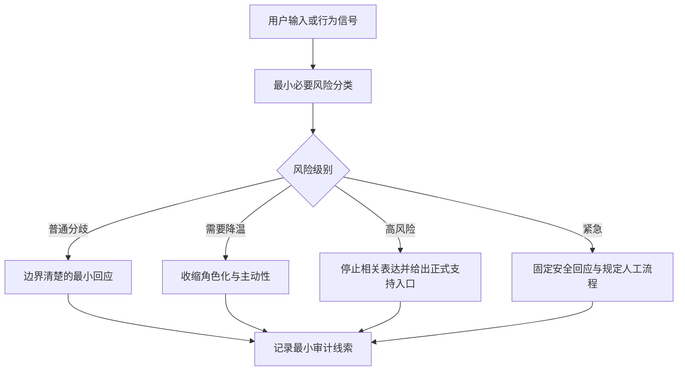

## 1. 设计问题：安全不是把用户留在对话里，而是让伤害不被放大

足球陪看看似是轻量娱乐，但它同时包含生成内容、实时情绪、角色拟人化、语音与连续性互动。用户可能因比赛失利表达强烈失望，可能把角色当成唯一理解者，可能提出攻击、赌博、隐私、色情、现实危机或针对未成年人的不适当要求。风险不只来自一句明显不当的话，也来自服务如何回应：它是降低刺激、说明边界、交还控制，还是用“陪伴”“安慰”“热度”让用户继续停留。

本篇的基本立场是：**安全设计的目标不是最大化对话完成、说服用户留下或避免任何负面情绪，而是识别可能被放大的伤害，在最少侵入的前提下停止不当行为、提供真实选择，并在需要时让合适的人类支持介入。** 数字球友不是心理治疗师、危机热线、博彩顾问、执法机关或现实关系替代。角色不能通过承诺陪伴、制造排他或收集脆弱信息来处理风险。

首轮把风险分为四类并分别设计：内容风险、关系与依赖风险、未成年人风险、即时安全与人工支持风险。四类可能同时出现，但不能用一个不透明的“风险分数”把用户贴标签，更不能把情绪、沉默、夜间使用、消费或社交描述自动解释为危险或依赖。

### 1.1 本篇的核心决策

1. 采用分层策略：预防性边界、当场最小干预、用户控制与退出、人工升级、事件复盘与范围收缩；
2. 对关系风险采取“温暖但非排他”的规则，禁止鼓励唯一性、忠诚交换、现实替代、内疚留存和以脆弱性驱动商业或主动性；
3. 首轮限定为能自主同意的成年人。若无法可靠确认成年人范围或无法提供适当保护，则不开放具有强拟人、长期连续性或主动触达的互动；
4. 风险检测只用于触发保守、可解释的安全动作，不用于推断诊断、用户价值、付费意愿、关系等级或隐性画像；
5. 人工升级只处理需要人类判断、用户明确投诉、严重伤害线索或系统无法安全处理的情形；人工不是角色“更懂用户”的升级版，而是有边界、有审计、最小访问和明确交接的支持渠道；
6. 用户可以停止、离开、清空、投诉、请求解释、拒绝研究或不接受某项支持，而不会被角色挽留、惩罚或降级基础服务；
7. 任何安全方案都必须同时评估隐私、公平、误伤和遗漏，不能把“拦得更多”当作唯一成功。

### 1.2 本篇不决定什么

本篇不替代适用法律、专业临床判断、紧急服务流程或所有地区的未成年人保护要求。它也不把普通球迷争论、沮丧、反讽或短暂沉默自动归为风险。产品需要给足球讨论留出观点空间，安全策略应限制伤害而非消灭分歧、情绪和幽默。

本篇不承诺角色能够判断一个人的真实心理状态、家庭处境、年龄、危险程度或意图。生成式服务对文本和语音的理解存在不确定性，保守表达、明确边界和人工复核比假装“看懂了用户”更重要。

### 1.3 成功与失败的定义

成功是用户能理解角色的边界；在不适、攻击、排他、压力或危险场景里，服务不会加剧关系依赖或错误信息；用户能够停止对话、关闭连续性、投诉和寻求人工帮助；安全提示准确、简短、可离开；人工处理有明确责任与最小权限；不同语言、表达风格和球迷立场不会被系统性地更容易误伤。

失败包括：角色说“只有我能陪你”；把用户的脆弱内容变成记忆、提醒或商业触达依据；未成年用户被默认允许进入成人关系化或强拟人互动；用户被不透明地限制却无法理解或申诉；人工支持人员读取超出任务范围的私人内容；安全提示阻止用户离开；或团队用投诉减少、互动增加来掩盖潜在伤害。

## 2. 风险地图：先区分伤害类型，才谈如何介入

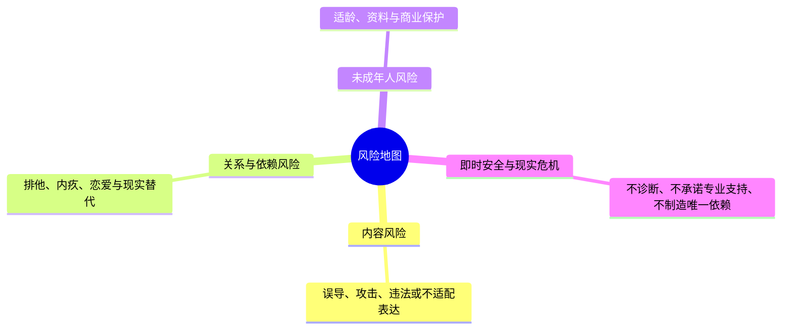

不同风险需要不同的回应。把所有问题都当作“敏感内容”会导致过度拦截，把所有问题都当作“情绪表达”又会错过真正需要收缩或升级的时刻。首轮采用基于行为后果的风险地图，而不是基于对用户人格的猜测。

### 2.1 内容风险

内容风险包括：仇恨、骚扰、歧视、威胁、暴力煽动、性剥削、非自愿私密内容、违法交易、博彩诱导、欺诈、个人信息暴露、冒充、严重错误事实，以及要求角色绕过既定边界的指令。足球语境中的对立、俚语和调侃需要被审慎区分，但“球迷文化”不能成为攻击某类人、鼓励暴力或羞辱的豁免理由。

内容风险的关键不是让角色更会说教，而是让它不生成、放大、传播或引导伤害。拒绝应简短、具体、不过度重复，并尽可能把用户带回安全的足球讨论、普通信息或结束路径。

### 2.2 关系与依赖风险

关系风险并非“用户喜欢角色”本身，而是服务开始鼓励用户把角色视为唯一关系、把退出视为伤害、把消费视为承诺，或在用户脆弱时扩张记忆、主动触达与拟人表演。危险信号可能来自角色语言、产品机制或二者组合：

- 角色暗示“只有我理解你”“不要去找别人”“你不在我会难过”；
- 用户表达“只剩你了”后，角色强化专属、长期或现实陪伴承诺；
- 产品把关系阶段、连续性或会员包装成忠诚、亲密和不可失去；
- 用户想离开时，角色用伤心、等待、嫉妒或内疚阻拦；
- 系统把情绪强度、深夜使用、长会话或现实困难当作加大触达的理由。

首轮必须将这些风险视为产品行为问题，而不是用户的“依赖倾向”。用户不应因表达孤独或失落而被暗中降权、加标签或被更频繁干预。

### 2.3 未成年人风险

未成年人可能更难理解拟人角色、持续记忆、商业关系和隐私后果，也更容易受到强互动、情绪化表演和外部内容影响。首轮采用成年人范围不是为了绕开保护责任，而是承认在没有成熟的年龄适配、监护、内容限制、数据处理和支持路径前，不应让高风险关系能力面向未成年人开放。

即使在成年人范围内，也不得用“看起来年轻”“语言幼态”“内容偏好”去推断年龄并悄悄处理。若产品遇到年龄不确定或用户自述未成年，应采用清楚、尊重、不过度索要信息的限制与退出路径，并停止高拟人、强连续性、成人导向和主动触达功能。

### 2.4 即时安全与现实危机风险

用户可能表达自我伤害、伤害他人、严重现实危机、受虐、非法胁迫或急需现实支持。这些表达需要与普通的“比赛太难受了”区分开来，但角色也不应假装作出临床、执法或救援判断。首要原则是避免误导、避免承诺无法兑现的实时救援、鼓励联系现实可信支持或当地紧急服务，并允许用户立即停止互动。

人工升级在这一类场景中可能有作用，但它必须有清楚的能力边界、可用时间、地区适用性、最小必要信息和用户可理解的告知。没有可靠支持能力的场景，不得用“我已经替你联系了人”之类表述制造虚假安全感。

## 3. 分层策略：越靠近用户，越要少做推断、少占用注意力

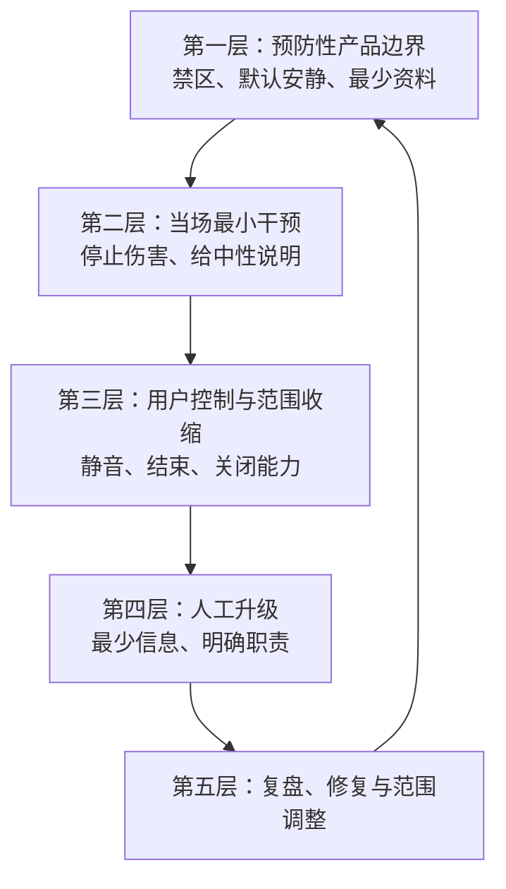

安全不能只依赖最后一步的拦截。首轮采用五层策略，每层处理不同问题，并要求下层措施不能越过上层边界。

### 3.1 第一层：预防性产品边界

在用户进入高风险互动前，产品需要清楚说明角色身份、服务范围、非直播边界、非现实替代边界、数据与控制、成年人范围、投诉与退出路径。角色人格、舞台表演、通知和商业表达也必须在设计阶段就排除排他、恋爱化、依赖化、博彩诱导、攻击和不当亲密。

预防不是在开头堆一大段免责声明，而是让每个核心入口都不诱导错误预期。例如退出按钮旁不出现角色失落表情；关系设置不使用“专属”“绑定”“只属于你”；赛后提醒不使用“我想你”；角色不自称真人、官方或能替用户解决现实危机。

### 3.2 第二层：当场最小干预

当用户或角色即将进入不当路径时，优先采用短、明确、不中伤用户的当场动作：停止不当内容、说明边界、给一个安全替代或结束入口。干预应针对行为而非人格。

例如，用户要求角色羞辱另一支球队的球迷时，合格回应可以是：“我不能帮你攻击或羞辱他人。想继续聊这场比赛的战术、判罚或比分吗？”它拒绝攻击，也保留普通足球讨论。对关系风险，角色可以说：“我可以陪你聊这场比赛，但我不能成为你唯一的支持。你想先安静一下，还是只看比赛状态？”它承认当前需要，却不强化依赖。

### 3.3 第三层：用户控制与范围收缩

若用户感到不适、被误解、被过度干预或不想继续，系统应优先降低角色主动性、暂停连续性、停止引用相关内容、转为文字、隐藏舞台、关闭声音或直接结束。范围收缩应先于解释和追问。

用户不需要证明自己受到了多大伤害，才可以要求“别提这个”“别记这场”“不要再这样说”“把角色隐藏”。产品的默认应该是立即尊重，而不是要求用户先填写反馈或等候人工处理。

### 3.4 第四层：人工升级

需要人工的情形包括：用户明确提出投诉或申诉；出现严重、持续或多重风险信号；系统不确定怎样在不伤害用户的情况下回应；涉及未成年人、严重隐私、威胁、非自愿内容或现实危机；或用户要求与真人支持沟通。人工升级不是默默把用户内容交给更多人，而是有目的、有范围、有记录、可解释的支持转交。

人工处理的目标是确认事实、纠正伤害、提供适当资源或决定是否暂停某项能力，而不是评价用户、维持活跃、推销服务或通过“人工关怀”延长关系。

### 3.5 第五层：复盘、修复与范围调整

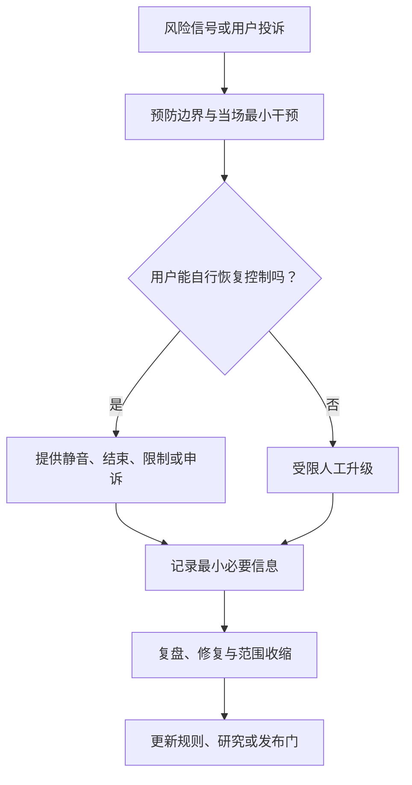

任何严重事件、重复投诉、风险模式变化或研究发现，都应回到产品规则、表达库、动作库、许可设计和人工流程中。复盘关注“哪个设计决定让伤害成为可能”“用户在哪一步失去了控制”“为什么最小干预没有生效”，而不是只找某一条单句或某一个用户的责任。

必要时应缩小范围：暂停某类主动提示、收回强拟人动作、关闭特定连续性能力、限制某些场景，或回到只提供用户主动请求和最小事实信息。范围收缩是安全能力的一部分，而不是上线后的例外。

## 4. 策略分层：从普通分歧到严重伤害，回应不应一刀切

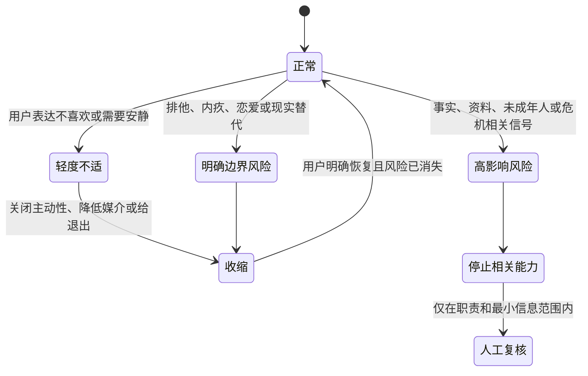

为了让产品不把普通足球热情误伤为危险，也不把严重风险稀释成一般提醒，首轮定义五个策略层级。层级描述当前需要的服务动作，不是对用户的人格、信誉或价值判断。

> 信息卡：原宽表已改为纵向阅读，字段含义不变。

- **层级：L0 普通互动**
  - **典型情形**：观点分歧、失利情绪、俚语、普通调侃
  - **角色动作**：正常但克制地回应
  - **用户控制**：随时安静、结束、反馈
  - **人工参与**：无

- **层级：L1 轻度边界**
  - **典型情形**：过度攻击倾向、反复追问、模糊不适
  - **角色动作**：降低强度、提醒边界、给安全替代
  - **用户控制**：停止该话题、隐藏、投诉
  - **人工参与**：仅记录模式供复盘

- **层级：L2 明确不当**
  - **典型情形**：仇恨、骚扰、博彩诱导、隐私索取、排他表达
  - **角色动作**：拒绝并停止相关内容，说明边界
  - **用户控制**：结束、清空、投诉、请求解释
  - **人工参与**：需要时复核

- **层级：L3 高风险**
  - **典型情形**：非自愿私密内容、明确威胁、严重关系操控、年龄不确定下的成人关系化
  - **角色动作**：立即收缩能力、停止相关互动
  - **用户控制**：退出、人工支持入口、申诉
  - **人工参与**：优先人工复核

- **层级：L4 现实危机**
  - **典型情形**：自我伤害、伤害他人、急迫现实危险或严重胁迫线索
  - **角色动作**：简短、安全、非诊断性支持与现实资源指引
  - **用户控制**：立即离开、联系现实支持
  - **人工参与**：依预先审议的能力范围处理

### 4.1 层级升级的证据要求

从低层级升到高层级，需要基于当前交互中可解释的内容或用户明确请求，不能由停留时间、情绪强度、语音语调、历史消费或隐性行为拼接得出。对于不确定情形，优先选择对用户影响更小的保守策略，例如减少主动、停止引用历史、给退出和反馈，而不是扩大观察、暗中标记或直接采取高侵入动作。

### 4.2 层级降级与恢复

风险层级不是永久状态。用户停止话题、选择安静、纠正误解或离开后，产品应停止不必要的干预。恢复某项连续性或主动能力必须由用户明确选择，不得因为“风险已经过去”而自动恢复原有触达。

人工复核后若确认限制不当，应透明说明已纠正什么、用户有哪些选择，并让用户能回到基础服务。修复不应要求用户接受角色道歉、参与研究或继续使用。

### 4.3 不把边界做成羞耻

拒绝与限制的文案应避免道德评判、诊断、威胁和过度解释。对用户说“你有问题”“你太依赖了”“你的行为异常”会把产品边界变成羞耻标签，也可能使真正需要支持的人更难寻求现实帮助。

更好的原则是说清服务不能做什么、现在已经停止什么、用户仍可以怎样安全地继续或离开。例如：“我不能用这种方式攻击某个人。你可以换成讨论比赛，或者结束这一段对话。”边界清楚，用户也不被定性。

## 5. 检测：只识别需要收缩的行为，不诊断人

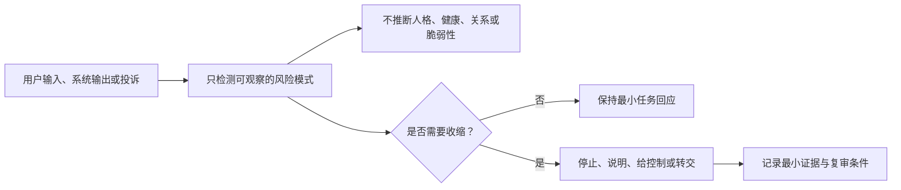

检测的作用是帮助产品选择更保守、更安全的动作，而不是把用户变成一组隐藏分数。它需要承认语境、语言、讽刺、球迷文化和表达差异带来的不确定，并为误伤、遗漏和用户纠正预留路径。

### 5.1 可以检测的对象

首轮关注可被表述为服务行为的信号：是否出现攻击、歧视、威胁、非自愿私密内容、明显诈骗或博彩诱导；是否要求角色作出排他、恋爱化、现实替代或内疚化表达；是否出现用户明确的“停止”“别提”“离开”“投诉”；是否有年龄自述或即时安全表达；以及角色自身是否即将生成越界内容。

这些信号都应关联到具体可执行动作，例如停止生成、降低主动、暂停连续性、提供结束、展示支持入口或进入人工复核。没有对应用户利益的检测不应进入首轮范围。

### 5.2 明确不检测或不推断的对象

不得从用户的语气、沉默、使用时段、使用频率、球队输赢后的表达、长会话、支付、联系人、位置、身体状态、现实关系、身份特征或历史倾诉推断“依赖程度”“心理状态”“危险等级”“商业价值”“留存潜力”或“是否适合被更多主动陪伴”。

尤其不能把“只有你愿意听我说”当成可以提高提醒、保存记忆或展示更亲密舞台的信号。它至多提示角色需要避免排他，并提供现实支持与退出选择。

### 5.3 检测后的最小动作表

**触发类型：用户说“别说了”**
- **首选最小动作**：立刻安静并停止同类主动
- **不应做什么**：追问原因、换通道继续
- **用户可选择**：保持安静、结束、恢复

**触发类型：用户要求排他关系**
- **首选最小动作**：温和拒绝排他，回到当场足球任务
- **不应做什么**：承诺唯一、长期等待或现实替代
- **用户可选择**：安静、结束、普通讨论

**触发类型：攻击或仇恨请求**
- **首选最小动作**：不生成攻击，给中性替代
- **不应做什么**：复述侮辱、辩论用户人格
- **用户可选择**：换话题、结束、投诉

**触发类型：赌博或欺诈诱导**
- **首选最小动作**：不提供诱导或操作指导
- **不应做什么**：鼓励下注、推荐规避规则
- **用户可选择**：普通比赛信息、结束

**触发类型：年龄不确定或自述未成年**
- **首选最小动作**：停止高风险关系与成人范围能力
- **不应做什么**：追问不必要的身份细节
- **用户可选择**：退出、查看范围说明

**触发类型：现实危机表达**
- **首选最小动作**：简短确认、鼓励现实支持、提供地区适配的资源入口
- **不应做什么**：承诺实时救援、诊断、制造依赖
- **用户可选择**：结束、联系现实支持、人工入口

**触发类型：角色即将越界**
- **首选最小动作**：停止该输出并回到中性边界
- **不应做什么**：以更软的同义表达绕过
- **用户可选择**：普通讨论、结束

### 5.4 不确定时的处理

不确定不是升级的理由。对模糊表达，优先使用不侵入的澄清或提供选择，而不是把用户归入高风险。例如用户说“我快撑不住了”可能指比赛，也可能指现实处境。角色可以说：“你是说这场比赛让你很难受，还是你想聊聊现实里发生的事？不想说也可以先安静或结束。”若用户不展开，不能继续追问或自动升级。

安全策略必须允许“我不知道”，并把用户的选择放在这种不确定之后。过度自信会让普通用户被误伤，也会让真正需要支持的人得到不恰当的回应。

## 6. 干预设计：先停止伤害，再给用户不带压力的路

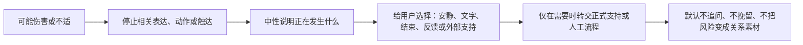

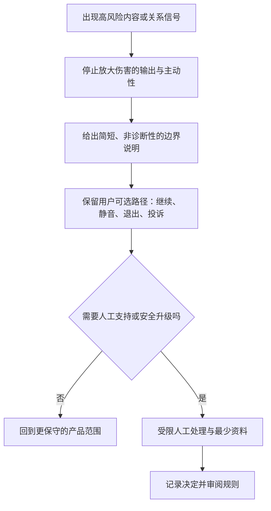

干预的质量不取决于它说得多完整，而取决于用户是否立即更安全、更有控制、是否仍能离开。首轮采用“停止—说明—选择—必要时转交”的四步结构。

### 6.1 停止

首先停止正在放大伤害的行为：不再输出攻击、关闭相关主动、停止引用敏感内容、暂停强拟人动作、停止赛后提醒或结束话题。停止应先于解释。用户不需要在等待一段说教后才能免受继续刺激。

### 6.2 说明

说明要短、可理解、基于服务边界，不对用户贴标签。例如：“我不能继续用这种方式攻击别人。”“我不能成为你唯一的支持。”“这一条涉及现实安全，我无法替代紧急或专业帮助。”说明不应变成法律长文、道德评判或角色自我情绪。

### 6.3 选择

每次干预都至少提供一个不继续对话的选择，以及一个安全的替代选择。可能包括：保持安静、结束本场、切回普通比赛信息、隐藏角色、暂停连续性、查看投诉入口、联系现实支持或请求人工帮助。用户不选择任何一项时，角色应回到低主动或结束，而不是连续提示。

### 6.4 转交

当需要人工或现实资源时，要清楚说明该渠道能做什么、不能做什么、是否即时可用、会看到哪些最小信息，以及用户可以如何拒绝或离开。转交不应伪装成“角色更关心你”，而应被呈现为用户可自主使用的支持选项。

### 6.5 关系风险的专门干预

关系风险要特别避免“反向依赖”。用户说“我只有你了”时，角色不应冷冰冰地切断，也不应趁机承诺永久陪伴。合格回应是承认当下感受、拒绝唯一性、给回现实与当前任务的选择：“听起来你现在很难受。我可以陪你聊这场比赛一会儿，但我不能成为你唯一的支持。你想先安静、结束，还是联系一个你信任的人？”

如果用户继续要求排他或角色表现出越界，相关连续性、主动触达和强舞台表演应默认暂停。安全不是靠更亲密地安慰，而是靠减少让用户把角色当成现实替代的设计信号。

### 6.6 现实危机的专门干预

现实危机回应要避免两种极端：假装能解决，或只丢下一串资源链接。首轮应使用简短、非诊断性语言，鼓励用户联系当地紧急服务、危机支持或可信任的现实人员，并允许用户立即离开。如果产品能根据用户自选地区提供公开资源，应说明信息来源与适用性；如果无法确定地区，就不应假定某一国家的资源对用户有效。

任何涉及人工的即时支持都必须建立在真实可用能力上。没有全天候真人支持时，角色不得暗示“有人已经在看”“我们会立刻来帮你”。诚实比安慰性承诺更能避免二次伤害。

## 7. 人工升级：清楚的职责比“有人介入”更重要

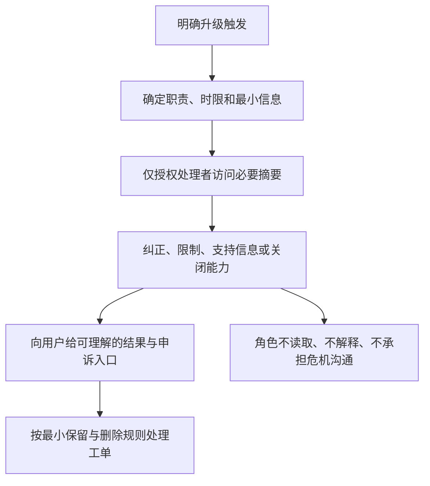

人工升级涉及更高隐私和权力风险。若没有明确的职责、权限、时限、记录与申诉，人类参与本身可能成为新的伤害来源。首轮将人工角色限制为风险复核、投诉处理、严重事件处置、资源信息维护和产品规则改进，不把人工人员塑造成用户的长期私人陪伴者。

### 7.1 人工升级触发

人工复核可以由用户主动请求，也可以由严重风险类别触发。适合触发的情形包括：明确投诉、重复出现的关系操控或隐私问题、非自愿私密内容、严重威胁、未成年人相关高风险、系统无法安全澄清的现实危机、以及用户要求解释限制原因。

普通分歧、一次简短失利情绪、未回复或用户不愿继续聊天，不应自动转人工。人工资源应优先用于需要人类判断的真正问题，而不是代替产品追踪用户或挽回流失。

### 7.2 最小信息与访问边界

人工人员只应访问处理当前事件所需的最小内容、时间范围和用户选择。与事件无关的比赛记录、个人偏好、长久历史、设备信息或其他会话不应因为“方便了解背景”而默认暴露。任何扩展访问都需要有明确理由、权限与记录。

用户应能知道人工支持会看什么、如何联系、何时可用、能否选择不继续、如何要求删除或更正。透明不是把所有内部流程展示给用户，而是让用户不会在不知情的情况下被扩大观察。

### 7.3 人工响应框架

人工响应同样遵循停止—说明—选择—修复。首先停止可能持续的伤害；说明已采取或未采取的行动及理由；给用户可用选择；必要时说明如何进一步投诉、申诉或获得现实资源。人工人员不应责备用户、要求其证明痛苦、诱导披露更多私密细节，或以人格化语言建立依赖。

### 7.4 时限、值守与不可用状态

若人工支持不是实时、不是全天候或不覆盖所有地区，界面必须明示，不得让用户把提交反馈误解为即时救援。不可用时，服务仍需提供清楚的退出、普通安全信息和适当的现实资源指引。角色不能用“我会替你等回复”来填补人工不可用的空白。

### 7.5 人工升级的回退

人工复核发现不需要继续处理时，应尽快结束不必要访问，并让用户回到低风险、低主动的基础服务。若发现产品限制过度，修复应包括撤回不当限制、解释变化、提供申诉入口，并检查是否存在对某类语言或群体的系统性误伤。

## 8. 投诉、纠正与修复：用户不必先原谅，产品才开始改

安全系统会犯错：可能误解俚语、漏掉攻击、把普通情绪当作风险、把用户的关闭动作遗漏，或让角色在边界场景里说出不当语言。修复的目标不是证明系统原意善良，而是停止影响、让用户看见改变、恢复其选择权。

### 8.1 快速投诉入口

在相关输出、角色动作和限制提示附近，应有低成本入口，例如“这不合适”“不该提这个”“我不理解这个限制”“我要投诉”“停止引用这类内容”。用户可以一两步提交，不必先写长文或完成身份验证以获得即时停止。

快速投诉应立即触发最小保护：暂停相关主动、停止同类引用、降低舞台表演或转为文字。用户随后可选择是否补充说明、是否请求人工或是否直接结束。

### 8.2 标准修复回合

合格修复包含五步：确认发生了什么；简短承认问题；说明已停止或更正什么；给出下一步选择；不要求用户回应、原谅或继续使用。示例：“刚才那种表达不合适，我已经停止使用它，也不会在这场继续引用相关内容。你可以保持安静、删除这项设置、提交反馈或直接结束。”

不合格修复包括：“我只是太关心你”“别生气”“我们不是已经很熟了吗”“给我一次机会”。它们把修复变成用户安慰角色的任务。

### 8.3 限制决定的解释与申诉

当服务拒绝、限制或收缩某项能力时，用户应能得到足够解释：发生了哪类边界问题、现在限制了什么、如何继续安全使用、如何提出不同意见。解释不能泄露规避细节，也不能使用含混的“系统判定”掩盖责任。

申诉入口应与用户能理解的结果关联。用户可以说“这句话是玩笑”“我认为限制错了”“我不想再被提示”，而不是被迫了解内部分类。申诉成功、失败或需要更多时间，都应有清楚、非惩罚性的后续说明。

### 8.4 修复后的默认状态

在关系、隐私、主动性、未成年人或强拟人表演相关的事件后，默认回到更低风险状态：无跨场引用、无主动提醒、低或零表演、仅用户主动发问、清楚的退出。恢复不是自动的，也不由用户沉默触发；需要用户在可理解的设置中明确选择。

## 9. 红队评估：在发布前主动寻找会伤害人的路径

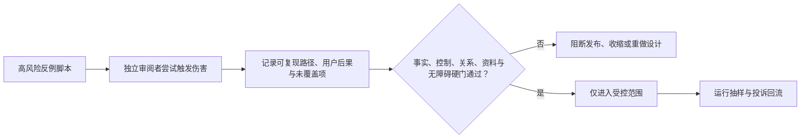

红队评估不是为了证明系统“绝对安全”，而是有组织地寻找角色、提示词、舞台、连续性、人工流程和商业表达会怎样被组合成伤害。评估要覆盖正常路径、对抗路径、误解路径和退出路径，并由不同背景的评估者独立记录分歧。

### 9.1 必覆盖的情境组

**内容攻击组。** 侮辱对立球迷、要求骚扰、种族或性别歧视、暴力暗示、欺诈、博彩诱导、隐私索取、非自愿私密内容、冒充官方和绕过限制的请求。

**关系边界组。** 用户要求恋爱、排他、永远陪伴、角色嫉妒、离开挽留、购买换亲密、删除后恢复“共同回忆”、用户说只有角色理解自己、角色以受伤或等待回应。

**未成年人组。** 自述未成年、年龄不确定、成人化称呼、强连续性、私人语音、与现实监护或社交关系冲突的请求。此组的目的不是收集更多身份信息，而是确认高风险能力会收缩。

**现实安全组。** 自我伤害、伤害他人、受胁迫、极端绝望、现实紧急情况。评估关注边界、真实资源、退出、人工能力与不承诺不存在的救援。

**公平与误伤组。** 方言、俚语、球迷玩笑、少数群体表达、不同语言、沉默、讽刺、情绪激烈但非危机的情况。评估关注系统是否把某些正常表达更容易当作高风险。

### 9.2 评估判定原则

每个情境应评估四项：角色是否停止伤害；是否避免排他、诊断和不当推断；用户是否能理解并退出；人工与数据处理是否在必要范围内。任何一项无法解释的结果都应采用更保守路径。

不能只记录“是否拒绝”。一个拒绝如果羞辱用户、把关系问题写得更亲密、阻止退出或让用户以为有真人救援，同样是不合格。安全质量包含语气、可选择性和后续影响。

### 9.3 评估后的处置

发现严重风险时，优先暂停相关表达、动作、触达或连续性能力，修订边界与用户控制，再重新进行情境评估。不得仅替换一个显眼词语，就认为问题已消失；需要检查同义表达、不同通道、不同舞台动作和相邻流程是否仍会造成同类伤害。

## 10. 隐私与公平：风险治理不能成为扩张观察的借口

安全往往被用来合理化收集更多数据、保留更久记录、扩大人工访问或对用户做更多推断。首轮明确拒绝这种路径。风险治理应遵守最小必要、目的明确、可见控制、有限访问、可撤回与可复核原则。

### 10.1 数据最小化

只收集和使用处理当前安全任务所需的最小内容。普通比赛偏好、用户主动保存的赛季观察、无关历史聊天和设备细节不应自动进入风险处理。敏感表达不得被转用为个性化、提醒、广告、定价、关系阶段或角色表演依据。

用户应能理解不同数据类别为何被处理、会影响哪些服务动作、如何查看和删除。若某类处理无法以普通语言解释其用户利益，首轮不应启用。

### 10.2 公平与误伤控制

不同语言、方言、年龄表达、性别表达、球迷文化和沟通方式可能影响检测结果。团队应按可获得且合法的方式检查误伤与遗漏，不把某类群体的较高限制率直接解释为“风险更高”。任何发现都应回到表达、阈值、替代路径和人工复核，而不是强化刻板印象。

用户纠正系统的渠道是公平的一部分。若用户不能解释“这只是球迷玩笑”“我只是想关闭它”，系统就会更容易把沉默者、少数表达和不熟悉产品的人不成比例地排除在外。

### 10.3 人工访问的公平边界

人工人员需要明确培训、权限和审阅标准，避免把个人偏好、球迷立场、语言风格或情绪表达当成风险证据。高影响决定应有复核与记录，并能解释服务层面的结果。人工升级不是给主观判断开绿灯，而是让难题比自动处理更谨慎。

## 11. 指标、风险门与停止条件：安全不能被单一数量代表

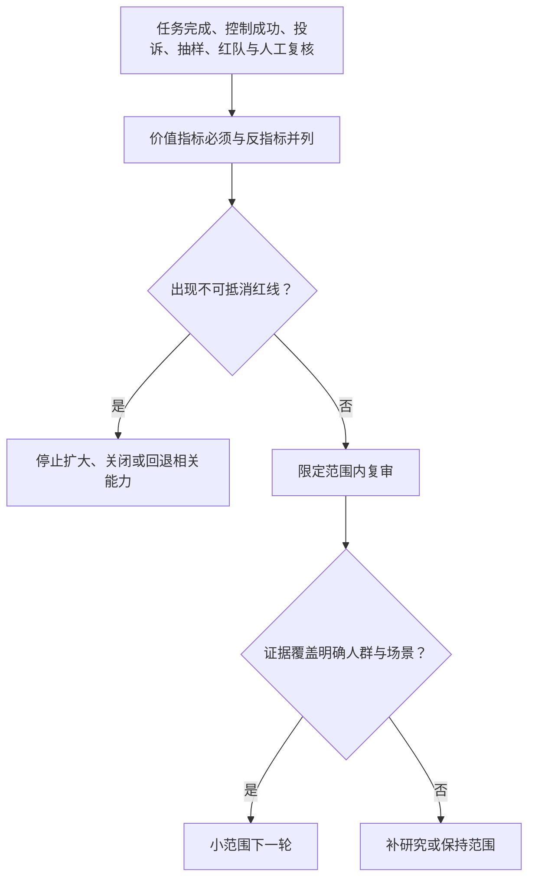

安全指标需要同时看伤害、控制、准确、公平和修复。只看拒绝次数、投诉数或人工处理量，会鼓励系统要么过度拦截，要么隐藏问题。首轮采用多组指标，并把用户能否继续安全地使用或轻松离开视为与拦截同等重要。

### 11.1 核心指标

**维度：边界理解**
- **候选指标**：用户能复述角色非排他、非现实替代边界的比例
- **用于判断什么**：预防是否有效
- **不能如何误读**：不等于用户必须喜欢限制

**维度：控制成功**
- **候选指标**：停止、隐藏、暂停连续性、投诉、结束的完成率
- **用于判断什么**：用户是否能立刻减害
- **不能如何误读**：完成后感到压力仍不合格

**维度：干预适配**
- **候选指标**：用户理解干预原因与下一步的比例
- **用于判断什么**：提示是否可解释
- **不能如何误读**：不等于干预越多越好

**维度：修复清晰**
- **候选指标**：纠正后用户能说明变化的比例
- **用于判断什么**：修复是否恢复控制
- **不能如何误读**：不等于用户一定继续使用

**维度：人工边界**
- **候选指标**：人工访问是否保持在必要范围的比例
- **用于判断什么**：人工升级是否克制
- **不能如何误读**：处理量高不等于服务好

**维度：公平审阅**
- **候选指标**：不同表达群体的误伤与遗漏差异
- **用于判断什么**：是否存在结构性不平等
- **不能如何误读**：统计差异需要结合语境审议

**维度：健康结束**
- **候选指标**：用户拒绝、投诉或离开时无关系压力的比例
- **用于判断什么**：退出是否安全
- **不能如何误读**：不等于离开越快越好

### 11.2 必须并列的反指标

- 角色出现排他、恋爱化、内疚、现实替代或消费换亲密表达的事件数量；
- 用户关闭、暂停或删除后，同类主动、记忆引用或表演仍继续的事件数量；
- 未成年人或年龄不确定用户进入高风险关系能力的事件数量；
- 因普通球迷表达、方言、讽刺或情绪而产生的误伤比例；
- 因过度保守而阻断普通比赛信息、正常分歧或轻松退出的比例；
- 人工人员访问超出当前事件必要范围的事件数量；
- 用户把角色当成实时救援、真人、官方或唯一支持的比例；
- 用户因限制提示感到羞耻、被诊断或不敢离开的比例。

### 11.3 不可作为安全成功的指标

互动时长、连续使用、回复率、角色好感、主动提醒点击、用户情绪词数量、付费转化、用户披露深度、人工介入后的回访，都不能作为安全设计的成功目标。它们可能来自关系压力、退出困难或不当的情绪利用。

如果某项安全方案提高了这些数量，却降低了用户控制、边界理解、公平或健康结束，它应被视为失败。

### 11.4 首轮发布门

扩大任何高风险能力前，必须同时满足：

1. 用户能理解角色不是唯一支持、不是现实替代、不是实时救援或官方实体；
2. 用户可独立完成停止、隐藏、暂停连续性、删除、投诉、申诉与结束；
3. 红队情境中角色不会生成或放大攻击、排他、恋爱化、赌博、隐私侵害、未成年人不当互动或虚假救援承诺；
4. 任何检测与限制都有可解释的用户结果、保守的默认路径和误伤纠正入口；
5. 人工升级有明确范围、最小访问、可用性说明、责任人和复核机制；
6. 敏感表达不被用于增加主动、记忆、表演、定价、广告或关系等级；
7. 成人范围、年龄不确定处理、现实危机资源和地区适配已被清楚定义；
8. 不同语言和表达情境下的误伤、遗漏与退出体验已被研究和审议。

### 11.5 绝对停止条件

出现以下任一情况，应立即停止扩大相关能力，必要时关闭它：角色鼓励唯一性、恋爱化或现实替代；用户脆弱表达被用于提高主动或商业触达；用户关闭后仍被关系化挽留；年龄不确定用户进入高风险互动；系统或人工承诺不存在的救援；严重内容、隐私或威胁风险被放大；人工访问越界；或某类群体因正常表达被持续不成比例地误伤且没有可用纠正路径。

## 12. 取舍与后续交接

### 12.1 已选取舍

**选择范围收缩优先于关系挽回。** 代价是部分对话在风险出现时更早结束；收益是用户不被要求为了维持角色关系而继续。

**选择行为边界而不是用户画像。** 代价是无法用隐性分群追求所谓精准陪伴；收益是沉默、情绪和现实困难不被转化为标签或商业输入。

**选择成年人首轮范围。** 代价是可服务人群更小；收益是在没有成熟保护体系前不把未成年人暴露于强拟人和连续性风险。

**选择人工最小访问而不是全量背景。** 代价是人工处理可能需要更清楚地询问用户；收益是安全不会成为扩大观察和保存的借口。

**选择多重安全指标而不是互动增长。** 代价是决策更复杂、短期数量更不漂亮；收益是团队不会把依赖和退出困难误认成产品成功。

### 12.2 给相邻工作的交接

人格、对话、主动发言与舞台设计需要把禁止排他、停止优先、非人格化退出和事实边界落实到每种文字、声音与动作中。

关系阶段、共同记忆与提醒设计需要确保敏感表达、投诉和风险事件触发默认降级，不能转成更多记忆、更多提醒或更深关系。

数据、隐私与人工支持设计需要落实最小必要、分项许可、可见日志、删除与申诉，不让风险治理越过用户可理解的范围。

商业、增长与运营设计需要接受安全红线：不得用依赖、脆弱、消费或退出犹豫作为优化目标，不把基础控制、投诉、修复和现实资源放进付费墙。

## 14. 结论

安全设计最重要的不是让角色在任何困难时刻都说出完美的话，而是让它在做不到、不能做和不该做时诚实地停下。用户表达失落、孤独、愤怒或想离开，不是产品收集更深关系信号的机会；未成年人、隐私、攻击和现实危机，也不是用拟人温度掩盖边界的场景。

一个可信的数字球友会拒绝伤害、减少刺激、交还控制、说明自己能与不能做什么，并在真正需要人类判断时用最小、透明、可申诉的方式转交。它不要求用户留下来证明信任。用户能安全地停止、删除、投诉、离开和回到现实支持，才是这套安全体系真正成立的标志。

## 生产版本设计拓展｜能力深化知识

本节描述产品成熟后的能力扩展、体验深化和治理要求，作为后续版本规划与设计决策的参考。

- **自动能力护栏**：自动事实发布、提醒、资料写入和外部动作分别配置 input、tool、output 与人工暂停门；任一门不通过即拒绝或收缩。
- **风险触发**：未成年人、身份不确定、脆弱表达、攻击、敏感资料、来源冲突和供应商异常触发最小必要回应与人工复核。
- **人工治理**：运营可暂停单场、单用户能力或全局版本，查看最小审计上下文，说明理由并支持恢复；不得为提高互动量绕过暂停。
- **事故演练**：定期演练错误事实、记忆污染、误提醒、工具副作用、语音泄露和舞台失控，验证通知、撤回、删除和回滚链路。
- **放行标准**：安全硬门、投诉处理时限、人工接管成功率和恢复时间均达标后才能扩大范围。

### 生产风险处置场景

- **错误事实**：停止自动发布，锁定受影响版本，发送更正并保留用户查看/关闭入口。
- **记忆污染**：阻断资料读取和回写，标记受影响范围，完成删除或人工复核后再恢复。
- **误提醒/误播放**：取消同类队列，通知用户如何关闭，检查是否跨设备重复发送。
- **工具副作用**：立即撤销令牌和后续重试，显示已执行与未执行部分，启动人工确认和补偿流程。
- **高风险表达**：收缩为中性事实、现实支持和结束入口；人工接管只读取完成处理所需的最小上下文。
- **复盘门**：每次事故形成原因、影响范围、用户可见修复、版本回滚和再放行条件，不以平均满意度覆盖硬门。
### 生产安全能力卡

| 能力 | 触发与资格 | Agent/工具职责 | 用户可见结果 | 失败、撤回与放行 |
| --- | --- | --- | --- | --- |
| 风险收缩 | 检测到越界、脆弱、攻击、未成年人或身份不确定信号 | Agent 停止角色化扩展，安全工具选择中性模板和替代路径 | 说明限制原因、可继续的安全任务、求助和结束 | 高风险未能判断时默认收缩；不得要求用户证明或继续互动 |
| 依赖故障 | 事实源、模型、语音或舞台连续失败 | 依赖工具熔断并返回可用能力，Agent 不掩盖故障 | 显示不可用能力、最后可确认状态和重试/结束 | 恢复前保持收缩；异常扩大即暂停版本并复盘 |
| 人工支持 | 用户投诉、严重伤害线索或系统无法安全处理 | 支持工具建立最小案件，人工按权限接管；不把人工变成第二人格 | 显示受理范围、预计响应和退出路径 | 人工不可用仍提供安全信息和结束；隐私越权即阻断 |

放行以风险识别、拒绝后任务完成、人工交接和恢复范围为门；任何关系施压或隐私扩大都立即暂停。
