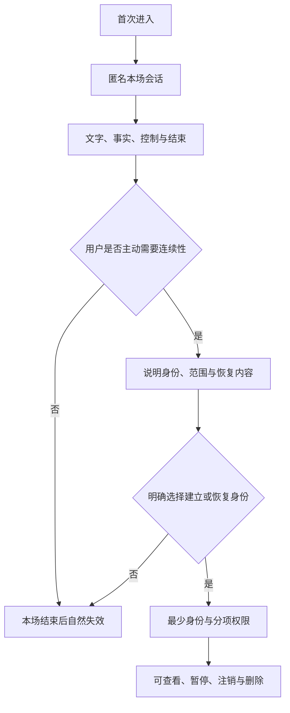
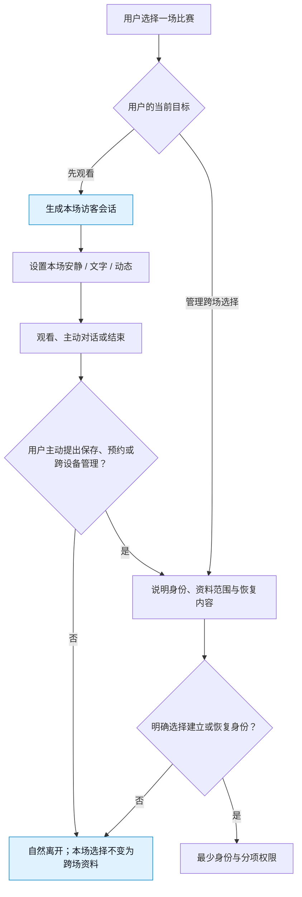
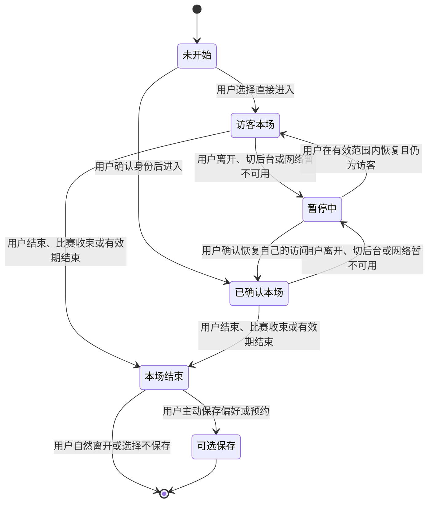

# 匿名身份、权限与会话设计

> 文档类型：0→1 面向用户的身份、访问、会话与资料边界设计  
> 适用阶段：用户需要先低门槛体验一场陪看，同时逐步验证哪些连续能力值得由用户主动开启  
> 版本：0.1（身份路径、保留期限、权限文案、设备策略与风险阈值均为待验证假设）  
> 研究信息截止：2026-01-28  
> 核心原则：先让用户在最少披露下完成一场基础陪看；只有当用户清楚看到额外价值、范围和退出方式时，才邀请其选择跨场身份、资料或设备连续性。身份不是关系绑定，登录不是无限授权，会话结束也不应留下无法解释的追踪。

---

## 1. 问题定义：低门槛体验与可控连续性不能互相牺牲

用户第一次进入足球陪看时，往往只想快速看一场比赛、确认比分、听一句短分析或体验角色反应。他们未必愿意先提交手机号、社交账号、通讯录、位置、头像或大量个人资料。若产品把注册墙放在比赛入口前，会损失原本想试用的人；若产品以“匿名”为名持续留存全部会话、自动跨设备追踪或把一次访问变成长久关系，又会违背用户对低风险试用的理解。

另一方面，真正由用户认可的连续能力需要一个稳定且可管理的身份基础：用户才能在下一场沿用文字优先、查看自己保存的共同瞬间、取消一场预约、删除资料或确认共享设备不会显示自己的内容。因此，设计目标不是在“完全匿名”和“强制注册”之间二选一，而是给用户一条从本场最少身份到明确选择连续性的渐进路径。

候选结果是：

> 用户可先以最少身份进入单场陪看，并清楚知道哪些能力只限本场；需要跨场偏好、预约、资料管理或设备连续时，可主动选择更稳定的身份方式；每一级权限均可查看、缩小、撤回或结束，且在共享设备、设备遗失、会话异常和滥用情境中优先保护用户与他人的资料边界。

### 1.1 不把匿名说得超过它的实际范围

“匿名”在本设计中表示：用户无需先提交直接联系方式或创建公开个人档案，也可使用基础陪看；它不等于任何网络服务都不处理必要的会话安全信息，也不等于用户可以无条件获得所有跨场能力。产品必须用准确、简短的话说明范围：

```text
你可以先不注册，直接用本场陪看。
本场结束后，临时选择默认不会变成跨场偏好。
如要在下次继续使用某项选择、管理提醒或查看已保存资料，你可以主动选择创建可管理的身份。
```

不能使用“永远不留任何记录”“绝对不会识别你”“注册后角色才会真正陪你”一类承诺。前者通常不可被用户验证且可能不准确；后者把服务价值和关系压力捆绑在注册上。

### 1.2 非目标

- 不要求用户为了看一场比赛、进入安静模式、阅读事实状态或结束本场而先注册；
- 不将匿名访问、设备标识、网络信号、原始语音、观看时长或沉默自动拼接成跨场人格档案；
- 不将手机号、社交账号、联系人、精确位置、照片、年龄细节或真实姓名作为陪看基础能力的默认前提；
- 不把“登录后更懂你”“只有账号用户才算老球友”作为情感化注册诱导；
- 不因为用户注销、删除资料、切换设备或长期未使用而以角色名义追问、召回或挽留；
- 不在共享设备、投屏、大屏或他人可见环境中自动展示跨场偏好、共同瞬间或预约详情；
- 不赋予用户直接改变公共赛事状态、他人资料或运营性内容的权力；
- 不将一次性会话的便利与永久可识别、无限期保留或难以撤回绑定。

---

## 2. 身份模型：把“谁在使用”与“可做什么”分开

身份模型至少区分主体、会话、资料范围和权限四件事。用户看到的“我是匿名使用者”“我已登录”“这是共享设备”是可理解的状态；服务内部不应把这些状态偷换为亲密程度、价值分级或永久可信度。

### 2.1 主体层级

> 信息卡：原宽表已改为纵向阅读，字段含义不变。

- **身份层级：访客会话**
  - **用户能完成什么**：单场进入、看状态、主动对话、本场控制、结束
  - **默认资料范围**：本场必要上下文与安全所需最少会话信息
  - **用户看见的说明**：“本场访客模式；结束后不会自动形成跨场偏好”
  - **不拥有的能力**：跨设备连续、长期资料管理、预约恢复

- **身份层级：已确认身份**
  - **用户能完成什么**：管理自己主动保存的偏好、单场预约、删除与跨设备恢复
  - **默认资料范围**：用户明确选择的资料与必要的账户安全信息
  - **用户看见的说明**：“你可在资料中心查看、修改或删除这些选择”
  - **不拥有的能力**：他人资料、公共事实修改、默认无限权限

- **身份层级：受限共享模式**
  - **用户能完成什么**：在别人可见设备上使用本场功能
  - **默认资料范围**：只保留本场低敏感状态
  - **用户看见的说明**：“共享显示已开启；跨场资料和私人摘要默认隐藏”
  - **不拥有的能力**：自动呈现共同瞬间、私人提醒正文、资料编辑

- **身份层级：受支持恢复状态**
  - **用户能完成什么**：用户正在恢复访问、处理异常或重新确认身份
  - **默认资料范围**：仅完成恢复所需最小信息
  - **用户看见的说明**：“请确认这是你的访问；恢复前不会展示私人资料”
  - **不拥有的能力**：直接显示旧资料或恢复高风险操作

“已确认身份”不等于用户必须公开姓名。产品可以提供多种适合当地规则、设备能力和用户选择的确认方式；无论具体方式如何，界面都要把它解释为“让你管理自己的资料和选择”，而非“证明你对角色更重要”。

### 2.2 资料域分离

> 信息卡：原宽表已改为纵向阅读，字段含义不变。

- **资料域：本场域**
  - **包含什么**：当前比赛、临时声音/动态/密度选择、当场对话必要上下文
  - **谁可以看到**：当前会话中的用户
  - **用户可控制什么**：改变、暂停、结束本场
  - **禁止混入**：自动跨场偏好、关系判断

- **资料域：个人偏好域**
  - **包含什么**：用户明确保存的文字优先、解释长度、关注范围
  - **谁可以看到**：已确认身份下的本人
  - **用户可控制什么**：查看、改写、暂停、删除
  - **禁止混入**：原始语音、情绪画像、第三方内容

- **资料域：预约域**
  - **包含什么**：用户指定比赛、提醒时间和许可
  - **谁可以看到**：已确认身份下的本人
  - **用户可控制什么**：改时间、取消单场、关闭全部
  - **禁止混入**：由历史行为推导的催回计划

- **资料域：共同瞬间域**
  - **包含什么**：用户主动保存的比赛相关简短摘要
  - **谁可以看到**：已确认身份下的本人，除非用户主动分享
  - **用户可控制什么**：查看、改写、暂停、删除
  - **禁止混入**：角色私有叙事、用户脆弱资料

- **资料域：安全与支持域**
  - **包含什么**：防止滥用、处理异常、保护访问所需的最少记录
  - **谁可以看到**：受严格限制的支持流程
  - **用户可控制什么**：了解基本用途、请求删除或帮助
  - **禁止混入**：用于角色个性化、商业画像

分离的关键是用途边界，而不只是页面分组。本场域中的一段对话不能因为内容有趣就自动进入共同瞬间域；安全域的信号不能被用来提高角色主动性；预约域也不能被用来推断用户对某支球队的长期情感。

### 2.3 用户可见身份标识

比赛房间只需低打扰地显示当前模式，例如“访客本场”“已登录”“共享显示”。用户点开后可以看到三件事：本场会保留到何时、哪些内容不会跨场、若希望管理连续资料可做什么。不要将身份状态做成可炫耀的徽章、等级、连续天数或角色亲密度。

---

## 3. 匿名进入与注册路径



### 3.1 访客优先的进入流程



访客入口不应故意变小、使用贬义文案或被放在注册按钮之后。访客在本场拥有事实、控制、对话和结束能力；差异只在于那些天然需要跨场可管理主体的功能，例如用户希望下次继续使用一项偏好、跨设备查看自己主动保存的资料或取消未来提醒。

### 3.2 何时可以邀请建立稳定身份

身份邀请必须由用户任务触发，而不是由停留时间、活跃度、角色“舍不得”或商业目标触发。

| 用户主动任务 | 合格邀请 | 不合格邀请 |
|---|---|---|
| 想把“仅文字”延续到下次 | “如要下次默认仅文字，可选择保存这一项；你也可只用于本场。” | “注册后她才会记得你。” |
| 想预约一场比赛 | “预约需要一个可管理的身份，便于你随时取消。” | “留下联系方式，让她准时叫你回来。” |
| 想查看/删除已保存资料 | “请确认身份后打开你的资料中心。” | “不登录就失去你们的回忆。” |
| 换设备继续本场 | “确认身份后可恢复你自己的本场选择。” | “别让她在另一台设备找不到你。” |
| 遇到安全异常 | “为保护你的资料，需要确认这次访问。” | “我们不信任你，请证明你是谁。” |

用户选择“现在不需要”后，继续完成原来的本场任务；不得在同一次流程中以另一个按钮、不同文案或角色对话再次施压。拒绝建立身份是有效选择，不是需要被转化的漏斗节点。

### 3.3 渐进式资料填写

稳定身份只请求完成当前任务所需的信息。若用户只是想保存文字优先，不需要头像、球队立场、生日、联系人或个人介绍；若只是预约一场比赛，也不需要证明其足球知识或说明为什么想看。每一项额外资料都应说明“用于什么、是否必须、怎样删除”。

**请求类别：身份恢复方式**
- **可接受前提**：用户要跨设备管理自己的资料
- **用户选择**：选择一种合适方式、稍后再说
- **不可接受做法**：强制绑定多个外部账户

**请求类别：显示名称**
- **可接受前提**：用户主动希望在设备上有称呼
- **用户选择**：填写、跳过、以后改
- **不可接受做法**：默认使用真实姓名或从外部资料导入

**请求类别：通知许可**
- **可接受前提**：用户预约明确比赛
- **用户选择**：逐场开启、随时关闭
- **不可接受做法**：用账户创建视为允许所有提醒

**请求类别：跨场偏好**
- **可接受前提**：用户主动要求减少重复设置
- **用户选择**：逐项保存或仅本场
- **不可接受做法**：把注册过程中的选择全部永久保存

---

## 4. 权限与最小披露

### 4.1 权限不是一次性总同意

用户对声音、提醒、资料保存、跨设备恢复和共享显示的选择彼此独立。一个通用的“允许全部”会让用户无法理解后来为什么出现声音、资料或提醒，也使撤回变得困难。权限请求应在使用前、任务相关时出现，使用用户熟悉的语言说明结果。

**权限/许可：麦克风**
- **请求时机**：用户主动点按语音输入
- **必须说明**：仅用于本次说话输入；可继续用文字
- **拒绝后的体验**：文字对话与比赛状态仍可用

**权限/许可：声音播放**
- **请求时机**：用户选择自动声音或点按播放
- **必须说明**：会以何种方式播放、怎样关闭
- **拒绝后的体验**：字幕完整可用

**权限/许可：通知**
- **请求时机**：用户预约指定比赛
- **必须说明**：哪一场、何时、怎样取消
- **拒绝后的体验**：仍可手动查看赛程

**权限/许可：跨场偏好**
- **请求时机**：用户主动选择“下次也这样”
- **必须说明**：保存内容、用途、范围、修改和删除
- **拒绝后的体验**：本场选择继续生效直到结束

**权限/许可：资料恢复**
- **请求时机**：用户主动换设备或打开资料中心
- **必须说明**：用于确认本人和保护私人资料
- **拒绝后的体验**：保持访客本场，不展示私人内容

**权限/许可：共享显示**
- **请求时机**：用户主动投屏或与他人同看
- **必须说明**：哪些资料会隐藏、声音如何处理
- **拒绝后的体验**：仍可使用个人设备的基础控制

请求不能用“为了更懂你”“为了让她更有感情”说明。用户授权的是一项具体功能，不是在同意被持续分析。

### 4.2 最小披露原则

每次显示资料前都问三个问题：这次任务真的需要它吗？此刻由谁能看到屏幕？用户能否一眼解释为什么出现？任意答案不清楚，就不显示或改为用户主动打开。

| 情境 | 最小披露 | 不应披露 |
|---|---|---|
| 进入共享显示 | 本场比赛、最少控制、公开事实状态 | 共同瞬间、个人偏好、提醒内容、显示名称 |
| 锁屏提醒 | 比赛将开始与关闭入口 | 用户历史、角色化称呼、私人摘要 |
| 恢复访问 | “需要确认身份后显示你的资料” | 旧偏好、对话或保存内容预览 |
| 用户主动打开资料中心 | 用户自己选择的条目及其用途 | 系统推断、第三方资料、无关日志 |
| 角色引用偏好 | 一条与当前任务直接相关的可见默认 | “我一直观察到你……”式推断 |

### 4.3 权限状态的可见反馈

用户在控制中心应能看到“声音：仅文字”“通知：已关闭”“跨场偏好：2 项”“共享显示：本场开启”等可理解摘要。每项状态旁边提供改变或了解更多入口；不要把关键信息只放在系统权限弹窗中，然后让用户以后无从查找。

---

## 5. 会话生命周期与自然结束

会话不是用户和角色的关系线。它是一次可开始、暂停、恢复或结束的服务上下文。生命周期设计的目标是让用户知道本场什么还有效、什么时候自动收束、离开后哪些资料不会继续使用，而不是尽量避免会话结束。

### 5.1 状态机



状态转移要向用户传达结果：暂时离开不等于角色在等待；本场结束不等于已保存历史；恢复访问前若无法确认本人，则宁可回到访客本场，也不自动展示私人资料。

### 5.2 会话时间与范围

| 生命周期节点 | 用户可预期的行为 | 资料边界 |
|---|---|---|
| 开始本场 | 选择本场呈现方式，知道当前身份状态 | 临时选择只在本场有效，除非主动保存 |
| 暂停/后台 | 停止非必要自动表现，必要时提示恢复状态 | 不因后台停留而增加资料或触达 |
| 恢复 | 显示本场仍有效的内容与可能的延迟说明 | 不重播过期反应，不绕过安静选择 |
| 结束本场 | 停止角色声音、动作和自动表达 | 临时资料按说明收束；跨场资料仅限用户已确认保存 |
| 长时间未使用 | 不主动以关系语言触达 | 不扩大旧偏好用途，不把沉默当许可 |

具体时长应由安全、隐私与用户研究共同确定，但界面必须避免“你离开了多久”“她等了你多久”的叙事。用户重新进入时自然接续当前比赛任务即可。

### 5.3 多标签与并发会话

同一用户可能在手机与电脑之间切换，也可能误开两个页面。首轮应把这视为需要保护用户控制的一般情况，而不是“一个人是否忠诚”的问题。新的本场选择应以用户最近的明确操作为准；若两个场景都在播放声音或显示不同资料，应以可见提示让用户选择保留哪一个，而不能静默让一端覆盖另一端。

并发场景尤其要保护结束与删除：用户在设备 A 结束本场后，设备 B 不应继续自动发言；用户在任一设备删除一项资料后，其它恢复路径不得再显示该条资料。若短时间内无法确认同步结果，应保守停止跨设备召回，并向用户说明“正在更新你的选择”。

---

## 6. 访问控制与操作分级

访问控制不是把所有按钮都加一道确认，而是按伤害范围决定何时需要更清楚的身份确认、何时只需本场操作、何时应完全禁止。

### 6.1 操作分级表

**级别：A 本场低风险**
- **典型操作**：改安静、仅文字、低动态、看公开比赛状态、结束
- **需要什么**：当前会话
- **用户体验要求**：不要求额外身份，不打断观看

**级别：B 本场可逆**
- **典型操作**：展开分析、点按语音、暂时恢复自动表达
- **需要什么**：当前会话与用户明确动作
- **用户体验要求**：立即可撤回，结果清楚

**级别：C 个人资料**
- **典型操作**：保存跨场偏好、查看/改写共同瞬间、管理预约
- **需要什么**：已确认身份
- **用户体验要求**：显示用途、范围、修改/暂停/删除

**级别：D 高影响个人操作**
- **典型操作**：删除全部资料、改变恢复方式、导出个人资料、关闭所有提醒
- **需要什么**：更强的本人确认与明确复核
- **用户体验要求**：说明影响，不设置关系化阻碍

**级别：E 非本人或公共影响**
- **典型操作**：改变他人资料、改变公共比赛状态、查看受限安全资料
- **需要什么**：用户端不提供
- **用户体验要求**：明确不给此类权限，而非提示用户去“试试”

“更强确认”应在用户即将做高影响操作时出现，而不是每次进入都要求重复输入。它的语言应说明保护目的：“为防止他人在共享设备上删除你的资料，需要确认这次操作”，而不是暗示系统怀疑用户或用角色名义请求证明。

### 6.2 最小权限与可撤回

用户一旦授权声音、通知或跨场偏好，仍可在本场和控制中心降低范围。权限不应从“开”变为“永久开”；高影响操作不应因用户曾经登录而失去再次确认。以下动作必须可撤回：关闭自动声音、取消提醒、暂停偏好、删除共同瞬间、退出共享显示、结束其它已知本场会话、注销身份。

撤回后，界面要明确告知“什么已停止、什么仍保留、下一场会怎样”。若用户删除一条资料，不能只显示短暂提示后让角色下次仍引用；若用户关闭提醒，也不能以更显眼的比赛入口代替通知催回。

---

## 7. 跨设备与共享设备

### 7.1 设备连续性由用户发起

跨设备的正确承诺是“让你管理自己的资料和本场选择”，不是“无论在哪儿我们都认得你”。用户在新设备上主动选择恢复时，先显示必要的身份确认和即将恢复的范围；可选择只恢复本场控制、不显示跨场资料，或先以访客模式进入。

**场景：新设备第一次进入**
- **保守默认**：访客本场，不展示私人资料
- **用户可选动作**：确认身份、只恢复本场、继续访客
- **不应做什么**：自动朗读旧偏好或共同瞬间

**场景：同一用户主动换设备**
- **保守默认**：恢复前说明本场与跨场范围
- **用户可选动作**：选择恢复哪些控制
- **不应做什么**：假定所有旧资料都应公开展示

**场景：公共电脑/朋友手机**
- **保守默认**：共享显示、仅本场、退出后清理可见摘要
- **用户可选动作**：仅文字、结束、重新确认身份
- **不应做什么**：记住设备、自动登录、保留私人资料

**场景：投屏/电视**
- **保守默认**：隐藏跨场资料、禁自动声音或先询问
- **用户可选动作**：在个人设备管理控制
- **不应做什么**：把私人提醒和共同瞬间展示给周围人

**场景：设备遗失或不再可信**
- **保守默认**：停止显示私人资料并提供恢复/结束入口
- **用户可选动作**：结束已知会话、确认新访问
- **不应做什么**：继续向旧设备发送敏感内容

### 7.2 共享设备的离开动作

共享设备需要一个清晰的“结束并清理本场可见内容”动作。它要让用户知道这不是删除其所有资料，而是停止这台设备继续展示私人内容。操作完成后，屏幕回到无个人资料的最小入口；不保留角色称呼、共同瞬间、偏好摘要或预约详情。

用户不应需要在公共设备上打开完整资料中心才能保护自己。快速离开入口要在比赛房间可达，并以中性文字说明“已结束这台设备上的本场陪看”。

---

## 8. 滥用防护与安全边界

身份系统既要防止他人冒用和恶意批量行为，也不能把正常用户、沉默用户、低频用户或拒绝注册用户误当作风险对象。防护的目标是保护可用性、资料和他人，而不是从用户身上榨取更多身份信息。

### 8.1 风险场景

**风险：共享设备被他人打开**
- **用户可能遭遇什么**：私人资料、提醒或角色称呼被看到
- **产品优先动作**：默认隐藏跨场资料，提供快速离开
- **不应做什么**：继续以熟悉口吻自动开场

**风险：他人尝试恢复身份**
- **用户可能遭遇什么**：未授权查看/删除/导出资料
- **产品优先动作**：在恢复前要求本人确认，未完成则保守回退
- **不应做什么**：预览旧资料来“帮助识别”

**风险：重复或自动化访问**
- **用户可能遭遇什么**：服务受干扰、其他用户体验下降
- **产品优先动作**：对异常行为采用分级限制与清晰说明
- **不应做什么**：将普通访客或辅助输入一概拒绝

**风险：冒充/钓鱼页面**
- **用户可能遭遇什么**：用户被诱导交出恢复信息
- **产品优先动作**：使用清楚、最小的确认路径与安全教育
- **不应做什么**：让角色私聊索取口令、验证码或个人资料

**风险：恶意语言或骚扰**
- **用户可能遭遇什么**：角色被用来攻击他人或用户受不适内容影响
- **产品优先动作**：提供报告、屏蔽、结束与降级路径
- **不应做什么**：用角色化争吵扩大冲突

**风险：用户表达危机或依赖**
- **用户可能遭遇什么**：用户把角色当现实支持替代
- **产品优先动作**：降低关系化语言，提供现实支持信息与退出
- **不应做什么**：把危机内容保存为长期关系资料

### 8.2 防护的用户体验原则

发生限制时，界面先说清“什么暂不可用、多久或在什么条件下可以恢复、你仍可以做什么”。例如，本场对话暂时不可用时，比分、控制与结束仍可见；恢复身份失败时，用户仍可作为访客看一场比赛。不能用羞辱、威胁、角色失望或不透明永久封锁解释风险控制。

安全防护不应让用户反复提交更多信息来证明“自己不是坏人”。若需要额外确认，范围应与操作影响匹配；用户可以获得支持渠道、查看基本原因并在合理范围内申诉或恢复。

---

## 9. 用户研究与评估计划

### 9.1 核心研究问题

1. 用户是否理解访客本场、已确认身份、共享显示和恢复状态之间的区别？
2. 用户是否能在不注册的情况下完成一场基本陪看，并知道本场结束后什么不会跨场保留？
3. 用户何时认为建立稳定身份有明确价值，何时觉得被过早索要资料？
4. 用户能否区分声音、提醒、跨场偏好和设备恢复等独立许可，并独立撤回？
5. 在新设备、公共设备、投屏和多设备切换中，用户是否始终能保护私人资料并自然离开？
6. 用户是否把身份、会话结束或资料删除误读为对角色的拒绝、伤害或关系变化？
7. 出现异常、恢复失败或防护限制时，用户是否理解仍然可用的能力并感到被公平对待？

### 9.2 分阶段研究

**阶段：I1 概念理解**
- **方法**：纸面流程、卡片归类、文案复述
- **材料与任务**：访客/已确认/共享、保存/不保存、恢复/退出
- **主要输出**：用户的心理模型与误解点

**阶段：I2 路径走查**
- **方法**：可交互原型、不同身份入口对比
- **材料与任务**：先直接进入、保存偏好、预约、取消、删除
- **主要输出**：注册邀请是否任务相关、权限是否可预测

**阶段：I3 跨设备演练**
- **方法**：两台设备、共享显示、投屏模拟
- **材料与任务**：换设备、公共设备结束、恢复、删除同步
- **主要输出**：隐私暴露、默认范围与离开动作

**阶段：I4 异常和限制演练**
- **方法**：会话中断、确认失败、声音/提醒拒绝、频率限制
- **材料与任务**：继续访客、求助、恢复、自然结束
- **主要输出**：文案公平性、最低可用体验与不必要摩擦

**阶段：I5 自主使用**
- **方法**：用户在原本要看的比赛中自行选择身份路径
- **材料与任务**：不注册、注册、保存、删除、长期不回访
- **主要输出**：真实价值、边界压力与资料理解

研究不应把注册完成率作为唯一结果。访客顺畅结束一场、拒绝保存、选择共享模式、删除资料、关闭提醒和长期不回来，都是产品是否尊重用户的关键证据。

### 9.3 关键任务

| 任务 | 成功表现 | 重点观察 |
|---|---|---|
| 访客进入一场比赛 | 用户不提交额外资料也能启动、安静、提问和结束 | 是否存在隐藏注册墙或角色化施压 |
| 保存“下次仅文字” | 用户理解需建立可管理身份，能说清保存范围 | 是否误以为整段对话都会被保存 |
| 在朋友设备结束 | 用户一到两步清除可见资料，知道不会删除所有个人资料 | 是否仍留下称呼、提醒或共同瞬间 |
| 新设备恢复 | 用户先看到范围选择，确认前不暴露私人内容 | 是否把恢复理解为所有设备都永久绑定 |
| 取消一场提醒 | 用户知道何时停止、不会被替代入口打扰 | 拒绝是否被真正尊重 |
| 删除一项资料 | 用户独立完成，下一场不再被引用 | 删除是否需要解释、是否触发关系压力 |
| 遇到限制/异常 | 用户知道可继续做什么或怎样获得帮助 | 是否被羞辱、误导或完全锁死 |

### 9.4 研究伦理

首轮面向成年人，不收集超出任务所需的身份资料，不要求上传身份证明、联系人、社交关系或私人环境信息来完成研究。参与者可随时使用访客路径、拒绝身份邀请、跳过任何资料保存、切换共享显示或停止研究；补偿不与注册、授权、通知开启、停留时长或再次使用绑定。

若参与者出现“我怕不登录她会忘了我”“我不能删，因为她会受伤”“我以为她会在每台设备都认出我”之类反应，应停止对应关系化呈现，明确说明角色不具有真实等待或受伤需求，并纳入高优先级边界复核。此类反应不是增强连续性的正向信号。

---

## 10. 指标、风险与验收门槛

### 10.1 候选指标

**指标：访客核心任务完成率**
- **定义**：未建立稳定身份的用户完成进入、控制、主动提问与结束的比例
- **用来判断什么**：低门槛基础体验是否真实
- **不应如何误读**：不等于推动更多注册不好

**指标：身份路径理解率**
- **定义**：用户能说明访客与已确认身份的差异、资料范围和退出方式的比例
- **用来判断什么**：渐进路径是否清楚
- **不应如何误读**：注册完成不代表理解

**指标：权限预测率**
- **定义**：用户操作前能说出声音/提醒/保存/恢复的后果的比例
- **用来判断什么**：许可是否任务相关、文案是否准确
- **不应如何误读**：授权率高不代表用户自主

**指标：最小披露合拍率**
- **定义**：用户认为请求的资料与眼前任务匹配的比例
- **用来判断什么**：是否避免过度索取
- **不应如何误读**：不等于可请求更多资料

**指标：共享设备保护率**
- **定义**：共享/投屏路径未展示私人资料、未自动发声的比例
- **用来判断什么**：环境默认是否保守
- **不应如何误读**：任何一次泄露均需高优先级处理

**指标：删除与撤回完成率**
- **定义**：用户独立暂停/删除资料、取消提醒、结束会话的比例
- **用来判断什么**：控制是否可信
- **不应如何误读**：点击按钮不代表跨设备真的停止

**指标：恢复安全理解率**
- **定义**：用户知道确认前不会展示旧资料、失败可继续访客的比例
- **用来判断什么**：恢复路径是否保护而不排斥
- **不应如何误读**：不等于确认步骤越多越安全

**指标：身份关系压力事件率**
- **定义**：用户因未登录、删除、离开而感到内疚的事件数与严重度
- **用来判断什么**：身份文案与角色边界是否健康
- **不应如何误读**：小样本零事件不代表无风险

**指标：防护误伤率**
- **定义**：正常用户因共享、辅助输入、低频或异常环境被不当限制的比例
- **用来判断什么**：风险控制是否公平
- **不应如何误读**：限制越严不代表越好

### 10.2 主要风险

**风险：注册墙压过本场价值**
- **早期信号**：用户未看到比赛就离开、觉得被索要资料
- **防护**：访客优先、任务触发邀请
- **触发后动作**：回退强制步骤，先恢复基础入口

**风险：匿名被误解为无限不留存**
- **早期信号**：用户不了解本场与跨场范围
- **防护**：准确简短说明、可见状态
- **触发后动作**：重写承诺，缩小任何不清晰的保留范围

**风险：登录被关系化**
- **早期信号**：用户担心不登录会被角色忘记
- **防护**：任务语言、非拟人化文案
- **触发后动作**：下线相关表达，重新走查全部入口

**风险：权限捆绑**
- **早期信号**：一次同意后出现声音、提醒或资料使用
- **防护**：独立许可、控制中心摘要
- **触发后动作**：停止捆绑默认，逐项重建选择

**风险：共享设备泄露**
- **早期信号**：大屏出现私人资料、旧设备仍播放声音
- **防护**：共享模式、快速离开、保守恢复
- **触发后动作**：立即停止展示，修复默认与清理路径

**风险：跨设备不同步**
- **早期信号**：删除后仍被引用、结束后另一端继续呈现
- **防护**：保守停止跨设备召回、状态说明
- **触发后动作**：优先停用相关连续性，等待一致后恢复

**风险：异常防护伤害用户**
- **早期信号**：普通访客被拒绝、用户不知如何恢复
- **防护**：分级限制、最低可用体验、支持渠道
- **触发后动作**：放宽误伤规则，改善解释和替代路径

**风险：敏感资料膨胀**
- **早期信号**：身份路径要求无关资料、角色引用用户生活
- **防护**：最小披露、用途分离、逐项保存
- **触发后动作**：停止请求，删除/收缩不必要范围

### 10.3 放行门槛

| 门槛 | 必须满足 | 未满足时 |
|---|---|---|
| 访客门 | 用户不注册也能完整完成一场基础陪看和自然结束 | 不扩大身份邀请和连续能力 |
| 理解门 | 用户能清楚说明身份层级、会话范围和资料边界 | 重写流程与文案，不用更多弹窗补救 |
| 权限门 | 各项许可独立、任务相关、可撤回且拒绝后基础能力仍在 | 停止捆绑授权，回退为保守默认 |
| 共享门 | 共享/投屏/新设备默认不泄露私人资料或自动声音 | 禁止跨设备自动恢复私人呈现 |
| 删除门 | 用户删除/暂停/取消后，下一场和其它设备均不再使用相关资料 | 停止扩展资料类型，先恢复控制可信度 |
| 防护门 | 异常与限制有清晰、非羞辱的最低可用路径 | 不扩大限制范围，先降低误伤 |
| 边界门 | 登录、离开、删除与恢复不被角色化为关系事件 | 移除相关文案与表现后重新研究 |

### 10.4 反指标

注册转化率、身份资料填写完整度、连续设备数、提醒开启率、用户不愿注销、用户说“她在哪儿都认得我”、用户因怕失去角色而保存资料，都不是首轮成功指标。这些数字可能来自注册墙、越权追踪、关系压力或隐私担忧。更重要的是用户能否先以最少披露看一场，是否理解何时需要稳定身份，能否保护资料、撤回许可并在任何设备上自然离开。

---

## 11. 身份恢复、注销与可解释的离开路径

用户失去设备、忘记恢复方式、发现陌生访问或决定不再使用时，最需要的是清楚的控制，而不是角色化的挽留。恢复和注销应当被设计为两条独立且同样可理解的路径：恢复帮助用户重新拿回自己的资料；注销帮助用户停止账户层的连续性。二者都不能被藏在帮助中心深处，也不能要求用户向角色解释理由。

### 11.1 恢复路径

恢复流程应遵循“先保护、再显示、后恢复”的顺序。用户在新设备或异常环境下发起恢复时，页面先说明将要确认的目的和暂时不展示的内容；确认完成后，由用户选择恢复范围；确认未完成时，用户仍可以进入访客本场。这种顺序防止“为了证明是本人”而先泄露旧资料的自相矛盾设计。

| 环节 | 用户应看到什么 | 安全与体验原则 |
|---|---|---|
| 发起恢复 | “恢复后可管理你的偏好、预约和资料” | 不预览私人内容，不暗示角色已认出用户 |
| 确认访问 | 清楚的确认说明与替代/帮助入口 | 只请求完成本次保护所需的最少信息 |
| 选择范围 | 本场设置、跨场偏好、资料中心等可选范围 | 默认先显示最少范围；用户可稍后再恢复其它内容 |
| 完成恢复 | “已恢复你选择的项目；可随时在控制中心改动” | 不自动播放旧声音、不立即提起共同瞬间 |
| 无法完成 | “暂时无法恢复；你仍可先用访客本场” | 给出中性帮助路径，不羞辱、不永久封锁基础体验 |

### 11.2 注销与删除的区别

用户需要区分三种动作：结束本场只停止这次陪看；删除一项资料只让该条内容不再被使用；注销则停止身份层连续性，并触发用户可理解的资料处理流程。界面不能把它们混成一个“退出”按钮，也不能用复杂术语让用户无法判断后果。

**用户动作：结束本场**
- **不会做什么**：不删除用户主动保存的资料
- **会做什么**：停止本场声音、动作、自动表达
- **确认文案应说明**：“本场已结束；跨场资料不会在此刻自动改变”

**用户动作：删除一项资料**
- **不会做什么**：不影响其它偏好或基础看球能力
- **会做什么**：停止该条资料的引用和相关提醒
- **确认文案应说明**：“删除后下一场不会再使用这项选择”

**用户动作：关闭提醒**
- **不会做什么**：不删除偏好或共同瞬间
- **会做什么**：停止指定范围的触达
- **确认文案应说明**：“不会再因这些比赛发送提醒”

**用户动作：注销身份**
- **不会做什么**：不把用户留在一个模糊的“暂时离开”状态
- **会做什么**：停止账户连续性，并提供资料处理结果
- **确认文案应说明**：“注销会影响哪些资料、如何确认处理完成、如何获得帮助”

注销页面不出现“角色会失去你”“你们的记忆将消失”之类语言。用户可以选择不再使用服务，而不承担向任何对象告别的义务。若某些资料因适用规则、争议处理或安全需要存在不同处理时间，应在操作前以直接文字说明范围和原因；不能用模糊的“我们会妥善保管”代替用户可理解的结果。

### 11.3 离开后的沉默原则

用户结束会话、注销身份、关闭全部提醒或长期未进入后，最保守的默认是沉默：不把旧资料用于另一种触达，不用角色名义发送“回来看看”，不把删除或拒绝记录为转化机会。若用户日后主动回来，服务从当时的比赛任务和用户可见设置开始，而不是把过去的离开解释为关系断裂或需要修复的故事。

---

## 生产版本设计拓展｜能力深化知识

本节描述产品成熟后的能力扩展、体验深化和治理要求，作为后续版本规划与设计决策的参考。


- 生产版支持跨设备恢复本场设置和用户主动保存的偏好，但每台设备重新确认声音、通知和共享环境权限。
- 匿名会话可使用公开事实和用户主动提问；自动提醒、长期连续性、资料写入和外部动作要求可验证的本人授权。
- 会话令牌、设备令牌和运营令牌分离；权限提升只对单次动作生效，超时、退出、删除或撤回后立即失效。
- 身份不确定或共享设备风险升高时，自动收缩为仅文字、手动刷新和结束，不向用户展示他人资料。
- **评测与回滚**：验证跨设备越权、会话重放、退出后迟到输出和匿名状态误触达；失败时撤销令牌并回退访客路径。

### 生产身份场景卡

- **访客**：可浏览公开赛事、手动查看和主动提问；不允许跨场召回、自动提醒、资料写入或外部动作。
- **已确认本人**：可管理本人偏好、订阅和主动保存资料；每项能力仍需单独授权，不因登录自动开启。
- **跨设备恢复**：新设备只恢复用户允许的设置版本，重新确认通知、声音和共享环境；旧版本令牌立即失效。
- **身份变化**：退出、删除、撤回授权或风险信号出现时，立即取消待处理 run、隐藏私人资料并回到访客路径。
- **评测**：覆盖设备转让、会话复制、弱网重连、共享屏幕和多用户切换；发生越权则停止跨设备连续性。
### 生产身份能力卡

| 能力 | 触发与资格 | Agent/工具职责 | 用户可见结果 | 失败、撤回与放行 |
| --- | --- | --- | --- | --- |
| 匿名进入 | 用户选择基础陪看且未提交直接联系方式 | 会话工具建立最小会话，Agent 只读取本场公开事实 | 明示匿名范围、可用能力和升级连续性的后果 | 身份不确定不开放跨场资料、提醒或自动声音 |
| 连续身份 | 用户主动确认设备/账户并逐项授权跨场能力 | 身份工具校验主体和会话，资料工具按授权读取 | 显示本人、设备、资料范围和退出入口 | 凭据失效或共享设备时立即收缩并清除旧呈现 |
| 会话退出 | 用户结束本场、切换主体或退出账户 | 会话工具撤销令牌并广播终态，Agent 停止所有 run | 显示已结束/已退出及重新开始或离开 | 迟到消息、旧偏好和旧草稿不得泄露；失败转安全结束 |

放行以匿名入口可达、主体隔离、共享设备不泄露和退出收敛为硬门。
