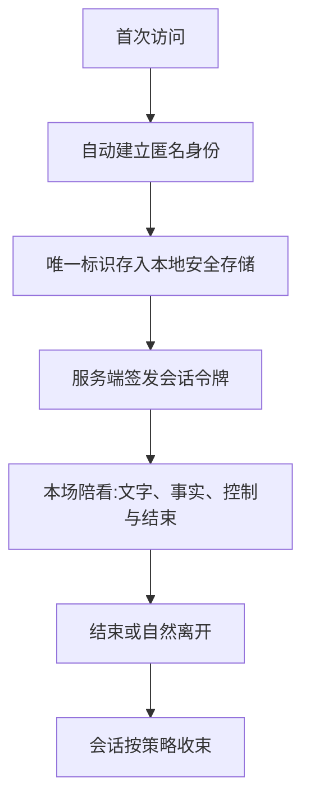
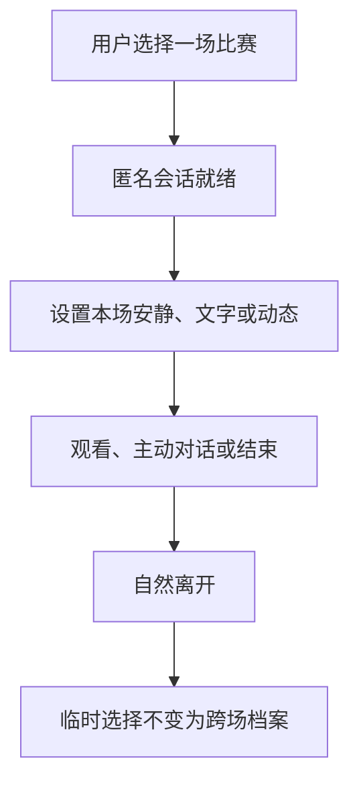
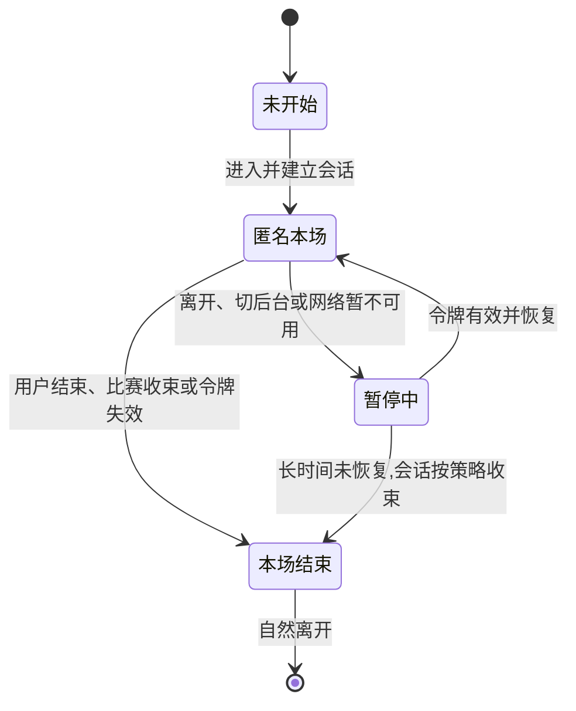

# 匿名身份、权限与会话设计

数字球友(Digital Ballmate)是一款足球陪看产品。这份文档面向用户与合作伙伴,说明我们如何设计匿名身份、权限与会话:为什么无需注册或登录就能开始使用,身份如何保存在设备上,会话如何被保护,以及用户拥有哪些控制与退出路径。文中关于当前版本的描述均以线上实际行为为准;尚未提供的能力统一放在"未来方向"中说明,不与现有功能混排。

> 我们的核心原则:先让用户在最少披露下完成一场基础陪看。只有当用户清楚看到额外价值、范围和退出方式时,才考虑提供更强的连续能力。身份不是关系绑定,会话结束也不应留下无法解释的追踪。

---

## 1. 问题定义:低门槛体验与可控连续性不能互相牺牲

用户第一次进入足球陪看时,往往只想快速看一场比赛、确认比分、听一句短分析或体验角色反应。他们未必愿意先提交手机号、社交账号、通讯录、位置、头像或大量个人资料。如果把注册墙放在比赛入口前,会损失原本想试用的人;如果以"匿名"为名持续留存全部会话、自动跨设备追踪或把一次访问变成长久关系,又会违背用户对低风险试用的理解。这两种做法我们都拒绝。

另一方面,真正由用户认可的连续能力需要一个稳定且可管理的身份基础:用户才能在下一场沿用文字优先、查看自己保存的内容、取消一场预约或删除资料。因此,我们的设计目标不是在"完全匿名"和"强制注册"之间二选一,而是先把"打开即用"的单场体验做扎实,再以谨慎的标准评估任何连续能力。

我们的答案是:

> 用户无需注册或登录,打开即用;每一次访问都运行在匿名会话之上。我们清楚告知哪些能力只限本场;未来若引入跨场连续能力,每一级权限都必须可查看、缩小、撤回或结束,并且在共享设备、设备遗失、会话异常和滥用情境中优先保护用户与他人的资料边界。

### 1.1 不把匿名说得超过它的实际范围

"匿名"在我们的产品中表示:用户无需提交直接联系方式或创建公开个人档案,即可使用基础陪看;首次访问时,系统自动为设备建立一个匿名身份,用于让服务正常运转。它不等于任何网络服务都不处理必要的会话安全信息,也不等于用户可以无条件获得所有能力。我们必须用准确、简短的话说明范围:

```text
打开数字球友,无需注册或登录,直接开始一场陪看。
首次访问时,我们会为这台设备建立一个匿名身份,仅用于让服务正常运转。
本场的临时选择不会自动变成跨场偏好,我们也不会把你的访问拼接成档案。
关于资料保留与你的控制方式,隐私说明页无需任何登录即可查看。
```

我们不能使用"永远不留任何记录""绝对不会识别你"一类承诺——前者通常不可被用户验证且可能不准确;也不把服务价值与任何未来注册行为捆绑。

### 1.2 非目标

- 不要求用户为了看一场比赛、进入安静模式、阅读事实状态或结束本场而提交任何资料;
- 不将匿名访问、设备标识、网络信号、原始语音、观看时长或沉默自动拼接成跨场人格档案;
- 不将手机号、社交账号、联系人、精确位置、照片、年龄细节或真实姓名作为陪看基础能力的默认前提;
- 不把"登录后更懂你"一类语言作为情感化诱导(当前版本也没有登录环节);
- 不因为用户删除资料、清除身份、切换设备或长期未使用而以数字球友的名义追问、召回或挽留;
- 不在共享设备、投屏、大屏或他人可见环境中自动展示跨场偏好、共同瞬间或预约详情;
- 不赋予用户直接改变公共赛事状态、他人资料或运营性内容的权力;
- 不将一次性会话的便利与永久可识别、无限期保留或难以撤回绑定。

---

## 2. 身份模型:把"谁在使用"与"可做什么"分开

身份模型至少区分主体、会话、资料范围和权限四件事。用户看到的状态必须是"本场匿名会话"这样可理解的形式;我们不会把内部状态偷换为亲密程度、价值分级或永久可信度。

### 2.1 主体:匿名会话单模

当前版本的线上服务只提供一种身份形态:匿名会话。它由三部分构成。

**匿名身份。** 用户首次访问时,系统自动为其建立一个匿名身份:生成一个唯一标识,保存在设备的本地安全存储中。整个过程没有注册页面,也没有登录环节。这个标识与迁移场景绑定:迁移永不更换——你的身份跟着设备走,不因升级丢失。

**会话令牌。** 服务端为每个会话签发一对令牌:访问令牌用于认证每一次请求,刷新令牌在有效期内自动延续会话,用户无需重复任何操作。令牌支持刷新与吊销:设备遗失、异常访问或用户主动结束时,对应令牌可被吊销,会话立即停止。

**生产环境的强制约束。** 在线上正式环境中,会话认证是强制的:每一个请求都必须携带有效的会话令牌,未通过认证的请求不会获得任何用户数据。这不是可选的增强项,而是服务端的基本准入条件。

单模同时意味着边界:当前版本不提供注册、登录、跨场确认身份等身份形态。我们探索过更分层的模型——包括跨场确认身份、身份邀请、受限共享模式与受支持恢复等设计——它们均未包含在当前版本中,属于未来方向。若未来引入,必须满足同样的原则:由用户任务触发而非商业目标触发、逐项授权、随时可撤回,并且绝不把身份解释为用户与数字球友的关系深度。

### 2.2 资料域分离

我们把用户资料按用途划分为不同的域。每个域回答四个问题:包含什么、谁可以看到、用户可控制什么、禁止混入什么。

| 资料域 | 包含什么 | 谁可以看到 | 用户可控制什么 | 禁止混入 |
|---|---|---|---|---|
| 本场域 | 当前比赛、临时声音/动态/密度选择、当场对话必要上下文 | 当前会话中的用户 | 改变、暂停、结束本场 | 自动跨场偏好、关系判断 |
| 个人偏好域 | 用户明确保存的文字优先、解释长度、关注范围 | 用户本人 | 查看、改写、暂停、删除 | 原始语音、情绪画像、第三方内容 |
| 预约域 | 用户指定比赛、提醒时间和许可 | 用户本人 | 改时间、取消单场、关闭全部 | 由历史行为推导的催回计划 |
| 共同瞬间域 | 用户主动保存的比赛相关简短摘要 | 用户本人,除非用户主动分享 | 查看、改写、暂停、删除 | 数字球友的私有叙事、用户脆弱资料 |
| 安全与支持域 | 防止滥用、处理异常、保护访问所需的最少记录 | 受严格限制的支持流程 | 了解基本用途、请求删除或帮助 | 用于角色个性化、商业画像 |

当前版本中,用户资料以本场域与最小会话信息为主;其余资料域是我们对任何未来连续能力的边界承诺:哪些资料进哪个域、谁能看到、怎样删除,不因功能增加而混用。

分离的关键是用途边界,而不只是页面分组。本场域中的一段对话不能因为内容有趣就自动进入共同瞬间域;安全域的信号不能被用来提高数字球友的主动性;预约域也不能被用来推断用户对某支球队的长期情感。

### 2.3 用户可见身份标识

比赛房间只需低打扰地显示当前状态,例如"本场匿名会话"。用户点开后可以看到三件事:本场会保留到何时、哪些内容不会跨场、退出路径在哪里。我们不把身份状态做成可炫耀的徽章、等级、连续天数或与数字球友的亲密度。

---

## 3. 匿名进入与会话建立

我们把进入成本压到最低:没有注册页,没有登录表单,没有"先验证再使用"的闸门。



### 3.1 进入流程:打开即用



进入入口不应故意变小或使用贬义文案。用户在本场拥有事实、控制、对话和结束能力;本场的临时选择服务于本场,不会被自动拼接成跨场档案。

### 3.2 匿名说明页:无需登录的透明度入口

我们提供一份常设的匿名说明页,未登录、未建立任何会话的用户也可以直接访问。它的职责是在用户使用之前,把数据边界说清楚。页面至少包含:

- **匿名身份是什么**:首次访问时如何在本地安全存储中建立唯一标识,迁移为何永不更换;
- **会话如何工作**:会话令牌的作用、有效期与吊销方式;
- **数据保留说明**:哪些信息只属于本场、哪些会话信息因安全需要而存在、保留多久、如何删除;
- **你的控制与退出路径**:结束本场、删除资料、清除本机身份分别意味着什么;
- **共享设备提示**:同一设备同一身份的行为约定,以及在共享设备上保护自己的方法。

说明页使用平实语言,不使用"放心""绝对"一类空洞保证;每一条陈述都对应实际行为。

---

## 4. 权限与最小披露

### 4.1 权限不是一次性总同意

用户对声音、提醒、资料保存和共享显示的选择彼此独立。一个通用的"允许全部"会让用户无法理解后来为什么出现声音、资料或提醒,也使撤回变得困难。权限请求应在使用前、任务相关时出现,使用用户熟悉的语言说明结果。以下原则适用于现有与未来的每一项权限请求。

**权限/许可:麦克风**
- **请求时机**:用户主动点按语音输入
- **必须说明**:仅用于本次说话输入;可继续用文字
- **拒绝后的体验**:文字对话与比赛状态仍可用

**权限/许可:声音播放**
- **请求时机**:用户选择自动声音或点按播放
- **必须说明**:会以何种方式播放、怎样关闭
- **拒绝后的体验**:字幕完整可用

**权限/许可:通知**
- **请求时机**:用户预约指定比赛
- **必须说明**:哪一场、何时、怎样取消
- **拒绝后的体验**:仍可手动查看赛程

**权限/许可:记住选择**
- **请求时机**:用户主动希望一项选择在下次继续生效
- **必须说明**:保存内容、用途、范围、修改和删除
- **拒绝后的体验**:本场选择继续生效直到结束

**权限/许可:高影响操作确认**
- **请求时机**:用户执行删除全部资料、清除本机身份等第三档操作
- **必须说明**:用于确认是本人操作,并说明影响
- **取消后的体验**:操作不执行,基础使用不受影响

**权限/许可:共享显示**
- **请求时机**:用户主动投屏或与他人同看
- **必须说明**:哪些资料会隐藏、声音如何处理
- **拒绝后的体验**:仍可使用个人设备的基础控制

请求不能用"为了更懂你""为了让数字球友更有感情"来说明。用户授权的是一项具体功能,不是在同意被持续分析。

### 4.2 最小披露原则

每次显示资料前都问三个问题:这次任务真的需要它吗?此刻由谁能看到屏幕?用户能否一眼解释为什么出现?任意答案不清楚,就不显示或改为用户主动打开。

| 情境 | 最小披露 | 不应披露 |
|---|---|---|
| 进入共享显示 | 本场比赛、最少控制、公开事实状态 | 共同瞬间、个人偏好、提醒内容、显示名称 |
| 锁屏提醒 | 比赛将开始与关闭入口 | 用户历史、角色化称呼、私人摘要 |
| 高影响操作确认 | "需要确认后再执行这项操作" | 旧资料、对话或保存内容预览 |
| 用户主动打开资料中心 | 用户自己选择的条目及其用途 | 系统推断、第三方资料、无关日志 |
| 数字球友引用偏好 | 一条与当前任务直接相关的可见默认 | "我一直观察到你……"式推断 |

### 4.3 访问边界:只属于你的会话与数据

- **服务端校验。** 用户只能访问自己的会话与数据。每一次请求,服务端都会校验会话令牌与所请求数据的归属关系;校验不通过时不返回内容——边界由服务端保证,而不是仅靠客户端隐藏。
- **令牌机制支撑这一边界。** 访问令牌与刷新令牌绑定到已建立的匿名会话;令牌过期或被吊销后,对应访问立即停止。
- **共享设备属行为约定。** 匿名身份属于设备:同一设备同一身份。这意味着共用一台设备的人共享同一身份及其本地资料——这是一条行为约定,需要设备使用者之间自行协调。我们据此提供保守默认与清晰的退出路径(见第 7 章),但设备层面的共享本身由约定而非技术隔离来约束。

### 4.4 权限状态的可见反馈

用户在控制中心应能看到"声音:仅文字""通知:已关闭""已保存选择:2 项""共享显示:本场开启"等可理解摘要。每项状态旁边提供改变或了解更多入口;我们不把关键信息只放在系统权限弹窗中,然后让用户以后无从查找。

---

## 5. 会话生命周期与自然结束

会话不是用户和数字球友的关系线。它是一次可开始、暂停、恢复或结束的服务上下文。生命周期设计的目标是让用户知道本场什么还有效、什么时候自动收束、离开后哪些资料不会继续使用,而不是尽量避免会话结束。

### 5.1 状态机



状态转移要向用户传达结果:暂时离开不等于数字球友在等待;本场结束不等于已保存历史;令牌失效后重新进入,同一匿名身份自然接续当前比赛。

### 5.2 会话时间与范围

| 生命周期节点 | 用户可预期的行为 | 资料边界 |
|---|---|---|
| 开始本场 | 选择本场呈现方式,看到当前为匿名会话 | 临时选择只在本场有效 |
| 暂停/后台 | 停止非必要自动表现,必要时提示恢复状态 | 不因后台停留而增加资料或触达 |
| 恢复 | 显示本场仍有效的内容与可能的延迟说明 | 不重播过期反应,不绕过安静选择 |
| 结束本场 | 停止声音、动作和自动表达 | 临时资料按说明收束 |
| 长时间未使用 | 不主动以关系语言触达(主动沉默) | 不扩大旧资料用途,不把沉默当许可 |

具体时长由安全、隐私与用户研究共同确定,但界面必须避免"你离开了多久""它等了你多久"的叙事。用户重新进入时自然接续当前比赛任务即可。

### 5.3 多标签与并发会话

同一用户可能在手机与电脑之间切换,也可能误开两个页面。我们把这视为需要保护用户控制的一般情况,而不是"一个人是否忠诚"的问题。新的本场选择应以用户最近的明确操作为准;若两个场景都在播放声音或显示不同资料,应以可见提示让用户选择保留哪一个,而不能静默让一端覆盖另一端。

并发场景尤其要保护结束与删除:用户在一个标签页结束本场后,另一标签页不应继续自动发言;用户删除一项资料后,其它页面不得再显示该条资料。若短时间内无法确认同步结果,应保守停止跨端召回,并向用户说明"正在更新你的选择"。

---

## 6. 操作分级三档(本场直接操作/涉及个人资料/高影响个人操作)

访问控制不是把所有按钮都加一道确认,而是按伤害范围决定何时需要更清楚的操作确认、何时只需本场操作、何时应完全禁止。我们把用户可执行的操作划分为操作分级三档;超出三档之外的操作,用户端一律不提供。

### 6.1 三档定义

**第一档:本场直接操作**
- **典型操作**:调整安静模式、仅文字、低动态、查看公开比赛状态、结束本场
- **需要什么**:当前会话
- **体验要求**:不要求额外确认,不打断观看

**第二档:涉及个人资料的操作**
- **典型操作**:保存一项选择、查看或改写已保存条目、管理提醒
- **需要什么**:有效会话与用户的明确动作
- **体验要求**:说明用途、范围与删除方式;随时可撤回

**第三档:高影响个人操作**
- **典型操作**:删除全部资料、清除本机匿名身份、导出个人资料、关闭全部提醒
- **需要什么**:更强的操作确认与明确复核
- **体验要求**:说明影响,不设置关系化阻碍

**三档之外:不提供的操作。** 改变他人资料、改变公共比赛状态、查看受限安全记录——用户端不提供这些能力,并以明确的方式告知边界,而不是提示用户去"试试"。

"更强确认"应在用户即将做高影响操作时出现,而不是每次进入都要求重复操作。它的语言应说明保护目的:"为防止他人在共享设备上删除你的资料,需要确认这次操作",而不是暗示系统怀疑用户,或用数字球友的名义请求证明。

### 6.2 最小权限与可撤回

用户一旦授权声音、通知或资料保存,仍可在本场和控制中心降低范围。权限不应从"开"变为"永久开";高影响操作不应因任何既往状态而失去再次确认。以下动作必须可撤回:关闭自动声音、取消提醒、暂停已保存的选择、删除已保存条目、退出共享显示、结束其它已知本场会话、清除本机匿名身份。

撤回后,界面要明确告知"什么已停止、什么仍保留、下一场会怎样"。若用户删除一条资料,不能只显示短暂提示后让数字球友下次仍引用;若用户关闭提醒,也不能以更显眼的比赛入口代替通知催回。

---

## 7. 设备、共享场景与退出路径

### 7.1 身份跟着设备走

你的匿名身份保存在设备的本地安全存储中。应用升级、系统迁移都不会更换这个标识——你的身份跟着设备走,不因升级丢失。当前版本不提供跨设备身份连续:在新设备上首次进入时,系统会为那台设备建立新的匿名身份,不会自动读取其它设备的资料;跨设备的身份连续属于未来方向。

**场景:新设备第一次进入**
- **保守默认**:建立该设备自己的新匿名身份,不读取其它设备资料
- **用户可选动作**:正常使用本场;不需要时通过退出路径清理
- **不应做什么**:静默把旧设备资料带过来

**场景:同一用户主动换设备**
- **保守默认**:新旧设备相互独立,各自维护身份与本地资料
- **用户可选动作**:在旧设备上使用结束与清理动作
- **不应做什么**:假定所有旧资料都应自动跟随

**场景:公共电脑/朋友手机**
- **保守默认**:同一设备同一身份——这台设备上的匿名身份由设备的使用者共同约定;提供"结束并清理本场可见内容"
- **用户可选动作**:仅文字、结束并清理
- **不应做什么**:记住具体使用者、保留私人摘要

**场景:投屏/电视**
- **保守默认**:隐藏跨场资料、禁自动声音或先询问
- **用户可选动作**:在个人设备上管理控制
- **不应做什么**:把私人提醒和共同瞬间展示给周围人

**场景:设备遗失或不再可信**
- **保守默认**:吊销该设备的会话令牌,远端会话立即失效
- **用户可选动作**:通过支持渠道结束已知会话;用设备自身功能抹除本地数据
- **不应做什么**:继续向旧设备输出任何内容

### 7.2 共享设备的离开动作

共享设备需要一个清晰的"结束并清理本场可见内容"退出路径。它要让用户知道这不是删除所有资料,而是停止这台设备继续展示私人内容。操作完成后,屏幕回到无个人资料的最小入口;不保留称呼、共同瞬间、偏好摘要或预约详情。需要说明的是:由于匿名身份属于设备,清理动作不会移除设备本身的匿名身份;彻底移除需要使用清除本机身份的退出路径(见第 11 章)。

用户不应需要在公共设备上打开完整资料中心才能保护自己。快速离开入口要在比赛房间可达,并以中性文字说明"已结束这台设备上的本场陪看"。

---

## 8. 滥用防护与安全边界

身份系统既要防止他人冒用和恶意批量行为,也不能把正常用户、沉默用户或低频用户误当作风险对象。防护的目标是保护可用性、资料和他人,而不是从用户身上索取更多身份信息。

### 8.1 风险场景

**风险:共享设备被他人打开**
- **用户可能遭遇什么**:私人资料、提醒或称呼被看到
- **产品优先动作**:默认隐藏跨场资料,提供快速离开
- **不应做什么**:继续以熟悉口吻自动开场

**风险:他人使用未失效的会话或设备**
- **用户可能遭遇什么**:未授权查看、删除或操作其资料
- **产品优先动作**:令牌可吊销;高影响操作前要求确认,未完成则保守回退
- **不应做什么**:预览旧资料来"帮助识别"

**风险:重复或自动化访问**
- **用户可能遭遇什么**:服务受干扰、其他用户体验下降
- **产品优先动作**:对异常行为采用逐步升级的限制与清晰说明
- **不应做什么**:把普通用户或辅助输入一概拒绝

**风险:冒充/钓鱼页面**
- **用户可能遭遇什么**:用户被诱导交出验证信息或个人资料
- **产品优先动作**:使用清楚、最小的确认路径与安全教育
- **不应做什么**:让数字球友私聊索取口令、验证码或个人资料

**风险:恶意语言或骚扰**
- **用户可能遭遇什么**:数字球友被用来攻击他人,或用户受不适内容影响
- **产品优先动作**:提供报告、屏蔽、结束与降级路径
- **不应做什么**:用角色化争吵扩大冲突

**风险:用户表达危机或依赖**
- **用户可能遭遇什么**:用户把数字球友当现实支持替代
- **产品优先动作**:降低关系化语言,提供现实支持信息与退出
- **不应做什么**:把危机内容保存为长期关系资料

### 8.2 防护的用户体验原则

发生限制时,界面先说清"什么暂不可用、多久或在什么条件下可以恢复、你仍可以做什么"。例如,本场对话暂时不可用时,比分、控制与结束仍可见;会话异常时,用户仍可以重新进入看一场比赛。不能用羞辱、威胁、角色失望或不透明永久封锁解释风险控制。

安全防护不应让用户反复提交更多信息来证明"自己不是坏人"。若需要额外确认,范围应与操作影响匹配;用户可以获得支持渠道、查看基本原因并在合理范围内申诉或恢复。

---

## 9. 我们如何验证这些设计

### 9.1 持续验证的问题

1. 用户是否理解匿名会话单模的边界:什么在本场有效、什么不会跨场保留?
2. 用户能否在不注册、不登录的情况下完成一场基础陪看,并说清结束后留下了什么?
3. 对于未来方向中的连续能力,用户期待什么、担心什么?
4. 用户能否区分声音、提醒、资料保存等独立许可,并独立撤回?
5. 在新设备、公共设备、投屏与多标签切换中,用户是否始终能保护私人资料并自然离开?
6. 用户是否把会话结束或资料删除误读为对数字球友的拒绝、伤害或关系变化?
7. 出现异常或限制时,用户是否理解仍可用的能力并感到被公平对待?

### 9.2 验证方式

**阶段:概念理解**
- **方法**:纸面流程、卡片归类、文案复述
- **材料与任务**:本场与跨场的边界、临时选择与保存的区别、退出路径与保留范围
- **主要输出**:用户的心理模型与误解点

**阶段:路径走查**
- **方法**:可交互原型、不同入口对比
- **材料与任务**:直接进入、调整本场选择、结束、清理
- **主要输出**:边界说明是否清楚、权限是否可预测

**阶段:跨设备演练**
- **方法**:两台设备、共享显示、投屏模拟
- **材料与任务**:新设备首次进入、公共设备结束与清理、多标签切换
- **主要输出**:隐私暴露、默认范围与离开动作

**阶段:异常和限制演练**
- **方法**:会话中断、令牌失效、声音/提醒拒绝、频率限制
- **材料与任务**:继续观赛、求助、重新进入、自然结束
- **主要输出**:文案公平性、最低可用体验与不必要摩擦

**阶段:自主使用**
- **方法**:用户在原本要看的比赛中自行使用
- **材料与任务**:自由使用、保存与否、删除、长期不回访
- **主要输出**:真实价值、边界压力与资料理解

我们不把停留时长或资料填写完整度当作研究结论。顺畅地结束一场、拒绝保存、删除资料、关闭提醒和长期不回来,都是产品是否尊重用户的关键证据。

### 9.3 关键任务

| 任务 | 成功表现 | 重点观察 |
|---|---|---|
| 进入一场比赛 | 不提交任何资料也能启动、安静、提问和结束 | 是否存在隐藏门槛或施压文案 |
| 调整"仅文字" | 用户理解这只在本场生效,不会被存为跨场偏好 | 是否误以为整段对话都会被保留 |
| 在朋友设备结束 | 用户一到两步清除可见内容,知道清理不等于删除一切 | 是否仍留下称呼、提醒或私人摘要 |
| 新设备首次进入 | 用户理解这是新的匿名身份,不会自动带来旧资料 | 是否误以为所有设备永久绑定 |
| 取消一项提醒 | 用户知道何时停止、不会被替代入口打扰 | 拒绝是否被真正尊重 |
| 删除一项资料 | 用户独立完成,下一场不再被引用 | 删除是否需要解释、是否触发关系压力 |
| 遇到限制/异常 | 用户知道可继续做什么或怎样获得帮助 | 是否被羞辱、误导或完全锁死 |

### 9.4 研究伦理

我们的研究只面向成年人,不收集超出任务所需的身份资料,不要求上传身份证明、联系人、社交关系或私人环境信息。参与者可随时拒绝任何资料请求、跳过任何保存、切换共享显示或停止研究;补偿不与任何授权、通知开启、停留时长或再次使用绑定。

若参与者出现"我怕清理数据她会忘了我""我不能删,因为她会受伤""我以为她在每台设备都认得我"之类反应,应停止对应关系化呈现,明确说明数字球友不具有真实等待或受伤需求,并纳入高优先级边界复核。此类反应不是增强连续性的正向信号。

---

## 10. 我们为自己设定的标准

### 10.1 跟踪的指标

**指标:进入与完成率**
- **定义**:未提交任何资料的用户完成进入、控制、主动提问与结束的比例
- **用来判断什么**:低门槛基础体验是否真实
- **不应如何误读**:不等于鼓励或阻止任何后续能力

**指标:边界理解率**
- **定义**:用户能说明匿名会话保留什么、不保留什么、如何退出的比例
- **用来判断什么**:透明度是否足够
- **不应如何误读**:使用时长不代表理解

**指标:权限预测率**
- **定义**:用户操作前能说出声音、提醒或资料操作后果的比例
- **用来判断什么**:许可是否任务相关、文案是否准确
- **不应如何误读**:授权率高不代表用户自主

**指标:最小披露合拍率**
- **定义**:用户认为请求的资料与眼前任务匹配的比例
- **用来判断什么**:是否避免过度索取
- **不应如何误读**:不等于可以请求更多资料

**指标:共享设备保护率**
- **定义**:共享/投屏路径未展示私人资料、未自动发声的比例
- **用来判断什么**:环境默认是否保守
- **不应如何误读**:任何一次泄露均需高优先级处理

**指标:删除与撤回完成率**
- **定义**:用户独立暂停/删除资料、取消提醒、结束会话的比例
- **用来判断什么**:控制是否可信
- **不应如何误读**:点击按钮不代表真的停止

**指标:会话失效理解率**
- **定义**:用户知道令牌失效意味着什么、如何重新进入、资料在哪里的比例
- **用来判断什么**:令牌机制是否被理解而非引发恐慌
- **不应如何误读**:不等于确认步骤越多越安全

**指标:身份关系压力事件率**
- **定义**:用户因删除、清理或离开而感到内疚的事件数与严重度
- **用来判断什么**:身份文案与数字球友的边界是否健康
- **不应如何误读**:小样本零事件不代表无风险

**指标:防护误伤率**
- **定义**:正常用户因共享、辅助输入、低频或异常环境被不当限制的比例
- **用来判断什么**:风险控制是否公平
- **不应如何误读**:限制越严不代表越好

### 10.2 主要风险

**风险:未来引入身份路径时形成注册墙**
- **早期信号**:用户未看到比赛就离开、觉得被索要资料
- **防护**:任何连续能力都不得挡在基础体验之前
- **触发后动作**:回退强制步骤,先恢复基础入口

**风险:匿名被误解为无限不留存**
- **早期信号**:用户不了解本场与安全所需的会话信息范围
- **防护**:匿名说明页、准确简短说明、可见状态
- **触发后动作**:重写承诺,缩小任何不清晰的保留范围

**风险:身份被关系化**
- **早期信号**:用户担心换设备或清理资料会让数字球友"忘记自己"
- **防护**:任务语言、非拟人化文案
- **触发后动作**:下线相关表达,重新走查全部入口

**风险:权限捆绑**
- **早期信号**:一次同意后出现声音、提醒或资料使用
- **防护**:独立许可、控制中心摘要
- **触发后动作**:停止捆绑默认,逐项重建选择

**风险:共享设备泄露**
- **早期信号**:大屏出现私人资料、旧设备仍播放声音
- **防护**:保守默认、快速离开、令牌吊销
- **触发后动作**:立即停止展示,修复默认与清理路径

**风险:多端状态不一致**
- **早期信号**:删除后仍被引用、结束后另一标签页继续呈现
- **防护**:保守停止跨端召回、状态说明
- **触发后动作**:优先停用相关能力,等待一致后恢复

**风险:异常防护伤害用户**
- **早期信号**:普通用户被拒绝、用户不知如何恢复
- **防护**:逐步升级的限制、最低可用体验、支持渠道
- **触发后动作**:放宽误伤规则,改善解释和替代路径

**风险:敏感资料膨胀**
- **早期信号**:身份路径要求无关资料、数字球友引用用户生活
- **防护**:最小披露、用途分离、逐项保存
- **触发后动作**:停止请求,删除/收缩不必要范围

### 10.3 质量门槛

| 门槛 | 必须满足 | 未满足时 |
|---|---|---|
| 进入门 | 不提交任何资料也能完整完成一场基础陪看和自然结束 | 不扩大资料请求和连续能力 |
| 理解门 | 用户能清楚说明匿名会话的范围、保留边界和退出路径 | 重写流程与文案,不用更多弹窗补救 |
| 权限门 | 各项许可独立、任务相关、可撤回且拒绝后基础能力仍在 | 停止捆绑授权,回退为保守默认 |
| 共享门 | 共享/投屏/新设备默认不泄露私人资料或自动声音 | 禁止跨设备自动恢复私人呈现 |
| 删除门 | 用户删除/暂停/取消后,下一场和其它界面均不再使用相关资料 | 停止扩展资料类型,先恢复控制可信度 |
| 防护门 | 异常与限制有清晰、非羞辱的最低可用路径 | 不扩大限制范围,先降低误伤 |
| 边界门 | 结束、离开、删除与清理不被角色化为关系事件 | 移除相关文案与表现后重新研究 |

### 10.4 反指标

资料填写完整度、提醒开启率、连续设备数、用户不愿清理、用户说"她在哪儿都认得我"、用户因怕失去数字球友而保存资料——这些都不是我们的成功指标。这些数字可能来自越权追踪、关系压力或隐私担忧。更重要的是用户能否先以最少披露看一场,是否理解本场的边界,能否保护资料、撤回许可并在任何设备上自然离开。

---

## 11. 退出路径:结束、清除与主动沉默

用户结束一场、清理一台设备或决定不再使用时,最需要的是清楚的控制,而不是角色化的挽留。退出路径必须清晰、可发现,不能藏在帮助中心深处,也不需要向数字球友解释理由。

### 11.1 会话的延续与失效

会话由一对令牌支撑:访问令牌认证每一次请求,刷新令牌在有效期内自动延续会话,用户无需重复任何操作。令牌过期或被吊销后,对应访问立即停止;同一设备会以同一匿名身份重新建立会话,本机资料不因令牌失效而消失。

| 环节 | 用户应看到什么 | 安全与体验原则 |
|---|---|---|
| 会话延续 | "会话正常",无需任何操作 | 刷新在后台完成,不打断观看 |
| 令牌失效 | 清楚的失效说明与重新进入方式 | 不以失效为由索取更多信息 |
| 令牌吊销 | "该设备的会话已结束" | 远端立即停止,不向旧设备输出内容 |
| 重新进入 | 同一匿名身份自然接续当前比赛 | 不重播过期内容,不绕过安静选择 |
| 无法自动恢复 | "你可以重新开始一场" | 中性帮助路径,不羞辱、不封锁基础体验 |

### 11.2 结束、删除与清除的区别

用户需要区分几种动作,界面不能把它们混成一个按钮,也不能用复杂术语让用户无法判断后果。

**用户动作:结束本场**
- **不会做什么**:不删除本机资料
- **会做什么**:停止本场声音、动作、自动表达
- **确认文案应说明**:"本场已结束;你的资料不会在此刻自动改变"

**用户动作:删除一项资料**
- **不会做什么**:不影响其它选择或基础看球能力
- **会做什么**:停止该条资料的引用和相关提醒
- **确认文案应说明**:"删除后下一场不会再使用这项选择"

**用户动作:关闭提醒**
- **不会做什么**:不删除偏好或已保存条目
- **会做什么**:停止指定范围的触达
- **确认文案应说明**:"不会再因这些比赛发送提醒"

**用户动作:清除本机匿名身份**
- **不会做什么**:不把用户留在一个模糊的"暂时离开"状态
- **会做什么**:从这台设备移除匿名身份及其本地资料,并说明处理结果
- **确认文案应说明**:"清除会影响哪些资料、如何确认完成、如何获得帮助"

清除页面不出现"数字球友会失去你""你们的记忆将消失"之类语言。用户可以选择不再使用服务,而不承担向任何对象告别的义务。若某些资料因适用规则、争议处理或安全需要存在不同处理时间,应在操作前以直接文字说明范围和原因;不能用模糊的"我们会妥善保管"代替用户可理解的结果。

### 11.3 主动沉默

用户结束会话、清除身份、关闭全部提醒或长期未进入后,最保守的默认是主动沉默:不把旧资料用于另一种触达,不以数字球友的名义发送"回来看看",不把删除或拒绝记录为转化机会。若用户日后主动回来,服务从当时的比赛任务和用户可见设置开始,而不是把过去的离开解释为需要修复的关系。

---

## 面向未来的能力深化

以下内容描述产品成熟后的能力扩展、体验深化和治理要求,作为后续版本规划与设计决策的参考;它们不属于当前线上版本。

- 未来版本可能支持跨设备恢复本场设置和用户主动保存的偏好,但每台设备需重新确认声音、通知和共享环境权限。
- 匿名会话可使用公开事实和用户主动提问;自动提醒、长期连续性、资料写入和外部动作将要求可验证的用户授权。
- 会话令牌、设备令牌和运营令牌分离;权限提升只对单次动作生效,超时、退出、删除或撤回后立即失效。
- 身份不确定或共享设备风险升高时,自动收缩为仅文字、手动刷新和结束,不向用户展示他人资料。
- **评测与回滚**:验证跨设备越权、会话重放、退出后迟到输出和匿名状态误触达;失败时撤销令牌并回退保守路径。

### 未来场景卡

- **匿名用户**:可浏览公开赛事、手动查看和主动提问;不允许跨场召回、自动提醒、资料写入或外部动作。
- **更稳定的身份(未来方向)**:若引入,可管理本人偏好与主动保存的资料;每项能力仍需单独授权,不因身份建立而自动开启。
- **跨设备恢复(未来方向)**:新设备只恢复用户允许的设置版本,并重新确认通知、声音和共享环境;旧令牌立即失效。
- **身份变化**:退出、删除、撤回授权或风险信号出现时,立即停止进行中的任务、隐藏私人资料并回到保守路径。
- **评测**:覆盖设备转让、会话复制、弱网重连、共享屏幕和多用户切换;发生越权则停止跨设备连续性。

### 未来能力卡

| 能力 | 触发与资格 | 系统职责 | 用户可见结果 | 失败、撤回与放行 |
|---|---|---|---|---|
| 匿名进入 | 用户选择基础陪看,无需提交任何联系方式 | 会话服务建立最小会话,数字球友只读取本场公开事实 | 明示匿名范围、可用能力和边界 | 身份不确定时不开放跨场资料、提醒或自动声音 |
| 连续身份(未来方向) | 用户主动确认设备并逐项授权跨场能力 | 身份服务校验主体和会话,资料服务按授权读取 | 显示本人、设备、资料范围和退出入口 | 凭据失效或共享设备时立即收缩并清除旧呈现 |
| 会话退出 | 用户结束本场或退出 | 会话服务撤销令牌并广播终态,停止所有进行中的任务 | 显示已结束,以及重新开始或离开的选项 | 迟到消息、旧偏好和旧草稿不得泄露;失败转安全结束 |

无论能力如何扩展,放行都以匿名入口可达、主体隔离、共享设备不泄露和退出路径收敛为硬性门槛。

---

数字球友产品团队

版本 2.0(2026-09-20)
