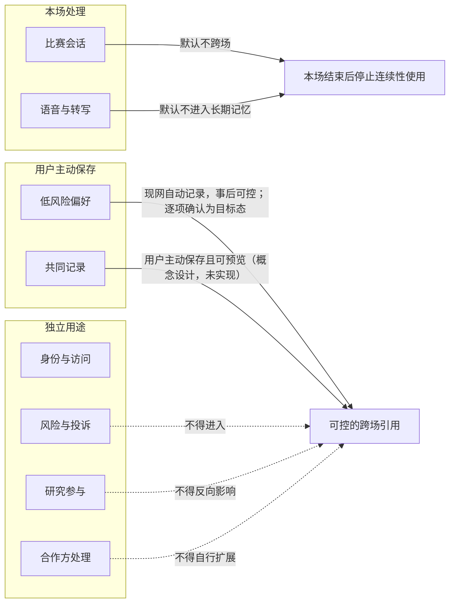
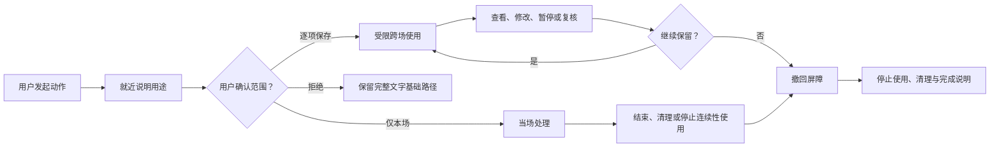
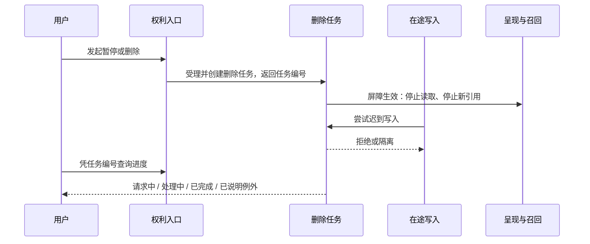
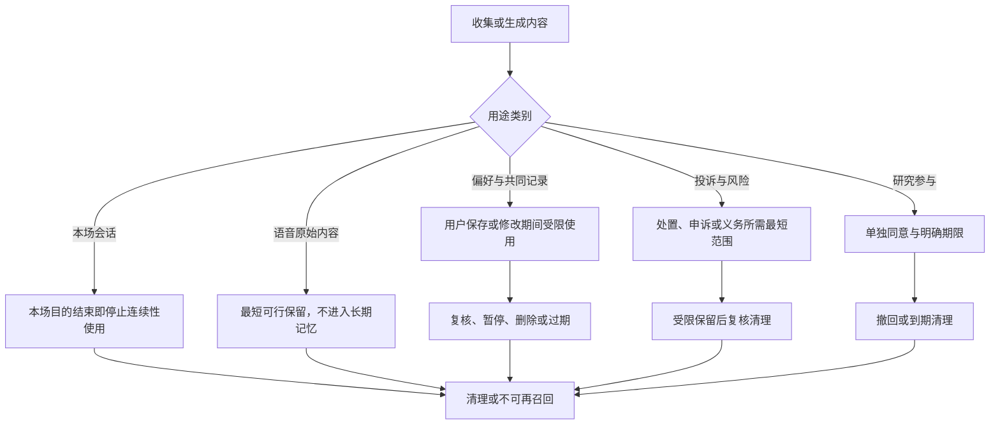
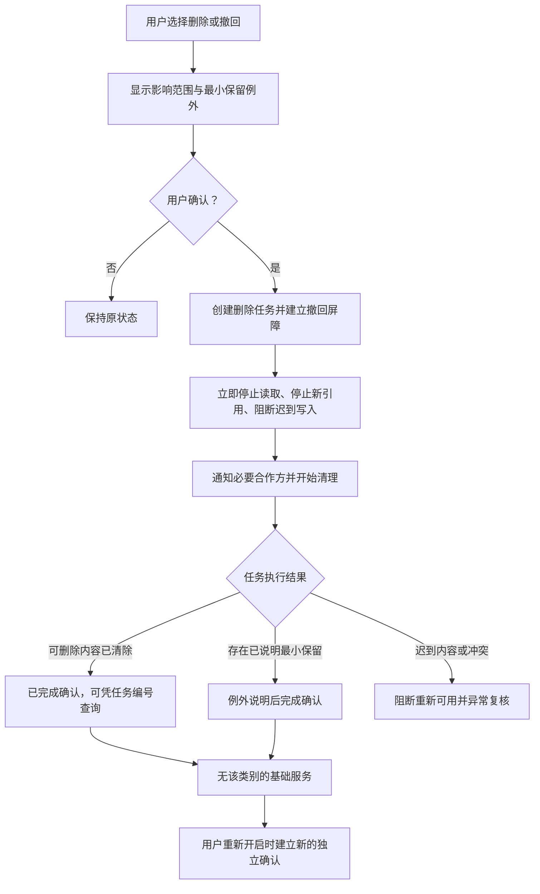
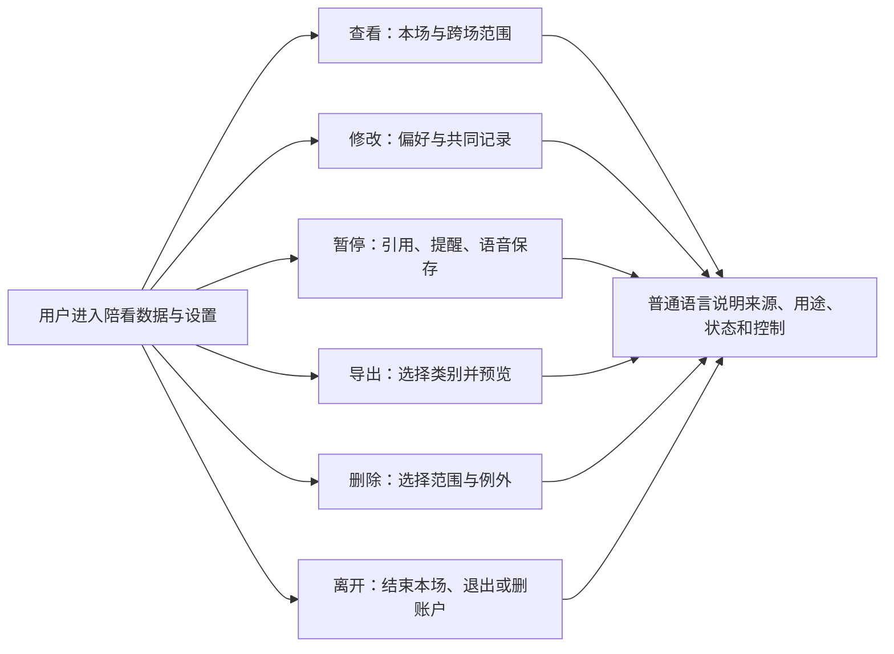
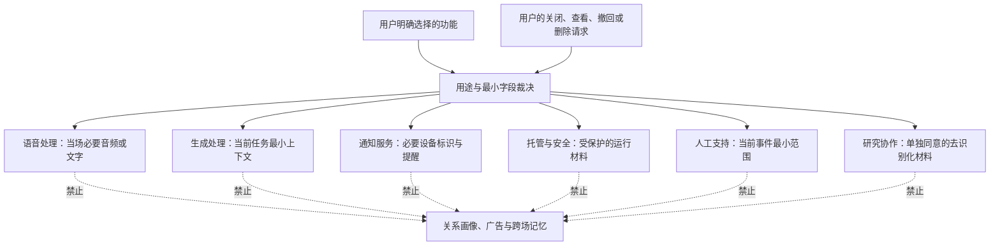
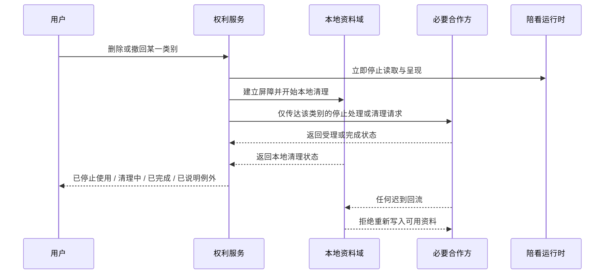
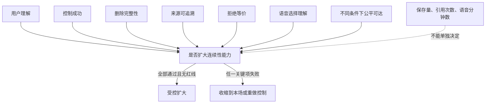

# 隐私、记忆删除与数据生命周期设计

> **阅读提示**：这一篇说明我们如何处理球球（数字球友，Digital Ballmate）的隐私、记忆与数据生命周期：数据如何分类、保留多久、删除如何生效、你拥有哪些权利。其中删除任务可查询进度、过期数据定时清理、画像删除从下一回合起不再被引用——这些是今天已经在运行的行为，不是规划。记忆如何自动产生与被引用，见《共同记忆与偏好召回设计》，本文不重复展开。

## 1. 设计问题：记得更多不等于服务更好，忘得干净才是连续性的前提

数字球友（我们的 AI 足球陪看数字人，下称"球球"）想要在不同比赛之间保持连贯，需要记住一些信息，例如支持的球队、互动节奏、称呼、赛后回顾偏好或用户自己保留的一条比赛观察。但足球陪看也可能包含语音转写、情绪表达、比赛观看习惯、投诉、风险事件和用户离开的痕迹。若这些内容被混作"记忆"，用户很难知道球球究竟记住了什么，更无法放心修改、暂停、导出或删除。

我们的基本决定是：**数据连续性必须被拆成可解释、可选、可撤回、可删除的用途；删除不是隐藏按钮，而是从接收新内容、使用旧内容、向合作方传递、显示给人工人员到后续研究的一整条停止与清理过程。** 我们宁可少提供一点跨场熟悉感，也不用不透明的积累换取方便。

用户对记忆的控制不是一次性授权。用户今天可以让球球记住主队，明天可以只保留本场，后天可以暂停连续性，或要求清空所有相关内容。每种选择都带来用户可见、可解释的结果，而不是球球继续以"我记得你"为理由扩张引用范围。

### 1.1 我们的核心决策

1. 按用途而不是按技术来源划分数据：身份与访问、比赛会话、用户偏好、共同记录、语音与转写、风险与投诉、研究参与、合作方处理；
2. 每类数据都写清最小字段、用途、默认状态、保存条件、最长保留期、可查看控制与删除后果；
3. 记忆自动进行，但边界清晰：脆弱表达、未回复、情绪强度、深夜使用或现实困境不会成为可被引用的跨场内容；凡是进入记忆的内容，用户都拥有查看、修改、遗忘与暂停的完全权利；
4. 语音与转写的"听见""处理""保留""用于连续性"分开同意，默认不把语音内容变成长期记忆；
5. 删除请求受理后立即创建一个可按任务编号查询的删除任务：先建立屏障、再按范围清理已有内容、并向必要合作方传达清理请求；用户随时能看到完成范围与例外；
6. 采用"撤回屏障"：删除或撤回一旦发出，我们同时做到三件事——停止读取、停止新引用、阻断迟到写入，后到的异步内容、缓存内容或尚未完成的处理不得把已撤回内容带回可用记忆；
7. 访问、导出、修改、暂停、重置、投诉与退出路径被设计为普通用户动作，不需要用户先解释理由、安慰球球或联系人工；
8. 现阶段服务限定为能自主同意的成年人。年龄不确定或自述未成年时，收缩到最少数据与无跨场连续性路径，直到具备适当的年龄保护与权利机制。

### 1.2 我们不承诺什么

我们不替代适用地区的法律意见、保留义务、信息安全制度或合作合同，也不承诺用户能够删除所有法律上必须保留的最小记录。我们承诺的是：把范围、例外、时间和控制用普通语言说清，并把最小化作为默认设计。

我们也不把"匿名"当作一个万能词。某些记录即使不直接显示姓名，也可能与会话、设备、时间或偏好组合相关。对用户而言，重要的是实际可被如何使用、谁能访问、能否退出和如何删除，而不是一个含混标签。因此匿名状态下的数据保留规则有公开的说明页——未登录的用户同样可以查看各类数据保留多久、如何清理。

### 1.3 成功与失败定义

成功是用户能回答：球球为什么知道这件事；这件事会在哪些场景被使用；怎样暂时停用、修改或删除；删除后会发生什么；导出里会包含什么；以及人工和合作方会在何种范围内看到什么。成功还包括，用户即使拒绝保存跨场内容，仍能完成核心比赛陪看任务。

失败包括：用户以为关闭了记忆，球球却继续引用旧内容；删除后迟到的处理重新写回内容；语音使用被默认为长期保留；一项许可被偷偷扩展到提醒、商业触达或研究；用户必须在多层设置中寻找清空；合作方处理范围不清；风险处理成为无限保存的理由；或未成年人进入了不适当的连续性与拟人互动。

## 2. 数据分类：先让用户看见"是什么"，再讨论"怎么处理"

数据分类不以数据库表、供应商名称或内部结构为起点，而以用户能理解的关系和用途为起点。用户需要知道：哪些内容只是为了这场比赛临时处理，哪些会跨场沿用，哪些只在本人主动提交投诉时使用，哪些绝不应被保存为记忆。

### 2.1 现阶段数据类别总表

**仅为完成访问与权利操作。** 身份与访问只处理必要的会话识别与登录状态；用户可以查看账户、退出或删除账户，且这类连续性不等于球球可以跨场引用私人内容。

**只为完成本场。** 比赛会话处理本场选择、当前提问与短期状态；语音与转写只处理当场必要的音频、文字与设备状态。两者默认不跨场，用户可结束、清空本场、停止语音或关闭保存。

**跨场记忆的许可：现网为自动记录＋事后可控，逐项确认是受控开放前将落地的目标态。** 低风险偏好包括语言、术语深度、主队与互动节奏；共同记录（用户主动保存的共同记录，概念设计，未实现）指用户明确保留的观点和赛季观察。现网的记忆在陪伴过程中自动记录、事后可控——用户可查看、编辑、暂停、预览或删除，相关内容仅在当前任务相关且未暂停、未删除时才能被引用；"写入前逐项确认才可跨场"作为目标态，将随受控开放前的准备落地。

**风险、研究与外部处理各自隔离。** 投诉与风险材料只用于处置、申诉和最小安全复核，不得进入陪看个性化；研究默认不参与且不得影响服务待遇；合作方只接触完成某项用户选择所必需的信息，不得自行扩展用途。三类数据都有独立的查看、撤回、删除或关闭入口。

这个表的核心是避免"用户数据"成为一个大口袋。每一类用途都有不同的许可、风险和退出要求。把它们合在一起，会让用户无法做精细选择，也让我们难以判断某项新能力是否超出了最初约定。

### 2.2 不应成为记忆的内容

以下内容默认不作为跨场记忆：用户的脆弱表达、现实危机、健康、财务、家庭、社会关系、政治信仰、未经主动保存的情绪、长时间沉默、使用时间、连续使用、设备位置、联系人、未回复的消息、投诉内容、人工处置内容、未成年人相关信息，以及任何球球从用户话语中自行推断出的心理结论。

某些内容在本场可能需要短暂处理，例如用户说"我今天状态很差"。这不等于它有资格在下一场被球球提起，更不等于我们应据此增加提醒、改变定价、提高表演强度或建立关系标签。短暂处理和长期记忆必须在产品语言与用户控制上清楚分开。

### 2.3 分类的用户界面语言

我们不要求用户理解"结构化字段""日志""缓存"或"模型输入"等术语，而是使用"只在这场使用""下次也沿用""你自己保存的观察""用于处理投诉""可选研究参与""为了让语音工作"等普通表达。每个类别旁都说明：是否会跨场、是否会主动出现、何时停止、如何删除。

语言应避免制造拟人化负担。我们说"删除这条记录后，后续陪看不会再引用它"，而不是"球球会失去我们的回忆"。后者会把数据权利变成用户对球球的情感责任。

## 3. 最小化：每一个数据动作都要先证明用户利益

最小化不是"少收一点"这么简单，而是要求每一项数据在收集、使用、保留、共享和人工访问前都能回答五个问题：用户此刻获得什么具体价值？是否有不收集也能完成的替代？是否可以只在本场使用？是否能分项控制？什么时候应该停止？

### 3.1 收集最小化

首次进入只收集完成当前陪看所必要的内容。用户可以先选择一场比赛、一个互动模式，直接开始使用，不需要为了获得基本事实说明而交出昵称、主队、语音、跨场记忆、通知、联系人或生活背景。

任何额外项目都在需要时、与用途相邻地提出。例如用户主动点语音按钮时，再说明麦克风用途与可选保存；用户希望下次沿用主队视角时，再说明将保存哪一项偏好。我们不在首次启用页把所有许可捆绑为"体验更完整"。

### 3.2 使用最小化

被允许保存的偏好也只应在相关场景使用。用户保存了主队，可以让比赛事实和观点按该视角呈现；但不能成为球球在现实困扰、商业推荐、通知召回或人际关系问题中引用该偏好的依据。用户保留了一条赛季观察，也不等于允许球球在每场开场主动提起。

同一内容在不同用途中的可用性被分别定义。最小化的关键不是"系统里有没有"，而是"此刻有没有资格用"。

### 3.3 保留最小化

每类数据都有明确的保留期（默认 30 天），到期自动退出可读范围，由后台清理任务定期清理。本场数据默认随本场结束进入清理或不可再用于连续性的状态；跨场偏好、共同记录、投诉和研究材料各有不同的保留假设，但都不无限期、无提示地存在。对可能带来主动触达或关系连续性的项目，我们采用更短、可见、可复核的保存周期。

当一项数据不再服务于用户已同意的目的，或用户长时间未选择继续使用，最安全的默认是停止使用、提示复核或清理，而不是为了"未来可能有用"继续积累。未来的方便不能成为今天无限保留的理由。

### 3.4 访问最小化

无论是自动服务、人工支持还是合作方处理，都只能获得完成当前任务所需的最小信息。处理一条不当回复的人工人员不需要阅读所有比赛记录；恢复语音不需要查看共同记忆；做研究的人不需要知道用户的账户身份；合作方不应获得超出明确服务环节的完整画像。

最小访问不仅保护隐私，也提高纠错能力。范围越清楚，用户越容易知道谁为什么能看到什么，我们也越容易发现不该存在的扩展。

## 4. 生命周期：从一次本场选择到彻底撤回的每个节点

用户权利只有嵌入生命周期才有意义。我们把数据从创建到清理拆成一组用户可解释的阶段：提出、确认、使用、显示、保存、复核、撤回、删除与证明。不同类别可以跳过某些阶段，但不得绕过撤回与删除的基本逻辑。

### 4.1 阶段一：提出

提出是用户主动发起某个需要数据的动作，例如选择语音、保存主队、添加赛季观察、开启赛后回顾或提交投诉。界面在动作附近用短说明表明会发生什么，而不是把重要后果隐藏在统一条款中。

提出不等于确认。用户可以进入设置查看，也可以在填写过程中退出；未完成的内容不会自动成为长期记录。特别是敏感文本、语音与投诉草稿，我们避免因为用户只是试着点开就被当作正式提交。

### 4.2 阶段二：确认

确认必须与具体用途对应。用户看到的最少信息包括：将保存什么、为什么保存、在哪里使用、是否会跨场、何时失效、如何关闭或删除。对于语音、提醒、共同记录、研究参与和可能产生人工访问的功能，确认更明确。

拒绝、跳过或选择"仅本场"都能得到完整核心体验。若用户因拒绝保存主队而无法讨论该球队，或因关闭语音保存而无法使用语音本场互动，则确认不是自由选择。

### 4.3 阶段三：使用

使用只发生在已说明的目的与范围中。球球引用一项偏好时，与当前任务有直接关系；用户可以从设置或相关入口理解引用来源。我们不用已保存信息制造"我一直都记得你"的关系氛围，也不把同一信息转为商业、研究或风险画像输入。

使用过程尊重用户的即时选择。用户说"这场别提过去"，即使长期偏好仍被保存，引用也会暂停；用户选择访客状态时，设备上不显示私人记录；用户关闭主动提示后，保存信息不能绕过关闭变成另一种提醒。

### 4.4 阶段四：显示与解释

用户有一个可达的"陪看数据与设置"界面，能看到主要偏好、共同记录、语音选择、提醒、研究参与和最近的关键变化。显示不需要暴露所有低层操作细节，但必须让用户理解实际会影响体验的内容。

每个项目提供来源、用途、最近使用时间或状态、保留条件、编辑、暂停、删除。显示界面不把"记忆"做成温情相册或关系等级墙，而像一个普通、可管理的服务设置面板。

### 4.5 阶段五：复核

对跨场主动、赛后提醒、共同记录和语音长期保存等影响较大的项目，我们设置自然的复核点。复核可以在用户主动进入设置、再次开启功能或达到明确期限时发生，但不用情绪化推送催促用户"不要失去默契"。

复核的目标是确认用途仍然成立，不是再次诱导授权。用户不回复、没打开或选择不续，不会受到任何功能惩罚；系统保持静默、暂停或清理相应项目。

### 4.6 阶段六：暂停与撤回

暂停意味着暂时停止使用一类数据，不必删除全部内容。用户可以暂停跨场引用、暂停赛后回顾、暂停语音保存、暂停共同记录显示，或只在某场比赛进入无历史状态。暂停后，服务继续处理用户当场明确请求，但不再主动引用被暂停的内容。

撤回是对先前许可的明确收回。撤回立即阻止未来使用，并告诉用户它对已存在内容的下一步影响：是否会删除、何时清理、是否存在最小保留例外。用户不会被要求说明撤回原因，也不会看到球球失落、挽留或对其选择施压。

### 4.7 阶段七：删除

删除可以是单条共同记录、单项偏好、本场内容、语音转写、研究材料、账户数据或全部连续性内容。界面让用户先选择范围，并以普通语言说明：哪些内容会立刻停止被使用；哪些将被清理；哪些最小记录因适用义务或防欺诈、安全、争议处理等原因可能在限定时间内保留；以及如何了解完成状态——删除受理后会生成一个删除任务，用户可随时凭任务编号查询进度。

删除不等于让用户反复确认。对可逆、低影响的单项删除，我们提供短时撤销作为操作保护；对高影响删除，只做一次中性确认。确认不用"失去回忆""球球会忘记你""无法再陪你"式语言。

### 4.8 阶段八：完成证明与持续防护

用户提交删除后，会得到可理解的状态：请求已收到、相关功能已停止、清理正在进行、已完成、或存在已说明的最小例外。证明不暴露内部系统，但足以让用户知道服务不会继续拿这些内容做陪看、提醒、研究或表演。

删除完成后还有持续防护。只要旧内容仍可能从延迟处理、临时副本、后续合并、合作方回传或人工误操作中重新出现，用户的删除权就未真正完成。这正是撤回屏障要解决的问题。

## 5. 记忆与转写：记忆自动进行，用户拥有查看、修改、遗忘与暂停的完全权利

记忆是球球最容易让人误解的能力。用户可能以为球球"自然记得"，也可能反过来担心自己必须先做一堆选择才有基本体验。我们的立场与《共同记忆与偏好召回设计》一致：**记忆自动进行——用户不需要先当配置员；同时用户保留对所有记忆的完全处置权——随时查看、逐条修改、逐条遗忘、全部遗忘，以及让任何一条从下一回合起不再被引用。** 尽管如此，本场上下文、跨场偏好、用户共同记录、语音转写和风险材料仍被明确隔离。

### 5.1 本场上下文

本场上下文用于让球球理解用户此刻在讨论哪场比赛、选了什么模式、刚刚问了什么、是否要求安静或停止。它的价值是完成当前任务，默认不自动进入下一场。比赛结束、用户结束会话或用户选择清空时，本场上下文停止作为连续性输入。

本场上下文可能包含临时情绪表达，但不会因为"这句话很有代表性"而被系统升格为长期内容。凡是进入长期画像的内容，用户都能在"球球懂我"中看到来源，并随时修改、遗忘或暂停引用。

### 5.2 低风险偏好

低风险偏好限于直接改善陪看任务的项目，例如界面语言、术语解释程度、主队、比赛关注范围、默认互动节奏和无障碍设置。它们按项编辑、可暂停、可删除，且不被解释成现实身份、情绪或关系深度。

用户修改主队、关闭提醒或选择更安静的模式是正常使用，不是关系变化。球球和界面都不把它们写成"你变了""我们不再默契"。

### 5.3 共同记录

共同记录的名称强调用户控制，例如"我的赛季观察""我保存的比赛笔记"，而不是"我们的回忆"。内容来自用户主动保存或明确编辑，用户可预览、改写、导出、单条删除或全部清空。

共同记录只在用户开启或当前任务相关时被引用。用户保存一条战术看法，不等于球球可以在用户低落时拿它当熟悉感素材；用户保存一场胜利，不等于球球可以把它包装成情感纪念日或用于召回。

需要区分两个对象：**共同瞬间**（系统在陪伴过程中自动记录，可在"球球懂我"中查看与管理）与**用户主动保存的共同记录**（概念设计，未实现）是两个对象——当前产品只有前者，本节所述的共同记录属后者的概念设计。

### 5.4 语音与转写

语音至少包含四种不同处理：设备接入、当场识别、当场回应、是否保存转写或音频。它们不被一个"开启语音"按钮统合。用户可使用语音完成本场互动，同时拒绝跨场保存；可保存文字偏好而不保存音频；可关闭语音后继续用文字。

语音内容常含有背景人声、环境信息、情绪和不经意透露。我们默认不将音频或转写作为长期关系记忆，不从语调、停顿、音量或背景噪声推断情绪、身份、关系、健康或位置。若用户选择保存一条语音相关内容，也会转化为其明确确认的、最小的文本记录，而不是保留更多无关音频。

### 5.5 风险与投诉材料不等于球球记忆

投诉、申诉、限制说明、人工沟通和安全表达只用于处理相应问题。它们不得反馈给球球人格、主动发言、舞台表演、商业触达或跨场熟悉感。用户投诉一次不当称呼后，球球不应在后续会话里显示"我记得你不喜欢被这样叫"；更合适的是在配置层停止使用该称呼，而不把投诉本身变成对话材料。

这条隔离能避免安全体系反过来加深被观察感。处理问题需要知道最少信息，但陪看球球没有资格拿这些信息制造关系连续性。

## 6. 保留、删除与撤回屏障：删除必须阻止"迟到的重新出现"

用户常把删除理解为"以后别再用"，而不是仅仅从一个界面看不见。我们按这一理解设计。特别是当一条内容在多个处理环节中流动时，删除需要同时处理未来写入、当前使用、已有保存、后续合并与合作方处理。

### 6.1 保留期限与清理机制

保留不是一句"我们会清理"，而是一组可核对的真实机制：

- **默认保留期 30 天。** 各类事件与记录自带保留期限，默认 30 天，到期自动退出可读范围；
- **过期数据每 6 小时清理。** 后台清理任务以 6 小时为周期扫描并清理过期数据，让"到期"落到实际删除，而不是停留在标记上；
- **配置非法则拒绝启动。** 保留期由配置决定；若配置出负数等非法值，服务在校验阶段直接拒绝启动，而不是带着错误配置继续运行——宁可起不来，不可悄悄改规则；
- **匿名状态同样有公开的保留说明页。** 未登录用户也可以查看各类数据保留多久、如何清理，不需要先注册。

无论具体期限如何，用户界面都应能回答"它会存在多久""什么会使它提前停止""我能否现在删除"。模糊的"为了改进服务长期保存"不是理由。

### 6.2 删除请求的范围选择

删除入口支持清楚、可组合的范围：删除本场；删除单条共同记录；删除某项偏好；清空跨场连续性；删除语音转写；撤回研究材料；删除账户相关内容；以及查看保留例外。范围越大，说明越需要清楚，但不会变得更难找。

用户能先看见将受影响的类别，而不是在"删除全部"后猜测哪些数据仍存在。若存在无法立即删除的最小保留，我们会说明其类型、目的、预期时限和不会被用于哪些陪看功能。

### 6.3 撤回屏障：停止读取、停止新引用、迟写阻断

撤回屏障是用户权利优先的设计概念：一旦用户对某类别发出删除或撤回，服务先记录"此类别不可再被使用或写入"的状态，再处理后续清理。它防止两个常见问题：用户刚删除，正在路上的处理又把旧内容加回；用户关闭长期记忆，但本场结束的自动摘要仍把内容存进跨场记录。

撤回屏障覆盖三个方向：

1. **停止读取**：已有内容不再进入球球的上下文——回答、提醒、舞台与人工视图都不再读取被撤回内容，等待处理的缓存和临时视图也不能在删除后重新展示为可用记忆；
2. **停止新引用**：后续同类内容不再被用于已撤回的用途，新的个性化与召回不再指向它；
3. **迟写阻断**：尚未完成的转写、整理、分析、同步等在途处理，以及与明确服务相关的外部处理回流，在到达终点前检查撤回状态，被拒绝或隔离，不得把已删内容重新带回可用记忆。

撤回屏障不需要用户理解底层流程，但用户应该看到结果："已停止使用这类内容；清理正在完成；后续陪看不会再引用它。"

### 6.4 删除后的承诺：从下一回合起不再提及

对画像记忆，删除的生效机制是**立碑**：被删除的位置落下一块本地的、永久的删除标记，而本地覆盖层正是下一回合画像的唯一权威。因此删除从**下一回合**起生效。这是我们对用户的产品承诺：

**删除后，从下一回合起，球球不再提及该内容。**

这条承诺不是措辞，而是画像一致性的一部分，由一条常驻的回归评测锁定：预先埋入的画像条目必须真实进入回答的上下文；用户删除它之后，下一回合的上下文必须立即退回"无"，回答不得再提起。评测锁定的是接线本身——引用什么、忘掉什么——而不是某一次回答的说法。机制细节见《共同记忆与偏好召回设计》。

### 6.5 删除任务与状态机

删除是任务化的：请求受理即创建删除任务并返回任务编号，用户可随时凭编号查询进度。屏障在受理瞬间生效——先停止使用，再完成清理。

### 6.6 不恢复旧数据的原则

用户之后重新打开一项功能，只代表同意从新的选择开始，不代表同意恢复已删除的旧内容。重新开启"保存主队"可以让用户重新选择球队；不会自动把过去删除的主队、观察、语音转写或情绪记录找回来。恢复旧数据会使删除变得不可信，也会让用户不敢行使权利。

### 6.7 删除失败与透明处置

若清理出现延迟、范围冲突或合作方处理异常，服务优先保持撤回屏障，防止内容重新用于体验；随后向用户说明受影响范围、临时措施、预计下一步和可联系渠道，任务状态如实显示失败与可重试项。我们不静默等待问题自行消失，也不让球球继续引用相关内容。

透明不意味着抛给用户内部技术细节。用户真正需要知道的是：是否还在使用、是否还会显示、是否需要做任何事、何时会再得到更新。

## 7. 用户权利操作：查看、导出、修改、暂停、删除与退出应当等价可达

隐私权利不是一张长表单。它们是陪看体验的一部分。若用户必须通过客服、长邮件或复杂验证才能完成普通的偏好编辑、暂停连续性或清空本场，就会自然放弃控制，产品也会把"没人删除"误读为"大家都同意"。

### 7.0 统一权利状态词

所有权利操作统一使用以下用户可见状态：**未提交**（尚未发起）；**请求中**（已收到，等待受理）；**处理中**（已开始执行，相关读取和回写已被阻断）；**已完成**（目标范围已生效）；**失败**（未完成并说明可重试或求助）；**部分完成或存在例外**（主范围已处理，但列出仍需处理的类别或合法保留）。删除任务发起后，用户可凭任务编号查询当前状态。状态词、进度说明和后续操作在产品各处统一复用，不使用"清空""已删除"等无法判断范围的简称。

### 7.1 查看

用户需要从设置中看到主要数据类别与实际影响：哪些内容只在本场使用，哪些会跨场；当前哪些主动和记忆功能开启；最近有哪些关键修改；是否存在任何等待清理的请求。查看页按用户目的组织，而不是按内部名词堆叠。

例如"我保存的陪看偏好""我保存的比赛观察""语音与转写""研究参与""投诉与支持""下载或删除我的信息"比"数据管理中心"更容易让用户理解下一步。

### 7.2 导出：一次带走全量 11 类

导出帮助用户带走自己的选择与记录，而不是只提供难以理解的原始材料。隐私导出一次即提供**全量 11 类集合**，不设需要逐项拼凑的分项：

1. **会话记录**；
2. **匿名身份**；
3. **对话回合**；
4. **Agent 决策轨迹**；
5. **关系状态**；
6. **关系记忆**；
7. **比赛状态**；
8. **互动决策**；
9. **待处理观察**；
10. **互动台账**；
11. **送达台账**。

导出前用户可预览类别构成，我们也说明导出文件可能包含的敏感信息。导出不是鼓励分享，也不默认被发送到外部平台。用户选择下载或接收后，产品会提醒其注意保存位置，而不把导出当作增长或社交传播入口。

### 7.3 修改与更正

用户可以随时修改昵称、语言、球队、节奏、提醒和共同记录。修改立即影响之后的相关体验，但不会自动重写用户过去的原话或投诉材料。对可能被球球引用的内容，修改后停止引用旧值，避免球球在下一场仍用被改掉的称呼或偏好。

更正操作不要求用户证明旧信息为什么"错"。偏好变化是正常的，我们不会把每次修改解释为异常或关系变化。

### 7.4 暂停

暂停是介于继续和删除之间的重要选择。用户可以暂停跨场引用、赛后提醒、共同记录显示、语音保存、研究联系或球球强表演，同时保留本场基础服务。暂停在界面上和开启一样清楚，且不带"你会失去全部个性化"的威胁。

暂停后，任何相关的主动、提醒、球球表达和数据使用都同步收缩。我们不会把用户暂停共同记录显示理解为可以在后台继续用它做推荐、研究或关系标签。

### 7.5 退出路径与账户删除

退出路径区分"结束本场""退出账户""清空连续性""删除账户相关内容"，让用户能选择适合自己的范围。无论用户选哪条退出路径，界面都不出现球球挽留、伤心动画、积分损失威胁、强制问卷或难以跳过的反馈。

用户选择删除账户时，会得到清楚的类别说明、最小保留例外、完成状态和后续不可恢复的影响。若用户只是想停止使用，不应因为害怕复杂删除流程而被迫留下更多内容。

## 8. 第三方与合作方：功能边界不能在外部处理处消失

用户关心的不只是"本产品是否使用数据"，还关心为了语音、生成、托管、分析、通知、人工支持或研究而参与处理的外部主体是否会扩大用途。我们不把所有外部处理隐藏在一条笼统说明里，而按功能类别解释其必要性与限制。

### 8.1 合作方类别与最小职责

语音处理方只在本场处理必要音频或文字，用户可关闭语音或拒绝保存；生成处理方只接触当前任务所需的最小上下文，用户可走文字基础路径并查看说明；通知服务方只处理用户明确开启提醒所需的设备标识与提醒内容，用户可逐项关闭。

托管与安全方只处理运行、保护与恢复所必需的受保护信息；人工支持方只接触投诉、申诉或严重风险当前事件所需的最小范围；研究协作方只处理用户单独同意的去识别化或最小研究材料。三者都不得将内容用于自有目的、浏览无关历史、建立关系画像或反向影响服务和商业分群。用户可行使查看、请求人工、不参加、撤回或删除等相应权利。

"第三方"不是一个理由，而是一项需要限制的职责。若某个功能无法说明外部处理为什么必要、最少需要什么、何时停止和用户怎样关闭，现阶段就不应开放。

### 8.2 数据跨境与地域说明

不同用户所在地区可能有不同的数据处理、资源和权利要求。我们不假定用户理解跨境处理，也不把地区判断做成隐性画像。若处理可能跨越地区，会以用户可理解方式说明可能的地点类别、适用保护、可行控制和联系渠道，并在扩展前取得适当的专业审议。

对现实危机资源、人工支持时间和语言适配尤其需要诚实。我们不能因为某项外部服务存在，就假定它适用于所有用户。

### 8.3 合作方删除传达

用户删除或撤回后，必要合作方也会收到与其职责相符的清理或停止处理要求。我们要避免两种极端：把用户所有历史发给所有合作方"以便同步"，或只清理主界面却让外部处理继续保留和回传。

用户不需要追踪每个合作方的流程，但完成状态应反映：哪些类别已停止使用，哪些正在清理，是否有已说明的最小例外。撤回屏障覆盖外部处理回流，防止删除后的旧内容重新变成球球可见记忆。

## 9. 未成年人与年龄不确定：先缩小数据范围，再谈体验丰富度

未成年人在理解连续性、拟人角色、语音、提醒、商业化和数据后果上可能面临更高风险。现阶段限定成年人范围的真正含义是：在没有适龄设计、年龄确认、监护沟通、最小化、申诉、危机支持与数据权利机制之前，不把强连续性和强拟人能力扩展给未成年人。

### 9.1 年龄不确定时的默认路径

当用户自述未成年、年龄不确定或我们无法确认适用范围时，服务收缩到最少数据、无跨场记忆、无主动提醒、无强拟人关系表达、无成人导向内容、无研究招募和无商业关系引导的路径。球球仍可提供基础、适龄的比赛信息或让用户退出，但不会索取更多私人信息来证明年龄。

"年龄不确定"不是收集出生日期、身份证件、家庭信息或社交关系的无边界理由。任何年龄处理都需要有明确必要性、最少信息、适当告知和专业审议。

### 9.2 未成年人数据的禁用范围

我们不会将未成年人或年龄不确定用户的情绪表达、使用习惯、语音、共同记录、现实关系或投诉用于个性化、主动触达、营销、研究邀请、关系阶段或角色表演。若我们无法确保这些限制，在范围与能力之间会选择收缩能力。

### 9.3 监护与申诉的设计问题

未来如讨论面向未成年人的范围，需要先研究怎样在保护隐私与提供适当监护信息之间取得平衡，怎样让未成年人自己理解和行使控制，怎样处理年龄误判、删除请求、危机资源和人工支持。我们不能把"有监护人"当作可以忽略未成年人自身选择和尊严的理由。

## 10. 研究计划：先验证用户能控制数据，再验证连续性是否值得

研究的第一问题不是"用户喜欢被记住吗"，而是"用户能否理解、管理、暂停和删除被记住的内容"。如果用户不知道一项记忆怎样形成、在哪里被引用或如何停用，任何对个性化的喜欢都不足以证明设计正当。

### 10.1 首批研究问题

1. 用户能否区分本场上下文、跨场偏好、共同记录、语音转写、投诉材料和研究参与？
2. 用户能否在十秒内找到并完成单项编辑、暂停、清空本场、删除共同记录、关闭语音保存和结束账户？
3. 用户是否理解"开启语音""保存转写""允许跨场引用"是三项不同选择？
4. 用户是否把删除理解为球球受伤、关系结束或无法获得基础服务？
5. 用户是否相信撤回后球球不会再提起被删除内容？什么说明能建立这种信任？
6. 在不保存任何跨场数据的情况下，用户是否仍能完成主要陪看任务？
7. 共用设备、公共场景、低网络与无障碍条件下，数据查看与控制是否仍可达？
8. 不同语言、年龄表达和数字产品经验的用户是否同样理解控制后果？

### 10.2 四步验证路径

验证按四步推进，每一步通过才进入下一步。

**第一步：概念复述访谈。** 用通俗的数据分类说明和典型场景，让成年参与者指出"这场使用""下次沿用""用户保存""投诉处理""可选研究"的区别。重点观察哪些名称让用户误以为球球拥有独立记忆，哪些说明让用户以为拒绝会损失核心服务。

**第二步：权利操作走查。** 在可交互原型中设置任务：查看球球为何知道主队；暂停赛后回顾；删除一条共同记录；关闭语音保存但继续语音互动；查看导出范围；撤回研究参与；删除账户相关内容；处理一条待清理状态。记录完成率、耗时、误触、困惑与对后果的解释。

**第三步：删除与防回写演练。** 模拟用户删除后出现延迟处理、旧内容准备再次引用、外部处理回传和用户重新开启功能的情境。评估用户是否能理解"已停止使用""正在清理""已完成""最小例外"，以及设计是否确保旧内容不会重新出现在陪看界面。

**第四步：小范围纵向研究。** 只在前述理解和控制门通过后，允许参与者自行选择是否保存低风险偏好或共同记录。研究重点是连续性是否真正减少重复设置、暂停与删除是否顺畅、用户是否感到被观察，以及拒绝保存者是否仍获得完整核心价值。研究结束时会给出清楚的导出、删除与不再参与路径。

### 10.3 参与者保护

研究不招募"孤独""高依赖"或愿意披露私密生活的人作为目标群体，不以优惠、关系承诺或更多功能换取开放许可。参与者可以选择静态、无语音、无记忆路径，随时停止或撤回研究材料。补偿只与参与时间相关，不与保存内容、情绪披露、连续参与或回访绑定。

涉及共用设备、语音、删除和现实敏感内容的研究应提供跳过和替代任务。研究人员不应把参与者的删除犹豫解释为"产品很有粘性"，而要追问是否存在控制不清、关系压力或不信任。

### 10.4 可被否定的假设

一个可以检验的假设是："当记忆被拆成可见类别、用户能在短路径内暂停和删除且删除后不再被引用时，跨场低风险偏好能减少重复设置，而不会增加被观察感。"如果用户仍不知道来源、担心球球受伤、无法找到控制或在删除后见到旧内容，我们应停止扩大记忆范围，退回本场路径。

另一个假设是："语音的本场使用与长期保存分离后，用户会更容易做出符合自己舒适度的选择。"如果用户无法区分或觉得关闭保存会损失基本语音能力，我们应重做许可和替代路径，而不是提高默认授权。

## 11. 指标、风险门与停止条件：不把保存率误当作信任

数据连续性很容易用保存率、记忆数量、导出次数或跨场使用来证明"用户需要"。这些数量可能来自拒绝路径不清、删除困难、关系压力或默认设置。我们把理解、控制、最小化、删除完整性和公平置于任何持续性数字之前。

### 11.1 核心指标

判断指标按七个问题组织：用户能否正确区分本场、偏好、记录、语音、投诉与研究；能否独立完成查看、编辑、暂停、删除、导出和退出；删除后旧内容是否不再被球球、提醒、舞台或人工错误引用；用户能否解释球球为何引用某项偏好；不保存跨场内容的用户能否完成核心任务；用户能否区分听见、转写、保存和跨场引用；不同设备、语言和输入条件下权利操作是否具有等价可达结果。

这些指标分别判断数据语言、用户权利、撤回屏障、使用透明度、基础服务独立性、语音许可和公平性。它们不能被误读为"用户应该保存更多""引用越多越好"或"开启语音越多越好"。

### 11.2 必须并列的反指标

- 用户关闭、暂停或删除后，旧内容仍被球球、提醒、舞台或人工视图引用的事件数量；
- 用户不知道某条偏好、记录、转写或提醒从何而来的比例；
- 用户因担心失去熟悉感、伤害球球或降低基础服务而放弃删除的比例；
- 语音或投诉内容未经明确选择进入长期连续性、研究、商业或主动触达的事件数量；
- 合作方处理范围超出明确功能所需的事件数量；
- 年龄不确定用户进入跨场记忆、强拟人、研究或主动提醒的事件数量；
- 不同语言、设备与无障碍条件下删除、导出、暂停任务的显著落差；
- 删除后迟到处理、临时副本或合作方回流重新使内容可用的事件数量。

### 11.3 不可作为成功指标的数字

保存偏好数量、共同记录条数、跨场引用次数、语音分钟数、提醒开启率、删除率下降、导出后回访、球球对用户的"了解程度"、用户停留时间和付费转化，都不得作为隐私与记忆设计的北极星。用户少删除可能意味着满意，也可能意味着根本找不到入口或害怕后果。

如果一项设计提高了保存量却降低了来源理解、删除完整性、拒绝等价或顺畅退出，它应被判定为失败。

### 11.4 现阶段发布门

在扩大跨场记忆、语音保存、赛后提醒或合作方处理前，必须同时满足：

1. 用户能理解各数据类别、用途、跨场范围、保存条件和主要控制；
2. 用户能独立完成查看、编辑、暂停、删除、导出、撤回研究参与和退出；
3. 不保存跨场内容、关闭语音保存、关闭提醒的用户仍可完成核心陪看任务；
4. 删除或撤回后，相关内容立即停止在球球、提醒、舞台、人工支持和研究中被使用；
5. 撤回屏障覆盖停止读取、停止新引用与迟写阻断三个方向，包括临时副本与合作方回流；
6. 语音、共同记录、投诉、研究与风险材料之间不存在未经明确同意的用途漂移；
7. 合作方类别、最小职责、用户控制与删除传达范围清楚；
8. 年龄不确定路径默认收缩到最少数据、无跨场连续性和无高风险触达；
9. 不同设备、语言与无障碍条件下用户权利操作具有等价可达结果。

### 11.5 绝对停止条件

出现以下任一情况，我们立即停止扩大相关能力，必要时关闭它：删除后旧内容仍被引用或重新写入；撤回后新处理继续进入已关闭用途；语音、投诉或脆弱表达被转为记忆、商业、主动触达或关系标签；用户找不到删除、暂停或退出路径；合作方超出明确职责使用数据；年龄不确定用户获得高风险连续性；或团队把删除犹豫、保存量和关系依赖当作正向目标。

## 12. 取舍与协同

### 12.1 已选取舍

**选择分项数据用途，而不是一个"开启记忆"总开关。** 代价是设置和说明更细；收益是用户可以保留便利，同时关闭不想要的连续性。

**选择记忆自动进行、控制后移。** 代价是"记什么"不逐字问过用户；收益是把控制放到真正有用的位置——查看、修改、遗忘与暂停随时可达，而不是用初始问卷代替持续权利。

**选择删除先停止使用、后完成清理。** 代价是需要删除任务、屏障和用户状态说明；收益是用户不会在等待清理时继续遭受引用或提醒。

**选择不恢复已删除旧数据。** 代价是用户重新开启功能要重新选择；收益是删除具有可信的实际意义，而不是暂时隐藏。

**选择成年人现阶段范围与最小化未成年人路径。** 代价是范围更小；收益是在适龄保护不足时不把复杂连续性风险转移给未成年人。

### 12.2 与相邻能力的协同

关系阶段、共同记忆、主动发言和舞台设计需要只引用用户已许可且未暂停、未删除、与当前任务直接相关的内容，并在撤回后立即降级。

记忆系统的运营可见性向人工开放但不向私人内容开放：记忆积压深度与健康状态在导播台概览可见，运营无需翻查用户资料即可判断记忆链路是否正常（见《导播台与运营配置设计》）。

语音与无障碍设计需要把设备接入、本场处理、转写保存和跨场引用分开说明，让用户能用文字等价路径获得核心服务。

内容安全与人工干预设计需要保证投诉、风险和人工材料不反向成为球球记忆、主动触达或商业输入，并在删除后停止不必要访问。

工程、合作管理与研究设计需要围绕撤回屏障、最小访问、合作方传达、权限日志、删除完成状态和范围收缩建立可验收的交付条件，而不是在用户请求后才临时补救。

## 13. 结论

球球真正值得用户信任，不在于它能记住多少，而在于用户随时能看清、调小、暂停和删除它所记住的内容。任何连续性如果要求用户先放弃退出路径、先相信不会被重新写入、或先承担球球的情绪，就不是便利，而是负担。

一套成熟的数据生命周期会让"本场使用""跨场沿用""用户保存""投诉处理""可选研究"和"合作方处理"各归其位；让删除成为可查询的任务，先阻止使用、再完成清理；让"从下一回合起不再提及"成为可被评测锁定的承诺；让重新开启从新的选择开始；让未成年人和不确定情境默认收缩。用户能轻松离开且相信旧内容不会跟随，球球的熟悉感才有资格被用户再次选择。

## 后续能力深化：生产版本的设计拓展

本节描述产品成熟后的能力扩展、体验深化和治理要求，作为后续版本规划与设计决策的参考。

- **资料分层**：生产版可支持跨设备偏好、用户主动笔记和订阅，但按本场、跨场、研究、运营和审计分区保存，禁止混成角色画像。
- **权利状态词**：统一使用"未提交 / 请求中 / 处理中 / 已完成 / 失败 / 部分完成或存在例外"；用户可查看影响范围和下一步。
- **删除链路**：请求提交即阻止读取、召回、提醒和回写；随后清理缓存、索引、异步队列和授权副本，失败项明确列出并可重试。
- **跨设备同步**：同步前验证本人和资料版本；删除、暂停或撤回以最高优先级广播，旧设备不得继续使用缓存。
- **评测与回滚**：以删除后再出现率、权利完成理解率、跨设备一致性和异常清理时限放行；失败时关闭长期连续性并保留手动权利入口。

### 生产资料生命周期场景

1. **收集**：在用户开启语音、提醒、保存或外部动作前说明字段、用途、范围和期限；拒绝非必要字段不阻塞基础观看。
2. **使用**：Agent 只读取当前任务获准的资料，通知、舞台、人工和研究各自受权限域限制。
3. **暂停**：暂停立即阻断读取、召回、提醒和写入，保留请求状态与恢复入口，不用球球表达施压。
4. **删除**：请求中即建立删除屏障，处理中清理缓存、索引、队列和副本，完成后返回范围；例外项单独说明。
5. **复核**：定期检查过期资料、供应商副本、备份和跨设备缓存；发现残留则继续阻断相关能力并进入事故处理。

### 生产权利能力卡

| 能力 | 触发与资格 | Agent/工具职责 | 用户可见结果 | 失败、撤回与放行 |
| --- | --- | --- | --- | --- |
| 权利请求 | 用户查看、导出、暂停、修改或删除资料 | 权利工具确认范围并建立请求状态，Agent 停止相关使用 | 显示未提交/请求中/处理中/已完成/失败/部分完成 | 范围不明时不扩大处理；失败项可重试且保持屏障 |
| 删除传播 | 删除请求被受理；存在缓存、索引、队列或副本 | 删除工具先阻断读取/回写，再清理依赖并返回例外 | 显示影响对象和完成范围，不用模糊"清空" | 传播失败继续阻断，人工复核后才能恢复任何召回 |
| 跨设备撤回 | 用户在任一设备暂停或删除 | 同步工具广播最高优先级版本，旧设备拒绝缓存 | 所有设备显示同一状态和下一步 | 延迟期间回退本场最小状态；旧缓存再次出现为硬阻断 |

放行以权利理解、删除后再出现率、传播时限和共享设备隔离为门。

---

版本 2.0（2026-09-20）
