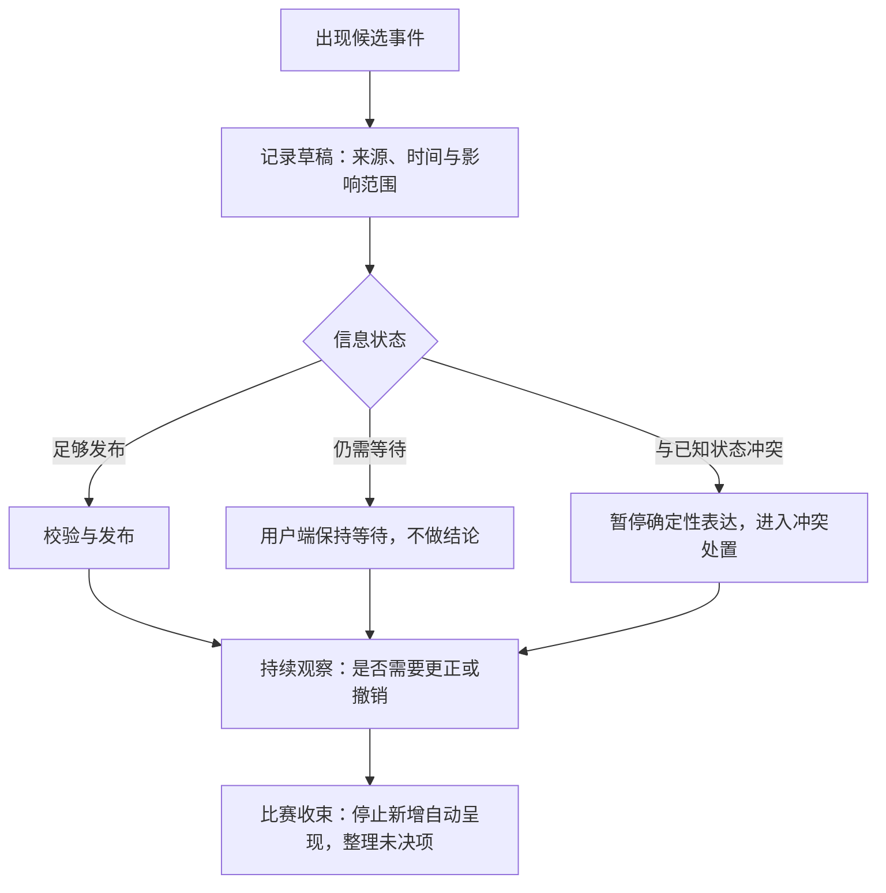
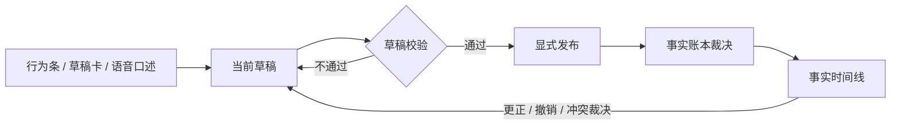

# 导播台与运营配置设计

> **这份文档写给谁**：想了解球球（即数字球友 Digital Ballmate）在比赛期间如何做人工运营的读者、研究运营工作台设计的课程学员，以及与我们合作的伙伴。
> **文档类型与所属**：导播台与运营配置设计，属《球球全套资料》第四卷"产品设计"。整套资料中，人工运营的职责边界、权限模型、审计口径与比赛事实操作以本篇为唯一来源。
> **它是什么**：第 1 节讲我们坚持的运营原则；第 2 节按现网版本如实描述导播台——两个角色、双通道登录、概览首屏、实战导演页与运营配置；第 3 节交代从旧单页迁移到导播台的历程；第 4 节收拢边界与红线。
> **先说清楚一件事**：导播台服务于事实可靠、用户安全和可追溯的运营，不是"替角色操纵用户"的后台。人工存在的意义是让事实更可靠，而不是让表演更强。

---

## 1. 运营原则

### 1.1 为什么需要一个导播台

足球比赛节奏快、争议多、信息源不一致。用户可能先于公开信息看到事件，也可能处在与运营不同的转播进度；同一个进球可能经历确认、撤销、更正的反复。完全依赖自动化，会把不确定的信息快速放大；而未经约束的人工运营，又可能因为着急、立场、误操作或"制造气氛"的冲动，在用户端造成更大的误导。

导播台是我们为人工判断建立的边界。它回答几个具体问题：谁可以准备一场比赛，谁可以录入候选事件，谁可以发布给用户端，谁可以更正，何时必须停下来等而不是继续说，以及一项影响用户的操作事后如何追溯。它不是一个"让角色多说几句"的控制台，更不能成为查看私人对话、挑选用户或对个人施加关系压力的工具。

### 1.2 五条不可让步的原则

**第一，用户端与运营端隔离。** 用户端要帮助个人用户安心看球、控制陪看；导播台要在受限范围内维护赛事公共状态。两端之间只通过最小、明确、可解释的结果交换信息：从导播台到用户端，只传播已发布的事实、明确的更正和全局安全限制，不传播运营者的情绪、内部争论或未确认的候选；从用户端到导播台，默认只接收聚合健康信号和需要处理的最少异常。用户的某一句"我好像看到进球了"可以让系统保持等待，但它不会作为"某个用户的线索"展示给运营，更不会被改写成公共比分。

> 检验问句：这次两端之间的信息流动，交换的是完成任务所需的最少结果，还是一方的好奇心？

**第二，等待是合法产出。** 赛中循环允许"暂不发布"成为正确结果。事实未明时，用户端可以继续提供安静的文字帮助和本场控制，但导播台不能把空白视为失败而急于填充，不能把候选事件演成确定结论。"保持等待"与"发布"在界面上同等可达，选择等待的人不需要理由，也不应被视为消极。

> 检验问句：如果这条信息后来被证伪，用户此刻看到的是"等待说明"还是"一个被演成的结论"？

**第三，更正不是删除痕迹。** 用户已经看过的内容需要得到最小但明确的处理：什么状态变了、现在以什么为准。更正说明不必铺陈内部细节，也不能把责任推给用户或"系统偶尔会错"，关键是让用户不必怀疑自己记错了。若错误已触发不当的主动表达，先停止呈现，再处理更正文本；被撤销的事件不可在之后的对话中被当作共同经历或球迷梗引用。

> 检验问句：受影响的用户能否说清"现在以什么为准"，并且不觉得被角色或运营推卸责任？

**第四，关键操作必须留痕。** 每一次发布、更正、撤销、暂停、配置变更和处理用户报告，都保留最小责任线索：谁、何时、影响什么、为什么。留痕不是为了监视运营者，而是为了在用户受影响时能还原决策、发现流程漏洞、避免同类问题重复。记录强度与影响范围匹配：普通浏览和低风险准备不制造繁琐表单，不让团队淹没在填写里而错过真实风险。

> 检验问句：这次操作三个月后还能回答"谁、何时、为什么"吗？

**第五，导播台不是上帝视角。** 它不用于读取、搜索或评价用户的私人对话、情绪与现实生活资料；不用于向某个用户发送"角色在等你"式的定向内容；不允许把用户观察、社群传言或个人球迷立场直接变成公共比赛事实；不允许用角色表演或情感化台词掩盖比分与判罚尚未明确的状态；不以访问量、停留时长或付费目标决定赛事事实。这些不是愿景，是第 2 节里每一项现网能力的设计前提。

> 检验问句：删掉"运营"两个字，这个界面还有存在的理由吗？若答案只是"看得更多"，它就不该存在。

### 1.3 信息隔离的边界

"运营为了服务用户所以都能看"不是我们接受的隔离原则。两端各自能看到什么，按信息类别划清：

| 信息类别 | 用户端看到 | 导播台看到 | 处理原则 |
| --- | --- | --- | --- |
| 已确认比赛事件 | 与所选比赛相关的状态、时间与必要说明 | 候选、已发布、更正关系与处理理由 | 用户看结果；运营只为维护事实看过程 |
| 用户个人观察 | 仅用户自己的本场表达 | 不作为可识别个人资料浏览 | 观察可触发保守等待，不直接成为公共事实 |
| 私人对话与共同瞬间 | 用户本人在授权范围内可见 | 不作为日常运营内容 | 仅在有明确、受限支持依据时按最小范围处理 |
| 角色表现配置 | 用户看见自己本场选择的结果 | 只维护全局安全上限与赛事配置 | 不对单个用户做关系化定向调节 |
| 风险与异常统计 | 与自己有关的简单状态 | 聚合、去标识的运营信号 | 先看模式与影响，避免追踪个人 |
| 审计线索 | 与自己资料、更正直接相关的解释 | 完整的操作责任、时间和理由 | 访问遵循最小必要和职责分离 |

### 1.4 一场比赛的运营节奏

**赛前，准备的是条件而不是台词。** 确认比赛信息与时间明确、事实来源可用、值守有人能处理更正与停止、用户端说明与控制入口完好。赛前不把"预测某队赢""设计爆点""让角色带节奏"列为开放条件——它们至多是可选的内容研究，永远不能覆盖事实与用户控制的基础条件。

**赛中，循环的核心动作是"记录、等待、发布、更正"。** 候选事件出现后先记成草稿，信息足够就走发布，不足就保持等待，与已知状态冲突就暂停确定性表达并进入冲突处置：

**赛后，先问影响再谈改进。** 确认是否仍有未决候选或更正、停止本场的自动主动表达、保留用户主动打开的最小回看。复盘的第一问不是"怎样让用户看更久"，而是"用户有没有被误导、被打扰、被越权触达"。赛后的受限复核检查：哪些事实被更正、哪些操作造成了影响、哪些风险信号需要改善——输出聚焦流程改进，不排名"谁最能带动互动"。

---

## 2. 现状：导播台

以下能力今天已经在运行。导播台是部署在 `/console` 的独立控制台，与用户端共用同一个后端，但身份、权限和界面完全分开。页面分两层：

- **全局层**：概览（首屏）、话题台账、引用审计、运营员管理；
- **比赛层**：比赛设置（阵容、数据源、自动化策略）、比赛用户详情、实战导演页。

### 2.1 两个角色，四个权限范围

我们把运营身份收敛到两个角色、四个权限范围（scope）。每个运营员是一条具名身份记录，不设共享账号：

| 角色 | 权限范围 | 能做什么 | 不能做什么 |
| --- | --- | --- | --- |
| 导播（director） | 比赛写入、事实确认、事实更正、轨迹读取 | 配置比赛与自动化策略、发布与更正事实、裁决冲突、代客执行话题与画像操作 | 不能越出四个范围；同样看不到用户私人对话 |
| 审计（auditor） | 轨迹读取 | 查看概览、时间线、话题台账与引用审计 | 不能执行任何写操作 |

每个权限范围守护一组明确的路由：

| 权限范围 | 守护的操作 |
| --- | --- |
| 轨迹读取 | 概览、事件时间线、话题台账、引用审计等读取类访问 |
| 比赛写入 | 比赛与自动化配置、事件发布、时钟与数据源操作、话题与画像的代客操作 |
| 事实确认 | 事实确认、撤销、冲突裁决 |
| 事实更正 | 已发布事件的更正 |

权限最小化体现在三层。第一层是界面：审计角色登录后，所有写按钮直接隐藏，相关页面明确标注"只读"。第二层是服务端：每个路由逐一经权限范围校验，范围不足一律拒绝——界面只是第一道门槛，不是防线本身。第三层是时间：以临时密码签发的首令牌在改密完成前不携带任何权限范围，改密这个动作本身是唯一放行的路由。

吊销即删行。令牌校验是每次请求按哈希查表，没有缓存会话，删除一条运营员记录，下一次请求立刻失效；人用通道访问令牌的残留上界是它十五分钟的寿命。审计角色留下的是一条条实名记录：运营员姓名、动作、对象、时间——包括失败的登录尝试。

### 2.2 双通道登录

**人用通道：用户名加密码。** 登录后签发一对令牌，规则如下：

- **签发**：十五分钟的 HS256 访问令牌加三十天的刷新令牌；访问令牌的算法头固定，任何其他签名算法在校验签名之前就被拒绝，算法混淆这一类攻击在结构上不存在；
- **存储**：密码以 PBKDF2 派生存储；刷新令牌单次轮换——每次换新时旧行删除，库中只有哈希；
- **首登强制改密**：新运营员由导播在"运营员"页创建并选定角色，系统生成一个只显示一次的临时密码；首次登录会被一道不可关闭的弹窗强制要求改密，改完才算真正进入工作台。临时密码没有找回手段，丢了就只能重新创建；
- **日常与失败**：访问令牌过期凭刷新令牌自动续期，续期失败才回到登录页；权限不足不把人踢出去，只在页面内提示；退出登录销毁当前设备的刷新令牌行；失败的登录尝试同样进入审计。

**机令牌通道：个人令牌。** 保留给自动评测与脚本使用，与导播台页面无关。机令牌同样按 SHA-256 哈希存储、按请求查表、删行即失效。我们不把页面令牌交给脚本，也不把脚本令牌发给人——两条通道产生同一种身份声明形状，权限范围校验完全一致。

部署引导时，第一位导播由环境配置种子生成：凭据只在日志中出现一次，库中存的同样是哈希。

### 2.3 概览首屏的六格

导播台首屏就是运维概览，值班者不需要登进多台机器拼凑现状。六格各自回答一个问题：

| 格子 | 回答的问题 | 现网内容 |
| --- | --- | --- |
| 活跃比赛 | 现在有哪些比赛在被服务 | 比赛、状态（赛前／直播中／中场／已结束）、在线用户数 |
| 在线会话 | 有多少用户正连接着 | 在线会话计数，直达话题台账 |
| 话题老化 | 未答话题积压了多久 | 今日／1–3 天／3 天以上三档分布 |
| 记忆健康 | 记忆管道是否正常 | 健康／降级徽标、积压深度、最近的实名审计记录 |
| 最近主动引用 | 球球最近为什么主动开口 | 最新的主动发言及其引用事实，直达引用审计 |
| 词汇漏斗 | 用户的话有多少没被接住 | 近 24 小时"没接明白"回合占比与最新原话样本 |

六格里没有互动量、停留时长或转化指标。概览回答的是"服务现在健康吗、球球说话有没有依据"，不是"用户有多活跃"。

### 2.4 实战导演页：只写草稿的事实流水线

实战导演页是每场比赛的实时运营面，核心纪律只有一条：**任何入口都只写草稿，绝不直接发布**。发布永远是一次显式动作，由后端事实账本最终裁决。

**行为条：十八类比赛行为。** 页面上方的行为条按组排列全部预设，点击任何一类只是把预设写进当前草稿：

| 分组 | 事件 | 必填角色 | 比分影响 |
| --- | --- | --- | --- |
| 高频 | 进球 | 进球者 | 自动 +1 |
| 高频 | 射门 | 射门者 | — |
| 高频 | 绝佳机会 | 进攻者 | — |
| 高频 | 扑救 | 门将 | — |
| 高频 | 错失 | 错失者 | — |
| 高频 | 犯规 | 犯规者 | — |
| 纪律 | 黄牌 | 吃牌者 | — |
| 纪律 | 红牌 | 红牌球员 | — |
| 纪律 | 点球 | 造点与主罚按需补充 | — |
| 人员／战术 | 换人 | 换上与换下 | — |
| 人员／战术 | 战术变化 | 按需补充关键球员 | — |
| 人员／战术 | 持续压迫 | 按需补充攻防双方 | — |
| 人员／战术 | 伤停 | 受伤球员 | — |
| 特殊 | VAR 检查 | 按需补充 | 置为候选 |
| 特殊 | VAR 结果 | 需引用被审事实 | — |
| 特殊 | 进球取消 | 需引用原进球 | 自动 −1 |
| 特殊 | 比分更正 | 需目标比分与更正原因 | 静默落账 |
| 特殊 | 备注 | 按需补充相关球员 | — |

**草稿卡：把预设变成一条完整的候选。** 事件类型、强度、推荐动作由预设自动填好，人再补齐参与者。校验规则由事件定义驱动：进攻方角色必须属于事件球队，防守相关角色自动归入对方，换上与换下必须同队，必填角色缺一不可，与已确认球员不一致的名字会被拦下要求确认。校验不通过，草稿发不出去。

每条事件还要选择球球的反应方式，一共三档：让球球按事件自动生成反应、保持静默不主动发言、或使用人工撰写的主动话术——选了手写话术就必须填写内容，留空的草稿发不出去。发布出去的每条事件载荷都带着两个标签：录入时捕获的比赛时钟版本和输入来源（键盘录入或语音口述），事后任何一条事实都能回答"它是在哪个时钟版本下、以什么方式录入的"。

**语音草稿。** 导演可以口述代替点选：录音上传后先经语音识别转写，再由大模型抽取结构化字段——球队、事件类型、参与者、描述、比赛时钟和逐字段置信度。抽取结果合并进当前草稿时，凡是与已有内容不一致的字段，都会逐项进入冲突卡：是保留手填的，还是采用语音识别的，必须一项一项裁决。全部调和、校验通过之前，发布不可用。转写内容若不像赛事口述，会被直接拒绝，不进入草稿。

**事实时间线。** 已发布的事实按状态展示和流转：

| 状态 | 含义 | 允许的下一步 |
| --- | --- | --- |
| 已确认 | 已达到发布条件的最小事实 | 更正、撤销 |
| 候选 | 有依据但尚未确认（如 VAR 检查期间） | 确认、撤销 |
| 冲突 | 多来源事实互相矛盾 | 裁决采用其中一个候选，必填理由 |
| 已采用 | 冲突裁决后胜出的版本 | 更正、撤销 |
| 已撤销 | 不再作为有效事实 | 保留线索，不可再被引用 |

> 台词条（候选/已采用等）为导播台内部处理用语，保留原样；对应产品侧五态：待确认/已确认/冲突/已调和/已撤销（见《比赛事实与公开比分设计》）。

把一条已发布事件拉回草稿修改后再次提交，就是一次更正：更正必须填写原因，原因作为证据随事件入账。状态名称体现的是信息质量而不是运营者的自信——候选不是"差一点就是真的"，冲突也不是用户该被催促等待的戏剧桥段。用户端看到的始终是状态与结论的最小组合——确认、等待、更正——而不是内部的处理过程。

### 2.5 比分与争议事件的纪律

比分是用户最敏感的事实，我们对四类事件单独立规矩：

- **进球自动加一，且只加一次。** 发布进球时比分预设为当前加一，后端账本校验事件的比分必须恰好从当前推进到当前加一——多加、少加或重复推进都会被拒绝；事实账本还要求同一个进球只能有一条有效的公开记录，重复发布直接报错。
- **进球取消必须引用原进球。** 取消事件必须指明撤销哪一个已发布的进球，比分随之自动回退一球；账本拒绝取消一条从未公开的进球，也拒绝重复取消。
- **VAR 结果必须引用被审事实。** 发布 VAR 结论必须指明它针对的是哪一条已在账的事实，不能凭空宣布结论；审查进行中的检查事件本身以候选状态存在。
- **比分更正强制静默。** 更正比分是纠错，不是内容：它不触发球球的任何主动话术，静默落账。目标比分必须与当前公开比分不同，且必须填写更正原因——原因进入事件证据，审计可查。

### 2.6 并发与网络不制造事实错误

比赛日的两个物理事实是多端同时在线和网络必然抖动。我们的对策是两条工程纪律：

**时钟冲突自愈。** 校时操作携带预期的版本号；如果另一端已经校准过时钟（服务器返回 409 冲突），页面不报错堆栈，而是自动重读最新时钟并提示"已被另一端校准，已自动同步"。一次冲突不会变成连环失效。

**幂等写。** 每个逻辑写请求自带一个幂等键，服务端识别出重放就返回上一次的结果并标记"已重放"。网络超时或服务端异常后的自动重试复用同一个键——同一次点击，无论网络抖动多少次，账上永远只落一条事实。

### 2.7 引用审计：回答"它为什么说话"

球球的每一次主动发言都会在执行轨迹上留下一个以 `proactive_citation:` 为前缀的引用标记，指向它所依据的事实或话题。引用审计页可以按比赛和引用前缀深查全部轨迹，每条轨迹展开后能看到：

- 当时的路由意图与置信度，回复是否被采用；
- 完整的原因码——在界面上翻译成人话，例如"主动引用 · 某事实""话题已答""话题过期""承诺到期"；
- 证据抽屉里的原始依据，按引用逐条对应。

概览首屏的"最近主动引用"把最新的引用直接送到值班者眼前。这个问题——"它刚才为什么说话"——必须永远能在几分钟内得到有据可查的回答，而不是靠回忆或猜测。

### 2.8 用户代客操作：只读是默认

运营确实需要在用户求助时代为处理，但默认姿态是只读。用户详情页并排三块信息：画像、话题台账、交互历史。

- **画像只读。** 球球对用户的理解（画像）对运营完全可读、不可改。导播可以按用户利益删除单个画像槽位：二次确认、记入审计、不支持导出内容。删除的是"球球以为它知道的事"，不是用户的对话记录。
- **话题台账可收口。** 台账记录四类开放话题——未答提问、承诺、情绪时刻、预测，状态在待答、已答、过期之间流转。导播可以把一个超时未答的话题标记为已答或过期，让台账反映真实状态；审计角色只能看。
- **交互历史如实呈现。** 用户的发言、球球的回复、主动发言与播报回执按时间列出，投递状态可见——它用于回答"刚才发生了什么"，不用于评价用户。
- **话痨档位刻意只读。** 用户在客户端选择的球球话痨档位（现网为安静／刚好／热闹三档）在比赛页只是只读展示。运营端改不了它——档位是用户权利，运营侧与用户侧在这件事上刻意不对称，这是红线，不是待补的功能。

### 2.9 运营配置

导播台的比赛设置页承担三类配置：

- **自动化播报策略。** 自动播报或暂停的总开关、每次播报之间的冷却秒数（0–300 秒）、以及允许自动播报的事件范围——选项与行为条的十八类事件同一份词汇表，保证配置与展示永不脱节。策略整包保存、保存即生效，审计角色对整个策略只读。
- **数据源与人工接管。** 可以选择回放数据源（受控演示与演练）或实时数据源（携带比赛 ID 与预期延迟），随时启停。事实链的来源规则见《比赛事实与公开比分设计》。
- **赛前设置。** 双方阵容（号码、名字、位置、首发或替补）、开赛与重置。开赛请求携带整份配置，重置需要二次确认——这些动作都要求比赛写入权限并实名入审计。

配置的变更治理原则与《生产运维与发布门禁》一致：每一次变更都有范围、理由、生效时点、回退动作和责任人；紧急收紧可以先行，紧急放宽永远需要说明。

### 2.10 压力下的工作台规矩

导播台要在比赛压力下让人做出保守、正确、可解释的选择，我们为界面立了几条规矩：

1. 关键状态放在稳定位置，不随列表刷新跳动；
2. 每条候选事件在当前状态下只有一个明确的下一步，其余动作收进二级位置；
3. "等待"与"发布"同等可达，不把等待设计成失败；
4. 高影响动作前先显示会发生什么——删除画像槽位、过期话题、重置比赛都有二次确认——但紧急收敛不被弹窗拖慢；
5. 界面不以红色闪烁、倒计时或奖励色推动人冒险发布。

选择等待、升级或停止的人，是在保护服务的可信度，这一点写在设计里，而不是只写在口号里。

---

## 3. 沿革：从旧单页到导播台

导播台不是一次画出来的。它的前身是一个约四千行的零构建单页运营文件，其中最重的"实战导演"标签页承载了十八类事件草稿模型、事实时间线、语音草稿流、手动话术通道和比分更正——二十八条自动评测全部打在它身上，它既是安全网，也是每次修改的风险清单。

迁移分四步走，每步独立合并、独立可回退：先把事件模型从旧页纯移植到新台，用逐字节对拍的快照测试把旧模块锁成语义基准，移植走样会直接变红；再组件化草稿卡，然后迁移语音草稿流，最后重建事实时间线。新页建成后并不替换旧页，而是以并存方式上线，让真实比赛日做裁判。

并存期暴露的成本促成了提前退役：

- **跨页重复事件**：幂等键是每页各自生成的，同一逻辑事件从两页各发一次会落成两条事实——导演自造冲突再自行裁决，这在并存期结构性无解；
- **双凭证**：旧页靠共享令牌、新台靠个人身份，吊销后的残留窗口和审计身份的塌缩同时出现；
- **状态分歧**：自动化策略两侧各自整包保存，一个过期的旧标签页可能静默覆盖新台的配置；
- **恢复语义不对称**：时钟冲突旧页自动重读、新页一度只报错（后来修复了）。

并存的每一项成本都不会随时间衰减。最终，旧单页按修订后的退役门下线：二十八条行为断言全部迁移为驱动新导播台或直连接口且全绿，功能缺口（时钟自愈、实时数据源、赛前配置）逐项补齐，由项目所有者拍板确认。

退役之后：导播台成为唯一实时运营写入口，跨页冲突这类问题整体消失；接口请求形状冻结不变，迁移后的评测继续守护；旧事件模型文件保留为语义基准，对拍脚本照常运行；机令牌通道留给脚本与评测。

---

## 4. 边界与红线

### 4.1 干预级别三档

人工接管的范围按干预级别分三档：

- **单能力暂停**：只暂停主动行为，其余能力保留；
- **接管比赛**：整场比赛的输出服从人工判断；
- **路由范围收敛**：把某类请求整体收敛到保守路径。

一条固定规则：更安静的一档永远不会放开更响一档所限制的能力。人工介入的价值不在于每一秒都有人控场，而在于自动行为不适合继续时能迅速收敛——事实冲突、强刺激不适、边界风险、明显的错误呈现，都应当先收敛再调查。用户侧的静音、结束与纠正永远高于导播台的任何配置。

### 4.2 赛前准入的最小概念

赛前准入不是层层审批，而是一次简短确认：这场比赛是否具备保护用户的最低条件。人员上，事实、复核与交接的责任是否有人承担；事实上，候选、等待、冲突与更正的路径是否可用；控制上，用户侧的静音与结束是否优先于一切；隔离上，工作台是否默认不展示无关个人资料。准入结果应当记录为"开放哪些能力、保守关闭哪些能力、何时重新评估"，而不是只有通过与失败两种结局。对用户最负责任的选择，有时正是把一场比赛保持在更简单、安静、可控的服务范围内。

### 4.3 反指标与红线

每分钟发布事件数、角色发言次数、运营可见的用户字段数、用户被触达次数、赛事热度期间的互动量，都不是导播台的成功指标——它们更可能意味着抢先发布、越权访问或注意力抢占。我们更看重：团队是否知道何时等待、能否快速保护用户、是否只接触最少的信息、更正与退出是否清楚。

以下红线任一触碰即暂停相关能力并复盘：

- 读取与当前处理无关的私人对话或原始语音；
- 把用户观察、传言或个人立场直接变成公共事实；
- 用角色表演掩盖未确认状态；
- 对单个用户做关系化定向触达；
- 以运营效率为由跳过留痕与更正说明；
- 把访问量或转化目标混入事实与主动性决策。

导播台的一切设计——两个角色、四把锁、只写草稿的流水线、静默的比分更正、只读的话痨档位——都是为了让这些红线长在系统里，而不是写在墙上。

---

版本 2.0（2026-09-20）
