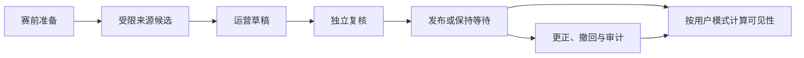
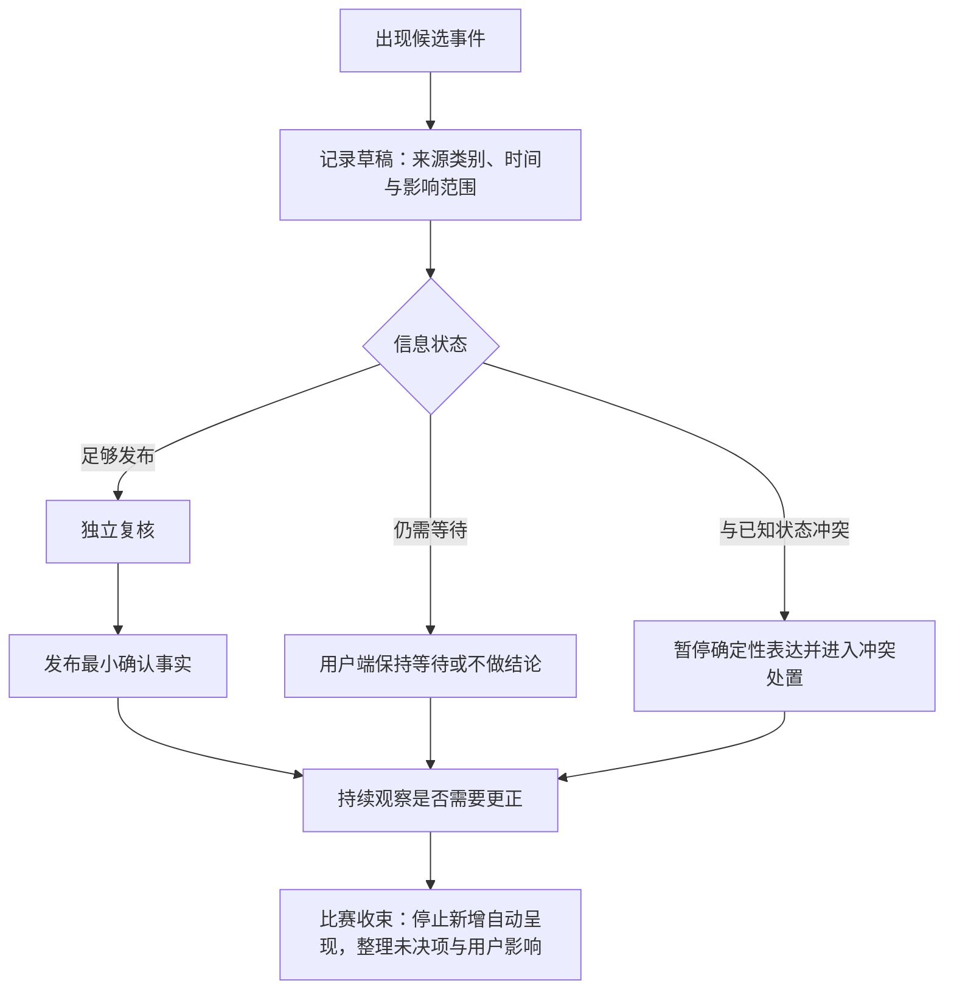
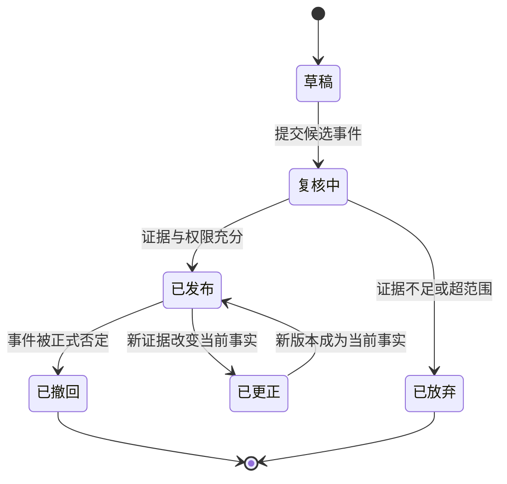
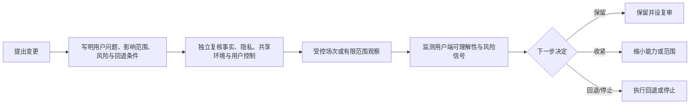

# 实战导演台与运营配置设计

> 文档类型：0→1 赛事陪看运营工作台、人工介入与配置治理设计  
> 适用阶段：基础用户端陪看已具备最小价值后，验证人工运营如何在不侵入用户和不伪造事实的前提下支撑一场比赛  
> 版本：0.1（角色职责、审核强度、事件时限、配置范围和处置阈值均为待验证假设）  
> 研究信息截止：2026-01-28  
> 核心原则：导演台服务于事实可靠、用户安全和可追溯的运营，不是“替角色操纵用户”的后台。任何人工操作都应有明确角色、最小权限、可解释影响、可撤回或更正路径；用户端只接收与自己当前比赛和授权范围相关的结果。

---

## 1. 为什么需要导演台：人工存在必须让事实更可靠，而不是让表演更强

足球比赛具有高节奏、争议、延迟和信息源不一致的特点。用户可能先于公开信息看到事件，也可能处在与运营不同的转播进度；同一进球可能经历确认、撤销、更正等变化。完全依赖自动化内容会把不确定信息快速放大，而未经约束的人工运营又可能因着急、偏见、错误操作或“制造气氛”的冲动，在用户端造成更大误导。

导演台的价值是为人工判断建立边界：谁可以准备一场比赛、谁可以录入候选事件、谁可以发布给用户端、谁可以更正、何时必须暂停而不是继续说、如何追溯一项影响用户的操作。它不是一个“让角色多说几句”的控制台，更不能成为查看私人对话、挑选脆弱用户或对单个用户施加关系压力的工具。

候选结果是：

> 一支最小运营小组可以在比赛前准备赛事、在比赛中以受控流程处理候选事实、在争议或错误时收敛而非猜测、在必要时对所有受影响用户给出简短可理解的更正；导演台无法越权查看或操纵用户私人资料，所有高影响操作都有清楚的责任、理由和复核线索。

### 1.1 导演台的非目标

- 不用于读取、搜索、汇总或评价用户的私人对话、原始语音、情绪、共同瞬间或现实生活资料；
- 不用于向某个用户发送“角色在等你”“该回来陪她”的定向内容；
- 不允许人工把用户观察、社群传言、个人球迷立场或猜测直接变成公共比赛事实；
- 不允许用角色表演、主动密度或情感化台词掩盖比分、事件或判罚尚未明确的状态；
- 不让同一人无约束地完成高影响事件的录入、发布、更正和事后评定；
- 不以运营效率为理由跳过事实状态、影响范围、理由记录和更正说明；
- 不把访问量、用户停留、互动次数或付费目标作为决定赛事事实或角色主动性的依据；
- 不将导演台展示为“上帝视角”，让运营人员形成对用户或角色的无限控制预期。

---

## 2. 用户端与运营端隔离

导演台与用户端解决的问题不同：用户端要帮助个人用户安心看球、控制陪看；导演台要在受限范围内维护赛事公共状态和运营安全。两个端之间只通过最小、明确、可解释的结果交换信息，不能共享一个无边界的“全知面板”。

### 2.1 信息隔离矩阵

**信息类别：已确认比赛事件**
- **用户端可见**：与用户所选比赛相关的状态、时间和必要说明
- **导演台可见**：候选、已发布、更正关系与处理理由
- **处理原则**：用户看到结果；运营只为维护事实看过程

**信息类别：用户个人观察**
- **用户端可见**：仅用户自己的本场表达
- **导演台可见**：默认不可作为可识别个人资料浏览
- **处理原则**：观察可触发保守等待，不直接成为公共事实

**信息类别：私人对话与共同瞬间**
- **用户端可见**：用户本人在授权范围内可见
- **导演台可见**：不作为日常运营内容
- **处理原则**：仅在有明确、受限支持依据时按最小范围处理

**信息类别：角色表现配置**
- **用户端可见**：用户看见自己本场选择的结果
- **导演台可见**：只维护全局安全上限与经批准的赛事配置
- **处理原则**：不能对单个用户以关系化方式定向调节

**信息类别：风险与异常统计**
- **用户端可见**：用户看到与自己有关的简单状态
- **导演台可见**：聚合、去标识的运营信号
- **处理原则**：先看模式与影响，避免追踪个人

**信息类别：审计线索**
- **用户端可见**：用户可查看与自己资料/更正直接相关的解释
- **导演台可见**：完整操作责任、时间和理由
- **处理原则**：访问遵循最小必要和职责分离

“运营为了服务用户所以都能看”不是合理的隔离原则。导演台若需要处理一项用户报告，应先显示问题类型、比赛、时间和最少上下文；只有被授权的角色在确有必要时才处理更具体内容，并且不能把它转作角色训练、用户画像或商业触达素材。

### 2.2 双向影响的安全规则

从导演台到用户端：只传播已发布赛事状态、明确的更正、全局安全限制和用户已授权的可见结果。不得推送运营人员的情绪、内部争论、未经确认候选、针对个人的揣测或营销意图。

从用户端到导演台：默认只接收聚合健康信号、用户主动报告和需要处理的最少异常信息。用户的“我好像看到进球了”可以使系统保持等待，不应自动显示给运营人员作为“某用户的线索”，更不能让运营直接把其改写成公共比分。

---

## 3. 运营角色与职责边界

最小团队也应在职责上分开“准备”“事实”“安全”“支持”和“复核”。同一人可能在低风险场次承担多项工作，但高影响动作仍要有清楚的身份、理由与后续复核，不能因人数少而变成无人负责。

**角色：场次负责人**
- **核心任务**：准备赛事、确认班次、决定何时开启/收束运营
- **可以做什么**：创建场次框架、检查配置、发起暂停
- **不可以做什么**：单独把争议候选发布为确定事实

**角色：事实编辑**
- **核心任务**：录入来源明确的候选事件和更正建议
- **可以做什么**：创建草稿、附上时间与来源类别
- **不可以做什么**：访问用户私人资料、直接操纵角色与用户关系

**角色：发布复核人**
- **核心任务**：判断候选是否达到发布条件
- **可以做什么**：发布、拒绝、要求补充或保持等待
- **不可以做什么**：自己编造来源、跳过影响说明

**角色：安全观察人**
- **核心任务**：监控聚合异常、强刺激和边界风险
- **可以做什么**：暂停高风险自动表现、升级处置
- **不可以做什么**：以安全名义阅读无关私人对话

**角色：用户支持处理人**
- **核心任务**：回应用户主动报告、解释本场控制与更正
- **可以做什么**：在授权范围内处理问题、指引删除/恢复
- **不可以做什么**：擅自恢复资料、代表用户开启提醒

**角色：复核负责人**
- **核心任务**：事后复盘高影响操作、改进流程
- **可以做什么**：查看受限审计线索、提出流程修订
- **不可以做什么**：将复核材料用于评价用户价值或角色亲密度

角色名称可以随组织规模调整，但“谁能让公共事实变化”“谁能让自动呈现停止”“谁能触及个人资料”“谁负责之后复核”必须可分辨。对用户而言，这意味着一次错误不会被单一运营者悄悄掩盖；对运营者而言，这意味着正确的保守选择得到制度支持。

### 3.1 权限的最小化

每个角色只获得完成职责所需的能力：场次负责人不默认拥有个人资料访问权；事实编辑不默认拥有发布权；支持处理人不默认拥有公共事实修改权；安全观察人可以停止高风险自动表现，但不能借此向用户发送个性化劝留。权限应按场次、时间和操作类别收敛，而不是一次授予长期“全能账号”。

### 3.2 临时代理与交接

比赛可能跨时区、延长或出现突发情况。交接时需要一份可读的场次摘要：比赛状态、已发布事件、等待中的候选、正在生效的安全限制、未解决用户影响和下一位负责人。摘要不包含无关私人资料，也不把“某用户很活跃/很脆弱”作为交接内容。交接完成后，前一位人员不应继续保留本场的高影响操作能力。

---

## 4. 赛事工作流：从准备到收束

### 4.1 赛前准备

赛前工作不是预写大量角色台词，而是确认用户端能够安全、清楚地进入一场比赛。首轮准备清单包括：赛事名称和时间是否明确、双方信息是否可用、比赛状态从何时开始、哪些来源类别可作为候选、谁负责事实与安全、用户端的默认陪看强度是否保守、异常时如何暂停和对外说明。

**准备项：场次范围**
- **负责人**：场次负责人
- **用户价值**：用户不会进入错误或模糊的比赛房间
- **不通过时**：不开放本场入口

**准备项：事实来源类别**
- **负责人**：事实编辑与复核人
- **用户价值**：事件有可解释的确认路径
- **不通过时**：只提供非实时基础体验

**准备项：人员与交接**
- **负责人**：场次负责人
- **用户价值**：关键时刻有人能处理更正与停止
- **不通过时**：降级为无自动赛事反应

**准备项：安全上限**
- **负责人**：安全观察人
- **用户价值**：不因赛事热度提高声音/动态风险
- **不通过时**：采用最低刺激呈现

**准备项：用户端说明**
- **负责人**：场次负责人
- **用户价值**：用户知道确认、等待与控制入口
- **不通过时**：修复说明后再开放

赛前不应把“预测某队赢”“设计爆点”“让角色带节奏”列为发布条件。它们可能是可选内容研究，但永远不能覆盖事实与用户控制的基础条件。

### 4.2 赛中循环

循环的重点是允许“暂不发布”成为正确产出。导演台不能把空白视为失败而急于填充；在事实未明时，用户端可以继续提供安静、文字、本场控制和主动对话，但不能把候选事件演成确定结论。

### 4.3 赛后收束

终场后，导演台需要完成三件事：确认是否仍有未解决候选或更正；停止本场的自动主动表达；向用户端保留用户主动打开的最小回看，而不是把运营总结强推到每个人屏幕。随后再进行受限复核：哪些事实被更正、哪些操作造成影响、哪些风险信号需要改善。赛后复核不应变成“怎样让用户看更久”的会议，而要先问“用户有没有被误导、被打扰、被越权触达或被迫照顾角色”。

---

## 5. 事件草稿、复核、发布与更正

### 5.1 事件状态模型

**状态：草稿**
- **含义**：已收到候选，但尚不足以影响公开状态
- **用户端呈现**：不显示为事实
- **允许操作**：补充、放弃、送复核

**状态：待复核**
- **含义**：有基础依据，等待独立判断
- **用户端呈现**：可选地显示“等待确认”，不显示结论
- **允许操作**：发布、退回、保持等待

**状态：已发布**
- **含义**：已达到本场发布条件的最小事实
- **用户端呈现**：显示确认状态与必要时间/内容
- **允许操作**：后续更正、撤销或补充说明

**状态：冲突中**
- **含义**：候选与已发布状态不兼容或来源相互矛盾
- **用户端呈现**：停止确定性表达，显示可理解等待说明
- **允许操作**：调查、保留已知状态、作出更正决定

**状态：已更正**
- **含义**：先前展示需要被替换或说明
- **用户端呈现**：显示“已更正”及最小前后关系
- **允许操作**：查看解释、处理受影响呈现

**状态：已撤回**
- **含义**：事件不应再作为公开事实使用
- **用户端呈现**：不再作为有效事实呈现
- **允许操作**：保留受限操作线索，避免再次引用

状态名称要体现信息质量，而不是运营者的自信。草稿不是“差一点就是真的”，冲突中也不是用户应被催促等待的戏剧桥段。用户端只显示与其理解和行动有关的层级，不显示内部人员、来源细节或未发布猜测。

### 5.2 草稿最小字段

每一条候选事件至少有：对应场次、事件类型、比赛时间、影响对象、来源类别、录入时间、录入者职责、状态、理由摘要、与已知状态的关系。字段的目的不是堆积表单，而是让复核人能回答“这是什么”“为什么现在出现”“会影响什么”“若错了怎样更正”。

不得录入用户的真实姓名、私人对话、情绪描述、关系印象或无关身份资料作为事件依据。若用户报告导致需要保持等待，只记录去识别化的“用户侧出现未确认观察”类别即可。

### 5.3 发布条件

候选事件只有同时满足以下条件才可发布：

1. 属于本场比赛且时间/对象不明显矛盾；
2. 来源类别达到预先约定的确认要求，或获得独立复核；
3. 不会让比分、阶段或此前有效事件产生无法解释的冲突；
4. 用户端能以最小、非夸张方式表达，不需要角色表演来弥补信息缺口；
5. 发布人了解影响范围，并知道若错误如何触发更正；
6. 没有更高优先级安全、权限或用户端停止条件阻止呈现。

任何一项不成立，保持等待或不发布。运营速度重要，但不应以先发布后解释作为默认节奏。

### 5.4 更正与撤回

更正不是删除痕迹。用户已经看过的内容需要得到最小但明确的处理：什么状态改变了、现在以什么为准、是否影响此前角色反应或用户端时间线。更正说明不必铺陈内部细节，也不应把责任推给用户、网络或“系统偶尔会错”；关键是让用户不必怀疑自己是否记错。

若错误已导致不适当的自动声音、角色表演或提醒，优先停止相关呈现，再处理更正文本。撤回后的事件不可被角色在下次对话中作为共同经历或球迷梗引用。

---

## 6. 人工介入：停止、收敛与支持优先

人工介入的价值不在于让每一秒都“有人在控场”，而在于自动行为不适合继续时能迅速收敛。高风险情境包括事实冲突、突发公共事件、强刺激不适报告、边界风险、异常触达、共享设备泄露或明显错误的自动呈现。

### 6.1 介入等级

**等级：L0 观察**
- **触发情境**：无明显异常，运营只需关注场次节奏
- **人工动作**：不改变用户端
- **用户端结果**：保持用户已选模式

**等级：L1 收敛**
- **触发情境**：事实等待、轻度呈现过多、个别配置不合适
- **人工动作**：降低本场自动表现上限
- **用户端结果**：用户可见“本场已减少自动提示”，仍可主动使用

**等级：L2 暂停**
- **触发情境**：冲突、强刺激风险、可疑错误或较广影响
- **人工动作**：停止相关自动事实/声音/动作路径
- **用户端结果**：用户看到简短状态与基础控制，不被误导

**等级：L3 更正支持**
- **触发情境**：已发布错误或用户受到实质影响
- **人工动作**：发布更正、停止旧引用、提供帮助入口
- **用户端结果**：用户可理解改变并决定是否继续/结束

**等级：L4 重大处置**
- **触发情境**：安全、隐私或高风险关系问题
- **人工动作**：停止相关场次能力，启动受限处置
- **用户端结果**：用户优先获得保护、退出与支持信息

导演台不应用全局配置一键把某场所有用户的角色变得更激动。即使处于低风险时段，用户选择安静、仅文字或结束始终高于运营的全局配置。

### 6.2 用户报告的处理

用户主动报告“比分不对”“太吵”“这句话不合适”“不想被提醒”“我感到不舒服”时，导演台首先按问题类型分流：事实问题进入待复核；呈现问题先给用户即时控制并检查是否有系统性影响；资料问题进入最小必要的支持流程；关系或危机信号优先停止角色化表达并提供现实支持路径。

处理人员不要求用户证明自己、重复敏感内容或解释为何不适。对“太吵”最先做的是帮助其关闭声音/动态，不是反问“你是不是不喜欢角色”；对“比分不对”最先做的是进入等待或更正，不是让角色辩解。

---

## 7. 权限、审计与责任线索

### 7.1 高影响操作的责任记录

每一次发布、更正、撤回、暂停自动呈现、调整全局安全上限、处理高风险报告或访问受限资料，都应保留最小责任线索：谁以什么角色操作、何时、影响哪个场次/范围、为什么、采取了什么动作、之后是否被复核。它不是为了监视运营人员，而是为了在用户受影响时能还原决策、发现流程漏洞并避免同类问题重复。

普通浏览、低风险场次准备和个人本场控制不需要制造繁琐记录。记录强度应与影响范围相匹配，避免把团队陷入填写表单而错过真实风险。

### 7.2 可见性分级

**线索：赛事更正说明**
- **用户可见范围**：受影响用户可查看最小解释
- **运营可见范围**：处理链与影响范围
- **用途限制**：不展示个人身份或内部争议细节

**线索：用户资料动作**
- **用户可见范围**：用户本人可查看自己的保存/删除结果
- **运营可见范围**：仅处理必要支持者查看最少内容
- **用途限制**：不用于内容运营或关系判断

**线索：事件发布线索**
- **用户可见范围**：用户看状态与时间，必要时看原因概述
- **运营可见范围**：角色、时间、理由、复核关系
- **用途限制**：不泄露未发布候选或私密来源

**线索：安全处置线索**
- **用户可见范围**：用户看自身可用性与支持入口
- **运营可见范围**：受限人员看处置原因和范围
- **用途限制**：不作为用户价值评分

### 7.3 定期复核问题

每场高影响比赛后，复核负责人应至少检查：是否有事件被过早发布；更正是否被清楚说明；自动呈现是否在用户选择安静后仍出现；是否出现共享环境泄露；受限资料访问是否确有必要；是否有用户报告未得到最小回应；是否存在将运营目标混入事实或关系表达的迹象。复核输出聚焦流程改进和用户影响，不排名“谁最能带动互动”。

---

## 8. 可用性、培训与演练

导演台的难点不只是功能完整，而是在比赛压力下仍让人做出保守、正确、可解释的选择。工作台应把关键决策做成清楚的下一步，而不是在一堆数据、聊天和控制中让运营人员猜。

### 8.1 工作台可用性原则

- 场次状态、待复核数量、冲突状态和安全暂停必须在稳定位置可见；
- “发布”前显示最小影响摘要与当前事实关系；
- “保持等待”与“拒绝草稿”应是同等可达的正常动作，不被设计成失败；
- 高影响动作提供可理解的更正/撤回路径，但不能用大量弹窗拖慢紧急停止；
- 用户资料入口与赛事编辑区明确分离，默认不显示可识别个人内容；
- 交接摘要、帮助和异常处置入口在比赛中可快速找到；
- 页面不以红色闪烁、声音报警或倒计时迫使人员冲动发布。

### 8.2 培训场景

| 场景 | 训练目标 | 合格表现 |
|---|---|---|
| 进球候选来源不完整 | 练习保持等待而非抢先发布 | 编辑记录草稿，复核人要求补充或不发布 |
| 已发布事件被撤销 | 练习更正、停止旧呈现与用户解释 | 先暂停相关自动反应，再发布最小更正 |
| 用户比运营先看到事件 | 练习不把个人观察变成公共事实 | 保持不确定表达，等待可发布依据 |
| 自动声音造成不适 | 练习用户控制优先与全局收敛 | 立即停止相关自动路径，提供文字替代 |
| 共享显示下出现私人资料风险 | 练习最小披露与快速离开 | 切换保守显示，清理可见摘要，复核默认 |
| 交接发生在争议时刻 | 练习责任连续与未决项传递 | 明确谁接手、哪些不发布、何时再判断 |
| 运营人员误触高影响动作 | 练习可撤回与责任记录 | 迅速停止影响、说明结果、进入复核 |

培训不以“多快做出激烈反应”为评分标准。更好的表现通常是：知道何时不发布、何时暂停、何时交给有权限的人、何时让用户保持安静和可控。

### 8.3 演练节奏

在正式扩大场次前，应完成赛前走查、赛中压力演练、赛后更正演练、共享设备演练和用户报告演练。每次演练结束记录哪些界面让人员误解、哪些权限过大、哪些用户端结果不清楚；改进后重新演练。不要把一次顺利的理想流程当作可长期承受真实比赛压力的证明。

---

## 9. 用户研究与运营评估

### 9.1 核心研究问题

1. 用户是否能从用户端区分已确认、等待、冲突和已更正，而不需要知道导演台细节？
2. 运营人员能否在压力下找到“保持等待”“暂停自动呈现”和“更正”的正确路径？
3. 职责分离是否减少过早发布与未经解释的高影响操作，还是造成无法处理的阻塞？
4. 用户报告是否能在不暴露过多个人资料的前提下获得有效处理？
5. 共享显示、低动态和安静模式是否始终高于全局运营配置？
6. 更正后用户是否知道当前以什么为准，且不觉得被角色或运营推卸责任？
7. 培训、交接和复核是否让团队更能保护用户，而不是只提高内容产出速度？

### 9.2 分阶段研究

**阶段：O1 流程理解**
- **方法**：角色卡、事件卡、状态复述
- **参与对象与材料**：运营候选人员与模拟场次
- **主要输出**：职责是否清楚、哪些术语易混淆

**阶段：O2 压力走查**
- **方法**：限时但不以速度为唯一目标的情境演练
- **参与对象与材料**：争议、延迟、更正、用户报告
- **主要输出**：等待/暂停/更正动作是否可达

**阶段：O3 用户端配对走查**
- **方法**：一组运营原型与一组用户端原型联动
- **参与对象与材料**：观察用户如何理解运营造成的状态变化
- **主要输出**：内部动作是否被正确翻译为用户可见结果

**阶段：O4 交接与异常演练**
- **方法**：多人轮换、共享设备、风险处置
- **参与对象与材料**：场次中断与高影响场景
- **主要输出**：责任是否连续、资料是否最小披露

**阶段：O5 小范围实战**
- **方法**：在明确范围内处理真实但受控场次
- **参与对象与材料**：运营、支持与自愿用户反馈
- **主要输出**：真实负担、风险信号与放行依据

### 9.3 研究伦理

运营研究不使用用户私人对话或情绪作为培训素材。若需要展示用户报告，先去除可识别内容，仅保留理解流程所需的最少类别。参与者可以指出流程压力、权限不清、界面诱导和心理负担；这种反馈不应影响其工作评价。用户侧研究参与者不应被告知“有人正在盯着你看球”，而应得到清楚、真实的用户端说明和反馈路径。

---

## 10. 指标、风险与验收门槛

### 10.1 候选指标

**指标：等待正确率**
- **定义**：信息不足或冲突时，运营选择保持等待/暂停而非发布的比例
- **判断什么**：团队是否尊重事实不确定性
- **不应怎样解读**：不等于越慢越好

**指标：发布可解释率**
- **定义**：已发布事件能追溯到最小理由、角色和影响范围的比例
- **判断什么**：责任与更正基础是否清楚
- **不应怎样解读**：不等于向用户暴露全部内部线索

**指标：更正清晰率**
- **定义**：受影响用户能说清现在以什么为准、如何继续的比例
- **判断什么**：更正是否真正修复理解
- **不应怎样解读**：不等于错误可以被容忍

**指标：用户端隔离合规率**
- **定义**：运营端未接触无关私人资料、用户端未收到内部候选的比例
- **判断什么**：最小披露是否成立
- **不应怎样解读**：小样本无事件不能替代持续复核

**指标：高影响双人复核率**
- **定义**：应当独立复核的操作实际经过复核的比例
- **判断什么**：职责分离是否有效
- **不应怎样解读**：不能以形式签字掩盖同一人实质决定

**指标：暂停生效时间**
- **定义**：从风险识别到相关自动呈现收敛的时间
- **判断什么**：人工介入是否保护用户
- **不应怎样解读**：不能为了速度跳过影响判断

**指标：培训情境完成率**
- **定义**：人员在演练中正确处理等待、更正、共享与用户报告的比例
- **判断什么**：工作台与培训是否可用
- **不应怎样解读**：不等于人员会背流程名称

**指标：权限误用事件率**
- **定义**：越权查看、越权发布、无关资料访问的事件数与严重度
- **判断什么**：权限设计是否可靠
- **不应怎样解读**：零报告不等于没有问题

**指标：关系化运营事件率**
- **定义**：用角色、留存或情绪目标驱动运营操作的事件数
- **判断什么**：运营边界是否健康
- **不应怎样解读**：低频也需高优先级处置

### 10.2 主要风险

**风险：抢先发布错误事实**
- **早期信号**：运营觉得“先说再改也没关系”
- **预防**：草稿/复核/等待状态、培训
- **触发后动作**：暂停确定性呈现，更正并复核流程

**风险：用户观察被误用**
- **早期信号**：人员要求查看或把用户输入当来源
- **预防**：信息隔离、去识别类别、最小披露
- **触发后动作**：停止该路径，删除不必要内容，复核权限

**风险：导演台操纵关系**
- **早期信号**：出现定向催回、情绪化台词或用户价值标签
- **预防**：用户端隔离、禁止关系化配置
- **触发后动作**：下线相关能力，升级边界处置

**风险：单人权力过大**
- **早期信号**：同一人连续录入、发布、更正且无复核
- **预防**：职责分离、临时权限、审计线索
- **触发后动作**：收回高影响权限，补做复核

**风险：更正被静默处理**
- **早期信号**：用户发现状态变化却不知原因
- **预防**：更正状态与最小说明
- **触发后动作**：提供可见更正，检查受影响呈现

**风险：安全暂停太慢**
- **早期信号**：风险中仍自动声音/动作不断出现
- **预防**：明确介入等级、快速停止入口
- **触发后动作**：优先收敛，再调查原因

**风险：培训只练理想场景**
- **早期信号**：真比赛出现交接、延迟、共享风险就混乱
- **预防**：压力演练与异常演练
- **触发后动作**：更新材料，重新演练后再扩场

**风险：运营负荷导致越权捷径**
- **早期信号**：人员绕过流程、查看过多信息
- **预防**：可用性设计、交接、班次边界
- **触发后动作**：缩小场次或能力范围，先修复流程

### 10.3 放行门槛

| 门槛 | 必须满足 | 未满足时 |
|---|---|---|
| 隔离门 | 用户端和导演台只共享完成任务所需的最少信息 | 不开放更广运营视图或定向能力 |
| 事实门 | 草稿、等待、发布、冲突、更正和撤回有清楚规则 | 停止自动赛事反应扩展 |
| 权限门 | 高影响操作角色清楚、最小授权且可追溯 | 收缩权限，补齐职责分离 |
| 停止门 | 风险发生时能快速收敛自动呈现并保留基础控制 | 不扩大场次，优先完善停止路径 |
| 用户影响门 | 用户能理解更正、不会因运营错误被角色化施压 | 重写用户端结果和支持流程 |
| 培训门 | 人员通过异常、交接、共享和用户报告演练 | 不进入真实场次或保持最低能力范围 |
| 复核门 | 高影响事件有独立复核和改进闭环 | 暂停扩展，先解决重复风险 |

### 10.4 反指标

每分钟发布事件数、角色自动发言次数、运营人员能看到的用户字段数量、用户被催回次数、赛事热度期间的互动量、内部台词产出量，都不是导演台首轮成功指标。它们可能意味着抢先发布、越权访问、注意力抢占或关系操控。更重要的是运营是否知道何时保持等待、能否快速保护用户、是否只访问最少信息、是否让更正和退出变得清楚。

---

## 11. 运营配置的变更治理

配置决定用户端会不会自动说话、什么情况下进入等待、哪些动作被安全上限限制、哪些场次可开放。它们看似只是几个开关，实际会改变用户能否安静看球、是否被错误事实影响、是否在共享环境被打扰。因此，配置不能被当作临时“调气氛”的工具；每一次变更都要有范围、理由、生效时点、回退动作和责任人。

### 11.1 配置分类

> 信息卡：原宽表已改为纵向阅读，字段含义不变。

- **配置类别：安全上限**
  - **例子**：最大声音、动态限制、争议时自动呈现禁用
  - **变更权限**：安全观察人与受限复核
  - **生效规则**：可在风险中立即收紧；放宽需复核
  - **用户影响**：可能减少自动内容，但不能损失基础控制

- **配置类别：事实策略**
  - **例子**：候选事件的确认要求、冲突时默认行为
  - **变更权限**：场次负责人、事实复核人
  - **生效规则**：赛前确认；赛中只因明确风险调整
  - **用户影响**：决定用户何时看到确认或等待说明

- **配置类别：场次配置**
  - **例子**：比赛范围、开放时间、基础入口、共享显示建议
  - **变更权限**：场次负责人
  - **生效规则**：赛前准备；赛中改动需说明影响
  - **用户影响**：决定用户能否进入以及看到什么范围

- **配置类别：表现配置**
  - **例子**：本场全局可用的角色反应类别和密度上限
  - **变更权限**：受限内容/安全角色
  - **生效规则**：默认保守；不得覆盖用户本场选择
  - **用户影响**：只限制自动呈现，不可针对个人关系化调整

- **配置类别：支持配置**
  - **例子**：报告分类、帮助入口、升级规则
  - **变更权限**：用户支持负责人
  - **生效规则**：变更前走查异常路径
  - **用户影响**：决定用户遇到问题时能否获得清楚帮助

任何配置都不能用于绕过用户选择。例如，把某场配置为“有限提示”只意味着在用户自己选择允许自动呈现时提供有限内容，不意味着可以对安静、仅文字、低动态或已结束的用户强行提高声音和动作。

### 11.2 变更生命周期

紧急情况下，安全收紧可以先行，例如停止自动声音或暂停有争议的事实呈现；但紧急放宽不应成为常态。任何在赛中临时提高自动性、改变事实门槛或扩大用户资料可见范围的提案，都应视为高风险变更，而非“运营优化”。

### 11.3 变更说明的最小内容

变更记录至少包含：它解决哪个用户问题；哪些场次和用户端行为受影响；谁提出、谁复核、谁执行；何时生效；出现何种信号必须回退；用户需要看到什么说明。避免写“提升参与”“加强陪伴”“拉高氛围”这类不可证伪目标，改为“减少用户在事实等待时误解为已确认”“确保低动态选择能停止所有非必要运动”。

对用户会明显感知的变更，应在适当位置给一句结果说明，例如“本场已减少自动提示”“这类事件会在确认后再出现”。不需要向用户展示内部变更单，但不能让重要体验突然变化而毫无解释。

---

## 12. 导演台信息架构与压力负荷设计

工作台本身的布局会影响运营人员在压力下的行为。若“发布”比“等待”更大、更亮，若私人用户资料与事实编辑并排，若状态靠几十个跳动提示表达，人员更容易做出冲动、越权或无法解释的动作。首轮信息架构应让最重要的判断在稳定位置出现，让低频、敏感或高影响操作自然变慢。

### 12.1 主工作区的五个区域

**区域：场次总览**
- **回答的问题**：现在是哪场、处于什么阶段、是否有风险
- **必要内容**：比赛状态、交接人、全局安全状态、未决数量
- **明确排除**：用户私聊、营销目标、无关比赛

**区域：事实队列**
- **回答的问题**：哪些候选等待、冲突或需更正
- **必要内容**：状态、时间、来源类别、影响摘要、下一步
- **明确排除**：未发布猜测的情绪化标签

**区域：用户影响**
- **回答的问题**：某次发布/更正会让用户端看到什么
- **必要内容**：最小用户端预览、等待/更正说明、停止范围
- **明确排除**：单个用户画像或可识别对话

**区域：安全与支持**
- **回答的问题**：是否需要收敛、暂停或升级
- **必要内容**：聚合报告趋势、快速停止入口、支持分流
- **明确排除**：将用户报告当作内容素材

**区域：交接与复核**
- **回答的问题**：还有什么未决、谁负责下一步
- **必要内容**：受限摘要、责任线索、回退状态
- **明确排除**：对人员或用户的情感评价

五个区域可以以标签或面板组织，但不得同时默认展开成一堵数据墙。比赛压力下的核心动作应是“确认当前状态”“选择等待/发布/暂停”“理解用户端结果”“安全交接”，而不是阅读大量无关指标。

### 12.2 降低认知负荷的规则

1. **稳定位置。** 场次状态、冲突和全局停止状态不随队列刷新跳动到新位置；
2. **单一主动作。** 每条候选根据状态显示一个明确的下一步，其他动作放入二级位置；
3. **等待可见。** “保持等待”要与“发布”同样清楚，且不写成消极或失败；
4. **影响先行。** 高影响操作前先展示用户端会发生什么，不先展示内部效率指标；
5. **分离敏感资料。** 需要处理的用户报告通过最小摘要进入，不能作为事实队列的常驻列；
6. **中断安全。** 任何人员离开、交接或网络中断时，系统优先保持保守状态，不让待处理候选自动发布；
7. **疲劳识别。** 超长场次、连续高风险动作或频繁撤回应触发交接/复核提醒，而不是鼓励同一人员继续独自处理。

### 12.3 关键操作确认

高影响确认不应只问“确定吗”。它需要帮助人做最后一次正确判断：这条事件目前是否已达到发布条件？用户端会看到已确认还是更正？是否存在冲突、安静用户、共享显示或安全暂停会限制呈现？若回答不清，工作台应鼓励回到等待或请求复核。确认框不能用倒计时、醒目奖励色或“快速发布”来推动冒险。

### 12.4 值班人员的支持边界

运营人员也会承受紧张比赛、用户报告和争议决策压力。系统要让他们能请求复核、交接、暂停自动表现和记录不确定，而不是把“始终热情、有判断、不断输出”当成个人品质。任何人都不应因为选择等待、升级或停止自动性而被视为“不给力”；这些动作正是保护用户端可信度的组成部分。

---

## 13. 场次准入清单

每一场进入受控运营前，场次负责人应进行一次简短准入确认。这不是为了增加层层审批，而是确认“今天这场是否真的具备保护用户的最低条件”。未通过时可以缩小能力，例如保留用户端基础控制与非实时信息，而不勉强开放自动赛事反应。

**检查项：人员**
- **准入问题**：事实、复核、安全和交接责任是否明确？
- **通过表现**：名单、替补和交接方式可见
- **未通过处理**：不开放高影响发布能力

**检查项：事实**
- **准入问题**：候选、等待、冲突与更正路径是否可用？
- **通过表现**：人员能说明何时不发布
- **未通过处理**：仅展示最小公开状态

**检查项：用户控制**
- **准入问题**：安静、仅文字、低动态、结束是否优先于全局配置？
- **通过表现**：任一模式都可立即生效
- **未通过处理**：先修复控制，不开自动呈现

**检查项：隔离**
- **准入问题**：工作台是否默认不展示无关个人资料？
- **通过表现**：队列与支持资料明确分区
- **未通过处理**：收缩访问范围后再进入场次

**检查项：停止**
- **准入问题**：风险发生时能否迅速收敛并告知用户？
- **通过表现**：停止入口、责任人与说明已演练
- **未通过处理**：保持低风险能力，不扩展

**检查项：复核**
- **准入问题**：赛后谁检查更正、权限和用户影响？
- **通过表现**：复核时间与负责人明确
- **未通过处理**：不扩大后续场次范围

准入结果应记录为“开放哪些能力、保守关闭哪些能力、何时重新评估”，而不是只有通过/失败两种结果。对用户最负责任的选择，有时正是把一场比赛保持在更简单、安静、可控的服务范围内。

---

## 生产版本设计拓展｜能力深化知识

本节描述产品成熟后的能力扩展、体验深化和治理要求，作为后续版本规划与设计决策的参考。

- 导演台可管理事实源资格、自动发布规则、提醒策略、角色表达版本、语音/舞台资产和全局收缩开关。
- 每次配置变更记录操作者、理由、影响范围、生效时间、回滚版本和审批状态；未审批配置不能进入用户会话。
- 运营只能查看完成任务所需的最小上下文，不直接读取无关私人资料、原始音频或未授权长期记录。
- 发生事实冲突、误触达、供应商故障或安全事件时，可暂停单场、单能力、单版本或全局，并向受影响用户给出中性说明。
- **评测与回滚**：演练审批超时、回滚失败、错误更正、删除屏障和人工交接；以恢复时间和错误范围作为放行门。

### 生产配置场景卡

- **事实规则**：配置来源、确认阈值、事件范围和更正策略；规则变更必须绑定版本并说明影响的赛事与用户。
- **触达规则**：配置提醒时间窗、频率、安静时段和默认媒介；运营不能把用户未回应当作加大触达理由。
- **角色版本**：配置口吻、动作和声音资产的适用范围；发布前通过身份、关系边界和事实状态脚本。
- **紧急暂停**：支持单场、单用户、单能力、单版本和全局五级暂停；暂停结果立即传播到 Agent run 与媒介队列。
- **审计**：记录操作者、审批人、理由、前后版本、命中用户范围和恢复条件；不记录无关私人原文。
### 生产运营能力卡

| 能力 | 触发与资格 | Agent/工具职责 | 用户可见结果 | 失败、撤回与放行 |
| --- | --- | --- | --- | --- |
| 事实配置 | 运营创建来源、确认阈值或更正规则草稿 | 配置工具校验范围和版本；Agent 只能读取已生效规则 | 用户端显示状态和说明，不显示内部草稿 | 未审批不生效；冲突时保持等待并可回滚 |
| 能力暂停 | 事实冲突、误触达、依赖故障或安全事件 | 运营工具按场次/能力/版本广播暂停，取消 Agent run 和媒介队列 | 用户看到中性暂停说明、当前可用能力和结束入口 | 广播失败保持保守状态；恢复需复核和灰度 |
| 交接与审计 | 班次结束、人员离开或高影响事项未决 | 交接工具生成最小摘要，权限工具撤销前任高影响权限 | 接班人看到未决事实、安全限制和下一步 | 摘要不得含无关私人资料；审计缺失阻断恢复 |

放行以审批完整、暂停传播、最小访问和交接复述为门；互动量不能成为配置放行依据。
