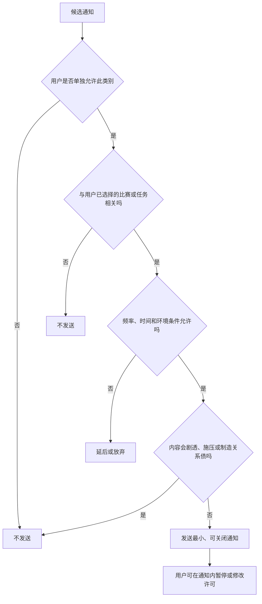
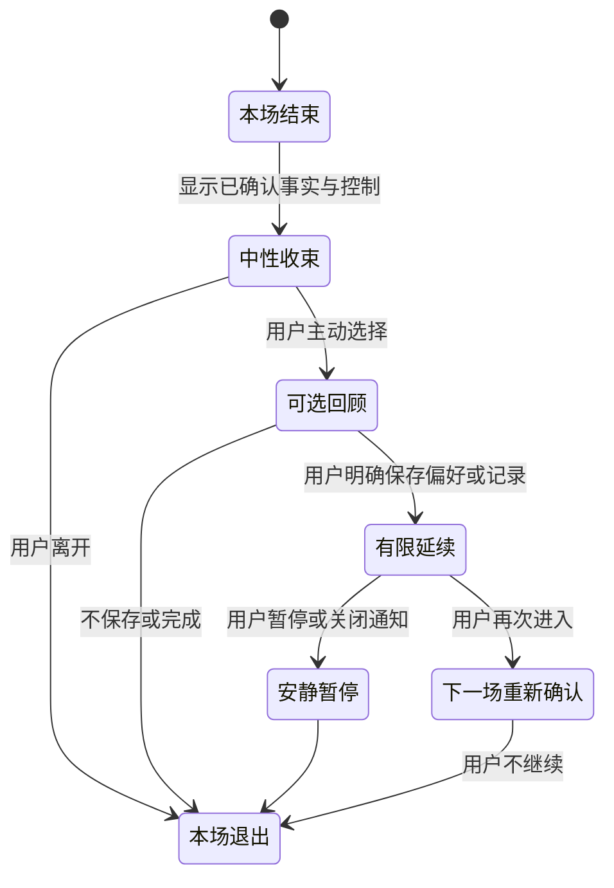
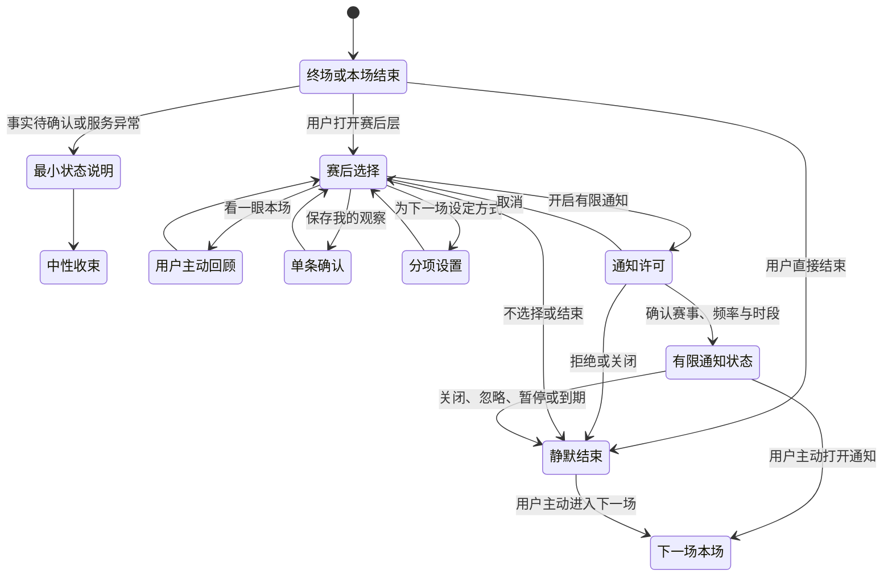

# 赛后跟进、通知与跨比赛回收设计

> 文档性质：0→1 产品设计决策稿  
> 适用对象：产品、内容、研究、运营、风险治理与交付团队  
> 决策状态：首轮方案；先验证用户能轻松拒绝和结束，再讨论扩大任何通知或跨场连续性  

## 1. 设计问题：赛后不是留住用户的窗口，而是把选择还给用户的时刻

比赛结束时，用户可能兴奋、遗憾、疲惫、忙着和现实中的人讨论，也可能只想关掉页面。陪看服务若把赛后视为“最适合再说几句、再推一次、再提醒下一场”的时机，就很容易从帮助收束变成延长停留。尤其当角色带有数字人形象、共同记录和连续性表达时，一句看似温暖的“别走，我们再聊聊”会把普通离开变成用户需要拒绝一个对象。

本篇的基本决定是：**赛后跟进是用户可选的收尾、保存和下一次进入机制，不是用通知、未完话题或关系化表达驱动回流的机制。** 服务应帮助用户在一场比赛结束后知道事实状态、完成自己选择的动作、带走自己想保留的内容、拒绝不想要的延续，并在下一次主动回来时自然地开始。

通知和跨比赛连续性只有在用户明确、分项许可且能轻易关闭时才有资格出现。用户未回复、很久没来、连续看了多场、在深夜使用、球队输球、表达孤独、购买服务或保存一条记录，都不是发起通知、挖出旧话题或提高触达频率的理由。

### 1.1 本篇的核心决策

1. 赛后默认是中性收束，不是持续追聊；用户不做任何选择时，服务安静结束；
2. 赛后能力拆为四项独立选择：查看本场摘要、保存用户主动选择的观察、设置下一场模式、开启一类有限通知；任何一项都不自动打开其他项；
3. 通知按目的、赛事、时间、通道和频率分别许可，默认关闭，且关闭后进入类别级冷却，不得换文案或换通道继续触达；
4. 跨比赛延续只引用用户明确保存且与下一场任务直接相关的低风险偏好或共同记录，不把本场情绪、未回复或关系表达当作“未完话题”；
5. 未完话题必须由用户主动标记或在赛后明确选择保留，且应以“我的比赛观察”而非“我们下次继续”的形式呈现；
6. 用户可在赛后页、通知本身和下一次进入时随时关闭、暂停、删除、静音、改频率或清空连续性；
7. 首轮衡量用户理解、控制、无压力结束和信息价值，不以打开率、回访、连续使用、通知点击或角色好感作为成功目标。

### 1.2 本篇不决定什么

本篇不定义比赛事实本身、全部内容策略、长期商业方案或角色人格。它只解决比赛结束后和下一场开始前，服务有哪些资格保留、提示、提醒或再次提起，以及这些行为如何不越过用户边界。

本篇也不把“跨比赛回收”理解为把用户拉回服务。这里的“回收”只指用户自己再次进入时，能否以更少重复设置继续观看。若用户不回来，服务不应把这看作需要纠正的关系事件。

### 1.3 成功与失败的定义

成功是用户在赛后能轻松结束，不接受回顾、保存、提醒或下一场设置也不失去基础服务；用户知道一条通知为何出现、多久一次、如何关闭；下一次主动进入时，角色只引用用户允许且与任务相关的内容；删除或关闭后，不再出现相近提醒或旧话题。

失败包括：用户离开时被角色挽留；用户没有回答就收到更多提醒；一场失利被转成情绪安慰通知；共同记录变成关系纪念；通知关闭后以弹窗、语音或不同类别绕过；用户不知道为什么角色提起上一场；或团队把用户拒绝通知解释为需要优化文案。

## 2. 赛后收尾：把一场比赛收干净，而不是把用户留在屏幕上

赛后体验应从“比赛刚结束，用户最需要什么”出发，而不是从“还能让用户做什么”出发。首轮将赛后收尾拆为事实确认、用户选择、静默结束三个部分。任何额外互动都必须由用户主动打开。

### 2.1 赛后最小结构

> 信息卡：原宽表已改为纵向阅读，字段含义不变。

- **层级：事实收束**
  - **用户需要完成的事**：知道比赛是否结束、比分是否确认
  - **服务应提供什么**：简明终场状态、必要的待确认说明
  - **默认行为**：可看可跳过
  - **不应做什么**：用角色庆祝替代事实

- **层级：本场选择**
  - **用户需要完成的事**：决定是否保存、回顾或调整下一场
  - **服务应提供什么**：三到四个平等入口
  - **默认行为**：不选择即不保存
  - **不应做什么**：把保存做成默认或情感承诺

- **层级：退出**
  - **用户需要完成的事**：结束本场并离开
  - **服务应提供什么**：立即可达的结束动作
  - **默认行为**：中性结束
  - **不应做什么**：倒计时、挽留、强制反馈

赛后页不应做成信息墙或连续任务清单。用户已经完成的第一件事是看完比赛；服务的责任是让剩余选择足够少、足够清楚，并允许一个都不选。

### 2.2 事实收束优先

用户首先看到的是稳定的比赛状态：终场、延时、待确认、取消或数据暂不可用。若存在争议、延迟或不同观看源不同步，需明确说明，而不是让角色先表现高兴、失望或总结归因。用户可以选择点开更多信息，但不应被迫听长篇复盘。

角色如有舞台呈现，应在事实后保持低强度、中性状态。即使用户支持的球队赢球，也不能假定其想庆祝；即使球队输球，也不能假定其需要角色安慰。情绪由用户自己决定是否表达。

### 2.3 三个赛后可选动作

首轮赛后只保留三个主要动作，另加一个清楚的结束入口：

- **看一眼本场**：用户主动打开后获得简明、可跳过的事实或自己选择的观察；
- **保存我的观察**：用户将某条战术、球员或比赛感想保存为可编辑的个人记录；
- **为下一场设定方式**：用户选择下一次希望怎样看，例如安静、有限提示或仅文字；
- **结束本场**：立即退出赛后层，不保存、不提醒、不追问。

不能把“下一场设定方式”做成预约、打卡或承诺；也不能把“保存我的观察”写成“留下我们的回忆”。命名决定用户是在管理服务，还是在承担关系。

### 2.4 赛后短回顾的边界

短回顾只能在用户主动点开或此前明确许可的范围内出现。它应聚焦可解释的事实、用户主动保存的观察和用户可选的下一步，不做心理分析、不评价用户情绪、不以“我们一起经历了”制造专属感。

回顾中不应出现“你今天是不是很难过”“我知道你最在乎这场”“下次我会一直陪你”之类语句。若用户刚表达失落，回顾应更短、更可关闭，并优先给出安静与结束，而不是更多内容。

## 3. 跨比赛延续：带走设置，不带走用户的情绪债

跨比赛连续性应解决重复设置的摩擦，而不是建立越来越难退出的关系档案。用户再次主动进入时，服务可以延续其明确选择的比赛方式；但不能把上一场的情绪、沉默、未回复、离开时间或角色表达转化为“我们还没聊完”的理由。

### 3.1 可以跨场延续的内容

允许跨场沿用的内容应满足四个条件：用户明确选择保存；与下一场陪看任务直接相关；用户可以查看来源与关闭；不包含敏感、脆弱或未授权的推断。典型例子包括语言、术语深度、主队视角、默认互动节奏、无障碍偏好、用户主动保存的赛季观察，以及用户明确开启的赛后一次回顾。

延续时应以用户控制语言呈现：“上次你选择了有限提示，这场要继续吗？”“你保存了一条关于中场压迫的观察，要在这场继续看吗？”每次都应提供“不沿用”“只限本场”“不再提示”的平等选项。

### 3.2 不应跨场延续的内容

以下内容不得作为跨场回收材料：用户的失利情绪、沉默、未回复、离开动作、现实处境、风险或投诉内容、语音语调、角色对用户的好感判断、消费、深夜使用、朋友或家庭信息、用户说过的“只有你”等关系表达，以及任何未经用户主动保存的聊天原话。

即使某些内容看上去能让角色显得“更懂人”，它们也会把一次偶然情绪变成持续观察。跨场价值应来自用户想减少的重复操作，而不是产品从用户身上积累的解释权。

### 3.3 下一次进入的三种状态

> 信息卡：原宽表已改为纵向阅读，字段含义不变。

- **进入状态：全新本场**
  - **用户可见内容**：当前比赛与本场模式
  - **可沿用内容**：无跨场内容
  - **默认动作**：从基础选择开始
  - **绝不出现**：“你好久没来了”

- **进入状态：已校准本场**
  - **用户可见内容**：上次明确保存的低风险偏好
  - **可沿用内容**：语言、节奏、球队视角
  - **默认动作**：提议沿用，可跳过
  - **绝不出现**：情绪回忆、关系称呼

- **进入状态：用户选择的连续观察**
  - **用户可见内容**：用户保存的相关赛季笔记
  - **可沿用内容**：仅该笔记与模式
  - **默认动作**：问是否打开
  - **绝不出现**：强制展示、自动提醒

用户应随时从已校准或连续观察回到全新本场。回到全新不表示删除，也不表示对角色或服务不满意；它只是一个当下选择。

### 3.4 “未完话题”的严格定义

未完话题不是角色觉得有趣的话题，也不是用户没有回复的问题。它只指用户明确标记、主动保存，或在赛后选择“下次继续看的一个比赛观察”。它必须有可见标题、来源、相关赛事范围、到期或删除方式，且不应包含情绪判断或私人生活内容。

例如“下次继续观察边路换人后的压迫变化”可以是未完话题；“上次你很难过，下一次我想陪你聊”绝不可以。前者是用户可管理的比赛任务，后者是服务制造的情感债。

### 3.5 未完话题的失效与清理

未完话题应在用户设定的范围、比赛结束、一定时间未主动打开或用户删除时失效。失效后不发送“你忘了我们的话题”式提醒，不在下一场强行展示。用户重新想聊时可以自己创建新的观察，而不需要恢复旧关系。

失效是数据最小化和不打扰的一部分。产品不能因为用户没有回来，就延长一个话题的生命。

## 4. 通知许可：每一种打扰都需要一项明确、可撤回的理由

通知是最容易越过用户注意力边界的通道。它能出现在用户未打开服务、与家人朋友相处、工作、睡眠或看比赛时，因此比页面内提示需要更严格的许可、频率和语气。首轮默认关闭所有非必要通知。

### 4.1 通知类别与分项许可

> 信息卡：原宽表已改为纵向阅读，字段含义不变。

- **通知类别：用户设置的比赛开始提醒**
  - **用户价值**：提醒用户主动选择的比赛或时间
  - **许可方式**：按赛事或规则逐项开启
  - **默认**：关闭
  - **频率边界**：每个用户选择的赛事一次
  - **禁止用途**：以角色想念用户为由发送

- **通知类别：用户设置的赛后一次回顾**
  - **用户价值**：让用户自己决定是否回顾
  - **许可方式**：单项开启，可设置时段
  - **默认**：关闭
  - **频率边界**：每场最多一次
  - **禁止用途**：将失利变成情绪召回

- **通知类别：重要服务状态**
  - **用户价值**：告知用户主动选择功能的关键变化
  - **许可方式**：只在必要时出现
  - **默认**：最小范围
  - **频率边界**：非营销、非重复
  - **禁止用途**：携带推荐、关系语言

- **通知类别：用户主动要求的待办提示**
  - **用户价值**：提醒用户保存的比赛观察
  - **许可方式**：按单条选择
  - **默认**：关闭
  - **频率边界**：单条、有限期限
  - **禁止用途**：反复催促打开话题

任何未列入用户选择的通知都不属于首轮范围。包括“今天有重要比赛”“你常看的球队开赛”“你已经很久没来”“我们上次没聊完”“角色想和你说话”等，即使产品认为可能有价值，也不能在未获许可时推送。

### 4.2 许可的正确时机

通知许可应在用户能理解价值的时刻提出，例如用户刚选择“提醒我这场开赛”、刚保存一条赛后观察并选择“明天再看”、或主动进入提醒设置。不要在首次进入时用“不错过任何精彩”一类笼统承诺捆绑所有通知。

用户需要看到：将收到哪类内容、来自哪项选择、最晚会在何时发送、每场可能几次、如何从通知本身关闭、以及拒绝后不会损失比赛内核心服务。允许与拒绝应同等容易。

### 4.3 频率预算与冷却期

每种通知都需要自己的上限、时段、间隔和冷却规则。上限是为了限制打扰，不是为了把预算用完。用户关闭、忽略、标记不想要、改变模式或结束会话后，相关类别进入冷却，不得在相邻时间、不同文案、不同通道或角色化表达下再次出现。

用户未点击不是同意加频；用户多次点击也不是允许扩大到未选择类别。频率应由明确设置和赛事任务决定，而不是由行为猜测。

### 4.4 时间与环境尊重

用户可以指定可接收时段、静默时段、只在某些赛事、只在应用内或完全不收通知。产品不应从深夜使用、地理位置、设备活动或生活习惯推断“现在适合打扰”。若用户未设置时段，非必要通知应保持关闭或采用保守默认。

对不同地区和赛事时区，必须让用户看见实际发送时间。不要把“开赛前一小时”写成抽象规则，却让用户在凌晨收到提醒。

### 4.5 通知内容的语气边界

合格通知以用户任务为中心，例如“你选择的比赛将在 20 分钟后开始。打开后可使用有限提示。”不合格通知以角色关系为中心，例如“我等你很久了”“别错过和我的这场比赛”“只有你会关心这支球队”。

通知不应包含私人共同记录、敏感内容、情绪推断、完整比分剧透或让旁人一眼看出的关系化称呼。用户手机屏幕可能被他人看到，最小披露应当是默认。

## 5. 不打扰原则：用户没有回应时，服务应退后

赛后和跨比赛阶段最重要的信号常常是“什么也没有发生”。用户没有点回顾、没有保存、没有设置下一场、没有回复通知、没有回来。所有这些都只表示用户没有进行该动作，不表示用户需要被更多说服、被更多安慰或被更多召回。

### 5.1 沉默的四种合法含义

产品只能承认用户沉默的字面事实：未选择回顾、未选择保存、未打开通知或未开始下一场。它不能推断用户不开心、忙、孤独、冷淡、忘记、对角色失望、需要鼓励或愿意接收更多提醒。

这种克制会让产品少一些可利用的行为信号，却能让用户在离开时不背负解释责任。用户不应该为了避免被提醒而必须主动拒绝；默认安静本身就是一种尊重。

### 5.2 退出后的静默期

用户结束一场比赛、关闭赛后页、拒绝回顾、暂停连续性或明确说“不需要提醒”后，相关赛后与跨场主动应立即进入静默期。静默期的恢复只能来自用户主动重新设置、主动进入或主动提问，不能由时间过去、球队比赛临近、角色“想念”或数据模型判断触发。

对用户而言，这意味着关闭一次就真的有效；对团队而言，这意味着任何“换个文案再试”都必须被视为绕过用户选择，而非正常运营。

### 5.3 安静不是服务中断

不打扰不应使用户再次进入时遇到空白或迷路。用户仍能从比赛页看见可用模式、从设置里查看保存内容、从自己的观察中继续任务。服务只是不会未经邀请来到用户面前。

一个成熟的赛后设计应让用户想回来时很容易，不想回来时完全不费力。两种体验必须同时成立。

## 6. 用户控制：关闭、暂停、修改与删除应比开启更容易找到

赛后与通知控制需要在三个位置等价可达：赛后当下、通知本身、设置页面。用户不应为了停一条提醒而回到复杂设置，也不应为了删除一条共同记录而先接收更多赛后内容。

### 6.1 赛后当下控制

赛后页提供“这场不保存”“不需要回顾”“不设置下一场”“结束本场”“暂停赛后提示”等直接动作。它们的视觉权重不能低于保存与开启提醒。用户点击后应立即生效，并以中性文字确认，例如“已关闭这场的赛后提示”。

角色不应对此做出失落动作或文字。用户关闭的是一项功能，不是在拒绝一个关系。

### 6.2 通知内控制

每条通知本身或可紧邻到达的入口应支持关闭同类、调整频率、静默一段时间、查看来源、停止该赛事提醒。用户不必先打开应用、重新登录或说明理由。对于敏感或关系化风险更高的类别，关闭应更直接。

通知内的“为什么收到这条”应指出具体来源，例如“因为你为这场比赛开启了开赛提醒”。它不能解释为“因为我们知道你会喜欢”。

### 6.3 设置页控制

设置页按用户理解组织：我的赛后选择、我的比赛提醒、我的未完观察、我的跨场偏好、暂停与清空。每项说明当前状态、来源、可能频率、下一次触发条件、有效期和关闭方式。

用户可以单独删除一条观察、关闭一个赛事、暂停所有赛后提示、清空跨场连续性或恢复为全新本场。恢复后从新选择开始，不自动找回已删除的旧话题或旧提醒。

### 6.4 访客与共用设备

在共用设备、公共场合或用户主动选择访客状态时，赛后页不应显示私人未完话题、昵称、历史情绪、提醒偏好或角色化关系称呼。用户可以一键将本场转成中立结束，只保留比赛事实与退出。

这类控制不应被视为罕见隐私功能。体育观看常常是多人、公开和临时的；默认保护应适合真实场景。

## 7. 赛后与跨比赛状态机：每一步都允许回到安静

状态机的关键是静默结束占据中心位置。赛后没有选择不等于漏斗断裂，而是用户已经完成了自己的任务。任何状态都应允许回到静默，且不能由系统自行再把用户推回通知或关系连续性。

## 8. 研究与实验：先验证拒绝不受损，再验证有限延续是否有价值

赛后和通知设计非常容易被点击、回访和连续使用的短期数字误导。首轮研究必须先验证用户能否没有压力地结束、拒绝、关闭和删除；只有在这些基础成立后，才讨论用户主动选择的回顾、观察和提醒是否减少了真实摩擦。

### 8.1 核心研究问题

1. 用户是否能说清赛后四项选择各自会做什么、不会做什么？
2. 用户能否在十秒内结束本场、拒绝回顾、关闭一类通知、暂停赛后提示和删除未完观察？
3. 用户是否把“下一场设定”误解为预约、承诺或角色期待？
4. 用户是否把共同记录或未完话题理解为自己的比赛工具，而非对角色的情感义务？
5. 用户是否知道一条通知为什么出现、会出现几次、如何从通知本身关闭？
6. 用户在关闭或忽略后，是否仍收到近义、不同通道或关系化触达？
7. 不接受任何通知和跨场连续性的用户，是否仍能完成下一场的核心陪看任务？
8. 不同赛事时段、公共场合、共用设备和低注意力条件下，用户是否仍有等价控制？

### 8.2 四阶段研究路径

**阶段 A：概念访谈。** 用赛后页面卡片、通知样例和跨场进入脚本，请成年参与者复述每个入口的后果。重点记录哪些词让人感觉被催促、被绑定、要对角色负责，哪些提醒让人无法判断来源或频率。

**阶段 B：可用性走查。** 让参与者完成终场后直接结束、保存一条观察但不开通知、只为一场比赛设提醒、从通知关闭同类、暂停全部赛后提示、删除未完话题、以全新本场进入下一场等任务。记录完成率、耗时、误触、犹豫和对后果的理解。

**阶段 C：情境演练。** 模拟主队胜利、失利、争议未确认、深夜终场、用户没有回应、共用设备、用户说不想再看和用户想保留战术观察等情境。比较中性收束、有限用户许可提醒和关系化文案的感受与控制结果。关系化方案只作为风险对照，不应成为正式体验候选。

**阶段 D：小范围纵向实验。** 仅在控制门通过后，让参与者自主选择是否开启单项提醒与未完观察。研究关注通知是否真正减少用户主动设置成本、关闭后是否彻底停止、未使用者是否仍能顺畅进入下一场，而不是把更多点击或回访当作唯一结果。

### 8.3 参与者保护

研究不以孤独、失利情绪、夜间使用或长时间停留作为招募条件，不用额外功能、角色好感或持续提醒换取参与。参与者可随时关闭通知、清空观察、保持全新本场、跳过任何情绪性场景或结束研究。补偿只与时间相关，不与通知开启、回访、保存内容或对角色的情感表达绑定。

### 8.4 可被否定的假设

首轮假设可以是：“当通知只服务于用户明确选择的赛事和目的，且频率、时段、关闭与冷却清楚可见时，它能减少用户主动设置成本，而不会提高被打扰或关系压力。”若用户不知来源、关闭后仍担心、感到被催促或拒绝后核心体验下降，应停止扩大通知范围。

另一个假设是：“用户主动保存的比赛观察能在下一场减少重复说明，而不会被理解为共同关系记忆。”若用户觉得这是角色在占有自己的感受，或不敢删除，说明命名、引用与控制需要收缩。

## 9. 指标、风险门与停止条件：不把回访和打开率当作赛后价值

赛后机制的误判成本很高。提醒点击、回访、连续观看、保存率和赛后停留可能来自打扰、关系压力或退出困难。首轮只把用户理解、控制、信息价值、拒绝等价和健康结束作为主要判断。

### 9.1 核心指标

**维度：收尾理解**
- **候选指标**：用户正确复述赛后选项后果的比例
- **用于判断什么**：赛后结构是否清楚
- **不能如何误读**：不等于用户必须使用所有选项

**维度：退出成功**
- **候选指标**：直接结束、拒绝回顾、拒绝保存的完成率
- **用于判断什么**：用户是否能无压力离开
- **不能如何误读**：结束越快不必然越好

**维度：通知来源理解**
- **候选指标**：用户知道通知来自哪项选择的比例
- **用于判断什么**：许可是否透明
- **不能如何误读**：不等于通知越多越有用

**维度：关闭完整性**
- **候选指标**：关闭后同类和替代触达不再出现的比例
- **用于判断什么**：冷却是否有效
- **不能如何误读**：小样本无异常不等于无风险

**维度：连续性价值**
- **候选指标**：用户主动沿用设置后减少重复操作的程度
- **用于判断什么**：跨场是否解决真实任务
- **不能如何误读**：不等于角色引用越多越好

**维度：拒绝等价**
- **候选指标**：不开启通知或不保存记录用户的核心任务完成度
- **用于判断什么**：基础服务是否独立
- **不能如何误读**：不等于所有用户都应拒绝

**维度：健康结束**
- **候选指标**：用户拒绝、删除或离开时无关系压力的比例
- **用于判断什么**：赛后边界是否成立
- **不能如何误读**：不等于不再回来就是失败

### 9.2 必须并列的反指标

- 用户关闭、暂停或忽略后仍收到同类、近义或异通道提醒的事件数量；
- 用户把赛后回顾、下一场设置或未完话题理解为角色承诺、预约或关系义务的比例；
- 用户因担心角色失落、失去熟悉感或降低服务而不敢结束、删除或关闭的比例；
- 通知在不适当时段、公共场景或共用设备中泄露私人偏好或关系化称呼的事件数量；
- 用户情绪、沉默、未回复、消费或深夜使用被错误用作触达依据的事件数量；
- 角色提起未被用户主动保存的上一场情绪、对话或现实信息的事件数量；
- 不接收通知用户在下一场进入时的摩擦显著高于接收者的程度；
- 用户为关闭提醒被迫经历多步骤、重新登录或角色化挽留的事件数量。

### 9.3 不可作为成功指标的数字

通知打开率、点击率、回访率、连续使用天数、赛后停留、共同记录数量、下一场预约数、角色好感、用户回复速度和付费转化都不得作为赛后跟进的北极星。它们可以作为风险背景被谨慎阅读，但不能单独驱动频率、文案或关系连续性决策。

一个机制若提高了回访却降低了关闭完整性、来源理解、拒绝等价或健康结束，必须被判定为失败。

### 9.4 首轮发布门

扩大赛后回顾、未完话题或任何通知前，必须同时满足：

1. 用户能理解赛后各选项、通知来源、频率、时段和关闭结果；
2. 用户能独立结束、拒绝、暂停、删除、从通知关闭和以全新本场重新进入；
3. 未选择通知、未保存记录、未设置下一场的用户仍拥有完整核心陪看能力；
4. 用户关闭、忽略、删除或离开后，相关类别进入冷却且无替代通道绕过；
5. 跨场引用只来自用户明确保存、未暂停、与当前任务相关的内容；
6. 失利、沉默、未回复、脆弱表达、消费和使用频率不作为触达或未完话题的输入；
7. 赛后与退出文案、舞台和声音不含排他、内疚、等待、挽留或现实替代语言；
8. 不同设备、时区、公共场景和无障碍条件下通知与关闭具有等价可达路径。

### 9.5 绝对停止条件

发现以下任一情况，应立即停止扩大相关能力，必要时关闭它：关闭后仍被触达；角色用想念、等待、失落或唯一性召回用户；未保存的情绪或对话被跨场引用；通知泄露私人信息；用户因关系压力不敢删除或离开；系统基于脆弱、消费、沉默或使用时间提高触达；或团队把依赖性行为写进正向增长目标。

## 10. 取舍与后续交接

### 10.1 已选取舍

**选择静默收束，而不是赛后持续追聊。** 代价是赛后互动量较低；收益是用户能自然离开，比赛体验不被服务延长。

**选择分项许可与有限通知，而不是统一提醒开关。** 代价是设置更细、开启率可能更低；收益是用户能理解每种打扰为何出现并独立关闭。

**选择用户保存的比赛观察，而不是关系化“共同回忆”。** 代价是角色可引用内容更少；收益是记录属于用户，不成为情感债或召回材料。

**选择冷却与不打扰，而不是换文案和通道追求回访。** 代价是失去短期召回机会；收益是用户一次关闭就能真正停止打扰。

**选择下一次主动进入时的轻量沿用，而不是主动找回用户。** 代价是连续性不那么显眼；收益是用户回来时方便，不回来时自在。

### 10.2 给相邻工作的交接

关系阶段、共同记忆和隐私设计需要确保赛后保存、提醒、暂停和删除都遵守用户分项许可与撤回规则，不把拒绝变成关系事件。

主动发言、舞台和人格设计需要保证赛后与通知语言中性、短促、可结束，不能把角色表演、好感或失落作为触达方式。

比赛事实、延迟和语音设计需要在终场、待确认、不同步、音频异常时优先给状态与控制，避免用热情表演或提前剧透替代事实说明。

运营、增长与商业设计需要接受通知和回访的边界：不能用打开率、回访或用户脆弱表达要求增加触达，也不能把关闭、删除、暂停或基础收尾放进付费墙。

## 12. 结论

一场比赛结束后，最尊重用户的服务不是马上找到下一句要说的话，而是让用户知道自己已经可以轻松离开。赛后回顾、下一场设置、未完观察和通知都可以有价值，但价值只来自用户主动选择的任务便利，不能来自角色的等待、失落或对用户行为的推断。

当用户可以什么都不选、什么都不保存、什么都不开启通知，却仍然在下一场轻松开始；当关闭后真的安静、删除后真的不再提起、离开时没有任何情感账单，赛后跟进才不是召回机制，而是一项可被再次选择的服务能力。

## 生产版本设计拓展｜能力深化知识

本节描述产品成熟后的能力扩展、体验深化和治理要求，作为后续版本规划与设计决策的参考。

- **提醒**：用户可订阅开赛、阵容、关键事实或赛后回顾，分别设置赛事、时间窗、媒介、频率和安静时段；订阅默认到期。
- **回顾**：赛后可生成事实时间线、关键转折解释和用户主动保存笔记；不自动总结情绪，不把回顾当作关系召回。
- **撤回**：通知中心、本场页和设置页均可暂停或删除计划；撤回立即取消排队消息、语音和舞台动作。
- **失败治理**：发送失败只按用户设定重试，超过窗口转为站内状态；重复、迟到或剧透时停止同类提醒并进入复盘。
- **评测与回滚**：以订阅理解率、取消后触达率、回顾事实准确率和跨比赛误关联率放行；失败时回退为用户主动查看。

### 生产通知与回顾场景

- **订阅建立**：用户逐项选择赛事、事件、时间窗、媒介和到期时间；未选择的类别不发送。
- **通知发送**：发送前重新检查事实版本、用户身份、安静时段、暂停和删除状态；通知正文不携带超出范围的赛果。
- **赛后回顾**：用户主动打开后生成事实时间线、战术解释和已保存笔记，可逐项隐藏或删除。
- **跨比赛隔离**：每场回顾使用独立场次标识，不将上一场情绪、关系判断或未确认观察带入下一场。
- **关闭与复盘**：取消立即清除队列；误发、重复、迟到或剧透触达触发同类能力暂停和版本复盘。
### 生产通知能力卡

| 能力 | 触发与资格 | Agent/工具职责 | 用户可见结果 | 失败、撤回与放行 |
| --- | --- | --- | --- | --- |
| 订阅提醒 | 用户选择赛事、事件、时间窗、媒介和到期时间 | Agent 说明范围，提醒工具校验授权、安静时段和幂等 | 显示将收到什么、不会收到什么和取消入口 | 未确认不建立；取消立即清除队列 |
| 赛后回顾 | 用户主动打开或有效订阅；比赛已结束 | Agent 只读取确认事实和主动保存笔记，回顾工具隔离场次 | 用户可选时间线、战术解释、笔记或离开 | 删除、冲突或超窗时只显示状态；不自动追问 |
| 跨比赛回收 | 用户选择下一场或开启跨场偏好；作用域仍有效 | 资料工具按赛事隔离，Agent 不读取情绪/关系推断 | 明示引用哪场资料并可关闭跨场连续性 | 误关联、迟到或剧透触达暂停同类计划并回滚 |

放行以订阅理解、取消后触达率、回顾准确率和跨场隔离为门。
