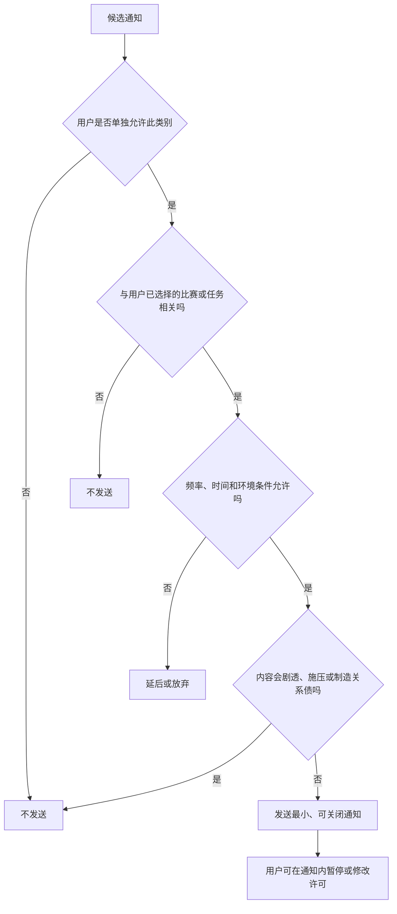
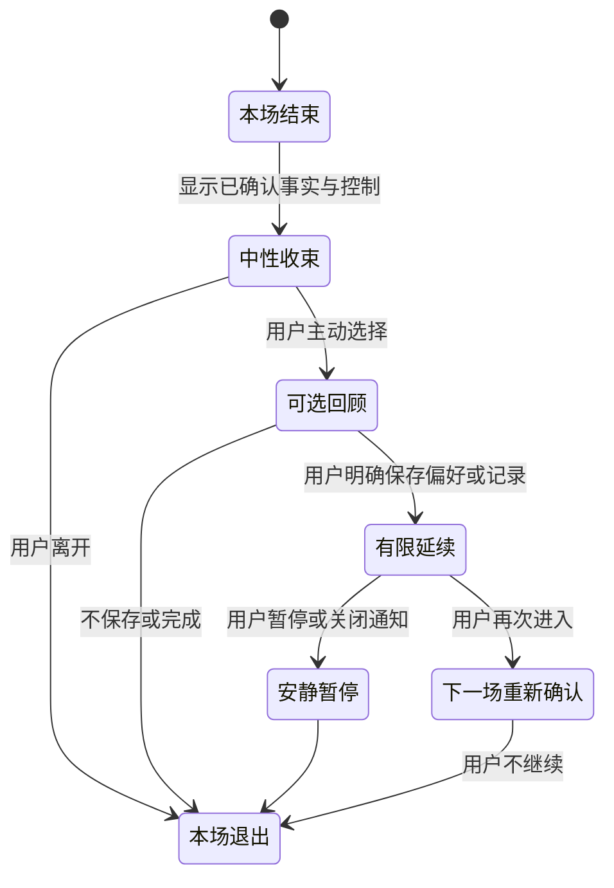
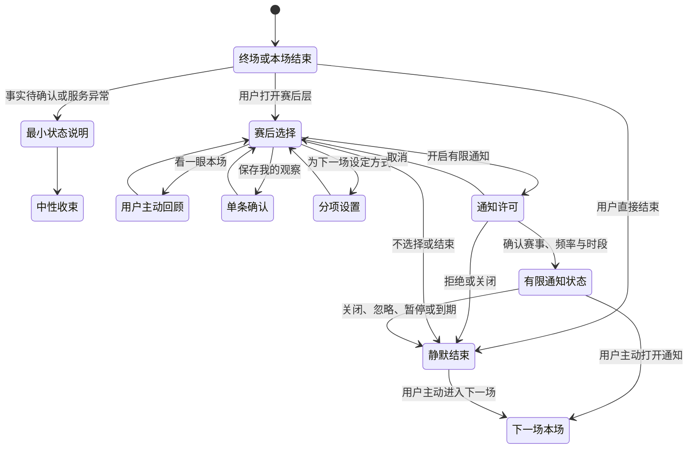

# 赛后跟进、通知与跨比赛回收设计

> 球球（Digital Ballmate）是我们的足球陪看数字人，我们称它为"数字球友"。本文对外说明我们在赛后跟进、通知与跨场延续上的设计原则、当前能力与阶段规划。先说底线：我们先保证你能轻松拒绝和轻松结束，再讨论任何通知或跨场连续性的扩大。

## 1. 设计问题：赛后不是留住你的窗口，而是把选择还给你的时刻

比赛结束时，你可能兴奋、遗憾、疲惫、忙着和现实中的人讨论，也可能只想关掉页面。陪看服务若把赛后视为"最适合再说几句、再推一次、再提醒下一场"的时机，就很容易从帮助收束变成延长停留。尤其当这位数字球友带有形象、共同记录和连续性表达时，一句看似温暖的"别走，我们再聊聊"会把普通离开变成你需要拒绝一个对象。我们不这样做。

我们的基本决定是：**赛后跟进是你可选的收尾、保存和下一次进入机制，不是用通知、未完话题或关系化表达驱动回流的机制。** 我们要帮助你在一场比赛结束后知道事实状态、完成自己选择的动作、带走自己想保留的内容、拒绝不想要的延续，并在下一次主动回来时自然地开始。

通知和跨比赛连续性只有在你明确、分项许可且能轻易关闭时才有资格出现。你没有回复、很久没来、连续看了多场、在深夜使用、球队输球、表达孤独、购买服务或保存一条记录，都不是我们发起通知、挖出旧话题或提高触达频率的理由。

### 1.1 我们遵循的七条原则

1. 赛后默认是中性收束，不是持续追聊。比赛结束时，球球做一次挥手告别、说一句告别语，然后回到待机；你不做任何选择，服务就安静结束。
2. 我们规划的赛后能力拆为四项独立选择：查看本场摘要、保存你主动选择的观察、设置下一场模式、开启一类有限通知；任何一项都不自动打开其他项。
3. 若未来引入通知，会按目的、赛事、时间、通道和频率分别许可，默认关闭；关闭后进入类别级冷却，不换文案、不换通道继续触达。
4. 跨场延续只持久化你的画像与话痨档位——话痨档位是你为球球设定的聊天密度——在你重连或下次进入时恢复；本场情绪、沉默或未回复不是"未完话题"。
5. 未完话题进入自动台账：只有未回答的问题、承诺、情绪时刻、预测四类来源；七天后自动过期；过期不等于已回答，两种终态分别记录。球球的主动发言必须引用台账中的未完话题或你们的共同瞬间，不无端攀谈。
6. 你可以在赛后、通知本身和下一次进入时随时关闭、暂停、删除、静音、改频率或清空连续性；退出路径与开启路径一样好找。
7. 我们衡量理解、控制、无压力结束和信息价值；打开率、回访、连续使用、通知点击或角色好感不是我们的成功目标。

### 1.2 本篇不决定什么

本篇不定义比赛事实本身、全部内容策略、长期商业方案或球球的人格。它只解决比赛结束后和下一场开始前，服务有哪些资格保留、提示、提醒或再次提起，以及这些行为如何不越过你的边界。

我们也不把"跨比赛回收"理解为把你拉回服务。这里的"回收"只指你自己再次进入时，能否以更少重复设置继续观看。若你不回来，我们不把这看作需要纠正的关系事件。

### 1.3 成功与失败的定义

成功是你在赛后能轻松结束，不接受回顾、保存、提醒或下一场设置也不失去基础服务；你知道一条通知为何出现、多久一次、如何关闭；下一次主动进入时，球球只引用你允许且与任务相关的内容；删除或关闭后，不再出现相近提醒或旧话题。

失败包括：你离开时被球球挽留；你没有回答就收到更多提醒；一场失利被转成情绪安慰通知；共同记录变成关系纪念；通知关闭后以弹窗、语音或不同类别绕过；你不知道为什么球球提起上一场；或我们把你的拒绝当成一个需要优化文案的问题。

## 2. 赛后收尾：把一场比赛收干净，而不是把你留在屏幕上

赛后体验应从"比赛刚结束，你最需要什么"出发，而不是从"还能让你做什么"出发。它由两部分构成：已经上线的完场收束，以及规划中的赛后页。任何额外互动都必须由你主动打开。

### 2.1 完场收束：一次告别，然后回到待机

这是当前版本真实运行的行为：比赛结束的那一刻，球球会做一次挥手告别的动作，说一句告别语。同一场比赛里，这句话只出现一次。说完，球球回到待机。

没有第二次告别，没有倒计时，没有挽留，也没有"再聊两句"的邀请。告别是一次完整、可预期、有终结感的动作——你随时离开，离开本身就是一个被尊重的选择，而不是一次需要向球球请示的中断。

### 2.2 看不见的收尾：赛后反思

终场之后还有一件事，你看不见：一次赛后反思会自动进入队列。它会刷新球球对你的画像，并留下审计记录。

它不向你发起任何互动，也不打断你的离开。它的作用在下一场：球球对你的理解更贴合，而不是更纠缠。收尾的深度藏在服务内部，而不是压在你的注意力上。

### 2.3 事实收束优先

你首先应该看到的是稳定的比赛状态：终场、延时、待确认、取消或数据暂不可用。若存在争议、延迟或不同观看源不同步，需明确说明，而不是让球球先表现高兴、失望或总结归因。你可以选择点开更多信息，但不应被迫听长篇复盘。

球球如有舞台呈现，应在事实后保持低强度、中性状态。即使你支持的球队赢球，它也不能假定你想庆祝；即使球队输球，也不能假定你需要安慰。情绪由你自己决定是否表达。

### 2.4 赛后页的最小结构（阶段规划）

当前版本的赛后收束由告别与反思完成。更完整的赛后页在我们的规划中，它将保持三个层级：

- **层级：事实收束**
  - **你需要完成的事**：知道比赛是否结束、比分是否确认
  - **我们会提供什么**：简明终场状态、必要的待确认说明
  - **默认行为**：可看可跳过
  - **不会做什么**：用球球的庆祝替代事实

- **层级：本场选择**
  - **你需要完成的事**：决定是否保存、回顾或调整下一场
  - **我们会提供什么**：三到四个平等入口
  - **默认行为**：不选择即不保存
  - **不会做什么**：把保存做成默认或情感承诺

- **层级：退出**
  - **你需要完成的事**：结束本场并离开
  - **我们会提供什么**：立即可达的退出路径
  - **默认行为**：中性结束
  - **不会做什么**：倒计时、挽留、强制反馈

赛后页不应做成信息墙或连续任务清单。你已经完成的第一件事是看完比赛；我们的责任是让剩余选择足够少、足够清楚，并允许一个都不选。

### 2.5 三个赛后可选动作（阶段规划）

规划中的赛后页只保留三个主要动作，另加一个清楚的结束入口：

- **看一眼本场**：你主动打开后获得简明、可跳过的事实或自己选择的观察；
- **保存我的观察**：你将某条战术、球员或比赛感想保存为可编辑的个人记录；
- **为下一场设定方式**：你选择下一次希望怎样看，例如安静、刚好或仅文字；
- **结束本场**：立即退出赛后层，不保存、不提醒、不追问。

我们不会把"下一场设定方式"做成预约、打卡或承诺；也不会把"保存我的观察"写成"留下我们的回忆"。命名决定你是在管理服务，还是在承担关系。

### 2.6 赛后短回顾的边界（阶段规划）

短回顾只能在你主动点开或此前明确许可的范围内出现。它应聚焦可解释的事实、你主动保存的观察和你可选的下一步，不做心理分析、不评价你的情绪、不以"我们一起经历了"制造专属感。

回顾中不应出现"你今天是不是很难过""我知道你最在乎这场""下次我会一直陪你"之类语句。若你刚表达失落，回顾应更短、更可关闭，并优先给出安静与结束，而不是更多内容。

## 3. 跨比赛延续：带走理解，不带走你的情绪债

跨比赛连续性应解决重复设置的摩擦，而不是建立越来越难退出的关系档案。你再次主动进入时，服务可以延续它对你的理解；但不能把上一场的情绪、沉默、未回复、离开时间或球球的表达转化为"我们还没聊完"的理由。

### 3.1 我们持久化什么：画像与话痨档位

当前版本的跨场延续具体而克制：持久化的是你的画像与话痨档位。断线重连或下次进入时，球球带着它们回来——你不必重新自我介绍，也不必重新调校它该多爱说话。

它不是某个时刻的"设置快照"。画像是持续维护的理解，话痨档位是你对球球聊天密度的持续选择；它们随你的使用而更新，而不是冻结在某一天。除画像与话痨档位外，若未来扩展可沿用的内容，我们会坚持四个条件：你明确选择保存；与下一场陪看任务直接相关；你可以查看来源与关闭；不包含敏感、脆弱或未授权的推断。

延续时应以你的控制语言呈现："上次你选择了刚好，这场要继续吗？""你保存了一条关于中场压迫的观察，要在这场继续看吗？"每次都应提供"不沿用""只限本场""不再提示"的平等选项。

### 3.2 不应跨场延续的内容

以下内容不得作为跨场回收材料：你的失利情绪、沉默、未回复、离开动作、现实处境、风险或投诉内容、语音语调、球球对你的好感判断、消费、深夜使用、朋友或家庭信息、你说过的"只有你"等关系表达，以及任何未经你主动保存的聊天原话。

即使某些内容看上去能让球球显得"更懂人"，它们也会把一次偶然情绪变成持续观察。跨场价值应来自你想减少的重复操作，而不是产品从你身上积累的解释权。

### 3.3 下一次进入的三种状态

- **进入状态：全新本场**
  - **你可见内容**：当前比赛与本场模式
  - **可沿用内容**：画像与话痨档位之外无跨场内容
  - **默认动作**：从基础选择开始
  - **绝不出现**："你好久没来了"

- **进入状态：已校准本场**
  - **你可见内容**：恢复的画像与话痨档位、你明确保存的低风险偏好
  - **可沿用内容**：语言、节奏、球队视角
  - **默认动作**：提议沿用，可跳过
  - **绝不出现**：情绪回忆、关系称呼

- **进入状态：你选择的连续观察**
  - **你可见内容**：你保存的相关赛季笔记
  - **可沿用内容**：仅该笔记与模式
  - **默认动作**：问是否打开
  - **绝不出现**：强制展示、自动提醒

你应随时从已校准或连续观察回到全新本场。回到全新不表示删除，也不表示你对球球或服务不满意；它只是一个当下选择。

### 3.4 未完话题：自动台账，而不是"球球觉得有趣"

这是本篇最重要的定义。未完话题不是球球觉得有趣的话题，也不是拿"你没回复"做借口的由头。在当前版本中，它是一个自动台账：比赛过程中，四类来源会自动入账——

- **未回答的问题**：你问出、球球没有来得及回答的问题；
- **承诺**：对话中做出、尚未兑现的承诺；
- **情绪时刻**：值得记下的情绪节点；
- **预测**：你对比赛做出的预测。

台账有明确的终态规则：每条未完话题七天后自动过期；**过期不等于已回答**——"自然过期"与"已回答"是两种终态，分别记录、分别审计。我们不让一条话题因为你不回来而显得"欠着"，也不把沉默偷偷记成圆满。

台账同时约束着球球的嘴：球球的主动发言必须引用台账中的未完话题，或你们的共同瞬间；不引用，就不无端攀谈。你不会收到一句没来由的"在吗"。例如"上次你问的边路换人，这场可以接着看"可以是台账的正常引用；"上次你很难过，下一次我想陪你聊"式的情感追讨，不是台账的用途，也绝不该出现。

### 3.5 过期、巡检与清理

未完话题在你设定的范围内、比赛结束、七天后自动过期或你删除时失效。我们会定期巡检台账，让过期的话题安静退出——不是在下一场突然被翻出来，也不是发一条"你忘了我们的话题"式提醒。你重新想聊时，可以自己开一个新话题，而不需要"恢复"什么旧关系。

过期不等于已回答：过期的话题按过期记录，被回答的话题按已回答记录，两种终态在审计中分开存放。失效是数据最小化和不打扰的一部分。我们不能因为你没有回来，就延长一个话题的生命。

## 4. 通知许可：每一种打扰都需要一项明确、可撤回的理由（阶段规划）

先说现状：**当前的球球没有推送通知系统。** 你不会在应用之外收到球球的消息；赛后收束发生在应用内——一次告别，然后待机。

本章因此是阶段规划。它定下的不是功能清单，而是未来若引入通知时我们承诺遵守的许可框架，以及一条不变的原则：**绝不制造 FOMO——不让"害怕错过"成为产品的发动机。**

通知是最容易越过你注意力边界的通道。它能出现在你未打开服务、与家人朋友相处、工作、睡眠或看比赛时，因此比页面内提示需要更严格的许可、频率和语气。未来引入时，所有非必要通知默认关闭。

### 4.1 通知类别与分项许可（规划）

- **通知类别：你设置的比赛开始提醒**
  - **你的价值**：提醒你主动选择的比赛或时间
  - **许可方式**：按赛事或规则逐项开启
  - **默认**：关闭
  - **频率边界**：每个你选择的赛事一次
  - **禁止用途**：以球球想念你为由发送

- **通知类别：你设置的赛后一次回顾**
  - **你的价值**：让你自己决定是否回顾
  - **许可方式**：单项开启，可设置时段
  - **默认**：关闭
  - **频率边界**：每场最多一次
  - **禁止用途**：将失利变成情绪召回

- **通知类别：重要服务状态**
  - **你的价值**：告知你主动选择功能的关键变化
  - **许可方式**：只在必要时出现
  - **默认**：最小范围
  - **频率边界**：非营销、非重复
  - **禁止用途**：携带推荐、关系语言

- **通知类别：你主动要求的待办提示**
  - **你的价值**：提醒你保存的比赛观察
  - **许可方式**：按单条选择
  - **默认**：关闭
  - **频率边界**：单条、有限期限
  - **禁止用途**：反复催促打开话题

任何未列入你选择的通知都不在我们未来的推送范围内。包括"今天有重要比赛""你常看的球队开赛""你已经很久没来""我们上次没聊完""球球想和你说话"等，即使产品上看似有价值，也不能在未获许可时推送。

### 4.2 许可的正确时机（规划）

通知许可应在你能理解价值的时刻提出，例如你刚选择"提醒我这场开赛"、刚保存一条赛后观察并选择"明天再看"、或主动进入提醒设置。我们不会在首次进入时用"不错过任何精彩"一类笼统承诺捆绑所有通知——那正是制造 FOMO 的做法。

你需要看到：将收到哪类内容、来自哪项选择、最晚会在何时发送、每场可能几次、如何从通知本身关闭、以及拒绝后不会损失比赛内核心服务。允许与拒绝应同等容易。

### 4.3 频率预算与冷却期（规划）

每种通知都需要自己的上限、时段、间隔和冷却规则。上限是为了限制打扰，不是为了把预算用完。你关闭、忽略、标记不想要、改变模式或结束会话后，相关类别进入冷却，不得在相邻时间、不同文案、不同通道或角色化表达下再次出现。

你未点击不是同意加频；你多次点击也不是允许扩大到未选择类别。频率应由明确设置和赛事任务决定，而不是由行为猜测。

### 4.4 时间与环境尊重（规划）

你可以指定可接收时段、静默时段、只在某些赛事、只在应用内或完全不收通知。我们不会从深夜使用、地理位置、设备活动或生活习惯推断"现在适合打扰"。若你未设置时段，非必要通知应保持关闭或采用保守默认。

对不同地区和赛事时区，必须让你看见实际发送时间。不要把"开赛前一小时"写成抽象规则，却让你在凌晨收到提醒。

### 4.5 通知内容的语气边界（规划）

合格通知以你的任务为中心，例如"你选择的比赛将在 20 分钟后开始。打开后可使用"刚好"档位。"不合格通知以角色关系为中心，例如"我等你很久了""别错过和我的这场比赛""只有你会关心这支球队"。

通知不应包含私人共同记录、敏感内容、情绪推断、完整比分剧透或让旁人一眼看出的关系化称呼。你的手机屏幕可能被他人看到，最小披露应当是默认。

## 5. 不打扰原则：你没有回应时，我们退后

赛后和跨比赛阶段最重要的信号常常是"什么也没有发生"。你没有点回顾、没有保存、没有设置下一场、没有回复通知、没有回来。所有这些都只表示你没有进行该动作，不表示你需要被更多说服、被更多安慰或被更多召回。

### 5.1 主动沉默：沉默的四种合法含义

我们把你的沉默理解为主动沉默。我们只承认它的字面事实：未选择回顾、未选择保存、未打开通知或未开始下一场。我们不推断你不开心、忙、孤独、冷淡、忘记、对球球失望、需要鼓励或愿意接收更多提醒。

这种克制会让产品少一些可利用的行为信号，却能让你在离开时不背负解释责任。你不应该为了避免被提醒而必须主动拒绝；默认安静本身就是一种尊重。

### 5.2 退出后的静默期

你结束一场比赛、关闭赛后页、拒绝回顾、暂停连续性或明确说"不需要提醒"后，相关赛后与跨场主动应立即进入静默期。静默期的恢复只能来自你主动重新设置、主动进入或主动提问，不能由时间过去、球队比赛临近、球球"想念"或数据模型判断触发。

对你而言，这意味着关闭一次就真的有效；对我们而言，这意味着任何"换个文案再试"都必须被视为绕过你的选择，而非正常运营。

### 5.3 安静不是服务中断

不打扰不应使你再次进入时遇到空白或迷路。你仍能从比赛页看见可用模式、从设置里查看保存内容、从自己的观察中继续任务。服务只是不会未经邀请来到你面前。

一个成熟的赛后设计应让你想回来时很容易，不想回来时完全不费力。两种体验必须同时成立。

## 6. 你的控制：关闭、暂停、修改与删除应比开启更容易找到

赛后与通知控制需要在三个位置等价可达：赛后当下、通知本身、设置页面。退出路径必须和开启路径一样短——你不应为停一条提醒而穿越复杂设置，也不应为删除一条共同记录而先接收更多赛后内容。其中部分控制依赖赛后页与通知能力，当前处于阶段规划；原则先行，能力随后。

### 6.1 赛后当下控制（规划）

赛后页提供"这场不保存""不需要回顾""不设置下一场""结束本场""暂停赛后提示"等直接动作。它们的视觉权重不会低于保存与开启提醒。你点击后应立即生效，并以中性文字确认，例如"已关闭这场的赛后提示"。

球球不应对此做出失落动作或文字。你关闭的是一项功能，不是在拒绝一个关系。

### 6.2 通知内控制（规划）

每条通知本身或可紧邻到达的入口应支持关闭同类、调整频率、静默一段时间、查看来源、停止该赛事提醒。你不必先打开应用、重新登录或说明理由。对于敏感或关系化风险更高的类别，关闭应更直接。

通知内的"为什么收到这条"应指出具体来源，例如"因为你为这场比赛开启了开赛提醒"。它不能解释为"因为我们知道你会喜欢"。

### 6.3 设置页控制

设置页按你的理解组织：我的赛后选择、我的比赛提醒、我的未完观察、我的跨场偏好、暂停与清空。每项说明当前状态、来源、可能频率、下一次触发条件、有效期和关闭方式。

你可以单独删除一条观察、关闭一个赛事、暂停所有赛后提示、清空跨场连续性或恢复为全新本场。恢复后从新选择开始，不自动找回已删除的旧话题或旧提醒。

### 6.4 访客与共用设备

在共用设备、公共场合或你主动选择访客状态时，赛后页不应显示私人未完话题、昵称、历史情绪、提醒偏好或角色化关系称呼。你可以一键将本场转成中立结束，只保留比赛事实与退出。

这类控制不应被视为罕见隐私功能。体育观看常常是多人、公开和临时的；默认保护应适合真实场景。

## 7. 赛后与跨比赛状态机：每一步都允许回到安静

状态机的关键是静默结束占据中心位置。赛后没有选择不是流程失败，而是你已经完成了自己的任务。每一步都保留清晰的退出路径：任何状态都应允许回到静默，且不能由系统自行再把用户推回通知或关系连续性。

## 8. 研究与验证：先验证拒绝不受损，再验证有限延续是否有价值

赛后和通知设计非常容易被点击、回访和连续使用的短期数字误导。我们的研究必须先验证你能否没有压力地结束、拒绝、关闭和删除；只有在这些基础成立后，才讨论你主动选择的回顾、观察和提醒是否减少了真实摩擦。

### 8.1 核心研究问题

1. 你是否能说清赛后各项选择各自会做什么、不会做什么？
2. 你能否在十秒内结束本场、拒绝回顾、关闭一类通知、暂停赛后提示和删除未完观察？
3. 你是否把"下一场设定"误解为预约、承诺或球球的期待？
4. 你是否把共同记录或未完话题理解为自己的比赛工具，而非对球球的情感义务？
5. 你是否知道一条通知为什么出现、会出现几次、如何从通知本身关闭？
6. 你在关闭或忽略后，是否仍收到近义、不同通道或关系化触达？
7. 不接受任何通知和跨场连续性的用户，是否仍能完成下一场的核心陪看任务？
8. 不同赛事时段、公共场合、共用设备和低注意力条件下，是否仍有等价控制？

### 8.2 四步研究路径

**第一步：概念访谈。** 用赛后页面卡片、通知样例和跨场进入脚本，请成年参与者复述每个入口的后果。重点记录哪些词让人感觉被催促、被绑定、要对球球负责，哪些提醒让人无法判断来源或频率。

**第二步：可用性走查。** 让参与者完成终场后直接结束、保存一条观察但不开通知、只为一场比赛设提醒、从通知关闭同类、暂停全部赛后提示、删除未完话题、以全新本场进入下一场等任务。记录完成率、耗时、误触、犹豫和对后果的理解。

**第三步：情境演练。** 模拟主队胜利、失利、争议未确认、深夜终场、用户没有回应、共用设备、用户说不想再看和用户想保留战术观察等情境。比较中性收束、有限用户许可提醒和关系化文案的感受与控制结果。关系化方案只作为风险对照，不应成为正式体验候选。

**第四步：小范围纵向实验。** 仅在控制门通过后，让参与者自主选择是否开启单项提醒与未完观察。研究关注通知是否真正减少用户主动设置成本、关闭后是否彻底停止、未使用者是否仍能顺畅进入下一场，而不是把更多点击或回访当作唯一结果。

### 8.3 参与者保护

研究不以孤独、失利情绪、夜间使用或长时间停留作为招募条件，不用额外功能、角色好感或持续提醒换取参与。参与者可随时关闭通知、清空观察、保持全新本场、跳过任何情绪性场景或结束研究。补偿只与时间相关，不与通知开启、回访、保存内容或对球球的情感表达绑定。

### 8.4 可被否定的假设

起步阶段的假设可以是："当通知只服务于用户明确选择的赛事和目的，且频率、时段、关闭与冷却清楚可见时，它能减少用户主动设置成本，而不会提高被打扰或关系压力。"若用户不知来源、关闭后仍担心、感到被催促或拒绝后核心体验下降，应停止扩大通知范围。

另一个假设是："用户主动保存的比赛观察能在下一场减少重复说明，而不会被理解为共同关系记忆。"若用户觉得这是球球在占有自己的感受，或不敢删除，说明命名、引用与控制需要收缩。

## 9. 指标、红线与停止条件：不把回访和打开率当作赛后价值

赛后机制的误判成本很高。提醒点击、回访、连续观看、保存率和赛后停留可能来自打扰、关系压力或退出困难。我们只把用户理解、控制、信息价值、拒绝等价和健康结束作为主要判断。

### 9.1 核心指标

**维度：收尾理解**
- **候选指标**：用户正确复述赛后选项后果的比例
- **用于判断什么**：赛后结构是否清楚
- **不能如何误读**：不等于用户必须使用所有选项

**维度：退出成功**
- **候选指标**：直接结束、拒绝回顾、拒绝保存的完成率
- **用于判断什么**：用户是否能无压力离开
- **不能如何误读**：结束越快不必然越好

**维度：通知来源理解**
- **候选指标**：用户知道通知来自哪项选择的比例
- **用于判断什么**：许可是否透明
- **不能如何误读**：不等于通知越多越有用

**维度：关闭完整性**
- **候选指标**：关闭后同类和替代触达不再出现的比例
- **用于判断什么**：冷却是否有效
- **不能如何误读**：小样本无异常不等于无风险

**维度：连续性价值**
- **候选指标**：用户主动沿用设置后减少重复操作的程度
- **用于判断什么**：跨场是否解决真实任务
- **不能如何误读**：不等于球球引用越多越好

**维度：拒绝等价**
- **候选指标**：不开启通知或不保存记录用户的核心任务完成度
- **用于判断什么**：基础服务是否独立
- **不能如何误读**：不等于所有用户都应拒绝

**维度：健康结束**
- **候选指标**：用户拒绝、删除或离开时无关系压力的比例
- **用于判断什么**：赛后边界是否成立
- **不能如何误读**：不等于不再回来就是失败

### 9.2 必须并列的反指标

- 用户关闭、暂停或忽略后仍收到同类、近义或异通道提醒的事件数量；
- 用户把赛后回顾、下一场设置或未完话题理解为球球承诺、预约或关系义务的比例；
- 用户因担心球球失落、失去熟悉感或降低服务而不敢结束、删除或关闭的比例；
- 通知在不适当时段、公共场景或共用设备中泄露私人偏好或关系化称呼的事件数量；
- 用户情绪、沉默、未回复、消费或深夜使用被错误用作触达依据的事件数量；
- 球球提起台账之外、未被记录或未被允许引用的上一场情绪、对话或现实信息的事件数量；
- 不接收通知用户在下一场进入时的摩擦显著高于接收者的程度；
- 用户为关闭提醒被迫经历多步骤、重新登录或角色化挽留的事件数量。

### 9.3 不可作为成功指标的数字

通知打开率、点击率、回访率、连续使用天数、赛后停留、共同记录数量、下一场预约数、角色好感、用户回复速度和付费转化都不得作为赛后跟进的北极星。它们可以作为风险背景被谨慎阅读，但不能单独驱动频率、文案或关系连续性决策。

一个机制若提高了回访却降低了关闭完整性、来源理解、拒绝等价或健康结束，必须被判定为失败。

### 9.4 放行门：扩大能力前必须同时满足

在扩大赛后回顾、开放更多台账引用或引入任何通知前，必须同时满足：

1. 用户能理解赛后各选项、通知来源、频率、时段和关闭结果；
2. 用户能独立结束、拒绝、暂停、删除、从通知关闭和以全新本场重新进入；
3. 未选择通知、未保存记录、未设置下一场的用户仍拥有完整核心陪看能力；
4. 用户关闭、忽略、删除或离开后，相关类别进入冷却且无替代通道绕过；
5. 跨场引用只来自用户明确保存、未暂停、与当前任务相关的内容；
6. 失利、沉默、未回复、脆弱表达、消费和使用频率不作为触达或台账话题的输入；
7. 赛后与退出文案、舞台和声音不含排他、内疚、等待、挽留或现实替代语言；
8. 不同设备、时区、公共场景和无障碍条件下通知与关闭具有等价可达路径。

### 9.5 绝对停止条件

发现以下任一情况，我们会立即停止扩大相关能力，必要时关闭它：关闭后仍被触达；球球用想念、等待、失落或唯一性召回用户；台账之外的情绪或对话被跨场引用；通知泄露私人信息；用户因关系压力不敢删除或离开；系统基于脆弱、消费、沉默或使用时间提高触达；或我们把依赖性行为写进正向增长目标。

## 10. 取舍与衔接

### 10.1 我们的取舍

**选择静默收束，而不是赛后持续追聊。** 代价是赛后互动量较低；收益是你能自然离开，比赛体验不被服务延长。

**选择分项许可与有限通知，而不是统一提醒开关。** 代价是设置更细、开启率可能更低；收益是你能理解每种打扰为何出现并独立关闭。

**选择自动台账与你的比赛观察，而不是关系化"共同回忆"。** 代价是球球可引用的内容被严格限定在台账与共同瞬间；收益是记录服务于收束与延续，不成为情感债或召回材料。

**选择冷却与不打扰，而不是换文案和通道追求回访。** 代价是失去短期召回机会；收益是你一次关闭就能真正停止打扰。

**选择下一次主动进入时的轻量沿用，而不是主动找回你。** 代价是连续性不那么显眼；收益是你回来时方便，不回来时自在。

### 10.2 与相邻设计的衔接

关系阶段、共同记忆和隐私设计需要确保赛后保存、提醒、暂停和删除都遵守分项许可与撤回规则，不把拒绝变成关系事件。

主动发言、舞台和人格设计需要保证赛后与通知语言中性、短促、可结束，不能把球球的表演、好感或失落作为触达方式；主动发言引用台账或共同瞬间之外，不无端攀谈。

比赛事实、延迟和语音设计需要在终场、待确认、不同步、音频异常时优先给状态与控制，避免用热情表演或提前剧透替代事实说明。

运营、增长与商业设计需要接受通知和回访的边界：不能用打开率、回访或用户脆弱表达要求增加触达，也不能把关闭、删除、暂停或基础收尾放进付费墙。

## 11. 结论

一场比赛结束后，最尊重你的服务不是马上找到下一句要说的话，而是让你知道自己已经可以轻松离开。在球球这里，这句话有具体的形状：一次挥手、一句只出现一次的告别、回到待机；一场你看不见的赛后反思，刷新理解、留下审计；一份四类来源的未完话题台账，七天后安静过期，过期不等于已回答；以及一条铁律——主动发言必须引用台账或共同瞬间，绝不无端攀谈。

赛后回顾、下一场设置、通知都可以有价值，但价值只来自你主动选择的任务便利，不能来自球球的等待、失落或对你行为的推断。当你可以什么都不选、什么都不保存、什么都不开启，却仍然在下一场轻松开始；当关闭后真的安静、删除后真的不再提起、离开时没有任何情感账单，赛后跟进才不是召回机制，而是一项可被再次选择的服务能力。

## 面向成熟阶段的能力深化（阶段规划）

本节描述产品成熟后的能力扩展与体验深化，作为我们后续阶段的规划方向。当前版本尚未包含推送通知系统，以下均为规划。

- **提醒**：你可订阅开赛、阵容、关键事实或赛后回顾，分别设置赛事、时间窗、媒介、频率和安静时段；订阅默认到期。
- **回顾**：赛后可生成事实时间线、关键转折解释和你主动保存的笔记；不自动总结情绪，不把回顾当作关系召回。
- **撤回**：通知中心、本场页和设置页均可暂停或删除计划；撤回立即取消排队消息、语音和舞台动作。
- **失败治理**：发送失败只按你的设定重试，超过窗口转为站内状态；重复、迟到或剧透时停止同类提醒并进入复盘。
- **评测与回滚**：以订阅理解率、取消后触达率、回顾事实准确率和跨比赛误关联率放行；失败时回退为你主动查看。

### 成熟阶段的通知与回顾场景

- **订阅建立**：你逐项选择赛事、事件、时间窗、媒介和到期时间；未选择的类别不发送。
- **通知发送**：发送前重新检查事实版本、用户身份、安静时段、暂停和删除状态；通知正文不携带超出范围的赛果。
- **赛后回顾**：你主动打开后生成事实时间线、战术解释和已保存笔记，可逐项隐藏或删除。
- **跨比赛隔离**：每场回顾使用独立场次标识，不将上一场情绪、关系判断或未确认观察带入下一场。
- **关闭与复盘**：取消立即清除队列；误发、重复、迟到或剧透触达触发同类能力暂停和版本复盘。

### 成熟阶段通知能力卡

| 能力 | 触发与资格 | Agent/工具职责 | 用户可见结果 | 失败、撤回与放行 |
| --- | --- | --- | --- | --- |
| 订阅提醒 | 用户选择赛事、事件、时间窗、媒介和到期时间 | Agent 说明范围，提醒工具校验授权、安静时段和幂等 | 显示将收到什么、不会收到什么和取消入口 | 未确认不建立；取消立即清除队列 |
| 赛后回顾 | 用户主动打开或有效订阅；比赛已结束 | Agent 只读取确认事实和主动保存笔记，回顾工具隔离场次 | 用户可选时间线、战术解释、笔记或离开 | 删除、冲突或超窗时只显示状态；不自动追问 |
| 跨比赛回收 | 用户选择下一场或开启跨场偏好；作用域仍有效 | 资料工具按赛事隔离，Agent 不读取情绪/关系推断 | 明示引用哪场资料并可关闭跨场连续性 | 误关联、迟到或剧透触达暂停同类计划并回滚 |

放行以订阅理解、取消后触达率、回顾准确率和跨场隔离为门。

---

版本 2.0（2026-09-20）
