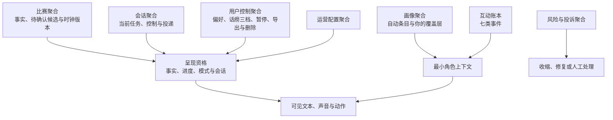
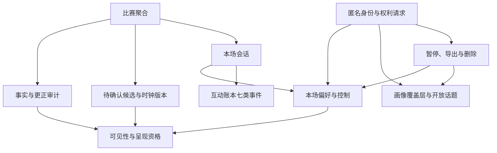
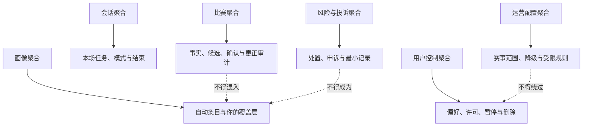
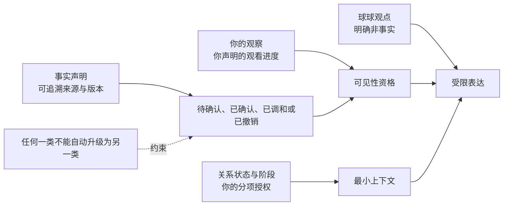
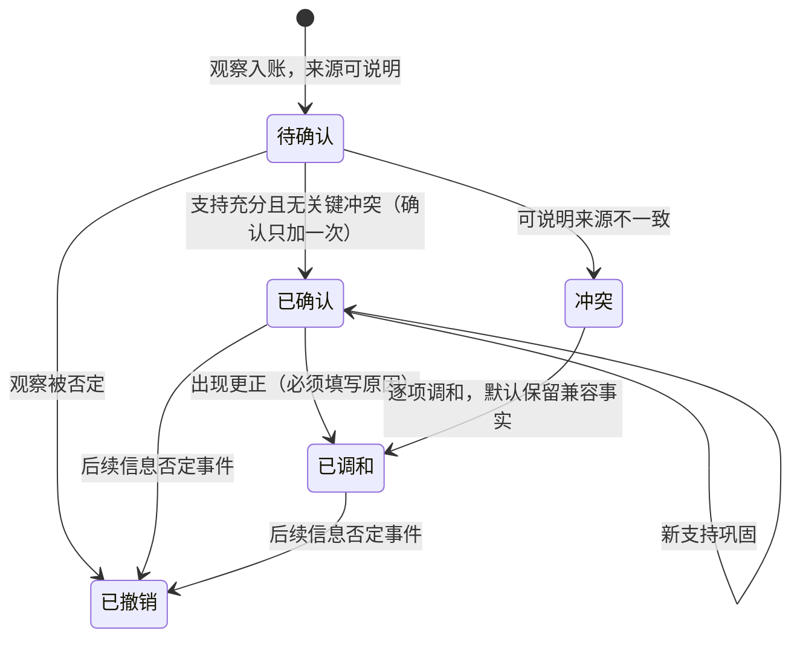
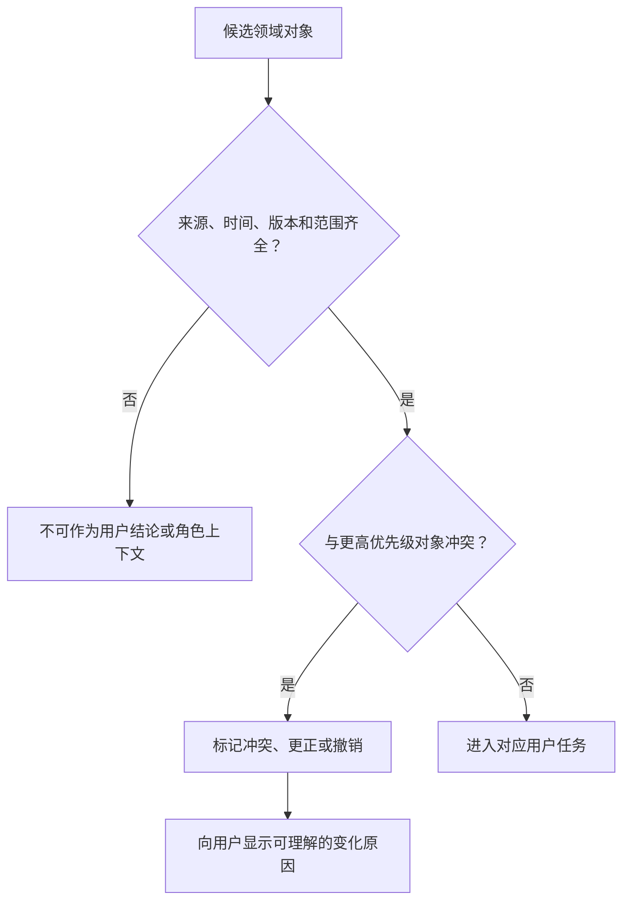
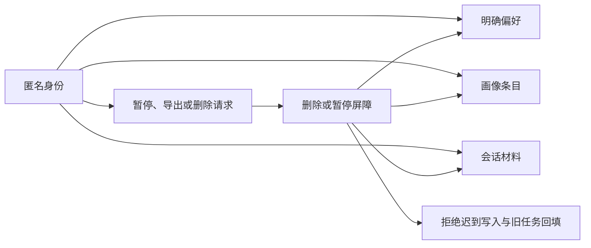
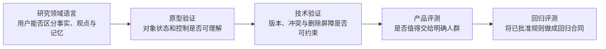
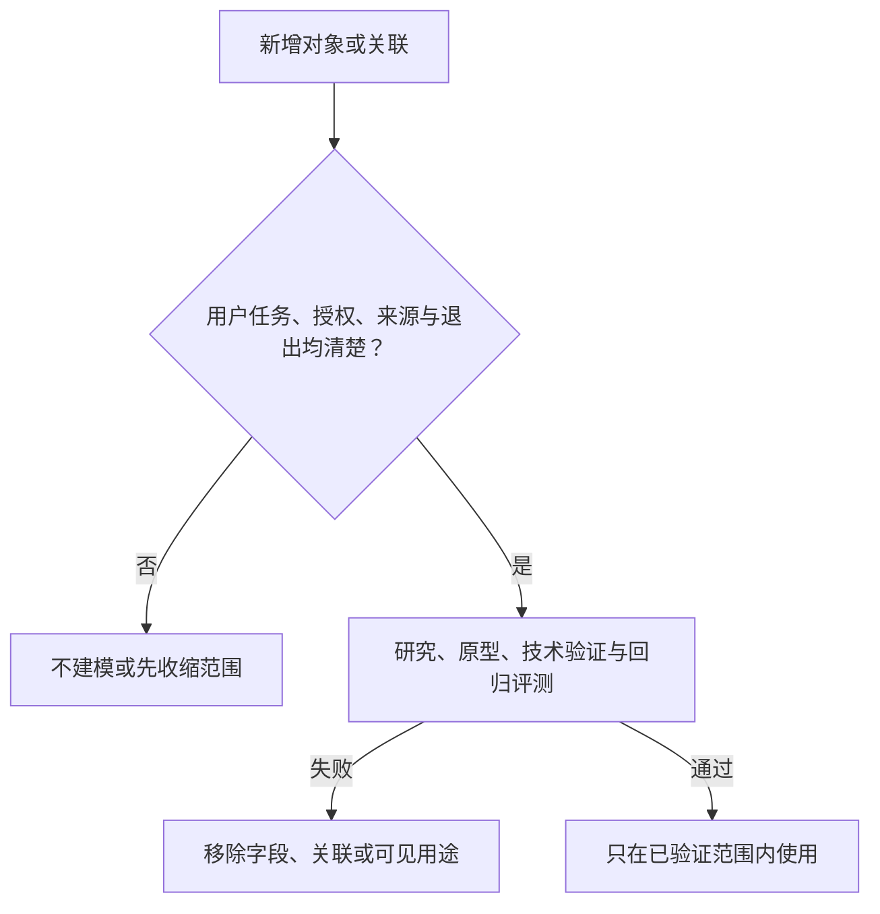

# 领域数据模型设计

> 本文是"球球"产品设计系列的领域数据模型篇，写给想了解这款产品如何决定"什么算一条数据、它属于谁、何时出现、何时必须消失"的读者。我们的主角是一位陪你看球的**数字球友（Digital Ballmate）**——一个与你一起观看比赛、在需要时开口、在不需要时保持主动沉默的数字人伙伴，下文也称"球球"。文中描述的对象与规则均以现网实际行为为准；尚未上线的部分，统一归入文末"阶段规划"，不以既有能力的口吻表述。

## 1. 设计问题：没有清楚的领域语言，系统就会把不同的"知道"混成一件事

球球在陪你看球的同时，会接触很多种性质完全不同的"知道"：比分是需要来源与确认状态的比赛事实；你们之间发生的每一件值得记录的事，落在互动账本里；球球对你的了解，是画像里的一条条条目；你问了一半的问题、它许下的承诺，是开放话题；你说"我觉得中场顶不住"，是你的观点；你把话痨调低一档，是即时控制；运营配置一场赛事的可用性，是服务规则而不是任何人的记忆。它们看起来都像"信息"，但性质完全不同。

如果这些概念没有边界，产品会出现一连串问题：把待确认候选说成事实；把你一句短暂情绪直接变成长期画像；把球球的推断写成你的记忆；把风险投诉用于个性化；把运营配置伪装成角色意见；你删掉一条画像条目后，另一个环节又把它引用回来；或者为了方便查询，把全部历史塞进一个不可解释的"用户档案"。

因此，本篇的基本决定是：**数据模型首先是一套产品边界与用户权利模型，不是为了积累更多内容的容器。每一个对象都必须说明它是谁的陈述、服务什么任务、能否跨场、如何被你看见、何时过期、怎样撤回，以及绝不能被转作什么用途。**

### 1.1 本篇的核心决策

1. 使用一组明确、可被任何人复述的领域语言，至少区分比赛、比赛事实、互动账本、画像条目、开放话题、偏好、关系状态与阶段、会话、运营配置、风险事件与研究材料；
2. 将"事实""账本""画像""关系""会话""运营"视为不同对象族，不允许用一个统称为"上下文"或"用户画像"的对象替代；
3. 比赛事实必须包含来源、时间、确认状态与更正路径：待确认候选不改动公开比分，确认只加一次，更正必须附带原因，时钟冲突可自愈；
4. 记忆自动积累，但你随时可改可忘：画像由自动条目与你的覆盖层合并而成，删除以"立碑"生效，再抽取无法让忘掉的东西复活；你的未回复、风险与投诉、第三方信息不写进画像；
5. 会话默认短生命周期，用于完成本场任务；跨场连续性只通过你可见、可改、可遗忘的画像条目与开放话题发生，并保留完整的退出路径；
6. 运营配置与你自己的数据严格分离：运营规则决定服务可用性与安全边界，不能把你的内容变成不可解释的干预或商业分群；
7. 每个对象都有来源、版本、权限、保留、删除和防回写规则；删除一个对象后，相关派生引用、提醒与视图都停止使用它；
8. 服务只面向能自主同意的成年人。年龄不确定时，采用最少数据、无跨场连续性和无强主动触达路径。

### 1.2 本篇不决定什么

本篇不规定某个供应商、存储方案、接口形式或具体交付工具，也不取代适用法律、数据保护专业意见或比赛事实的商业授权判断。它规定的是产品在作出这些选择前必须保持的对象边界与用户可解释性。

本篇也不追求"一次建完所有对象"。我们从最小可用的对象集合开始，只有在每个对象的价值、质量、删除和风险边界被验证后，才增加更多字段、关联或自动化。数据模型的复杂度必须由清楚的服务任务证明，而不是由"以后可能有用"证明。

### 1.3 成功与失败的定义

成功是每一个读过本文的人能对同一个词给出一致解释；你能知道球球为什么提起某项内容；一条待确认候选不会被表演成结果；你删除一条画像条目后，从下一回合起没有任何对象继续把它当作可用记忆；风险或投诉材料不影响关系、提醒和商业表达；运营规则能够被审议而不暴露私人内容。

失败包括：球球将观点当事实；事实更正后旧结论仍持续出现；你的情绪被自动写成关系信息；一项偏好被扩展到无关场景；不同团队用"记忆""会话""标签"等词指不同东西；你无法查看或删除对象；运营人员为追求互动而改写你的控制；或者一个对象删除后，迟到的内容重新让它可用。

## 2. 领域语言：先统一名词，才有资格设计行为

领域语言不是文档里的词汇表装饰。它决定我们在讨论"球球记得什么""这条能不能发""为什么这场会出现""删除后还有没有"时，是否在谈同一件事。必须避免含混词，如"画像""熟悉度""洞察""关系分""用户价值"的单独使用——它们常把事实、推断、许可和商业目的混在一起。下面先把名词说清。

### 2.1 基础名词

| 术语 | 它是什么 | 绝不表示什么 |
| --- | --- | --- |
| 比赛 | 一个可识别的足球赛事实体，由公开赛事目录或经审议来源建立 | 你是否会观看或关心 |
| 比赛事实 | 关于比赛、可验证、带来源与确认状态的陈述 | 球球的观点，或你的情绪 |
| 观察 | 对比赛或服务的有来源描述，来自你、球球或公开赛事信息 | 已被确认的事实 |
| 观点 | 可反驳的分析或立场 | 官方裁决，或对你的身份标签 |
| 会话 | 有开始和结束的本场互动容器 | 永久关系或跨场记忆 |
| 偏好 | 你明确选择的服务设置：语言、节奏、无障碍、视角与话痨三档 | 心理状态、亲密度或消费价值 |
| 关系状态与阶段 | 关系所处的阶段，以及你对连续性、提醒、称呼与主动性的分项授权 | 你对球球的承诺，或任何亲密度分数 |
| 匿名身份 | 服务使用的匿名主体标识，会话标识不自动等于长期身份 | 实名档案 |
| 运营配置 | 服务范围、赛事可用性、风险门和内容规则 | 对某个用户的关系判断 |
| 风险事件 | 需要停止、限制、投诉或人工复核的服务事件 | 长期用户标签或个性化输入 |
| 研究材料 | 你单独同意的研究内容 | 正式服务的关系记忆 |

### 2.2 现网核心对象：七个名字，逐一说清

这七个对象是现网系统的骨架。为了帮助读过早期稿件的读者对上号，我们同时给出与旧名词的对照。

| 对象 | 一句话定义 | 与旧稿名词的对照 |
| --- | --- | --- |
| 互动账本 | 球球本地唯一的事实记录，只追加、不改写，以七类事件——回合计划、用户信号、投递结果、事实修订、媒体投递、播放结果、过期作废——记下每一件值得记录的事 | 旧稿拆在"会话"与"观察"里的可回溯材料，现网统一落进账本 |
| 画像条目 | 按主题与子主题组织、以确定序合并的记忆条目，由"自动条目"与"你的覆盖层"两层合成 | 旧"共同记录"（你主动保存才存在）→ 现"画像条目"（自动积累，你可改可忘） |
| 开放话题 | 自动入账的"没聊完的事"台账：未回答的问题、承诺、情绪时刻与预测；开放满 7 天未被接住即过期，过期不等于已回答 | 旧稿需要显式迁移的"跨场材料"，现网由话题台账承担收尾 |
| 待确认候选 | 已收到但尚未确认的比赛事件陈述：不改动公开比分，确认只加一次 | 旧稿把"待确认"当作一个状态值，现网它是事实链上的正式对象 |
| 更正审计 | 每次更正必须附带原因才能落账的审计记录，原因随事件留存、可追溯 | 旧"更正路径与版本化"的承诺，现网落实为"无因不落账" |
| 时钟版本 | 比赛时钟的单调版本号：校准携带预期版本，冲突（409）自动重读最新版本自愈；每条事实载荷都记录录入时的时钟版本 | 旧"事实版本"中负责时序的那一半，现网与时钟治理合一 |
| deliveryKey | 每条比赛事件与每条回复携带的幂等投递键，客户端与投递账本分别凭它去重，重复提交返回原结果 | 旧稿"防重复、防迟到"的原则，现网以一个字段落实 |

这组词的共同约束是"来源可说清"。任何对象若不知道是谁创建、在什么条件下创建、你能否查看或删除，就不应进入系统。

### 2.3 三类最容易混淆的陈述

**事实与观察。** "第 72 分钟，比分变为 2:1"只有在来源与状态足够明确时才是事实；"这次换人改变了中场保护"是观察或观点。事实可以更正，观察可以被讨论，但不能混写。

**偏好与关系。** 你把话痨调到安静档是偏好；你没有授权球球在深夜主动问候，更没有承诺与它建立亲密关系。偏好提升服务匹配度，不赋予球球更多情感或商业权限。

**画像条目与风险材料。** 球球自动记住"你支持的球队"是画像条目——你可以查看、修改或忘掉它；你投诉"不要再用这个称呼"是风险或投诉材料。两者都可能影响之后的服务，但前者始终在你手里，后者应在配置层停止行为，而不被球球拿来制造"我记得你"的语境。

### 2.4 领域语言的禁止词

我们不使用或建立以下对象：隐形亲密度、依赖等级、情绪价值分、留存风险分、脆弱性分、消费潜力分、孤独度、关系热度、沉默意图、用户可被打扰程度等。这些对象会把不确定的人类行为压缩成高影响标签，并容易被用来扩大触达、定价或关系操控。

需要说明的是，主动沉默不属于禁止词：它是球球的一项能力——识别到此刻没有足够资格或价值开口，于是不输出、不追问。被禁止的是把"你"的沉默意图压缩成分数；被设计的是"球球"的沉默能力。

如果需要回答"现在能不能主动说话"，应查看你的即时选择、关系状态与阶段、事实状态、会话模式与预算，而不是调用一个用户人格分数。

## 3. 对象与聚合：让高关联内容围绕你的任务而不是围绕数据积累组织





我们使用"聚合"描述一组必须一起保持一致边界的领域对象。它不是要求你理解的术语，但它能帮助团队判断：哪些内容可以一起修改、谁拥有删除权、哪些引用必须在同一时间停止。

### 3.1 比赛聚合

比赛聚合以一个赛事为中心，包含比赛标识、参赛方、计划时间、比赛状态、事实事件、待确认候选、更正审计、时钟版本与可用性状态。它服务于"我正在看什么""现在发生了什么""这条是否已确认"。

比赛聚合不包含你的情绪、球球的好感、提醒许可或画像条目。即使很多人围绕同一场比赛表达感受，也不能把这些内容混进比赛事实。比赛事实是公共任务对象，你的数据是私有控制对象；球球的记忆系统可以引用账本里已记录的公开事实，但从不制造、修改或断言比赛事实——这条关系是单向的。

### 3.2 会话聚合

会话聚合包含一次进入、当前比赛、当场模式、你的即时控制、当前问题、短暂上下文、音频状态、服务状态和结束状态。它的目的只是让本场互动连贯、可打断、可降级、可结束；每一次投递带幂等键（deliveryKey），断线重连不会让同一句话出现两次。

会话默认短生命周期。你结束本场、选择访客状态、暂停连续性或清空本场后，会话内容不应自动成为跨场材料。跨场连续性只通过画像条目与开放话题这类你可见、可控的对象发生。

### 3.3 用户控制聚合

用户控制聚合包含匿名身份与访问范围、语言和无障碍偏好、互动节奏、话痨三档、通知许可、关系状态与阶段、暂停状态、删除请求、导出请求、可见性选择与退出路径。它的核心是"你允许服务做什么"，而不是"服务认为你需要什么"。

任何主动、提醒、舞台动作、语音处理、跨场引用或人工访问，都需要在用户控制聚合中找到明确依据。找不到依据时，默认不做，或仅保留你当场主动请求。

### 3.4 画像条目聚合

画像聚合以你的画像为中心。画像有两个来源层：**自动条目**由记忆服务从你们的互动中提炼合成，随抽取与反思自动更新；**你的覆盖层**是你在客户端里做的每一条修改与删除，保存在本地覆盖表中。两层按（主题，子主题）为键做确定序合并：你的修改覆盖同位置的自动条目，你删除的条目直接消失，你新建的条目原样追加——同一个人、同一份覆盖层，任何一次合并的结果都一样。

画像之外，球球还会自动积累你们共同经历过的比赛时刻——它们同样来自账本，不需要你点"保存"。但"记住"不等于"随时提起"：共同瞬间的引用随你的意愿收缩，你不想被提起，它就不再出现。

画像不包含你的未回复、风险与投诉、第三方信息，也不包含"球球对你的感受"。你可以逐条修改、逐条删除，也可以全部忘掉；删除以立碑生效，从下一回合起，再抽取也无法让忘掉的东西复活。

### 3.5 互动账本与开放话题台账

互动账本是球球本地唯一的事实记录：只追加、不改写，以七类事件（回合计划、用户信号、投递结果、事实修订、媒体投递、播放结果、过期作废）记下每一件值得记录的事；写错的内容不靠涂改，靠追加一条新事件来更正。事件只含标识与分类，不含原始音频；每条事件自带保留期限，到期自动退出可读范围。

开放话题台账从账本中生长出来：未回答的问题、承诺、情绪时刻与预测自动入账，入账在后台异步完成，不阻塞任何回复；开放满 7 天未被接住即过期。过期不等于已回答——一个是补上了，一个是安静地淡出了——两种终态分别记录，每一次开立、回答与过期都写入审计。

### 3.6 风险与投诉聚合

风险与投诉聚合包含你的报告、服务行为说明、最小处置状态、申诉、人工复核范围和修复结果。它的用途是停止伤害、解释限制、纠正错误和支持你的权利，不能成为个性化、商业、主动触达、角色表演或关系连续性的输入。

将风险聚合隔离，能防止你为了纠正不当内容反而被记住更多敏感信息。球球不需要知道投诉细节，只需要接收已生效的最小行为约束，例如"不要使用该称呼""本场不再引用历史"；人工接入按干预级别三档分级处置，每一档都有对应的处置与恢复动作。

### 3.7 运营配置聚合



运营配置聚合包含服务范围、赛事目录规则、事实可用性、表达规则、风险门、语言资源、公共状态文案、人工支持可用性和回退条件。它解释为什么服务在某个赛事、地区或状态下可用、受限或暂停。

运营配置不能直接保存你的会话，也不能让运营人员为了提高互动而扩大你的许可。若需要根据群体研究调整规则，应使用最小、经审议的汇总信息，而不是打开某个人的完整历史。

## 4. 事实、观察、观点与关系：不同的真值标准，不同的用户后果



足球陪看中的可信度，取决于你能否区分"发生了什么""有人怎么理解""球球允许做什么"。因此模型必须把真值状态、来源和权限显式化，而不是依赖角色口吻或视觉效果。

### 4.1 比赛事实对象

每一个比赛事实至少需要：事实类型、发生时间、接收时间、来源类别、确认状态、相关比赛、版本、录入时的时钟版本、可见状态和更正关系。事实类型可以是开球、进球、红黄牌、换人、半场、终场、取消、延期或待确认；确认状态至少区分待确认、已确认、已调和、已撤销与来源冲突。

事实链上有四条不让步的纪律：候选不改公开比分；确认只加一次——同一个候选只确认一次，幂等落账，网络重试或重复提交都会被识别并合并，同一个进球永远只推进一个球；更正必须填写原因，没有原因的更正直接拒绝落账；冲突时保留兼容事实，调和完成前公开比分保持原状。

你应看到对体验有影响的状态，而不是被一个"看似确定"的角色反应误导。事实对象不需要保存你觉得这件事怎样；你的观点属于不同对象。

### 4.2 观察与观点对象

观察对象应有作者类型、内容、相关比赛或主题、表达时间、可见范围和删除状态。球球的观察必须显式标为观点或可能性，不得伪装成比赛事实。你的观察属于你，默认只在本场使用；只有进入画像条目或开放话题这类你可见、可控的对象，才可跨场。

观点对象可以支持有趣的足球讨论，但不能升级为对你的标签。例如你多次认为某位教练保守，不代表产品可以推断你的政治倾向、情绪风格或是否适合被某种语气对待。

### 4.3 关系状态与阶段对象

关系状态与阶段对象只保存两件事：关系处在哪个阶段，以及你对具体服务行为的分项授权——是否允许引用你的画像条目、是否开启赛后一次回顾、是否接受特定赛事提醒、是否使用某种称呼、话痨三档如何设置。每项授权都有来源、范围、开始、失效、暂停、撤回和解释。

它不保存"你与球球的亲密程度"。服务可以有连续性，不需要把连续性当成人际关系升级。你撤回一项授权时，球球不应表现受伤，系统也不能用旧行为推断你的真实意图。

### 4.4 角色表达对象

角色表达对象用于描述将要或已经呈现的事实说明、观点、情绪承接、状态提醒、主动沉默和拒绝边界。它至少关联当前会话、表达类型、事实或许可来源、强度、可见性、是否允许主动和结束原因。它不能直接读取所有历史，只能获得完成当前任务所需的最小上下文。

将角色表达单独建模，能让团队审议"一句为什么出现""它依据什么""你如何停掉"，而不是把所有责任推给一个模糊的生成结果。

## 5. 生命周期与状态转换：对象何时诞生、何时可用、何时必须失效

对象的生命周期需要比"创建后一直存在"更精细。不同对象的生命长度不同，且任何对象在被删除、暂停、过期或更正后都必须停止产生可见影响。

### 5.1 比赛事实生命周期：一条修订链



这条链的核心是**修订链**：从待确认候选开始，每一步推进都是追加一条新版本入账，不涂改旧记录。确认只加一次；更正产生新版本时必须填写原因，原因作为证据随事件留存、可被审计追溯；撤销后，由该事实触发的主动回复会被即时撤下。

已调和或已撤销的事实不能继续作为球球庆祝、通知、舞台动作或总结的基础。你若曾看到旧状态，服务需要在适当位置说明更正，而不是悄悄替换让你怀疑自己的记忆。

### 5.2 会话生命周期

会话从你主动进入或开始本场操作时创建，经历准备、进行、安静、暂停、降级、结束和清理。会话中任何即时控制，如"少说一点""别提过去""结束语音"，优先于跨场偏好和球球默认风格。

会话结束后，本场上下文进入不可再用于连续性、或按你的选择清理的状态。跨场连续性只通过画像条目与开放话题发生，而不是把整个会话"升格"为记忆。

### 5.3 偏好与授权生命周期

偏好和授权通常经历提出、确认、生效、暂停、到期、撤回、删除和重新选择。重新选择代表新的同意，不能自动恢复旧值。你暂停赛后提醒后，提醒对象必须停止；你删除称呼偏好后，球球的表达不能从其他记录重新取回。话痨三档即改即生效并持久化，断线重连后自动恢复。

授权对象应有明确的"未设置"状态。未设置不是默认允许，也不是等待系统从行为中猜测；它表示服务应保持保守。

### 5.4 画像条目生命周期：自动积累，随时可忘

画像条目由记忆服务从互动账本中提炼合成，随抽取与反思自动更新；你在客户端里的每一条修改与删除落在覆盖层，两层按（主题，子主题）确定序合并。你可以逐条修改、逐条删除，也可以一键全部忘掉。

删除的生效机制是**立碑**：被删除的位置落下一块本地的、永久的删除标记，而覆盖层正是下一回合画像的唯一权威。因此删除从下一回合起生效；即使记忆服务稍后从旧缓存里重新提炼出同样的内容，立碑也会把它挡在上下文之外——再抽取无法让忘掉的东西复活。你后来再次创建相似条目，也是新对象，不恢复被删除的旧内容。

系统不会自行把一条受欢迎的条目置顶、延长或反复提醒；你没有打开，不代表系统可以替你维持话题。

### 5.5 开放话题生命周期：两种终态，严格分开

开放话题从对话或比赛事件中自动入账，标注类型与账本出处。它只有两种终态：**已回答**——被一次真实的回答接住、闭环；**已过期**——开放满 7 天仍未被接住，自动退出开放状态。过期不等于已回答，两种终态在台账里分别记录，每一次开立、回答与过期都写入审计；你可以在审计里看到它是在哪一天、以哪种方式结束的。

之后任何一回合，若球球能从已记录的比赛事实中给出确定答案，它会把答案补上并把话题标记为已回答——但每回合最多补一个，恢复是收尾，不是话匣子。

### 5.6 风险与投诉生命周期

风险事件从你的报告、明确规则触发或人工发现开始，经历最小保护、说明、你的选择、必要复核、修复、申诉与结束。风险对象在处理期间可限制某些表达或许可，但不应永久改变你的基础服务地位。

风险处置结束后，球球只接收最小行为边界，不接收完整投诉叙述。若你要求删除可删除材料，应优先停止访问与引用，并按明确范围清理；不能把"防风险"变成无限保留一切的理由。

## 6. 数据质量：可信的对象必须能说明来源、时间和不确定性



数据质量不是单纯追求"没有空值"。对于陪看产品，错误、延迟、来源冲突、过期、重复、语义混淆和权限漂移都会直接伤害体验。质量规则应围绕用户可见后果设计。

### 6.1 质量维度

**维度：来源**
- **核心问题**：这条从哪里来？
- **对体验的影响**：你能否信任事实或解释
- **现网保护**：来源类别与可解释状态；每一次抽取与更正都有审计

**维度：时效**
- **核心问题**：它是什么时候发生、何时收到？
- **对体验的影响**：是否会剧透或滞后
- **现网保护**：事件时间与接收时间区分；时钟版本可自愈冲突

**维度：确认**
- **核心问题**：已确认还是待确认候选？
- **对体验的影响**：是否把猜测当结果
- **现网保护**：显式确认状态，候选不改公开比分

**维度：一致**
- **核心问题**：多处是否说同一件事？
- **对体验的影响**：球球、比分和通知是否冲突
- **现网保护**：统一事实对象、修订链与更正审计

**维度：完整**
- **核心问题**：关键字段是否足以解释？
- **对体验的影响**：你能否理解状态
- **现网保护**：最小字段与缺失降级

**维度：权限**
- **核心问题**：现在有资格用它吗？
- **对体验的影响**：是否越过你的选择
- **现网保护**：授权、暂停、撤回检查

**维度：可删除**
- **核心问题**：你撤回后是否停止出现？
- **对体验的影响**：删除权是否可信
- **现网保护**：立碑机制与引用失效

**维度：公平**
- **核心问题**：不同表达是否被同样理解？
- **对体验的影响**：是否系统性误伤群体
- **现网保护**：多语言与语境研究

### 6.2 质量失败时的产品动作

当事实来源冲突，球球和舞台应降级为待确认或中性状态；当偏好来源不清，停止引用并让你查看设置；当画像条目无法确定是否仍有效，默认不主动提起；当授权状态缺失，采用不保存、不提醒、不主动的保守路径；当删除状态未完成，撤回屏障优先于任何便利。

"先继续展示，稍后修复"在陪看中往往不可接受。你可能已经把错误带入情绪、社交讨论或现实判断。质量失败应先降低影响，再追求连续性。

### 6.3 版本化与更正

事实、运营配置、角色表达规则、授权和画像都可能发生变化，但变化的含义不同。事实的更正走修订链：确认只加一次，更正必须填写原因，撤销即时撤下受影响的主动回复；时钟版本让"每条事实是在哪个时钟版本下录入的"永远可回答。运营版本用于说明规则何时改变；授权版本用于证明你何时选择或撤回；画像的覆盖层本身就是你的编辑历史；表达规则版本用于审议球球行为边界。

版本化不能成为保留一切旧隐私内容的借口。对可删除对象，版本也应受删除和撤回约束。你需要知道的是"现在会怎样影响我"，而不是被要求理解全部历史版本。

### 6.4 变更的用户影响审议

任何新增字段、扩大关联、引入新来源、延长保留、放宽跨场引用、增加主动提醒或让运营配置读取更多用户信息的变更，都应说明用户价值、风险、授权、删除、质量失败和回退。若不能说明你怎样关闭或纠正，不应批准。

特别需要警惕"只是多加一个字段"。一个字段若让服务从"知道你喜欢什么球队"变成"猜测你何时脆弱"，后果远超过字段数量本身。

## 7. 隐私、权限与删除：对象边界必须在撤回时一起收缩



领域数据模型的隐私价值，取决于你能否让某类对象停止被创建、停止被读取、停止被显示并最终被删除。仅删除主记录而留下提醒、舞台、导出、人工视图或延迟处理，都会让你继续遭受影响。

### 7.1 权限矩阵

| 对象族 | 你可查看 | 你可编辑 | 你可暂停 | 你可删除 | 球球可引用的条件 | 人工可见条件 |
| --- | --- | --- | --- | --- | --- | --- |
| 比赛事实 | 可查看来源与状态 | 不编辑公共事实，可反馈问题 | 不适用 | 不适用 | 当前比赛、状态清楚 | 处理事实问题时最小范围 |
| 会话 | 可见主要本场选择 | 可调整当前模式 | 可暂停连续性 | 可清空本场 | 仅当前会话 | 处理当前问题时最小范围 |
| 偏好（含话痨三档） | 可查看 | 可改 | 可暂停 | 可删 | 你授权且任务相关 | 通常不需要 |
| 画像条目 | 「球球懂我」页逐条可见 | 可逐条修改 | 可暂停引用 | 可单条删除或全部忘掉 | 自动积累、按确定序合并后注入；你删除的从下一回合退出 | 仅在你请求支持时经独立接口按条处理 |
| 开放话题 | 台账与终态可追溯 | 以回答或过期收尾 | 你沉默即不再提起 | 随画像删除范围清理 | 仅在有由头且场景合适时提起 | 处理话题台账问题时最小范围 |
| 互动账本 | 标识与分类可审计 | 只追加、不改写 | 不适用 | 按保留期限自动退出可读范围 | 仅以标识与分类参与上下文 | 审计范围内 |
| 风险与投诉 | 可查看处理状态 | 可补充与申诉 | 可停止非必要沟通 | 按范围请求删除 | 不可引用 | 处理当前事件最小范围 |
| 研究材料 | 可查看同意范围 | 可更正 | 可撤回 | 按范围删除 | 不可引用 | 研究职责与同意范围内 |
| 运营配置 | 可见影响说明 | 不直接编辑 | 通过用户设置选择退出 | 不适用 | 不直接引用用户内容 | 受角色权限与审议限制 |

在这张表之外，还有三条**系统级边界**，与表中任何一格同等效力：

1. **记忆服务（Memobase）永不写比赛事实。** 它只从互动账本中提炼画像条目，可以引用已记录的公开事实，但从不制造、修改或断言比赛事实——记忆与事实链之间的关系是单向的。
2. **导播台对画像只读。** 运营人员可以看到球球对你的理解，但不能编辑；确需按你的利益删除单个画像条目时，走独立接口完成——二次确认、记入审计、不支持导出内容。
3. **运营写全部幂等。** 每个逻辑写请求自带幂等键，服务端识别出重放就返回上一次的结果；同一次操作，无论网络抖动多少次，账上永远只落一条。

### 7.2 删除与防回写

当你删除偏好、画像条目、语音转写、研究材料或账户相关内容时，服务先建立撤回屏障：停止新写入、停止现有引用、阻断延迟处理和外部回流，再完成清理。画像的删除以立碑生效——覆盖层是下一回合的唯一权威，再抽取无法让忘掉的东西复活。对象的关联应帮助而非阻碍删除：系统需要知道有哪些提醒、舞台状态、赛后提议、导出内容或人工视图依赖该对象，才能全部停止。

退出路径区分"结束本场""退出账户""清空连续性""删除账户相关内容"，让你选择适合自己的范围；无论选哪条路径，界面都不出现球球挽留、伤心动画或难以跳过的反馈。

防回写的原则是：任何后到内容在成为可用对象前，都要检查你是否仍允许此类别存在。你重新开启一项能力，只能从新选择开始，不能恢复已删除历史。删除不是临时隐藏，更不是球球日后可以"想起"的素材。

### 7.3 目的隔离

对象不应跨用途漂移。风险事件不进入画像；研究材料不改变正式服务待遇；语音转写不自动成为画像条目；运营配置不生成用户价值标签；比赛事实不导出为情绪画像；画像条目不成为商业触达理由；记忆服务与事实链之间只有单向引用。目的隔离不仅降低隐私风险，也让你更容易理解和行使控制。

## 8. 数据字典：用最小字段描述用户可见后果

以下示例不是完整字段清单，而是用于说明"为什么需要它""谁能用""何时失效"的最小字典，全部取自现网真实对象。

### 8.1 互动账本事件：一条播放结果

| 项目 | 示例含义 | 为什么需要 | 你能看到什么 | 保留与更正 |
| --- | --- | --- | --- | --- |
| 事件类别 | 播放结果 | 区分账本中的七类事件 | 语音被完整播放、打断、跳过还是拦截，可回溯 | 只追加，不改写 |
| 关联回合 | 属于哪一个回合 | 把事件放回上下文 | "球球为什么说过这句话"可追溯 | 随账本保留期限退出可读范围 |
| 结果分类 | 被你打断 | 记录真实发生的事 | 服务据此在后续更克制 | 写错靠追加新事件更正 |
| 发生时间 | 何时发生 | 解释先后顺序 | 与比赛时间对齐 | 保留事实时间 |
| 保留期限 | 到期自动退出 | 限制记忆原料的库存 | 到期后不再参与上下文 | 每条事件自带 |

### 8.2 画像条目：一条"最喜欢的球员"

| 项目 | 示例含义 | 为什么需要 | 你能看到什么 | 修改与删除后果 |
| --- | --- | --- | --- | --- |
| 主题与子主题 | 基本信息——最喜欢的球员 | 组织画像并确定顺序 | 「球球懂我」页按主题排序展示 | 修改覆盖同位置的自动条目 |
| 条目内容 | 你支持的球队与球员 | 支撑下一场的引用 | 你看到的就是球球用到的 | 删除后即刻退出下一回合 |
| 来源层 | 自动条目，或"你修改的" | 区分系统提炼与你的意志 | 每条标明来源 | 覆盖层是唯一权威 |
| 合并序 | 按（主题，子主题）确定序 | 让"画像此刻是什么"可复现 | 同一人、同一次合并结果一致 | 顺序完全确定 |
| 立碑标记 | 永久的删除标记 | 让再抽取无法复活已忘内容 | 删除从下一回合起生效 | 永久有效 |

### 8.3 开放话题：一条未回答的问题

| 项目 | 示例含义 | 为什么需要 | 你能看到什么 | 终态 |
| --- | --- | --- | --- | --- |
| 话题类型 | 未回答的问题 | 区分四类话题：未答问题、承诺、情绪时刻、预测 | 台账里分类可见 | 已回答或已过期 |
| 入账出处 | 指向互动账本的序号 | 可追溯它从哪里来 | 审计里看得到 | 随审计保留 |
| 开放期限 | 满 7 天未被接住即过期 | 未完之事不该无限悬着 | 过期自动退出开放状态 | 过期不等于已回答 |
| 终态记录 | 已回答／已过期 | 两种终态严格分开 | 哪一天、以哪种方式结束可见 | 每一步写入审计 |

### 8.4 待确认候选与更正审计：一次进球及其更正

| 项目 | 示例含义 | 为什么需要 | 你能看到什么 | 保留与更正 |
| --- | --- | --- | --- | --- |
| 赛事与事件类型 | 某场比赛的进球 | 将事实放进正确场景 | 对应比分与时间线 | 随赛事事实归档 |
| 事件时间与接收时间 | 发生时点／服务何时获得 | 解释先后与延迟 | 理解第几分钟发生、为何滞后 | 保留事实时间 |
| 确认状态 | 待确认／已确认／已调和／已撤销 | 防止把候选当结果 | 候选不改公开比分 | 确认只加一次，幂等落账 |
| 时钟版本 | 录入时捕获的比赛时钟版本 | 事后可回答"在哪个版本下录入" | 时钟冲突自愈，比分不抖动 | 随事件载荷留存 |
| 更正原因 | 必填的证据 | 无因不落账 | "先前显示为……现更正为……" | 原因随事件留存，可追溯 |

### 8.5 deliveryKey：一次投递的去重键

| 项目 | 示例含义 | 为什么需要 | 你能看到什么 | 保留与更正 |
| --- | --- | --- | --- | --- |
| 键值 | 每条比赛事件与每条回复各一个 | 幂等投递 | 同一句话不会弹两次 | 重复提交返回原结果 |
| 去重范围 | 反应、呈现、音频分别去重 | 断线重连不重复呈现 | 回来看到"该出现的"，且不双份 | 不产生第二次副作用 |
| 投递账本 | 按键记录并设保留期限 | 过期才允许重新处理 | 服务端不重复生效 | 到期即失效 |

## 9. 运营概念：运营规则服务于边界，不能变成隐形操控

运营配置是必要的，因为赛事可用性、事实来源、语言资源、风险门、人工支持和公共文案需要一致管理。但运营对象不能绕过你的控制，也不能把"提高活跃"写成改变球球行为的唯一理由。

### 9.1 两个角色，四个权限范围

我们把运营身份收敛到两个角色、四个权限范围（scope）。每个运营员是一条具名身份记录，不设共享账号：

| 角色 | 权限范围 | 能做什么 | 不能做什么 |
| --- | --- | --- | --- |
| 导播（director） | 比赛写入、事实确认、事实更正、轨迹读取 | 配置比赛与自动化策略、发布与更正事实、裁决冲突；对你的画像只读，删除经独立接口 | 不能越出四个权限范围，看不到你的私人对话 |
| 审计（auditor） | 轨迹读取 | 查看概览、时间线、话题台账与引用审计 | 不能执行任何写操作 |

每个权限范围守护一组明确的操作：

| 权限范围 | 守护的操作 |
| --- | --- |
| 轨迹读取 | 概览、事件时间线、话题台账、引用审计等读取类访问 |
| 比赛写入 | 比赛与自动化配置、事件发布、时钟与数据源操作 |
| 事实确认 | 事实确认、撤销、冲突裁决 |
| 事实更正 | 已发布事件的更正 |

### 9.2 可配置与不可配置的边界

可以配置的内容包括：哪些赛事可用、事实状态文案、风险类别的最小回应、支持渠道的可用时间、公开内容标识、默认无障碍路径、服务降级规则和发布门。不可配置的内容包括：让球球在你关闭后继续触达、按消费或脆弱性提高亲密表达、把投诉材料变成提醒依据、弱化删除或退出路径、或将未成年人带入成人关系化体验。

运营灵活性应该存在于安全范围内，而不是成为临时突破边界的工具。

### 9.3 幂等与时钟自愈

运营侧的一切写入都是幂等的：每个逻辑写请求自带幂等键，重放返回上一次的结果并标记"已重放"——同一次点击，无论网络抖动多少次，账上永远只落一条事实。校时操作携带预期版本号；如果另一端已经校准过时钟（服务器返回 409 冲突），系统不报错中断，而是自动重读最新时钟版本并完成同步——一次冲突自动自愈，不会变成连环失效。发布出去的每条事实载荷都带着录入时捕获的比赛时钟版本和输入来源，事后任何一条事实都能回答"它是在哪个时钟版本下、以什么方式录入的"。

### 9.4 运营变更的最小记录

每项高影响运营变更需要有：目的、影响对象、用户可见改变、数据对象变化、风险假设、研究或审议依据、回退条件、负责人和生效范围。这里的记录不是为了增加流程，而是为了在用户问"为什么今天不一样"时能够回答。

影响用户授权、跨场引用、通知、舞台、风险处置、人工访问或保留期限的变更，都属于高影响。不能用"只是文案或配置"降低审议要求。

## 10. 研究与验证：先验证对象边界与用户理解，再增加关联



数据模型的好坏不能只通过内部一致性判断。用户必须能理解这些对象造成的体验后果，研究也需要证明对象分离确实减少误用、误解和退出成本。

### 10.1 核心研究问题

1. 你能否区分事实、观察、观点、偏好、画像条目、开放话题、会话、投诉和研究材料？
2. 你是否知道球球为什么提起某项内容，能否追溯到你自己的选择或当前比赛状态？
3. 你能否在十秒内让某项内容只限本场、暂停跨场引用、修改、删除或以全新本场进入？
4. 你是否把画像理解为自己的比赛工具，而不是与球球的关系承诺？
5. 你是否理解待确认候选与球球观点的区别，且舞台、通知和语音是否保持一致？
6. 你删除后，是否相信并实际观察到相关引用、提醒和舞台状态停止？
7. 不同语言、设备、观赛经验和无障碍需求下，领域词汇是否同样可理解？
8. 运营范围变化时，你能否理解哪些服务能力变了、哪些权利没有变？

### 10.2 四步研究路径

**第一步：领域语言访谈。** 使用对象卡片和情境卡，让成年参与者把"比分待确认""我的主队""球球记住的我""球球的观点""投诉记录"分组并解释为什么。记录哪些词让人误以为被观察、被关系化或失去控制。

**第二步：权利与来源走查。** 在原型中设置任务：查看一条事实来源、纠正球球观点、暂停主队引用、修改一条画像条目、删除一条画像条目、查看风险处理状态、切换访客状态、拒绝语音保存。观察参与者是否能找到正确对象并理解修改后果。

**第三步：冲突与删除演练。** 模拟事实更正、要求安静、删除后迟到的处理、不同观看延迟、投诉不当称呼和运营范围收缩。评估对象边界是否阻止错误引用，并防止删除后重新出现。

**第四步：小范围纵向研究。** 仅在语言、控制和删除门通过后，让参与者自主选择低风险偏好与画像管理。研究关注跨场是否减少重复设置、对象是否被正确理解、风险与投诉是否仍被隔离、不保存者是否拥有完整服务。研究结束时提供导出、删除与不再参与路径。

### 10.3 可被否定的假设

我们的假设是："将事实、会话、偏好、画像条目、开放话题、关系状态与阶段和风险材料拆分后，用户能更准确地解释球球行为，并更容易只删除或暂停自己不想继续的那一部分。"如果你仍把所有内容理解成"球球记住了我"，或删除一个对象后仍看到相关引用，应停止增加关联，优先简化对象和控制面。

另一个假设是："不使用任何跨场对象的核心任务仍然完整。"如果拒绝连续性导致基础服务明显变差，说明模型把便利错误地做成了准入门槛，需要回到本场优先。

## 11. 指标、风险门与停止条件：对象数量不是模型成熟度



数据模型容易被字段数、关联数、记录数和可分析维度驱动，但这些数量不等于用户价值。我们衡量的是可解释、可控制、可信更正、完整删除和公平可达。

### 11.1 核心指标

**维度：术语理解**
- **候选指标**：用户正确区分关键对象的比例
- **用于判断什么**：领域语言是否清楚
- **不能如何误读**：不等于术语越多越好

**维度：来源可追溯**
- **候选指标**：用户能说明球球引用依据的比例
- **用于判断什么**：对象来源是否透明
- **不能如何误读**：不等于引用越频繁越好

**维度：事实可信**
- **候选指标**：用户区分待确认、已确认与观点的比例
- **用于判断什么**：事实模型是否保护理解
- **不能如何误读**：不等于信息越少越可信

**维度：控制成功**
- **候选指标**：查看、编辑、暂停、删除和访客状态完成率
- **用于判断什么**：用户是否拥有对象主权
- **不能如何误读**：完成后仍不安也不合格

**维度：删除完整性**
- **候选指标**：删除后派生引用停止的比例
- **用于判断什么**：立碑与撤回屏障是否有效
- **不能如何误读**：小样本无问题不代表无风险

**维度：目的隔离**
- **候选指标**：风险、研究与记忆不跨用途的比例
- **用于判断什么**：是否防止用途漂移
- **不能如何误读**：对象隔离不等于用户无权查看

**维度：变更可解释**
- **候选指标**：用户理解高影响规则变化的比例
- **用于判断什么**：运营配置是否透明
- **不能如何误读**：不等于所有变更都需打扰用户

**维度：公平可达**
- **候选指标**：不同用户条件下控制结果的差异
- **用于判断什么**：是否存在结构性排除
- **不能如何误读**：差异需结合语境审议

### 11.2 必须并列的反指标

- 待确认候选、球球观点或舞台反应被误当作确认结果的事件数量；
- 你的情绪、未回复、风险或投诉材料进入偏好、画像条目、主动提醒或关系授权的事件数量；
- 你删除或暂停后，相关对象仍被球球、通知、舞台、人工视图或外部处理引用的事件数量；
- 运营变更扩大了用户数据使用、主动触达或关系表达却没有清楚说明的事件数量；
- 不保存跨场对象的核心任务完成度显著下降的程度；
- 不同语言、设备与无障碍条件下对象控制和来源理解的显著落差；
- 因"我们的回忆""关系设置"等命名感到删除有情感压力的比例；
- 未成年人或年龄不确定用户进入高风险对象与连续性范围的事件数量。

### 11.3 发布门

扩大对象、关联、跨场引用或运营自动化前，必须同时满足：

1. 团队和目标用户能对关键领域词汇作出一致、可理解的解释；
2. 事实、观察、观点、偏好、画像条目、开放话题、关系状态与阶段、会话、风险与运营配置彼此可区分且有明确来源；
3. 用户能独立查看、修改、暂停、删除、导出并以全新本场进入；
4. 待确认、来源冲突、事实更正和服务异常中，球球、舞台、通知与语音不会抢先下结论；
5. 风险、投诉、研究和语音材料不进入关系、记忆、商业、主动触达或角色表演；
6. 删除和撤回会同时阻止新写入、现有引用、延迟处理、临时副本与必要外部回流；
7. 高影响运营变更有用户影响说明、风险审议、负责人和回退条件；
8. 年龄不确定路径收缩到最少数据、无跨场连续性和无高风险触达。

### 11.4 绝对停止条件

发现以下任一情况，应立即停止扩大相关对象或关联，必要时关闭能力：你的情绪或脆弱表达被自动写成关系对象；删除后旧内容重新出现；风险或投诉材料影响个性化或商业表达；球球将观点或待确认候选说成确定；你无法解释引用来源或无法控制对象；运营规则绕过用户授权；或团队将隐形亲密度、依赖度、消费潜力等对象作为服务输入。

## 12. 取舍与相邻工作

### 12.1 已选取舍

**选择对象分离，而不是一个万能用户档案。** 代价是关联设计和说明更细；收益是每一个具体内容都可理解、可控制、可删除，而不是面对不可解释画像。

**选择事实与观点分开。** 代价是球球表达更克制、状态说明更多；收益是你不会被角色口吻和舞台表演误导为官方结论。

**选择会话默认短生命周期。** 代价是跨场熟悉感建立更慢；收益是短暂情绪和随口表达不会自动跟随你到下一场。

**选择自动记忆加立碑，而不是逐项确认。** 代价是记忆先于你的确认发生；收益是你不必被一次次打断，且每一条都可见、可改、可忘——忘掉即永久，再抽取无法复活。

**选择撤回屏障覆盖派生引用。** 代价是删除与协同处理更复杂；收益是你删除后不会在提醒、舞台、球球或外部回流中再次见到旧内容。

### 12.2 给相邻设计的交接

比赛事实、延迟和对话设计需要基于事实的确认状态、来源与更正关系决定表达强度，不能把观点或待确认候选写成结果。

关系阶段、画像引用、赛后通知和主动发言设计需要只读取你明确授权且未暂停、未删除、与当前任务相关的偏好和画像条目；主动提起"过去"必须有由头，没有由头就不搭话。

隐私、人工支持和内容安全设计需要将风险、投诉、研究、语音与关系对象目的隔离，并在撤回时同步阻断引用和迟到内容；人工接入按干预级别三档分级处置。

运营与工程交付设计需要让高影响配置变更可审议、可回退、可解释；接口与协议侧则以 deliveryKey 与时钟版本保证投递幂等与时序可解释。

## 13. 结论

领域数据模型的价值，不在于它可以装下多少内容，而在于它让每一种"知道"都回到适当的位置：事实知道发生了什么、在哪个时钟版本下成立；账本知道发生过什么、以什么顺序；画像知道球球对你的理解从哪来、你改过什么、你忘掉了什么；开放话题知道哪些事还没聊完、什么时候安静淡出；偏好知道你选择了什么；关系状态与阶段知道服务能做什么；会话知道本场正在发生什么；运营配置知道服务在哪些边界内工作；风险对象知道如何停止伤害。

当这些对象不再混成一个用户档案，产品才能在需要时准确、在不确定时克制、在撤回时真正忘记。你不必把自己的情绪、未回复或离开交给系统解释，球球也没有资格把数据连续性变成关系债。清楚的领域语言与对象边界，正是可信陪看体验的底层条件。

## 阶段规划：能力深化

以下能力尚未上线，作为产品成熟后的扩展方向，统一归入本节；它们不以现网能力的口吻表述，进入现网前需通过与正文相同的对象边界、删除与放行标准。

- **新增对象**：订阅、提醒、工具调用、审批、资料版本、表达版本和运行轨迹均独立建模，带作用域、来源、状态、有效期和删除标记。
- **唯一状态映射**：待确认、已确认、冲突、已调和、已撤销、不可用、取消／延期、已归档分别映射用户可见状态、事实资格、通知资格和表现资格。
- **资料隔离**：公共事实、用户资料、角色表达、运营配置和运行轨迹使用不同权限域；模型上下文只能读取当前任务获准的字段。
- **版本与回写**：事实更正、用户修改和删除操作形成不可变版本链；模型推断不能直接覆盖确认事实或写入长期资料。
- **评测与回滚**：验证状态迁移完整性、越权读取、删除传播、重复提醒和旧版本引用；失败时停止相关能力并回滚到只读快照。

### 规划对象关系

```text
事实版本 ──资格裁决──> 呈现计划 ──媒介适配──> 用户会话
用户授权 ──作用域──> 订阅/资料/工具调用
控制版本 ──失效──> 排队计划、缓存和异步 run
删除屏障 ──传播──> 索引、队列、通知、上下文和副本
```

- 每个对象都带来源、状态、作用域、有效期、版本和删除标记；公共事实与用户资料不能共用隐式画像字段。
- 关系、表达和运行轨迹只引用可验证的对象 ID，不存储"用户是否喜欢球球"等推断属性。
- 状态迁移必须可重放、可审计、可拒绝旧版本；模型输出不能直接改变事实状态或授权状态。

### 规划数据对象字段合同

规划中的新增对象沿用同一组权利字段，避免提醒、记忆和工具各自发明生命周期。

| 对象 | 关键字段 | 读取资格 | 写入资格 | 删除/失效语义 |
| --- | --- | --- | --- | --- |
| `subscription` | `subscription_id`、赛事范围、时间窗、安静时段、状态、授权版本 | 当前用户、提醒服务 | 用户明确创建/修改 | 取消立即阻断待发任务并广播版本失效 |
| `reminder` | 订阅版本、事实版本、幂等键、计划时间、发送回执、撤回句柄 | 当前用户、运营复核 | 通过授权和资格检查的调度服务 | 过期/取消后不得补发；回执保留审计最小字段 |
| `memory_item` | 来源、用途、作用域、可见主体、有效期、版本、删除标记 | 当前任务获准字段 | 自动提炼，用户可改可忘 | 删除屏障先于缓存、索引、队列和异步回写 |
| `tool_run` | 工具版本、输入摘要、风险、授权、幂等键、效果状态、撤销句柄 | 运行审计和必要人工 | 按工具合同创建 | 到期后仅保留最小审计，不回填模型上下文 |
| `trace` | `trace_id`、run/工具/护栏关联、耗时、费用、终止原因 | 受限运营/评测角色 | 系统自动写入 | 按保留期限去敏或删除，不作为关系记忆 |

### 模型上下文与运行时私有上下文

每次运行建立两栏上下文，产品设计必须明确字段归属：

| 上下文 | 可包含 | 不得包含 |
| --- | --- | --- |
| 模型可见上下文 | 当前用户问题、当前场次已确认事实、用户本场控制、获准的有限资料、表达规则 | 原始权限令牌、无关用户资料、未发布候选、内部争论、完整历史对话 |
| 运行时私有上下文 | 身份与权限校验结果、授权版本、事实/控制版本、工具客户端、预算、轨迹关联键 | 供模型自由阅读的私人原文、未经过用途判断的跨场资料 |

运行时先完成资格裁决，再按最小字段投影到模型上下文；删除、暂停或授权版本变化时，两栏同时失效。模型输出不得直接写入任何长期对象，必须经过字段校验、用户可见确认或对应工具合同。

---

版本 2.0（2026-09-20）
