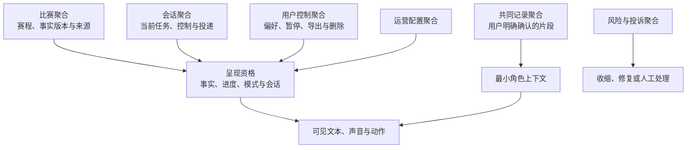
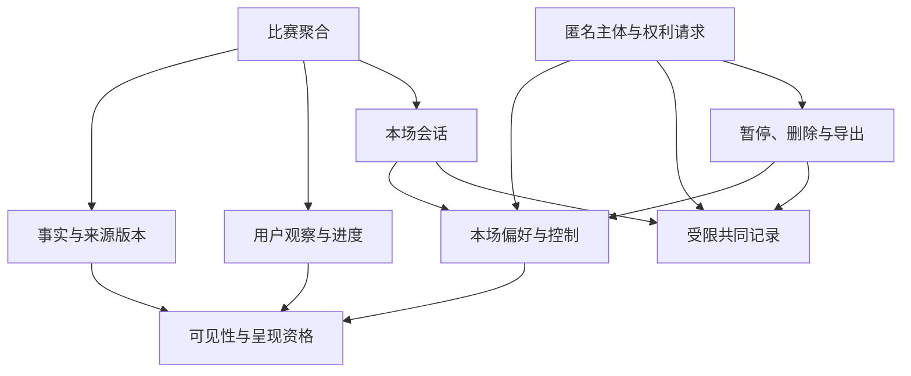
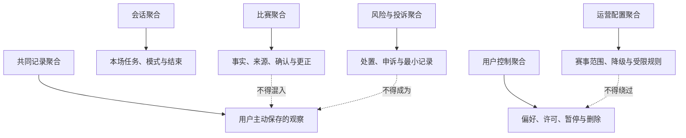
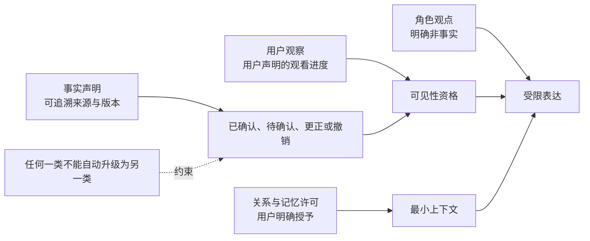
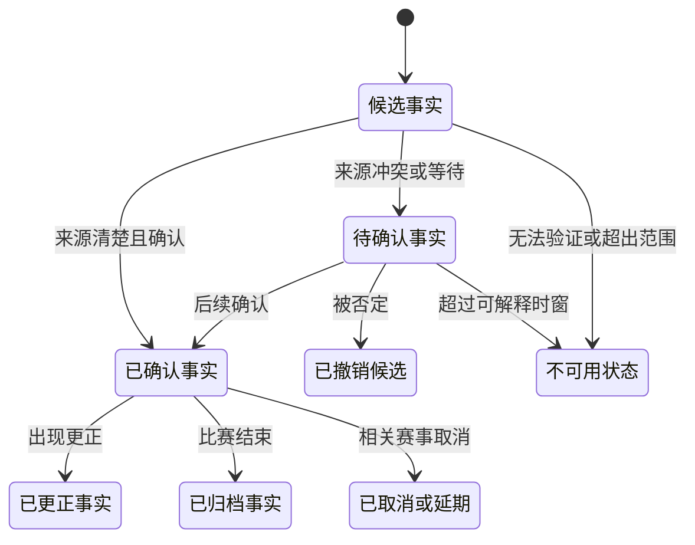
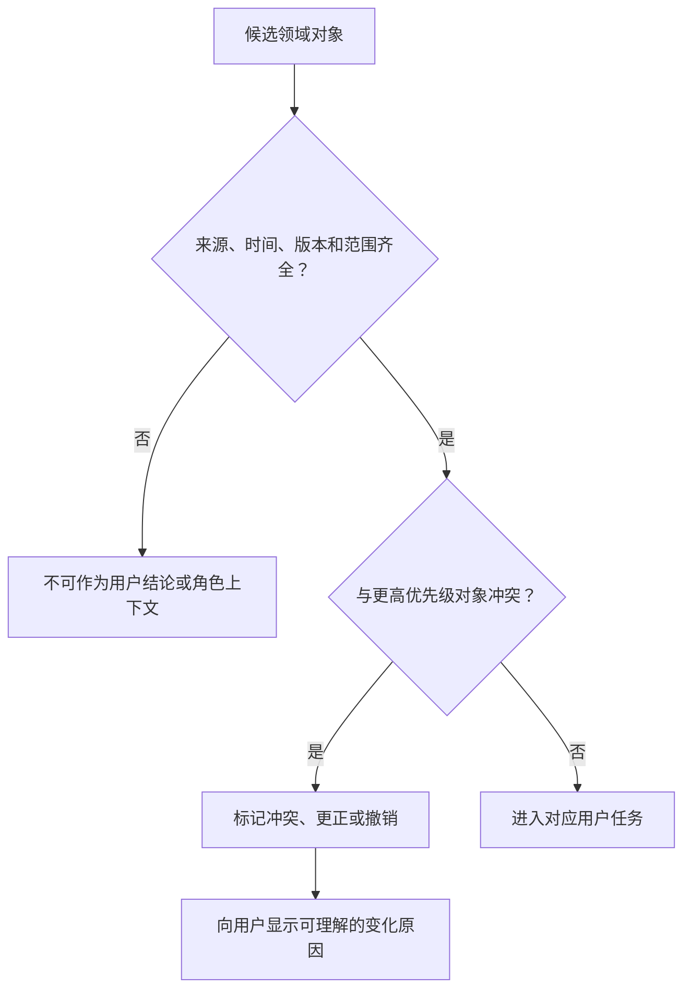
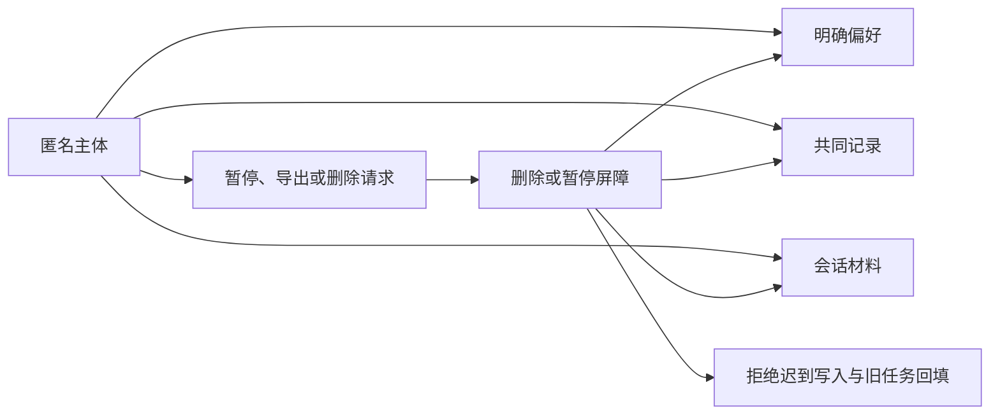
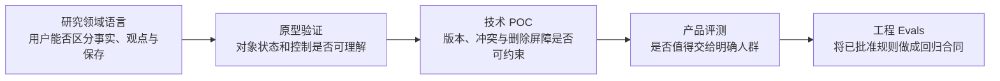
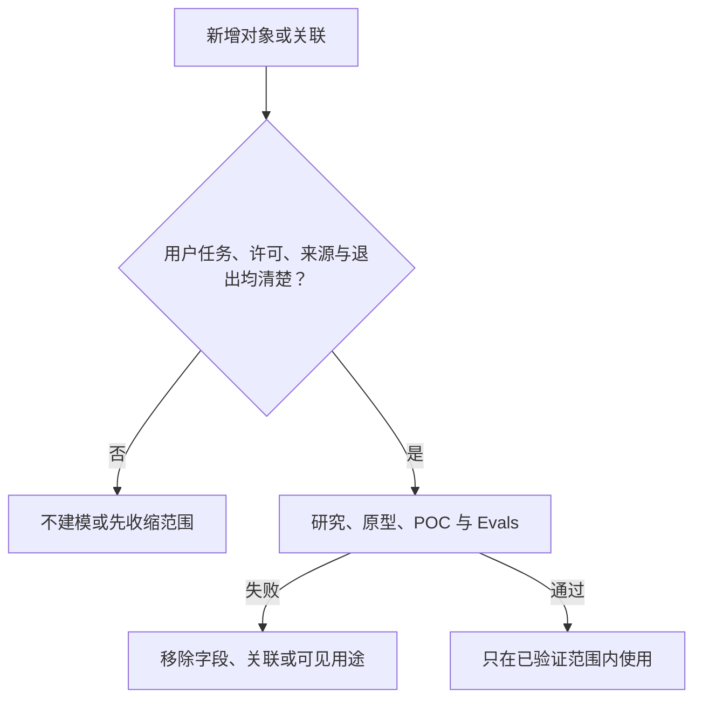

# 领域数据模型设计

> 文档性质：0→1 产品设计决策稿  
> 适用对象：产品、数据治理、内容、研究、运营、风险治理与交付团队  
> 决策状态：首轮方案；数据对象、权限与生命周期先经研究和审议，再讨论扩大自动化与连续性范围  

## 1. 设计问题：没有清楚的领域语言，系统就会把不同的“知道”混成一件事

足球数字陪看会同时处理比赛事实、用户当场观察、角色观点、会话状态、用户偏好、共同记录、风险事件和运营配置。它们看起来都像“信息”，但性质完全不同：比赛比分可能需要来源与确认状态；用户说“我觉得中场顶不住”是其观点；角色说“这次换人可能改变压迫”是可反驳的分析；用户选择“少说一点”是即时控制；用户主动保存的赛季观察是可删除的个人记录；运营人员配置一个赛事入口，是服务规则而不是用户记忆。

如果这些概念没有边界，产品会出现一连串问题：把候选比赛事件说成事实；把用户一句短暂情绪变成长期画像；把角色推断写进记忆；把风险投诉用于个性化；把运营配置伪装成角色意见；用户删除一条记录后，另一个对象仍把它引用回来；或者团队为了方便查询，把全部历史内容塞进一个不可解释的“用户档案”。

本篇的基本决定是：**数据模型首先是一套产品边界与用户权利模型，不是为了积累更多内容的容器。每一个对象都必须说明它是谁的陈述、服务什么任务、能否跨场、如何被用户看见、何时过期、怎样撤回，以及绝不能被转作什么用途。**

### 1.1 本篇的核心决策

1. 使用一组明确、可被跨职能团队复述的领域语言，至少区分比赛、比赛事实、观察、观点、关系许可、用户偏好、共同记录、会话、运营配置、风险事件与研究材料；
2. 将“事实”“观察”“关系”“记忆”“会话”“运营”视为不同对象族，不允许用一个统称为“上下文”或“用户画像”的对象替代；
3. 事实必须包含来源、时间、确认状态与更正路径；观察必须说明来自用户、角色或公开来源；关系对象只保存用户已授权的服务许可，不描述亲密度、依赖度或用户价值；
4. 记忆只包含用户明确保存或编辑的、任务相关的低风险内容，不自动吸收情绪、沉默、风险、投诉、语音语调或角色推断；
5. 会话对象默认短生命周期，用于完成本场任务；跨场使用必须迁移到用户可查看、可编辑、可暂停和可删除的对象；
6. 运营配置与用户数据严格分离。运营规则可以决定服务可用性与安全边界，不能把用户内容转成不可解释的干预或商业分群；
7. 每个对象都有质量、版本、权限、保留、删除和防回写规则；删除一个对象后，相关派生引用、提醒、舞台与人工视图都应停止使用它；
8. 首轮只面向能自主同意的成年人。年龄不确定时，采用最少数据、无跨场连续性和无强主动触达路径。

### 1.2 本篇不决定什么

本篇不规定某个供应商、存储方案、接口形式或具体交付工具，也不取代适用法律、数据保护专业意见或比赛事实的商业授权判断。它规定的是产品在作出这些选择前必须保持的对象边界与用户可解释性。

本篇也不追求“一次建完所有对象”。首轮应从最小可用的对象集合开始，只有在每个对象的用户价值、质量、删除和风险边界被验证后，才增加更多字段、关联或自动化。数据模型的复杂度必须由清楚的服务任务证明，而不是由“以后可能有用”证明。

### 1.3 成功与失败的定义

成功是产品、内容、研究、运营和人工支持人员能对同一个词给出一致解释；用户能知道角色为什么提起某项内容；一条待确认事实不会被表演成结果；用户删除共同记录后，没有其他对象继续把它当作可用记忆；风险或投诉材料不影响关系、提醒和商业表达；运营规则能够被审议而不暴露私人内容。

失败包括：角色将观点当事实；事实更正后旧结论仍持续出现；用户情绪被自动保存为关系信息；一项偏好被扩展到无关场景；不同团队用“记忆”“会话”“标签”等词指不同东西；用户无法导出或删除对象；运营人员为追求互动而改写用户控制；或一个对象删除后迟到的内容重新让它可用。

## 2. 领域语言：先统一名词，才有资格设计行为

领域语言不是文档里的词汇表装饰。它决定团队在讨论“角色记得什么”“这条能不能发”“为什么这场会出现”“删除后还有没有”时，是否在谈同一件事。首轮必须避免含混词，如“画像”“熟悉度”“洞察”“关系分”“用户价值”，因为它们常把事实、推断、许可和商业目的混在一起。

### 2.1 核心名词表

> 信息卡：原宽表已改为纵向阅读，字段含义不变。

- **术语：比赛**
  - **工作定义**：一个可识别的足球赛事实体
  - **谁能创建**：公开赛事目录或经审议来源
  - **主要用途**：组织赛程与陪看入口
  - **绝不表示什么**：用户是否会观看或关心

- **术语：比赛事实**
  - **工作定义**：关于比赛的可验证陈述
  - **谁能创建**：有来源的事实供给或人工更正
  - **主要用途**：呈现比分、时间、事件状态
  - **绝不表示什么**：角色观点或用户情绪

- **术语：观察**
  - **工作定义**：对比赛或服务的有来源描述
  - **谁能创建**：用户、角色或公开赛事信息
  - **主要用途**：支持讨论、研究或任务
  - **绝不表示什么**：已被确认的事实

- **术语：观点**
  - **工作定义**：可反驳的分析或立场
  - **谁能创建**：用户或角色
  - **主要用途**：讨论足球
  - **绝不表示什么**：官方裁决或用户身份

- **术语：会话**
  - **工作定义**：有开始和结束的本场互动容器
  - **谁能创建**：用户进入或服务状态
  - **主要用途**：完成当场任务与控制
  - **绝不表示什么**：永久关系或跨场记忆

- **术语：偏好**
  - **工作定义**：用户明确选择的服务设置
  - **谁能创建**：用户
  - **主要用途**：调整语言、节奏、无障碍与视角
  - **绝不表示什么**：心理状态、亲密度或消费价值

- **术语：共同记录**
  - **工作定义**：用户主动保存并可编辑的比赛观察
  - **谁能创建**：用户
  - **主要用途**：下次按用户意愿引用
  - **绝不表示什么**：“我们”的情感资产

- **术语：关系许可**
  - **工作定义**：用户对连续性、提醒、称呼与主动性的分项授权
  - **谁能创建**：用户
  - **主要用途**：限制服务可做什么
  - **绝不表示什么**：用户对角色的承诺

- **术语：运营配置**
  - **工作定义**：服务范围、赛事可用性、风险门和内容规则
  - **谁能创建**：受权限约束的运营角色
  - **主要用途**：维护安全、可用与一致服务
  - **绝不表示什么**：对某个用户的关系判断

- **术语：风险事件**
  - **工作定义**：需要停止、限制、投诉或人工复核的服务事件
  - **谁能创建**：用户、规则或人工
  - **主要用途**：降低伤害与修复
  - **绝不表示什么**：长期用户标签或个性化输入

- **术语：研究材料**
  - **工作定义**：用户单独同意的研究内容
  - **谁能创建**：用户主动参与
  - **主要用途**：验证假设与改进设计
  - **绝不表示什么**：正式服务的关系记忆

这组词的共同约束是“来源可说清”。任何对象若不知道是谁创建、在什么条件下创建、用户能否查看或删除，就不应进入首轮。

### 2.2 三类最容易混淆的陈述

**事实与观察。** “第 72 分钟，比分变为 2:1”只有在来源与状态足够明确时才是事实；“这次换人改变了中场保护”是观察或观点。事实可以更正，观察可以被讨论，但不能混写。

**偏好与关系。** 用户选择“只在关键事件说话”是偏好；用户没有授权角色在深夜主动问候，更没有承诺与角色建立亲密关系。偏好提升服务匹配度，不赋予角色更多情感或商业权限。

**共同记录与风险材料。** 用户主动保存“下场继续观察边路压迫”是共同记录；用户投诉“不要再用这个称呼”是风险或投诉材料。两者都可能影响之后的服务，但前者由用户选择在相关任务中引用，后者应在配置层停止行为，而不被角色拿来制造“我记得你”的语境。

### 2.3 领域语言的禁止词

首轮禁止使用或建立以下对象：隐形亲密度、依赖等级、情绪价值分、留存风险分、脆弱性分、消费潜力分、孤独度、关系热度、沉默意图、用户可被打扰程度等。这些对象会把不确定的人类行为压缩成高影响标签，并容易被用来扩大触达、定价或关系操控。

如果团队需要回答“现在能不能主动说话”，应查看用户即时选择、关系许可、事实状态、会话模式与预算，而不是调用一个用户人格分数。

## 3. 对象与聚合：让高关联内容围绕用户任务而不是围绕数据积累组织





本篇使用“聚合”描述一组必须一起保持一致边界的领域对象。它不是要求用户理解的术语，但能帮助团队判断：哪些内容可以一起修改、谁拥有删除权、哪些引用必须在同一时间停止。

### 3.1 比赛聚合

比赛聚合以一个赛事为中心，包含比赛标识、参赛方、计划时间、比赛状态、事实事件、事实版本、公开来源与可用性状态。它服务于“用户正在看什么”“现在发生了什么”“这条是否已确认”。

比赛聚合不包含用户情绪、角色好感、提醒许可或共同记录。即使很多用户围绕同一场比赛表达感受，也不能把这些内容混进比赛事实。比赛事实是公共任务对象，用户数据是私有控制对象。

### 3.2 会话聚合

会话聚合包含一次进入、当前比赛、当场模式、用户即时控制、用户当前问题、短暂上下文、音频状态、服务状态和结束状态。它的目的只是让本场互动连贯、可打断、可降级、可结束。

会话默认短生命周期。用户结束本场、选择访客模式、暂停连续性或清空本场后，会话内容不应自动成为跨场材料。只有用户明确选择保存的低风险偏好或共同记录，才通过独立确认进入相应聚合。

### 3.3 用户控制聚合

用户控制聚合包含身份与访问范围、语言和无障碍偏好、互动节奏、通知许可、关系许可、暂停状态、删除请求、导出请求和可见性选择。它的核心是“用户允许服务做什么”，而不是“服务认为用户需要什么”。

任何主动、提醒、舞台动作、语音保存、跨场引用或人工访问，都需要在用户控制聚合中找到明确依据。找不到依据时，默认不做或仅保留用户当场主动请求。

### 3.4 共同记录聚合

共同记录聚合以用户主动保存的比赛观察为中心，包含内容、创建时间、相关赛事或主题、用户编辑、引用许可、可见性、到期或删除状态。它支持用户在下一场继续自己的观察，而不是支持角色建立“我们共同经历”的叙事。

共同记录不得自动包含整段对话、角色分析、语音原始内容、用户情绪或风险材料。用户可以导出、单条删除、全部清空和停止引用。删除后所有与之关联的提醒、下一场提议和角色引用必须停止。

### 3.5 风险与投诉聚合

风险与投诉聚合包含用户报告、服务行为说明、最小处置状态、申诉、人工复核范围和修复结果。它的用途是停止伤害、解释限制、纠正错误和支持用户权利，不能成为个性化、商业、主动触达、角色表演或关系连续性的输入。

将风险聚合隔离，能防止一个用户为了纠正不当内容而反而被记住更多敏感信息。角色不需要知道投诉细节，只需要接收已生效的最小行为约束，例如“不要使用该称呼”“本场不再引用历史”。

### 3.6 运营配置聚合



运营配置聚合包含服务范围、赛事目录规则、事实可用性、表达规则、风险门、语言资源、公共状态文案、人工支持可用性和回退条件。它解释为什么服务在某个赛事、地区或状态下可用、受限或暂停。

运营配置不能直接保存个人会话，也不能让运营人员为了提高互动而扩大用户许可。若需要根据群体研究调整规则，应使用最小、经审议的汇总信息，而不是打开某个用户的完整历史。

## 4. 事实、观察、观点与关系：不同的真值标准，不同的用户后果



足球陪看中的可信度，取决于用户能否区分“发生了什么”“有人怎么理解”“角色允许做什么”。因此模型必须把真值状态、来源和权限显式化，而不是依赖角色口吻或视觉效果。

### 4.1 比赛事实对象

每一个比赛事实至少需要：事实类型、发生时间、接收时间、来源类别、确认状态、相关比赛、版本、可见状态和更正关系。事实类型可以是开球、进球、红黄牌、换人、半场、终场、取消、延期或待确认。确认状态至少区分已确认、待确认、已更正、不可用和来源冲突。

用户应看到对体验有影响的状态，而不是被一个“看似确定”的角色反应误导。事实对象不需要保存用户觉得这件事怎样；用户观点属于不同对象。

### 4.2 观察与观点对象

观察对象应有作者类型、内容、相关比赛或主题、表达时间、是否由用户主动保存、可见范围和删除状态。角色观察必须显式标为观点或可能性，不得伪装成比赛事实。用户观察属于用户，默认只在本场使用；只有用户主动保存才可跨场。

观点对象可以支持有趣的足球讨论，但不能升级为用户标签。例如用户多次认为某位教练保守，不代表产品可以推断其政治倾向、情绪风格或是否适合被某种角色语气对待。

### 4.3 关系许可对象

关系许可对象只保存用户对具体服务行为的选择：是否允许保存某项低风险偏好、是否允许引用共同记录、是否开启赛后一次回顾、是否接受特定赛事提醒、是否使用某种称呼、是否允许语音本场处理。每项许可都有来源、范围、开始、失效、暂停、撤回和解释。

关系许可不保存“用户与角色的亲密程度”。服务可以有连续性，不需要把连续性当成人际关系升级。用户撤回许可时，角色不应表现受伤，系统也不能用旧行为推断其真实意图。

### 4.4 角色表达对象

角色表达对象用于描述将要或已经呈现的事实说明、观点、情绪承接、状态提醒和拒绝边界。它至少关联当前会话、表达类型、事实或许可来源、强度、用户可见性、是否允许主动和结束原因。它不能直接读取所有用户历史，只能获得完成当前任务所需的最小上下文。

将角色表达单独建模，能让团队审议“一句为什么出现”“它依据什么”“用户如何停掉”，而不是把所有责任推给一个模糊的生成结果。

## 5. 生命周期与状态转换：对象何时诞生、何时可用、何时必须失效

对象的生命周期需要比“创建后一直存在”更精细。不同对象的生命长度不同，且任何对象在被删除、暂停、过期或更正后都必须停止产生可见影响。

### 5.1 比赛事实生命周期



已更正或已撤销的事实不能继续作为角色庆祝、通知、舞台动作或用户总结的基础。用户若曾看到旧状态，服务需要在适当位置说明更正，而不是悄悄替换让用户怀疑自己的记忆。

### 5.2 会话生命周期

会话从用户主动进入或开始本场操作时创建，经历准备、进行、安静、暂停、降级、结束和清理。会话中任何即时控制，如“少说一点”“别提过去”“结束语音”，优先于跨场偏好和角色默认风格。

会话结束后，本场上下文进入不可再用于连续性或按用户选择清理的状态。用户主动保存的内容需要显式创建新的偏好或共同记录对象，而不是把整个会话“升格”为记忆。

### 5.3 偏好与许可生命周期

偏好和许可通常经历提出、确认、生效、暂停、到期、撤回、删除和重新选择。重新选择代表新的同意，不能自动恢复旧值。用户暂停赛后提醒后，提醒对象必须停止；用户删除称呼偏好后，角色表达不能从其他记录重新取回。

许可对象应有明确的“未设置”状态。未设置不是默认允许，也不是等待系统从行为中猜测；它表示服务应保持保守。

### 5.4 共同记录生命周期

共同记录由用户主动保存或编辑开始，之后可被用户查看、改写、在相关任务中选择引用、暂停显示、设定到期或删除。系统不应自行将一条很受欢迎的记录置顶、延长或反复提醒；用户没有打开不代表系统可以替用户维持话题。

删除共同记录后，所有派生的下一场提议、赛后提醒、舞台标签和角色引用必须失效。用户后来再次创建相似观察，也应被视为新的对象，不恢复被删除的旧内容。

### 5.5 风险与投诉生命周期

风险事件从用户报告、明确规则触发或人工发现开始，经历最小保护、说明、用户选择、必要复核、修复、申诉与结束。风险对象在处理期间可限制某些表达或许可，但不应永久改变用户的基础服务地位。

风险处置结束后，角色只接收最小行为边界，不接收完整投诉叙述。若用户要求删除可删除材料，应优先停止访问与引用，并按明确范围清理；不能把“防风险”变成无限保留一切的理由。

## 6. 数据质量：可信的对象必须能说明来源、时间和不确定性



数据质量不是单纯追求“没有空值”。对于陪看产品，错误、延迟、来源冲突、过期、重复、语义混淆和权限漂移都会直接伤害用户体验。质量规则应围绕用户可见后果设计。

### 6.1 质量维度

**维度：来源**
- **核心问题**：这条从哪里来？
- **对用户的影响**：用户能否信任事实或解释
- **首轮保护**：来源类别与可解释状态

**维度：时效**
- **核心问题**：它是什么时候发生、何时收到？
- **对用户的影响**：是否会剧透或滞后
- **首轮保护**：事件时间与接收时间区分

**维度：确认**
- **核心问题**：已确认还是候选？
- **对用户的影响**：是否把猜测当结果
- **首轮保护**：显式确认状态

**维度：一致**
- **核心问题**：多处是否说同一件事？
- **对用户的影响**：角色、比分和通知是否冲突
- **首轮保护**：统一事实对象与更正关系

**维度：完整**
- **核心问题**：关键字段是否足以解释？
- **对用户的影响**：用户能否理解状态
- **首轮保护**：最小字段与缺失降级

**维度：权限**
- **核心问题**：现在有资格用它吗？
- **对用户的影响**：是否越过用户选择
- **首轮保护**：许可、暂停、撤回检查

**维度：可删除**
- **核心问题**：用户撤回后是否停止出现？
- **对用户的影响**：删除权是否可信
- **首轮保护**：撤回屏障与引用失效

**维度：公平**
- **核心问题**：不同表达是否被同样理解？
- **对用户的影响**：是否系统性误伤群体
- **首轮保护**：多语言与语境研究

### 6.2 质量失败时的产品动作

当事实来源冲突，角色和舞台应降级为待确认或中性状态；当偏好来源不清，停止引用并让用户查看设置；当共同记录无法确定是否仍有效，默认不主动提起；当许可状态缺失，采用不保存、不提醒、不主动的保守路径；当删除状态未完成，撤回屏障优先于任何便利。

“先继续展示，稍后修复”在陪看中往往不可接受。用户可能已经把错误带入情绪、社交讨论或现实判断。质量失败应先降低影响，再追求连续性。

### 6.3 版本化与更正

事实、运营配置、角色表达规则、许可和共同记录都可能发生变化，但变化的含义不同。事实版本用于说明更正；运营版本用于说明规则何时改变；许可版本用于证明用户何时选择或撤回；共同记录版本用于保护用户自己的编辑历史；表达规则版本用于审议角色行为边界。

版本化不能成为保留一切旧隐私内容的借口。对用户可删除对象，版本也应受删除和撤回约束。用户需要知道的是“现在会怎样影响我”，而不是被要求理解全部历史版本。

### 6.4 变更的用户影响审议

任何新增字段、扩大关联、引入新来源、延长保留、放宽跨场引用、增加主动提醒或让运营配置读取更多用户信息的变更，都应说明用户价值、风险、许可、删除、质量失败和回退。若不能说明用户怎样关闭或纠正，首轮不应批准。

特别需要警惕“只是多加一个字段”。一个字段若让服务从“知道用户喜欢什么球队”变成“猜测用户何时脆弱”，后果远超过字段数量本身。

## 7. 隐私、权限与删除：对象边界必须在用户撤回时一起收缩



领域数据模型的隐私价值，取决于用户能否让某类对象停止被创建、停止被读取、停止被显示并最终被删除。仅删除主记录而留下提醒、舞台、导出、人工视图或延迟处理，都会让用户继续遭受影响。

### 7.1 权限矩阵

> 信息卡：原宽表已改为纵向阅读，字段含义不变。

- **对象族：比赛事实**
  - **用户可查看**：可查看来源与状态
  - **用户可编辑**：不编辑公共事实，可反馈问题
  - **用户可暂停**：不适用
  - **用户可删除**：不适用
  - **角色可引用条件**：当前比赛、状态清楚
  - **人工可见条件**：处理事实问题时最小范围

- **对象族：会话**
  - **用户可查看**：可见主要本场选择
  - **用户可编辑**：可调整当前模式
  - **用户可暂停**：可暂停连续性
  - **用户可删除**：可清空本场
  - **角色可引用条件**：仅当前会话
  - **人工可见条件**：处理当前问题时最小范围

- **对象族：偏好**
  - **用户可查看**：可查看
  - **用户可编辑**：可改
  - **用户可暂停**：可暂停
  - **用户可删除**：可删
  - **角色可引用条件**：用户许可且任务相关
  - **人工可见条件**：通常不需要

- **对象族：共同记录**
  - **用户可查看**：可查看
  - **用户可编辑**：可改
  - **用户可暂停**：可暂停引用
  - **用户可删除**：可单条或全删
  - **角色可引用条件**：用户开启且相关
  - **人工可见条件**：用户请求支持时最小范围

- **对象族：风险与投诉**
  - **用户可查看**：可查看处理状态
  - **用户可编辑**：可补充与申诉
  - **用户可暂停**：可停止非必要沟通
  - **用户可删除**：按范围请求删除
  - **角色可引用条件**：不可引用
  - **人工可见条件**：处理当前事件最小范围

- **对象族：研究材料**
  - **用户可查看**：可查看同意范围
  - **用户可编辑**：可更正
  - **用户可暂停**：可撤回
  - **用户可删除**：按范围删除
  - **角色可引用条件**：不可引用
  - **人工可见条件**：研究职责与同意范围内

- **对象族：运营配置**
  - **用户可查看**：用户可见影响说明
  - **用户可编辑**：不直接编辑
  - **用户可暂停**：通过用户设置选择退出
  - **用户可删除**：不适用
  - **角色可引用条件**：不直接引用用户内容
  - **人工可见条件**：受角色权限与审议限制

### 7.2 删除与防回写

当用户删除偏好、共同记录、语音转写、研究材料或账户相关内容时，服务先建立撤回屏障：停止新写入、停止现有引用、阻断延迟处理和外部回流，再完成清理。对象的关联应帮助而非阻碍删除：系统需要知道有哪些提醒、舞台状态、下一场提议、导出内容或人工视图依赖该对象，才能全部停止。

防回写的原则是：任何后到内容在成为可用对象前，都要检查用户是否仍允许此类别存在。用户重新开启一项能力，只能从新选择开始，不能恢复已删除历史。删除不是临时隐藏，更不是角色日后可以“想起”的素材。

### 7.3 目的隔离

对象不应跨用途漂移。风险事件不进入记忆；研究材料不改变正式服务待遇；语音转写不自动成为共同记录；运营配置不生成用户价值标签；比赛事实不导出为情绪画像；共同记录不成为商业触达理由。目的隔离不仅降低隐私风险，也让用户更容易理解和行使控制。

## 8. 数据字典示例：用最小字段描述用户可见后果

以下示例不是完整字段清单，而是用于团队审议“为什么需要它”“谁能用”“何时失效”的最小字典。任何新增项目都需要达到同等解释力度。

### 8.1 比赛事实：进球状态

> 信息卡：原宽表已改为纵向阅读，字段含义不变。

- **项目：赛事标识**
  - **示例含义**：哪一场比赛
  - **为什么需要**：将事实放进正确场景
  - **用户可见后果**：用户看到对应比分与时间
  - **保留与更正**：随赛事事实归档

- **项目：事件类型**
  - **示例含义**：进球
  - **为什么需要**：区分不同比赛变化
  - **用户可见后果**：决定是否属于用户选择的关键事件
  - **保留与更正**：可被更正或撤销

- **项目：事件时间**
  - **示例含义**：比赛中的发生时点
  - **为什么需要**：解释先后顺序
  - **用户可见后果**：用户理解第几分钟发生
  - **保留与更正**：保留事实时间

- **项目：接收时间**
  - **示例含义**：服务何时获得信息
  - **为什么需要**：解释延迟与不同步
  - **用户可见后果**：用户知道为什么可能滞后
  - **保留与更正**：用于质量复核

- **项目：确认状态**
  - **示例含义**：待确认/已确认/已更正
  - **为什么需要**：防止把候选当结果
  - **用户可见后果**：角色和舞台强度受限
  - **保留与更正**：状态可变化且有版本

- **项目：来源类别**
  - **示例含义**：公开赛事来源或人工更正
  - **为什么需要**：支持可追溯性
  - **用户可见后果**：用户可查看来源说明
  - **保留与更正**：不替代用户观点

### 8.2 用户偏好：有限提示

> 信息卡：原宽表已改为纵向阅读，字段含义不变。

- **项目：偏好名称**
  - **示例含义**：有限提示
  - **为什么需要**：让用户认识设置
  - **用户可见后果**：角色只在定义节点提示
  - **删除后果**：不再主动提示

- **项目：用户选择**
  - **示例含义**：用户主动开启
  - **为什么需要**：证明许可来源
  - **用户可见后果**：可在设置中看到
  - **删除后果**：立即停止使用

- **项目：适用范围**
  - **示例含义**：本场或用户指定赛事
  - **为什么需要**：避免无限扩展
  - **用户可见后果**：不影响无关比赛
  - **删除后果**：不再沿用

- **项目：频率边界**
  - **示例含义**：每个事件最多一次
  - **为什么需要**：控制打扰
  - **用户可见后果**：不连续发言
  - **删除后果**：不恢复旧频率

- **项目：暂停状态**
  - **示例含义**：当前是否停用
  - **为什么需要**：尊重即时意图
  - **用户可见后果**：角色保持安静
  - **删除后果**：停止引用

- **项目：最近变更**
  - **示例含义**：用户何时调整
  - **为什么需要**：帮助用户理解结果
  - **用户可见后果**：可撤回或修改
  - **删除后果**：受删除约束

### 8.3 共同记录：赛季观察

> 信息卡：原宽表已改为纵向阅读，字段含义不变。

- **项目：记录内容**
  - **示例含义**：用户保存的战术观察
  - **为什么需要**：支持用户下次继续任务
  - **用户可见后果**：仅在用户开启时可引用
  - **删除后果**：不再出现或提醒

- **项目：相关主题**
  - **示例含义**：某队或某类比赛
  - **为什么需要**：限制引用语境
  - **用户可见后果**：不跨越到无关对话
  - **删除后果**：关联提议失效

- **项目：创建来源**
  - **示例含义**：用户主动保存
  - **为什么需要**：区分角色推断
  - **用户可见后果**：用户知道它为何存在
  - **删除后果**：全部清理

- **项目：编辑版本**
  - **示例含义**：用户修改历史
  - **为什么需要**：支持更正与自主性
  - **用户可见后果**：显示当前版本
  - **删除后果**：版本同样删除

- **项目：引用许可**
  - **示例含义**：是否允许本场提起
  - **为什么需要**：防止自动关系化
  - **用户可见后果**：用户可暂停
  - **删除后果**：角色不再读取

- **项目：到期选择**
  - **示例含义**：用户指定结束条件
  - **为什么需要**：避免无限保留
  - **用户可见后果**：到期后静默失效
  - **删除后果**：不催促恢复

### 8.4 风险投诉：不当称呼报告

> 信息卡：原宽表已改为纵向阅读，字段含义不变。

- **项目：报告类型**
  - **示例含义**：不当称呼
  - **为什么需要**：分类处理与修复
  - **用户可见后果**：停止相关表达
  - **严格限制**：不进角色记忆

- **项目：当前状态**
  - **示例含义**：已收到/处理中/已修复
  - **为什么需要**：让用户了解进展
  - **用户可见后果**：可看到处理结果
  - **严格限制**：不用于关系标签

- **项目：最小影响范围**
  - **示例含义**：哪种称呼或哪场会话
  - **为什么需要**：避免扩大访问
  - **用户可见后果**：只停止必要行为
  - **严格限制**：不浏览无关历史

- **项目：用户选择**
  - **示例含义**：是否要人工、是否补充
  - **为什么需要**：尊重控制
  - **用户可见后果**：可结束或申诉
  - **严格限制**：不强迫披露

- **项目：修复结果**
  - **示例含义**：已停止引用/已更新边界
  - **为什么需要**：恢复用户控制
  - **用户可见后果**：可确认下一步
  - **严格限制**：受删除与保留规则约束

## 9. 运营概念：运营规则服务于边界，不能变成隐形角色操控

运营配置是必要的，因为赛事可用性、事实来源、语言资源、风险门、人工支持和公共文案需要一致管理。但运营对象不能绕过用户控制，也不能把“提高活跃”写成改变角色行为的唯一理由。

### 9.1 可配置与不可配置的边界

可以配置的内容包括：哪些赛事可用、事实状态文案、风险类别的最小回应、支持渠道的可用时间、公开内容标识、默认无障碍路径、服务降级规则和发布门。不可配置的内容包括：让角色在用户关闭后继续触达、按消费或脆弱性提高亲密表达、把投诉材料变成提醒依据、弱化删除或退出、或将未成年人带入成人关系化体验。

运营灵活性应该存在于安全范围内，而不是成为临时突破边界的工具。

### 9.2 运营变更的最小记录

每项高影响运营变更需要有：目的、影响对象、用户可见改变、数据对象变化、风险假设、研究或审议依据、回退条件、负责人和生效范围。这里的记录不是为了增加流程，而是为了让团队在用户问“为什么今天不一样”时能够回答。

影响用户许可、跨场引用、通知、舞台、风险处置、人工访问或保留期限的变更，都属于高影响。不能用“只是文案或配置”降低审议要求。

## 10. 研究与验证计划：先验证对象边界与用户理解，再增加关联



数据模型的好坏不能只通过内部一致性判断。用户必须能理解这些对象造成的体验后果，研究也需要证明对象分离确实减少误用、误解和退出成本。

### 10.1 核心研究问题

1. 用户能否区分事实、观察、观点、偏好、共同记录、会话、投诉和研究材料？
2. 用户是否知道角色为什么提起某项内容，能否追溯到自己的选择或当前比赛状态？
3. 用户能否在十秒内让某项内容只限本场、暂停跨场引用、编辑、删除或以全新模式进入？
4. 用户是否把共同记录理解为自己的比赛工具，而不是与角色的关系承诺？
5. 用户是否理解待确认事实与角色观点的区别，且舞台、通知和语音是否保持一致？
6. 用户删除后，是否相信并实际观察到相关引用、提醒和舞台状态停止？
7. 不同语言、设备、观赛经验和无障碍需求下，领域词汇是否同样可理解？
8. 运营范围变化时，用户能否理解哪些服务能力变了、哪些权利没有变？

### 10.2 四阶段研究路径

**阶段 A：领域语言访谈。** 使用对象卡片和情境卡，让成年参与者把“比分待确认”“我的主队”“我保存的观察”“角色的观点”“投诉记录”分组并解释为什么。记录哪些词让用户误以为被观察、被关系化或失去控制。

**阶段 B：权利与来源走查。** 在原型中设置任务：查看一条事实来源、纠正角色观点、暂停主队引用、保存一条观察、删除观察、查看风险处理状态、切换访客本场、拒绝语音保存。观察用户是否能找到正确对象并理解修改后果。

**阶段 C：冲突与删除演练。** 模拟事实更正、用户要求安静、删除后迟到的处理、不同观看延迟、投诉不当称呼和运营范围收缩。评估对象边界是否阻止错误引用和防止删除后重新出现。

**阶段 D：小范围纵向研究。** 仅在语言、控制和删除门通过后，让参与者自主选择低风险偏好和共同记录。研究关注跨场是否减少重复设置、对象是否被正确理解、风险与投诉是否仍被隔离、不保存者是否拥有完整服务。研究结束时提供导出、删除与不再参与路径。

### 10.3 可被否定的假设

首轮假设是：“将事实、会话、偏好、共同记录、关系许可和风险材料拆分后，用户能更准确地解释角色行为，并更容易只删除或暂停自己不想继续的那一部分。”如果用户仍把所有内容理解成“角色记住了我”，或删除一个对象后仍看到相关引用，应停止增加关联，优先简化对象和控制面。

另一个假设是：“不使用任何跨场对象的用户仍能完成核心陪看任务。”如果拒绝连续性导致基础服务明显变差，说明模型把便利错误地做成了准入门槛，需要回到本场优先。

## 11. 指标、风险门与停止条件：对象数量不是模型成熟度



数据模型容易被字段数、关联数、记录数和可分析维度驱动，但这些数量不等于用户价值。首轮需要衡量的是可解释、可控制、可信更正、完整删除和公平可达。

### 11.1 核心指标

**维度：术语理解**
- **候选指标**：用户正确区分关键对象的比例
- **用于判断什么**：领域语言是否清楚
- **不能如何误读**：不等于术语越多越好

**维度：来源可追溯**
- **候选指标**：用户能说明角色引用依据的比例
- **用于判断什么**：对象来源是否透明
- **不能如何误读**：不等于引用越频繁越好

**维度：事实可信**
- **候选指标**：用户区分已确认、待确认与观点的比例
- **用于判断什么**：事实模型是否保护理解
- **不能如何误读**：不等于信息越少越可信

**维度：控制成功**
- **候选指标**：查看、编辑、暂停、删除和访客模式完成率
- **用于判断什么**：用户是否拥有对象主权
- **不能如何误读**：完成后仍不安也不合格

**维度：删除完整性**
- **候选指标**：删除后派生引用停止的比例
- **用于判断什么**：关联与撤回屏障是否有效
- **不能如何误读**：小样本无问题不代表无风险

**维度：目的隔离**
- **候选指标**：风险、研究与记忆不跨用途的比例
- **用于判断什么**：是否防止用途漂移
- **不能如何误读**：对象隔离不等于用户无权查看

**维度：变更可解释**
- **候选指标**：用户理解高影响规则变化的比例
- **用于判断什么**：运营配置是否透明
- **不能如何误读**：不等于所有变更都需打扰用户

**维度：公平可达**
- **候选指标**：不同用户条件下控制结果的差异
- **用于判断什么**：是否存在结构性排除
- **不能如何误读**：差异需结合语境审议

### 11.2 必须并列的反指标

- 待确认事实、角色观点或舞台反应被用户误当作确认结果的事件数量；
- 用户情绪、沉默、未回复、风险或投诉材料进入偏好、共同记录、主动提醒或关系许可的事件数量；
- 用户删除或暂停后，相关对象仍被角色、通知、舞台、人工视图或外部处理引用的事件数量；
- 运营变更扩大了用户数据使用、主动触达或关系表达却没有清楚说明的事件数量；
- 不保存跨场对象的用户核心任务完成度显著下降的程度；
- 不同语言、设备与无障碍条件下对象控制和来源理解的显著落差；
- 用户因“我们的回忆”“关系设置”等命名感到删除有情感压力的比例；
- 未成年人或年龄不确定用户进入高风险对象与连续性范围的事件数量。

### 11.3 首轮发布门

扩大对象、关联、跨场引用或运营自动化前，必须同时满足：

1. 团队和目标用户能对关键领域词汇作出一致、可理解的解释；
2. 事实、观察、观点、偏好、共同记录、关系许可、会话、风险与运营配置彼此可区分且有明确来源；
3. 用户能独立查看、修改、暂停、删除、导出并以全新本场进入；
4. 待确认、来源冲突、事实更正和服务异常中，角色、舞台、通知与语音不会抢先下结论；
5. 风险、投诉、研究和语音材料不进入关系、记忆、商业、主动触达或角色表演；
6. 删除和撤回会同时阻止新写入、现有引用、延迟处理、临时副本与必要外部回流；
7. 高影响运营变更有用户影响说明、风险审议、负责人和回退条件；
8. 年龄不确定路径收缩到最少数据、无跨场连续性和无高风险触达。

### 11.4 绝对停止条件

发现以下任一情况，应立即停止扩大相关对象或关联，必要时关闭能力：用户情绪或脆弱表达被自动写成记忆或关系对象；删除后旧内容重新出现；风险或投诉材料影响个性化或商业表达；角色将观点或待确认事实说成确定；用户无法解释引用来源或无法控制对象；运营规则绕过用户许可；或团队将隐形亲密度、依赖度、消费潜力等对象作为服务输入。

## 12. 取舍与后续交接

### 12.1 已选取舍

**选择对象分离，而不是一个万能用户档案。** 代价是关联设计和说明更细；收益是用户能够理解、控制并删除具体内容，而不是面对不可解释画像。

**选择事实与观点分开。** 代价是角色表达更克制、状态说明更多；收益是用户不会被角色口吻和舞台表演误导为官方结论。

**选择会话默认短生命周期。** 代价是跨场熟悉感建立更慢；收益是短暂情绪和随口表达不会自动跟随用户到下一场。

**选择关系许可只描述服务动作。** 代价是不能用亲密度分数做快速分群；收益是连续性不被转化为排他、依赖或商业压力。

**选择撤回屏障覆盖派生引用。** 代价是删除与协同处理更复杂；收益是用户删除后不会在提醒、舞台、角色或外部回流中再次见到旧内容。

### 12.2 给相邻工作的交接

比赛事实、延迟和对话设计需要基于事实对象的确认状态、来源与更正关系决定表达强度，不能把观点或候选状态写成结果。

关系阶段、共同记忆、赛后通知和主动发言设计需要只读取用户明确许可且未暂停、未删除、与当前任务相关的偏好和共同记录。

隐私、人工支持和内容安全设计需要将风险、投诉、研究、语音与关系对象目的隔离，并在撤回时同步阻断引用和迟到内容。

运营与工程交付设计需要让高影响配置变更可审议、可回退、可解释，不能以运营便利扩大用户数据使用或削弱退出权。

## 14. 结论

领域数据模型的价值，不在于它可以装下多少内容，而在于它让每一种“知道”都回到适当的位置：事实知道发生了什么，观察知道谁在怎样理解，偏好知道用户选择了什么，共同记录知道用户愿意带走什么，关系许可知道服务能做什么，会话知道本场正在发生什么，运营配置知道服务在哪些边界内工作，风险对象知道如何停止伤害。

当这些对象不再混成一个用户画像，产品才能在需要时准确、在不确定时克制、在用户撤回时真正忘记。用户不必把自己的情绪、沉默或离开交给系统解释，角色也没有资格把数据连续性变成关系债。清楚的领域语言与对象边界，正是可信陪看体验的底层条件。

## 生产版本设计拓展｜能力深化知识

本节描述产品成熟后的能力扩展、体验深化和治理要求，作为后续版本规划与设计决策的参考。


- **新增对象**：订阅、提醒、工具调用、审批、资料版本、表达版本和运行 Trace 均独立建模，带作用域、来源、状态、有效期和删除标记。
- **唯一状态映射**：候选、待确认、已确认、冲突、已更正、已撤回、不可用、取消/延期、已归档分别映射用户可见状态、事实资格、通知资格和表现资格。
- **资料隔离**：公共事实、用户资料、角色表达、运营配置和 Trace 使用不同权限域；模型上下文只能读取当前任务获准的字段。
- **版本与回写**：事实更正、用户修改和删除操作形成不可变版本链；模型推断不能直接覆盖确认事实或写入长期资料。
- **评测与回滚**：验证状态迁移完整性、越权读取、删除传播、重复提醒和旧版本引用；失败时停止相关能力并回滚到只读快照。

### 生产对象关系

```text
事实版本 ──资格裁决──> 呈现计划 ──媒介适配──> 用户会话
用户授权 ──作用域──> 订阅/资料/工具调用
控制版本 ──失效──> 排队计划、缓存和异步 run
删除屏障 ──传播──> 索引、队列、通知、上下文和副本
```

- 每个对象都带来源、状态、作用域、有效期、版本和删除标记；公共事实与用户资料不能共用隐式画像字段。
- 关系、表达和 Trace 只引用可验证的对象 ID，不存储“用户是否喜欢角色”等推断属性。
- 状态迁移必须可重放、可审计、可拒绝旧版本；模型输出不能直接改变事实状态或授权状态。

### 生产数据对象字段合同

生产版新增对象沿用同一组权利字段，避免提醒、记忆和工具各自发明生命周期。

| 对象 | 关键字段 | 读取资格 | 写入资格 | 删除/失效语义 |
| --- | --- | --- | --- | --- |
| `subscription` | `subscription_id`、赛事范围、时间窗、安静时段、状态、授权版本 | 当前用户、提醒服务 | 用户明确创建/修改 | 取消立即阻断待发任务并广播版本失效 |
| `reminder` | 订阅版本、事实版本、幂等键、计划时间、发送回执、撤回句柄 | 当前用户、运营复核 | 通过授权和资格检查的调度服务 | 过期/取消后不得补发；回执保留审计最小字段 |
| `memory_item` | 来源、用途、作用域、可见主体、有效期、版本、删除标记 | 当前任务获准字段 | 用户主动保存或明确修改 | 删除屏障先于缓存、索引、队列和异步回写 |
| `tool_run` | 工具版本、输入摘要、风险、授权、幂等键、效果状态、撤销句柄 | 运行审计和必要人工 | Agent 按工具合同创建 | 到期后仅保留最小审计，不回填模型上下文 |
| `trace` | `trace_id`、run/工具/护栏关联、耗时、费用、终止原因 | 受限运营/评测角色 | 系统自动写入 | 按保留期限去敏或删除，不作为关系记忆 |

### 模型上下文与运行时私有上下文

每次 run 建立两栏上下文，产品设计必须明确字段归属：

| 上下文 | 可包含 | 不得包含 |
| --- | --- | --- |
| 模型可见上下文 | 当前用户问题、当前场次已确认事实、用户本场控制、获准的有限资料、表达规则 | 原始权限令牌、无关用户资料、未发布候选、内部争论、完整历史对话 |
| 运行时私有上下文 | 身份与权限校验结果、授权版本、事实/控制版本、工具客户端、预算、Trace 关联键 | 供模型自由阅读的私人原文、未经过用途判断的跨场资料 |

运行时先完成资格裁决，再按最小字段投影到模型上下文；删除、暂停或授权版本变化时，两栏同时失效。模型输出不得直接写入任何长期对象，必须经过字段校验、用户可见确认或对应工具合同。
