# API 与实时协议设计

> 文档类型：0→1 产品状态与实时交互合同  
> 适用阶段：产品状态、用户控制和事实边界已明确，工程开始定义跨端行为前  
> 决策状态：目标实时协议合同。本文定义跨端必须遵守的资源、消息、资格、版本、取消和终态语义；工程覆盖差异另行记录，不改变本合同的目标设计。  

## 1. 协议要守住的不是“实时”，而是用户控制

实时通道负责把已经被裁决的状态送到正确的会话。它不得根据网络方便、模型速度或舞台效果扩大事实、剧透或关系表达。

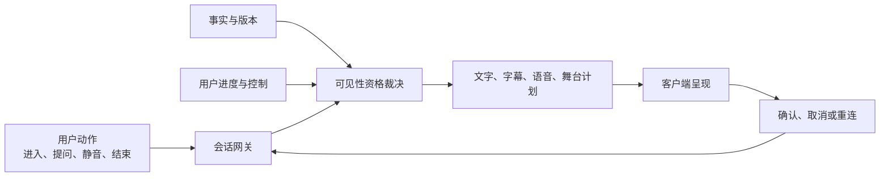

本合同的非目标是：预测用户进度；把候选事件演成事实；让客户端直接改写比赛状态；因重连自动补播已取消或严格保护下不可见的内容；用接口错误暗示用户应继续互动。

## 2. 五条合同原则

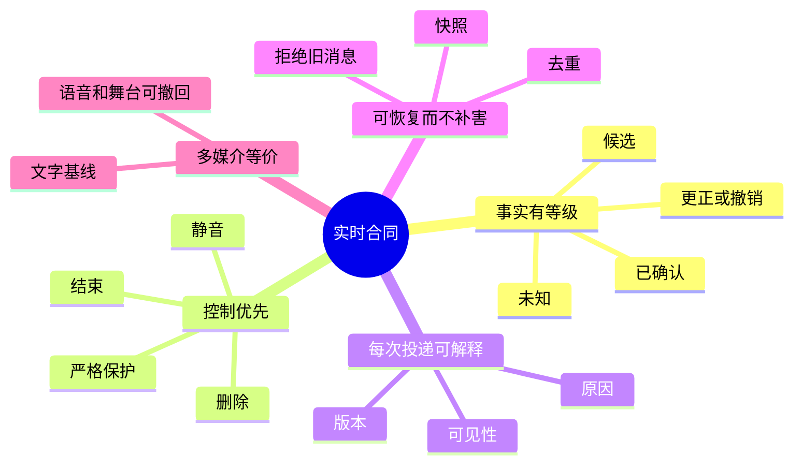

- **事实有等级**：未知、候选、已确认、更正/撤销是不同对象。候选可以进入核对，不能触发结果型文字、声音或动作。
- **控制优先**：结束、静音、严格保护、取消和删除的版本高于生成、队列、缓存和重试。
- **每次投递可解释**：消息带有类型、版本、原因、可见性和关联键；客户端无需从语气推断状态。
- **可恢复而不补害**：重连先恢复用户控制与当前允许快照，再决定是否存在任何可投递内容。
- **多媒介等价**：文字和结构化状态是所有客户端的基线；语音、字幕、动效和舞台只能消费同一个资格结论。

## 3. 资源、动作与授权范围

用户侧只操作自己的会话、观察模式和资料权利；比赛事实和运营配置只能由受限流程产生。

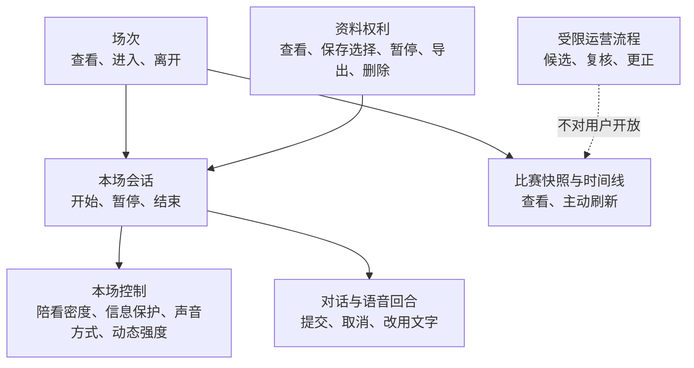

### 3.1 用户可用的动作

- **场次与会话**：查看可进入场次、开始/结束本场、恢复当前会话。返回当前状态和作用范围，不承诺跨场连续关系。
- **本场控制**：显式选择陪看密度、信息保护、声音方式和动态强度。每次更新都返回已生效版本和媒介范围。
- **对话与语音**：提交文字、主动开始语音、取消当前回合、切换为文字。开始采集必须先有用户动作；取消后不得继续使用片段。
- **比赛快照**：查看已经对该会话可见的确认状态、时间线和更正说明。用户可主动刷新，系统不得用刷新补剧透。
- **资料权利**：查看、保存或撤回明确选择，暂停跨场复用，发起导出或删除。高风险动作要求更强的本人确认。

### 3.2 授权边界

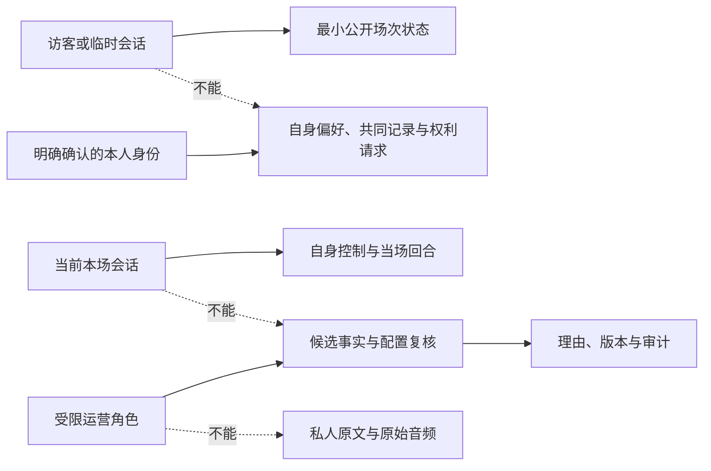

## 4. 消息封装、版本与兼容

所有 HTTP 响应、WebSocket 投递和异步回执共享同一层封装语义；传输方式可以不同，用户语义不能不同。

```json
{
  "message_id": "opaque-id",
  "message_type": "fact.confirmed | session.controlled | turn.result | problem",
  "contract_version": "v1",
  "sequence": 42,
  "causation_id": "optional-upstream-id",
  "correlation_id": "optional-flow-id",
  "occurred_at": "RFC 3339 timestamp",
  "visibility": "hidden | available_on_request | visible | suppressed",
  "payload": { "type-specific": "validated object" }
}
```

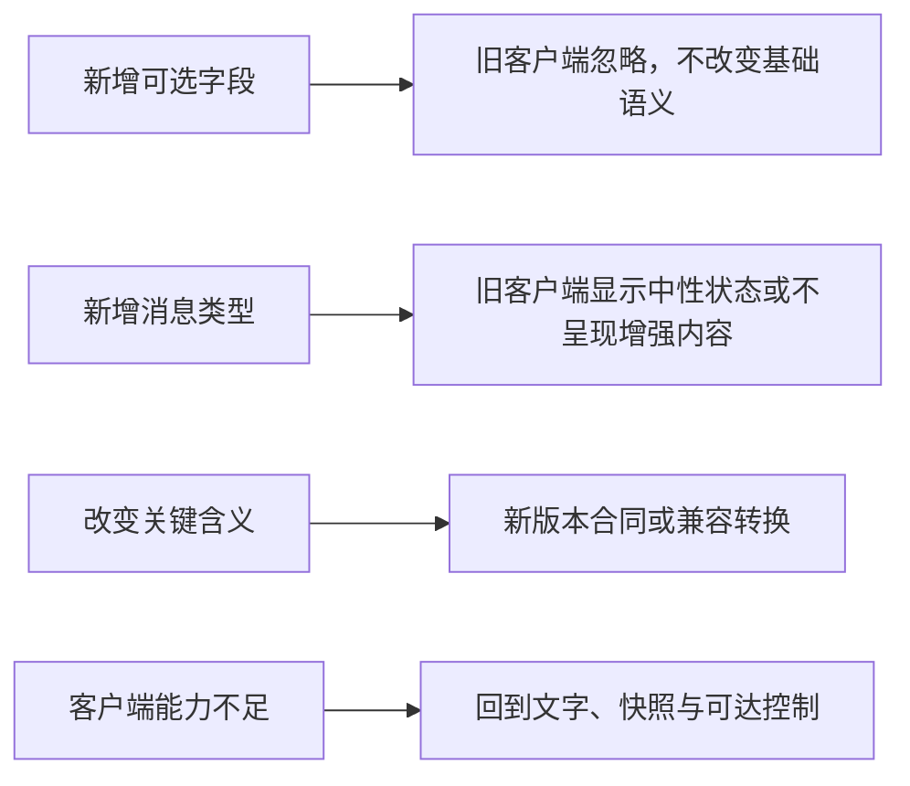

兼容的底线是：旧客户端仍可理解当前会话是否结束、是否静音、是否严格保护，以及最新允许快照；它不能因不认识新消息而把未知显示为事实。

## 5. 实时会话生命周期

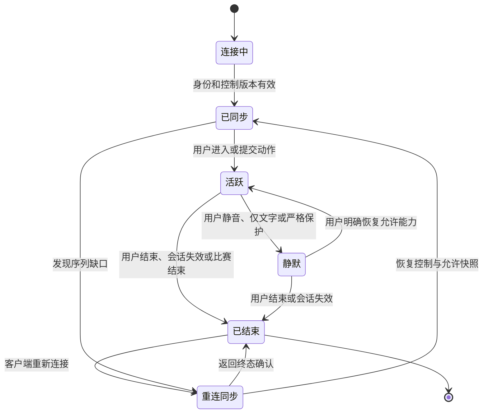

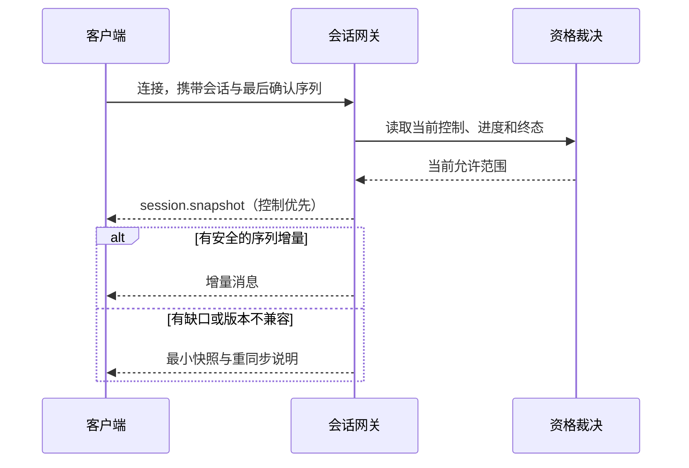

重连不等于“重播”。客户端必须以 `message_id` 去重、以 `sequence` 和领域版本拒绝旧消息；发现缺口时请求快照，不猜测缺失内容。

## 6. 五个消息族

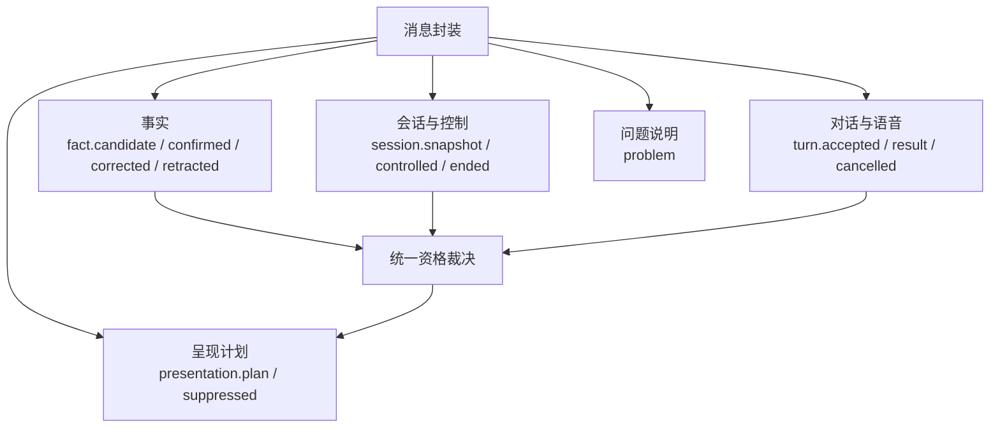

- **事实**：携带场次、领域版本、确认状态和更正指向。候选、冲突和撤销默认不产生结果型呈现。
- **会话与控制**：携带会话状态、控制版本和作用范围。结束消息会使同场后续主动呈现失效。
- **对话与语音**：携带回合标识、输入状态、取消原因和文字降级结果；音频失败不能阻塞结束或文字提问。
- **呈现计划**：只包含已通过资格裁决的文字、字幕、语音或舞台动作；客户端不得把原始事实直接渲染为角色反应。
- **问题说明**：用中性标题、下一步和可见性约束解释失败，绝不暴露未确认赛果、私人资料或供应商细节。

## 7. 顺序、幂等、取消与更正

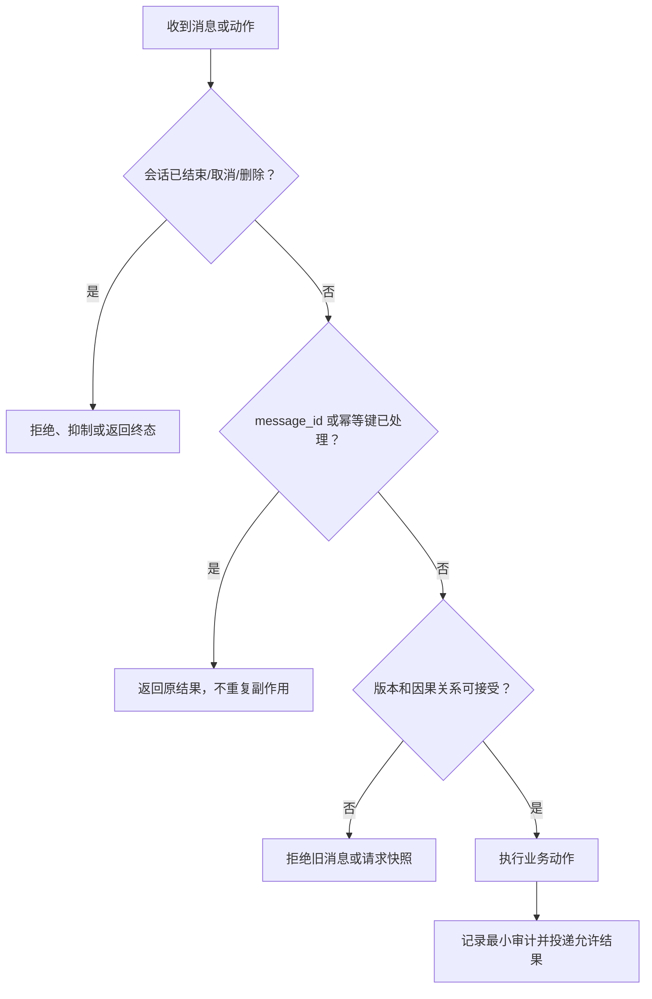

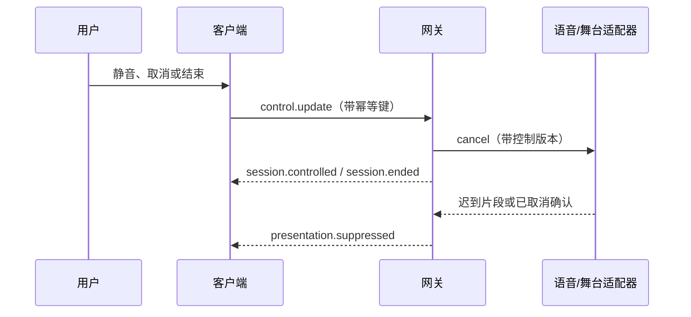

更正不能静默覆盖：新事实要指向被替换版本，客户端可显示“改了什么、现在能相信什么”；已结束或严格保护的会话只得到中性状态，不得到迟到叙述。

## 8. 语音与多媒介的资格链

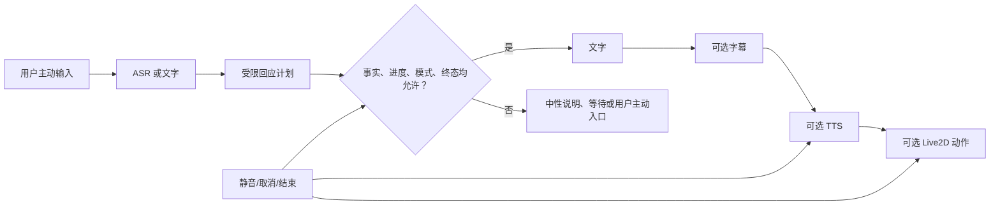

音频输入、TTS 和舞台动作各自可失败、超时或被取消；任何一路失败都必须回到文字状态和可见控制，不能让用户停在“等角色回来”。

## 9. 失败语义与最小资料

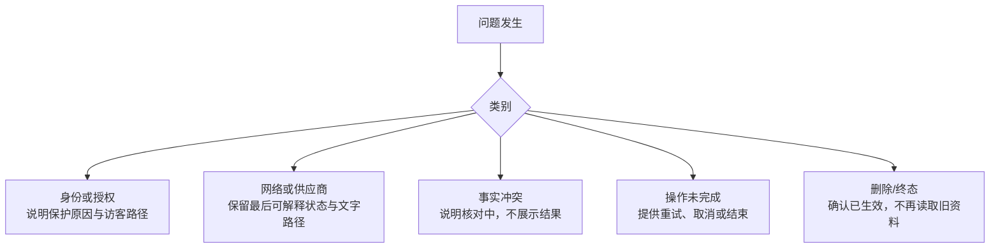

接口只收集完成当次动作所需的最小字段。会话标识不自动等于长期身份；音频只在用户主动输入时处理；关联键服务于顺序与审计，不能携带私人原文、原始音频或隐式关系标签。

## 10. 这份合同如何被验证

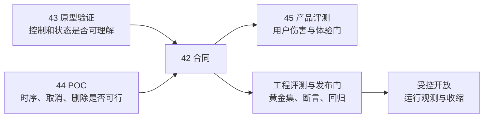

- 原型验证检查用户是否理解“待确认”“严格保护”“结束”；网络恢复能力另由技术验证评估。
- 技术 POC 先证伪版本、取消、删除和媒介资格链；不以一次跑通宣称可生产。
- 产品评测检查这些合同是否真的让人免于剧透、误导、压力和不可退出；不以满意度覆盖硬门。
- 工程 Evals 将消息乱序、重复、撤销、终态优先和媒介降级变成可重复场景，作为构建与发布门。

## 生产版本设计拓展｜能力深化知识

本节描述产品成熟后的能力扩展、体验深化和治理要求，作为后续版本规划与设计决策的参考。


- **新增消息族**：`fact.auto_published`、`reminder.scheduled/sent/cancelled`、`memory.updated/deleted`、`tool.requested/completed/revoked`、`approval.required/decided`，均继承统一 envelope、版本、幂等和可见性字段。
- **外部动作**：涉及通知、资料写入或第三方操作时，消息必须携带授权范围、确认状态、撤销句柄、责任主体和副作用说明；无确认不得执行。
- **终态优先**：`session.ended`、删除屏障和控制版本高于所有排队消息；迟到结果返回抑制原因，不得重新播放。
- **兼容与回滚**：旧客户端对未知增强消息显示中性状态或忽略，但仍能理解控制、错误和结束；协议版本异常时回退快照和文字。
- **评测与回滚**：覆盖乱序、重复、撤回、断线、审批超时、供应商错误和跨媒介一致性，未通过时关闭增强消息族。

### 生产协议场景

- **自动事实**：`fact.auto_published` 携带事实版本、确认状态、可见范围、用户进度和撤回句柄；资格不足返回 `problem`。
- **提醒**：`reminder.scheduled/sent/cancelled` 携带订阅版本、时间窗、幂等键和取消结果；取消后不得发送迟到事件。
- **资料**：`memory.updated/deleted` 携带用户授权、资料范围、有效期和删除传播状态；删除屏障先于异步清理。
- **工具**：`tool.requested/completed/revoked` 携带副作用、审批、幂等和回滚信息；未确认动作不得进入执行态。
- **终态**：`session.ended`、控制版本和删除状态拥有最高优先级，客户端必须能在未知增强消息时仍完成结束和错误恢复。

### 生产消息字段合同

所有生产消息继承统一 envelope，并根据消息族补充下列字段。字段缺失或版本不兼容时，接收方必须拒绝执行副作用，回退到快照或文字状态。

| 字段 | 类型/枚举 | 必填 | 处理规则 |
| --- | --- | --- | --- |
| `message_id` | 唯一字符串 | 是 | 客户端和服务端按此去重，重复消息返回原结果 |
| `message_type` | 已注册消息族 | 是 | 未知类型不得解释为事实或动作 |
| `schema_version` | 语义版本 | 是 | 只允许兼容升级；破坏性变化走新版本 |
| `session_id / run_id` | 标识符 | 按消息族 | 绑定会话与单次 run，禁止跨场复用 |
| `sequence / causation_id` | 整数/标识符 | 是 | 拒绝乱序旧消息，缺口触发快照同步 |
| `fact_version / control_version` | 版本号 | 涉及事实/控制时 | 低于当前版本的呈现计划自动失效 |
| `authorization_version` | 授权版本 | 涉及资料/动作时 | 撤回或删除后的旧版本不得执行 |
| `idempotency_key` | 唯一字符串 | 涉及副作用时 | 相同键只允许产生一次外部副作用 |
| `visibility` | `hidden / available_on_request / visible / suppressed` | 是 | 决定用户是否能看到以及是否可主动查看 |
| `expires_at` | RFC 3339 时间 | 涉及提醒/计划时 | 过期后只能返回失效状态，不得补发 |
| `payload` | 已验证对象 | 是 | 不允许把未验证自然语言当作结构化字段 |

### 工具与审批消息合同

`tool.requested` 至少携带 `tool_name`、`tool_contract_version`、`input`、`risk_level`、`side_effect`、`authorization_scope`、`confirmation_required`、`idempotency_key` 和 `trace_id`。`tool.completed` 必须返回 `output` 或结构化 `error`，并标明 `effect_status`：`not_started / applied / partially_applied / unknown`。

涉及外部副作用时按以下状态转移执行：

```text
requested → qualifying → approval_required → approved → executing → applied
                         └→ rejected / timeout / cancelled
executing → failed / unknown_effect
applied → revoked（仅在撤销窗口内）
```

- `unknown_effect` 禁止自动重试，必须先查询幂等状态或进入人工复核；
- `rejected`、`timeout` 和 `cancelled` 均默认不执行，客户端显示原因和替代路径；
- `revoked` 必须携带撤销结果；不可撤销动作需在确认前明确告知用户；
- `session.ended`、删除屏障和控制版本失效会取消所有尚未进入 `applied` 的计划。
