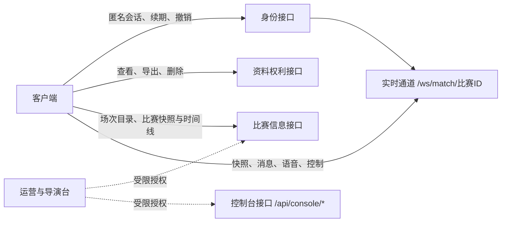
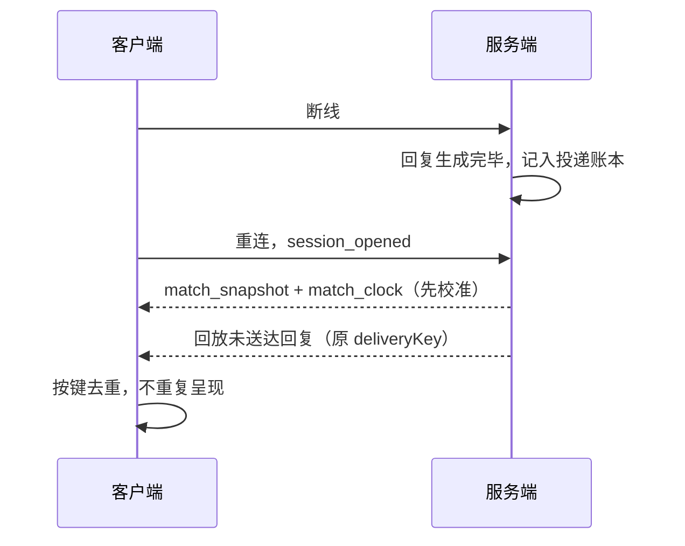

# API 与实时协议：合同与索引

> **这份文档写给谁**：正在接入球球（即数字球友 Digital Ballmate）、评估我们服务边界或复用这套协议思路的工程师与合作伙伴，也想让非技术读者看懂"一次点击如何变成一次可信的回应"。
> **它是什么**：球球现网对外协议面的合同与索引——可以调用哪些资源、实时通道里有哪些消息、每条消息在送达、重复与失败时如何表现。
> **先说清楚一件事**：本文只描述已在现网运行的接口与消息，不收录停留在纸面的设计。协议可以迭代，但下文的合同不会单方面变更；任何新增都以增量字段进入，并守住文末那条兼容底线。

---

## 1. 我们把协议当合同来写

球球的协议面很小：几组 REST 资源，加一条实时通道。让它撑起整场观赛体验的，不是接口数量，而是几条写在所有消息之前的原则。协议负责把"已经被裁决的状态"送到正确的会话——它不根据网络方便或舞台效果扩大事实、剧透或关系表达；客户端不需要从语气猜测状态，因为每条消息自己说明自己。

协议同样有不做什么的清单：不预测用户进度，不把候选当事实推送，不让客户端直接改写比赛状态，不因重连自动补播已取消或受保护的内容，也不用接口错误暗示用户"再互动一下试试"。这些边界不是姿态——它们决定了下面每张索引表里"没有哪些消息"。

### 1.1 五条合同原则，以及它们在现网的样子

**控制优先。** 用户的每一次控制都走显式消息并得到确认：调整话痨档位（`set_talkativeness`）会被立即持久化，服务端回 `talkativeness_ack`，告知生效档位与是否已落盘，客户端以这个回执为真源；打断（`interrupt`、`user_activity`）会立即停止排队中的主动发言；一条事实被撤销时，服务端主动推送 `match_fact_retracted`，客户端据此撤下由它生成的回复——而不是等那条回复自己过期。

**可恢复。** 连接建立后，服务端先推 `match_snapshot` 与 `match_clock`，再谈增量；重新声明会话（`session_opened`）时，已生成但未送达的回复会按原 `deliveryKey` 回放；断线期间漏掉的语音回复进入客户端补发队列，队列最多保留 4 条，超出按先进先出淘汰——回到比赛的人最多补上最近几句，不会被堆积的内容淹没。

**多媒介等价。** 文字是所有回应的基线：语音转写的每一步都有 `transcript_partial`、`transcript_final` 的文本落地；语音链路失败时，服务端显式下发 `voice_status`（`text_fallback` 或 `failed`），对话以文字继续；回应是否已播放由客户端以 `voice_playback`、`reply_displayed` 回报。任何一路媒介失败，用户都停在"有文字、有控制"的状态，而不是"等角色回来"。

**幂等。** 每条比赛事件和每条回复都带 `deliveryKey`：客户端对反应、呈现和音频分别去重，同一键不重复呈现；服务端投递账本按键记录并设 TTL，同一键的重复提交返回原结果，不产生第二次副作用。

**可审计。** 运营侧每一次写操作都记录操作者身份与变更结果；控制台接口暴露投递与审计视图；回复的生成与送达留有追踪记录。出了问题，我们回放记录，而不是凭记忆争论。

---

## 2. REST 接口索引

用户侧接口只操作自己的会话与资料；比赛信息对所有人只读；一切写入比赛的路径都归运营授权。这个分层写在路由结构里，不靠约定自觉：同一批比赛路径，无凭据的调用只能拿到公开视图，运营凭据才解锁审计字段与写入操作。

### 2.1 身份与会话

会话是球球一切请求的门票。我们默认匿名可用——用户不需要先交出身份，才能开始看球；会话可以续期，也可以随时作废。

| 方法与路径 | 用途 | 客户端会感受到 |
| --- | --- | --- |
| `POST /api/sessions/anonymous` | 签发匿名会话 | 无需注册即可获得可续期的会话凭据 |
| `POST /api/sessions/refresh` | 会话续期 | 长时间观看不必中途掉线 |
| `POST /api/sessions/revoke` | 主动作废会话 | 换设备或退出时，旧凭据立即失效 |

### 2.2 资料权利

资料权利接口对应《隐私、记忆删除与数据生命周期设计》里的承诺：数据可查看、可带走、可删除，画像可读可改。删除是屏障动作——一旦生效，后续读取不再返回旧资料。

| 方法与路径 | 用途 | 客户端会感受到 |
| --- | --- | --- |
| `GET /api/me/privacy` | 查看隐私与记忆状态 | 自己的数据现在处于什么状态，一目了然 |
| `GET /api/me/export` | 导出本人数据 | 拿走一份带得走的记录 |
| `DELETE /api/me/data` | 删除本人数据 | 高风险动作，要求更强的本人确认 |
| `GET` / `PATCH` / `DELETE /api/me/portrait` | 查看、修正、清除共同记忆画像 | 画像可读可改，不是黑箱 |

### 2.3 比赛信息

比赛信息接口是只读的事实窗口：公开快照与公开时间线只包含"已经对该会话可见"的确认事实。用户可以主动刷新，系统不会借刷新递进剧透。

| 方法与路径 | 用途 | 客户端会感受到 |
| --- | --- | --- |
| `GET /api/matches/catalog` | 可进入的场次目录 | 看到有哪些比赛可以进入 |
| `GET /api/matches/{id}/state` | 公开比赛快照 | 只含对该会话可见的公开事实 |
| `GET /api/matches/{id}/events` | 公开事件时间线 | 已确认事实的来龙去脉 |

同一批路径对持运营授权的调用方开放更多视图与写入：开始与重置、数据源启停、人工接管、自动化开关、时钟修正、草稿撰写与发布、事实更正与冲突处置、生命周期与配置。这些全部要求运营凭据，`GET /api/matches/{id}/traces` 的追踪视图同样仅限运营。控制台侧的接口集中在 `/api/console/*`，承载健康检查、投递审计与干预操作，细则见《导播台与运营配置》。

---

## 3. 实时通道：`/ws/match/{比赛ID}`

一条 WebSocket 通道承载整场比赛的实时交互。握手时携带会话凭据（授权头或 WebSocket 子协议），进入后服务端先推快照与时钟，之后所有消息走同一条连接。身份声明类消息（`identify`、`session_opened` 等）都会与会话凭据比对，不一致即回 `auth_error` 并终止。

一条连接的生命周期是四段式的：

握手阶段完成来源校验、凭据认证与连接数检查，任何一步不通过连接就不会建立。初始同步保证客户端打开界面就有完整状态，而不是先看到一片空白再等事件。消息泵阶段，同一连接上并行流动着比赛事件、时钟轮播、对话回复、语音转写和控制回执；断线后重连会回到初始同步，再由送达合同（见第 4 节）决定补什么。收尾阶段由心跳看守兜底：无论用户主动离开还是网络消失，服务端都按同一套顺序释放会话资源。

### 3.1 服务端 → 客户端

| 消息 | 什么时候发 | 客户端据此做什么 |
| --- | --- | --- |
| `match_snapshot` | 连接建立、时钟轮播、每条事件后 | 用最新公开快照整体校准界面 |
| `match_clock` | 比赛时钟更新时 | 刷新比赛时间；每次时钟推送同时附带最新快照，客户端无需自行轮询 |
| `match_event` | 一条公开事实成立时 | 呈现事件；消息携带 `deliveryKey` 与附带快照 |
| `match_fact_retracted` | 一条事实被撤销时 | 撤下由该事实生成的回复与标记 |
| `event=qiuqiu_reply` | 对话回复就绪时 | 呈现文字回复，按需触发语音与动作 |
| `presentation` | 仅动作与表情计划 | 驱动 Live2D 表演，不携带正文 |
| `transcript_partial` / `transcript_final` / `transcript_error` | 语音转写过程与结果 | 实时上字幕；失败回落文字 |
| `voice_status` | 语音链路状态变化 | `text_fallback` 时切换文字，`failed` 时说明原因 |
| `talkativeness_ack` | 话痨档位调整后 | 以回执为准更新设置界面 |
| `session_closed` / `auth_error` / `interrupt` / `pong` | 会话关闭、凭据不符、打断回执、心跳应答 | 对应收尾或应答 |

### 3.2 客户端 → 服务端

| 消息 | 什么时候发 | 服务端如何处理 |
| --- | --- | --- |
| `ping` | 周期心跳 | 回 `pong` |
| `identify` / `session_opened` | 声明身份、开始观赛会话 | 校验身份与凭据一致；装配会话并回放未送达内容 |
| `session_closed` | 结束本场会话 | 释放会话资源并回执 |
| `first_meeting` | 提交初次见面资料 | 安排一次初次见面的回应 |
| `set_talkativeness` | 调整话痨档位 | 立即持久化并回 `talkativeness_ack` |
| `user_activity` | 用户说话状态变化 | 用户说话时打断主动发言与查询 |
| `interrupt` | 用户主动打断 | 停止排队的发言并回执 |
| `user_speech` | 提交文字发言 | 进入对话处理 |
| `asr_start` / `asr_chunk` / `asr_finish` / `asr_cancel` | 一次语音输入的生命周期 | 以 `utteranceId` 串联，分片按 `sequence` 重组；取消后立即停止使用片段 |
| `voice_playback` / `reply_displayed` | 回报播放与展示状态 | 记录送达状态，支撑补发与审计 |

语音输入始终由用户动作开启：没有 `asr_start`，就没有采集。取消后片段即刻停用——这是控制优先在音频链路上的样子。

结束同样是一条消息的事：`session_closed` 让服务端释放本场会话，之后的迟到结果不再投递为新的呈现。比赛结束本身也走同一条通道——终态以快照与事件到达，客户端不需要额外的"比赛结束了"轮询。

---

## 4. 送达合同：不丢、不重、不越界

实时通道最常见的三种事故是：丢了、重了、乱了。我们的对策写在两端共同的投递键与修订号上——发送方标明"这是哪份内容、第几版"，接收方据此决定呈现、丢弃还是等待快照。

| 环节 | 现网做法 | 用户可感知的结果 |
| --- | --- | --- |
| 客户端去重 | 反应、呈现、音频各自按 `deliveryKey` 去重 | 重连或重复推送不会让同一句话弹两次 |
| 修订保序 | 每条事实带修订号，低于当前版本的更新直接丢弃 | 比分更正后，不会被迟到的旧数字"弹回" |
| 服务端去重 | 投递账本按 `deliveryKey` 与 TTL 记录，过期才允许重新处理 | 同一请求重复提交，不产生第二次副作用 |
| 断线回放 | `session_opened` 后，已生成未送达的回复按原 `deliveryKey` 回放 | 回来能看到"刚才该出现的内容"，且不会双份 |
| 语音补发 | 断线漏掉的语音回复进入补发队列：上限 4 条，先进先出 | 最多补最近几句，不淹没刚回到比赛的人 |

去重挡住的是"同一份内容"，不是"新的更正"：修订号更高的更正与撤回照常送达。客户端也不猜缺口——发现状态对不上时，它信任下一条快照，而不是把猜测渲染成事实。

---

## 5. 连接保护

通道对所有人开放到"能看比赛"为止，对滥用保持坚硬。这些保护用户平时看不见，出事时决定体验的下限：

- **来源校验**：握手时校验请求来源与站点是否匹配，不匹配直接拒绝（403）。
- **连接数上限**：同一来源 IP 的并发连接数受限，超限返回 429，防止单点占满通道。
- **消息大小上限**：每条入站消息都有大小上限，超限连接被关闭，服务端不做无限缓冲。
- **双向心跳**：传输层 ping/pong 与应用层 `ping`→`pong` 并存，心跳刷新读超时，失联连接被及时回收；服务端心跳看守还会周期性重验会话凭据，会话过期或被撤销时下发 `auth_error` 并断开。

---

## 6. 失败时的语言

协议里的每一个失败路径都对应一句用户能懂的话。我们不暴露供应商细节、内部原因码或未确认的赛果——失败说明只回答"发生了什么、你现在能做什么"。

| 失败场景 | 协议表现 | 用户看到 |
| --- | --- | --- |
| 凭据无效或身份不符 | `auth_error`，必要时断开 | 重新进入的入口，而不是报错堆栈 |
| 语音识别失败 | `voice_status`（`failed`），转写链路终止 | 说明语音没听清，文字输入照常可用 |
| 语音链路不可用 | `voice_status`（`text_fallback`） | 对话无缝切换为文字 |
| 转写中途出错 | `transcript_error` | 字幕停止，本句可重说或改用文字 |
| 连接来源异常 / 超限 | 握手被拒（403 / 429） | 连接不建立；正常用户不受影响 |
| 会话关闭 | `session_closed`（带原因） | 本场结束的确认，以及再进入的路径 |

最小资料原则贯穿这些消息：接口只收集完成当次动作所需的最小字段；会话标识不自动等于长期身份；关联键（`deliveryKey`、`utteranceId`、`traceId`）服务于顺序与审计，不携带私人原文或原始音频。

---

## 7. 演进方向：从消息直给到统一封装

我们早期曾把协议设计为"统一封装层 + 若干消息族 + 显式可见性四态"的目标模型；现网最终选择了更直接的消息面——上面索引的每条消息自带语义，而不是共享一层统一封装。这不算放弃：一致的标识、版本与因果字段，声明式的可见性状态机，以及更完整的消息族（自动事实、提醒、资料变更、工具与审批）仍是我们的演进方向。在新能力落地之前，兼容底线不变：客户端遇到不认识的消息类型，显示中性状态或不呈现增强内容，绝不把未知解释为事实；旧客户端至少仍能理解快照、结束与错误。

---

## 8. 这份索引如何被检验

协议不靠文档自证。REST 面由接口级测试覆盖——匿名会话、隐私、比赛状态、控制台各有用例；消息面的形状由契约测试锁定，呈现映射表在代码与资产两端被同一份契约约束；送达与恢复行为由乱序、重复、撤销、断线重连的回归场景覆盖。每次评审新消息，我们问的仍是《产品评测体系设计》里那道门：它是否让人更免于剧透、误导、压力和不可退出。

接口会迭代，消息会增加。但这几件事是我们对外承诺的一部分：用户控制优先于一切排队与缓存；投递不丢、不重、不越过用户的进度；失败永远有一句可解释的中性说明和一条文字路径。

---

版本 2.0（2026-09-20）
