# 产品承诺的技术边界验证设计

> 文档类型：0→1 产品承诺的技术边界验证设计
> 
> 适用阶段：产品原型已说明用户承诺，但某条数据、实时、媒介、资料或供应商链路仍可能改变该承诺时
> 
> 决策状态：首轮实验方案。POC 只证明受限输入、受限环境和明确停止条件下的可行性；不证明产品价值、规模成本、合规充分性或生产稳定性。
> 

## 1. POC 的职责

POC 不是“先写一版系统”，也不是用单次演示替代完整验证。它只处理会改变产品承诺的技术不确定性：事实能否区分、进度未知时能否不剧透、取消能否穿透媒介、删除能否阻断回写、供应商失败后文字路径是否仍成立。

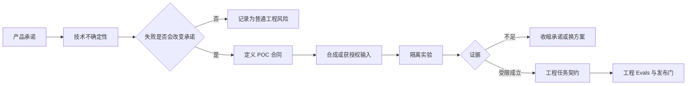

| 不属于本篇 | 属于本篇 |
| --- | --- |
| 原型页面是否易用、用户是否找到控制 | 技术链路能否在明确边界内实现 |
| 用户是否喜欢、是否适合扩大范围 | 哪种候选方案的失败方式可接受 |
| 正式架构已定、正式上线压测 | 合成材料下的最小实现、观测和停止条件 |
| 用一次“跑通”宣称已可生产 | 清楚记录未覆盖条件和下一步门槛 |

## 2. 选题规则与实验隔离

每个 POC 必须先说明：如果失败，用户会失去什么；如果成功，仍然不能承诺什么。只有这两个边界都写清，实验才值得做。

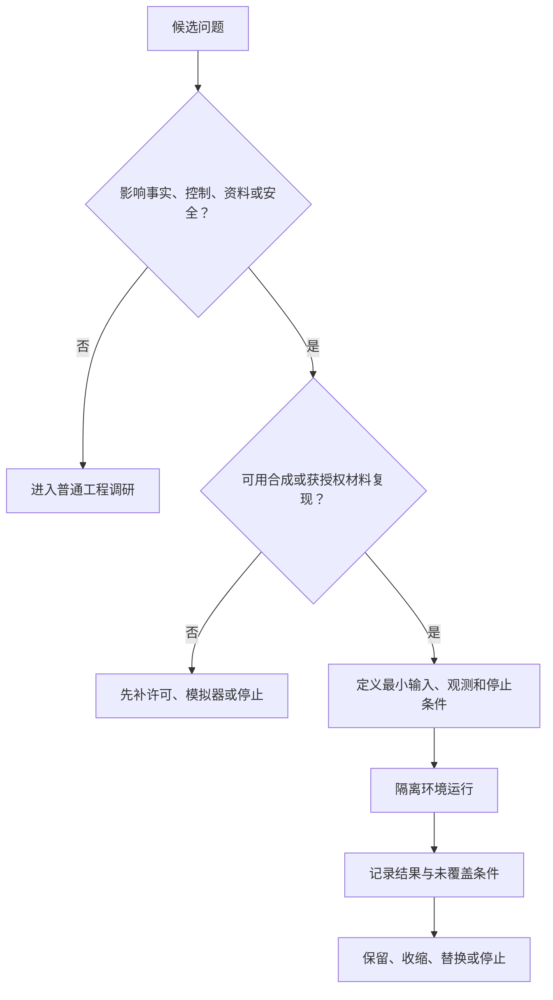

隔离底线如下：不接入真实用户身份、对话、生产密钥或未经授权的赛事内容；不用 POC 数据回填正式资料；每次运行可重放；日志只保存判断实验是否成立所需的最小字段；供应商调用使用测试额度、测试租户或替身。

## 3. 首轮 POC 组合

### 3.1 事实状态与冲突调和

问题不是“能不能显示比分”，而是候选、确认、更正、撤销和冲突能否始终保留不同的用户语义。

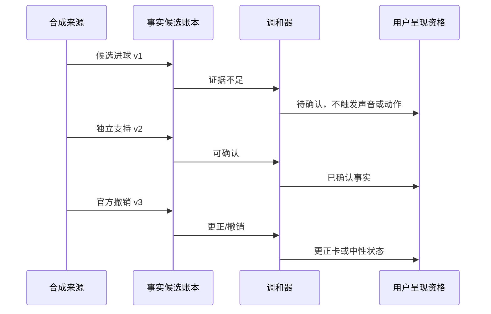

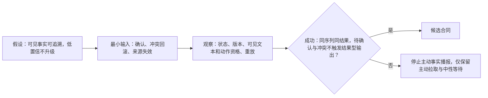

### 3.2 观看进度与跨媒介剧透保护

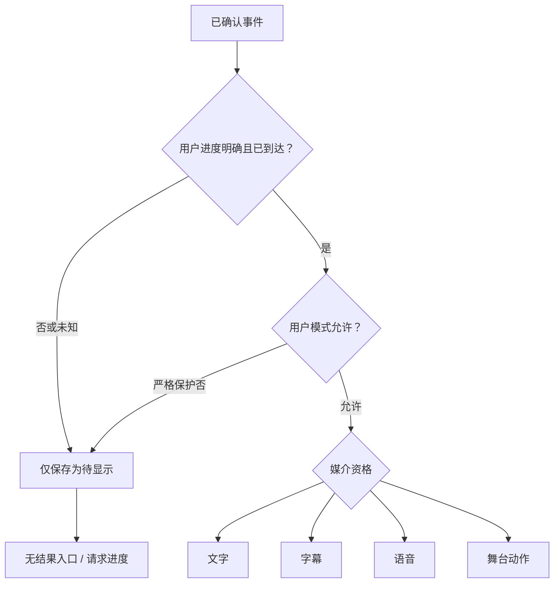

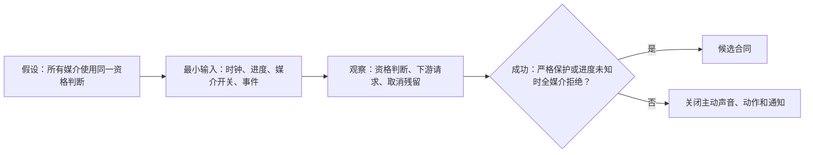

### 3.3 语音、取消与文字降级

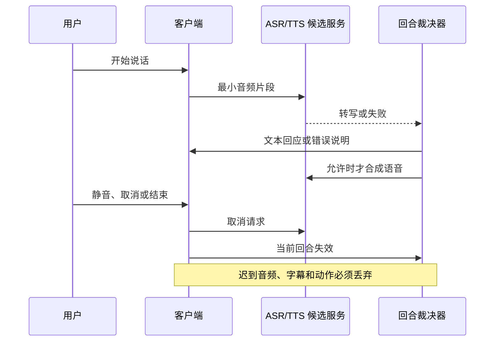

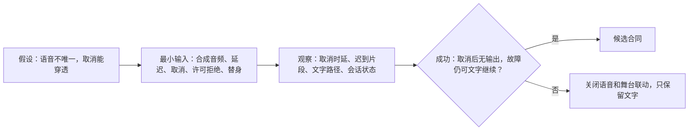

### 3.4 删除屏障与迟到写入

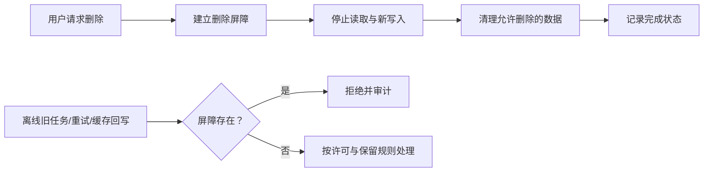

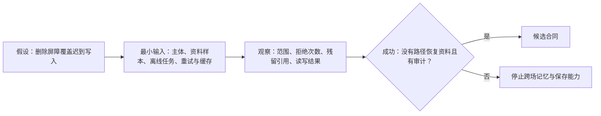

### 3.5 提供商边界与降级选型

供应商选型不以“回答最好听”单独决定，而以是否能保留产品边界决定。文本生成、ASR、TTS 和赛事源都必须能超时、取消、记录来源、切到替代路径或被完全关掉。

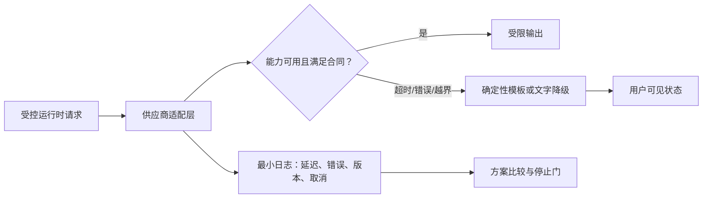

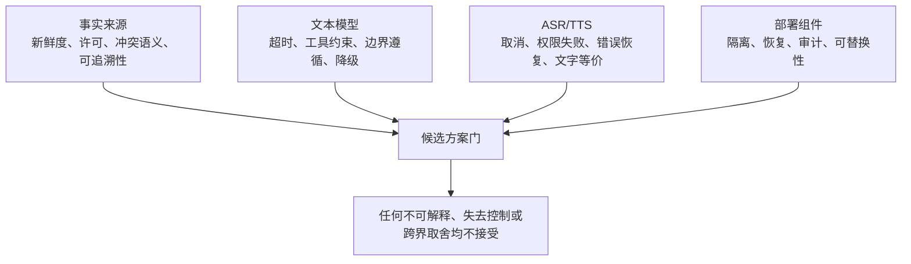

- **事实来源**：比较新鲜度、许可、冲突语义和可追溯性；不可用更快但不可解释的来源覆盖确认事实。
- **文本模型**：比较超时、工具约束、边界遵循和降级可行；不可用自由生成替代确定性事实或控制判断。
- **ASR/TTS**：比较取消、权限失败、错误恢复和文字等价；不可让音频失败使用户失去提问或结束能力。
- **部署组件**：比较身份隔离、恢复、审计和可替换性；不可因方便让秘密、用户资料或运营权限跨界。

## 4. 首轮实验与选型输出

本阶段不预先设计一张空白的“POC 结果卡”，也不要求团队为每个技术小问题填写同样的表。首轮直接围绕四个会改变用户承诺的实验产出决定；每个实验只记录**输入序列、可观察结果、阻断结果与下一步**。

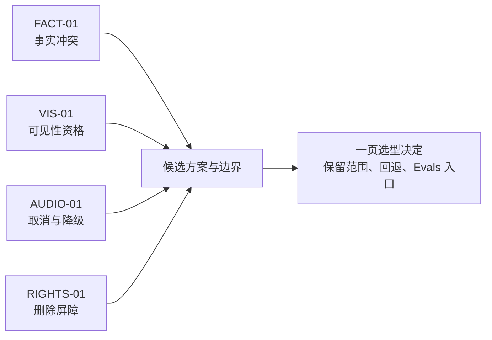

### 4.1 FACT-01：同一事件的确认、更正与撤销

- **输入序列**：同一场次依次收到候选进球、相互冲突的第二来源、可确认来源、官方撤销；每一步都带版本和事件时间。
- **观察**：事实账本状态、用户可见文本、字幕/语音/动作资格、重放后状态是否完全一致。
- **阻断**：候选或冲突信息在任一媒介表现为已确认；旧版本覆盖更正；撤销后仍有排队输出。
- **决定**：只有“事件版本 + 证据状态 + 更正链”能完整重放时，才把事实链路交给工程；否则关闭主动事实播报。

### 4.2 VIS-01：进度未知时的全媒介资格裁决

- **输入序列**：同一已确认事件分别进入进度已知、进度未知、严格保护、仅文字、静音和会话已结束六种状态。
- **观察**：文字、字幕、语音、通知和 Live2D 是否共用一个资格结论；恢复连接后是否只给当前可见快照。
- **阻断**：任一增强媒介绕过严格保护；结束后迟到输出；为补消息而主动剧透。
- **决定**：只有资格结论由单点裁决并可被所有媒介消费时，才保留主动呈现；否则强制降为用户主动查看。

### 4.3 AUDIO-01：取消传播与文字等价

- **输入序列**：测试替身分别返回正常、延迟、超时、权限拒绝和取消后迟到的转写/合成片段。
- **观察**：取消触达时刻、迟到片段是否丢弃、文字路径是否仍可提问/结束、舞台动作是否同步失效。
- **阻断**：静音、取消或结束后仍播放、显示或动作；语音不可用时核心任务无法继续。
- **决定**：文字路径先成立，语音仅作为可取消增强；取消无法贯穿时，不选该语音联动方案。

### 4.4 RIGHTS-01：删除后的缓存、队列与旧任务

- **输入序列**：创建一组可删除的偏好/共同记录，再并发触发删除、缓存命中、离线重试和旧版本写回。
- **观察**：删除屏障建立时刻、所有读写拒绝、残留索引/队列、审计摘要与恢复演练结果。
- **阻断**：删除后任一路径重新读取或写入；备份/恢复把已删除资料自动复活；日志泄露原文。
- **决定**：屏障能压过缓存、任务和重试才允许跨场保存；否则首轮只提供本场临时状态。

### 4.5 选型决定的最小成品

四个实验完成后只写一页结论：选了哪一条链路、它只在哪些输入范围成立、哪个回退开关必须保留，以及哪些可重放场景移交给工程 Evals。缺任一项时，不进入正式工程施工。

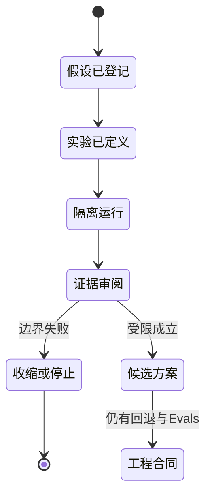

## 5. 与原型、产品评测和工程 Evals 的交接

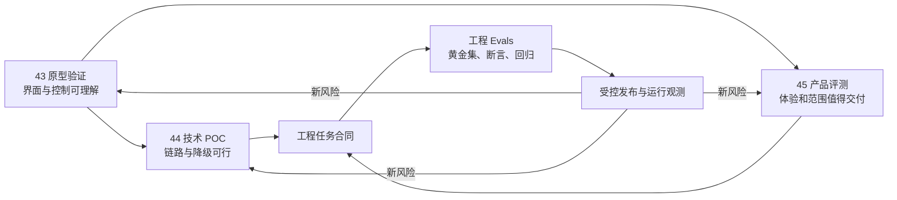

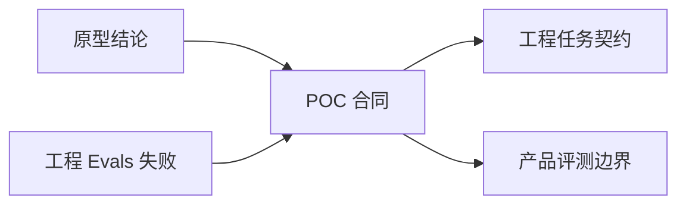

- **原型到 POC**：必须交付用户承诺、反例、文字降级和禁止可见结果；不交付“用户喜欢，所以技术一定可行”的结论。
- **POC 到工程**：必须交付候选方案、输入边界、停止条件、回退开关和可自动化场景；不交付未经验证的规模、成本或合规承诺。
- **POC 到产品评测**：必须交付技术可达范围、明确降级和不可用边界；不让技术演示替代体验研究。
- **工程 Evals 到 POC**：返回回归失败、不可重放场景和环境差异；不把 CI 绿灯写成产品价值成立。

## 生产版本设计拓展｜能力深化知识

本节描述产品成熟后的能力扩展、体验深化和治理要求，作为后续版本规划与设计决策的参考。

- **事实与提醒 POC**：验证来源确认、用户进度、订阅时间窗、幂等、取消和更正能否在压力下保持一致；不以单次低延迟作为通过条件。
- **多模态 POC**：验证语音/舞台主出口、字幕同步、动作取消、弱网恢复和静音/低动态收缩；任何媒介失败都应保留可完成任务的结构化路径。
- **连续性 POC**：验证资料来源、授权、有效期、删除屏障、跨设备同步和防回写；注入错误资料和恶意内容检查不会污染未来上下文。
- **工具与外部动作 POC**：验证权限、确认、幂等、撤销、超时、预算和人工审批；副作用未被确认时必须默认拒绝。
- **生产结论**：每项 POC 输出适用范围、失败样本、观测指标、替代方案和回滚条件，不能把“链路跑通”写成生产可用。

### POC 通过门

- **事实门**：在乱序、来源冲突和更正下仍能阻止错误发布，并保留可解释版本链。
- **媒介门**：语音、字幕、舞台和文字在延迟、取消、重连和设备切换下共享同一资格结果。
- **资料门**：暂停、删除和跨设备失效能阻止读取、召回、回写、缓存和通知。
- **动作门**：工具副作用具备授权、确认、幂等、撤销、预算和人工审批；超时默认不执行。
- **运行门**：能关联 Trace、费用、延迟、循环和终止原因，并在供应商故障时自动收缩和恢复。
### 生产边界验证卡

| 能力 | 触发与资格 | 验证/工具职责 | 用户可见结果 | 失败、撤回与放行 |
| --- | --- | --- | --- | --- |
| 事实与提醒链路 | 候选方案涉及确认、进度、时间窗或更正 | 实验夹具注入乱序、冲突、取消和压力，记录可重放结果 | 只接受能解释状态、范围和失败的方案 | 任何错误发布或取消失效即否决方案并保留手动路径 |
| 多媒介链路 | 方案改变语音/舞台主出口或降级方式 | 适配器验证字幕同步、打断、重连和静音等价 | 用户在媒介故障时仍能完成核心任务 | 关键任务消失即停止该媒介方案，不用演示成功覆盖 |
| 连续性与动作链路 | 方案涉及资料、外部动作或跨设备 | 验证授权、审批、幂等、撤销、删除屏障和预算 | 用户能看到副作用、确认/拒绝和结果 | 效果未知不得重试；任一越权或删除污染即回退 |

每张 POC 结论卡必须写适用范围、失败样本、替代方案、停止条件和回滚开关；通过不等于产品价值成立。
