# 关键技术 POC 与方案选型

数字球友(Digital Ballmate)是我们面向球迷的数字陪伴产品:它看得懂比赛、陪用户聊比赛,并在用户允许的范围内主动开口。这样的定位意味着,有几条承诺不能只靠一次演示来背书——事实必须可信,剧透必须守住,语音必须随时可以收回,隐私必须真正可以被删除。

本篇记录我们回答这些问题的方式:概念验证(POC)的方法论,以及围绕事实、呈现、语音、权利四条链路的四项验证框架。需要先说清边界:POC 只证明受限输入、受限环境和明确停止条件下的可行性;它不证明产品价值、规模成本、合规充分性或生产稳定性。

时至今日,四个 POC 提出的问题均已由真实实现给出回答。本篇保留的是这套选型方法论本身——它解释了我们为什么这样设计实验,也解释了今天的实现为什么长成现在的样子。

## 1. POC 的职责:只验证会改变承诺的不确定性

POC 不是"先写一版系统",也不是用一次跑通替代完整验证。它只处理一类不确定性:如果这条链路失败,我们是否必须收回对用户的承诺——事实能否区分、进度未知时能否不剧透、取消能否穿透媒介、删除能否阻断回写、供应商失败后文字路径是否仍成立。会改变承诺的,进入 POC;不会改变的,记录为普通工程风险。

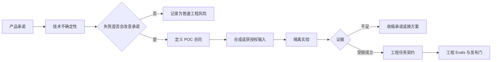

| 不属于本篇 | 属于本篇 |
| --- | --- |
| 原型页面是否易用、用户是否找到控制 | 技术链路能否在明确边界内实现 |
| 用户是否喜欢、是否适合扩大范围 | 哪种候选方案的失败方式可接受 |
| 正式架构已定、正式上线压测 | 合成材料下的最小实现、观测和停止条件 |
| 用一次"跑通"宣称已可生产 | 清楚记录未覆盖条件和下一步门槛 |

## 2. 选题规则与实验隔离

每个 POC 开始前必须先回答两个问题:如果失败,用户会失去什么;如果成功,我们仍然不能承诺什么。只有这两个边界都写清,实验才值得做。

隔离底线如下:不接入真实用户身份、对话、生产密钥或未经授权的赛事内容;不用 POC 数据回填正式资料;每次运行可重放;日志只保存判断实验是否成立所需的最小字段;供应商调用使用测试额度、测试租户或替身。

## 3. 四项 POC 的设计

四项 POC 分别守护四类承诺:事实可信、剧透可控、语音可收、隐私可删。每一项都先写清假设、最小输入与停止条件,再进入隔离实验;它们的现网验证结论在 §4 与原始设问并置。

### 3.1 事实状态与冲突调和(FACT-01)

问题不是"能不能显示比分",而是候选、确认、更正、撤销和冲突能否始终保留不同的用户语义。

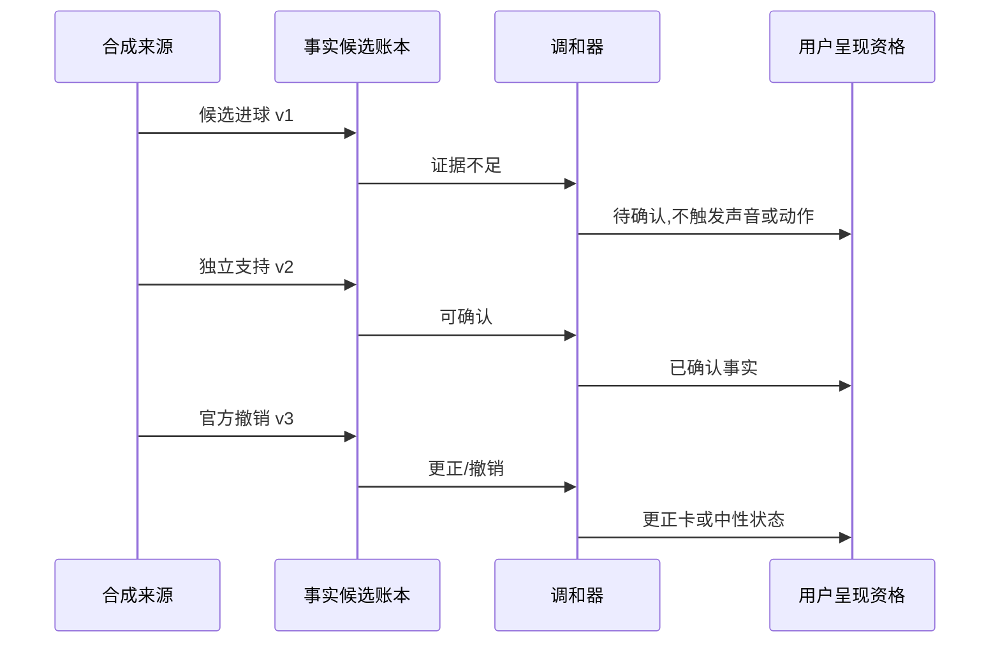

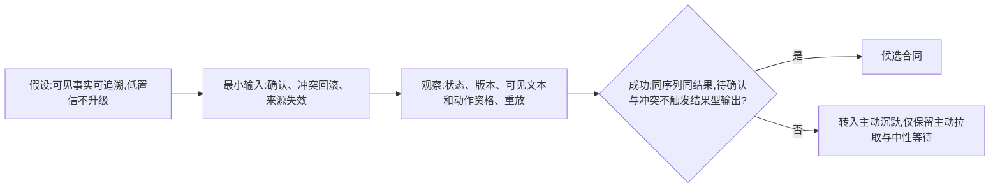

### 3.2 观看进度与跨媒介剧透保护(VIS-01)

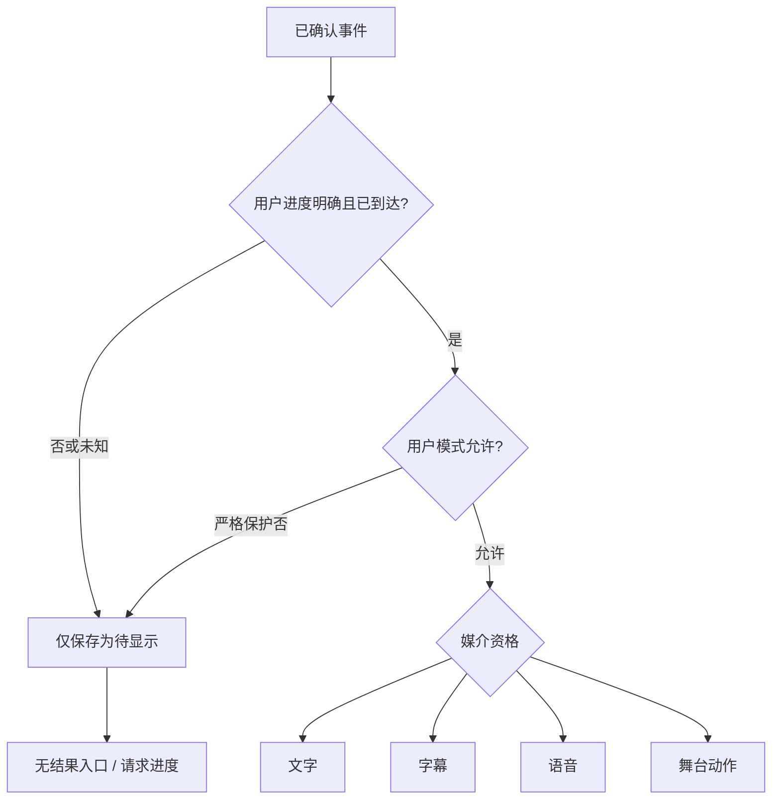

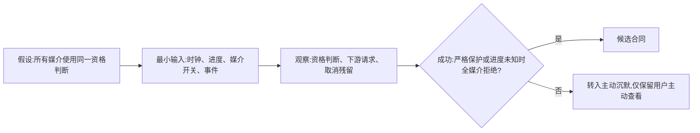

### 3.3 语音、取消与文字兜底(AUDIO-01)

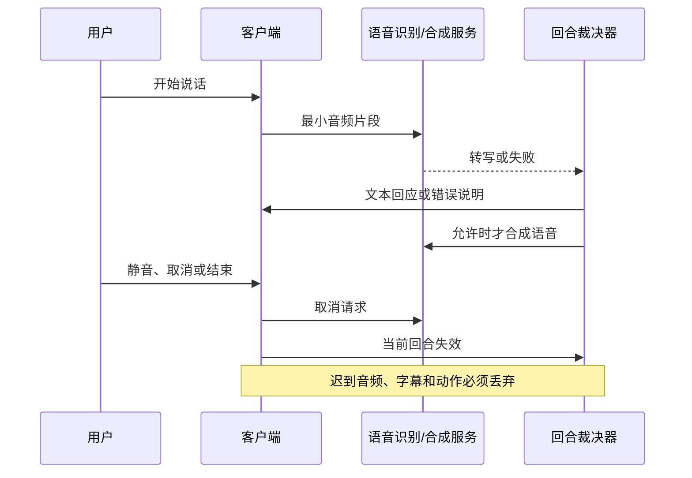

### 3.4 删除屏障与迟到写入(RIGHTS-01)

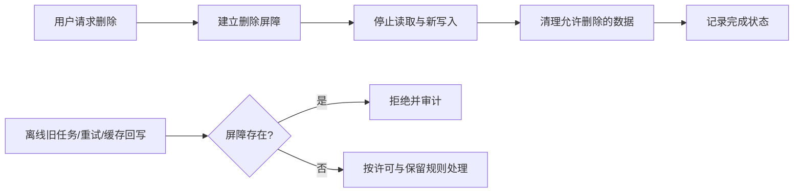

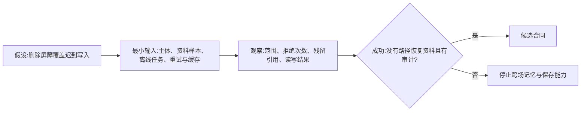

### 3.5 供应商边界与降级选型

供应商选型不以"回答最好听"单独决定,而以是否能保留产品边界决定。我们把依赖外部供应商的能力收敛为四个明确的能力方向:对话与路由模型、语音识别、语音合成、记忆服务。所有方向一律以兼容接口接入,替换供应商不改协议——这条原则与《技术约束与选型原则》保持一致:对话、路由、识别、合成四类调用都走统一传输层的单一实现;开发环境可以注入 mock 语音合成用于联调,生产环境不启用任何替身。

无论最终选哪家供应商,能力都必须能超时、取消、记录来源、切到替代路径或被完全关掉。

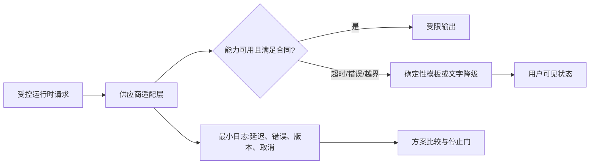

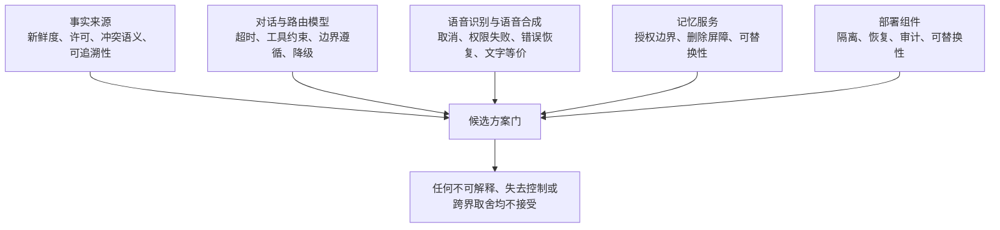

- **事实来源**:比较新鲜度、许可、冲突语义和可追溯性;不可用更快但不可解释的来源覆盖确认事实。
- **对话与路由模型**:比较超时、工具约束、边界遵循和降级可行;不可用自由生成替代确定性事实或控制判断。
- **语音识别与语音合成**:比较取消、权限失败、错误恢复和文字等价;不可让音频失败使用户失去提问或结束的退出路径。
- **记忆服务**:比较授权边界、删除屏障的落实与可替换性;不可因更换供应商让删除承诺失效。
- **部署组件**:比较身份隔离、恢复、审计和可替换性;不可因方便让秘密、用户资料或运营权限跨界。

**已收敛的选型记录——意图路由双密钥回落**:意图路由采用主备两把密钥,主密钥不可用时自动回落到备用密钥,意图路由不因单一密钥故障而中断。这类决定一经收敛,就随兼容协议固定下来,替换供应商时沿用。

## 4. 四项实验的结论:已由真实实现回答

这一节保留四项实验的原始设问——输入序列、观察、阻断与决定——并在每一项之后附上现网验证结论。四个 POC 均已由真实实现回答;保留设问,是为了让这套方法论在下一个不确定性问题出现时可以直接复用。

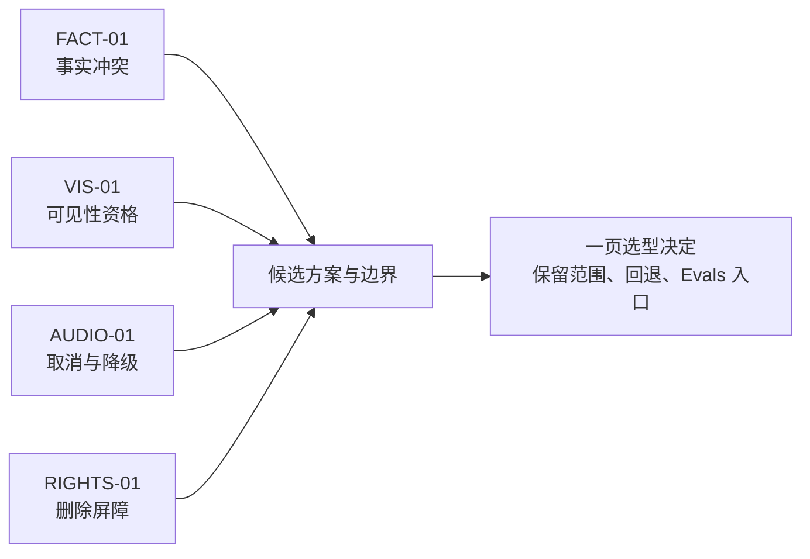

### 4.1 同一事件的确认、更正与撤销(FACT-01)

- **输入序列**:同一场次依次收到候选进球、相互冲突的第二来源、可确认来源、官方撤销;每一步都带版本和事件时间。
- **观察**:事实账本状态、用户可见文本、字幕/语音/动作资格、重放后状态是否完全一致。
- **阻断**:候选或冲突信息在任一媒介表现为已确认;旧版本覆盖更正;撤销后仍有排队输出。
- **决定**:只有"事件版本 + 证据状态 + 更正链"能完整重放时,才把事实链路交给工程;否则转入主动沉默,只保留用户主动拉取。
- **现网验证结论**:链路已在真实实现中成立——同一候选事实的确认只加一次,重复上报不产生重复确认;观看进度时钟的修改遇到并发冲突时,服务以 409 冲突响应并自愈到一致状态,不残留脏状态。

### 4.2 进度未知时的全媒介资格裁决(VIS-01)

- **输入序列**:同一已确认事件分别进入进度已知、进度未知、严格保护、仅文字、静音和会话已结束六种状态。
- **观察**:文字、字幕、语音、通知和 Live2D 是否共用一个资格结论;恢复连接后是否只给当前可见快照。
- **阻断**:任一增强媒介绕过严格保护;结束后迟到输出;为补消息而主动剧透。
- **决定**:只有资格结论由单点裁决并可被所有媒介消费时,才保留主动呈现;否则转入主动沉默,降为用户主动查看。
- **现网验证结论**:呈现资格落为表演映射白名单——13 种表情与 12 类以上动作受控组合,每次触发都有明确的保持窗,窗口结束按回返模式回到中性状态,不残留输出。主动呈现的档位统一为三档,最保守的一档即主动沉默;资格结论由单点裁决,所有媒介共用。

### 4.3 取消传播与文字等价(AUDIO-01)

- **输入序列**:测试替身分别返回正常、延迟、超时、权限拒绝和取消后迟到的转写/合成片段。
- **观察**:取消触达时刻、迟到片段是否丢弃、文字路径是否仍可提问/结束、舞台动作是否同步失效。
- **阻断**:静音、取消或结束后仍播放、显示或动作;语音不可用时核心任务无法继续。
- **决定**:文字路径先成立,语音仅作为可取消增强;取消无法贯穿时,不选该语音联动方案。
- **现网验证结论**:语音链路已按这套设问落地——入口为"按住说话",由语音活动检测(VAD)判定起止;识别流式返回;松开、打断或取消时,取消信号沿链路传播,迟到的识别与合成片段一律丢弃;语音不可用或不便开口时,文字路径完整兜底,用户随时可以改用文字提问或结束会话,退出路径始终保留;语音合成采用固定音色。

### 4.4 删除后的缓存、队列与旧任务(RIGHTS-01)

- **输入序列**:创建一组可删除的偏好/共同记录,再并发触发删除、缓存命中、离线重试和旧版本写回。
- **观察**:删除屏障建立时刻、所有读写拒绝、残留索引/队列、审计摘要与恢复演练结果。
- **阻断**:删除后任一路径重新读取或写入;备份/恢复把已删除资料自动复活;日志泄露原文。
- **决定**:屏障能压过缓存、任务和重试才允许跨场保存;否则首轮只提供本场临时状态。
- **现网验证结论**:隐私权利已在真实实现中成立——删除以任务形式执行,先"立碑"、自下一回合生效,碑记建立后该主体数据不再进入任何生成路径;清理任务按 6 小时周期消化存量;相关数据按 30 天保留期收口,到期彻底清除。

### 4.5 选型决定的最小成品

四个实验完成后只写一页结论:选了哪一条链路、它只在哪些输入范围成立、哪个回退开关必须保留,以及哪些可重放场景移交给工程评测(Evals)。缺任一项时,不进入正式工程施工。今天,这四页结论已经写成——它们不是文档,而是真实实现本身。

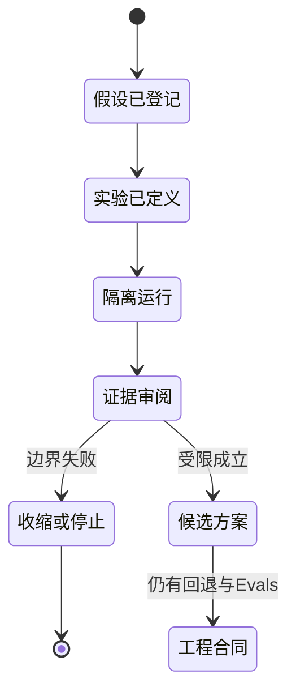

## 5. 与原型、产品评测和工程 Evals 的交接

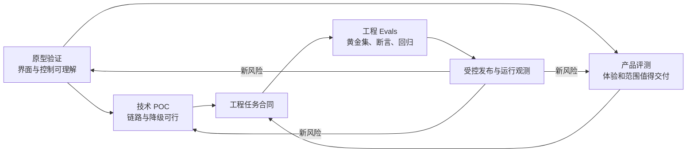

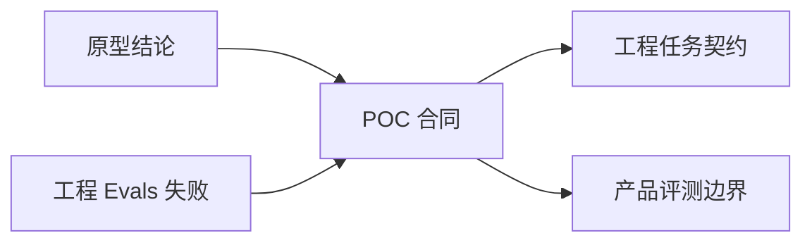

- **原型到 POC**:必须交付用户承诺、反例、文字降级和禁止可见结果;不交付"用户喜欢,所以技术一定可行"的结论。
- **POC 到工程**:必须交付候选方案、输入边界、停止条件、回退开关和可自动化场景;不交付未经验证的规模、成本或合规承诺。
- **POC 到产品评测**:必须交付技术可达范围、明确降级和不可用边界;不让技术演示替代体验研究。
- **工程 Evals 到 POC**:返回回归失败、不可重放场景和环境差异;不把 CI 绿灯写成产品价值成立。

## 6. 走向生产:能力深化与通过门

本节描述产品成熟后的能力扩展、体验深化和治理要求,作为后续版本规划与设计决策的参考。

- **事实与提醒 POC**:验证来源确认、用户进度、订阅时间窗、幂等、取消和更正能否在压力下保持一致;不以单次低延迟作为通过条件。
- **多模态 POC**:验证语音/舞台主出口、字幕同步、动作取消、弱网恢复和静音/低动态收缩;任何媒介失败都应保留可完成任务的结构化路径。
- **连续性 POC**:验证资料来源、授权、有效期、删除屏障、跨设备同步和防回写;注入错误资料和恶意内容检查不会污染未来上下文。
- **工具与外部动作 POC**:验证权限、确认、幂等、撤销、超时、预算和人工审批;副作用未被确认时必须默认拒绝。
- **生产结论**:每项 POC 输出适用范围、失败样本、观测指标、替代方案和回滚条件,不能把"链路跑通"写成生产可用。

### POC 通过门

- **事实门**:在乱序、来源冲突和更正下仍能阻止错误发布,并保留可解释版本链。
- **媒介门**:语音、字幕、舞台和文字在延迟、取消、重连和设备切换下共享同一资格结果。
- **资料门**:暂停、删除和跨设备失效能阻止读取、召回、回写、缓存和通知。
- **动作门**:工具副作用具备授权、确认、幂等、撤销、预算和人工审批;超时默认不执行。
- **运行门**:能关联 Trace、费用、延迟、循环和终止原因,并在供应商故障时自动收缩和恢复。

### 生产边界验证表

| 能力 | 触发与资格 | 验证/工具职责 | 用户可见结果 | 失败、撤回与放行 |
| --- | --- | --- | --- | --- |
| 事实与提醒链路 | 候选方案涉及确认、进度、时间窗或更正 | 实验夹具注入乱序、冲突、取消和压力,记录可重放结果 | 只接受能解释状态、范围和失败的方案 | 任何错误发布或取消失效即否决方案并保留手动路径 |
| 多媒介链路 | 方案改变语音/舞台主出口或降级方式 | 适配器验证字幕同步、打断、重连和静音等价 | 用户在媒介故障时仍能完成核心任务 | 关键任务消失即停止该媒介方案,不用演示成功覆盖 |
| 连续性与动作链路 | 方案涉及资料、外部动作或跨设备 | 验证授权、审批、幂等、撤销、删除屏障和预算 | 用户能看到副作用、确认/拒绝和结果 | 效果未知不得重试;任一越权或删除污染即回退 |

每项 POC 结论必须写适用范围、失败样本、替代方案、停止条件和回滚开关;通过不等于产品价值成立。

---

版本 2.0(2026-09-20)
