# 产品能力架构图集

> 文档类型：0→1 产品能力架构决策图集  
> 适用阶段：产品范围、事实规则、用户控制和资料边界已定义，准备形成工程任务契约时  
> 决策状态：首轮候选架构。图中服务、数据流和部署均为待验证设计，不描述既有实现或生产状态。  

## 1. 图集阅读方式

本图集把产品承诺翻译成可讨论的系统边界：事实不能混入角色猜测；用户控制能中断所有媒介；删除不是“隐藏一条记录”；弱网、无声音和舞台不可用时，文字任务仍可完成。每张图都对应后续的任务契约、风险、评测和 ADR，而不是把组件名称堆在一张海报上。

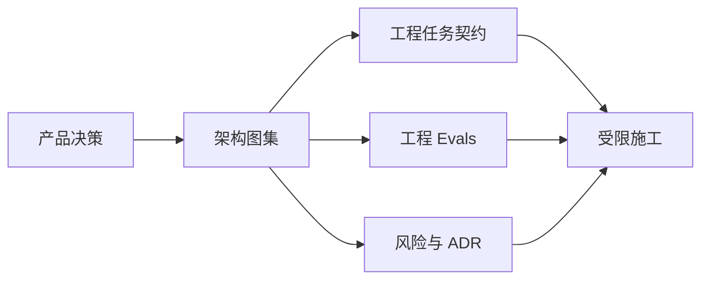
```mermaid
flowchart LR
    P[产品决策] --> A[架构图集]
    A --> T[工程任务契约]
    A --> E[工程 Evals]
    A --> R[风险与 ADR]
    T --> D[受限施工]
    E --> D
    R --> D
```

---

## 2. 系统全景与信任边界

### 2.1 全景分层架构

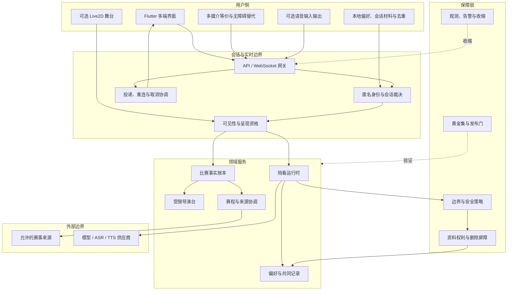
```mermaid
flowchart TB
    subgraph Client[用户侧]
      UI[Flutter 多端界面]
      A11Y[多媒介等价与无障碍替代]
      Stage[可选 Live2D 舞台]
      Voice[可选语音输入输出]
      Local[本地偏好、会话材料与去重]
    end
    subgraph Edge[会话与实时边界]
      Gateway[API / WebSocket 网关]
      Session[匿名身份与会话裁决]
      Eligibility[可见性与呈现资格]
      Delivery[投递、重连与取消协调]
    end
    subgraph Domain[领域服务]
      Facts[比赛事实账本]
      Runtime[陪看运行时]
      Memory[偏好与共同记录]
      Director[受限导演台]
      SourceMgr[赛程与来源协调]
    end
    subgraph Assurance[保障层]
      Guard[边界与安全策略]
      Privacy[资料权利与删除屏障]
      Eval[黄金集与发布门]
      Observe[观测、告警与收缩]
    end
    subgraph External[外部边界]
      Source[允许的赛事来源]
      Provider[模型 / ASR / TTS 供应商]
    end
    UI --> Gateway
    A11Y --> Gateway
    Voice --> Gateway
    Stage --> Eligibility
    Local --> Session
    Gateway --> Session
    Session --> Eligibility
    Gateway --> Delivery
    Delivery --> UI
    Eligibility --> Facts
    Eligibility --> Runtime
    Runtime --> Guard
    Runtime --> Memory
    Facts --> Director
    Facts --> SourceMgr
    SourceMgr --> Source
    Runtime --> Provider
    Guard --> Privacy
    Privacy --> Memory
    Eval -.验证.-> Domain
    Observe -.收缩.-> Gateway
```

### 2.2 用户端能力降级

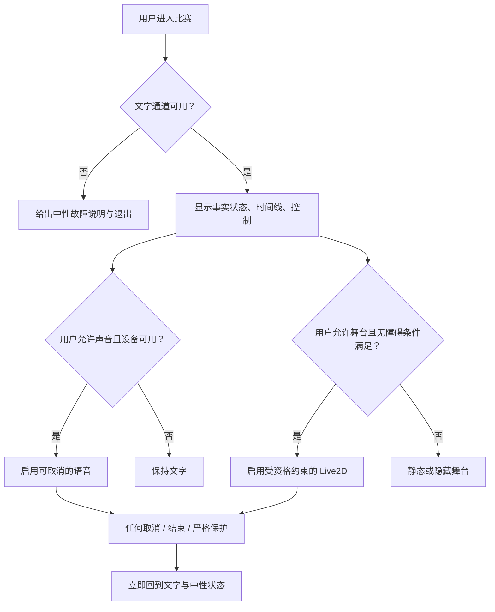
```mermaid
flowchart TD
    A[用户进入比赛] --> B{文字通道可用？}
    B -->|否| X[给出中性故障说明与退出]
    B -->|是| C[显示事实状态、时间线、控制]
    C --> D{用户允许声音且设备可用？}
    D -->|是| E[启用可取消的语音]
    D -->|否| F[保持文字]
    C --> G{用户允许舞台且无障碍条件满足？}
    G -->|是| H[启用受资格约束的 Live2D]
    G -->|否| I[静态或隐藏舞台]
    E --> J[任何取消 / 结束 / 严格保护]
    H --> J
    J --> K[立即回到文字与中性状态]
```

### 2.3 权限与信任边界

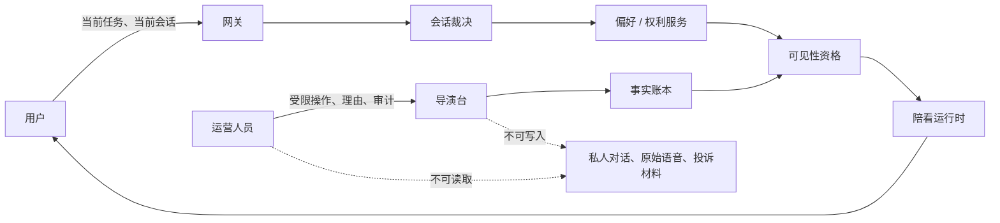
```mermaid
flowchart LR
    U[用户] -->|当前任务、当前会话| G[网关]
    O[运营人员] -->|受限操作、理由、审计| D[导演台]
    G --> S[会话裁决]
    D --> F[事实账本]
    S --> P[偏好 / 权利服务]
    F --> V[可见性资格]
    P --> V
    V --> R[陪看运行时]
    R --> U
    O -.不可读取.-> M[私人对话、原始语音、投诉材料]
    D -.不可写入.-> M
```

---

## 3. 客户端、实时通道与媒介适配

### 3.1 用户端页面与能力路由

用户端不是一组各自直连后端的页面。比赛页承载主任务；设置、会话和数据权利是独立路径；Live2D、音频和字幕只消费已裁决的呈现计划，不能自己判断事实、身份或权限。

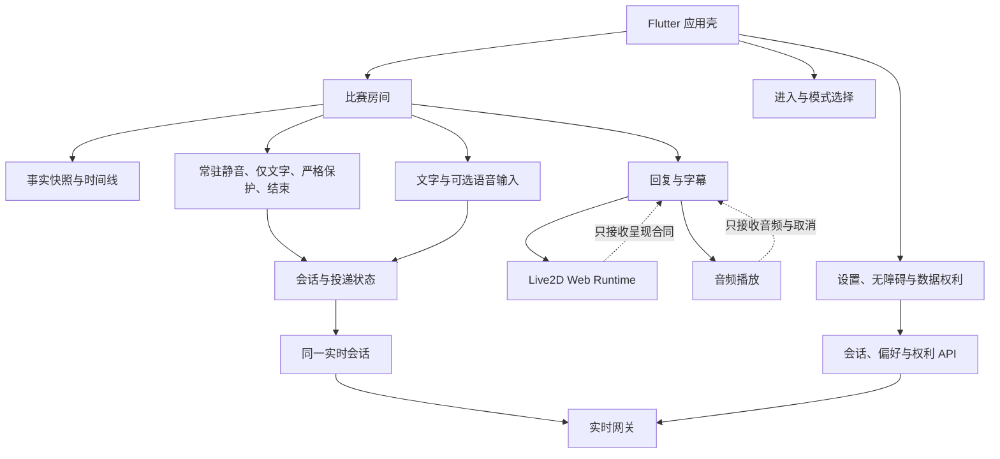
```mermaid
flowchart TB
    App[Flutter 应用壳] --> Match[比赛房间]
    App --> Entry[进入与模式选择]
    App --> Settings[设置、无障碍与数据权利]
    Match --> Snapshot[事实快照与时间线]
    Match --> Controls[常驻静音、仅文字、严格保护、结束]
    Match --> Input[文字与可选语音输入]
    Match --> Reply[回复与字幕]
    Reply --> Stage[Live2D Web Runtime]
    Reply --> Audio[音频播放]
    Controls --> SessionClient[会话与投递状态]
    Input --> SessionClient
    SessionClient --> WS[同一实时会话]
    Settings --> HTTP[会话、偏好与权利 API]
    WS --> Gateway[实时网关]
    HTTP --> Gateway
    Stage -.只接收呈现合同.-> Reply
    Audio -.只接收音频与取消.-> Reply
```

### 3.2 WebSocket、HTTP 与身份边界

HTTP 适合可重试的会话、设置和权利请求；WebSocket 承载当前比赛中的双向输入、事实快照、投递和音频元数据。两条通道都从同一会话身份取得主体，运营令牌不能进入用户实时通道。

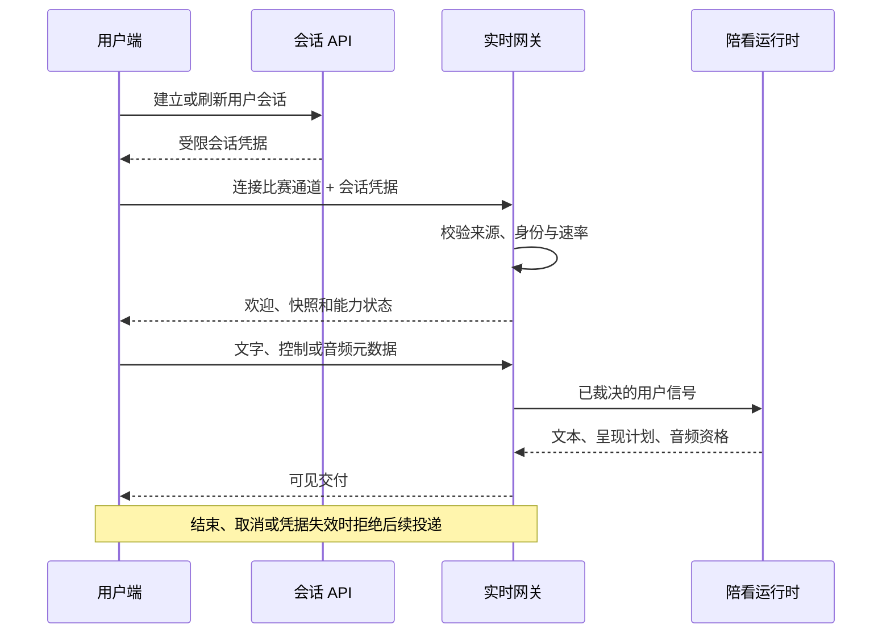
```mermaid
sequenceDiagram
    participant C as 用户端
    participant S as 会话 API
    participant W as 实时网关
    participant R as 陪看运行时
    C->>S: 建立或刷新用户会话
    S-->>C: 受限会话凭据
    C->>W: 连接比赛通道 + 会话凭据
    W->>W: 校验来源、身份与速率
    W-->>C: 欢迎、快照和能力状态
    C->>W: 文字、控制或音频元数据
    W->>R: 已裁决的用户信号
    R-->>W: 文本、呈现计划、音频资格
    W-->>C: 可见交付
    Note over C,W: 结束、取消或凭据失效时拒绝后续投递
```

### 3.3 语音与舞台的适配器边界

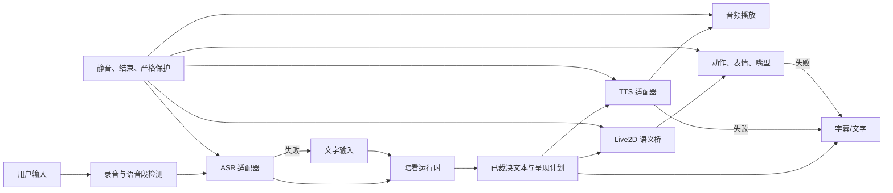
```mermaid
flowchart LR
    U[用户输入] --> VAD[录音与语音段检测]
    VAD --> ASR[ASR 适配器]
    ASR --> RT[陪看运行时]
    Text[文字输入] --> RT
    RT --> Plan[已裁决文本与呈现计划]
    Plan --> Sub[字幕/文字]
    Plan --> TTS[TTS 适配器]
    TTS --> Play[音频播放]
    Plan --> Bridge[Live2D 语义桥]
    Bridge --> Stage[动作、表情、嘴型]
    Cancel[静音、结束、严格保护] --> ASR
    Cancel --> TTS
    Cancel --> Play
    Cancel --> Bridge
    Cancel --> Stage
    ASR -->|失败| Text
    TTS -->|失败| Sub
    Stage -->|失败| Sub
```

### 3.4 实时投递、重连与客户端去重

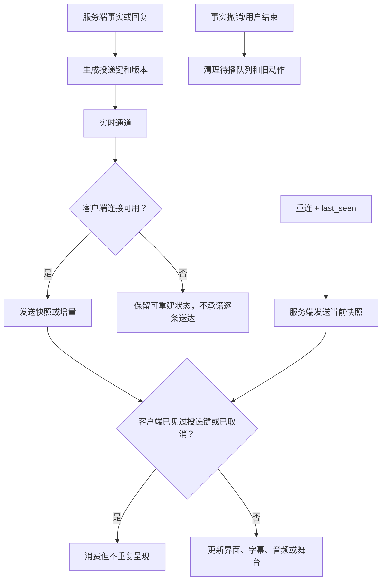
```mermaid
flowchart TD
    A[服务端事实或回复] --> B[生成投递键和版本]
    B --> C[实时通道]
    C --> D{客户端连接可用？}
    D -->|是| E[发送快照或增量]
    D -->|否| F[保留可重建状态，不承诺逐条送达]
    E --> G{客户端已见过投递键或已取消？}
    G -->|是| H[消费但不重复呈现]
    G -->|否| I[更新界面、字幕、音频或舞台]
    J[重连 + last_seen] --> K[服务端发送当前快照]
    K --> G
    L[事实撤销/用户结束] --> M[清理待播队列和旧动作]
```

### 3.5 消息契约、顺序与幂等

实时通道不承诺“任何网络条件下逐条恰好一次”。它承诺的是每条可见更新都有会话范围、投递键、版本和可丢弃条件；客户端能安全重放、去重、拒绝过期或已取消的内容，并通过快照恢复当前真相。

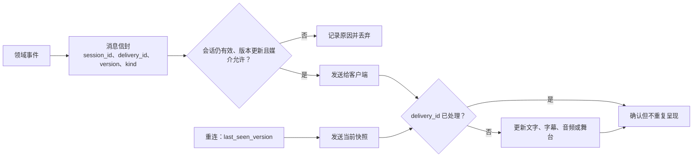
```mermaid
flowchart LR
    Event[领域事件] --> Envelope[消息信封\nsession_id、delivery_id、version、kind]
    Envelope --> Policy{会话仍有效、版本更新且媒介允许？}
    Policy -->|否| Drop[记录原因并丢弃]
    Policy -->|是| Send[发送给客户端]
    Send --> Client{delivery_id 已处理？}
    Client -->|是| Ack[确认但不重复呈现]
    Client -->|否| Render[更新文字、字幕、音频或舞台]
    Render --> Ack
    Reconnect[重连：last_seen_version] --> Snapshot[发送当前快照]
    Snapshot --> Client
```

## 4. 赛事事实、用户进度与可见性

### 4.1 从外部观察到用户呈现

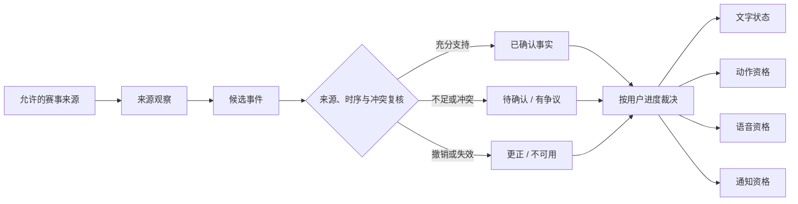
```mermaid
flowchart LR
    S[允许的赛事来源] --> O[来源观察]
    O --> C[候选事件]
    C --> V{来源、时序与冲突复核}
    V -->|充分支持| F[已确认事实]
    V -->|不足或冲突| W[待确认 / 有争议]
    V -->|撤销或失效| R[更正 / 不可用]
    F --> E[按用户进度裁决]
    W --> E
    R --> E
    E --> T[文字状态]
    E --> A[动作资格]
    E --> AU[语音资格]
    E --> N[通知资格]
```

### 4.2 事实状态机

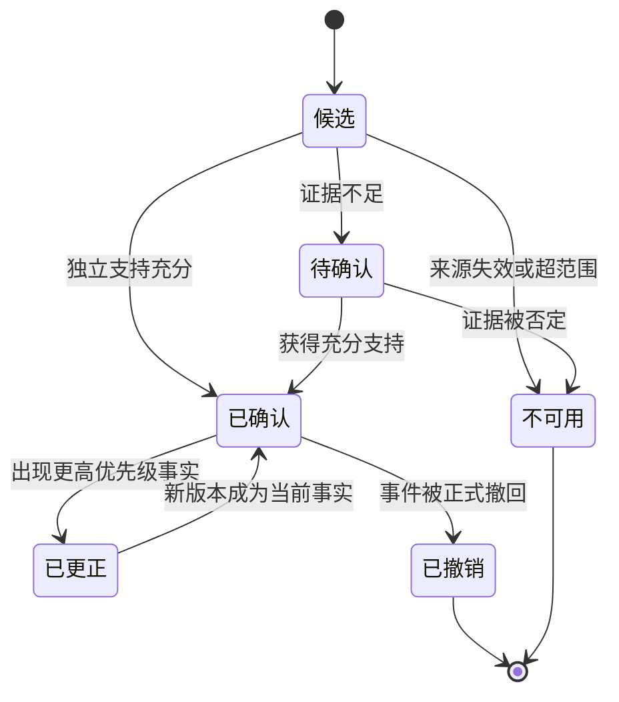
```mermaid
stateDiagram-v2
    [*] --> 候选
    候选 --> 待确认: 证据不足
    候选 --> 已确认: 独立支持充分
    候选 --> 不可用: 来源失效或超范围
    待确认 --> 已确认: 获得充分支持
    待确认 --> 不可用: 证据被否定
    已确认 --> 已更正: 出现更高优先级事实
    已更正 --> 已确认: 新版本成为当前事实
    已确认 --> 已撤销: 事件被正式撤回
    已撤销 --> [*]
    不可用 --> [*]
```

### 4.3 严格保护的资格链

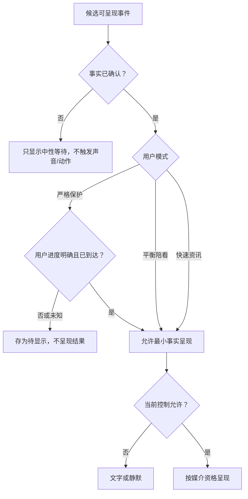
```mermaid
flowchart TD
    E[候选可呈现事件] --> F{事实已确认？}
    F -->|否| X[只显示中性等待，不触发声音/动作]
    F -->|是| M{用户模式}
    M -->|严格保护| P{用户进度明确且已到达？}
    P -->|否或未知| Q[存为待显示，不呈现结果]
    P -->|是| V[允许最小事实呈现]
    M -->|平衡陪看| V
    M -->|快速资讯| V
    V --> C{当前控制允许？}
    C -->|否| T[文字或静默]
    C -->|是| A[按媒介资格呈现]
```

### 4.4 多端实时同步、重连与乱序

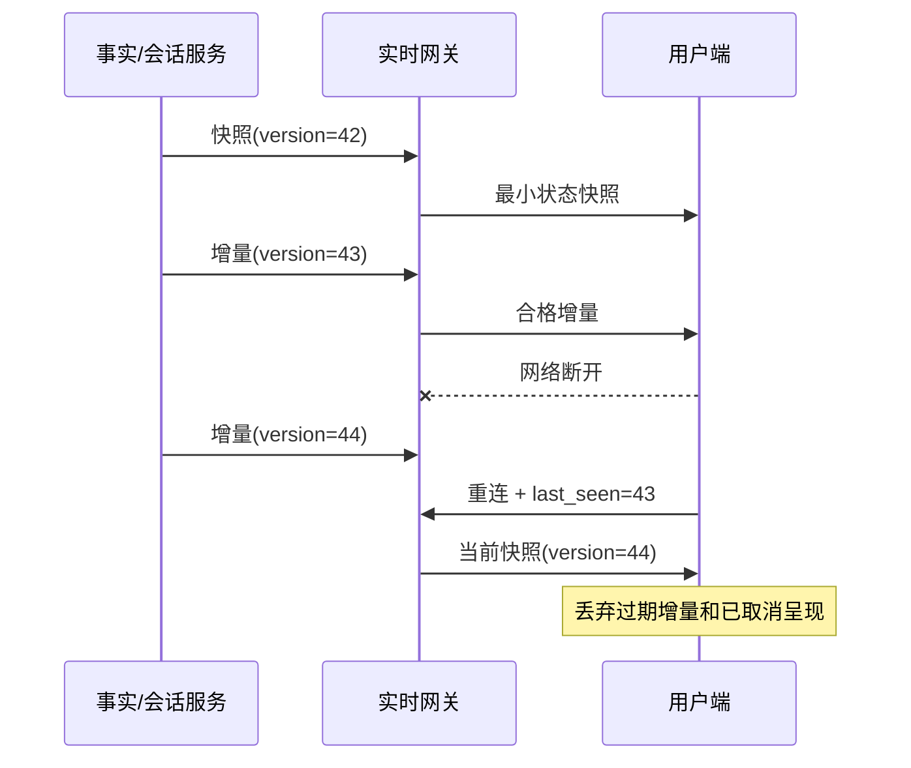
```mermaid
sequenceDiagram
    participant S as 事实/会话服务
    participant G as 实时网关
    participant C as 用户端
    S->>G: 快照(version=42)
    G->>C: 最小状态快照
    S->>G: 增量(version=43)
    G->>C: 合格增量
    C--xG: 网络断开
    S->>G: 增量(version=44)
    C->>G: 重连 + last_seen=43
    G->>C: 当前快照(version=44)
    Note over C: 丢弃过期增量和已取消呈现
```

---

## 5. 会话、角色与多模态呈现

### 5.1 陪看运行时

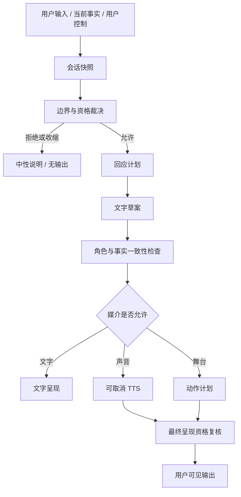
```mermaid
flowchart TD
    I[用户输入 / 当前事实 / 用户控制] --> S[会话快照]
    S --> G[边界与资格裁决]
    G -->|拒绝或收缩| N[中性说明 / 无输出]
    G -->|允许| P[回应计划]
    P --> T[文字草案]
    T --> C[角色与事实一致性检查]
    C --> V{媒介是否允许}
    V -->|文字| TX[文字呈现]
    V -->|声音| AU[可取消 TTS]
    V -->|舞台| ST[动作计划]
    AU --> K[最终呈现资格复核]
    ST --> K
    K --> O[用户可见输出]
```

### 5.2 角色护栏的决策顺序

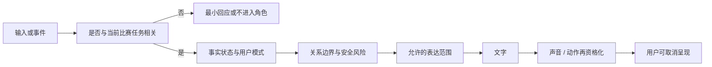
```mermaid
flowchart LR
    A[输入或事件] --> B[是否与当前比赛任务相关]
    B -->|否| C[最小回应或不进入角色]
    B -->|是| D[事实状态与用户模式]
    D --> E[关系边界与安全风险]
    E --> F[允许的表达范围]
    F --> G[文字]
    G --> H[声音 / 动作再资格化]
    H --> I[用户可取消呈现]
```

### 5.3 语音链路与取消传播

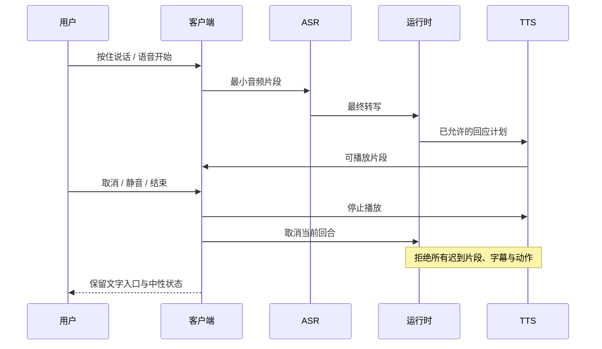
```mermaid
sequenceDiagram
    participant U as 用户
    participant C as 客户端
    participant A as ASR
    participant R as 运行时
    participant T as TTS
    U->>C: 按住说话 / 语音开始
    C->>A: 最小音频片段
    A->>R: 最终转写
    R->>T: 已允许的回应计划
    T->>C: 可播放片段
    U->>C: 取消 / 静音 / 结束
    C->>T: 停止播放
    C->>R: 取消当前回合
    Note over R,T: 拒绝所有迟到片段、字幕与动作
    C-->>U: 保留文字入口与中性状态
```

### 5.4 Live2D 动作资格

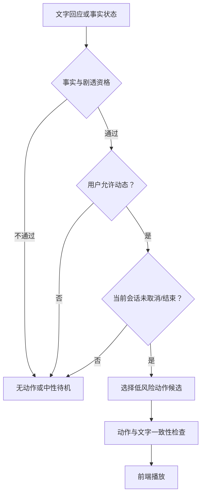
```mermaid
flowchart TD
    A[文字回应或事实状态] --> B{事实与剧透资格}
    B -->|不通过| X[无动作或中性待机]
    B -->|通过| C{用户允许动态？}
    C -->|否| X
    C -->|是| D{当前会话未取消/结束？}
    D -->|否| X
    D -->|是| E[选择低风险动作候选]
    E --> F[动作与文字一致性检查]
    F --> G[前端播放]
```

### 5.5 会话生命周期与终态优先级

会话不是无限期的聊天容器。建立、活跃、静默、结束、过期和删除请求要有不同的读取、写入和呈现权限；终态优先于生成、缓存、重试和舞台播放。

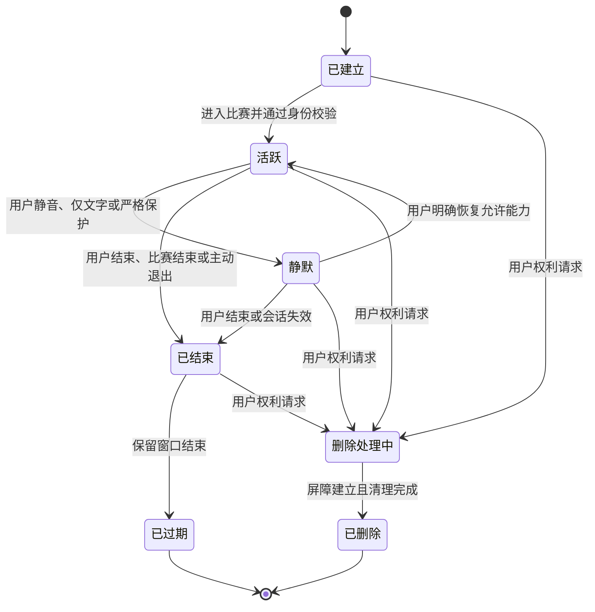
```mermaid
stateDiagram-v2
    [*] --> 已建立
    已建立 --> 活跃: 进入比赛并通过身份校验
    活跃 --> 静默: 用户静音、仅文字或严格保护
    静默 --> 活跃: 用户明确恢复允许能力
    活跃 --> 已结束: 用户结束、比赛结束或主动退出
    静默 --> 已结束: 用户结束或会话失效
    已结束 --> 已过期: 保留窗口结束
    已建立 --> 删除处理中: 用户权利请求
    活跃 --> 删除处理中: 用户权利请求
    静默 --> 删除处理中: 用户权利请求
    已结束 --> 删除处理中: 用户权利请求
    删除处理中 --> 已删除: 屏障建立且清理完成
    已过期 --> [*]
    已删除 --> [*]
```

### 5.6 角色上下文装配与记忆许可

角色不能读取“所有可用数据”。上下文装配只取当前任务需要的确认事实、用户当前控制、经用户明确保存且仍有效的偏好或共同记录；删除、暂停、共享设备和严格保护会让相应字段退出上下文。

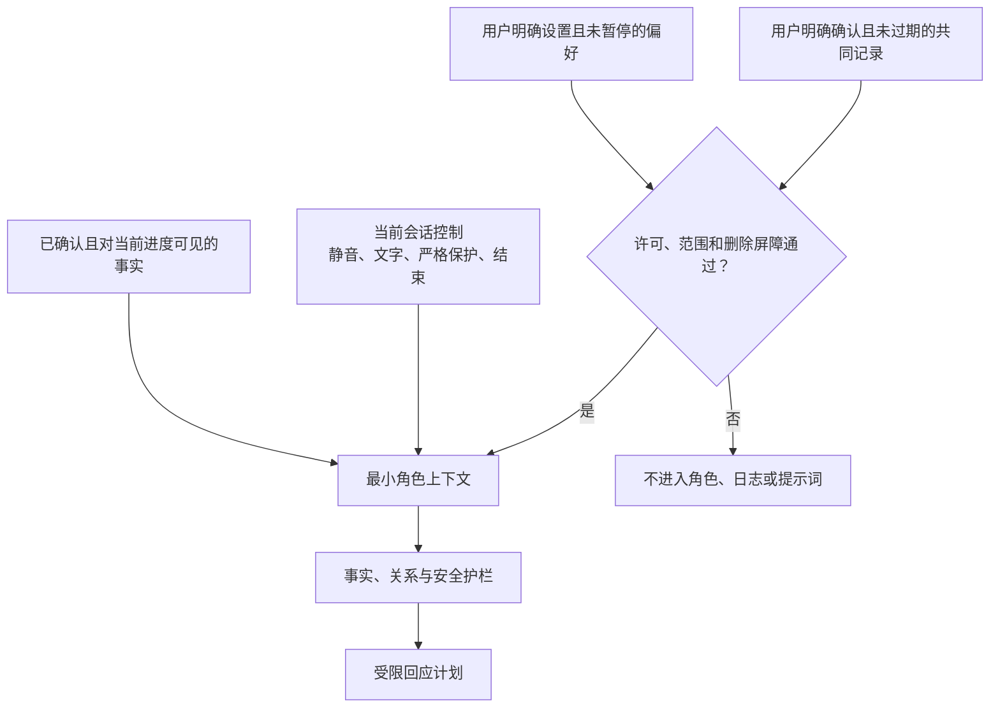
```mermaid
flowchart TB
    Facts[已确认且对当前进度可见的事实] --> Context[最小角色上下文]
    Controls[当前会话控制\n静音、文字、严格保护、结束] --> Context
    Prefs[用户明确设置且未暂停的偏好] --> Check{许可、范围和删除屏障通过？}
    Memory[用户明确确认且未过期的共同记录] --> Check
    Check -->|是| Context
    Check -->|否| Exclude[不进入角色、日志或提示词]
    Context --> Guard[事实、关系与安全护栏]
    Guard --> Plan[受限回应计划]
```

---

## 6. 资料生命周期、导演台与评测闭环

### 6.1 会话、偏好、共同记录与删除

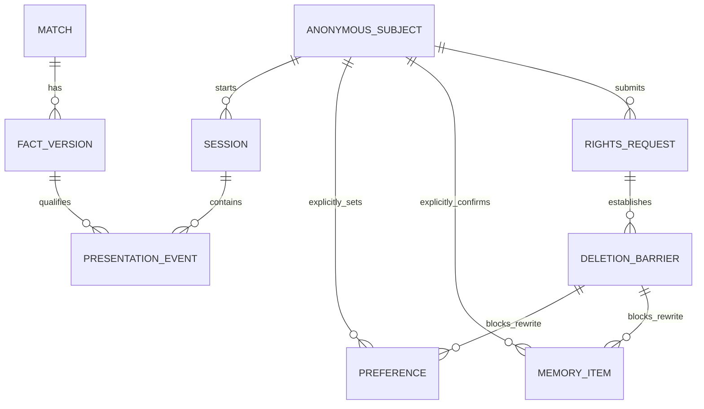
```mermaid
erDiagram
    ANONYMOUS_SUBJECT ||--o{ SESSION : starts
    ANONYMOUS_SUBJECT ||--o{ PREFERENCE : explicitly_sets
    ANONYMOUS_SUBJECT ||--o{ MEMORY_ITEM : explicitly_confirms
    SESSION ||--o{ PRESENTATION_EVENT : contains
    MATCH ||--o{ FACT_VERSION : has
    FACT_VERSION ||--o{ PRESENTATION_EVENT : qualifies
    ANONYMOUS_SUBJECT ||--o{ RIGHTS_REQUEST : submits
    RIGHTS_REQUEST ||--o{ DELETION_BARRIER : establishes
    DELETION_BARRIER ||--o{ PREFERENCE : blocks_rewrite
    DELETION_BARRIER ||--o{ MEMORY_ITEM : blocks_rewrite
```

### 6.2 删除屏障与迟到写入

```mermaid
flowchart TD
    A[用户发起暂停或删除] --> B[说明范围与确认]
    B --> C{确认？}
    C -->|否| X[保持原状态]
    C -->|是| D[建立权利请求与删除屏障]
    D --> E[停止未来读取与写入]
    E --> F[清理允许删除的数据]
    F --> G[处理缓存、队列与备份规则]
    H[迟到写入 / 离线旧版本] --> I{屏障是否存在？}
    I -->|是| J[拒绝、记录并不复活]
    I -->|否| K[按普通许可规则处理]
```

### 6.3 导演台的候选到发布流程

```mermaid
flowchart LR
    A[赛前场次准备] --> B[受限来源候选]
    B --> C[草稿]
    C --> D[独立复核]
    D -->|通过| E[已发布事实]
    D -->|冲突 / 不足| F[等待或暂停]
    E --> G[用户资格链]
    E --> H[更正 / 撤销]
    H --> G
    C --> I[操作理由与审计]
    D --> I
    E --> I
```

### 6.4 评测、发布与自动收缩

```mermaid
flowchart LR
    A[产品场景与风险] --> B[黄金集与判定规则]
    B --> C[离线评测]
    C --> D[集成与端到端演练]
    D --> E{阻断门通过？}
    E -->|否| F[修复 / 收缩 / 暂停]
    E -->|是| G[受限发布]
    G --> H[观测、投诉与抽样复核]
    H --> I{新风险或阈值越界？}
    I -->|是| F
    I -->|否| J[维持明确范围]
```

### 6.5 导演配置、版本与回滚

导演台处理的是受限运营配置，不是绕过产品边界的后门。每项候选必须有目标场次、权限、理由、双人复核、版本与生效窗口；发布后如出现事实、控制或体验门失败，应直接回滚到上一个可解释版本或关闭能力。

```mermaid
flowchart LR
    Draft[候选配置\n场次、范围、理由、到期] --> Validate[结构与权限校验]
    Validate --> Review[独立复核]
    Review -->|拒绝或证据不足| Hold[保持草稿或关闭]
    Review -->|通过| Version[生成不可变版本与审计]
    Version --> Publish[仅对目标场次生效]
    Publish --> Observe[观测与抽样复核]
    Observe -->|门通过| Keep[保留至到期或下一版本]
    Observe -->|阈值越界| Rollback[回滚上一版本或关闭]
    Rollback --> Audit[记录用户影响与复盘]
```

---

## 7. 存储、供应商与运维部署

### 7.1 领域存储与权威性

```mermaid
flowchart TB
    subgraph Authoritative[可恢复业务存储]
      PG[(PostgreSQL)]
      Facts[事实修订、冲突与快照]
      Sessions[会话、关系、偏好与 Trace]
      Privacy[权利请求、删除屏障与审计]
      Ops[导播幂等记录与 Outbox]
    end
    subgraph Ephemeral[非权威辅助层]
      Redis[(Redis)]
      Cache[限流、短期协调与缓存]
    end
    Facts --> PG
    Sessions --> PG
    Privacy --> PG
    Ops --> PG
    Cache --> Redis
    PG -.恢复时重建.-> Cache
    Redis -.不得作为.-> Facts
```

### 7.2 赛事来源、模型与语音供应商隔离

```mermaid
flowchart LR
    Source[赛事来源适配器] --> Normalize[标准化、许可与新鲜度]
    Normalize --> Ledger[事实候选账本]
    Ledger --> Reconcile[确认、冲突与更正]
    Model[LLM 适配器] --> Runtime[陪看运行时]
    ASR[ASR 适配器] --> Runtime
    Runtime --> TTS[TTS 适配器]
    Reconcile --> Runtime
    Runtime --> Guard[事实、关系与控制护栏]
    Guard --> Output[文字/音频/舞台资格]
    Source -.失败.-> F1[保留最后可解释状态或等待]
    Model -.失败.-> F2[确定性文字模板]
    ASR -.失败.-> F3[文字输入]
    TTS -.失败.-> F4[字幕]
```

### 7.3 评测与可观测性数据流

```mermaid
flowchart LR
    Scenario[产品风险与 POC 合同] --> Assets[黄金集、夹具与标签]
    Assets --> Runner[离线/集成/E2E 运行器]
    Runner --> Verdict[硬门、语义复核与报告]
    Verdict --> Gate[构建、发布或收缩决定]
    Runtime[受控运行] --> Telemetry[最小运行指标与审计]
    Telemetry --> Detect[阈值、抽样、投诉与异常检测]
    Detect --> Gate
    Gate -->|收缩| Flags[能力开关、回退与暂停]
    Gate -->|新风险| Scenario
```

### 7.4 环境隔离与发布路径

```mermaid
flowchart TB
    subgraph Dev[本地与设计环境]
      D1[合成场景]
      D2[原型 / POC]
    end
    subgraph Test[受限测试环境]
      T1[匿名测试主体]
      T2[模拟赛事与供应商]
      T3[自动评测环境]
    end
    subgraph Pilot[受控开放环境]
      P1[最小用户范围]
      P2[功能开关与停止按钮]
      P3[值守与审计]
    end
    subgraph Production[扩大范围前的候选生产环境]
      R1[隔离数据域]
      R2[最小可见性]
      R3[回滚与告警]
    end
    D1 --> T1
    D2 --> T2
    T1 --> T3
    T2 --> T3
    T3 --> P1
    P1 --> P2
    P2 --> P3
    P3 --> R1
    R1 --> R2
    R2 --> R3
```

### 7.5 生产接入与故障收缩

```mermaid
flowchart TB
    Internet[用户端] --> TLS[HTTPS/WSS 反向代理与 TLS]
    TLS --> App[Go 服务]
    App --> PG[(PostgreSQL 私有网络)]
    App --> Redis[(Redis 私有网络)]
    App --> AI[受控外部 AI 适配器]
    App --> Data[受控赛事来源适配器]
    Monitor[观测与审计] --> App
    Alert[阈值或投诉信号] --> Kill[能力开关 / 降级 / 暂停]
    Kill --> App
    Note1[数据库与缓存不直接暴露公网] -.约束.-> PG
    Note2[文字路径可独立于语音和舞台继续] -.约束.-> App
```

### 7.6 部署拓扑、网络入口与恢复域

部署图要把“谁能从公网访问”“哪些状态可以恢复”“哪个外部依赖断开后必须收缩”画出来，而不是只列一排服务名。首轮候选部署以最小受限范围为目标：用户只接触 HTTPS/WSS 入口，领域存储和协调缓存不开放公网，外部供应商只能由适配器调用，值守和发布决定经过独立的审计路径。

```mermaid
flowchart TB
    User[用户端] --> Edge[HTTPS/WSS 入口\nTLS、速率与会话校验]
    Operator[受限运营终端] --> OpsAuth[运营身份、最小权限与审计]
    Edge --> App[无状态应用服务\nHTTP、WebSocket、陪看协调]
    OpsAuth --> App
    App --> PG[(事务存储\n事实、会话、权利与操作审计)]
    App --> Cache[(短期协调缓存\n限流、连接与可重建状态)]
    App --> Queue[受控异步任务\n可取消、可重放、不可跨删除屏障]
    App --> SourceAdapter[赛事来源适配器]
    App --> AIAdapter[模型、ASR、TTS 适配器]
    Queue --> PG
    App --> Telemetry[最小观测与告警]
    Telemetry --> OnCall[值守、能力开关与回退]
    OnCall --> App
    PG -.备份与恢复演练.-> Recovery[恢复环境\n不自动恢复已删除资料]
    SourceAdapter --> Source[允许的赛事来源]
    AIAdapter --> Provider[受控外部供应商]
```

### 7.7 故障域、回退与恢复演练

故障处理不能只写“重试”。每一类依赖都要有用户可见的收缩结果、可恢复边界和不允许发生的副作用。赛事来源、模型、语音、实时连接、存储和人工复核的失败会造成不同风险，因而必须走不同回退路径。

```mermaid
flowchart TD
    A[故障或阈值越界] --> B{故障域}
    B -->|赛事来源| C[冻结为最后可解释状态\n不新增结果型输出]
    B -->|模型/文本生成| D[确定性说明或仅事实卡]
    B -->|ASR/TTS/舞台| E[保持文字、字幕和控制]
    B -->|实时连接| F[重连后获取快照\n不补播已取消内容]
    B -->|存储或删除路径| G[停止相关写入与扩展\n保留权利请求状态]
    B -->|人工复核不可用| H[不发布候选事实与运营配置]
    C --> I[用户可见中性状态]
    D --> I
    E --> I
    F --> I
    G --> I
    H --> I
    I --> J[记录最小证据、复现与复审]
```

### 7.8 开发、评测、受控开放与生产的工件流

环境不是一条“测试通过就上线”的直线。原型、POC、产品评测、工程 Evals 和运行监测分别产生不同工件；只有各自的门通过，候选能力才可以进入下一环境。

```mermaid
flowchart LR
    Prototype[原型环境\n页面、流程、控制走查] --> UXDecision[体验取舍]
    POC[隔离 POC 环境\n合成输入与停止条件] --> TechContract[技术合同与回退]
    UXDecision --> Build[开发环境\n任务契约与最小实现]
    TechContract --> Build
    Build --> Test[评测环境\n黄金集、替身、集成与 E2E]
    Test -->|硬门通过| Pilot[受控开放\n最小范围、值守、能力开关]
    Test -->|失败| Build
    Pilot -->|运行证据支持扩大| Prod[生产候选\n隔离、回滚与审计]
    Pilot -->|新风险| Prototype
    Pilot -->|技术失效| POC
    Pilot -->|工程回归| Test
```
### 7.9 迁移、版本兼容与资料演进

领域演进必须让旧会话、旧快照、旧投递和资料权利保持可解释。迁移不能直接扩大收集范围，也不能通过回填绕过删除屏障；不兼容变更要先停止相关能力或让旧版本自然到期。

```mermaid
flowchart TD
    Change[领域、协议或资料规则变更] --> Impact[识别受影响的会话、快照、投递与权利请求]
    Impact --> Contract[定义新旧版本兼容合同]
    Contract --> Fixture[补充迁移夹具、黄金集与回退场景]
    Fixture --> DryRun[隔离环境干跑与数据最小化审阅]
    DryRun --> Gate{兼容、删除屏障与回退门通过？}
    Gate -->|否| Stop[停止变更或收缩能力]
    Gate -->|是| Rollout[受控迁移与版本标记]
    Rollout --> Monitor[核对延迟写入、旧客户端与恢复路径]
    Monitor -->|异常| Rollback[停止新写入并回滚可逆部分]
```

### 7.10 赛程、比赛时钟与任务调度

赛程和比赛时钟只提供可解释的候选节奏，不能直接把“计划开赛”升级成用户可见赛果或角色反应。定时任务必须能够去重、暂停、重放和在来源失效时保持中性。

```mermaid
flowchart LR
    Schedule[允许的赛程来源] --> Normalize[标准化场次与时区]
    Normalize --> Clock[比赛时钟与状态候选]
    Clock --> Jobs[受控调度器\n赛前准备、赛中刷新、赛后收束]
    Jobs --> Dedupe[幂等键与运行锁]
    Dedupe --> Source[来源观察与事实候选]
    Source --> Eligibility[事实与可见性资格链]
    Eligibility --> User[用户端最小状态]
    Pause[暂停、结束、来源失效或删除屏障] --> Jobs
    Pause --> Eligibility
```

### 7.11 Trace、审计与决策关联

观测不是收集完整对话。每个高影响决定使用最小关联标识，把用户控制、事实版本、配置版本、供应商状态、评测结果和回退动作串起来，同时避免让运营或调试路径获得私人原文和原始音频。

```mermaid
flowchart TB
    UserAction[用户控制或权利请求] --> Trace[最小 Trace 关联键]
    Fact[事实版本与来源状态] --> Trace
    Config[导演配置版本与理由] --> Trace
    Provider[供应商状态、超时与取消] --> Trace
    Eval[评测场景与判定结果] --> Trace
    Trace --> Audit[可审计决定摘要\n不含私人原文、原始音频]
    Audit --> Review[故障复盘、投诉处理或发布复核]
    Review --> Flag[回退、暂停、修复或场景补充]
```

### 7.12 客户端能力矩阵与降级等价

同一用户任务要在声音、舞台、网络和辅助技术条件不同的客户端上保持等价路径。多媒介是增强层，文字、状态和控制才是不可替代的基线。

```mermaid
flowchart TB
    Task[核心任务：理解事实、控制陪看、提问或结束] --> Text[文字与结构化状态\n所有客户端必须具备]
    Text --> Weak[弱网：快照、缓存说明与重连]
    Text --> A11y[读屏、低动态、键盘或触控等价]
    Text --> Voice[可选语音\n可取消、失败回文字]
    Text --> Stage[可选舞台\n失败回静态或隐藏]
    Voice --> NoSpoil[仍受事实、进度与会话资格约束]
    Stage --> NoSpoil
```

### 7.13 供应商路由、超时与降级合同

供应商不是功能本身。每类外部能力都经适配层记录版本、超时、取消和可替换性；当合同不满足时，系统回到文字、确定性模板、等待或主动入口，而不是悄悄改变事实或要求用户继续等待。

```mermaid
flowchart LR
    Request[受控请求] --> Adapter[供应商适配层\n版本、预算、超时、取消]
    Adapter --> Check{可用且满足当前合同？}
    Check -->|赛事来源| Facts[候选或最后可解释事实]
    Check -->|文本模型| Reply[受限回应草案]
    Check -->|ASR| Input[文字输入路径]
    Check -->|TTS| Caption[字幕与文字]
    Check -->|否| Fallback[确定性说明、等待或关闭增强能力]
    Facts --> Guard[统一资格与边界护栏]
    Reply --> Guard
    Input --> Guard
    Caption --> Guard
    Fallback --> Guard
```

### 7.14 ADR 依赖关系

```mermaid
flowchart TD
    A1[ADR：事实与角色分离] --> A4[剧透与可见性资格]
    A2[ADR：匿名优先与最少身份] --> A5[偏好、删除与恢复]
    A3[ADR：多媒介等价] --> A6[语音与舞台降级]
    A4 --> A7[实时协议与重连]
    A5 --> A8[资料生命周期]
    A6 --> A7
    A7 --> A9[工程 Evals 与发布门]
    A8 --> A9
```

### 7.15 服务模块与工程任务边界

工程任务按可验证的领域边界切分，而不是按“前端、后端、AI”粗分。每个模块拥有明确输入、输出、失败收缩和 Evals 责任；跨模块只能通过版本化合同通信，避免让客户端、导演台或供应商适配器直接修改领域状态。

```mermaid
flowchart TB
    Client[客户端与呈现适配层\n只渲染已裁决计划] --> Gateway[会话与实时网关\n身份、投递、取消、重连]
    Gateway --> Match[比赛与来源模块\n赛程、时钟、候选事实]
    Gateway --> Companion[陪看运行时模块\n回应计划与角色护栏]
    Gateway --> Rights[资料权利模块\n偏好、共同记录、删除屏障]
    Ops[导演与运营模块\n候选、复核、版本、审计] --> Match
    Ops --> Companion
    Match --> Eligibility[资格裁决模块\n事实、进度、模式与媒介]
    Companion --> Eligibility
    Rights --> Eligibility
    Eligibility --> Gateway
    Match --> Store[(领域存储)]
    Companion --> Store
    Rights --> Store
    Ops --> Store
    Eval[工程 Evals 与夹具] -.验证合同.-> Gateway
    Eval -.验证合同.-> Match
    Eval -.验证合同.-> Companion
    Eval -.验证合同.-> Rights
    Eval -.验证合同.-> Eligibility
```

## 8. 图集覆盖与后续交接

本图集按系统全景、客户端、实时通道、事实流、角色运行时、资料生命周期、人工操作、评测观测和部署隔离九类视角组织。它不选择云厂商、模型品牌、具体表结构、容量数字或生产部署参数。这些是后续工程 ADR 和任务契约需要在成本、权限、供应商条件和评测证据齐备后决定的事项。

图集已经确定的，是所有实现都不得跨越的方向：

- 事实、用户观察、角色表达和运营指令必须有不同边界；
- 任何媒介输出都要经过事实、进度、模式和会话终态的资格裁决；
- 取消、结束、严格保护和删除应比生成、播放、缓存和重试优先；
- 用户端始终有文字或结构化等价的最小路径；
- 高影响人工操作可追溯、可更正，但不能越权读取私人材料；
- 评测和运行监测有权让系统收缩，而不是只记录问题。

```mermaid
flowchart TB
    Whole[总体分层与信任边界\n2.1、2.3] --> Client[前端页面与路由\n3.1]
    Client --> Realtime[实时协议、事件流与重连\n3.2、3.4、4.4]
    Whole --> Facts[外部数据管线与状态机\n4.1、4.2、7.2]
    Facts --> Runtime[运行时、角色与护栏\n5.1、5.2]
    Runtime --> Media[语音、视觉与降级\n3.3、5.3、5.4]
    Whole --> Data[数据模型、隐私与删除\n6.1、6.2、7.1]
    Data --> Ops[人工操作与审计\n6.3]
    Realtime --> Assurance[评测、观测与发布闭环\n6.4、7.3、7.4、7.5]
    Media --> Assurance
    Ops --> Assurance
```

参考系统架构图的组织方法被保留为多视角图集：总体分层、前端路由、实时协议、外部数据状态机、运行时、媒介降级、数据生命周期、人工操作和发布闭环。没有照搬教育产品的多租户、题库或考试模型；本项目改为围绕一场陪看、事实与剧透、用户控制、数字角色、资料权利和受限运营来组织。

## 生产版本设计拓展｜能力深化知识

本节描述产品成熟后的能力扩展、体验深化和治理要求，作为后续版本规划与设计决策的参考。

- **生产拓扑**：单 Agent 位于决策中心，事实、提醒、资料、语音、Live2D、通知和外部动作作为受限工具/适配器；工具无独立人格、关系或越权权限。
- **资格与护栏**：输入层做身份、年龄、隐私和注入检查；工具层做授权、事实、预算、幂等和副作用检查；输出层做进度、媒介、标识和终态检查；人工层可暂停与接管。
- **运行治理**：每次 run 具备预算、超时、循环上限、Trace、终止原因和回滚点；结束、删除、撤回和暂停优先于所有异步任务。
- **数据隔离**：公共事实、用户资料、运营配置、角色资产和 Trace 分离存储与授权；删除屏障传播到缓存、队列、索引、模型上下文和通知计划。
- **恢复与回滚**：供应商、事实源、模型、TTS、舞台资产和规则均支持版本锁定、灰度、熔断、替换和一键回退；恢复后先验证控制与事实快照，再恢复增强能力。
- **架构评测**：演练事实冲突、误提醒、记忆污染、工具副作用、跨设备越权、网络分区和人工审批超时，记录影响范围与恢复时间。

### 生产恢复场景

- **事实源故障**：停止自动发布，保留最后可确认快照和用户主动刷新；恢复后先校验版本再开放增强媒介。
- **通知队列故障**：冻结发送、保留订阅状态和取消操作；恢复时丢弃超窗消息，不补发可能剧透的内容。
- **资料服务故障**：阻断跨场读取和回写，当前会话使用最小本场状态；恢复后重新验证删除屏障。
- **模型/TTS/舞台故障**：按文字、字幕、静态状态卡逐级降级，用户看到当前可用能力和结束入口。
- **全局事故**：人工一键暂停相关版本，保留最小审计和用户告知；复盘通过后按灰度范围恢复。
### 生产架构能力卡

| 能力 | 触发与资格 | 组件职责 | 用户可见结果 | 失败、撤回与放行 |
| --- | --- | --- | --- | --- |
| 事实与呈现链 | 事实版本和用户控制发生变化 | 事实域裁决资格，Agent 生成计划，媒介适配器按版本呈现 | 用户看到当前状态、原因、模式和可停止入口 | 版本冲突取消排队计划；不以重试制造结果 |
| 权利与异步任务 | 用户暂停、删除、结束或撤回授权 | 权利域建立屏障并广播，队列/缓存/上下文拒绝旧版本 | 显示处理中、完成或例外范围 | 屏障传播失败保持阻断；恢复前先核验范围 |
| 供应商与环境恢复 | 事实源、模型、语音、存储或网络故障 | 适配器熔断、切换和灰度，Agent 回到最小能力 | 显示当前可用能力、快照、重试和结束 | 不补播过期内容；恢复需通过评测门再扩大 |

放行以事实资格、控制传播、删除隔离、故障收缩和恢复时间为硬门；架构图不替用户作价值判断。
