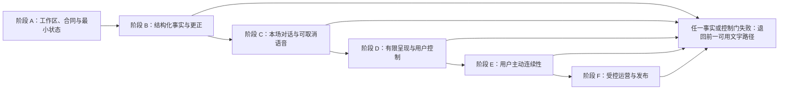
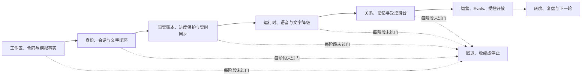

# 总体开发方案：从产品决策到可交付陪看服务

> 文档类型：0→1 权威工程执行方案  
> 适用阶段：尚未建立工程工作区时，依据已确认的产品边界逐步施工、验证、发布与收束  
> 版本：0.1（技术选择、交付节奏、工具能力、成本与容量均为待验证假设）  
> 研究信息截止：2026-01-28  
> 核心原则：AI Coding 是受合同约束的工程协作，不是把模糊愿望交给模型后期待自动成品。每次变更都必须从用户任务、事实边界、允许范围、验收证据和回退条件开始；模型只能在被授予的范围内施工，不能替用户扩大产品承诺、私人资料范围或角色关系边界。


---

## 1. 施工对象与工程承诺

目标产品是一项面向成年足球观众的数字球友陪看服务。用户可先以低门槛进入一场比赛，选择安静、文字、低动态或更热闹的本场体验；在需要时主动提问、查看已确认比赛状态、管理自己明确保存的偏好与提醒，并随时自然结束。角色可以有稳定的足球审美和有限反应，但不成为事实权威、现实关系替代或需要用户照顾的主体。

工程方案服务的不是“尽快做出会聊天的角色”，而是以下可验证承诺：

1. 比赛事实与用户观察分离；不确定、冲突和更正状态对用户可解释；
2. 用户的结束、安静、仅文字、低动态、取消与删除高于自动生成、声音和表演；
3. 跨场连续性只来自用户主动保存的最少资料，且可查看、暂停、删除和验证结果；
4. 语音、文本、字幕、角色动作和事实状态来自同一份受控决策，不能互相矛盾；
5. 身份、共享设备、恢复、提醒和运营操作均遵循最小披露和最小权限；
6. 每一项能力都能由用户任务、场景验收、质量门禁和明确回退条件证明，而不是由“看起来很像人”证明。

### 1.1 开发前先冻结的产品边界

施工启动前，产品负责人、体验负责人和工程负责人共同写出一页边界声明。它不描述界面像什么，而写清“绝不做什么、何时必须停、用户怎样退出”。首轮至少包含：不自动把用户话语变成比赛事实；不以孤独、内疚、恋爱或排他语言提高留存；不默认保存原始语音、环境声音和敏感资料；不因用户沉默提高主动性；不在事实未明时用角色表演强行定论；不让运营人员读取无关私人资料。

边界声明进入每个任务契约和质量门禁。若一个需求无法说明它如何遵守边界，正确做法是暂停拆解，而不是让工程人员“先做出来再说”。

### 1.2 交付单元

整个服务拆为可独立验证、可自然停止的交付单元：

**单元：比赛进入**
- **用户可见结果**：用户能选一场比赛并进入本场
- **最小成功证据**：访客可进入、能看状态、能结束
- **首轮非目标**：完整赛事覆盖或复杂推荐

**单元：事实状态**
- **用户可见结果**：用户能区分确认、等待、冲突与更正
- **最小成功证据**：同一事件在各呈现层不矛盾
- **首轮非目标**：预测比分或自动编造赛况

**单元：本场控制**
- **用户可见结果**：用户能安静、仅文字、低动态、结束
- **最小成功证据**：控制立即生效且不被自动内容覆盖
- **首轮非目标**：用热闹度取代用户控制

**单元：对话与语音**
- **用户可见结果**：用户主动输入并能取消/改文字
- **最小成功证据**：取消后旧内容不再出现
- **首轮非目标**：自动长聊、跨场保存全部对话

**单元：角色呈现**
- **用户可见结果**：角色有有限、可解释的反应
- **最小成功证据**：不抢比赛、不越过事实与控制
- **首轮非目标**：恋爱化、依赖化表演

**单元：资料连续性**
- **用户可见结果**：用户保存/暂停/删除自己的少量偏好
- **最小成功证据**：下一场可见、删除后不再引用
- **首轮非目标**：情绪画像或自动记忆

**单元：导演与支持**
- **用户可见结果**：人工能处理候选、暂停与更正
- **最小成功证据**：最小权限、职责分离、可追溯
- **首轮非目标**：对用户的关系化运营

工程节奏按“先保护失败路径，再提高体验丰富度”排列。任何高热度角色素材、复杂连贯记忆或商业入口，都不能越过事实、控制、隐私、无障碍和结束路径。

---

## 2. 工具链选择与取舍

### 2.1 选择原则

工具链不是炫技清单。选择每个工具前先回答：它能否支持实时、可取消的本场体验？能否让事实状态与用户资料保持清楚边界？能否在个人开发、小范围演练和受控发布中获得一致结果？能否让 AI Coding 任务的输入、输出和验证结果被清楚记录？若一个工具只能让演示更快，却让取消、回退、隐私或故障解释更难，就不应在首轮成为核心依赖。

### 2.2 候选技术组合

**层次：用户端**
- **首轮候选**：Flutter + Dart
- **选择理由**：一套界面覆盖移动、网页和大屏适配；适合构建稳定控制与动态呈现
- **主要取舍与缓解**：平台差异仍需分别走查；先保证文字与控制，再接入复杂渲染

**层次：实时服务**
- **首轮候选**：Go
- **选择理由**：适合长连接、并发会话、取消与状态转发
- **主要取舍与缓解**：业务表达需保持模块化；不让网络层决定角色语义

**层次：关系/编排服务**
- **首轮候选**：TypeScript 作为可选独立层
- **选择理由**：适合编排提示词、工具调用、评估情境和配置
- **主要取舍与缓解**：首轮先维持确定性边界；不把模型代理赋予事实写入权

**层次：关系型资料**
- **首轮候选**：PostgreSQL
- **选择理由**：适合结构化事实、用户资料、状态版本、删除与审计
- **主要取舍与缓解**：不用模糊检索取代比分/事件的结构判断

**层次：短时状态与队列**
- **首轮候选**：Redis 或等价受控缓存
- **选择理由**：支持会话短状态、限流、短时广播
- **主要取舍与缓解**：缓存不是事实唯一来源；删除与结束不能只依赖短时状态

**层次：容器与本地编排**
- **首轮候选**：Docker Compose
- **选择理由**：让开发、演练与交付环境可重复启动
- **主要取舍与缓解**：配置通过显式环境变量管理，不把密钥写进项目目录

**层次：可观测性**
- **首轮候选**：OpenTelemetry + 指标/日志平台
- **选择理由**：追踪一次用户动作如何到达最终结果
- **主要取舍与缓解**：日志最小化，不能记录原始语音或无关私人内容

**层次：AI Coding 助手**
- **首轮候选**：具备文件阅读、受限修改、命令执行和差异审阅能力的助手
- **选择理由**：可按任务契约做小步施工与自检
- **主要取舍与缓解**：助手不拥有发布、密钥、个人资料或范围扩张权

选择并不意味着首日把所有组件接通。最小路线是先建立用户端最小控制、结构化比赛状态、确定性本场会话和可重复的场景验收；在这些路径稳定后，再增加语音、角色表演、跨场资料和人工运营。

### 2.3 本地运行基线

每位开发者从空工作区应能完成以下基线，而不依赖私人机器状态：

```bash
docker compose up --build
flutter pub get
flutter run --dart-define=APP_ENV=local
go run ./cmd/service
go test ./...
flutter analyze
```

这些命令只是候选基线，具体名称随最终目录和平台调整。关键要求是：服务启动、用户端启动、场景验收、静态检查和本地依赖的入口可被新成员看懂；缺少密钥或外部能力时应自动进入受控模拟模式，而不是让工程人员把真实凭据写进脚本或对话。

---

## 3. 工程工作区骨架

从零开始的目录结构应让每个边界一眼可见，避免“所有业务都堆在一个服务里，后面再整理”。推荐按用户任务和资料边界分区：

```text
product-workspace/
  apps/                   用户端与可访问呈现
  realtime/               会话、取消、实时转发
  match-domain/           比赛快照、事件、冲突与更正
  companion/              对话编排、动作计划与提示词资产
  privacy-identity/       身份、资料范围、删除与恢复
  operator-console/       受限导演与支持工作台
  shared-contracts/       API、状态、版本与消息合同
  evaluations/            场景、金样本、门禁与报告
  infra/                  本地编排、环境与部署描述
  product-specs/          用户任务、决策、风险与验收条目
  scripts/                可重复运行的本地辅助动作
```

目录名称可因团队习惯调整，但以下边界不可消失：用户端不直接写公共赛事事实；角色编排不直接读取任意资料；导演台不直接读取私人对话；结构化资料不与短时缓存混为唯一真相；评估场景与生产资料分开；环境配置和密钥不进入可共享文件。

### 3.1 每个模块的入口文件

每个模块至少有四种入口材料：

1. **目的说明：** 本模块解决哪个用户任务，明确不解决什么；
2. **合同说明：** 输入、输出、状态、权限和失败结果；
3. **场景验收：** 正常、取消、冲突、重连、无障碍和删除情境；
4. **运行入口：** 怎样单独启动、怎样运行静态检查、怎样生成验证报告。

AI Coding 助手在改动任意模块前必须先阅读其四种入口材料；若找不到，先补齐最小说明，不得直接猜测接口或跨边界修改。

### 3.2 配置分层

| 配置层 | 内容 | 管理规则 |
|---|---|---|
| 安全默认 | 不自动声音、最小资料、事实等待、低动态可得 | 由产品边界决定，任何环境不能静默放宽 |
| 本地开发 | 模拟赛事、虚拟声音、演练身份、可重复数据 | 不接触真实用户或生产密钥 |
| 演练环境 | 受控场次、角色素材、运营流程、容量观察 | 用独立资料和明确参与者范围 |
| 发布环境 | 已审核的服务地址、密钥、资料保留、监控 | 变更需走门禁与回退方案 |
| 场次配置 | 某场比赛的开放范围、事实策略、表现上限 | 受导演台最小权限与审计约束 |

配置必须可说明“影响谁、何时生效、如何回退”。禁止用一个模糊的全局“更热闹”开关绕过用户的安静、仅文字、低动态和结束选择。

---

## 4. 规格、决策与任务契约

AI Coding 能否可靠，取决于输入是不是足够具体。模糊任务如“把陪看做得更有感情”“加个实时语音”“把记忆做聪明”会迫使模型自行补全产品规则，最容易越过事实、隐私和关系边界。工程团队应使用三层材料：产品决策、工程规格、可执行任务契约。

### 4.1 产品决策卡

每一张决策卡只解决一个用户问题，包含：用户情境、希望得到的结果、非目标、事实/资料/关系边界、可见控制、失败时如何收敛、研究假设、放行门槛。它不写实现细节，也不把“用户会喜欢”当事实。

示例：用户在关键比赛时希望角色少说。决策不是“降低话痨参数”，而是“用户选择安静后，本场自动声音、自动文字和非必要动作停止；用户主动提问仍可获得文字回应；不因沉默重新提高主动性；用户不用解释原因；下一场是否沿用由用户另行决定”。

### 4.2 工程规格

工程规格把决策翻译为可施工的状态和合同：入口、状态机、消息类别、权限、数据范围、错误结果、可访问替代、指标和回退。它必须写出不确定信息如何表示，删除/取消如何传播，多设备如何保持保守，未知版本如何退化。

### 4.3 任务契约模板

每个准备交给 AI Coding 助手或工程人员的任务，都按以下模板填写：

```text
任务名称：
用户结果：
为什么现在做：
允许改动的模块：
明确禁止触及的模块与资料：
输入事实与不确定项：
状态与合同变化：
可访问与隐私要求：
验收情境：
失败/取消/回退条件：
本地运行命令：
交付物：
停止条件：
```

“允许改动的模块”应尽量小。若任务需要同时改变用户端、实时服务、身份、资料、运营和提示词，先拆成合同先行的子任务；跨越多个边界的改动必须先得到显式批准，不能让助手为了“全链路通了”自行扩大范围。

### 4.4 完成定义

一个任务完成不等于界面有了或命令不报错。完成定义至少包括：用户结果可在目标环境看见；正常与失败情境均有明确行为；用户控制优先；资料范围未扩大；场景验收通过；静态质量检查通过；运行命令可复现；变更说明、决策和回退动作已更新。任何一项缺失，任务保持进行中。

---

## 5. 精确提示词格式：给 AI Coding 的施工指令

提示词不是“请实现某功能”的聊天请求，而是一份小型施工合同。模型最擅长在清晰边界内快速展开；最容易出错的地方是把未写出的偏好、权限或失败处理当作可自由选择的空间。因此，提示词必须包含可验证的事实、允许范围与停止条件。

### 5.1 标准提示词骨架

```text
[ROLE]
你是受限范围内的工程施工助手。先阅读指定规格和目标模块，不能推断未给出的产品规则。

[GOAL]
用一句用户结果描述本次变更。

[CONTEXT]
列出已经确认的产品决策、事实状态、用户控制优先级和适用环境。

[SCOPE]
允许读取与修改的模块；明确列出禁止访问的资料与禁止改变的边界。

[CONTRACT]
输入、输出、状态变化、权限、错误、取消、幂等与版本要求。

[ACCEPTANCE]
逐条列出可执行的正常、异常、重连、删除、无障碍和共享环境情境。

[QUALITY GATES]
必须运行的格式、静态检查、单元与集成场景、人工审阅项。

[OUTPUT]
变更摘要、文件清单、命令结果、未解决风险、回退方法。

[STOP]
遇到范围不清、需要新资料、会改变用户承诺或无法通过门禁时立即停下并说明缺口。
```

这套格式比“vibe coding”更确定，因为它把自由发挥的位置限定在施工方法，而不是产品边界。角色、事实、隐私、身份和运营的关键默认都来自决策卡；模型可以提出风险与替代方案，但不可默默选择更激进的版本。

### 5.2 高质量提示词的输入粒度

**元素：用户结果**
- **必须具体到什么程度**：一次可观察任务
- **不合格示例**：“更懂用户”
- **合格示例**：“用户点安静后，本场停止自动表达”

**元素：资料范围**
- **必须具体到什么程度**：允许的最少字段与保留期限
- **不合格示例**：“记住用户习惯”
- **合格示例**：“仅保存用户主动选择的文字优先；可暂停/删除”

**元素：事实状态**
- **必须具体到什么程度**：哪些可确认、哪些只能等待
- **不合格示例**：“接入比赛信息”
- **合格示例**：“用户观察只能进入本场等待，不写公共比分”

**元素：失败处理**
- **必须具体到什么程度**：用户看见什么、仍能做什么
- **不合格示例**：“做好异常处理”
- **合格示例**：“重连后先同步控制与最新快照，不重播旧声音”

**元素：质量门禁**
- **必须具体到什么程度**：具体情境与命令
- **不合格示例**：“确保没问题”
- **合格示例**：“取消后无旧回合；低动态下事实提示仍可读”

**元素：停止条件**
- **必须具体到什么程度**：何时必须请求人类决策
- **不合格示例**：“有问题再问”
- **合格示例**：“需要跨场资料或新权限时停下，不扩范围”

### 5.3 负面约束必须可行动

只写“不要出错”“注意安全”没有施工价值。负面约束要翻译成能被检查的动作：不读取原始语音；不修改公共事实写入入口；不把用户沉默作为主动触发；不在共享显示恢复私人资料；不让删除处理完成前继续引用资料；不在用户结束后发送任何待播声音。每一项同时给出验收情境。

### 5.4 提示词审阅清单

发出前逐项检查：是否有一个明确用户结果？是否写明了事实级别与资料范围？是否定义用户可中止动作？是否列出不允许修改的模块？是否包含失败、重连、删除和共享环境？是否有具体命令与预期证据？是否存在“更自然”“更聪明”“更有陪伴感”这类未被定义的词？若有，先回到产品决策，不让模型猜。

---

## 6. 版本分流、变更提交与审阅

AI Coding 的高速输出增加了小错误被迅速放大的风险，因此版本分流与变更提交必须更细，而不是更松。每一个独立任务在隔离分流中完成，完成后经过自动门禁和人工审阅，再合入可演练主线。不要在一个“万能分支”里叠加用户端、事实、身份、声音、运营和配置的未完成变更。

### 6.1 分流命名与粒度

**类型：规格分流**
- **命名意图**：明确决策、合同和场景
- **允许范围**：不改变运行行为
- **合入前要求**：术语、状态和门禁经产品/工程共同审阅

**类型：合同分流**
- **命名意图**：增加或调整资源、状态、消息
- **允许范围**：先影响共享合同
- **合入前要求**：兼容策略、错误、版本和回退明确

**类型：用户端分流**
- **命名意图**：落地已批准控制与可访问呈现
- **允许范围**：不改变公共事实规则
- **合入前要求**：小屏/无声/低动态/结束走查

**类型：服务分流**
- **命名意图**：落地会话、事实、资料或编排能力
- **允许范围**：不越过模块边界
- **合入前要求**：场景验收、权限与性能观察

**类型：修复分流**
- **命名意图**：解决已证实风险或缺陷
- **允许范围**：范围最小、优先回退
- **合入前要求**：复现情境、修复证据、回归门禁

**类型：发布分流**
- **命名意图**：收集已准备能力并做环境配置
- **允许范围**：不新增功能
- **合入前要求**：发布清单、监控、回退演练

### 6.2 变更提交规范

每次提交只表达一个可审阅意图，标题由动作和用户结果组成，例如“让本场安静立即停止自动声音”或“在更正事件后收敛旧呈现”。描述中写清：改变了哪些合同；用户端会看到什么；运行过哪些验证；尚存什么风险；如何回退。禁止把“杂项优化”“AI 改了一堆”作为提交说明。

### 6.3 审阅顺序

审阅先看边界再看细节：

1. 变更是否解决了任务契约中的用户结果？
2. 是否扩大了事实、资料、权限或角色关系范围？
3. 结束、安静、取消、删除、低动态、共享显示和重连是否仍优先？
4. 合同是否版本兼容，错误是否用户可理解？
5. 场景验收、静态检查、可访问走查和运行命令是否有证据？
6. 是否能小范围回退，而不影响已确认的其它用户承诺？

审阅者不接受“模型说已经做完”作为证据。模型输出是候选变更，证据来自可重复运行、场景结果和人类对产品边界的判断。

---

## 7. 验收先行与评估体系

本方案采用验收先行（TDD）原则：在写实现前，先写用户可见的场景与预期结果；实现只为让这些场景成立。这里的 TDD 不局限于函数级断言，还包括跨模块的会话、事实、资料、无障碍和运营情境。对陪看产品而言，“它能回答一句话”远不足以证明质量；需要证明整条链路不越权、不误导、可停止、可恢复。

### 7.1 四层验证

**层次：单元验证**
- **目标**：一个状态转换或规则本身正确
- **例子**：删除后资料状态不可恢复为可用
- **失败时处理**：阻止合入，修复最小规则

**层次：合同验证**
- **目标**：两个模块对同一消息/资源理解一致
- **例子**：取消回合后用户端与服务端均停止
- **失败时处理**：修订合同或兼容转换

**层次：场景验证**
- **目标**：用户完整任务在正常和异常下成立
- **例子**：安静后遇到进球，用户不被自动声音打断
- **失败时处理**：回到任务契约，修复优先级

**层次：演练验证**
- **目标**：多人、网络、设备、运营压力下仍可控
- **例子**：事实更正与共享显示同时发生
- **失败时处理**：缩小发布范围，补齐处置路径

### 7.2 不可省略的情境集

每项核心能力至少覆盖下列情境：正常完成；用户立即取消；用户在处理中改变主意；网络断开并恢复；信息从等待变为更正；共享设备/投屏；无声/低动态/大字体；资料保存、暂停和删除；访客与已确认身份；人工暂停；自然结束。情境应使用去识别的虚构比赛和用户资料，不接触真实敏感内容。

### 7.3 角色与提示词评估

角色评估不问“像不像真人”，而问：事实未明时是否保持不确定；用户安静后是否收敛；用户纠正后是否修复而非辩解；是否避免恋爱、排他、依赖和真实生活声称；是否在共享环境与低动态条件下维持可理解文本；是否从不把用户观察写成公共事实。每个情境有预期允许/禁止行为和严重度分级。

### 7.4 质量门禁

| 门禁 | 通过条件 | 阻断条件 |
|---|---|---|
| 规格门 | 任务契约完整，边界与停止条件明确 | “更自然”等模糊目标未定义 |
| 合同门 | 输入/输出/错误/版本/取消明确 | 消息可被误解为事实或扩大资料 |
| 场景门 | 核心正常与失败情境均有证据 | 结束、删除、重连或低动态不成立 |
| 安全门 | 最小权限、最小资料、无敏感泄露路径 | 共享设备可见私人资料或越权访问 |
| 可访问门 | 无声、低动态、放大、辅助输入可完成核心任务 | 仅靠颜色/声音/动画传达关键意义 |
| 运营门 | 暂停、更正、交接和复核可演练 | 人工只能抢先发布、不能保守等待 |
| 发布门 | 监控、回退、支持与范围说明齐全 | 无法停止或回退高影响自动能力 |

---

## 8. 阶段依赖与施工路线





工程不按“前端、后端、模型”平行堆功能，而按用户承诺的依赖顺序推进。每一阶段都可形成可演练成品，未通过门禁时停在该阶段，不把问题带到更复杂的语音、记忆或运营层。

### 阶段 A：工作区、合同与最小比赛状态

目标：从空目录建立可启动工作区、共享合同、模拟比赛快照、访客本场与结束能力。用户能选一场虚构比赛、看到状态标签、选择安静/文字/低动态并结束。此阶段不做跨场记忆、自动声音或复杂角色。

依赖：产品边界声明、场次状态模型、用户端信息层级、最小身份说明。

放行条件：新成员按基线命令启动；访客完成本场进入与结束；确认/等待状态可区分；低动态和无声路径可用。

### 阶段 B：结构化事实与更正

目标：建立候选、等待、确认、冲突、更正、撤回的事件链路，以及用户端最小解释。用户观察只留在本场，不影响公共状态。导演台先只支持受限的草稿/复核/发布/更正流程。

依赖：共享合同、状态版本、运营角色、用户端事实视图。

放行条件：乱序和更正不会让用户端显示两个互相矛盾的结论；运营可选择等待；用户知道为何没有确定答案。

### 阶段 C：本场对话与可取消语音

目标：用户可文字主动提问，随后可使用点按语音；每个回合可取消、可改为文字，字幕独立可读。角色编排只引用已确认事实或明确表达不确定。

依赖：会话状态、取消合同、可访问字幕、事实工具边界。

放行条件：用户安静/结束后没有迟到声音；取消输入不生成旧回复；共享环境不自动播放私人内容。

### 阶段 D：有限角色呈现与用户控制

目标：增加低幅度、可解释的角色表情/动作/短反应，并实现安静/自然/热闹、低动态、文字优先的一致控制。角色表现来自同一决策，不与事实和字幕冲突。

依赖：多模态决策卡、强刺激限制、用户端布局和无障碍规则。

放行条件：比赛优先；用户可随时停止；不确定事件不出现结论式表演；低动态仍可完成所有核心任务。

### 阶段 E：用户主动连续性

目标：用户选择保存少量偏好、预约单场、查看/暂停/删除资料，并在下一场获得可解释的有限默认。访客路径保持完整。

依赖：身份路径、资料域、删除传播、跨设备保守恢复。

放行条件：删除后不再引用；不保存不损失本场能力；新设备和共享设备不泄露资料；提醒可逐场关闭。

### 阶段 F：受控运营、演练与小范围发布

目标：导演台完成最小职责分离、场次准入、暂停、更正、交接与复核；服务在受限人群和场次中演练，依据用户影响决定是否扩大。

依赖：全部前序门禁、可观测性、支持路径、回退计划。

放行条件：高影响操作可追溯；风险能快速收敛；用户报告有最小回应；发布可回退且不留关系化触达。

---

## 9. AI Coding 的日常工作流

### 9.1 一个任务的标准循环


助手每个循环必须停在“发现新决策”的地方。例如，任务若需要决定是否保存一段语音、是否把用户观察展示给其它人、是否在终场后主动提醒、是否允许新设备看到共同瞬间，这不是工程细节，必须回到产品决策负责人。

### 9.2 并行施工规则

可并行的任务应共享稳定合同但不同时修改同一高风险边界。例如，用户端低动态呈现可与事实事件资料结构并行；但两者都不应同时重定义“等待确认”的含义。每次合同变更先合入共享合同，再让消费者模块跟进。若无法明确依赖顺序，宁可串行，避免 AI 助手各自创造版本。

### 9.3 人类负责的判断

以下判断不能外包给模型：用户资料是否足够最小；角色语言是否造成依赖或排他；事实状态是否达到发布条件；权限是否与用户任务相称；发生事故时是否该停止能力；公开规则和未成年人要求是否适用；商业目标是否污染了用户控制。AI 助手可以列出风险、生成候选场景和实现细节，但没有最终决定权。

---

## 10. 风险、回退与运行保障

### 10.1 主要工程风险

**风险：AI 助手范围漂移**
- **早期信号**：一次任务改动大量无关模块
- **预防设计**：任务契约、允许模块清单、差异审阅
- **回退动作**：拒绝合入，拆分为更小任务

**风险：事实误导**
- **早期信号**：用户端不同区域显示不同状态
- **预防设计**：结构化状态、版本规则、等待优先
- **回退动作**：暂停自动事实呈现，统一最新快照

**风险：取消失效**
- **早期信号**：安静/结束后仍有声音或动作
- **预防设计**：高优先级取消合同、场景验收
- **回退动作**：关闭自动声音/动作路径，修复后再开

**风险：资料膨胀**
- **早期信号**：任务为便利开始保存原始输入或情绪
- **预防设计**：资料域、逐项许可、审阅清单
- **回退动作**：停止写入，删除不必要资料，收缩范围

**风险：共享泄露**
- **早期信号**：大屏/新设备出现私人内容
- **预防设计**：保守恢复、共享模式、最小状态包
- **回退动作**：停止跨设备恢复，修复清理路径

**风险：模型幻觉**
- **早期信号**：角色在无事实时断言比分/事件
- **预防设计**：受限事实工具、禁止直接事实写入
- **回退动作**：回退到结构化短答与等待说明

**风险：发布不可回退**
- **早期信号**：新配置影响大量用户且无法停止
- **预防设计**：场次范围、功能开关、发布前演练
- **回退动作**：立即收紧为文字/静态/访客最小模式

**风险：成本与延迟失控**
- **早期信号**：高峰时语音和生成排队、用户被打断
- **预防设计**：限流、降级、文本优先、容量观察
- **回退动作**：暂停自动高成本能力，保留核心控制

### 10.2 回退层级

回退不是“系统坏了就全关”。按用户伤害最小化从局部到全局收缩：停止单个回合 → 停止本场自动声音/动作 → 让某场仅保留文字与确认状态 → 暂停跨场资料引用 → 暂停导演台高影响发布 → 关闭进入入口。任何回退都要保留用户的结束、安静、最小比赛状态和帮助入口，并在适当位置解释“哪些自动能力暂时停止”。

### 10.3 运行命令与证据

候选日常命令集如下，实际项目在第一阶段固定名称并写入运行说明：

```bash
docker compose up --build
docker compose down
go test ./...
flutter analyze
flutter test
go vet ./...
make scenario-match-facts
make scenario-cancel-voice
make scenario-delete-memory
make scenario-reconnect
make release-readiness
```

命令通过并非唯一证据。每次重要变更还需要保存：任务契约编号、场景结果、人工审阅结论、性能观察、隐私/无障碍走查、是否触发回退以及遗留风险。证据应使用去识别演练资料，不上传用户原始内容。

---

## 11. 发布验收与运营交接

### 11.1 发布前清单

| 范围 | 必须确认 |
|---|---|
| 产品边界 | 角色非恋爱/非依赖、用户可退出、事实与观察分离、资料最小化 |
| 工程质量 | 任务契约完整、合同兼容、分层验证有证据、无高严重度未决风险 |
| 用户控制 | 安静、仅文字、低动态、暂停、结束、删除、取消提醒可立即执行 |
| 无障碍 | 文字替代、字体放大、对比、辅助输入、低动态和共享环境走查通过 |
| 隐私与身份 | 访客路径完整、权限逐项、共享设备保守、删除/恢复可解释 |
| 事实与运营 | 等待/更正可用、导演台职责分离、暂停与交接已演练 |
| 运行保障 | 指标、告警、支持路径、容量观察、回退动作和发布责任人明确 |

### 11.2 小范围发布策略

发布从可明确支持的少量场次与自愿用户开始，优先观察“能否停止”“是否误导”“是否泄露”“是否产生关系压力”，而非立即追逐互动和留存。每扩大一次范围，都重新确认前一阶段门禁：访客是否仍顺畅、共享设备是否保守、删除是否可信、事实更正是否清楚、低动态是否完整、运营是否能在压力下选择等待。

### 11.3 交接材料

交接给运行团队的材料包括：能力范围与明确非目标；当前环境配置；场次准入清单；用户报告分流；暂停与回退手册；数据/资料处理说明；场景验收报告；已知限制与不应承诺的能力。交接材料不应包含模型提示词中的秘密凭据、真实用户语料或将角色关系化的运营套路。

---

## 12. 指标与工程门禁

### 12.1 候选指标

**指标：契约完整率**
- **定义**：开始施工前任务具有范围、验收、停止和回退条件的比例
- **用于判断什么**：AI Coding 输入是否足够确定
- **不应如何误读**：文档更多不等于更清楚

**指标：范围漂移率**
- **定义**：任务实际改动超出允许模块/资料范围的比例
- **用于判断什么**：助手与流程是否失控
- **不应如何误读**：低改动量不等于用户结果已完成

**指标：场景门禁通过率**
- **定义**：核心正常、取消、重连、更正、删除、无障碍情境通过比例
- **用于判断什么**：交付是否真正可靠
- **不应如何误读**：不能用单一绿灯掩盖缺口

**指标：控制兑现时间**
- **定义**：用户安静/取消/结束到相关自动内容停止的时间
- **用于判断什么**：用户主权是否落地
- **不应如何误读**：不能只追求平均速度忽略最坏情境

**指标：事实一致率**
- **定义**：快照、时间线、对话和角色呈现对同一事实不矛盾的比例
- **用于判断什么**：事实边界是否稳固
- **不应如何误读**：不等于角色说得更多更好

**指标：删除后不再引用率**
- **定义**：已删除资料不在后续呈现、提醒或恢复中出现的比例
- **用于判断什么**：资料控制是否可信
- **不应如何误读**：任何再出现都需高优先级处置

**指标：低动态/无声等价完成率**
- **定义**：替代条件下完成核心任务的比例
- **用于判断什么**：可访问路径是否完整
- **不应如何误读**：不等于让所有用户关闭声音

**指标：回退演练成功率**
- **定义**：风险时能按层级收缩且保留基础控制的比例
- **用于判断什么**：发布是否可控
- **不应如何误读**：一次演练成功不代表无需持续演练

**指标：关系压力事件率**
- **定义**：用户因角色、登录、保存、离开感到内疚的事件数与严重度
- **用于判断什么**：产品边界是否被工程细节破坏
- **不应如何误读**：小样本零事件不代表安全

### 12.2 绝对门禁

以下任一项出现，停止扩大并优先修复：用户结束后仍收到声音或自动呈现；用户观察被写为公共事实；事实冲突仍以确定语气展示；删除后资料被再次引用；共享设备展示私人内容；安静/低动态/无声不完整；角色以恋爱、排他、依赖或受伤语言阻止用户离开；AI 助手在未授权范围内触及资料、密钥或高影响配置；运营无法暂停自动能力或解释更正。

---

## 13. 交付证据链与决策账本

工程执行最常见的后期问题不是“没有做功能”，而是团队无法回答：为什么当时选择这个默认？它依据哪个用户任务？谁确认过边界？后来改变了什么？有无证据证明删除、取消和更正在真实路径中成立？AI Coding 会加快变更频率，因此更需要一条轻量但连续的证据链，把产品判断、任务契约、场景结果、人工审阅和发布决策串起来。

### 13.1 每项能力的证据包

**证据项：决策卡**
- **回答的问题**：为什么做、用户能获得什么、明确不做什么？
- **形成时机**：需求进入工程前
- **责任人**：产品与体验负责人

**证据项：任务契约**
- **回答的问题**：这一次允许怎样施工、如何验收、何时停止？
- **形成时机**：开始变更前
- **责任人**：任务负责人

**证据项：合同变更说明**
- **回答的问题**：输入、输出、状态、错误和兼容有什么变化？
- **形成时机**：共享边界改变时
- **责任人**：工程负责人

**证据项：场景结果**
- **回答的问题**：正常、取消、删除、更正、重连和无障碍是否成立？
- **形成时机**：每次变更后
- **责任人**：施工者与审阅者

**证据项：风险记录**
- **回答的问题**：还有哪些不确定项、谁决定暂不开放？
- **形成时机**：审阅与发布前
- **责任人**：产品/工程/安全共同确认

**证据项：发布决定**
- **回答的问题**：为什么这次只在某些场次/用户范围可用？
- **形成时机**：每次扩大前
- **责任人**：发布负责人

**证据项：回退记录**
- **回答的问题**：发生什么后收紧了什么、用户受何影响？
- **形成时机**：异常或演练后
- **责任人**：运行负责人

证据包不应该堆成无人阅读的长报告。每项只保留足以支持下一次正确决定的最少信息；但也不能用“聊天记录里说过”“模型上次记得”代替。对于高影响资料、事实、声音、跨设备和运营权限，证据必须能被独立审阅。

### 13.2 决策账本格式

```text
决策编号：
日期与适用阶段：
用户问题：
选择的方案：
没有选择的方案与原因：
影响的用户控制、事实、资料和无障碍路径：
证据来源：公开研究 / 原型研究 / 受控演练 / 明确假设
放行条件：
回退条件：
下次复核日期或触发信号：
```

账本应特别记录“暂不做”的决定，例如不在首轮保存完整会话、不开放自动跨场催回、不让角色自主写赛事事实、不让共享大屏显示共同瞬间。这些非决策最容易在后续任务中被 AI 助手或新成员当成遗漏而补回，必须成为可见约束。

### 13.3 提示词与证据的绑定

高风险任务的施工提示词引用决策编号和场景编号，而不是只描述一个功能名。助手完成后需要回报：哪些决策被遵守；哪个场景被验证；哪些假设仍未证明；是否遇到需要新增决策的地方。这样可以防止模型把“合理的工程改进”变成产品范围扩张。

例如，“增加重新连接”必须绑定“重连不重放旧声音、先恢复用户控制、共享设备不展示私人资料、身份未确认时回到访客最小模式”四条已确认结果。若助手发现要保存更多历史才能做到“更无缝”，它必须停下，而不是自行增加资料保留。

### 13.4 反模式

| 反模式 | 为什么危险 | 正确替代 |
|---|---|---|
| 只写功能清单 | 看似完成，实则没有失败、取消和资料范围 | 每项功能先写用户结果与场景 |
| 把模型对话当规格 | 对话上下文会丢失、含义不稳定 | 固化为决策卡、任务契约和账本 |
| 大型“一次性改造” | 无法定位风险，也无法小范围回退 | 按合同和用户任务拆为独立交付单元 |
| 只留自动门禁结果 | 无法说明是否符合用户关系、隐私和可访问边界 | 加入人工审阅与用户场景证据 |
| 事故后才记录决定 | 只留下追责，没有预防与复用 | 在放行前写明回退条件和责任 |
| 以内部效率覆盖用户影响 | 容易把快发布、少人力当唯一成功 | 先检查控制、事实、删除与结束是否成立 |

---

## 14. 容量、成本、供应商与降级设计

实时陪看的容量并非只由同时在线人数决定，还取决于语音片段、生成等待、事实更新、角色渲染、网络波动和用户取消的组合。首轮不应为了“全功能”承诺无限扩展，而应把每一项昂贵或脆弱能力设计成可观测、可限流、可降级、不会伤害用户控制的层级。

### 14.1 成本单元

**能力：文字对话**
- **主要消耗**：生成请求、上下文处理
- **用户价值**：用户主动提问得到有限帮助
- **可接受降级**：缩短回复、提示稍后重试、保留事实/控制

**能力：语音输入**
- **主要消耗**：音频处理、转写等待
- **用户价值**：免打字输入
- **可接受降级**：回退为文字输入，不保存原始音频

**能力：角色声音**
- **主要消耗**：语音合成与播放带宽
- **用户价值**：用户主动选择的听觉呈现
- **可接受降级**：仅文字、点按播放或停止自动声音

**能力：动态呈现**
- **主要消耗**：设备图形能力、素材加载
- **用户价值**：有限节奏提示
- **可接受降级**：低动态/静态状态，保留文字与控制

**能力：实时事实**
- **主要消耗**：连接、事件处理、状态一致性
- **用户价值**：当前比赛理解
- **可接受降级**：只显示最新确认快照和等待说明

**能力：跨场资料**
- **主要消耗**：结构化资料、删除传播、访问控制
- **用户价值**：减少重复设置
- **可接受降级**：暂停新增保存，保持单场体验

**能力：导演工作台**
- **主要消耗**：人工班次、复核和支持负荷
- **用户价值**：更可靠的等待、更正与停止
- **可接受降级**：缩小场次、关闭自动事实呈现

成本治理的第一条规则是：降级不把用户锁在更吵、更不透明或更难退出的体验中。资源紧张时，先减少自动声音、长回复、复杂动作和非核心连续性，保留本场控制、最小确认状态、文字替代与结束入口。

### 14.2 容量规划情境

容量规划不只跑平均负载，而应以用户伤害最大的情境演练：热门比赛开球、关键进球、事实更正、多人同时取消语音、网络波动后集中恢复、共享大屏的低动态切换、导演台人工暂停。每个情境都观察四类结果：控制是否仍优先；事实是否仍一致；是否出现重复声音/重复资料动作；用户是否能得到可理解的降级说明。

**情境：高峰进入**
- **预期保留**：访客本场、最小快照、安静/结束
- **允许停止**：自动声音、复杂动画、长回复
- **绝不能发生**：注册墙、事实混乱、控制无响应

**情境：语音服务拥堵**
- **预期保留**：文字输入、字幕、取消
- **允许停止**：自动声音与长音频回复
- **绝不能发生**：已取消声音迟到播放

**情境：事实来源延迟**
- **预期保留**：上次确认快照、等待说明、用户控制
- **允许停止**：自动赛事反应与确定性分析
- **绝不能发生**：把候选说成确认比分

**情境：设备能力不足**
- **预期保留**：文字、按钮、状态、结束
- **允许停止**：角色动态与装饰转场
- **绝不能发生**：关键意义只存在于动画/声音

**情境：跨设备恢复集中**
- **预期保留**：访客最小模式、最新控制、身份确认入口
- **允许停止**：私人资料恢复和历史回放
- **绝不能发生**：把缓存共同瞬间推到新设备

**情境：人工班次不足**
- **预期保留**：最低风险场次、用户端基础控制
- **允许停止**：自动事实发布、复杂运营配置
- **绝不能发生**：无人复核仍高频发布

### 14.3 供应商边界

语音、生成、渲染、监控或赛事信息可能依赖外部供应商。合同与配置应确保供应商故障不会迫使用户交出更多资料或接受更强角色化体验。每个外部能力都需有：允许发送的最少资料；明确禁止发送的资料；超时与失败策略；替代路径；关闭开关；变更通知；安全与保留核验要求。

**供应能力：文字生成**
- **可发送的最少内容**：当前用户问题、最小比赛快照、已选本场模式
- **禁止发送**：完整跨场历史、敏感资料、其它用户内容
- **故障时回退**：结构化短答、等待说明或仅控制

**供应能力：语音转写**
- **可发送的最少内容**：用户主动提交的本次片段
- **禁止发送**：长期环境音、未授权片段、个人资料包
- **故障时回退**：文字输入与取消入口

**供应能力：语音合成**
- **可发送的最少内容**：已批准的短文本与声音设置
- **禁止发送**：用户原始声音、私人资料、情绪标签
- **故障时回退**：字幕或点按播放

**供应能力：赛事来源**
- **可发送的最少内容**：比赛标识和必要查询
- **禁止发送**：用户对话、偏好、身份资料
- **故障时回退**：上次确认快照与等待状态

**供应能力：分析/监控**
- **可发送的最少内容**：聚合、去识别运行信号
- **禁止发送**：原始对话、完整声音、关系资料
- **故障时回退**：本地最小指标与人工观察

供应商切换、价格变化或能力升级都是产品决策，不是单纯采购动作。任何新增资料传递、自动生成范围或跨地区使用都要重新经过隐私、事实、可访问和回退门禁。

### 14.4 服务等级目标

服务等级目标应围绕用户任务而非仅系统吞吐：用户点击安静后多久不再被自动打断；用户结束后多久所有相关呈现停止；确认事实在各区域多久一致；删除后多久不再被引用；网络异常时多久能显示可理解的最低状态。目标值需经演练和真实环境观察确定，不能先承诺无法证明的“毫秒级陪伴”。

当目标无法满足，优先透明降级：说明声音暂不可用、事实正在确认或本场已切到文字；不伪装成角色沉默、思考或等待用户。用户可以继续看球、改为安静或自然离开。

---

## 15. 公开研究参考

以下公开资料用于形成工程质量、交付、软件供应链、人工智能风险、接口安全、无障碍与用户研究的方法。它们不代替本产品的用户研究、场景验收和适用规则核验；本方案中的所有工具、阈值和阶段均需以实际证据持续调整。

> 信息卡：原宽表已改为纵向阅读，字段含义不变。

- **编号：R1**
  - **来源**：NIST，*Secure Software Development Framework*
  - **使用方式**：安全开发生命周期、供应链与发布治理参考
  - **URL**：https://csrc.nist.gov/Projects/ssdf
  - **访问日期**：2026-01-28

- **编号：R2**
  - **来源**：NIST，*AI Risk Management Framework*
  - **使用方式**：人机透明、风险治理与可控人工智能参考
  - **URL**：https://www.nist.gov/itl/ai-risk-management-framework
  - **访问日期**：2026-01-28

- **编号：R3**
  - **来源**：Google，*Site Reliability Engineering*
  - **使用方式**：可观测性、服务等级、发布与回退的公开方法参考
  - **URL**：https://sre.google/books/
  - **访问日期**：2026-01-28

- **编号：R4**
  - **来源**：DORA，*Accelerate State of DevOps Report*
  - **使用方式**：软件交付绩效与持续改进参考
  - **URL**：https://dora.dev/research/
  - **访问日期**：2026-01-28

- **编号：R5**
  - **来源**：OWASP，*Application Security Verification Standard*
  - **使用方式**：应用安全门禁与验证要求参考
  - **URL**：https://owasp.org/www-project-application-security-verification-standard/
  - **访问日期**：2026-01-28

- **编号：R6**
  - **来源**：OWASP，*API Security Top 10*
  - **使用方式**：接口授权、资源暴露与滥用风险参考
  - **URL**：https://owasp.org/www-project-api-security/
  - **访问日期**：2026-01-28

- **编号：R7**
  - **来源**：Semantic Versioning
  - **使用方式**：版本兼容与变更沟通原则参考
  - **URL**：https://semver.org/
  - **访问日期**：2026-01-28

- **编号：R8**
  - **来源**：The Twelve-Factor App
  - **使用方式**：配置、环境、运行与交付原则参考
  - **URL**：https://12factor.net/
  - **访问日期**：2026-01-28

- **编号：R9**
  - **来源**：W3C，*Web Content Accessibility Guidelines (WCAG) 2.2*
  - **使用方式**：可访问呈现和输入门禁参考
  - **URL**：https://www.w3.org/TR/WCAG22/
  - **访问日期**：2026-01-28

- **编号：R10**
  - **来源**：GOV.UK Service Manual，*User research*
  - **使用方式**：真实任务、失败路径与迭代研究方法参考
  - **URL**：https://www.gov.uk/service-manual/user-research
  - **访问日期**：2026-01-28

- **编号：R11**
  - **来源**：国家互联网信息办公室，《生成式人工智能服务管理暂行办法》
  - **使用方式**：公众生成式服务的治理与用户权益边界参考
  - **URL**：https://www.cac.gov.cn/2023-07/13/c_1690898326795531.htm
  - **访问日期**：2026-01-28

**引用维护规则。** 在选定最终工具、开放新数据来源、扩大自动生成范围、接入语音或角色渲染供应商、允许跨设备资料恢复或面向更广泛公众发布前，应重新核验适用的安全、隐私、无障碍、人工智能治理和用户权益要求。公开方法只能提供方向，不能替代本产品是否真正做到用户可控制、事实可解释、资料可删除和风险可回退的直接证据。

工程负责人应在每次阶段放行时，重新确认本方案的边界与证据链仍然有效。
