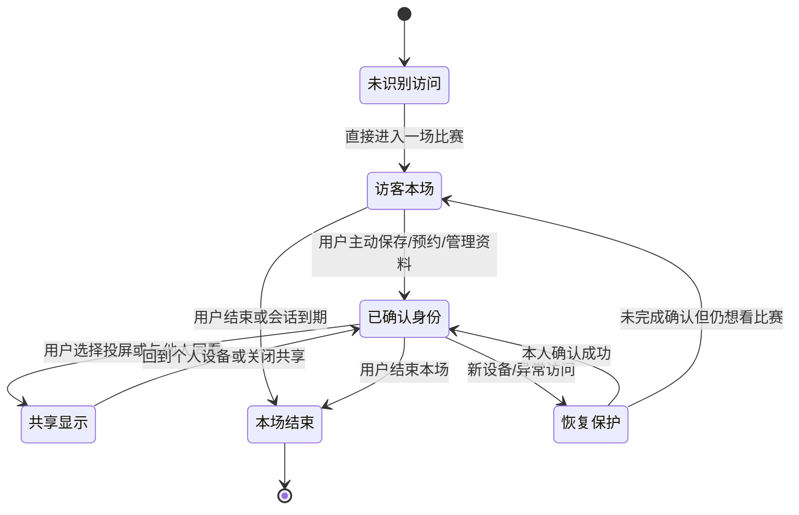
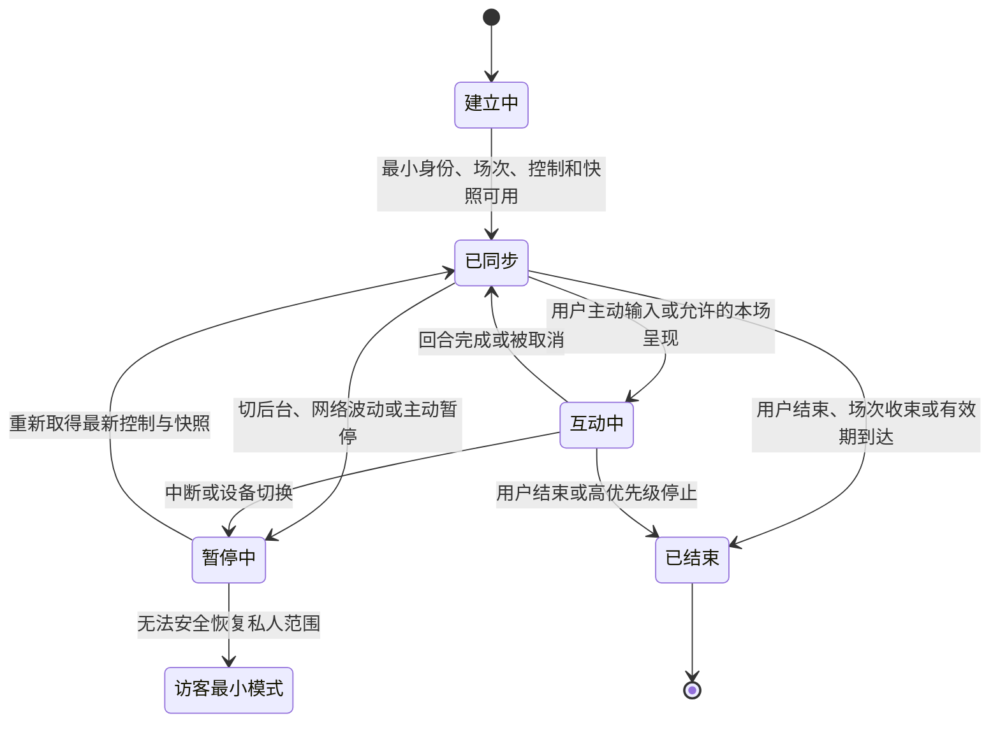
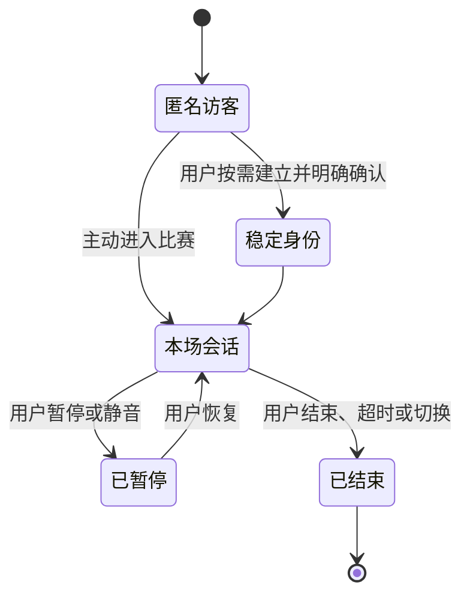

# 领域模型、身份与匿名会话

> 文档类型：0→1 陪看服务领域建模、身份边界与会话施工方案  
> 适用阶段：总体工程方案已确认后，先建立事实、用户资料和实时会话的共同语言与最小资料结构  
> 版本：0.1（实体字段、会话期限、身份确认方式、保留范围和容量阈值均为待验证假设）  
> 研究信息截止：2026-01-28  
> 核心原则：身份、会话、比赛事实、用户观察和用户资料必须是不同的领域对象。匿名访问是一条完整的本场路径；建立稳定身份只为用户主动管理连续性；任何输入都不能因“看起来可信”越过事实、权限或资料范围。

---

## 1. 施工目标与不可突破的边界

这一阶段建立陪看服务最底层的共同语言。若领域模型一开始把“用户说的话”“角色记住的事”“比赛发生的事”“设备正在看的会话”放入同一条泛化记录，后续再补权限、删除、更正和共享设备，只能不断打补丁。正确的起点是承认它们具有不同的拥有者、可信度、生命周期和用户影响。

本阶段的用户结果不是“有账户系统”，而是：用户可以作为访客进入一场比赛、调整本场控制、自然结束；当用户主动要求保存偏好、预约比赛或管理自己的资料时，才建立可管理的稳定身份；用户观察只影响自己的本场交流或触发保守等待；已确认比赛事实才可进入公开快照；删除、暂停和结束可以跨会话传播，不被迟到输入重新写回。

### 1.1 不可突破的领域约束

1. **事实与观察分离。** 用户观察、角色回复、社群传言和候选线索均不是公共比赛事实；
2. **会话与身份分离。** 一个访客会话可以存在但不自动产生跨场身份；稳定身份也不授权无限会话或无限设备；
3. **资料与关系分离。** 偏好和共同瞬间是用户可管理的资料，不是角色拥有的“关系资产”；
4. **控制优先。** 结束、安静、取消、仅文字、低动态和删除的状态高于待处理自动内容；
5. **最小披露。** 新设备、共享显示和身份恢复前，只展示完成当前任务所需的最少信息；
6. **版本优先。** 事实更正、删除、会话结束和用户控制以更晚的有效状态覆盖旧消息；
7. **可解释。** 每个高影响状态都能回答：谁拥有它、从何而来、用于什么、何时结束、用户怎样改变；
8. **不拟人化。** 领域字段不得保存角色是否“想念用户”“被冷落”“更亲密”等关系判断。

### 1.2 首轮不建的对象

- 不建用户情绪画像、依恋评分、活跃度人格、脆弱时刻清单；
- 不建从完整对话或原始音频自动抽取的长期“记忆”；
- 不建让用户端直接写入比赛比分、进球、判罚或公共事件的入口；
- 不建面向用户的关系等级积分、连续登录亲密度或付费亲密权益；
- 不建默认跨设备追踪、设备指纹画像或同看者身份推断；
- 不建将运营人员个人判断直接广播给用户的通道；
- 不建无法精确删除、无法解释来源或无法限制用途的通用资料桶。

---

## 2. 统一语言与边界上下文

工程团队、产品、运营和 AI Coding 助手必须使用同一套词。相同词在不同模块含义不同，是事实泄露、权限越界和删除失败的高发原因。本节定义首轮词汇；新任务若想复用同名词但改变含义，必须先更新决策账本和共享合同。

### 2.1 核心词汇

**术语：场次**
- **定义**：一场可被用户选择进入的比赛上下文
- **拥有者**：比赛域
- **不能被误认为**：用户会话或角色关系

**术语：比赛快照**
- **定义**：当前可公开使用的最小比赛状态
- **拥有者**：事实域
- **不能被误认为**：候选线索、用户观察或角色台词

**术语：事实事件**
- **定义**：经允许流程确认的比赛变化
- **拥有者**：事实域
- **不能被误认为**：用户输入、自动摘要或预测

**术语：候选事件**
- **定义**：尚未达到公开确认条件的事件线索
- **拥有者**：事实域的受限队列
- **不能被误认为**：已确认比分或可自动庆祝内容

**术语：用户观察**
- **定义**：用户在本场表达看到/认为的比赛内容
- **拥有者**：用户本场域
- **不能被误认为**：公共赛事事实或长期资料

**术语：身份主体**
- **定义**：可拥有跨场资料、授权和恢复能力的用户实体
- **拥有者**：身份域
- **不能被误认为**：真实姓名、社交账号或角色关系

**术语：访客主体**
- **定义**：仅在当前会话范围内的最小用户主体
- **拥有者**：会话域
- **不能被误认为**：没有权利的匿名流量

**术语：观看会话**
- **定义**：用户在一台设备、一个场次、一个时间范围内的陪看上下文
- **拥有者**：会话域
- **不能被误认为**：永久账户或完整历史

**术语：设备环境**
- **定义**：影响可见范围的本场条件，如共享显示、低动态、声音方式
- **拥有者**：会话域
- **不能被误认为**：用户的现实生活画像

**术语：偏好**
- **定义**：用户主动保存、可修改的服务选择
- **拥有者**：用户资料域
- **不能被误认为**：系统对用户人格的推断

**术语：共同瞬间**
- **定义**：用户主动保存的比赛相关简短摘要
- **拥有者**：用户资料域
- **不能被误认为**：角色私藏的回忆

**术语：授权**
- **定义**：用户或受限角色对一项具体动作的允许范围
- **拥有者**：权限域
- **不能被误认为**：一次登录后的永久总同意

**术语：删除请求**
- **定义**：用户要求停止某资料用途并完成处理的动作
- **拥有者**：隐私域
- **不能被误认为**：只把界面隐藏一下

**术语：运营动作**
- **定义**：受限人员对场次、候选、暂停或更正的操作
- **拥有者**：运营域
- **不能被误认为**：用户端可以直接调用的能力

### 2.2 四个边界上下文

**上下文：比赛事实**
- **解决的问题**：什么可以作为当前公开比赛状态
- **关键对象**：场次、快照、事件、候选、冲突、更正
- **明确不负责**：用户资料、角色关系、设备偏好

**上下文：身份与会话**
- **解决的问题**：谁在当前范围内做了什么、能否恢复
- **关键对象**：身份主体、访客、会话、设备环境、授权
- **明确不负责**：比赛结果、角色审美、运营裁量

**上下文：陪看编排**
- **解决的问题**：用户主动输入如何变成受控文本/声音/动作
- **关键对象**：回合、控制、呈现资格、事实引用
- **明确不负责**：写公共事实、保存敏感资料

**上下文：用户资料与隐私**
- **解决的问题**：用户明确保存什么、怎样暂停/删除/导出
- **关键对象**：偏好、提醒、共同瞬间、删除请求
- **明确不负责**：将所有本场输入升级为长期记录

跨上下文只传递明确定义的合同。例如，比赛事实域可向陪看编排提供“已确认快照与完整性标签”；编排层不可反向写入事件。身份与会话域可向资料域提供“这是谁、在什么范围内操作”；资料域不可借机读取完整设备历史。边界越早明确，AI Coding 越不容易为了方便跨模块取值。

---

## 3. 身份模型：访客完整可用，稳定身份按需建立

### 3.1 身份状态

> 信息卡：原宽表已改为纵向阅读，字段含义不变。

- **状态：未识别访问**
  - **用户可完成的任务**：看入口与公开赛程
  - **可拥有资料**：无个人资料
  - **进入条件**：打开服务
  - **离开条件**：进入访客会话或离开

- **状态：访客本场**
  - **用户可完成的任务**：进入比赛、看快照、改本场控制、主动对话、结束
  - **可拥有资料**：本场临时状态
  - **进入条件**：用户选择直接进入
  - **离开条件**：结束、过期或主动建立稳定身份

- **状态：已确认身份**
  - **用户可完成的任务**：管理偏好、提醒、共同瞬间、跨设备恢复
  - **可拥有资料**：用户主动保存的资料
  - **进入条件**：用户为明确任务完成身份确认
  - **离开条件**：注销、删除、访问异常或主动切回访客

- **状态：共享显示**
  - **用户可完成的任务**：使用本场公开能力
  - **可拥有资料**：仅低敏感本场状态
  - **进入条件**：用户主动选择或明确投屏
  - **离开条件**：结束共享、结束本场、切回个人设备

- **状态：恢复保护**
  - **用户可完成的任务**：在新设备上重新确认访问
  - **可拥有资料**：暂不展示私人资料
  - **进入条件**：用户发起恢复或发现异常
  - **离开条件**：确认后进入已确认身份，失败则回访客本场

身份状态面向用户的表达应短而准确：“访客本场”“已确认身份”“共享显示”“正在保护你的资料”。不要以“新球友”“老球友”“更亲密”等关系词替代状态名称。

### 3.2 身份主体概念结构

| 字段类别 | 需要表达什么 | 首轮约束 |
|---|---|---|
| 稳定标识 | 一个可管理、可恢复的主体 | 不直接等于真实姓名或外部账号资料 |
| 状态 | 正常、受限、注销处理中、需确认恢复 | 用户可看到影响和下一步 |
| 显示名 | 用户主动提供的本地称呼 | 可跳过、可改、默认不从外部资料导入 |
| 恢复方式 | 用户选择的确认能力 | 不强制绑定多个渠道，不在消息中暴露细节 |
| 创建/更新范围 | 何时建立、为何更新 | 只记录完成资料管理所需信息 |
| 隐私范围 | 哪些资料可在当前设备显示 | 共享与恢复前默认最小化 |

身份主体不保存“支持哪队”“喜欢哪位球员”“情绪如何”等内容；这些若由用户主动保存，应作为可独立删除的偏好。这样用户注销身份或删除偏好时，范围可清楚分开。

### 3.3 匿名访客的最小主体

访客需要一个短生命周期主体来保持本场控制、取消动作和安全边界，但它不应成为隐形跨场追踪器。访客主体只包含会话标识、必要的风险限制、当前场次范围和本场设置；会话结束或到期后，不把它自动关联到未来设备、提醒或角色记忆。用户若主动选择保存一项跨场偏好，先说明需要建立可管理身份，而不是悄悄把访客升级。

### 3.4 身份转换



转换的用户结果必须可解释：访客转已确认身份只新增用户明确选择的连续能力；切共享显示只收缩可见资料；恢复保护先隐藏私人资料；本场结束只停止本场，不自动保存、提醒或关系化追踪。

---

## 4. 权限与访问控制模型

### 4.1 动作分级

> 信息卡：原宽表已改为纵向阅读，字段含义不变。

- **等级：P0**
  - **动作**：看公开快照、结束本场、改安静/文字/低动态
  - **最低身份/角色**：访客或已确认本场
  - **资料范围**：当前场次
  - **用户端结果**：即时可完成

- **等级：P1**
  - **动作**：主动文字/语音输入、取消当前回合
  - **最低身份/角色**：当前会话
  - **资料范围**：当前回合
  - **用户端结果**：可取消、可改文字

- **等级：P2**
  - **动作**：保存一项偏好、预约单场、查看自己的资料
  - **最低身份/角色**：已确认身份
  - **资料范围**：自己的资料域
  - **用户端结果**：明确用途、范围与撤回

- **等级：P3**
  - **动作**：删除全部资料、导出资料、变更恢复方式
  - **最低身份/角色**：更强本人确认
  - **资料范围**：自己的高影响资料
  - **用户端结果**：说明影响、提供帮助

- **等级：P4**
  - **动作**：录入候选、发布/更正公共事件、暂停自动呈现
  - **最低身份/角色**：受限运营角色
  - **资料范围**：指定场次与职责范围
  - **用户端结果**：用户端不直接拥有

- **等级：P5**
  - **动作**：查看受限安全线索或执行重大处置
  - **最低身份/角色**：受限且独立复核
  - **资料范围**：最小必要范围
  - **用户端结果**：不向普通用户端暴露

“已确认身份”不是 P4 或 P5 的依据；用户身份只允许用户管理自己的资料和本场体验。运营角色也不能通过 P4 获得 P2 的私人资料访问权。

### 4.2 授权合同

每个需要授权的动作包含主体、动作、对象、范围、有效期、来源和撤回状态。例如“用户允许本场自动声音”只对当前会话、当前声音方式有效；“用户预约某场提醒”只对指定比赛与时间有效；“运营人员可发布候选事件”只对指定场次、指定职责与班次有效。授权不可因相同名称被扩大到其它场次、设备或资料。

### 4.3 共享设备规则

共享显示状态是设备环境，不是身份切换。进入共享显示后，协议和资料查询默认只返回比赛快照、本场控制与低敏感状态；共同瞬间、偏好摘要、提醒正文、显示名称和恢复信息均隐藏。用户在个人设备上仍可管理资料，但大屏不应因为同一身份登录就自动显示私人内容。

### 4.4 权限失败结果

权限失败应保留最低可用体验：新设备未确认时可作为访客进入；删除高影响资料需再确认时可先查看说明；语音权限未开启时可继续文字；运营角色缺少发布权时可创建草稿或请求复核。失败文字说明保护目的与下一步，不能使用羞辱、威胁或角色化挽留。

---

## 5. 会话状态与并发规则

### 5.1 会话概念结构

| 字段类别 | 作用 | 规则 |
|---|---|---|
| 会话标识 | 区分一次本场上下文 | 不被用作跨场追踪依据 |
| 主体引用 | 指向访客主体或已确认身份 | 只表达授权主体，不携带完整资料 |
| 场次引用 | 限定可见比赛范围 | 不允许跨场写事实或资料 |
| 设备环境 | 共享显示、声音、低动态、输入方式等 | 本场优先，可随时改变 |
| 会话状态 | 建立、同步、互动、暂停、结束 | 结束后拒绝自动呈现和新写入 |
| 控制版本 | 安静、仅文字、暂停自动表达等 | 更晚有效控制覆盖较早指令 |
| 活动边界 | 开始、最后活动、结束/到期条件 | 不用离开时长制造关系语言 |
| 安全范围 | 当前可用能力和限制 | 仅最小必要，不作为用户画像 |

### 5.2 会话状态机



“暂停中”并不是允许后台继续累积角色台词、语音或资料写入的状态。恢复时先同步最新用户控制和已确认快照；已取消、已删除或已结束的回合绝不重放。

### 5.3 并发与冲突



同一身份可在多个设备有多个本场，但每个会话都有独立设备环境。用户在设备 A 选安静不必改变设备 B 的当场声音，除非用户明确选择跨设备同步本场控制；跨场偏好属于资料域，需单独保存。删除一项跨场资料、取消提醒、注销身份和结束指定会话等高影响动作必须传播到相关范围，并用版本防止旧设备回写旧状态。

| 冲突 | 规则 | 用户可见结果 |
|---|---|---|
| 同一设置在两端不同 | 最近的明确本场选择优先于旧默认 | 各设备显示自己的本场模式 |
| 一端删除资料，另一端恢复 | 删除状态优先 | 另一端停止引用并显示已更新 |
| 一端结束本场，另一端仍在线 | 只结束指定会话，除非用户选择全部结束 | 另一端不被误伤，但不播放已取消回合 |
| 共享显示与个人模式并存 | 共享环境优先收缩资料 | 大屏不显示私人内容 |
| 旧消息迟到 | 依据会话/控制/资料版本丢弃 | 用户不被旧声音、旧提醒打扰 |

---

## 6. 比赛事实、观察与资料模型

### 6.1 事实事件结构

| 字段类别 | 作用 | 约束 |
|---|---|---|
| 场次与事件标识 | 识别归属与更正对象 | 不用自然语言文本作唯一标识 |
| 比赛时间 | 表示发生在比赛中的位置 | 不等同网络到达时间 |
| 事件类型与参与对象 | 描述可确认的最小事实 | 不写动机、人格评价或未证实原因 |
| 事实状态 | 草稿、待复核、已确认、冲突、更正、撤回 | 用户端按状态决定是否可作结论 |
| 状态版本 | 表示最新有效变化 | 较旧内容不能覆盖更正 |
| 来源类别 | 说明信息质量路径 | 不公开无关内部细节或私人来源 |
| 更正关系 | 指向被替代/撤回的对象 | 用户端可给出最小前后说明 |

比分是快照的一个投影，不是由角色文本、用户观察或缓存拼凑。非进球事件不可随意改变比分；冲突状态下保持等待与最小已知状态，不让自动呈现替用户作判断。

### 6.2 用户观察结构

用户观察只服务本场：关联会话、关联场次、用户主动输入、提交时间、处理状态和是否需要等待。它可以让角色回答“先等等，我还没有看到确认”，也可以让用户自己回看本场输入；但不得成为公共事件、不得被其它用户看见、不得默认跨场保存、不得被运营人员当作可识别线索浏览。

### 6.3 用户资料结构

**资料对象：偏好**
- **最小字段**：内容、来源、用途、范围、状态、更新时间
- **生命周期**：用户保存至修改/暂停/删除
- **特别约束**：只描述选择，不描述人格

**资料对象：共同瞬间**
- **最小字段**：用户指定摘要、关联比赛、用途、范围、状态
- **生命周期**：用户主动保存至删除
- **特别约束**：不保存角色感受或用户脆弱内容

**资料对象：单场提醒**
- **最小字段**：指定场次、时间、渠道、许可、状态
- **生命周期**：到期/取消后失效
- **特别约束**：不扩展至类似比赛催回

**资料对象：本场临时状态**
- **最小字段**：声音、动态、密度、对话偏好
- **生命周期**：本场结束后收束
- **特别约束**：不自动跨场写入

**资料对象：删除请求**
- **最小字段**：对象、范围、发起时间、处理状态、结果
- **生命周期**：完成后保留最少处理说明
- **特别约束**：删除处理中即停止引用

### 6.4 资料删除传播

删除不是一条孤立动作。它需要从资料域传播到默认入口、角色召回、提醒、跨设备恢复、共享显示缓存和用户端可见摘要。处理状态至少分为“请求已收到”“停止引用”“处理完成/需帮助”。在最终完成前也必须停止新的引用，不能以“还没物理清理完”为由继续使用。

---

## 7. 数据库概念与一致性策略

本节给出逻辑资料结构，不绑定具体语法。表/集合名称可以调整，但外键/关联、状态版本、拥有者和保留范围必须保留。工程人员不得为赶工把事实、资料、会话和运营日志塞进一张万能记录。

### 7.1 核心逻辑集合

**集合：identity_subject**
- **主要职责**：稳定身份主体与状态
- **关键关联**：关联资料、授权、会话
- **保留与访问原则**：不保存无关画像

**集合：guest_subject**
- **主要职责**：访客最小主体
- **关键关联**：关联短会话
- **保留与访问原则**：会话收束后不自动跨场关联

**集合：viewing_session**
- **主要职责**：当前场次与设备环境
- **关键关联**：关联主体、场次、控制版本
- **保留与访问原则**：结束后拒绝自动呈现

**集合：match**
- **主要职责**：场次元信息
- **关键关联**：关联快照与事件
- **保留与访问原则**：与用户资料分离

**集合：match_snapshot**
- **主要职责**：当前公开最小状态
- **关键关联**：由有效事实事件投影
- **保留与访问原则**：版本化、可重建

**集合：match_event**
- **主要职责**：候选/确认/更正事件
- **关键关联**：关联场次和更正关系
- **保留与访问原则**：不由用户端直接写入

**集合：user_observation**
- **主要职责**：用户本场观察
- **关键关联**：关联会话和场次
- **保留与访问原则**：不升级公共事实

**集合：preference**
- **主要职责**：用户明确选择
- **关键关联**：关联身份与用途范围
- **保留与访问原则**：可暂停、删除、解释

**集合：reminder**
- **主要职责**：单场许可
- **关键关联**：关联身份与场次
- **保留与访问原则**：到期/取消停止触达

**集合：memory_item**
- **主要职责**：用户主动共同瞬间
- **关键关联**：关联身份与比赛
- **保留与访问原则**：严格最小化与删除

**集合：deletion_request**
- **主要职责**：高影响删除处理
- **关键关联**：关联资料对象与状态
- **保留与访问原则**：停止引用优先

**集合：authorization_grant**
- **主要职责**：授权范围
- **关键关联**：关联主体、动作、对象
- **保留与访问原则**：有效期、撤回、最小范围

**集合：operator_action**
- **主要职责**：受限运营动作
- **关键关联**：关联场次与职责
- **保留与访问原则**：不存无关私人资料

### 7.2 一致性原则

1. **事实投影可重建。** 快照应能从有效事件和更正关系得出，不能只依赖某次角色回复；
2. **资料写入原子化。** 一项偏好/提醒/共同瞬间在确认后才可见，删除请求先停止引用再完成处理；
3. **状态版本单调增加。** 事件更正、会话控制和资料状态只接受更晚的有效版本；
4. **跨域异步但保守。** 无法立即同步删除或结束时，消费方先停止引用，不继续沿用旧值；
5. **操作可去重。** 高影响用户动作带操作标识，重试不产生多条资料或提醒；
6. **访问按拥有者过滤。** 查询先判定主体、会话和环境范围，再返回最少字段；
7. **日志不替代资料。** 运行记录不能成为绕过用户删除、偏好范围或共享设备限制的后门。

### 7.3 保留与清理

不同集合需要不同的生命周期：访客会话和本场临时状态短；比赛事实按业务与公开资料规则管理；用户偏好、提醒和共同瞬间由用户控制；删除请求保留最少处理结果；受限运营动作按责任与适用要求保留。任何保留期限都应有用户可理解的说明和定期复核，不以“以后也许有用”作为长期保存理由。

---

## 8. 接口合同与错误语义

### 8.1 资源动作表

> 信息卡：原宽表已改为纵向阅读，字段含义不变。

- **资源：本场会话**
  - **动作**：开始
  - **前置条件**：可进入场次
  - **成功结果**：返回最小身份、控制、快照
  - **失败/收敛结果**：说明不可用，保留返回/访客路径

- **资源：本场控制**
  - **动作**：更新安静/文字/动态
  - **前置条件**：有效会话
  - **成功结果**：新版本立即生效
  - **失败/收敛结果**：不改其它设置，说明可重试

- **资源：对话回合**
  - **动作**：提交/取消
  - **前置条件**：有效会话与用户主动输入
  - **成功结果**：生成当前回合结果/已取消
  - **失败/收敛结果**：取消后无迟到呈现

- **资源：比赛快照**
  - **动作**：查询
  - **前置条件**：场次可见
  - **成功结果**：返回已确认状态与完整性
  - **失败/收敛结果**：返回等待/最小已知状态

- **资源：用户观察**
  - **动作**：提交
  - **前置条件**：有效本场
  - **成功结果**：仅进入本场处理
  - **失败/收敛结果**：不写公共事实，不跨场保存

- **资源：偏好/共同瞬间**
  - **动作**：保存/改写/暂停/删除
  - **前置条件**：已确认身份与用户明确动作
  - **成功结果**：返回用途、范围、状态
  - **失败/收敛结果**：继续本场临时选择或停止引用

- **资源：提醒**
  - **动作**：创建/取消
  - **前置条件**：已确认身份与指定场次
  - **成功结果**：返回单场许可状态
  - **失败/收敛结果**：不影响其它提醒

- **资源：身份恢复**
  - **动作**：发起/确认
  - **前置条件**：用户主动请求
  - **成功结果**：恢复用户选择范围
  - **失败/收敛结果**：回访客最小模式，不展示私人资料

### 8.2 错误分类

错误返回使用用户影响分类，而非把内部故障原样显示。每个错误包含短说明、是否可重试、是否已保守收敛、用户仍能做什么和帮助入口。

| 分类 | 用户语言 | 必须保证 |
|---|---|---|
| 身份需确认 | “为保护你的资料，请确认这次访问；你仍可先用本场。” | 不预览私人资料 |
| 会话已结束 | “本场陪看已结束。” | 不再送出旧声音/动作/自动回合 |
| 状态等待 | “这项比赛信息还在确认中。” | 不把候选显示为结论 |
| 操作处理中 | “这项选择正在更新，暂不会再被引用。” | 删除/暂停先停止使用 |
| 操作未完成 | “没有自动改动其它选择。” | 不产生部分未知副作用 |
| 无权访问 | “此设备暂不能查看这项私人资料。” | 保留访客最小路径 |
| 环境受限 | “声音暂不可用，文字仍可使用。” | 提供替代，不逼用户离开 |

### 8.3 幂等合同

保存、删除、取消提醒、结束本场、提交报告和恢复身份等动作必须含唯一操作标识和目标范围。重复提交返回同一最终状态，而不是执行第二次副作用。前端在本地先显示“处理中”，服务端确认后更新“完成/失败”；超时或重连不让用户猜是否该再点一次。

---

## 9. 精确 AI 提示词与施工任务

### 9.1 领域施工提示词

```text
[ROLE]
你是领域施工助手，只在允许模块内工作。先阅读统一语言、状态机、资料范围和接口合同。

[GOAL]
完成一个可观察的用户结果，例如：访客可结束本场，结束后不再接收自动呈现。

[SCOPE]
允许改变：身份与会话领域、共享合同、对应场景。
禁止改变：公共事实写入、跨场资料范围、运营权限、角色关系规则。

[INVARIANTS]
用户观察不写公共事实；结束/删除/取消优先；访客不自动升级；共享显示不返回私人资料；旧版本不可覆盖新状态。

[CONTRACT]
列出输入、状态、输出、错误、操作标识、版本和回退条件。

[ACCEPTANCE]
列出访客进入/结束、访客保存偏好、共享设备、重连、删除传播、重复请求、未知身份等情境。

[COMMANDS]
运行格式、静态检查、领域验证、合同验证和场景报告命令。

[STOP]
若需要新增资料字段、扩大身份授权、改变事实门槛或无法明确删除传播，立即停下并提出决策问题。
```

### 9.2 提示词反例与修正

| 模糊说法 | 风险 | 精确改写 |
|---|---|---|
| “加匿名登录” | 模型可能生成永久追踪或弱权限 | “创建仅限本场的访客主体；结束后不跨场关联；保存资料时才邀请身份确认” |
| “做用户记忆” | 容易收集完整对话和情绪 | “仅保存用户主动选择的文字偏好；展示用途/范围；删除先停止引用” |
| “把比赛实时同步” | 可能把候选和观察当事实 | “快照只来自已确认事件；等待/冲突保留状态标签；用户观察只在本场使用” |
| “支持多设备” | 可能泄露资料或互相覆盖 | “新设备先最小模式；共享显示隐藏私人资料；删除状态优先传播” |
| “处理异常” | 结果不可审阅 | “身份未确认时可访客进入；结束后拒绝迟到回合；操作失败不改其它设置” |

### 9.3 任务拆分顺序

1. 固化统一语言、状态机和实体关系；
2. 建立访客主体、场次会话、控制版本与结束规则；
3. 建立身份主体、资料对象、授权和删除请求；
4. 建立事实事件、快照投影、用户观察隔离；
5. 建立接口合同、错误语义、操作去重和版本；
6. 加入共享设备、恢复和跨设备删除传播；
7. 通过场景验证后，才让对话、声音和角色编排消费这些边界。

每一步合入前都能独立说明用户结果和回退方式。不要在同一任务里既建立身份、又接入语音、又做角色记忆和运营权限；那会让任何失败都无法定位。

---

## 10. 施工命令、变更提交与验证

### 10.1 候选命令序列

以下命令为从空工作区开始的候选名称，最终在工程启动时固定为团队统一入口：

```bash
make bootstrap-domain
make format
make static-check
make verify-domain
make verify-contracts
make scenario-guest-session
make scenario-identity-recovery
make scenario-delete-propagation
make scenario-shared-display
make scenario-fact-correction
make readiness-domain
```

若使用 Go/Dart 工具链，可在统一入口内部调用：

```bash
go test ./...
go vet ./...
flutter analyze
flutter test
```

命令的价值在于可重复，而不是为了展示工具数量。每个命令必须输出可理解结果：哪些场景成立、哪些被跳过、失败影响哪个用户结果、是否允许继续演练。不得把真实用户资料、真实音频或生产密钥作为本地命令的输入。

### 10.2 变更提交说明

每个提交只覆盖一个可审阅的用户结果。例如：“让访客结束后拒绝迟到自动回合”“让删除偏好先停止跨设备引用”“让共享显示只取得公开快照”。提交说明写清允许范围、合同变化、已运行验证、已知风险和回退动作。不要以“身份优化”“领域重构”“助手改动”这种无法判断用户影响的标题提交。

### 10.3 审阅清单

审阅者依次核对：实体是否混淆事实、观察和资料；访客是否完整可用；保存是否确由用户发起；权限是否最小；会话结束是否优先；删除是否跨范围传播；共享显示是否保守；错误是否用户可理解；重复动作是否单次生效；命令与场景证据是否真实覆盖任务。任何一项不清楚，退回任务契约，不让“之后再补”进入演练主线。

---

## 11. 验收情境、指标与风险

### 11.1 必过情境

| 情境 | 预期结果 | 不可接受结果 |
|---|---|---|
| 访客进入并结束 | 不注册也可调整本场并自然结束 | 结束后仍自动发声或被催注册 |
| 访客想保存偏好 | 清楚说明需建立可管理身份，可选择不保存 | 静默升级身份或保存全部对话 |
| 用户观察进球 | 保持本场等待，不写公共比分 | 立即给其它用户改比分或角色庆祝 |
| 事件更正 | 快照、时间线与角色事实引用以新状态为准 | 旧事件继续被引用或静默消失 |
| 共享设备 | 只见公开状态和本场低敏感控制 | 共同瞬间、提醒、称呼或资料泄露 |
| 新设备恢复失败 | 可继续访客本场，不显示私人资料 | 为恢复方便先预览旧资料 |
| 删除偏好 | 立即停止引用，下一场不再默认使用 | 删除后仍出现旧设置或提醒 |
| 重复提交 | 同一保存/取消/结束只生效一次 | 多条偏好、多个提醒或多轮结束提示 |
| 用户改安静后重连 | 恢复安静和最新快照 | 重播旧声音或恢复热闹模式 |

### 11.2 候选指标

| 指标 | 定义 | 用于判断什么 |
|---|---|---|
| 访客任务完成率 | 访客完成进入、控制、结束的比例 | 匿名路径是否真实完整 |
| 身份范围理解率 | 用户能说明访客/已确认/共享差异的比例 | 身份语言是否可理解 |
| 事实隔离率 | 用户观察从未进入公共快照的比例 | 事实边界是否稳固 |
| 删除后不再引用率 | 已删除资料在所有后续入口不再出现的比例 | 资料控制是否可信 |
| 结束兑现时间 | 用户结束到自动内容停止的时间 | 会话控制优先性 |
| 共享保护率 | 共享环境未展示私人资料的比例 | 最小披露是否成立 |
| 重复操作单次生效率 | 重试不会制造额外副作用的比例 | 去重合同是否可靠 |
| 恢复保守率 | 新设备未确认时不显示私人内容的比例 | 恢复流程是否安全 |
| 关系压力事件率 | 用户因未登录/删除/离开感到内疚的事件数 | 身份与资料文案是否越界 |

### 11.3 风险与回退

| 风险 | 早期信号 | 回退动作 |
|---|---|---|
| 访客被隐形追踪 | 本场结束后仍出现跨场个性化 | 停止访客连续性，清理不必要关联 |
| 事实与观察混淆 | 用户输入改变公开快照 | 暂停观察消费，恢复只读事实投影 |
| 删除不完整 | 其它设备仍引用已删资料 | 停止跨设备召回，优先传播删除状态 |
| 身份恢复泄露 | 新设备预览私人内容 | 回退为访客最小模式，收缩恢复字段 |
| 权限膨胀 | 一次确认后获得无关能力 | 拆分授权，撤回超范围默认 |
| 会话旧内容复活 | 重连后播放已取消声音 | 停止回合重放，修复版本/取消规则 |
| 资料结构万能化 | 越来越多无关字段被塞入资料对象 | 拒绝字段，新增前回到决策卡 |

### 11.4 放行门槛

只有同时满足以下条件，才允许上层对话、语音、记忆和导演能力依赖本领域：统一语言无冲突；访客本场完整；身份建立由用户任务触发；事实/观察隔离；删除先停止引用；共享显示最小化；会话结束与取消优先；高影响动作可去重；错误可说明且保留最低可用路径；核心情境有可重复证据。

---

## 12. 领域变更兼容纪律

领域对象一旦被多个模块依赖，新增字段或状态时必须先问：旧会话怎样理解？旧用户端是否会误把未知字段当作事实？删除、结束、共享显示和访客范围是否仍安全？首轮原则是新增字段默认可忽略、关键语义改变必须显式版本化、无法理解的内容宁可收缩为最小状态，也不做猜测性展示。

例如，为偏好增加新用途不能使旧端突然出现自动提醒；为会话增加设备信息不能使共享显示获得私人资料；为事实事件增加来源说明不能让用户端暴露内部候选。每一次领域变更都要同时更新任务契约、场景、错误语义和回退说明；否则不允许合入共享合同。

---

## 13. 公开研究参考

以下公开资料用于形成领域建模、数字身份、会话、访问控制、资料最小化、接口安全与用户研究的方法。它们不代替本服务的场景证据；具体字段、保留期限、确认强度和权限范围仍需依产品决策与适用规则调整。

- **R1. Eric Evans，*Domain-Driven Design Reference*。边界上下文、统一语言和聚合建模参考。访问日：2026-01-28** [链接](https://www.domainlanguage.com/ddd/reference/)
- **R2. NIST，身份识别指南。身份确认、风险和隐私原则参考。访问日：2026-01-28** [链接](https://pages.nist.gov/800-63-4/)
- **R3. NIST，*Privacy Framework*。资料最小化、用途和用户控制参考。访问日：2026-01-28** [链接](https://www.nist.gov/privacy-framework)
- **R4. OWASP，*Authorization Cheat Sheet*。最小权限、访问控制与职责分离参考。访问日：2026-01-28** [链接](https://cheatsheetseries.owasp.org/cheatsheets/Authorization_Cheat_Sheet.html)
- **R5. OWASP，*Session Management Cheat Sheet*。会话生命周期、退出和恢复边界参考。访问日：2026-01-28** [链接](https://cheatsheetseries.owasp.org/cheatsheets/Session_Management_Cheat_Sheet.html)
- **R6. OWASP，*API Security Top 10*。资源授权、资料暴露与操作去重风险参考。访问日：2026-01-28** [链接](https://owasp.org/www-project-api-security/)
- **R7. UK Information Commissioner’s Office，*Data minimisation*。最小资料与用途限制参考。访问日：2026-01-28** [链接](https://ico.org.uk/for-organisations/uk-gdpr-guidance-and-resources/data-protection-principles/a-guide-to-the-data-protection-principles/data-minimisation/)
- **R8. GOV.UK Service Manual，*User research*。在真实任务中研究身份摩擦、理解和退出的方法参考。访问日：2026-01-28** [链接](https://www.gov.uk/service-manual/user-research)
- **R9. NIST，*AI Risk Management Framework*。人机透明、风险与用户主权参考。访问日：2026-01-28** [链接](https://www.nist.gov/itl/ai-risk-management-framework)
- **R10. 国家互联网信息办公室，《生成式人工智能服务管理暂行办法》。公众生成式服务的用户权益与治理边界参考。访问日：2026-01-28** [链接](https://www.cac.gov.cn/2023-07/13/c_1690898326795531.htm)
