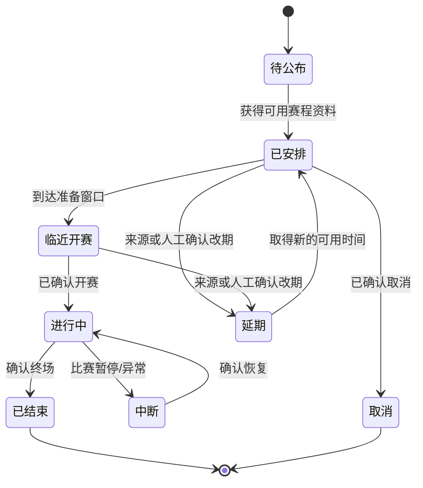
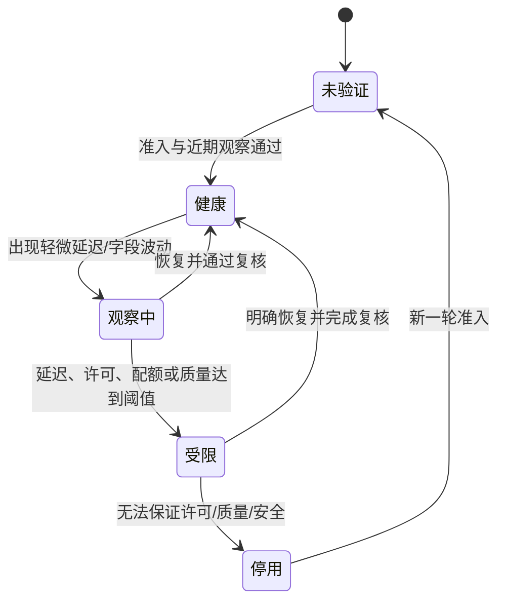
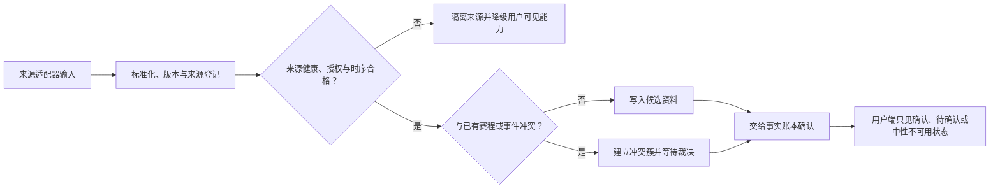

# 赛事数据接入、赛程与来源管理

> 文档类型：0→1 赛事资料适配、赛程、来源治理与事实输入施工方案  
> 适用阶段：领域模型、身份与匿名会话已建立后，为用户端提供可解释的比赛可用性与受控事实候选  
> 版本：0.1（数据供应商、覆盖范围、刷新频率、许可条件、健康阈值和降级策略均为待验证假设）  
> 研究信息截止：2026-01-28  
> 核心原则：外部赛事资料是有质量差异、许可边界和延迟风险的输入，不是可直接播报的终极真相。系统先治理来源、标准化身份、记录时间与质量，再将满足条件的最小事实送入确认流程；来源异常时宁可保留已确认快照与等待说明，也不让角色猜测、补全或把用户观察写成公开状态。

---

## 1. 施工目标与数据边界

用户需要知道今天有哪些可看的比赛、某场是否已开始、当前可确认的比分与事件是否可靠、为什么某项状态在等待或被更正。工程目标不是“抓到越多足球资料越好”，而是建立一条从来源发现、许可核验、适配、规范化、候选、复核、快照、用户端解释到异常降级的受控路径。

首轮至少支持：赛程发现、场次可用性、双方与开赛时间、比赛阶段、最小比分/事件候选、来源健康、冲突识别、延迟/中断降级。所有能力都要接受用户端事实模型约束：用户观察不是来源；角色文本不是来源；候选不是已确认；来源先到不等于可以更早发布。

### 1.1 资料输入的非目标

- 不通过未经许可的抓取、绕过访问限制或不清楚权利的方式获取赛事内容；
- 不将完整转播画面、解说音频、直播聊天室、社交帖子或用户私聊当作默认资料来源；
- 不把用户“我看到了进球”的说法升级为公共比分、事件或自动庆祝；
- 不把单一供应商的未确认/冲突内容直接交给角色做事实断言；
- 不因缺少实时资料而让角色编造比赛进程、球员、判罚、战术或比分；
- 不将来源账号、密钥、配额、合同价格或内部运维细节暴露给用户端；
- 不以“覆盖更多联赛”为理由忽视许可、时区、球队标识、取消/延期和更正处理；
- 不将来源健康或用户观看热度用于推断用户喜好、情绪、消费能力或关系强度。

### 1.2 输入分层

**输入层：公共静态资料**
- **例子**：赛事名称、赛季、球队标准名称、已公布赛程
- **可用于什么**：赛程浏览、场次创建、预先准备
- **不可用于什么**：实时比分、即时角色反应

**输入层：授权动态资料**
- **例子**：状态、比分、事件、阵容等可用更新
- **可用于什么**：候选事件、确认流程、最新快照
- **不可用于什么**：直接跳过冲突/更正门禁

**输入层：受限人工资料**
- **例子**：导演台按职责录入并复核的候选
- **可用于什么**：对照、等待、受控发布
- **不可用于什么**：替代用户控制或读取私人内容

**输入层：用户本场观察**
- **例子**：用户主动描述自己看到的内容
- **可用于什么**：本场对话、等待提示
- **不可用于什么**：公共事实、其它用户提示、长期记忆

**输入层：生成内容**
- **例子**：角色短反应、摘要、解释
- **可用于什么**：已确认事实的表达
- **不可用于什么**：事实来源、事件写入、比分计算

---

## 2. 来源治理与供应商准入

### 2.1 来源登记卡

任何新增资料来源先建立登记卡，再允许适配器发出候选。登记卡至少包含：来源名称与主体、资料类型、覆盖赛事/地区、更新方式、许可与使用限制、允许展示范围、个人资料影响、可用性假设、延迟特征、变更通知方式、联系人/支持通道、替代或关闭策略。

| 维度 | 必答问题 | 不通过时 |
|---|---|---|
| 权利与许可 | 能否用于陪看、展示、衍生表达和保存？ | 不接入或只使用公开静态资料 |
| 资料范围 | 提供赛程、比分、事件还是媒体内容？ | 收缩适配器到允许范围 |
| 时效与更正 | 更新延迟、撤销、校正如何传达？ | 不承担实时事实职责 |
| 稳定性 | 高峰、比赛中断、限流、维护时会怎样？ | 设计降级和备用来源 |
| 标识一致性 | 赛事、球队、球员、场次能否稳定匹配？ | 先完成映射与人工确认 |
| 隐私 | 是否需要发送用户身份、对话或设备信息？ | 默认禁止或最小化后再审查 |
| 安全 | 凭据、传输、访问与配额如何保护？ | 不进入演练环境 |
| 可解释性 | 用户端能否以最小语言说明资料状态？ | 仅用于内部候选，不直接呈现 |

准入不是一次性勾选。许可、字段、延迟、服务条款和覆盖范围发生变化时，来源自动回到复核状态；在重新确认前，相关自动呈现收缩为已确认快照、文字说明或关闭。

### 2.2 来源等级

**等级：S0 未准入**
- **适用条件**：许可/质量/安全未明确
- **可影响的状态**：无
- **限制**：不进入候选队列

**等级：S1 静态准入**
- **适用条件**：只适合赛程和公开元信息
- **可影响的状态**：场次发现、赛前入口
- **限制**：不用于实时事件

**等级：S2 候选准入**
- **适用条件**：可提供动态线索但尚需对照/复核
- **可影响的状态**：候选、等待、健康观察
- **限制**：不直接形成确认快照

**等级：S3 受控事实准入**
- **适用条件**：质量、许可、更正和可解释路径已验证
- **可影响的状态**：经规则/复核后的确认事实
- **限制**：冲突时仍必须收缩

**等级：S4 备用来源**
- **适用条件**：用于持续性和对照，不承担单独断言
- **可影响的状态**：健康评估、候选比对
- **限制**：不可因“备用”绕过更严格门槛

来源等级描述“可用范围”，不是对供应商作永久价值判断。一个来源可在静态赛程上属于 S1，在实时比分上只属于 S2；同一来源在不同联赛、地区或时段也可有不同等级。

### 2.3 供应商隔离

每个适配器只获得它完成查询所需的场次标识和最少上下文。用户身份、偏好、共同瞬间、原始语音、私聊和设备资料不能作为赛事查询参数。若供应能力要求发送超出任务必要的资料，先暂停接入并进行隐私/合同复核，不以“个性化更准”为由扩大传递。

---

## 3. 赛程模型与时区治理

赛程不是一张固定表。比赛可能未定、改期、取消、延后、腰斩、进入加时或点球；用户与来源可能处于不同时区；同一球队名称可能在不同赛事中重名。赛程模型必须把“原定何时”“目前何时”“状态是否可靠”分开，避免用户端把旧时间当作当前承诺。

### 3.1 场次概念结构

| 字段类别 | 作用 | 规则 |
|---|---|---|
| 标准场次标识 | 跨来源匹配同一场比赛 | 不用球队名称和时间拼接作唯一识别 |
| 赛事与赛季 | 定位比赛所属范围 | 允许多来源映射，避免文本歧义 |
| 主客队标识 | 表达双方与主客关系 | 使用标准球队实体，不从角色文本推断 |
| 原定开球时间 | 保留首次已知安排 | 不覆盖后续改期记录 |
| 当前计划时间 | 用户端赛程显示的候选时间 | 带来源、更新时间和可靠程度 |
| 场次状态 | 未开始、进行中、中断、结束、取消、延期等 | 只由受控资料/人工流程改变 |
| 时间区与展示规则 | 让用户看到本地可理解时间 | 原始时间、时区和转换结果可追溯 |
| 可用性 | 当前是否可提供陪看 | 与资料健康、运营准备和用户端能力关联 |

### 3.2 赛程状态机



用户端的“即将开始”只使用当前计划时间和明确可用性；改期/取消时，原定时间不可静默覆盖。用户若预约一场比赛，需要看到“时间已变化”并能选择保留、修改或取消，不以角色名义催促接受新安排。

### 3.3 时区与夏令时

所有资料在存储时保留原始来源时间、原始时区和统一时间基准；展示时根据用户选择或设备环境转换。无法确定时区时不显示精确倒计时，改为“时间待确认”或要求用户主动选择。夏令时切换、跨国赛事和数据源缺失时区是首轮必须演练的异常，不能假设“北京时间”或设备时钟永远正确。

### 3.4 赛程刷新策略

赛程刷新按风险分级：临近比赛的时间、取消/延期和可用性优先于很久以后的赛程详情；发生异常时，不必频繁刷新所有用户端，但应在用户主动打开或已预约范围内提供清楚更新。刷新失败时保留上次已确认信息，并标记更新时间；不要用旧时间触发新的自动提醒。

---

## 4. 适配器与规范化层

适配器将各来源的格式、命名、状态和错误转为内部共同合同。它的职责是保留来源差异、拒绝不完整资料、输出最小候选；不是替来源猜字段、补比分或把异常“修好看”。所有来源特有内容在规范化前被隔离，用户端和角色不直接依赖某个供应商格式。

### 4.1 适配器合同

**输入：来源响应与查询上下文**
- **输出**：赛程候选、场次状态候选、事件候选、健康事件
- **必须保留**：来源标识、获取时间、原始时间、许可等级、质量标签
- **必须拒绝/标记**：无法匹配场次、缺少关键时间、字段自相矛盾

**输入：来源错误/限流/超时**
- **输出**：来源健康状态
- **必须保留**：错误类别、影响范围、最后成功时间
- **必须拒绝/标记**：将错误转成比赛事实或角色台词

**输入：来源更正/撤销**
- **输出**：更正候选与关联关系
- **必须保留**：被替代对象、版本、时间
- **必须拒绝/标记**：静默覆盖旧事件

适配器输出不等于“可发布”。它只表示“有一条结构化候选，知道来自哪里、何时得到、缺什么、能否进入下一层”。下一层负责规则、对照、复核和用户端影响。

### 4.2 标准化规则

| 对象 | 需要统一的内容 | 风险控制 |
|---|---|---|
| 赛事 | 赛事名称、赛季、地区、级别 | 同名赛事不可仅凭文本匹配 |
| 球队 | 标准标识、历史名称、缩写、主客关系 | 不将昵称/简称直接当唯一键 |
| 球员 | 标准标识、球队归属、赛季/场次关系 | 避免同名球员混淆与跨队错误 |
| 场次 | 标准场次标识、双方、时间、赛事 | 改期后仍保持同一场次关系 |
| 事件 | 类型、比赛时间、参与者、状态、版本 | 事件时间不等于到达时间 |
| 比分 | 主队/客队各自数值与投影版本 | 不由非进球事件或文本摘要修改 |
| 状态 | 未开始/进行中/中断/结束/取消等 | 明确映射来源特有枚举与未知值 |

标准化过程必须保留“未知/无法映射”作为有效结果。将未知强行映射到最相近球队、状态或事件会让后续角色以自信语气传播错误。未知时应进入候选异常队列，用户端最多看到可理解的等待/不可用说明。

### 4.3 映射版本与人工确认

球队、赛事和来源字段映射需要版本化。更改映射后，不应悄悄把历史场次、提醒或偏好重新指向另一个对象；高影响映射先在演练资料中核验，再有限启用。人工确认可解决模糊映射，但确认动作要记录依据、范围和回退，不能让个人球迷偏好决定标准实体。

---

## 5. 来源健康、延迟与冲突管理

### 5.1 健康不是单一“在线/离线”

来源可能响应正常但内容延迟、覆盖不全、字段异常、频繁更正或只在某联赛失效。健康模型至少区分可达性、及时性、完整性、一致性、许可状态和配额状态。用户端不需要看到所有维度，但事实/运营层必须据此决定可否继续自动呈现。

**健康维度：可达性**
- **观察问题**：能否取得回应？
- **健康时**：可继续查询
- **异常时**：保留最后确认状态，避免反复打扰用户

**健康维度：及时性**
- **观察问题**：更新是否落后于可接受窗口？
- **健康时**：候选可进入对照
- **异常时**：降为等待，不自动宣布事件

**健康维度：完整性**
- **观察问题**：关键字段是否齐全？
- **健康时**：可形成结构化候选
- **异常时**：标记缺失，拒绝进入事实投影

**健康维度：一致性**
- **观察问题**：与同来源历史/其它受控来源是否兼容？
- **健康时**：可继续确认流程
- **异常时**：进入冲突，暂停确定性表达

**健康维度：许可**
- **观察问题**：使用范围是否仍有效？
- **健康时**：按等级使用
- **异常时**：立即收缩至允许范围

**健康维度：配额**
- **观察问题**：是否接近限制或被限流？
- **健康时**：正常刷新
- **异常时**：降低刷新，启用备用或最小状态

### 5.2 来源健康状态机



受限状态不等于用户端必须报错。系统可以继续显示上次确认快照、让用户安静看球、支持主动文字对话并说明“实时状态正在确认”；只停止依赖该来源的自动事实、提醒或高确信角色反应。

### 5.3 冲突处理



冲突可能来自两来源给出不同比分、同一来源先后不一致、事件与比分投影冲突、赛程状态与实时状态冲突。处理顺序是：冻结确定性表达 → 保留最后可解释的已确认状态 → 记录冲突关系 → 请求复核/对照 → 发布更正或继续等待。不得用“多数来源说了”自动投票为事实，也不得让角色根据热度挑一个答案。

| 冲突类型 | 用户端保守结果 | 后续动作 |
|---|---|---|
| 比分冲突 | 不提高自动反应，显示等待/更新提示 | 复核候选与快照关系 |
| 事件时间冲突 | 不将事件排入确定时间线 | 检查场次匹配、版本和来源时间 |
| 取消/延期冲突 | 停止基于旧时间的提醒 | 核验当前计划时间与许可范围 |
| 球员/球队映射冲突 | 不在角色回答中断言参与者 | 人工确认映射，必要时仅回答未知 |
| 来源许可冲突 | 停止超范围字段使用 | 回到准入登记卡与合同复核 |

---

## 6. 赛程与事件合同

### 6.1 赛程合同

| 字段 | 用户/系统意义 | 约束 |
|---|---|---|
| 场次标识 | 稳定关联提醒、会话与事件 | 不用显示文本作唯一键 |
| 赛事/赛季 | 解释比赛属于哪里 | 可与来源名称分开 |
| 主客队 | 用户识别比赛 | 标准化后才呈现 |
| 当前计划时间与时区 | 用户决定是否进入/预约 | 显示更新时间与待确认状态 |
| 场次状态 | 未开始、进行中、延期等 | 未知状态不伪装成正常 |
| 可用性 | 是否可提供陪看范围 | 与资料健康/运营准备关联 |
| 来源质量摘要 | 是否为已确认赛程 | 不泄露内部供应商细节 |

### 6.2 候选事件合同

| 字段 | 含义 | 处理规则 |
|---|---|---|
| 候选标识 | 去重与追溯 | 同一来源重试不可产生无限候选 |
| 场次与标准对象 | 归属比赛和参与者 | 映射不确定则拒绝进入确认层 |
| 事件类型/比赛时间 | 最小事件描述 | 不依据到达时间排序 |
| 来源与获取时间 | 质量判断 | 用户端不必看到内部来源细节 |
| 完整性/一致性标签 | 是否缺字段、是否冲突 | 决定等待、复核或拒绝 |
| 关联旧状态 | 更正/撤回关系 | 不静默覆盖已发布内容 |
| 候选版本 | 处理来源更新 | 旧版本不能覆盖新状态 |

### 6.3 用户端快照合同

用户端只接收当前场次所需的最小快照：双方、比分、阶段、时间、完整性状态、更新时间和必要时的更正说明。它不接收候选队列、来源账号、配额、未发布争议或其它用户资料。快照必须能告诉用户“这是否已确认”“是否在等待”“我还能做什么”，而不是只给数字。

### 6.4 操作去重与版本

赛程刷新、来源重试、候选重复、提醒改期和用户端重连都可能导致重复输入。适配器和事实层对同一来源版本/场次/事件使用稳定标识；用户资料层对提醒和偏好动作使用操作标识；用户端以更高状态版本更新快照。重复不应生成多次通知、多个事件或反复触发角色反应。

---

## 7. 降级、缓存与回退

### 7.1 降级层级

**层级：D0 完整受控**
- **保留什么**：已确认快照、本场控制、允许的短反应
- **停止什么**：无
- **适用情境**：来源健康、运营准备充分

**层级：D1 收敛呈现**
- **保留什么**：快照、文字、等待说明、用户主动对话
- **停止什么**：自动声音、高强度动作
- **适用情境**：轻度延迟/容量紧张

**层级：D2 最小事实**
- **保留什么**：最后确认快照、本场控制、结束
- **停止什么**：自动赛事反应、长分析
- **适用情境**：来源受限、冲突或运营不足

**层级：D3 本场无实时资料**
- **保留什么**：安静/文字/结束、用户明确说明
- **停止什么**：实时比分、提醒、事实回答
- **适用情境**：许可/健康不满足

**层级：D4 停止入口**
- **保留什么**：简短不可用说明与帮助
- **停止什么**：本场进入和所有自动能力
- **适用情境**：重大安全/隐私/许可问题

降级不应把用户引向注册、付费或更高资料披露。用户仍可自然离开，已保存资料不因某个来源不可用而被扩大使用。

### 7.2 缓存边界

缓存只可保存必要的已确认赛程/快照和短时会话状态，并带来源、版本、更新时间和有效范围。缓存不能保存完整来源响应、未发布候选、用户私人资料或已经删除的资料摘要。用户端从缓存恢复时必须标记“上次确认于何时”，过期内容不触发新提醒、角色反应或确定性回答。

### 7.3 回退演练

每个来源至少演练：完全不可达、持续延迟、错误赛事映射、比分冲突、赛程改期、许可失效、配额耗尽和更正撤回。演练目标不是让界面“看起来还在实时”，而是确认系统能收缩为用户可理解的最小体验，并且结束、安静、文字、低动态、删除与共享设备规则仍然可用。

---

## 8. 精确 AI 提示词与施工顺序

### 8.1 适配器施工提示词

```text
[ROLE]
你是赛事资料适配施工助手。只处理允许的来源合同、标准化和健康状态，不改变用户资料、角色关系或公共事实发布规则。

[GOAL]
将一个已准入来源的赛程/动态输入转为带来源、时间、质量和版本的候选合同。

[SCOPE]
允许：来源登记卡、适配器、标准实体映射、候选合同、健康指标、演练场景。
禁止：直接发布比分、读取用户资料、把用户观察写入事实、保存原始媒体、修改角色主动性。

[INVARIANTS]
未知映射保持未知；候选不等于确认；来源异常优先降级；许可范围不可扩大；用户端只得到最小快照。

[ACCEPTANCE]
覆盖赛程改期、同名球队、来源延迟、事件冲突、更正、重试去重、许可停用和缓存过期。

[COMMANDS]
运行格式、静态检查、适配器验证、合同验证、来源健康演练和降级报告。

[STOP]
需要新增资料用途、无法确认许可、需要把候选直接显示给用户、映射存在高影响歧义时停止并提出决策问题。
```

### 8.2 施工步骤

1. 建立来源登记卡与准入审阅，不连任何动态查询；
2. 建立赛事/球队/场次标准实体和映射版本；
3. 接入静态赛程适配器，先完成时区、改期、取消和可用性；
4. 接入动态候选适配器，输出质量标签但不发布；
5. 建立健康模型、冲突队列与降级状态；
6. 将经确认事件投影为用户端最小快照；
7. 接入提醒改期和导演台复核；
8. 在受控场次中观察来源健康、用户理解和回退结果后再扩大覆盖。

### 8.3 提示词反例

| 模糊指令 | 风险 | 精确替代 |
|---|---|---|
| “接个足球数据源” | 许可、映射、延迟与范围都未定义 | “只接 S1 赛程资料，保留原始时区和改期状态，不做实时事件” |
| “实时更新比分” | 可能让候选直接覆盖快照 | “动态输入只形成候选；冲突时保持最后确认快照和等待说明” |
| “来源挂了自动切备用” | 可能用质量未知资料做断言 | “备用只进入对照，恢复前按 D1/D2 降级” |
| “优化刷新性能” | 可能缓存私人/过期内容 | “缓存仅保存已确认赛程/快照，带版本和失效范围，不触发自动呈现” |
| “让角色知道比赛情况” | 容易让编排层读原始来源 | “角色只读取已确认快照或明确等待状态” |

---

## 9. 运行命令、变更提交与验收

### 9.1 候选运行命令

```bash
make bootstrap-sports-data
make format
make static-check
make verify-schedule
make verify-adapter-contract
make scenario-timezone-change
make scenario-fixture-postponed
make scenario-source-lag
make scenario-score-conflict
make scenario-source-permission-stop
make scenario-cache-expiry
make readiness-sports-data
```

使用 Go/Dart 工具链时，可由统一入口调用：

```bash
go test ./...
go vet ./...
flutter analyze
flutter test
```

每项命令输出场景名称、预期结果、实际状态、受影响降级层和是否允许继续。演练资料必须是许可明确的公开/模拟内容，不使用用户私聊、原始音频或不清楚权利的转播素材。

### 9.2 变更提交规范

提交以用户结果和资料边界命名，例如“显示改期并停止旧提醒”“来源延迟时保留最后确认快照”“冲突时禁止自动角色反应”。说明中记录来源等级、合同变化、已运行的验证、许可假设、已知风险和回退动作。不得以“接入完成”“数据优化”掩盖来源范围、用户端影响或未解决许可问题。

### 9.3 验收情境

| 情境 | 合格结果 | 不可接受结果 |
|---|---|---|
| 赛程改期 | 用户看到新时间/状态，可取消旧预约 | 旧时间仍触发提醒或角色催回 |
| 来源延迟 | 保留最后确认快照与等待说明 | 角色根据猜测报新比分 |
| 两来源比分冲突 | 自动呈现收敛，进入冲突处理 | 选择一个来源继续高调庆祝 |
| 同名球队映射不明 | 保持未知并请求复核 | 映射到错误队伍并创建场次 |
| 来源许可失效 | 停止相关资料使用并降级 | 继续缓存/展示超范围内容 |
| 缓存过期 | 显示更新时间，不触发新提醒 | 把旧赛程当作即将开始 |
| 用户观察事件 | 只在本场处理或等待 | 写进公共事件线 |
| 共享显示 | 只看公开快照 | 出现用户偏好/提醒/共同瞬间 |

---

## 10. 指标、风险与放行门槛

### 10.1 候选指标

| 指标 | 定义 | 判断什么 |
|---|---|---|
| 赛程可解释率 | 用户能说明场次时间、状态和更新时间的比例 | 赛程模型是否清楚 |
| 映射准确率 | 标准场次/球队/球员映射被复核为正确的比例 | 规范化是否可靠 |
| 候选隔离率 | 未确认候选未进入用户端确定性快照的比例 | 来源边界是否有效 |
| 冲突收敛率 | 发生冲突后自动呈现及时降级的比例 | 事实风险是否可控 |
| 来源健康识别率 | 延迟、缺字段、许可/配额异常被正确标记的比例 | 健康模型是否真实 |
| 改期提醒正确率 | 取消/改期后不再按旧时间触达的比例 | 赛程与提醒联动是否安全 |
| 降级可用率 | 来源受限时用户仍能完成基础控制/结束的比例 | 回退是否保护用户 |
| 许可合规率 | 使用字段与展示范围符合登记卡的比例 | 来源治理是否有效 |
| 角色事实越权事件率 | 角色在无确认快照时断言赛事内容的事件数 | 编排与资料边界是否稳固 |

### 10.2 风险表

**风险：许可误用**
- **早期信号**：来源条款变化、字段范围不清
- **防护**：登记卡、定期复核、最小适配
- **回退**：停止来源，回到允许的静态/最小范围

**风险：映射错误**
- **早期信号**：同名、改名、跨赛事混淆
- **防护**：标准标识、版本、人工复核
- **回退**：标记未知，撤回错误候选

**风险：延迟被当实时**
- **早期信号**：更新窗口扩大、用户先看到事件
- **防护**：健康状态、等待优先
- **回退**：D1/D2 降级，停止自动反应

**风险：冲突静默覆盖**
- **早期信号**：快照变化无更正说明
- **防护**：版本和关联关系
- **回退**：显示最小更正，暂停旧引用

**风险：缓存过期**
- **早期信号**：旧赛程/比分继续触发行为
- **防护**：失效范围与更新时间
- **回退**：停止触达，刷新后再展示

**风险：供应商锁定**
- **早期信号**：单一来源故障导致所有体验不可用
- **防护**：等级、备用对照、降级层
- **回退**：收缩为最小事实/本场控制

**风险：用户资料泄露**
- **早期信号**：查询参数包含身份/偏好
- **防护**：适配器最小输入
- **回退**：停止传递，审查接口与缓存

**风险：AI 助手猜测字段**
- **早期信号**：为兼容强填未知对象
- **防护**：提示词约束、合同验证
- **回退**：拒绝变更，补决策/映射

### 10.3 放行门槛

只有同时满足下列条件，才允许来源资料驱动更广用户端呈现：许可与范围清楚；赛程/时区/改期模型成立；适配器保留来源与质量；未知映射不被猜测；候选与确认严格分离；来源健康/冲突可触发降级；缓存不过期触发；用户观察不进入事实；共享显示与资料边界保持最小化；关键场景有可重复证据；回退能保留本场控制和自然结束。

### 10.4 反指标

来源数量、联赛数量、每秒刷新数、缓存命中数、自动角色反应数、用户因提醒回来的次数都不是首轮成功指标。它们可能反映许可膨胀、过期资料、注意力打扰或关系化触达。真正重要的是用户能否理解一场比赛何时可用、事实何时可靠、异常时是否被保护、是否能安静看球并自然离开。

---

## 11. 来源变更、事故与审计处置

赛事来源会在看似正常的情况下改变字段、更新频率、许可范围、地区覆盖或错误语义。工程不能把“适配器昨天还能用”当作长期保证。每一个来源都应有变更监听、最小影响判断和可执行的收缩动作；发现异常后优先保护用户端事实和提醒边界，再讨论何时恢复丰富呈现。

### 11.1 变更分类

**变更：字段新增/重命名**
- **可能影响**：映射失效、事件缺字段
- **立即判断**：是否影响标准对象与快照
- **首选动作**：停止该字段消费，保留已确认快照

**变更：状态枚举变化**
- **可能影响**：进行中/结束/延期误判
- **立即判断**：未知状态是否被强映射
- **首选动作**：标记未知，不触发提醒/自动反应

**变更：时间格式变化**
- **可能影响**：时区错误、倒计时错误
- **立即判断**：原始时区是否仍明确
- **首选动作**：停止精确时间展示，要求重新核验

**变更：许可范围收缩**
- **可能影响**：超范围展示或保存
- **立即判断**：哪些资料和场次受影响
- **首选动作**：立即停用超范围能力，清理缓存

**变更：延迟显著增加**
- **可能影响**：用户先看到事件、旧状态持续
- **立即判断**：是否超出确认窗口
- **首选动作**：降至等待/最小快照，暂停自动呈现

**变更：更正频率异常**
- **可能影响**：快照反复跳变、用户困惑
- **立即判断**：是否存在来源质量退化
- **首选动作**：提高复核门槛，停止直接候选消费

**变更：访问/配额异常**
- **可能影响**：刷新失败、重试风暴
- **立即判断**：是否影响核心入口
- **首选动作**：限制重试，启用备用对照或 D2

变更处理记录“何时发现、影响什么、停止了什么、用户端看见什么、何时重新核验”。记录的作用是让下一场不会重复同一错误，而不是把供应商故障转化为运营人员或用户的责任。

### 11.2 用户端事故沟通

来源异常对用户端的表达应只说明当前可用性：例如“实时状态正在确认，上次确认信息仍可查看”“这场的开始时间已更新，请检查预约”“本场暂不提供自动赛事提示”。不展示供应商名称、配额、内部争论或未经确认候选；更不让角色说“我也不知道”“我猜应该是”。

若异常已经导致错误提醒、旧比分、错误角色反应或不适当触达，先停止相关路径，再给受影响用户最小更正和结束/关闭入口。不能用静默刷新让用户怀疑自己看错，也不能以“数据源有时会延迟”淡化已经发生的影响。

### 11.3 资料质量账本

每个进入 S2 或以上等级的来源维护一份质量账本，按场次/赛事维度记录：准入版本、最近成功时间、延迟区间、缺字段事件、映射歧义、冲突数量、更正数量、许可状态、降级次数和恢复证据。账本只记录来源质量与运营决策，不与用户身份、观看行为或角色关系资料关联。

质量账本的目的不是打分排名，而是回答是否应继续让来源参与候选、是否需要提高复核、是否应只用于静态赛程、何时可以从受限状态恢复。连续异常时，正确决定可能是长期保持 S1 或停止接入，而不是不断调小阈值让更多内容“看起来实时”。

---

## 12. 资料质量门禁与场次交接

### 12.1 从来源到用户端的门禁

| 门禁 | 需要证明 | 未满足时 |
|---|---|---|
| 准入门 | 许可、字段范围、安全和替代路径明确 | 来源不进入任何自动链路 |
| 映射门 | 场次/球队/赛事标准标识无高影响歧义 | 只保留未知/人工确认，不创建用户端场次 |
| 时间门 | 原始时间、时区、改期状态可解释 | 不显示倒计时、不创建自动提醒 |
| 候选门 | 动态输入带来源、版本、质量和完整性标签 | 不进入事实确认流程 |
| 事实门 | 冲突、撤回和更正能收敛并投影一致快照 | 停止自动赛事呈现，保留等待 |
| 缓存门 | 只保存允许的已确认资料且有失效范围 | 停止缓存消费，重新取得最小快照 |
| 用户门 | 用户端能看懂当前状态并保持安静/结束控制 | 不扩大覆盖或提醒范围 |
| 回退门 | 来源受限时可降到 D1-D3 且不泄露资料 | 不允许进入更大场次/用户范围 |

门禁按影响范围应用。赛程静态资料可在满足准入和时间门后小范围开放；实时事件需要额外通过候选、事实、缓存和用户门。不要因为来源在某一个联赛表现良好，就自动把所有赛事提升到同样等级。

### 12.2 场次准入与交接材料

每场比赛准备时，负责人获得一个最小资料摘要：场次标准标识、当前赛程状态、计划时间与时区、已启用来源及等级、健康状态、备用/降级策略、是否允许自动赛事呈现、未决映射/许可事项、预约影响和交接责任人。摘要不包含任何个人用户资料。

交接时，上一位负责人明确指出：最后确认快照是什么、哪些候选还在等待、来源是否受限、哪类自动呈现已暂停、用户端是否已有更正说明、下一位如何停止/回退。没有明确交接时，系统保持更保守的呈现层级，不让新人员根据零散提示恢复高确信自动内容。

### 12.3 上游异常与用户控制的优先级

无论来源状态如何，用户端的安静、仅文字、低动态、暂停自动表达和结束本场都不应失败。来源异常不能成为要求用户重新登录、开启声音、保留资料或等待角色回应的理由。工程演练时要刻意在最差来源情境下验证这些控制，确保“数据层坏了”不会变成“用户被困住”。

---

## 13. 来源退出与资料清理

来源关系结束、许可到期或质量长期不达标时，工程应有明确退出计划，而不是只把访问凭据关掉。退出步骤包括：停止新的查询与候选输入；将相关场次降级为可解释的最小状态；停止依赖该来源生成的未来提醒和自动呈现；清理不再允许保留的缓存、原始响应与映射辅助资料；保留完成用户更正、合同责任和安全复核所需的最少线索；更新来源登记卡和场次准入说明。

| 退出问题 | 保守处理 |
|---|---|
| 用户已预约依赖该来源的比赛 | 告知资料可用性改变，不用旧时间继续触达；用户可取消 |
| 用户端仍显示旧快照 | 标记最后确认时间，不把它用于新的自动反应 |
| 正在处理的候选/冲突 | 停止来源消费，保持等待或使用已批准的其它范围 |
| 缓存含超范围字段 | 优先停止读取和展示，按许可要求清理 |
| 角色已引用错误内容 | 收敛后给最小更正，不把责任推给用户 |

退出完成的证据不是“供应商不再响应”，而是用户端、提醒、缓存、导演工作台和资料治理均不再把该来源当作可用事实。只有新的准入登记、许可和场景证据齐备后，才能重新进入 S1 或以上等级。

每次退出后都应复核：用户是否仍能进入本场、读取最后确认状态、选择安静或结束；若不能，退出方案尚未完成。

来源退出不是失败标签，而是资料治理的正常能力。团队应把它纳入日常演练，使停止一项不可靠输入比继续错误输入更容易执行。

任何来源恢复前，都应重新确认许可、映射、健康、缓存和用户端降级路径，而不能仅凭一次成功响应恢复自动呈现。

---

## 14. 公开研究参考

以下公开资料用于形成开放资料、来源治理、时间、接口安全、运行可靠性与用户研究的方法。它们不替代具体赛事许可、供应商合同和实际场次演练；每个来源仍需单独完成登记、审阅和放行。

> 信息卡：原宽表已改为纵向阅读，字段含义不变。

- **编号：R1**
  - **来源**：FIFA，*Football Data*
  - **使用方式**：足球资料治理与公开资料入口参考
  - **URL**：https://www.fifa.com/technical
  - **访问日期**：2026-01-28

- **编号：R2**
  - **来源**：Football Data.org
  - **使用方式**：赛程、比分和赛事资料接口公开参考
  - **URL**：https://www.football-data.org/
  - **访问日期**：2026-01-28

- **编号：R3**
  - **来源**：IETF，RFC 3339，*Date and Time on the Internet*
  - **使用方式**：时间、时区和时间戳表达参考
  - **URL**：https://www.rfc-editor.org/rfc/rfc3339
  - **访问日期**：2026-01-28

- **编号：R4**
  - **来源**：IETF，RFC 9110，*HTTP Semantics*
  - **使用方式**：请求、缓存、状态与幂等语义参考
  - **URL**：https://www.rfc-editor.org/rfc/rfc9110
  - **访问日期**：2026-01-28

- **编号：R5**
  - **来源**：OWASP，*API Security Top 10*
  - **使用方式**：接口授权、资料暴露、资源滥用风险参考
  - **URL**：https://owasp.org/www-project-api-security/
  - **访问日期**：2026-01-28

- **编号：R6**
  - **来源**：Google，*Site Reliability Engineering*
  - **使用方式**：服务健康、降级、可观测性与回退参考
  - **URL**：https://sre.google/books/
  - **访问日期**：2026-01-28

- **编号：R7**
  - **来源**：NIST，*AI Risk Management Framework*
  - **使用方式**：人工智能事实风险、透明与治理参考
  - **URL**：https://www.nist.gov/itl/ai-risk-management-framework
  - **访问日期**：2026-01-28

- **编号：R8**
  - **来源**：GOV.UK Service Manual，*User research*
  - **使用方式**：在真实任务中研究赛程理解、异常和退出的方法参考
  - **URL**：https://www.gov.uk/service-manual/user-research
  - **访问日期**：2026-01-28

- **编号：R9**
  - **来源**：国家互联网信息办公室，《生成式人工智能服务管理暂行办法》
  - **使用方式**：公众生成式服务的用户权益与治理边界参考
  - **URL**：https://www.cac.gov.cn/2023-07/13/c_1690898326795531.htm
  - **访问日期**：2026-01-28

**引用维护规则。** 在增加新联赛、新地区、新赛事来源、媒体资料、跨设备提醒或更强自动事实呈现前，应重新核验许可、隐私、接口安全、用户权益和内容标识要求。公开方法只能说明来源需要受控，不能替代每一项供应合同、字段范围、延迟表现和用户端影响的直接证据。
