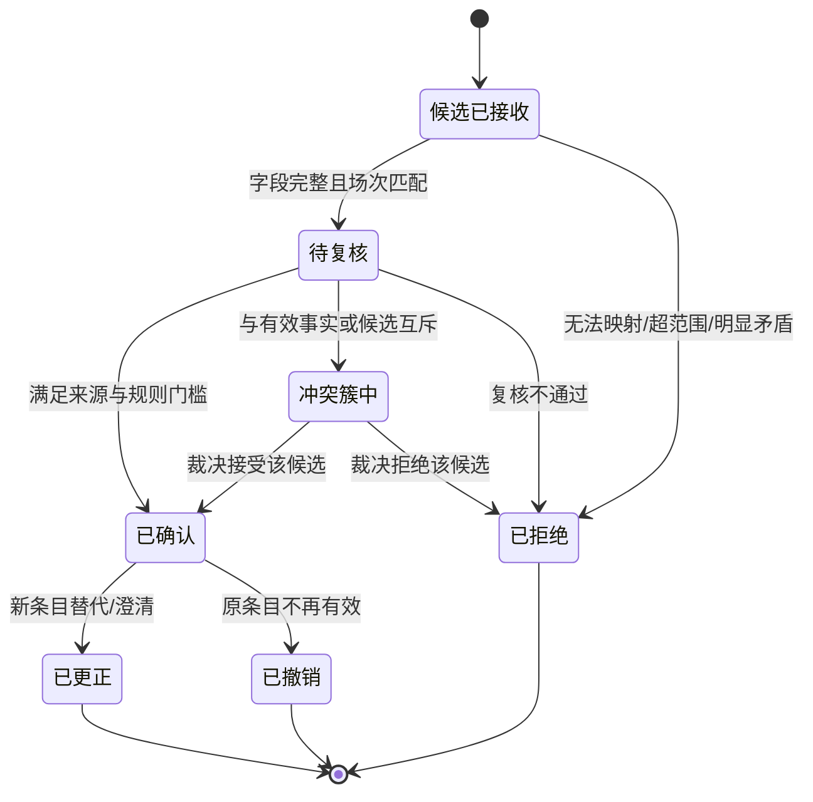
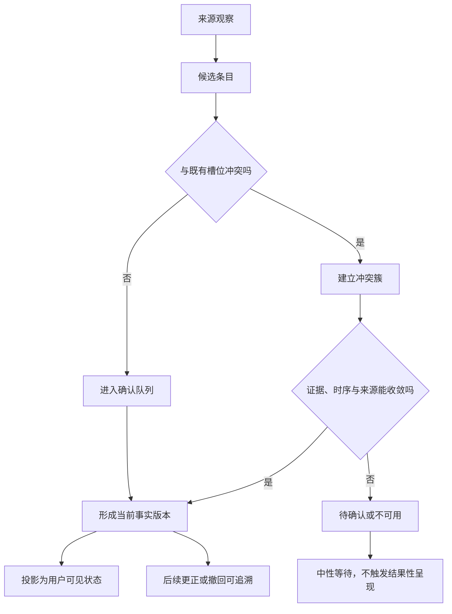
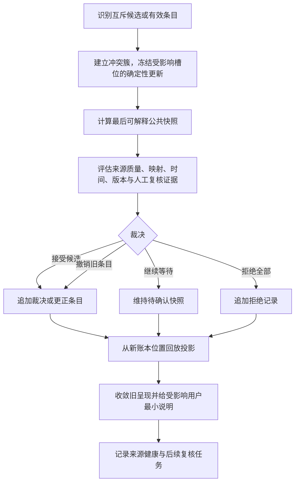
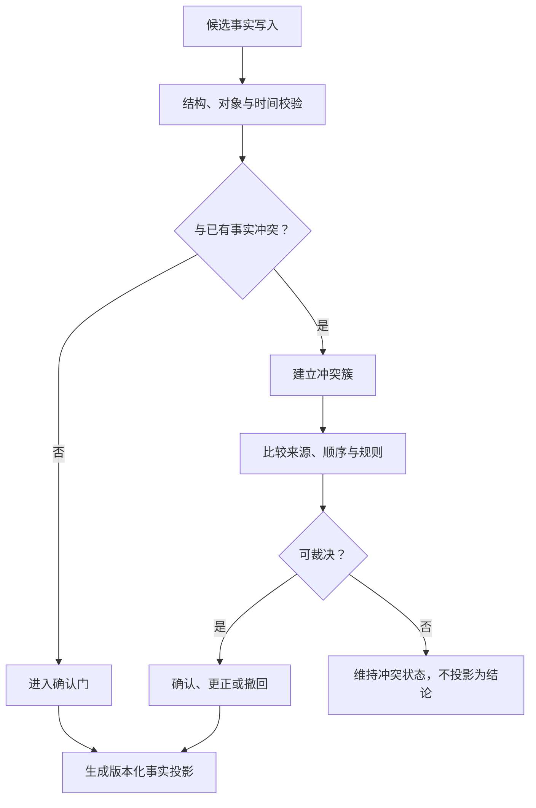

# 比赛事实账本与冲突调和

> 文档类型：0→1 比赛事实账本、冲突处置、回放投影与可信链施工方案  
> 适用阶段：赛程与来源管理已具备受控候选输入后，建立用户端比分、事件、角色事实回答的唯一可解释基础  
> 版本：0.1（确认门槛、冲突策略、保留期限、回放性能与人工复核范围均为待验证假设）  
> 研究信息截止：2026-01-28  
> 核心原则：事实账本记录“发生过哪些受控判断”，而非只保存一个可被随意覆盖的最新比分。候选、确认、更正、撤销和冲突都以可回放状态存在；公共快照只从有效账本投影得到。用户观察、角色输出和缓存都不能绕过账本改写事实。

---

## 1. 施工目标与事实承诺

足球陪看中最危险的错误不是“少说一句”，而是把尚未明确、已更正或相互矛盾的信息当作当前事实说给用户。用户可能比来源更早看到画面，来源可能延迟、撤销或给出不同事件；角色又会把看似微小的比分错误放大为庆祝、分析、提醒和共同记忆。只维护一张“当前比分”无法解释它为何变化、如何纠正、何时该等待，也无法在重连和多端状态中保持一致。

事实账本施工的目标是让每一项可影响用户端的赛事变化都有来源类别、时间、状态、版本、操作责任和更正关系；系统可从账本重放出某一时刻的公共快照；冲突不会被静默覆盖，而是形成受控冲突簇；用户端和角色只读取已确认且未被撤销的投影，或读取清楚的等待/冲突状态。

### 1.1 不可突破的约束

1. 用户输入永远是本场观察，不是赛事事实写入；
2. 角色文本、语音、动作和总结不拥有修改比分/事件的权限；
3. 候选事件在未通过确认前不可改变公开快照、提醒或确定性角色表达；
4. 更正与撤销保留关联关系，不能用覆盖旧值抹去已发生的用户影响；
5. 公共快照可从有效账本重建，不能只依赖缓存、临时变量或一次生成结果；
6. 冲突中优先收敛自动呈现，保持最后可解释快照，不强迫选择“最像真的”一方；
7. 高影响写入、确认、更正和冲突裁决按角色权限分离，并保留最小责任线索；
8. 删除用户资料不删除公共赛事事实；公共事实保留不允许成为继续保存用户观察和私人资料的理由。

### 1.2 账本不承担的职责

- 不保存完整转播视频、原始解说音频、未许可媒体资料或私人聊天；
- 不作为角色长期记忆库、用户偏好库、用户情绪档案或营销画像库；
- 不以“事实记录”为名收集用户设备、位置、联系人、原始声音或不相关身份资料；
- 不替代赛程来源治理、身份权限、用户资料删除和导演台职责分离；
- 不自动从自然语言、截图、社群内容或模型猜测生成已确认事件；
- 不让单一运营人员无约束地录入、确认、撤销、隐藏并解释同一高影响事件。

---

## 2. 账本模型与统一语言

### 2.1 核心对象

**对象：账本条目**
- **定义**：对某场比赛状态作出的受控、不可静默覆盖的记录
- **拥有者**：事实域
- **不能被误认为**：当前快照本身或用户对话

**对象：候选**
- **定义**：来源/人工流程提供、尚未确认的结构化线索
- **拥有者**：候选队列
- **不能被误认为**：已确认事件

**对象：事实事件**
- **定义**：通过确认条件、可参与公共投影的条目
- **拥有者**：事实账本
- **不能被误认为**：角色台词、用户观察

**对象：快照**
- **定义**：某一账本位置上可公开使用的最小比赛状态
- **拥有者**：投影层
- **不能被误认为**：账本全文或内部候选

**对象：冲突簇**
- **定义**：围绕同一事实槽位的互斥候选与裁决上下文
- **拥有者**：冲突域
- **不能被误认为**：一个普通错误提示

**对象：更正**
- **定义**：让已发布条目被新的有效关系替代/澄清的账本动作
- **拥有者**：事实账本
- **不能被误认为**：静默覆盖

**对象：撤销**
- **定义**：让原条目不再参与公共投影的账本动作
- **拥有者**：事实账本
- **不能被误认为**：物理删除全部历史

**对象：回放**
- **定义**：从指定账本位置重新计算快照的过程
- **拥有者**：投影层
- **不能被误认为**：重新请求外部来源

**对象：事实槽位**
- **定义**：同一类事实应保持一致的位置，如比赛阶段、比分、某事件
- **拥有者**：规则层
- **不能被误认为**：任意文本字段

**对象：完整性状态**
- **定义**：当前投影是否确认、等待、冲突或受限
- **拥有者**：用户端合同
- **不能被误认为**：角色的情绪状态

### 2.2 账本条目最小结构

| 字段类别 | 用途 | 规则 |
|---|---|---|
| 条目标识 | 稳定识别、去重和更正关联 | 不依赖自然语言或到达顺序 |
| 场次标识 | 限定归属比赛 | 不能跨场写入 |
| 账本位置 | 定义同一场次的逻辑顺序 | 只追加，不回写旧位置 |
| 条目类别 | 候选、确认、更正、撤销、冲突裁决等 | 类别决定是否影响投影 |
| 事实槽位 | 指出影响比分、阶段或事件的哪个区域 | 不同槽位不随意互相覆盖 |
| 有效载荷 | 最小事实，如事件类型、比赛时间、参与者 | 禁止动机、情绪与无关资料 |
| 来源与质量 | 来源等级、取得时间、完整性/一致性标签 | 不向用户端暴露内部凭据 |
| 关联关系 | 指向被更正/撤销/冲突的条目 | 支持可解释回放 |
| 操作责任 | 角色类别、时间、理由摘要 | 最小化，不记录私人资料 |
| 状态版本 | 防止旧更新覆盖新判断 | 单调增加 |

账本条目只追加，不直接修改已写入事实。若发现原条目错误，通过新的更正/撤销条目表达“从何时起什么不再有效”；回放规则再决定公共快照现在应是什么。这使用户端更正、运营复核和事故解释有共同基础。

### 2.3 事实槽位

首轮不追求把足球所有细节都建成事实。优先定义会直接影响用户理解和角色回答的槽位：场次阶段、主客队、比分、进球事件、红黄牌/关键判罚状态、终场/中断/延期、更正关系。每一槽位有明确有效性规则：例如，进球事件可改变对应队伍比分；非进球事件不可改变比分；撤销进球需通过关联关系回滚其影响；冲突中该槽位不新增确定性结论。

---

## 3. 条目状态机与事实生命周期

### 3.1 状态机



候选已接收、待复核和冲突簇中都不能驱动用户端确定比分、自动声音或角色庆祝。它们最多让用户端显示“正在确认”或维持上次确认状态。已确认也不是永久不变；之后更正或撤销会改变后续投影，但不抹掉历史操作线索。

### 3.2 确认门槛

候选进入已确认至少需要：场次标识无歧义；事实槽位和比赛时间合理；来源等级/人工复核满足该类事件要求；与现有有效投影不产生无法解释的矛盾；没有更高优先级安全暂停；用户端能够用最小、非夸张语言表达；确认人了解若错误该怎样更正。若任何一项缺失，保持等待、拒绝或进入冲突簇。

确认门槛不是一套“越快越好”的自动阈值。不同事件风险不同：比分变化、终场、点球/撤销等高影响事件需要更严格规则；低风险元信息可采用较轻门槛。无论哪种门槛，都必须在来源治理和导演职责中预先声明，不能由角色或单次运营情绪临时决定。

### 3.3 更正与撤销

更正适用于原事实仍有历史意义但现在需要替代、澄清或补充的情形；撤销适用于原事实不应再参与当前投影的情形。两者都要关联原条目、说明作用范围、生成新的版本，并触发下游收敛：旧快照、旧时间线、相关角色事实引用、尚未播放的自动声音和基于旧时间的提醒都需重新评估。

用户端不必看到全部账本关系，但应在已受影响的地方得到最小说明：“这项比赛状态已更正”“此前显示的事件不再作为当前结果”。不能只把数字换掉；也不能为了避免承认错误而维持旧角色台词或共同瞬间。

---

## 4. 冲突簇与调和策略



### 4.1 什么是冲突簇

冲突簇不是一条“来源出错”的日志，而是一组对同一事实槽位、同一比赛时间或同一事件对象提出互斥结论的候选/条目及其处理状态。将冲突显式成簇，能防止系统分别消费两条看似独立的信息，最终让一个区域显示 1:0、另一个区域显示 1:1、角色又说“刚才那个球算不算还要等”。

| 冲突簇字段 | 作用 |
|---|---|
| 冲突标识与场次 | 将互斥内容限制在同一比赛上下文 |
| 事实槽位/时间窗口 | 说明冲突发生在比分、阶段还是某个事件 |
| 成员条目 | 引用每条候选/有效事实，而不复制私密来源内容 |
| 当前状态 | 收集中、等待裁决、已调和、已放弃 |
| 保守快照策略 | 指明用户端保留什么、停止什么 |
| 裁决结果与理由 | 记录接受/拒绝/继续等待的最小依据 |
| 影响范围 | 哪些用户端投影、提醒或角色呈现需要收敛/更正 |

### 4.2 冲突识别规则

| 情况 | 是否形成冲突簇 | 首先做什么 |
|---|---|---|
| 两候选给出不同比分 | 是 | 冻结该比分槽位新增确定性呈现 |
| 进球候选与比分无变化 | 是 | 检查事件类型、时间、映射与来源版本 |
| 事件时间不同但可同时成立 | 不一定 | 先判断是否同一事件或不同事件 |
| 来源改期与场次仍进行中 | 是 | 停止旧时间提醒，复核场次状态 |
| 用户观察与公开快照不同 | 否，除非有独立候选冲突 | 用户观察只触发本场等待，不入公共簇 |
| 角色文本与快照不同 | 不以角色文本形成事实冲突 | 先停止/更正角色呈现，账本不被角色改写 |
| 撤销条目与原确认事件 | 是，属于明确更正关系 | 先按规则撤销原投影影响 |

### 4.3 调和流程



调和的正确结果有时是“继续等待”。运营界面和 AI Coding 提示词都应把它设为正常、清楚、可审阅的动作，而不是让工作人员为了清空队列而强行选择一方。

### 4.4 裁决原则



裁决依据应是预先定义的来源等级、数据完整性、时间/映射一致性、独立复核和用户影响，不是球队偏好、赛事热度、用户是否在线或哪个答案更适合角色表演。若无法达成明确结论，用户端保持冲突/等待状态，角色使用不确定语言或保持安静，提醒和自动庆祝不发生。

---

## 5. 回放投影与快照一致性

### 5.1 回放为什么必要

快照是给用户端的便利读模型，账本是可解释来源。若快照损坏、缓存过期、应用重连或更正发生，系统应能从指定账本位置重新计算“此刻有哪些有效事实”，而不依赖某个角色回复、上一台设备内存或人工记忆。回放也让团队可以检验一条更正是否真的撤回了旧事件对比分、时间线和角色事实引用的影响。

### 5.2 投影规则

| 账本条目 | 对快照的影响 | 禁止影响 |
|---|---|---|
| 已确认场次元信息 | 更新双方、阶段/状态等允许字段 | 改写用户偏好或会话控制 |
| 已确认进球事件 | 按规则更新对应队伍比分与事件线 | 更改另一队或无关场次比分 |
| 已确认非进球事件 | 更新事件线或状态槽位 | 随意增加/减少比分 |
| 更正条目 | 用关联关系重新计算受影响槽位 | 静默保留旧投影结果 |
| 撤销条目 | 原条目不再参与当前投影 | 物理删除账本线索 |
| 候选/待复核 | 不改变公共快照，可影响完整性标签 | 触发确定性角色反应 |
| 冲突簇 | 冻结/标记受影响槽位 | 用多数投票伪造确认状态 |

### 5.3 快照版本

每次投影结果带场次标识、账本位置、快照版本、完整性状态、生成时间和可见范围。用户端收到更高版本时更新；较旧版本、错误场次或已结束会话的快照被忽略。完整性状态与比分一起传递，避免用户端只看到数字却不知道它处于确认、等待或更正过程。

### 5.4 重放与性能

比赛中频繁从首条记录重放可能成本较高，因此可使用受控检查点：检查点只保存某一账本位置的已确认投影和版本；重放从最近有效检查点继续；检查点本身可由账本验证重建。检查点不能成为独立真相，也不保存用户私聊、角色文本或未经确认候选。若检查点与账本回放结果不一致，优先相信可重放账本，停止不一致投影并进入处置。

---

## 6. 幂等、事务与并发施工

### 6.1 幂等写入

来源重试、网络断开、人工重复点击和自动恢复都可能让同一候选或裁决多次抵达。每个写入带稳定操作标识、场次、条目类别、来源版本和目标范围；账本在同一语义动作重复时只追加一次有效条目，后续请求返回同一结果。幂等不能靠“最近几秒内容一样”猜测，否则两次真实相同事件可能被错误合并。

| 动作 | 去重键方向 | 正确结果 |
|---|---|---|
| 来源候选写入 | 来源标识 + 来源事件版本 + 场次 | 一条候选，不无限重复 |
| 人工确认 | 操作标识 + 候选/冲突簇 | 一次确认或同一结果返回 |
| 更正/撤销 | 操作标识 + 原条目 + 目标状态 | 不产生多次回滚 |
| 用户端快照确认 | 场次 + 快照版本 | 旧版本不覆盖新版本 |
| 提醒改期处理 | 场次 + 提醒对象 + 赛程版本 | 不产生多条触达 |

### 6.2 原子动作

高影响动作需在同一事务边界内完成：验证权限与状态 → 追加账本条目 → 更新冲突簇/投影版本 → 记录最小责任线索 → 发出下游变更事件。若任一环节失败，用户端不应看到“已经确认”的半成品；若下游暂时不可达，账本仍保留待传播状态，消费方在恢复前先收敛旧呈现。

### 6.3 并发裁决

同一冲突簇可能被多个受限人员同时处理。施工时需保证只有一个有效裁决获得下一个账本位置，其余操作收到“状态已变化，请重新查看”的结果。不要静默以最后写入覆盖先前裁决，也不要把并发失败伪装成来源错误。运营人员可以重新审阅最新簇状态，再决定确认、更正或继续等待。

### 6.4 迟到消息与取消

账本更新可能在用户结束本场、选择安静或网络重连后才到达。事实层仍可维护公开账本，但陪看编排/用户端必须检查当前会话是否有效、用户是否允许自动呈现、事件是否仍为有效版本。迟到的旧事件不能在用户结束后触发声音或角色动作；已撤销事件不能在重连时重新被角色引用。

---

## 7. 权限、运营与审计边界

### 7.1 操作角色

| 角色 | 可做什么 | 明确不能做什么 |
|---|---|---|
| 来源适配角色 | 产生结构化候选与健康状态 | 直接确认公共事实、读用户资料 |
| 事实编辑 | 创建/补充候选、标记映射问题 | 单独发布高影响冲突裁决 |
| 发布复核角色 | 确认符合门槛的候选、要求等待 | 把用户观察当来源、改用户资料 |
| 冲突裁决角色 | 接受/拒绝/继续等待、触发更正/撤销 | 读取无关私人对话或关系资料 |
| 安全观察角色 | 暂停自动事实呈现、升级异常 | 编造事实或向用户定向催回 |
| 用户端主体 | 查看自己可见快照、报告问题 | 写公共账本、查看候选簇 |

同一人在小范围演练中可承担多个低风险职责，但比分改变、撤销高影响事件和冲突裁决需有独立复核或之后的强制复核线索。权限按场次和时间收缩，比赛结束或交接后自动失去高影响范围。

### 7.2 最小审计线索

账本不必记录运营人员的完整行为历史，但高影响动作需保留：操作角色、时间、场次、条目/冲突簇、动作类型、理由摘要、影响范围、是否触发用户端更正和复核状态。用户端只可看到与自己理解有关的最小说明；审计线索不能转用于用户画像、商业评分或角色亲密度。

### 7.3 用户报告

用户报告“比分不对”“这句不合适”时，进入支持/事实分流。用户报告可让系统暂停自动呈现或触发复核，但不直接写账本事实。处理人员查看最少必要的场次、时间、报告类别和已确认快照；不要求用户上传私人材料或反复证明自己，也不让角色为错误辩解。

---

## 8. 接口合同与用户端行为

### 8.1 账本写入合同

| 字段 | 意义 | 约束 |
|---|---|---|
| 操作标识 | 幂等与追溯 | 同一语义写入只生效一次 |
| 场次/条目目标 | 限定影响范围 | 不允许跨场写入 |
| 动作类别 | 候选、确认、更正、撤销、裁决 | 决定权限和投影规则 |
| 预期版本 | 防止在旧状态上覆盖 | 不匹配时要求重新读取 |
| 载荷与来源标签 | 最小事实和质量信息 | 不含用户私聊/原始媒体 |
| 理由摘要 | 支持复核与更正 | 不含无关私人信息 |
| 返回状态 | 已追加/待复核/冲突/拒绝 | 用户端不直接消费内部细节 |

### 8.2 快照读取合同

用户端读取合同只返回：场次、双方、比分、阶段/时间、快照版本、完整性状态、更新时间、必要更正说明和可用控制提示。没有候选来源详情、冲突成员、运营人员、其它用户观察或无关历史。事实状态与角色呈现分开：用户端可以收到已确认比分但因安静设置不播放声音；也可以收到等待状态但角色不应把它读成确定结论。

### 8.3 事件更正合同

更正返回至少说明：受影响场次/事件、旧状态的可理解概述、新状态或等待状态、快照新版本、是否需要停止旧自动呈现、用户可选择的下一步。若用户已结束本场或共享显示，合同仍不得重新展开私人资料或强制弹窗；必要时仅在用户主动回看时展示更正。

### 8.4 错误语义

| 错误类别 | 用户端最小说明 | 保守行为 |
|---|---|---|
| 账本暂不可用 | “比赛状态暂时无法更新，上次确认信息仍可查看。” | 停止自动事实反应 |
| 冲突处理中 | “这项信息还在确认中。” | 保留最后确认快照/等待 |
| 无权动作 | “此操作只对受限场次角色开放。” | 用户端继续查看/结束 |
| 版本已变化 | “比赛状态已更新，请以最新信息为准。” | 重新读取快照，不重放旧内容 |
| 操作重复 | “这项操作已处理。” | 返回同一结果，不产生副作用 |
| 更正传播中 | “相关信息正在更新，不会再按旧状态自动提示。” | 先停止旧呈现 |

---

## 9. 精确 AI 提示词与施工分解

### 9.1 账本施工提示词

```text
[ROLE]
你是事实账本施工助手。只处理账本、冲突簇、投影、合同和演练场景；不得访问用户私人资料或改变角色关系规则。

[GOAL]
完成一个可验证的事实结果，例如：冲突比分出现时，公共快照保持最后确认状态并停止自动呈现。

[INVARIANTS]
用户观察不可写公共事实；候选不可投影；账本只追加；更正/撤销有关系；快照可回放；结束/安静优先；冲突可等待。

[SCOPE]
允许：事实账本、冲突簇、快照投影、共享合同、来源候选验证、场景。
禁止：用户资料、身份授权范围、角色台词资产、运营定向触达。

[ACCEPTANCE]
覆盖重复写入、并发裁决、来源乱序、进球撤销、快照重放、重连、用户结束、共享显示和用户观察。

[COMMANDS]
运行格式、静态检查、账本验证、投影验证、冲突演练和回退就绪报告。

[STOP]
若需要把自然语言/用户观察直接当事实、无法说明更正关系、需要扩大运营权限或无法保证回放一致，立即停止并请求决策。
```

### 9.2 施工顺序

1. 固定事实槽位、条目类别、状态机和共同语言；
2. 建立只追加账本与场次级逻辑顺序；
3. 建立候选验证、确认门槛与最小权限；
4. 建立快照投影、版本和完整性状态；
5. 建立冲突簇、等待、裁决、更正和撤销；
6. 建立回放、检查点、幂等和事务边界；
7. 接入用户端最小读取合同和角色事实工具边界；
8. 接入导演台受限操作、审计线索与场次演练。

每一步都必须先有场景验收。不要把“事件表能插入一行”当作账本完成；必须证明用户观察不能污染快照、撤销进球能让重放比分回退、冲突时角色不抢答、重连不让旧事实复活。

### 9.3 反例

| 模糊指令 | 风险 | 精确改写 |
|---|---|---|
| “存一下比分” | 后续无法更正/解释 | “追加确认条目并从账本投影快照；非进球不可改比分” |
| “来源不同就选最新的” | 到达时间不等于可信度 | “建立冲突簇，保留最后确认快照，按来源/版本/复核裁决” |
| “用户说进球就更新” | 观察污染公共事实 | “用户输入只进入本场等待，不写事实账本” |
| “错误就改掉” | 静默覆盖与旧呈现残留 | “追加更正/撤销条目，重放投影，停止旧自动呈现” |
| “提高实时性” | 跳过确认和取消 | “缩短候选处理但不降低事实门槛；受限时降级为等待” |

---

## 10. 命令、变更提交与验收

### 10.1 候选命令

```bash
make bootstrap-ledger
make format
make static-check
make verify-ledger-append
make verify-projection-replay
make scenario-goal-confirmation
make scenario-goal-revocation
make scenario-score-conflict
make scenario-concurrent-resolution
make scenario-user-observation-isolation
make scenario-reconnect-after-correction
make readiness-fact-ledger
```

如采用 Go/Dart 工具链，统一入口可调用：

```bash
go test ./...
go vet ./...
flutter analyze
flutter test
```

命令输出必须说明场次、账本位置、快照版本、完整性状态和用户端影响，而不是只给“成功/失败”。演练使用许可明确的模拟赛事，不使用真实用户观察、私人对话或未授权媒体。

### 10.2 变更提交规则

提交按用户可信结果命名，例如“让撤销进球从回放快照移除比分影响”“让冲突簇暂停自动声音”“让用户观察保持在本场”。说明里记录账本/合同变化、场景结果、权限影响、回退动作和遗留风险。任何改变确认门槛、冲突裁决权、快照字段或更正传播的提交都必须经过事实与用户体验双重审阅。

### 10.3 必过情境

| 情境 | 合格结果 | 不可接受结果 |
|---|---|---|
| 已确认进球 | 对应队伍比分按规则变化，快照带确认版本 | 角色文本单独改变比分 |
| 进球撤销 | 追加撤销关系，回放后比分回退，旧庆祝收敛 | 静默覆盖或重连后旧球复活 |
| 两来源不同比分 | 建立冲突簇，保留最后确认快照 | 直接选到达更快的一方 |
| 用户说“进了” | 本场等待/回应，不写公共事件 | 改变其它用户比分 |
| 并发裁决 | 只有一个有效裁决，另一方看到状态已变 | 两个互斥确认都生效 |
| 重复确认请求 | 返回同一条目/结果 | 重复事件、重复提醒、重复声音 |
| 用户已结束本场 | 账本可更新，但不再自动呈现给该会话 | 迟到声音或角色动作出现 |
| 共享显示 | 仅接收最小快照与状态 | 暴露候选、运营线索或用户资料 |

---

## 11. 指标、风险、降级与放行

### 11.1 候选指标

| 指标 | 定义 | 判断什么 |
|---|---|---|
| 投影一致率 | 同一账本位置的快照可重复得到同一结果的比例 | 回放规则是否稳定 |
| 候选隔离率 | 未确认候选未进入确定性用户端呈现的比例 | 事实门槛是否有效 |
| 冲突收敛时间 | 冲突识别到自动呈现停止的时间 | 用户保护是否及时 |
| 更正传播率 | 更正后快照、时间线、角色引用和提醒均更新的比例 | 下游一致性 |
| 撤销回放正确率 | 撤销后原条目不再影响快照的比例 | 账本关系是否完整 |
| 写入去重率 | 重试/并发未造成重复有效条目的比例 | 幂等与事务是否可靠 |
| 用户观察隔离率 | 用户观察从未改变公共投影的比例 | 领域边界是否守住 |
| 账本可解释率 | 高影响条目可说明来源、状态、责任和更正关系的比例 | 复核与用户说明基础 |
| 关系化事实事件率 | 角色/运营以情绪或留存目标影响事实的事件数 | 边界是否被污染 |

### 11.2 降级层级

| 层级 | 保留 | 停止 |
|---|---|---|
| L0 受控事实 | 确认快照、最小自动反应、等待/更正说明 | 无 |
| L1 冲突收敛 | 最后确认快照、文字、用户控制 | 自动庆祝、确定性长分析 |
| L2 最小快照 | 上次确认比分/阶段、安静/结束 | 新事件自动呈现、提醒调整 |
| L3 无实时事实 | 用户控制、文字说明、自然结束 | 所有比分/事件断言与角色事实回答 |
| L4 停止场次 | 不可用说明与帮助 | 场次进入及自动能力 |

降级不应丢掉用户控制、删除、共享保护或身份边界。任何层级下，用户仍可退出、选择安静、仅文字和低动态；不能因账本异常迫使用户等待、重新登录或让角色继续填充空白。

### 11.3 放行门槛

只有以下条件同时满足，才允许账本成为用户端和角色的事实基础：条目只追加且可回放；事实槽位有明确规则；候选/确认严格分离；冲突簇可建立并选择等待；更正/撤销有关系且传播下游；投影版本防旧内容覆盖；高影响写入可去重且原子完成；权限职责分离；用户观察隔离；核心撤销、冲突、重连、结束和共享情境有可重复证据；异常时可降级到最小快照。

### 11.4 反指标

每秒账本写入数、事件数量、自动确认比例、角色对事实的反应次数、冲突清空速度都不是首轮成功指标。它们可能意味着来源噪声被放大、门槛过低或运营被迫抢答。真正重要的是用户看到的状态是否可解释、事实是否可更正、冲突时是否被保护、删除/结束后是否不受迟到内容打扰。

---

## 12. 投影施工细节与不变量

账本的难点不在于“能记录事件”，而在于任何消费者在任何时刻得到同一类可解释结果。投影施工必须把业务规则写成可验证不变量，不能藏在角色提示词、用户端条件判断或某个来源适配器里。事实层是唯一可以把有效事件变成比分、阶段和事件线的地方；其它模块只消费结果。

### 12.1 比分不变量

| 不变量 | 施工含义 | 违反后的保守动作 |
|---|---|---|
| 比分总是主队与客队两个非负数 | 快照从场次上下文读取双方，而非从文本解析 | 拒绝投影，标记完整性异常 |
| 只有允许的进球类有效事件可改变对应队伍比分 | 事件类型与队伍归属先通过规则 | 事件保持候选/冲突，不改变数字 |
| 一条有效进球只贡献一次分数变化 | 回放以事件稳定标识去重 | 停止重复投影，检查来源版本 |
| 撤销/更正按关联关系回退影响 | 不直接把比分改为某个外部数值 | 重新回放受影响槽位并产生新快照版本 |
| 非进球事件不得侧改比分 | 红黄牌、换人、评论等走不同槽位 | 拒绝写入或进入异常队列 |
| 冲突状态不产生新的确定比分 | 最后确认快照保持可读 | 暂停自动反应和新比分提醒 |

比分不变量必须同时出现在账本验证、合同验证和用户端场景中。只在资料层做校验而用户端又允许角色文本刷新数字，仍然会破坏可信链。

### 12.2 事件时间不变量

比赛时间、获取时间、账本位置和用户端接收时间是不同概念。事件在比赛第几分钟发生，不等于资料何时到达，不等于何时得到确认，更不等于角色何时表达。账本保留这些时间关系，投影以比赛时间组织时间线，以账本位置组织有效性，以快照版本组织用户端更新。

| 时间 | 作用 | 不可用于 |
|---|---|---|
| 比赛时间 | 排列同场事件和说明发生位置 | 判断来源可信度或消息先后 |
| 来源获取时间 | 观察延迟和健康 | 覆盖更高账本版本 |
| 账本写入时间/位置 | 表达受控判断顺序 | 伪造比赛发生时刻 |
| 用户端接收时间 | 处理重连、过期呈现和可见提示 | 作为事实确认依据 |
| 更正生效时间 | 解释从何时开始以新状态为准 | 删除原条目历史线索 |

对乱序事件，系统先判断它是否属于既有场次/槽位、是否有稳定版本和来源质量，再决定候选/冲突/拒绝；绝不因为“晚到”就自动丢弃真实更正，也不因为“先到”就自动确认。

### 12.3 投影纯度

投影函数的输入只包括：场次上下文、截至某账本位置的有效条目、明确的冲突/撤销关系和已批准规则。输出只包括用户端允许看到的最小快照与完整性状态。它不读取用户偏好、角色历史、设备环境、运营留言、外部网络实时响应或当前缓存随机值。这样同样输入可以反复得到同样结果，异常可定位，用户偏好也不会污染事实。

当用户选择安静、低动态或共享显示时，改变的是投影后的呈现资格，不是事实投影本身。反过来，事实冲突改变的是完整性状态和角色可用表达，不会改变用户保存的声音/动态选择。两条链分开，才能在复杂场景中仍解释“为什么现在不说话”和“为什么现在比分不确定”。

### 12.4 检查点与验证点

检查点用于提高回放效率，验证点用于检测账本/投影是否漂移。每个检查点至少保存场次、账本位置、投影版本、最小快照、规则版本和完整性状态；验证点定期从更早位置重放并比较结果。若不一致，先停止向用户端扩散新的自动事实，保留最后已验证快照，开启处置。不能为了保持“实时感”继续使用无法解释的检查点。

---

## 13. 异常剧本与人工处置

### 13.1 关键剧本

> 信息卡：原宽表已改为纵向阅读，字段含义不变。

- **剧本：来源报进球但比分未变**
  - **触发**：候选与投影规则矛盾
  - **立即系统行为**：建立冲突簇，冻结该槽位自动反应
  - **人工决策**：核验映射/版本/来源，确认或拒绝
  - **用户端结果**：保持最后确认比分，显示等待

- **剧本：已庆祝事件被撤销**
  - **触发**：新撤销关系到达
  - **立即系统行为**：停止待播声音/动作，重放快照
  - **人工决策**：发布最小更正并复核影响范围
  - **用户端结果**：“这项状态已更正”，不再引用旧球

- **剧本：两名人员同时裁决**
  - **触发**：同簇预期版本相同
  - **立即系统行为**：只接受一个有效追加，另一方收到状态变化
  - **人工决策**：重新审阅或继续等待
  - **用户端结果**：用户端只见一个连续状态

- **剧本：检查点与回放不一致**
  - **触发**：验证点发现差异
  - **立即系统行为**：停止新快照扩散，标记完整性异常
  - **人工决策**：重新建立受影响投影，判断需否更正
  - **用户端结果**：显示最后验证状态/等待，不闪烁跳变

- **剧本：用户报告比分错误**
  - **触发**：主动报告进入支持分流
  - **立即系统行为**：不写账本，必要时收敛自动呈现
  - **人工决策**：对照现有簇/来源，决定是否复核
  - **用户端结果**：用户获最小回应，可继续安静/结束

- **剧本：账本依赖不可用**
  - **触发**：写入/读取异常
  - **立即系统行为**：进入 L2/L3，停止自动事实反应
  - **人工决策**：处置可用性与恢复顺序
  - **用户端结果**：上次确认状态可见，不假装实时

- **剧本：共享端重连**
  - **触发**：共享会话恢复
  - **立即系统行为**：只取最小公开快照
  - **人工决策**：无需恢复私人资料
  - **用户端结果**：不显示候选/资料/角色历史

剧本必须由工程、运营和体验共同演练。工程人员不能只验证状态最终是否正确，还要观察用户在异常发生的几秒内看到了什么、是否仍能安静/结束、角色是否错误地继续说话。

### 13.2 人工介入的最小动作

人工在不确定时可以做的最重要动作是“暂停确定性呈现”。它比强行填一个答案权限更低、用户伤害更小。其次是标记冲突、要求复核、追加更正/撤销、限制来源等级、缩小场次范围。人工不能直接编辑用户端文字让角色“圆回来”，也不能删除账本线索让问题消失。

每一次人工更正都应触发两条工作：面向用户的最小说明和面向工程的复核任务。前者告诉用户现在以什么为准；后者检查为什么候选通过、为什么旧呈现未及时停止、是否需要修改确认门槛、适配映射、健康阈值或提示词约束。

### 13.3 重大风险停止条件

出现下列任一情况时停止扩大或暂时关闭相关能力：同一场次持续显示互相矛盾比分；撤销后旧事件仍反复出现；用户观察进入公共账本；共享端得到内部候选/私人资料；人工无法追溯高影响裁决；账本回放无法重复快照；角色以高确信语气表达冲突事实；停止动作无法阻止迟到声音。停止不是失败，而是保护用户、恢复可信链的必要动作。

---

## 14. 运行保障、容量与资料保留

### 14.1 容量分层

账本容量压力来自候选高峰、重连回放、冲突爆发和大量用户端读取。容量策略首先保护写入正确性和用户控制，其次才是丰富呈现。高峰时可减少角色自动反应、降低投影刷新频率、限制低价值候选、缩小到最小快照；不可牺牲撤销、更正、结束、删除或冲突收敛。

**压力来源：大量候选同时到达**
- **首先保留**：去重、顺序、冲突识别
- **可以收缩**：非核心事件细节、自动反应
- **绝不能收缩**：确认门槛、事实槽位规则

**压力来源：用户集中重连**
- **首先保留**：最新快照、用户控制、共享保护
- **可以收缩**：历史时间线、动画
- **绝不能收缩**：结束/安静与版本检查

**压力来源：多次更正**
- **首先保留**：账本追加、投影重放、更正说明
- **可以收缩**：长分析、角色呈现
- **绝不能收缩**：撤销传播和可解释性

**压力来源：人工复核不足**
- **首先保留**：等待、最小快照、停止能力
- **可以收缩**：自动确认、高风险场次
- **绝不能收缩**：用户端基础控制与支持入口

**压力来源：存储/检索压力**
- **首先保留**：检查点、结构化索引、最小读取
- **可以收缩**：低价值历史展示
- **绝不能收缩**：账本完整性、删除边界

### 14.2 资料保留边界

公共赛事账本按赛事/合同/争议处理的适用要求保留，但只保存实现可解释事实所需的最小条目。候选被拒绝、冲突被放弃、来源许可到期时，保留范围与期限应独立评估。账本绝不成为保存用户观察、完整对话、原始语音或关系资料的通道；用户资料删除请求也不应错误地删除公共赛事事实。两种保留边界通过对象、拥有者和访问控制分开。

### 14.3 观察与告警

运行观察至少包括：账本写入失败、候选积压、冲突簇数量、投影不一致、快照生成延迟、撤销传播延迟、来源受限、用户端收到旧版本、自动呈现未在取消后停止。告警先指向“用户可能受什么影响”和“该收缩哪层能力”，而不只显示技术计数。任何观察数据按最小化原则聚合，不记录用户私人内容来调试比分问题。

### 14.4 恢复顺序

账本异常恢复按：确认存储完整性 → 校验账本位置与检查点 → 从最后可信位置回放 → 比较投影 → 处理必要更正 → 恢复用户端最小快照 → 最后才逐步恢复自动角色呈现。不要在未确认投影前让角色先“恢复热闹”；用户端宁可短暂显示等待，也不能看到多次来回跳变的比分和情绪化解释。

---

## 15. 交付验收矩阵与持续复核

账本交付不以“能写入、能读出”作为完成。必须从用户端、运营端、资料域和运行端同时验收，确保同一条事实在不同环境下不会获得不同身份或不同权力。每一次新增事实槽位、来源等级、裁决角色或自动呈现资格，都重新通过矩阵；否则新能力可能绕过已经成熟的比分规则。

**验收面：追加与回放**
- **必须证明**：条目不被静默覆盖，快照可由账本重建
- **代表情境**：从检查点前后重放得到同一确认比分
- **不通过处理**：停止扩展投影，修复规则/检查点

**验收面：事实边界**
- **必须证明**：观察、角色、缓存均不能写公共事实
- **代表情境**：用户说进球后其它用户快照不变化
- **不通过处理**：关闭该写入路径，重审合同

**验收面：冲突调和**
- **必须证明**：冲突簇使确定性呈现收敛且允许等待
- **代表情境**：两来源互斥比分，用户端保留最后确认状态
- **不通过处理**：停止自动事实反应，改为最小快照

**验收面：更正撤销**
- **必须证明**：旧影响被系统性替换，不只改一个数字
- **代表情境**：撤销进球后比分、时间线、待播反应一致更新
- **不通过处理**：回退相关自动呈现，补齐传播

**验收面：会话边界**
- **必须证明**：账本更新不越过用户结束/安静/共享选择
- **代表情境**：已结束会话不收到迟到语音
- **不通过处理**：暂停回合消费，修复呈现资格

**验收面：权限边界**
- **必须证明**：高影响动作受角色和场次限制
- **代表情境**：普通用户无法写账本，编辑不能越权裁决
- **不通过处理**：收缩权限，补审计与复核

**验收面：可访问理解**
- **必须证明**：无声、低动态、放大时仍看懂确认/等待/更正
- **代表情境**：只读文字也能分辨事实状态
- **不通过处理**：重写用户端合同与状态文本

**验收面：运行回退**
- **必须证明**：故障时能降级但保留基本控制
- **代表情境**：账本读取异常后用户仍可安静/结束
- **不通过处理**：维持 L2/L3，修复后再恢复

### 15.1 发布前复核问题

发布负责人、事实负责人和体验负责人在扩大场次前共同回答：哪些事实槽位已被证明可回放？哪些仍只允许候选/等待？哪些来源在本场可用、哪些处于受限？发生撤销时用户端具体会收敛什么？角色是否只能消费确认快照？共享端会不会得到超范围内容？用户结束后是否仍可能出现旧回合？若任何答案是“应该不会”而无场景证据，能力不应扩大。

### 15.2 发布后的复核节奏

每场高影响比赛后复核少量关键样本：确认是否存在无解释快照跳变；冲突是否被正确收敛；更正是否抵达所有用户端路径；撤销后是否仍有旧角色反应；来源健康是否与准入等级一致；人工是否因压力跳过等待；用户报告是否被当作线索而非事实；低动态和共享环境是否保持完整。复核不以寻找责任人为第一目标，而以找到下次可提前停止的风险为目标。

### 15.3 资料与模型边界复核

事实账本经常会被误用为“给角色更多上下文”的便利容器。每次扩展前都应检查新字段是否真的是公开赛事事实、是否需要用户资料、是否会让角色声称知道用户未说的信息、是否会在共享设备泄露、是否能在更正/撤销时完整收敛。无法清楚回答的字段不进入账本，也不进入角色上下文。

### 15.4 退出条件

若长期无法稳定做到回放一致、冲突保守、撤销传播和用户端理解，正确选择是将服务退回更小范围：只提供赛程和上次确认快照、关闭自动赛事反应、暂停复杂事实回答，甚至停止该场次入口。事实可信度不是可以用更热情角色、更多提示或更强运营来补偿的体验缺口。

### 15.5 复核结论的使用限制

复核结论只能用于改善账本规则、来源治理、用户端说明、运行保障和培训演练。它不能被转换为“哪个用户最爱互动”“哪类用户容易相信角色”“哪位运营人员更会制造气氛”的画像或激励材料。特别是用户报告、结束动作和选择安静的记录，只能说明某一条路径需要收敛或修复，不能成为更强主动性、更多提醒或关系化触达的依据。

当复核发现同一类风险重复出现，团队应优先改变默认值、减少自动呈现资格或缩小来源范围；不要只要求用户多看提示、多点确认或更频繁报告。可信链的责任在系统和运营流程，而不在用户是否足够耐心地纠正它。

每次放行前还应检查账本与用户资料边界是否仍然分离：事实条目不含个人观察，资料删除不触碰公共事件，运营复核不扩展为私人内容浏览。任一边界模糊时，先停止相关扩展，再重新完成领域和权限审阅。

### 15.6 最小可信闭环门槛

首轮不以覆盖更多赛事字段为目标，而以完成一个可解释的最小闭环为放行门槛：一条受许可来源的候选能够被记录；一条互斥候选能够形成冲突并让呈现收敛；一次确认能够生成版本明确的快照；一次更正或撤销能够令旧快照、时间线与待播反应共同失效；用户无论在安静、结束或共享选择下，都不会因上述链路收到额外触达。任何一个环节只能靠人工口头保证、无法复演，或需要用户自行辨认真假时，均不应进入扩大范围的清单。这个门槛将“事实账本”限定为可被检验的责任链，而不是把更多不确定信息更快地展示出去。

---

## 16. 公开研究参考

以下公开资料用于形成事件记录、并发、接口安全、事故处置、人工智能风险和用户研究的方法。它们不代替本服务的来源许可、场次演练和用户理解证据；确认门槛、冲突策略和保留期限需在受控范围内持续验证。

> 信息卡：原宽表已改为纵向阅读，字段含义不变。

- **编号：R1**
  - **来源**：Martin Fowler，*Event Sourcing*
  - **使用方式**：只追加事件、投影与回放的概念参考
  - **URL**：https://martinfowler.com/eaaDev/EventSourcing.html
  - **访问日期**：2026-01-28

- **编号：R2**
  - **来源**：Microsoft Architecture Center，*Event Sourcing pattern*
  - **使用方式**：事件记录、快照与一致性设计参考
  - **URL**：https://learn.microsoft.com/en-us/azure/architecture/patterns/event-sourcing
  - **访问日期**：2026-01-28

- **编号：R3**
  - **来源**：IETF，RFC 9110，*HTTP Semantics*
  - **使用方式**：幂等、请求状态与接口语义参考
  - **URL**：https://www.rfc-editor.org/rfc/rfc9110
  - **访问日期**：2026-01-28

- **编号：R4**
  - **来源**：OWASP，*API Security Top 10*
  - **使用方式**：接口授权、资源暴露与滥用风险参考
  - **URL**：https://owasp.org/www-project-api-security/
  - **访问日期**：2026-01-28

- **编号：R5**
  - **来源**：NIST，*Computer Security Incident Handling Guide*
  - **使用方式**：异常识别、遏制、恢复与复核参考
  - **URL**：https://csrc.nist.gov/pubs/sp/800/61/r2/final
  - **访问日期**：2026-01-28

- **编号：R6**
  - **来源**：NIST，*AI Risk Management Framework*
  - **使用方式**：人机透明、事实风险与治理参考
  - **URL**：https://www.nist.gov/itl/ai-risk-management-framework
  - **访问日期**：2026-01-28

- **编号：R7**
  - **来源**：Google，*Site Reliability Engineering*
  - **使用方式**：服务一致性、降级、监控与回退参考
  - **URL**：https://sre.google/books/
  - **访问日期**：2026-01-28

- **编号：R8**
  - **来源**：GOV.UK Service Manual，*User research*
  - **使用方式**：在真实任务中研究更正、异常和退出的方法参考
  - **URL**：https://www.gov.uk/service-manual/user-research
  - **访问日期**：2026-01-28

- **编号：R9**
  - **来源**：国家互联网信息办公室，《生成式人工智能服务管理暂行办法》
  - **使用方式**：公众生成式服务的用户权益与治理边界参考
  - **URL**：https://www.cac.gov.cn/2023-07/13/c_1690898326795531.htm
  - **访问日期**：2026-01-28

**引用维护规则。** 在增加新事实槽位、降低确认门槛、开放新的来源、扩大运营裁决权或让角色使用更多赛事资料前，应重新核验许可、安全、隐私、人工智能透明和用户权益要求。公开方法只能说明账本应可回放、可更正、可治理，不能替代用户端是否真的保持事实一致、冲突时是否被保护和人工是否正确选择等待的直接证据。
