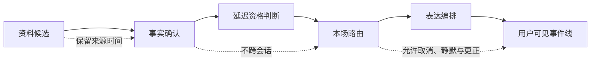
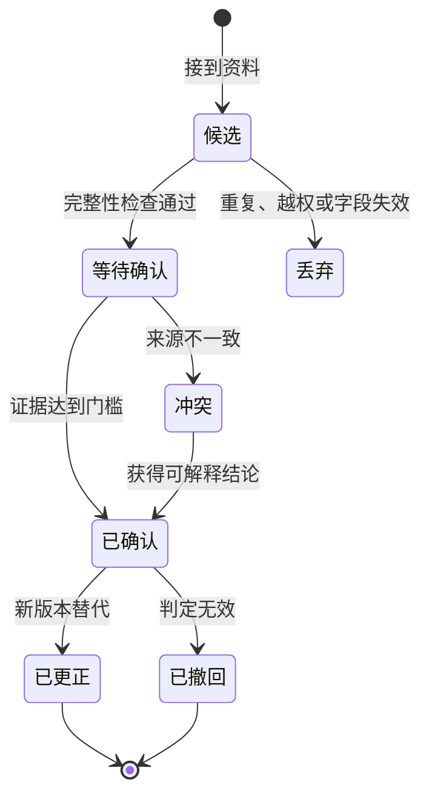
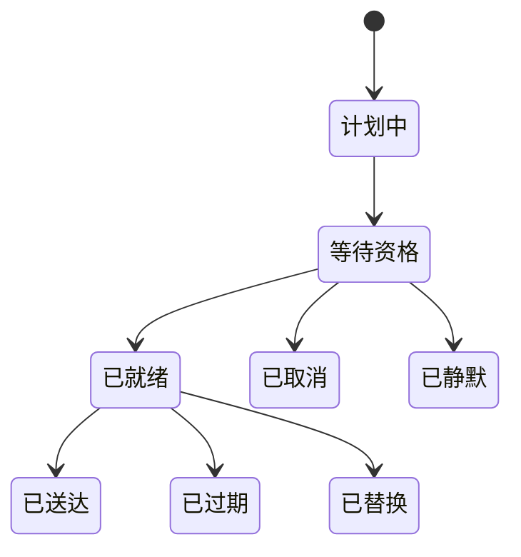
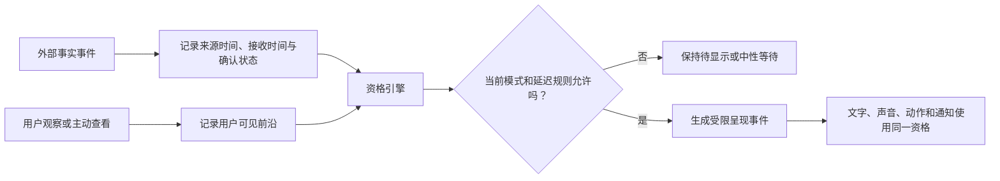

# 实时观察与直播延迟协调

> 文档性质：0→1 工程执行方案。它规定陪看服务怎样在用户观看进度未知、资料抵达时间不一致、事实可能被撤销的情况下，保护用户不被剧透，并将等待、确认、更正和静默做成可交付的能力。
>
> 核心判断：同一场比赛的“直播”不是一个统一时刻。比起抢先发出一句看似聪明的话，先保证一句话没有越过用户正在看的画面，更值得被工程化。

> 方案形成时间：2026-01-28。

## 1. 施工目标、前序决策与边界

### 1.1 要解决的真实问题

用户可能通过电视、流媒体、文字直播、回放、现场大屏或朋友转述观看同一场比赛。它们的时间差从数秒到数分钟不等，且服务通常无法可靠知道某位用户实际看到了哪一帧。外部赛事资料也有自己的抵达、校正和撤回节奏。若系统把“资料先到”误当成“用户已经看到”，一句进球播报就会把用户从比赛里拉走，并永久损伤对陪看角色的信任。

本阶段建立一条受控链路：



服务交付的不是“全网最快比分”，而是以下四项结果：

1. 用户可主动选择防剧透强度，并在任何时刻切换到更保守的模式；
2. 比赛事实、用户观察、角色观点和表达动作有不同的身份、顺序和可见范围；
3. 候选事件即使重复、乱序、晚到或被撤销，也不会制造重复提醒或把旧结论覆盖新结论；
4. 资料延迟、连接中断或确认不足时，系统会收缩为等待、文字快照或安静，而不是假装仍然同步。

### 1.2 本文继承的前序决策

以下决策在本篇开始前已经成立，施工时不得用“实时体验”作为例外理由推翻：

| 前序决策 | 对本篇的约束 |
| --- | --- |
| 事实、解释、观点和情绪表达必须分开 | 角色不能把观察或推测说成已确认赛事事实 |
| 用户可以随时静音、结束或退出本场 | 所有延迟队列都必须可取消，取消优先于送达 |
| 用户观察属于本人的观看上下文 | 观察不可提升为公共事件，也不可传给另一会话 |
| 更正必须可理解而非静默覆盖 | 已被展示的事实发生变化时，要生成最小更正说明 |
| 首轮不承担转播或重分发职责 | 不接收、不分析、不存储完整直播画面与解说音频 |
| 未确认信息宁可等待 | “快”不是自动表达的放行条件 |

### 1.3 明确假设

这些是假设，不是已被证明的用户事实。每一项都要被场景演练和用户研究推翻或保留。

**编号：H1**
- **假设**：大多数用户愿意理解“防剧透”而非要求精确测量自己的延迟
- **若不成立的后果**：设置可能被忽略或误解
- **首轮处理**：用三档语言和可随时切换替代技术探测

**编号：H2**
- **假设**：用户手动说“我看到进球了”比自动猜测观看进度更可控
- **若不成立的后果**：观察交互使用率低
- **首轮处理**：不依赖该动作才能保持安全

**编号：H3**
- **假设**：对关键事件，多等一个确认窗口比抢先表达更能保住信任
- **若不成立的后果**：用户认为回应过慢
- **首轮处理**：提供状态和最小解释，不用强情绪填满等待

**编号：H4**
- **假设**：不同资料源的时间戳足以建立保守排序
- **若不成立的后果**：上游时间语义不可靠
- **首轮处理**：标为未知时间，禁止用其压过已确认版本

**编号：H5**
- **假设**：在共享设备上，最小显示比跨人同步更符合预期
- **若不成立的后果**：用户希望共同进度
- **首轮处理**：首轮只允许本机当前会话选择，不建立观众之间的映射

### 1.4 范围与非范围

本篇覆盖本场实时会话、比赛事件的时间语义、个人观察、延迟资格、消息交付、更正、重连、隔离、运行检查和验收。它不覆盖完整赛事资料采购、直播视频播放、社交群聊、跨用户同看房间、竞猜、自动识别电视画面或用麦克风监听转播。

尤其不得用下列信号反推用户的观看进度：设备音量、应用是否在前台、网络抖动、屏幕录制、摄像头画面、家庭地址、其它用户的输入，或用户没有明确授权的浏览行为。这些信号既不可靠，也会把防剧透变成不可解释的监测。

### 1.5 完成定义

达到首轮完成定义的标志不是“消息能实时推到页面”，而是能连续证明：同一候选只产生一次有效事实；旧版本不能逆转新版本；用户观察不离开所属会话；防剧透档位能阻止不合资格的主动表达；结束本场后所有待送达动作失效；更正能替代可见结论；任一依赖异常时用户仍能看见最后确认状态与下一步。

## 2. 统一时间模型：先承认不确定，再决定何时开口

### 2.1 六个时间点与一个区间

每个事件至少保留下列时间字段。它们不能互相替代，更不能只保留“收到时间”。

**名称：`occurred_at`**
- **含义**：事件在比赛时间线中发生的时刻
- **来源**：有时间语义的赛事资料
- **可否作为排序主键**：可以，前提是可信度足够

**名称：`reported_at`**
- **含义**：来源声称或首次报道的时刻
- **来源**：赛事资料
- **可否作为排序主键**：仅作辅助

**名称：`received_at`**
- **含义**：服务接到候选的时刻
- **来源**：接入边界
- **可否作为排序主键**：不可代表比赛发生顺序

**名称：`confirmed_at`**
- **含义**：通过确认门槛的时刻
- **来源**：事实治理流程
- **可否作为排序主键**：可以决定事实版本

**名称：`eligible_at`**
- **含义**：对当前会话允许表达的最早时刻
- **来源**：延迟资格引擎
- **可否作为排序主键**：可以决定是否交付

**名称：`delivered_at`**
- **含义**：实际呈现给用户的时刻
- **来源**：交付回执
- **可否作为排序主键**：只用于体验账本

**名称：`watch_frontier`**
- **含义**：用户已看到位置的保守区间
- **来源**：用户显式选择或观察
- **可否作为排序主键**：不是单点，必须携带不确定范围

`watch_frontier` 采用区间而不是一个虚假的精确数值。例如用户选择“我的画面可能慢”，系统只能知道其安全前沿不晚于某个保守界限；当用户明确点选“我刚看到这个片段”，才可以将本会话的下界前移。任何区间变窄都必须来自用户动作、可解释的会话状态或可信的资料语义，不能来自暗中推断。

### 2.2 三种顺序必须并存

实时链路最常犯的错误是把到达顺序当作因果顺序。本方案同时维护三种不同顺序：

**顺序：比赛顺序**
- **回答的问题**：场上先发生什么
- **典型例子**：80 分钟射门先于 81 分钟判罚
- **规则**：优先使用可信比赛时钟和事件关系

**顺序：事实版本顺序**
- **回答的问题**：哪个结论仍然有效
- **典型例子**：已确认进球被判无效并撤回
- **规则**：较新的有效版本覆盖旧投影

**顺序：会话动作顺序**
- **回答的问题**：用户先做了什么控制
- **典型例子**：用户先结束本场，再收到旧语音
- **规则**：结束、静音、取消高于表达交付

到达顺序只用来发现积压和来源健康，不能单独决定用户看见什么。若来源晚到一条“第 35 分钟进球”，它可以补入比赛时间线，但绝不能因晚到而跳过更正关系或对已结束会话播放庆祝。

### 2.3 防剧透资格的判定

对每一个“准备主动送达”的事实表达，先回答两个问题：它是否已经确认？它对这个会话是否安全？前一个问题由事实状态解决，后一个问题由延迟档位、用户观察和本场控制共同解决。

可使用如下判定口径：

```text
可表达 = 已确认
      且 未撤回
      且 会话仍有效
      且 用户未静音
      且 事件时间不晚于该会话的安全前沿
      且 当前表达仍在时效窗口内
```

其中“安全前沿”不是对转播延迟的承诺，而是一个保护性阈值。只要系统无法判断事件是否已被用户看见，就选择“未满足”，进入等待或不主动表达。此规则让保守成为默认值，而不是异常分支。

### 2.4 三档防剧透模式

模式名称必须是用户能理解的行为承诺，而不是“低延迟”“智能同步”等技术词。

**模式：严格保护**
- **用户可见说明**：“除非你明确说已看到，否则我不抢先说关键事件。”
- **主动事件规则**：关键事件默认不主动送达
- **用户主动提问时的规则**：先提示可能剧透，再由用户确认是否查看

**模式：平衡陪看**
- **用户可见说明**：“我会等确认，并留出保护时间。”
- **主动事件规则**：使用保守窗口，到期后仅给最小提示
- **用户主动提问时的规则**：对明确问题回答已确认事实并标明时间

**模式：快速资讯**
- **用户可见说明**：“你选择优先知道已确认更新，仍会看到更正说明。”
- **主动事件规则**：确认后可尽快送达
- **用户主动提问时的规则**：正常答复，但不把候选说成事实

首轮默认严格保护。选择快速资讯必须由用户主动完成，不能在活动页、弹窗或角色话术中诱导。用户每次进入新场次都能看见当前选择，且一键切回严格保护立即使尚未交付的关键表达失效。

### 2.5 延迟窗口的组成

延迟窗口不是一个固定秒数，而是四个可审查部分的最大值：来源稳定等待、事实确认等待、用户保护等待和表达时效等待。任何一项不确定，窗口就不能被缩短。

**组成：来源稳定等待**
- **目的**：避免单一来源瞬时误报
- **首轮规则**：在来源质量波动时自动变长
- **不可接受的做法**：用平均响应时间掩盖频繁更正

**组成：事实确认等待**
- **目的**：区分候选与可引用事实
- **首轮规则**：关键事件必须通过确认状态
- **不可接受的做法**：将模型生成的解释当作确认

**组成：用户保护等待**
- **目的**：给慢直播、回放或现场用户留出空间
- **首轮规则**：按档位和显式观察决定
- **不可接受的做法**：偷偷根据设备行为缩短

**组成：表达时效等待**
- **目的**：防止过期情绪在无关时刻抵达
- **首轮规则**：超过窗口取消主动表达
- **不可接受的做法**：旧消息排队后仍硬送达

窗口应记录“为什么仍在等”，例如“资料正在确认”“你的剧透保护仍开启”“这条提醒已经过时”。用户无需看到所有技术细节，但必须能理解服务为何安静。

## 3. 事件分类与状态机：事实不等于观察，表达不等于事实

### 3.1 四类对象

> 信息卡：原宽表已改为纵向阅读，字段含义不变。

- **对象：赛事候选**
  - **谁可以创建**：获准资料接入或受限处置流程
  - **可见范围**：事实治理范围
  - **能否改变公开比分**：不能
  - **保留原则**：为确认、更正和质量追溯保留最少时间

- **对象：已确认事实**
  - **谁可以创建**：确认流程
  - **可见范围**：订阅该场次且符合资格的会话
  - **能否改变公开比分**：可以投影
  - **保留原则**：保留版本与更正关系

- **对象：用户观察**
  - **谁可以创建**：当前用户在当前场次的显式输入
  - **可见范围**：仅所属会话
  - **能否改变公开比分**：绝不能
  - **保留原则**：会话结束后按最短生命周期处理

- **对象：表达动作**
  - **谁可以创建**：导演规则或用户提问触发
  - **可见范围**：当前会话
  - **能否改变公开比分**：不能
  - **保留原则**：仅保留交付与更正所需记录

用户输入“进了！”的含义只能是“这位用户说自己看到一个高兴的瞬间”，不代表比赛已经进球；它可以触发“你看到了什么？我先不抢结论”的非事实回应，也可以推进该会话的安全前沿，但不能更新公共比分、训练事实判断或让另一位用户收到提醒。

### 3.2 事件状态机



状态只能沿合法转换前进。`已确认`不表示永远正确，只表示在已知范围内可以引用；`已更正`和`已撤回`必须显式指向其替代或撤销对象。任何缺少关联目标的更正都进入人工复核，不允许直接改写用户已看过的时间线。

### 3.3 表达动作状态机

事实状态通过后，还要经过独立的表达状态机。两者分离能避免“事实已确认”自动等于“现在应该打断用户”。



`已静默`表示事实仍可在用户主动打开时间线时查看，但不触发声音、动效或高优先级卡片；`已替换`表示更正或更新版本取代尚未送达的旧表达；`已取消`用于结束本场、静音、权限变化、删除请求或风险开关。

### 3.4 关键事件的表达等级

> 信息卡：原宽表已改为纵向阅读，字段含义不变。

- **等级：F0**
  - **示例**：时间推进、非决定性状态
  - **严格保护**：不主动表达
  - **平衡陪看**：低干扰文字可用
  - **快速资讯**：低干扰文字可用

- **等级：F1**
  - **示例**：已确认比分变化、红牌、点球
  - **严格保护**：等待用户观察或主动提问
  - **平衡陪看**：先给无剧透状态，后给最小事实
  - **快速资讯**：可送达明确事实

- **等级：F2**
  - **示例**：终场、加时开始、取消或中断
  - **严格保护**：仅状态提示，不带结果
  - **平衡陪看**：可送达状态，结果仍受保护
  - **快速资讯**：已确认后可送达

- **等级：F3**
  - **示例**：更正、撤销、来源冲突
  - **严格保护**：不添情绪，不抢焦点
  - **平衡陪看**：最小更正说明
  - **快速资讯**：最小更正说明

无论模式如何，候选、冲突和来源不明内容都不进入高等级表达。角色的情绪强度也不得高于事实等级：还在等待确认时，最多使用平静说明，不能先欢呼再补一句“可能”。

## 4. 观察输入：给用户控制，不把用户变成资料源

### 4.1 观察事件的最小合同

观察事件只描述用户选择告诉服务的内容，不采集转播画面。请求至少需要下列字段：

```json
{
  "operation_id": "8f2c4d2e-9fbb-4b34-95dc-2a4a2e9aa134",
  "watch_session_id": "ws_01J9Q3...",
  "match_id": "match_2026_001",
  "kind": "user_saw_moment",
  "scope": "private_session",
  "client_observed_at": "2026-01-28T20:15:17Z",
  "note": "optional_short_text"
}
```

`operation_id` 用于识别重试，不是跨场次或跨设备追踪符。`note` 默认关闭，开启时限制长度、拒绝联系方式和不必要的个人资料；它只能用于当前会话的解释，不能成为事实判断证据。服务端返回的是“已接收你的观察，暂不把它当作比分事实”，而不是“已同步进球”。

### 4.2 可提供的用户动作

**动作：我刚看到一个关键瞬间**
- **对系统的影响**：为本会话记录观察并请求更谨慎表达
- **对用户的反馈**：“收到，我先按你的画面节奏陪着。”
- **不做什么**：不把事件名称补全

**动作：先别告诉我结果**
- **对系统的影响**：立即切换严格保护并取消待送达关键内容
- **对用户的反馈**：“已开启保护。”
- **不做什么**：不追问用户为何需要

**动作：我想看已确认更新**
- **对系统的影响**：展示二次确认和可能剧透说明
- **对用户的反馈**：“确认后会显示已确认事件。”
- **不做什么**：不永久修改其它场次偏好

**动作：这条已过时**
- **对系统的影响**：对表达动作做反馈并降低后续主动性
- **对用户的反馈**：“收到，之后会更保守。”
- **不做什么**：不修改公共事实

**动作：结束本场**
- **对系统的影响**：取消排队表达、关闭订阅、清空短期上下文
- **对用户的反馈**：“本场已结束。”
- **不做什么**：不留下继续唤起的后台动作

### 4.3 观察对安全前沿的影响

观察只能让本会话的“已知已看范围”单向前移，且推进幅度受事件描述能力限制。例如用户点击“我刚看到关键瞬间”，系统只知道用户看到了某个时刻附近的片段，不知道具体比分、犯规方或裁判判定。因此它可以解除“完全不知道用户是否在看”的僵局，却不能让系统反向推导全部细节。

若用户随后切回严格保护、重新选择比赛、设备借给他人或会话重连失败，安全前沿回到更保守的区间。绝不因为一次旧观察，就永久认为该用户喜欢抢先知道结果。

### 4.4 观察内容的安全处理

观察文本可能含有剧透、辱骂、联系方式、对第三人的评价或错误事实。处理顺序是：先限制它的可见范围，再进行长度与安全过滤，最后决定是否用于本会话语气。过滤失败时不要把原文回显给角色，也不要将其送到任何公共流。用户收到中性说明，例如“这条内容没有被用来更新比赛状态；你仍可选择等待或查看已确认信息。”

## 5. 事实确认、异步更正与去重排序

### 5.1 候选进入确认的门槛

候选抵达后先完成场次映射、来源许可、字段完整性、时间语义和重复关系检查。只有这些条件满足，才进入等待确认。核心事件还需要来源可信等级、冲突情况和更正风险达到阈值。任何一项不清楚时，状态为等待或冲突，而不是为了降低延迟把它送给角色。

确认结论至少包含：事件标识、场次标识、版本号、事件类型、比赛时间、事实状态、来源时间区间、确认时间、更正关系、可表达等级和解释文本键。文本键引用受控文案，而非由自由生成内容临时拼出“确定事实”。

### 5.2 去重键与版本键

一个来源重连、用户刷新页面、消息代理重放或网络重试都可能带来同一事件多次抵达。为此分别建立三类键：

**键：候选去重键**
- **范围**：来源与场次
- **作用**：吸收同一上游的重复投递
- **示例**：`source:event_id:revision`

**键：事实版本键**
- **范围**：场次与事件关系
- **作用**：防止旧事实压过新更正
- **示例**：`match_id:canonical_event_id:version`

**键：操作去重键**
- **范围**：用户动作与会话
- **作用**：让重试只产生一次用户影响
- **示例**：`watch_session_id:operation_id`

键的有效期必须与对象生命周期一致。候选键过早释放会在重放时制造新事件；保留过久会阻塞合法的更正版本。事实版本保留到更正链关闭；会话动作键保留到会话安全清理完成后，再按最短必要周期销毁。

### 5.3 乱序处理规则

乱序不可避免，因此不能依赖“消费者收到的第一条就是最新”。接收端按以下顺序判定：

1. 校验场次、来源和事件身份；
2. 命中候选去重键时，只更新接收诊断，不重复生成用户影响；
3. 读取目标事件的最高有效版本；
4. 新版本明确替代旧版本时，建立替代关系并重算投影；
5. 新事件比赛时间早但版本更新时，插入正确比赛位置，并生成必要的更正说明；
6. 缺少时间语义或替代目标时进入待复核队列；
7. 投影变化后，再对每个会话重新判断表达资格，而不是复用旧资格。

排序结果要稳定。对同一场次，先按可信比赛时间，再按因果关系，再按版本，最后才使用接收顺序作为稳定的平局规则。这样即便进球、越位和判罚以不同顺序抵达，用户看到的也是可解释的关系，而不是队列偶然性。

### 5.4 异步确认与更正的协作

事实确认与表达交付必须异步解耦。确认动作不等待所有用户会话；会话交付也不能反过来改变事实。每当事实从候选变为已确认、冲突、更正或撤回，都产生一个版本通知。路由器据此找出相关会话，再按用户控制与延迟资格决定“送达、静默、替换、取消”。

更正有三种用户后果：

**旧内容状态：尚未送达**
- **新事实状态**：已更正或撤回
- **处理动作**：直接取消旧表达，排入新版本资格判断
- **用户语言**：不制造用户不可见的噪声

**旧内容状态：已送达但仍在本场**
- **新事实状态**：已更正
- **处理动作**：停止引用旧内容，展示最小更正卡
- **用户语言**：“刚才那条已被更新，以这里为准。”

**旧内容状态：已送达且会话结束**
- **新事实状态**：已更正
- **处理动作**：不主动追唤；仅在用户回到时间线时显示说明
- **用户语言**：不用更正当作重新拉回用户的理由

撤回不是“把数据删掉就当没发生”。它必须断开待送达内容、阻止角色继续引用，并保留最少的更正关系，使用户时间线能够解释为什么一条状态不再成立。

### 5.5 事实投影与表达投影分离

事实投影回答“这场比赛目前可确认什么”；表达投影回答“这个用户此刻应该看到什么”。前者按场次共享，后者按会话隔离。二者绝不可合成一张泛化消息表，否则会产生两类危险：把一个人的防剧透偏好当成公共规则，或把公共事实的更正延迟到某一位用户的页面刷新。

建议的读模型分为：`match_snapshot`、`match_timeline`、`watch_session_state`、`delivery_action` 和 `correction_notice`。它们以稳定标识相连，但没有“从用户观察写回比赛事实”的路径。

## 6. 会话隔离、权限与恢复

### 6.1 最小身份边界

每次进入一场比赛创建或恢复一个本场会话。会话绑定匿名会话凭据、场次、当前设备上下文、防剧透模式、静音状态、结束状态和最少的短期观察。服务不能凭一个场次订阅就读取同设备上另一匿名会话的观察、偏好或未送达内容。

**资源：场次快照**
- **读取权限**：已获准进入该场的会话
- **写入权限**：仅事实治理流程
- **跨会话规则**：可共享最小公开事实

**资源：用户观察**
- **读取权限**：所属会话
- **写入权限**：所属会话的受控动作
- **跨会话规则**：一律隔离

**资源：防剧透模式**
- **读取权限**：所属会话
- **写入权限**：所属会话
- **跨会话规则**：不以默认值覆盖另一会话

**资源：表达动作**
- **读取权限**：所属会话
- **写入权限**：受控编排流程
- **跨会话规则**：不可被其他会话读取

**资源：更正说明**
- **读取权限**：订阅该场且仍有效的会话
- **写入权限**：受控事实流程
- **跨会话规则**：内容随模式收缩

### 6.2 建连、断连与重连

建立实时连接时，客户端先取得一个带版本的本场快照，再登记想要接收的最小主题。连接成功不表示已恢复所有历史，而是表示从某个明确版本开始接收增量。服务返回 `resume_cursor`、`snapshot_version` 和当前防剧透模式，使客户端能发现缺口。

断线后恢复步骤如下：

1. 客户端携带会话凭据、最后确认的快照版本和最后处理的交付序号；
2. 服务核验会话是否仍有效、是否已经结束或被用户切换到严格保护；
3. 若游标连续，重发缺失的最小增量；
4. 若游标不可用、版本跨度过大或发生更正，先发送新的快照与更正摘要；
5. 所有待送达动作重新进行资格判定，不因“重连”绕过保护窗口；
6. 重连期间错过的高打扰表达默认静默，等待用户主动查看。

“重新连接成功”不能作为播放积压语音、补发强情绪动画或推送旧比分的理由。恢复首先恢复控制权和可信快照，其次才考虑陪看表现。

### 6.3 结束、静音与删除优先级

控制动作具有明确优先级：删除或安全冻结 > 结束本场 > 静音 > 切换严格保护 > 更正 > 事实表达 > 氛围表达。每一个排队动作在真正交付前都要再读取一次更高优先级状态。这样用户在网络延迟中点击结束，也不会被刚好弹出的旧事件打断。

会话结束后，短期观察和未送达动作进入清理流程；保留的最少交付记录不得含原始观察文本或能重建用户观看进度的细粒度轨迹。任何恢复、复制、备份和人工处置都必须遵守同一删除优先级。

## 7. 接口合同与实时主题

### 7.1 资源表面

首轮只暴露完成用户任务所需的最小接口。路径、字段和错误语义在契约库中版本化，避免页面与服务各自猜测。

**方法与路径：`POST /v1/watch-sessions`**
- **用途**：进入或创建本场会话
- **幂等要求**：请求带 `operation_id`
- **成功结果**：返回会话、模式和快照版本

**方法与路径：`GET /v1/watch-sessions/{id}/snapshot`**
- **用途**：获取当前最小快照
- **幂等要求**：只读
- **成功结果**：返回事实状态、版本和保护说明

**方法与路径：`POST /v1/watch-sessions/{id}/observations`**
- **用途**：提交个人观察
- **幂等要求**：请求带 `operation_id`
- **成功结果**：返回观察已接收状态

**方法与路径：`POST /v1/watch-sessions/{id}/spoiler-mode`**
- **用途**：切换防剧透模式
- **幂等要求**：请求带 `operation_id`
- **成功结果**：返回生效版本与取消数量

**方法与路径：`POST /v1/watch-sessions/{id}/mute`**
- **用途**：立即静音
- **幂等要求**：请求带 `operation_id`
- **成功结果**：返回静音版本

**方法与路径：`POST /v1/watch-sessions/{id}/end`**
- **用途**：结束本场
- **幂等要求**：请求带 `operation_id`
- **成功结果**：返回结束版本与停止状态

**方法与路径：`GET /v1/matches/{id}/timeline`**
- **用途**：用户主动查看可见时间线
- **幂等要求**：只读
- **成功结果**：按模式过滤后的事件线

所有写入都要求会话凭据、场次归属核验和操作去重键。客户端不能发送“把这个观察升级为进球”“给其他人发送提醒”或“覆盖事实版本”之类的字段；这些字段一律不在用户接口出现。

### 7.2 状态快照合同

快照返回的是可见结论，不泄露候选队列、资料来源账号、其它会话行为或未解决争议。建议结构如下：

```json
{
  "match_id": "match_2026_001",
  "snapshot_version": 42,
  "fact_status": "confirmed",
  "score": { "home": 1, "away": 0 },
  "match_clock": "68:12",
  "updated_at": "2026-01-28T20:18:00Z",
  "spoiler_mode": "strict",
  "delivery_policy": "hold_key_events",
  "notice": "关键事件会等你主动查看或确认后再展示。"
}
```

比分字段可以为空，表示资料不可用或仍在确认，不允许用 `0:0` 冒充未知。`fact_status` 只能取受控枚举：`confirmed`、`waiting`、`conflicted`、`corrected`、`unavailable`。客户端根据状态做视觉和语言收缩，不能把未知字段补成自然语言结论。

### 7.3 实时主题与信封

首轮使用支持双向控制与顺序消息的持久连接；RFC 6455 定义了 WebSocket 的基础握手、帧和关闭语义，适合作为浏览器会话中的传输基线。若将来评估 WebTransport，也必须保留本篇的版本、取消和隔离合同，不能因为传输方式变化而放松用户保护。

每条实时消息使用统一信封：

```json
{
  "message_id": "msg_01J9Q...",
  "topic": "watch_session.snapshot_changed",
  "watch_session_id": "ws_01J9Q...",
  "match_id": "match_2026_001",
  "sequence": 109,
  "causation_id": "fact_01J9P...",
  "snapshot_version": 42,
  "issued_at": "2026-01-28T20:18:02Z",
  "payload": {}
}
```

建议的主题如下：

**主题：`watch_session.snapshot_changed`**
- **用途**：快照版本变更
- **是否可丢弃**：否，缺失则重新取快照
- **用户影响**：更新最小事实界面

**主题：`watch_session.delivery_ready`**
- **用途**：一条可表达内容已就绪
- **是否可丢弃**：是，过期后静默
- **用户影响**：触发低风险呈现

**主题：`watch_session.delivery_cancelled`**
- **用途**：取消旧表达
- **是否可丢弃**：否
- **用户影响**：立即停止尚未开始的呈现

**主题：`watch_session.correction`**
- **用途**：可见结论被更正
- **是否可丢弃**：否
- **用户影响**：显示最小更正说明

**主题：`watch_session.control_changed`**
- **用途**：静音、模式或结束变化
- **是否可丢弃**：否
- **用户影响**：立即以用户控制为准

**主题：`watch_session.health_changed`**
- **用途**：资料或连接降级
- **是否可丢弃**：可合并
- **用户影响**：显示等待或恢复说明

`sequence` 只在单一会话主题内递增，不拿来比较不同场次或不同会话。收到跳号时，客户端停止凭猜测合并消息，改为获取最新快照；重复序号或已处理的 `message_id` 直接确认但不重复呈现。

### 7.4 错误与重试语义

**状态：`SESSION_ENDED`**
- **用户可见语言**：“本场已经结束。”
- **客户端动作**：停止重试写入
- **服务行为**：不恢复待送达内容

**状态：`SPOILER_CONFIRM_REQUIRED`**
- **用户可见语言**：“这可能透露结果，确认后再显示。”
- **客户端动作**：仅在用户确认后继续
- **服务行为**：不返回事件正文

**状态：`STALE_SNAPSHOT`**
- **用户可见语言**：“信息正在更新，已刷新到较新版本。”
- **客户端动作**：拉取快照
- **服务行为**：返回当前版本，不接受旧覆盖

**状态：`OBSERVATION_REJECTED`**
- **用户可见语言**：“这条观察没有用于更新比赛状态。”
- **客户端动作**：保留用户控制入口
- **服务行为**：不回显敏感原文

**状态：`REALTIME_UNAVAILABLE`**
- **用户可见语言**：“实时连接暂不可用，仍可查看最后确认状态。”
- **客户端动作**：退到轮询快照
- **服务行为**：停止高打扰自动表达

**状态：`RATE_LIMITED`**
- **用户可见语言**：“操作过于频繁，请稍后再试。”
- **客户端动作**：退避重试
- **服务行为**：不泄露限额细节

### 7.5 可复制的命令与预期结果

以下是首轮目录骨架建立后应提供的目标命令。它们描述施工完成后的统一入口，不宣称任何环境已经具备。

```powershell
docker compose up -d postgres redis
pnpm -C apps/web dev
go -C services/realtime run ./cmd/realtime
go -C services/facts run ./cmd/facts
```

预期结果：本机依赖可达；用户端能打开本场壳；事实服务能给出带版本的空快照；实时服务只允许已授权会话订阅自己的主题。若任一命令失败，先记录运行时版本、环境变量类别、依赖容器状态和错误摘要；不要通过关闭会话核验、跳过版本检查或把防剧透模式改为快速资讯来“打通”。

可用下列请求验证最小控制面：

```powershell
$headers = @{ Authorization = "Bearer <session-token>"; "Idempotency-Key" = "<operation-id>" }
Invoke-RestMethod -Method Post -Uri "http://localhost:8080/v1/watch-sessions" -Headers $headers -ContentType "application/json" -Body '{"match_id":"match_demo","spoiler_mode":"strict"}'
Invoke-RestMethod -Method Get -Uri "http://localhost:8080/v1/watch-sessions/<id>/snapshot" -Headers $headers
Invoke-RestMethod -Method Post -Uri "http://localhost:8080/v1/watch-sessions/<id>/end" -Headers $headers -ContentType "application/json" -Body '{"operation_id":"<operation-id>"}'
```

预期现象依次是：取得一份带 `snapshot_version` 的会话；快照明确显示严格保护；结束动作返回新版本，并使之后的交付动作收到取消。若重复发送同一结束请求，结果应保持同一结束版本，绝不多次触发副作用。

## 8. 延迟资格引擎：将保护规则收敛为可审查决策

### 8.1 输入、输出与不可变记录

资格引擎输入只包括事件事实状态、事件时间语义、会话模式、会话控制、用户显式观察、来源健康和表达时效。输出不是一段角色文案，而是一个可审查决策：`deliver`、`hold`、`silent`、`replace`、`cancel` 或 `need_user_confirmation`。

每个决策记录一个不可变摘要：使用的事实版本、会话控制版本、模式、窗口来源、决策结果和过期时刻。摘要不保存用户原始观察文本，也不把用户观看前沿写入公共事件线。它的用途是解释“为什么当时没有说”“为什么这条被取消”，而不是构建用户画像。

### 8.2 规则表

| 条件 | 决策 | 说明 |
| --- | --- | --- |
| 事实未确认、冲突或已撤回 | `hold` 或 `cancel` | 不允许任何确定性表达 |
| 会话结束、静音或删除优先 | `cancel` | 用户控制立即覆盖排队内容 |
| 严格保护且关键事件超出安全前沿 | `need_user_confirmation` | 只能给不剧透入口 |
| 平衡陪看且窗口尚未结束 | `hold` | 可显示“我在等确认/保护你的进度” |
| 快速资讯且事实已确认 | `deliver` | 仍受时效和更正版本约束 |
| 原表达未送达但有新版本 | `replace` | 旧内容不得先于更正抵达 |
| 表达已超过时效窗口 | `silent` | 保留到用户主动时间线，不打断 |

### 8.3 表达时效预算

时效不等于网络超时。它根据用户注意力成本确定：关键比赛中的一句情绪回应若晚到，可能比不说更打扰。首轮把预算分为“立即控制”“低打扰状态”“关键事实”“氛围互动”四类，并由产品和研究共同决定实际阈值。阈值未被研究确认前，使用保守默认，不在对外文案承诺毫秒级同步。

| 类别 | 时效后动作 | 例子 |
| --- | --- | --- |
| 立即控制 | 必须抵达或显示失败，不得悄悄丢失 | 静音、结束、防剧透切换 |
| 低打扰状态 | 过期后合并成最新快照 | “资料正在确认” |
| 关键事实 | 过期后静默，等待用户主动查看 | 已确认进球或判罚 |
| 氛围互动 | 到期直接取消 | 欢呼、追问、动画 |

### 8.4 防止“同步幻觉”



禁止使用“已和你的直播同步”“正在读取你的画面”“比电视更快”之类无法证明的语言。用户选择快速资讯也只表示愿意更早接收已确认更新，不表示服务知道其转播位置。所有状态说明都要使用诚实的边界，例如“我会按你的保护设置处理已确认更新”“这条信息仍在确认中”“你可以决定是否查看结果”。

## 9. AI 协作提示词：让施工助手遵守时间、隔离与停止条件

以下提示词用于把一个受限任务交给 AI 协作工具。每次都必须替换方括号变量，并要求其先输出改动清单、风险和验证计划，再进行任何文件修改。工具不得自行扩大为直播接入、跨会话推荐、用户画像或高强度主动表达。

### 9.1 提示词一：建立事件信封与顺序处理

```text
你正在为足球陪看服务建立“实时观察与直播延迟协调”的事件信封与顺序处理。

任务边界：只处理本场赛事候选、已确认事实版本和本场会话交付动作；不得引入直播画面、社交关系、跨用户观察或自动猜测观看进度。
输入：现有目录结构、[契约目录]、[事实版本字段]、[会话控制字段]。
必须保持：到达顺序不能替代比赛顺序；旧版本不能覆盖新版本；同一 operation_id 重试只产生一次用户影响；结束与静音优先于交付；用户观察绝不写回公共事实。

交付：
1. 新增或修改的文件清单及每项原因；
2. 统一消息信封、去重键、版本关系和跳号恢复规则；
3. 至少八个乱序、重复、更正、结束后到达的验证情境；
4. 可运行的本机命令和预期现象；
5. 不确定处、停止条件与需要人工决定的选项。

禁止：把候选直接送达、用接收时间排序、将用户观察公开化、删除更正关系、用宽泛异常吞掉版本冲突。若现有材料无法证明字段含义，停止并提出问题。
```

### 9.2 提示词二：建立防剧透资格决策

```text
你正在实现每个会话的延迟资格决策，而不是实现“最快推送”。

任务：为 [strict/balanced/fast] 三种模式输出明确决策表，输入只允许使用已确认事实、会话控制、用户显式观察、来源健康、时效预算和会话有效性。
硬约束：默认严格保护；未知即不主动表达；快速资讯也不能引用候选；切回严格保护必须取消未交付关键内容；重连不得补播已经过时的高打扰内容；所有决策产生可审查摘要，但摘要不含原始观察文本。

请先列出：事实状态、会话状态、用户控制、窗口与输出动作的枚举；随后给出最小接口变更、失败处理、验证矩阵和回退动作。
不得：通过设备行为推断延迟；把“用户说看到了”升级为比分；以模型概率覆盖事实状态；用角色话术伪造同步能力。
```

### 9.3 提示词三：建立更正与取消路径

```text
目标是让已确认事实的更正、撤回和会话结束，都能及时停止旧表达并给用户最小解释。

范围：处理 [match_id] 内的版本替代关系、会话路由、待送达动作和用户可见更正卡。
必须证明：未送达旧内容会被替换；已送达内容有明确更正关系；结束本场后不再主动触达；用户时间线能看见当前有效版本；其它会话的观察和偏好不会被读取。

输出顺序：先写状态转换表，再写接口合同，再写运行命令和十二个边界情境，最后给出阶段变更记录建议。任何无法维持版本单调性的方案都要拒绝，并说明为什么。
```

### 9.4 提示词四：审查一个改动是否越过用户边界

```text
请审查下面的改动是否破坏实时观察与直播延迟协调的红线。

改动描述：[粘贴改动]

依次检查：
1. 是否把接收时间误作比赛发生时间；
2. 是否让候选、用户观察或生成内容成为公共事实；
3. 是否绕过严格保护、静音、结束或删除优先级；
4. 是否造成跨会话读取、跨设备推断或用户观看进度监测；
5. 是否会让更正静默覆盖、重连补播旧内容或重复触发；
6. 是否能用明确的运行情境证明不会剧透。

输出“允许 / 需要修改 / 拒绝”之一，并列出证据缺口、最小修正和验收情境。没有足够信息时不得猜测允许。
```

## 10. 施工顺序、阶段变更记录与验收

### 10.1 四个施工阶段

**阶段：P1 时间与事实**
- **目标**：统一事件时间、版本和更正关系
- **交付物**：事件信封、状态转换、快照投影
- **放行条件**：乱序不会改变有效结论

**阶段：P2 会话与控制**
- **目标**：建立本场隔离、模式、静音和结束
- **交付物**：会话合同、实时主题、取消动作
- **放行条件**：控制优先级可被重复验证

**阶段：P3 延迟资格**
- **目标**：让每条表达经过保护判定
- **交付物**：决策表、窗口账本、时效规则
- **放行条件**：未知不主动表达，快速模式仍要确认

**阶段：P4 体验恢复**
- **目标**：处理重连、降级、更正与用户说明
- **交付物**：恢复流程、故障表、验收材料
- **放行条件**：异常时不剧透、不补播、不丢控制

每阶段结束应留下最小变更说明：解决的用户风险、涉及的合同版本、已运行的情境、未解决假设、回退方式和下一阶段的阻塞项。变更记录以用户结果命名，例如“结束本场后取消所有关键表达”“更正替换未送达的旧事件”，不要使用“实时优化完成”这类无法验收的词。

### 10.2 运行前检查

开始任一阶段前执行：

```powershell
node --version
pnpm --version
go version
docker compose ps
Get-ChildItem .\contracts\realtime
```

预期结果是运行时版本符合环境基线、依赖容器处于健康状态、实时契约目录可访问。版本或依赖不符合时，停止功能施工，先修复环境差异。不得为了让示例通过而临时改写锁定版本、关闭身份核验或删除防剧透字段。

### 10.3 情境验证矩阵

**编号：V1**
- **初始条件**：严格保护、事实已确认、用户进度未知
- **操作**：产生关键事件
- **预期结果**：不自动展示结果，只给可选入口

**编号：V2**
- **初始条件**：平衡陪看、窗口未到
- **操作**：产生确认事实
- **预期结果**：保持等待说明，不触发声音

**编号：V3**
- **初始条件**：快速资讯、来源发生冲突
- **操作**：抵达相反候选
- **预期结果**：收缩为等待，不断言新结果

**编号：V4**
- **初始条件**：同一候选重复三次
- **操作**：重放消息
- **预期结果**：事实与用户表达都只生效一次

**编号：V5**
- **初始条件**：旧版本已排队，新版本更正到达
- **操作**：触发替代
- **预期结果**：取消旧表达，只评估新版本

**编号：V6**
- **初始条件**：已结束本场
- **操作**：旧交付稍后抵达
- **预期结果**：动作被取消，不重新唤起用户

**编号：V7**
- **初始条件**：重连且存在消息跳号
- **操作**：重新订阅
- **预期结果**：取得新快照，不凭局部增量拼接

**编号：V8**
- **初始条件**：用户观察含剧透文本
- **操作**：提交观察
- **预期结果**：仅本会话受控处理，不改比分、不外发

**编号：V9**
- **初始条件**：设备切换或匿名凭据变化
- **操作**：尝试恢复旧会话
- **预期结果**：不读取另一会话观察，回到保守模式

**编号：V10**
- **初始条件**：资料服务不可达
- **操作**：打开本场
- **预期结果**：显示最后确认快照与等待说明，停止主动表达

**编号：V11**
- **初始条件**：用户切回严格保护
- **操作**：队列存在待送达关键事件
- **预期结果**：待送达动作全部重新判定或取消

**编号：V12**
- **初始条件**：更正发生在会话结束后
- **操作**：用户后来打开时间线
- **预期结果**：看到最小更正说明，不收到主动打扰

### 10.4 体验验收门槛

首轮验收不以吞吐量或“最短响应”单独决定。必须同时通过以下门槛：

1. 关键事实在严格保护模式下不会因资料先到而自动剧透；
2. 任何重复、乱序与晚到情境都不产生第二次可见动作；
3. 更正、撤回和结束本场会阻止旧内容继续表达；
4. 用户观察在访问控制与记录检查中始终只属于所属会话；
5. 实时连接不可用时，用户仍可以理解当前状态、切换保护和结束本场；
6. 所有语音或动效表达都有等价文字状态，且不依赖声音才能完成控制；
7. 演练参与者能复述“已确认”“等待确认”“我选择不被剧透”之间的差异。

任一门槛失败，范围应收缩为手动查看快照、文字说明或安静，不得用更多角色话术掩盖时序不确定。

## 11. 风险、降级与事故处置

### 11.1 风险表

**风险：来源先报后改**
- **最早信号**：更正比例上升、时间字段缺失
- **保护动作**：拉长确认窗口、停止高等级表达
- **用户可见降级**：“信息正在确认，暂不抢先提醒。”

**风险：排队积压**
- **最早信号**：表达超出时效、重连补发增多
- **保护动作**：合并状态、取消氛围内容
- **用户可见降级**：仅显示最新快照

**风险：会话串线**
- **最早信号**：主题与会话标识不一致
- **保护动作**：立即断开、冻结交付、调查范围
- **用户可见降级**：“本场实时更新暂不可用。”

**风险：用户误解快速资讯**
- **最早信号**：频繁切回保护、剧透反馈
- **保护动作**：默认回到严格保护、改进说明
- **用户可见降级**：清楚显示当前保护状态

**风险：更正未被消费**
- **最早信号**：快照版本与表达版本不一致
- **保护动作**：阻止旧版本继续引用
- **用户可见降级**：显示最小更正卡

**风险：控制动作迟到**
- **最早信号**：结束后仍有表达回执
- **保护动作**：提高取消优先级、暂停主动性
- **用户可见降级**：明确显示已停止并不再打扰

**风险：资料完全不可用**
- **最早信号**：连续健康检查失败
- **保护动作**：停止事实更新、保留最后确认值
- **用户可见降级**：“暂时无法确认新的比赛状态。”

### 11.2 分级降级

**级别：D0 正常**
- **条件**：事实、连接和窗口均可解释
- **保留能力**：按模式提供最小实时陪看
- **停止能力**：无

**级别：D1 谨慎**
- **条件**：来源延迟、轻微乱序或连接抖动
- **保留能力**：快照、用户主动查看、静音结束
- **停止能力**：主动关键表达和强动效

**级别：D2 等待**
- **条件**：冲突、时间语义丢失或资格不确定
- **保留能力**：上次确认快照、等待说明、控制入口
- **停止能力**：新事实断言、语音和主动通知

**级别：D3 静默**
- **条件**：会话隔离、权限或取消链异常
- **保留能力**：结束、退出、最小故障提示
- **停止能力**：所有陪看表达和新订阅

恢复不能只看“连接重新建立”。必须重新确认会话权限、事实版本、控制版本和未送达动作的资格。恢复到 D0 前，先在 D1 验证一段时间，避免故障刚解除就补发积压内容。

### 11.3 用户沟通顺序

已经出现剧透、错误表达或不该出现的提醒时，先停止相关动作，再确定受影响范围，随后给出最小而明确的说明与控制入口。不要用模糊的“网络波动”替代事实，也不要把责任推给用户的直播延迟。若无法判断错误范围，默认扩大保护、暂停主动表达，直到能给出可靠结论。

## 12. 指标、研究问题与放行决策

### 12.1 候选指标

**指标：严格保护漏出率**
- **定义**：严格模式下关键事件先于用户确认被主动展示的比例
- **用途**：最重要的防剧透结果
- **反向解释**：任何非零案例都需逐例复盘

**指标：取消生效率**
- **定义**：结束、静音或切回保护后未再出现旧表达的比例
- **用途**：控制权是否真实
- **反向解释**：高交付量不能抵消低生效率

**指标：更正可解释率**
- **定义**：已被展示的变化中，用户能看到最小更正关系的比例
- **用途**：信任修复
- **反向解释**：静默更新不算成功

**指标：重复表达率**
- **定义**：同一事实版本在同会话被多次呈现的比例
- **用途**：去重是否有效
- **反向解释**：只统计用户可见副作用

**指标：过期表达率**
- **定义**：超过时效仍打断用户的比例
- **用途**：注意力保护
- **反向解释**：低延迟均值不能掩盖尾部问题

**指标：会话隔离违规数**
- **定义**：观察、控制或表达被错误跨会话访问的次数
- **用途**：隐私和安全
- **反向解释**：一次即停止扩大范围

**指标：用户理解度**
- **定义**：参与者能否区分事实、等待和保护模式
- **用途**：文案与交互是否清楚
- **反向解释**：只测点击率没有意义

### 12.2 首轮研究问题

1. 用户是否愿意先选择保护方式，还是更希望每次关键时刻由自己决定？
2. “我看到关键瞬间”这个动作是否自然，是否会让用户误以为服务已经确认了事实？
3. 用户把“等待确认”理解为不可靠、贴心，还是无用？什么语言能降低误解？
4. 平衡陪看的保护窗口是否足以降低剧透感，同时不让陪看失去存在感？
5. 在酒吧、家庭电视和手机流媒体等环境中，文字、声音和安静哪一种最少打扰？
6. 更正说明多长才足够透明，又不让用户被错误细节反复打扰？

研究要用知情同意的情境原型完成，避免故意向真实观赛用户投放未经验证的剧透。对敏感场次或高情绪用户，先使用回放、模拟时间线和可退出演练。

### 12.3 放行与停止条件

仅当防剧透、隔离、取消、更正、降级和可访问性六项均有可重复证据，才允许扩大赛事范围或开启更强主动性。出现任一以下情形即停止扩展：严格保护出现不可解释的剧透；用户观察跨会话泄露；结束后仍主动触达；更正无法对应旧结论；资料延迟被角色包装成确定事实；或用户无法在不听声音的情况下完成静音与结束。

## 13. 公开资料与访问记录

下列资料用于建立传输、版本、隐私、无障碍和生成式 AI 风险的工作方法。它们不能证明某个具体窗口、赛事来源、用户偏好或角色表达必然正确；实际数值必须在本篇的研究和验收中形成。

> 信息卡：原宽表已改为纵向阅读，字段含义不变。

- **编号：R1**
  - **公开资料**：IETF, *RFC 6455: The WebSocket Protocol*
  - **用途**：建立持久连接、关闭与消息传输的基线
  - **地址**：https://www.rfc-editor.org/rfc/rfc6455
  - **访问日**：2026-01-28

- **编号：R2**
  - **公开资料**：IETF, *RFC 9110: HTTP Semantics*
  - **用途**：条件请求、状态语义与可解释接口错误参考
  - **地址**：https://www.rfc-editor.org/rfc/rfc9110
  - **访问日**：2026-01-28

- **编号：R3**
  - **公开资料**：W3C, *WebTransport*
  - **用途**：评估未来多路实时传输时的语义边界
  - **地址**：https://www.w3.org/TR/webtransport/
  - **访问日**：2026-01-28

- **编号：R4**
  - **公开资料**：Apple, *HTTP Live Streaming*
  - **用途**：理解低延迟直播播放仍存在端到端时差
  - **地址**：https://developer.apple.com/streaming/
  - **访问日**：2026-01-28

- **编号：R5**
  - **公开资料**：W3C, *Web Content Accessibility Guidelines 2.2*
  - **用途**：为文字等价、可操作控制和状态提示提供准则
  - **地址**：https://www.w3.org/TR/WCAG22/
  - **访问日**：2026-01-28

- **编号：R6**
  - **公开资料**：OWASP, *API Security Top 10*
  - **用途**：接口授权、对象访问与资源消耗风险参考
  - **地址**：https://owasp.org/www-project-api-security/
  - **访问日**：2026-01-28

- **编号：R7**
  - **公开资料**：NIST, *AI RMF: Generative AI Profile*
  - **用途**：生成式表达的透明、风险治理与人工责任参考
  - **地址**：https://www.nist.gov/publications/artificial-intelligence-risk-management-framework-generative-artificial-intelligence
  - **访问日**：2026-01-28

## 14. 结论

实时陪看最难的不是把消息送得更快，而是知道什么时候不该送、送错后怎样撤回、用户结束后怎样真正停止。以时间区间、事实版本、会话隔离和可取消表达为共同基础，服务才能在不同直播延迟和不完整资料里保持诚实。首轮宁可让用户主动打开一条已确认更新，也不要让一条抢先的自动表达毁掉整场观看。
