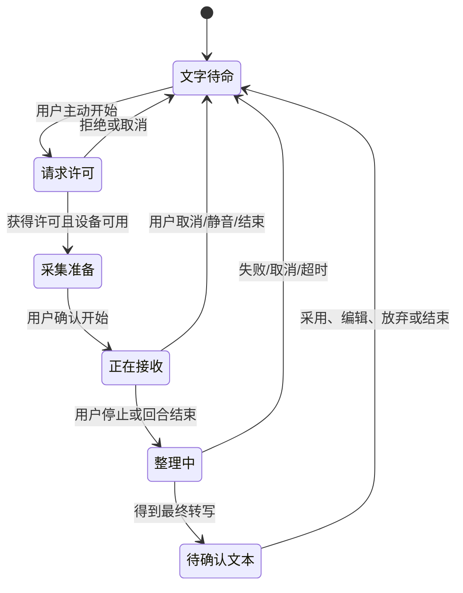
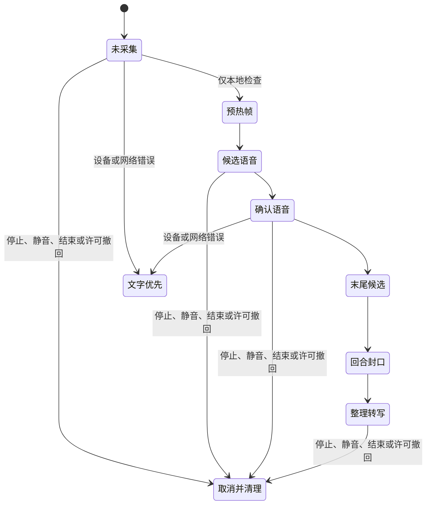
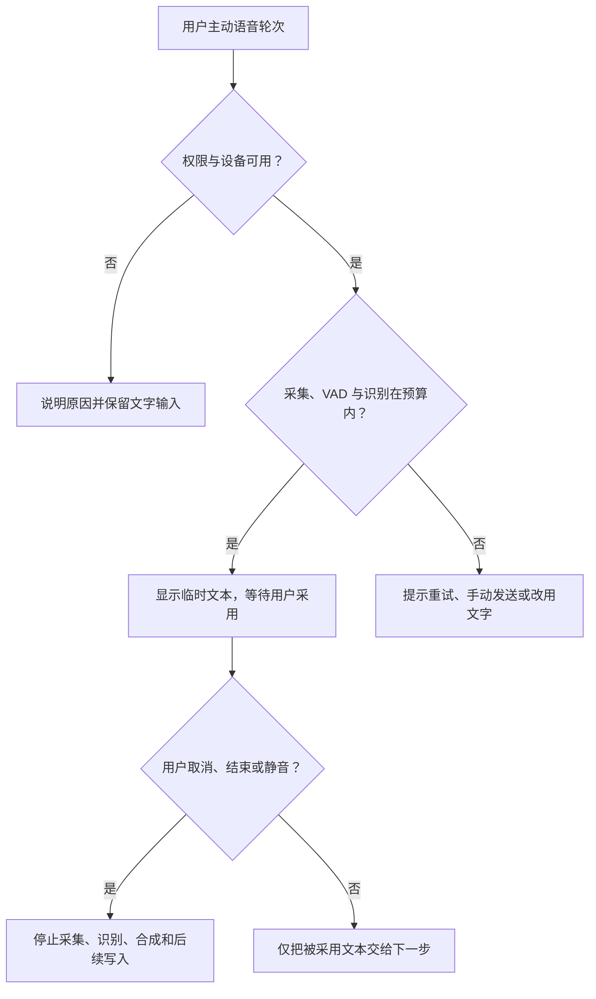

# 语音输入、VAD 与 ASR 链路

> 文档性质：0→1 工程执行方案。本文规定语音输入何时可以开始、什么音频可以被接收、何时形成一个回合、转写在何种状态下可被采用，以及任何失败时如何把用户带回完整的文字路径。
>
> 核心判断：语音不是一个持续打开的“自然入口”。它是用户在当下主动发起、能随时停止、默认最小收集、且绝不以环境声音代替用户意图的一次受控回合。

> 方案形成时间：2026-01-28。

## 1. 施工目标、前序决策与边界

### 1.1 需要交付的能力

陪看场景里，用户可能正看比赛、戴着耳机、处于嘈杂环境、手不方便操作，或者根本不愿意开口。语音输入的价值是降低某些时刻的手部负担，而不是增加一条持续采集、自动判断情绪或要求用户跟随服务节奏的通路。

首轮要交付一条清晰链路：


每个箭头都能被停止、取消、失败或降级。最终用户能明确回答四件事：现在是否正在接收我的声音？我说的话是否正在被整理？这段文字是否确定？我如何立即停止并改用文字？

### 1.2 本文继承的前序决策

本篇的施工以如下已确定原则为边界：

| 前序决策 | 对语音链路的直接要求 |
| --- | --- |
| 用户控制高于角色表达完整性 | 停止、静音、结束和改用文字必须能中断采集、上传、转写和后续输出 |
| 事实、观点、情绪和用户表达分离 | 转写文本不是赛事事实，也不能因说得流畅而提升可信度 |
| 默认保护隐私与防剧透 | 麦克风不用于推测观看进度、旁人身份或环境内容；事实仍受延迟资格约束 |
| 文字路径必须完整可用 | 未获许可、设备不可用、转写不确定时，用户仍可提问、控制和结束本场 |
| 每个本场会话独立 | 语音回合、临时转写和偏好不能串到其它会话或其它使用者 |
| 不以拟人关系换取停留 | 角色不得以“继续听我说”“别关麦”诱导用户维持语音 |

### 1.3 非目标

首轮不建设以下能力：全天候或后台收音；自动唤醒词；根据音色推断年龄、身份、情绪、健康、关系或脆弱性；声纹识别；环境声分类；录制和分析比赛转播；把旁人声音归属给当前用户；把原始音频用于不透明的模型训练；把语音当成打开付费、删除、账户或高风险操作的唯一凭据。

浏览器有麦克风权限不等于用户同意持续收集。用户曾在上一场比赛使用语音，也不等于新场次可以自行开麦。任何自动恢复都只能恢复“语音入口可再次选择”，不能恢复正在采集、正在上传或刚才没有说完的状态。

### 1.4 明确假设

**编号：H1**
- **假设**：按住或点击后才开始收音，用户能理解并接受
- **失效风险**：用户以为一直没在收音，或以为刚点就已保存
- **首轮应对**：用持续可见状态、开始提示与立即停止验证

**编号：H2**
- **假设**：近讲语音和常见背景噪声下，语音活动判定足以切分短回合
- **失效风险**：电视解说或朋友谈话被当作命令
- **首轮应对**：环境不确定时只给文字预览，不自动执行动作

**编号：H3**
- **假设**：用户愿意编辑或重说不确定的转写
- **失效风险**：用户觉得被误解且无法修正
- **首轮应对**：保留编辑、取消、改文字三条等价路径

**编号：H4**
- **假设**：先显示临时文字再等待最终文本，比长时间无反馈更易理解
- **失效风险**：临时文字被当成已被服务采纳
- **首轮应对**：明确“仍在整理”状态，只有最终文本可进入下一步

**编号：H5**
- **假设**：短回合优于自动持续对话
- **失效风险**：用户想长说但被过早截断
- **首轮应对**：提供继续说与再次开始，不延长默认收音

**编号：H6**
- **假设**：将音频最小化和会话隔离做在入口处足以减少风险
- **失效风险**：诊断记录意外保存了敏感内容
- **首轮应对**：诊断仅留技术摘要，原始音频与完整转写分层清理

### 1.5 完成定义

首轮完成不等于“浏览器能转文字”。必须同时证明：未主动开启时不存在可上传音频；许可被拒绝时文字路径无损可用；停止动作能阻断在途分段；背景声和不确定转写不会执行敏感动作；临时文本不会被当作事实或永久记忆；一个会话的音频、文本和状态不会出现在另一个会话；网络、识别或设备异常时不会自动重开麦、补传旧音频或继续播放旧回答。

## 2. 权限、告知与音频格式

### 2.1 权限是三件不同的事

“开启语音”不能被设计成一个覆盖所有用途的开关。至少要区分输入许可、输出偏好和保存选择。

**权限或选择：麦克风输入**
- **用户问题**：“现在可以接收我这一轮的声音吗？”
- **首轮默认**：仅在用户主动开始的一轮内有效
- **可见控制**：开始、停止、取消与状态灯

**权限或选择：声音输出**
- **用户问题**：“回答是否通过声音播放？”
- **首轮默认**：保持静音或由用户明确选择
- **可见控制**：本场静音、音量、仅文字

**权限或选择：转写保留**
- **用户问题**：“文本是否在本场后继续存在？”
- **首轮默认**：默认只保留完成当前回合的最少内容
- **可见控制**：范围说明、删除与不保留选项

**权限或选择：诊断同意**
- **用户问题**：“能否保留不含语义内容的质量摘要？”
- **首轮默认**：默认最少，不收集原始声音
- **可见控制**：单独说明、可关闭

浏览器的麦克风许可由用户代理管理；W3C Media Capture and Streams 规范强调必须经过用户许可。产品层还需做自己的即时告知，不能把浏览器弹窗当作全部解释。用户在点击“开始说话”前，应在同一视野内看到：只会在本回合接收声音、如何立即停止、不会把环境声音当比赛事实、以及文字始终可用。

### 2.2 许可状态机



状态的用户语言要与真实行为一致。`请求许可` 显示“正在请求麦克风许可，尚未开始接收”；`正在接收` 显示“正在听，本轮可随时停止”；`整理中` 显示“已停止接收，正在整理文字”；`待确认文本` 显示“这段文字可以编辑、发送或放弃”。不可显示“正在听”却已经停止采集，也不可在用户认为结束后继续等待浏览器缓存的音频分段。

### 2.3 格式策略：浏览器采集与识别输入分离

浏览器采集格式受设备、操作系统和用户代理影响，不能假定所有设备直接产出同一采样率、通道数或容器。传输与识别层因此采用显式规范化，而不是让每个客户端自行猜测。

**层次：浏览器采集**
- **推荐首轮形态**：`MediaStreamTrack` 单一麦克风轨道
- **原因**：能遵守用户代理的权限与设备边界
- **不允许**：把屏幕、系统音频或未知轨道混入

**层次：本地预处理**
- **推荐首轮形态**：单声道、浮点帧、固定时长切片
- **原因**：便于 VAD 和电平显示
- **不允许**：将原始长录音整体缓存在本机

**层次：传输载荷**
- **推荐首轮形态**：低码率 Opus 分帧或明确协商的 PCM
- **原因**：适应实时网络与带宽变化
- **不允许**：没有版本字段的私有二进制格式

**层次：识别输入**
- **推荐首轮形态**：服务统一规范化为单声道、固定采样率、线性 PCM 或供应方明示格式
- **原因**：让 VAD、ASR 和诊断遵循同一时间轴
- **不允许**：让不同客户端用不同隐含采样率上传

**层次：文本输出**
- **推荐首轮形态**：UTF-8、语言与置信状态分开
- **原因**：防止显示层误把临时文本当最终文本
- **不允许**：把文字和音频拼成不可分离的日志

Opus 的 RFC 6716 描述了面向交互音频的开放编解码基线。是否采用 Opus、每帧长度、目标码率和识别采样率仍是待验证工程参数，不应把任何厂商样例的数值当作通用事实。首轮把参数写入会话协商结果，使问题可以按设备、网络和语言被追溯，而不是靠隐藏默认值。

### 2.4 音频协商合同

创建语音回合时，客户端先获得一份短期协商结果，包含本回合识别语言、最大时长、最大静默、音频格式版本、允许的编码清单、帧时长范围、上传地址和过期时刻。协商成功不代表已开始录音；只有用户明确进入`正在接收`后才可以发送音频帧。

```json
{
  "voice_turn_id": "vt_01J9Q...",
  "watch_session_id": "ws_01J9Q...",
  "capture_permission": "user_initiated",
  "audio_contract": {
    "version": "v1",
    "channels": 1,
    "encoding": ["opus", "pcm_s16le"],
    "frame_ms": { "min": 20, "max": 60 },
    "max_turn_seconds": 30,
    "max_silence_ms": 1800
  },
  "expires_at": "2026-01-28T20:16:00Z"
}
```

这里的 `max_turn_seconds` 与 `max_silence_ms` 是防止意外长时间采集的保护上限，不是服务评价用户说话方式的标准。达到上限时，先停止接收、保留可编辑文字并允许用户再开一轮；绝不能悄悄延长收音以“更完整地理解”。

### 2.5 设备、回声与环境声音

首轮允许用户选择输入设备，并在开始前展示最小可用检查：设备存在、浏览器许可状态、可选的输入电平、文字替代入口。电平只用于告知“似乎有声音/过于安静”，不构成身份、情绪或观看环境推断。

回声消除、自动增益和噪声抑制可作为用户代理或音频引擎提供的可选能力；它们应被当作体验工具，而不是准确性保证。若电视解说、朋友交谈或回声使 VAD 不稳定，系统宁可显示“环境较嘈杂，可以改用文字或按住说话”，也不自信地把背景内容拆成用户命令。

## 3. 采集与 VAD：识别“有人说话”不等于识别“用户想做什么”

### 3.1 VAD 的职责边界

VAD（Voice Activity Detection，语音活动判定）只解决“当前音频片段是否像语音、何时可能开始或结束”的时间分段问题。它不负责理解文本含义、识别说话者、判断情绪、推断年龄、判定谁在看比赛，更不能决定一条命令是否合法。将这些职责混给 VAD，会导致噪声环境下的误触发被包装成智能。

VAD 的输出只有受控枚举：`silence`、`speech_candidate`、`speech_active`、`end_candidate`、`uncertain`。`uncertain` 是有效结果，不得被强行折算为语音或静默。出现不确定时，界面保持“仍在等待你的明确表达”，并提供停止、继续说和文字输入。

### 3.2 分段状态机



预热帧只用于在本地确认设备已开始产生音频，不应越过最短必要时长，也不发送到远端。确认语音后才按协商格式发送分段。末尾候选阶段用于处理自然停顿，不能一出现短暂停顿就切断用户，更不能把停顿当作服务获得讲话权。

### 3.3 首轮参数的研究口径

下列参数是可调整的安全假设，应记录版本并在不同语言、口音、设备和噪声条件下验证。不要把它们写成用户必须适应的硬规则。

**参数：帧长度**
- **初始保守范围**：20–60 毫秒
- **影响**：响应感与传输开销
- **错误方向的后果**：过短增加抖动，过长拖慢停止生效

**参数：起始确认**
- **初始保守范围**：连续若干短帧，结合最小能量门
- **影响**：防止瞬时噪声触发
- **错误方向的后果**：过敏会录到环境声，过钝会吞掉开头

**参数：尾部静默**
- **初始保守范围**：约 1–2 秒的可配置窗口
- **影响**：自然停顿与回合结束
- **错误方向的后果**：太短打断用户，太长造成收音焦虑

**参数：最大回合**
- **初始保守范围**：约 20–30 秒的保护上限
- **影响**：避免意外持续采集
- **错误方向的后果**：太短影响表达，太长扩大收集范围

**参数：前置缓冲**
- **初始保守范围**：极短、仅本地、只保留给已确认起始
- **影响**：避免吞掉首音节
- **错误方向的后果**：过长会保存无意声音

**参数：不确定阈值**
- **初始保守范围**：独立于事实和命令阈值
- **影响**：保留“无法判断”
- **错误方向的后果**：强行二分会增加误触发

所有参数必须由配置版本标识。发生误切分时，能知道是设备、语言、网络、浏览器、参数版本还是用户控制引起，而不是只留下“VAD 失败”这一句不可行动的诊断。

### 3.4 用户可见状态与控制

**VAD/采集状态：预热**
- **用户看到的状态**：“正在准备麦克风，尚未发送内容。”
- **可用动作**：取消、改文字、结束
- **服务不得做什么**：把预热音频上传或写入记录

**VAD/采集状态：等待说话**
- **用户看到的状态**：“准备好了，开始说话后会显示文字。”
- **可用动作**：停止、按住说话、改文字
- **服务不得做什么**：把电视声解释成开始

**VAD/采集状态：正在接收**
- **用户看到的状态**：“正在听，可随时停止。”
- **可用动作**：停止、静音、结束
- **服务不得做什么**：播放角色声音与用户抢话

**VAD/采集状态：末尾候选**
- **用户看到的状态**：“你还可以继续说，或现在结束这一段。”
- **可用动作**：继续、停止、文字
- **服务不得做什么**：自行把停顿解释为确认

**VAD/采集状态：整理中**
- **用户看到的状态**：“已停止接收，正在整理文字。”
- **可用动作**：取消本轮、文字提问、结束
- **服务不得做什么**：继续使用麦克风

**VAD/采集状态：不确定**
- **用户看到的状态**：“没有听清楚，可以编辑、重说或改用文字。”
- **可用动作**：编辑、重说、取消
- **服务不得做什么**：自动执行可能错误的意图

### 3.5 VAD 与打断的关系

若角色声音正在播放，用户开始说话可以作为“需要抢回输入权”的一个信号，但仍不能替代明确停止控制。正确顺序是先停止角色播放、显示用户输入状态，再开始新回合的语音活动判定。若检测到的只是背景声或回声，服务最多暂停自身输出并等待更明确输入，不能把背景内容转成新的任务。

用户按下停止、切换到文字、切换严格保护或结束本场时，优先级高于 VAD 的任何结果。音频分段、等待的识别请求和尚未生成的回应都应收到取消标记；即使底层网络稍后送达残余帧，也必须因为回合已失效而丢弃。

## 4. 流式 ASR：临时文本、最终文本与用户采用是三件事

### 4.1 转写状态模型

ASR（Automatic Speech Recognition，自动语音识别）负责把已获授权的音频转成候选文字。它的每个输出都携带回合标识、分段序号、语言、状态与版本，绝不以“收到了字符串”作为可直接驱动后续动作的理由。

**状态：`partial`**
- **含义**：当前片段的临时假设
- **是否可显示**：可以，必须带“仍在整理”
- **是否可用于执行动作**：不可以

**状态：`stabilizing`**
- **含义**：文本趋于稳定但音频仍未封口
- **是否可显示**：可以，允许用户编辑
- **是否可用于执行动作**：不可以

**状态：`final`**
- **含义**：回合已封口后的最终转写候选
- **是否可显示**：可以
- **是否可用于执行动作**：仅经过任务与风险门后

**状态：`edited_by_user`**
- **含义**：用户修改后的文本
- **是否可显示**：可以
- **是否可用于执行动作**：按文字输入规则处理

**状态：`rejected`**
- **含义**：用户放弃或系统无法使用
- **是否可显示**：只显示必要说明
- **是否可用于执行动作**：不可以

**状态：`expired`**
- **含义**：回合、会话或授权已失效
- **是否可显示**：不再显示为可发送
- **是否可用于执行动作**：不可以

“最终”仅表示识别器不再改写这一段，不表示内容真实、意图明确、比赛事实正确或用户希望立即执行。对结束本场、切换模式等低风险控制，应使用显式按钮或经确认的结构化选择；不能仅凭转写文本中的相似字词完成高影响动作。

### 4.2 音频分段与文本版本信封

每个帧与每次识别结果都使用可去重、可排序的信封。建议结构：

```json
{
  "voice_turn_id": "vt_01J9Q...",
  "segment_id": "seg_0007",
  "sequence": 7,
  "audio_offset_ms": 420,
  "duration_ms": 40,
  "format_version": "v1",
  "capture_state": "speech_active",
  "sent_at": "2026-01-28T20:15:42Z"
}
```

对应的转写结果：

```json
{
  "voice_turn_id": "vt_01J9Q...",
  "transcript_version": 5,
  "range": { "from_segment": "seg_0001", "to_segment": "seg_0007" },
  "state": "partial",
  "language": "zh-CN",
  "text": "刚才那个判罚",
  "confidence_band": "uncertain"
}
```

分段序号只在一条语音回合内递增。服务器遇到重复 `segment_id` 时确认接收但不重复送入识别；遇到跳号时标记缺口并请求恢复或提前封口；遇到来自已取消回合的帧时直接拒绝。转写版本单调增加，客户端只显示同一回合最新有效版本，不让晚到的旧临时文本覆盖已编辑或已最终文本。

### 4.3 流式回合流程

1. 用户主动开始语音，取得短期协商结果；
2. 客户端进入预热并显示尚未发送；
3. VAD 达到起始确认后，创建分段并以连续序号上传；
4. 识别服务可返回 `partial`，客户端显示临时文字与停止入口；
5. 用户停止、VAD 到达末尾条件或保护上限触发后，客户端发送封口；
6. 识别服务返回 `final` 或不确定结果；
7. 用户可以发送、编辑后发送、重说、取消或改用文字；
8. 只有被采用的文字才进入问题理解、事实核对或角色表达流程；
9. 回合结束后撤销上传凭据，进入最小保留和清理。

第 7 步是重要的人类确认边界。对于闲聊或低风险提问，用户可在设置中选择“最终文字自动发送”，但这仍需在本场明确开启，并且任何不确定、敏感、控制或事实影响较大的内容都回到可见确认。默认不把“用户没有点取消”解释成“用户同意发送”。

### 4.4 语言、混说与不可识别内容

识别语言可以由用户主动选择或从当前回合的短期信号提出候选，但不能据此建立长期语言画像。语言不确定、中文与其它语言混说、口音、方言、球员名和噪声都会降低可靠性。此时服务应展示“这段文字可能不准确”，并优先给编辑、重说、选择关键词或文字输入，不要装作理解了再生成长篇回答。

球员、球队和战术术语可使用本场受控词表辅助纠错，但词表不能把任意相似声音强行替换成一个“更像足球”的名字。若用户说的是旁人姓名、情绪表达或非比赛话题，词表不应覆盖原始候选。任何词表更新都要版本化，并能回看其是否增加了误替换。

### 4.5 错误分类与用户恢复

> 信息卡：原宽表已改为纵向阅读，字段含义不变。

- **错误：许可被拒绝**
  - **检测位置**：浏览器入口
  - **用户语言**：“没有麦克风许可，仍可完整使用文字。”
  - **恢复方式**：改文字、稍后再试
  - **不允许**：反复弹许可框

- **错误：设备不可用**
  - **检测位置**：采集准备
  - **用户语言**：“暂时找不到可用麦克风。”
  - **恢复方式**：选择设备、改文字
  - **不允许**：假装正在听

- **错误：无有效语音**
  - **检测位置**：VAD
  - **用户语言**：“没有听到清楚的语音。”
  - **恢复方式**：重说、按住说话、文字
  - **不允许**：继续后台收音

- **错误：分段缺失**
  - **检测位置**：上传边界
  - **用户语言**：“这段语音没有完整送达。”
  - **恢复方式**：放弃本轮、重说、文字
  - **不允许**：用缺帧文本执行动作

- **错误：识别超时**
  - **检测位置**：识别边界
  - **用户语言**：“这次没能及时整理成文字。”
  - **恢复方式**：改文字、重说、结束
  - **不允许**：一直显示处理中

- **错误：低可信文本**
  - **检测位置**：转写结果
  - **用户语言**：“这句话可能没有听清。”
  - **恢复方式**：编辑、重说、取消
  - **不允许**：自动发送或保存为记忆

- **错误：会话已结束**
  - **检测位置**：控制边界
  - **用户语言**：“本场已经结束，语音已停止。”
  - **恢复方式**：新场次或文字入口
  - **不允许**：恢复旧上传

- **错误：安全规则阻断**
  - **检测位置**：内容边界
  - **用户语言**：“这段内容不能用语音直接完成。”
  - **恢复方式**：文字确认、退出或支持入口
  - **不允许**：让角色绕过限制

## 5. 隐私、最小化与数据生命周期

### 5.1 三类资料，三条生命周期

语音链路中最容易出错的地方，是把原始音频、临时文本和质量指标放入一个不透明的“语音日志”。它们的敏感性、用途和清理时机不同，必须分开。

**类别：原始音频帧**
- **最小用途**：完成当前流式识别
- **首轮保留原则**：传输完成、取消或超时后立即清理；不做默认长期保存
- **明确禁止用途**：用于训练、声纹、情绪或环境分析

**类别：临时转写**
- **最小用途**：让用户校对当前回合
- **首轮保留原则**：回合结束或用户放弃后清理
- **明确禁止用途**：进入长期记忆、跨会话检索

**类别：已采用文字**
- **最小用途**：回答当前问题或执行低风险用户任务
- **首轮保留原则**：按会话和用户选择的最短范围处理
- **明确禁止用途**：伪装成比赛事实或自动关系推断

**类别：技术摘要**
- **最小用途**：诊断质量与异常
- **首轮保留原则**：只含时长、状态、错误类别、格式版本等
- **明确禁止用途**：保存完整文本、音频、设备指纹

任何资料保留都必须能回答“为了什么”“保留多久”“谁能访问”“如何停止”。若不能给出清楚答案，默认不保留。删除请求、会话结束或安全冻结发生时，原始音频与临时文本的清理优先于便利的重连或问题排查。

### 5.2 旁人声音与敏感表达

用户可能在客厅、酒吧、看台或通勤途中说话，录入的音频可能包含旁人、儿童、转播解说、私人谈话或敏感内容。服务不尝试识别这些人的身份，也不把多说话者内容拆分归档。环境声音导致的不确定只应使系统更保守：暂停、请求用户确认、改文字或直接放弃本轮。

用户转写也可能出现健康、财务、身份、联系方式、对他人的评价或令人不安的表达。输入层不需要为了“理解得更好”而要求用户重复敏感内容。必要时只提示可改用文字、结束或获取适当支持；不得把脆弱表达变成角色关系、推送频率或记忆强度的信号。

### 5.3 会话隔离与共享设备

语音回合必须绑定 `watch_session_id`、短期输入凭据和单次 `voice_turn_id`。进入其它场次、切换匿名会话、借用设备或结束本场后，旧回合凭据立即失效。服务不能从本机残留的文本自动恢复“上次你说到哪里”，也不能因为设备相同就将上一个人的语言、声音输出或转写显示给下一个人。

共享设备上，默认不显示历史转写、不自动保存草稿、不恢复麦克风状态。重新打开页面只能看到文字待命与重新开始入口。若用户主动要求继续上一轮，仍需先确认当前会话身份和本场状态，不能回放或补传旧声音。

### 5.4 安全、滥用与资源控制

语音端点必须同时防止未授权访问、超长上传、格式欺骗、重放、重试风暴和跨会话订阅。控制方式包括短期上传凭据、每回合长度上限、帧大小上限、格式白名单、连续序号、操作去重、速率限制和服务器侧取消检查。OWASP API Security Top 10 可作为对象授权、资源消耗与敏感业务流保护的公开参考。

安全控制不能以牺牲用户解释为代价。发生限制时，用户看到的是“这段语音无法继续处理，可以用文字或稍后再试”，而不是暴露配额、供应商、风险分数或其它使用者的信息。限制规则也不能根据用户情绪、身份猜测或角色关系来放宽。

## 6. 接口合同与实时消息

### 6.1 资源表面

**方法与路径：`POST /v1/voice-turns`**
- **作用**：为一次主动语音创建协商结果
- **去重要求**：`operation_id` 必填
- **结果**：返回回合标识与音频合同

**方法与路径：`POST /v1/voice-turns/{id}/start`**
- **作用**：标记用户已明确开始接收
- **去重要求**：`operation_id` 必填
- **结果**：回合进入可上传状态

**方法与路径：`POST /v1/voice-turns/{id}/frames`**
- **作用**：上传有序音频分段
- **去重要求**：`segment_id` 与序号必填
- **结果**：确认接收或拒绝原因

**方法与路径：`POST /v1/voice-turns/{id}/seal`**
- **作用**：封口并请求最终转写
- **去重要求**：`operation_id` 必填
- **结果**：返回整理状态

**方法与路径：`POST /v1/voice-turns/{id}/cancel`**
- **作用**：取消本轮并清理在途内容
- **去重要求**：`operation_id` 必填
- **结果**：返回取消版本

**方法与路径：`POST /v1/voice-turns/{id}/adopt`**
- **作用**：用户采用最终或编辑后的文字
- **去重要求**：`operation_id` 必填
- **结果**：返回文本任务状态

**方法与路径：`GET /v1/voice-turns/{id}`**
- **作用**：读取最小、当前回合状态
- **去重要求**：只读
- **结果**：返回不含原始音频的状态

客户端没有“下载原始音频”“列出其它回合”“按设备读取历史转写”“指定识别置信度为高”或“跳过采用确认”的公开路径。任何请求必须核验所属会话、短期凭据、回合状态和操作去重键。

### 6.2 创建和封口示例

```json
{
  "operation_id": "c9c0ddac-cfc6-49ef-96df-e8b56a4a54ef",
  "watch_session_id": "ws_01J9Q...",
  "language_hint": "zh-CN",
  "mode": "push_to_talk",
  "retain_transcript": false
}
```

```json
{
  "operation_id": "2b9bdb26-5feb-4a3c-912d-b617ce7332c0",
  "reason": "user_stopped",
  "last_segment_id": "seg_0016",
  "last_sequence": 16
}
```

封口后服务应回传 `processing`、`final`、`uncertain`、`cancelled` 或 `failed` 之一，并带 `transcript_version`。重复封口返回同一逻辑结果，不重新产生一份转写；已取消的回合拒绝新帧；已结束会话的回合只能被清理，不能恢复。

### 6.3 实时主题

**主题：`voice_turn.capture_changed`**
- **载荷**：采集状态与控制版本
- **是否允许合并**：否
- **客户端行为**：及时更新“是否正在听”

**主题：`voice_turn.transcript_partial`**
- **载荷**：临时文本与版本
- **是否允许合并**：可以被较新版本替代
- **客户端行为**：显示为未确认文字

**主题：`voice_turn.transcript_final`**
- **载荷**：最终文本候选
- **是否允许合并**：否
- **客户端行为**：提供采用、编辑、取消

**主题：`voice_turn.transcript_uncertain`**
- **载荷**：不确定原因类别
- **是否允许合并**：否
- **客户端行为**：不自动送入下一步

**主题：`voice_turn.cancelled`**
- **载荷**：取消版本与清理状态
- **是否允许合并**：否
- **客户端行为**：立即停止显示可发送状态

**主题：`voice_turn.degraded`**
- **载荷**：设备、网络或识别降级
- **是否允许合并**：可以合并
- **客户端行为**：转到文字优先

每条主题消息都包含会话标识、回合标识、主题内序号、状态版本和产生时间。客户端遇到序号跳跃时，获取当前回合状态而不是猜测缺少的临时文字。临时文本到达晚于用户编辑内容时，应被直接丢弃，绝不可覆盖用户自己的修改。

### 6.4 错误合同

**错误标识：`VOICE_PERMISSION_REQUIRED`**
- **条件**：尚未完成本轮输入许可
- **客户端可行动作**：发起用户可见许可或改文字
- **服务端约束**：不创建上传资格

**错误标识：`VOICE_TURN_NOT_ACTIVE`**
- **条件**：回合不是可接收状态
- **客户端可行动作**：读取状态、重新开始或取消
- **服务端约束**：不接受任何新帧

**错误标识：`AUDIO_FORMAT_UNSUPPORTED`**
- **条件**：编码、通道或帧长不符合合同
- **客户端可行动作**：改用协商格式或文字
- **服务端约束**：不尝试猜测转换

**错误标识：`SEGMENT_OUT_OF_ORDER`**
- **条件**：序号缺失或重复冲突
- **客户端可行动作**：获取状态、重新封口或重开
- **服务端约束**：不将缺口拼成完整回合

**错误标识：`TRANSCRIPT_NOT_FINAL`**
- **条件**：用户试图采用临时文本
- **客户端可行动作**：等待最终、编辑或改文字
- **服务端约束**：不执行高影响动作

**错误标识：`VOICE_TURN_CANCELLED`**
- **条件**：用户控制已取消回合
- **客户端可行动作**：回到文字待命
- **服务端约束**：不恢复或补传

**错误标识：`VOICE_RATE_LIMITED`**
- **条件**：回合或分段频率超出保护
- **客户端可行动作**：文字输入、短暂退避
- **服务端约束**：不泄露其它用户的容量

### 6.5 可复制运行命令

完成目录骨架后，建议提供以下统一入口。它们描述预期工作流，不表示任意机器已经具备服务或凭据。

```powershell
docker compose up -d postgres redis
pnpm -C apps/web run voice:check
go -C services/voice run ./cmd/ingest
go -C services/voice run ./cmd/recognition
go -C services/voice run ./cmd/scenario --case permission-denied
```

预期现象：`voice:check` 显示浏览器能力、文字替代和不打开麦克风的原因；接收服务只接受有效回合的有序分段；识别服务返回带状态的临时或最终文本；情境运行器在许可拒绝时证明没有远端音频与文字路径仍可用。

可以用以下请求检查控制优先级：

```powershell
$headers = @{ Authorization = "Bearer <session-token>"; "Idempotency-Key" = "<operation-id>" }
Invoke-RestMethod -Method Post -Uri "http://localhost:8080/v1/voice-turns" -Headers $headers -ContentType "application/json" -Body '{"watch_session_id":"ws_demo","mode":"push_to_talk","retain_transcript":false}'
Invoke-RestMethod -Method Post -Uri "http://localhost:8080/v1/voice-turns/<id>/cancel" -Headers $headers -ContentType "application/json" -Body '{"operation_id":"<operation-id>","reason":"user_cancelled"}'
Invoke-RestMethod -Method Get -Uri "http://localhost:8080/v1/voice-turns/<id>" -Headers $headers
```

预期结果是取消后状态为 `cancelled`、上传资格失效、没有可采用的转写文本。重复取消应返回同一取消结论，而不是生成额外清理或额外消息。

## 7. 延迟、背压与文字优先降级

### 7.1 端到端等待不是一个数字

用户体验到的是从点击开始、看见正在接收、看见临时文字、停止、获得最终文本、选择采用到得到回应的完整过程。单独优化网络往返而忽略权限、分段、识别排队、事实确认或用户校对，无法让体验变得可信。

**阶段：许可与设备**
- **用户可感知问题**：“我点了以后到底有没有开始？”
- **保护目标**：快速给出清楚状态
- **超出预算时的动作**：直接给文字替代，不长时间空等

**阶段：VAD 起始**
- **用户可感知问题**：“开头有没有被吞掉？”
- **保护目标**：保留最少首音并可见
- **超出预算时的动作**：提示重说或按住说话

**阶段：分段上传**
- **用户可感知问题**：“我说的话是否送到了？”
- **保护目标**：有序、可取消、不过量积压
- **超出预算时的动作**：停止新增分段，封口或改文字

**阶段：流式转写**
- **用户可感知问题**：“为什么文字一直在变？”
- **保护目标**：临时与最终清楚分开
- **超出预算时的动作**：只保留最新临时结果

**阶段：最终转写**
- **用户可感知问题**：“它什么时候能听懂？”
- **保护目标**：给可行动的等待或失败说明
- **超出预算时的动作**：允许编辑和文字继续

**阶段：后续回答**
- **用户可感知问题**：“这还值得等吗？”
- **保护目标**：不用过期回答打断比赛
- **超出预算时的动作**：超时后静默或只留文字

具体阈值应按设备、网络、语言和用户研究逐步确定。首轮不宣传“毫秒级识别”或“实时听懂”，只承诺状态诚实、可停止和文字可用。

### 7.2 背压策略

当网络、识别服务或渲染端跟不上输入时，系统必须优先保护用户控制和资料最小化，而不是无限缓存音频。建议顺序：

1. 优先传递停止、取消、结束和状态消息；
2. 合并未显示的临时转写，只保留最新版本；
3. 限制在途音频帧数，到达阈值后提示用户“这段语音未能实时送达”；
4. 对尚未上传的本地音频执行最短清理，不转为后台长录音；
5. 让用户选择重新开始短回合或切到文字；
6. 停止主动声音输出，避免输入延迟与输出打断相互放大。

“服务忙”不能成为继续占用麦克风的理由。若上传队列持续增长，正确答案是停止本轮并保留用户选择，而非让用户在不知情的情况下多说几十秒。

### 7.3 降级层级



**级别：D0 语音可用**
- **触发**：许可、设备、网络、识别均可解释
- **保留**：短回合、临时文本、最终校对
- **停止**：无

**级别：D1 谨慎语音**
- **触发**：噪声、轻微延迟或低可信增加
- **保留**：按住说话、文字预览、停止入口
- **停止**：自动采用、长回合、强主动输出

**级别：D2 文字优先**
- **触发**：识别不稳定、积压或格式异常
- **保留**：完整文字输入、事实状态、结束
- **停止**：新音频上传和语音输出

**级别：D3 语音暂停**
- **触发**：许可、隔离、取消或安全边界异常
- **保留**：文字、退出、问题说明
- **停止**：全部语音能力和自动恢复

从 D2 或 D3 恢复时，系统不能自动重新打开麦克风。恢复只使“开始语音”按钮重新可用，且要重新走许可、设备和会话有效性检查。此前未完成的回合保持取消或过期，不续传、不续播、不要求用户重复敏感内容。

## 8. AI 协作提示词：限制工具的范围和证明责任

以下提示词用于将具体施工任务交给 AI 协作工具。每次必须提供当前契约版本和目标目录，并要求工具先列出改动、风险、验证情境与停止条件。若工具无法证明不会扩大收音范围、不会保存原始声音或不会绕过用户控制，应停止而不是编造方案。

### 8.1 提示词一：构建采集与 VAD 状态

```text
你正在建设足球陪看服务的一次性语音输入链路，范围只包括用户主动开始后的浏览器采集、VAD 状态和回合取消。

硬约束：默认不开麦；预热帧不上传；VAD 只做语音活动分段，不识别身份、情绪、环境或比赛内容；用户停止、静音、结束、切换文字的优先级最高；背景声音不得被当作用户命令；取消后所有上传资格立即失效。

输入：[前端目录]、[实时契约目录]、[会话控制字段]。
输出必须依次包含：
1. 采集与 VAD 状态枚举、合法转换和用户可见文案；
2. 音频格式协商字段、帧序号、上限与去重规则；
3. 本地清理、在途取消和网络异常的处理；
4. 至少十个许可、噪声、静默、打断、取消和重连情境；
5. 目标运行命令、预期结果与需要人工决定的参数。

禁止：自动唤醒、后台收音、声纹、环境分析、把 VAD 判定直接转换为业务动作、无限缓存、为了演示方便跳过权限或结束状态。信息不足时列出问题并停止。
```

### 8.2 提示词二：构建流式转写与文本采用

```text
请为一次短语音回合建立流式 ASR 合同。任务不是让文字尽快出现，而是保证临时文本、最终文本、用户编辑和用户采用彼此不混淆。

约束：partial 和 stabilizing 只能展示，不能驱动动作；final 仍只是转写候选；敏感、控制和不确定内容需要明确确认；用户编辑覆盖晚到的临时文本；回合取消、会话结束、删除优先级必须拒绝后续帧和结果；原始音频默认不保存。

请输出：事件信封、版本关系、缺帧与重放处理、错误合同、最小资料生命周期、12 个边界情境、可运行命令及回退路径。不得把转写当事实、记忆或身份线索；不得自动重开麦或补发旧回合。
```

### 8.3 提示词三：审查语音改动是否越界

```text
请审查以下语音输入改动：[粘贴改动]。

按顺序判定：
1. 是否存在用户未主动开始时的音频接收或保存；
2. 是否把环境声、旁人声音、声纹、情绪或设备行为用于推断用户；
3. 是否允许临时/不确定转写直接执行动作；
4. 是否在停止、静音、结束或删除后仍接受帧、恢复旧回合或继续输出；
5. 是否泄露另一会话的文本、设备状态或声音偏好；
6. 识别或网络失败时，文字路径是否仍完整可用。

输出“允许 / 需要修改 / 拒绝”，并给出最小修正、所需验收情境和无法证明的风险。没有证据时不得给出允许。
```

## 9. 施工顺序、阶段变更记录与验收

### 9.1 分阶段交付

**阶段：P1 许可与格式**
- **目标**：让开始、停止、设备和格式协商可解释
- **交付物**：许可状态机、音频合同、文字替代
- **放行条件**：未开始前没有远端音频

**阶段：P2 采集与分段**
- **目标**：建立 VAD、序号、取消和上限
- **交付物**：分段信封、回合状态、清理动作
- **放行条件**：噪声与停止不会产生错误上传

**阶段：P3 流式转写**
- **目标**：区分临时、最终、编辑和采用
- **交付物**：转写版本、错误合同、编辑界面
- **放行条件**：临时文本不能驱动动作

**阶段：P4 降级与恢复**
- **目标**：覆盖识别失败、网络拥塞和会话结束
- **交付物**：降级策略、恢复流程、验收材料
- **放行条件**：不自动重开麦或补播旧内容

每阶段结束保留最小变更说明：用户风险、合同版本、已运行情境、参数假设、已知限制、清理策略和回退方式。记录名称要描述用户结果，例如“取消语音后拒绝迟到分段”“不确定转写只能编辑不能采用”，避免“语音能力完成”这类没有边界的结论。

### 9.2 运行前检查

```powershell
node --version
pnpm --version
go version
docker compose ps
Get-ChildItem .\contracts\voice
```

预期结果：运行时版本符合环境基线、依赖处于可达状态、语音契约目录存在。任一检查失败时，先处理环境或合同缺口；不得以写死设备名称、关闭许可检查、强制快速模式或跳过会话核验来取得表面可用。

### 9.3 验收情境矩阵

**编号：V1**
- **初始条件**：首次进入本场
- **操作**：不点击语音入口
- **预期结果**：不请求麦克风，不出现上传凭据

**编号：V2**
- **初始条件**：用户点击开始
- **操作**：拒绝浏览器许可
- **预期结果**：立即回到文字路径，无重试骚扰

**编号：V3**
- **初始条件**：许可已获得
- **操作**：用户在准备状态取消
- **预期结果**：不发送预热音频，状态明确结束

**编号：V4**
- **初始条件**：正在接收
- **操作**：用户点击停止
- **预期结果**：停止新帧、封口或取消，界面更新

**编号：V5**
- **初始条件**：电视声音较大
- **操作**：没有用户明确讲话
- **预期结果**：不形成可采用文本或业务动作

**编号：V6**
- **初始条件**：识别返回临时文字
- **操作**：用户编辑文字
- **预期结果**：晚到临时版本不能覆盖编辑内容

**编号：V7**
- **初始条件**：最终转写低可信
- **操作**：用户不做确认
- **预期结果**：不自动发送或保存为长期资料

**编号：V8**
- **初始条件**：回合仍有在途帧
- **操作**：用户结束本场
- **预期结果**：迟到帧被拒绝，不能恢复回合

**编号：V9**
- **初始条件**：网络积压
- **操作**：音频帧超过在途上限
- **预期结果**：停止收音并提供文字，不缓存长录音

**编号：V10**
- **初始条件**：会话重连
- **操作**：之前有未完成转写
- **预期结果**：不自动开麦、不补传、不续播

**编号：V11**
- **初始条件**：共享设备
- **操作**：切换匿名会话
- **预期结果**：看不到上一会话的转写或状态

**编号：V12**
- **初始条件**：声音输出播放中
- **操作**：用户开始一轮新语音
- **预期结果**：先停止旧输出，再进入本轮输入

**编号：V13**
- **初始条件**：转写含敏感内容
- **操作**：用户取消
- **预期结果**：内容不进入记忆或公共事实

**编号：V14**
- **初始条件**：语音服务不可达
- **操作**：用户选择语音
- **预期结果**：解释故障，完整保留文字、静音和结束

### 9.4 放行门槛与反指标

只有满足以下门槛才允许扩大设备范围、增加语言或缩短保护窗口：

1. 用户能在不打开麦克风的情况下完成全部首轮任务；
2. 开始、正在接收、停止、整理和结束状态可被参与者正确复述；
3. 背景声、断线、重复分段和晚到结果均不会产生未授权动作；
4. 临时或低可信转写没有进入事实、记忆或高影响控制路径；
5. 取消、静音和结束会阻断所有在途语音能力；
6. 不同会话间没有音频、文本、状态或偏好串线；
7. 无障碍用户能用文字、键盘或明确控制替代语音完成同一任务。

反指标包括：平均转写速度看似很快但用户误解状态；用户因为“怕丢一句话”不敢停止；语音打开率上升但文字路径退化；为提高识别成功而扩大收音时长；将用户口音、情绪或旁人声音记录为产品特征。它们都不能被“互动更自然”抵消。

## 10. 风险、降级与事故处置

### 10.1 风险表

**风险：许可语义不清**
- **早期信号**：用户反复开关、误以为持续收音
- **立即保护**：收缩为一轮一授权，改进状态提示
- **用户说明**：“只在你主动开始的一轮内接收声音。”

**风险：VAD 误触发**
- **早期信号**：环境声形成大量空回合
- **立即保护**：提高不确定分支，要求显式确认
- **用户说明**：“环境较嘈杂，可以按住说话或改文字。”

**风险：转写错字影响理解**
- **早期信号**：编辑率和放弃率上升
- **立即保护**：禁止自动采用，保留编辑
- **用户说明**：“这句话可能没有听清。”

**风险：音频积压**
- **早期信号**：在途帧、封口等待持续增加
- **立即保护**：停止新采集，切文字
- **用户说明**：“这次语音没有及时送达，文字仍可用。”

**风险：会话串线**
- **早期信号**：回合与订阅会话标识不匹配
- **立即保护**：冻结语音、撤销凭据、调查范围
- **用户说明**：“语音暂不可用，可以继续用文字。”

**风险：删除未生效**
- **早期信号**：取消后仍有识别结果出现
- **立即保护**：停止相关通路，优先清理
- **用户说明**：“这轮语音已停止处理。”

**风险：高风险内容误执行**
- **早期信号**：临时文本触发控制请求
- **立即保护**：强制用户确认，回退文字
- **用户说明**：“这项操作需要你在文字中确认。”

### 10.2 事故顺序

若发生误收音、误转写外露、取消后仍处理、跨会话显示或服务把环境声当成用户请求，处理顺序必须是：停止新采集与播放 → 使回合和上传凭据失效 → 阻断识别及后续采用 → 确定受影响的最小范围 → 给用户清楚说明和退出/删除入口 → 在确认安全边界后再逐级恢复。不能为了保持“不断线”而让语音继续运行，也不能用静默刷新掩盖用户已经看到的错误。

## 11. 公开资料与访问记录

下列公开资料为许可、媒体采集、实时传输、音频编解码、无障碍、隐私和接口安全提供方法参考。它们不证明某一组 VAD 阈值、识别准确率、语言覆盖或保留期限适合目标用户；这些参数仍须由本文的情境验证和明确决策形成。

> 信息卡：原宽表已改为纵向阅读，字段含义不变。

- **编号：R1**
  - **公开资料**：W3C, *Media Capture and Streams*
  - **用途**：麦克风媒体轨道与用户许可基础
  - **地址**：https://www.w3.org/TR/mediacapture-streams/
  - **访问日**：2026-01-28

- **编号：R2**
  - **公开资料**：W3C, *WebRTC: Real-Time Communication in Browsers*
  - **用途**：浏览器实时媒体传输与轨道协商参考
  - **地址**：https://www.w3.org/TR/webrtc/
  - **访问日**：2026-01-28

- **编号：R3**
  - **公开资料**：IETF, *RFC 6716: Definition of the Opus Audio Codec*
  - **用途**：交互音频编码基线
  - **地址**：https://www.rfc-editor.org/rfc/rfc6716
  - **访问日**：2026-01-28

- **编号：R4**
  - **公开资料**：MDN, *MediaDevices: getUserMedia()*
  - **用途**：浏览器许可与设备调用的实现参考
  - **地址**：https://developer.mozilla.org/en-US/docs/Web/API/MediaDevices/getUserMedia
  - **访问日**：2026-01-28

- **编号：R5**
  - **公开资料**：W3C, *Web Content Accessibility Guidelines 2.2*
  - **用途**：状态可感知、键盘控制与文字等价路径
  - **地址**：https://www.w3.org/TR/WCAG22/
  - **访问日**：2026-01-28

- **编号：R6**
  - **公开资料**：ICO, *Guidance on AI and data protection*
  - **用途**：AI 场景下的数据保护与最小化参考
  - **地址**：https://ico.org.uk/for-organisations/uk-gdpr-guidance-and-resources/artificial-intelligence/
  - **访问日**：2026-01-28

- **编号：R7**
  - **公开资料**：OWASP, *API Security Top 10*
  - **用途**：对象授权、资源消耗与敏感业务流保护
  - **地址**：https://owasp.org/www-project-api-security/
  - **访问日**：2026-01-28

- **编号：R8**
  - **公开资料**：NIST, *AI RMF: Generative AI Profile*
  - **用途**：生成式系统风险、透明度与治理参考
  - **地址**：https://www.nist.gov/publications/artificial-intelligence-risk-management-framework-generative-artificial-intelligence
  - **访问日**：2026-01-28

## 12. 结论

好的语音输入不是更久地听、更快地猜，或把用户的环境变成数据入口。它应当只在用户主动发起的一小段时间内接收、用 VAD 做谦逊的分段、把流式转写明确标为临时或最终候选、允许用户编辑和放弃，并在任何不确定处把完整控制权还给文字路径。只有当停止、隔离、清理和降级都比“继续理解”更可靠时，语音才值得成为陪看服务的可选入口。
