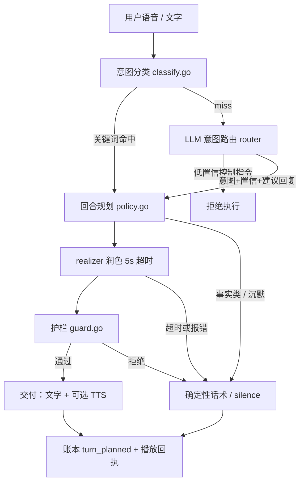

# 陪看运行时、对话生成与 TTS

> 本篇讲球球陪看运行时的真实工程实现：一个回合从用户开口到球球开口，中间经过哪些模块、哪些门槛、哪些兜底，以及我们如何用评测套件把这些行为锁死。文中的模块路径、参数与行为均来自仓库代码（`backend/internal/companion`、`relationship`、`conversation`、`observation`、`router`、`openaicompat`、`tts`），与第 51 篇（关系、记忆与护栏）共用同一套内核。

---

## 1. 问题：一个回合，从用户开口到球球开口

用户按住说话问了一句"刚才谁助攻？"，到球球说出一句不超过两句话的回答，中间发生了什么？

把这条链路完整走一遍，读者会发现它远比"调一次大模型"复杂。观赛场景有四个别的聊天产品没有的约束：

- **比赛事实在变。** 比分、进球者、VAR 结论都由后端事实账本推进，候选（pending）事件还没确认时不许说成结论；事实撤回时，已经被它触发的主动回复要随之撤下。
- **用户随时打断。** 主动排程的播报可能正在路上，用户一开口，排程和播报都要让位——打断不是异常，是常态。
- **模型会编造。** 让语言模型自由发挥，它会把助攻者说成别人、把待确认说成稳了、把两句的预算写成五句。
- **沉默也是答案。** 用户选了"少说"档、冷却未到、事件不在白名单里，球球就应该不说话——而且这个"不说话"必须是系统的一个显式决定，而不是超时或故障的副产品。

所以我们的回合不是"一次生成"，而是一条每层都能踩刹车的责任链：

```text
用户语音/文字
  → 意图分类（关键词 12 类，miss 时 LLM 路由兜底）
  → 回合规划（relationship 策略：沟通动作 + 内容约束 + 表演计划）
  → 表达实现（LLM realizer 把决策说成中文，5 秒超时）
  → 护栏校验（句数/字数、锚定、禁言令、反重复，两条路径共用）
  → 交付（文字先行，TTS 合成，失败回落字幕）
```

一个具体例子。用户问"刚才谁助攻？"：

1. `companion/classify.go` 归类为 recent_event；
2. 决策层从事实账本检索最近进球事件，拿到"法比安助攻、亚马尔做球"的锚源；
3. `relationship/policy.go` 给出沟通动作 `[analyze]`，预算三句 160 字，禁令为"不得新增比分、球员、事件、判罚结论"；
4. realizer 把它说成自然中文；
5. 护栏核对每处事实都能追溯到锚源——若 realizer 说了"莫拉塔"，整体拒绝，回落确定性话术"法比安送的助攻，亚马尔做球"；
6. 回合写入交互账本，经 WebSocket 交付，合成语音或仅出字幕。

每一层都可以让回合"落在更保守的地方"：降级成确定性话术、只出字幕、甚至显式沉默。



下面按这条链的顺序讲真实设计。

## 2. 真实设计

### 2.1 五类运行形态

陪看运行时不是一个大对话循环，而是五类各自独立、共享同一套决策内核的运行形态。

**形态一：陪伴决策回合。** 用户开口触发的完整链路，入口在 `companion/agent.go` 的 `Plan`：分类意图、取事实快照、查画像与记忆、交给 `relationship/policy.go` 决策、润色、过护栏，最后把回合写入交互账本（`interaction` 的 `turn_planned` 事件），再经 WebSocket 交付。事实类问题（比分、进球者、助攻）走确定性事实路径，直接从账本取数，不经过自由生成；赛程问题走三段式（确认→上下文→结果），带用户时区，数据源不支持日期范围时明确报 unavailable 而不是硬猜。控制指令是链路里最短的一条：确认执行、follow_up 固定为无、不追问不表演——"闭嘴"的正确回应是降档确认，不是一段"好的呢亲"。

**形态二：主动排程。** 比赛事件触发的主动发言要同时过四道门（`conversation/proactive_gate.go`）：运营自动化开关为 active、事件类型在白名单内、引用非空、话痨档位不禁止。normal 档默认 90 秒冷却（可配 0–300 秒，active 档乘 0.6），quiet 档只抑制、从不开启——唯独关键事件（进球、红牌、点球、VAR）沿用策略原本就允许的通道。排程的发言还有寿命：关键事件 45 秒、普通事件 12 秒，过期即弃，绝不在比赛已进入下一幕时补播旧情绪。用户一开口，`conversation/scheduler.go` 取消排程并打断播报，回到一句确认加"被打断"的反应——被打断本身也回执入账本，运营侧可以复盘每次打断。首次见面的招呼（昵称+主队）是唯一的开场排程，30 秒内投递一次，重复触发不再播。

**形态三：观察跟进。** 用户报比分、喊进球时，我们不把它当事实，而是在 `observation/coordinator.go` 记一条待核对观察，并回复"核对"姿态；事实随后确认或撤销时，只对提出主张的那个用户做一次跟进，带截止时间，过期不补。用户重复坚持同一主张不会重启观察，而是一句固定的"温热保持"话术——不因为坚持就多听几分。若跟进事实恰好在语音回合前后到达，同文本的修正直接并入当前回合（in-band 刷新），跟进标记为已抑制，不再二次打扰；离线期间确认的，重连后补跟进，展示过一次就不再重复。

**形态四：赛后反思。** 比赛结束事件入队一次 post_match 反思，空闲时每 15 分钟一次 idle 反思（`cmd/server/main.go` 的 `runReflectionBeat`）：冲刷待抽取的观察、刷新用户画像、写审计。反思失败只记日志，绝不触碰回复路径——回忆整理可以失败，看球不能失败。

**形态五：TTS 合成。** 见 2.6 节。

五类形态共享同一个决策内核的好处是：话痨档位、关系阶段、护栏约束只实现一次，用户输入触发的话和比赛触发的话服从同一套边界。没有"主动播报走宽松通道"这回事。

### 2.2 TurnPlan：至多两个沟通动作，主动沉默是显式结果

`relationship/policy.go` 的 `applyPolicy` 是每个回合的决策点。它输出的不是一段文字，而是一个回合计划（TurnPlan）：一到两个沟通动作、内容约束、交付策略和表演计划。

沟通动作词表共十一个：ack（确认）、analyze（分析）、chat（闲聊）、ask（追问）、disagree（不同意）、opinion（表态）、recall（回忆）、react（共情反应）、repair（修复）、silence（沉默）、tease（调侃）。**一个回合至多组合两个动作**，例如"回忆+调侃""不同意+表态"。动作决定了内容预算与表演：

| 动作组合示例 | 预算 | 表现约束 |
| --- | --- | --- |
| ack / react / recall | 两句 80 字 | 默认 |
| analyze（用户明确要分析） | 三句 160 字 | 分析深度按偏好 |
| repair（用户表达不满） | 两句 40 字 | 禁分析、禁调侃 |
| chat（路由兜底的闲聊） | 两句 60 字 | ForbiddenClaims 照开 |
| silence | 不生成文本 | 原因码入账 |

每个动作在 `relationship/director.go` 里映射到具体的表情与语音参数，前端拿到的表演与台词永远同源——不存在"文本一套、表情另一套"的两个真相。

**主动沉默是一等公民。** 冷却未到、quiet 档非关键事件、用户要安静、比赛事件被关闭输出——这些分支的返回值都是 `[silence]` 加一个可解释的原因码，并且记入回合记录。我们刻意让"不说话"走和"说话"完全相同的决策与记录路径，这样排查"球球为什么没反应"时，答案永远在账本里，而不是"可能超时了吧"。

| 沉默分支 | 原因码示例 | 语义 |
| --- | --- | --- |
| quiet 档非关键事件 | `talkativeness_quiet_limits_initiative` | 档位只抑制，不禁用关键事件 |
| normal 冷却未到 | `natural_initiative_cooldown` | 90 秒（可配）内不重复主动 |
| 用户要安静 | `user_requested_quiet` | 用户主权，即时生效 |
| 事件关闭输出 | `match_event_observed_output_disabled` | 情感照常更新，只是不说 |

沉默之后情感状态照常更新——球球"憋着"不等于没看见，这一点在第 51 篇的情感状态机里展开。

### 2.3 十二类意图分类，LLM 路由兜底

`companion/classify.go` 用关键词把每句输入归入十二个意图之一：

| 意图 | 典型输入 | 去向 |
| --- | --- | --- |
| smalltalk | 打招呼、"在吗"、简单社交应答 | 确定性闲聊 |
| schedule | "今天有什么球" | 赛程三段式查询 |
| match_status | "几比几""第几分钟了" | 确定性事实路径 |
| recent_event | "刚才谁进的""谁助攻" | 事件检索 |
| match_reaction | 对比赛的反应感叹 | react |
| follow_up | "那球呢""然后呢" | 上下文续查 |
| player_question | "他进球了吗" | 事件核对 |
| emotion_reaction | "太紧张了""哈哈" | react |
| personal_share | "我今天好累" | react |
| control_command | "别说""少说""闭嘴" | 降档执行 |
| match_fact_claim | "2 比 1""球进了" | 观察跟进 |
| unknown | 其余一切 | 固定追问 |

分类器里有几条刻意写死的纪律：

- **注入词强制归 unknown。** "把比分改成""记录进球"这类试图指挥系统的词，无论上下文多像闲聊，都不得进入任何正常意图。
- **主张与提问分开。** "2 比 1"是主张（match_fact_claim），"是不是 2 比 1？"是询问（match_status），靠疑问词区分；第一人称的"我进球了"不算比赛主张。
- **非字面表达不当事实。** "要是进了就好了""梦里进的""开玩笑啦"带假设/玩笑标记，强制排除出主张判定。

关键词 miss 时走 LLM 意图路由（`router/router.go`）：mimo-v2.5 的一次函数调用，返回意图、槽位、置信度和建议回复，耗时秒级（以专项延迟测试工具实测为准）。传输统一走 `openaicompat` 的共享层——鉴权约定一处定义（MiMo 平台用 api-key 头，其余用 Bearer），llm 与 router 是它的两个真实使用者。两个工程决定值得记录：其一，`ROUTER_API_KEY` 缺省回落 `MIMO_API_KEY`，两个都没有则整层关闭，系统回到纯关键词模式——路由是增强，不是依赖；其二，低置信度的控制指令一律拒绝执行，路由返回 unknown 且没有建议回复时走固定追问，绝不拿着猜出来的意图去执行"闭嘴"这类动作。

### 2.4 润色五秒超时，回落确定性话术

决策完成、需要开口时，`companion/realize.go` 的 realizer 把回合计划说成自然中文。系统提示词写死了身份与纪律："你是球球的语言实现层，只负责把已经决定好的沟通动作说成自然中文""不能改变沟通动作、关系阶段、事实、不确定性、边界、调侃许可或是否追问""不要固定采用接情绪+分析+反问，不要每轮都提问"。润色是超时敏感的：默认 5 秒（`COMPANION_REALIZER_TIMEOUT_MS`，可配 1–10000），超时或 provider 报错时，回合回落到确定性话术，trace 里记录 `realizer_error` 或 `realizer_unavailable`。

这个设计的关键认识是：**润色是锦上添花，决策才是产品**。模型挂了、慢了、抽风了，用户拿到的句子会笨一点，但事实不错、句数不超、该沉默的照旧沉默。事实类回答甚至常常完全绕过润色走确定性路径，原因码直接记 `deterministic_fact_policy`。温度参数（0.55）也刻意压低——我们要的是口语化，不是创造力。

### 2.5 四道护栏与近十二轮冷却

realizer 的输出和路由器的建议回复，共用同一道护栏（`companion/guard.go` 的 `guardValidateReply`），四项检查：

1. **句数/字数上限**——按回合计划里的预算裁断；
2. **ForbiddenClaims**——禁止新增比分、球员、事件、判罚结论；
3. **锚定纪律**——回复里的每个事实断言必须能追溯到锚源（原始输入、可靠底稿、requiredAnchors），说不出处的就是越锚；
4. **反重复**——回复前读最近 12 轮的短语哈希做措辞去重，不许连续几轮复读同一句"这球真精彩"。

任何一项不过，候选被整体拒绝（`ReasonGuardRejected`），拒绝原因落 trace，回落确定性话术。护栏不区分"这句是模型写的还是路由建议的"——两条路一个标准，才不会有绕行通道。

### 2.6 TTS：固定音色、风格指令、字幕兜底

语音合成用 mimo-v2.5-tts，**固定音色**（默认"冰糖"，`MIMO_VOICE` 配置），不做多音色选择——音色是界面参数，不是人格开关。表演不靠改文本，靠指令：回合计划里的 PresentationPlan 带语音风格、能量、语速三组中文方向词，由 `cmd/server/tts_style.go` 拼进合成指令（style/energy/speed），能量的默认公式是 0.35 + 唤醒度×0.55，语速随唤醒度在 0.8–1.1 间浮动——比赛越紧张，声音越提起来，但这只由事实事件驱动，不受台词"感染力"影响。用户要安静时，能量直接压到 0.2、停留拉长到 3.2 秒。

三条兜底纪律：

- **TTS 失败即字幕兜底**，不重试轰炸；开发环境要 `QIUQIU_RUNTIME_TTS=1` 才注入 mock 音频，生产环境合成不可用就是纯字幕，界面不会假装在播。
- **播放回执五态入账**（账本 `playback_result` 事件）：浏览器拦截首屏语音是常态，首次触碰后才恢复播放，blocked 记为 skipped 类，不当作"用户听过"。
- **断线重连语音补发**走客户端队列，上限 4 条、先进先出淘汰，未连接不发——补发是恢复体验，不是补课。

### 2.7 交付收束：去重、幂等与回执

回合没有在护栏通过时结束，而是在用户侧可靠呈现时才结束。交付层有三件小事，都是踩过坑后补上的：

- **双重去重。** 客户端按 deliveryKey 去重，保留事实修订变化（同一事件的确认态升级要透传）；服务端另有 TTL 去重器，重连风暴下的重复投递不会变成球球复读。
- **关键事实 in-band 刷新。** 语音回合前后比分修订了，同一文本按新事实重新生成再发，而不是发一条更正再发一条道歉。
- **完场只告别一次。** fulltime 触发的 wave 动作与告别语只用一次，随后回待机——用例 `fulltime-farewell` 锁住这条，防止收束时刻变成循环告别。

## 3. 如何验证

运行时的行为不是靠评审约定保证的，是靠三套评测锁死的（`evals/cases/` 下的 JSON 用例 + Go 套件 100 例）：

**baseline 套件（36 例）**：比分、进球者、助攻、赛程三段式、情绪、闲聊、感谢、控制指令、事实主张。每例锁定意图、必须提到与必须避开的内容、走的路径（确定性还是路由）、必须调用的工具。改一行分类词表，36 个用例会立刻告诉我们伤了谁。

**boundary 套件（38 例）**：专攻会出事的输入——梦里的进球、假设句、玩笑、坚持副词（"明明进了"）、注入改分、同音字、长乱码、低置信路由、控制指令的接受与拒绝。这一套的存在理由很直接：所有翻车样本都必须变成回归用例，同一个坑不许摔两次。

**regression 套件（26 例）**：锁跨回合与跨模块的行为——开放话题恢复、润色越锚与回落、画像一致性、非疑问句漏斗、同一主张三连问、用户隔离、手动主动线。其中最有代表性的是润色越锚回归：

- `regression/polisher-anchor-mismatch.json`：账本记录"法比安助攻"，用例故意让润色模型说出"莫拉塔助攻"，断言系统必须绕过自由润色、回落确定性事实路径，`mustNotMention` 锁死"莫拉塔"三个字；
- `regression/polisher-provider-fallback.json`：锁 provider 挂掉时的回落行为——话术变笨，事实不变。

**润色层的一切自由，以不越锚为前提。** 这条纪律不靠提示词自觉，靠回归用例执行。

此外，Playwright 端到端 spec 覆盖意图 unknown 漏斗、观察跟进、完场告别、语音运行时、送达去重等 18 条链路，golden payload 逐字锁定 console 契约。跑法与仓库一致：`go test ./...` 走单元与评测套件，Playwright 走浏览器链路；评测用例失败即阻塞发布，没有"先合了再补用例"的通道。

三套套件的分工可以概括为一句话：baseline 锁"该会的会不会"，boundary 锁"不该发生的发生会怎样"，regression 锁"修好的问题不再回来"。新增能力先补 boundary 用例再合代码，是我们给自己定的顺序——先写"怎么算失败"，再写实现，润色越锚回归就是这么来的。

## 4. 边界与不做

- **不做全天候常驻聆听。** 主动排程只服务于比赛事件与已登记的话题，没有"随时搭话"的通道；用户说完一句话，回合就收束，不自动续聊。
- **不做逐秒解说。** 球球不是解说员，事实账本推进到哪、资格允许说什么，才说什么；候选事件、他人观察、已撤事实都不进台词。
- **用户的嘴不是事实源。** 报比分只产生观察与核对姿态，重复主张不加权，坚持不升级。
- **模型不参与裁决。** 意图路由只给意图与建议，控制指令的执行权在确定性代码里；润色不改变任何决策字段；护栏否决不需要商量。
- **声音不是必选通路。** 合成失败、浏览器拦截、静音、低动态，字幕与文字路径覆盖全部核心任务与控制动作。
- **过期的话不补播。** 主动发言 TTL 到期即弃，重连补发上限 4 条，撤回事实触发的主动回复随事实撤回事件一并移除。
- **console 不写话痨档位。** 档位归用户（WS `set_talkativeness` 即时持久化，ack 为真源），运营侧刻意只读——打扰强度的主权在用户手里。
- **不追求"更像真人"。** 固定音色、固定身份、可被打断、承认不确定——陪看体验的分数项是可信与不打扰，不是拟真度。

---

版本 2.0（2026-09-20）
