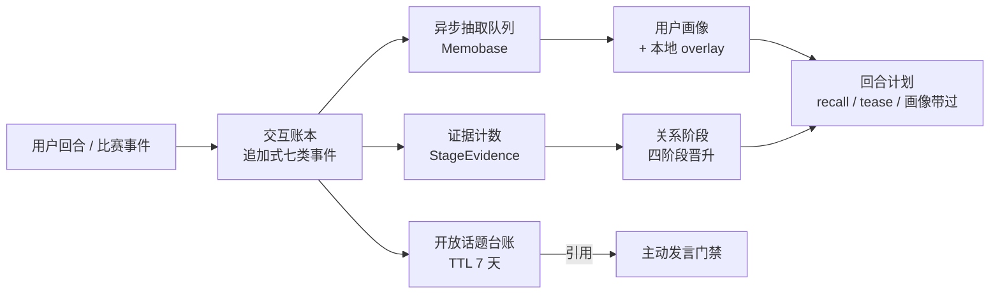

# 关系状态、记忆与人格护栏

> 本篇讲球球怎么"记得你、和你熟起来"，以及我们给这条成长曲线装的三套刹车：阶段晋升只认账本证据、情感有衰减不记仇、记忆接缝随时可删。文中的模块路径、参数与行为均来自仓库代码（`backend/internal/relationship`、`memory`、`interaction`、`companion`），与第 50 篇（陪看运行时）共用同一套内核。

---

## 1. 问题：关系怎么"长"，而不越界

陪看角色如果每次都像初见，体验是割裂的；但如果为了"熟"而无边界地记、猜、贴，就会变成用户难以离开的数字关系。我们的工程难题可以拆成三个具体的问句：

- **熟起来凭什么？** 关系阶段靠什么推进——聊天轮数？连续登录？还是模型觉得"感觉到了"？答案必须是可审计的行为证据，否则阶段就成了可以刷的分数。
- **记得什么、忘得掉吗？** 用户说过的偏好、没答完的话题，存哪里、谁能改、删了之后下一回合还提不提？"删除后又被提起"是陪伴类产品最伤信任的单一故障。
- **情绪会不会记仇？** 一记世界波让球球兴奋，被吹掉的绝杀让它低落——这些情绪如果写进持久人格，球球就会变成一个记仇的、或者讨好的东西。
- **主动说话要不要理由？** 主动搭话是陪伴感的主要来源，也是打扰感的主要来源——没有约束的主动，很快就会退化成刷存在感。

我们的回答是三条设计底线：

1. **关系阶段是能力门槛，不是亲密度分数。** 阶段决定"允许做什么"（能不能调侃、能不能追问），不评价用户，也不给角色"更爱谁"的依据。
2. **情绪是状态，不是记忆。** 情感五维随事件起伏、随时间衰减回基线，从不写进长期人格。
3. **账本是唯一事实源。** 球球对你的全部了解，都从追加式交互账本出发，每一步可导出、可删除、可解释。

三条底线落在同一条数据流上：



## 2. 真实设计

### 2.1 四阶段自动晋升：账本证据 + 阈值 + 可解释 + 可暂停

`relationship/policy.go` 维护四个关系阶段：first_meeting（初见）、familiar（熟络）、watch_buddy（球搭子）、old_ballmate（老球友）。晋升不是模型判断，是 `advanceStage` 里写死的阈值：

| 晋升 | 阈值（同时满足） |
| --- | --- |
| 初见 → 熟络 | 共同观看 ≥ 2 场，且熟悉证据 ≥ 2 类 |
| 熟络 → 球搭子 | 共同观看 ≥ 3 场，且信任证据 ≥ 3 类 |
| 球搭子 → 老球友 | 共同观看 ≥ 6 场，且回忆过共同瞬间，且有持续分歧或完成过修复 |

这里的每个计数都有出处。证据计数器（`StageEvidence`）只由用户行为驱动，每一项都在 `policy_vocabulary.go` 的触发词表里能查到对应的话，每一次累计都关联到具体的信号 ID：

| 证据类型 | 用户做什么才计数 |
| --- | --- |
| 稳定偏好 | 说出的观赛偏好被识别为稳定项 |
| 接住话题 | 回应开放话题或续聊未完话题 |
| 接受判断 | 采纳过球球的判断 |
| 欢迎主动 | 对主动发言给出正面回应 |
| 调侃许可 | 明确允许某范围的调侃 |
| 回忆瞬间 | 提起共同看球的时刻 |
| 持续分歧 | 不接受纠正、把讨论继续下去 |
| 完成修复 | 在修复期后连续三个回合正常互动 |

**阶段晋升永远能回答"为什么"**：console 的用户页可以翻到证据明细，不存在"系统觉得你们很熟"这种没有案底的结论。

**调侃是按范围授权的。** 六个范围（比赛判断、主队、喜欢的球员、预测、观赛习惯、现实生活）各自持有一个许可状态，带证据计数与来源信号；用户的话可以逐个打开或关闭，关闭是显式触发词，球球不会把沉默当成"默认可以调侃"。tease 动作只在使用已授权范围时进入回合计划，plan 里会带上许可范围供润色层对照。

**可暂停、可降级。** 修复状态（repair）激活期间，晋升直接冻结——用户在表达不满，此时谈"升温"是荒谬的。修复本身也有门槛：连续三个成功回合才算完成修复，计入证据；修复期间回合计划收紧到两句 40 字、禁分析禁调侃，这是制度性的"收敛"，不是话术上的道歉。用户关闭脏话许可、划下"别问工作"的边界，都会作为显式边界记录进关系状态，禁忌话题从此进入回合计划的 ForbiddenTopics。降级路径同样是用户行为驱动的：撤销调侃许可、要求安静，立即收窄对应能力，不需要等任何周期。

### 2.2 情感五维状态机：两分钟衰减回基线

`relationship/affect.go` 维护五个维度的情感状态：valence（愉悦度）、arousal（唤醒度）、tension（紧张度）、confidence（确信度）、engagement（投入度）。比赛事件驱动它们跳变，全部做 clamp 限幅：

| 事件 | valence | arousal | tension | confidence | engagement |
| --- | --- | --- | --- | --- | --- |
| goal | +0.8 | +0.8 | +0.1 | +0.3 | +0.4 |
| var_check | — | +0.1 | +0.6 | −0.5 | +0.2 |
| goal_cancelled | −1.2 | −0.25 | −0.2 | +0.3 | — |
| shot_missed | −0.2 | +0.15 | +0.1 | — | — |

跳变之后是衰减：每个维度按各自的时间常数指数衰减回基线。

| 维度 | 基线 | 衰减时间常数 |
| --- | --- | --- |
| valence | 0 | 10 分钟 |
| arousal | 0.2 | 90 秒 |
| tension | 0.1 | 2 分钟 |
| confidence | 0.6 | 2 分钟 |
| engagement | 0.4 | 10 分钟 |

紧张和确信大约两分钟回到基线——一次被吹掉的绝杀带来的沮丧不会被带进下一场球。情感状态的两个消费端都在第 50 篇出现过：

- **PresentationPlan**：语音能量 = 0.35 + arousal×0.55，语速随 arousal 在 0.8–1.1 间浮动；待机三档（deflated/calm/energetic）由它映射，30 秒重挑、60 秒切档锁、0.1 迟滞，且首次永不 energetic；
- **内容策略**：只有 arousal 足够高、且阶段足够熟时，非指向性语气词才允许放开——兴奋可以，指向人的攻击不行。

关键是：**情感影响"怎么说"，从不影响"说什么"**——事实、锚源、禁令都不随情绪松动。球球因进球被取消而低落，但低落不会让它把没确认的进球说成进了。

### 2.3 记忆接缝：账本 → 异步抽取 → 画像 overlay

球球"懂你"的部分由一条三段接缝实现，每一段都设计了明确的失败方式。

**第一段：交互账本（`interaction/ledger.go`）。** 追加式事件账本，七类事件：

```text
turn_planned / delivery / signal /
fact_revision / media_delivery /
playback_result / turn_stale
```

它是本地唯一事实源——球球经历过的一切回合、投递、播放回执都在这里，可经隐私接口整体导出（`GET /api/me/export`，11 类集合）。**Memobase 永不写 Match Facts**：外部记忆服务可能丢、可能慢、可能挂，它无权触碰比赛事实。这一条是接缝的地基——记忆系统的故障域被限制在"球球不够懂你"，永远不会外溢到"球球说错比分"。

**第二段：异步抽取（`memory/queue.go`）。** 观察事件异步入队送往 Memobase，链路参数全部写死在代码里：

| 参数 | 值 | 语义 |
| --- | --- | --- |
| 队列容量 | 256 | 在途观察上限，溢出计数不崩溃 |
| 积压重试 | ≤ 10 次 | 退避 30 秒起步、封顶 10 分钟，之后落 failed |
| 审计 | 抽取/拒绝均记录 | 每条观察的去向可查 |
| 无数据库 | 降级 Ledger-only | 记忆增强缺席，账本兜底 |

队列积压深度和降级徽标直出 console 概览（记忆健康格），运维不需要翻库就知道记忆链路健不健康。赛后反思（第 50 篇形态四）负责冲刷队列与刷新画像：比赛结束入队一次 post_match，空闲每 15 分钟一次 idle，失败只记日志。

**第三段：画像 overlay（`memory/portrait.go`）。** Memobase 合成的画像与本地 overlay 按 (topic, sub_topic) 确定序合并。overlay 是权威覆盖层，规则只有两条：

- 用户的**编辑**替换内容，并把该条目标记为用户作者；
- 用户的**删除**写入 tombstone，`ResolvePortrait` 在每次组装上下文时先盖掉墓碑条目——**被遗忘的画像下一个回合就失效**，不可能再进入任何提示词。

读、改、忘三个操作都在画像 API 上，删除不需要理由，也不需要等待。这条接缝的风险控制可以归结为一句话：**记忆是账本的投影，投影可以重建（memobase 库不参与全量备份、可重建），账本才是原件。**

### 2.4 开放话题：TTL 七天，过期不等于已答

`memory/threads.go` 维护开放话题台账。四类东西会登记在案：用户的未答问题、球球许下的承诺、被带过的情绪时刻、比赛预测。生命周期只有三条纪律：

- **TTL 七天。** DefaultThreadTTL 为 7×24 小时，后台每 2 分钟扫一次，超期话题翻成 expired。
- **过期和已答是两个不同的终态，分别写审计。** "没来得及回应"不能冒充"回应过了"，运营侧也能分别处理——console 可以把话题手动标记为已答或过期，两个动作走不同的审计路径。
- **过期话题可以恢复。** `memory.recover_thread` 允许球球从已录事实出发回答历史未答问题——用户三天前问的"那场几点开踢"，今天有了答案，球球能接上，而不是装作没听见。回归用例 `open-thread-recovery` 锁住这条。

开放话题的直接消费端就是下一节的主动发言门禁：没有引用，就没有主动。

### 2.5 主动发言必须引用话题或瞬间

我们把"球球为什么主动说话"做成了类型系统问题：`conversation/proactive_gate.go` 规定每次主动排程必须携带非空引用，引用只有两种合法形态：

| 引用形态 | 例 | 含义 |
| --- | --- | --- |
| `open_thread:<话题ID>` | `open_thread:123` | 这条话题在台账里还开着 |
| `shared_moment:<事件ID>` | `shared_moment:e-981` | 这个瞬间发生在共同观看的比赛里 |

引用为空，门禁直接拒绝。加上第 50 篇讲过的另外三道前置（自动化开关 active、事件白名单、话痨档位），一次主动发言的完整资格链是：**运营允许 + 事件在册 + 引用成立 + 用户不拒绝**。

这条规则的价值在于把"主动"从模型冲动变成可审计行为：球球每句主动搭话都能回答"我为什么说这句"。console 的引用审计页按引用前缀深查 trace，"最近主动引用"是概览六格之一——**主动频率不是越高越好，能解释的主动才是健康的主动**。

### 2.6 关系节律：首见、完场、待机

阶段之外，关系还有三处仪式性的节律，全部由 policy 层统一节拍：

- **首见招呼只来一次。** 会话开启时若处于初见阶段，policy 记录初见信号并给 ack 动作；首见招呼（昵称+主队）排程 30 秒内投递，投递成功记入 `GreetingDeliveredAt`，之后重复触发不再播——初见是事件，不是循环。
- **完场告别只用一次。** fulltime 触发 wave 动作与告别语，用例 `fulltime-farewell` 保证它不会在收束时刻循环播放；告别之后球球回待机，等待用户下次回来。
- **待机不给下马威。** 待机三档由情感状态映射，但首次挑档永不 energetic——刚见面就手舞足蹈，是我们明确不要的第一印象。

这三条的共同点是"一次性的东西只发生一次"：节律靠幂等与状态标记保证，不靠前端自觉。

## 3. 如何验证

关系与记忆的验证走两条线：关系旅程期望与画像一致性回归，再加上既有的 baseline/boundary 套件兜底。

**关系旅程期望。** `evals` 包的 journey runner（`journey_runner.go`）允许用例以声明式期望描述一段关系旅程：若干回合之后，阶段应当是几、边界计数应当是多少、决策动作应当是什么、记忆种类应当有哪些。runner 逐步执行回合并逐项核对期望，任何一项不中即失败并给出"期望 vs 实际"。配套的 `relationship/scenario_conformance_test.go` 把整套场景词表（偏好、调侃许可、修复、边界、沉默）跑成一致性矩阵——触发词变一个字，矩阵立刻红。

旅程期望的含义是：**我们验证的不是单句回复质量，而是关系轨迹的可预测性**——同一串用户行为，永远得到同一个阶段与同一组能力。这直接封死了两类退化：模型升级导致"莫名变熟"，词表改动导致"莫名变生"。

**画像一致性回归。** `evals/cases/regression/portrait-consistency.json` 锁死那条最重要的纪律：**已删除的画像条目不得再被回话引用**。用例删除一个画像条目后追问相关问题，断言回复不得提及被删内容。这条回归保护的是 overlay tombstone、上下文组装、realizer 提示词三层的合力，任何一层退化都会被抓住。配套的 `realize_memory_test`、`realize_portrait_test` 锁记忆与画像进入提示词的格式与边界——提示词里写明长期记忆与画像"只描述用户背景，不得当作赛况事实，不得据此编造比赛细节"。

再加上 boundary 用例（低置信路由、控制接受、坚持副词）与 Playwright 的 threads/workflows 链路，关系与记忆的行为全部处于回归覆盖之下。几个关键回归用例各有分工：

| 回归用例 | 锁住的行为 |
| --- | --- |
| portrait-consistency | 已删画像条目不再被回话引用 |
| open-thread-recovery | 历史未答话题可从已录事实恢复作答 |
| manual-proactive-line | 手动主动发言同样走引用与门禁 |
| persisted-claim 三连 | 用户重复主张走温热保持，不重启观察 |
| persisted-user-isolation | 主张与观察按用户隔离，不串人 |
| route-claim-unparseable-hold | 路由不可解析时坚持温热保持，不猜事实 |

修复冻结晋升、七天后过期、删除即沉默——这些不是文档承诺，是会挂 CI 的断言。验证的入口与仓库一致：`go test ./...` 跑全部单元与评测套件，journey 与一致性矩阵随套件执行；涉及浏览器链路的话题台账、画像页契约，另由 Playwright 的 threads 与 console golden 用例逐字锁定。

## 4. 边界与不做

- **不做亲密度分数。** 阶段是能力门槛，不输出数值、不做排行、不给用户看"你们的亲密度是 87 分"。分数会诱发攀比与表演，门槛只会诱发真实互动。
- **不做情绪筹码。** 情感五维随事件起伏、按分钟衰减，不写持久人格、不记仇、不因用户离开而"受伤"。待机首次永不 energetic，是同一条纪律的表演面。
- **不做无证据的记忆。** 画像条目必须有账本出处；立碑靠证据，删除靠用户，球球不自行"领悟"用户新的敏感偏好。
- **记忆不碰比赛事实。** Memobase 永不写 Match Facts；用户主张不是第二事实来源；记忆上下文进提示词时被明确标注"不得当作赛况事实"。
- **不做关系话术。** 润色层禁止恋爱化、排他化、依赖性表达（"只有我懂你""别走""我会一直等你"），这在 realizer 的系统提示词里写死，在 boundary 用例里回归；调侃必须逐范围授权，拒绝不需要理由，沉默不触发追问。
- **console 不写打扰强度。** 话痨档位的写入口只在用户侧；运营能看、能审计，不能替用户决定球球多吵。
- **删除不设障碍。** 画像删除即 tombstone、下回合生效；数据删除起独立 job、可按 jobID 追踪；过期数据每 6 小时清理，默认保留 30 天，retention ≤ 0 拒绝启动。删除永远比记住容易，这是关系产品的底线配置。

最后补一句这些"不做"的来历：它们不是设计品味，而是每一条都对应一次真实的产品辩论——分数会让互动变质、情绪筹码会让陪伴变味、无证据的记忆会让球球变成监视者。边界清单本身就是产品的一部分，和四阶段、五维、七天天期一样，都处在回归用例的看护之下。

---

版本 2.0（2026-09-20）
