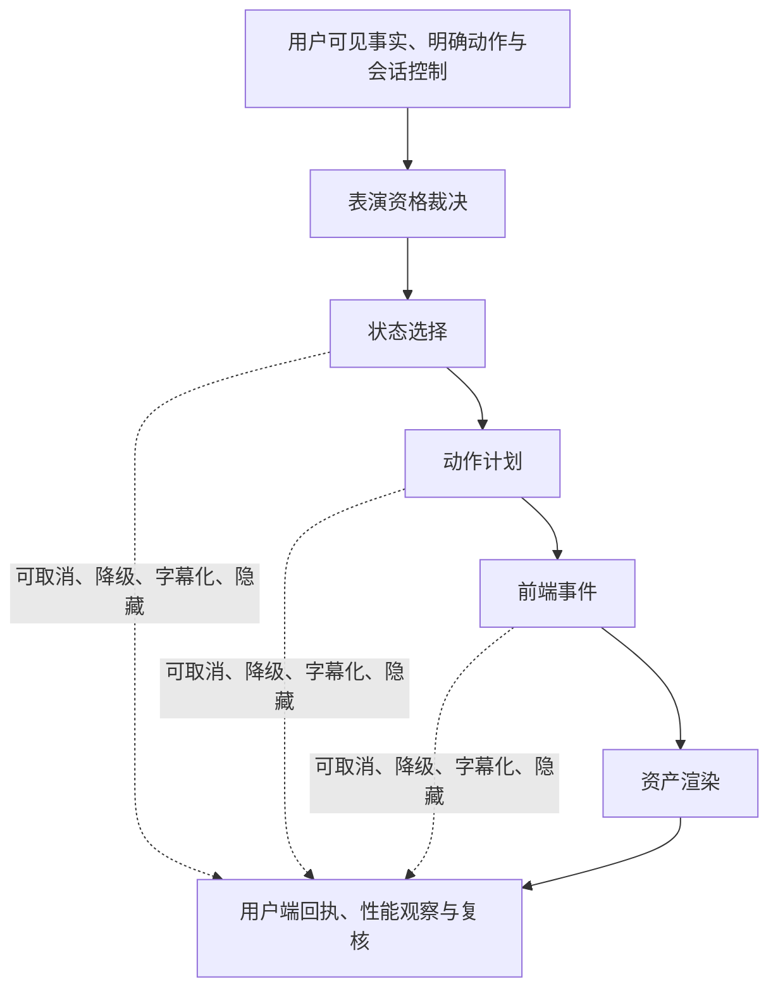
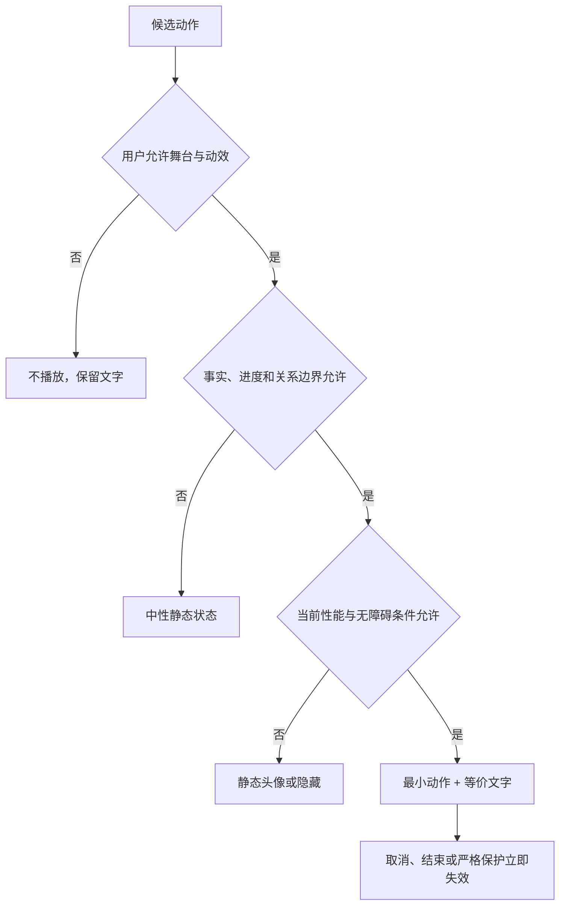
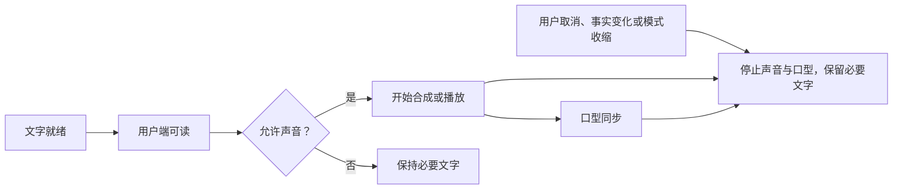
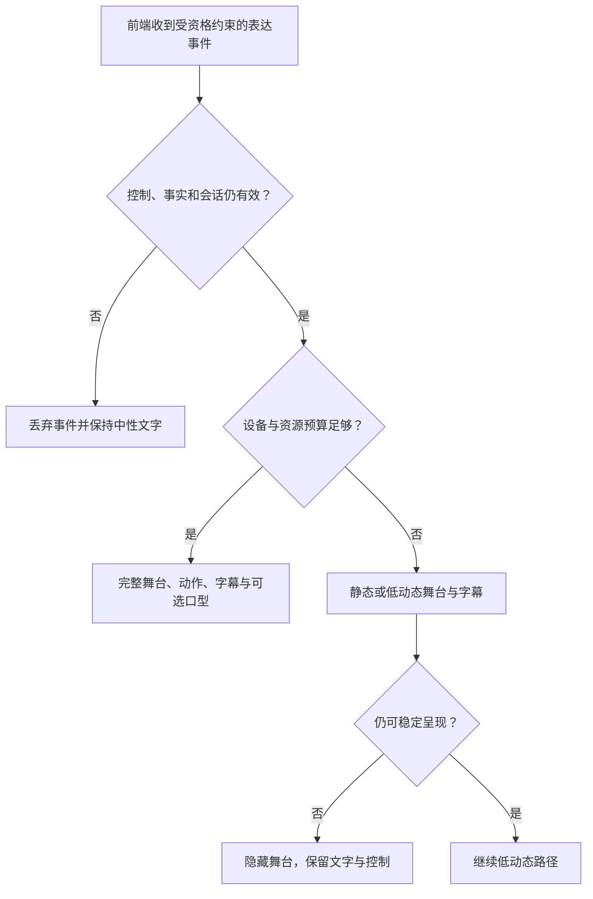

# Live2D 表演、动作与前端事件

> 文档性质：0→1 工程执行方案。本文规定角色资产、动作状态、前端事件、口型、字幕、低动态与降级怎样共同服务一场足球陪看，而不把表演变成事实旁路、情感压力或不可关闭的注意力竞争。
>
> 适用阶段：首轮受控试点。所有素材范围、动作阈值、设备预算、默认可见性与用户偏好均为待验证假设，必须在用户理解、可访问性与真实观赛情境中复核。
>
> 核心判断：角色可以是可选的表达层，但不拥有独立叙事权。用户控制、可见事实、文字状态和比赛画面始终优先于角色的动作、口型、镜头与气氛。

> 方案形成时间：2026-01-28。

---

## 1. 施工目标、前序决策与完成定义

### 1.1 要解决的真实问题

Live2D 能让角色在用户选择的比赛中呈现状态，但它也会放大陪看产品的三类风险：第一，强动作可能比文字更早让用户感到“进球已经确定”，从而绕过事实与防剧透门槛；第二，连续注视、失落、撒娇、追随镜头等设计会让用户误以为角色需要被照顾；第三，口型、声音、字幕、画面、网络和设备性能一旦不同步，用户会看到一个仍在热烈表演、却已经不可信或无法停止的角色。

首轮工程目标不是做出更多动作，而是建立一条可解释、可取消、可降级的表演链：



表演链只消费已经获准的输入，不能反向改变比赛事实、用户关系摘要、控制状态或运营目标。尤其是用户说“安静”“隐藏”“结束”时，表演层必须先停，再处理任何视觉收束。

### 1.2 本文继承的前序决策

| 前序决策 | 对本篇的工程约束 |
| --- | --- |
| 用户始终拥有控制权 | 隐藏、低动态、仅文字、静音和结束应即时生效，且能使待播动作失效 |
| 严格防剧透为默认 | 未获本会话可见资格的事件不得触发庆祝、紧张、口型或强调动效 |
| 事实、解释、感受必须分层 | 表情和动作不能让待确认信息看起来已被证实 |
| 角色不制造依赖 | 资产、动作、镜头和字幕禁止呈现挽留、受伤、占有、恋爱化或现实替代 |
| 文字与无障碍通路等效 | 角色动作不是任何关键事实、控制或错误状态的唯一表达方式 |
| 用户主动发起优先 | 闲置动作和有限比赛反应不能因用户沉默而升级为主动互动 |
| 声音是可选呈现 | 口型与动作必须服从文字和播放资格，声音关闭时不得伪装“正在说话” |

### 1.3 首轮范围与非范围

本篇覆盖：授权资产的登记与装载、舞台可见性、状态和动作映射、前端事件合同、口型与字幕协调、用户输入优先级、渲染性能、低动态/无障碍、故障降级、场景验收和运行复核。

本篇不覆盖：赛事直播画面、人物肖像的未授权模仿、以角色动作采集用户生物特征、用摄像头或麦克风推断用户情绪、强互动小游戏、恋爱角色扮演、跨用户共看舞台、以表演替代赛事实时服务，或任何要求用户始终打开角色画面的模式。

### 1.4 完成定义

达到首轮完成定义，必须证明：

1. 每个进入用户端的模型、贴图、动作、音效和背景都有用途、权利范围、地域/期限、修改权限和下架动作的资产记录；
2. 每次表演都由当前会话内可解释的状态和唯一事件触发，并携带会话、控制、事实和动作版本；
3. 用户降低动态、关闭声音、隐藏角色、切换严格保护或结束本场后，旧动作不会迟到出现或恢复；
4. 待确认、冲突、撤销或不适合展示的赛事信息不能通过表情、镜头、口型、震动或装饰音泄露；
5. 字幕、文字状态、口型和声音对同一条回应表达同一确定性和同一边界；
6. 弱网、低性能、缺少资产、声音失败和渲染异常时，核心事实、控制和退出仍可使用；
7. 体验、性能和风险记录能解释一次表演为何触发、为何被取消或为何降级，但不保存用户私人原始内容。

---

## 2. 资产治理：角色素材先有边界，后有表现

### 2.1 资产不是“美术文件”，而是受约束的体验输入

每一件可见或可听资产都会影响用户对角色身份、可信度和关系距离的理解。因此资产管理必须早于动作编排。没有明确授权、用途和下架机制的素材，即使暂时看起来适合，也不应进入试点。

**资产类别：基础模型**
- **例子**：角色参数、网格、物理设定
- **必须记录**：来源、作者、许可、可否修改、适用版本
- **主要风险**：无授权改造、依附未知条款

**资产类别：视觉贴图**
- **例子**：服装、表情、色彩、背景
- **必须记录**：使用范围、地域、期限、署名要求
- **主要风险**：误用肖像、文化挪用、到期继续使用

**资产类别：动作片段**
- **例子**：点头、看向状态区、收束、口型
- **必须记录**：触发级别、最大时长、禁止场景
- **主要风险**：用动作制造依赖或高刺激

**资产类别：音频素材**
- **例子**：提示音、环境音、合成声音配置
- **必须记录**：权利范围、音量上限、关闭方式
- **主要风险**：侵权、惊吓、掩盖事实状态

**资产类别：字体与图标**
- **例子**：字幕字形、控制图标、状态符号
- **必须记录**：可访问性、授权、降级字体
- **主要风险**：看不清、无法阅读、许可风险

**资产类别：效果资源**
- **例子**：粒子、光效、转场、震动
- **必须记录**：闪烁限制、低动态替代、性能预算
- **主要风险**：光敏风险、剧透强调、耗电

### 2.2 资产台账的最小字段

资产台账应为每一项素材维护下列字段。存储位置可随工具变化，但字段与审批语义不能省略。

| 字段 | 说明 |
| --- | --- |
| `asset_id` | 不可复用的素材标识 |
| `asset_kind` | 模型、贴图、动作、音效、背景、字体或效果 |
| `human_description` | 用户和评审者能看懂的用途说明 |
| `rights_basis` | 权利来源、许可编号或自制声明 |
| `permitted_uses` | 可用于哪些场景、媒介、地域、时段和版本 |
| `expiry_or_review_date` | 到期或下次复核日期 |
| `modification_rule` | 是否可裁剪、重色、组合、再分发 |
| `risk_tags` | 闪烁、拟人化、情绪化、文化敏感、性能高等标签 |
| `fallback_asset` | 不可用时的静态/文字替代 |
| `withdrawal_action` | 许可变更、投诉或发现风险时如何停止使用 |

### 2.3 资产准入门槛

进入首轮资产包前，至少回答下列问题：它是否会让角色看起来像特定真实人物？它是否包含恋爱、哭泣、挽留、身体亲密、强烈粉丝对立或高频闪烁？没有声音、低动态、共享设备或低性能时能否被完整替代？用户关闭角色后是否仍依赖它传递某项信息？如果答案不能明确说明，资产只能保留在探索清单，不能进入面向用户的版本。

| 准入问题 | 合格条件 | 不合格处理 |
| --- | --- | --- |
| 权利是否清楚 | 权利人、用途、期限、修改边界可追溯 | 不装载，不以“内部试试”为例外 |
| 用途是否可解释 | 能说明它服务事实、控制或低干扰氛围中的哪一项 | 重新定义用途或删除 |
| 是否可关闭 | 隐藏、低动态、静态都能获得完整核心服务 | 补替代路径后再审 |
| 是否会误导事实 | 待确认时不会形成庆祝/绝望等结论性信号 | 增加状态限制或移除 |
| 是否会施加关系压力 | 不含依恋、委屈、挽留、亲密索取 | 禁止进入动作库 |
| 是否满足感官安全 | 无快速闪烁、突发巨响、不可控震动 | 改为静态或低强度版本 |

### 2.4 素材下架与回退

资产可能因授权到期、用户反馈、性能异常或关系边界问题被下架。下架不应等待下一次大版本：运行时需要能将对应 `asset_id` 置为不可选，并立刻使用静态标识、无角色界面或纯文字状态。任何动作事件若引用了已经撤回的资产，应被视为无效并静默丢弃，而不能尝试从缓存中“再播放一次”。

---

## 3. 舞台可见性与用户控制

### 3.1 四种等价可见性

用户看见角色不等于同意更多声音、动作或主动表达。首轮至少提供下列等价模式，且它们都保留事实、对话、设置、反馈和结束能力。

> 信息卡：原宽表已改为纵向阅读，字段含义不变。

- **模式：完整舞台**
  - **可见内容**：角色、有限背景、低强度表演
  - **默认动作上限**：由用户选择的强度限制
  - **适合的用户意图**：明确想要氛围和可选角色存在
  - **不得失去的能力**：事实状态、文字、快速控制

- **模式：紧凑角色**
  - **可见内容**：小尺寸角色或状态头像
  - **默认动作上限**：一至二级动作
  - **适合的用户意图**：保留识别感，减少遮挡
  - **不得失去的能力**：提问、静音、结束、无障碍

- **模式：静态标识**
  - **可见内容**：静态头像、角色名称和文字状态
  - **默认动作上限**：零级
  - **适合的用户意图**：想要最少角色存在
  - **不得失去的能力**：完整信息与控制

- **模式：完全隐藏**
  - **可见内容**：不呈现角色画面
  - **默认动作上限**：零级
  - **适合的用户意图**：专注比赛、共享设备、感官偏好、性能限制
  - **不得失去的能力**：所有服务核心功能

首次进入应以紧凑角色或静态标识作为保守假设。完整舞台只能由用户主动选择，且“选择完整舞台”不提高主动发言、通知、资料保存或跨场联系的资格。

### 3.2 本场控制与跨场偏好分离

| 控制 | 生效范围 | 动作层必须立刻执行的结果 |
| --- | --- | --- |
| 隐藏角色 | 当前场次，可选择是否记住 | 卸载或停止呈现角色，不影响事实和对话 |
| 低动态 | 当前场次，用户可保存为偏好 | 取消非必要转场、粒子、震动和高幅度动作 |
| 仅文字 | 当前场次 | 停止口型、声音和声音驱动动作，保留文字 |
| 安静陪看 | 当前场次 | 停止自动表演，只保留用户主动行为与必要状态 |
| 结束本场 | 当前会话 | 取消全部待播与待演动作，快速中性收束 |
| 下次默认值 | 用户明确保存后跨场使用 | 只影响可见性与密度，不推导关系状态 |

本场控制的优先级永远高于跨场偏好。例如用户过去喜欢完整舞台，但本场点击“隐藏”，系统不能在下一次已确认事件到来时自动把角色重新叫出来。

### 3.3 用户操作的前端反馈

用户关闭或减少表演时，反馈必须中性、短、非关系化：

```text
已切换为仅文字。本场仍可查看确认状态和主动提问。
已降低动态。非必要动作和转场已停止。
角色已隐藏。你随时可以在设置中恢复，不影响本场控制。
本场陪看已结束。不会继续播放声音或动作。
```

禁止使用“我会想你的”“是不是我太吵”“别把我关掉”“让我再陪一会儿”等文字、表情或动作。这些不是友好反馈，而是在把普通界面操作变成用户要处理的情感关系。

---

## 4. 表演状态、动作映射与事实门槛



### 4.1 表演状态不是角色情绪诊断

运行时维护的是可见表达状态，而非角色拥有真实情感的宣称。状态只回答“为了帮助用户理解当前服务行为，应该多安静、多短、多静态”，不回答“角色感到什么”或“用户需要什么情绪安慰”。

**表演状态：`baseline` 基线**
- **合法输入**：无高优先级事件、用户未限制
- **允许动作**：轻微姿态、低频眨眼、静态提示
- **明确禁止**：长时间凝视用户、招手索取回应

**表演状态：`focus` 关注**
- **合法输入**：已确认的关键回合、用户正在看
- **允许动作**：小幅前倾、减少无关动作
- **明确禁止**：高能动画、声音抢占、遮挡画面

**表演状态：`reaction` 即时反应**
- **合法输入**：已确认且本会话允许表达的结果
- **允许动作**：一次短反应、短文字配合
- **明确禁止**：多次庆祝、持续喊叫、强闪烁

**表演状态：`awaiting` 等待**
- **合法输入**：争议、冲突、待确认或延迟不明
- **允许动作**：中性稳定、可选“正在核对”
- **明确禁止**：提前庆祝、愤怒、结论性表情

**表演状态：`user_turn` 用户回合**
- **合法输入**：用户正在输入、说话或阅读回复
- **允许动作**：降低闲置动作，必要口型与字幕
- **明确禁止**：插入比赛式大动作或打断

**表演状态：`quiet` 安静**
- **合法输入**：用户选择安静、仅文字或低动态
- **允许动作**：静态或极轻微状态
- **明确禁止**：自动说话、热闹手势、跳出设置

**表演状态：`closing` 收束**
- **合法输入**：用户结束、半场或终场
- **允许动作**：一句中性确认或快速隐藏
- **明确禁止**：告别演出、挽留、倒计时

**表演状态：`degraded` 降级**
- **合法输入**：性能、网络、素材或安全异常
- **允许动作**：静态标识或纯文字
- **明确禁止**：用循环动画掩盖异常

### 4.2 赛事状态到表演状态的映射

映射必须以“当前会话可表达的事实状态”为输入，而不是以接收到某条候选资料为输入。不同确定性同样不能使用同一种视觉语言。

**赛事/会话状态：无关键变化**
- **推荐表演状态**：`baseline`
- **动作强度上限**：一级
- **字幕与声音规则**：可无字幕、无声音

**赛事/会话状态：已确认关键回合尚未结束**
- **推荐表演状态**：`focus`
- **动作强度上限**：一级
- **字幕与声音规则**：只在用户主动询问时给短文字

**赛事/会话状态：已确认结果且用户允许**
- **推荐表演状态**：`reaction` → `baseline`
- **动作强度上限**：二级，单次
- **字幕与声音规则**：文字与声音同一结论；声音可选

**赛事/会话状态：资料待确认或冲突**
- **推荐表演状态**：`awaiting`
- **动作强度上限**：零至一级
- **字幕与声音规则**：明确等待；不播放庆祝或失望音效

**赛事/会话状态：用户显式说“我看到了”**
- **推荐表演状态**：`user_turn` 或 `awaiting`
- **动作强度上限**：一级
- **字幕与声音规则**：可承认用户观察，不把它升为事实

**赛事/会话状态：事实撤销或更正**
- **推荐表演状态**：`awaiting` 或 `degraded`
- **动作强度上限**：零级
- **字幕与声音规则**：停止旧表现，显示最小更正文本

**赛事/会话状态：严格保护、安静或隐藏**
- **推荐表演状态**：`quiet`
- **动作强度上限**：零级
- **字幕与声音规则**：不主动声音；必要状态使用文字

### 4.3 动作强度分级

**级别：L0 静态**
- **含义**：无连续动作，只有稳定状态
- **首轮例子**：静态头像、文字状态
- **准入条件**：所有模式都可使用

**级别：L1 极轻微**
- **含义**：不抢眼的短姿态或低频待机
- **首轮例子**：轻微点头、看向信息区
- **准入条件**：用户未选择低动态；无高风险事件

**级别：L2 轻量反应**
- **含义**：单次、短时、非遮挡的明确反应
- **首轮例子**：极简庆祝、短暂侧身让出信息区
- **准入条件**：事实已确认、会话可见、用户允许、无声音冲突

**级别：L3 强反应**
- **含义**：明确转场、较大动作或组合效果
- **首轮例子**：高幅度庆祝、镜头变化
- **准入条件**：首轮默认关闭，需独立用户研究与风险评审

L3 不是 L2 的“高级版本”，而是注意力、剧透和拟人化风险都更高的类别。首轮应将 L3 留在实验清单，不能因赛事热度、活动压力或“画面不够热闹”而默认开放。

### 4.4 动作计划对象

每个动作都必须被编排为可审核、可取消的对象，而不是由渲染层根据文本随意挑选。

```json
{
  "presentation_id": "present-73c",
  "session_id": "session-selected-match",
  "turn_id": "turn-optional",
  "control_epoch": 21,
  "fact_snapshot_version": "fact-v56",
  "stage_state": "reaction",
  "action_id": "reaction_light_confirmed",
  "intensity": "L2",
  "max_duration_ms": 1800,
  "caption_policy": "same-as-text",
  "voice_policy": "optional",
  "eligibility_expires_at": "short-lived",
  "fallback": "compact-static"
}
```

动作计划不包含“让用户更感动”“增加亲密感”一类不可核验目标。若一个效果不能用状态、事实、用户控制和时长描述，就不应被自动选择。

### 4.5 冷却、重复抑制与转场

同一事件只能产生一次主反应。相似表情、音效、镜头和文字也应有独立冷却，避免三个不同层各自触发造成连续轰炸。

| 规则 | 目的 | 例外 |
| --- | --- | --- |
| 同一 `fact_snapshot_version + action_id` 只执行一次 | 阻止重连或重复资料带来重复庆祝 | 无 |
| 关键反应后先回归基线或等待 | 给用户留出看比赛空间 | 用户主动点开解释 |
| 用户打断后本场收缩同类动作 | 不把打断理解为“动作不够有趣” | 用户明确恢复并重新选择 |
| 模式收紧后不补播遗漏动作 | 严格保护用户的当前选择 | 无 |
| 素材不可用时回退静态，不换成更强素材 | 避免故障时反而更刺激 | 无 |

---

## 5. 前端事件合同与状态同步

### 5.1 事件设计原则

前端不应根据“收到一句文本”自行猜动作。所有表演事件应携带范围、版本、时效和取消语义，并由用户端在呈现前再次检查当前控制状态。事件命名可调整，但责任语义不能省略。

**事件：`stage.configure`**
- **方向**：服务→用户端
- **最小字段**：可见性、低动态、版本
- **作用**：设置本场舞台约束

**事件：`presentation.plan`**
- **方向**：服务→用户端
- **最小字段**：表演计划、事实/控制版本、时效
- **作用**：请求一次可选呈现

**事件：`presentation.cancel`**
- **方向**：服务→用户端
- **最小字段**：呈现标识、原因、控制版本
- **作用**：使动作、口型、音频立即失效

**事件：`stage.state`**
- **方向**：用户端→服务
- **最小字段**：当前状态、降级原因、版本
- **作用**：上报可见的最终状态

**事件：`asset.ready`**
- **方向**：用户端内部/服务→端
- **最小字段**：资产标识、完整性、回退
- **作用**：确认素材可安全装载

**事件：`asset.unavailable`**
- **方向**：用户端→服务
- **最小字段**：资产标识、错误类别
- **作用**：触发静态/文字降级

**事件：`caption.rendered`**
- **方向**：用户端→服务
- **最小字段**：回应标识、显示序列
- **作用**：说明文字何时真正可见

**事件：`motion.started`**
- **方向**：用户端→服务
- **最小字段**：呈现标识、开始时间
- **作用**：用于复核，不代表用户理解

**事件：`motion.stopped`**
- **方向**：用户端→服务
- **最小字段**：呈现标识、停止原因
- **作用**：区分完成、取消、跳过与失败

**事件：`accessibility.changed`**
- **方向**：用户端→服务
- **最小字段**：低动态、文字、放大等控制版本
- **作用**：确保旧动作不再恢复

### 5.2 用户端呈现资格核对

用户端接到 `presentation.plan` 后，不可直接播放。至少核对以下条件：

```text
可呈现 = 会话仍有效
      且 当前控制版本等于计划版本
      且 当前可见性不是隐藏
      且 低动态与强度允许该动作
      且 事实版本仍有效或该动作不含事实结论
      且 用户未处于安静/结束/正在输入的高优先级状态
      且 动作没有超过时效和冷却限制
      且 所需资产已经通过完整性与授权状态检查
```

任何条件不满足时，用户端发送 `motion.stopped` 或 `presentation.cancelled` 的最小回执，并保持静态、文字或隐藏状态。不要尝试“先演出来再补解释”。

### 5.3 事件排序与重复收敛

移动网络可能让 `presentation.cancel` 晚于 `presentation.plan`，也可能让一个旧计划在重连后才抵达。客户端应以单调的控制版本、事实版本和事件序号收敛，而不是依赖接收时间。

| 情况 | 正确收敛 |
| --- | --- |
| 旧计划晚到 | 发现版本落后，直接丢弃 |
| 取消先到、计划后到 | 保持取消，不恢复动作 |
| 同一计划重复抵达 | 仅执行一次或返回已完成回执 |
| 更正使事实版本变化 | 取消涉及旧结论的动作与音频 |
| 用户切低动态 | 立即停掉超过新上限的动作，不等待片段结束 |
| 端侧资产尚未准备 | 回退静态，不能阻塞控制和文字 |

### 5.4 事件载荷示例

```json
{
  "event": "presentation.plan",
  "event_id": "evt-114",
  "presentation_id": "present-73c",
  "session_id": "session-selected-match",
  "control_epoch": 21,
  "fact_snapshot_version": "fact-v56",
  "action_id": "reaction_light_confirmed",
  "intensity": "L2",
  "expires_in_ms": 2500,
  "requires_caption": true,
  "requires_voice_eligibility": false,
  "fallback": {"mode": "compact-static", "message": ""}
}
```

`event_id` 用于防重复，`presentation_id` 用于取消同一展示，`control_epoch` 用于证明它没有越过用户最新选择，`fact_snapshot_version` 用于证明表演没有引用陈旧结论。字段缺失时，应以不呈现而非“尽力播放”作为默认。

### 5.5 前端接口约定

前端表演模块应暴露狭窄、可取消的接口，而不是让页面任意调用某个“播放情绪”动作。候选接口包括 `configureStage(config)`、`submitPlan(plan)`、`cancelPresentation(id, reason)`、`setAccessibility(preferences)`、`hideStage()` 与 `disposeSession()`；每个接口返回的结果都应明确为 `applied`、`ignored_stale`、`cancelled`、`degraded` 或 `failed` 之一。页面层只能发送已获得服务端资格的计划，渲染层只能选择允许目录中的资产，不能凭文本内容自行挑选高强度表情。

接口调用必须在本地先消费用户控制：`hideStage()`、`setAccessibility(lowMotion)` 与 `disposeSession()` 不等待网络往返，立即停止当前模型、口型、音效和动画；后续再把状态回执发送给服务端。收到重复计划或过期版本时，接口应返回 `ignored_stale` 并保持当前更保守状态。这样即使网络断开、重连或事件乱序，用户也不会因为端侧等待确认而被迫看完一个不再想看的动作。

---

## 6. 口型、声音、字幕与文字状态的一致性

### 6.1 一份表达决策，多个可替代出口

角色台词、字幕、音频和口型都必须来自同一份已经通过事实、关系和安全门槛的表达决策。渲染层不应该自行为“更自然”补词、延长语气词或在没有声音时继续做说话口型。

| 表达出口 | 允许的职责 | 不允许的职责 |
| --- | --- | --- |
| 文字与字幕 | 显示事实状态、回应、错误、控制结果 | 被隐藏后仍让声音承担唯一信息 |
| 合成声音 | 播放已定稿的短文本 | 扩写、改写或增加情绪结论 |
| 口型 | 与实际可播放的短音频同步 | 在静音、取消、等待确认时假装正在说话 |
| 动作 | 辅助表达已获准的状态 | 代替不确定性说明或控制反馈 |
| 音效 | 可选、低强度、无事实含义的界面反馈 | 提前宣告进球、错误或用户必须注意的事 |

### 6.2 一致性矩阵

> 信息卡：原宽表已改为纵向阅读，字段含义不变。

- **情境：已确认短回应**
  - **文字/字幕**：显示确认状态与短句
  - **声音**：用户允许时可播放
  - **口型**：与实际音频同步
  - **动作**：L1-L2 单次辅助

- **情境：待确认**
  - **文字/字幕**：显示“仍在核对”
  - **声音**：默认不播，或仅克制短句
  - **口型**：无说话口型或极短同步
  - **动作**：`awaiting`，不庆祝

- **情境：用户选仅文字**
  - **文字/字幕**：完整显示
  - **声音**：不播放
  - **口型**：停止口型
  - **动作**：静态或低动态

- **情境：用户说停止**
  - **文字/字幕**：显示已停止
  - **声音**：立即停止
  - **口型**：立即回到中性
  - **动作**：取消当前动作

- **情境：事实撤销**
  - **文字/字幕**：最小更正说明
  - **声音**：停止旧音频
  - **口型**：停止旧口型
  - **动作**：进入等待/静态

- **情境：语音失败**
  - **文字/字幕**：文字照常
  - **声音**：不可用
  - **口型**：无口型
  - **动作**：不用动作伪装语言

- **情境：低动态**
  - **文字/字幕**：信息不减少
  - **声音**：可按用户声音选择
  - **口型**：仅必要同步
  - **动作**：限制到 L0-L1

### 6.3 字幕时间线

字幕必须与用户实际看到的文字一致，而不以合成开始或服务端发送时刻为准。每个片段可携带显示序列与本场版本，以支持用户在声音关闭时仍能理解当前状态。



若语音比文字慢，文字不能被延后；若音频先到、字幕还未准备好，默认不播放或只等待很短窗口，超过即退回文字。用户不应听到一段无法同步阅读、无法打断或含有过期结论的声音。

### 6.4 口型驱动的边界

口型可由音频振幅、音素时序或预设短片段驱动，但其责任只是让用户辨认“此刻有一段已获准的声音正在播放”。它不应追求真实呼吸、亲密耳语、长凝视或过度身体化表现。对于文字优先、静音、低动态和共享设备场景，口型必须可完全关闭且不影响文字回应。

---

## 7. 精确 AI 提示词与表演规划契约

AI 只能在明确的动作清单和状态边界内提出表演计划，不能直接生成任意动作名称、镜头、情绪强度或关系化演出。下面的提示词用于将“角色要有反应”的模糊要求收敛为可审核结构。

### 7.1 表演规划系统提示词

```text
你是足球陪看服务的表演规划器。你不拥有独立叙事目标，不推断用户心理，不把角色表现成真实人类，也不负责决定比赛事实。

只依据输入中的：当前会话控制、当前可见性、低动态选择、已获准的事实快照、用户当前意图、已经通过的短回应和允许动作目录，生成一个最小表演计划。

优先级从高到低：
1. 用户结束、隐藏、安静、静音、仅文字、低动态和正在输入。
2. 事实资格、严格防剧透、待确认/更正状态和安全暂停。
3. 字幕与声音是否已获准、是否仍与同一回应一致。
4. 动作冷却、性能预算与资产可用性。
5. 角色风格。

硬性限制：
- 待确认、冲突、不可见或撤销的赛事信息不得触发庆祝、愤怒、结果性表情、音效或镜头强调。
- 不生成哭泣、委屈、挽留、索取陪伴、亲密接近、占有、恋爱化或要求用户安慰的动作。
- 用户选择安静、仅文字、隐藏或结束时，选择 no_motion 或 cancel。
- 每个计划只允许一个主动作；默认 L0-L1，L2 仅在输入明确允许时使用；不得选择 L3。
- 动作必须来自允许目录，且返回明确最大时长、取消版本与文字一致性要求。

若无法证明某动作仍合格，返回 no_motion，并说明收缩原因类别。
```

### 7.2 表演规划输入模板

```text
会话控制：<当前是否结束/安静/仅文字/低动态/隐藏；控制版本>
可见性：<完整舞台/紧凑角色/静态标识/完全隐藏>
事实快照：<仅列出可对当前会话表达的确认状态；待确认只提供抽象状态>
当前任务：<用户主动提问/用户情绪表达/有限比赛反应/无任务>
文字回应：<已通过门禁的定稿；没有则为空>
声音资格：<允许/不允许及原因>
允许动作目录：<动作标识、强度、最大时长、禁止情境>
资产状态：<可用/缺失/下架>
性能状态：<正常/低性能/弱网>
```

### 7.3 结构化输出模板

```json
{
  "decision": "motion | no_motion | cancel",
  "stage_state": "baseline | focus | reaction | awaiting | user_turn | quiet | closing | degraded",
  "action_id": "from-allowlist-or-empty",
  "intensity": "L0 | L1 | L2",
  "max_duration_ms": 0,
  "requires_caption": true,
  "requires_voice_sync": false,
  "control_epoch": 0,
  "fact_snapshot_version": "required-or-none",
  "reason_category": "user_control | fact_uncertain | text_only | performance | permitted_reaction | no_task"
}
```

任何字段与输入控制版本或事实版本不一致，用户端都必须拒绝呈现。规划器不能通过自由文本解释来弥补结构字段缺失。

### 7.4 AI 协作施工提示词

```text
你正在实现 <表演工作单元>。

目标：完成 <明确状态、事件或降级目标>，不改变用户主权、严格防剧透、事实分层、关系边界和文字等效原则。

必须保持：
1. 所有展示计划携带会话、控制版本、事实版本和时效；旧版本不得恢复。
2. 用户隐藏、安静、仅文字、低动态和结束会取消或收缩动作、口型和音频。
3. 待确认、冲突、撤销和不可见信息不能通过视觉或声音泄露。
4. 资产不可用或性能不足时回退静态或文字，不阻断控制和事实阅读。

交付内容：输入输出合同、状态转换、失败分支、正常/取消/迟到/更正/降级五类可执行验证，以及最小回退方案。
若发现某个动作没有用途、授权、强度上限或退出路径，停止并列出缺口，不自行补造高风险规则。
```

---

## 8. 性能、资源预算与渲染降级

### 8.1 性能目标：宁可安静，不可卡住控制

角色渲染不能使用户的静音、结束、文字阅读、事实快照或输入动作变慢。性能目标应围绕“核心控制是否保持响应”和“是否能安全收缩”，而非只追求更复杂的物理、更多贴图或更高帧率。

| 资源面 | 首轮预算原则 | 超限后的收缩顺序 |
| --- | --- | --- |
| 帧时间 | 保持快速控制和文字滚动优先 | 先停粒子/背景，再降动作，再切静态 |
| 内存 | 仅预载首轮必需资产，避免大包全量装入 | 释放非当前状态素材，保留静态标识 |
| 网络 | 关键文字和控制事件优先于大资源 | 延后或取消动作资源，不补播 |
| 电量与发热 | 长时间陪看不以高耗电动画为默认 | 低性能提示后转低动态/静态 |
| 音频通路 | 不阻塞文字与停止 | 音频失败后完全关闭口型与音效 |
| 辅助呈现 | 字体放大和对比改变不破坏控制布局 | 简化舞台，保留可读文字 |

### 8.2 设备能力分层

设备分层不得用作推断用户价值或限制其事实、退出和基本对话能力的理由。它仅决定哪些非核心表演可以出现。

| 能力层 | 可用呈现 | 默认回退 |
| --- | --- | --- |
| A：资源充足 | 紧凑或完整舞台中的 L0-L2，用户主动选择后可用 | 低动态或静态 |
| B：一般设备 | 紧凑角色、L0-L1、简化背景 | 静态标识与文字 |
| C：资源受限 | 静态角色、最小状态、无连续效果 | 完全隐藏与文字 |
| D：渲染不可用 | 无角色界面 | 文字、事实、控制与结束完整保留 |

### 8.3 渲染异常的用户体验

**异常：资产加载慢**
- **用户可见说明**：“角色画面暂未准备好，文字和控制可照常使用。”
- **系统动作**：先显示静态/文字
- **禁止行为**：阻塞比赛入口或反复加载动画

**异常：内存压力**
- **用户可见说明**：“已切换为低动态呈现。”
- **系统动作**：停止高耗资源，保留控制
- **禁止行为**：无提示地持续掉帧、让关闭按钮无响应

**异常：动作失败**
- **用户可见说明**：“这次表演未显示，不影响本场信息。”
- **系统动作**：记录类别，回到基线
- **禁止行为**：重复重播或切换成更强效果

**异常：声音不同步**
- **用户可见说明**：“已保留文字，声音暂不播放。”
- **系统动作**：停止口型和音频
- **禁止行为**：用无声口型继续模拟对话

**异常：配置异常**
- **用户可见说明**：“本场已使用简化呈现。”
- **系统动作**：收缩到静态或隐藏
- **禁止行为**：显示技术细节或角色化道歉

### 8.4 四级降级模型



**级别：D0 正常**
- **可用能力**：用户选择的可选舞台与合格短反应
- **进入条件**：资产、性能、事实与控制均通过
- **用户端行为**：按动作计划呈现

**级别：D1 低动态**
- **可用能力**：静态/L1、文字、可选声音
- **进入条件**：低动态选择、帧时间变差、共享环境
- **用户端行为**：停止粒子与高幅度动作

**级别：D2 静态**
- **可用能力**：静态标识、文字、事实与控制
- **进入条件**：资产缺失、网络慢、性能持续超限
- **用户端行为**：不加载连续模型，不播放动作

**级别：D3 隐藏**
- **可用能力**：纯文字、设置、结束、反馈
- **进入条件**：渲染不可用、安全暂停、用户隐藏
- **用户端行为**：完全停止表演，不影响核心服务

降级只能自动向更保守方向前进。恢复到更有动作的层级必须再次读取用户当前选择和设备状态，且不能把降级期间错过的庆祝、说话或动作集中补回来。

---

## 9. 无障碍、共享环境与注意力保护

### 9.1 不依赖角色画面的关键任务

以下信息和动作必须在角色完全隐藏时仍可完成：查看已确认状态、辨认等待/更正、发送文字、停止声音、选择安静、调整防剧透、关闭资料保存、获得错误说明、结束本场和提供反馈。若一个需求必须“看角色脸色”才能完成，就应改为文字状态和可操作控制。

### 9.2 低动态合同

低动态不是只关闭角色挥手。它应同时降低模型动作、背景循环、粒子、卡片弹跳、焦点缩放、屏幕震动、快速数字变化和自动镜头。

| 类别 | 低动态行为 | 一律禁止 |
| --- | --- | --- |
| 角色 | 静态或单次极轻微姿态 | 高频摇晃、反复跳跃、明显抖动 |
| 页面 | 直接切换或极短淡入 | 阻塞控制的长转场 |
| 强调 | 稳定边框与文字 | 全屏闪白、快速闪烁、连续震动 |
| 声音 | 保持用户选择 | 用更大声音弥补少动画 |
| 更正 | 清楚文字、低刺激提示 | 戏剧化震惊或警报式表现 |

### 9.3 字幕与视觉可读性

字幕至少满足：不被角色或背景遮挡；可调整字号与对比；具有足够显示时间；说话人、事实状态和控制结果可区分；声音关闭后内容不丢失；撤销或更正以可理解文本呈现。颜色可以辅助，不能成为区分确认、等待、错误和静音的唯一方式。

### 9.4 共享设备和隐私

在电视投屏、家庭设备、公共场所或身旁有人时，角色声音和亲密动作尤易造成尴尬或泄露。用户应能以一次操作关闭声音、隐藏角色或收敛为文字；默认不在共享场景用大型角色告白式台词、私人回忆卡或强反应遮挡屏幕。系统不能通过设备环境、蓝牙状态或旁人声音推断用户愿意怎样表现，只能接受用户的显式选择。

---

## 10. 施工顺序、命令与变更提交

### 10.1 最小工作包

| 工作包 | 交付边界 | 放行问题 |
| --- | --- | --- |
| W1 资产台账与装载 | 权利字段、可用性、下架、静态回退 | 没有授权或替代路径的素材会不会进入用户端？ |
| W2 舞台与控制版本 | 可见性、隐藏、低动态、结束、版本收敛 | 控制收紧后旧动作能否立刻失效？ |
| W3 状态与动作目录 | 状态机、强度、冷却、事实门槛 | 待确认或重复事件会不会被演成结论？ |
| W4 前端事件 | 计划、取消、回执、重连、时效 | 旧计划和晚到取消怎样收敛？ |
| W5 字幕与口型 | 一份表达决策、多出口一致性 | 无声、失败或停止时口型是否真的停止？ |
| W6 性能与无障碍 | 资源预算、低动态、静态/隐藏降级 | 降级会不会影响事实、控制与退出？ |

### 10.2 候选命令序列

以下命令假定使用 Flutter 客户端和 Go 服务作为候选工具链。团队可以替换工具，但不得省略格式检查、静态检查、场景验证、设备演练和无障碍复核的等效步骤。

```powershell
flutter analyze
flutter test
flutter test integration_test
go fmt ./...
go vet ./...
go test ./... -run Presentation
go test ./... -run Accessibility
```

每次变更提交只解决一个可说明的行为，例如“低动态使待播 L2 动作失效”或“音频停止后同步清除口型”。提交记录需要包含：输入合同、受影响状态、保持的不变量、验证情境、回退动作和仍待研究的用户假设。不要把模型替换、素材扩容、视觉重做和控制语义修改混在同一批变更里。

### 10.3 评审清单

- 这个资产或动作的用户价值能否不用“更可爱”“更上头”来说明？
- 用户关闭、隐藏、安静或低动态后，它是否仍可能通过其它层继续吸引注意？
- 待确认、撤销或严格保护信息是否会被表情、音效或镜头泄露？
- 声音、字幕、口型和动作是否来自同一条经过门禁的表达决策？
- 掉帧、加载慢、断网或音频失败时，控制和文字是否仍立即可用？
- 该动作是否可能让用户觉得角色受伤、孤独、需要安慰或要求留下？
- 权利、期限、修改边界和下架动作是否能由非技术人员理解？

---

## 11. 场景验证、指标与发布门槛

### 11.1 必测场景

**编号：V1**
- **场景**：待确认进球候选抵达
- **必须证明**：进入等待或静态，不庆祝、不播放结果性声音
- **不通过信号**：任一视觉层提前透露结果

**编号：V2**
- **场景**：已确认结果、用户允许自然模式
- **必须证明**：只执行一次 L1/L2 反应，迅速收束
- **不通过信号**：重复庆祝、遮挡画面、长语音

**编号：V3**
- **场景**：用户在动作中切低动态
- **必须证明**：当前动作立即停或降级
- **不通过信号**：等片段播完才生效

**编号：V4**
- **场景**：用户隐藏角色后旧计划迟到
- **必须证明**：旧计划被丢弃，纯文字持续可用
- **不通过信号**：角色重新出现或音效继续

**编号：V5**
- **场景**：用户在语音中说停止
- **必须证明**：声音、口型、动作一起停止
- **不通过信号**：口型仍动、动作补播或继续闪烁

**编号：V6**
- **场景**：事实撤销发生在播放中
- **必须证明**：停止旧表现，给最小文字更正
- **不通过信号**：旧庆祝与更正同时存在

**编号：V7**
- **场景**：低性能设备压力
- **必须证明**：收缩为静态/文字，快速控制不受阻
- **不通过信号**：掉帧导致无法结束或阅读

**编号：V8**
- **场景**：资产被下架
- **必须证明**：自动回退，不加载缓存旧素材
- **不通过信号**：已下架素材仍呈现

**编号：V9**
- **场景**：用户关闭声音
- **必须证明**：字幕完整，口型停止，角色不以动作补偿
- **不通过信号**：无声说话口型或强动效

**编号：V10**
- **场景**：用户结束本场
- **必须证明**：所有待演、待播、待加载资源失效
- **不通过信号**：结束页后仍有动作或声音

### 11.2 指标与反指标

指标用于判断用户是否获得了可控制、可理解的陪看，而不是衡量角色是否吸引了更久目光。

| 指标 | 定义 | 需要警惕的误读 |
| --- | --- | --- |
| 控制生效率 | 用户改变可见性、动态、声音或结束后，所有相关层在预期内收敛的比例 | 操作成功不代表用户能找到入口 |
| 多模态一致率 | 同一回应的文字、声音、口型、动作与事实状态一致的比例 | 只看文字一致会遗漏视觉剧透 |
| 低动态完整率 | 低动态/隐藏下仍完成核心任务的比例 | 画面更安静不等于控制更完整 |
| 表演可理解率 | 用户能解释“为何此刻等待/安静/有短反应”的比例 | 喜欢角色外形不等于理解状态 |
| 降级恢复率 | 异常后能安全回到静态或文字的比例 | 恢复动画不等于恢复可信体验 |

下列数值若上升反而触发复核：用户长时间盯着角色而错过比赛、关闭后被再次唤回的次数、强动作后增加的连续互动、失落/孤独情境下的动作播放时长、无法停止的动画次数、待确认事件中的高强度表现，以及声音关闭后仍以动作要求注意的次数。

### 11.3 首轮放行门槛

1. 所有 L2 动作都有明确事实/用户触发、时长、冷却、取消与替代路径；
2. 用户控制能跨动作、口型、声音、背景和转场同步生效；
3. 待确认、冲突、更正、严格保护和用户观察场景均无视觉或声音泄露；
4. 角色完全隐藏后，事实、控制、对话、错误说明和结束均可独立完成；
5. 低动态、放大文字、关闭声音和共享设备场景均通过用户理解演练；
6. 授权到期、投诉下架和资产缺失均能快速回退，不影响核心服务；
7. 研究参与者能明确知道角色是合成呈现，并不认为其动作意味着真实痛苦、等待或对自己提出情感要求。

---

## 12. 风险、事故处置与持续复核

### 12.1 风险地图

**风险：视觉剧透**
- **典型原因**：资料候选绕过事实资格
- **首先收缩什么**：所有赛事触发动作，保留文字状态
- **复核重点**：事实版本、资格检查、事件排序

**风险：关系压力**
- **典型原因**：动作库含挽留、委屈、亲密信号
- **首先收缩什么**：涉及动作、镜头与音色
- **复核重点**：资产意图、提示词、用户反馈

**风险：感官不适**
- **典型原因**：闪烁、震动、声音突发、连续动态
- **首先收缩什么**：效果层与自动声音
- **复核重点**：低动态是否真的覆盖全部层

**风险：控制失效**
- **典型原因**：旧事件、缓存、重连或多端状态不同
- **首先收缩什么**：舞台自动性与所有待播计划
- **复核重点**：控制版本、取消传播、终端收敛

**风险：性能退化**
- **典型原因**：资源超限、加载失败、设备差异
- **首先收缩什么**：高成本模型、背景与动作
- **复核重点**：控制/文字是否仍响应

**风险：许可争议**
- **典型原因**：授权不清、范围过期、素材投诉
- **首先收缩什么**：对应资产及其组合
- **复核重点**：台账、下架速度、替代完整性

**风险：无障碍缺口**
- **典型原因**：关键状态仅靠角色/颜色/声音
- **首先收缩什么**：表演和音频层
- **复核重点**：文字替代、焦点、对比、时长

### 12.2 即时动作

发现视觉剧透、关系化动作、无法停止的表演或素材权利问题时，默认动作不是“等下一批修复”，而是立即进入更保守层：关闭相关动作目录、停用自动反应、切为静态或隐藏、保留文字与控制。用户端应看到中性说明，而不是用角色的失落表情解释服务为什么收缩。

### 12.3 复核节奏

每场高影响试点后抽样复核：是否有待确认状态被视觉强化；是否有用户切换后仍收到动作；口型与字幕是否一致；低动态是否真的覆盖所有刺激；资产是否仍在许可范围内；用户是否能说出如何关闭角色；是否有用户将角色的动作理解为真实需要。复核结论用于缩小或改进规则，不能转化为“哪类用户更容易被动作留住”的运营画像。

---

## 13. 公开研究参考

以下公开资料用于形成可访问动态内容、实时图形、网络事件、人工智能风险与用户研究的工程方法。它们不替代在具体素材、设备、赛事、语言和用户群体中开展的授权审查、用户理解研究和适用法律判断。

> 信息卡：原宽表已改为纵向阅读，字段含义不变。

- **编号：R1**
  - **来源**：W3C，*Web Content Accessibility Guidelines 2.2*
  - **使用方式**：闪烁、运动、文字替代、可操作控制与对比度参考
  - **URL**：https://www.w3.org/TR/WCAG22/
  - **访问日期**：2026-01-28

- **编号：R2**
  - **来源**：W3C，*Web Animations*
  - **使用方式**：网页动画时间线、取消与状态管理参考
  - **URL**：https://www.w3.org/TR/web-animations-1/
  - **访问日期**：2026-01-28

- **编号：R3**
  - **来源**：W3C，*Web Audio API*
  - **使用方式**：声音、静音、播放状态与同步控制参考
  - **URL**：https://www.w3.org/TR/webaudio/
  - **访问日期**：2026-01-28

- **编号：R4**
  - **来源**：Khronos Group，*WebGL Specification*
  - **使用方式**：图形渲染能力、资源与兼容性参考
  - **URL**：https://www.khronos.org/registry/webgl/specs/latest/1.0/
  - **访问日期**：2026-01-28

- **编号：R5**
  - **来源**：IETF，RFC 6455，*The WebSocket Protocol*
  - **使用方式**：实时事件、重连和重复消息处理参考
  - **URL**：https://www.rfc-editor.org/rfc/rfc6455
  - **访问日期**：2026-01-28

- **编号：R6**
  - **来源**：NIST，*Artificial Intelligence Risk Management Framework*
  - **使用方式**：人工智能风险、透明度、人工复核与持续治理参考
  - **URL**：https://doi.org/10.6028/NIST.AI.100-1
  - **访问日期**：2026-01-28

- **编号：R7**
  - **来源**：U.S. Copyright Office，*Copyright and Artificial Intelligence*
  - **使用方式**：人工智能相关创作、权利与资料治理的公开研究入口
  - **URL**：https://www.copyright.gov/ai/
  - **访问日期**：2026-01-28

- **编号：R8**
  - **来源**：GOV.UK Service Manual，*User research*
  - **使用方式**：在真实任务中验证控制、理解、无障碍和退出的研究方法参考
  - **URL**：https://www.gov.uk/service-manual/user-research
  - **访问日期**：2026-01-28

- **编号：R9**
  - **来源**：国家互联网信息办公室，《生成式人工智能服务管理暂行办法》
  - **使用方式**：用户权益、内容治理与服务责任边界参考
  - **URL**：https://www.cac.gov.cn/2023-07/13/c_1690898326795531.htm
  - **访问日期**：2026-01-28

**引用维护规则。** 当增加新资产、提高动作强度、改变口型/声音默认、扩展背景效果、调整前端事件或放宽可见性限制时，应重新核验授权、用户控制、事实可信、可访问性、隐私与关系边界。公开方法只能帮助提出正确问题，不能证明某个动作在真实看球中值得出现；一旦用户理解、控制或信任证据不足，默认回退到静态或文字。
