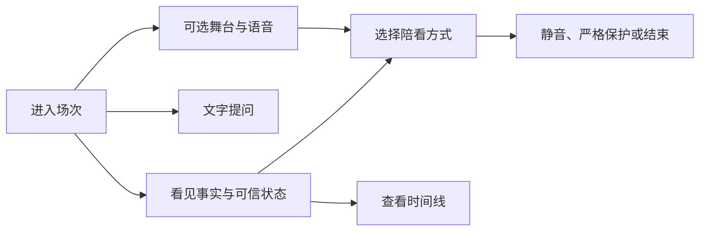
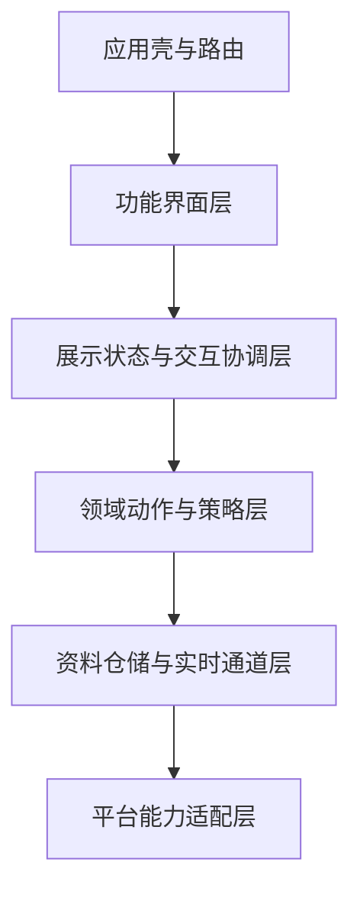
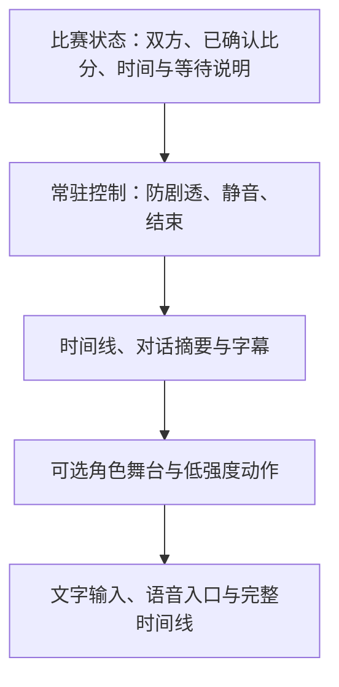
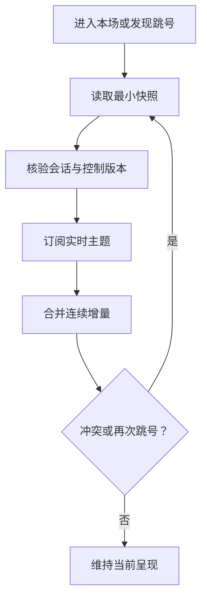

# Flutter 观赛端与多端降级

> 文档性质：0→1 工程执行方案。本文规定观赛端如何把事实、控制、角色舞台、对话、音频与异常状态组织为一个跨 Web 和移动端可降级的体验，而不是把沉浸效果置于用户理解、退出和无障碍之前。
>
> 核心判断：观赛端的第一职责是让用户在三秒内看见当前比赛状态和停止入口。角色形象、声音与动效只能是可选层，任何设备、网络或权限限制都不能使事实与控制失效。

> 方案形成时间：2026-01-28。

## 1. 施工目标、前序决策与边界

### 1.1 用户端需要交付什么

用户在看比赛时注意力稀缺。观赛端不能要求用户先理解复杂导航、等待角色加载、开启声音或给予麦克风许可，才能知道比分、理解“等待确认”、开启防剧透、静音或结束本场。跨端施工的目标是在不同屏幕、输入方式、网络质量和权限状态下，保留同一组核心任务。



首轮交付包括：比赛入口与本场壳；带版本的事实快照与时间线；可见的实时状态；低打扰对话面板；角色舞台的可选呈现；音频和麦克风的分步入口；本场控制面；文字优先降级；Web 与移动端的行为差异说明；无障碍语义与键盘路径；断网、冲突、删除、权限拒绝和性能不足时的诚实回退。

### 1.2 本文继承的前序决策

| 前序决策 | 客户端必须落实的结果 |
| --- | --- |
| 事实、候选、观察与角色表达分离 | 界面不把临时、冲突或用户观察伪装成已确认比赛状态 |
| 防剧透由用户选择且默认保守 | 严格保护始终可见，关键事件不能被舞台或声音绕过 |
| 语音是一次性、可停止的可选输入 | 麦克风入口不阻塞文字任务，状态与停止控制持续可见 |
| 角色不索取依赖或替代现实关系 | 任何动效、声音、空状态和通知文案都不制造等待或内疚 |
| 记忆和偏好按许可、范围与生命周期处理 | 客户端只显示当前会话可见的最少设置，不恢复他人的资料 |
| 删除、静音和结束优先 | 所有本地队列、舞台动作、音频与实时订阅都能立即收缩 |

### 1.3 非目标

首轮不建设视频转播、比赛画面录制、后台音频持续运行、跨用户同看房间、自动社交分享、强制横屏、仅靠手势完成关键操作、通过角色表情表达事实、用闪烁或声音作为唯一提示，或为了保持沉浸强行在低性能设备加载完整舞台。

用户可以选择沉浸舞台，但不能被角色遮挡比分、控制或退出。Flutter 只是跨端呈现工具，不是把 Web 和移动端差异抹平的借口。浏览器权限、音频策略、键盘、窗口尺寸、系统减少动效设置与移动设备生命周期都必须显式进入设计。

### 1.4 明确假设

**编号：H1**
- **假设**：一套共享领域状态可让 Web 和移动端保持相同用户语义
- **若不成立**：端间行为仍不一致
- **首轮处理**：合同优先，平台层只处理能力差异

**编号：H2**
- **假设**：角色舞台可独立卸载而不影响核心观赛任务
- **若不成立**：用户认为关闭舞台等于关闭服务
- **首轮处理**：用完整文字观赛壳证明基础体验独立

**编号：H3**
- **假设**：用户能理解“已确认、等待、冲突、不可用”的不同状态
- **若不成立**：用户只看数字不看状态
- **首轮处理**：用短文本、图标、语义标签和时间线反复校验

**编号：H4**
- **假设**：默认竖屏、小屏信息层级足以支持多数首轮场景
- **若不成立**：横屏电视伴看需求更强
- **首轮处理**：横屏只扩展布局，不改变控制路径

**编号：H5**
- **假设**：Web 与移动端都能提供清楚的音频/麦克风选择
- **若不成立**：某端权限限制过多
- **首轮处理**：直接进入文字优先，不做能力伪装

**编号：H6**
- **假设**：减少动效、低带宽和屏幕阅读器路径仍能交付完整服务
- **若不成立**：角色成为唯一理解载体
- **首轮处理**：将事实、控制、状态和文本响应设为不可缺失层

### 1.5 完成定义

首轮完成不等于在两端都画出相同页面。必须证明：任何端上都能在不加载舞台、不听声音、不授予麦克风、网络不稳定和屏幕缩放后完成看事实、提问、切换保护、静音和结束；实时消息乱序、断线或更正不会使页面显示旧结论；所有关键操作可以触摸、键盘或辅助输入完成；共享设备或会话切换不会显示他人的偏好和草稿；性能压力先关闭表演而不是关闭用户控制。

## 2. 客户端架构：把产品边界放到模块边界里

### 2.1 六层结构

Flutter 官方架构指南倡导清晰的 UI、领域与资料职责分离。观赛端采用六层结构，使实时订阅、状态恢复、舞台与权限不会相互污染。



**层：应用壳与路由**
- **主要职责**：入口、主题、会话边界、恢复到安全页面
- **允许依赖**：功能注册与平台信息
- **不允许负责**：读取比赛事实或决定角色表达

**层：功能界面层**
- **主要职责**：页面布局、语义标签、触摸/键盘交互、动画容器
- **允许依赖**：展示状态与动作
- **不允许负责**：自行合并实时消息或保存隐私资料

**层：展示状态与交互协调层**
- **主要职责**：把领域状态转为可见状态，处理短暂 UI 状态
- **允许依赖**：领域动作、页面生命周期
- **不允许负责**：绕过版本、权限或删除检查

**层：领域动作与策略层**
- **主要职责**：进入本场、切换保护、结束、暂停记忆、提交反馈
- **允许依赖**：合同与仓储接口
- **不允许负责**：直接调用浏览器或原生权限接口

**层：资料仓储与实时通道层**
- **主要职责**：快照读取、版本合并、重连、请求去重、本地短期缓存
- **允许依赖**：HTTP、实时主题、加密存储抽象
- **不允许负责**：决定角色风格或长期关系语义

**层：平台能力适配层**
- **主要职责**：麦克风、音频输出、方向、窗口、辅助服务、网络提示
- **允许依赖**：Web/Android/iOS 等平台接口
- **不允许负责**：保存业务状态或替代服务端授权

模块必须以用户任务命名，例如 `match_room`、`match_timeline`、`session_controls`、`voice_turn`、`stage`、`preferences`、`accessibility`，而非以单个组件或后端路径命名。这样“关闭舞台”“切换严格保护”“结束本场”都是横跨层但可追溯的动作，而非散落在多个页面中的临时判断。

### 2.2 状态来源与本地缓存边界

客户端只把服务端已确认的本场快照、用户明确选择的即时控制和用于恢复页面的最少游标作为持久状态。舞台帧、角色动作、临时转写、未确认候选、其他人的内容、已删除记忆、旧音频和带敏感内容的完整对话不进入长期本地缓存。

**状态类别：比赛事实快照**
- **权威来源**：事实服务的版本快照
- **可否短期缓存**：可以，仅用于显示最后确认状态
- **失效方式**：收到更高版本、更正或会话结束

**状态类别：本场控制**
- **权威来源**：用户动作后的控制版本
- **可否短期缓存**：可以，优先同步
- **失效方式**：用户结束、删除、会话失效或更高版本

**状态类别：防剧透模式**
- **权威来源**：当前会话的服务端状态
- **可否短期缓存**：可以，但不能离线自作主张升级
- **失效方式**：切换、重连、会话变更

**状态类别：舞台资源**
- **权威来源**：本地或受控内容分发
- **可否短期缓存**：可以按资源策略
- **失效方式**：性能收缩、版本变化、空间回收

**状态类别：临时文本草稿**
- **权威来源**：当前页面内存
- **可否短期缓存**：仅在当前页面短期存在
- **失效方式**：页面离开、用户取消、会话结束

**状态类别：关系偏好摘要**
- **权威来源**：当前会话许可范围内的最小投影
- **可否短期缓存**：可选，必须受保护
- **失效方式**：暂停、删除、身份或会话变化

离线时客户端只能呈现最后一份明确标注为“最后确认”的快照和本地控制界面。它不能根据时间推算比分、重复播放旧角色话术，或把缓存的待确认事件变成新事实。

### 2.3 依赖方向与可替换性

领域动作只面向抽象合同，例如“获取本场快照”“订阅会话主题”“更新保护模式”“取消语音回合”。WebSocket、HTTP、浏览器权限、移动系统权限、Live2D 或其它渲染引擎都位于外侧适配层。这样在某个平台无法使用某项能力时，替换的是适配层和可见状态，而不是让整套比赛逻辑分叉。

任何平台特例必须回答：它影响的是能力可用性、交互入口还是用户语义？若只是能力可用性，例如浏览器不允许无用户手势播放声音，平台层应返回“需要用户主动播放”；领域层仍保持“声音是可选输出、文字完整可用”的统一规则。

## 3. 沉浸页面：事实与控制永远压在舞台之上

### 3.1 房间的五层布局

观赛房间不是一张全屏角色海报。页面按功能而非视觉装饰分为五层，自底向上排列：舞台背景、角色呈现、对话或短分析、比赛事实与状态、本场控制与紧急退出。事实与控制在视觉层级和语义层级都高于角色层。



小屏时不把所有层堆成缩小版。默认呈现事实状态、输入和本场控制；舞台折叠为可展开卡片或静态形象；对话保留一条摘要和展开入口；时间线以底部面板或独立页面呈现。横屏或大屏可以并排增加舞台空间，但不能把控制移动到角色后方或屏幕边缘难以触及的位置。

### 3.2 沉浸不是唯一模式

用户可在以下四种可见模式间切换，且切换不改变会话事实、控制与删除权限。

**模式：文字优先**
- **适用场景**：低性能、安静环境、辅助技术、用户选择
- **必须保留**：事实、时间线、输入、所有控制
- **关闭什么**：舞台动画、自动声音

**模式：紧凑陪看**
- **适用场景**：小屏或用户只想偶尔互动
- **必须保留**：最小形象、短字幕、控制
- **关闭什么**：大型背景、持续动作

**模式：舞台陪看**
- **适用场景**：用户主动选择沉浸呈现
- **必须保留**：事实置顶、退出与降低动效
- **关闭什么**：无关装饰与高频动作

**模式：安静模式**
- **适用场景**：用户专注比赛、情绪或安全收缩
- **必须保留**：事实、文字入口、结束
- **关闭什么**：角色声音、动效、主动话术

模式是呈现选择，不是关系阶段。用户在安静模式中仍能使用全部事实和控制；角色不因被隐藏而表示失望，也不在用户切回舞台后补发之前错过的表演。

### 3.3 状态可见性

页面必须同时显示“比赛信息是否可靠”“客户端是否连接”“语音是否接收”“角色是否正在输出”“用户控制是否已生效”。这些是不同状态，不能被同一个“在线”圆点混淆。

**状态：已确认事实**
- **推荐可见语言**：“已确认 · 20:15 更新”
- **视觉语义**：文本、时间、状态图标
- **不可使用的替代**：只用绿色或角色点头

**状态：等待确认**
- **推荐可见语言**：“信息仍在确认，暂不抢先提示”
- **视觉语义**：中性状态条
- **不可使用的替代**：角色皱眉或模糊动画

**状态：事实冲突**
- **推荐可见语言**：“当前信息不一致，保留最后确认状态”
- **视觉语义**：明确收缩说明与时间线入口
- **不可使用的替代**：用新比分闪烁吸引注意

**状态：实时连接恢复**
- **推荐可见语言**：“连接已恢复，正在同步当前状态”
- **视觉语义**：进度与文字入口
- **不可使用的替代**：自动播放旧回答

**状态：正在接收语音**
- **推荐可见语言**：“正在听，可随时停止”
- **视觉语义**：明确状态和停止按钮
- **不可使用的替代**：波形或嘴型作为唯一依据

**状态：声音已静音**
- **推荐可见语言**：“本场声音已关闭”
- **视觉语义**：控制状态与文字保留
- **不可使用的替代**：角色表情暗示

**状态：舞台已降低**
- **推荐可见语言**：“已切换为文字优先”
- **视觉语义**：可恢复入口
- **不可使用的替代**：把性能失败隐藏起来

### 3.4 舞台动作的输入合同

舞台层只能接收经过表达许可的结构化动作，而不能自行根据比分、对话或角色模型输出决定动作。最小动作合同包含：意图、强度、持续上限、是否可中断、关联文本、事实状态、有效期和取消版本。

```json
{
  "presentation_id": "pr_01J9Q...",
  "intent": "brief_acknowledgement",
  "intensity": "low",
  "max_duration_ms": 1200,
  "interruptible": true,
  "caption": "收到，你可以继续看比赛。",
  "fact_status": "confirmed",
  "expires_at": "2026-01-28T20:16:00Z",
  "control_version": 12
}
```

动作在交付前检查本场静音、安静模式、防剧透、结束、减少动效、事实版本和控制版本。任何过期、冲突或已取消动作都被丢弃。舞台不允许根据“精彩时刻”自行变得更大声、更靠近屏幕或更长时间注视用户。

## 4. 状态管理：用版本而不是偶然到达顺序驱动页面

### 4.1 五类状态

客户端将状态分成应用、会话、事实、实时连接和呈现五类。每类有独立版本与恢复规则，避免断网后一个布尔值把整页误标为“正常”。

**类别：应用状态**
- **核心字段**：路由、主题、平台能力、无障碍偏好
- **生命周期**：应用会话
- **优先级**：低

**类别：本场会话状态**
- **核心字段**：会话标识、控制版本、保护模式、结束状态
- **生命周期**：进入到结束本场
- **优先级**：最高

**类别：事实状态**
- **核心字段**：快照版本、事实级别、比分、时间线游标
- **生命周期**：场次订阅
- **优先级**：高

**类别：实时状态**
- **核心字段**：已连接、重连、最后序号、同步状态
- **生命周期**：连接生命周期
- **优先级**：中

**类别：呈现状态**
- **核心字段**：舞台模式、字幕、语音输出、局部动画
- **生命周期**：页面生命周期
- **优先级**：低，随控制收缩

控制优先级为：删除或安全冻结 > 结束本场 > 静音 > 严格保护 > 事实更正/冲突 > 实时同步 > 舞台与角色表达。所有 reducer、页面订阅和动作队列都必须遵守这个顺序。用户点下结束后，哪怕旧动作先到达，也不能重新打开舞台、播放声音或把会话标回活跃。

### 4.2 快照优先、增量补充

首次进入和任何发现序号缺口时，客户端先取得带 `snapshot_version` 的最小快照，再开始消费增量主题。增量只在会话标识匹配、版本可衔接、控制未失效时合并。无法衔接时，不猜测缺失消息，直接回到“正在同步当前状态”的可见状态。



快照展示的“最后确认”不是离线模式的掩饰。若网络不可用，页面要明确说明更新时间与限制，并保留重新尝试、文字输入、控制和结束路径。不能根据本地计时器伪造比赛进行中的事实，也不能把缓存过期内容显示为实时。

### 4.3 实时主题映射

**主题：`watch_session.snapshot_changed`**
- **客户端状态变化**：更新事实快照版本
- **可否合并**：否
- **用户可见影响**：更新比分、状态与时间线入口

**主题：`watch_session.control_changed`**
- **客户端状态变化**：更新保护、静音或结束
- **可否合并**：否
- **用户可见影响**：立即取消不符合控制的呈现

**主题：`watch_session.correction`**
- **客户端状态变化**：标记更正并刷新相关视图
- **可否合并**：否
- **用户可见影响**：显示最小更正说明

**主题：`watch_session.delivery_ready`**
- **客户端状态变化**：排入可交付呈现动作
- **可否合并**：可以过期丢弃
- **用户可见影响**：仅在当前模式允许时展示

**主题：`watch_session.delivery_cancelled`**
- **客户端状态变化**：取消本地动作
- **可否合并**：否
- **用户可见影响**：停止未开始或可中断的输出

**主题：`voice_turn.capture_changed`**
- **客户端状态变化**：更新麦克风状态
- **可否合并**：否
- **用户可见影响**：显示“正在听”或已停止

**主题：`voice_turn.transcript_partial`**
- **客户端状态变化**：更新临时文字
- **可否合并**：可以被较新版本替代
- **用户可见影响**：显示“仍在整理”

**主题：`session.health_changed`**
- **客户端状态变化**：更新连接或依赖降级
- **可否合并**：可以合并
- **用户可见影响**：切换等待或文字优先提示

每个主题都需带会话标识、主题内序号、状态版本和产生时间。客户端只确认当前会话主题，不能订阅通配主题或依据场次编号读取其它用户消息。临时转写永远低于用户编辑文本；呈现动作永远低于本场控制版本。

### 4.4 页面生命周期与恢复

移动端进入后台、Web 标签页失焦、设备旋转、窗口缩放或浏览器恢复都不是“用户仍希望延续旧动作”的证据。页面恢复后先读取会话状态和最新快照，再决定是否重订阅；语音输入保持关闭；声音不自动续播；舞台默认停在静态或低动作状态；任何延迟较久的对话与表演进入过期处理。

若用户在后台期间结束本场、切换严格保护、删除记忆或发生更正，恢复时必须以较新控制和事实为准。本地缓存只是一份显示辅助，永远不能把旧版本写回服务。

## 5. Web 与移动差异：同一任务，不强行相同行为

### 5.1 能力矩阵

**能力：屏幕尺寸**
- **Web**：浏览器窗口可连续缩放，可能多标签
- **Android / iOS**：固定屏幕为主，受系统分屏影响
- **统一用户语义**：小空间先保留事实和控制

**能力：输入**
- **Web**：鼠标、键盘、触摸、屏幕阅读器混用
- **Android / iOS**：触摸、系统辅助功能、外接键盘可用
- **统一用户语义**：关键动作至少有明确按钮与语义标签

**能力：麦克风**
- **Web**：受安全上下文、浏览器许可和用户手势影响
- **Android / iOS**：受系统运行时权限和设备状态影响
- **统一用户语义**：未获许可时文字完整可用

**能力：音频播放**
- **Web**：常需用户激活，标签页可被限制
- **Android / iOS**：受静音键、音频焦点、系统中断影响
- **统一用户语义**：不自动发声，声音可随时停

**能力：网络生命周期**
- **Web**：标签页可冻结、后台限制较强
- **Android / iOS**：后台、来电、省电策略会中断连接
- **统一用户语义**：恢复只恢复状态，不续播旧内容

**能力：方向与窗口**
- **Web**：横竖取决于窗口尺寸
- **Android / iOS**：可旋转、分屏或系统方向锁
- **统一用户语义**：不强制方向，布局可重排

**能力：性能**
- **Web**：设备与浏览器差异大，图形后端多样
- **Android / iOS**：受机型、温度与内存影响
- **统一用户语义**：先降舞台和动效，再不影响事实

Flutter 的 Web 集成资料说明 Web 有自身的部署、渲染和平台限制；移动端的生命周期也不能照搬浏览器行为。客户端应共享领域状态、合同和用户语言，而不是共享一套不考虑平台约束的“万能操作”。

### 5.2 布局断点与方向规则

首轮不以特定设备像素为唯一断点，而以“可用宽度、文字缩放后可用高度、输入方式、系统安全区域和窗口多任务状态”共同决定布局。建议按紧凑、常规、扩展三类布局组织：

**布局：紧凑**
- **主要范围**：窄屏、分屏、大文字
- **页面策略**：事实置顶；控制固定；时间线与对话分层展开
- **舞台策略**：默认折叠或静态缩略

**布局：常规**
- **主要范围**：典型手机和中等窗口
- **页面策略**：事实、对话、舞台可切换
- **舞台策略**：低强度舞台可用

**布局：扩展**
- **主要范围**：平板、桌面、横向窗口
- **页面策略**：事实与控制固定一列，时间线/舞台并列
- **舞台策略**：可扩大，但不覆盖控制

方向变化只是重排，不重置本场、不重新请求许可、不恢复被用户关闭的声音。Flutter 的方向适配公开指南可作为处理尺寸变化的参考；用户的系统方向偏好高于沉浸页面的视觉构图。

### 5.3 平台能力探测

能力探测发生在用户想使用某项可选能力时，而不是应用首次打开时一次性索要全部权限。探测结果只归类为`available`、`needs_user_action`、`temporarily_unavailable`、`not_supported`或`restricted`，并映射到可行动的文字说明。

例如 Web 端要求安全上下文和用户手势才能使用麦克风或播放声音时，页面显示“开始语音后会请求麦克风”“点击播放后才会发声”；移动端系统拒绝麦克风时，显示“可以继续用文字，也可以到系统设置中调整”。不把平台错误码直接展示给用户，也不因为某个端不支持舞台而隐藏比赛任务。

## 6. 音频、麦克风与权限：客户端永远把文字放在第一位

### 6.1 分步入口

声音输出、麦克风输入和保存转写分别是独立选择。观赛端必须避免“一次开启语音”同时请求麦克风、自动播放、保存转写和启用长期记忆。

**用户动作：点击播放角色声音**
- **客户端执行**：请求当前回合的音频输出许可/激活
- **用户看到**：声音状态、静音按钮、字幕
- **失败时**：保留文字，不反复尝试播放

**用户动作：点击开始说话**
- **客户端执行**：请求麦克风且创建一次语音回合
- **用户看到**：“正在准备，尚未发送”
- **失败时**：直接回文字输入

**用户动作：点击停止语音**
- **客户端执行**：取消采集、上传和后续声音
- **用户看到**：“已停止本轮语音”
- **失败时**：仍保留文字与结束

**用户动作：选择保存偏好**
- **客户端执行**：打开独立许可卡
- **用户看到**：用途、范围、到期和删除
- **失败时**：拒绝不影响本场

Android 的运行时权限指南和浏览器 `getUserMedia()` 资料都表明权限由系统或用户代理管理。客户端不能假装已获许可，也不能通过多次弹窗消耗用户耐心。每次拒绝都要有完整的文字路径和可稍后再试的入口。

### 6.2 音频焦点与中断

来电、系统提示、耳机断开、浏览器标签失焦、用户静音键、另一个应用取得音频焦点，都会改变播放或输入能力。客户端收到中断时先停止角色输出和麦克风回合，保留同步文字、事实和控制；恢复时不自动续播旧内容、不自动重开麦，仅显示“声音可再次选择”。

用户主动开始说话时，角色声音让位。若 VAD 只发现背景声，客户端可以暂停角色声音并等待明确输入，但不能把背景内容当成新任务。所有音频状态需要有字幕或文字状态，波形、嘴型和声音本身不能承担唯一告知责任。

### 6.3 语音状态与本场控制的冲突

优先级固定为：结束本场 > 本场静音 > 切换文字优先 > 关闭麦克风 > 用户停止回合 > 新用户输入 > 正在播放的角色输出。页面在任何状态都应保留可触达的停止与结束按钮，且按钮不被全屏舞台、键盘弹出或系统安全区域遮挡。

严格保护模式下，声音不得抢先说出关键事实；即使文本事实已被安全过滤，舞台的欢呼、音乐、镜头切换或口型也不能暗示结果。事实资格需要传给音频和舞台适配层，而非只由文字组件处理。

## 7. 多端降级：保留任务，不保留幻觉

### 7.1 降级原则

降级不是把页面变成空白错误页，而是按用户影响从低到高收缩：先去除非必要舞台与动效，再暂停主动声音，再保留文字事实与控制；如果事实也不可确认，则只显示最后确认快照、等待说明和退出。任何时候都不把性能、网络或权限问题包装成角色的情绪反应。

### 7.2 降级层级

**级别：D0 完整可选体验**
- **触发**：状态、网络、资源和权限可解释
- **保留能力**：事实、控制、文字、可选舞台/声音
- **停止能力**：无

**级别：D1 轻量舞台**
- **触发**：帧率下降、带宽波动、窗口太小或减少动效
- **保留能力**：静态角色、字幕、事实、控制
- **停止能力**：高强度动作、自动声音、复杂背景

**级别：D2 文字优先**
- **触发**：舞台资源失败、音频中断、权限拒绝、实时不稳
- **保留能力**：快照、时间线、文字输入、全部控制
- **停止能力**：舞台、语音、主动表演

**级别：D3 安全静默**
- **触发**：会话隔离、删除、控制或事实完整性异常
- **保留能力**：最小状态、退出、反馈、重新尝试
- **停止能力**：所有角色表达、缓存恢复、主动订阅

恢复要经过“状态重核验 → 快照同步 → 控制版本检查 → 用户主动选择舞台/声音”四步。不能因网络恢复就突然出现一段积压的语音、先前错过的欢呼或被用户关闭的角色层。

### 7.3 性能预算的用户语言

性能策略使用用户可理解的结果，而不是“GPU 不足”“渲染器回退”等术语。推荐语言包括：“为了让比赛状态和控制保持稳定，已改为轻量显示。”“舞台暂时不可用，文字陪看和时间线仍可用。”“已关闭动效，你可以随时再试。”不应把责任归给用户的设备，也不把“加载中”无限延长来掩盖资源失败。

舞台性能指标包括首个可用事实时间、控制可点击时间、渲染卡顿对输入的影响、减少动效后的稳定性和低端设备的文字路径成功率。帧率本身不是核心目标，若提高帧率会牺牲电量、发热、控制响应或文字可读性，应优先用户任务。

### 7.4 网络与实时异常表

**异常：首次快照超时**
- **客户端动作**：显示等待、重试和返回入口
- **用户可见结果**：“暂时无法取得当前比赛状态。”
- **禁止行为**：用旧缓存伪装最新状态

**异常：实时主题跳号**
- **客户端动作**：停止局部合并并取新快照
- **用户可见结果**：“正在同步当前状态。”
- **禁止行为**：按到达顺序猜测补齐

**异常：更正到达**
- **客户端动作**：取消旧呈现、刷新时间线
- **用户可见结果**：最小更正说明
- **禁止行为**：静默替换比分或继续旧庆祝

**异常：会话结束**
- **客户端动作**：清除局部队列和订阅
- **用户可见结果**：“本场已结束。”
- **禁止行为**：自动进入下一场或继续播放

**异常：删除/暂停到达**
- **客户端动作**：清理本地投影与引用
- **用户可见结果**：“相关设置已停止使用。”
- **禁止行为**：从缓存恢复旧昵称和记忆

**异常：服务限流**
- **客户端动作**：禁用重复提交并保留文字
- **用户可见结果**：“操作过于频繁，请稍后再试。”
- **禁止行为**：无提示地重复发送

## 8. 无障碍与低刺激路径：不是额外设置，而是完整产品

### 8.1 任务等效

Flutter 无障碍指南、WCAG 2.2 和 WAI-ARIA 相关资料均强调可感知、可操作、可理解和健壮。观赛端把目标落在任务等效上：不看角色、不开声音、不用麦克风、不使用手势、只用键盘或屏幕阅读器时，用户仍能进入比赛、理解事实、提问、切换保护、静音、删除和结束。

| 需求或环境 | 必须提供 | 验收问题 |
| --- | --- | --- |
| 不听声音或处于嘈杂处 | 同步文字、字幕、可读状态、无声音控制 | 关闭声音后能否完成事实查询与退出？ |
| 视觉差异或屏幕阅读器 | 语义顺序、明确标签、状态播报、足够对比 | 不看角色表情能否知道“正在听/已停止”？ |
| 运动敏感或低刺激偏好 | 减少动效、无闪烁、静态舞台、可关闭背景 | 关闭动效后是否仍完整可用？ |
| 运动差异 | 足够大的目标、键盘顺序、避免持续按住 | 能否一次触达静音和结束？ |
| 大字体或小屏 | 文本重排、可滚动内容、不截断控制 | 放大后控制是否仍在可视区域？ |
| 认知负担高 | 简短状态、逐步披露、不可依赖记忆 | 用户能否复述当前事实和下一步？ |

### 8.2 语义与焦点管理

每个页面定义语义阅读顺序：比赛标题与事实状态 → 本场控制 → 当前状态说明 → 时间线/对话 → 可选舞台 → 输入。舞台图层默认不抢占焦点；装饰性背景不进入语义树；角色动作只在确有用户价值的情况下提供简短描述，且不得与事实状态混为一谈。

实时更新不得每次都打断屏幕阅读器。客户端应合并低优先级状态，只有事实更正、控制生效、语音开始/停止、会话结束和严重降级使用受控播报。过多播报会比没有播报更妨碍观赛，因此需按优先级和用户设置限流。

### 8.3 减少动效与感官安全

系统减少动效设置、用户本场选择和性能降级三者共同决定舞台强度。只要任一要求收缩，客户端立即停止非必要移动、快速镜头、闪烁、震动和突发声音。颜色不单独表达比分变化、错误、确认或风险；每种状态都有文字、图标和语义标签。

动画状态也需要可取消。页面离开、用户静音、切换严格保护、降低动效、事实更正或舞台异常时，动画不应“优雅收尾”后才停止。用户的控制优先于完整表演。

## 9. 接口合同与客户端映射

### 9.1 最小资源表面

**方法与路径：`POST /v1/watch-sessions`**
- **页面任务**：进入或恢复本场
- **客户端状态变化**：建立会话与初始控制版本
- **失败后的最低体验**：返回比赛选择与文字入口

**方法与路径：`GET /v1/watch-sessions/{id}/snapshot`**
- **页面任务**：读取当前快照
- **客户端状态变化**：更新事实与时间线游标
- **失败后的最低体验**：显示等待与最后确认状态

**方法与路径：`POST /v1/watch-sessions/{id}/spoiler-mode`**
- **页面任务**：切换保护
- **客户端状态变化**：更新控制并取消不合格呈现
- **失败后的最低体验**：显示当前保护模式

**方法与路径：`POST /v1/watch-sessions/{id}/mute`**
- **页面任务**：本场静音
- **客户端状态变化**：停止音频和相关舞台动作
- **失败后的最低体验**：保留字幕和文字

**方法与路径：`POST /v1/watch-sessions/{id}/end`**
- **页面任务**：结束本场
- **客户端状态变化**：清理队列、订阅和临时草稿
- **失败后的最低体验**：显示已结束与返回入口

**方法与路径：`GET /v1/matches/{id}/timeline`**
- **页面任务**：打开事实时间线
- **客户端状态变化**：分页读取可见事件
- **失败后的最低体验**：显示最后确认与重试

**方法与路径：`POST /v1/voice-turns`**
- **页面任务**：用户主动开口
- **客户端状态变化**：创建独立语音状态
- **失败后的最低体验**：改用文字输入

**方法与路径：`GET /v1/relationship-state`**
- **页面任务**：打开偏好和控制
- **客户端状态变化**：显示当前许可投影
- **失败后的最低体验**：只显示本场默认设置

客户端所有写入带操作标识和最新已知控制版本。发生版本冲突时，不在页面层“谁最后点谁赢”，而是重新读取服务端当前状态、向用户说明已更新的结果，再允许其主动选择。这样共享设备、重连与重复点击不会制造两个彼此矛盾的本场状态。

### 9.2 快照映射

```json
{
  "match_id": "match_2026_001",
  "snapshot_version": 42,
  "fact_status": "waiting",
  "score": null,
  "match_clock": "68:12",
  "updated_at": "2026-01-28T20:18:00Z",
  "spoiler_mode": "strict",
  "session_controls": {
    "muted": true,
    "ended": false,
    "stage_mode": "text_first"
  },
  "notice": "信息仍在确认，关键事件不会主动显示。"
}
```

映射规则：`score: null` 在界面中显示“暂不可确认”，绝不补成 `0:0`；`fact_status: waiting` 禁止舞台做出赛果暗示；`muted: true` 停止声音与相关口型，字幕仍可见；`stage_mode: text_first` 是本地呈现选择，不能改变服务端的防剧透模式或关系状态；`ended: true` 清空所有可交付呈现并将页面改为结束状态。

### 9.3 错误合同与可行动状态

**错误标识：`REALTIME_UNAVAILABLE`**
- **页面表达**：“实时更新暂不可用，仍可查看最后确认状态。”
- **可用动作**：重试、时间线、结束
- **平台层不得做什么**：重放积压角色内容

**错误标识：`SPOILER_CONFIRM_REQUIRED`**
- **页面表达**：“这可能透露结果，确认后再显示。”
- **可用动作**：查看、保持保护、返回
- **平台层不得做什么**：自动展开事件正文

**错误标识：`AUDIO_USER_GESTURE_REQUIRED`**
- **页面表达**：“点击播放后才会发声。”
- **可用动作**：播放、保持静音
- **平台层不得做什么**：自行调用播放或跳转页面

**错误标识：`MICROPHONE_PERMISSION_REQUIRED`**
- **页面表达**：“需要麦克风许可；也可继续用文字。”
- **可用动作**：开始许可、文字、取消
- **平台层不得做什么**：在后台持续请求

**错误标识：`STAGE_RESOURCE_FAILED`**
- **页面表达**：“舞台暂时不可用，已保留文字陪看。”
- **可用动作**：重试、保持文字
- **平台层不得做什么**：隐藏事实或控制

**错误标识：`SESSION_ENDED`**
- **页面表达**：“本场已结束。”
- **可用动作**：返回比赛列表、开始新场
- **平台层不得做什么**：恢复旧语音和旧草稿

**错误标识：`ACCESS_SCOPE_DENIED`**
- **页面表达**：“当前会话无法使用这项内容。”
- **可用动作**：返回、开始新会话
- **平台层不得做什么**：展示其它会话资料

## 10. 精确 AI 协作提示词

### 10.1 提示词一：建立观赛端分层与本场状态

```text
你正在用 Flutter 建设一个足球陪看观赛端。任务是建立跨 Web 和移动端一致的本场状态、事实快照、控制优先级与页面分层，不是制作全屏角色演示。

范围：应用壳、match_room、timeline、session_controls、stage、voice_turn、accessibility 与平台能力适配。硬约束：事实和控制高于舞台；快照优先于实时增量；结束、静音、严格保护和删除优先；未确认事实不可被角色、声音或动效暗示；临时草稿不跨会话；文字路径始终完整。

请先输出模块图、状态来源、版本合并规则和平台差异表；再列出需要新增或修改的文件、每项用户影响、运行命令、十二个异常情境和回退方案。不得在界面层自行修改比赛事实、绕过会话范围、把舞台动作当状态来源，或用加载动画掩盖控制不可用。
```

### 10.2 提示词二：建设舞台与多端降级

```text
请为 Flutter 观赛端建立可选舞台和多端降级机制。

目标：角色舞台只消费已经批准的呈现动作；Web 和移动端在能力不足时保留同一用户任务。必须支持文字优先、紧凑陪看、舞台陪看、安静模式以及 D0 到 D3 的降级。任何减少动效、性能、网络、权限、会话结束、事实冲突或用户控制都可以取消舞台动作。

请输出：布局断点、状态机、动作合同、性能收缩顺序、无障碍语义、平台能力探测、运行命令、验证矩阵与用户可见文案。禁止自动发声、用闪烁或角色表情表示事实、强制横屏、恢复后补播旧内容、因设备限制隐藏退出或文字入口。
```

### 10.3 提示词三：审查客户端改动是否破坏用户控制

```text
请审查以下 Flutter 观赛端改动：[粘贴改动]。

逐项检查：
1. 事实、候选、用户观察和角色表达是否仍分离；
2. 静音、结束、严格保护、删除和减少动效是否在所有媒介前生效；
3. Web 与移动端是否都保留文字、键盘/触摸、屏幕阅读器和小屏路径；
4. 实时消息跳号、更正、重连和离线缓存是否以快照和版本收敛；
5. 音频与麦克风是否由用户主动触发且随时可停；
6. 舞台是否可能遮挡、剧透、制造依赖或替代真实控制。

输出“允许 / 需要修改 / 拒绝”，给出触发规则、最小修正、需运行的情境和无法证明的风险。界面看起来更沉浸不是允许理由。
```

## 11. 施工顺序、命令与验收

### 11.1 四个阶段

**阶段：P1 本场骨架**
- **目标**：建立路由、快照、控制和文字任务
- **交付物**：`match_room`、状态容器、控制面
- **放行条件**：小屏文字模式可完成全部核心任务

**阶段：P2 实时与恢复**
- **目标**：建立主题订阅、版本合并、跳号重取快照
- **交付物**：实时通道、恢复状态、错误映射
- **放行条件**：断线与更正不显示旧结论

**阶段：P3 舞台与音频**
- **目标**：建立可取消舞台、字幕、音频/麦克风入口
- **交付物**：呈现动作合同、平台适配
- **放行条件**：关闭舞台/声音后体验仍完整

**阶段：P4 可访问与降级**
- **目标**：覆盖多端、低性能、辅助技术、共享设备
- **交付物**：无障碍语义、D0-D3、验收材料
- **放行条件**：所有异常可收缩而不失控制

每阶段结束应记录用户风险、合同版本、已运行情境、平台差异、资源范围、已知限制和回退方式。记录以用户结果命名，例如“严格保护取消舞台暗示”“重连后只恢复快照不续播声音”，不要写“客户端优化完成”这类无边界结论。

### 11.2 目标运行命令

以下命令描述目录骨架完成后的统一入口，不表示任意机器已具备全部环境、凭据或服务。

```powershell
flutter --version
flutter pub get
flutter run -d chrome --dart-define=APP_ENV=local
flutter run -d android --dart-define=APP_ENV=local
flutter analyze
dart run tool/scenario.dart --case strict-spoiler-stage-cancel
```

预期现象：Web 与移动端都能以文字模式进入本场；开发环境的实时主题只接受所属会话；情境运行器证明切换严格保护后取消未交付舞台动作；静态分析没有阻断问题。若设备、浏览器或模拟环境不可用，先记录平台能力与替代路径，而不是修改业务规则来迁就本机。

可用下列请求检查本场控制和快照映射：

```powershell
$headers = @{ Authorization = "Bearer <session-token>"; "Idempotency-Key" = "<operation-id>" }
Invoke-RestMethod -Method Post -Uri "http://localhost:8080/v1/watch-sessions" -Headers $headers -ContentType "application/json" -Body '{"match_id":"match_demo","spoiler_mode":"strict"}'
Invoke-RestMethod -Method Post -Uri "http://localhost:8080/v1/watch-sessions/<id>/mute" -Headers $headers -ContentType "application/json" -Body '{"operation_id":"<operation-id>"}'
Invoke-RestMethod -Method Get -Uri "http://localhost:8080/v1/watch-sessions/<id>/snapshot" -Headers $headers
```

预期结果：页面得到带版本的快照；静音后声音与舞台相关输出停止而文字保留；快照中的`waiting`、`conflicted`和`unavailable`都显示为可理解状态，不补造比分。重复静音返回同一控制结果。

### 11.3 验收情境矩阵

**编号：V1**
- **初始条件**：Web 窄窗口、舞台未加载
- **操作**：进入比赛
- **必须结果**：三秒内看见事实、保护、静音和结束

**编号：V2**
- **初始条件**：移动端横竖切换
- **操作**：旋转或分屏
- **必须结果**：不重置本场、不重开权限、不恢复旧音频

**编号：V3**
- **初始条件**：严格保护、关键事实已确认
- **操作**：收到呈现动作
- **必须结果**：不显示结果、不播放暗示性声音或动作

**编号：V4**
- **初始条件**：用户点击静音
- **操作**：角色正在输出
- **必须结果**：立即停止声音与相关动作，字幕可保留

**编号：V5**
- **初始条件**：用户结束本场
- **操作**：队列存在旧动作
- **必须结果**：清理订阅和队列，旧动作不再出现

**编号：V6**
- **初始条件**：实时消息跳号
- **操作**：恢复连接
- **必须结果**：取得新快照，不凭局部消息猜测

**编号：V7**
- **初始条件**：事实被更正
- **操作**：旧舞台动作尚未交付
- **必须结果**：取消旧动作，时间线给最小更正

**编号：V8**
- **初始条件**：浏览器拒绝麦克风
- **操作**：点击语音
- **必须结果**：完整回到文字，不反复请求许可

**编号：V9**
- **初始条件**：音频被系统中断
- **操作**：来电/标签失焦/耳机断开
- **必须结果**：停止声音，不自动续播或重开麦

**编号：V10**
- **初始条件**：用户开启减少动效
- **操作**：返回舞台
- **必须结果**：立即改静态或低动作，事实与控制完整

**编号：V11**
- **初始条件**：屏幕阅读器运行
- **操作**：浏览房间与控制
- **必须结果**：阅读顺序先事实和控制，舞台不抢焦点

**编号：V12**
- **初始条件**：大字体与窄屏
- **操作**：放大文字
- **必须结果**：不截断关键按钮，内容可重排

**编号：V13**
- **初始条件**：共享设备切换会话
- **操作**：打开偏好面
- **必须结果**：不显示上一会话昵称、草稿或记忆

**编号：V14**
- **初始条件**：舞台资源失败
- **操作**：重进房间
- **必须结果**：自动到文字优先，用户仍能完成所有任务

**编号：V15**
- **初始条件**：服务处于安全收缩
- **操作**：尝试开启舞台
- **必须结果**：保持最小状态与退出，不渲染关系性内容

### 11.4 放行门槛与风险

只有同时满足以下条件，才允许扩大舞台素材、音频范围或平台覆盖：

1. 事实、控制和退出在无舞台、无声音、无麦克风、无实时连接时仍完整可用；
2. 所有控制在 Web、移动、键盘、触摸和辅助路径中具有同等可达性；
3. 严格保护、静音、结束、删除和减少动效会取消所有不合资格的本地呈现；
4. 快照版本、更正、跳号和重连在两端呈现一致的可解释结果；
5. 舞台、声音、字幕和角色动作不会成为事实、关系或退出控制的唯一渠道；
6. 低性能与平台限制先降级到文字，不诱导用户更换设备、反复授权或保持停留；
7. 共享设备、会话切换和权限异常不泄露历史资料或恢复旧行为。

主要风险包括：舞台遮挡事实；大屏时控制被弱化；Web 自动播放限制导致无提示静音；移动系统中断后旧声音续播；实时乱序让比分回退；减少动效只关闭视觉却保留强声音；屏幕阅读器被频繁状态更新淹没；性能优化把低端用户排除在外。任一风险未被情境证明可收缩，首轮只放行文字优先模式。

## 12. 公开资料与访问记录

以下公开资料用于形成 Flutter 分层、Web 集成、响应式布局、权限和无障碍方法。它们不能证明特定屏幕断点、舞台素材、设备覆盖、性能阈值或用户偏好必然正确；实际取舍必须通过本篇的情境验证和用户研究形成。

> 信息卡：原宽表已改为纵向阅读，字段含义不变。

- **编号：R1**
  - **公开资料**：Flutter, *App architecture guide*
  - **用途**：客户端分层与职责划分参考
  - **地址**：https://docs.flutter.dev/app-architecture
  - **访问日**：2026-01-28

- **编号：R2**
  - **公开资料**：Flutter, *Web support*
  - **用途**：Flutter Web 部署、运行与平台差异参考
  - **地址**：https://docs.flutter.dev/platform-integration/web
  - **访问日**：2026-01-28

- **编号：R3**
  - **公开资料**：Flutter, *Accessibility*
  - **用途**：语义、可访问控制与跨端可用性参考
  - **地址**：https://docs.flutter.dev/ui/accessibility-and-internationalization/accessibility
  - **访问日**：2026-01-28

- **编号：R4**
  - **公开资料**：Flutter, *Orientation cookbook*
  - **用途**：尺寸与方向适配参考
  - **地址**：https://docs.flutter.dev/cookbook/design/orientation
  - **访问日**：2026-01-28

- **编号：R5**
  - **公开资料**：Android Developers, *Request app permissions*
  - **用途**：移动端运行时权限与解释路径参考
  - **地址**：https://developer.android.com/training/permissions/requesting
  - **访问日**：2026-01-28

- **编号：R6**
  - **公开资料**：MDN, *MediaDevices: getUserMedia()*
  - **用途**：Web 麦克风许可与用户代理限制参考
  - **地址**：https://developer.mozilla.org/en-US/docs/Web/API/MediaDevices/getUserMedia
  - **访问日**：2026-01-28

- **编号：R7**
  - **公开资料**：W3C, *Web Content Accessibility Guidelines 2.2*
  - **用途**：可感知、可操作和可理解体验参考
  - **地址**：https://www.w3.org/TR/WCAG22/
  - **访问日**：2026-01-28

- **编号：R8**
  - **公开资料**：W3C, *WAI-ARIA 1.2*
  - **用途**：语义、状态与辅助技术交互参考
  - **地址**：https://www.w3.org/TR/wai-aria-1.2/
  - **访问日**：2026-01-28

## 13. 结论

观赛端的价值不在于角色是否占满屏幕，而在于用户在任何设备上都能稳定掌握比赛与自己的控制权。以 Flutter 的共享领域状态为基础，把平台差异留在适配层，将快照、版本和控制优先级做成页面骨架，再把舞台、声音和动效限制为随时可卸载的可选层，才能让沉浸效果服务于观看，而不是要求用户为沉浸效果让步。
