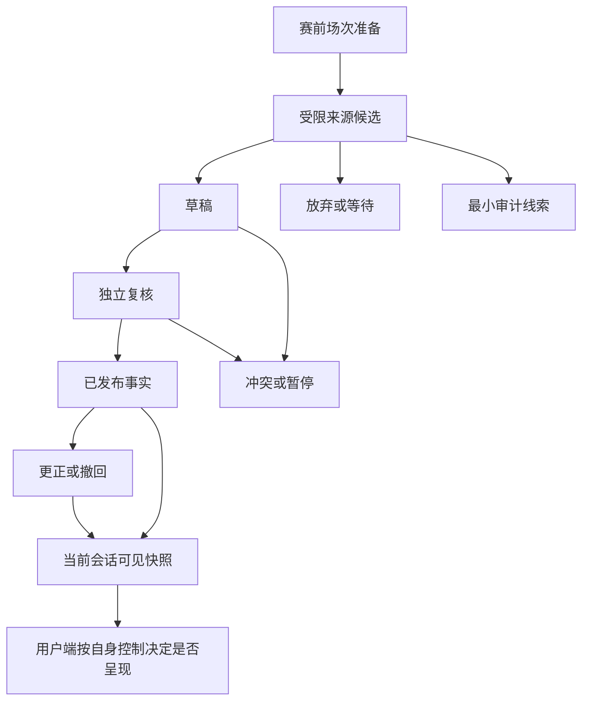
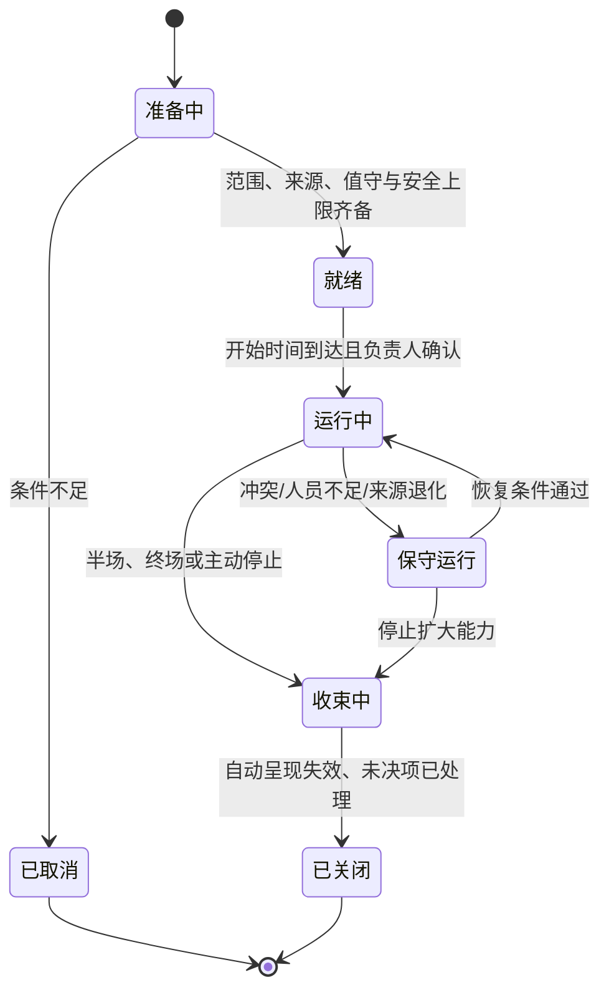
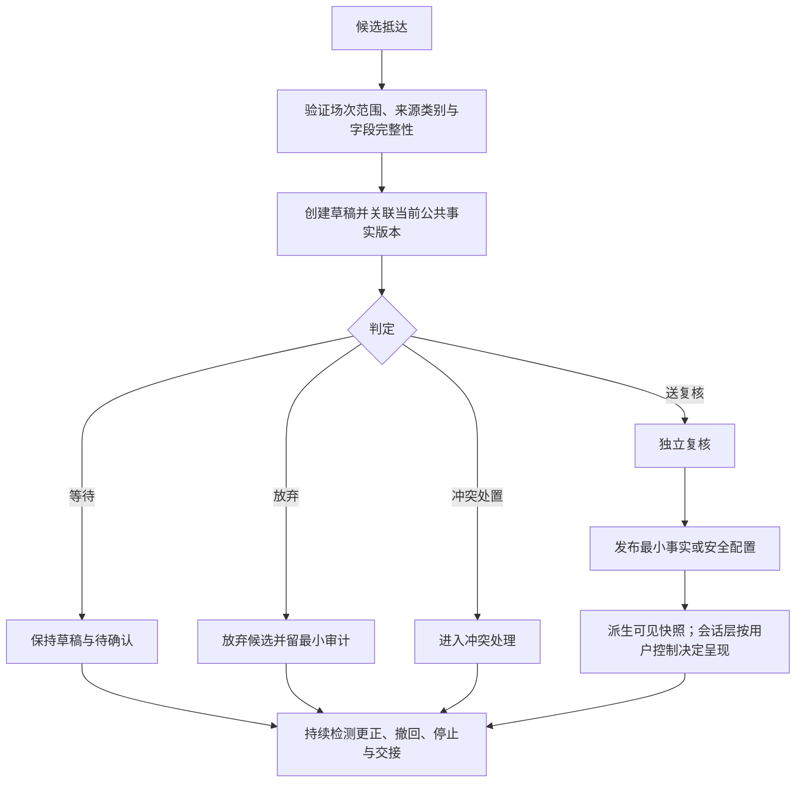
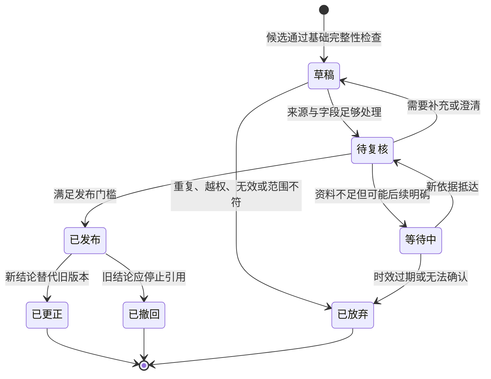

# 企业导播台、权限和操作幂等

> 文档性质：0→1 工程执行方案。本文定义运营导播台如何在比赛准备、候选录入、草稿、复核、发布、更正、暂停和收束中维护可信赛事状态与用户安全，而不成为窥看私人资料、操纵关系或制造气氛的后台。
>
> 适用阶段：有限赛事、有限角色、受控人员的首轮试点。岗位数量、确认阈值、时限、资料源、审批方式和自动化比例均为待验证假设，不代表既有组织、既有权限或已证实的运营效果。
>
> 核心判断：导播台的最高价值是让团队在不确定时能够等待、在错误时能够收缩、在用户受影响时能够更正。它不是把角色做得更热闹、更黏人或更能影响个体用户的工具。

> 方案形成时间：2026-01-28。

---

## 1. 施工目标、前序决策与完成定义

### 1.1 要解决的真实问题

一场足球比赛可能出现多来源延迟、错误候选、争议判罚、关键事件撤销、交接、弱网和人员误操作。若没有受约束的运营面，团队可能在压力下将单一来源、用户观察、个人立场或“气氛需要”误写成公共事实；若运营面拥有无边界的用户资料与发言开关，又可能把人工介入变成对用户的窥探与关系操纵。

首轮导播台只建立一条可被解释、取消和复核的公共状态链：



运营人员维护的是“哪些公共赛事信息已经可引用、哪些必须等待、哪些需要收回”，而不是“怎样让某个用户继续互动”。用户端是否播放声音、展示动作或继续一场陪看，仍由用户控制、严格防剧透和会话资格决定。

### 1.2 继承的产品与工程决策

| 前序决策 | 对导播台的约束 |
| --- | --- |
| 事实先于陪伴 | 运营只能发布来源与状态可解释的最小赛事事实，不能以热闹台词代替确认 |
| 默认严格防剧透 | 导播台发布不等于对全部用户立即可见；会话层仍决定可呈现资格 |
| 用户观察属于个人会话 | 不将“某用户说进了”写入公共赛事状态，也不默认展示给运营人员 |
| 关系边界不可绕过 | 不允许针对单个用户调整亲密台词、挽留动作、提醒频次或记忆召回 |
| 用户随时可安静、结束、删除 | 导播台的所有自动配置都必须被本场控制和结束动作覆盖 |
| 更正必须可理解 | 已影响用户的错误不能静默覆盖；必须停止旧引用并给出最小解释 |
| 高风险先收缩 | 事实冲突、安全风险、权限异常或运行故障时，优先暂停而非硬撑发布 |

### 1.3 范围与非范围

本文覆盖：运营工作台隔离、场次配置、角色与权限、草稿/复核/发布/更正状态机、操作幂等、审计线索、数据合同、交接、培训演练、可用性、风险与发布门槛。

本文不覆盖：赛事转播制作、私人对话日常浏览、用户画像、个体劝回、商业定价、用户间社群管理、人工代替用户控制、通过导播台发起恋爱化互动、用用户情绪驱动角色表现，或基于运营人员个人偏好裁定比赛事实。

### 1.4 首轮完成定义

首轮至少应连续证明：

1. 运营端与用户端具有明确隔离；运营人员默认看不到私人对话、原始音频、共同瞬间和可识别个人观察；
2. 每一项高影响操作都受角色、场次、时间、理由和复核条件约束，且不能由一个通用“管理员”无条件完成；
3. 候选可被保留为草稿、等待或放弃，发布不是唯一正常出口；
4. 发布、撤回、暂停、配置收紧与更正操作在重复提交、超时重试、重连和交接时不会重复影响用户；
5. 已发布事实具有版本、影响范围和更正关系，旧版本不会重新成为有效结论；
6. 运营操作即使成功，也不能绕过用户的防剧透、安静、仅文字、隐藏角色或结束选择；
7. 工作台在高压场景下仍能让人员找到“保持等待”“停止自动呈现”“撤回旧动作”这些更保守的选项；
8. 审计和复核足以解释高影响决定，但不将用户资料或运营线索变为商业/关系化画像。

---

## 2. 运营后台隔离与最小资料面

### 2.1 双端不是同一块“全知面板”

用户端负责个人观看体验、个人控制和自身资料；导播台负责有限场次的公共事实治理与运行安全。二者只能交换最少、已定义、可解释的结果，不能共享一个可以任意检索用户、角色和赛事的总览。

**信息类别：已发布赛事事实**
- **用户端可见**：与自己所选比赛和可见资格相关的结果
- **导播台默认可见**：状态、版本、更正关系、来源类别、处理理由
- **原则**：用户看结果；运营为维护事实看过程

**信息类别：未发布候选**
- **用户端可见**：不显示为事实
- **导播台默认可见**：仅负责该场次的事实角色可见
- **原则**：未确认信息不进入普通用户界面

**信息类别：用户个人观察**
- **用户端可见**：只属于本人当前会话
- **导播台默认可见**：不显示个人原文；仅可见去识别化健康汇总
- **原则**：观察只能促使保守等待，不能改变公共事实

**信息类别：私人对话和原始音频**
- **用户端可见**：用户在授权范围内查看
- **导播台默认可见**：日常运营不可见
- **原则**：不以“更好服务”为理由扩大访问

**信息类别：用户资料动作**
- **用户端可见**：用户本人查看保存、删除、提醒结果
- **导播台默认可见**：仅支持流程在必要范围内看最小状态
- **原则**：不用于赛事编辑、内容运营或关系判断

**信息类别：全局安全配置**
- **用户端可见**：用户只看自己的可见结果
- **导播台默认可见**：受权角色看可修改范围与原因
- **原则**：全局上限不能覆盖用户个体控制

**信息类别：审计线索**
- **用户端可见**：用户查看影响自身的最小说明
- **导播台默认可见**：受限复核角色查看责任链
- **原则**：只用于修复、合规与流程改善

### 2.2 资料最小化规则

导播台的默认数据域只包括：场次元信息、受许可来源的候选、公共事实版本、发布理由、配置范围、去识别化运行信号、受限审计记录和用户主动报告的类别/影响范围。它不应包含可用来推断“谁最孤独”“谁最爱说话”“谁在输球时更脆弱”“谁更容易付费”的信息。

| 需要处理的任务 | 允许最小信息 | 禁止收集/展示 |
| --- | --- | --- |
| 核对进球候选 | 场次、事件类型、时间、来源类别、状态 | 用户聊天、用户音频、用户是否激动 |
| 处理用户“剧透了”报告 | 场次、发生时间、当前防剧透配置版本、去识别影响计数 | 用户完整观看历史、家庭设备细节 |
| 处理声音不适 | 动作/声音配置版本、时间、设备能力类别 | 用户健康诊断、私人生活原因 |
| 更正已发布事实 | 旧/新版本、受影响呈现类别、最小范围 | 谁听完了几秒音频、用户是否停留更久 |
| 处理资料请求 | 请求类型、身份确认状态、任务所需最少对象 | 用户全部内容、跨场关系摘要 |

### 2.3 用户报告的隔离入口

用户报告被接收时，应先形成“问题类型 + 场次 + 时间窗口 + 影响类别”的工单，不把原始私人表达自动送到导演台。需要进一步处理时，由拥有支持职责的角色在明确目的、最少范围和受限记录下打开必要内容。处理完成后，个人资料不应留在赛事编辑、导播交接或内容讨论区域。

---

## 3. 角色、权限与职责分离

### 3.1 最小角色模型

早期团队可能由少数人兼任，但职责边界不能因为人数少而消失。尤其是“把公共事实发布出去”“停止高风险自动呈现”“访问受限用户请求”“事后复核”应当可以在记录中区分。

**角色：场次负责人**
- **主要目标**：准备比赛范围、人员与运行条件
- **可执行动作**：创建场次、分配时段、启用保守默认、发起收束
- **明确不能做**：单独确认争议事实、读取私人内容

**角色：事实编辑**
- **主要目标**：将受限来源候选整理为草稿
- **可执行动作**：新建草稿、补充来源类别、标记冲突、提出更正建议
- **明确不能做**：直接发布高影响事实、改变用户关系配置

**角色：发布复核人**
- **主要目标**：审查候选是否达到发布门槛
- **可执行动作**：批准、拒绝、退回、保持等待、授权最小更正
- **明确不能做**：编造来源、跳过理由或绕过冲突状态

**角色：安全观察人**
- **主要目标**：发现系统性风险并收缩能力
- **可执行动作**：暂停自动声音/动作/主动表达、提高全局安全上限
- **明确不能做**：打开私人对话、对单个用户强制互动

**角色：支持处理人**
- **主要目标**：处理用户主动反馈与资料动作
- **可执行动作**：在最少范围内说明、转交、协助退出/删除
- **明确不能做**：改写公共赛事事实、将资料用于运营分析

**角色：复核负责人**
- **主要目标**：复核高影响操作与改进流程
- **可执行动作**：查看受限审计、提出流程修订、确认恢复条件
- **明确不能做**：给用户贴价值标签、以复核材料做触达

### 3.2 权限颗粒度

权限不应只分为“能登录”和“不能登录”。每项授权至少绑定角色、场次范围、有效时间、操作类型和审批条件。

**权限能力：创建场次草稿**
- **范围**：指定比赛、指定时间窗
- **默认授予**：场次负责人
- **需要额外条件**：赛事范围与值守信息完整

**权限能力：录入候选**
- **范围**：受分配场次
- **默认授予**：事实编辑
- **需要额外条件**：来源类别与理由字段完整

**权限能力：发布一般事实**
- **范围**：指定场次、低影响类别
- **默认授予**：发布复核人
- **需要额外条件**：独立于草稿录入者；冲突检查通过

**权限能力：发布高影响事实**
- **范围**：指定场次、比分/终场/撤销等
- **默认授予**：发布复核人
- **需要额外条件**：二人复核或预设升级流程

**权限能力：暂停自动呈现**
- **范围**：指定场次或全局安全范围
- **默认授予**：安全观察人
- **需要额外条件**：可立即执行，事后补充理由

**权限能力：更正/撤回**
- **范围**：被影响事实及关联呈现
- **默认授予**：发布复核人
- **需要额外条件**：说明旧/新关系和影响范围

**权限能力：查看支持请求**
- **范围**：仅分配工单
- **默认授予**：支持处理人
- **需要额外条件**：用户请求、必要目的与最小披露

**权限能力：查看审计**
- **范围**：受限时间窗与对象
- **默认授予**：复核负责人
- **需要额外条件**：用途声明和访问记录

### 3.3 临时授权、交接与失效

比赛可能延长、人员可能换班。临时授权应在场次结束、交接完成、时间窗到期或风险事件发生后自动失效。交接内容只包含公共状态：已发布版本、待处理草稿、冲突、暂停范围、未完成更正与下一位责任人；不得写入“某位用户很活跃”“某用户很脆弱”之类私人画像。

交接完成后，前一位人员的高影响权限应被撤销或收缩。若交接未完成，系统应保持更保守的自动呈现，不应为了“无人值守也要继续热闹”而扩大自动化。

### 3.4 权限检查位置

高影响权限必须在每个操作入口执行，而不是只在登录时判断一次。原因是人员角色、场次状态、值守时间、冲突等级和紧急暂停都可能变化。

```text
允许操作 = 身份有效
        且 角色具备该能力
        且 场次在授权范围内
        且 当前时间仍在有效窗
        且 操作状态允许转换
        且 满足独立复核/理由/影响条件
        且 未被更高安全暂停或权限撤销阻断
```

不满足任一条件时，系统应拒绝执行并保留最小错误说明，例如“此场次已进入收束，不能发布新自动呈现”。不要鼓励人员寻找旁路、复制旧链接或让另一角色代为输入未经验证的结论。

---

## 4. 场次生命周期与运营工作流

### 4.1 场次状态机



场次进入 `保守运行` 并不代表服务失败，而是主动收缩到已确认状态、文字和用户主动请求。进入 `收束中` 后禁止新增自动赛事表现，避免终场后排队消息、角色庆祝或陈旧提醒继续打扰用户。

### 4.2 赛前准备清单

| 准备项 | 必须确认 | 不通过时的动作 |
| --- | --- | --- |
| 场次范围 | 赛事名称、双方、开球时间、可用阶段 | 不开放对应入口 |
| 候选来源 | 来源类别、使用限制、确认门槛、健康说明 | 只提供非实时基础体验 |
| 值守安排 | 场次负责人、事实编辑、发布复核、安全观察与交接 | 进入保守运行或不开启自动呈现 |
| 用户端默认 | 严格防剧透、安静/文字通路、退出路径 | 修复后再开放 |
| 暂停能力 | 能停止自动声音、动作、主动表达与事实引用 | 不开放高风险呈现 |
| 更正路径 | 可追溯版本、影响范围、最小用户说明 | 不发布可能高影响的事件 |
| 培训与演练 | 候选、冲突、撤销、结束等剧本通过 | 缩小试点范围 |

赛前工作不应包括预写刺激性话术、按球队立场制造冲突、为高互动用户设置特殊待遇或用角色关系召回来提高观看率。这些行为与事实治理和用户控制无关，首轮不应成为导播能力。

### 4.3 赛中循环



“没有发布”是赛中循环的正常结果。若资料不足、来源冲突、用户端严格保护或运营责任不完整，正确动作是等待、保持最后确认状态或收缩自动表现，而不是用更多台词掩盖空白。

### 4.4 赛后收束

收束阶段首先停止新增自动表达和非必要角色表现，然后处理待确认候选、已发布事实的可能更正和用户主动反馈。用户端只保留用户主动打开的最小回看与设置入口，不强制推送运营总结、角色感言或下场召回。复核之后形成的是流程改进项：哪些门槛过松、哪些控制迟到、哪些说明不清，而不是“怎样让用户赛后多聊”。

---

## 5. 草稿、发布、更正与撤回状态机

### 5.1 事实操作的对象模型

> 信息卡：原宽表已改为纵向阅读，字段含义不变。

- **对象：候选**
  - **含义**：外部资料进入后的最小记录
  - **谁可创建**：受限来源接入
  - **能改变什么**：触发草稿判断
  - **不能改变什么**：不能直接影响用户端

- **对象：草稿**
  - **含义**：运营者整理后的待处理对象
  - **谁可创建**：事实编辑
  - **能改变什么**：请求复核、补资料、放弃
  - **不能改变什么**：不能成为公开结论

- **对象：复核决定**
  - **含义**：对草稿的批准/拒绝/等待判断
  - **谁可创建**：发布复核人
  - **能改变什么**：决定是否生成事实版本
  - **不能改变什么**：不能伪造来源或用户意图

- **对象：事实版本**
  - **含义**：已可引用的公共赛事状态
  - **谁可创建**：发布流程
  - **能改变什么**：更新会话快照
  - **不能改变什么**：不能强制用户看到

- **对象：更正关系**
  - **含义**：新旧事实版本的替代或撤销说明
  - **谁可创建**：发布复核人
  - **能改变什么**：使旧版本失效
  - **不能改变什么**：不能抹除用户已受影响的需要

- **对象：呈现失效令**
  - **含义**：使旧声音/动作/提醒不再合格
  - **谁可创建**：安全或事实流程
  - **能改变什么**：停止旧自动呈现
  - **不能改变什么**：不能制造新的内容

### 5.2 草稿状态机



状态迁移只能通过明确操作执行。编辑保存草稿不是发布；复核查看不是批准；系统重连不是重新发布；撤回不是删除所有线索。每个转换都要记录操作角色、理由类别、时间、对象版本和影响范围。

### 5.3 发布门槛

发布前至少检查：

1. 该事件确属当前场次，比赛时间、对象和前后关系不明显矛盾；
2. 来源类别与证据达到预设门槛，或已完成独立复核；
3. 它不会让已有比分、阶段或事实版本出现无解释冲突；
4. 当前场次未进入收束、暂停或不允许扩大能力的状态；
5. 发布内容可以以最小事实和可理解状态呈现，不需要角色热烈表演来让用户注意；
6. 发布者确认其影响范围，知道若错误将以何种更正/撤回动作收敛；
7. 操作使用新的幂等键，且没有重复/迟到请求正在处理。

任何条件不通过时，保持等待或退回草稿。运营人员的主观确信、赛事热度或“大家都在说”不构成绕过门槛的依据。

### 5.4 更正与撤回

更正应建立显式关系：哪一旧版本被替代、原因类别是什么、新状态是什么、哪些已排队的动作需要取消、哪些用户端仍可能看到旧文字。用户端得到的是最小、清楚的说明，例如“刚才的状态已更新，以当前确认信息为准”，而不是内部争执或繁琐来源细节。

撤回后，旧版本不得再进入后续对话、回顾、角色动作或提醒；若它已经触发声音或表演，优先发出呈现失效令，再考虑是否需要额外的最小更正。不能通过静默覆盖让用户怀疑自己是否记错，也不能用更热闹的内容分散注意。

---

## 6. 幂等、并发与操作收敛

### 6.1 为什么运营动作也需要幂等

比赛压力、浏览器刷新、网络重试、双人协作和交接都可能让同一操作抵达两次。如果发布、撤回、暂停或更正每次都产生副作用，用户会收到重复提醒、状态来回跳变或陈旧动作再次播放。幂等在这里指：同一个已识别操作被重复执行时，最终可见结果保持一次且稳定。

### 6.2 操作键与预期版本

**操作：创建草稿**
- **幂等键**：场次 + 客户端草稿标识
- **必须携带的预期版本**：当前候选版本
- **重复抵达的结果**：返回原草稿，不重复生成

**操作：提交复核**
- **幂等键**：草稿 + 提交序号
- **必须携带的预期版本**：草稿修订版本
- **重复抵达的结果**：返回当前待复核状态

**操作：批准发布**
- **幂等键**：草稿 + 发布请求标识
- **必须携带的预期版本**：草稿版本、场次版本
- **重复抵达的结果**：只生成一个事实版本

**操作：保持等待**
- **幂等键**：草稿 + 等待请求标识
- **必须携带的预期版本**：草稿版本
- **重复抵达的结果**：保持等待，不重复通知

**操作：更正事实**
- **幂等键**：旧事实 + 更正请求标识
- **必须携带的预期版本**：旧事实版本
- **重复抵达的结果**：只建立一条有效替代关系

**操作：撤回事实**
- **幂等键**：事实 + 撤回请求标识
- **必须携带的预期版本**：当前有效版本
- **重复抵达的结果**：保持撤回，不恢复旧结论

**操作：暂停自动呈现**
- **幂等键**：场次 + 暂停原因 + 控制序号
- **必须携带的预期版本**：场次安全版本
- **重复抵达的结果**：重复请求保持暂停

**操作：恢复保守能力**
- **幂等键**：场次 + 恢复请求标识
- **必须携带的预期版本**：当前暂停与复核版本
- **重复抵达的结果**：仅满足恢复条件时生效

幂等键不能由页面刷新时间或人员姓名随意生成。它必须由操作发起端保持并可随重试携带；服务端需要保存足够长的结果窗口，以便网络抖动后仍能识别重复。

### 6.3 并发裁决规则

| 并发情况 | 裁决原则 | 用户端结果 |
| --- | --- | --- |
| 两位编辑修改同一草稿 | 以修订版本检查；后提交者需重新读取 | 不产生两个发布候选 |
| 发布与撤回交错 | 撤回/更正优先于旧发布的后续呈现 | 旧动作和提醒失效 |
| 安全暂停与一般发布交错 | 安全暂停优先 | 发布可进入记录但不可扩大自动呈现 |
| 交接与高影响操作交错 | 新负责人确认接手后才可继续 | 未确认时保持等待/保守 |
| 用户端模式收紧与运营发布交错 | 用户控制优先 | 发布不等于对该用户呈现 |
| 重连后旧请求晚到 | 版本与幂等键判为陈旧 | 丢弃，不重放 |

### 6.4 一次高影响操作的收敛序列


任一前置校验不通过时，操作应失败或返回既有结果，而不是“尽力做一半”。例如新旧版本冲突时，不能先把角色动作发出去再等待数据层确认；暂停执行时，不能等全部人确认才开始停止声音。

### 6.5 紧急停止的特殊规则

紧急停止允许“先收缩、后补理由”：安全观察人可以先暂停指定场次的自动声音、动作、主动表达或事实传播，再在有限时间内补充原因类别和复核要求。紧急停止仍应使用幂等键和范围字段，避免重复操作把系统从暂停意外切回开启。恢复动作不具备同样的快速通道，必须满足独立复核和当前用户控制检查。

---

## 7. 数据合同、操作接口与审计线索

### 7.1 草稿数据合同

```json
{
  "draft_id": "draft-unique",
  "match_id": "selected-match-only",
  "kind": "goal | card | substitution | score | correction",
  "match_time": "source-defined-or-unknown",
  "source_class": "approved-class-only",
  "status": "draft | awaiting_review | waiting | published | abandoned",
  "based_on_fact_version": "fact-vN-or-none",
  "reason_summary": "short-operational-reason",
  "created_by_role": "fact_editor",
  "revision": 3,
  "operation_key": "client-stable-key"
}
```

合同不包含用户姓名、用户对话、用户情绪、角色亲密度、商业价值或任何与公共事实无关的字段。若某字段无法说明它如何帮助事实确认、更正、影响收缩或权限复核，就不应添加。

### 7.2 发布决定数据合同

```json
{
  "decision_id": "decision-unique",
  "draft_id": "draft-unique",
  "action": "publish | keep_waiting | reject | correct | retract | pause",
  "actor_role": "reviewer-or-safety-role",
  "match_scope": "selected-match-only",
  "expected_revision": 3,
  "operation_key": "stable-request-key",
  "reason_category": "source_confirmed | conflict | safety | stale | permission",
  "impact_scope": "facts | planned_presentation | global_safety",
  "requires_second_review": true
}
```

### 7.3 导播台接口约定

**接口语义：建立草稿**
- **输入**：候选、场次、幂等键
- **成功结果**：返回草稿与修订版本
- **拒绝/冲突结果**：`out_of_scope`、`duplicate`、`invalid_source`

**接口语义：提交复核**
- **输入**：草稿、预期修订、理由
- **成功结果**：返回待复核状态
- **拒绝/冲突结果**：`stale_revision`、`not_authorized`

**接口语义：作出决定**
- **输入**：决定合同、幂等键
- **成功结果**：返回事实版本或等待/暂停状态
- **拒绝/冲突结果**：`transition_not_allowed`、`second_review_required`

**接口语义：发布更正**
- **输入**：旧版本、新状态、影响范围
- **成功结果**：返回更正关系与失效令
- **拒绝/冲突结果**：`already_retracted`、`conflict_open`

**接口语义：暂停能力**
- **输入**：场次范围、原因类别、停止级别
- **成功结果**：返回暂停版本
- **拒绝/冲突结果**：`scope_not_allowed`

**接口语义：查询审计**
- **输入**：受限对象、目的、时间窗
- **成功结果**：返回最小责任线索
- **拒绝/冲突结果**：`purpose_required`、`not_authorized`

接口返回必须区分“已执行”“已重复”“已拒绝”“需要复核”“已收缩”。不要将所有失败包装成成功，或在权限不足时返回过多对象详情。用户端和下游呈现只应消费已经最终确定的事实/暂停状态，而不消费导播台的临时表单内容。

### 7.4 审计记录的最小字段

| 字段 | 用途 | 不应用于 |
| --- | --- | --- |
| 操作标识与类型 | 识别一次责任动作 | 评价人员产出数量 |
| 角色与授权范围 | 确认谁具备权限 | 建立员工画像 |
| 场次与对象版本 | 重建状态转换 | 追踪用户个人兴趣 |
| 理由类别与影响范围 | 判断是否应更正/收缩 | 复述私人内容 |
| 时间、结果与幂等状态 | 诊断重试和并发 | 计算“最会带动互动”的人员 |
| 复核关系 | 检查职责分离 | 取代必要的人为判断 |

审计记录保留期限应按其为错误修复、适用要求和流程改善所必需的最短范围确定。它不能变成长期保存所有操作细节和用户线索的便利仓库。

---

## 8. AI 提示词、配置生成与人工复核

AI 可以帮助整理结构化草稿、检查字段缺失、生成面向用户的最小更正说明或归纳非私人运行状态；它不能自行把候选发布为事实、决定哪些用户值得触达、读取不属于当前任务的资料，或绕过职责分离。

### 8.1 事实草稿整理提示词

```text
你是赛事事实草稿整理助手。你的任务是把输入中的受限候选整理成“草稿、等待、冲突或放弃”之一，而不是给用户下结论。

必须遵守：
1. 只处理指定场次与允许来源类别；不读取或引用用户私人对话、原始音频、个人观察原文或关系资料。
2. 缺少比赛时间、对象、来源类别、版本关系或场次范围时，返回 needs_review，不猜测补全。
3. 候选与已确认事实冲突时，返回 conflict 或 waiting，不选边站。
4. 不生成用户端台词、庆祝语、角色动作、投注建议或面向个人的提醒。
5. 输出只能是结构化草稿字段、缺口、冲突关系和建议的保守下一步。

输出字段：classification、required_missing_fields、conflict_with_version、reason_summary、recommended_next_action、risk_flags。
```

### 8.2 用户更正说明提示词

```text
你为已受影响的用户生成一条最小更正说明。

输入只包含：旧状态、新状态、更正原因类别、当前是否仍适合展示、用户当前控制限制。

要求：
- 明确说明状态已更新，使用当前确认信息作为准则；
- 不泄露内部人员、未发布候选、私人资料或来源争执细节；
- 不把责任推给用户，也不要求用户继续聊天；
- 不使用庆祝、挽留、亲密或情绪化语言；
- 用户选择安静、仅文字或结束时，只生成必要的短文字，不生成声音/动作建议。

最多两句；若输入不足，返回“暂不生成，保持等待”。
```

### 8.3 导播配置审查提示词

```text
你是运营配置审查助手。审查一项候选配置是否会突破用户主权、严格防剧透、事实分层、关系边界、资料最小化和无障碍原则。

逐项检查：
- 是否会在用户安静、隐藏、仅文字、严格保护或结束后继续触达；
- 是否把候选或冲突事件变成自动声音、动作、提醒或结论；
- 是否以角色关系、用户沉默、长会话、情绪或私人资料作为触发；
- 是否有明确场次范围、时间窗、负责人、取消动作、回退方式和用户可见说明；
- 是否使声音或动态成为唯一信息通路。

输出：approve / revise / reject；每项给出可验证理由；缺少边界时必须 reject，不自行发明补救。
```

### 8.4 AI 协作施工提示词

```text
你正在完成 <导播工作单元>。

目标：实现 <明确的草稿、权限、幂等、审计或暂停行为>，并确保导播台只维护公共赛事状态和运行安全。

不变量：
1. 用户私人与公共事实域严格分开；用户观察绝不回写公共事实。
2. 发布、更正、暂停和撤回都需要角色、场次、版本、理由和幂等键。
3. 重复、迟到和并发请求不能重复影响用户端；用户控制始终高于运营配置。
4. 不确定时保持等待或保守运行，不以角色热闹度补空白。

交付：输入输出合同、状态转换、权限检查位置、正常/重复/迟到/冲突/暂停五类验证情境，以及最小回退方式。
发现资料隔离、职责分离或取消语义不完整时，停止并列出缺口，不自行扩大权限。
```

---

## 9. 可用性、培训、命令与变更提交

### 9.1 高压场景下的工作台可用性

导播台不应以密集数字、闪烁告警和“快点发布”的视觉压力迫使运营人员做出激进判断。关键状态应稳定可见：当前场次阶段、待复核数量、冲突、暂停范围、未完成更正、值守人员、交接状态和用户端自动呈现上限。

**工作台区域：场次概览**
- **用户价值**：让运营明确自己影响哪一场
- **必须具备**：范围、阶段、保守/暂停状态
- **不应出现**：用户私人内容瀑布流

**工作台区域：草稿队列**
- **用户价值**：让候选等待、复核或放弃
- **必须具备**：版本、来源类别、冲突、理由缺口
- **不应出现**：“必须发布”的倒计时

**工作台区域：发布决定**
- **用户价值**：让高影响动作有影响摘要
- **必须具备**：权限、第二复核、回退、更正路径
- **不应出现**：只显示一个醒目的发布按钮

**工作台区域：安全控制**
- **用户价值**：让人员快速收缩
- **必须具备**：暂停范围、自动失效、恢复条件
- **不应出现**：把恢复与暂停放在同一危险按钮

**工作台区域：支持入口**
- **用户价值**：让用户报告得到最小帮助
- **必须具备**：任务分流、最小披露、转交
- **不应出现**：与赛事编辑和用户画像混在一起

**工作台区域：交接面板**
- **用户价值**：保证责任连续
- **必须具备**：已发布/待处理/暂停/责任人摘要
- **不应出现**：私人评价和情绪标签

### 9.2 演练剧本

| 剧本 | 演练目标 | 合格表现 |
| --- | --- | --- |
| 单一来源报进球，另一路未到 | 证明“等待”是正常操作 | 保留草稿，不让角色庆祝 |
| 已发布进球被撤销 | 证明更正与呈现失效 | 先停止旧声音/动作，再发布最小更正 |
| 用户比来源先看到事件 | 证明个人观察不越界 | 会话保持等待，导播台不显示个人原文 |
| 运营人员重复点发布 | 证明幂等 | 只产生一条事实版本与一次下游事件 |
| 发布与安全暂停并发 | 证明安全优先 | 停止自动呈现，发布结果不越过暂停 |
| 交接发生在冲突中 | 证明责任连续 | 新负责人明确接手；未决项继续等待 |
| 用户报告声音不适 | 证明控制优先 | 快速收缩声音/动作，提供文字路径 |
| 误触全局配置 | 证明回退与审计 | 停止影响、恢复保守默认、记录复核 |

### 9.3 候选命令序列

以下命令假定使用 Go 服务与 Flutter 管理界面作为候选工具链。实际工具可替换，但必须有等效的格式、静态、权限、场景和端到端验证步骤。

```powershell
go fmt ./...
go vet ./...
go test ./... -run Operator
go test ./... -run Idempotency
go test ./... -run Audit
flutter analyze
flutter test
```

每项变更提交应只对应一个可解释的运行行为，例如“撤回使待播自动呈现失效”或“旧修订不能覆盖新草稿”。提交说明至少包含：改变的权限/状态合同、保持的不变量、覆盖的正常和异常剧本、回退动作、以及尚未验证的组织假设。不要在同一批变更中同时重做岗位、扩大资料访问、调整赛事来源和提高角色热闹度。

### 9.4 变更评审清单

- 该变更是否扩大了运营人员默认能看见的用户资料？
- 是否允许任何人绕过草稿、复核、版本或理由直接改变公共事实？
- 是否让重复、迟到、重连或交接操作产生第二次用户影响？
- 是否让某项全局配置覆盖用户的安静、严格保护、仅文字或结束选择？
- 是否有明确的暂停、撤回和更正路径，且能解释用户影响？
- 是否把等待设计为一个同样容易执行、同样被认可的选择？
- 是否会把审计、支持或安全资料转作用户画像、商业触达或角色关系策略？

---

## 10. 验收门槛、风险与持续复核

### 10.1 验收矩阵

**验收面：运营隔离**
- **必须证明**：导播台不展示无关私人资料
- **代表情境**：事实编辑处理候选时看不到私人对话
- **不通过后的动作**：收缩资料面，重审访问规则

**验收面：权限边界**
- **必须证明**：高影响动作由正确角色在正确场次执行
- **代表情境**：编辑尝试发布高影响事实被拒绝
- **不通过后的动作**：修复角色/场次/时间窗检查

**验收面：草稿流程**
- **必须证明**：候选能等待、退回或放弃
- **代表情境**：单一来源事件不被抢先发布
- **不通过后的动作**：调整门槛与界面引导

**验收面：幂等收敛**
- **必须证明**：重试只产生一次有效结果
- **代表情境**：重复发布/撤回请求稳定收敛
- **不通过后的动作**：修复键、版本与下游事件

**验收面：更正透明**
- **必须证明**：旧事实与旧呈现能停止并解释
- **代表情境**：撤销进球后无旧庆祝残留
- **不通过后的动作**：暂停相关自动能力，补关系处理

**验收面：用户控制**
- **必须证明**：运营配置不越过个人选择
- **代表情境**：用户安静时全局反应仍不出声
- **不通过后的动作**：修复会话资格/控制版本

**验收面：可用性**
- **必须证明**：压力下能找到等待、暂停和回退
- **代表情境**：冲突中人员在短时间内停止自动呈现
- **不通过后的动作**：改善信息层级与演练

**验收面：审计复核**
- **必须证明**：能重建高影响决定的责任链
- **代表情境**：复核一项更正知道谁、何时、为何
- **不通过后的动作**：补齐最小字段与用途限制

### 10.2 风险地图

**风险：事实误发**
- **典型失败**：候选被抢先发布
- **首先收缩什么**：自动赛事表达与发布范围
- **后续复核**：来源门槛、版本和复核

**风险：权限越界**
- **典型失败**：角色拥有过宽账户/场次权限
- **首先收缩什么**：高影响权限与受限资料入口
- **后续复核**：角色、时间窗、审批与日志

**风险：重复影响**
- **典型失败**：重试导致多次发布或播放
- **首先收缩什么**：下游自动呈现
- **后续复核**：幂等键、去重窗口、回执

**风险：用户资料侵入**
- **典型失败**：运营为便利查看私人内容
- **首先收缩什么**：导播资料面与支持范围
- **后续复核**：目的、最小化、隔离与删除

**风险：关系操纵**
- **典型失败**：配置针对用户的挽留/亲密行为
- **首先收缩什么**：个性化运营与主动触达
- **后续复核**：提示词、配置审查、投诉样本

**风险：高压误操作**
- **典型失败**：紧急时误点发布/恢复
- **首先收缩什么**：全局自动能力
- **后续复核**：界面、二次确认、回退演练

**风险：更正不足**
- **典型失败**：旧结论残留在角色/时间线
- **首先收缩什么**：事实型动作与回顾
- **后续复核**：替代关系、失效传播、用户理解

### 10.3 发布前硬门槛

以下条件同时满足前，不应扩大赛事或人员范围：

1. 导播台与用户私人资料域经过独立检查，默认视图不含无关内容；
2. 高影响发布、更正、撤回、暂停和恢复均有可复现的权限、幂等、版本和审计行为；
3. 冲突、弱来源、交接、断网和重试剧本均优先收敛到等待/保守，而非重复发布；
4. 用户安静、严格保护、仅文字、隐藏和结束能抵消任何导播配置；
5. 每位值守人员完成“等待、暂停、更正、交接、资料最小化”演练，不以互动量作为评分；
6. 用户端能理解事实更正和服务收缩，不需要知晓导播内部细节；
7. 团队可以在不改动用户设置的前提下快速关闭某场或某类自动能力，并能说明恢复条件。

### 10.4 持续复核

每场高影响试点后，复核少量代表样本：有没有草稿越过门槛；有没有更正未停止旧表现；有没有操作在权限撤销后仍成功；有没有用户控制被全局配置覆盖；有没有私人资料出现在赛事编辑流程；有没有把“高互动”作为事实/表演决策依据。若同一类问题重复出现，应优先减少自动呈现、缩小角色权限、延长等待或简化操作，而不是要求用户更仔细看说明或要求人员“下次小心”。

---

## 11. 公开研究参考

以下公开资料用于形成最小权限、审计、事故处理、接口安全、人工智能风险与服务运营的工程方法。它们不替代本服务对具体赛事来源、人员职责、适用法律和用户理解的实际验证。

> 信息卡：原宽表已改为纵向阅读，字段含义不变。

- **编号：R1**
  - **来源**：NIST，*Security and Privacy Controls for Information Systems and Organizations*
  - **使用方式**：最小权限、职责分离、审计与配置管理参考
  - **URL**：https://csrc.nist.gov/pubs/sp/800/53/r5/upd1/final
  - **访问日期**：2026-01-28

- **编号：R2**
  - **来源**：NIST，*Computer Security Incident Handling Guide*
  - **使用方式**：识别、遏制、恢复与复核流程参考
  - **URL**：https://csrc.nist.gov/pubs/sp/800/61/r2/final
  - **访问日期**：2026-01-28

- **编号：R3**
  - **来源**：NIST，*Artificial Intelligence Risk Management Framework*
  - **使用方式**：人工智能风险、透明度、人工复核和治理参考
  - **URL**：https://doi.org/10.6028/NIST.AI.100-1
  - **访问日期**：2026-01-28

- **编号：R4**
  - **来源**：OWASP，*API Security Top 10*
  - **使用方式**：授权、对象范围、接口滥用和资源暴露参考
  - **URL**：https://owasp.org/www-project-api-security/
  - **访问日期**：2026-01-28

- **编号：R5**
  - **来源**：IETF，RFC 9110，*HTTP Semantics*
  - **使用方式**：请求语义、状态、重试与接口边界参考
  - **URL**：https://www.rfc-editor.org/rfc/rfc9110
  - **访问日期**：2026-01-28

- **编号：R6**
  - **来源**：Google，*Site Reliability Engineering*
  - **使用方式**：可观测性、故障收缩、运行复核与恢复参考
  - **URL**：https://sre.google/books/
  - **访问日期**：2026-01-28

- **编号：R7**
  - **来源**：GOV.UK Service Manual，*Service Standard*
  - **使用方式**：服务设计、用户控制、持续改进与运行准备参考
  - **URL**：https://www.gov.uk/service-manual/service-standard
  - **访问日期**：2026-01-28

- **编号：R8**
  - **来源**：国家互联网信息办公室，《生成式人工智能服务管理暂行办法》
  - **使用方式**：用户权益、内容治理与服务责任边界参考
  - **URL**：https://www.cac.gov.cn/2023-07/13/c_1690898326795531.htm
  - **访问日期**：2026-01-28

**引用维护规则。** 当新增运营岗位、扩大场次范围、调整发布门槛、开放更强配置、扩展审计字段或修改受限资料流程时，应重新核验用户控制、事实可信、资料最小化、权限安全和适用要求。公开方法可以指导“怎样等待、怎样收缩、怎样复核”，不能替代某次具体发布是否真的值得让用户看见的直接证据。
