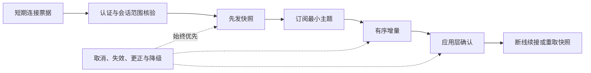
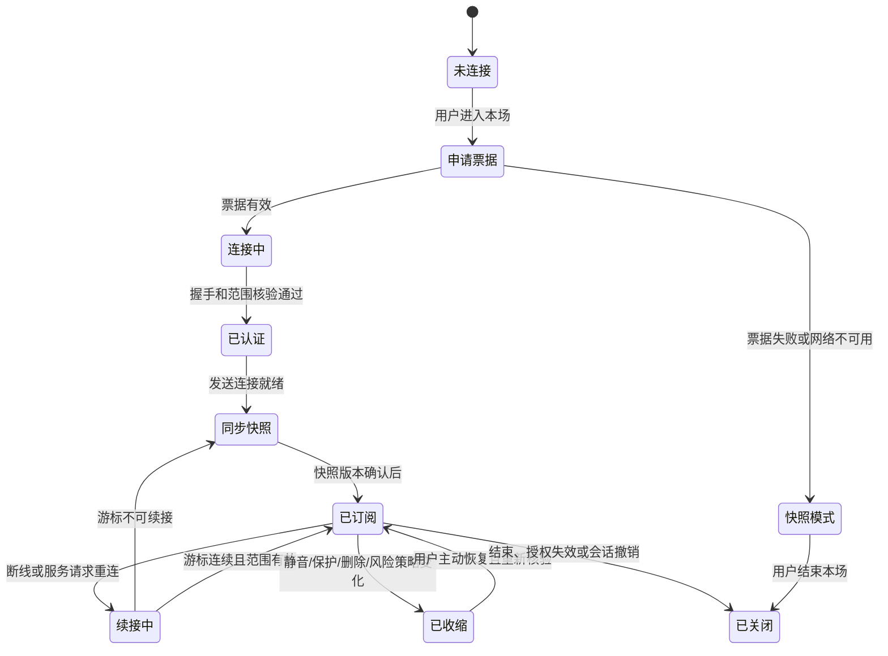
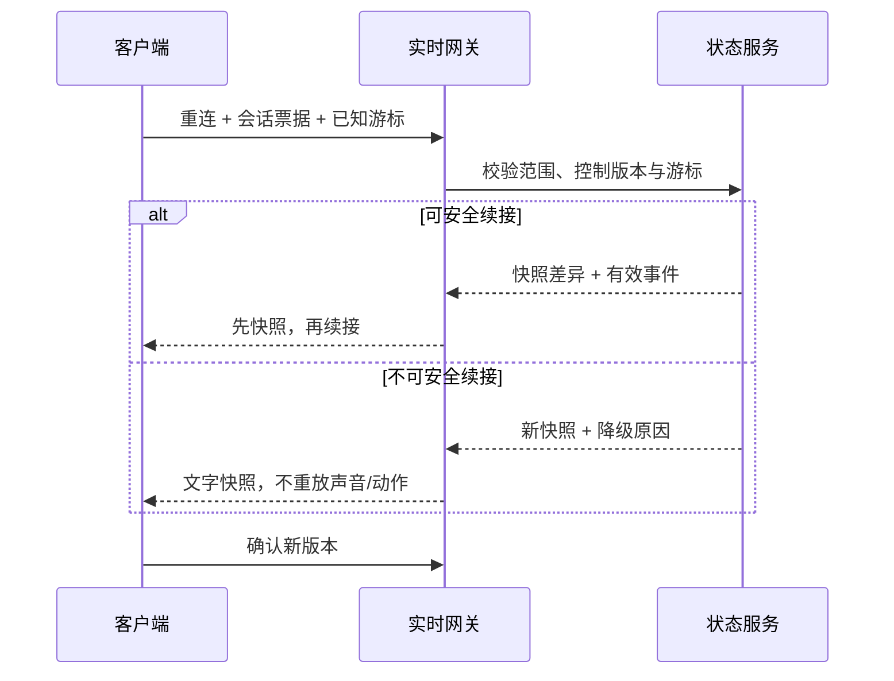
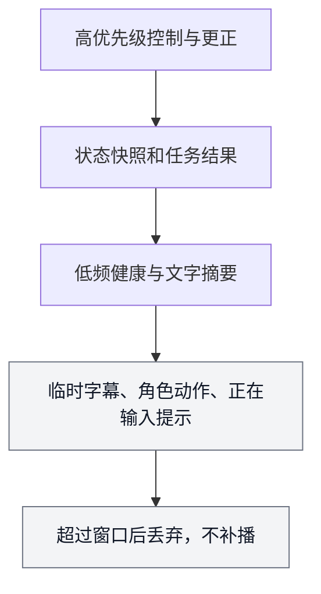

# WebSocket 同步、重连与可靠投递

> 文档性质：0→1 工程执行方案。本文定义观赛服务如何通过实时连接同步当前会话的最小状态，同时在断线、重复、乱序、更正、取消和权限变化中保持用户控制、事实可信与会话隔离。
>
> 核心判断：持久连接只是一种传输方式，不是事实权威，也不是保证用户会看到一切的承诺。可靠体验来自“快照优先、版本清楚、可取消、可续接、越界即收缩”。

> 方案形成时间：2026-01-28。

## 1. 施工目标、前序决策与边界

### 1.1 要解决的问题

比赛状态、语音回合、角色表达、本场静音、防剧透、更正和结束会在不同时间抵达客户端。网络可能暂时中断，浏览器标签可能冻结，移动端可能进入后台，连接可能被代理关闭，用户也可能在一条旧消息抵达前已经切换严格保护或结束本场。若只追求“连上了就推”，就会出现重复庆祝、旧比分回退、结束后继续说话、其它会话消息串入或删除后内容再次出现。

实时链路的首轮目标是让每位用户在自己有效会话内获得可解释的最新最小状态：



它要提供四项结果：

1. 客户端总能知道自己看到的是哪一版本场快照，以及是否正在同步；
2. 一条业务消息即使重复抵达、延迟抵达或重连重放，也最多产生一次用户可见副作用；
3. 用户结束、静音、切换严格保护、删除或权限失效时，旧动作不再交付；
4. 一个会话只能订阅自己被授权的主题，不能借由场次编号、游标、重试或错误信息窥见其它用户资料。

### 1.2 本文继承的前序决策

| 前序决策 | 实时链路必须遵守的约束 |
| --- | --- |
| 比赛事实按确认、冲突、更正与撤回管理 | 实时消息不以先到顺序替代事实版本或比赛时间 |
| 防剧透、静音、结束和删除优先 | 这些控制变化必须取消所有不合格的排队交付 |
| 用户观察、关系偏好和语音回合属于会话范围 | 不允许跨会话主题、通配订阅或含糊恢复 |
| 角色表达可过期、可取消 | 实时通道不保证补播旧表达，恢复先拿事实与控制 |
| 文字与最小状态是完整产品 | 实时失败时保留快照、控制和文字，而不是空白等待 |
| 身份可匿名、共享设备要保守 | 连接恢复不得仅凭同设备推断为同一用户或恢复历史资料 |

### 1.3 非目标

首轮不建设通用聊天房间、跨用户广播、全量赛事公共流、离线消息盒子、后台静默推送、视频转播、端到端业务排序、永久连接身份、在连接层存放关系记忆，或用网络质量、设备指纹和重连频率推断用户状态。实时通道不承担赛事资料确认、角色安全判断、删除决策或用户授权本身，只消费这些上游已决定的最小结果。

### 1.4 明确假设

**编号：H1**
- **假设**：客户端能在多数场景下维持或恢复持久连接
- **失效后果**：高频断线造成延迟与重复
- **保守措施**：将快照读取和文字路径作为同等能力

**编号：H2**
- **假设**：每个主题内单调序号足以发现缺口
- **失效后果**：乱序仍可能被误合并
- **保守措施**：跳号立即重取快照，不猜测缺失内容

**编号：H3**
- **假设**：短期一次性票据可降低长凭据暴露面
- **失效后果**：票据被重放或意外记录
- **保守措施**：短过期、单次使用、会话范围绑定与最小日志

**编号：H4**
- **假设**：应用层确认能将传输到达与用户副作用分离
- **失效后果**：客户端崩溃或重复确认
- **保守措施**：消息标识、幂等键与快照恢复共同处理

**编号：H5**
- **假设**：恢复时先获取快照比重放所有历史更符合观赛场景
- **失效后果**：用户错过表达后感到断裂
- **保守措施**：解释只恢复当前状态，过期表达默认静默

**编号：H6**
- **假设**：把观察指标限制为元数据可以支持排障
- **失效后果**：为追踪而收集过多内容
- **保守措施**：不记录正文、音频、关系文本和长凭据

### 1.5 完成定义

完成的标志不是长连接持续时间很长，而是可以连续证明：未授权连接无法拿到任何主题；连接先获得会话范围内的快照；重复消息不重复呈现；跳号、重连和更正收敛到当前快照；结束、静音、严格保护、删除和风险收缩能阻断迟到动作；恢复时不重开麦、不补播旧角色内容、不恢复其它人的资料；实时不可用时用户仍可看最后确认状态、改用文字、调整控制和结束本场。

## 2. 连接、认证与会话范围

### 2.1 连接不是身份本身

WebSocket RFC 6455 定义了浏览器常用的持久双向连接基础，但它没有自动解决业务身份、授权范围、消息顺序或撤回。本方案把连接身份拆为“短期连接票据”“当前会话范围”“每个主题授权”和“持续有效性检查”四层。任一层失效，连接进入收缩或关闭，而不是继续沿用旧授权。

**层：短期连接票据**
- **解决的问题**：这次握手是否来自已认证会话
- **最小字段**：票据标识、过期、一次性标记
- **失效行为**：拒绝握手

**层：会话范围**
- **解决的问题**：连接属于哪个本场会话
- **最小字段**：`watch_session_id`、主体范围、控制版本
- **失效行为**：停止会话主题

**层：主题授权**
- **解决的问题**：可以接收哪些最小消息
- **最小字段**：主题清单、场次、权限版本
- **失效行为**：拒绝订阅或取消主题

**层：持续核验**
- **解决的问题**：授权和控制是否仍有效
- **最小字段**：许可/删除/结束版本
- **失效行为**：发送失效并关闭或降级

长效用户凭据、个人资料、完整权限集合和敏感关系资料不得放进连接 URL、浏览器存储键名或实时消息正文。浏览器环境无法像普通 HTTP 一样任意附加自定义握手头时，使用受控的票据交换，而不是把长期会话密钥拼进查询参数。

### 2.2 短期票据流程

1. 客户端通过已认证的普通请求向 `POST /v1/realtime/tickets` 申请一张短期票据；
2. 服务核验当前会话、场次归属、删除/结束状态、允许主题和速率；
3. 返回一次性、短过期、绑定会话范围的票据与连接地址；
4. 客户端立即发起 `wss` 连接，并在受控协商字段中携带票据；
5. 服务消费票据后建立连接，返回 `connection_ready` 和允许的主题摘要；
6. 客户端仍需发送订阅请求，服务按主题再次核验，不能因为握手成功而自动赋予全部能力。

票据只能用于建立连接，不能作为调用普通资源、读取其它场次、恢复已结束会话或查询历史的通用凭据。票据过期、已使用、会话范围改变或风险冻结时，服务拒绝建立或立即关闭；客户端回到快照读取与文字路径，不在后台无限申请新票据。

### 2.3 票据合同

```json
{
  "ticket_id": "rt_01J9Q...",
  "watch_session_id": "ws_01J9Q...",
  "connection_url": "wss://realtime.example.invalid/v1/connect",
  "expires_at": "2026-01-28T20:15:30Z",
  "allowed_topics": [
    "watch_session.snapshot_changed",
    "watch_session.control_changed",
    "watch_session.correction",
    "voice_turn.capture_changed"
  ],
  "resume_policy": "snapshot_then_incremental"
}
```

票据响应不包含完整会话资料、原始观察、关系记忆或其它主题名称。票据本身不能被日志原样记录；观察系统只保留不可逆的票据摘要、过期类别和握手结果。若跨域部署，来源校验、TLS、Cookie 策略和反伪造策略必须一并审查，不能只因为使用了 `wss` 就假定安全。

### 2.4 连接状态机



`已收缩`不一定意味着断开。它表示某些主题或呈现动作不再被交付，例如用户开启严格保护后，连接仍可接收快照和控制变化，但不能获得会剧透的表达动作。`已关闭`后客户端不自动复连，除非用户主动进入新的有效会话。

## 3. 快照与事件：先知道现在，再接收变化

### 3.1 快照是恢复锚点

每个会话的可见事实、控制和健康状态由一个带版本的最小快照表达。客户端首次连接、发现消息缺口、权限变化、重连游标过期、后台恢复或收到更正时，优先读取快照。快照不会包含候选队列、其它用户观察、未授权记忆、上游账号或模型推断。

| 快照字段 | 作用 | 客户端规则 |
| --- | --- | --- |
| `snapshot_version` | 标识当前一致视图 | 只接受更高有效版本 |
| `fact_status` | 确认、等待、冲突、更正、不可用 | 决定事实文案与呈现上限 |
| `score` 与比赛时间 | 最小可见事实 | 未知必须显式为空，不补造结果 |
| `control_version` | 静音、保护、结束等用户控制版本 | 高于任何旧表达动作 |
| `delivery_policy` | 当前会话可接收的交付范围 | 过滤舞台、声音和提醒 |
| `health` | 实时/资料是否受限 | 显示降级与重试入口 |
| `resume_cursor` | 可从何处尝试续接 | 仅用作同主题恢复提示 |

快照获取失败时，客户端可以保留最后确认快照，但必须显示更新时间和“当前无法确认新状态”。不能以本地时钟推演比赛进度，不能用上次比分配合角色文案暗示正在实时更新。

### 3.2 事件分类

实时消息按可恢复性和用户影响分为三类。分类决定是否需要应用层确认、是否可以合并，以及错过时怎样处理。

**类别：状态关键**
- **示例**：快照变化、更正、控制变化、会话结束、删除屏障
- **是否需要确认**：需要
- **错过后的策略**：重取快照或明确重放

**类别：任务关键**
- **示例**：语音回合停止、用户动作结果、反馈状态
- **是否需要确认**：需要
- **错过后的策略**：查询当前任务状态

**类别：可丢弃呈现**
- **示例**：临时字幕、低强度舞台动作、正在输入提示
- **是否需要确认**：可合并或不确认
- **错过后的策略**：过期后静默，不补播

任何“可丢弃呈现”都不能承载事实结论、用户控制、删除确认、风险说明或唯一的退出路径。若一个动作在错过后会改变用户理解，它就应被设计为状态关键，而不是为了降低流量被伪装成瞬时动画。

### 3.3 统一消息信封

```json
{
  "message_id": "msg_01J9Q...",
  "topic": "watch_session.snapshot_changed",
  "watch_session_id": "ws_01J9Q...",
  "subscription_id": "sub_01J9Q...",
  "sequence": 109,
  "causation_id": "fact_01J9P...",
  "snapshot_version": 42,
  "control_version": 12,
  "issued_at": "2026-01-28T20:18:02Z",
  "expires_at": "2026-01-28T20:18:12Z",
  "payload": {}
}
```

`sequence` 只在同一 `subscription_id` 内递增，不用于比较不同主题、不同会话或不同场次。`snapshot_version` 解决事实投影的新旧，`control_version` 解决用户控制的新旧，`message_id` 解决消息去重，`causation_id` 用于关联同一上游变化，`expires_at` 阻止过期呈现。字段含义不可被客户端自行替换：例如更高到达序号不等于更高事实版本，更晚产生时间也不等于用户仍希望接收。

### 3.4 订阅和快照确认

推荐订阅握手为：客户端发出 `subscribe`（含会话标识、主题、最后快照版本和可选游标），服务先返回 `snapshot`，客户端核验并发送 `snapshot_ack`，之后服务才开始发送增量。这样客户端不会在没有基线的情况下消费一串难以解释的变化。

```json
{
  "type": "subscribe",
  "request_id": "0be79dbe-4a0c-41af-8cd8-2f37ab8da4dd",
  "watch_session_id": "ws_01J9Q...",
  "topic": "watch_session",
  "last_snapshot_version": 39,
  "resume_cursor": "cur_01J9..."
}
```

服务拒绝未在票据允许清单中的主题，也拒绝会话不匹配、已结束、删除阻断或权限变化后的续接。客户端收到拒绝时不尝试枚举其它主题或场次编号，而是退出到最小快照模式，并让用户主动开始新的有效会话。

## 4. 顺序、确认与幂等：传输到达不等于用户副作用

### 4.1 三种顺序

实时系统至少同时面对三种顺序：比赛或领域因果顺序、状态版本顺序、传输到达顺序。把它们合成一个“最新消息”是错误根源。

**顺序：领域顺序**
- **回答的问题**：比赛中先发生什么
- **例子**：第 80 分钟事件早于第 81 分钟事件
- **决定者**：事实治理与时间语义

**顺序：版本顺序**
- **回答的问题**：哪个控制或结论仍有效
- **例子**：结束版本高于旧表达版本
- **决定者**：状态版本与替代关系

**顺序：传输顺序**
- **回答的问题**：本连接已收到什么
- **例子**：网络重发使旧消息晚到
- **决定者**：序号、确认与续接

客户端不通过传输顺序决定比分，也不通过领域时间覆盖用户刚刚点击的结束。正确处理是：先检查会话范围，再检查控制版本，再检查事实/状态版本，再检查主题序号，最后才决定是否呈现、确认、丢弃或重取快照。

### 4.2 应用层确认

TCP 或 WebSocket 帧已送达，并不意味着客户端已把业务状态安全地应用。状态关键与任务关键消息在客户端完成以下步骤后才发送 `ack`：会话范围核验、版本比较、本地幂等检查、状态持久或可恢复更新、必要的取消动作执行。确认载荷最小化：订阅标识、最高连续序号、已处理消息标识摘要和客户端已见快照版本。

```json
{
  "type": "ack",
  "subscription_id": "sub_01J9Q...",
  "highest_contiguous_sequence": 109,
  "snapshot_version": 42,
  "control_version": 12
}
```

确认不是“用户已经阅读”或“用户同意内容”。它只表示客户端已安全处理一条业务状态。对可丢弃呈现，客户端可以不确认并允许其自然过期；服务不得因未确认而把过期欢呼、旧字幕或角色动作无限重发。

### 4.3 客户端去重与服务端幂等

客户端维护当前订阅范围内已处理 `message_id` 的短期集合，以及最高连续序号和快照版本。服务端维护用户写入操作的 `operation_id` 幂等记录。二者分工不同：前者防止重连或重发造成重复显示，后者防止用户重试产生两次静音、两次结束、两次保存或两条反馈。

**场景：同一消息重发**
- **客户端动作**：确认但不重复呈现
- **服务端动作**：可安全重发
- **用户结果**：不会重复庆祝或提示

**场景：同一写入请求重试**
- **客户端动作**：保持同一操作标识
- **服务端动作**：返回第一次逻辑结果
- **用户结果**：静音/结束只生效一次

**场景：旧版本晚到**
- **客户端动作**：丢弃或重取快照
- **服务端动作**：不生成倒退版本
- **用户结果**：页面不回到旧状态

**场景：同序号内容冲突**
- **客户端动作**：停止合并并上报协议异常
- **服务端动作**：关闭或重建订阅
- **用户结果**：不猜测哪条是真的

**场景：可丢弃动作过期**
- **客户端动作**：直接丢弃
- **服务端动作**：不补发
- **用户结果**：用户不被旧内容打断

幂等记录和消息去重缓存有明确生命周期。保留过短会在重放时产生副作用，保留过长会阻塞合法的新操作。生命周期按会话、对象和删除状态确定；会话结束或删除后不把去重集合转化为跨场次用户追踪资料。

### 4.4 缺口、乱序与冲突

收到 `sequence` 大于预期值时，客户端进入`gap_detected`：暂停对该订阅的增量合并、标记“正在同步当前状态”、请求快照或受控续接。收到小于等于最高连续序号的消息时，按 `message_id`、版本和过期时间决定确认或丢弃。收到同一版本互相矛盾的消息时，不展示其中任一条细节，直接进入快照恢复并记录协议异常摘要。

用户不应该看到“消息 107 丢失”。用户需要看到的是“信息正在同步，先保留最后确认状态”。协议诊断只写入最小观察记录，不含比赛正文、用户文本或关系内容。

## 5. 重连、续接与状态恢复



### 5.1 重连原则

1. 重连先恢复控制和事实，不恢复表演；
2. 不因网络恢复自动重开麦、不自动播放声音、不自动展开可能剧透的事件；
3. 续接只在票据、会话、主题、游标和控制版本都仍有效时使用；
4. 任何游标不确定、版本缺口、会话结束、删除或权限变化都回到快照；
5. 重连节奏受用户状态和网络错误约束，不能在用户已结束后持续后台尝试。

### 5.2 退避与重试

网络暂时中断时采用有上限、带随机抖动的退避，避免所有客户端同时冲击服务。连接失败时页面立即切到“实时更新暂不可用，仍可查看最后确认状态”的状态，保留用户主动重试、文字提问、切换保护、静音和结束。达到重试上限、系统明确拒绝或用户离开时停止自动尝试。

退避参数是运行假设，按网络与容量研究确定，不向用户承诺精确秒数。客户端不因重试而重复创建语音回合、重复提交控制、生成新连接票据或清空本地事实快照。若网络从弱恢复到正常，仍先走会话核验和快照同步。

### 5.3 续接协议

续接请求携带当前会话、目标主题、最后确认的连续序号、最后快照版本和一个新的有效票据。服务可能返回三种结果：`resume_ok`（可安全补发连续缺口）、`snapshot_required`（游标太旧、范围变化或消息已裁剪）或`session_closed`（会话不再有效）。

```json
{
  "type": "resume",
  "watch_session_id": "ws_01J9Q...",
  "subscription_id": "sub_01J9Q...",
  "last_sequence": 109,
  "last_snapshot_version": 42,
  "control_version": 12
}
```

`resume_ok` 只补发状态关键或任务关键缺口，仍经过客户端版本和去重检查。可丢弃呈现即使在缺口范围内也默认不补播。`snapshot_required` 时客户端丢弃本地未完成呈现队列，读取新快照并重新订阅；不尝试从旧序号推导用户错过了什么。

### 5.4 后台、前台与设备切换

应用进入后台、Web 标签隐藏、系统节能、设备切换或浏览器恢复时，连接可能被暂停。客户端恢复后先检查本场是否仍有效，再获取最新快照；语音回合强制为未开启，音频输出为静音或等待用户主动播放，舞台为静态/文字优先。任何本地“正在输入”“角色正在说”的状态都视为过期，除非得到当前会话的明确新状态。

设备切换不自动把旧会话变成可信恢复。只有服务端核验当前主体和会话范围后才发放新票据；即使核验通过，也只恢复被允许的最小控制和快照，不恢复别人的草稿、音频、关系资料或待送达表达。

## 6. 取消、撤回与交付门

### 6.1 为什么取消是一等消息

在陪看场景中，“不再说”“不要剧透”“本场结束”“这条记忆已删除”通常比“再送一条内容”更重要。取消不能只在用户界面上把组件隐藏，还必须穿透实时订阅、本地呈现队列、音频、舞台、生成任务和服务端重放逻辑。

取消消息携带对象范围、取消原因、控制或删除版本、生效时刻和关联动作标识。客户端收到取消后先停止或丢弃对象，再确认；即使被取消的旧动作稍后抵达，也因版本低于当前控制而被拒绝。

### 6.2 取消矩阵

**触发：用户静音**
- **必须取消**：声音输出、口型关联动作、音频队列
- **保留**：字幕、事实、文字控制
- **不得发生**：以舞台动效替代声音继续打扰

**触发：严格保护**
- **必须取消**：可能剧透的呈现、结果性声音/动作
- **保留**：状态说明、用户主动查看入口
- **不得发生**：通过欢呼、颜色或表情暗示结果

**触发：结束本场**
- **必须取消**：订阅、语音回合、呈现队列、自动重连
- **保留**：结束说明、返回入口
- **不得发生**：迟到内容重新唤起用户

**触发：删除记忆**
- **必须取消**：引用该对象的生成、缓存和召回
- **保留**：最小删除状态
- **不得发生**：旧昵称或记录重新出现

**触发：事实撤回/更正**
- **必须取消**：基于旧事实的未送达表达
- **保留**：最小更正、当前快照
- **不得发生**：先播放旧庆祝后再更正

**触发：风险收缩**
- **必须取消**：关系性主动表达、强沉浸输出
- **保留**：中性说明、现实选择、退出
- **不得发生**：用更热情语言安抚或挽留

### 6.3 交付前二次核验

所有会产生用户可见副作用的动作在“准备交付”和“真正呈现”两个点检查：会话仍有效、控制版本仍匹配、事实状态仍可引用、表达未过期、授权和删除状态没有变化。二次核验增加少量复杂度，却避免了队列里一条很早生成的动作在用户已经改变主意后才出现。

交付失败或取消后，不把原动作自动改成“更轻”的关系话术。若用户仍在会话内，最多显示必要的状态；如果用户已结束或不在前台，保持安静。可靠投递的目标是可靠交付正确且仍合格的状态，不是保证每一条内容都最终抵达。

## 7. 隔离、滥用防护与最小观测

### 7.1 主题隔离

主题命名和授权同时包含会话范围。建议只开放聚合主题，如`watch_session`、`voice_turn`、`relationship_control`，由服务按会话过滤 payload；不开放可由客户端自行拼接的`match:{id}:all_users`、`user:{id}:memory`等主题。场次是公共业务概念，不是读取同场所有用户实时状态的授权。

客户端只持有属于当前会话的 `subscription_id`。断线恢复、取消、确认和取消确认都需要匹配该订阅和会话。遇到不匹配消息，客户端不尝试显示、转发或“容错合并”，而是关闭订阅、清理局部状态并请求新的最小快照。

### 7.2 输入限制与协议防护

实时端点需要限制连接数量、订阅数、帧大小、消息频率、未确认窗口、票据申请频率和无效恢复次数。超限后优先保留快照读取、文字路径和结束控制，停止高频临时主题与非必要呈现。任何解析失败、非法枚举、过大帧、错会话确认或重复票据都不得反射原始 payload 给客户端或日志。

OWASP API Security Top 10 为对象级授权、资源消耗和敏感业务流提供公开风险参考。防护策略不应因为用户付费、关系状态或使用频率而放宽，也不应把风控决定伪装成角色的冷淡或情绪。

### 7.3 最小观测模型

实时系统需要可观测性来判断断线、延迟、积压、协议错误和取消是否真正生效，但观察不能变成内容收集。建议保留：连接结果、票据类别、主题类别、序号跨度、确认延迟区间、重连结果、快照恢复次数、取消生效率、错误类别、资源水位和版本不匹配计数。

不得默认记录：消息正文、完整比赛内容、原始音频、转写文本、用户观察、关系表达、精确设备指纹、长期凭据或完整 IP 组合。若排障确需更详细资料，应当有短期、受控、可审查的流程，并在问题结束后清理。

### 7.4 用户影响指标

**指标：快照恢复成功率**
- **定义**：断线后获得可解释最新快照的比例
- **用途**：恢复路径是否真实
- **反向风险**：不等于应补播所有表达

**指标：取消生效率**
- **定义**：控制变化后旧动作未再呈现的比例
- **用途**：用户控制是否优先
- **反向风险**：高消息量不能抵消失败

**指标：重复副作用率**
- **定义**：同一业务动作多次可见的比例
- **用途**：去重是否可靠
- **反向风险**：只看传输成功率会掩盖问题

**指标：跳号收敛率**
- **定义**：序号缺口后正确回到快照的比例
- **用途**：乱序处理是否安全
- **反向风险**：不应强行补齐旧呈现

**指标：范围拒绝率**
- **定义**：未授权订阅和错会话请求被拒绝的比例
- **用途**：隔离是否工作
- **反向风险**：不保存攻击正文

**指标：过期动作丢弃率**
- **定义**：超时或失效表达被静默的比例
- **用途**：注意力保护是否有效
- **反向风险**：不能当作“送达率低”被优化掉

## 8. 接口合同与错误语义

### 8.1 HTTP 资源

**方法与路径：`POST /v1/realtime/tickets`**
- **目的**：申请短期连接票据
- **必须条件**：有效会话、范围与速率
- **成功结果**：返回一次性票据和允许主题

**方法与路径：`GET /v1/watch-sessions/{id}/snapshot`**
- **目的**：获得恢复锚点
- **必须条件**：会话授权
- **成功结果**：返回最小快照和续接游标

**方法与路径：`POST /v1/watch-sessions/{id}/end`**
- **目的**：结束本场
- **必须条件**：操作标识与会话范围
- **成功结果**：提升控制版本并取消主题

**方法与路径：`POST /v1/watch-sessions/{id}/mute`**
- **目的**：静音
- **必须条件**：操作标识与当前版本
- **成功结果**：返回新控制版本

**方法与路径：`POST /v1/watch-sessions/{id}/spoiler-mode`**
- **目的**：更新保护策略
- **必须条件**：用户明确选择
- **成功结果**：过滤未来交付范围

**方法与路径：`GET /v1/realtime/health`**
- **目的**：获取公开可见健康摘要
- **必须条件**：不含其它会话资料
- **成功结果**：返回服务层级与文字降级建议

HTTP 语义遵循 RFC 9110 所描述的状态、条件和幂等原则。用户动作请求带操作标识；服务端返回当前控制版本；客户端遇到冲突时读取当前快照而不是盲目重试。票据申请本身也有速率和会话限制，防止它成为连接放大器。

### 8.2 实时协议控制消息

**类型：`connection_ready`**
- **方向**：服务→客户端
- **作用**：说明认证与允许范围
- **关键字段**：连接标识、会话、允许主题、服务时间

**类型：`subscribe`**
- **方向**：客户端→服务
- **作用**：请求一个会话范围主题
- **关键字段**：请求标识、主题、快照版本、游标

**类型：`snapshot`**
- **方向**：服务→客户端
- **作用**：给出恢复锚点
- **关键字段**：快照、版本、游标、交付策略

**类型：`snapshot_ack`**
- **方向**：客户端→服务
- **作用**：确认基线已处理
- **关键字段**：订阅、快照版本

**类型：`event`**
- **方向**：服务→客户端
- **作用**：发送有序增量
- **关键字段**：统一消息信封

**类型：`ack`**
- **方向**：客户端→服务
- **作用**：确认最高连续已处理序号
- **关键字段**：订阅、序号、版本

**类型：`resume`**
- **方向**：客户端→服务
- **作用**：请求安全续接
- **关键字段**：会话、旧订阅、游标、版本

**类型：`cancelled`**
- **方向**：服务→客户端
- **作用**：指示动作或主题停止
- **关键字段**：对象、原因、控制版本

**类型：`close_notice`**
- **方向**：服务→客户端
- **作用**：说明正常关闭或需重连
- **关键字段**：原因类别、是否可重试

客户端不自定义服务端主题、不发送“把我加入更多主题”的字段、不通过自报版本覆盖服务状态，也不将服务器错误对象直接展示给用户。协议演进采用版本字段和向后兼容窗口；无法识别的关键状态进入快照模式，无法识别的可丢弃呈现直接丢弃。

### 8.3 错误语义

**错误标识：`TICKET_EXPIRED`**
- **发生条件**：票据超时或已使用
- **用户语言**：“实时连接需要重新建立。”
- **客户端动作**：申请一次新票据或改用快照

**错误标识：`TOPIC_NOT_ALLOWED`**
- **发生条件**：订阅超出范围
- **用户语言**：“当前会话无法使用这项实时内容。”
- **客户端动作**：停止订阅，不尝试枚举

**错误标识：`RESUME_SNAPSHOT_REQUIRED`**
- **发生条件**：游标不可续接
- **用户语言**：“正在同步当前状态。”
- **客户端动作**：清理局部队列并取快照

**错误标识：`SESSION_ENDED`**
- **发生条件**：本场已结束
- **用户语言**：“本场已结束。”
- **客户端动作**：清理并停止重连

**错误标识：`CONTROL_VERSION_STALE`**
- **发生条件**：写入基于旧控制
- **用户语言**：“设置已更新到较新状态。”
- **客户端动作**：取快照，允许用户再选择

**错误标识：`DELIVERY_CANCELLED`**
- **发生条件**：动作被用户控制或更正取消
- **用户语言**：不必主动打扰
- **客户端动作**：丢弃本地动作

**错误标识：`RATE_LIMITED`**
- **发生条件**：连接或消息过快
- **用户语言**：“操作过于频繁，请稍后再试。”
- **客户端动作**：退避，保留文字与结束

**错误标识：`PROTOCOL_INVALID`**
- **发生条件**：帧或字段不符合合同
- **用户语言**：“实时更新暂不可用。”
- **客户端动作**：关闭订阅，进入快照模式

## 9. 精确 AI 协作提示词

### 9.1 提示词一：建立连接与票据边界

```text
你正在为足球陪看服务建立 WebSocket 实时连接。目标是按会话范围同步最小状态，不是建设通用消息总线。

范围：短期一次性连接票据、握手、会话范围、主题授权、快照订阅和关闭。硬约束：不把长效凭据放进 URL 或实时正文；票据短过期、单次使用、绑定 watch_session；握手成功不自动授予所有主题；任何会话结束、删除、权限变化或风险冻结都能使连接收缩或关闭；未授权主题不能通过枚举获得信息。

请依次输出：票据合同、连接状态机、主题授权表、日志最小化、错误语义、运行命令、十二个越权和重连情境、回退路径。禁止使用同设备或连接时长推断用户身份，禁止让实时通道读取完整关系或音频资料。
```

### 9.2 提示词二：建立快照、顺序与续接

```text
请为观赛实时状态建立“快照优先、增量补充、跳号回退”的协议。

必须区分领域顺序、状态版本和传输序号；每条事件带 message_id、subscription_id、sequence、snapshot_version、control_version、expires_at；状态关键消息需在客户端安全应用后确认；可丢弃呈现可过期且不补播；跳号、冲突、游标过期、重连和后台恢复都先读取当前快照。

输出：消息信封、订阅/确认/续接时序、客户端去重、服务端幂等、取消交付门、十五个乱序和断线情境、目标命令与验收标准。不得依到达顺序决定比赛事实，不得让旧表达在结束、静音、严格保护或删除后抵达。
```

### 9.3 提示词三：审查实时改动是否损害用户权利

```text
请审查以下实时协议或客户端改动：[粘贴改动]。

检查：
1. 连接、票据、主题和续接是否严格绑定当前会话；
2. 是否先取得快照再处理增量，跳号是否能安全收敛；
3. 是否区分事实版本、控制版本和消息序号；
4. 静音、严格保护、结束、删除、更正和风险收缩是否取消迟到交付；
5. 重连是否会自动开麦、续播旧声音、补发过期表演或恢复他人资料；
6. 日志和错误是否只保留最少元数据；
7. 实时失败时文字、快照和退出是否仍完整可用。

输出“允许 / 需要修改 / 拒绝”，并给出最小修正、应运行的情境和无法证明的风险。连接成功率高不是允许依据。
```

## 10. 施工顺序、命令与验收

### 10.1 四个施工阶段

**阶段：P1 认证与范围**
- **目标**：建立票据、握手、主题授权和关闭
- **交付物**：票据合同、连接状态机、错误映射
- **放行条件**：未授权连接无法订阅任何内容

**阶段：P2 快照与版本**
- **目标**：建立快照、序号、确认和去重
- **交付物**：消息信封、客户端状态、确认机制
- **放行条件**：重复与旧版本不产生副作用

**阶段：P3 续接与取消**
- **目标**：建立退避、游标、重取快照和交付门
- **交付物**：续接协议、取消矩阵、恢复文案
- **放行条件**：断线不续播，控制能阻断迟到动作

**阶段：P4 观测与降级**
- **目标**：建立最小指标、限流、异常与文字路径
- **交付物**：健康摘要、运行账本、验收材料
- **放行条件**：异常时可解释地收缩到快照

每阶段结束留下最小变更记录：用户风险、合同版本、已运行情境、观察字段、已知限制、清理策略和回退方法。记录用“结束后阻断旧交付”“跳号后重取快照”“票据拒绝不泄露主题”这类用户结果命名，不用“实时优化完成”一类宽泛结论。

### 10.2 目标运行命令

以下命令描述目录骨架完成后的统一入口，不表示任意机器已经具备完整服务或凭据。

```powershell
docker compose up -d postgres redis
go -C services/realtime run ./cmd/gateway
go -C services/realtime run ./cmd/dispatcher
go -C services/realtime run ./cmd/scenario --case resume-requires-snapshot
pnpm -C apps/web run realtime:verify
```

预期现象：网关只接受有效短期票据；派发器按订阅范围发送信封；情境运行器证明游标过期时不补播旧动作而是返回快照要求；客户端验证入口能显示实时不可用时的快照与文字路径。

可以用以下步骤检查票据、快照与结束控制：

```powershell
$headers = @{ Authorization = "Bearer <session-token>"; "Idempotency-Key" = "<operation-id>" }
Invoke-RestMethod -Method Post -Uri "http://localhost:8080/v1/realtime/tickets" -Headers $headers -ContentType "application/json" -Body '{"watch_session_id":"ws_demo"}'
Invoke-RestMethod -Method Get -Uri "http://localhost:8080/v1/watch-sessions/ws_demo/snapshot" -Headers $headers
Invoke-RestMethod -Method Post -Uri "http://localhost:8080/v1/watch-sessions/ws_demo/end" -Headers $headers -ContentType "application/json" -Body '{"operation_id":"<operation-id>"}'
```

预期结果：票据仅返回允许主题；快照带版本和交付策略；结束后旧订阅被关闭且重连请求收到会话已结束，而不是得到旧消息重放。重复结束返回同一逻辑结果。

### 10.3 验收情境矩阵

**编号：V1**
- **初始条件**：无票据
- **操作**：直接建立连接
- **必须结果**：拒绝握手，不暴露主题信息

**编号：V2**
- **初始条件**：有效票据
- **操作**：订阅未授权主题
- **必须结果**：拒绝订阅，连接不扩大范围

**编号：V3**
- **初始条件**：初次进入本场
- **操作**：建立订阅
- **必须结果**：先收到会话快照，再接收增量

**编号：V4**
- **初始条件**：同一消息重复抵达
- **操作**：重放 `message_id`
- **必须结果**：只应用一次并安全确认

**编号：V5**
- **初始条件**：增量发生跳号
- **操作**：收到大于预期序号
- **必须结果**：停止合并并重取快照

**编号：V6**
- **初始条件**：旧事实版本晚到
- **操作**：收到较低版本事件
- **必须结果**：不回退比分或时间线

**编号：V7**
- **初始条件**：旧控制版本写入
- **操作**：用户切换保护后重试旧请求
- **必须结果**：返回当前控制并不覆盖新选择

**编号：V8**
- **初始条件**：断线后游标过期
- **操作**：发起续接
- **必须结果**：返回快照要求，不补播旧表现

**编号：V9**
- **初始条件**：标签页后台后恢复
- **操作**：重新连接
- **必须结果**：语音关闭、声音不续播、快照优先

**编号：V10**
- **初始条件**：正在排队表达
- **操作**：用户静音或严格保护
- **必须结果**：取消不合格动作，不做结果暗示

**编号：V11**
- **初始条件**：会话结束
- **操作**：旧消息稍后抵达
- **必须结果**：客户端丢弃，服务停止重连

**编号：V12**
- **初始条件**：删除屏障启动
- **操作**：旧记忆引用动作抵达
- **必须结果**：拒绝并不在页面重现

**编号：V13**
- **初始条件**：多会话同场次
- **操作**：尝试用场次编号恢复
- **必须结果**：只允许所属会话的最小主题

**编号：V14**
- **初始条件**：服务限流
- **操作**：高频票据/订阅请求
- **必须结果**：保留快照与文字，停止重试风暴

**编号：V15**
- **初始条件**：实时通道不可用
- **操作**：进入比赛
- **必须结果**：看到最后确认状态、重试和结束

### 10.4 放行门槛与降级

放行实时主动表达前，必须同时满足：会话范围与主题授权无越权；快照、版本、确认与去重可在乱序下收敛；用户控制能取消迟到动作；恢复不带来旧声音、旧舞台、旧语音或旧记忆；观测不保存正文与敏感资料；连接异常有文字、快照和结束路径。

**级别：D0 受控实时**
- **条件**：票据、快照、续接、取消与隔离可解释
- **保留**：最小实时主题与可选呈现
- **停止**：无

**级别：D1 谨慎实时**
- **条件**：轻微丢包、延迟或确认变慢
- **保留**：快照、控制、低频状态
- **停止**：可丢弃呈现、主动声音

**级别：D2 快照模式**
- **条件**：跳号、游标不确定、订阅恢复失败
- **保留**：HTTP 快照、文字、结束
- **停止**：增量、舞台、语音、自动恢复

**级别：D3 实时暂停**
- **条件**：授权、删除、隔离或协议完整性异常
- **保留**：最小状态、退出、反馈
- **停止**：所有实时订阅与主动表达

若任一隔离、删除、取消或事实版本门槛失败，服务不应“保持连接以免用户流失”，而应进入 D2 或 D3。可靠投递的第一原则是不要可靠地投递错误、过期或越权内容。

## 11. 容量、兼容与事故处置

### 11.1 容量模型：连接数不是唯一压力

实时服务的压力来自连接、订阅、快照读取、未确认窗口、重连风暴、消息扇出和取消传播的组合。只监控在线连接数，会忽略最危险的情形：上游异常导致大量客户端同时重取快照，或用户切换保护后仍有旧动作在队列中等待派发。

**压力来源：新连接突增**
- **最早信号**：票据申请和握手失败上升
- **保护策略**：限制每会话并发连接，优先已有会话的快照
- **用户侧结果**：保留最后确认状态与文字入口

**压力来源：快照读取放大**
- **最早信号**：跳号/重连后读取量集中
- **保护策略**：快照缓存按版本复用，限制无效续接
- **用户侧结果**：显示“正在同步”，不伪造增量

**压力来源：未确认窗口增长**
- **最早信号**：高序号迟迟未确认、内存水位上升
- **保护策略**：暂停可丢弃呈现，要求快照收敛
- **用户侧结果**：舞台与声音先收缩

**压力来源：消息扇出异常**
- **最早信号**：单场次或单主题投递量突增
- **保护策略**：以会话范围过滤，合并低优先级状态
- **用户侧结果**：不开启跨用户广播

**压力来源：取消传播滞后**
- **最早信号**：已静音/结束后仍有排队动作
- **保护策略**：取消优先队列、交付前二次核验
- **用户侧结果**：停止不合格内容并记录异常

**压力来源：重连风暴**
- **最早信号**：同时重试与票据失败增多
- **保护策略**：随机退避、健康摘要、限制重试
- **用户侧结果**：用户可主动重试或保持快照

容量不足时禁止牺牲会话隔离、取消检查和快照版本核验来换取吞吐。可以降低舞台、字幕刷新频率和低优先级状态合并；不能把多个用户合并进一个不透明的公共主题，也不能跳过删除或结束检查让旧队列更快排空。

### 11.2 背压与派发优先级

派发器按用户影响而不是按消息产生时间排序。建议优先级为：结束/删除/安全冻结 → 静音与严格保护 → 更正和快照 → 语音停止与任务状态 → 低频健康说明 → 临时字幕、输入提示、舞台动作。相同优先级内再按会话和主题序号处理。

当某个会话或连接无法及时确认时，先合并或放弃低优先级项，再请求客户端重新获取快照。这样即使一台低性能设备或弱网络长期落后，也不会拖住删除、静音和事实更正。服务不得把“未确认较多”理解为用户更想保留内容，更不能因此延长消息保留或改为后台通知。



### 11.3 版本兼容纪律

连接协议、快照、主题、错误语义和呈现动作都需要显式版本。客户端在连接就绪时声明支持的协议范围；服务选择双方都支持的最小版本；无法兼容时返回明确的 `upgrade_required` 或 `snapshot_only`，而不是发送客户端可能误解的字段。

**变化类型：新增可选字段**
- **例子**：新健康说明或显示提示
- **兼容策略**：旧客户端忽略，默认安全值
- **用户影响检查**：忽略后不能导致剧透或失控

**变化类型：新主题**
- **例子**：新的低优先级状态
- **兼容策略**：必须单独授权与订阅
- **用户影响检查**：未支持时有快照替代

**变化类型：状态枚举新增**
- **例子**：新降级级别
- **兼容策略**：未识别时进入更保守显示
- **用户影响检查**：不把未知当正常

**变化类型：控制语义改变**
- **例子**：静音覆盖范围扩大
- **兼容策略**：新版本协商，旧版本保持收缩
- **用户影响检查**：用户旧设置不被悄悄放松

**变化类型：删除或权限字段改变**
- **例子**：新阻断版本
- **兼容策略**：双写/迁移期间先按更严格处理
- **用户影响检查**：不出现删除后回写

任何涉及事实、控制、删除或范围授权的非兼容变化，都应先停止相应主动呈现，直到客户端完成快照与新语义协商。协议兼容不能只看帧能否解析，还要看用户会不会因旧解释而失去控制。

### 11.4 事故处置顺序

实时事故包括大面积连接失败、越权订阅、快照与增量矛盾、取消未生效、删除后消息重现、重连补播旧内容和观察资料误入主题。处置顺序固定为：

1. 停止产生或派发疑似有害主题，优先关闭主动声音、舞台与关系性表达；
2. 维持或建立最小快照读取、文字和结束路径；
3. 冻结受影响会话的续接与旧队列，防止重连放大；
4. 以最小元数据确定影响范围、协议版本和取消/删除版本；
5. 对受影响用户给出具体状态说明、控制入口和必要的更正；
6. 修复范围、快照或取消链后，先在谨慎实时层恢复；
7. 用完整乱序、重连、隔离和删除情境重新验证，再考虑恢复主动表达。

不允许在事故中用“连接已恢复”作为结束条件。若用户已经看到错误内容，必须处理其可见后果；若无法准确判断影响范围，就保持更保守的文字与快照路径，而不是猜测未受影响并恢复高沉浸能力。

### 11.5 运行交接卡

每次场次或发布窗口的交接应包含最少的实时状态：当前协议版本、票据策略版本、快照可用性、主题健康、最高确认延迟区间、是否有游标裁剪、是否有取消传播异常、降级级别、已暂停主题、回退开关、下一位如何结束所有会话。交接卡不应包含用户正文、关系资料、原始音频或可恢复的长期凭据。

没有清楚交接时，服务默认保持 D1 或 D2：允许快照和用户主动文字，不扩大自动表达。运行人员不能凭感觉恢复舞台、语音或高频主题，必须有版本和情境证据表明控制、取消、范围与快照已重新一致。

## 12. 公开资料与访问记录

以下公开资料用于建立 WebSocket、HTTP、QUIC、实时传输、接口安全和未来传输替换的工作方法。它们不证明某个重试窗口、票据期限、确认批量、容量上限或用户体验阈值适合本服务；这些参数必须由本文情境验证和运行证据逐步决定。

> 信息卡：原宽表已改为纵向阅读，字段含义不变。

- **编号：R1**
  - **公开资料**：IETF, *RFC 6455: The WebSocket Protocol*
  - **用途**：浏览器持久双向连接的协议基础
  - **地址**：https://www.rfc-editor.org/rfc/rfc6455
  - **访问日**：2026-01-28

- **编号：R2**
  - **公开资料**：IETF, *RFC 8441: Bootstrapping WebSockets with HTTP/2*
  - **用途**：WebSocket 与 HTTP/2 协商的扩展参考
  - **地址**：https://www.rfc-editor.org/rfc/rfc8441
  - **访问日**：2026-01-28

- **编号：R3**
  - **公开资料**：IETF, *RFC 9110: HTTP Semantics*
  - **用途**：票据、快照与错误资源的 HTTP 语义参考
  - **地址**：https://www.rfc-editor.org/rfc/rfc9110
  - **访问日**：2026-01-28

- **编号：R4**
  - **公开资料**：IETF, *RFC 9000: QUIC*
  - **用途**：未来实时传输评估的基础参考
  - **地址**：https://www.rfc-editor.org/rfc/rfc9000
  - **访问日**：2026-01-28

- **编号：R5**
  - **公开资料**：W3C, *WebTransport*
  - **用途**：替换传输层时保持会话与版本合同的参考
  - **地址**：https://www.w3.org/TR/webtransport/
  - **访问日**：2026-01-28

- **编号：R6**
  - **公开资料**：OWASP, *API Security Top 10*
  - **用途**：对象授权、资源消耗和敏感业务流保护参考
  - **地址**：https://owasp.org/www-project-api-security/
  - **访问日**：2026-01-28

## 13. 结论

可靠实时体验不承诺每一帧都能抵达，而是保证用户不会因重复、乱序、重连或越权而失去对比赛和自身设置的理解。用短期票据限制连接，用快照锚定恢复，用版本和序号处理不同顺序，用应用层确认隔离传输与副作用，用取消门阻断迟到内容，再在异常时回到文字和最后确认状态，观赛服务才不会把网络偶然性变成用户体验风险。
