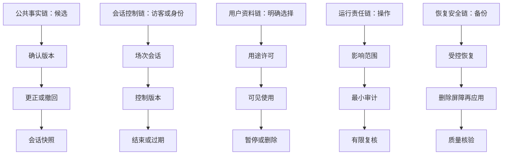
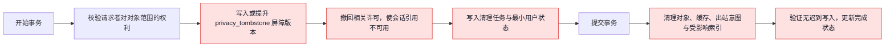
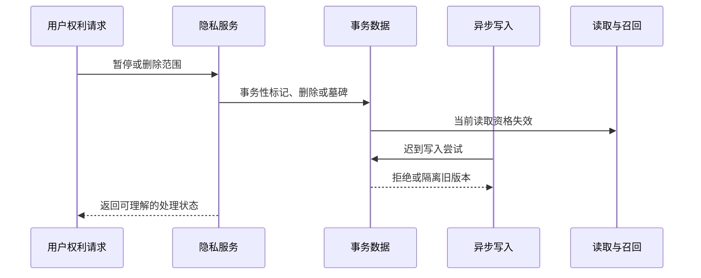
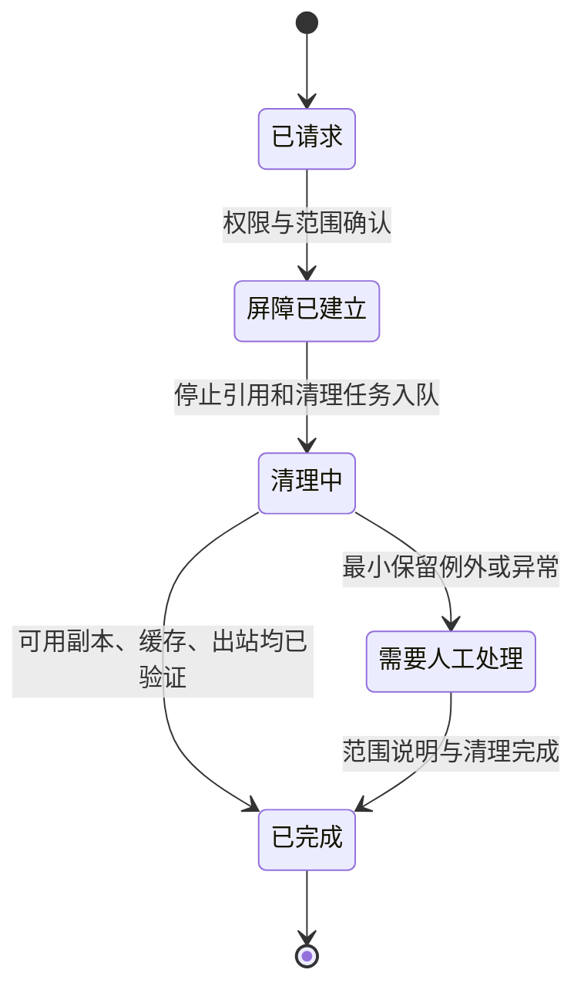

# PostgreSQL 持久化、迁移与数据生命周期

> 文档性质：0→1 工程执行方案。本文规定陪看服务怎样用 PostgreSQL 保存可解释的比赛事实、受控会话和用户主动选择的资料，同时让保留、删除、撤回、防回写、备份与恢复成为一条可验证的生命周期，而不是事后补上的清理脚本。
>
> 适用阶段：有限场次、有限数据类别的首轮试点。表、字段、索引阈值、备份频率、保留期限和容量基线均为待验证假设，需要结合适用要求、来源许可、用户研究与真实运行压力持续修订。
>
> 核心判断：数据库不是“尽可能多记住”的容器。它必须先证明一条记录为什么存在、何时失效、谁能使用、如何删除，以及删除后怎样阻止迟到工作和恢复流程把它重新带回可用状态。

> 方案形成时间：2026-01-28。

---

## 1. 施工目标、数据原则与完成定义

### 1.1 要解决的真实问题

足球陪看同时需要几类生命周期完全不同的信息：公共赛事事实必须可版本化、更正与回放；访客会话只需在本场短暂存在；用户偏好和共同记录只能在用户主动选择时跨场保留；声音转写、投诉、运行线索和运营操作都不应被混成一个无限期的“用户记忆”。如果这些对象在同一张泛化表、同一保留策略或同一访问路径中堆积，后来就无法可靠地完成防剧透、更正、删除、共享设备、权限隔离和用户退出。

本篇把持久化设计为五条互相独立、只能通过明确合同连接的链：



任何记录若无法归入其中一条链并说明用户或系统利益，就不应进入首轮模式。

### 1.2 不可突破的数据原则

1. **事实、观察、关系与控制分离。** 用户观察和角色文字绝不写成公共比赛事实；偏好不是亲密度；会话控制不是运营配置；
2. **用户主权优先。** 结束、安静、仅文字、资料暂停和删除的更晚有效状态覆盖陈旧写入、缓存和排队结果；
3. **最小化优先。** 本场完成任务不需要跨场资料；跨场连续性只保存用户明确选择且可管理的最少字段；
4. **版本优先。** 比赛事实、更正、控制和删除均使用单调版本或明确状态，不能靠接收时间猜最新；
5. **删除是停止链。** 删除要阻止新写入、停止旧引用、清理可用副本、通知必要处理方并提供完成状态；
6. **恢复不绕过删除。** 从备份恢复后，已删除/撤回资料不能重新变成可读取、可生成或可呈现的信息；
7. **可解释与可审计。** 高影响操作保留最小责任线索，但审计不能变成保存私人原始内容的借口；
8. **保守降级。** 无法证明完整性、版本、权限或删除边界时，停用连续性或回退文字/静态，而不是猜测继续。

### 1.3 首轮范围与非范围

本文覆盖 PostgreSQL 的逻辑模式、迁移纪律、事务、并发、索引、数据保留与删除、删除墓碑、防回写、备份恢复、数据质量、提示词、候选命令、变更提交、验收门槛和风险。

本文不承诺：无限期存储全部会话、保存原始背景音频、建立用户情绪画像、用备份替代删除、将数据用于未说明的商业触达、在数据库中直接保存完整模型上下文、让普通用户或运营人员直接修改公共事实，或以“技术需要”为理由绕过用户的本场和跨场控制。

### 1.4 完成定义

首轮完成不以“表能写入”判断，而以能否证明以下不变量判断：

1. 公共赛事事实、用户观察、会话控制、用户偏好、共同记录、运营操作和运行追踪有不同拥有者、用途和保留边界；
2. 关键表拥有主键、范围约束、时间语义、版本/状态与必要的外键或等效约束；
3. 同一次操作在重试、并发、断网和恢复时只产生一次有效副作用；
4. 更正/撤回能使旧事实、旧快照和待呈现内容停止引用；
5. 删除/暂停会创建可执行的撤回屏障，迟到写入、旧缓存和恢复数据均不能越过；
6. 备份和恢复经过演练，恢复后仍执行删除屏障、权限和质量核验；
7. 索引服务于明确查询路径，且不会为了便利查询暴露或无限保留用户资料；
8. 用户和运营侧的最小任务在数据库降级时仍能收缩到安全状态，而不是返回陈旧或越权内容。

---

## 2. 数据域与保留分层

### 2.1 六个持久化域

> 信息卡：原宽表已改为纵向阅读，字段含义不变。

- **数据域：比赛事实域**
  - **主要对象**：场次、候选、事件、事实修订、来源健康
  - **拥有者/责任**：事实治理流程
  - **默认生命周期**：依赛事/许可/更正要求
  - **不能混入**：用户观察、关系资料

- **数据域：身份与会话域**
  - **主要对象**：访客主体、稳定身份、会话、设备环境、控制版本
  - **拥有者/责任**：用户与访问控制流程
  - **默认生命周期**：本场短期或用户选择的身份范围
  - **不能混入**：球迷价值、亲密标签

- **数据域：用户资料域**
  - **主要对象**：偏好、共同记录、用途许可、提醒选择
  - **拥有者/责任**：用户本人
  - **默认生命周期**：用户主动保存且可暂停/删除
  - **不能混入**：原始会话全文、脆弱表达

- **数据域：陪看运行域**
  - **主要对象**：回合、呈现决定、幂等记录、有限出站消息
  - **拥有者/责任**：会话编排流程
  - **默认生命周期**：完成本场、纠错和短期复核所需
  - **不能混入**：长期用户画像

- **数据域：运营责任域**
  - **主要对象**：草稿、决定、暂停、更正、最小审计
  - **拥有者/责任**：受限运营角色
  - **默认生命周期**：处理、争议与复核所需
  - **不能混入**：私人对话、用户商业标签

- **数据域：隐私与恢复域**
  - **主要对象**：删除请求、墓碑、保留例外、备份清单、恢复记录
  - **拥有者/责任**：隐私/运行责任
  - **默认生命周期**：删除完成与适用最短保留
  - **不能混入**：用于角色连续性

数据库模式应让这些域在表、查询权限和迁移中可见，而不是只靠命名习惯。越清晰的边界，越不容易为了“少一次查询”将用户资料拼入事实或运营对象。

### 2.2 保留等级

保留期限不应预设为“越久越好”。首轮可先按风险和用户价值定义候选等级，具体日期需要随适用要求和试点证据调整。

**等级：R0 即时**
- **适用对象**：临时音频片段、未发送输入、渲染缓存
- **候选原则**：完成本次动作即丢弃
- **用户控制**：停止/取消立即清除

**等级：R1 本场**
- **适用对象**：会话控制、临时转写、回合状态
- **候选原则**：本场结束或短恢复窗后失效
- **用户控制**：结束本场、清空本场

**等级：R2 用户选择**
- **适用对象**：偏好、共同记录、预约
- **候选原则**：仅在用户主动保存/许可期间存在
- **用户控制**：查看、暂停、单项/全部删除

**等级：R3 事实治理**
- **适用对象**：事实修订、来源类别、更正关系
- **候选原则**：满足赛事解释、许可和争议处理的最少范围
- **用户控制**：不属于个人资料，但不含用户观察

**等级：R4 受限责任**
- **适用对象**：删除状态、最小审计、争议/安全记录
- **候选原则**：满足权利处理与最短适用责任
- **用户控制**：可请求范围说明、受限访问

**等级：R5 恢复材料**
- **适用对象**：加密备份、恢复日志
- **候选原则**：最短可行恢复窗口；删除屏障持续适用
- **用户控制**：恢复后不得复活已撤回资料

### 2.3 用户可理解的映射

技术表名不应成为用户理解保留范围的唯一方式。产品语言可以是“只在这场用”“下次也沿用”“你主动保存的观察”“用于处理你提交的问题”“为了安全恢复的最少记录”。每一类都需说明会不会跨场、能否暂停、何时删除、删除后会发生什么。不要把删除称为“角色失去记忆”，以免将普通资料权利变成用户的情感负担。

---

## 3. 关系模式与对象合同

### 3.1 设计规则

关系模式的目标不是把所有信息规范化到极限，而是让以下问题可以被数据库层回答：这是谁的资料？属于哪一场？是否已经确认？哪个版本有效？能否被当前会话引用？是否已撤回？谁做了高影响操作？如果一个字段无法回答任何此类问题，它应被移出首轮。

### 3.2 身份与会话表

**表：`principals`**
- **核心字段**：`principal_id`、主体类型、状态、创建时间
- **关键约束**：访客与稳定身份显式区分；不存球队/情绪画像
- **生命周期**：访问与资料管理需要时

**表：`sessions`**
- **核心字段**：`session_id`、主体、场次、开始/结束、共享状态
- **关键约束**：一会话只属于一个场次；结束状态不可逆
- **生命周期**：本场/R1

**表：`session_controls`**
- **核心字段**：会话、控制版本、安静/文字/低动态/严格保护
- **关键约束**：更高版本覆盖更低版本；结束后拒绝恢复
- **生命周期**：本场/R1

**表：`access_grants`**
- **核心字段**：主体、动作、对象范围、开始/失效/撤回
- **关键约束**：授权按动作和范围，不是永久总同意
- **生命周期**：许可期间

**表：`device_contexts`**
- **核心字段**：会话、共享显示、声音、可访问选择
- **关键约束**：只表达本场环境，不形成跨场设备画像
- **生命周期**：本场/R1

`principals` 中的稳定标识只服务于用户主动管理偏好、预约和删除；它不等于真实姓名，不应作为自动关系等级、赛后召回或运营排序的输入。访客主体在本场结束后不应自动升级为跨场可识别主体。

### 3.3 事实与来源表

**表：`matches`**
- **核心字段**：场次标识、参赛方、计划时间、状态
- **关键约束**：场次状态可限制后续发布
- **生命周期**：R3

**表：`source_observations`**
- **核心字段**：场次、来源类别、外部事件标识、到达时间、候选内容摘要
- **关键约束**：只存确认所需最少内容；不可当作用户事实
- **生命周期**：R3/短期

**表：`fact_revisions`**
- **核心字段**：场次、事实键、修订号、状态、比赛时间、替代关系
- **关键约束**：同一事实键的有效修订唯一；撤销显式关联
- **生命周期**：R3

**表：`fact_conflicts`**
- **核心字段**：场次、冲突簇、成员、状态、处理理由
- **关键约束**：冲突未解时禁止结论性投影
- **生命周期**：R3

**表：`fact_snapshots`**
- **核心字段**：场次、版本、生成时间、最小可见状态
- **关键约束**：只能由有效修订投影；旧版可追溯不可再引用
- **生命周期**：R3/缓存

**表：`source_health_windows`**
- **核心字段**：来源类别、时间窗、延迟/失败类别
- **关键约束**：使用聚合信号，不引入用户资料
- **生命周期**：R3/短期

事实表禁止存储用户“我看到了进球”的原文。用户观察可以在会话中推进自己的安全边沿，但不能通过 `source_observations` 或 `fact_revisions` 回写公共比分。

### 3.4 用户资料与许可表

**表：`preferences`**
- **核心字段**：主体、偏好键、值、来源、修订、暂停/删除状态
- **关键约束**：仅用户明确选择；不自动由行为推断
- **生命周期**：R2

**表：`memory_items`**
- **核心字段**：主体、用户主动保存内容、相关场次、可见范围
- **关键约束**：必须有显式保存动作；敏感类别默认拒绝
- **生命周期**：R2

**表：`consent_records`**
- **核心字段**：主体、用途、范围、版本、开始/失效/撤回
- **关键约束**：一项许可只覆盖明确用途
- **生命周期**：R2/R4

**表：`reminder_choices`**
- **核心字段**：主体、场次、提醒时间、状态
- **关键约束**：逐场管理；关闭后不可变相重发
- **生命周期**：R2

**表：`privacy_requests`**
- **核心字段**：主体、请求类型、范围、状态、完成说明
- **关键约束**：用于权利处理，不进入角色上下文
- **生命周期**：R4

**表：`privacy_tombstones`**
- **核心字段**：主体/对象、删除范围、屏障版本、状态、到期
- **关键约束**：阻止迟到写入和恢复复活
- **生命周期**：R4/R5

`memory_items` 不应成为会话全文归档。它只保存用户明确选择、与陪看任务直接相关且可单条管理的短内容。现实困境、脆弱表达、投诉、未回复、背景声音和系统推断不得通过“方便召回”进入此表。

### 3.5 陪看运行与运营责任表

**表：`interaction_decisions`**
- **核心字段**：会话、回合、控制/事实版本、决定类别、过期时间
- **关键约束**：旧版本不可恢复；不能存完整私人输入
- **生命周期**：R1/短期 R4

**表：`idempotency_records`**
- **核心字段**：调用方、操作键、结果摘要、到期时间
- **关键约束**：同一键只产生一个有效结果
- **生命周期**：短恢复窗

**表：`outbox_messages`**
- **核心字段**：下游事件、范围、版本、状态、时效
- **关键约束**：已取消/删除/过期对象不得继续发送
- **生命周期**：短期

**表：`operator_drafts`**
- **核心字段**：场次、候选、修订、状态、理由类别
- **关键约束**：草稿不等于已发布事实
- **生命周期**：R3/R4

**表：`operator_decisions`**
- **核心字段**：草稿/事实、动作、角色、理由、影响范围
- **关键约束**：职责分离和预期版本检查
- **生命周期**：R4

**表：`audit_entries`**
- **核心字段**：高影响动作、角色、范围、时间、结果
- **关键约束**：最小责任线索，不能收集私人内容
- **生命周期**：R4

### 3.6 关键约束示例

下列约束应尽量靠数据库原子能力和确定性服务规则共同保证，而不是依赖调用者“记得检查”：

| 约束 | 实现方向 |
| --- | --- |
| 一个会话只绑定一个场次 | 外键 + 不可修改/受限更新 |
| 已结束会话不能恢复自动呈现 | 会话状态与控制版本检查 + 拒绝写入 |
| 同一事实键只有一个当前有效版本 | 唯一条件索引或投影事务检查 |
| 草稿只能在合法状态流转 | 状态检查 + 预期修订版本 |
| 同一操作键只生效一次 | 唯一索引 + 已有结果返回 |
| 删除后的对象不能被写回 | 墓碑检查 + 写入事务内二次校验 |
| 用户资料不跨主体读取 | 所有查询带主体范围 + 权限层约束 |
| 用户观察不进入事实域 | 分表、权限和类型检查，拒绝跨域写入 |

---

## 4. 迁移纪律：模式变化必须可解释、可回退

### 4.1 迁移不是一次性建表

首轮会持续发现新的事实状态、控制需求和删除边界。迁移应被当成改变用户权利和系统不变量的正式动作：每一次迁移只解决一类可说明的变化，先兼容旧读写路径，再进行资料变换，最后在验证后收紧约束。不要为了快速上线直接在生产数据上进行不可逆的大范围重写。

### 4.2 迁移文件最小元数据

| 字段 | 说明 |
| --- | --- |
| 迁移标识 | 单调、不可复用的版本号与短名称 |
| 目的 | 新增何种对象/约束，以及用户或运行价值 |
| 数据影响 | 新表、字段、索引、默认值、资料转换范围 |
| 兼容策略 | 旧读写在过渡期如何继续工作 |
| 回退方式 | 出现异常时如何停止使用新能力或恢复旧读路径 |
| 删除影响 | 是否新增资料类别、保留规则、墓碑检查或清理工作 |
| 验证项 | 正常、并发、删除、恢复、性能和权限场景 |

### 4.3 四阶段迁移流程

```text
阶段 A：扩展
  新增可空字段/新表/新索引，不改变用户可见语义
阶段 B：双读写
  在明确时间窗内写入新旧结构，比较结果，不扩大资料用途
阶段 C：回填与核验
  分批、可停止地转换最少资料；逐批检查版本、删除和权限
阶段 D：收紧
  新读路径稳定后加约束、停止旧写入、按保留规则清理旧列
```

迁移从不以“方便回填”为由重新激活已删除资料。若历史记录缺少用户许可、范围或删除状态，应视为不能安全转换，而不是补一个默认允许值。

### 4.4 迁移中的资料最小化

| 迁移类型 | 允许做法 | 禁止做法 |
| --- | --- | --- |
| 新增偏好字段 | 从用户明确保存的同用途对象受控迁移 | 从会话行为、情绪或原始文本推断默认值 |
| 新增事实版本字段 | 从现有公共事实关系回填修订号 | 用用户观察或角色台词填补空缺 |
| 新增删除屏障 | 先建立墓碑与写入检查，再清理对象 | 先清理再补屏障，留下迟到写回窗口 |
| 新增索引 | 只索引明确查询和保留允许的字段 | 为未来营销方便建立长寿命组合索引 |
| 拆分表 | 按用途/拥有者迁移最小字段 | 复制完整会话到多个新表“以后再清理” |

### 4.5 迁移失败与停止条件

出现以下信号时，应停止迁移、保持旧能力或收缩功能：删除状态在新表缺失；新旧读结果不一致且会影响事实/控制；回填需要读取不应保留的私人内容；锁表/延迟影响用户结束和控制；备份无法证明可恢复到安全边界；权限范围在新模式中变宽。迁移失败的正确处理是回退或停在兼容阶段，不是跳过验证继续执行。

---

## 5. 事务、并发与一致性

### 5.1 事务边界按用户后果划分

事务不应追求把所有系统工作塞进一次长操作，而要保证会造成用户可见矛盾的对象一起成功或一起失败。长时间模型生成、外部来源读取、音频合成和网络发送不应占用数据库事务；它们应在获得版本明确的决定后通过可取消的出站记录进行。

| 事务 | 必须原子完成 | 不应放进同一事务 |
| --- | --- | --- |
| 创建用户会话 | 会话、初始控制版本、最小身份范围 | 长背景检索、声音准备 |
| 发布事实 | 草稿修订检查、事实版本、投影版本、出站意图 | 用户端实际播放、外部二次请求 |
| 更正/撤回 | 旧版本失效、新关系、相关出站取消意图 | 等待所有用户端确认 |
| 用户删除 | 请求状态、墓碑、停止引用标记、清理任务入队 | 直接执行所有长期清理 |
| 控制收紧 | 新控制版本、待呈现失效标记 | 生成已开始的外部调用 |
| 高影响运营暂停 | 暂停范围、版本、最小审计 | 人员填写长复盘说明 |

### 5.2 事实发布事务


提交前失败时，不写入半个事实版本，也不产生下游提示。提交后即使出站分发失败，事实账本与待处理出站意图仍然可复核、重试或取消，不会因为“消息没发出去”而让版本关系消失。

### 5.3 删除事务与防回写

删除请求的第一事务必须先建立撤回屏障，再开始异步清理。这样任何正在排队的转写、记忆抽取、偏好保存、缓存回填或恢复任务在尝试写入时都能看到屏障并拒绝复活对象。



墓碑不是简单软删除列。它是一个在新写入、更新、聚合、缓存填充、导入、恢复和出站前都必须查询的否定事实：该范围已经被撤回，任何旧工作不再拥有将其带回可用状态的资格。

### 5.4 乐观并发与行锁取舍

| 情境 | 首选机制 | 原因 |
| --- | --- | --- |
| 用户控制版本、偏好编辑、草稿修订 | 乐观版本检查 | 冲突可提示重新读取，避免长期占锁 |
| 高影响事实发布/撤回 | 有限行锁 + 预期版本 | 需要避免两个互斥结论同时生效 |
| 删除墓碑建立 | 原子写入/提升 + 唯一范围约束 | 必须先于异步清理和迟到写入生效 |
| 出站消息领取 | 跳过已占用的短锁/领取标记 | 多工作者并行但不重复发送 |
| 大范围保留清理 | 分批小事务 | 避免长锁影响本场控制和事实查询 |

事务隔离级别、重试次数和锁等待上限需要在真实负载中验证。无论选择何种具体级别，都不能以序列化失败为理由把同一高影响操作重新执行两次；重试必须携带原操作键和预期版本。

---

## 6. 索引、查询路径与容量边界

### 6.1 先定义查询，再建索引

索引会影响写入成本、恢复时间和资料可发现性。首轮只为明确的用户与运行任务建立索引，不为“未来也许能分析”提前建立可组合的个人画像入口。

| 查询任务 | 候选索引字段 | 边界 |
| --- | --- | --- |
| 读取本场有效事实快照 | `match_id + snapshot_version/status` | 不跨场扫描，不混入用户偏好 |
| 按事实键查当前修订 | `match_id + fact_key + revision` | 必须区分撤回/更正状态 |
| 读取当前会话控制 | `session_id + control_version` | 结束会话快速拒绝 |
| 查用户明确保存的单项偏好 | `principal_id + preference_key + status` | 不支持按“活跃用户”反向检索 |
| 查待清理对象 | 墓碑范围 + 清理状态 + 时间窗 | 只用于完成删除，不用于恢复引用 |
| 领取未过期出站意图 | 状态 + 时效 + 创建时间 | 已取消/撤回范围必须排除 |
| 复核高影响决定 | 场次 + 时间窗 + 动作类型 | 不按用户情绪或内容全文索引 |

### 6.2 条件索引与已失效对象

对于“当前有效”或“仍待处理”的查询，可使用条件索引降低读取成本，但条件必须与生命周期一致。已撤回、已删除、已过期或已完成的对象不能因为仍留在历史表中而继续出现在默认查询路径。对需要留存最小责任线索的历史对象，查询入口应受权限和用途限制，而不是通过普通列表轻易发现。

### 6.3 分区与归档的候选策略

当事实修订、运行追踪或审计窗口规模增长时，可以按时间或场次进行分区/归档，但分区不能成为绕过删除的理由。用户资料与删除墓碑的范围检查需要跨分区可靠执行；恢复某个旧分区前必须重新应用当下有效的墓碑；归档对象的访问权限不应比在线对象更宽。

### 6.4 容量与查询门槛

| 信号 | 可能含义 | 首选动作 |
| --- | --- | --- |
| 本场事实读取变慢 | 快照/索引/修订关系不足 | 优化投影和查询路径，避免增加缓存越权 |
| 删除队列积压 | 清理任务、墓碑检查或分批策略不足 | 优先加速清理和停止新写入 |
| 审计表增长过快 | 记录范围超过最小必要 | 收缩字段、保留窗和访问入口 |
| 备份窗口过长 | 数据量或策略过宽 | 分层备份/归档，先核验恢复与删除 |
| 事实修订膨胀 | 来源噪音或冲突处理不收敛 | 调整候选准入与合并规则，不删改历史 |

---

## 7. 保留、删除、墓碑与防回写



### 7.1 删除范围的表达

删除请求必须明确范围：删除某条共同记录、某项偏好、某场会话、某类语音转写、研究材料、提醒选择、稳定身份下的全部用户资料，或账户本身。范围越大，界面越需要说明会立即停止什么、将逐步清理什么、哪些最小责任记录可能按适用要求暂时保留，以及用户之后怎样知道结果。

### 7.2 删除状态机



任何对象在 `屏障已建立` 后都不得被角色、提醒、出站消息、缓存填充或未来迁移重新使用。即使物理清理尚未完成，用户可见的“停止使用”必须立即成立。

### 7.3 防回写检查点

写入路径至少在以下位置检查墓碑与撤回版本：

| 路径 | 必须检查什么 | 拒绝后的动作 |
| --- | --- | --- |
| 用户资料创建/更新 | 主体或对象范围是否有有效墓碑 | 返回已撤回/需重新选择，不写入 |
| 会话结束后的异步整理 | 会话/主体是否已结束或删除 | 丢弃，不形成偏好/共同记录 |
| 语音转写回传 | 本场语音许可与删除状态 | 只保留临时结果或直接丢弃 |
| 缓存回填 | 对象版本、删除屏障、控制状态 | 不填充可见缓存 |
| 导入与迁移回填 | 历史对象是否已撤回/缺许可 | 跳过并记录最小原因 |
| 备份恢复 | 当前墓碑集合与恢复范围 | 恢复后立即重放屏障清理 |
| 出站消息发送 | 关联对象是否已删除/撤回/结束 | 标记取消，绝不重送 |

### 7.4 物理清理与有限例外

物理清理可能受备份窗口、适用责任、争议处理或安全防滥用的最小记录影响。例外必须是具体、有限、可说明的：保留什么、为什么、谁能访问、最长到何时、不会用于什么。不能以“可能以后需要”作为无限期保留理由，更不能用例外记录继续驱动角色、提醒、研究或商业触达。

### 7.5 删除完成验证

删除完成不仅检查主表行是否消失，还应核验：相关许可已撤回；缓存和出站意图已失效；辅助索引不再返回对象；关联会话不再引用；迁移/导入队列不再接受旧对象；恢复流程会读取墓碑；用户端不会在下一场看到旧偏好或共同记录。发现任一反例时，应保持清理中或升级处理，不能向用户宣称已完成。

---

## 8. 备份、恢复与灾难演练

### 8.1 备份目标

备份的目的不是保存所有历史以防万一，而是在硬件、操作或运行故障后恢复服务的必要状态，同时维持事实版本、用户权利、删除屏障和最小权限。备份范围、频率、加密、访问、保留和销毁都要与数据域分层一致。

| 备份对象 | 恢复价值 | 特别约束 |
| --- | --- | --- |
| 事实修订与场次状态 | 重建可解释比赛快照 | 恢复后仍检查更正/撤回链 |
| 会话与控制 | 短窗口内安全恢复本场 | 过期/已结束会话不应被激活 |
| 用户资料与许可 | 恢复用户已选择内容 | 必须重放最新删除/撤回屏障 |
| 隐私墓碑 | 阻止恢复复活 | 与备份同等重要，不能遗漏 |
| 审计与运营决定 | 支持有限复核 | 受严格访问和最短保留限制 |
| 配置与迁移状态 | 保证模式一致 | 不包含多余用户内容 |

### 8.2 恢复流程


恢复环境应隔离、受限且仅用于恢复目的。不能在未完成删除屏障和权限检查前，将恢复库直接接入用户端或让角色读取其中的旧资料。

### 8.3 恢复演练场景

| 场景 | 必须证明 | 不通过时的动作 |
| --- | --- | --- |
| 恢复到删除请求之前的备份 | 当前墓碑阻止旧偏好和共同记录重新可见 | 停止恢复上线，补屏障重放 |
| 恢复到事实更正之前的备份 | 更正关系重新应用，旧事实不回到当前快照 | 只开放保守阅读，修复投影 |
| 恢复到会话结束之前的备份 | 结束会话不恢复音频/动作/提醒资格 | 禁止自动呈现，修复控制版本 |
| 备份媒体访问异常 | 资料不会被非授权角色读取 | 撤销访问、轮换密钥、审查范围 |
| 迁移版本不匹配 | 不以猜测方式启动应用 | 停在隔离环境，完成兼容与验证 |
| 出站队列恢复 | 已取消/过期消息不重新发送 | 清空或重建可发送集合 |

### 8.4 恢复点与恢复时长假设

恢复点目标和恢复时长目标应按用户后果而不是简单成本设置：用户控制、删除屏障和事实更正优先于非核心装饰性资料；首轮若无法在可解释窗口内恢复完整可信链，应降级为最后确认快照、文字和退出控制，而不是恢复不完整后继续自动陪看。

---

## 9. 数据质量、观察与异常处置

### 9.1 数据质量不是只查空值

陪看服务的数据质量还包括范围、版本、用途、删除和用户后果：一个字段即使非空，也可能来自错误会话、已撤回许可、待确认事实或过期恢复。质量规则应在写入、投影、查询、清理和恢复中分别存在。

| 质量维度 | 代表检查 | 失败后的安全动作 |
| --- | --- | --- |
| 完整性 | 场次、版本、来源类别、主体范围是否存在 | 拒绝发布/写入，保留草稿或等待 |
| 一致性 | 同一事实键是否出现多个有效修订 | 停止确定性投影，进入冲突 |
| 时效性 | 出站消息/会话/提醒是否过期 | 取消，不补播 |
| 用途限制 | 偏好/许可是否仍可用于当前任务 | 停止引用，要求用户重新选择 |
| 删除完整性 | 墓碑后是否仍有可见/可写对象 | 维持清理中，关闭相关连续性 |
| 权限正确性 | 查询是否只返回当前主体/场次/角色范围 | 拒绝访问，审查最小范围 |
| 可恢复性 | 备份恢复是否重放屏障与版本 | 保持隔离/保守运行 |

### 9.2 质量检查样例

```text
检查 A：结束会话不存在可发送的声音/动作出站意图。
检查 B：每个当前有效事实修订都有明确场次、修订号与状态。
检查 C：存在有效墓碑的主体/对象，不出现在偏好、记忆、提醒和上下文查询中。
检查 D：同一幂等键只有一个最终操作结果。
检查 E：更正后的旧事实不出现在当前快照或角色引用白名单中。
检查 F：恢复演练后的资料查询与删除完成清单一致。
```

### 9.3 运行观察指标

| 指标 | 用来发现什么 | 不应用来做什么 |
| --- | --- | --- |
| 删除清理滞后 | 是否存在尚未完成的生命周期工作 | 评价用户“删除太多” |
| 防回写拒绝数 | 迟到任务、缓存或恢复是否试图复活资料 | 作为限制用户功能的理由 |
| 事实版本冲突数 | 来源/流程是否需要收缩 | 用互动量掩盖错误 |
| 出站取消成功率 | 结束/撤回是否真正停止呈现 | 证明用户已满意 |
| 索引/查询延迟 | 控制和事实读取是否受影响 | 删掉必要边界检查换性能 |
| 恢复核验通过率 | 备份与删除屏障是否可信 | 替代真实用户理解研究 |

观察数据本身也遵守最小化：优先聚合计数、类别和时间窗，不保存能够重建私人对话或用户脆弱状态的长内容。

---

## 10. 精确 AI 提示词与施工任务契约

### 10.1 模式变更审查提示词

```text
你是陪看服务的数据模式审查助手。审查一项候选表、字段、索引或迁移是否符合事实分层、用户主权、资料最小化、删除防回写和恢复安全原则。

必须逐项回答：
1. 该对象属于哪个数据域，谁拥有它，用户或运营者为何需要它？
2. 它会在何时创建、可被谁查询、何时暂停/过期/删除？
3. 它是否会把用户观察、私人资料、角色关系或公共事实不当地混在一起？
4. 删除后，哪些写入、缓存、导入、出站和恢复路径必须检查撤回屏障？
5. 该索引服务哪个明确任务，是否扩大了个人资料的可发现性？
6. 迁移失败、并发冲突或恢复时，最保守的回退是什么？

若任何边界、保留、删除或权限答案缺失，输出 reject 或 needs_revision；不得假设“以后再补”。
```

### 10.2 删除编排提示词

```text
你是资料删除编排助手。输入包含用户请求范围、对象类别、当前墓碑、保留例外和待处理工作类别。

你的工作是生成最小删除计划，而不是估计用户价值或建议挽留。

规则：
- 先建立或提升撤回屏障，再列出清理任务；
- 停止未来引用、缓存填充、出站消息、迁移/导入回填和恢复复活；
- 仅列出完成当前删除所需的对象，不展开私人内容；
- 对确有最小保留例外，说明类别、期限和不可使用范围；
- 输出用户可见状态时使用中性语言，不将删除描述为角色失去关系。

输出：barrier_scope、immediate_stops、cleanup_batches、required_checks、limited_exceptions、user_status_text。
```

### 10.3 恢复核验提示词

```text
你是受控恢复核验助手。输入只包含恢复批次的版本清单、事实更正摘要、当前删除墓碑、会话结束状态和最小质量结果。

在允许恢复服务前，确认：
- 当前墓碑已应用，已删除/撤回资料没有进入可用查询；
- 已更正/已撤回事实没有变成当前快照；
- 已结束会话和静音控制没有恢复自动呈现资格；
- 出站消息按当前版本、时效和取消状态重新筛选；
- 权限和迁移版本匹配。

任何一项不能证明时，返回 keep_isolated 或 degraded_only，禁止建议恢复语音、角色动作或主动表达。
```

### 10.4 AI 协作施工提示词

```text
你正在为足球陪看服务完成 <数据工作单元>。

目标：实现 <明确对象/迁移/事务/清理/恢复行为>，不改变事实与用户观察分离、用户资料最小化、删除防回写、用户控制优先和恢复不复活的约束。

必须保持：
1. 每个写入具备明确数据域、范围、状态/版本和生命周期。
2. 重复、迟到或并发操作不会产生第二次有效副作用。
3. 删除先建立墓碑；写入、缓存、出站、迁移和恢复都会检查墓碑。
4. 失败时收缩到保守状态，不回填未获许可资料，不恢复旧自动呈现。

交付：模式合同、迁移步骤、事务边界、索引理由、正常/并发/删除/恢复/降级验证，以及最小回退方式。发现资料用途、保留或权限不清楚时，停止并列出缺口。
```

---

## 11. 候选命令、变更提交与验收

### 11.1 候选命令序列

以下命令假定使用 PostgreSQL、Go 服务与 Flutter 客户端作为候选工具链。实际工具可以替换，但必须保留等效的模式校验、迁移演练、并发验证、删除防回写、恢复演练和端到端核验。

```powershell
go fmt ./...
go vet ./...
go test ./... -run Migration
go test ./... -run Privacy
go test ./... -run Tombstone
go test ./... -run Restore
flutter analyze
flutter test
```

### 11.2 变更提交纪律

每项变更提交只处理一个可解释的数据行为，例如“删除墓碑阻止异步偏好写回”或“事实更正使旧出站意图失效”。提交记录至少包含：数据域、模式/迁移影响、事务边界、保留与删除影响、索引理由、验证剧本、回退动作与尚未验证的容量假设。不要把新增资料类别、扩大访问权限、重做事实投影和修改备份策略混在同一批变更中。

### 11.3 验收矩阵

**验收面：域隔离**
- **必须证明**：用户观察不能影响公共比分
- **代表情境**：用户说“进了”后其他快照不变化
- **不通过处理**：关闭跨域写入，复核合同

**验收面：版本正确**
- **必须证明**：更正后旧事实不再可引用
- **代表情境**：撤销事件后角色不再引用旧结论
- **不通过处理**：停止相关呈现，修复投影

**验收面：幂等收敛**
- **必须证明**：重试不产生两次发布/删除/出站
- **代表情境**：同一请求重复抵达
- **不通过处理**：修复唯一约束与结果返回

**验收面：删除屏障**
- **必须证明**：删除后迟到写入被拒绝
- **代表情境**：异步任务晚于删除完成
- **不通过处理**：保持清理中，补检查点

**验收面：查询边界**
- **必须证明**：主体/场次/角色范围正确
- **代表情境**：共享显示不返回私人资料
- **不通过处理**：收缩查询权限与索引

**验收面：迁移安全**
- **必须证明**：回填不复活已撤回对象
- **代表情境**：新表回填遇到墓碑
- **不通过处理**：跳过/停止迁移，补策略

**验收面：恢复安全**
- **必须证明**：备份恢复后仍不显示已删除资料
- **代表情境**：恢复旧备份
- **不通过处理**：隔离恢复，重新应用屏障

**验收面：降级可用**
- **必须证明**：数据异常时用户仍能结束/安静/看最后确认状态
- **代表情境**：事实读取受限
- **不通过处理**：进入保守文字模式

### 11.4 放行门槛

在扩大试点前，以下条件需同时满足：

1. 所有首轮数据类别均有用途、拥有者、保留等级、查询范围和删除/暂停路径；
2. 草稿、事实、更正、会话控制、用户许可和删除墓碑的状态转换均有可复现校验；
3. 删除先阻止新写入，且异步、缓存、导入、恢复和出站路径均通过防回写情境；
4. 备份恢复在隔离环境中演练，恢复后通过删除、更正、结束会话与权限质量检查；
5. 索引和归档不会向普通运营或用户界面暴露无关资料；
6. 迁移能停止、回退或停留兼容阶段，不需要以丢失用户控制为代价；
7. 数据异常时服务能收缩为最后确认状态、文字和退出，而非继续用陈旧资料生成陪看内容。

---

## 12. 风险与持续复核

**风险：资料混域**
- **典型失败**：用户观察/情绪进入事实或运营表
- **首先收缩什么**：跨域查询与写入
- **持续复核重点**：对象合同、权限、表关系

**风险：删除不完整**
- **典型失败**：旧偏好从缓存、任务或备份复活
- **首先收缩什么**：连续性/主动引用
- **持续复核重点**：墓碑覆盖与恢复演练

**风险：版本倒退**
- **典型失败**：更正后旧事实重回当前快照
- **首先收缩什么**：自动事实表达
- **持续复核重点**：修订关系、投影、出站取消

**风险：迁移扩大用途**
- **典型失败**：回填从未获许可的内容推导资料
- **首先收缩什么**：新字段与回填任务
- **持续复核重点**：资料来源、许可、回退

**风险：索引泄露**
- **典型失败**：查询便利导致可枚举个人资料
- **首先收缩什么**：运营/分析入口
- **持续复核重点**：字段最小化、访问范围

**风险：恢复绕过权利**
- **典型失败**：旧备份直接上线
- **首先收缩什么**：恢复与主动呈现
- **持续复核重点**：屏障重放、隔离与核验

**风险：运行压力**
- **典型失败**：长事务/清理积压影响控制
- **首先收缩什么**：非核心连续能力
- **持续复核重点**：锁、队列、保守降级

**风险：审计过度**
- **典型失败**：以责任为名保存私人全文
- **首先收缩什么**：审计字段和保留窗
- **持续复核重点**：最小记录、用途限制

若复核发现同类防回写、越权查询、版本倒退或恢复复活反复出现，首选动作是缩小数据类别、停止自动连续性、增加等待与缩短保留，而不是要求用户更频繁确认或用更多日志保留更多私人内容。

---

## 13. 公开研究参考

以下公开资料用于形成关系数据一致性、资料最小化、删除、恢复、数据库安全和运行治理的方法。它们不替代具体适用法律、赛事资料许可、保留义务或独立安全评估。

> 信息卡：原宽表已改为纵向阅读，字段含义不变。

- **编号：R1**
  - **来源**：PostgreSQL Global Development Group，*PostgreSQL Documentation*
  - **使用方式**：事务、并发、索引、备份与恢复的数据库参考
  - **URL**：https://www.postgresql.org/
  - **访问日期**：2026-01-28

- **编号：R2**
  - **来源**：PostgreSQL Global Development Group，*Transactional DDL*
  - **使用方式**：模式变更与迁移原子性的参考
  - **URL**：https://www.postgresql.org/
  - **访问日期**：2026-01-28

- **编号：R3**
  - **来源**：NIST，*Security and Privacy Controls for Information Systems and Organizations*
  - **使用方式**：最小权限、审计、保留与恢复控制参考
  - **URL**：https://csrc.nist.gov/pubs/sp/800/53/r5/upd1/final
  - **访问日期**：2026-01-28

- **编号：R4**
  - **来源**：NIST，*Guide for Cybersecurity Event Recovery*
  - **使用方式**：恢复准备、隔离、验证与持续改进参考
  - **URL**：https://csrc.nist.gov/pubs/sp/800/184/final
  - **访问日期**：2026-01-28

- **编号：R5**
  - **来源**：OWASP，*Application Security Verification Standard*
  - **使用方式**：资料处理、访问控制和安全验证参考
  - **URL**：https://owasp.org/www-project-application-security-verification-standard/
  - **访问日期**：2026-01-28

- **编号：R6**
  - **来源**：IETF，RFC 9110，*HTTP Semantics*
  - **使用方式**：重试、请求语义与幂等处理参考
  - **URL**：https://www.rfc-editor.org/rfc/rfc9110
  - **访问日期**：2026-01-28

- **编号：R7**
  - **来源**：European Data Protection Board，*Guidelines 05/2020 on Consent*
  - **使用方式**：明确同意、范围与撤回的公开方法参考
  - **URL**：https://www.edpb.europa.eu/our-work-tools/our-documents/guidelines/guidelines-052020-consent-under-regulation-2016679_en
  - **访问日期**：2026-01-28

- **编号：R8**
  - **来源**：国家互联网信息办公室，《个人信息保护法》
  - **使用方式**：个人信息处理、最小必要与用户权利的公开法规入口
  - **URL**：https://www.cac.gov.cn/2021-08/20/c_1631049984897667.htm
  - **访问日期**：2026-01-28

**引用维护规则。** 当新增数据类别、字段、索引、备份范围、迁移、合作处理或恢复流程时，应重新核验用户权利、资料最小化、访问控制、删除防回写和可恢复性。公开资料可以提供数据库与治理方法，不能代替对“删除后角色是否真的不再引用”“恢复后用户是否仍拥有控制”的直接场景证据。
