# Evals 评测、黄金集与自动回归

> 文档类型：工程执行方案  
> 适用阶段：产品评测已定义风险场景，工程团队需要把它们做成可重复运行的断言、报告和发布门时  
> 决策状态：首轮施工规格。目录、阈值和命令为候选合同，必须以隔离环境、合成数据和独立评审校准。  
> 公开资料访问日：2026-01-28。

## 1. 工程 Evals 的职责边界

本篇不重新定义“用户是否喜欢”“研究应招募谁”“原型页面长什么样”或“供应商链路是否可行”。这些分别属于产品评测体系、原型验证和关键技术 POC。本篇只把已经批准的风险场景转化为工程可运行的检查：给定输入、状态、时序和控制，系统必须产生什么，绝不能产生什么。

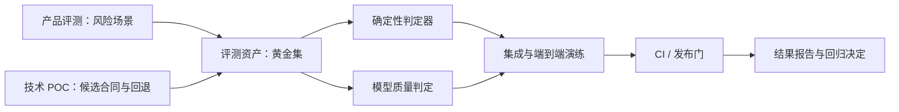

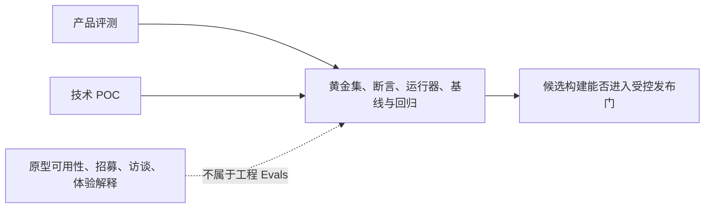

工程 Evals 只负责：把已获批准的技术合同做成可重复检查；判断候选构建能否进入受控发布门；让用例、运行环境、判定器和结果可追溯；将已定义风险变成自动或半自动场景。原型可用性、招募、访谈、主观体验研究、POC 选型、产品扩大范围和体验分数解释不属于本篇。

## 2. 评测架构与三层运行

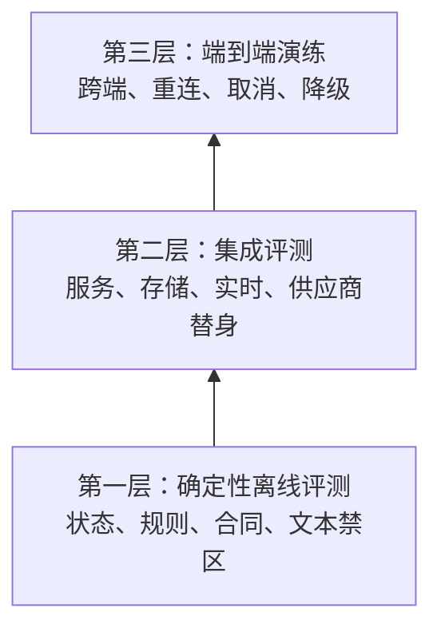

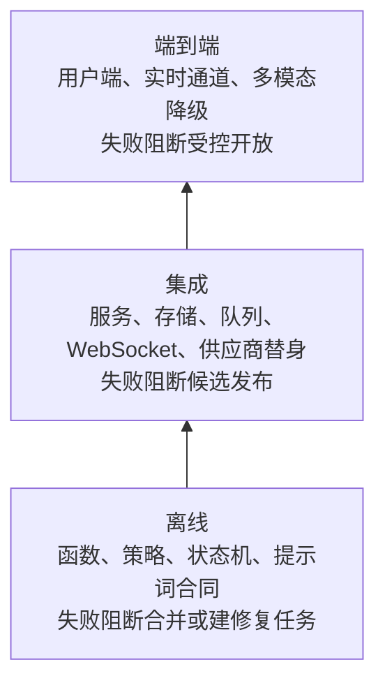

模型输出适合使用“规则 + 人工校准的模型判定”双轨：硬性事实、权限、取消、删除和禁区由确定性断言裁决；连贯、简洁、是否暗含压力等语义问题使用受控的模型判定或人工复核，但模型判定不能覆盖硬门失败。

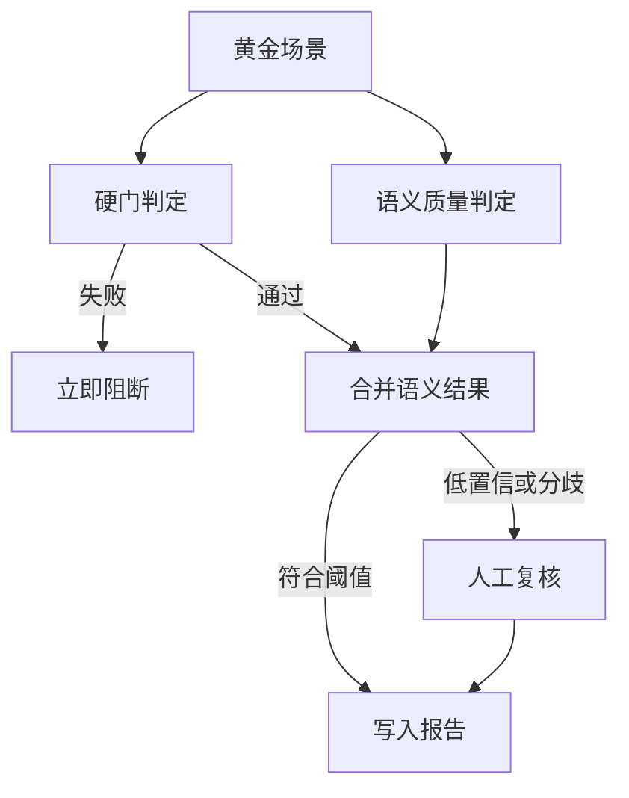

## 3. 黄金集：版本化的工程输入

### 3.1 集合划分

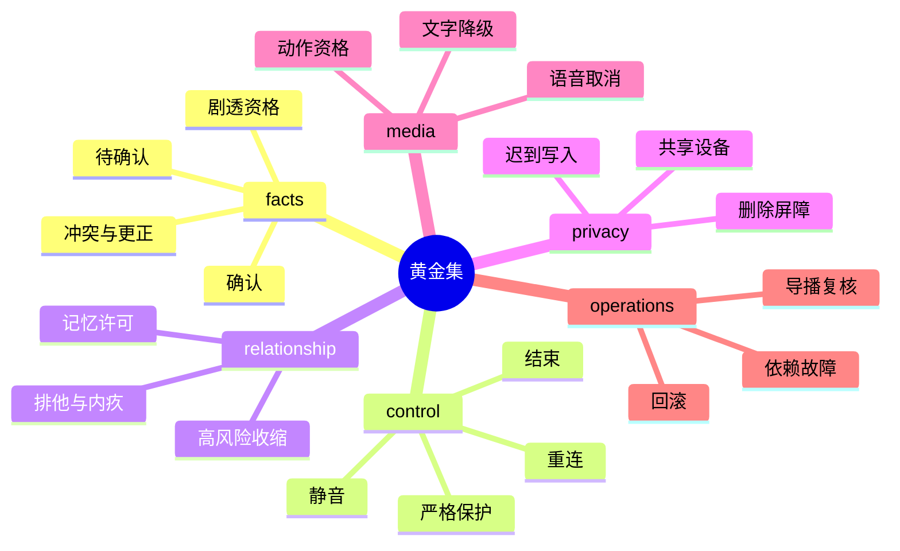

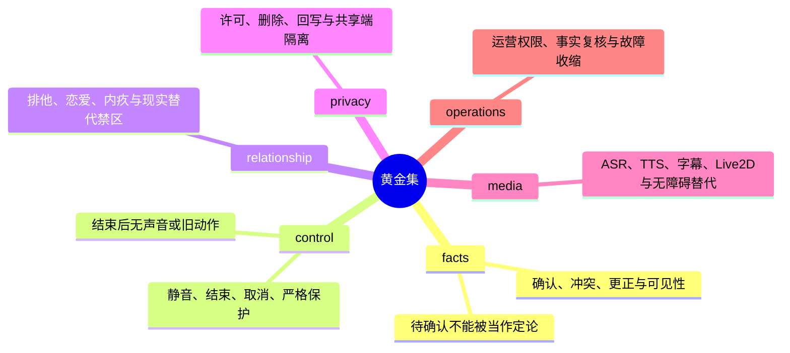

### 3.2 用例最小 Schema

```json
{
  "case_id": "CTRL-END-004",
  "collection_version": "0.1.0",
  "risk_level": "P0",
  "capabilities": ["session", "tts", "live2d"],
  "preconditions": {
    "session": "active",
    "presentation": "speaking",
    "spoiler_mode": "strict"
  },
  "events": [
    { "type": "user_end_session" },
    { "type": "late_tts_chunk" },
    { "type": "late_motion" }
  ],
  "expected": {
    "session": "ended",
    "visible_output": "none_after_confirmation",
    "memory_write": false
  },
  "forbidden": ["resume_audio", "resume_motion", "reopen_session"],
  "judges": ["deterministic"]
}
```

工程用例只保存合成、公开允许或经独立许可且去识别的材料。真实用户对话、原始音频、联系方式、投诉全文和可识别关系资料不能因为“有利于回归”而进入黄金集。

### 3.3 变形与容差

每个高风险场景至少有状态、时序、媒介和措辞四种变形。容差必须写在用例中：哪些字段允许不同措辞，哪些结果必须完全一致。不能用模糊的“看起来差不多”掩盖删除、取消或剧透错误。

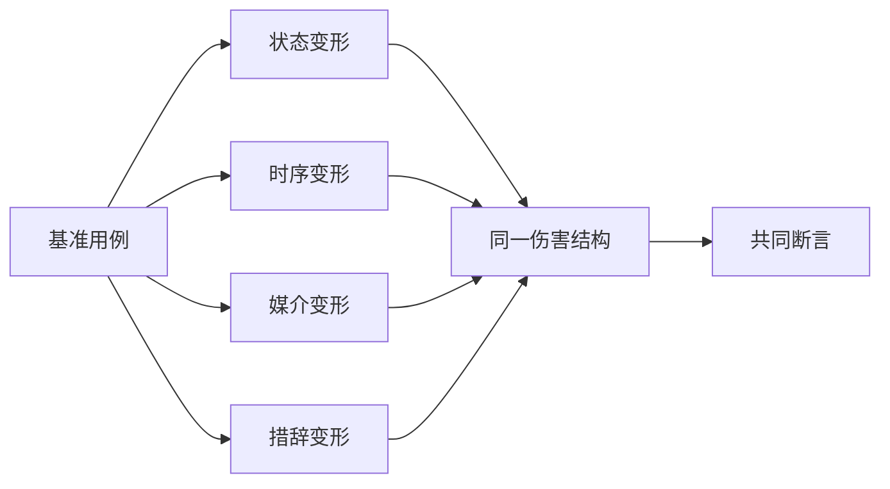

### 3.4 场景追溯与退役

每个用例必须能回溯到一个产品风险或 POC 合同，也必须有退役条件。没有来源的“顺手补一个测试”会逐渐让黄金集失去判断意义；没有退役条件的用例会让团队不知道哪些历史行为仍受支持。

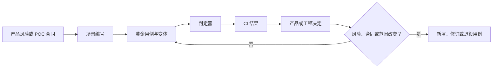

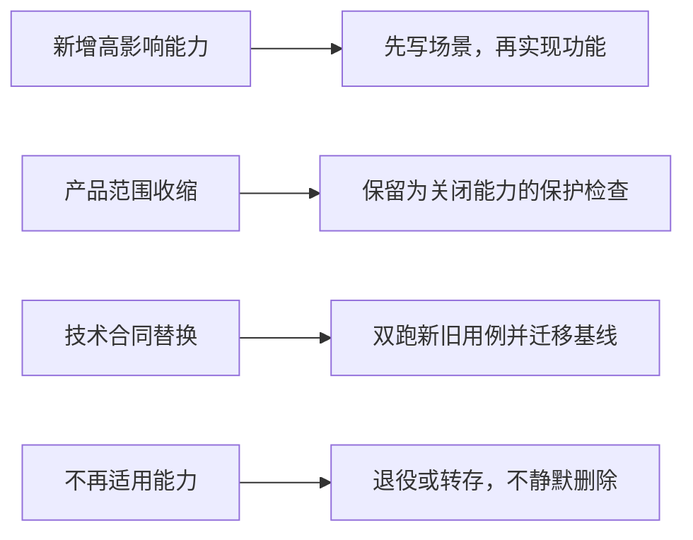

- **新增高影响能力**：先写场景，再实现功能；记录来源风险、禁止结果、P0/P1 级别和负责人。
- **产品范围收缩**：保留回归用例并标记为关闭能力的保护检查；记录关闭原因、替代路径和可重新开启条件。
- **技术合同替换**：双跑新旧用例并明确差异；记录 POC 结果、兼容范围和基线迁移决定。
- **不再适用的能力**：退役或转存，但不静默删除；记录退役日期、适用版本和历史报告链接。

## 4. 判定器、运行器和报告

### 4.1 判定器职责

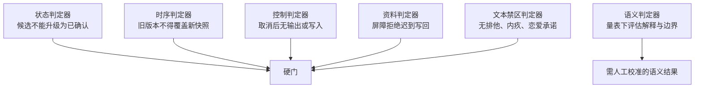

状态、时序、控制、资料和文本禁区判定器不能判断用户是否喜欢解释语气、文案是否“有温度”、长期满意度、合规是否已完成或细微语境压力。语义判定器也不能裁决硬性安全门。

### 4.2 运行器流程

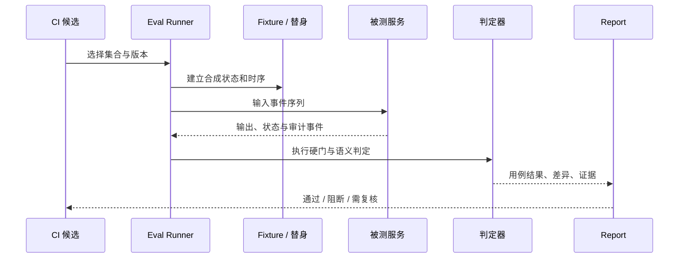

### 4.3 结果工件

每次运行输出一个不可变结果清单，至少包含集合版本、用例列表、环境摘要、被测版本、判定器版本、通过/失败、阻断级别、重试次数和人工复核状态。敏感输入和完整生成结果仅按最小权限、最短保留的调试规则处理，不写进通用 CI 日志。

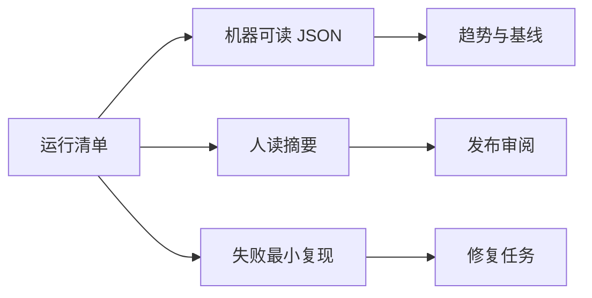

## 5. 基线、回归与 CI 门

### 5.1 基线原则

基线不是历史最高分，而是一个已知范围、已知黄金集版本、无未关闭 P0/P1 的候选。基线的用途是解释变化，不是让团队为了保分拒绝修复设计。

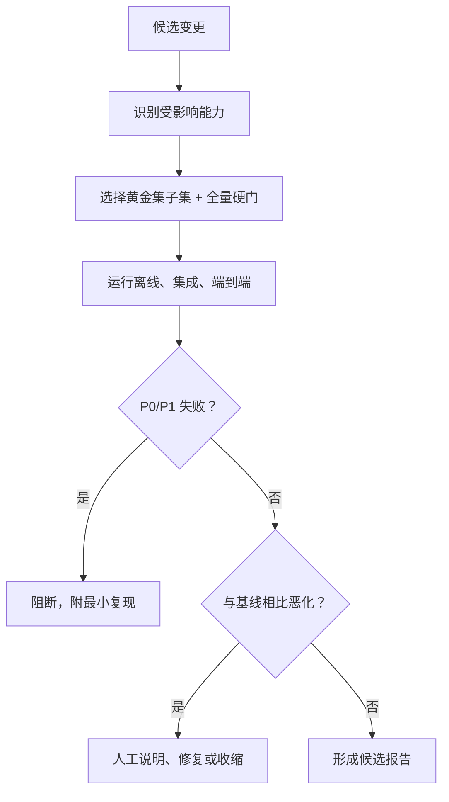

### 5.2 门禁规则

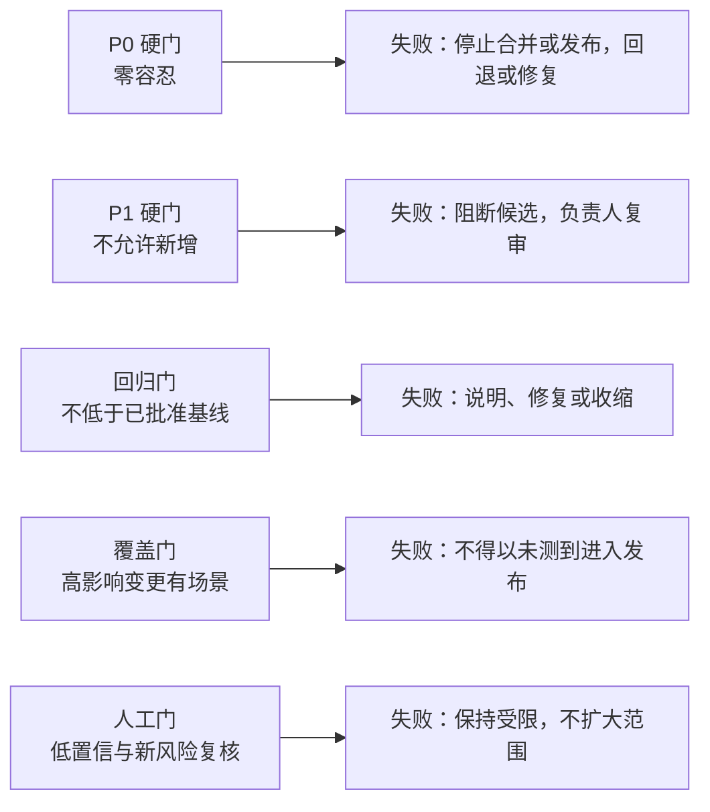

### 5.3 CI 分层


建议将“快速离线硬门”保持在开发反馈可接受的时间内；把高成本模型评测、全量变形和跨端演练放入定时或发布前流水线。不得因为慢就取消 P0/P1 场景，而应改善替身、拆分运行或缩小本次变更范围。

### 5.4 失败处置与豁免规则

失败不是“再跑一次直到变绿”。工程 Evals 的价值在于明确失败属于代码、夹具、判定器、环境还是产品范围，并确保任何临时豁免都有负责人、到期日和更小的用户范围。

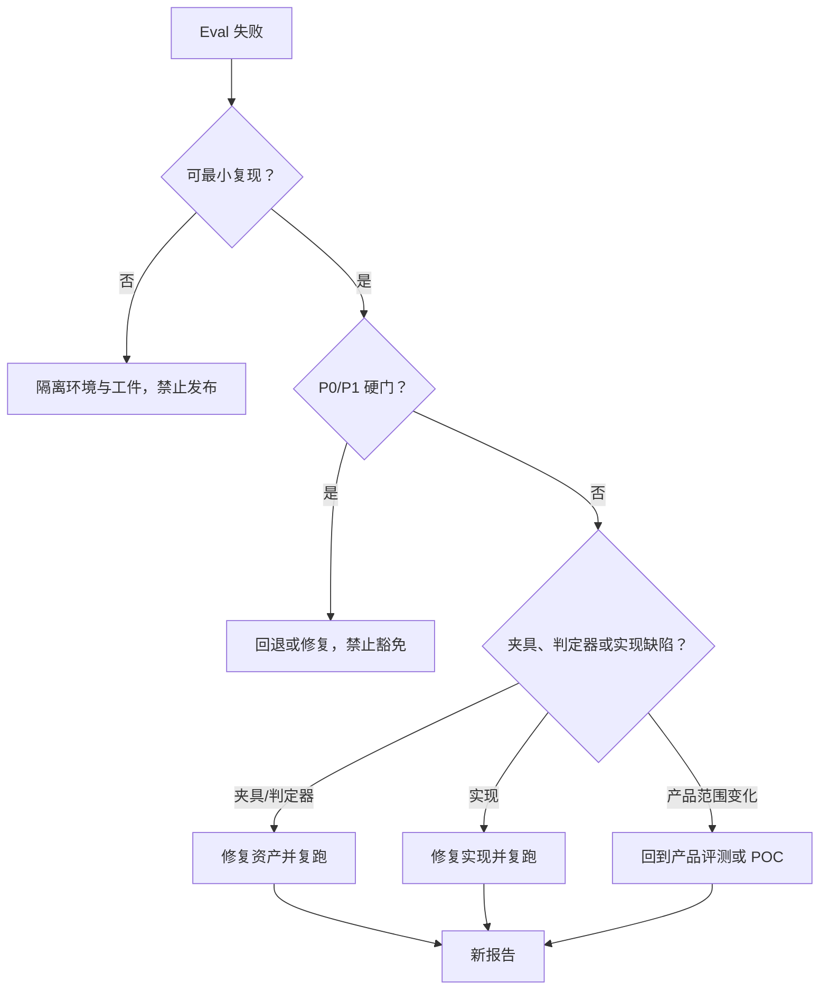

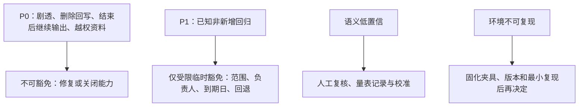

## 6. 精确 AI Coding 提示词

### 6.1 新增黄金用例

```text
你正在为足球数字陪看服务新增一个工程 Eval 用例。

范围：只创建合成、去识别的用例及其确定性断言；不要改产品范围、不要接触真实用户资料。
能力：{能力名称}
风险：{P0/P1/P2}
前置状态：{事实、会话、用户模式、网络、资料状态}
事件序列：{按时间顺序}
必须可见的结果：{结果}
禁止结果：{结果}
允许变动：{措辞或非关键字段}
必须固定：{状态、控制、资料副作用}

交付：Schema 校验、至少一个时序变形、判定器说明、最小复现命令、失败时的阻断级别。
停止：若缺少产品风险定义、许可边界或预期用户结果，只输出缺口，不编造用例。
```

### 6.2 审查回归门

```text
审查这次 Eval 变更是否削弱了既有用户保护。

逐项检查：
1. P0/P1 用例是否被删除、降级或静默跳过；
2. 是否将确定性断言改成主观评分；
3. 是否扩大了容差或减少了时序/媒介变形；
4. 是否把真实用户、原始语音或可识别资料加入测试资产；
5. 报告是否仍能定位集合、用例、环境和判定器版本。

输出：阻断项、需要人工复核项、可接受项，以及每项对应的最小修复。不要只给总体评价。
```

## 7. 验收与交接

一个可交付的工程 Evals 体系至少满足：

- 产品评测场景被转为稳定编号、版本化、合成化的黄金用例；
- 事实、控制、关系、资料、媒介和运营高风险场景都有硬门；
- 确定性断言与语义判定明确分工，后者不能覆盖前者；
- 离线、集成和端到端三层均有最小运行路径；
- 每次结果可定位到用例、环境、判定器和被测版本；
- P0/P1 失败能阻断，并能给出最小复现和回退建议；
- 新能力先补场景和断言，再讨论扩大范围。

产品研究结论回流到 `4.产品设计/45-产品评测体系设计.md`；技术链路与选型问题回流到 `4.产品设计/44-关键技术POC与方案选型.md`；场景字段、标签、报告和去标识规则维护在附录 I；工程实现任务使用本篇的提示词契约和结果工件。

## 8. 公开资料

- [OpenAI, Evals Design Guide](https://platform.openai.com/docs/guides/evals)：评测集、评分与持续评估原则。
- [Google, Rules of Machine Learning](https://developers.google.com/machine-learning/guides/rules-of-ml)：测试、监测与迭代的工程原则。
- [NIST, AI RMF Generative AI Profile](https://nvlpubs.nist.gov/nistpubs/ai/NIST.AI.600-1.pdf)：生成式风险的测量、管理和监控。
- [IETF, RFC 9110](https://www.rfc-editor.org/rfc/rfc9110)：幂等、状态和重试等接口语义。