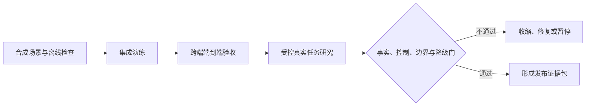
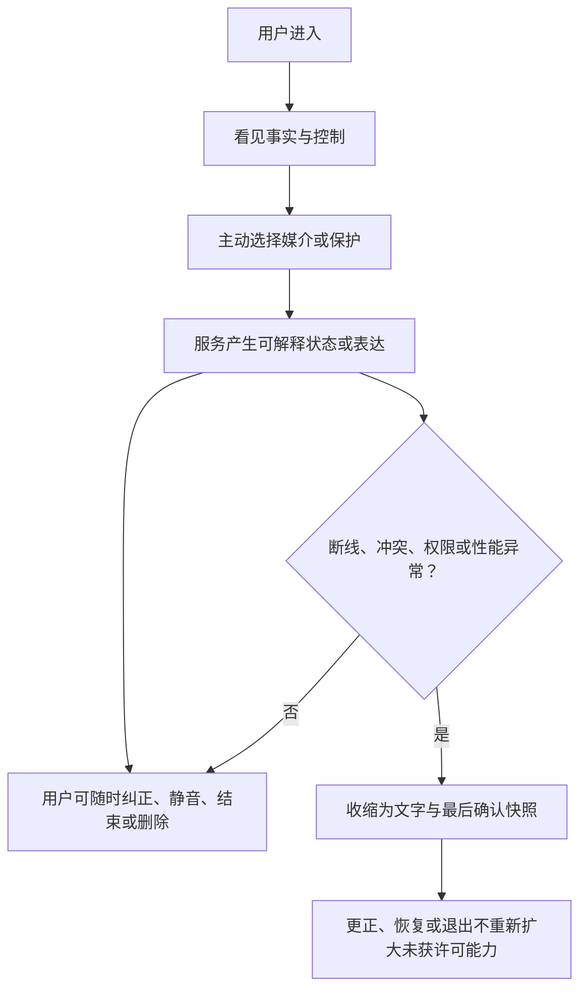
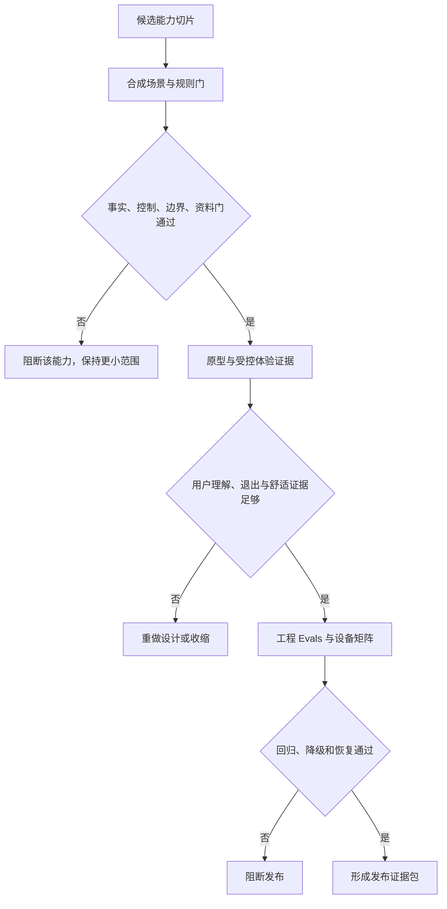

# 端到端验收与发布门禁

> 文档性质：0→1 工程执行方案。本文把事实、实时、语音、关系、记忆、删除、客户端与无障碍的局部证据收束为可执行的端到端验收与发布决定，明确什么可以在何种范围内开放，什么必须停止，以及停止后如何恢复。
>
> 核心判断：一次顺利演示不是发布证据。只有在预录反例、受控真实场景、浏览器与移动差异、用户控制、资料删除和异常降级都经得起审查时，才能让服务从文字和快照的最小范围向更强体验逐层扩大。

> 方案形成时间：2026-01-28。



## 1. 验收目标、前序决策与范围

### 1.1 验收要保护什么

足球陪看服务不是单一模型或单一页面。用户看到的一次回应，可能同时依赖赛事资料、延迟资格、会话控制、实时连接、语音识别、关系护栏、记忆生命周期、Flutter 呈现和平台权限。若只在网络正常、资料一致、用户不打断、角色未加载失败的情况下走一遍流程，最容易放过的恰恰是用户最需要保护的时刻。

端到端验收要验证以下闭环：



发布门不是“功能清单完成”，而是对用户风险的承诺：未确认不装作确定；用户可立即止损；角色不索取依赖；资料不越过许可；任何端或媒介失败时仍有完整的文字、控制与退出路径。

### 1.2 本文继承的前序决策

| 前序决策 | 端到端验收中的硬要求 |
| --- | --- |
| 比赛事实与用户观察分离 | 观察不能改变公开比分，待确认不能被任何媒介剧透 |
| 严格保护默认开启 | 文字、声音、舞台、颜色、动效与时间线都需遵守同一保护状态 |
| 结束、静音、删除和风险收缩优先 | 任何在途生成、实时消息、语音和舞台动作必须被取消或失效 |
| 关系阶段与记忆建立在许可上 | 连续使用、沉默、情绪和设备相同都不能构成长期开启证据 |
| 语音是主动、短时、可停止的能力 | 浏览器或移动权限拒绝时，文字闭环仍完整；不后台收音 |
| 实时传输快照优先、会话隔离 | 断线恢复不补播旧内容，不读取其它会话资料 |
| 多端舞台是可选呈现 | 低性能、减少动效、辅助技术和小屏先保留事实与控制 |

### 1.3 非目标

首轮发布门不试图证明“所有用户都会喜欢角色”“所有比赛来源永远正确”“所有设备都能获得相同性能”“语音识别在所有环境下完全准确”或“陪伴体验可以替代现实支持”。它不把真实用户的脆弱表达、原始音频、私密聊天或完整观看记录当作验收材料；不为了赶发布而关闭删除、权限、无障碍或严格保护；不在问题尚未解释时扩大赛事、关系记忆、主动声音或沉浸舞台。

### 1.4 明确假设

**编号：H1**
- **假设**：预录情境足以在低风险环境中发现主要状态与文案错误
- **若不成立**：真实场景仍出现未知交互
- **发布策略**：先限于文字/快照，再进行受控真实演练

**编号：H2**
- **假设**：用户愿意理解严格保护、等待确认和更正
- **若不成立**：状态文案被误解
- **发布策略**：不开启主动关键表达，改进解释与界面

**编号：H3**
- **假设**：Web 与移动端可提供同等核心控制
- **若不成立**：某端权限或辅助路径不完整
- **发布策略**：仅开放已验证平台或保持文字优先

**编号：H4**
- **假设**：受控真实比赛能在不剧透和不额外收集资料下验证体验
- **若不成立**：真实赛事压力过高
- **发布策略**：改用回放和模拟时间线，暂停实时范围

**编号：H5**
- **假设**：证据包能让不同角色做出一致放行决定
- **若不成立**：决定依赖口头印象
- **发布策略**：不放行，补充缺失证据与明确责任

**编号：H6**
- **假设**：停止与恢复流程能比新功能更快执行
- **若不成立**：故障中仍继续输出
- **发布策略**：默认进入安全静默和文字快照

### 1.5 完成定义

端到端验收完成的标志是：每个计划开放的能力都有清晰范围、对应场景、证据等级、责任人、回退动作和复核日期；预录与真实场景均证明事实、控制、关系、隐私、语音、实时和无障碍能收敛；P0 无已知失败；P1 有明确收缩；用户可以不使用声音、舞台、记忆或长期身份而完成核心任务；停止后不会有迟到内容、旧记忆或旧控制重新出现。

## 2. 验收策略：先验证最小产品，再验证更强媒介

### 2.1 分层开放顺序

发布范围从可证明性最高、伤害半径最小的能力开始，不按“最吸睛”排序。后一层依赖前一层的验收，不可以跳过。

**层级：L0 文字与快照**
- **开放能力**：本场事实、时间线、静音、结束、严格保护
- **必须先证明**：确认/等待/更正、控制、文字可达
- **失败后的回退**：仅保留最后确认快照与退出

**层级：L1 低频实时**
- **开放能力**：会话内状态变化、用户主动查看
- **必须先证明**：快照、版本、乱序、重连、会话隔离
- **失败后的回退**：回到轮询快照

**层级：L2 可选舞台**
- **开放能力**：静态或低动效角色、字幕
- **必须先证明**：舞台不遮挡、不剧透、减少动效
- **失败后的回退**：文字优先/静态形象

**层级：L3 可选声音与语音**
- **开放能力**：用户主动输入、可选播放
- **必须先证明**：权限、停止、转写、字幕、文字替代
- **失败后的回退**：关闭声音与麦克风

**层级：L4 有限连续性**
- **开放能力**：用户许可的偏好与共同记录
- **必须先证明**：许可、解释、暂停、删除、防回写
- **失败后的回退**：降到本场无记忆

**层级：L5 受控主动性**
- **开放能力**：合资格的低打扰提示
- **必须先证明**：防剧透、时效、取消、关系护栏
- **失败后的回退**：停止主动表达

不能用 L3 的语音演示证明 L0 的事实可靠，也不能用 L4 的用户喜欢某项偏好证明删除能工作。每一层都独立保留“关闭后是否仍完整”的验收项，避免功能叠加后用户失去基础路径。

### 2.2 验收证据级别

**级别：A1 合同审阅**
- **材料**：状态机、接口、权限、生命周期、文案清单
- **适用决定**：发现缺字段与不合法转换
- **限制**：不能证明用户理解或端间行为

**级别：A2 预录情境**
- **材料**：固定事件、虚拟时钟、模拟权限、录制输出
- **适用决定**：验证正常与失败路径
- **限制**：不能替代真实观看注意力

**级别：A3 集成演练**
- **材料**：多服务、删除竞争、重连、音频状态、实时主题
- **适用决定**：验证异步收敛与隔离
- **限制**：不能完全代表真实设备差异

**级别：A4 端到端走查**
- **材料**：浏览器/移动端、辅助技术、屏幕与网络条件
- **适用决定**：验证用户任务和可见控制
- **限制**：样本有限，需说明范围

**级别：A5 受控真实场景**
- **材料**：知情选择的真实赛事或回放观察
- **适用决定**：验证注意力、理解、退出与舒适
- **限制**：不扩张资料收集或关系试探

涉及用户权利、事实、删除、关系风险或语音资料的范围，最低要求 A2+A3+A4；只有完成前述层级并具备退出和暂停机制，才能进行 A5。A5 不是“真实用户替代品”，而是检查预录材料无法覆盖的注意力和环境问题。

### 2.3 验收角色与独立性

验收至少包含产品/体验、工程/运行、安全与隐私、无障碍和人工评估五种视角。由同一人同时设计用例、改动能力和判定结果会增加盲区，因此 P0 情境必须有独立复核；关系、危机、未成年人、删除和会话隔离还需要跨角色审阅。

| 角色 | 主要问题 | 不应单独决定 |
| --- | --- | --- |
| 体验负责人 | 用户是否理解状态、能否停止与退出 | 协议与删除完整性 |
| 工程负责人 | 版本、取消、重连、容量和回退是否可执行 | 关系语言是否造成依赖 |
| 隐私/安全负责人 | 许可、最小化、隔离、删除与访问范围 | 舞台是否舒适易懂 |
| 无障碍审阅者 | 不同输入和感官路径是否任务等效 | 赛事事实是否可信 |
| 独立评估者 | 红队、边界、文案与结果分歧 | 单方面扩大业务范围 |

## 3. 预录情境：在伤害发生前反复演练失败路径

### 3.1 预录材料的原则

预录情境使用固定的赛事状态、模拟用户动作、虚拟时间、合成音频和受控网络事件。它们让团队可以重复观察同一个错误，不将真实用户置于剧透、关系压力、语音采集或删除失败的风险中。每份材料必须写清“这是演练，不代表真实时效、球赛结果或用户行为”，避免把预录顺畅当作真实体验证明。

预录材料不包含未授权直播画面、完整转播音频、真实敏感对话或可识别用户资料。关键赛事状态以最小事件线表示：场次、时间、候选/确认/更正版本、保护模式、控制版本和可见结果。声音情境使用合成或可许可短片段，仅验证 VAD、封口、转写状态与取消，不用于识别身份或情绪。

### 3.2 必备预录场景库

**编号：P1**
- **场景**：首次进入、不开任何许可
- **前置**：新会话、无舞台资源
- **必须验收**：事实、保护、静音、结束和文字均可见

**编号：P2**
- **场景**：待确认关键事件
- **前置**：用户进度未知、严格保护
- **必须验收**：不以任一媒介透露结果

**编号：P3**
- **场景**：候选冲突与最后确认快照
- **前置**：两份资料不一致
- **必须验收**：状态说明清楚，不选边猜测

**编号：P4**
- **场景**：已呈现内容被更正
- **前置**：旧表达已排队
- **必须验收**：取消旧引用，给最小更正

**编号：P5**
- **场景**：用户结束与迟到动作竞争
- **前置**：声音/舞台/实时在途
- **必须验收**：结束版本覆盖全部旧动作

**编号：P6**
- **场景**：用户切换严格保护
- **前置**：快速资讯下已有待送达内容
- **必须验收**：重新判定或取消，不用动作剧透

**编号：P7**
- **场景**：删除与保存竞争
- **前置**：记忆写入、索引与生成并行
- **必须验收**：删除屏障拒绝迟到回写

**编号：P8**
- **场景**：共享设备新会话
- **前置**：同设备存在旧草稿与偏好
- **必须验收**：新会话不显示旧资料

**编号：P9**
- **场景**：浏览器拒绝麦克风
- **前置**：用户主动点击语音
- **必须验收**：文字完整，无重复许可压力

**编号：P10**
- **场景**：背景电视声与静默
- **前置**：语音入口准备但用户未发言
- **必须验收**：不创建命令、转写或长期资料

**编号：P11**
- **场景**：标签后台与重连
- **前置**：有旧字幕和舞台动作
- **必须验收**：恢复先快照，不续播、不重开麦

**编号：P12**
- **场景**：减少动效与低资源
- **前置**：舞台正在渲染
- **必须验收**：立即降静态，控制与事实不丢

**编号：P13**
- **场景**：屏幕阅读器结束本场
- **前置**：角色有长文本输出
- **必须验收**：焦点可达、状态可读、输出停止

**编号：P14**
- **场景**：人工处置不可用
- **前置**：关系或安全边界触发
- **必须验收**：不假装有人介入，给退出与现实选择

**编号：P15**
- **场景**：实时消息跳号
- **前置**：游标过期、事件乱序
- **必须验收**：清理局部队列，重取当前快照

### 3.3 预录结果判定

每个预录情境记录开始状态、操作序列、预期状态版本、允许与禁止呈现、资料保留结果、截图/语义摘要和最终降级等级。判定重点是用户最终获得了什么控制与解释，而不是后台每个组件是否“有响应”。例如舞台资源失败但文字和结束完整，属于可接受降级；舞台看起来正常但用户结束后继续播放，属于阻断失败。

### 3.4 预录情境的更新规则

新模型、提示词、资料源、协议、平台权限、删除语义、舞台素材或语音供应变化都会触发情境重跑。每次真实用户反馈、红队发现、异常事故或人工处置都应先被抽象成不含个人资料的预录候选，确认风险结构后加入场景库。不能等到再次伤害用户，才承认该情境需要覆盖。

## 4. 受控真实场景：验证注意力与理解，不扩大收集

### 4.1 进入条件

受控真实场景只在预录、集成和端到端材料通过后开展。进入前明确场次范围、可用功能层级、参与者告知、文字替代、随时退出、暂停主动表达、停止收集、事故联系人和数据最小化策略。若任何退出、删除、严格保护或无障碍路径尚未可证明，不能用真实比赛去“看看会不会出问题”。

首轮优先选择风险较低的情境：回放、非关键赛事、受控节奏、明确知道不是转播替代的参与者。对重要淘汰赛、强情绪群体、未成年人不确定、现实危机表达或需要高频语音的场景，默认不进入真实范围。

### 4.2 真实场景观察什么

真实观察关注用户行为和理解，不收集超过目的所需的资料。推荐问题包括：用户是否能在不被提醒的情况下找到事实和结束；是否理解“等待确认”和严格保护；角色是否抢走比赛注意力；声音、字幕和文字是否一致；断线或权限拒绝后是否仍能继续；用户是否觉得可以随时离开；用户是否误以为角色是真人或需要被安抚。

不将停留时间、说话时长、回访次数、沉默、深夜使用或情绪化表达解释成关系成功。更重要的负向信号包括：用户因为担心错过角色回应而离开比赛；不敢关闭声音；不敢删除；被剧透；误以为服务一直在听；把角色当成唯一支持；无法用文字完成任务。

### 4.3 真实场景的暂停规则

任何一位参与者都能在不解释原因的情况下暂停、改文字、关闭舞台、结束本场或要求删除。出现剧透、越界表达、未授权收音、错误记忆、删除疑问、辅助路径失败或明显不适时，主持人先停止相关能力，再决定是否继续，不让参与者为了“完成研究”承受体验风险。

真实场景结果只能支持被观察到的范围。例如十位用户能理解严格保护，不代表所有用户都理解；某端音频顺畅，不代表其它浏览器允许自动播放。证据卡必须写明样本、环境、能力层、限制和不能推出的结论。

## 5. 浏览器语音与平台差异验收

### 5.1 浏览器语音门

浏览器语音受到安全上下文、用户手势、权限设置、设备存在、标签生命周期和自动播放策略影响。验收不要求所有浏览器都提供同一能力，而要求任何限制都有诚实状态、文字替代和可停止路径。

**场景：未点语音**
- **必须看见**：清楚的可选入口
- **必须能够做**：继续文字、静音、结束
- **禁止**：自动请求麦克风

**场景：用户请求许可**
- **必须看见**：“正在请求，尚未接收”
- **必须能够做**：取消、改文字
- **禁止**：预热内容上传

**场景：权限拒绝**
- **必须看见**：“可以继续用文字”
- **必须能够做**：稍后手动再试
- **禁止**：重复弹窗或阻塞房间

**场景：设备丢失**
- **必须看见**：“暂时找不到可用麦克风”
- **必须能够做**：选设备/改文字/结束
- **禁止**：假装仍在听

**场景：音频播放受限**
- **必须看见**：“点击后才会发声”
- **必须能够做**：播放/保持静音
- **禁止**：自动启动角色声音

**场景：标签后台恢复**
- **必须看见**：语音已停止，文字仍可见
- **必须能够做**：主动重新开始
- **禁止**：自动重开麦或续播

**场景：转写失败**
- **必须看见**：最小错误说明
- **必须能够做**：编辑、重说、文字
- **禁止**：无限“处理中”

MDN 的 `getUserMedia()` 资料和 W3C Media Capture and Streams 可作为浏览器许可与轨道管理的公开参考；它们不能替代对实际目标浏览器、语言和设备的受控验收。任何浏览器特例都要在证据包中写明能力状态与文字替代，而不是悄悄让用户猜测。

### 5.2 移动端与 Web 的一致任务

移动端的来电、耳机断开、系统音频焦点、分屏和后台限制，与 Web 标签失焦、窗口缩放、自动播放和键盘路径不同。验收不追求相同动画或操作形态，而要求相同用户结果：事实可见、状态可理解、声音可停、麦克风不自动开启、保护可切换、结束可达、删除可发起。

**任务：停止声音**
- **Web 验收**：用户手势后的播放可立即静音
- **移动验收**：系统中断/耳机变化后停止
- **一致结果**：不再主动发声，字幕和控制仍在

**任务：结束本场**
- **Web 验收**：窗口、键盘、鼠标可达
- **移动验收**：触摸、外接键盘、系统辅助可达
- **一致结果**：取消在途输出和订阅

**任务：语音输入**
- **Web 验收**：安全上下文和许可明确
- **移动验收**：运行时权限和设备明确
- **一致结果**：不开麦也能完成任务

**任务：减少动效**
- **Web 验收**：系统/浏览器/应用选择生效
- **移动验收**：系统/应用选择生效
- **一致结果**：舞台收缩，事实与控制不丢

**任务：断线恢复**
- **Web 验收**：标签恢复后快照优先
- **移动验收**：前台恢复后快照优先
- **一致结果**：不补播旧内容、不恢复他人资料

### 5.3 无障碍验收门

WCAG 2.2 与 Flutter 无障碍资料要求的不只是对比度和标签。端到端验收以核心任务为单位：在无声音、无舞台、屏幕阅读器、键盘、触摸、大字体、减少动效、窄屏与不使用麦克风的情况下，用户能否理解事实、切换保护、停止、删除、反馈和结束。

实时状态播报还要控制频率。每次临时转写、比分刷新或舞台动作都打断屏幕阅读器会制造新的障碍。验收记录哪些状态必须播报，哪些应合并，哪些只需可查询；用户控制和事实更正优先，角色表现和正在输入提示保持低优先。

## 6. 事实、关系、隐私与降级的端到端门

### 6.1 事实与剧透门

| 门 | 必须证据 | 阻断示例 |
| --- | --- | --- |
| 确认门 | 候选、确认、冲突、更正的全链路情境 | 待确认文字被说成确定比分 |
| 保护门 | 严格保护下文字/声音/舞台/颜色均被审查 | 角色欢呼或动作先于用户观看进度 |
| 更正门 | 已送达和未送达旧内容分别处理 | 静默覆盖旧事实或补播旧庆祝 |
| 不可用门 | 来源/网络不可用时的最后确认快照 | 以本地时间或角色猜测填补空白 |

事实门失败时，主动表达、声音和舞台立即关闭，只保留用户主动查看的已确认快照与等待说明。不能以“用户可能更喜欢快一点”作为降低确认和保护要求的理由。

### 6.2 关系与人格门

关系门覆盖正常温暖、昵称、纠错、沉默、输球沮丧、排他请求、恋爱要求、现实替代、结束本场、未成年人不确定和人工不可用。每一类同时审查文字、声音、字幕、舞台动作和后续提醒，确认角色没有用任何媒介制造唯一性、等待、亏欠、秘密或依赖。

通过的证据不是“角色拒绝了敏感词”，而是用户仍获得不带羞耻的选择：继续看比赛、改文字、停止、联系现实支持或退出。若边界说明太长、太说教、太情感化或让用户觉得必须安慰角色，也应判为需要收缩。

### 6.3 隐私、记忆与删除门

| 门 | 必须证据 | 失败处理 |
| --- | --- | --- |
| 最小化 | 不许可时本场服务完整，未主动开麦不收音 | 停止相关收集与长期能力 |
| 许可 | 每项偏好/记忆有用途、范围、到期和撤回 | 收缩为本场无记忆 |
| 隔离 | 共享设备、并发会话、同场次订阅不串线 | 停止实时/记忆范围并调查 |
| 删除 | 主存、索引、缓存、生成、提醒和重连均阻断 | 保持删除屏障与用户说明 |
| 解释 | 用户能看见为何被召回、如何暂停/删除 | 停止主动召回直到说明可用 |

删除验收使用竞争情境，而不是空闲时点击一次按钮：删除与保存并发、删除与生成并发、离线客户端恢复、索引滞后、旧实时动作抵达、不同设备版本冲突。任何路径能让已撤回对象再次出现，都属于阻断级问题。

### 6.4 降级与恢复门

**降级触发：事实冲突/资料不可用**
- **用户仍应拥有**：最后确认快照、等待、结束
- **必须停止**：新事实断言和高情绪表现
- **恢复前检查**：新快照与确认状态

**降级触发：实时断线/跳号**
- **用户仍应拥有**：文字、控制、重试、时间线
- **必须停止**：增量猜测、旧内容补播
- **恢复前检查**：会话/游标/快照版本

**降级触发：音频/麦克风失败**
- **用户仍应拥有**：完整文字、静音、结束
- **必须停止**：自动重开麦、旧声音续播
- **恢复前检查**：用户主动选择与权限

**降级触发：舞台/性能失败**
- **用户仍应拥有**：事实、控制、字幕/文字
- **必须停止**：强动效、占用资源
- **恢复前检查**：设备能力与减少动效设置

**降级触发：关系/删除/隔离异常**
- **用户仍应拥有**：本场最小文字、退出、反馈
- **必须停止**：记忆读取、主动关系表达
- **恢复前检查**：许可、删除、会话范围、规则版本

恢复不是服务自动“回到最好状态”。它先恢复最低安全层，重新核验控制、权限、事实和资料状态，再由用户主动选择恢复舞台、声音或语音。任何未解释的异常都应长期停在更保守层。

## 7. 发布门与证据包



### 7.1 门禁结构

发布门按能力和风险拆分，所有门同时成立才允许扩大。某个门失败时，只关闭对应能力而不是牵连用户已验证的文字、事实和退出路径。

**门：G0 基础控制**
- **关注**：进入、静音、结束、文字
- **必须证据**：多端核心任务与版本结果
- **失败后的范围**：仅保留静态状态与退出

**门：G1 事实可信**
- **关注**：确认、保护、更正、不可用
- **必须证据**：预录、实时、端到端情境
- **失败后的范围**：停止主动事实与舞台

**门：G2 实时恢复**
- **关注**：票据、快照、乱序、取消、隔离
- **必须证据**：重连、跳号、结束竞争
- **失败后的范围**：回到 HTTP 快照

**门：G3 语音与音频**
- **关注**：许可、停止、转写、字幕、设备
- **必须证据**：Web/移动权限与中断演练
- **失败后的范围**：关闭声音和麦克风

**门：G4 关系与记忆**
- **关注**：许可、边界、删除、防回写
- **必须证据**：红队、删除竞争、共享设备
- **失败后的范围**：本场无记忆文字

**门：G5 无障碍与性能**
- **关注**：语义、键盘、减少动效、低资源
- **必须证据**：端到端任务与设备矩阵
- **失败后的范围**：文字优先、禁用舞台

**门：G6 运行恢复**
- **关注**：观察、限流、人工不可用、回退
- **必须证据**：停止/恢复演练与交接卡
- **失败后的范围**：停止主动能力

### 7.2 证据包清单

每次发布候选生成一份证据包，不靠口头“都跑过了”。证据包必须可让后来的人复查范围与决定，但不保存超过必要范围的敏感内容。

| 工件 | 最小内容 | 目的 |
| --- | --- | --- |
| 范围声明 | 开放层级、平台、赛事、媒介、排除项 | 防止功能悄悄超范围 |
| 版本清单 | 合同、规则、提示词、资料、客户端、黄金集版本 | 定位结果适用对象 |
| 门禁结果 | 每个门的通过/收缩/阻断、案例与时间 | 做出可追溯决定 |
| 差异摘要 | 与已批准基线的 P0/P1/P2 变化 | 防止新版本掩盖旧风险 |
| 预录与端到端证据 | 场景状态、截图、语义摘要、控制版本 | 验证用户可见结果 |
| 数据说明 | 评估资料来源、保留、删除与访问范围 | 证明最小化 |
| 回退与恢复卡 | 停止开关、降级层、恢复前置、负责人 | 在异常时迅速收缩 |
| 未决问题 | 假设、分歧、未覆盖平台与复核日期 | 不把未知写成通过 |

### 7.3 三种发布决定

**决定：受控开放**
- **条件**：所有相关门通过，未知项已明确排除
- **用户可见范围**：只开放证据覆盖的平台和能力
- **后续动作**：持续观察，按复核日重审

**决定：限制开放**
- **条件**：P1 或平台缺口存在但核心权利完整
- **用户可见范围**：关闭相应媒介/主动性，保留文字快照
- **后续动作**：补证据后再申请扩大

**决定：暂停开放**
- **条件**：P0、删除、隔离、事实或退出失败
- **用户可见范围**：不提供受影响能力
- **后续动作**：回退、修复、重演练

没有“先全面开放、后补证据”的选项。若业务压力要求更快发布，正确做法是选择限制开放，让用户从一开始就得到可信的最小能力，而不是在风险未解时扩大角色与资料范围。

## 8. AI 协作提示词

### 8.1 提示词一：生成端到端验收计划

```text
你正在为足球陪看服务生成端到端验收计划和发布门。目标是证明用户权利、事实可信和异常降级，而不是制作一段顺滑演示。

范围：文字快照、实时恢复、严格保护、静音/结束、语音许可与取消、关系边界、记忆删除、Flutter 多端无障碍和低资源降级。
硬约束：预录情境先于真实场景；真实场景需要可退出、最小收集和暂停规则；P0 不能用平均分覆盖；任何删除、隔离、剧透、未授权收音、结束后输出或依赖强化都必须阻断；失败时先收缩到文字与最后确认快照。

请输出：验收层级、场景矩阵、证据等级、发布门、证据包、停止/恢复动作、运行命令和需要人工决定的假设。禁止使用真实用户原始音频、完整私聊或敏感经历作为默认材料。
```

### 8.2 提示词二：审查发布证据包

```text
请审查以下发布证据包：[粘贴内容]。

依次检查：开放范围是否明确；相关事实/控制/关系/隐私/语音/实时/无障碍门是否都有证据；预录、集成、端到端与真实场景的结论是否被正确区分；P0/P1 是否被清楚处理；资料来源和保留是否最小；停止与恢复是否能执行；未知项是否被错误计入通过。

输出“可受控开放 / 只能限制开放 / 必须暂停”之一，并给出缺失证据、最小收缩范围、需补的情境和不能继续假设的事项。不要因文档完整或演示顺畅而忽略用户权利门。
```

### 8.3 提示词三：演练停止与恢复

```text
请为以下异常演练停止与恢复流程：[粘贴异常]。

必须先确定：哪些用户可见副作用要停止；哪些资料读取/写入要阻断；文字、快照、退出和反馈如何保留；如何用最小元数据确定影响范围；用户该看到什么说明；恢复前需重新核验哪些事实、控制、许可、删除、会话和协议版本。

禁止：自动续播旧声音、自动重开麦、自动恢复旧记忆、用角色话术掩盖系统故障、等待所有根因完全明确才停止影响。输出应包含降级级别、操作顺序、验收情境和回退条件。
```

## 9. 运行命令、停止与恢复

### 9.1 目标运行命令

以下命令描述目录骨架完成后的统一入口，不代表任意机器已经具备全部依赖、浏览器、设备或资料。

```powershell
pnpm -C release run evidence:check --candidate 2026.07.1
pnpm -C evals run prerecord --suite release-gates
go -C services/evals run ./cmd/integration --scenario end-cancels-late-delivery
flutter run -d chrome --dart-define=APP_ENV=release-evaluation
dart run tool/e2e_scenario.dart --case browser-mic-denied-text-complete
pnpm -C release run decision:render --evidence evidence/2026.07.1
```

预期现象：证据检查拒绝缺失门或版本；预录情境覆盖事实、更正、删除和语音；集成演练证明结束取消迟到交付；浏览器场景在拒绝麦克风后保留文字；决定渲染器输出受控开放、限制开放或暂停及理由。失败时保留最小结果摘要和环境信息，不通过跳过高风险集合、临时改变期望或删除失败工件来取得表面通过。

### 9.2 停止动作

停止必须按用户影响顺序执行：停止主动声音、舞台和关系性表达；阻断新的记忆读取/写入和语音接收；取消在途生成、实时派发与提醒；保留最小事实快照、文字、静音、结束、删除和反馈；将受影响会话降到 D2 或 D3；向用户展示具体状态而不是模糊“系统繁忙”。

**触发：剧透或事实冲突**
- **立即停止**：主动事实、声音、舞台
- **保留**：最后确认快照、等待
- **用户语言**：“信息正在确认，暂不主动提示。”

**触发：删除/隔离异常**
- **立即停止**：记忆、关系召回、恢复
- **保留**：本场文字、删除状态、退出
- **用户语言**：“相关设置已停止使用。”

**触发：语音许可/取消异常**
- **立即停止**：麦克风与声音
- **保留**：文字、静音、结束
- **用户语言**：“语音已停止，可继续用文字。”

**触发：实时协议异常**
- **立即停止**：增量和主动呈现
- **保留**：快照读取、文字、重试
- **用户语言**：“实时更新暂不可用，仍可查看最后确认状态。”

**触发：无障碍/性能异常**
- **立即停止**：舞台、高动效、自动声音
- **保留**：静态文字、控制、时间线
- **用户语言**：“已切换为轻量显示。”

**触发：关系边界异常**
- **立即停止**：主动关系表达、长期记忆
- **保留**：中性本场支持、退出
- **用户语言**：“这项陪看表达已暂停。”

### 9.3 恢复门

恢复不是自动打开所有暂停能力。每一次恢复都应检查异常已被定位或至少被可靠隔离；用户控制和删除版本仍一致；最新事实与快照可用；会话范围和票据有效；语音需用户重新主动选择；舞台和声音需用户重新开启；红队或预录反例已重演；证据包更新了受影响范围与复核日期。任何条件缺失，保持更保守层。

## 10. 验收档案、设备矩阵与发布后复核

### 10.1 验收档案的组织方式

验收档案按“一个发布候选、一条证据链、一个范围决定”组织。它不应是一堆孤立截图或口头描述，而应让独立审阅者从范围声明一路追到场景、状态、结果、异常与回退。每一项工件都标明创建时间、适用版本、责任角色、资料敏感等级和保留期限。


档案只保留支持决定所需的最少内容。截图裁掉可识别会话信息；语义树摘要不含用户自由文本；音频场景保存状态与结果，不保存无关原声；真实场景笔记以去识别观察和参与者主动反馈为主。若某工件无法说明用途、范围和保留期，就不应进入档案。

### 10.2 设备、浏览器与辅助路径矩阵

首轮不承诺覆盖所有设备，但必须公开当前覆盖和未覆盖范围。设备矩阵以“核心任务是否仍可完成”为单位，不以视觉一致性或最大帧率为唯一标准。

**维度：Web 窄窗口**
- **代表条件**：小宽度、浏览器缩放、大字体
- **核心验收任务**：进入本场、看事实、静音、结束
- **不通过时的范围**：仅开放文字快照或调整布局后再开

**维度：Web 桌面**
- **代表条件**：键盘、鼠标、多标签、标签失焦
- **核心验收任务**：焦点顺序、恢复、保护切换
- **不通过时的范围**：关闭声音/舞台自动恢复

**维度：Android 常规**
- **代表条件**：触摸、权限拒绝、来电或耳机变化
- **核心验收任务**：文字、语音入口、系统中断
- **不通过时的范围**：关闭音频能力

**维度：iOS 常规**
- **代表条件**：权限、音频焦点、后台恢复
- **核心验收任务**：停止与重新选择、文字替代
- **不通过时的范围**：关闭音频能力

**维度：屏幕阅读器**
- **代表条件**：语义导航、动态状态播报
- **核心验收任务**：事实、控制、结束、错误解释
- **不通过时的范围**：不放行相应平台

**维度：减少动效**
- **代表条件**：系统与应用设置同时开启
- **核心验收任务**：静态模式、状态与控制
- **不通过时的范围**：禁用舞台强动效

**维度：低资源**
- **代表条件**：资源加载失败、网络弱、内存紧张
- **核心验收任务**：文字、时间线、退出
- **不通过时的范围**：D2 文字优先

**维度：共享设备**
- **代表条件**：新匿名会话、切换场次
- **核心验收任务**：不显示历史草稿、记忆或语音状态
- **不通过时的范围**：关闭长时本地恢复

设备矩阵每次平台运行时、渲染引擎、浏览器策略、权限要求或舞台资源变更后重新审查。已覆盖不代表永久覆盖，未覆盖也不应被隐藏。用户端范围说明应避免笼统“支持所有设备”，改为说明“当前可用能力”和无法使用时的完整文字替代。

### 10.3 预录到真实场景的转化规则

预录情境通过后，不可直接把同一脚本当作真实体验结论。转化时要保持风险结构不变，降低资料与关系暴露：例如从预录关键事件的严格保护，转为参与者主动选择的一场低风险回放或受控比赛；从合成背景声转为用户自愿选择的安静环境；从固定断线转为由主持人可控切换的网络状态。每次只新增一个真实变量，避免同时改变赛事重要性、声音、舞台、提醒和关系表达，导致无法解释用户反应来自哪里。

| 预录结论 | 真实场景中要确认 | 不能直接推出 |
| --- | --- | --- |
| 用户能完成严格保护切换 | 用户是否理解为何结果暂不显示 | 用户喜欢更快的主动播报 |
| 语音拒绝许可后文字可用 | 用户是否能不尴尬地改用文字 | 用户愿意长期使用麦克风 |
| 删除阻断回写 | 用户是否理解删除范围与完成状态 | 用户希望保存更多资料 |
| 舞台降到静态 | 用户是否仍能专注并完成控制 | 舞台能提升关系连续性 |
| 重连回到快照 | 用户是否理解“正在同步” | 用户愿意接受任意等待时长 |

### 10.4 真实场景执行清单

每次受控真实场景开始前，负责人确认：参与者了解 AI 身份与非转播边界；当前能力层级；严格保护默认值；文字、静音、结束、删除和反馈位置；麦克风是否完全可选；场景何时停止；遇到错误如何处理；资料如何最小化；以及参与者可以不提供任何解释直接离开。

进行中只记录回答研究问题所需的观察：任务是否完成、状态是否理解、用户是否主动使用控制、哪条替代路径被选择、出现何种错误类别和参与者自愿给出的简短反馈。不要记录完整谈话、长时间行为轨迹、与研究无关的情绪推断、第三人声音或后台浏览行为。主持人不能通过“再试一次”“你是不是喜欢这样”引导参与者延长互动。

结束后，先确认参与者是否需要退出、删除或反馈入口，再记录去识别摘要。若发生剧透、关系越界、未授权收音、控制不生效或不适，主持人启动停止流程，相关能力不进入下一轮；不把参与者的坚持完成当作“可以接受”的信号。

### 10.5 用户可见的发布说明

发布说明不是营销文案，而是用户理解当前范围的工具。它需要在适当位置说明：角色是 AI；不替代直播、专业裁判、现实关系或紧急支持；事实可能等待确认；严格保护与静音可随时切换；声音和麦克风都可选；保存偏好需要单独选择；如何查看、暂停、删除和结束；出现异常时服务会收缩为文字和最后确认状态。

用户可见说明应短、具体、可操作。避免“我们努力保护你的隐私”“智能同步”“永远陪伴”“懂你所有习惯”一类无法验证或强化依赖的语言。事实、权限、删除、关系和异常说明必须与验收中的真实行为完全一致；若系统只能做到本场不保存，就不能暗示跨场连续性。

### 10.6 发布窗口与复核节奏

发布不是一次性事件，而是一个持续收缩或扩大范围的窗口。首轮建议按准备、受控、观察、复核四段安排，每一段都有进入和退出条件。

**阶段：W1 准备**
- **目的**：锁定范围与证据
- **必须完成**：版本清单、场景、回退卡、责任人
- **退出条件**：任一 P0 未关闭或证据缺失

**阶段：W2 受控**
- **目的**：在已声明小范围内开放
- **必须完成**：实时观察、文字替代、反馈入口
- **退出条件**：控制/事实/删除异常触发停止

**阶段：W3 观察**
- **目的**：收集最小质量与用户理解信号
- **必须完成**：负向信号、降级次数、复核抽样
- **退出条件**：用户权利指标退化或范围不清

**阶段：W4 复核**
- **目的**：决定维持、收缩、扩大或暂停
- **必须完成**：证据包更新、未决问题与下次日期
- **退出条件**：无法解释差异或分歧未解决

观察周期不以用户停留或互动量作为结束条件。若系统频繁进入降级、用户误解严格保护、辅助路径任务失败、删除说明不清或角色边界触发增加，就应提前复核并收缩，即使使用量看上去很好。

### 10.7 发布后事故演练

在首次开放前和重要变更后，至少演练以下停止与恢复路径：资料冲突导致可能剧透；用户结束后旧声音抵达；删除后旧记忆在重连中出现；浏览器误显示“正在听”；实时主题越过会话范围；屏幕阅读器无法触达结束；舞台资源占满页面；关系护栏服务不可用。演练的目标不是证明值班人员反应快，而是证明系统默认就会收缩、用户无需等待人工才有退出路径。

每次演练记录触发方式、自动收缩是否执行、用户可见说明、资料阻断范围、人工需要的最少信息、恢复前缺失什么证据和是否要新增预录案例。若只能靠人工手动关闭多处开关才能止损，说明系统的控制优先级不足，不能扩大主动能力。

### 10.8 范围变更的再验收

任何扩大都被视为新的发布决定，而不是上次通过的自然延续。新增赛事、地区、资料来源、浏览器、移动版本、声音类型、舞台动作、提醒时机、记忆对象、关系表达或实时主题，都可能改变用户风险、许可范围和异常路径。提出扩大前，负责人重新填写范围声明，映射受影响门、预录情境、真实场景必要性、资料最小化、无障碍设备矩阵和回退动作。

若变更只是修正文案或视觉细节，也要确认它没有改变事实确定性、控制可见性、关系语义或屏幕阅读器顺序。不能将“已通过首轮验收”当作永久授权，也不能把多个小改动拆开以避免触发完整复核。范围不清、版本无法追溯、平台缺证据或用户控制存在分歧时，默认维持较小范围，直到新证据明确支持扩大。

开放后仍应按风险抽取少量真实会话的去识别结果，核验严格保护、结束、删除、重连和辅助路径是否与证据包一致。抽查只服务于发现系统差异，不用于评价某个用户是否忠诚、投入或需要更多陪伴。发现不一致即回到相应门禁，不等待周期结束。

所有结论均可复查。

## 11. 公开资料与访问记录

以下公开资料为生成式风险、评测、陪伴型聊天、浏览器媒体、无障碍与内容治理提供方法参考。它们不能替代本篇的端到端证据，也不证明某一个发布门、阈值或用户体验已经足够。

> 信息卡：原宽表已改为纵向阅读，字段含义不变。

- **编号：R1**
  - **公开资料**：NIST, *AI RMF: Generative AI Profile*
  - **用途**：生成式风险治理、测量和管理参考
  - **地址**：https://www.nist.gov/publications/artificial-intelligence-risk-management-framework-generative-artificial-intelligence
  - **访问日**：2026-01-28

- **编号：R2**
  - **公开资料**：OpenAI, *Evals guide*
  - **用途**：评测集、持续评估与结果比较参考
  - **地址**：https://platform.openai.com/docs/guides/evals
  - **访问日**：2026-01-28

- **编号：R3**
  - **公开资料**：U.S. FTC, *FTC launches inquiry into AI chatbots acting as companions*
  - **用途**：陪伴型聊天的用户与资料风险公开关注
  - **地址**：https://www.ftc.gov/news-events/news/press-releases/2025/09/ftc-launches-inquiry-ai-chatbots-acting-companions
  - **访问日**：2026-01-28

- **编号：R4**
  - **公开资料**：W3C, *Media Capture and Streams*
  - **用途**：麦克风许可与媒体轨道管理参考
  - **地址**：https://www.w3.org/TR/mediacapture-streams/
  - **访问日**：2026-01-28

- **编号：R5**
  - **公开资料**：MDN, *MediaDevices: getUserMedia()*
  - **用途**：浏览器麦克风权限与限制参考
  - **地址**：https://developer.mozilla.org/en-US/docs/Web/API/MediaDevices/getUserMedia
  - **访问日**：2026-01-28

- **编号：R6**
  - **公开资料**：W3C, *Web Content Accessibility Guidelines 2.2*
  - **用途**：端到端无障碍任务与状态表达参考
  - **地址**：https://www.w3.org/TR/WCAG22/
  - **访问日**：2026-01-28

- **编号：R7**
  - **公开资料**：Flutter, *Accessibility*
  - **用途**：跨端语义与可访问界面参考
  - **地址**：https://docs.flutter.dev/ui/accessibility-and-internationalization/accessibility
  - **访问日**：2026-01-28

- **编号：R8**
  - **公开资料**：国家互联网信息办公室，《生成式人工智能服务管理暂行办法》
  - **用途**：生成式服务责任与内容治理公开参考
  - **地址**：https://www.cac.gov.cn/2023-07/13/c_1690898326795531.htm
  - **访问日**：2026-01-28

## 12. 结论

端到端验收的价值不在于证明系统“看起来像一个完整产品”，而在于确保用户在最不理想的时刻仍拥有事实、控制、解释和离开。预录情境用于把失败提前暴露，受控真实场景用于验证注意力和理解，发布门用于把证据转成范围决定，停止与恢复用于在未知出现时诚实收缩。只要有一个关键门无法证明，最可靠的发布方式就是保留文字与最后确认快照，而不是让沉浸和主动性先行。
