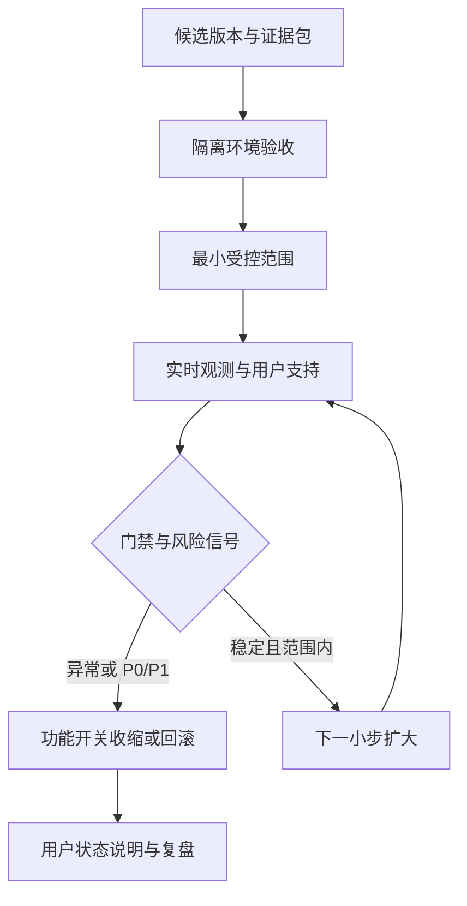
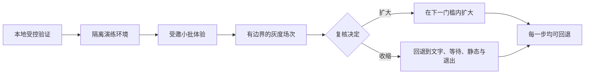
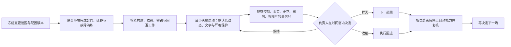

# 灰度发布、回滚与生产运行

> 文档性质：0→1 工程执行方案。本文规定陪看服务怎样从本地演练逐步进入受控真实使用，并在任何阶段通过环境隔离、配置治理、容量门槛、灰度、回滚、值守、监控和用户说明保护“事实可信、用户可控、关系有边界、资料可撤回”的最小服务合同。
>
> 适用阶段：成年人、有限赛事、有限功能的首轮发布。容量数值、批次规模、值守时段、阈值、地区范围与依赖选择均为待验证假设，必须由每次演练和用户研究的实际证据决定。
>
> 核心判断：灰度不是“先让少量用户承受不确定性”。它是逐步验证在更真实的网络、设备和比赛节奏中，服务是否仍能更早收缩、让用户真正停止、并在故障时诚实退回基础能力。

> 方案形成时间：2026-01-28。



---

## 1. 发布目标、边界与完成定义

### 1.1 发布要证明什么

首轮发布不是证明角色能说得多自然，也不是让更多人同时进入一场比赛。它要证明一份狭窄服务合同在真实约束下仍然成立：用户能明确知道这是一项数字陪看服务；可以在有限赛事中主动获得事实/解释帮助；能始终控制安静、文字、动态、声音和结束；事实不确定时服务等待；资料只在用户选择的范围内使用；错误、删除、网络与依赖异常时服务会收缩，而不是以角色表现掩盖问题。

发布路径如下：



任何阶段都可停在更小范围；“已经投入了”“赛事很热”“用户正在等”都不是放宽事实、关系、隐私或退出门槛的理由。

### 1.2 发布继承的硬约束

| 前序决策 | 对发布与运行的约束 |
| --- | --- |
| 用户主权 | 灰度配置不能覆盖安静、仅文字、隐藏、严格保护、结束或删除 |
| 事实可信 | 发布批次不因为规模更大而缩短确认等待、降低更正门槛或增加剧透 |
| 关系边界 | 不能用“内测用户更重要”“帮角色成长”等话术获得持续使用或更多资料 |
| 最小资料 | 环境、监控、支持、回滚和恢复都不能为便利而复制真实私人内容 |
| 可删除与防回写 | 灰度、回滚、备份恢复和配置切换后，撤回/删除仍优先于旧任务和缓存 |
| 无障碍与等效通路 | 声音、舞台和动态不是通过灰度的必要条件；文字和控制先被证明 |
| 高风险先收缩 | 指标异常、事实冲突、权限不清或值守不足时，优先停用能力/缩小范围 |

### 1.3 首轮非目标

- 不追求全量联赛、全天时区、全设备能力或自动全球扩容；
- 不以增长活动、连续签到、强角色表演、亲密关系或付费转化作为扩大灰度的条件；
- 不把发布环境当作收集用户情绪、原始声音、完整会话或运营捷径的场所；
- 不在无人值守、事实来源不稳、删除屏障积压或用户说明不清时开放高风险能力；
- 不让一次成功的演示、少量好评或低投诉替代多场次、取消、更正、弱网和无障碍证据；
- 不用“回滚困难”作为继续让用户承受伤害的理由。

### 1.4 完成定义

在考虑扩大范围前，应能证明：

1. 本地、演练、受邀体验和发布环境在资料、凭据、权限、配置与外部依赖上相互隔离；
2. 每一次发布使用不可变的构建标识、明确的配置版本、变更范围、负责人、演练证据和回滚目标；
3. 灰度批次按用户伤害风险而非营销价值划分，且任一批次均可在不改动用户端的情况下快速收缩；
4. 容量策略优先保证控制、事实等待、文字、退出和删除，而非优先保持语音、动作、主动表达或装饰性功能；
5. 回滚、停止、恢复和配置收紧不会复活旧事实、旧资料、旧语音、旧角色动作或已撤回的用户许可；
6. 值守人员知道什么时候等待、什么时候暂停、如何更正、如何说明和何时不能恢复；
7. 运行指标与告警能说明用户承诺是否受损，而不记录或推断私人内容；
8. 每次扩大前后都有用户理解、风险、可访问、故障和复盘证据，缺任一项就保持原范围或回退。

---

## 2. 环境、配置与发布工件

### 2.1 四级环境

环境隔离的目的不是增加流程复杂度，而是防止试验性规则、开发凭据、模拟资料和高风险配置流入真实用户范围，也防止真实私人资料进入本地和演练。

**环境：本地开发**
- **允许资料**：模拟赛事、合成主体、虚拟音频、去内容化样本
- **允许能力**：单元/场景验证、接口联调、失败分支
- **明确禁止**：真实用户资料、发布凭据、真实运营权限

**环境：隔离演练**
- **允许资料**：受控场次、招募前模拟、演练身份、授权资产
- **允许能力**：故障注入、容量摸底、交接和值守演练
- **明确禁止**：对外开放、真实私人内容导入

**环境：受邀体验**
- **允许资料**：明确同意的有限成年人、有限赛事与功能
- **允许能力**：用户理解、控制、事实和无障碍观察
- **明确禁止**：无限制主动、长期资料默认、无人支持

**环境：发布运行**
- **允许资料**：经过门槛的真实范围与最小资料
- **允许能力**：有值守的受控服务、灰度、支持与回退
- **明确禁止**：把未审查能力/配置直接开放

同一个服务名称不意味着环境可以共享数据库、密钥、日志、角色权限或外部账号。每个环境有独立凭据、资料边界、导播角色和删除/恢复计划；从低环境进入高环境只能传递已审查的构建、配置和去内容化验证结果。

### 2.2 发布工件清单

每次发布不是“一份新安装包”，而是一组相互匹配的工件。缺少任何一项都无法说明本次变更影响了谁、怎样运行或怎样撤回。

| 工件 | 说明 | 必须包含 |
| --- | --- | --- |
| 构建标识 | 不可变的服务与用户端版本 | 版本、生成时间、依赖摘要、适用环境 |
| 合同版本 | API、事件、事实、控制、删除和权限语义 | 兼容范围、旧版处理、拒绝行为 |
| 配置版本 | 事实来源、灰度范围、声音/动作上限、运行开关 | 负责人、场次/时间窗、默认收缩、回退值 |
| 迁移计划 | 模式变化、回填、删除影响、恢复兼容 | 停止条件、回退、质量检查 |
| 演练证据 | 正常、取消、更正、删除、弱网、权限和恢复场景 | 日期、范围、结果、已知缺口 |
| 发布说明 | 用户可见变化与内部风险说明 | 不夸大能力、明确控制与已暂停能力 |
| 回退清单 | 先停什么、回退到什么、怎样验证 | 负责人、时限、用户端说明 |

### 2.3 配置分层与不可放宽项

配置必须能明确说明“影响谁、何时生效、怎样撤回”。首轮将配置分成以下层级：

**层级：安全基线**
- **例子**：严格保护、文字可用、可结束、资料最小化
- **谁可修改**：受限发布责任人
- **不能放宽什么**：不可被场次活动覆盖

**层级：环境配置**
- **例子**：依赖地址、密钥引用、日志级别、容量上限
- **谁可修改**：受限运行人员
- **不能放宽什么**：不可泄露凭据或跨环境使用

**层级：场次配置**
- **例子**：开放赛事、事实策略、值守、主动上限
- **谁可修改**：场次负责人+复核
- **不能放宽什么**：不可跳过用户控制与事实门槛

**层级：灰度配置**
- **例子**：受邀范围、批次比例、功能许可
- **谁可修改**：发布负责人
- **不能放宽什么**：不可因批次扩大强迫更多资料

**层级：用户本场控制**
- **例子**：安静、文字、声音、低动态、严格保护、结束
- **谁可修改**：用户本人
- **不能放宽什么**：不可被任何其它层恢复或覆盖

配置变更必须携带版本和时效。用户控制使用更高优先级的独立版本；即使全局配置因发布回滚而恢复旧值，用户本场的安静、结束、删除和限制选择也不能被旧配置重新开启。

### 2.4 密钥与运行资料

发布环境中的密钥、恢复材料、身份确认凭据、第三方服务令牌和高权限配置只应由受控运行环境注入。它们不进入应用显示、日志、错误信息、演练报告或 AI 协作上下文。轮换、撤销和失效演练需在发布前完成；发生疑似泄露时，先收缩相关能力、撤销/轮换凭据，再评估范围和恢复，不要以“重启后应该没事”替代处置。

---

## 3. 灰度策略：按能力风险逐步证明，不按流量逐步放大

### 3.1 灰度对象

灰度的单位不是抽象“百分比用户”，而是具体能力、具体场次、具体用户选择和具体运行条件。不同能力的风险不同，不能把“文字事实查询稳定”视为“自动语音、强动作或跨场记忆也可放开”。

**灰度对象：文字事实与解释**
- **首轮顺序**：最先
- **进入条件**：控制、事实等待、错误说明可理解
- **暂停/回退条件**：事实冲突/控制失效/用户误解

**灰度对象：本场安静/结束/仅文字**
- **首轮顺序**：与文字同时
- **进入条件**：用户无需帮助即可完成
- **暂停/回退条件**：任一控制迟到或被覆盖

**灰度对象：低动态静态角色**
- **首轮顺序**：后置
- **进入条件**：隐藏/低动态/共享显示完整
- **暂停/回退条件**：用户误以为状态、感到被打扰

**灰度对象：用户主动语音**
- **首轮顺序**：独立小批
- **进入条件**：文字等效、可取消、声音许可清楚
- **暂停/回退条件**：迟到播放、无法停止、资料边界不清

**灰度对象：有限自动反应**
- **首轮顺序**：最后且可撤
- **进入条件**：事实资格、严格保护、用户授权、值守齐备
- **暂停/回退条件**：剧透、过期、强刺激、用户困惑

**灰度对象：跨场偏好/共同记录**
- **首轮顺序**：任务触发、非默认
- **进入条件**：用户能查看、暂停、删除、防回写通过
- **暂停/回退条件**：删除回写、关系化引用、共享泄露

### 3.2 灰度阶段

> 信息卡：原宽表已改为纵向阅读，字段含义不变。

- **阶段：G0 演练**
  - **参与范围**：受控资料和内部演练角色
  - **可用能力**：全部失败分支、无真实用户
  - **主要问题**：是否能停止、撤回、恢复？
  - **扩大条件**：所有硬门槛通过

- **阶段：G1 受邀理解**
  - **参与范围**：小量明确同意的成年人
  - **可用能力**：文字、本场控制、有限事实
  - **主要问题**：用户能否解释身份/状态/退出？
  - **扩大条件**：任务和控制理解达到门槛

- **阶段：G2 单场灰度**
  - **参与范围**：少量选定场次与有限设备
  - **可用能力**：G1 + 静态/低动态呈现
  - **主要问题**：真实节奏、网络、来源与共享场景
  - **扩大条件**：无关键风险且复盘通过

- **阶段：G3 受控扩展**
  - **参与范围**：多场次但仍有值守与容量上限
  - **可用能力**：用户主动语音/有限角色能力
  - **主要问题**：并发、交接、删除与更正是否稳定
  - **扩大条件**：运行、用户价值、风险证据完整

- **阶段：G4 继续/收缩决定**
  - **参与范围**：依据前阶段证据
  - **可用能力**：仅保留被证明的能力
  - **主要问题**：哪些能力值得继续？
  - **扩大条件**：不满足则回退/停止，而非硬扩展

每一阶段的“扩大条件”应同时包括正向和反向证据：用户是否能完成任务且愿意再次自主选择；是否能无阻力安静/结束；是否有未解决的事实、关系、隐私、无障碍或容量风险。没有反指标就没有完整灰度证据。

### 3.3 招募与批次边界

首轮参与者需明确知道这是有限服务与研究性发布，知道可以拒绝任何资料保存、语音或后续联系。批次不以“更容易活跃”“更愿意试新功能”“更可能付费”挑选，更不能根据孤独、脆弱、深夜使用、输球情绪或关系表达优先招募。优先选择能够在真实观看任务中给出具体反馈、并愿意使用退出和纠正入口的人群组合。

### 3.4 灰度放大算法不可自动化

不应由自动系统根据活跃、时长、转化或角色好感直接扩大范围。每次扩大都是人类负责的发布决定，需要审阅：事实正确、更正传播、控制生效、删除屏障、内容/关系风险、无障碍、支持能力、容量与故障演练。自动化可以提供去内容化信号和停止开关，不能替代“是否应让更多用户承担此能力”的判断。

---

## 4. 容量、性能与优先级

### 4.1 容量目标按用户后果排序

容量规划首先保护用户能停止、能看见最后确认状态、能理解等待/更正、能改文字和能结束。高耗资源不足时，先丢弃或关闭语音、复杂舞台、长解释和有限自动反应，而不是压缩事实门槛、关闭退出按钮或积压删除。

**优先级：P0**
- **能力**：停止、静音、结束、删除、权限撤回
- **高峰时策略**：本地优先、短路径、独立配额
- **不可牺牲的约束**：永不因普通限流阻塞

**优先级：P1**
- **能力**：当前可见事实、等待、更正、文字状态
- **高峰时策略**：保留最小快照与短文字
- **不可牺牲的约束**：不用陈旧/候选替代

**优先级：P2**
- **能力**：用户主动短问与控制说明
- **高峰时策略**：限制长度、允许等待
- **不可牺牲的约束**：不扩张到自动长聊

**优先级：P3**
- **能力**：语音合成、口型、轻量动作
- **高峰时策略**：有时效队列，超时丢弃
- **不可牺牲的约束**：不补播、不可阻塞 P0/P1

**优先级：P4**
- **能力**：主动反应、装饰效果、长背景分析
- **高峰时策略**：默认静默
- **不可牺牲的约束**：任何异常都可直接关闭

### 4.2 容量模型的候选输入

容量模型要记录假设，而非伪造精确数字：同时在线的本场会话、每场用户主动回合、事实更新频率、短文本响应、语音请求比例、取消率、更正率、共享/低动态比例、数据库读写、出站队列和人工值守能力。不同场次、网络与设备会使这些输入变化，因此每次灰度后都需更新，而不把一次大赛峰值套用到所有时段。

### 4.3 背压与排队规则

| 队列 | 满载时正确行为 | 错误行为 |
| --- | --- | --- |
| 用户控制 | 立即本地执行，后台异步收敛 | 让用户排队等待停止 |
| 事实更正/撤回 | 优先处理并取消旧呈现 | 与旧庆祝/提醒并排等待 |
| 用户主动文字 | 短等待说明或最小文本回退 | 让用户无状态等待很久 |
| 语音/动作 | 超时后放弃，文字照常 | 比赛结束后集中补播 |
| 主动表达 | 直接静默 | 为提高完成率而延迟送达 |
| 删除清理 | 优先建立屏障，分批清理 | 因容量压力继续允许旧引用 |

### 4.4 性能门槛

发布前不应只压测“平均响应速度”，还需测量：控制在弱网/高并发下是否先于旧声音生效；更正能否在已排队呈现前使其失效；删除屏障能否拒绝迟到任务；低动态/隐藏能否降低资源却不丢信息；数据库压力是否让用户端退回最后确认状态而非错误内容。任何性能优化若通过跳过版本、权限、删除或事实检查获得，均不可接受。

---

## 5. 发布、回滚与恢复


### 5.1 发布前门禁

每次发布前，发布负责人、事实负责人、体验负责人和运行/安全负责人共同回答以下问题：本次改变了哪些用户可见行为？哪些用户控制仍然覆盖它？新的事实/资料/权限合同是否有删除、取消和更正路径？声音和动作是否可被文字替代？灰度范围、值守、容量和停止条件是否匹配？若某项回答只能是“应该没问题”，则不进入下一阶段。

### 5.2 标准发布序列



发布不能把待复核配置“先开一点试试”。任何不确定配置应保持关闭，或在演练环境中验证。用户端第一次接到新能力时要能看到当前状态和如何关掉，不要求阅读内部发布说明。

### 5.3 三类回滚

**回滚类型：R1 配置收缩**
- **触发**：语音慢、动作干扰、来源波动、容量紧张
- **动作**：关闭主动/声音/动作，收紧事实策略
- **用户端结果**：文字、等待和控制仍可用

**回滚类型：R2 能力暂停**
- **触发**：控制失效、剧透、更正失败、权限/删除异常
- **动作**：停止相关场次或功能路径
- **用户端结果**：清楚说明能力暂停，不补播旧内容

**回滚类型：R3 版本回退**
- **触发**：变更导致系统性安全/可用性问题
- **动作**：切回上一个经过验证的构建与合同兼容路径
- **用户端结果**：优先恢复文字/退出，重审资料与版本

回滚不等于回到“旧功能全部开启”。如果旧版本不理解新的删除墓碑、控制版本或事实更正关系，不能直接切回；必须先选择兼容的保守模式，例如只读最后确认快照、纯文字、无主动表达和本场退出。

### 5.4 数据与合同兼容

发布和回滚涉及事实修订、用户许可、删除墓碑、会话控制和出站消息时，需要保持前后兼容。回滚前应确认：旧读取路径不会把新状态解释成允许；旧任务不会忽略墓碑；旧用户端不会播放本应取消的音频；迁移未完成时可停在兼容阶段；恢复不会将更正前的事实或删除前的资料重新作为当前状态。

### 5.5 回滚演练

| 剧本 | 必须证明 | 合格结果 |
| --- | --- | --- |
| 新声音配置导致停止迟到 | R1 收缩不等部署 | 立刻仅文字，旧声音不补播 |
| 新事实投影出现冲突 | R2 暂停先于根因分析 | 用户端保持等待/最后确认状态 |
| 新版本不兼容删除屏障 | R3 不直接切旧版本 | 进入兼容保守模式，资料不复活 |
| 迁移失败 | 能停在兼容阶段 | 不丢失控制/事实/删除语义 |
| 发布后容量骤升 | 先关闭 P3/P4 能力 | P0/P1 用户承诺仍可用 |
| 运营配置误放宽 | 可快速恢复安全基线 | 用户安静/严格保护不被覆盖 |

---

## 6. 生产运行手册与值守

### 6.1 值守不是“盯着大盘”

首轮值守的责任是维持用户承诺，不是持续优化互动量。每个场次至少明确谁负责事实、谁负责安全收缩、谁负责发布决定、谁负责支持/升级、谁负责交接；同一人可以在低风险场次兼任，但高影响发布、更正、资料访问和恢复必须有可区分责任线索。

**角色：场次负责人**
- **开赛前**：确认范围、值守、配置和停止条件
- **赛中**：决定保持/收缩/结束场次
- **收束后**：汇总未决项与下一步

**角色：事实负责人**
- **开赛前**：检查来源与确认策略
- **赛中**：处理候选、冲突、更正与撤回
- **收束后**：复核事实链与说明

**角色：安全/运行负责人**
- **开赛前**：检查告警、权限、降级开关
- **赛中**：先暂停高风险能力，处理故障
- **收束后**：复盘信号、恢复条件

**角色：支持处理人**
- **开赛前**：准备退出/反馈/权利请求路径
- **赛中**：处理用户主动报告的最少范围
- **收束后**：确认处理状态与转交

**角色：交接责任人**
- **开赛前**：准备公共状态摘要
- **赛中**：在换班时明确责任与权限失效
- **收束后**：确认前一责任已收缩

### 6.2 开赛前运行手册

1. 确认场次、时间窗、受邀范围、成年人范围、事实来源和当前安全基线；
2. 确认文字、结束、严格保护、低动态、隐藏角色和反馈入口在所有目标设备可用；
3. 检查当前配置版本、构建标识、迁移状态、删除队列、墓碑检查、权限和回退开关；
4. 演练一次停止自动声音/动作、一次事实等待、一次用户结束后的迟到结果丢弃；
5. 确认告警指向具体用户后果，值守人员知道各自的暂停/恢复边界；
6. 任一项无法确认时，缩小为文字、最后确认状态和用户主动请求，或不开启该场次。

### 6.3 赛中运行手册

| 观察到的情形 | 立即动作 | 继续条件 |
| --- | --- | --- |
| 单一来源波动或事件冲突 | 停止相关自动表达，保留等待 | 事实关系重新明确 |
| 用户控制迟到/旧声音残留 | 关闭声音/动作路径，检查取消传播 | 控制回执和迟到剧本通过 |
| 语音合成/网络压力 | 切仅文字，丢弃过期队列 | 文字和退出稳定后再复核 |
| 删除/权限告警 | 停止相关资料引用/访问 | 墓碑/权限检查验证通过 |
| 关系/内容越界 | 停用模板/配置，收缩主动 | 安全复核和用户说明完成 |
| 容量超过候选上限 | 限制新进入或关闭 P3/P4 | P0/P1 服务恢复稳定 |
| 值守不足或交接不清 | 进入保守运行 | 责任明确且演练过交接 |

### 6.4 收束与交接手册

场次结束后立即停止新增自动表达、声音和非必要动作，取消过期出站消息，记录未决事实/更正、用户影响、删除队列、故障与配置收缩。交接摘要只含公共场次状态、暂停范围、待处理任务和责任人，不含用户私人内容、活跃评价或关系标签。下一场是否扩大能力，必须在复核后决定，不能因为“上一场没有明显问题”自动复位全部开关。

---

## 7. 监控、告警与用户可见状态

### 7.1 发布监控面板

监控面板按用户承诺组织，而不是只按组件组织：

**面板：控制面**
- **关键问题**：用户能否真的停止？
- **代表信号**：取消传播、结束后出站、静音回执
- **首先动作**：关闭自动呈现，保留文字/退出

**面板：事实面**
- **关键问题**：是否有误发、倒退、冲突或剧透？
- **代表信号**：冲突簇、更正时延、旧版本引用
- **首先动作**：等待/最后确认快照

**面板：资料面**
- **关键问题**：删除、许可、共享和访问是否正确？
- **代表信号**：墓碑拒绝、越权拒绝、删除积压
- **首先动作**：停止相关连续性/访问

**面板：呈现面**
- **关键问题**：声音、字幕、动作是否一致且可关闭？
- **代表信号**：迟到播放、口型不同步、低动态失败
- **首先动作**：仅文字/静态

**面板：容量面**
- **关键问题**：高峰是否影响 P0/P1？
- **代表信号**：控制延迟、队列、数据库压力
- **首先动作**：关闭 P3/P4、限制新进入

**面板：支持面**
- **关键问题**：用户是否能理解和获得帮助？
- **代表信号**：反馈入口可用、处理状态、误伤反馈
- **首先动作**：改善说明/暂停风险能力

### 7.2 用户可见降级说明

当灰度收缩或依赖异常时，用户应读到短、准确、非推责的说明：

```text
这场暂时只提供文字和确认状态；你仍可随时安静或结束。
有一条赛事信息正在核对，我先不把它当作结论。
声音暂不可用，文字和本场控制不受影响。
我们已停止这段自动反应，当前以最新确认状态为准。
```

不可使用“系统繁忙请耐心等待”“角色正在努力”“别走马上就好”等将等待成本推给用户、要求用户照顾角色或暗示必须继续留在场内的文案。

### 7.3 告警到决定的映射

每条告警需绑定一个默认收缩动作、一个责任角色和一个恢复前条件。举例：控制延迟异常默认关闭声音/动作；事实冲突异常默认停止结论性表达；删除回写异常默认暂停连续性引用；值守缺口默认不扩大场次；支持入口不可用默认暂停高风险交互。没有明确用户后果和默认动作的告警，应被视为观察信息而非发布门禁。

---

## 8. 精确 AI 提示词与发布任务契约

### 8.1 发布前审查提示词

```text
你是足球陪看服务的发布前审查助手。审查一项构建、配置、场次计划或灰度扩大请求是否可以进入下一阶段。

必须逐项确认：
1. 本次改变的用户可见行为、事实/资料/权限合同和用户控制覆盖关系；
2. 是否仍默认严格保护、文字可用、低动态可得、可停止与可结束；
3. 是否有明确灰度范围、成年人范围、值守、容量假设、告警、停止条件和回退步骤；
4. 是否验证了更正、删除防回写、迟到取消、共享显示、弱网和恢复；
5. 是否出现以用户沉默、关系表达、活跃、付费或私人资料推动扩大范围的设计；
6. 回滚后是否仍理解当前删除墓碑、事实版本和用户控制。

输出 approve、hold 或 reject。任何一项缺失时选择 hold/reject，并说明最小缺口；不得为赶赛事窗口自行降低门槛。
```

### 8.2 运行收缩提示词

```text
你是受控运行收缩助手。输入只包含去内容化的告警类别、场次范围、当前能力、控制/事实/删除版本、值守状态与已知影响级别。

按以下顺序输出：
1. 立即停止或收缩的能力；
2. 必须保持的用户路径（文字、事实等待、静音、结束、反馈）；
3. 需要验证的版本/权限/队列不变量；
4. 面向用户的短说明原则；
5. 恢复前必须满足的证据。

禁止：建议继续播放/补播旧内容；建议为了留存增加触达；要求读取私人内容；将用户描述为风险或价值标签；在证据不足时恢复主动声音、动作或连续性。
```

### 8.3 AI 协作发布任务提示词

```text
你正在完成 <发布、回滚、容量或运行手册工作单元>。

目标：实现 <明确的环境/配置/灰度/停止/恢复行为>，不改变用户主权、事实可信、关系边界、资料最小化、删除防回写和文字等效原则。

必须保持：
1. 每项配置带范围、版本、时间窗、负责人、停止和回退语义；
2. 灰度扩大以用户理解、控制、更正、删除、无障碍、容量和值守证据为条件；
3. 容量不足先关闭声音、动作和主动，不阻塞结束、删除、事实等待和文字；
4. 回滚/恢复不复活旧资料、旧事实、旧许可或已取消呈现。

交付：发布前条件、状态转换、监控信号、正常/容量/回滚/删除/恢复演练、用户说明和最小回退方案。任何关键边界未知时停止并列出缺口。
```

---

## 9. 候选命令、演练与变更提交

### 9.1 候选命令序列

以下命令使用 Go 服务、Flutter 用户端、容器化本地环境作为候选。实际工具可以替换，但需要保留等效的构建、静态检查、合同、迁移、故障和恢复验证。

```powershell
docker compose up --build
go fmt ./...
go vet ./...
go test ./... -run Release
go test ./... -run Rollback
go test ./... -run Capacity
go test ./... -run Recovery
flutter analyze
flutter test
```

### 9.2 发布演练清单

| 演练 | 必须证明 | 合格结果 |
| --- | --- | --- |
| 从低环境升级构建 | 工件、合同、配置一致 | 仅受控资料进入下一环境 |
| 灰度中关闭声音/动作 | R1 配置收缩即时生效 | 用户端保留文字和结束，无旧内容补播 |
| 事实冲突中暂停场次 | R2 能力暂停先于根因分析 | 用户端等待/最后确认状态 |
| 发布后回滚构建 | 旧路径不忽略新删除/控制语义 | 进入兼容保守模式 |
| 容量突增 | P0/P1 优先 | 高耗能力关闭，控制/事实/退出稳定 |
| 值守交接 | 责任和权限连续/失效 | 未决项不被误发，旧权限收缩 |
| 备份恢复 | 删除/更正/结束不复活 | 先核验再恢复可选能力 |
| 支持入口异常 | 用户仍可直接结束和获取最小说明 | 暂停高风险交互，不阻止离开 |

### 9.3 变更提交纪律

每项变更提交只处理一个可解释的发布行为，例如“配置收缩取消待播声音”或“回滚路径重放删除墓碑”。记录中需写明：受影响环境、配置/合同版本、灰度范围、容量假设、用户控制、演练证据、停止/回退方式、用户说明和未验证缺口。不要将扩大资料范围、提高角色亲密度、变更事实来源、调整容量和修改回滚语义混在一次变更中。

---

## 10. 发布验收、停止与恢复条件

### 10.1 发布验收矩阵

**验收面：环境隔离**
- **必须证明**：低环境无法读取真实资料/凭据
- **代表情境**：本地演练使用模拟主体
- **不通过动作**：停止发布，修复隔离

**验收面：配置治理**
- **必须证明**：版本、范围、时效、负责人和回退清楚
- **代表情境**：场次配置变更
- **不通过动作**：收缩到安全基线

**验收面：灰度边界**
- **必须证明**：能力按风险独立扩大
- **代表情境**：文字稳定但语音仍独立观察
- **不通过动作**：不捆绑扩大

**验收面：容量优先级**
- **必须证明**：P0/P1 在压力下可用
- **代表情境**：高峰同时结束/更正
- **不通过动作**：关闭 P3/P4

**验收面：回滚安全**
- **必须证明**：回退不复活删除/旧事实/旧声音
- **代表情境**：新旧合同并存
- **不通过动作**：兼容保守模式

**验收面：值守可用**
- **必须证明**：人员能暂停、等待、更正、交接
- **代表情境**：冲突与换班
- **不通过动作**：不开场/保守运行

**验收面：用户理解**
- **必须证明**：用户知道降级时仍能做什么
- **代表情境**：声音不可用/事实等待
- **不通过动作**：重写说明或暂停能力

**验收面：无障碍与共享**
- **必须证明**：隐藏/低动态/文字仍完整
- **代表情境**：投屏、弱网、声音关闭
- **不通过动作**：只开放基础文字

### 10.2 必须停止的条件

出现任一条件，立即暂停扩大并收缩相应能力：用户无法可靠停止/结束；事实更正无法阻止旧呈现；删除屏障出现可见回写；权限/共享设备暴露私人资料；关系/内容边界输出无法被稳定阻断；值守不足或交接不清；容量压力影响 P0/P1；用户无法理解这是数字服务、何时等待或如何退出；恢复演练会复活已撤回状态。

停止不是失败结论，而是对当前证据范围的诚实回应。服务可继续以更窄的文字、用户主动、最后确认状态或完全暂停方式运行，直到缺口得到可复验修复。

### 10.3 恢复条件

恢复高风险能力前，必须证明：根因与影响范围已被解释；自动收缩和用户说明已生效；回归演练覆盖正常、迟到、并发、删除、共享和恢复；相关配置/权限/资产/提示词已被审查；用户控制不受恢复覆盖；值守、容量和支持能力与范围匹配；受影响用户获得必要的最小说明和选择。恢复不以“指标恢复正常”“大家准备好了”或“赛事窗口快结束”为充分条件。

### 10.4 发布决策记录

每一次“扩大、保持、收缩、暂停或恢复”的决定都要形成一条简短记录。记录的目的不是为发布找理由，而是让下一位负责人能明白此刻为什么仍只开放文字、为什么某场没有声音、为什么某项能力需要等下一轮研究。最小字段包括：决定时间、场次/环境范围、参与角色、当前构建和配置版本、已审阅的正向与反向信号、用户控制/事实/删除/无障碍的结论、采取的动作、用户端说明和下次复核条件。

决策记录不应包含用户原始对话、个人脆弱表达、谁最常使用或谁更容易留下等内容。它也不能把“没有发现事故”写成“没有风险”。没有发现可能来自范围太小、观测不足、用户不愿反馈或问题在用户离开后才显现。因此，保持、扩大和恢复都应明确指出还没被证明的部分，以及一旦出现什么信号就立刻回到更保守范围。

### 10.5 发布后的学习窗口

每场灰度结束后应保留一个独立的学习窗口，在此期间不自动增加下一场的功能、范围或提醒。窗口按以下顺序复核：用户是否完成了本来要完成的观看任务；用户是否理解确认/等待/更正；安静、结束、仅文字和隐藏是否一击即中；删除、暂停和共享显示是否仍在各路径中有效；声音/动作是否有任何迟到、不同步或压力感；运营是否需要过度查看资料才能处理问题；容量、交接和告警是否在比赛节奏中真正可用。

当用户给出负面反馈、没有再次进入或只使用文字时，团队不能预先把它解释为“需要更强角色”“需要更频繁提醒”或“需要更多记忆”。应先回到用户任务：服务是否真的减少了摩擦，还是创造了新的注意力负担与退出成本。若证据无法支持更强能力，就保留更窄的事实/文字路径，或者停止该方向；这正是灰度发布应产生的学习，而不是一次必须完成的扩张仪式。

### 10.6 运行状态的可视化边界

发布面板中最需要被看见的不是在线人数，而是用户保护是否仍然完整。建议将每个灰度场次显示为一组可读状态：事实为“确认/等待/冲突/更正”；呈现为“文字/声音关闭/静态/暂停”；用户控制为“可用/传播延迟/已收缩”；资料为“正常/删除处理中/屏障异常”；值守为“完整/交接中/不足”；容量为“稳定/收缩/限制进入”。这些状态必须由明确合同得出，不能由主观绿灯或一句“服务健康”概括。

状态面板的作用是帮助负责人做保守决定，而不是成为对用户、人员或场次的排名工具。一个场次即使活跃很高，只要控制传播延迟、删除屏障异常、事实来源冲突或值守不足，就应显示为不允许扩大；相反，一场安静、低互动的场次也可能证明文字、退出和事实等待已经被正确尊重。发布团队应习惯把“功能少但边界完整”视为更健康的状态，而不是把可见热闹误作运行成功。

发布结束后，面板中与该场有关的运行状态应按最小保留策略收束：不再显示可识别用户明细，不把临时调试关联延续到下一场，不让旧场次的容量/互动表现变成下一场自动放宽的依据。只保留复核当前决策、完成用户权利、解释更正或恢复所必需的聚合结论和责任线索。这样，运行可见性始终服务于安全学习，而不会悄悄变成跨场追踪与关系运营的另一种入口。

若发布窗口结束时仍有未解决事实冲突、删除清理、用户报告、权限复核或恢复验证，正确状态不是“默认成功”，而是明确标记为未决并禁止把相关能力带入下一场。负责人应为每个未决项指定最小下一步、责任角色和再次判断条件；无法在合理窗口内完成时，继续保持对应能力关闭。用户不应因为团队交接、赛事结束或版本更换而失去对已经提出的删除、解释、退出和更正请求的保护。

发布负责人的最终问题应始终回到用户侧：此刻若用户不想继续看、听或回答，是否仍能立即退出且不被旧内容追上；若用户只愿看文字，是否还能得到同样的确认与更正；若服务无法确定事实，是否真的选择等待；若团队明天才完成复核，今天是否已经停止了可能造成伤害的路径。只有这些问题仍能给出具体证据，发布才有资格从“可运行”进入“值得继续验证”。

证据不足时，保持更小范围本身就是正确的发布结果；它保护用户，也保护学习结论不被噪音污染与误导，并保留再次验证的空间。

---

## 11. 公开研究参考

以下公开资料用于形成渐进发布、可靠性、变更治理、事件恢复、云运行和用户研究的方法。它们不替代具体地区法规、赛事许可、容量测量或用户真实使用证据。

> 信息卡：原宽表已改为纵向阅读，字段含义不变。

- **编号：R1**
  - **来源**：Google，*Site Reliability Engineering*
  - **使用方式**：错误预算、容量、渐进变更、回滚和事故处理参考
  - **URL**：https://sre.google/books/
  - **访问日期**：2026-01-28

- **编号：R2**
  - **来源**：Google，*Building Secure and Reliable Systems*
  - **使用方式**：安全与可靠性共同设计、发布与运行治理参考
  - **URL**：https://sre.google/sre-book/table-of-contents/
  - **访问日期**：2026-01-28

- **编号：R3**
  - **来源**：NIST，*Cybersecurity Framework 2.0*
  - **使用方式**：识别、保护、检测、响应与恢复框架参考
  - **URL**：https://www.nist.gov/cyberframework
  - **访问日期**：2026-01-28

- **编号：R4**
  - **来源**：NIST，*Guide for Cybersecurity Event Recovery*
  - **使用方式**：恢复计划、演练、验证和持续改进参考
  - **URL**：https://csrc.nist.gov/pubs/sp/800/184/final
  - **访问日期**：2026-01-28

- **编号：R5**
  - **来源**：Kubernetes，*Kubernetes*
  - **使用方式**：容器编排、配置与运行环境的公开技术入口
  - **URL**：https://kubernetes.io/
  - **访问日期**：2026-01-28

- **编号：R6**
  - **来源**：OpenTelemetry，*OpenTelemetry*
  - **使用方式**：指标、日志、追踪与可观测性公开入口
  - **URL**：https://opentelemetry.io/
  - **访问日期**：2026-01-28

- **编号：R7**
  - **来源**：GOV.UK Service Manual，*Service Standard*
  - **使用方式**：发布前评估、持续运行与用户需求验证参考
  - **URL**：https://www.gov.uk/service-manual/service-standard
  - **访问日期**：2026-01-28

- **编号：R8**
  - **来源**：NIST，*Artificial Intelligence Risk Management Framework*
  - **使用方式**：人工智能治理、部署、监控与收缩能力参考
  - **URL**：https://doi.org/10.6028/NIST.AI.100-1
  - **访问日期**：2026-01-28

- **编号：R9**
  - **来源**：国家互联网信息办公室，《生成式人工智能服务管理暂行办法》
  - **使用方式**：服务治理、用户权益和内容责任边界参考
  - **URL**：https://www.cac.gov.cn/2023-07/13/c_1690898326795531.htm
  - **访问日期**：2026-01-28

**引用维护规则。** 当改变发布环境、灰度对象、容量优先级、场次配置、权限、回滚路径、值守范围或恢复步骤时，应重新核验用户控制、事实可信、资料权利、无障碍与安全收缩。公开方法可以帮助设计发布过程，不能代替用户在真实比赛中是否仍然能安静、理解、退出和不被旧内容打扰的直接证据。
