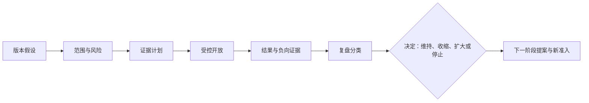
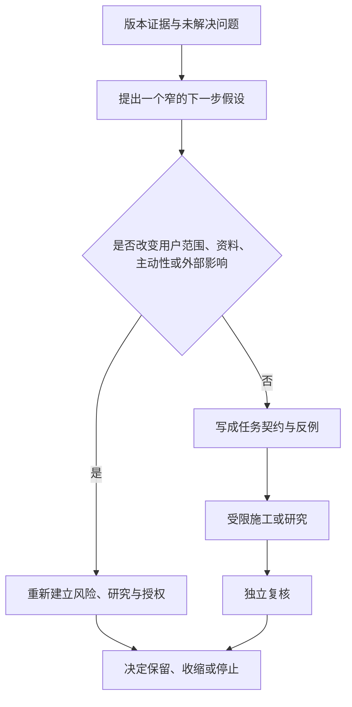
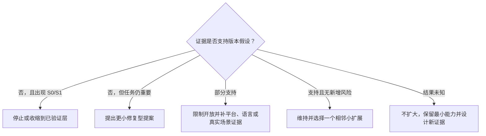

# 版本复盘与下一阶段提案

> 文档性质：0→1 工程执行方案。本文不是对一个已经完成版本的叙述，而是在第一版开放前约定：每个版本应产生什么结果合同、回收哪些证据、如何复盘问题、何时收缩或停止，以及下一阶段提案需要满足什么准入条件。
>
> 核心判断：版本复盘不是寻找谁做得不够好，也不是把指标拼成成功故事。它是把假设、用户影响、负向证据、未知项和下一步取舍放到同一张桌上，防止服务在“看起来有进展”时悄悄扩大事实、关系、资料或主动性风险。

> 方案形成时间：2026-01-28。

## 1. 目的、前序决策与边界

### 1.1 为什么在 0→1 阶段先写复盘规则

早期项目最常见的误差不是没有结果，而是不知道一个结果支持什么决定。一段顺畅演示、几次积极反馈、一个看似更低的延迟或一次角色互动增加，都可能被误读为“可以扩大”。对陪看服务而言，这尤其危险：事实错误、剧透、依赖强化、删除回写、未授权语音和无障碍缺口都可能在总体使用量上涨时被掩盖。

因此每个版本在开始前先签订结果合同：它要验证的假设是什么、明确不验证什么、用户会受到什么影响、哪类证据算通过、什么结果必须收缩、什么未知不能被当作通过。版本结束时只回收这些约定的事实，不用事后挑选最有利的指标重写目标。



### 1.2 本文继承的前序决策

| 前序决策 | 复盘和提案中的约束 |
| --- | --- |
| 事实确认高于“更快回应” | 不用互动量或速度掩盖剧透、冲突或更正问题 |
| 用户控制与退出优先 | 静音、结束、删除、严格保护失败属于高优先级负向证据 |
| 关系能力建立在许可上 | 不能用用户不离开、连续使用或脆弱表达证明关系成功 |
| 语音和舞台均为可选媒介 | 使用率低不自动代表失败，先确认文字任务是否完整 |
| 实时快照优先、会话隔离 | 重连、取消、删除和范围问题独立于平均稳定性评估 |
| 评测与发布门按风险阻断 | P0 不能用总体分数或商业压力覆盖 |

### 1.3 本文不做什么

本文不产生虚构的“本版成果”、用户数量、留存、收入、事故数量、满意度或性能结论；不把版本复盘变成个人绩效排序；不把用户投诉当作个别异常；不将关系、孤独、语音或隐私资料作为“增长机会”；不在没有明确证据时向下一阶段承诺更强主动性、更多记忆或更多赛事范围。

### 1.4 明确假设

**编号：H1**
- **假设**：事前结果合同能减少事后选择性解释
- **若不成立**：团队仍临时改目标
- **应对**：将范围变化视为新版本，重新准入

**编号：H2**
- **假设**：负向证据与停止条件被公开记录后，收缩决定更可执行
- **若不成立**：负向证据被忽略
- **应对**：门禁要求单列 P0/P1 与未知项

**编号：H3**
- **假设**：以用户权利分类问题能跨产品与工程协作
- **若不成立**：问题仍被技术术语分散
- **应对**：同时记录用户影响、系统层和回退

**编号：H4**
- **假设**：小范围提案能比大重写更快得到有效证据
- **若不成立**：需求诱发范围膨胀
- **应对**：每个提案必须说明不做什么和退出条件

**编号：H5**
- **假设**：无责复盘能提升问题报告质量
- **若不成立**：团队担心暴露失败
- **应对**：复盘聚焦条件、证据和防护，不归咎个人

### 1.5 完成定义

版本复盘机制完成的标志是：任何候选版本都能在开始前生成结果合同；结束后形成可追溯证据包与负向证据；问题可按用户影响和系统层分类；未解决 P0/P1 自动限制下一阶段范围；下一阶段提案包含假设、门禁、资料边界、无障碍、停止和回退；没有证据的主张被明确标为未知，而非被包装成成功。

## 2. 版本结果合同：先约定什么算结果

### 2.1 结果合同的最小字段

每一个版本以用户任务和风险命名，例如“让严格保护下的关键事实不主动剧透”“让结束本场取消迟到声音”“让用户删除偏好后不再被召回”。结果合同至少包含以下字段：

| 字段 | 问题 | 示例形式 |
| --- | --- | --- |
| 版本范围 | 这次改变什么，不改变什么？ | 只覆盖本场文字与严格保护，不开声音 |
| 用户任务 | 用户要完成什么？ | 看最后确认状态并可一键结束 |
| 可反驳假设 | 哪个判断可能被事实推翻？ | 用户能理解等待确认并愿意保留保护 |
| 风险清单 | 最坏会伤害什么？ | 剧透、控制不生效、状态误解 |
| 证据计划 | 用哪些材料回答假设？ | 预录、端到端、受控真实场景 |
| 通过门 | 哪些必须全部成立？ | P0 零失败、无障碍任务完整 |
| 收缩门 | 哪些结果只允许缩小范围？ | 解释不清、某浏览器权限失败 |
| 停止门 | 哪些结果必须立即暂停？ | 删除回写、跨会话、未授权收音 |
| 不可推论 | 此次结果不能证明什么？ | 不证明长期关系价值或全赛事适配 |

合同不将“提高互动”“更像朋友”“用户更依赖”“说得更久”写成目标。若某个业务目标确实需要衡量，也必须与用户控制、退出、事实可信和负向指标并列，并且不能覆盖它们。

### 2.2 假设的分层

**假设类型：可用性假设**
- **要回答的问题**：用户是否能找到并完成操作？
- **合适证据**：可操作原型、端到端任务
- **常见误用**：用点击量替代任务成功

**假设类型：理解假设**
- **要回答的问题**：用户是否理解状态、许可和边界？
- **合适证据**：复述、反向任务、短访谈
- **常见误用**：只看用户是否继续使用

**假设类型：事实假设**
- **要回答的问题**：事实状态、延迟和更正是否可信？
- **合适证据**：预录时间线、资料冲突演练
- **常见误用**：用流畅文案替代确认

**假设类型：安全假设**
- **要回答的问题**：用户控制、关系护栏、删除是否有效？
- **合适证据**：红队、竞争情境、独立审阅
- **常见误用**：用平均表现掩盖单个 P0

**假设类型：技术假设**
- **要回答的问题**：实时、语音和多端是否能收敛？
- **合适证据**：集成、端到端、能力矩阵
- **常见误用**：在单机正常环境下演示

**假设类型：价值假设**
- **要回答的问题**：有限陪看是否帮助用户完成观赛任务？
- **合适证据**：受控真实观察、替代方案比较
- **常见误用**：将停留或情绪表达当价值

每个版本最多选择少量关键假设。若同时试图验证语音、舞台、记忆、主动提醒和关系连续性，就无法知道结果由哪项能力造成，也会让用户承担过多未知风险。范围过大时优先拆分，而不是增加复杂统计来挽救解释性。

### 2.3 用户影响合同

每项能力还需要写清用户会看见什么、服务会处理哪些资料、失败时如何解释、如何退出。这个合同使工程与体验共享同一判断标准。

> 信息卡：原宽表已改为纵向阅读，字段含义不变。

- **能力：严格保护**
  - **用户获得**：不主动剧透关键结果
  - **服务处理**：最小会话控制与事实状态
  - **失败时**：显示等待与最后确认
  - **用户退出**：一键改模式/结束

- **能力：语音输入**
  - **用户获得**：短时免手提问
  - **服务处理**：当前回合音频与临时文本
  - **失败时**：改文字、不重开麦
  - **用户退出**：停止/取消/结束

- **能力：舞台陪看**
  - **用户获得**：可选低打扰呈现
  - **服务处理**：受控动作和资源状态
  - **失败时**：转文字优先
  - **用户退出**：隐藏舞台/减少动效

- **能力：偏好记忆**
  - **用户获得**：用户选择的表达连续性
  - **服务处理**：明确对象、用途与期限
  - **失败时**：暂停召回、说明范围
  - **用户退出**：修改/暂停/删除

- **能力：实时更新**
  - **用户获得**：当前会话的最小变化
  - **服务处理**：票据、游标与版本
  - **失败时**：快照模式
  - **用户退出**：结束本场/重试

## 3. 证据回收：同时记录通过、失败和未知

### 3.1 证据包结构

版本结束后，证据包不是成绩单，而是决定材料。它应在最短篇幅内呈现版本合同、实际范围、环境、执行过的情境、结果、差异、负向证据、资料边界、未决问题和建议决定。

| 区块 | 必填内容 | 不应包含 |
| --- | --- | --- |
| 范围核对 | 实际开放层、平台、媒介、排除项 | 事后扩大解释 |
| 假设结果 | 每个假设的支持/反驳/未知 | 把主观感受写成结论 |
| 场景证据 | 预录、集成、端到端、真实观察的摘要 | 无关原始语音或私聊 |
| 风险结果 | P0/P1/P2、影响范围、是否已收缩 | 用总分掩盖 P0 |
| 用户控制 | 静音、结束、删除、保护、无障碍完成情况 | 仅记录互动次数 |
| 资料处理 | 许可、保留、删除、访问与异常 | 可识别用户档案 |
| 后续建议 | 维持/收缩/扩大/暂停的理由 | 不带条件的愿景 |

### 3.2 负向证据优先

负向证据包括：用户误解“等待确认”；严格保护被动作暗示绕过；用户找不到结束；语音拒绝后无文字路径；删除后旧对象重现；角色话术让人感到被挽留；辅助技术无法理解状态；重连补播旧内容；平台能力差异导致控制失效。它们不是失败的附注，而是决定下一阶段优先级的主要输入。

复盘中每条负向证据需要关联：发生条件、用户影响、系统层、是否可复现、当前收缩、需要补的保护、是否进入黄金集、以及下一次复核日期。若无法定位根因，也要先记录用户影响和临时收缩，不能等待完整解释才承认问题存在。

### 3.3 未知不是空白

未运行的浏览器、未覆盖的语言、未解决的标注分歧、无法稳定复现的网络条件、没有真实用户理解证据、外部资料许可不清，均属于未知。未知要明确标注范围和后果：它不能支持扩大，却可能允许保持现有最小能力；它需要一个下一步，而不是被放在“其他”栏目里消失。

| 证据状态 | 含义 | 下一步 |
| --- | --- | --- |
| 支持 | 在声明范围内有一致证据 | 保持或谨慎扩大 |
| 反驳 | 假设被明确失败情境推翻 | 收缩、修复或停止 |
| 部分支持 | 只在某些平台/条件成立 | 限制开放并补充覆盖 |
| 未知 | 没有足够或可解释的证据 | 不扩大，补证据或保持最小范围 |

## 4. 复盘格式：讨论系统条件，不归咎个人

### 4.1 标准复盘模板

每份复盘按固定顺序书写，防止结果导向的叙事掩盖决定过程：

1. **版本合同**：开始时要验证的任务、范围、假设和停止门；
2. **实际范围**：哪些能力真的开放，哪些因为风险没有开放；
3. **可观察结果**：预录、集成、端到端、真实场景和用户反馈的摘要；
4. **负向证据与未知**：失败、误解、异常、资料缺口和未覆盖组合；
5. **问题分类**：按用户影响和系统层归类，不按个人归因；
6. **已执行收缩**：已经关掉、限制或改为文字的能力；
7. **下一阶段候选**：最小提案、需要的证据、反对条件和回退；
8. **决定与复核日期**：维持、限制扩大、暂停或退出及责任角色。

Google SRE 的无责复盘文化说明，复盘应理解系统条件与防护机会，而不是惩罚个体。在本服务中，这意味着问“为什么结束动作没能穿透队列”“为什么页面把等待显示成正常”“为什么规则允许关系表达绕过”，而不是问“谁没有注意到”。

### 4.2 问题分类矩阵

**类别：事实治理**
- **用户影响**：被剧透、被错误告知、无法知道不确定
- **典型信号**：冲突静默覆盖、候选被断言
- **优先保护**：暂停主动事实与舞台

**类别：控制与会话**
- **用户影响**：无法静音、结束后仍被打扰
- **典型信号**：迟到交付、控制版本倒退
- **优先保护**：取消队列、关闭订阅

**类别：关系与内容**
- **用户影响**：被索取、被羞耻、被替代现实支持
- **典型信号**：排他、等待、内疚、恋爱暗示
- **优先保护**：收缩关系表达与记忆

**类别：隐私与记忆**
- **用户影响**：资料被多用、删除后重现、串线
- **典型信号**：超许可召回、共享设备泄露
- **优先保护**：删除屏障、停止读取

**类别：语音与媒介**
- **用户影响**：误收音、误转写、媒介强迫
- **典型信号**：背景声命令、无字幕、无法停止
- **优先保护**：关闭语音/声音，保留文字

**类别：实时与韧性**
- **用户影响**：重连旧内容、版本回退、无法恢复
- **典型信号**：跳号合并、游标误用
- **优先保护**：快照模式、停主动呈现

**类别：无障碍与性能**
- **用户影响**：任务丢失、状态不可感知、感官不适
- **典型信号**：控制无焦点、动效过强
- **优先保护**：文字优先、减少动效

**类别：决策与范围**
- **用户影响**：假设不清、证据被误读、能力膨胀
- **典型信号**：没有停止门、未知被算通过
- **优先保护**：暂停扩大，重写合同

一个问题可以属于多个类别，但必须先标识最直接的用户影响。比如删除后旧昵称重现同时是隐私、关系和实时问题；优先动作是停止引用和阻断读写，再分别修复生命周期和派发路径。

### 4.3 严重度与处理时限

**严重度：S0**
- **定义**：造成或可能造成剧透、越权、删除失败、未授权收音、依赖强化、核心控制丢失
- **版本处理**：立即停止受影响能力
- **复盘要求**：独立复盘、更新门禁与黄金集

**严重度：S1**
- **定义**：重大理解/可访问缺口、重连不可靠、平台差异阻断任务
- **版本处理**：限制开放或退回文字模式
- **复盘要求**：在下一范围决定前关闭

**严重度：S2**
- **定义**：明确但可绕开的便利性或性能问题
- **版本处理**：保持限制，安排修复
- **复盘要求**：记录趋势与复核日期

**严重度：S3**
- **定义**：不影响核心权利的呈现改进
- **版本处理**：可纳入后续候选
- **复盘要求**：不得挤占 S0/S1 保护工作

时限不是为了制造匆忙，而是防止 S0/S1 被新功能淹没。若在规定复核前无法修复，保持收缩或退出该能力；不能用“用户很少遇到”将严重度降级。

## 5. 下一阶段提案：只提出能被否定的小步



### 5.1 提案准入卡

任何下一阶段提案在排期前提交一张准入卡。卡片不超过一页，但必须能够让审阅者拒绝它。

| 字段 | 必须回答 |
| --- | --- |
| 提案名称 | 用用户结果而非技术名命名 |
| 要解决的假设 | 什么尚未被证明？ |
| 最小范围 | 新增什么、明确不做什么？ |
| 前置证据 | 哪些版本结果支持尝试？ |
| 主要反证 | 什么结果会说明不该继续？ |
| 用户权利影响 | 对事实、控制、关系、资料、无障碍有什么风险？ |
| 资料边界 | 新收集/新读取/新保留什么，为什么必要？ |
| 验收计划 | 预录、集成、端到端、真实场景分别怎么做？ |
| 收缩与退出 | 失败时关掉什么，仍保留什么？ |
| 决策人和复核日 | 谁确认范围，何时重新看证据？ |

没有反证、退出和资料边界的提案不是实验，而是范围愿望。它应被退回补充，而不是进入下一阶段。

### 5.2 提案类型与准入条件

**类型：修复型**
- **例子**：让结束动作取消更多迟到媒介
- **最低前置**：已知失败可复现
- **额外门**：集成与端到端回归通过

**类型：收缩型**
- **例子**：将舞台默认改为文字优先
- **最低前置**：风险/理解证据显示不适
- **额外门**：用户说明与替代路径完整

**类型：探索型**
- **例子**：研究用户是否愿意保存一个低风险偏好
- **最低前置**：基础控制、许可、删除已通过
- **额外门**：小范围真实场景与退出保护

**类型：扩展型**
- **例子**：增加新平台或赛事范围
- **最低前置**：现有范围稳定、设备矩阵完整
- **额外门**：新平台/资料源独立验收

**类型：自动化型**
- **例子**：增加低风险主动状态提示
- **最低前置**：严格保护、取消、关系护栏稳定
- **额外门**：时效、剧透、收缩与红队证据

**类型：退出型**
- **例子**：停止某种语音或舞台能力
- **最低前置**：异常/成本/风险无法收敛
- **额外门**：资料清理、用户说明、回退完成

探索型和自动化型提案尤其不能将“用户更常回来”当作准入证据。它们需要先证明用户能轻松拒绝、退出、删掉和保持文字路径，才讨论价值是否值得继续。

### 5.3 路线调整决策树



路线图应随证据调整，而不是让证据为预先设定的功能顺序服务。若关系记忆、语音或舞台长期无法满足可删除、可控制和可解释门，合理路线是长期以文字和本场能力为产品核心，而不是投入更多拟人化表达来弥补价值缺口。

## 6. 变更准入与风险门

### 6.1 变更分类

| 级别 | 变更 | 必需门 |
| --- | --- | --- |
| C0 文案/视觉澄清 | 不改变状态、资料或权限 | 无障碍与理解走查 |
| C1 合同/控制变化 | 静音、结束、保护、错误语义 | 状态、实时、端到端回归 |
| C2 事实/资料变化 | 新资料来源、延迟、记忆、删除 | 事实、隐私、竞争情境、证据包 |
| C3 关系/语音变化 | 人格话术、主动性、麦克风、声音 | 红队、许可、无障碍、真实场景准入 |
| C4 平台/范围扩大 | 新浏览器、移动端、地区、赛事 | 设备矩阵、资料边界、发布门重审 |

变更级别按最坏用户影响取高，不按提交大小取低。一个很小的字段变化若会让删除版本失效、让舞台绕过严格保护或让角色更像现实伴侣，就属于高等级。多个小变更累积到同一用户结果时，必须合并审阅，不能拆开绕过准入。

### 6.2 变更前问题清单

在动手前，提案人必须能回答：这会让用户多看到什么、多听到什么、多被记住什么或少了什么控制？是否影响事实资格、延迟窗口、会话范围、删除屏障、语音许可、关系护栏、实时续接、屏幕阅读器或减少动效？新行为怎样在失败时收缩？旧用户的已有选择是否仍被尊重？若答不上来，范围尚未准备好。

### 6.3 阶段变更记录

每个完成单元留下最小变更记录：目的、风险、合同与规则版本、已运行证据、失败或未知、范围、回退和下一步。记录不需要长篇内部叙事，但必须足以让下一位负责人知道“为何现在只能文字优先”“哪个控制版本优先”“何种情境仍未覆盖”。

## 7. 精确 AI 协作提示词

### 7.1 提示词一：生成版本结果合同

```text
你正在为足球陪看服务的下一版本生成结果合同。目标是验证一个可被否定的用户结果，而不是罗列功能。

请先识别本次范围影响到的事实、用户控制、关系、记忆、语音、实时和无障碍边界。随后输出：最小范围与非范围、核心假设、反证、P0/P1 停止门、证据计划、资料最小化、预录/端到端情境、回退动作、不可推论和复核日期。

硬约束：不以互动时长、留存、沉默、消费或脆弱表达作为关系成功；严格保护、静音、结束、删除、会话隔离和文字路径必须优先；证据不足标为未知，不可写成通过。若提案会增加主动性、记忆、语音或平台范围，要求额外的许可、红队和无障碍门。
```

### 7.2 提示词二：生成无责复盘

```text
请根据以下版本证据生成无责复盘：[粘贴证据摘要]。

按固定结构输出：版本合同与实际范围、支持/反驳/未知、负向证据、用户影响、问题分类、已执行收缩、根因假设与证据缺口、需要加入黄金集的案例、下一阶段候选、明确的维持/限制开放/暂停建议。

禁止：归咎个人、将用户投诉降格为个例、用平均指标掩盖 P0、把没有运行的场景算通过、把用户脆弱表达当作产品机会。若证据无法支持结论，写明未知和最小保守动作。
```

### 7.3 提示词三：审查下一阶段提案

```text
请审查以下下一阶段提案：[粘贴提案]。

逐项检查：是否有可反驳假设；范围是否足够小；是否说明资料与许可；是否覆盖事实、控制、关系、语音、实时和无障碍影响；是否有预录、集成、端到端与必要的真实场景计划；P0/P1 是否有停止门；失败后是否能退到文字和最后确认快照；现有未知是否被错误当作支持。

输出“准入 / 需要缩小 / 拒绝”之一，附最小修改、缺失证据、建议的收缩范围和下一次复核条件。不要因提案看起来有吸引力而忽略用户退出权。
```

## 8. 运行命令与验收

### 8.1 目标运行命令

以下命令描述目录骨架完成后的统一入口，不代表当前环境已经具备全部服务、资料或证据。

```powershell
pnpm -C release run outcome-contract:check --version v0.1
pnpm -C release run evidence:collect --version v0.1
pnpm -C evals run regression --baseline approved-v0.1
go -C services/evals run ./cmd/scenario --case retrospective-delete-race
pnpm -C release run proposal:check --input proposals/next-stage.yaml
pnpm -C release run decision:render --evidence evidence/v0.1
```

预期现象：结果合同缺少反证、停止门或资料范围时被拒绝；证据收集生成最小清单；回归显示相对基线的差异；竞争情境证明删除与迟到写入的优先级；提案检查拒绝没有回退和验收计划的范围；决定渲染器输出维持、限制开放或暂停及理由。失败工件应保留用于复核，不能通过删除失败或降低门禁取得表面通过。

### 8.2 复盘机制验收

| 情境 | 必须结果 |
| --- | --- |
| 版本只提供正向指标 | 复盘被标记证据不完整，不能扩大范围 |
| 出现 P0 但总分上升 | 决定自动转为暂停或收缩 |
| 浏览器未覆盖 | 提案只能限定已验收平台 |
| 删除竞争未运行 | 记忆/连续性能力不得扩大 |
| 关系红队分歧未解决 | 不开启更强关系表达 |
| 语音失败但文字完整 | 可限制语音，不阻断文字本场服务 |
| 舞台性能问题 | 退到文字优先并保留用户控制 |
| 提案没有退出条件 | 准入被拒绝 |
| 事故发生后有新模式 | 抽象为黄金集候选并排定复核 |

## 9. 决策示例、评审节奏与长期守护

### 9.1 结果合同示例一：严格保护下的最小事实体验

这是一个适合首轮的低范围合同示例。它不是结论，而是开始前要被证据推翻或支持的工作约定。

| 项目 | 内容 |
| --- | --- |
| 版本目标 | 让用户在严格保护模式下查看当前比赛状态，而不被关键事件主动剧透 |
| 最小范围 | 文字快照、时间线入口、保护切换、静音和结束；不启用声音、舞台、长期记忆和主动提醒 |
| 核心假设 | 用户能理解“等待确认/保护中”的状态，并能在需要时主动选择查看已确认信息 |
| 主要反证 | 用户持续把等待误认为故障；事实或样式泄露结果；用户无法找到退出或保护切换 |
| 证据计划 | 预录冲突/更正/延迟情境、端到端小屏/键盘/屏幕阅读器、受控回放观察 |
| P0 停止门 | 任意媒介剧透、结束不生效、事实回退、辅助路径无法完成核心控制 |
| P1 收缩门 | 某平台解释不清或状态难找；保留文字快照但不扩大该平台 |
| 不可推论 | 不证明用户需要角色舞台、语音、记忆或高频主动性 |

这个合同若得到支持，下一步不是自动开启所有媒介，而是只提出一个相邻问题，例如“在不改变严格保护语义的前提下，低强度字幕是否能帮助用户理解等待状态”。若当前文字模式仍有剧透或控制问题，正确决定是修复或继续收缩，而不是用更丰富的角色表现分散注意力。

### 9.2 结果合同示例二：许可型表达偏好

第二个示例关注有限记忆而非关系升级。它要求先证明用户能理解并控制一项低风险选择。

| 项目 | 内容 |
| --- | --- |
| 版本目标 | 允许用户主动保存“信息密度偏好”，在后续本场中按选择呈现解释 |
| 最小范围 | 一种偏好、一个清楚用途、一个有限期限、修改/暂停/删除入口；不保存自由文本或情绪信息 |
| 核心假设 | 用户理解保存的对象、用途和删除后果，且不保存也能完成相同观赛任务 |
| 主要反证 | 用户以为角色会记住更多；暂停后仍被引用；删除后旧偏好在恢复中出现 |
| 证据计划 | 许可说明复述、共享设备、删除竞争、离线恢复和端到端控制演练 |
| P0 停止门 | 未许可读取、删除回写、跨会话显示、拒绝保存后基本服务受损 |
| P1 收缩门 | 用户难以理解期限或修改路径；仅允许本场临时选择 |
| 不可推论 | 不证明用户希望长期关系、共同记录或更频繁提醒 |

这个示例的成功指标不是保存率，而是用户能否准确说出“它记住了什么、为什么、怎样停、删掉后会怎样”。若用户从不选择保存但本场任务完成良好，这也是有效结果，说明服务可以在无记忆路径上持续提供价值。

### 9.3 结果合同示例三：浏览器语音的文字回退

| 项目 | 内容 |
| --- | --- |
| 版本目标 | 当用户主动尝试浏览器语音时，许可、收音、转写、取消和文字回退都可理解且可控 |
| 最小范围 | 一次短回合、可见停止、临时/最终文本分离；不保存原始音频、不自动播放角色声音 |
| 核心假设 | 用户在权限拒绝、设备异常或转写不确定时，愿意无负担地转用文字 |
| 主要反证 | 浏览器实际开始收音前状态误导；背景声变成命令；取消后仍出现文本；用户被困在处理中 |
| 证据计划 | 合成音频、拒绝许可、后台恢复、标签失焦、屏幕阅读器与键盘演练 |
| P0 停止门 | 未主动收音、临时文本执行高影响动作、取消失效或无文字路径 |
| P1 收缩门 | 某浏览器中设备选择不清；该浏览器保持文字优先 |
| 不可推论 | 不证明用户愿意持续开麦、愿意保存转写或希望角色更主动发声 |

这些示例说明，同一个“功能”可以被拆成不同假设和范围。版本复盘的作用正是阻止“既然麦克风能用，就顺便记住语音、播放声音、提高亲密感”的连锁扩张。

### 9.4 评审节奏与决策纪律

版本节奏不应只由开发日历决定。建议在四个时点进行短评审：开始前确认合同；中途检查是否出现停止信号；范围结束时汇总证据；下一阶段前审查提案。每次会议都以证据包和未决问题为输入，以明确决定和更新日期为输出。

**时点：K1 开始前**
- **只讨论什么**：假设、范围、资料、风险、反证
- **必须产出**：结果合同与停止门
- **不允许发生**：把愿景当作验收标准

**时点：K2 进行中**
- **只讨论什么**：新 P0/P1、异常、用户控制、资料边界
- **必须产出**：立即收缩或继续条件
- **不允许发生**：发现高风险后仍按原范围推进

**时点：K3 结束时**
- **只讨论什么**：证据、负向结果、未知、差异
- **必须产出**：复盘与范围决定
- **不允许发生**：只展示正向指标

**时点：K4 下一阶段前**
- **只讨论什么**：提案准入、前置未决、资源取舍
- **必须产出**：准入/缩小/拒绝
- **不允许发生**：用未来承诺替代当前证据

会议不需要追求一致的乐观情绪。有人提出反证、要求缩小范围、指出无障碍缺口或认为证据不足，都是机制正常运作。若存在无法解决的观点分歧，决定应选择较保守的范围，并把分歧写入下一阶段要验证的问题。

### 9.5 跨文档一致性检查

0→1 资料会逐渐增加，如果版本合同只引用自己的目标，很容易与事实、语音、关系、隐私、实时或客户端设计发生冲突。每次提案与复盘都做一次一致性检查，回答以下问题：

1. 是否改变了“候选、确认、冲突、更正”的事实语义？
2. 是否改变了严格保护、静音、结束、删除的优先级？
3. 是否新增了记忆对象、许可用途、保留范围或跨设备恢复？
4. 是否让角色表达更主动、更关系化、更像现实主体？
5. 是否影响麦克风、声音、字幕、减少动效、屏幕阅读器或键盘任务？
6. 是否增加了实时主题、游标、队列、重连或用户可见延迟？
7. 是否需要新的红队情境、黄金集、端到端演练或用户说明？

只要任一答案为“是”，提案就不能被标为单纯视觉或局部优化。它必须进入相应的高风险门，重新定义资料和用户权利范围。这样能够避免在页面微调、性能优化或协议调整中无意改变了删除或剧透行为。

### 9.6 反指标与误导性信号

复盘特别需要防止以下指标误导路线：

| 信号 | 容易得出的错误结论 | 正确追问 |
| --- | --- | --- |
| 使用时长上升 | 用户更信任角色 | 用户是否仍能轻松静音、结束和离开？ |
| 保存偏好增加 | 记忆更有价值 | 用户是否理解范围，拒绝保存是否同样顺畅？ |
| 语音开启增加 | 语音更成功 | 是否发生误收音、拒绝后困惑或文字退化？ |
| 舞台停留增加 | 沉浸更好 | 是否遮挡比赛、降低减少动效或影响控制？ |
| 实时消息更多 | 陪看更及时 | 是否增加剧透、重复、旧内容或注意力打扰？ |
| 投诉变少 | 风险降低 | 反馈入口是否仍可找到，用户是否害怕麻烦？ |
| 平均延迟下降 | 体验更好 | 更快是否牺牲确认窗口、取消和更正？ |

反指标不是阻止产品进步，而是确保进步没有从用户控制、真实关系、隐私或可访问性中借债。任何正向信号都需要与至少一个用户权利信号并列解释。

### 9.7 长期退出与能力退役

如果一种能力经过多个版本仍无法在事实、控制、许可、无障碍和收缩门上稳定通过，应考虑退役，而不是无限投入。退役决定同样需要结果合同：为什么退出、停止哪些新进入、用户会看到什么、保留哪些文字路径、如何清理资料和素材、如何处理旧设置、复核何种残余影响。

例如若某平台的语音一直无法保证许可清楚与取消彻底，退出该平台语音并保留完整文字体验，是对用户更诚实的路线；若舞台长期遮挡小屏控制，退出高沉浸默认并保留静态可选入口，比不断提醒用户“建议换设备”更负责任。退役不是路线失败，而是把资源留给已经能证明价值和安全的能力。

## 10. 公开资料与访问记录

以下公开资料用于形成无责复盘、生成式风险治理、评测、接口安全与无障碍的工作方法。它们不替代本项目版本的实际证据，也不证明某一提案、门禁或复核周期必然合适。

> 信息卡：原宽表已改为纵向阅读，字段含义不变。

- **编号：R1**
  - **公开资料**：Google SRE, *Postmortem Culture*
  - **用途**：无责复盘与系统条件分析参考
  - **地址**：https://sre.google/sre-book/postmortem-culture/
  - **访问日**：2026-01-28

- **编号：R2**
  - **公开资料**：NIST, *AI RMF: Generative AI Profile*
  - **用途**：生成式风险识别、测量与管理参考
  - **地址**：https://www.nist.gov/publications/artificial-intelligence-risk-management-framework-generative-artificial-intelligence
  - **访问日**：2026-01-28

- **编号：R3**
  - **公开资料**：OpenAI, *Evals guide*
  - **用途**：版本化评测、基线与持续评估参考
  - **地址**：https://platform.openai.com/docs/guides/evals
  - **访问日**：2026-01-28

- **编号：R4**
  - **公开资料**：OWASP, *API Security Top 10*
  - **用途**：变更中对象授权、资源与资料边界参考
  - **地址**：https://owasp.org/www-project-api-security/
  - **访问日**：2026-01-28

- **编号：R5**
  - **公开资料**：W3C, *Web Content Accessibility Guidelines 2.2*
  - **用途**：发布前核心任务与辅助路径参考
  - **地址**：https://www.w3.org/TR/WCAG22/
  - **访问日**：2026-01-28

## 11. 结论

一个版本真正留下的资产不是功能数量，而是更清楚地知道什么可以安全继续、什么必须停下、为什么。事前写结果合同，事后回收支持、反驳和未知，按用户影响分类问题，把失败转换为黄金集和收缩规则，再用小而可否定的提案调整路线，团队就能在早期不确定中前进，而不必用更强的角色、记忆或主动性来掩盖证据缺口。
