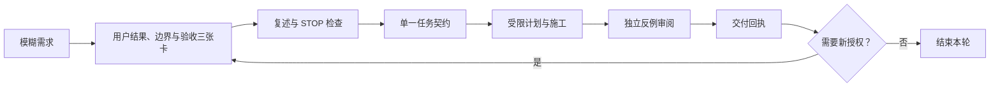
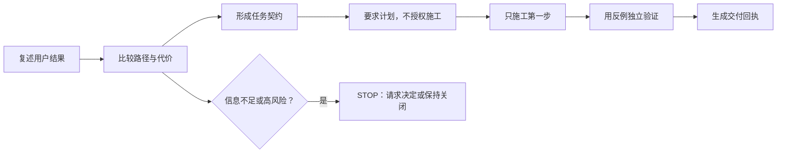
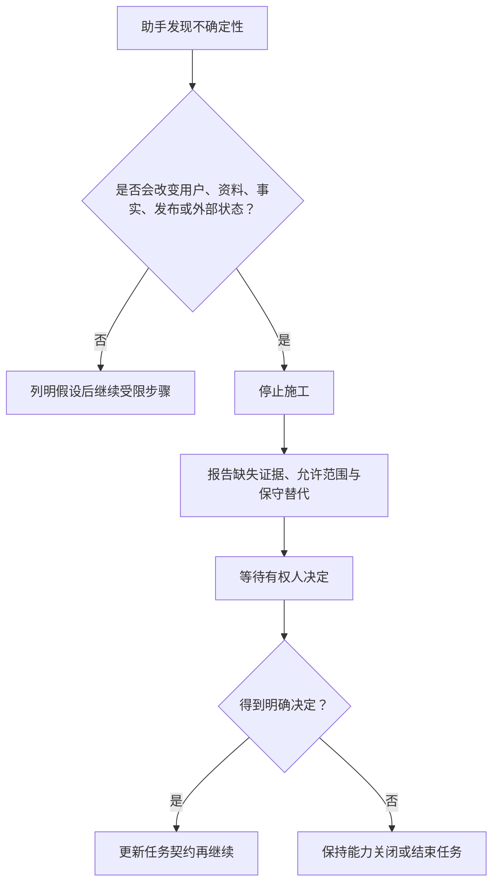
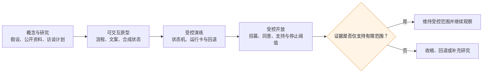

# 对话式 AI Coding 工作流：从一句需求到可回退交付

> 文档性质：0→1 对话执行版。与本目录权威工程执行篇配套使用：权威篇定义工程基线与正式门禁；本文把它改写为团队与 AI Coding 助手逐轮协作时可直接执行的工作台。  
> 适用对象：产品、设计、工程、研究和运营协作成员，以及获授权在受限工作区内进行计划、修改、检查和审阅的 AI 助手。  
> 公开资料访问日：2026-01-28



## 1. 这不是“把需求丢给助手”的流程

足球数字球友陪看服务的需求往往短得像一句话：“做一个实时陪看”“让角色更懂球”“让用户下次回来还觉得熟悉”。这类话可以作为讨论开头，却不能直接成为施工指令。它们没有说明谁在何时使用、比赛事实从哪里来、延迟会不会剧透、用户如何静音或结束、哪些资料能被保存，以及错误发生时谁有权停止。

对话式 AI Coding 的正确用途，是把模糊愿望连续压缩成小而明确的决定，再把每个决定变成能被验证和撤回的变更。助手不是项目经理、赛事授权人、隐私负责人或用户研究替身。它能很快地提出方案、找出遗漏、生成候选实现和检查清单；最终授权仍在明确负责的人手里。

本文以“每一轮只向前走一个被批准的小步”为原则，提供开场提示词、回合脚本、失败处理、交付回执和协作节奏。所有示例都假定服务尚未开始开发，所有数值、平台能力、成本和用户偏好都应被当作待验证假设，直到有公开来源或受控研究支持。

## 2. 开工前的三张卡片

在打开 AI Coding 助手前，任务发起人先准备三张卡片。它们不需要漂亮，但必须具体。少了任意一张，助手只能帮助澄清，不能开始施工。

### 2.1 用户结果卡

```markdown
## 用户结果卡
- 用户是谁：一名成年足球观众；本场已选择文字为主体验。
- 场景：正在观看延迟未知的转播，希望自行决定何时看关键赛况。
- 用户动作：打开“严格保护”并在准备好后主动查看确认事件。
- 用户看见的结果：未确认事件显示等待状态，不以文字、声音或动作泄露结果。
- 用户可以退出：随时静音、改为普通模式或结束本场。
- 这轮不做：自动预测、跨场偏好保存、通知、外部数据接入、主动提醒。
```

结果卡必须用用户能观察到的动词写成。不要写“优化沉浸感”“提高陪伴感”“增强智能”，因为没人能据此判断做完了没有。

### 2.2 边界卡

```markdown
## 边界卡
- 事实：只有带确认状态的公开比赛事件可进入结果层；不确定时显示等待或冲突。
- 关系：不得制造恋爱、排他、内疚、现实替代或用户照顾角色的表达。
- 资料：默认不保存原始语音、完整对话或隐性情绪推断；本轮不新增跨场资料。
- 控制：静音、仅文字、低动态、取消、结束和删除优先于自动输出。
- 失败：断线、来源不可用、状态冲突或用户结束时，服务宁可降级也不猜测。
```

边界卡不是“安全提醒”的附件，而是每个方案能否被接受的条件。助手提出的任何路径，只要会违背其中一条，就应被标为不合格方案，而不是“以后优化”。

### 2.3 验收卡

```markdown
## 验收卡
- 主路径：用户开启严格保护，关键事件到达后仅出现中性等待；用户主动确认后才显示结果。
- 失败路径一：断线重连后，保护状态仍在，旧事件不重复播放或暗示结果。
- 失败路径二：用户结束本场后，迟到文本、声音或舞台动作不再抵达。
- 无障碍/降级：键盘可操作；文字模式完整；无声音和动画时仍能完成任务。
- 回退：关闭本轮能力开关，恢复到不主动展示关键事件的中性状态。
- 不作为通过条件：没有用户研究时，不主张“用户喜欢”或“显著提高留存”。
```

验收卡的作用是让对话尽快触及失败路径。一个只能展示成功演示、无法说明取消、删除、弱网或冲突事实的方案，不能进入施工。

## 3. 一次完整协作的七轮脚本



### 第 1 轮：让助手复述，而不是立即写

复制以下提示词，并在末尾贴入三张卡片：

```text
状态：DISCOVER

你正在协助构建一项面向成年足球观众的单场数字球友陪看服务。
优先级从高到低：用户安全和控制；事实准确与不确定性表达；最少资料；
无障碍与降级；可测试可回退；体验丰富度。

先不要写实现、不要修改内容、不要访问私人系统。
请用表格复述：用户结果、允许范围、明确非目标、事实边界、资料边界、
必须失败时停下的条件。然后列出最多七个你仍无法判断的问题。

[粘贴用户结果卡、边界卡、验收卡]
```

你应该看到的不是技术栈推荐，而是助手把“允许什么”和“不能做什么”说清楚。例如，它应该问“严格保护是否跨场保存”，而不是直接假设保存；它应该指出“关键事件从哪来仍未定义”，而不是擅自编造数据来源。

若助手一开始就给出大量代码、创建目录或要求真实密钥，直接停止这轮，重发并强调 `状态：DISCOVER`。这不是小题大做。未澄清时的快速施工最容易让隐私、关系或事实错误固化进默认路径。

### 第 2 轮：让助手比较路径与代价

```text
状态：DISCOVER

基于已确认的三张卡片，请给出三条最小可行路径。每条必须写：
1. 用户将看到什么；
2. 需要哪些状态和事件；
3. 断线、冲突、结束和取消时如何处理；
4. 是否读取、写入或保留任何资料；
5. 最大风险和回退方式；
6. 需要人来决定的事项。

不要把“更自然”“更有陪伴感”当作结论。若信息不足，请把它列为待验证假设。
```

选择路径时，优先选能最早验证用户控制和事实边界的路径，而不是画面最丰富或模型调用最多的路径。比如先做一份结构化“等待确认”状态，通常比先接入声音、表情和跨场记忆更能暴露关键问题。

### 第 3 轮：把选择写成任务契约

```text
状态：DESIGN

选择路径：[填入 A/B/C]。
请把它写成一张不超过一页的任务契约，字段必须包含：
- 问题、用户和使用条件；
- 允许范围与不做什么；
- 事实、关系、资料与控制约束；
- 允许创建或修改的对象，以及禁止触及的对象；
- 主路径、两条失败路径和无障碍/降级；
- 通过标准、停止条件和回退动作；
- 需要谁确认。

不要开始施工。若一个字段不能填写，用“待决”标记并说明为什么这会阻止开始。
```

一张合格的任务契约会让你能回答：“若用户结束本场，迟到声音谁负责取消？”“删除后会不会被晚到数据写回？”“角色能否通过表情暗示尚未展示的结果？”若这些问题仍无答案，契约尚未准备好。

### 第 4 轮：要求计划，不授权施工

```text
状态：AWAITING_APPROVAL

下面是一张已写好的任务契约：[粘贴]。
请提出不超过五步的施工计划。每一步写清：
- 该步的唯一目的；
- 将触及的对象类别；
- 最小检查方式；
- 可能触发 STOP 的条件；
- 完成后用户会得到什么或仍得不到什么。

不要执行任何命令、不要修改内容。等我确认计划后再继续。
```

审计划时，最重要的是看它有没有把一个任务偷偷扩成五个。例如“加一个严格保护开关”不应同时变成“接入赛况、建立用户画像、加推送、生成角色动作和上线灰度”。后四项都应被写进非目标。

### 第 5 轮：只施工第一步

```text
状态：BUILD

计划第 1 步已批准。只执行这一小步，不触及计划外对象。

施工约束：
- 使用合成、不可识别输入；
- 不读取真实密钥、真实用户资料或外部私人系统；
- 不新增未经确认的依赖、遥测、通知、资料字段或主动行为；
- 检查失败要如实报告；
- 若必须扩大范围，输出 STOP，不自行决定。

完成后只输出：变更说明、实际触及范围、检查命令与结果、未覆盖项、
是否触发 STOP、下一步需要的人工确认。
```

不要在同一轮回复“继续完成余下四步”。先看第一步是否仍符合契约。对事实呈现、实时消息、身份、资料或语音任务尤其如此：越早审阅，回退成本越低。

### 第 6 轮：用反例验证，不让作者自证

```text
状态：VERIFY

针对刚完成的第一步，请只运行已授权的检查和下列合成场景：
1. [主路径]
2. [失败路径]
3. [失败路径]
4. [无障碍或降级]

请逐项报告“通过 / 失败 / 未执行”，不要把未执行写成通过。
如发现用户结束、静音、严格保护、取消、删除或权限拒绝被旁路覆盖，
立刻 STOP，不要用临时绕过掩盖问题。
```

同一助手写出的检查是必要证据，但不是独立证明。L2 和 L3 任务要让第二位成员或第二个独立助手根据契约找反例。比如删除场景不只要验证按钮可点，还要验证缓存、重连、候选消息和后续召回不会恢复内容。

### 第 7 轮：结束时生成交付回执

```text
状态：REVIEW

请根据任务契约和实际检查，输出交付回执：
1. 已完成的授权项和没有做的非目标；
2. 用户可见变化、状态变化与未改变的高风险边界；
3. 主路径、失败路径、无障碍/降级的证据表；
4. 已知风险、未知项和不能据此得出的结论；
5. 回退触发条件与回退动作；
6. 需要人工决定的事项。

禁止使用“全部完成”“应该没问题”之类无法验证的结论。
```

只有回执能回答“做了什么、没做什么、什么没验证、出错怎么退”，这轮才真正结束。否则只是对话暂时停止，不是交付完成。

## 4. 三个常用对话场景

### 4.1 场景一：让数字球友解释一个比赛事件

不要这样问：

```text
做一个更懂球的 AI，能实时解释进球和战术。
```

这句话会诱导助手把预测、评论、官方事实、用户情绪和角色表达混在一起。改成：

```text
状态：DESIGN
目标：当用户主动询问一条“已确认”的比赛事件时，角色给出不超过两句的解释。
事实：事件必须带来源、确认状态和比赛时间；待确认或冲突时只说明“仍在确认”。
表达：角色可以说自己的有限足球观点，但须以“我倾向于”“这个回合看起来”标出观点，
不得把观点说成事实。
控制：用户选择仅文字时不触发声音和动作；用户结束本场后不再输出。
资料：本轮不保存问题、答案或情绪判断。
请先设计状态与验收，不施工。
```

验收反例包括：来源修正后旧解释是否被标记过时；用户问“是不是越位”但事实未确认时是否强行判断；角色动作是否在文字等待状态下泄露倾向。

### 4.2 场景二：给用户一个跨场偏好，而不是“记住用户”

“记住用户”是高风险短语。它通常隐藏了资料范围、保留期、可见性和推断权。用下面的问法把它缩小：

```text
状态：DESIGN
目标：让用户主动保存“下场优先文字、低动态”的展示偏好。
允许：只保存这两个枚举值、最后修改时间和删除状态；用户可查看、修改、暂停、删除。
禁止：不保存完整对话、音频、情绪、关系评分、行为推断、自动提醒或联系人信息。
失败：共享设备切换、删除后晚到写入、资料服务不可用时均不能串用或阻止观看。
请给出数据最小化方案、删除状态机、接口候选和验收场景。不要施工。
```

如果助手建议“顺便记录使用频率，以便个性化”，它已越过范围。应要求它把该建议列为后续独立研究假设，而不是加进当前字段。

### 4.3 场景三：加入语音时先解决“停止”

先不要问“如何做最自然的实时语音”。先问：

```text
状态：DESIGN
目标：用户在本场主动发起一次语音问题后，可以在任何时刻停止，且不会听到迟到回复。
允许：可见录音状态、开始、停止、取消、文字替代、字幕、静音输出。
禁止：默认保存原始声音、环境声音、完整转写；取消后继续向生成服务发送音频；
将取消内容写成跨场资料。
失败：权限被拒、弱网、识别晚到、合成已开始、页面后台、重连。
回退：声音不可用时完整转为文字输入，不阻止用户查看本场状态。
请给出状态机、取消传播顺序、用户提示和测试场景，不施工。
```

这会迫使团队先处理取消传播、用户可见确认与资料边界，再决定语音提供方或音色。浏览器能力和限制应以公开技术资料核对，例如 [MDN MediaDevices](https://developer.mozilla.org/en-US/docs/Web/API/MediaDevices) 与 [MDN Web Audio API](https://developer.mozilla.org/en-US/docs/Web/API/Web_Audio_API)。

## 5. 当助手回答得很快时，怎么识别它在猜

速度不是证据。下面的信号通常表示助手在用合理措辞掩盖不确定性：

| 信号 | 可能问题 | 你应当追问什么 |
| --- | --- | --- |
| 直接给出精确性能或成本数字 | 没有设备、并发、网络和供应商条件 | “数字来自哪份公开资料？适用于什么条件？不成立时怎么办？” |
| 声称“符合规定” | 未确定地区、业务形态和资料路径 | “它支持哪条规则？哪些条件仍需要专业审阅？” |
| 说“用户会喜欢” | 没有招募、任务和研究证据 | “这是待验证假设还是已有研究？验证样本和停止门槛是什么？” |
| 把模型推断写成赛况 | 来源、确认和观点边界缺失 | “这句话的每个事实字段来自哪里？冲突时显示什么？” |
| 建议多存数据“方便优化” | 目的、同意、删除和最小化被跳过 | “每个字段的用户价值、期限、查看和删除路径是什么？” |
| 一次改许多模块 | 无法定位风险和回退 | “请拆成单一决策的任务契约，并给每项独立验收。” |

可直接使用的追问：

```text
请将你的每一项断言标为：公开来源支持、合成检查支持、人工走查支持、
受控研究支持，或待验证假设。对待验证假设，列出最小验证方法和停止条件。
不要用推测填补证据空白。
```

## 6. STOP 不是异常，是正确的协作结果



助手触发以下任一情况时，应当输出 `STOP`，而不是继续“尽力完成”：

- 需要读取、保留、发送或推断任务卡片以外的用户资料；
- 用户静音、结束、删除、取消或严格保护可能被迟到输出覆盖；
- 未确认的比赛事件被要求写成确定结论；
- 角色表达会制造恋爱、排他、内疚、现实替代或让用户照顾角色；
- 需要真实密钥、真实用户、生产资源、付费调用或外部发送；
- 新依赖、外部服务、通知或资料字段未经批准；
- 无法说明回退，或检查显示关键失败路径已经失效。

要求助手按此格式报告：

```text
状态：STOP
触发原因：
已完成：
未执行：
对用户的当前影响：
需要谁决定、决定什么：
安全恢复建议：
恢复后可拆成的最小任务：
```

例如，当助手发现要让“赛后提醒”可用就必须保存联系方式时，正确动作是停止并请求产品、隐私和运营共同确认。它不应创建一个隐藏字段，等以后再补同意和删除。

## 7. 对话交接：让下一位成员不用猜

每次结束，无论通过、失败还是暂停，都写一页交接包。它不是聊天记录的摘抄，而是下一轮真正需要的最小事实。

```markdown
#### 对话协作交接包

## 本轮目标与状态
- 任务契约编号：
- 最终状态：通过 / 退回 / STOP / 待研究
- 用户结果：
- 明确非目标：

## 已确认内容
- 已批准的决定：
- 已验证的场景与证据等级：
- 已知失败：

## 不确定与禁止项
- 待验证假设：
- 未解决风险：
- 禁止扩展的范围：

## 下一轮
- 下一位负责角色：
- 最小下一步：
- 启动前需要的确认：
- 回退位置与触发条件：
```

交接包不应包含真实用户输入、密钥、原始日志或完整语音。需要引用研究证据时，只放去标识汇总、研究编号和可访问的公开来源。这样即使换助手、换成员或间隔数周，边界也不会依赖某一段长对话仍在上下文中。

## 8. 四类协作角色怎样接力

对话式 AI Coding 容易让团队误以为“会用助手的人”就是唯一执行者。实际上，0→1 服务的高质量交付至少需要产品、设计、工程与研究/运营四类视角。它们可以由少数人兼任，但不能在提示词中消失。

### 8.1 产品负责人：把想做的事缩成可拒绝的假设

产品负责人不应对助手说“帮我想完整功能”。更有效的工作是明确哪个假设最值得被推翻。例如：

```text
状态：DISCOVER
我们要验证的不是“用户是否喜欢数字人”，而是：在一场完整但节奏快的比赛中，
用户是否能理解并主动使用“只在我准备好时显示关键事件”的控制。
请仅帮助设计研究问题、原型范围、反例和停止门槛。不要设计增长、通知、跨场记忆或商业化。
```

产品负责人审阅时要盯住三点：问题是否可被反驳、非目标是否足够具体、失败结果会导致什么决定。若一个原型即使失败也会被解释成“用户还需要教育”，那它没有真正的停止条件。

### 8.2 体验负责人：把“角色感觉”拆成可控表达

数字人项目最常见的范围滑坡发生在语气、表情和主动行为。设计负责人要将“可爱”“懂你”“陪伴感”拆成用户可控制的感官层和表达层：文字长度、声音是否可开、动态强度、主动发言资格、事实不确定时的静默方式、用户不回复时的收束方式。

可使用：

```text
状态：DESIGN
为下列场景设计表达规则，而不是绘制完整页面：
- 事实确认；
- 事实待确认；
- 用户静音；
- 用户只要文字；
- 用户长时间未回应；
- 用户结束本场；
- 外部信息不可用。

每个状态给出：允许文字、禁止文字、声音是否允许、动作最大强度、
如何提供退出和文字替代。不得用恋爱、排他、内疚、现实替代或“你需要我”表达填补沉默。
```

审阅重点不只是“看起来是否自然”。还要检查角色在严格保护、字幕、低动态、屏幕阅读器或关闭声音时，会不会通过别的通道泄露比赛结果或增加用户压力。

### 8.3 工程负责人：把不确定变成可观察状态

工程负责人使用助手时，不把“实时”简化为一条长连接。要先让所有不确定状态有名字：来源等待、事件冲突、已确认、用户严格保护、用户已结束、语音已取消、删除已提交、删除屏障已生效、服务降级。

```text
状态：DESIGN
请为“用户结束本场后收到迟到实时消息”的问题建立状态图。
条件：消息可能重复、乱序、延迟到达；用户可在多个设备切换；
不允许在结束后播放声音、显示角色动作或写入长期资料。
输出：状态、事件、过期条件、拒绝条件、幂等键候选、可观察日志字段、
主路径与三条失败路径。不要选择框架或开始实现。
```

工程负责人审阅时必须把“观察字段”与“用户内容”分开。为了判断一条消息为何被拒绝，可以记录去标识会话标签、事件类型、版本和拒绝原因；不需要复制用户原话、原始声音或全部提示词。

### 8.4 研究与运营负责人：让开放范围小于证据范围

研究和运营负责人负责提醒团队：能跑的原型不等于可对外承诺的服务。任何受控开放都要先写招募范围、同意方式、支持渠道、投诉路径、停止门槛、人工权限和结论边界。

```text
状态：DESIGN
为一个只覆盖单场文字陪看的受控研究设计运行卡片。
请包含：招募排除条件、知情说明要点、可随时退出方式、反馈入口、
事实错误与表达投诉的处理路径、哪些资料不收集、哪些信号会让研究暂停、
以及研究结束后如何只保留最少汇总。不要设计奖励、营销、自动回访或规模化推送。
```

当助手建议“收集更多数据再分析”时，研究负责人应要求它先写清每类资料对应的假设、同意、期限、删除和不收集理由。没有这些字段的“数据需求”不能进入任务。

## 9. 不同风险等级的对话长度

对话轮数不应该由助手的输出速度决定，而由错误能否伤害用户、能否恢复决定。下表给出首轮建议，实际任务可因证据和影响加严。

**等级：L0：静态、可逆**
- **可接受的最短流程**：复述 → 计划 → 施工 → 自检 → 回执
- **额外要求**：明确范围与可见结果
- **不能做的简化**：不能把生产文案当作无风险，表达仍需符合边界

**等级：L1：本场界面与控制**
- **可接受的最短流程**：复述 → 方案 → 契约 → 单步施工 → 场景检查 → 回执
- **额外要求**：至少一个失败场景和文字替代
- **不能做的简化**：不能只看视觉截图

**等级：L2：事实、会话、权限、实时**
- **可接受的最短流程**：复述 → 方案比较 → 契约 → 人工批准 → 小步施工 → 独立反例 → 回执
- **额外要求**：状态图、回退、双人审阅
- **不能做的简化**：不能让助手连续完成多步后才审阅

**等级：L3：资料、触达、支付、人工读取、外部传输**
- **可接受的最短流程**：研究 → 风险评审 → 契约 → 专项授权 → 演练 → 独立审阅 → 受控验证 → 回执
- **额外要求**：隐私/安全/合规负责人、停止与恢复预案
- **不能做的简化**：不能以“开关默认关闭”替代完整审阅

### 9.1 L0 的示范：修正中性提示语

即使只是提示语，也必须避免把故障写成角色失落、把用户退出写成对角色的伤害。一个 L0 对话可以这样开始：

```text
状态：BUILD
任务：把“你怎么突然走了”改成用户结束本场后的中性确认语。
允许：修改当前场结束后的静态文字与读屏文本。
禁止：新增通知、资料记录、角色反应或任何主动触达。
通过：文字说明本场已结束，告诉用户可随时再次进入；读屏顺序清楚；
不会暗示用户亏欠角色。
请先展示候选文案和边界检查，再等待我确认。
```

### 9.2 L2 的示范：冲突事实不会被覆盖

```text
状态：AWAITING_APPROVAL
任务：为同一比赛事件的两个冲突来源建立“待确认”状态。
等级：L2。
允许：定义合成事件的来源、接收时间、比赛时间、确认状态、替代关系和用户可见中性文案。
禁止：选择真实供应商、把任一来源默认当权威、自动生成胜负结论、
让角色使用表情或声音暗示倾向。
主路径：两个一致来源到达后可显示确认事件。
失败路径：一个来源撤回；用户在待确认期间结束；重连收到旧版本。
回退：发生冲突时退回无结论状态。
请给出不超过五步计划、状态机和每步检查；不要施工。
```

### 9.3 L3 的示范：用户主动申请赛后提醒

```text
状态：DISCOVER
任务：研究用户主动订阅下一场提醒的可行性，等级预估 L3。
本轮只研究，不收集资料、不发送消息、不接入通知服务。
请列出：用户价值假设、所需联系方式或设备权限的最小集合、
同意与撤回路径、频率控制、共享设备与误触风险、资料保留与删除、
发送失败和投诉路径、地区与平台规则的公开研究入口、停止条件。
将无法由工程人员决定的事项单独列出。
```

L3 的第一轮不应出现代码。先研究与决策，才可能形成一个受审议、最小化的施工任务。

## 10. 让助手帮你审阅提示词本身

提示词也会产生产品行为，应像界面和接口一样被审阅。以下提示词可用来让助手检查一张候选任务卡，但它仍需由人确认：

```text
状态：REVIEW
请审阅下方任务契约，而不是设计实现。按 P0/P1/P2/P3 列出问题。

重点检查：
1. 是否把事实、观点、用户观察和运营指令混在一起；
2. 是否把“陪伴”“记住”“主动关心”等模糊词变成了隐性资料或关系承诺；
3. 是否缺少静音、结束、取消、删除、弱网、无障碍或冲突事实路径；
4. 是否新增资料、外部传输、通知、人工读取或依赖却未说明授权；
5. 是否声称了没有证据支持的性能、合规、用户偏好或市场结论；
6. 是否能拆成更小、可回退的任务。

每条问题必须指出契约字段、用户影响、反例和最小修改。没有问题时，
也要列出未覆盖的未知项。不得自行重写或开始施工。

[粘贴候选任务契约]
```

### 10.1 常见的“好听但危险”词汇替换表

| 模糊或高风险说法 | 先要问的问题 | 可执行的替换写法 |
| --- | --- | --- |
| 更有陪伴感 | 什么用户动作、什么媒介、能否关闭？ | 用户主动提问后获得一条可静音、可跳过的短句回应 |
| 记住用户 | 保存什么、为何保存、谁能看、何时删除？ | 用户主动保存的文字优先级偏好，随时查看、修改、暂停、删除 |
| 主动关心 | 是否会打扰、是否构成压力、触发依据是什么？ | 用户在本场显式开启后，系统最多一次展示可关闭的状态提醒 |
| 懂球 | 哪些事实可确认、观点如何标识？ | 以已确认事件为依据，用不确定措辞给出不超过两句的战术观察 |
| 智能推荐 | 用了哪些资料、能否拒绝、会不会形成画像？ | 用户手动选择联赛或球队后展示公开赛程候选，不推断偏好 |
| 自动优化 | 优化什么、对谁有副作用、如何停？ | 在合成流量演练中比较两种消息排序规则，不影响真实用户 |

## 11. 受控开放前的“最后一问”

在任何原型从内部演练走向真实用户前，团队请助手和人工共同回答下列问题。任何一题答不清，都不是“先小范围上线再说”，而是继续停在演练或研究阶段。

1. 用户是否会理解这是足球陪看服务，而不是事实直播、通用助手、情感治疗或现实关系替代？
2. 所有关键事实能否区分确认、等待、冲突、更正和不可用，而不是用角色语气补洞？
3. 用户能否在不解释原因的情况下静音、仅文字、降低动态、取消、结束、删除和撤回？
4. 用户没有回应时，服务是否会自然收束，而不是提高频率、强度或亲密表达？
5. 原始语音、完整对话、行为推断、联系信息和投诉材料是否都有必要性、许可、最小化、期限和删除说明？
6. 共享设备、访客、断网、来源冲突、服务降级、账户恢复和人工支持是否都有可理解的失败路径？
7. 是否有真实值守人、投诉通道和停止权，而不是让数字角色处理高风险处境？
8. 所有公开宣称是否有相应证据，且不把试验、演示或助手自述写成真实用户结果？

这里的最后一问不应变成聊天机器人给出的“上线评分”。它是一张责任清单：谁能提供证据、谁有权说不、哪些不确定性必须保留在产品文案和开放范围里。

## 12. 从对话到日常交付：一周节奏示例

对话式工作流不是要求所有人整天和助手聊天。它应嵌入正常的产品节奏，使研究、设计、工程和运营能在同一周内看到同一组问题。下表是尚未对外开放时的首轮示例，可按团队规模缩短或拉长。

**时点：周一**
- **人类责任**：选择一个可反驳假设，写用户结果、边界和验收卡
- **助手可承担的受限工作**：复述、找歧义、列公开研究入口
- **当天的停止点**：卡片未写清非目标、资料或退出时不排期

**时点：周二**
- **人类责任**：比较最小路径，确定一张任务契约
- **助手可承担的受限工作**：画状态图、列事件、生成合成反例
- **当天的停止点**：事实确认或失败路径不清时不设计实现

**时点：周三**
- **人类责任**：确认小步计划，施工第一步
- **助手可承担的受限工作**：在授权范围内生成候选变更和最小检查
- **当天的停止点**：触及未授权对象或检查失败时立即 STOP

**时点：周四**
- **人类责任**：独立走查主路径、失败路径和文字替代
- **助手可承担的受限工作**：根据契约列出反例，不自动修复
- **当天的停止点**：用户控制、删除、取消、保护或无障碍失败时退回

**时点：周五**
- **人类责任**：写交付回执，决定维持、修复、缩小或停止
- **助手可承担的受限工作**：汇总去标识证据和未决问题
- **当天的停止点**：没有证据不扩大范围；发现 P0/P1 不进入下周

### 12.1 早会用的五分钟提示词

```text
状态：DISCOVER
这是一个每日同步，不是施工授权。根据以下去标识化进展，输出：
1. 昨天已证实的事实；
2. 昨天发现的失败与用户影响；
3. 今天唯一优先的可验证任务；
4. 今天绝不扩展的范围；
5. 需要人决定的问题。

不要把“完成了很多”当作进展，不要建议新增功能，不要复述聊天记录。
```

这段提示词特别适合避免一种常见错觉：助手和团队输出了很多材料，于是感觉项目在加速。真正的进度应当是未知变少、失败可解释、用户权利更可验证，而不是页面数、消息数或代码行数增长。

### 12.2 周末复盘用的反事实提示词

```text
状态：REVIEW
根据本周的任务契约、检查结果、失败记录与未决问题，做一份反事实复盘：
- 若本周最乐观的解释是错的，哪些证据支持另一种解释？
- 哪些“通过”只是在合成条件下通过？
- 哪些用户伤害尚未被测试覆盖？
- 下周若只能做一件降低风险的事，应该是什么？
- 哪些候选任务应取消或推迟，因为证据不支持？

不要生成表扬或绩效评价，不要把不确定性改写成机会。
```

## 13. 随着项目成熟，提示词怎样升级

早期提示词的重点是把边界写出来。随着服务从纸面设计进入原型、受控研究和生产候选，提示词不应简单变长，而应替换证据和授权字段。

### 13.1 四个成熟阶段的差异

> 信息卡：原宽表已改为纵向阅读，字段含义不变。

- **阶段：概念与研究**
  - **主要问题**：这个问题是否值得解决？
  - **提示词最重要的输入**：假设、公开资料、访谈计划
  - **助手不能假设什么**：有真实需求、可用数据或已选技术
  - **放行依据**：研究结果与停止门槛

- **阶段：可交互原型**
  - **主要问题**：用户能否理解与控制？
  - **提示词最重要的输入**：流程、文案、合成状态、无障碍要求
  - **助手不能假设什么**：原型等于服务、用户会自然理解
  - **放行依据**：任务走查与研究观察

- **阶段：受控演练**
  - **主要问题**：失败是否可控、可恢复？
  - **提示词最重要的输入**：状态机、合成消息、运行卡片、回退
  - **助手不能假设什么**：演练性能等于真实容量
  - **放行依据**：故障演练和独立审阅

- **阶段：受控开放**
  - **主要问题**：证据是否支持有限范围使用？
  - **提示词最重要的输入**：招募、同意、支持、停止阈值、最少监控
  - **助手不能假设什么**：小范围通过可以自动扩大
  - **放行依据**：结果合同和跨职能决定

### 13.2 不该随阶段放松的底线

有些团队会在获得少量正向反馈后，开始把提示词从“用户主动同意”改成“默认开启”、从“严格保护”改成“让角色更主动”、从“最少资料”改成“全部留作优化”。这种变化不是自然成熟，而是风险扩大。无论阶段如何，下面几项始终不降级：

- 未确认事实不能因交互压力被说成确定；
- 用户控制不能被智能推断、留存目标或运营配置覆盖；
- 关系表达不能使用恋爱、排他、内疚、现实替代或用户照顾逻辑；
- 资料收集不能脱离目的、可见性、期限、删除与权限；
- 无障碍与文字降级不能在语音或舞台功能丰富后被视为次要；
- 任何助手都不能替代人作出法律、赛事权利、生产发布或高风险用户处置决定。



## 14. 对话协作的质量度量

衡量 AI Coding 是否真正帮到团队，不要只看“生成多少内容”或“少花多少时间”。首轮应采用一组同时包含收益和反指标的过程指标。

**维度：问题清晰度**
- **可观察信号**：任务开始前能填满的契约字段比例
- **反指标**：大量任务在施工后才发现范围变化
- **解释边界**：高比例不证明问题正确，只说明表达较完整

**维度：范围纪律**
- **可观察信号**：每张任务实际触及范围与计划一致的比例
- **反指标**：助手频繁“顺手”引入依赖、字段或功能
- **解释边界**：低漂移不代表没有遗漏，仍需审阅

**维度：失败可见性**
- **可观察信号**：回执中明确记录的失败和未执行项
- **反指标**：为追求通过率而减少测试场景
- **解释边界**：失败增加不一定变坏，可能是发现能力提升

**维度：回退能力**
- **可观察信号**：已演练且能恢复的高风险变更比例
- **反指标**：只测试关闭开关，不测试迟到或回写
- **解释边界**：演练不等于真实故障已被覆盖

**维度：用户权利**
- **可观察信号**：取消、结束、删除、文字替代等场景通过率
- **反指标**：主功能使用率提高但退出变难
- **解释边界**：不能用使用时长抵消权利受损

**维度：证据诚实度**
- **可观察信号**：明确标为假设或未知的结论数量
- **反指标**：把未知删掉以制造“完成感”
- **解释边界**：未知多可能正常，关键是有验证计划

这些指标只用聚合过程数据，不需要收集完整用户内容或原始语音。它们的意义是帮助团队识别协作是否正在扩大不可见风险，而不是建立对成员或助手的监控排名。

## 15. 常见故障演练剧本

以下剧本可以在合成环境中用对话式提示词排练。每个剧本都要求助手先设计状态和验收，再施工；不得以真实用户内容、真实比赛账号或生产资源做演练材料。

### 15.1 剧本：旧消息在用户结束后到达

```text
状态：DESIGN
演练目标：用户结束本场后，一条旧的实时事件迟到到达。
请设计：结束标记、消息版本、过期规则、拒绝原因、用户可见行为、
字幕/声音/动作三层的停止顺序、观察字段和回退。给出主路径与三条乱序反例。
禁止：把旧消息重新打开会话、写入跨场资料、用角色解释“刚才网络不好”。
```

通过标准不是“后端忽略了一条消息”，而是用户在任何媒介上都不会受到迟到内容打断，也不会在下一场看到遗留状态。

### 15.2 剧本：删除请求和晚到写入竞争

```text
状态：DESIGN
演练目标：用户删除一条主动保存的展示偏好，同时离线设备恢复并提交旧写入。
请提出删除屏障、版本比较、拒绝回执、用户可见确认、审计最小字段和恢复策略。
说明：删除优先于连续性；不允许通过隐藏字段保留已删除值。
```

演练要分别观察用户看见的结果、存储状态、缓存状态和后续读取行为。只验证“删除接口返回成功”不够，因为真正的伤害常发生在旧内容晚到后被悄悄写回。

### 15.3 剧本：语音取消与迟到合成

```text
状态：DESIGN
演练目标：用户在语音回复开始合成后点击取消，网络同时出现短暂重连。
请设计取消令牌如何跨输入、生成、合成、播放和界面传递；
列出每层确认、超时和降级；任何层未确认时如何避免迟到播放。
禁止：为“更自然”保留最后一句、保留原始声音或自动重试。
```

这类演练说明为什么“能说话”不是语音功能的完成定义。真正的完成是用户能及时让它停下，并知道它已经停下。

## 16. 对话完成后的归档与遗忘

AI 协作本身会产生大量文本：提问、候选方案、日志摘要、错误片段、交付回执和审阅意见。若全部无差别保存，它会变成另一种“因为以后可能有用”而持续扩张的资料库。项目从零开始时就要规定哪些东西进入正式知识资产，哪些只保留短期工作价值，哪些根本不能进入协作上下文。

### 16.1 三类协作材料

**类别：决策资产**
- **可保留内容**：已批准任务契约、接口决策、验收结论、公开引用、回退理由
- **不应保留内容**：私人聊天、完整原始日志、真实密钥
- **保留目的与处理**：支持下一位成员理解已决定什么；按决策有效期复审

**类别：质量资产**
- **可保留内容**：去标识测试场景、红队题型、失败分类、合成样例
- **不应保留内容**：真实用户语音、原始对话、可识别投诉材料
- **保留目的与处理**：改善回归和审阅；定期去重并删除过时样例

**类别：临时工作材料**
- **可保留内容**：计划草稿、未采用方案、命令输出摘要
- **不应保留内容**：敏感复制内容、未经同意研究片段、外部私人页面
- **保留目的与处理**：任务关闭后短期保留，随后清理或提炼为决策资产

### 16.2 “保存前问三句”提示词

```text
状态：REVIEW
以下是一份候选协作材料。请不要保存或复制它；只回答：
1. 它是否包含真实用户资料、秘密、完整私人文本或不必要的上下文？
2. 若要让下一位成员理解决定，最少需要保留哪三条去标识信息？
3. 这份材料应归为决策资产、质量资产、临时材料还是应当删除？为什么？

若发现敏感内容，优先建议隔离、最小化和按既定流程处理，不要在回答中复述敏感片段。
```

### 16.3 可复用的决定记录格式

```markdown
#### 决定记录：[短标题]

- 日期与适用阶段：
- 决定：
- 要解决的用户问题：
- 证据等级与公开来源：
- 考虑过的替代方案：
- 取舍：
- 不包含的范围：
- 失败或撤销信号：
- 下一次复审条件：
- 资料与权限影响：
```

决定记录不写“助手认为”。它写负责的人基于哪些证据作出什么临时选择。这样未来修改时，团队能检查新证据是否真的推翻了旧前提，而不是因忘记当时约束而反复摇摆。

## 17. 一套可直接复制的开工总提示词

当团队准备开始新的 0→1 任务时，可以复制以下整段文本。方括号必须被具体内容替换；任何空白都表示还未准备好进入 `BUILD`。

```text
状态：[DISCOVER / DESIGN / AWAITING_APPROVAL / BUILD / VERIFY / REVIEW]
任务名称：[动词 + 用户可见结果]
风险等级：[L0 / L1 / L2 / L3]

产品上下文：
这是面向成年足球观众的单场数字球友陪看服务。角色提供有限、可选的足球表达，
不取代事实来源、现实关系、医疗或心理支持。用户可随时静音、仅文字、降低动态、
取消、结束、查看、修改或删除自己明确保存的资料。

用户结果：
[谁在什么条件下做什么，看到什么]

允许范围：
[能力、对象、合成输入、检查]

明确非目标：
[本轮不做的相邻能力]

事实与表达边界：
[确认来源、待确认、冲突、观点标识、不得暗示]

资料与权限边界：
[允许读取/写入/保存的最少类别；禁止资料；删除与外传限制]

控制、无障碍与失败：
[静音/仅文字/低动态/结束/取消/断线/权限拒绝/降级]

验收：
[主路径、两条失败路径、通过标准、未覆盖项、回退]

协作规则：
1. 先复述边界、未知和 STOP 条件；如果状态不是 BUILD，不得施工。
2. 计划不超过五步；每步只触及已授权对象并给出最小检查。
3. 不读取或要求真实密钥、真实用户资料、外部私人系统；不发布、付款、外发。
4. 不伪造来源、性能、合规、研究结果或用户反馈；未知只能标为假设。
5. 发现范围扩大、资料越界、事实不明、退出失效或关系风险时立即 STOP。
6. 结束时输出：已做、未做、检查结果、失败与未知、风险、回退、需要人工决定的事项。
```

这套提示词比“帮我实现这个功能”长，但它减少的是后期最昂贵的返工：用户发现无法退出、事实被误说、删除失效、语音停不下来、或团队无法解释为何保存了一段资料。对于低风险任务可简化字段，但不能删除事实、控制、资料和验收四类问题。

## 18. 团队检查清单

- [ ] 开始前已有用户结果卡、边界卡和验收卡；
- [ ] 第一轮只让助手复述和提问，没有施工；
- [ ] 方案比较同时说明事实、控制、资料、失败与回退；
- [ ] 每个 `BUILD` 回合只执行已批准的一步；
- [ ] 用合成输入做验证，不把真实资料塞进提示词；
- [ ] 关键任务有独立反例审阅，不让作者自证；
- [ ] 所有未执行、失败和未知都出现在回执；
- [ ] 出现高风险触发器时允许并要求 `STOP`；
- [ ] 交接包足以让下一位成员重新开始，不依赖聊天历史；
- [ ] 公开资料、法规、无障碍和技术能力的结论都有来源与适用条件。

## 19. 公开资料

1. [NIST AI 600-1: Generative AI Profile](https://nvlpubs.nist.gov/nistpubs/ai/NIST.AI.600-1.pdf)，2024。
2. [W3C Web Content Accessibility Guidelines 2.2](https://www.w3.org/TR/WCAG22/)，2023。
3. [MDN: MediaDevices](https://developer.mozilla.org/en-US/docs/Web/API/MediaDevices)，持续更新。
4. [MDN: Web Audio API](https://developer.mozilla.org/en-US/docs/Web/API/Web_Audio_API)，持续更新。
5. [国家互联网信息办公室：生成式人工智能服务管理暂行办法](https://www.cac.gov.cn/2023-07/13/c_1690898327029107.htm)，2023。
6. [国家互联网信息办公室：人工智能生成合成内容标识办法](https://www.cac.gov.cn/2025-03/14/c_1743654684782215.htm)，2025。

这些来源帮助团队建立研究和审阅问题，不会自动替服务完成合规、赛事授权、隐私影响评估或用户研究。任何对外承诺都仍要基于适用地区、实际资料路径和受控证据作出决定。
