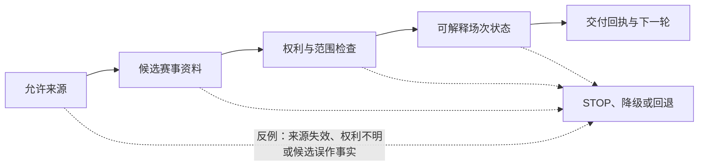

# 赛事数据接入、赛程与来源管理：对话施工版

> 文档性质：来源治理与赛程输入的对话施工卡  
> 适用方式：在不放宽同名权威工程执行篇的前提下，把一个确定的工程节点拆为可复述、可拒绝、可验证、可回退的 AI 协作回合  
> 决策状态：0→1 首轮施工假设；所有未被明确确认的技术、数据、运营、成本、许可和开放结论均保持待验证  
> 公开资料访问日：2026-01-28

## 本主题的确定输入

### 本轮要交付的用户结果

让用户看到可解释的场次可用性与最小比赛状态，而不是把外部资料直接变成角色结论。

### 已具备的前提

领域对象已将比赛、来源、候选、确认与用户观察区分；供应商选择和权利核验尚未被默认通过。

### 本轮只能继承、不能改写的输入

赛程、球队名称、开赛时间、比赛阶段、比分/事件候选、来源健康、冲突、延迟和不可用都是独立状态；来源先到不等于用户可以更早看到，也不等于已确认。

### 可授权范围

来源登记卡、许可核验问题、适配字段、候选状态、来源健康、冲突与不可用文案、模拟输入场景。

### 明确禁止项

绕过访问限制的抓取、未核验授权内容、用户观察升格为事实、单来源自动庆祝、暴露供应商密钥或合同、用来源健康推断用户。

### 必须写入合同的结果

每份输入要带来源类别、取得时间、许可/用途状态、质量与版本；异常时保留最后确认快照或明确等待，角色不得补全比赛进程。

### 必须 STOP 的情况

无法确认来源权利；球队或场次身份映射有歧义；来源延迟无法解释；候选和确认使用同一状态；需要实时数据但只有未经授权接口。

## 本主题的逐轮对话脚本

### 轮次 A：先让助手复述主题边界

在任何施工前，将下列提示词完整发送。此处的“已确认输入”不是材料清单，而是助手不得自行更改的工程约束。若助手在复述中增加了字段、媒介、行为或资料用途，也视为复述失败。

```text
主题：赛事数据接入、赛程与来源管理
本轮用户结果：让用户看到可解释的场次可用性与最小比赛状态，而不是把外部资料直接变成角色结论。
已确认输入：赛程、球队名称、开赛时间、比赛阶段、比分/事件候选、来源健康、冲突、延迟和不可用都是独立状态；来源先到不等于用户可以更早看到，也不等于已确认。
仅可处理：来源登记卡、许可核验问题、适配字段、候选状态、来源健康、冲突与不可用文案、模拟输入场景。
绝不处理：绕过访问限制的抓取、未核验授权内容、用户观察升格为事实、单来源自动庆祝、暴露供应商密钥或合同、用来源健康推断用户。
请不要实现。请用普通语言复述：
1. 本轮用户会获得什么；2. 不会获得什么；3. 哪些状态和权利必须优先；
4. 你需要的最小合同；5. 你会在哪些情况下 STOP。
```

提需求者逐条核对四类高风险误解：把候选说成确认、把一次本场选择说成跨场许可、把可选媒介说成默认入口、把工程检查说成真实开放证据。只要发生其中之一，要求助手指出它错误使用的前提，然后重新复述。

### 轮次 B：把问题缩成一个合同差异

对话施工最常见的失败是要求助手“把 赛事数据接入、赛程与来源管理 做完”。正确的提问是：本轮只让哪个对象从什么状态转到什么状态，谁触发，用户何处看到，谁能停止，晚到动作如何失效。使用以下表格要求助手填空，不接受“视情况而定”。

| 合同项 | 本轮必须回答的问题 |
| --- | --- |
| 触发者 | 用户、受控来源、受限岗位还是系统定时动作；是否需要显式授权 |
| 输入类别 | 事实、候选、观察、资料、控制或运营指令；不得混写 |
| 前后状态 | 变更前与变更后分别是什么，哪个版本有效 |
| 用户后果 | 用户看到/听到什么，如何理解等待、失败或更正 |
| 覆盖关系 | 静音、保护、结束、删除、暂停或权限失效怎样优先 |
| 生命周期 | 是否跨场存在、何时失效、删除后什么不能再引用 |
| 反例 | 赛程延期；单源冲突；来源失联；同名球队；用户说“进了”；最后确认快照过期。 |

如果某一行无法回答，不允许用“先留扩展字段”“后续接入再定”通过。将该行转为负责人待决项，并保持最小保守状态。

### 轮次 C：只批准第一步计划

请助手给出最多五步计划，但本轮只批准第一步。每一步都应写出目标工件、输入、输出、验证和回退。以下提示词可直接复制：

```text
基于已确认合同，为“赛事数据接入、赛程与来源管理”给出不超过五步的计划。
每步包含：唯一目标、允许触及范围、不可触及范围、前置、通过证据、
失败时保持的保守状态、回退方式。
不得把相邻优化、新数据类别、主动行为、外部调用或开放范围并入步骤。
最后指出：第一步为什么可以独立验收，以及它不能证明什么。
```

计划审阅时使用三问：第一步失败会不会留下可见副作用？第一步的通过能否由独立反例推翻？第一步是否隐含要求下一步一定完成？有一个回答不清楚，就继续拆分。

### 轮次 D：受限施工与回执

批准第一步后，发送下面的施工提示词。注意“未运行”也是回执的一部分；助手不得伪造结果或把无法运行的检查描述为已通过。

```text
只执行“赛事数据接入、赛程与来源管理”计划的第 1 步。
目标：<从已批准计划复制>
允许范围：<从已批准计划复制>
禁止范围：绕过访问限制的抓取、未核验授权内容、用户观察升格为事实、单来源自动庆祝、暴露供应商密钥或合同、用来源健康推断用户。
硬约束：每份输入要带来源类别、取得时间、许可/用途状态、质量与版本；异常时保留最后确认快照或明确等待，角色不得补全比赛进程。
完成后仅输出：变更摘要、合同对应、运行的检查及结果、未运行项、
反例风险、回退动作、需要负责人决定的事项。
若需要新授权、真实资料、外部写入或改变默认行为，请 STOP。
```

通过回执后也不得自动进入第二步。负责人先确认本轮没有把“工程工件存在”误说成“产品已可用”，再决定是否启动下一轮。

### 轮次 E：用反例审阅而不是主路径自证

以下情境是本主题的最低反例集：

赛程延期；单源冲突；来源失联；同名球队；用户说“进了”；最后确认快照过期。

让独立审阅者使用此格式：

```text
对每个反例，先预测：用户应看见什么；哪些动作必须被阻止；
服务应保留哪条最小路径；什么现象算失败。
然后再检查候选工件或运行证据。不要根据主路径成功推断反例通过。
```

若反例说明能力需收缩，输出应直接写“保持关闭”“退回文字/等待/静态状态”或“回退到上一有效版本”，不能要求用户多解释、等待角色安慰或承担排障责任。

## 可直接派发的三张任务卡

任务卡 A：只定义来源登记卡和准入问题。

任务卡 B：只建立候选与确认之间的合同。

任务卡 C：只准备来源不可用时的用户端文字降级。

每张卡都必须重新经过开工卡、合同差异、计划、施工、反例与回执六步。它们可以共享术语，但不能合并成一次“大而全”的授权。

## 本主题的验收门

| 门 | 必须拿出的证据 | 不足时的动作 |
| --- | --- | --- |
| 边界门 | 目标、非目标、禁止项与 STOP 条件被正确复述 | 回到轮次 A，不施工 |
| 合同门 | 触发、状态、用户后果、覆盖关系和生命周期明确 | 回到轮次 B，缩小对象 |
| 施工门 | 只在被批准范围内出现候选变更，且有可运行检查 | 移除越界部分或回退 |
| 反例门 | 本主题反例集有预测、检查和结论 | 保持能力关闭或降级 |
| 交接门 | 回执区分已证实、待验证、未做和负责人待决 | 不进入下一轮 |

## 本主题完成时不能外推的结论

即使本篇所有对话卡都通过，也只能说明在给定模拟、范围和证据下，这个工程节点具备继续接受下一轮审阅的资格。它不证明全部赛事资料可靠、所有设备可用、用户会喜欢、成本可承受、对外开放合法或角色关系风险已消失。任何扩大用户范围、资料类别、主动性、声音保存、外部供应、商业权益或发布环境的提案，都必须作为新需求重新回到第 0 轮。

## 主题施工图



## 本主题的精确施工提示词

```text
你正在处理“赛事来源与赛程边界”的一个受限工程切片。

先复述：本轮用户结果、不可改变的输入、允许范围、禁止范围和 STOP 条件。
仅提出不超过五步的计划；负责人只会批准第一步。不要顺带改变相邻能力、默认值、资料范围、外部接入或发布范围。

对已批准的单一步骤，输出：
1. 变更的状态、接口或工件；
2. 预期用户可见结果；
3. 必跑检查与本主题反例；
4. 未覆盖项、回退动作和负责人待决项。

若发现 来源失效、权利不明或候选误作事实，或任何边界不清，停止并输出 STOP 回执，不编造前提。
```

## 本主题的验收与 STOP

- 只有本篇“确定输入”中已确认的对象、状态和权限发生变化；
- 用户控制、文字路径和更保守状态优先于在途处理；
- 至少检查一个与“来源失效、权利不明或候选误作事实”相关的反例；
- 回执明确区分已运行、未运行、待验证与不能外推的结论；
- 任何新资料类别、外部写入、默认主动行为、真实用户材料或发布扩大，均返回 `00-对话式AI Coding工作流.md` 重新建立三张卡和任务契约。

## 使用边界

本篇只处理“赛事来源与赛程边界”的主题任务卡。通用的对话角色、七轮施工协议、审阅纪律、交接格式和风险等级，统一使用 `00-对话式AI Coding工作流.md`；权威工程选择、正式门禁与相邻能力边界，以父目录同名工程执行篇为准。本篇的完成不证明用户价值、生产可靠性、合规或开放资格。
