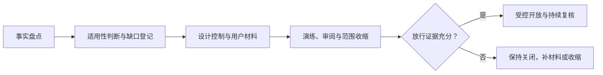
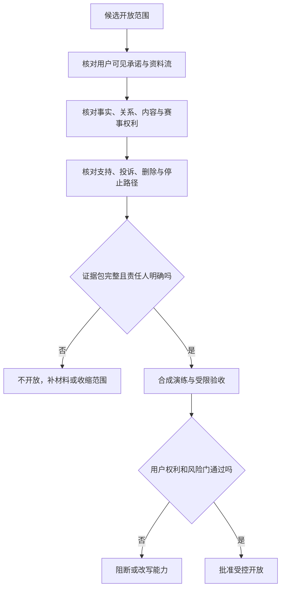

# 上市准备与合规材料

> **文档类型与所属**：上市准备与放行方法论，属《球球全套资料》第六卷"上市与商业落地"。覆盖从研究底座、材料架构、放行门槛到交叉验收的完整路径；逐条监管义务分析由《宏观环境与监管约束》统一维护，本文不另立副本。

## 1. 这不是一份“拿到许可就能发布”的清单

在首次面向公众开放之前，我们要面对的不是单一的合规问题，而是一组彼此牵连的承诺：用户是否知道自己在和什么互动；能否在不被惩罚的情况下退出、删除与投诉；赛事信息是否有清楚来源和不确定性说明；语音、画像、记忆、付费与人工处置是否各有边界；发生故障时是否会把风险留给用户承担。

我们把这份承诺整理为发布前应当准备、评审、留存和交付的材料体系。它是一个从零开始的工作蓝图，不构成法律意见，也不把任何清单误说成行政机关已经认可。涉及具体业务地域、主体资格、数据处理方式、模型服务来源、未成年人范围或营销表达时，均应由具备相应资格的专业人士以当时有效规则复核。

### 1.1 首轮问题与范围

首轮假设的服务是：成年人可主动进入一场足球赛事的陪看场景，与一个明确披露为人工智能生成的数字球友（Digital Ballmate）进行文字或语音互动；服务可能提供公开赛事背景、用户主动记录的观察、有限的偏好与记忆，以及订阅或单场增值权益。它不售卖比赛转播，不承诺比分绝对实时，不替代心理、医疗、法律或财务专业服务，也不把角色塑造成用户唯一、排他的亲密关系。

这里的“上市”指一次受控的公众开放，而不是一次营销冲刺。首轮必须把人群、地域、赛事、能力和时段收窄到可被看见、可被暂停、可被修复的范围。若实际方案越过这些假设，例如接入未成年人、允许公开内容生产、引入人脸或声纹识别、接入境外处理、提供开放社交或购买转播权益，我们都会重新开立合规评审，而不沿用本文的放行结论。

### 1.2 成功定义

发布前的成功不是“材料齐全”，而是每个高风险承诺都有以下五项：

1. 一位对该事项负责的人，且其权限写清楚；
2. 面向用户的简明说明，用户在相关动作前能看见；
3. 团队可执行的步骤、时限和升级路径；
4. 可复核的记录，而非口头记忆；
5. 失败时的收缩、暂停、通知和修复方案。

因此，我们把材料包当作真实决策的输入：谁可以改变记忆留存期，谁能开通提醒，谁判断一项来源可用，谁在收到严重投诉后暂停功能，谁在合作方变更后重新评审。没有对应行为的文档不计入完成。

### 1.3 首轮非目标

首轮不以“覆盖所有地区”“一次完成所有认证”“把每种风险自动化判断”为目标；不将复杂隐私政策当作默认同意；不以用户停留、连续对话或冲动购买作为发布成功；也不以承诺绝对正确、永不断线或永不出错来换取信任。我们宁可要较慢但能解释的开放，也不要规模更大却无法收束的开放。

## 2. 研究底座：一张义务索引

法规不是产品功能表。我们的方法不变：先区分事实，再判断义务，最后形成材料；把问题拆成主体和地域、处理何种信息、提供何种生成能力、内容从何而来、是否向用户收费、是否存在人工或第三方接触六个维度，每一维都写出“已知、待确认、不适用的理由和触发重审的变化”。

逐条义务分析——从拟人化互动服务办法、生成式人工智能服务管理暂行办法、深度合成规定、个人信息保护与消费者保护，到标识办法与强制性国标 GB 45438-2025、应用商店政策与境外参照——由《宏观环境与监管约束》统一维护，本文不重复展开。进入放行准备时，我们从中取用的是一张义务索引：

| 放行前要回答的问题 | 义务归属（宏观环境与监管约束） |
|---|---|
| 服务如何定性，适用哪些规则与平台要求 | §2 监管与平台环境、§3 适用边界 |
| 用户能否始终知道自己在与 AI 互动，生成内容如何标识 | §4 标识制度 |
| 语音、偏好与记忆按什么目的收集、保存与删除 | §5 个人信息、语音和关系记忆 |
| 付费、续费与未成年人保护如何设计 | §6 未成年人、情感依赖与消费者保护 |
| 内容风险如何分级，赛事事实如何可信表达 | §7 内容安全与赛事事实 |
| 供应商变化与事故由谁负责、如何处置 | §10 事故处置 |

透明度、数据盘点、素材策略、付费透明与安全控制的逐项设计要求，都落在上表对应的类别中；本文后续的放行门槛与交叉验收，检验的正是这些要求是否变成了可交付的证据。

## 3. 材料架构：九册证据包与义务的对应关系

我们把放行材料分为九个册，而不是把所有文本塞进一份政策：每个册都有版本号、负责人、最后复核日期、适用范围和下一次触发复核条件；对外材料用清楚语言，对内工作材料记录判断和证据，两者不可互相替代。各册对应的义务类别与设计细节在《宏观环境与监管约束》中统一维护，这里只保留映射：

| 材料册 | 对应《宏观环境与监管约束》的义务类别 | 放行前交付物 |
|---|---|---|
| 一：服务说明与边界声明 | §3 适用边界、§4 标识制度 | 服务与边界说明、AI 身份披露文案 |
| 二：隐私声明、简明提示与权利请求说明 | §5 个人信息、语音和关系记忆 | 分层告知、权利请求表单与回复时限 |
| 三：数据处理活动记录与保留计划 | §5 个人信息、语音和关系记忆 | 数据台账、保留与删除时间表 |
| 四：内容治理、投诉与申诉手册 | §7 内容安全与赛事事实 | 分级处置手册、投诉申诉入口与处理记录 |
| 五：人工智能透明度与模型供应链说明 | §4 标识制度、§2 监管与平台环境 | 标识方案、供应商责任链与退出安排 |
| 六：商业条款、订阅规则与客户支持手册 | §6 未成年人、情感依赖与消费者保护 | 权益表、续费与退款规则、客服口径 |
| 七：安全、事件响应与业务连续性计划 | §10 事故处置 | 事件分级、通知模板与演练记录 |
| 八：外部来源、知识产权与合作方档案 | §7 内容安全与赛事事实、§2 平台环境 | 来源卡、许可依据与撤下流程 |
| 九：发布审批、培训与决策记录 | §9 发布门禁、§11 证据体系 | 放行证据包、例外登记与培训记录 |

有两条取舍贯穿所有册。其一，面向用户的文字先于长条款做理解度检验：十名不参与项目的目标用户中至少八人能正确复述“不是转播、不保证实时比分、可随时静音并结束、数字角色不是人类客服”，否则我们重写页面，而不是要求用户更仔细阅读。其二，没有明确业务或法律理由的信息默认不进入长期保存；对记忆实行三段式——用户当场上下文、用户明确选择保存的偏好、经独立评估才允许的有限长期摘要。现网的记忆为自动记录＋事后可控（用户可查看、编辑与遗忘），“逐项确认才可跨场”是受控开放前将落地的目标态。

## 4. 上市前六周的工作流

### 4.1 阶段一：事实盘点（第 1—2 周）

我们召集产品、工程、运营、内容、安全、商业与法务代表，先不讨论“是否合规”，只画出真实计划。输出包括服务边界图、数据流图、用户旅程、供应链清单、素材清单、收费路径、人工介入点和地域假设。每项计划都标出负责人和证据来源。此阶段的门槛是：任何人都能从图中看到一个用户从进入到结束时哪些信息可能经过哪些主体。

### 4.2 阶段二：适用性判断与缺口登记（第 2—3 周）

根据事实盘点，将规则、合同、平台要求和行业惯例逐项映射。输出不是“合规/不合规”二元表，而是四列：已满足、需补充、需外部意见、不在本轮范围。对法律解释或地域差异较大的事项，必须标记为需外部意见，不能用团队偏好填空。此阶段的门槛是：没有任何高影响事项处于“无人负责的未知”。

### 4.3 阶段三：设计控制与用户材料（第 3—5 周）

将缺口变成具体体验和流程：新增就地告知、修改默认保存、缩小权限、去除高压营销、建立投诉入口、设置删除时限、补充来源标记、限制可售权益、确定人工处置范围。面向用户的文字先于长条款进行理解度检验。此阶段的门槛是：每项高风险活动至少有一项预防控制、一项检测信号和一条退出路径。

### 4.4 阶段四：演练、审阅与收缩（第 5—6 周）

用虚构资料进行桌面演练：一位用户要求删除，另一位投诉角色越界，赛事来源互相冲突，支付后服务被收缩，供应商发生事故。记录从发现到恢复的时间线、授权冲突和用户语言问题。任何演练无法完成的步骤都应回到阶段三修订。此阶段的门槛是：负责人能够在规定时间内做出暂停或收缩决定，而不是等待全员开会。

### 4.5 阶段五：受控开放与复核（第 7 周起）

首批用户、赛事和时段必须限制在值守可覆盖的范围之内；值守编排、轮值与赛时时间表在《生产运维与发布门禁》中统一维护，放行语境下我们只保留一条要求——开放范围不得超出值守能覆盖的范围。开放后每日查看投诉、删除、误导、支付争议、来源异议和退出摩擦；每周审阅例外、供应商变化、材料一致性和用户反馈。若触发停止门槛，先缩小能力和人群，再讨论恢复。此阶段的门槛不是累计用户数，而是没有把已知伤害留给下一批用户。

## 5. 放行门槛：哪些必须在公开前完成

下表中的“完成”指已由指定负责人复核并留存证据，不指仅有文稿初版。

| 门类 | 公开前必须满足的条件 | 不满足时的动作 |
|---|---|---|
| 服务边界 | 服务、地域、年龄、赛事来源、人工介入和付费范围明确 | 缩小范围或延后开放 |
| 隐私 | 数据盘点、分层告知、权利入口、删除与导出流程、保留计划可执行 | 不收集相关资料或暂停该功能 |
| 生成透明度 | 人工智能身份、来源与不确定性说明在关键节点可见 | 不开放相关表达或改为静态内容 |
| 商店标识材料 | 应用商店要求的 AI 生成合成内容标识说明材料已按《人工智能生成合成内容标识办法》与强制性国标 GB 45438-2025 口径备齐，可随版本提审提交 | 未备齐不提审 |
| 内容安全 | 风险分级、投诉、申诉、人工接力和紧急收缩流程已演练 | 仅限封闭研究，不能面向公众 |
| 商业 | 价格、权益、续费、取消、退款和客服说明一致 | 暂不收费，保留基础体验 |
| 外部材料 | 每项来源可追溯且有使用依据或替代方案 | 移除该素材或停止对应能力 |
| 供应链 | 供应商边界、事故通知、退出和数据处理安排已确认 | 不传递相应资料，不启用该服务 |
| 运行 | 值守、暂停开关、事件分级、用户通知和恢复标准可用 | 延后开放或缩小到可值守时段 |

### 5.1 不可例外绕过的红线

红线不在本文另行开列：以《产品全貌》“不可谈判的红线”为准，放行语境下任何一条都不可例外绕过。例外制度只能管理低风险、短期限、可逆的不足，不能给基本权利和安全底线打折；若放行评审发现触线，结论只能是改写能力或拒绝放行，而不是“先发后改”。

### 5.2 放行会议机制

会议输入为九册材料的状态页、未决问题、残余风险清单、演练结论、用户理解度结果、供应商变动、首批范围和暂停计划。会议输出只能是四种：按范围放行、缩小范围后放行、补充材料后再议、拒绝放行。输出须写明理由、负责人、复核日期和对用户的影响。我们不用模糊表述替代决定——“原则上可以”“边做边看”都不是放行结论。

## 6. 用户可见的信任契约

对外文本不应像规避责任的免责声明。我们推荐用以下结构，把权利与限制放在同一屏：

1. 你正在与人工智能数字球友互动，它不会替代真实的人或专业支持；
2. 赛况信息可能存在延迟或不确定，我们会尽量标示来源与状态；
3. 你可以随时静音、结束本场、关闭提醒和选择不保存记忆；
4. 你可以查看、导出、更正或删除与你有关的资料，并获得处理进度；
5. 遇到不舒服、误导、越界或付费问题，可通过明确入口提出投诉或退款请求；
6. 某些能力为保护用户而暂不可用时，会解释发生了什么和你可以做什么。

这份契约必须在产品、客服、营销和合作沟通中保持一致。若营销承诺“永远陪着你”，而服务条款说“可随时中断”，用户听到的不是两种风格，而是矛盾。首轮应建立发布前文案审阅：任何面向公众的短句都要检查是否过度承诺实时性、情感、稀缺性或退款结果。

## 7. 风险登记与收缩策略

### 7.1 高优先级风险

**风险：用户误解角色是人或官方赛事方**
- **早期信号**：反复询问人工身份、把生成话语当官方结论
- **首要控制**：关键节点披露与来源标记
- **触发后动作**：收紧角色表达，暂停误导功能

**风险：长期记忆越过用户预期**
- **早期信号**：删除请求、用户不知记忆已打开
- **首要控制**：默认短留存、明确开关、就地提示
- **触发后动作**：关闭新增长期记忆，优先处理请求

**风险：赛事素材权利争议**
- **早期信号**：来源无法提供授权或收到主张
- **首要控制**：来源卡和默认不用原则
- **触发后动作**：立即撤下并保全判断记录

**风险：付费争议**
- **早期信号**：退款集中、续费解释不一致
- **首要控制**：单一路径、确认页、取消入口
- **触发后动作**：停止售卖，补偿并修正文案

**风险：高风险内容处置延迟**
- **早期信号**：值守失联、转交积压
- **首要控制**：分级手册、联系人与时限
- **触发后动作**：收缩互动能力，人工优先处理

**风险：供应商处理条件变化**
- **早期信号**：合同或公告变动、事故通知
- **首要控制**：定期复核与退出方案
- **触发后动作**：停止传递相关资料，改用降级路径

### 7.2 收缩优先级

发生不确定性时，不应先要求用户承担更多注意力。收缩顺序建议为：先关闭主动提醒和高风险角色表达；再关闭长期记忆和付费入口；再限制语音与外部来源；必要时停止新用户进入；最后才考虑整体暂停。每一次收缩都要给在场用户简短说明，不用“系统异常”掩盖与其权利相关的变化。

### 7.3 事故通知的判断框架

通知不应等到所有事实完全明朗。若事件可能影响用户资料、付费权益、内容安全或服务可信度，应由事件负责人判断是否需要及时告知。初始通知可说明已知范围、用户应采取的动作、临时保护、下一次更新时间与支持入口；后续再更正细节。通知材料需要预置模板，但不得用模板替代对实际影响的判断。

## 8. 角色、培训与最小治理

小团队也应避免“所有人都负责，所以无人负责”。我们设立下列角色，可由同一人兼任但必须公开冲突：

| 角色 | 发布前责任 | 无权单独决定的事项 |
|---|---|---|
| 发布负责人 | 汇总证据、主持放行、记录例外 | 覆盖安全或法务的停止决定 |
| 隐私负责人 | 数据盘点、权利请求、保留与供应商复核 | 为营销扩大用途作单方同意 |
| 内容与安全负责人 | 风险分类、值守、投诉与暂停建议 | 将用户脆弱信息用于增长 |
| 商业负责人 | 权益、价格、退款与合作审阅 | 以收入目标修改基础用户权利 |
| 技术运行负责人 | 访问控制、变更、恢复和事故协同 | 以可用性理由跳过用户告知 |
| 外部专业顾问 | 针对适用规则给出意见 | 代替团队做日常用户体验决定 |

培训不应是一次签收。每个角色至少完成一次情境演练和一次用户语言校对：能否解释删除如何进行、遇到越界表达该怎样收缩、付费后不能提供服务怎样处理、用户要求人工帮助时谁接手。新加入的合作方或运营人员须在接触用户资料前完成相同训练。

## 9. 研究与验证计划

### 9.1 要验证的不是“用户会不会同意”，而是“用户是否真正理解”

研究对象可包括目标用户、无障碍需求用户、客服人员、内容审核人员、潜在合作方和外部专业人士。首轮使用小样本、可退出、不过度收集的研究方式，避免把敏感对话用作材料。每次研究前明确目的、记录范围、保存时间和退出方法。

### 9.2 六个关键研究题

1. 用户能否区分生成表达、公开赛况和自己的观察；
2. 用户是否理解记忆的默认状态、关闭后果和删除路径；
3. 用户是否能在付款前复述价格、期限、取消和补偿规则；
4. 用户在不舒服时能否在两步内找到静音、结束、投诉或人工支持；
5. 用户是否把品牌表达理解为排他或情感承诺；
6. 运营人员能否在没有额外解释时按手册完成分级与转交。

### 9.3 通过与返工门槛

我们以“八成正确理解”作为首轮页面说明的研究门槛，并要求没有参与者把角色误认为人类、官方赛事机构或医疗心理支持。付费确认的门槛更高：所有研究参与者都应能找出取消方式和权益有效期。任一高风险误解出现两次，即停止扩大样本，先改设计再继续。数值只是一种首轮假设；样本构成、任务难度和地域差异应记录，不可把单次结果夸大为普遍结论。

## 10. 发布前材料的交叉验收

### 10.1 不能只逐份阅读，要沿用户动作横向核对

材料往往各自看起来完整，却会在用户跨页面时互相矛盾。因此，放行前我们会以八个用户动作横向抽查全部九册：首次进入、开麦、开启或关闭记忆、查看一条不确定赛况、静音与结束、购买、取消或退款、提出删除或投诉。每个动作从用户看到的第一句话开始，一直走到团队记录处理结果为止。

例如，“关闭记忆”不能只在设置页有一个按钮：首次说明、就地提示、完整隐私说明、支持答案、人工处理手册和保留计划都应给出一致答案；若某处写“立即删除”、另一处写“在合理期限内处理”，就必须先决定真实可履约的时限，再统一用语。又如，“取消订阅”同时牵动比较页、确认页、订单页、支付渠道页面、客服脚本和补偿规则。用户不应该因为内部材料按部门分册，就得到彼此冲突的承诺。

我们把横向抽查表按下列字段留档：用户任务、用户所见文本、进入路径、内部负责人、完成标准、异常路线、所留记录、关联材料版本、发现的问题和修复期限。抽查的重点是“用户能否完成”，而不是团队能否解释条款。

### 10.2 发布文字的四项校对

每一段对外文字都应经过四种校对：

1. **事实校对**：是否只说已确认能够提供的能力、来源和时限；
2. **理解校对**：陌生用户是否会把它误解为转播、真人、官方关系或绝对准确；
3. **权利校对**：是否遗漏退出、删除、投诉、取消、补偿或不保存的选择；
4. **关系校对**：是否把角色、品牌或付费写成用户必须维系的情感义务。

四项任一不通过，文案不能因为“更有感染力”而保留。尤其要审查短标题、按钮、通知和合作方转述；这些地方字数最少、传播最快，也最容易把完整政策中没有的承诺悄悄加入。

### 10.3 三种材料演练

发布前至少进行三次以材料为中心的演练，而非只检查功能是否能够运行。

**演练一：用户不理解。** 由没有参加制作的人只看公开入口和确认页，复述服务性质、信息限制、价格、取消和删除方式。记录其猜错的地方，先修正文案、顺序和入口，再看是否仍有误解。

**演练二：用户要退出。** 用虚构身份依次关闭提醒、结束本场、关闭记忆、取消付费、请求导出和请求删除。观察每一步是否需要重复解释、是否会被营销或角色阻拦、预计时限是否一致。若不能在预定路径完成，不能把用户导向“联系客服再说”当作默认方案。

**演练三：团队要收缩。** 设定一个素材权利存疑或支付权益无法交付的情境，要求团队在限定时间内撤下传播、暂停相应能力、更新用户说明、保护已付用户并记录决定。演练结束后核对谁有权限、哪个入口仍可用、是否有遗漏的合作页面和是否把用户置于无人回应状态。

### 10.4 材料放行的量化与定性门槛

我们不建议把复杂信任问题简化为单一分数，但首轮可以设定一组可审阅的门槛：所有高风险材料都有负责人和撤下方式；所有八个横向用户任务都可完成；参与理解研究的人没有把服务误认为转播、真人、官方赛事方或不可取消订阅；高优先级支持路径在演练中没有无人接手的间隙；每一项未决问题都有公开范围、收缩措施和到期日。

如果只满足了文档齐全却没有完成用户任务，结论应是未放行。如果材料数量很少但范围很窄、每项承诺都能履约，则可以进入更小范围的受控开放。门槛服务于风险收束，不服务于制作更多文件。

### 10.5 规则、渠道与供应商变更的重审触发器

材料在发布当天通过，不代表以后持续适用。我们为每一册设置主动重审触发器：适用地区、用户年龄范围或主体发生变化；新增语音、图像、长期记忆、公开内容或支付能力；赛事来源、素材许可、平台政策或供应商处理地点发生变化；新增合作方或营销渠道；出现重复投诉、严重误解、支付争议或安全事件；外部规则、平台要求或专业意见更新。任何触发器出现时，先判断是否需要立即收缩相关能力，再决定材料修订的范围与时限。

变更评审应避免“供应商说符合要求，所以无需再看”的捷径。团队仍须回答本服务实际传递了什么资料、对用户多了什么可见影响、能否继续履行删除与退出承诺、发生事故由谁通知用户、若服务终止怎样导出或删除资料。若这些问题没有清楚答案，变更只能停留在研究或封闭演练，不能直接进入公众范围。

同样，公开规则的变化不能只由单一部门订阅。发布负责人应按固定周期检查高风险来源，记录本次是否发生变化、谁判断影响、是否需要外部专业复核、哪些用户材料需要更新。对用户有实质影响的变化，应先给用户选择或先收缩功能，再让新规则成为既成事实。

## 11. 公开来源

本篇方法论所依据的监管文件与公开资料——生成式人工智能与深度合成规则、标识办法与 GB 45438-2025、个人信息保护与消费者保护法律、应用商店政策及境外参照——由《宏观环境与监管约束》的来源清单统一登记并持续更新，本文不再重复罗列。其适用性、版本与解释，均应在正式开放前由相应专业人士按实际地域复核。

## 12. 结论：把合规变成用户可感知的选择权

首轮上市准备的本质不是证明我们无所不知，而是证明我们知道什么仍不确定、知道在不确定时如何少收集、少承诺、少扩张，并把用户的退出、删除、投诉、静音和拒绝付费视为产品成功的一部分。只有当每一项公开承诺都能落到负责人、流程、证据和收缩动作上，我们才会进入受控开放。

---

版本 2.0（2026-09-20）
