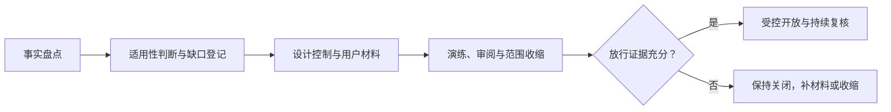
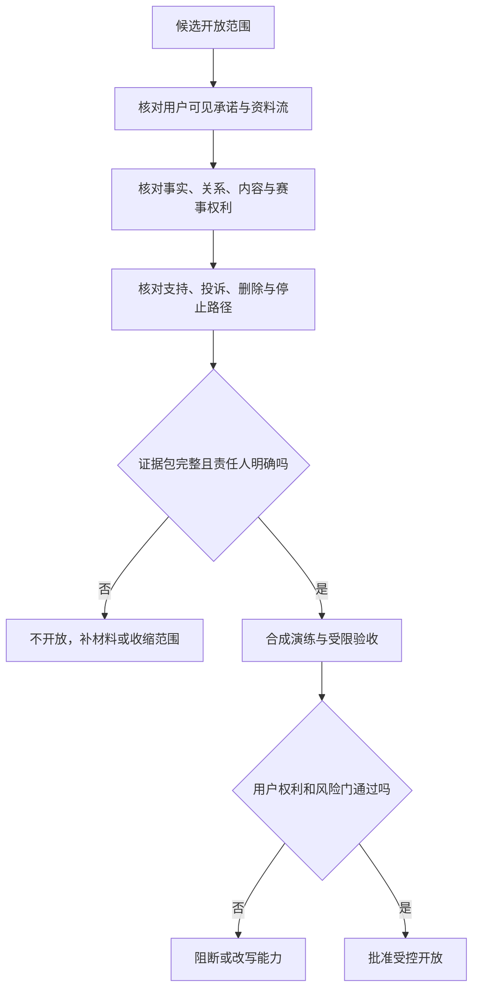

# 上市准备与合规材料

> 方案形成时间：2026-01-28。

## 1. 这不是一份“拿到许可就能发布”的清单

首轮面向公众开放前，团队面对的不是单一的合规问题，而是一组彼此牵连的承诺：用户是否知道自己在和什么互动；能否在不被惩罚的情况下退出、删除与投诉；赛事信息是否有清楚来源和不确定性说明；语音、画像、记忆、付费与人工处置是否各有边界；发生故障时是否会把风险留给用户承担。

本篇把这些承诺整理为发布前应当准备、评审、留存和交付的材料体系。它是一个从零开始的工作蓝图，不构成法律意见，也不把任何清单误说成行政机关已经认可。涉及具体业务地域、主体资格、数据处理方式、模型服务来源、未成年人范围或营销表达时，均应由具备相应资格的专业人士以当时有效规则复核。

### 1.1 首轮问题与范围

首轮假设的服务是：成年人可主动进入一场足球赛事的陪看场景，与一个明确披露为人工智能生成的数字球友进行文字或语音互动；服务可能提供公开赛事背景、用户主动记录的观察、有限的偏好与记忆，以及订阅或单场增值权益。它不售卖比赛转播，不承诺比分绝对实时，不替代心理、医疗、法律或财务专业服务，也不把角色塑造成用户唯一、排他的亲密关系。

这里的“上市”指一次受控的公众开放，而不是一次营销冲刺。首轮必须把人群、地域、赛事、能力和时段收窄到可被看见、可被暂停、可被修复的范围。若实际方案越过这些假设，例如接入未成年人、允许公开内容生产、引入人脸或声纹识别、接入境外处理、提供开放社交或购买转播权益，应重新开立合规评审，不得沿用本篇的放行结论。

### 1.2 成功定义

发布前的成功不是“材料齐全”，而是每个高风险承诺都有以下五项：

1. 一位对该事项负责的人，且其权限写清楚；
2. 面向用户的简明说明，用户在相关动作前能看见；
3. 团队可执行的步骤、时限和升级路径；
4. 可复核的记录，而非口头记忆；
5. 失败时的收缩、暂停、通知和修复方案。

因此，材料包应当服务于真实决策：谁可以改变记忆留存期，谁能开通提醒，谁判断一项来源可用，谁在收到严重投诉后暂停功能，谁在合作方变更后重新评审。没有对应行为的文档不计入完成。

### 1.3 首轮非目标

首轮不以“覆盖所有地区”“一次完成所有认证”“把每种风险自动化判断”为目标；不将复杂隐私政策当作默认同意；不以用户停留、连续对话或冲动购买作为发布成功；也不以承诺绝对正确、永不断线或永不出错来换取信任。较慢但能解释的开放，优先于规模更大却无法收束的开放。

## 2. 研究底座：先把适用问题拆开

法规不是产品功能表。准备工作应先区分事实，再判断义务，最后形成材料。建议将问题拆成六个维度：主体和地域、处理何种信息、提供何种生成能力、内容从何而来、是否向用户收费、是否存在人工或第三方接触。每一维都必须写出“已知”“待确认”“不适用的理由”和“触发重审的变化”。

### 2.1 面向中国大陆公众时的起点

《中华人民共和国个人信息保护法》确立了处理个人信息应具有明确、合理目的，与处理目的直接相关并采取对个人权益影响最小方式等原则；也规定个人享有知情、决定、查阅复制、更正补充、删除等权利。产品材料不应只引用条文，而应转写为用户动作：首次使用前能知道哪些资料会被收集；关闭记忆后不再把新对话用于长期偏好；可请求导出与删除；变更目的时重新告知并取得相应同意。

生成式人工智能服务的管理规则强调促进创新与依法治理并重，要求服务提供者采取有效措施提升生成内容质量，依法履行相关义务，并对输入信息和使用记录采取保护措施。深度合成服务规则则强调标识、信息安全、真实身份信息认证等要求会随具体服务形态而变化。对首轮团队而言，关键不是预先认定所有义务均已触发，而是建立“能力—义务—证据”映射，并请专业意见确认公开可得、对公众具有舆论属性或社会动员能力等事实是否成立。

### 2.2 生成内容的透明度问题

数字球友的语言、声音或角色动作都可能让用户误以为其具有真实情感、实时赛事知情或人工客服身份。透明度材料至少应回答：

- 用户在进入、开麦、付费、投诉和长期记忆打开时，是否知道互动对象是人工智能；
- 哪些内容来自公开资料、哪些来自用户自己的观察、哪些是生成表达；
- 何时会出现人工支持，人工能看见什么、不能做什么；
- 生成声音、形象和提示是否可被合理理解为真实人物、转播画面或官方赛事信息；
- 当事实无法确认时，产品怎样显示“不确定”而不是把猜测写成确定陈述。

首轮选择“清楚可见、反复但不过度打扰的披露”，而不是只在长条款中写一次。代价是转化路径多一个理解步骤；收益是减少误解、投诉和后续修复成本。披露应由普通用户理解度检验，而不是由团队自认为已经展示来决定。

### 2.3 隐私问题不能被“匿名”一词掩盖

匿名昵称、随机会话标识或不要求真实姓名，不自动意味着没有个人信息风险。语音片段、设备信号、支付凭证、偏好、可关联的比赛选择、投诉记录与记忆摘录都可能构成可关联信息。材料应首先做数据盘点，不要先写隐私政策。

数据盘点的每一行至少包含：信息类别、用户可见来源、收集时点、目的、处理基础、是否必要、保存位置、访问角色、保留期限、共享对象、删除方式、跨地域可能性、未提供的后果。盘点里必须把“暂不确定”单独标红；没有答案的项目不能在上线前被默认为可收集。

### 2.4 内容、赛事与知识产权问题

用户是在看比赛，但服务不应因此取得赛事画面、音频、队徽、球员肖像、统计资料或新闻全文的当然使用权。首轮应采用最保守的素材策略：不嵌入未经授权的转播流；不复制受保护的评论或图文；对队徽、照片、视频、音频、实时数据和商业名称逐项确认许可、合理使用边界或替代方案；所有外部来源都记录来源页、使用范围、归属、期限、地域、署名和撤下步骤。

用户自发输入的观察也不应自动被用于营销、训练或公开展示。用户提交内容的使用范围应与实现陪看体验直接相连；需要扩大用途时应提供清楚选择，并允许拒绝而不失去基础服务。投诉或权利主张入口应能被普通用户找到，且有时限、证据保全和反通知判断流程。

### 2.5 消费者权益与付费问题

付费上线不是加一个支付按钮。用户在付款前要知道商品或服务的名称、核心权益、时长、价格、自动续费规则、试用条件、取消方式、退款或不退款的具体情形、客服途径和争议处理办法。不能把“陪伴”“限时”“亲密关系”作为促使用户冲动购买的压力工具，也不能把关闭记忆、静音、退出比赛等基本自主权放入付费层。

首轮应默认避免不透明的连续订阅。若采用自动续费，确认页、续费提醒、取消入口和账单说明都要独立检验；若采用单场或短周期权益，应明确有效期是否跨比赛、故障时怎样补偿、比赛取消或延迟怎样处理。支付服务商、应用分发平台和本地消费者保护要求可能叠加，合同与页面文案都需按实际渠道复核。

### 2.6 安全与运营问题

合规不是把风险转给安全团队。用户材料应承诺合理保护，团队材料应把承诺分解为访问控制、最小权限、密钥轮换、传输保护、变更审查、事件处置、供应商复核、备份恢复和人员培训。这里不应公开可被利用的防护细节，但必须能证明每项控制有负责人、有周期、有例外审批和有演练记录。

美国国家标准与技术研究院的人工智能风险管理框架提出治理、映射、度量、管理四类活动，可作为非法律性的组织方式：先界定语境和受影响者，再识别风险与证据，再决定控制措施，最后把结果纳入持续治理。本篇借用其方法，不把它误称为任何地区的合规认证。

## 3. 合规材料架构：一套可审阅、可更新的证据包

建议把材料分为九个册，而不是把所有文本塞进一份政策。每个册都有版本号、负责人、最后复核日期、适用范围和下一次触发复核条件。对外材料用清楚语言；对内工作材料记录判断和证据；两者不可互相替代。

### 3.1 第一册：服务说明与边界声明

这是用户、合作方和审阅者理解服务的入口。它应写明：服务是什么、不是什​​么；可用地域、年龄和设备范围；是否属于公开体验或受控开放；数字角色的人工智能属性；赛事信息和用户观察的差异；实时性与准确性的限制；功能可用性可能因赛事、网络或安全收缩而变化；支持入口和紧急情况提示。

验收门槛是：让十名不参与项目的目标用户阅读后，至少八人能正确复述“不是转播”“不保证实时比分”“可随时静音并结束”“数字角色不是人类客服”四项。若不能，重写页面而非要求用户更仔细阅读。

### 3.2 第二册：隐私声明、简明提示与权利请求说明

这一册不只是一份隐私政策，还包括场景化提示卡、权限说明、记忆开关说明、语音收集说明、儿童与未成年人处理说明、共享清单、权利请求表单、身份核验规则、回复时限和拒绝理由模板。所有用户权利流程都需要“人工可执行”的兜底：自动化失败时，用户仍能通过一个低门槛渠道提出请求。

选择“分层告知”：进入前给出一页摘要，触发敏感动作时给出就地解释，底部提供完整版本。这样做的代价是需要维护多处一致性；收益是告知与真实决定靠得更近。任何一处修改都要反向核对其余文本，避免出现相互矛盾的保存期限或联系方式。

### 3.3 第三册：数据处理活动记录与保留计划

这一册面向运营与审阅，承接前述数据盘点。它应列出数据流图、处理活动表、保留时间表、删除和匿名化标准、备份中的删除策略、访问授权流程、导出格式、供应商处理表、跨地域判断以及高风险处理评估。记录的目的是让团队回答“为什么还留着这一项”，而不是证明收集得越多越专业。

建议为每项信息设置默认到期时间。若没有明确业务或法律理由，默认不进入长期保存。对记忆尤其应实行三段式：用户当场上下文、用户明确选择保存的偏好、经独立评估才允许的有限长期摘要。用户的情绪化表达、脆弱处境、推测性身份、未核实的健康或关系信息，不应因“有用”而升级为长期档案。

### 3.4 第四册：内容治理、投诉与申诉手册

这一册应覆盖生成内容、用户输入、赛事材料、角色形象、广告与合作内容。包括：风险分类、分级处置、用户提示语、人工升级准则、投诉入口、证据保存、处理时限、申诉、错误修复、重复违规处置、透明度报告口径和紧急暂停权限。

首轮的取舍是“宁可减少一部分表现力，也不以模糊关系边界换取沉浸”。禁止将角色写成要求用户离开现实关系、隐瞒付费、对退出施加愧疚、暗示唯一性或承诺真实情感的主体。对自伤、暴力、仇恨、骚扰、未成年人风险和明显违法内容，应预置最小干预脚本与人工接力，而不是临场自由发挥。

### 3.5 第五册：人工智能透明度与模型供应链说明

该册列出所用生成能力的类型、可处理的数据类别、输入输出的限制、模型与语音服务供应商的职责、内容标识策略、人工复核边界、已知失效模式、评估集来源与更新节奏。外部供应商的宣传不能替代团队自己的判断；合同、数据处理条款、服务地点、留存条款、模型改进用途、事故通知、退出与删除能力均需逐项核实。

对用户公开的版本应避免夸大“理解”“记住”“实时知道”等能力。对运营人员公开的版本应写明：当模型结果与权威赛事来源冲突时，默认不把模型语言当事实；当用户观察未被独立确认时，保持其为“你的观察”；当无法判断时，优先提问、沉默或说明不确定。

### 3.6 第六册：商业条款、订阅规则与客户支持手册

该册包括服务条款、付费权益表、价格变更规则、退款与补偿规则、续费披露、发票或订单说明、促销审阅表、客服服务等级、争议处理与停止售卖条件。每一种权益都需要一份“反例清单”：什么不包含、何时不可用、因何种安全或合规原因会被收缩、用户如何结束而不被角色挽留。

首轮建议只开放一种易理解、随时可取消的付费路径，避免礼包、抽奖、强提醒、组合加购和多层会员。付费能力若让团队无法清楚解释实际权益、实际成本和实际退出方式，就应晚于体验验证，而不是成为首发目标。

### 3.7 第七册：安全、事件响应与业务连续性计划

这一册包括资产清单、责任矩阵、事件分级、发现与通报路径、用户通知准则、取证和保全原则、临时收缩选项、恢复门槛、供应商事故联络、备份恢复检验、联系人轮值表和赛时值守安排。它的核心是时序：谁先判断、谁能暂停、何时通知用户、何时升级、何时允许恢复。

首轮至少演练四种情境：错误把用户观察说成确定赛况；记忆删除请求未在承诺时间内完成；支付权益与展示不一致；高风险内容没有被适当收束。演练只记录暴露出的流程缺口与修复，不把用户真实内容拿来当作演练素材。

### 3.8 第八册：外部来源、知识产权与合作方档案

每份外部素材或数据来源应有一张“来源卡”：来源主体、地址、用途、抓取或取得日期、许可或合同依据、展示方式、署名要求、使用期限、地域、更新频率、撤下按钮、投诉联系人和到期提醒。对无法证明可用的素材，默认不进入首轮范围。

合作方档案还要记录其品牌表达、用户数据边界、营销审核、危机沟通、分润、终止、审计和用户投诉分流。尤其不能让合作方借数字角色向用户施加购买压力，或把陪看过程中的脆弱表达转作定向营销标签。

### 3.9 第九册：发布审批、培训与决策记录

最后一册不是签字页合集，而是放行时的事实包：范围说明、风险登记、未决事项、逐项门槛证据、例外申请、培训完成情况、值守联系人、暂停开关、发布负责人和复盘日期。每一个例外都需写明有效期、缓解措施、谁承担残余风险、何时必须重新评审。没有到期日的“临时例外”应视为未解决问题。

## 4. 从研究到放行的工作流

### 4.1 阶段一：事实盘点（第 1—2 周）

召集产品、工程、运营、内容、安全、商业与法务代表，先不讨论“是否合规”，只画出真实计划。输出包括服务边界图、数据流图、用户旅程、供应链清单、素材清单、收费路径、人工介入点和地域假设。每项计划都标出负责人和证据来源。此阶段的门槛是：任何人都能从图中看到一个用户从进入到结束时哪些信息可能经过哪些主体。

### 4.2 阶段二：适用性判断与缺口登记（第 2—3 周）

根据事实盘点，将规则、合同、平台要求和行业惯例逐项映射。输出不是“合规/不合规”二元表，而是四列：已满足、需补充、需外部意见、不在本轮范围。对法律解释或地域差异较大的事项，必须标记为需外部意见，不能用团队偏好填空。此阶段的门槛是：没有任何高影响事项处于“无人负责的未知”。

### 4.3 阶段三：设计控制与用户材料（第 3—5 周）

将缺口变成具体体验和流程：新增就地告知、修改默认保存、缩小权限、去除高压营销、建立投诉入口、设置删除时限、补充来源标记、限制可售权益、确定人工处置范围。面向用户的文字先于长条款进行理解度检验。此阶段的门槛是：每项高风险活动至少有一项预防控制、一项检测信号和一条退出路径。

### 4.4 阶段四：演练、审阅与收缩（第 5—6 周）

用虚构资料进行桌面演练：一位用户要求删除，另一位投诉角色越界，赛事来源互相冲突，支付后服务被收缩，供应商发生事故。记录从发现到恢复的时间线、授权冲突和用户语言问题。任何演练无法完成的步骤都应回到阶段三修订。此阶段的门槛是：负责人能够在规定时间内做出暂停或收缩决定，而不是等待全员开会。

### 4.5 阶段五：受控开放与复核（第 7 周起）

首批用户、赛事和时段应限制在值守可覆盖范围。每日查看投诉、删除、误导、支付争议、来源异议和退出摩擦；每周审阅例外、供应商变化、材料一致性和用户反馈。若触发停止门槛，先缩小能力和人群，再讨论恢复。此阶段的门槛不是累计用户数，而是没有把已知伤害留给下一批用户。

## 5. 放行门槛：哪些必须在公开前完成

下表中的“完成”指已由指定负责人复核并留存证据，不指仅有文稿初版。

| 门类 | 公开前必须满足的条件 | 不满足时的动作 |
|---|---|---|
| 服务边界 | 服务、地域、年龄、赛事来源、人工介入和付费范围明确 | 缩小范围或延后开放 |
| 隐私 | 数据盘点、分层告知、权利入口、删除与导出流程、保留计划可执行 | 不收集相关资料或暂停该功能 |
| 生成透明度 | 人工智能身份、来源与不确定性说明在关键节点可见 | 不开放相关表达或改为静态内容 |
| 内容安全 | 风险分级、投诉、申诉、人工接力和紧急收缩流程已演练 | 仅限封闭研究，不能面向公众 |
| 商业 | 价格、权益、续费、取消、退款和客服说明一致 | 暂不收费，保留基础体验 |
| 外部材料 | 每项来源可追溯且有使用依据或替代方案 | 移除该素材或停止对应能力 |
| 供应链 | 供应商边界、事故通知、退出和数据处理安排已确认 | 不传递相应资料，不启用该服务 |
| 运行 | 值守、暂停开关、事件分级、用户通知和恢复标准可用 | 延后开放或缩小到可值守时段 |

### 5.1 不可用例外绕过的红线

以下情形不应以“先发后改”处理：未能说明人工智能身份；没有用户删除或退出渠道；明知素材无权使用；没有处理高风险内容的人工路径；付款规则与页面不一致；角色以排他、依赖或内疚方式推动留存或购买；发现严重安全事件仍继续扩大用户范围。例外制度只能管理低风险、短期限、可逆的不足，不能给基本权利和安全底线打折。

### 5.2 放行会议的输入与输出

会议输入为九册材料的状态页、未决问题、残余风险清单、演练结论、用户理解度结果、供应商变动、首批范围和暂停计划。会议输出只能是四种：按范围放行、缩小范围后放行、补充材料后再议、拒绝放行。输出须写明理由、负责人、复核日期和对用户的影响。不得用模糊表述替代决定，例如“原则上可以”“边做边看”。

## 6. 用户可见的信任契约

对外文本不应像规避责任的免责声明。推荐用以下结构，把权利与限制放在同一屏：

1. 你正在与人工智能数字球友互动，它不会替代真实的人或专业支持；
2. 赛况信息可能存在延迟或不确定，我们会尽量标示来源与状态；
3. 你可以随时静音、结束本场、关闭提醒和选择不保存记忆；
4. 你可以查看、导出、更正或删除与你有关的资料，并获得处理进度；
5. 遇到不舒服、误导、越界或付费问题，可通过明确入口提出投诉或退款请求；
6. 某些能力为保护用户而暂不可用时，会解释发生了什么和你可以做什么。

这份契约必须在产品、客服、营销和合作沟通中保持一致。若营销承诺“永远陪着你”，而服务条款说“可随时中断”，用户听到的不是两种风格，而是矛盾。首轮应建立发布前文案审阅：任何面向公众的短句都要检查是否过度承诺实时性、情感、稀缺性或退款结果。

## 7. 风险登记与收缩策略

### 7.1 高优先级风险

**风险：用户误解角色是人或官方赛事方**
- **早期信号**：反复询问人工身份、把生成话语当官方结论
- **首要控制**：关键节点披露与来源标记
- **触发后动作**：收紧角色表达，暂停误导功能

**风险：长期记忆越过用户预期**
- **早期信号**：删除请求、用户不知记忆已打开
- **首要控制**：默认短留存、明确开关、就地提示
- **触发后动作**：关闭新增长期记忆，优先处理请求

**风险：赛事素材权利争议**
- **早期信号**：来源无法提供授权或收到主张
- **首要控制**：来源卡和默认不用原则
- **触发后动作**：立即撤下并保全判断记录

**风险：付费争议**
- **早期信号**：退款集中、续费解释不一致
- **首要控制**：单一路径、确认页、取消入口
- **触发后动作**：停止售卖，补偿并修正文案

**风险：高风险内容处置延迟**
- **早期信号**：值守失联、转交积压
- **首要控制**：分级手册、联系人与时限
- **触发后动作**：收缩互动能力，人工优先处理

**风险：供应商处理条件变化**
- **早期信号**：合同或公告变动、事故通知
- **首要控制**：定期复核与退出方案
- **触发后动作**：停止传递相关资料，改用降级路径

### 7.2 收缩优先级

发生不确定性时，不应先要求用户承担更多注意力。收缩顺序建议为：先关闭主动提醒和高风险角色表达；再关闭长期记忆和付费入口；再限制语音与外部来源；必要时停止新用户进入；最后才考虑整体暂停。每一次收缩都要给在场用户简短说明，不用“系统异常”掩盖与其权利相关的变化。

### 7.3 事故通知的判断框架

通知不应等到所有事实完全明朗。若事件可能影响用户资料、付费权益、内容安全或服务可信度，应由事件负责人判断是否需要及时告知。初始通知可说明已知范围、用户应采取的动作、临时保护、下一次更新时间与支持入口；后续再更正细节。通知材料需要预置模板，但不得用模板替代对实际影响的判断。

## 8. 角色、培训与最小治理

小团队也应避免“所有人都负责，所以无人负责”。建议设立下列角色，可由同一人兼任但必须公开冲突：

| 角色 | 发布前责任 | 无权单独决定的事项 |
|---|---|---|
| 发布负责人 | 汇总证据、主持放行、记录例外 | 覆盖安全或法务的停止决定 |
| 隐私负责人 | 数据盘点、权利请求、保留与供应商复核 | 为营销扩大用途作单方同意 |
| 内容与安全负责人 | 风险分类、值守、投诉与暂停建议 | 将用户脆弱信息用于增长 |
| 商业负责人 | 权益、价格、退款与合作审阅 | 以收入目标修改基础用户权利 |
| 技术运行负责人 | 访问控制、变更、恢复和事故协同 | 以可用性理由跳过用户告知 |
| 外部专业顾问 | 针对适用规则给出意见 | 代替团队做日常用户体验决定 |

培训不应是一次签收。每个角色至少完成一次情境演练和一次用户语言校对：能否解释删除如何进行、遇到越界表达该怎样收缩、付费后不能提供服务怎样处理、用户要求人工帮助时谁接手。新加入的合作方或运营人员须在接触用户资料前完成相同训练。

## 9. 研究与验证计划

### 9.1 要验证的不是“用户会不会同意”，而是“用户是否真正理解”

研究对象可包括目标用户、无障碍需求用户、客服人员、内容审核人员、潜在合作方和外部专业人士。首轮使用小样本、可退出、不过度收集的研究方式，避免把敏感对话用作材料。每次研究前明确目的、记录范围、保存时间和退出方法。

### 9.2 六个关键研究题

1. 用户能否区分生成表达、公开赛况和自己的观察；
2. 用户是否理解记忆的默认状态、关闭后果和删除路径；
3. 用户是否能在付款前复述价格、期限、取消和补偿规则；
4. 用户在不舒服时能否在两步内找到静音、结束、投诉或人工支持；
5. 用户是否把品牌表达理解为排他或情感承诺；
6. 运营人员能否在没有额外解释时按手册完成分级与转交。

### 9.3 通过与返工门槛

建议将“八成正确理解”作为首轮页面说明的研究门槛，并要求没有参与者把角色误认为人类、官方赛事机构或医疗心理支持。付费确认的门槛更高：所有研究参与者都应能找出取消方式和权益有效期。任一高风险误解出现两次，即停止扩大样本，先改设计再继续。数值只是一种首轮假设；样本构成、任务难度和地域差异应记录，不可把单次结果夸大为普遍结论。

## 10. 发布前材料的交叉验收

### 10.1 不能只逐份阅读，要沿用户动作横向核对

材料往往各自看起来完整，却会在用户跨页面时互相矛盾。因此，放行前应以八个用户动作横向抽查全部九册：首次进入、开麦、开启或关闭记忆、查看一条不确定赛况、静音与结束、购买、取消或退款、提出删除或投诉。每个动作从用户看到的第一句话开始，一直走到团队记录处理结果为止。

例如，“关闭记忆”不能只在设置页有一个按钮：首次说明、就地提示、完整隐私说明、支持答案、人工处理手册和保留计划都应给出一致答案；若某处写“立即删除”、另一处写“在合理期限内处理”，就必须先决定真实可履约的时限，再统一用语。又如，“取消订阅”同时牵动比较页、确认页、订单页、支付渠道页面、客服脚本和补偿规则。用户不应该因为内部材料按部门分册，就得到彼此冲突的承诺。

建议把横向抽查表按下列字段留档：用户任务、用户所见文本、进入路径、内部负责人、完成标准、异常路线、所留记录、关联材料版本、发现的问题和修复期限。抽查的重点是“用户能否完成”，而不是团队能否解释条款。

### 10.2 发布文字的四项校对

每一段对外文字都应经过四种校对：

1. **事实校对**：是否只说已确认能够提供的能力、来源和时限；
2. **理解校对**：陌生用户是否会把它误解为转播、真人、官方关系或绝对准确；
3. **权利校对**：是否遗漏退出、删除、投诉、取消、补偿或不保存的选择；
4. **关系校对**：是否把角色、品牌或付费写成用户必须维系的情感义务。

四项任一不通过，文案不能因为“更有感染力”而保留。尤其要审查短标题、按钮、通知和合作方转述；这些地方字数最少、传播最快，也最容易把完整政策中没有的承诺悄悄加入。

### 10.3 三种材料演练

发布前至少进行三次以材料为中心的演练，而非只检查功能是否能够运行。

**演练一：用户不理解。** 由没有参加制作的人只看公开入口和确认页，复述服务性质、信息限制、价格、取消和删除方式。记录其猜错的地方，先修正文案、顺序和入口，再看是否仍有误解。

**演练二：用户要退出。** 用虚构身份依次关闭提醒、结束本场、关闭记忆、取消付费、请求导出和请求删除。观察每一步是否需要重复解释、是否会被营销或角色阻拦、预计时限是否一致。若不能在预定路径完成，不能把用户导向“联系客服再说”当作默认方案。

**演练三：团队要收缩。** 设定一个素材权利存疑或支付权益无法交付的情境，要求团队在限定时间内撤下传播、暂停相应能力、更新用户说明、保护已付用户并记录决定。演练结束后核对谁有权限、哪个入口仍可用、是否有遗漏的合作页面和是否把用户置于无人回应状态。

### 10.4 材料放行的量化与定性门槛

不建议把复杂信任问题简化为单一分数，但首轮可以设定一组可审阅的门槛：所有高风险材料都有负责人和撤下方式；所有八个横向用户任务都可完成；参与理解研究的人没有把服务误认为转播、真人、官方赛事方或不可取消订阅；高优先级支持路径在演练中没有无人接手的间隙；每一项未决问题都有公开范围、收缩措施和到期日。

如果只满足了文档齐全却没有完成用户任务，结论应是未放行。如果材料数量很少但范围很窄、每项承诺都能履约，则可以进入更小范围的受控开放。门槛服务于风险收束，不服务于制作更多文件。

### 10.5 规则、渠道与供应商变更的重审触发器

材料在发布当天通过，不代表以后持续适用。应为每一册设置主动重审触发器：适用地区、用户年龄范围或主体发生变化；新增语音、图像、长期记忆、公开内容或支付能力；赛事来源、素材许可、平台政策或供应商处理地点发生变化；新增合作方或营销渠道；出现重复投诉、严重误解、支付争议或安全事件；外部规则、平台要求或专业意见更新。任何触发器出现时，先判断是否需要立即收缩相关能力，再决定材料修订的范围与时限。

变更评审应避免“供应商说符合要求，所以无需再看”的捷径。团队仍须回答本服务实际传递了什么资料、对用户多了什么可见影响、能否继续履行删除与退出承诺、发生事故由谁通知用户、若服务终止怎样导出或删除资料。若这些问题没有清楚答案，变更只能停留在研究或封闭演练，不能直接进入公众范围。

同样，公开规则的变化不能只由单一部门订阅。发布负责人应按固定周期检查高风险来源，记录本次是否发生变化、谁判断影响、是否需要外部专业复核、哪些用户材料需要更新。对用户有实质影响的变化，应先给用户选择或先收缩功能，再让新规则成为既成事实。

## 11. 公开来源与访问记录

以下资料用于建立问题清单与工作方法；其适用性、版本与解释均应在正式开放前由相应专业人士按实际地域复核。访问日期：2026-01-28。

1. 国家互联网信息办公室，《生成式人工智能服务管理暂行办法》：https://www.cac.gov.cn/2023-07/13/c_1690898327029107.htm
2. 国家互联网信息办公室，《互联网信息服务深度合成管理规定》：https://www.cac.gov.cn/2022-12/11/c_1672221949354811.htm
3. 国家互联网信息办公室，《互联网信息服务算法推荐管理规定》：https://www.cac.gov.cn/2022-01/04/c_1642894606364259.htm
4. 国家法律法规数据库，《中华人民共和国个人信息保护法》检索入口：https://flk.npc.gov.cn/
5. 国家法律法规数据库，《中华人民共和国消费者权益保护法》检索入口：https://flk.npc.gov.cn/
6. NIST, Artificial Intelligence Risk Management Framework (AI RMF 1.0)：https://nvlpubs.nist.gov/nistpubs/ai/NIST.AI.100-1.pdf
7. FTC, Bringing Dark Patterns to Light：https://www.ftc.gov/reports/bringing-dark-patterns-light
8. W3C, Web Content Accessibility Guidelines 2.2：https://www.w3.org/TR/WCAG22/
9. Apple, App Review Guidelines：https://developer.apple.com/app-store/review/guidelines/
10. Google Play, User Data policy：https://support.google.com/googleplay/android-developer/answer/10144311

## 12. 结论：把合规变成用户可感知的选择权

首轮上市准备的本质不是证明团队无所不知，而是证明团队知道什么仍不确定、知道在不确定时如何少收集、少承诺、少扩张，并把用户的退出、删除、投诉、静音和拒绝付费视为产品成功的一部分。只有当每一项公开承诺都能落到负责人、流程、证据和收缩动作上，才应进入受控开放。
