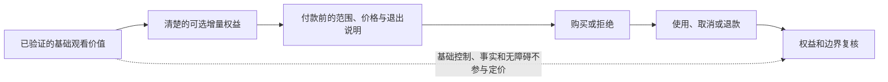
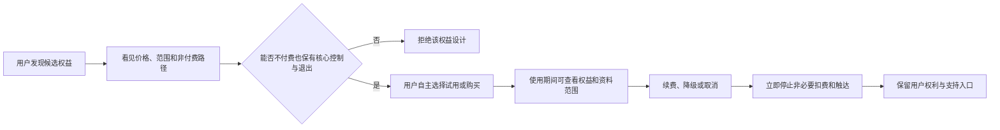
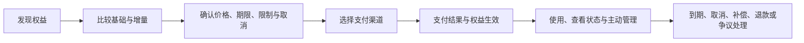
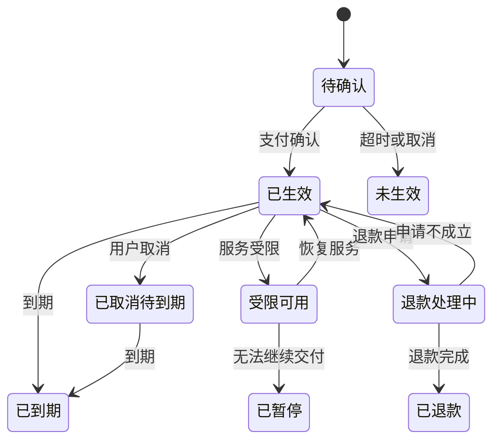

# 商业化产品与付费路径

> **文档类型**：首轮商业化的产品与经营设计框架——我们计划如何让少数明确的增量权益，在透明、自愿、可撤回的前提下参与公平交换；不是收入复盘，也不是报价单。  
> **它是什么**：付费边界与原则、三层产品结构、从发现到结束的交易旅程、权益状态机与异常处理、放行门槛与停止条件。  
> **先说清楚一件事**：截至本文成文，球球——一位面向足球观赛场景、始终明确标识为 AI 的数字球友（Digital Ballmate）——尚未启动收费，也未发生过任何真实交易。文中权益、周期、流程与门槛均为设计框架与研究假设，须经受控研究并由相应专业人士按地域与渠道复核；本文不出现价格数字，定价研究唯一归属[《商业模式与定价假设》](../3.验证与商业模式/18-商业模式与定价假设.md)。

## 1. 先确定一件事：付费不能购买用户的退出困难

首轮商业化要回答的不是“怎样尽快变现”，而是“当用户完全可以不付费、可以随时结束一场陪看时，哪些增量价值仍值得被公平交换”。对于一个陪看型人工智能产品，最危险的收入并非来自低转化，而是来自用户误以为必须续费才能保持关系、害怕关闭功能会失去被理解的感觉，或在赛中情绪高涨时被设计推向冲动购买。

因此，本篇把商业化视为一种可撤回的服务契约：用户在付款前理解自己买什么、何时到期、怎样停止、服务收缩时如何得到处理；团队只为明确、可解释、可交付的增量能力收费；基础的安全、静音、退出、投诉、删除、无障碍和不被操控的体验不参与定价。首轮不把“陪伴时长”“情绪强度”“关系阶段”“孤独感”或“连续打卡”当作收费杠杆。

### 1.1 服务范围与首轮商业假设

假设首轮服务面向能自主作出消费决定的成年人，围绕一场主动选择进入的足球观赛时刻提供语音或文字陪看、有限的表现层互动、用户可控的偏好设置与不保证实时性的赛事背景说明；不包含转播权、官方赛事认证、赌博建议、医疗心理服务或“永远在线”的承诺。候选付费对象只包括三类清晰增量：

1. **单场增强体验**：在用户主动进入的一场比赛中，获得更完整的声音、表现或主题表达；
2. **短周期会员**：在明确周期内获得若干可解释的自定义体验，例如表达偏好、赛程整理或较高的使用配额；
3. **可选主题包**：购买与特定赛事氛围有关、但不包含受限制赛事素材的视觉或表达主题。

随机奖励、抽取式商品、按沉默焦虑加价、不可取消的长期合约等机制，连同一切情绪化催费手法，均属禁区——完整禁售清单与商业化红线唯一展开在[《商业模式与定价假设》](../3.验证与商业模式/18-商业模式与定价假设.md)。

### 1.2 成功如何定义

商业化通过的定义同时包含四类信号：价值清晰（付款前能复述权益、期限、限制和取消方式）；使用自愿（不续费也不会失去基础权利或被角色责备）；交付可信（支付、中断、退款或补偿在承诺时限内得到可解释处理）；经济可持续（扣除支付、渠道、计算、内容、安全与支持成本后仍能覆盖合理投入）。任何收入指标都不能独立成为“成功”：若退款、后悔、投诉或无意续费同时上升，即使销售额增长，也应视为需要收缩的失败模式。

## 2. 研究底座：付费意愿不是一个按钮数据

### 2.1 从“愿不愿意付”到“为何觉得值得”

用户说愿意付费，可能是在礼貌支持概念、期待尚未提供的能力，或担心免费版被削弱；只有把价值拆到具体时刻，才能区分真实交换和被误导的同意。候选价值不能只写“更陪伴”，而应改写为可验证的结果——开赛前更快设置想听与不想听的内容、赛中按自己的节奏获得简短回应、网络不佳时清楚知道服务正在降级——再围绕观赛前、中、后，用原型、任务观察、访谈和小范围使用研究逐一验证。

### 2.2 外部研究带来的约束

消费者保护研究反复提醒：默认勾选、确认羞辱、隐藏取消和伪稀缺会使用户做出不符合自身偏好的决定（即“暗黑模式”问题）。我们据此立下禁令：不预选高价方案，不把取消写成失去角色关心，不在拒绝后弹出羞辱文案，不把试用变成难以退出的续费。对取消与账单的理解则是信任的基础：购买前展示总价与周期，购买后立刻在设置与订单页显示结束入口；自动续费若存在，须独立确认并提前提醒，取消后仍保留已付周期内的已承诺权益。

### 2.3 需要被证伪的核心假设

我们用六个可证伪假设约束首轮设计——全部是待验证的规划假设：H1，用户愿为明确的单场增强体验支付，而非为关系亲密支付；H2，用户能区分会员权益与基础安全、退出权利；H3，短周期、随时结束的方案比长期承诺更符合观赛节奏；H4，清楚的服务降级与补偿能保留信任；H5，单场和短周期收入可覆盖增量成本；H6，不使用关系化催费不会使价值感消失。每个假设都预先写明“若不成立意味着什么”与验证方法；任一被推翻，都指向收缩而非坚持。

## 3. 商业化原则：先划不可售卖的边界

### 3.1 永远不收费的基础权利

静音、主动沉默、结束本场、关闭主动提醒、删除与导出、投诉与申诉、了解人工智能身份、无障碍调整、紧急帮助提示等基础控制与退出路径，永远不设付费门槛——完整清单唯一展开在[《商业模式与定价假设》](../3.验证与商业模式/18-商业模式与定价假设.md)。本篇只补充一条判断：免费与付费的差异必须体现在可解释的容量、表现或自定义上，而非尊重程度、回应礼貌或退出难度上；服务也不应以付费为条件才承认用户的观察或情绪。

### 3.2 可研究的增量权益

首轮只考虑同时满足四项条件的权益：购买前能理解；不购买时基础体验仍完整；可通过客观状态确认交付；服务受限时可公平补偿。候选类别（单场增强、个性设置、赛程工具、主题包）及其边界，与下一节的产品结构一一对应。

### 3.3 明确禁止的收入机制

“你不买我就失望”式情绪绑架、基于脆弱信息的定价与促销、虚假名额与滚动成交、故意让免费版变差、让角色代替支付页面解释条款——全部禁止；商业化红线的唯一归属在[《商业模式与定价假设》](../3.验证与商业模式/18-商业模式与定价假设.md)第 7 节，任何一条被触碰，对应场景立即停止。这些禁令会放弃部分短期转化，但能体面地不买，正是付费信任成立的条件。

## 4. 付费产品架构：先少后多，而不是一次堆套餐

### 4.1 三层产品结构

建议首轮采用“基础体验 + 单场增强 + 短周期会员”的三层结构，并将主题包保持为研究候选而非首发必备：

- **层级：基础体验**
  - **用户目的**：试用并自主陪看
  - **提供内容**：核心对话、静音、结束、基础设置与安全入口
  - **时限**：无需订阅
  - **退出方式**：直接离开或删除资料

- **层级：单场增强**
  - **用户目的**：为一场具体比赛丰富表现体验
  - **提供内容**：已说明的表现、声线或节奏定制
  - **时限**：明示到比赛或指定时间结束
  - **退出方式**：不自动转为其他商品

- **层级：短周期会员**
  - **用户目的**：频繁观赛时减少重复设置
  - **提供内容**：明示数量的自定义与赛程工具
  - **时限**：7 天或 30 天等固定周期假设
  - **退出方式**：一处取消，不需联系客服

首轮只开放一个会员层级，避免用户用价格猜测尊重程度。层级增加应晚于用户研究已证明用户能理解每个差异、客服能解释每个例外、成本能支持每个承诺之后。

### 4.2 单场增强的设计

用户进入付款页前应看到：适用的比赛或有效窗口、具体增强项、不能提供的内容、赛事变化时的规则、服务收缩时的补偿、总价与客服入口。补偿原则是“未交付则不把成本留给用户”：核心增强因服务原因在大部分有效窗口不可用时，用户可选择等值补偿、原路退回或主动选择的替代；页面不得故意模糊“服务原因”与“用户网络原因”。

### 4.3 短周期会员的设计

会员服务于稳定而非焦虑的节奏：周期候选为 7 天与 30 天，让有多场观赛计划的用户减少重复设置。权益采用可数、可关、可见的表述（如“可保存的自定义规则数量”），避免“更懂你”“更亲密”这类无法验收的语言。自动续费不在首轮默认开启；若研究显示用户想要，须同时满足单独说明、主动确认、可见提醒与随处可取消，任一无法交付时改用手动续期。

### 4.4 主题包的边界

主题包必须以原创或权利清楚的素材为基础，与比赛事实、球队官方身份和真实人物区分，不暗示官方背书；若素材权利难以确认，先不售卖——视觉吸引力不是绕开权利判断的理由。

## 5. 价格设计：原则在本篇，数字归定价研究

### 5.1 价格原则

价格至少满足五项：一次看到总价；同地域同时点的同一权益同价，除非差异依据公开、合理且非脆弱性导向；不用复杂叠加妨碍计算；不以倒计时、假稀缺或角色施压推动选择；涨价或权益变更在生效前给出清楚选择。对有无障碍需求或支付受限的用户，不能用歧视性限制把基础权利变为高价附加项。

### 5.2 价格数字不在这篇里

本文不出现任何价格区间、锚点或报价；价格卡、定价研究路径与单位经济口径唯一展开在[《商业模式与定价假设》](../3.验证与商业模式/18-商业模式与定价假设.md)。这里只保留一条判断：若支付意愿来自害怕失去角色记忆、担心免费版被冷落或误以为是观看必需，一律排除，不得用于支持提价。

### 5.3 价格研究方法与防误导规则

首轮优先使用访谈、概念卡、模拟选择和有限的人工确认研究：价值排序（排除“关系变深”类选项）、价格敏感度访谈、理解度任务（在付款页样稿中找出总价、期限、取消与基础版差异）。研究须展示完整价格、取消方式、限制与替代方案，结束后说明这是设计研究；不得基于敏感资料或推测的支付能力定价，首轮不将个体画像用于动态定价。

## 6. 从发现到结束的交易旅程

### 6.1 旅程总览

一笔健康的交易不只是“点击购买”。它应包含七个用户可见状态：发现、比较、确认、支付、交付、管理、结束/修复。每个状态都提供离开的路，且离开不会被角色化语言阻挡。

### 6.2 发现：由用户发起，不追逐赛中情绪

入口应出现在用户主动浏览设置、主题或单场增强时，而不是在进球、失误、深夜连续使用或表达脆弱情绪后突然弹出；页面先说明“基础体验仍可继续”，再解释增量能解决的具体问题。用户关闭入口后不重复追问；用户在比赛中选择主动沉默时，所有商业提示一并安静。没有任何触发条件依赖情绪、关系阶段、脆弱内容或连续使用时长。

### 6.3 比较：让用户看到差异，也看到不变的权利

比较页分栏列出基础、单场、会员：每栏先列“你始终拥有”，再列“本方案增加”，最后列“不包含”；对基础项也写明它是完整、可安全退出的体验，禁止只用对勾营造全胜印象。文字要具体（“本场可选三种声线与节奏规则”），而非“更高等级关怀”；页面必须显示含税说明、是否自动续期、到期时间与退款摘要，且静音、结束、删除、投诉和无障碍在同等位置可见。

### 6.4 确认：双重确认交易，而不是双重阻拦退出

确认页用不超过八十字说明“你将支付什么、获得什么、到什么时候、怎样停止”；自动续费（若有）与即时生效须以明确动作确认，不能以继续使用、关闭弹窗或默认勾选视为同意。高风险场景增加冷静提示而非促销：“你可以稍后决定，基础体验无需付费即可继续”——目的是降低冲动，而不是进行画像。

### 6.5 支付：结果必须确定、可追踪、可解释

成功、失败、待确认、重复扣款疑虑、渠道取消和网络中断，每种结果都要有用户看得懂的页面；疑似重复扣款时立即冻结重复售卖并进入人工核查。凭证与技术状态不一致时优先保护用户：不让用户反复付款来“解锁”，不让角色把付款失败人格化，客服只为验证必要性请求最少信息。

### 6.6 交付：把权益变成可看见的状态

权益生效后，用户在一处能看见当前方案、剩余有效期、已启用设置、取消与补偿入口；能力暂不可用时，页面说明是网络、赛事、维护还是安全收缩，不把不确定状态藏在加载动画后。验收采用用户任务：新用户两分钟内找到已购内容、期限、关闭续期和故障帮助——若不能，需要修改的是信息架构，而不是责怪用户。

### 6.7 管理与结束：取消应和购买一样直接

取消应和购买一样直接：页面确认何时生效、在此之前仍可用什么、有无已安排扣款、怎样重新开通；不展示羞辱性挽留，不要求说明原因才能结束。单场权益结束时给出中性提示，不把比赛结束包装成角色离别。未授权扣款、未交付、误购、渠道争议、比赛变化、主动取消各走各的退款路径，时限与所需资料可见；无法立即决定时，先确认收到，再告知何时更新。

## 7. 权益状态机与异常处理

### 7.1 状态定义

每项付费权益建议有以下业务状态：`待确认`、`已生效`、`受限可用`、`已暂停`、`已取消待到期`、`已到期`、`退款处理中`、`已退款`、`争议处理中`。状态名称可以改为更友好的用户语言，但含义必须稳定，且同一订单不可同时处于相互冲突的状态。

状态机的目的不是追求复杂，而是让支付、客服、权益展示和补偿判断使用同一事实。任何人工处理都应留下理由、时间、处理人角色和对用户的通知，但不应要求用户知道内部分类才能获得帮助。

### 7.2 必须预演的异常

**异常：扣款成功但权益未显示**
- **用户首先看到什么**：明确说明正在确认，不要求再次付款
- **团队的默认动作**：核对订单并临时保护用户权益
- **处理门槛**：超过承诺时间转人工处理

**异常：权益显示但核心服务不可用**
- **用户首先看到什么**：解释受限原因和可选补偿
- **团队的默认动作**：暂停新增售卖，评估影响范围
- **处理门槛**：影响达到核心窗口时触发退款选择

**异常：赛事取消或明显改期**
- **用户首先看到什么**：说明可保留、转换或退款的选项
- **团队的默认动作**：在规则范围内让用户主动选择
- **处理门槛**：不默认转成不等价商品

**异常：用户说并非本人购买**
- **用户首先看到什么**：立即给出争议入口和临时保护说明
- **团队的默认动作**：依据支付渠道规则核查
- **处理门槛**：不要求其向角色解释私人情况

**异常：疑似重复扣款**
- **用户首先看到什么**：说明订单状态与预期时间
- **团队的默认动作**：阻断重复交付或重复售卖
- **处理门槛**：确认后原路处理或说明下一步

**异常：用户取消后仍被续费**
- **用户首先看到什么**：先承认并保护用户，再核查
- **团队的默认动作**：停止后续扣款，优先退款判断
- **处理门槛**：属于高优先级事故，必须复盘

### 7.3 服务降级时的商业原则

付费不能让用户获得比免费用户更少的安全保护。发生容量、来源、权利或安全问题时，先收缩高风险表现、主动提醒与新售卖；如核心已付能力不可用，再启动补偿。不能为了降低退款数字而把故障解释为“用户没有正确使用”，也不能用无关的虚拟物品替代用户本来购买的服务；补偿方案要让用户选择，并说明各选择的价值与期限。

## 8. 单位经济：把所有成本都算进“可持续”

一笔交易的收入不是可用收入：单笔贡献需扣除渠道支付、增量计算与语音、内容许可、客服退款争议与分摊安全运行成本，周期贡献再扣获客与固定分摊——完整公式、分摊假设与保守、基准、压力三种情景唯一展开在[《商业模式与定价假设》](../3.验证与商业模式/18-商业模式与定价假设.md)。这里保留两条底线：不能因用户量小就忽略人工值守、事故演练与投诉处理；若模型必须依靠用户难以退出、极低退款率或过度使用才能为正，应回到产品范围而非压缩保护措施。

## 9. 商业指标与反指标

### 9.1 业务指标

首轮可观察条款理解率、购买后权益生效率、主动使用率、主动续购率、单笔贡献区间与客服首次响应时长——用于发现价值或交付不清之处，不把个人行为变成压力目标。

### 9.2 必须并列的反指标

取消难度投诉、自动续费误解、退款率及原因、支付后未交付比例、被催促或被角色挽留的反馈、脆弱场景触发购买入口、权益受限期间仍继续售卖、无障碍路径购买失败率——必须与收入同屏审阅；反指标恶化时停止扩大商业化，即使核心收入数据好看。

### 9.3 不能作为成功指标的数字

连续付费时长、深夜购买率、赛中冲动购买率、用户“舍不得离开”的表述、取消页停留时间、私密信息丰富度、提醒点击率——这些数值可能表面增长，却与用户自主性相冲突，不作正向目标。

## 10. 放行门槛与停止条件

### 10.1 进入真实交易前的八道门

1. 基础体验不依赖付费，用户在研究中能完成静音、结束、投诉和删除入口任务；
2. 至少八成研究参与者能正确复述价格、期限、取消和主要限制；
3. 付款页、订单页、设置页和客服话术对同一权益的描述一致；
4. 支付成功、失败、待确认、取消、退款、赛事变化和服务受限的流程已演练；
5. 没有使用关系化、羞辱性、伪稀缺或脆弱性导向的促销；
6. 外部素材、渠道和支付服务的使用边界已被核实；
7. 退款、补偿、争议和投诉有负责人、时限和用户可见入口；
8. 保守情景下仍能承受首批交易的支持、安全和计算成本。

这八道门有一项未满足，就不对真实用户开放收费。可以继续做不收费的价值研究，但不得用“先卖一点看看”替代用户保护。

### 10.2 自动暂停售卖的条件

出现以下任一情况，应立即停止新增购买入口：支付页面与实际权益不一致；取消入口不可用或误导；同类未交付投诉连续出现；重大来源或权利争议未确认；角色或页面以关系压力促进购买；高风险内容事件使值守无法覆盖；供应商条件变化导致用户资料或付款处理边界不清。暂停不等于对已付用户失联，反而要优先履行已作出的交付、通知和补偿。

### 10.3 恢复条件

恢复售卖至少需要：原因已确认、受影响用户已获通知与处理、页面或流程控制已改正、同类情境已重新演练、独立于销售目标的负责人确认风险下降，并写明恢复范围、观察期与下一次复核日期。没有证据的“修好了”不构成恢复理由。

### 10.4 首轮交易观察计划

真实交易开放后的前六周，不以扩大套餐或提高价格为目标，只回答四个问题：用户是否买到了其理解的东西；能否毫不费力地管理或结束；服务受限时是否先保护交付再考虑收入；不购买者是否仍获得完整而被尊重的基础体验。每周只改一个主要变量；样本必须包含主动取消、退款、未购买、低频使用和无障碍路径用户，访谈邀请不由角色发出，也不暗示正面反馈能换取优待。每周审阅只产生四个结论之一：维持范围；修改说明后维持；缩小权益、渠道或时段；暂停售卖——若退款集中在条款看不懂、续费不知情、核心权益未交付或感到被情感催促，直接进入收缩结论，不先设计挽留策略。六周结束时形成简短学习报告：哪些价值被主动说清、哪些权益被误解、哪些异常最难修复、成本是否合理、下一轮最小范围是什么。取舍是明确的：放慢增长与收入实验，换取对误解、后悔与履约缺口更可靠的解释；首轮只需证明已有路径不靠用户的困惑和依赖也能成立。

## 11. 团队运行机制：每一项收入都应能被解释

### 11.1 每周商业审阅

固定审阅不超过六十分钟，只回答一组固定问题：用户买到的是不是其理解的东西、不买是否仍被尊重、出问题谁承担成本、哪项指标显示压力或误解、哪些外部变化需重审、本周应该缩小还是扩大。

### 11.2 新权益的最小提案

任何新商品、折扣或促销，展示前都需一页提案写清：用户任务、增量差异、不可售卖边界、完整价格、取消与补偿、数据使用、来源权利、风险与成本假设、研究计划、停止条件和负责人——写不清的想法，尚不适合面对用户。

### 11.3 客服与角色表达隔离

角色可以指路（“你可以在设置中查看方案”），但不承担销售劝说、退款谈判、争议判断或挽留任务；交易解释由中性的页面与客服完成，角色遇到付款、后悔或脆弱表达时，默认退回用户选择。

## 12. 公开来源与访问记录

以下公开资料用于研究交易透明度、消费者保护和可访问性（访问日期：2026-01-28），不构成对具体地域、渠道或商品的法律结论。

1. 国家法律法规数据库，《中华人民共和国消费者权益保护法》检索入口：https://flk.npc.gov.cn/
2. 国家法律法规数据库，《中华人民共和国电子商务法》检索入口：https://flk.npc.gov.cn/
3. FTC, Bringing Dark Patterns to Light：https://www.ftc.gov/reports/bringing-dark-patterns-light
4. eCFR, 16 CFR Part 425 — Recurring Subscriptions and Other Negative Option Programs：https://www.ecfr.gov/current/title-16/chapter-I/subchapter-D/part-425
5. OECD, Recommendation of the Council on Consumer Protection in E-commerce：https://legalinstruments.oecd.org/en/instruments/OECD-LEGAL-0422
6. W3C, Web Content Accessibility Guidelines 2.2：https://www.w3.org/TR/WCAG22/
7. Apple, App Review Guidelines：https://developer.apple.com/app-store/review/guidelines/
8. Google Play, Payments policy：https://support.google.com/googleplay/android-developer/answer/9858738
9. UK Competition and Markets Authority, Cases and projects：https://www.gov.uk/cma-cases

## 13. 结论：值得付费，首先要值得自由拒绝

健康的商业化不是把每一场比赛变成销售机会，而是让少数明确的增量能力在用户想要时可买、在不想要时可关、在未交付时可修复。首轮应以单一、清楚、可取消的路径证明价值和交付能力；等到理解、成本、支持和安全都能承受，再讨论扩展。任何需要用户害怕离开才能成立的收入，都不应进入这个产品。

---

版本 2.0（2026-09-20）
