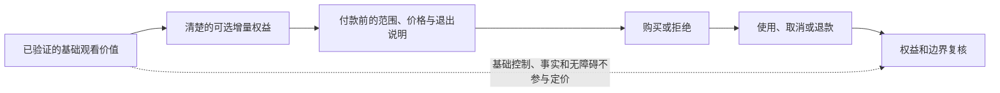
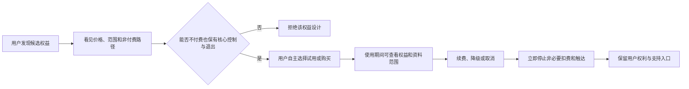
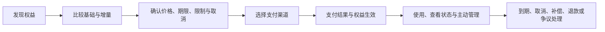
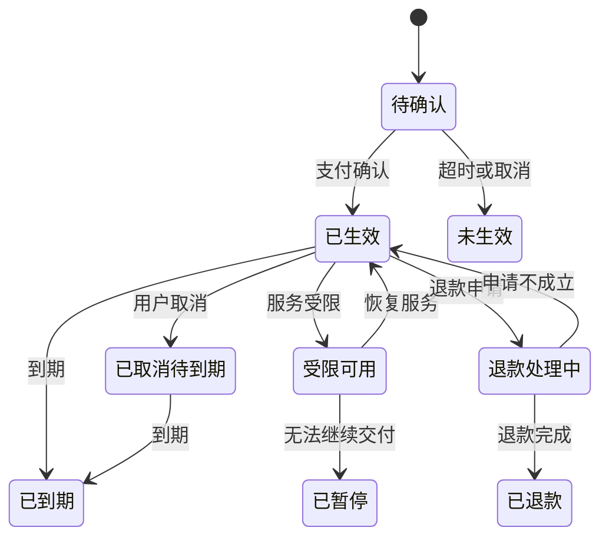

# 商业化产品与付费路径

> 方案形成时间：2026-01-28。



## 1. 先确定一件事：付费不能购买用户的退出困难

首轮商业化要回答的不是“怎样尽快变现”，而是“当用户完全可以不付费、可以随时结束一场陪看时，哪些增量价值仍值得被公平交换”。对于一个陪看型人工智能产品，最危险的收入并非来自低转化，而是来自用户误以为必须续费才能保持关系、害怕关闭功能会失去被理解的感觉，或在赛中情绪高涨时被设计推向冲动购买。

因此，本篇把商业化视为一种可撤回的服务契约：用户在付款前理解自己买什么、何时到期、怎样停止、服务收缩时如何得到处理；团队只为明确、可解释、可交付的增量能力收费；基础的安全、静音、退出、投诉、删除、无障碍和不被操控的体验不参与定价。首轮不把“陪伴时长”“情绪强度”“关系阶段”“孤独感”或“连续打卡”当作收费杠杆。

本篇是一份发布前的产品与经营设计，不是对收入、成本、续费率或价格接受度的事后描述。所有金额、阈值和周期都是研究假设，必须在受控研究后重估；不同地域、渠道和支付平台的实际要求应由相应专业人士复核。

### 1.1 服务范围与首轮商业假设

假设首轮服务面向能自主作出消费决定的成年人，围绕一场主动选择进入的足球观赛时刻提供语音或文字陪看、有限的表现层互动、用户可控的偏好设置，以及不保证实时性的赛事背景说明。服务不包含转播权、官方赛事认证、赌博建议、医疗心理服务、现实社交替代或“永远在线”的承诺。

候选付费对象只包括三类清晰增量：

1. **单场增强体验**：在用户主动进入的一场比赛中，获得更完整的声音、表现或主题表达；
2. **短周期会员**：在明确周期内获得若干可解释的自定义体验，例如表达偏好、赛程整理或较高的使用配额；
3. **可选主题包**：购买与特定赛事氛围有关、但不包含受限制赛事素材的视觉或表达主题。

首轮不开放随机奖励、抽取式商品、亲密度解锁、按沉默焦虑加价、自动升级套餐、不可取消的长期合约、以分享私密记忆换折扣、以邀请朋友换关系权益，或任何需要用户在比赛紧张时才能看懂的交易规则。

### 1.2 成功如何定义

商业化通过的定义同时包含四类信号：

- **价值清晰**：用户能在付款前复述权益、期限、限制和取消方式；
- **使用自愿**：付费用户在体验后仍认为不续费也不会失去基础权利或被角色责备；
- **交付可信**：支付成功、权益生效、服务中断、退款或补偿都能在承诺时限内得到可解释处理；
- **经济可持续**：每一次交易的净收入在扣除支付、渠道、计算、内容、安全与支持成本后，仍能覆盖服务所需的合理投入。

任何收入指标都不能独立成为“成功”。若退款、后悔、投诉、误解、无意续费或高风险依赖信号同时上升，即使销售额增长，也应视为需要收缩的失败模式。

## 2. 研究底座：付费意愿不是一个按钮数据

### 2.1 从“愿不愿意付”到“为何觉得值得”

用户说愿意付费，可能是在礼貌支持概念、比较现有替代品、期待尚未提供的能力，或担心免费版被削弱。只有把价值拆到具体时刻，才可能区分真实交换和被误导的同意。研究应围绕观赛前、赛中、赛后分别询问：用户希望更少做什么，想获得什么控制感，什么体验会让其主动再次选择，什么又会使其觉得被打扰或被收费墙惩罚。

候选价值不能只写“更陪伴”。应改写为可验证的结果，例如：用户可在开赛前更快设置想听与不想听的内容；赛中能更容易以自己的节奏获得简短回应；赛后能回顾自己选择保存的观察；网络不佳时仍能清楚知道服务正在降级，而不是不知道付费权益为何消失。这些结果可以通过原型、任务观察、访谈和小范围使用研究验证。

### 2.2 外部研究带来的约束

行为科学与消费者保护研究反复提醒，界面可以通过默认勾选、确认羞辱、隐藏取消、伪稀缺和干扰性提示，使用户做出不符合自身偏好的决定。美国联邦贸易委员会将此类操控性界面归入“暗黑模式”问题。首轮把这一研究转成明确禁令：不预选高价方案；不把取消写成失去角色关心；不在拒绝购买后弹出羞辱或恐惧文案；不以倒计时模拟不存在的供给稀缺；不把一键试用变成难以退出的续费。

订阅研究也表明，用户对取消、续费和账单的理解是信任的基础。因此，首轮选择比市场常见做法更直接的路径：购买前展示总价与周期；购买后立刻在设置与订单页显示结束入口；自动续费若存在，采用独立确认与提前提醒；用户取消后仍保留已付周期内的已承诺权益，除非发生安全或法律上的必要收缩。

### 2.3 需要被证伪的核心假设

**假设编号：H1**
- **假设**：用户愿为明确的单场增强体验支付，而非为关系亲密支付
- **若不成立意味着什么**：应保留免费基础体验，重做价值表达
- **首轮验证方法**：概念卡排序与支付意愿访谈

**假设编号：H2**
- **假设**：用户能区分会员权益与基础安全、退出权利
- **若不成立意味着什么**：方案存在强迫感或说明失败
- **首轮验证方法**：购买前复述任务

**假设编号：H3**
- **假设**：短周期、随时结束的方案比长期承诺更符合观赛节奏
- **若不成立意味着什么**：需要调整周期或暂不订阅化
- **首轮验证方法**：时长偏好与模拟选择研究

**假设编号：H4**
- **假设**：清楚的服务降级与补偿能保留信任
- **若不成立意味着什么**：交付风险超过商业价值
- **首轮验证方法**：故障情境访谈与客服演练

**假设编号：H5**
- **假设**：单场和短周期收入可覆盖增量成本
- **若不成立意味着什么**：不能规模化开放付费
- **首轮验证方法**：单位经济情景计算

**假设编号：H6**
- **假设**：不使用关系化催费不会使价值感消失
- **若不成立意味着什么**：产品价值依赖不健康机制
- **首轮验证方法**：对照文案研究与反感度测量

## 3. 商业化原则：先划不可售卖的边界

### 3.1 永远不收费的基础权利

以下能力即使带来成本，也不能成为付费门槛：静音、结束本场、关闭主动提醒、拒绝保存记忆、访问隐私说明、提出删除或导出请求、投诉与申诉、了解人工智能身份、理解赛事信息的不确定性、无障碍调整、基础安全收缩与紧急帮助提示。原因并不复杂：这些不是“高级功能”，而是用户能自主使用服务的前提。

同样，服务不应以付费为条件才承认用户的观察或情绪，也不应让免费用户得到更激进、更黏附的角色表达以逼迫升级。免费与付费的差异必须体现在可解释的容量、表现或自定义上，而非尊重程度、回应礼貌或退出难度上。

### 3.2 可研究的增量权益

首轮只考虑以下满足四项条件的权益：用户在购买前能理解；不购买时基础体验仍完整；可通过客观状态确认是否交付；服务受限时可公平补偿。

**权益类别：单场增强**
- **候选内容**：一场内更丰富的声线、动作和主题氛围
- **明确不包含**：转播、官方数据特权、现实陪伴承诺
- **为什么可研究**：与一场主动观赛直接关联，可随比赛结束

**权益类别：个性设置**
- **候选内容**：更细的表达偏好、静默规则、主题组合
- **明确不包含**：推断敏感身份、锁住关系阶段
- **为什么可研究**：用户自己控制的可见体验差异

**权益类别：赛程工具**
- **候选内容**：更清楚的个人赛程整理与提醒选择
- **明确不包含**：默认高频推送、替用户做观看决定
- **为什么可研究**：降低组织成本，可随时关闭

**权益类别：主题包**
- **候选内容**：原创、权利清楚的视觉和语音表现主题
- **明确不包含**：球队标识、球员肖像或受限素材
- **为什么可研究**：交付边界和使用范围可明示

### 3.3 明确禁止的收入机制

禁止把“你不买我就失望”“只剩最后一次和我一起看”“为了我们继续记住彼此”此类情绪绑架写进角色或页面；禁止基于用户表达的孤独、失落、家庭冲突、健康处境等脆弱信息做定价、折扣或促销；禁止用虚假的剩余名额、实时滚动成交或不可验证的朋友推荐制造压力；禁止故意让免费版变差以惩罚不付费；禁止让角色代替支付页面解释条款或引导用户绕过理性判断。

这些禁令会放弃部分短期转化手段，但避免将收入建立在依赖、误解或羞耻上。对于长期品牌，能体面地不买，正是付费信任成立的条件。

## 4. 付费产品架构：先少后多，而不是一次堆套餐

### 4.1 三层产品结构

建议首轮采用“基础体验 + 单场增强 + 短周期会员”的三层结构，并将主题包保持为研究候选而非首发必备。

> 信息卡：原宽表已改为纵向阅读，字段含义不变。

- **层级：基础体验**
  - **用户目的**：试用并自主陪看
  - **提供内容**：核心对话、静音、结束、基础设置与安全入口
  - **时限**：无需订阅
  - **退出方式**：直接离开或删除资料

- **层级：单场增强**
  - **用户目的**：为一场具体比赛丰富表现体验
  - **提供内容**：已说明的表现、声线或节奏定制
  - **时限**：明示到比赛或指定时间结束
  - **退出方式**：不自动转为其他商品

- **层级：短周期会员**
  - **用户目的**：频繁观赛时减少重复设置
  - **提供内容**：明示数量的自定义与赛程工具
  - **时限**：7 天或 30 天等固定周期假设
  - **退出方式**：一处取消，不需联系客服

首轮只开放一个会员层级，避免“基础、银、金、钻石”让用户用价格猜测尊重程度。层级增加应晚于用户研究已证明用户能理解每个差异、客服能解释每个例外、成本能支持每个承诺之后。

### 4.2 单场增强的设计

单场方案应以可感知、非关系化的体验为核心。用户在进入付款页前看到：适用的比赛或有效窗口、具体增强项、不能提供的内容、比赛延期或取消时的规则、网络或安全收缩时的补偿、总价、支付渠道和客服入口。若用户未在明确窗口内使用，不应自动换成另一个不等价权益；应提供清楚的失效或转换规则。

首轮假设的补偿原则是“未交付则不把成本留给用户”：若核心增强因服务原因在大部分有效窗口不可用，用户可选择等值单场补偿、原路退回或由其主动选择的替代，不以必须再次消费为前提。具体退款条件应随支付平台和当地规则复核，但页面不得故意模糊“服务原因”与“用户网络原因”。

### 4.3 短周期会员的设计

会员应服务于稳定而非焦虑的使用节奏。首轮的周期候选为 7 天与 30 天，目的不是鼓励连续在线，而是让有多场观赛计划的用户减少重复设置。权益采用可数、可关、可见的表述，例如“可保存的自定义规则数量”“可选择的主题组合”“每周期包含的增强场次”，避免“更懂你”“更亲密”这类无法验收的语言。

自动续费是一个单独决策，不应在首轮默认开启。若研究确实显示用户想要，必须满足：购买页单独说明续费金额、频率和日期；用户主动确认；临近续费发送不依赖推送权限的可见提醒；设置页和订单页都可取消；取消不诱导用户联系客服或填写多页问卷；取消后清楚显示何时结束。任一条件无法交付时，使用手动续期。

### 4.4 主题包的边界

主题包必须以原创或权利清楚的素材为基础，且与比赛事实、球队官方身份和真实人物区分。它可以改变用户界面色调、通用观赛氛围、角色动作编排或非特定声线，但不能暗示获得某球队、联赛、运动员或转播机构的官方背书。若主题依赖难以确认的素材权利，先不售卖；视觉吸引力不是绕开权利判断的理由。

## 5. 价格设计：把数字当成待验证的假设

### 5.1 价格原则

价格至少满足五项：一次看到总价；同一地域同一时点的同一权益价格一致，除非有公开、合理且非脆弱性导向的差异依据；不通过复杂叠加让用户难以计算；不以倒计时、假稀缺或角色施压推动选择；任何涨价或权益变更都在生效前给出清楚选择。对于有无障碍需求或支付受限用户，不能用歧视性限制把基础权利变为高价附加项。

### 5.2 首轮价格卡（仅用于研究）

下表金额以人民币为首轮访谈锚点，不是公开报价，也不应在未经成本与渠道复核前上线。其目的仅是让研究参与者比较价值边界，而非让团队先决定“目标客单价”。

**方案：单场增强**
- **研究锚点**：3—9 元/场
- **价值假设**：对偶发的重要比赛，用户愿为清楚的表现增强付少量费用
- **需要验证的问题**：是否被理解为一次性，是否有赛后后悔

**方案：7 天会员**
- **研究锚点**：12—18 元/周期
- **价值假设**：密集赛程用户愿为少量自定义和若干增强场次付费
- **需要验证的问题**：是否能看懂周期与到期日

**方案：30 天会员**
- **研究锚点**：28—38 元/周期
- **价值假设**：稳定观赛用户愿以较低单场成本购买确定性
- **需要验证的问题**：是否会造成被遗忘续费或用量焦虑

**方案：原创主题包**
- **研究锚点**：4—12 元/包
- **价值假设**：少数用户重视可控的外观表达
- **需要验证的问题**：是否不影响基础体验的公平性

如果研究发现用户愿付的原因是害怕失去角色记忆、担心免费版被冷落或误以为是观看比赛的必要费用，任何看似很高的支付意愿都应被排除，不能用来支持提价。

### 5.3 价格研究方法与防误导规则

首轮优先使用访谈、概念卡、模拟选择和有限的人工确认研究，而不是直接对大量真实用户进行不透明的价格试验。研究中应让参与者看到完整价格、取消方式、服务限制和替代方案；研究结束后说明这是设计研究，不制造“马上失去优惠”的假象。

可使用三种互补方法：

1. **价值排序**：让用户排序“更丰富的表现”“更少的设置工作”“赛程整理”“主题外观”等具体结果，排除“关系变深”类选项；
2. **价格敏感度访谈**：询问何价位显得便宜、合理、昂贵和不可接受，并追问其判断依据；
3. **理解度任务**：给出一个真实付款页样稿，要求用户找出总价、期限、取消、补偿和基础版差异。

价格策略若在不同小组间不同，必须保证研究告知、权益与退出权相同，且不得基于敏感资料、脆弱表达或推测出的支付能力定价。首轮不将个体画像用于动态定价。

## 6. 从发现到结束的交易旅程



### 6.1 旅程总览

一笔健康的交易不只是“点击购买”。它应包含七个用户可见状态：发现、比较、确认、支付、交付、管理、结束/修复。每个状态都提供离开的路，且离开不会被角色化语言阻挡。



### 6.2 发现：由用户发起，不追逐赛中情绪

入口应出现在用户主动浏览设置、主题或单场增强时，而不是在进球、失误、争执、深夜连续使用或表达脆弱情绪后突然弹出。页面先说明“基础体验仍可继续”，再解释增量能解决的具体问题。若用户关闭入口，在合理时间内不重复追问；若用户在比赛中选择安静，所有商业提示一并安静。

验收是：没有任何触发条件依赖情绪、关系阶段、脆弱内容或连续使用时长；研究参与者能指出如何继续使用基础体验；关闭入口后不出现角色劝说。

### 6.3 比较：让用户看到差异，也看到不变的权利

比较页采用两栏或三栏：基础、单场、会员。每栏先列“你始终拥有”，再列“本方案增加”，最后列“不包含”。禁止只用对勾营造付费方案全胜的印象；对基础项也要写明它是完整、可用、可安全退出的体验。文字应该具体，如“本场可选三种声线与节奏规则”，而非“更高等级关怀”。

比较页必须显示价格含税或其他必要说明、是否自动续期、到期时间、退款规则摘要和完整规则入口。无论用户选哪层，静音、结束、删除、投诉和无障碍都在同等位置可见。

### 6.4 确认：双重确认交易，而不是双重阻拦退出

确认页用一段不超过八十字的摘要说明“你将支付什么、获得什么、到什么时候、怎样停止”。用户以明确动作确认自动续费（若有）与即时生效；不能以继续使用、关闭弹窗或默认勾选视为同意。确认页还应说明在比赛取消、延迟、服务降级时用户的选择。

高风险场景增加一个冷静提示，而不是强化促销：若用户在短时间内多次购买或刚表达明显不适，页面仅提示“你可以稍后决定，基础体验无需付费即可继续”，不推断其心理状态，也不阻止其正常消费。目的是降低冲动，而不是进行画像。

### 6.5 支付：结果必须确定、可追踪、可解释

支付环节可能出现成功、失败、待确认、重复扣款疑虑、渠道取消和网络中断。每种结果需要用户看得懂的页面：成功给出订单号、权益、到期和管理入口；失败说明未完成而不是暗示用户信用问题；待确认说明何时自动更新和怎样联系客服；疑似重复扣款时立即冻结重复权益售卖并进入人工核查。

支付凭证和技术状态之间发生不一致时，优先保护用户：不让用户反复付款来“解锁”，不让角色把付款失败人格化，也不要求用户提供不必要的敏感资料。客服只能为验证必要性请求最少信息，并说明保存与使用范围。

### 6.6 交付：把权益变成可看见的状态

权益生效后，用户在一处能看见当前方案、剩余有效期、已启用设置、下次续期（若有）、取消入口和补偿入口。增强能力暂不可用时，页面说明是网络、赛事、维护、安全收缩还是其他原因；不得把不确定状态藏在加载动画后。若某项权益因安全或权利问题被临时关闭，应说明用户是否得到延期、替代或退款选择。

交付验收应采用用户任务：新用户在不求助情况下，能在两分钟内找到已购买内容、期限、关闭自动续期和故障帮助。若不能，问题不是“用户不会用”，而是信息架构需修改。

### 6.7 管理与结束：取消应和购买一样直接

用户取消会员后，页面确认取消何时生效、在此之前仍可使用哪些权益、是否还有已安排扣款、怎样重新开通；不展示羞辱性挽留，不要求说明原因才能结束。可选的简短反馈应默认为跳过。单场权益结束时，给出中性提示与订单入口，不把比赛结束包装成角色离别。

退款和补偿分流应清楚：未授权或重复扣款、未交付、误购、渠道争议、比赛变化、用户主动取消分别进入什么路径；每条路径的预计处理时限、所需最少资料和下一步都可见。无法立即决定时，先确认收到，再告知何时更新。不要让用户在多个客服入口之间重复叙述。

## 7. 权益状态机与异常处理

### 7.1 状态定义

每项付费权益建议有以下业务状态：`待确认`、`已生效`、`受限可用`、`已暂停`、`已取消待到期`、`已到期`、`退款处理中`、`已退款`、`争议处理中`。状态名称可以改为更友好的用户语言，但含义必须稳定，且同一订单不可同时处于相互冲突的状态。



状态机的目的不是追求复杂，而是让支付、客服、权益展示和补偿判断使用同一事实。任何人工处理都应留下理由、时间、处理人角色和对用户的通知；但不应要求用户知道内部分类才能获得帮助。

### 7.2 必须预演的异常

**异常：扣款成功但权益未显示**
- **用户首先看到什么**：明确说明正在确认，不要求再次付款
- **团队的默认动作**：核对订单并临时保护用户权益
- **处理门槛**：超过承诺时间转人工处理

**异常：权益显示但核心服务不可用**
- **用户首先看到什么**：解释受限原因和可选补偿
- **团队的默认动作**：暂停新增售卖，评估影响范围
- **处理门槛**：影响达到核心窗口时触发退款选择

**异常：赛事取消或明显改期**
- **用户首先看到什么**：说明可保留、转换或退款的选项
- **团队的默认动作**：在规则范围内让用户主动选择
- **处理门槛**：不默认转成不等价商品

**异常：用户说并非本人购买**
- **用户首先看到什么**：立即给出争议入口和临时保护说明
- **团队的默认动作**：依据支付渠道规则核查
- **处理门槛**：不要求其向角色解释私人情况

**异常：疑似重复扣款**
- **用户首先看到什么**：说明订单状态与预期时间
- **团队的默认动作**：阻断重复交付或重复售卖
- **处理门槛**：确认后原路处理或说明下一步

**异常：用户取消后仍被续费**
- **用户首先看到什么**：先承认并保护用户，再核查
- **团队的默认动作**：停止后续扣款，优先退款判断
- **处理门槛**：属于高优先级事故，必须复盘

### 7.3 服务降级时的商业原则

付费不能让用户获得比免费用户更少的安全保护。发生容量、来源、权利或安全问题时，先收缩高风险表现、主动提醒与新售卖；如核心已付能力不可用，再启动补偿。不能为了降低退款数字而把故障解释为“用户没有正确使用”，也不能用无关的虚拟物品替代用户本来购买的服务。补偿方案要让用户选择，并说明各选择的价值与期限。

## 8. 单位经济：把所有成本都算进“可持续”

### 8.1 为什么不能只看支付金额

一笔交易的收入不是可用收入。首轮模型需要扣除支付与渠道费、计算和语音成本、许可或内容成本、客服与退款成本、安全审核与值守成本、基础设施、税费以及为用户权利请求保留的运营成本。若只计算模型调用或支付费，会把安全、支持和删除处理当成免费的外部性，最终压力会回到用户体验上。

### 8.2 候选公式

```text
单笔贡献 = 实收金额
         - 渠道与支付费用
         - 增量计算与语音费用
         - 增量内容或许可费用
         - 预计客服、退款与争议成本
         - 分摊的安全、隐私与运行成本

周期贡献 = 周期内单笔贡献总和 - 获客与合作成本 - 固定运营分摊
```

所有分摊方法必须写明假设，尤其是低量阶段。不能因为用户量小就把人工值守、事故演练或投诉处理忽略；它们恰恰是首轮成本最高、也最需要被价格覆盖的部分。若模型显示必须依靠用户难以退出、极低退款率或过度使用才能为正，应回到产品范围而非压缩保护措施。

### 8.3 三种情景而非一个预测

**情景：保守**
- **支付与使用假设**：低转化、低频使用、支持成本高、退款正常
- **经营含义**：证明基础体验不能靠付费覆盖
- **决策**：缩小付费范围，继续研究价值

**情景：基准**
- **支付与使用假设**：少量高意愿用户购买，使用节奏稳定，退款处于预期
- **经营含义**：可以维持受控开放
- **决策**：维持单一方案，不急于扩层

**情景：压力**
- **支付与使用假设**：赛事高峰导致成本上升、权益不可用、退款增加
- **经营含义**：短期收入不代表长期可行
- **决策**：暂停售卖、优先交付与补偿

情景模型应由不同角色共同审阅。商业负责人不能单独选择最乐观参数；安全与支持负责人应能指出哪些成本随着用户规模线性或跳跃式增加。

## 9. 商业指标与反指标

### 9.1 业务指标

首轮可观察：主动查看方案的人中能正确理解条款的比例、完成购买的人中成功获得权益的比例、购买后至少一次主动使用该权益的比例、用户主动续期或再次购买的比例、单笔贡献的区间以及客服首次响应时长。它们用于发现哪里价值或交付不清，不用于把个人行为变成压力目标。

### 9.2 必须并列的反指标

以下指标必须与收入同屏审阅：取消难度投诉、自动续费误解、退款率及其原因、支付后未交付比例、用户表示被催促或被角色挽留的比例、购买后负面情绪反馈、脆弱场景触发购买入口的次数、权益受限期间仍继续售卖的次数、无障碍路径购买失败率、不同用户群理解度差异。反指标恶化时，停止扩大商业化，即使核心收入数据好看。

### 9.3 不能作为成功指标的数字

不使用连续付费时长、深夜购买率、赛中冲动购买率、用户对角色“舍不得离开”的表述、取消页停留时间、用户私密信息丰富度或提醒点击率作为正向目标。这些数值可能表面增长，却与用户自主性相冲突。

## 10. 放行门槛与停止条件

### 10.1 进入真实交易前的八道门

1. 基础体验不依赖付费，用户在研究中能完成静音、结束、投诉和删除入口任务；
2. 至少八成研究参与者能正确复述价格、期限、取消和主要限制；
3. 付款页、订单页、设置页和客服话术对同一权益的描述一致；
4. 支付成功、失败、待确认、取消、退款、赛事变化和服务受限的流程已演练；
5. 没有使用关系化、羞辱性、伪稀缺或脆弱性导向的促销；
6. 外部素材、渠道和支付服务的使用边界已被核实；
7. 退款、补偿、争议和投诉有负责人、时限和用户可见入口；
8. 保守情景下仍能承受首批交易的支持、安全和计算成本。

这八道门有一项未满足，就不对真实用户开放收费。可以继续做不收费的价值研究，但不得用“先卖一点看看”替代用户保护。

### 10.2 自动暂停售卖的条件

出现以下任一情况，应立即停止新增购买入口：支付页面与实际权益不一致；取消入口不可用或误导；同类未交付投诉连续出现；重大来源或权利争议未确认；角色或页面以关系压力促进购买；高风险内容事件使值守无法覆盖；供应商条件变化导致用户资料或付款处理边界不清。暂停不等于对已付用户失联，反而要优先履行已作出的交付、通知和补偿。

### 10.3 恢复条件

恢复售卖至少需要：问题原因已被确认；受影响用户已获得通知与处理；页面、流程或供应链控制已改正；同类情境已重新演练；独立于销售目标的负责人确认风险下降；恢复范围、观察期和下一次复核日期被写明。没有证据的“修好了”不应成为恢复理由。

### 10.4 首轮交易观察计划

真实交易开放后，前六周不以扩大套餐或提高价格为目标，而以回答四个问题为目标：用户是否买到了其理解的东西；用户是否能毫不费力地管理或结束；服务受限时团队是否先保护交付再考虑收入；不购买的用户是否仍获得完整而被尊重的基础体验。每周只选择一个主要改动变量，例如比较页文字、单场有效窗口或订单状态说明；不要同时改价格、权益、渠道和促销，否则无法判断误解或满意来自哪里。

这里的取舍是明确的：放慢增长与收入实验，换取对误解、后悔和履约缺口更可靠的解释；减少可变价格与复杂套餐，换取更公平、更容易支持的交易。首轮不需要证明每种收入机会都能做，只需要证明已有路径不靠用户的困惑和依赖也能成立。

观察样本必须包含主动取消、退款、未购买、低频使用和无障碍路径用户，不能只听顺利付款且频繁使用的人。访谈邀请不应由角色发出，也不应向用户暗示提供正面反馈能换取关系、折扣或优待。研究记录默认使用最少资料，并将支付凭证、私密表达和问题描述分开管理。

每周商业审阅可采用四个结论：维持范围；修改说明后维持；缩小权益、渠道或时段；暂停售卖。若发现退款原因集中在条款看不懂、自动续费不知情、核心权益未交付或感到被情感催促，直接进入收缩结论，不先设计更强的挽留策略。把用户后悔解释为“漏斗优化机会”，会错过最重要的产品信号。

六周结束时，决定是否继续前必须形成一份简短学习报告：哪些价值被用户主动说清，哪些权益被误解，哪些异常最难修复，实际支持与安全成本是否落在合理区间，哪些用户群的完成路径更长，以及下一轮最小范围是什么。报告既要记录继续的理由，也要记录没有做什么及其原因，例如暂不自动续费、暂不增加层级、暂不使用个体化价格。

## 11. 团队运行机制：每一项收入都应能被解释

### 11.1 每周商业审阅

固定审阅不超过六十分钟，输入包括权益交付、退款原因、用户理解度、反指标、成本情景、促销素材与待决例外。会议只回答六个问题：用户买到的是不是其理解的东西；不买是否仍被尊重；出现问题时谁承担了成本；哪项指标显示压力或误解；哪些外部变化需要重审；本周是否应该缩小而不是扩大。

### 11.2 新权益的最小提案

任何新商品、折扣、套餐或合作促销，在展示前都需提交一页提案：用户任务、基础与增量差异、不可售卖边界、完整价格、取消与补偿、数据使用、来源与权利、风险场景、成本假设、研究计划、停止条件和负责人。无法写清这些内容的想法，说明尚不适合面对用户。

### 11.3 客服与角色表达隔离

角色可以解释“你可以在设置中查看方案”，但不应承担销售劝说、退款谈判、争议判断或挽留任务。交易解释应由中性的页面与客服完成；角色遇到付款、后悔或脆弱表达时，默认退回用户选择，例如“基础体验也可以继续；如果你想处理订单，可以打开帮助入口”。隔离可以减少情感拟人化对消费决定的影响。

## 12. 公开来源与访问记录

以下资料用于研究交易透明度、消费者保护和可访问性；访问日期：2026-01-28。它们不是对某一具体地域、渠道或商品的法律结论。

1. 国家法律法规数据库，《中华人民共和国消费者权益保护法》检索入口：https://flk.npc.gov.cn/
2. 国家法律法规数据库，《中华人民共和国电子商务法》检索入口：https://flk.npc.gov.cn/
3. FTC, Bringing Dark Patterns to Light：https://www.ftc.gov/reports/bringing-dark-patterns-light
4. eCFR, 16 CFR Part 425 — Recurring Subscriptions and Other Negative Option Programs：https://www.ecfr.gov/current/title-16/chapter-I/subchapter-D/part-425
5. OECD, Recommendation of the Council on Consumer Protection in E-commerce：https://legalinstruments.oecd.org/en/instruments/OECD-LEGAL-0422
6. W3C, Web Content Accessibility Guidelines 2.2：https://www.w3.org/TR/WCAG22/
7. Apple, App Review Guidelines：https://developer.apple.com/app-store/review/guidelines/
8. Google Play, Payments policy：https://support.google.com/googleplay/android-developer/answer/9858738
9. UK Competition and Markets Authority, Cases and projects：https://www.gov.uk/cma-cases

## 13. 结论：值得付费，首先要值得自由拒绝

健康的商业化不是把每一场比赛变成销售机会，而是让少数明确的增量能力在用户想要时可买、在不想要时可关、在未交付时可修复。首轮应以单一、清楚、可取消的路径证明价值和交付能力；等到理解、成本、支持和安全都能承受，再讨论扩展。任何需要用户害怕离开才能成立的收入，都不应进入这个产品。
