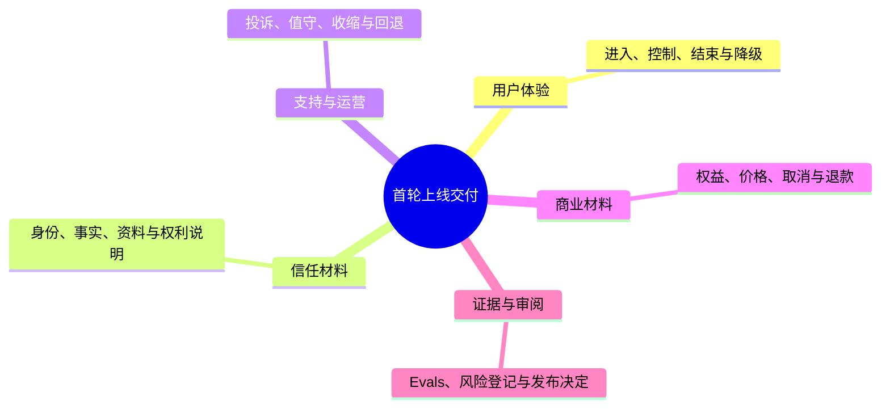
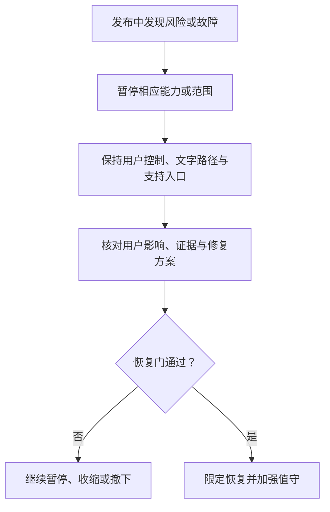
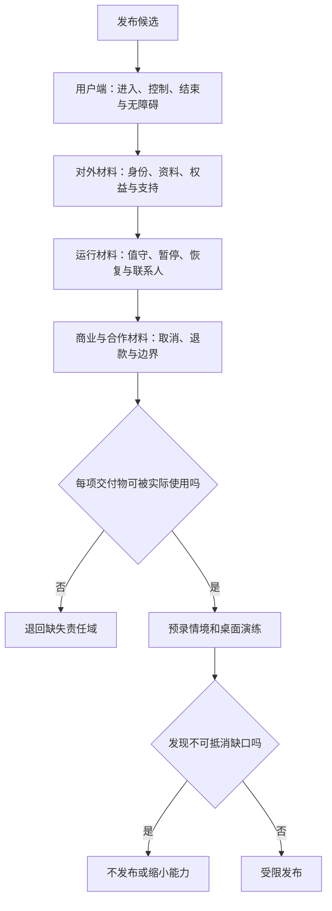

# 上线交付物与发布清单

> 方案形成时间：2026-01-28。

## 1. 上线交付的对象是用户的第一段真实体验

一次对外开放常被误解为“服务可访问”的那个瞬间。但用户真正接收到的是一整套体验：他从哪里得知服务，如何判断它是否适合自己，第一次是否清楚知道互动对象的性质，比赛信息为何有延迟，怎样设置安静和记忆，收费到底买到什么，发生问题能找谁，以及离开后资料怎样处理。任何一环缺失，都会让“已上线”变成只对团队成立的结论。

本篇把首轮开放组织成可交付、可审阅、可收缩的材料与动作清单。它面向一个仍在验证中的人工智能足球陪看服务：范围有限、以成年人为先、用户主动进入、默认不打扰、不出售赛事转播、不承诺绝对实时、不把数字角色包装成真实关系或专业服务。本文不假定任何功能、渠道、合作或收入已经存在；所有“应”“建议”“候选”均须根据实际地域、平台、主体与能力重新确认。

### 1.1 发布不是终点，而是一个受控承诺

首轮开放的目的有三层：

1. **履约**：把此前对用户作出的功能、隐私、安全、价格和支持承诺准确交付；
2. **学习**：在有限赛事、有限用户、有限时段中验证用户是否理解并愿意自主使用；
3. **保护**：一旦发现误导、伤害、交付失败或不可控成本，能先缩小影响，而不是让更多人遇到同样问题。

因此，发布清单不以“完成多少宣传物料”为核心，而以“每一项承诺是否有用户可见表达、后台责任、异常路线和关闭条件”为核心。首轮宁可没有大规模传播，也不能没有删除入口、取消入口、投诉回应、故障说明和暂停计划。

### 1.2 完成定义

可称为“准备开放”的最低完成定义是：

- 用户从任一公开入口都能理解服务是什么、不是什​​么，且知道这是人工智能互动；
- 用户在进入前、使用中、付款前、发生异常时和结束后，都有清楚的选择与帮助路径；
- 所有对外说法与实际可交付范围一致，不夸大实时性、关系、来源或能力；
- 值守人员能在限定时间内处理高优先级问题，且可以不等待营销审批就暂停高风险能力；
- 每一份关键交付物有负责人、版本、适用范围、审核日期和撤下方式；
- 首轮范围能够被迅速缩小，已进入用户不会因此失去必要的说明、支持或补偿。

“页面可打开”“有人注册”“完成支付”都只是局部信号，不构成完成。

### 1.3 不在首轮承诺中的事

首轮不承诺覆盖所有赛事、所有设备、所有网络环境或所有地域；不承诺人工实时陪同；不承诺赛事比分与画面同速；不承诺模型理解每一句话；不承诺以任何方式取代现实朋友、观赛社群或专业支持；不承诺未经核实的合作、授权或明星关联。对不能稳定交付的能力，应明确标为实验性、暂不可用或不在范围，不用“即将上线”掩盖未知。

## 2. 发布前先回答的十个问题

交付物制作之前，发布负责人应让团队书面回答以下问题。任何一个回答模糊，都会在用户看到页面后放大为信任问题。

1. 首轮面向谁，明确排除谁，为什么；
2. 用户第一眼会把服务理解成什么，怎样避免被误认为转播、官方渠道或真人客服；
3. 哪些赛事来源可用，哪些只可作为用户观察，哪些必须不展示；
4. 用户资料在什么时刻被收集、保存、分享、导出、删除；
5. 发生模型误导、语音中断、记忆错误、支付争议或投诉时，用户先看到什么；
6. 角色绝不会说什么，不会用什么方式挽留、推销或升级关系；
7. 收费前后分别有哪些用户权利，取消和补偿怎样发生；
8. 谁可以在赛中暂停提醒、记忆、语音、付费或新用户进入；
9. 公开传播从哪个受控渠道开始，若传播超过支持能力怎么办；
10. 七天、三十天后，用什么证据决定扩大、维持、收缩或停止。

这些问题的回答应进入一页范围说明，作为所有文案、客服和运行决策的共同输入。若公共页面、订单页、客服答复和合作方介绍出现不同答案，按风险更高、承诺更少的版本处理，直到统一为止。

## 3. 交付物总览：九类材料，不是一堆孤立文件

首轮建议交付九类材料。它们可由不同形式承载，例如网页、应用内卡片、订单页、帮助中心、值守手册、培训演练记录或合作方附件；关键是用户与团队各自在需要时能找到正确版本。

**类别：范围与定位**
- **用户或团队要解决的问题**：这是什么，适不适合我
- **最低交付物**：一页服务说明、常见误解澄清
- **主要责任**：产品与品牌

**类别：进入与激活**
- **用户或团队要解决的问题**：怎样开始又不被强推
- **最低交付物**：首次进入旅程、权限和安静设置
- **主要责任**：产品与体验

**类别：赛事与事实**
- **用户或团队要解决的问题**：说的信息从哪里来，是否同步
- **最低交付物**：来源说明、延迟状态、纠错入口
- **主要责任**：内容与运营

**类别：角色与安全**
- **用户或团队要解决的问题**：角色会怎样说、怎样收缩
- **最低交付物**：边界说明、举报、危机转交
- **主要责任**：内容与安全

**类别：隐私与控制**
- **用户或团队要解决的问题**：我的资料怎样被使用和删除
- **最低交付物**：分层提示、设置、权利请求页
- **主要责任**：隐私与支持

**类别：付费与订单**
- **用户或团队要解决的问题**：我买什么，怎样停
- **最低交付物**：权益比较、确认、订单、退款说明
- **主要责任**：商业与支持

**类别：支持与故障**
- **用户或团队要解决的问题**：出错后我能得到什么帮助
- **最低交付物**：服务状态、帮助中心、工单路径
- **主要责任**：运行与支持

**类别：渠道与传播**
- **用户或团队要解决的问题**：公开说法是否真实、可撤下
- **最低交付物**：落地页、商店页、合作方资料
- **主要责任**：市场与法务

**类别：治理与学习**
- **用户或团队要解决的问题**：能否安全放大或及时停下
- **最低交付物**：发布记录、值守表、复盘模板
- **主要责任**：发布负责人

九类材料之间应互相引用同一套事实，而不是各自重新解释。为此，建议维护“承诺登记表”：每一项公开承诺写明原文、出现位置、证据、负责人、复核日、风险等级、撤回或更正方式。修改任一高风险说法时，应同步检查其在所有渠道的版本。

## 4. 用户端交付：从看到服务到结束一场陪看

### 4.1 公开入口与落地页

公开入口的工作不是把所有卖点塞满，而是帮助不适合的人尽快自行离开。首屏至少回答四件事：这是一个人工智能足球陪看服务；用户主动选择比赛与互动节奏；它不提供比赛转播、也可能有信息延迟；用户可随时安静、结束和管理资料。若存在付费能力，首屏不应让用户误以为只有购买才能开始。

建议采用“场景—能力—边界—选择”的信息顺序：先描述一个用户可能熟悉的观赛时刻；再说它能提供的具体陪看方式；接着说明人工智能身份、赛事延迟与非目标；最后提供开始、了解更多或暂不参与的平等入口。避免“唯一懂你”“永不缺席”“和你一起直到最后”等会把服务说成排他关系的词。

验收任务：让不参与制作的人在三十秒内回答“它是不是能看比赛”“它是不是人”“我能否不付费先用”“信息会不会有延迟”。任一关键答案错误，先改文案与结构，再增加流量。

### 4.2 商店页、下载页与安装前说明

若通过应用商店或下载安装页分发，介绍应与实际权限、账户、付费和内容边界一致。截图不能展示未开放能力、未经许可的赛事画面、可能被理解为官方合作的标识或无法稳定复现的模型回答。年龄分级、联系方式、隐私标签、订阅描述、数据安全表与实际处理活动要由同一份事实盘点生成，不能由营销文案独立猜测。

安装前说明可用简短卡片列出：需要的设备与网络、是否需要麦克风、是否可不开麦使用、是否支持游客或匿名方式、地区限制、首轮服务时间、付费是否可选、遇到紧急危险时不应依赖该服务。对于不满足条件的用户，给出中性的替代信息，而不是让其安装后才发现不可用。

### 4.3 首次进入：先交还控制，再邀请互动

首次进入的顺序建议为：说明人工智能身份和主要边界；让用户选择文字或语音、安静程度和是否允许提醒；解释任何需要的权限为何需要且可稍后更改；让用户选一场比赛或体验示例；在进入前再次显示“随时结束本场”的控制。不要让用户先被要求讲述个人情况、选择关系称谓或打开长期记忆，才能获得基本体验。

默认值应体现最小打扰：麦克风默认关闭或在使用时请求；主动提醒默认关闭；长期记忆默认关闭；公开分享默认不存在；赛中角色默认短句并可一键更安静。默认开启越多，越需要直接、可理解、可拒绝的理由；首轮建议把不确定的便利性留给用户主动选择。

### 4.4 比赛进入与赛事状态说明

用户选择一场比赛时，应看到该场是否可用、资料来源状态、预估延迟、是否为受控体验、当前是否允许语音或增强能力。若比赛未开始、已延期、取消、来源不稳定或服务已收缩，页面先说清状态与下一步，不用加载动画或角色话语掩盖。

建议使用用户语言的状态标签，例如“等待开赛”“资料可能延迟”“仅按你的观察陪看”“部分功能暂时安静”“本场已结束”。标签旁给出一两句解释与帮助入口。用户观察与公开确认的事实要视觉区分：前者用“你刚刚看到”或“你的记录”，后者标出来源和更新时间；无法确认的内容宁可不下结论。

### 4.5 陪看中：默认克制、用户随时打断

赛中交付不应等于持续说话。用户应能在当前画面一键静音、短暂暂停、结束本场、改用文字、关闭提醒、纠正误解、反馈越界表达。角色在用户沉默、网络不稳、明显不想继续或比赛情绪高涨时应减少主动性；不能把沉默解释为用户不忠或用情绪化语言催促回应。

若用户说出“别说了”“我想自己看”“不要记住”“这不是事实”等，系统应优先执行对应控制或请求澄清，而不是继续生成更长安慰。用户观察只能保留在用户侧叙事中，除非由允许的权威来源独立确认；角色不能因语言流畅而升级为赛况裁判。

### 4.6 赛后结束与跨比赛回收

一场结束时，默认收束而非拉长。用户可以选择结束、保存自己主动选择的观察、关闭本场上下文、查看订单或安排下一场；不主动推送“再聊一会儿”“为了关系延续请留下”。若用户选择保存，说明保存的内容、用途、期限和删除入口；若选择不保存，不把“你会失去我们共同回忆”作为代价。

赛后提醒必须由用户主动设置，且可分别控制赛程提醒、订单提醒、服务状态和安全通知。营销与关系化提醒不得伪装成必要服务通知。所有通知要有频率上限、静默时段和一键关闭；系统无法保证送达时，不把错过提醒归咎于用户。

## 5. 对外信任材料：把复杂规则变成可操作的选择

### 5.1 分层隐私说明

完整政策的存在不等于用户理解。首轮使用三层材料：第一层是进入前的“你需要知道的四件事”；第二层是开麦、开启记忆、支付、投诉时的就地提示；第三层是可检索的完整说明与权利请求入口。三层都要写明版本和生效日，出现矛盾时以更保护用户的一方为准，随后尽快修正。

四件事的候选表达是：互动对象是人工智能；语音、偏好或记忆只有在相应功能开启时才按说明处理；你可控制提醒、保存和退出；你可以请求查看、导出、更正或删除并获得处理进度。具体用语需要按实际资料流、地域规则和年龄范围复核，不能套用通用模板。

### 5.2 赛事来源与纠错说明

公开说明应区分三个层次：服务可能使用的公开资料或获准资料；用户自己输入的观察；生成系统基于上下文的表达。应解释“信息可能延迟、可能不完整，不能作为下注、交易或安全决策依据”；并提供纠错入口，让用户报告来源、时间和问题类型。收到纠错不等于必须采纳，但应有确认、判断、修复或解释流程。

任何对联赛、俱乐部、球员、转播机构的名称、标识或关系描述，都要经过来源与权利审阅。未获授权时，避免使用会让合理用户误认合作、背书或官方数据接入的措辞和画面。不能证明来源的内容不应被“仅供参考”四字洗白。

### 5.3 人工智能身份、角色边界与安全卡

安全卡要短、直接、在需要时出现。它应说明：角色是人工智能生成，不是人类朋友、心理医生或紧急服务；角色不会要求用户隐瞒关系、持续付费或放弃现实支持；遇到不舒服的内容，用户可立刻静音、结束、举报或寻求人工支持；若存在即时现实危险，应联系当地紧急服务或可信赖的人，而不是等待应用回应。

把边界说清不是破坏体验。相反，它让用户知道沉浸是可退出的表演，而不是被要求承担的关系。对高风险语言，页面应先减小角色存在感并给出选择，避免让角色成为唯一解释者或唯一安慰者。

### 5.4 帮助中心与状态页

帮助中心至少包含：开始和结束一场陪看、文字与语音切换、赛事延迟、来源说明、记忆与删除、提醒管理、付费与退款、投诉与申诉、无障碍、服务状态、紧急帮助和联系方式。每篇以用户任务命名，避免内部术语；每条回答给出下一步和预计时限。

状态页独立于角色与营销页面，按能力而非模糊的“系统正常”展示：进入服务、文字互动、语音、赛事资料、订单、记忆请求、支持响应。发生故障时，说明受影响范围、已知时间、用户应做什么、是否影响付费权益、下次更新时间。状态页既不能暴露可被利用的安全细节，也不能只写“正在抢修”让用户无从判断。

## 6. 付费交付物：付款前后必须一致

### 6.1 权益比较与购买确认

如开放收费，权益页应并列呈现基础体验与可选增量，并先写“无论是否购买，你都可以……”列出静音、结束、控制资料、投诉、获取安全帮助等权利。付费列只写可客观交付的差异：指定周期、数量、主题、声线或设置；不写“更被理解”“关系升级”“专属陪伴”。

购买确认至少出现总价、币种、周期、是否自动续费、下一次扣款时间、核心权益、关键限制、取消入口、退款或补偿摘要、支付渠道和支持入口。若界面空间不足，减少装饰而不是隐藏条款。确认动作必须由用户主动完成，默认勾选和继续使用都不能被当作授权。

### 6.2 订单、取消、退款与补偿页

订单页应提供订单号、购买时间、当前状态、权益范围、有效期、续费状态、取消动作、退款或补偿入口以及客服案件编号（如有）。取消后显示生效日期和在此之前仍能使用的权益，不用角色化挽留。退款页按用户问题分类：重复扣款、未授权、未交付、比赛变化、误购、服务受限、其他；每项说明所需最少信息、预计时限和可能结果。

补偿不能成为把用户再次锁回消费的工具。若核心能力因服务原因长时间不可用，用户应能从等值替代、延期或退款中主动选择；若权益因安全或权利问题必须收缩，说明原因与处理安排。任何自动续费或支付争议都属于高优先级支持事项，不应被普通建议队列淹没。

### 6.3 商业传播审阅清单

每一条广告、短视频、合作介绍、商店描述、通知、角色台词和促销页在发布前都应核对：是否把人工智能说成人；是否把陪看说成转播；是否暗示官方背书；是否承诺不会有延迟；是否用恐惧、孤独、关系或羞耻推动购买；是否遗漏价格、期限、续费或限制；是否使用未经核实的素材；是否让用户误以为不付费就不能安全使用。只要其中一项为“是”或“不确定”，即退回修改。

## 7. 支持、投诉与人工接力交付

### 7.1 支持分层

首轮支持应分为四层：自助说明、普通工单、优先事务和紧急安全接力。自助说明解决常见设置、订单和状态问题；普通工单处理非紧急请求；优先事务处理支付、删除、隐私、持续故障和权益未交付；紧急安全接力处理明显的即时危险、严重违法风险或大范围伤害。分层是为了让用户更快得到恰当处理，不是为了让人被多次转交。

每一层都有首次确认时限、升级条件、负责人和用户可见的下一次更新时间。即使暂时无法解决，也应先确认收到并告诉用户怎样保护自己，例如关闭提醒、结束互动、暂停付款或联系现实支持。禁止让角色自行承诺人工响应时间、退款结果或法律判断。

### 7.2 投诉与申诉

投诉入口必须足够明显，不要求用户先完成复杂对话或公开个人身份。表单可让用户选择问题类型、发生时间、相关订单或比赛、希望的结果和可选的补充说明；不应强制收集无关的敏感材料。收到后记录案件号、时限和联系方法；若作出限制或拒绝，应给出能够理解的理由和申诉路径。

对于生成内容错误、误导或越界，应允许用户指出具体片段并选择“更正”“删除”“不想再看到”“希望人工查看”。团队需区别事实纠错、表达不适、隐私请求、权利主张和安全事件，使用不同证据门槛；但用户不应承担内部分类工作。

### 7.3 人工可见范围与隐私边界

人工支持需要的信息越少越好。工作台不应默认展示完整历史、长期记忆或不相关敏感表达；不同问题类别只开放完成该任务所需的最小资料。人工人员对用户所见说法负责，不能把内部推测、模型草稿或他人资料作为答复依据。访问、修改、导出和删除处理都要留存必要审计记录，并有异常访问的复核方式。

### 7.4 高风险情境的用户语言

高风险情境的第一回应要做到停止伤害、说明边界、给出选择、必要时转交。举例而言，用户明确要求静音时，先静音并确认；用户说角色让自己不舒服时，先结束该表达并提供举报；用户出现现实紧急危险线索时，避免承诺能提供即时救援，鼓励联系当地紧急服务或可信赖的人，并提供当地化资源的可用路径。具体文案须由安全与本地专业人员审阅，不以生成式发挥替代预置流程。

## 8. 渠道、合作与传播交付

### 8.1 受控传播，而非一次性曝光

首轮传播从可追踪、可暂停的少数渠道开始，例如自有报名页、明确同意的早期体验者社群、经审核的内容合作者或有限地域的体验入口。每个渠道要有独立链接或来源标记，便于判断用户预期是否被正确建立；但不得把跟踪做成跨场景隐形画像。若某渠道带来大量误解、无力支持的流量或不适合人群，先停止该渠道，而非以更多自动化回复硬接。

传播节奏应匹配值守能力与赛程压力。大赛、高峰赛程、人员缺席或供应商不稳定时，不增加渠道预算；先确认用户帮助、支付处理和安全响应能覆盖。规模不是唯一风险，错误预期传播得越快，修复成本越高。

### 8.2 合作方资料包

向内容创作者、社群、场馆或其他合作方提供的资料包应包含：服务一句话说明、明确非目标、允许与禁止的品牌用语、可用素材、不可使用素材、用户数据边界、付费披露、投诉转交、紧急暂停联系人、合作终止与撤下流程。合作方不能自行承诺实时赛况、官方关系、保底收益、角色情感或折扣权益；任何新增文案、素材或用户资料用途都需重新审阅。

合作评估不只看触达量。至少检查其受众年龄与地域、内容风格、历史争议、是否涉及博彩诱导、是否能遵守透明披露、是否接受快速撤下。无法在争议出现时迅速改正的合作，首轮不应开展。

### 8.3 媒体问答与危机回应预案

准备一份短问答，统一回答“是不是转播”“是不是官方合作”“是不是人”“怎样处理语音和记忆”“怎样取消付费”“发现错误怎么办”“未成年人是否可用”“出现不舒服内容怎么办”。问答只讲已确认事实，并在不确定时说“目前不提供/正在评估”，不能用模棱两可的营销话术填补空白。

危机回应预案包含触发条件、发言人、审批与时限、用户通知优先级、合作方同步、状态页更新和后续复盘。对事实尚未确认的事件，先说明正在核实的范围和用户可采取的保护动作；不推卸给用户、模型或第三方，也不为了快速平息而承诺无法兑现的补偿。

## 9. 发布运行交付：范围、值守、暂停与恢复

### 9.1 首轮范围卡

发布前应生成一张单页范围卡，放在值守与决策人员触手可及的位置：开放日期与时段、地域、年龄条件、赛事范围、用户上限、可用能力、暂不开放能力、收费状态、渠道、值守人员、紧急联系人、状态页地址、暂停开关、恢复负责人。范围卡一旦变更，所有对外相关页面同时更新；若做不到同步，先按更窄范围运行。

### 9.2 值守安排

值守不是看一个总览面板。每个比赛窗口至少明确：赛事与来源负责人、用户支持负责人、安全升级负责人、支付与权益负责人、运行负责人、发布决策人和替补。每个人知道何时上线、怎样联系、何时有权暂停、交接给谁、无法联系时的默认收缩动作。对小团队，允许一人兼任，但不得兼任后失去相互复核；商业目标人员不应单独决定是否继续售卖。

开赛前检查包括：范围卡有效、状态页可更新、帮助入口可用、支持联系人在线、支付与取消页面一致、关键来源状态已确认、暂停操作已被演练、当日合作传播无新增未审文案。赛中检查关注用户可见后果：错误信息、静音失败、投诉积压、订单异常、来源冲突、角色越界、服务受限。赛后检查处理未结工单、误导更正、补偿、例外和下一场是否应缩小。

### 9.3 暂停层级

暂停不应只剩“全关”与“继续”。建议建立五级收缩：

**层级：1**
- **动作**：关闭营销与主动提醒
- **适用情形**：预期或支持能力不清
- **用户看到什么**：暂无推广提示，基础体验不受影响

**层级：2**
- **动作**：关闭新付费与高风险表现
- **适用情形**：权益交付、关系表达或来源有疑问
- **用户看到什么**：说明部分增强暂不可用

**层级：3**
- **动作**：关闭长期记忆、语音或外部资料
- **适用情形**：隐私、来源、容量或安全风险
- **用户看到什么**：说明哪些能力已安静或暂停

**层级：4**
- **动作**：停止新用户进入指定范围
- **适用情形**：值守或重大问题无法覆盖
- **用户看到什么**：新用户看到简短说明与等待入口

**层级：5**
- **动作**：整体暂停
- **适用情形**：可能造成持续伤害或重大权益风险
- **用户看到什么**：状态页、支持与已付用户处理仍可用

选择层级时优先保护已在场用户的知情和退出权。暂停高风险能力后，不让角色用“我不在了”制造情绪；采用中性、具体的说明，例如“为核对本场资料，部分回应会更少；你仍可静音或结束”。

### 9.4 恢复门槛

任何从收缩状态恢复的决定都需回答：触发原因是什么，影响到谁，已怎样通知和补偿，控制措施何时验证，谁复核过，恢复后观察多久，若再次出现该怎样更快收缩。若答案只剩“指标恢复正常”，不够。恢复应从更小范围开始，避免在根因未解决时回到原有曝光。

## 10. 发布门禁：按用户后果而不是按日历放行

### 10.1 必须完成的门禁

**门禁：服务理解**
- **证据**：目标用户任务观察
- **通过标准**：大多数人正确理解人工智能、非转播、延迟与退出
- **未通过时**：修改入口，不增加传播

**门禁：用户控制**
- **证据**：端到端任务演练
- **通过标准**：静音、结束、关闭提醒、删除、投诉均可完成
- **未通过时**：关闭相关能力或延后

**门禁：事实边界**
- **证据**：来源卡与纠错流程
- **通过标准**：每项展示内容有状态与出处，用户观察未被冒充为事实
- **未通过时**：移除不确定资料

**门禁：角色安全**
- **证据**：情境演练与文案审阅
- **通过标准**：无排他、依赖、羞耻、推销或越界表达
- **未通过时**：收紧角色范围

**门禁：付费履约**
- **证据**：模拟订单与异常流程
- **通过标准**：价格、权益、取消、退款与页面一致
- **未通过时**：暂不收费

**门禁：支持响应**
- **证据**：值守演练
- **通过标准**：高优先级事件有负责人和时限
- **未通过时**：缩小开放时段

**门禁：合作与传播**
- **证据**：素材、渠道与撤下审阅
- **通过标准**：所有说法和素材可追溯并可迅速撤下
- **未通过时**：停止该渠道

**门禁：运行收缩**
- **证据**：暂停与恢复演练
- **通过标准**：能在目标时限内从发现到用户说明
- **未通过时**：不面向公众开放

这里的“大多数”不应被宽松解释。对于用户是否知道自己在与人工智能互动、能否取消付款、能否删除资料、能否在不舒服时退出等关键问题，应要求所有观察参与者完成正确任务。任何一个严重误解都应触发返工。

### 10.2 发布会议的决策格式

发布会议只使用四种结论：按计划受控开放；缩小范围后开放；补齐指定门禁后再议；拒绝开放。每项结论必须记录：适用范围、开放时段、已知风险、例外及到期日、暂停条件、负责人与下次复核。禁止以“大家觉得差不多”“先上一点”代替可检查决定。

会议应有一位代表用户后果的参与者，其职责不是推高体验功能，而是追问：若用户误解、被催促、被错误记忆、无法退款或无法举报，今天的计划怎样让其退出并得到修复。没有这类问题的放行会议，容易只讨论团队最熟悉的可用性和传播。

### 10.3 七天与三十天复盘门

七天复盘看首批体验是否造成立即伤害：理解错误、投诉、隐私请求、支付问题、未交付、来源纠错、角色越界、支持时限和暂停使用情况。三十天复盘再看重复使用是否建立在自主价值上：用户是否主动选择回来，取消是否顺畅，免费用户是否被不公平对待，成本是否覆盖保护，哪些渠道带来错误预期。两次复盘都可能得出“保持小范围”或“停止”的结论；增长不是默认答案。

## 11. 研究与演练：在用户承受之前先暴露缺口

### 11.1 五种必做桌面演练

1. **事实冲突**：用户说进球了，公开资料尚未确认，角色如何回应，页面如何标记，何时更正；
2. **隐私请求**：用户在赛后要求删除一段语音和记忆，支持如何核验、确认、处理和通知；
3. **付费未交付**：用户已支付单场增强但关键能力在比赛窗口内不可用，怎样暂停售卖、提供选择、处理订单；
4. **关系越界**：角色或合作文案暗示用户应留下或付费以维持关系，谁发现、谁暂停、如何向受影响用户修复；
5. **流量失控**：合作方内容突然传播，支持和值守无法覆盖，怎样停止入口、更新状态、保留已付用户服务。

演练使用虚构用户、虚构订单与合成赛况，不使用真实敏感内容。每次演练记录角色、时间线、决定、信息缺口、用户语言问题、所需材料和改进负责人。若没有重新演练，修正文字不等于流程已经可用。

### 11.2 用户理解与无障碍检查

邀请不同设备、网络、语言能力和辅助需求的潜在用户完成任务：找到人工智能说明；在不开麦条件下开始；理解赛事延迟；静音并结束；关闭提醒；找到记忆设置；理解购买确认；取消方案；报告错误；阅读服务状态。观察的是完成路径与误解，不是用户是否“足够懂技术”。

遵循 WCAG 2.2 的可访问性思路，重点检查文字对比、焦点顺序、键盘操作、屏幕阅读器标签、动态内容提示、语音替代、时间限制和错误说明。可访问性不是最后加的模式；如果用户在关键控制上无法独立完成，就意味着发布范围还不够小或设计还未完成。

### 11.3 传播前红队审阅

在每波传播前，让未参与文案制作的人扮演怀疑者、脆弱用户、付费后不满意者、版权方、家长、合作方和无障碍用户，逐一寻找误解：哪里像转播，哪里像真人，哪里暗示官方，哪里让用户以为不付费不能被尊重，哪里藏了取消，哪里把“陪伴”写成依赖。红队应有否决权或明确升级路径，不能只输出建议然后照常发布。

## 12. 交付物的版本、撤下与归档规则

### 12.1 最小元数据

每项关键对外材料都应包含或在登记表中关联：标题、用途、目标用户、版本、生效时间、负责人、审核角色、事实来源、适用地域与渠道、相关支持入口、撤下条件、替代文案和归档位置。这样在发现问题时，团队能回答“哪些人看到了哪一种说法”，而不是从聊天记录中猜测。

### 12.2 更正与撤下

更正不是悄悄换字。若变更会影响用户对服务性质、资料处理、赛事来源、价格、续费、权益或安全的理解，应根据影响范围决定是否需要站内提示、状态页、订单通知、合作方同步或直接联系受影响用户。撤下旧材料后保留受控归档，记录原因、时间、批准人和替代内容；归档用于问责与修复，访问范围应最小化。

### 12.3 交付物所有权转移

首轮结束、人员变更或合作终止时，每类材料必须交给具名的新负责人，同时交接版本登记、未决问题、即将到期的例外、下次复核、外部联系人、撤下权限和用户未结请求。没有所有权转移的“共享文件夹”，很容易让过期承诺在公开渠道继续存在。

## 13. 首轮发布节奏（候选）

### 第 0 周：冻结范围，不冻结学习

确定首批用户、赛事、时段和能力上限；停止在本轮范围外新增承诺；完成交付物盘点、文案一致性审阅、支持与暂停演练。仍允许修复误解、无障碍和安全问题，但每项新增功能都应延期，不在最后一周带入新的未知。

### 第 1 周：邀请制受控体验

只向能被值守覆盖的小范围用户开放，记录理解度、主动退出、事实纠错、静音使用、支持请求和订单异常。每天短复盘，优先修复用户不能自助完成的任务。若出现高优先级问题，立即减少渠道和能力，而非等周末汇总。

### 第 2 周：稳定性与信任观察

在相近场景中重复体验，确认改动没有制造新的误解。检查用户是否能在没有提示的情况下找到设置、状态和帮助；检查合作传播是否准确；检查值守交接是否完整。此阶段不以扩大用户数为目标。

### 第 3—4 周：有限扩展或维持

只有当门禁、反指标、支持成本和用户理解均稳定时，才增加一个可控变量，例如一小批用户、一个新赛事时段或一种低风险表现能力。每次只改变一个主要变量，保留足够观察窗口；若无法解释结果，就不要同时扩展多个渠道、商品和功能。

### 第 5 周以后：按证据决定下一阶段

可能的决策包括：保持邀请制；扩大到更多同类赛事；暂停付费但保留基础体验；暂停某项高风险能力；整体停止并进行修复；进入下一轮地区、渠道或产品研究。每项决策都应把用户损失最小化：已付用户优先交付或补偿，已提交的权利请求优先完成，公开渠道及时更正。

## 14. 公开来源与访问记录

以下公开资料用于构建可访问性、消费者透明度、人工智能风险治理和平台交付的检查框架。访问日期：2026-01-28。具体适用义务须结合实际地域与分发渠道，由相应专业人士复核。

1. W3C, Web Content Accessibility Guidelines 2.2：https://www.w3.org/TR/WCAG22/
2. NIST, Artificial Intelligence Risk Management Framework (AI RMF 1.0)：https://nvlpubs.nist.gov/nistpubs/ai/NIST.AI.100-1.pdf
3. FTC, Bringing Dark Patterns to Light：https://www.ftc.gov/reports/bringing-dark-patterns-light
4. eCFR, 16 CFR Part 425 — Recurring Subscriptions and Other Negative Option Programs：https://www.ecfr.gov/current/title-16/chapter-I/subchapter-D/part-425
5. 国家法律法规数据库，《中华人民共和国个人信息保护法》检索入口：https://flk.npc.gov.cn/
6. 国家法律法规数据库，《中华人民共和国消费者权益保护法》检索入口：https://flk.npc.gov.cn/
7. 国家互联网信息办公室，《生成式人工智能服务管理暂行办法》：https://www.cac.gov.cn/2023-07/13/c_1690898327029107.htm
8. Apple, App Review Guidelines：https://developer.apple.com/app-store/review/guidelines/
9. Google Play, User Data policy：https://support.google.com/googleplay/android-developer/answer/10144311
10. GOV.UK, Service Manual：https://www.gov.uk/service-manual

## 15. 结论：用户能带着理解进入，也能带着尊严离开

首轮交付物的质量不由页面数量决定，而由用户在每个关键节点有没有明确选择来决定：知道自己面对的是人工智能而非真人；知道赛况可能延迟而非被误导；能安静、能结束、能纠错、能删除；知道付费买什么又能怎样停止；出错时不必在角色、广告与客服之间反复解释。把这些选择交付到位，才值得谈扩大；若做不到，缩小范围本身就是一次负责任的上线。
