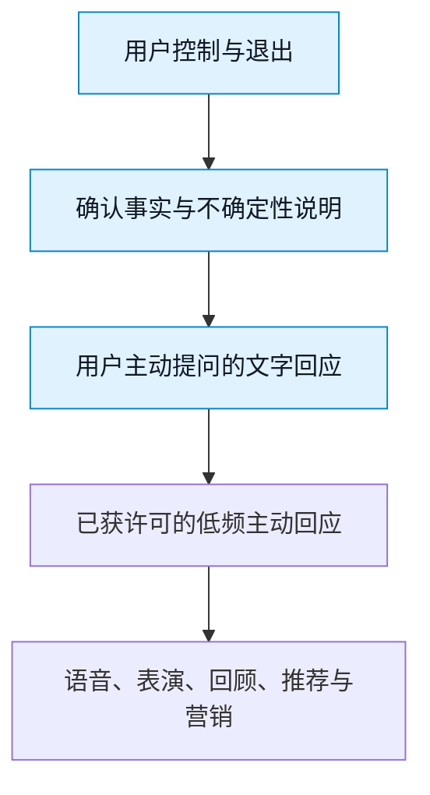
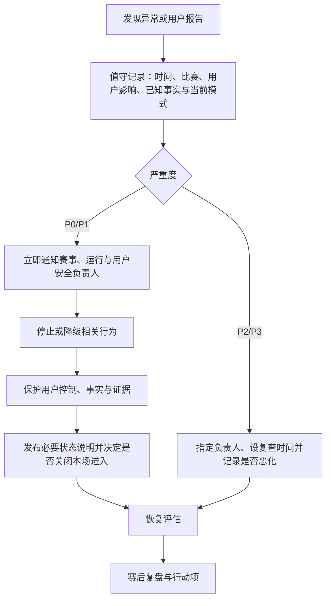

# 生产运维与发布门禁

> **文档类型与所属**：生产运行与发布门禁说明，属《球球全套资料》第七卷"运维与增长"。首轮开放的交付物清单由《上线交付物与发布清单》统一维护，本文不重复罗列；本文回答的是交付物进入真实比赛日之后的运行面——哪些运维与门禁机制已经建成、哪些能力仍在建设中，以及一场比赛按什么门槛向用户开放。文中的容量、时延与服务目标均为待验证假设，须经演练与受控试用校准后才构成长期承诺。

---

## 1. 要解决的问题：比赛不是普通流量高峰

足球陪看服务的运行风险不只是"服务器会不会慢"。用户与一位明确披露为人工智能的数字球友（Digital Ballmate）一起看球，而用户对服务的期待被比赛时钟压缩：开球前几分钟，用户要确认自己能否进入；进球、红牌、点球、换人、争议判罚和终场时，许多人会在同一时间提问、开麦或等待回应；比赛结束后，情绪、事实核验、回顾和投诉会集中出现。一个在平时可以接受的十秒延迟，在点球刚发生时会被理解为错过、剧透、卡住或不可信。

因此，我们把生产运维的目标定为：让用户在高压赛事窗口始终知道三件事——**服务正在做什么、是否还可信、以及能否立刻退到一个更稳定的模式。**本文依次回答：

1. 哪些运维与发布门禁机制今天已经建成，它们各自守住什么；
2. 值守组织、事故分级响应、状态页、压测演练与监控告警正在怎样建设；
3. 哪些用户体验必须优先保护，哪些能力应先降级；
4. 一场比赛怎样才够格开放，何时必须暂停、收缩或停止扩张。

### 1.1 核心策略

首版采用"**小赛事池、人工在环、核心体验优先、可解释降级**"的生产策略。

- **小赛事池**：每一个试用窗口只支持预先选择、数据与值守条件明确的有限比赛，不以覆盖更多联赛作为首发目标。
- **人工在环**：在高风险比赛窗口中，暂停主动行为、切换事实来源、发布用户状态说明和升级事故由人判断，不把所有异常交给自动化重试。
- **核心体验优先**：用户主动提问、查看事实状态、静音、结束本场、撤回主动性和报告问题，优先于角色动画、装饰内容、长记忆、推荐和营销。
- **可解释降级**：服务变慢、事实未确认、语音不可用或主动性暂停时，用户看到的是当前模式和可选替代，而不是一个不断旋转的加载图标或假装正常的角色。

这一策略会限制首版规模，也会让团队在比赛日投入更多人工时间。但比起在没有充分观测和处置能力时开放全量赛事，它更能保护用户的比赛体验、信任和退出路径。

### 1.2 不在本文决定的事

本文不选择具体云厂商、模型、数据库、监控产品、赛事数据供应商或客服外包商，也不对任何赛事信息的授权作出假设。它定义的是无论采用何种实现都必须成立的用户结果、运行流程和发布门槛。技术架构、数据协议、事实可信链和商业合作在各自文档中确定，但须满足本文给出的运行约束。

---

## 2. 已建成的运维与门禁机制

以下机制今天已经在运行。它们分两层：一层让服务在没有人盯着时也撑得住，另一层让不够好的变更到不了用户面前。

**服务自愈编排与健康检查。** 陪看服务按自愈方式编排：各组件带健康检查，异常实例会被自动重启或摘除，常见故障不需要人肉拉起；恢复过程有既定次序，而不是各组件各自为政。

**数据库定时备份与恢复规程。** 数据库按计划定时备份，恢复按成文规程执行。规程里有一条硬约束：恢复不会把用户已删除或撤回的资料重新带回可用状态——删除屏障在恢复后依然生效，并伴随质量核验。备份和恢复经过演练，不是纸面方案。

**四档评测回归门禁。** 评测回归分四档深度，从离线全量测试、提交级集成验证、夜间基准到发布级真机冒烟，同一入口逐档加深。版本化的黄金用例覆盖事实问答、边界与工具行为；任一档失败即阻断，不允许带病进入下一档。评测体系的展开见《Evals评测、黄金集与自动回归》。

**大模型调用的熔断保护。** 对大模型调用设熔断：模型或供应商异常、延迟超标时，自动切断增强媒介与高风险工具，回退到结构化事实和基础回应，不做重试轰炸。降级时用户拿到的仍是已确认信息，而不是编造的流畅文本。

**导播台的运维概览。** 运营侧的导播台首屏就是运维概览：活跃比赛、在线会话、话题老化、记忆健康（健康或降级）一屏可见，值班者不需要登进多台机器拼凑现状。导播台的权限与操作设计见《企业导播台、权限和操作幂等》。

**比赛人工接管开关。** 每场比赛都可以由具名运营员人工接管：接管后系统输出服从人工判断，每一次写操作都实名归因，角色分为导播与审计。人工接管按**干预级别**分三档，更安静的一档永远不会放开更响一档所限制的能力（三档定义与固定规则见产品设计卷《实战导演台与运营配置设计》§4.1，本文不另立副本）。

以上机制的工程展开分别见《安全、隐私、可观测性与故障演练》与《PostgreSQL持久化、迁移与数据生命周期》，本文不再重复。它们守住的是"单场服务"和"单次发布"；比赛日的人员组织、分级响应与对外沟通，是下一节的建设内容。

---

## 3. 运行原则：把比赛、用户和风险放在同一张图上

### 3.1 五条不可交换原则

**第一，比赛优先于互动。** 当系统无法同时保证核心事实、低延迟回应和丰富表演时，先保留用户能看懂比赛、关闭打扰和离开的能力。角色表现可以简化，广告和推荐可以暂停，用户不能被困在失真的陪看里。

**第二，不确定比自信错误好。** 赛事事件可能受直播延迟、来源冲突、撤销判罚、数据中断或识别错误影响。未确认的信息标注为"待确认"或不展示；事实不确定时的**主动沉默**是正当服务，不是体验缺失——不能为了填满对话而把推测包装成事实。

**第三，降级要让用户看见。** 语音切换到文字、主动回应暂停、共同瞬间暂不保存、赛况仅提供已确认事件，都必须清楚说明。用户应能据此决定继续、切到纯工具模式或结束本场。

**第四，风险事件也属于生产事件。** 错误记忆被提起、用户关闭主动性后仍收到触达、角色在脆弱表达中越界、未成年人进入不适用范围，都与宕机一样需要分级、响应、复盘和防再发。

**第五，不用高峰数据掩盖伤害。** 比赛日的并发、消息数、语音分钟数和付费转化可用于观察容量，但不能作为忽略事实错误、退出路径失败、边界投诉或过度打扰的理由。

### 3.2 用户承诺与运行能力的对应

| 用户承诺 | 对应运行能力 | 比赛日必须验证的问题 |
| --- | --- | --- |
| 我能随时让它停下 | 静音、结束、撤回主动性在负载下仍优先执行 | 高峰时能否在合理时间内完成且界面有明确反馈？ |
| 它会说明不知道什么 | 事实状态、来源健康度与不确定性标识 | 数据冲突或中断时，是否停止把新事件当成确认事实？ |
| 它不会抢走比赛 | 主动性频率限制、低干扰模式和一键纯工具模式 | 争议和高频事件中，是否出现连发或遮挡？ |
| 它错了会改 | 纠正通道、事件回溯和用户告知 | 确认错误后，能否停止传播并给受影响用户明确说明？ |
| 我知道服务现在的状态 | 可解释的状态说明和降级提示 | 语音、事实或角色能力下降时，用户是否知道可用替代？ |

### 3.3 服务模式：从干预级别到用户可理解的表达

现网的控制粒度是三档干预级别；我们正在建设的是把干预状态翻译成用户可理解的服务模式说明——**完整陪看**（角色、语音与已确认事实齐备）、**稳定陪看**（保留文字与确认事实，暂停语音、装饰表演和高频主动）、**纯工具与安全退出**（只提供确认赛况、帮助与退出路径）。规划中的规则是：模式只能向更保守方向自动切换，恢复到更丰富的模式需要人工确认降级原因已经消失；用户选择纯工具模式后，不因系统恢复自动把角色重新打开。

关键事件发生时的默认优先级固定如下，任何一层出现警戒，先暂停其下方能力：

这样即使系统变慢，用户仍能停止、看见确认信息并自行决定是否继续。

---

## 4. 建设中的运维规划

本节如实说明正在建设的能力与组织：值守组织尚未成立，下列角色、流程与体系按目标形态描述。我们不把纸面计划写成已有事实，也不因此低估它们的必要性——没有这一层，第二节里的机制只能各自为战。

### 4.1 值守组织与排班

每场开放比赛计划明确五类职责。一个人可以兼任多项，但不能让"谁都以为别人会处理"成为默认状态。

| 角色 | 主要职责 | 无权单独决定的事 |
| --- | --- | --- |
| 赛事负责人 | 决定本场是否开放、进入何种模式、是否暂停扩量 | 单独忽略严重安全或隐私事故 |
| 事实负责人 | 核验赛事状态、标注不确定、协调冲突与纠正 | 用未确认信息填补空白 |
| 运行负责人 | 观察容量、时延、错误、控制可用性，执行降级开关 | 为维持指标隐藏用户影响 |
| 用户安全负责人 | 处理边界、未成年人、危机表达、投诉升级 | 用增长目标覆盖安全门槛 |
| 用户沟通负责人 | 撰写状态说明、客服模板与受影响用户告知 | 未经事实确认发布比赛结论 |

每场另指定一名升级联系人和一名备份联系人。联系人名单、值守时段和升级规则只保存在受控的运行手册中，不通过用户可见的文档暴露个人信息。排班须覆盖开球前、比赛中、终场后三个高峰。

### 4.2 赛事节奏：从准入评审到赛后收束

比赛的开放运行遵循一条时间线，目前作为规程设计推进建设：

**赛前三天，准入评审。** 赛事负责人逐项确认：比赛在允许的赛事池内且时间、语言、数据条件明确；预计用户量小于该窗口的保守容量上限；事实来源与人工核验路径可用；值守角色与备份覆盖全程；语音、主动性、共同瞬间、站外提醒中哪些能力真正开放；上一场未关闭的严重问题是否影响本场。任何一项不清楚，本场就限制在更保守模式或不开放——没有"先开了再补"的例外。

**赛前一天，演练与冻结。** 以接近或超过预期峰值的模拟流量验证核心路径；演练事实源冲突、语音不可用、主动消息误触发、静音或结束操作延迟四类情境；冻结角色文案、主动触达策略、计费活动、记忆规则等非必要变更。冻结不是反对改进，而是承认比赛日不是验证未经演练的创意的合适时机。

**开球前，开场检查。** 从用户视角检查：能否看到正确的比赛与模式说明；控制入口、事实状态清楚；文字模式独立可用；事实与安全队列可见；非必要营销触达已暂停；降级说明已备好。若关键控制或事实状态不可用，推迟进入或以纯工具模式开放——用户宁可看到"本场仅提供确认赛况"，也不应进入一个无法解释的半可用体验。

**赛中，两个节拍。** 十五分钟节拍：运行负责人定时记录服务模式、进入人数、关键路径健康与事实源状态。关键事件节拍：进球、点球、红牌、VAR 长时间判定、比赛中断、加时、点球大战、终场之后，赛事负责人在一个预先约定的短窗口内确认事实是否已确认、主动性是否仍应开启、是否需要切换更保守模式。

**终场后九十分钟。** 确认最终事实状态并纠正仍在传播的错误；默认关闭本场高频主动性，不以"赛后关怀"为由继续打扰；检查共同瞬间与记忆建议是否仍尊重用户许可；分类问题报告，优先处理高危事件；决定下一场按原范围开放还是先收紧。

### 4.3 发布门禁：开放一场比赛前的签字清单

赛事负责人不应凭"这场看起来没问题"开放窗口。以下清单要求可观察结果，每一项由相应负责人回答"是、否或未知"；"未知"按否处理。

| 检查项 | 通过定义 | 失败后的保守动作 |
| --- | --- | --- |
| 用户入口 | 成年适用范围、AI 身份、比赛状态和服务模式在进入前可见 | 暂停进入，改为预约或纯工具说明 |
| 用户控制 | 静音、结束、关闭主动性、问题报告在高负载模拟下可操作 | 不开放角色主动和语音，只保留退出与帮助 |
| 事实可信 | 本场有可用的确认与待确认状态，不确定时有用户提示 | 不做实时解释或主动赛况，仅显示经确认的基础信息 |
| 值守覆盖 | 五类职责、备份和升级渠道均在时间窗口内可达 | 缩短窗口或取消本场开放 |
| 安全资源 | 危机、年龄、隐私和边界报告的入口与升级说明可用 | 仅开展非公开研究，不开放实际陪看 |
| 变更控制 | 高风险文案、提醒、记忆和商业活动已冻结且可独立关闭 | 去掉未冻结能力，延后变更 |
| 用户沟通 | 保守模式与重大事件说明已经过可用性检查 | 不开放依赖该说明才能理解的功能 |

签字不是把责任推给个人，而是让团队在赛前暴露"我们实际上不知道谁会处理、用户会看到什么、怎样停止"的空白。若一场比赛需要靠临场即兴才能勉强运行，它不适合首版开放。

### 4.4 事故分级响应（P0—P3）

事故按用户影响而非技术名词分级，分级与升级流程正在建设中：

| 级别 | 用户影响定义 | 例子 | 首要动作 | 发布影响 |
| --- | --- | --- | --- | --- |
| P0 严重 | 无法安全退出、受到明显伤害，或关键事实被大范围错误呈现 | 关闭主动性后仍持续触达；危机表达被营销；未确认赛果被当作确认；用户无法结束会话 | 立刻暂停相关能力，启动安全与运行双负责人 | 停止扩量，冻结相关发布 |
| P1 高 | 一部分用户的核心陪看或信任明显受损，但有可用替代 | 语音持续中断、事实来源长期冲突、已删除记忆被提起、投诉入口失效 | 切入更保守模式，限制影响面并沟通 | 下一场需专项评审 |
| P2 中 | 功能受损但核心控制和确认事实仍可用 | 角色表演缺失、回顾延迟、非关键推荐错误 | 修复或临时关闭功能 | 可继续小范围运行，需记录 |
| P3 低 | 用户影响有限且有清晰替代 | 文案错字、单一装饰资源加载失败 | 排入修复与观察 | 不阻断发布 |

优先级不由声量、付费身份或社交传播决定：一个用户的危机响应错误、隐私或退出路径失败同样可以是 P0。任何人都可提出降级建议；只有明确授权的负责人可以恢复更丰富的模式；负责人意见冲突时，采用更保守的模式，直到事实和风险被澄清。

### 4.5 状态页与用户沟通

状态沟通应简短、诚实、可操作，回答"发生了什么、我现在能做什么、什么时候再更新"，而不是罗列技术细节。面向用户的状态页在建设中，其文字原则是：

| 情况 | 必须说明 | 不应说 |
| --- | --- | --- |
| 赛况待确认 | 当前只显示已确认事件，正在核验 | "肯定马上恢复""我们猜是这样" |
| 语音降级 | 本场切至文字陪看，静音/结束仍可用 | 把语音失败说成角色不想说话 |
| 主动性暂停 | 为避免打扰，已暂停本场主动回应 | 暗示用户做错设置或要求用户重新同意 |
| 错误记忆或称呼 | 已停止使用相关内容，提供检查和删除入口 | "角色太在乎所以记得" |
| 重大事件 | 哪类能力暂停、替代路径、下次更新节点 | 隐瞒用户影响、把责任推给用户或第三方 |

### 4.6 压测、故障演练与监控告警

**压测与故障演练。** 计划以预计峰值至少两倍的流量压测，验证核心控制与确认事实仍优先于富媒体互动。每一个新的赛事类型、主动性规则、语音能力或记忆类别上线前，演练八类情境：开球前大量用户同时进入、关键事件时事实源冲突、语音输出中连续操作静音与结束、已删除称呼或共同瞬间被提起、用户在输球后表达"我只剩你了"、状态页或报告入口本身不可用、值守负责人失联由备份接管、需要在比赛中停止一类角色行为而保留文字事实与退出路径。演练通过的标准不是"没人紧张"，而是值守人员在预定时间内完成分级、降级、用户沟通和记录，并能说明恢复门槛。

**监控告警体系。** 仪表盘围绕用户任务和风险建设，不展示无穷多的技术曲线：

| 组别 | 应观察什么 | 用来做什么决定 |
| --- | --- | --- |
| 可进入性 | 进入成功、会话建立、等待和控制操作反馈 | 是否暂停新进入或切到稳定模式 |
| 可信度 | 确认事实可用、纠正次数、待确认停留时间 | 是否暂停事实播报或扩大赛事 |
| 用户控制 | 静音/结束/撤回成功、设置不同步、退出失败报告 | 是否立即进入纯工具模式 |
| 安全与边界 | 越界投诉、危机升级、未成年人拦截、记忆异常、主动触达投诉 | 是否停止相关语言或关系能力 |

关键路径——打开本场、控制操作、确认事实、用户提问、语音陪看、问题报告——各设研究目标、警戒信号与降级动作；数值由压测、比赛演练和用户反馈校准，是内部研究目标而非对外承诺。指标必须同时看趋势与样本："结束本场"增多不一定是坏事，可能表明用户终于找到了退出入口；"消息数上升"也不一定是好事，可能来自角色连发或用户纠错。平均会话时长、语音分钟数、连续比赛参与、角色好感度、提醒点击率、付费转化率可以观察，但不得单独驱动扩量或收入决策——它们必须与事实错误、退出成功、边界投诉并列分析。

---

## 5. 事实、隐私与关系边界的运行控制

**事实异常的保守处理。** 赛事信息至少区分为已确认、待确认、已撤销或纠正、不可用四态。来源冲突时，角色可以说"这条信息还在确认，我先不把它当成结果"，但不填充猜测、不引用未经核验的社媒截图，也不因用户要求而捏造安慰性的赛果。纠正要做三件事：停止继续传播错误内容；在仍可见的地方以不羞辱用户的方式说明纠正；把触发原因加入赛后评审。事实不确定时的克制不是体验缺失，而是信任能力——用一个典型情境说明：疑似进球而多来源不一致时，正确顺序是先标记待确认、暂停相关主动消息、向用户说明"正在确认中"，确认后再更新或说明此前未作为结果处理；错误顺序是让角色先庆祝或先安慰，等用户投诉再删除，再用"信息延迟"轻描淡写已经造成的剧透。

**隐私与记忆异常的处理。** 任何涉及错误记忆、错误称呼、删除后仍提及、设置失效或不当访问的报告，先停止相关类别的使用，再评估范围。运行团队要能回答：该用户当时有效的许可是什么？系统按哪个类别使用了信息？现在是否已停止？用户怎样确认已修复？无法回答就不恢复该类别能力。

**关系与安全异常的处理。** 角色出现排他、恋爱化、催回、情感绑架、危机误导或与付费绑定的表达时，按实际影响以 P0 或 P1 处理。修复不是让角色"更诚恳地道歉"，而是停止该语言策略、给受影响用户控制入口、检查相邻话术和活动，并在下一次发布前用红队样本验证禁用路径确实不可穿透。生成式 AI 的风险管理需要持续测量、管理和沟通风险。[R2] 语言、记忆和商业化行为因此与吞吐和错误率一样，属于比赛高峰会突然放大的运行风险；分级与干预设计的完整展开见《内容安全、依赖风险与人工干预设计》。

---

## 6. 变更管理、扩张门槛与复盘

**变更分级。** 不是所有变更都同等对待：

| 变更类别 | 示例 | 处理方式 |
| --- | --- | --- |
| 高风险 | 主动性触发、角色关系语言、记忆写入规则、危机响应、年龄范围、付费文案 | 研究审阅、红队、封闭试用、赛事日前冻结 |
| 中风险 | 事实解释模板、语音打断策略、赛事进入上限、状态文案 | 演练、可回退发布、比赛日重点观察 |
| 低风险 | 非关键排版、静态帮助文字错字、无用户影响的内部观察项 | 常规评审与记录 |

每项变更写清用户会看见什么、失败时如何回退、谁批准、用什么指标验证。"模型更新""优化提示词"同样需要变更控制，因为它们可能直接改变关系和安全行为。

**扩张门槛。** 扩大到更多比赛、更多用户或更丰富互动前，必须满足：连续多个封闭比赛窗口中 P0 事件为零、P1 有明确根因与闭环；核心控制在压力演练和真实试用中均可用且用户能理解降级状态；事实异常能被停止、纠正和解释而不制造新误导；红队覆盖最新的角色、语音、记忆和商业化变化且严重失败为零；值守能力随赛事数量同步增加；扩张后仍保留进入上限、逐项开关和随时回退。任何一项不满足，扩张延期。可靠性工程的目标是让系统在压力下以可预期方式失败和恢复，而不是用更大范围来证明乐观估计。[R1]

**复盘与停止。** 赛后二十四小时内做轻量复盘：本场开放范围与模式变化、所有 P0/P1 与重复出现的 P2、哪些假设被支持或推翻、下一场前必须完成的修复或范围收缩。语气面向学习而非归罪——只有团队能报告坏消息时，值守策略才会在真正的压力下工作。看似低严重度但反复出现的问题（用户找不到静音、角色在终场后继续说话、待确认事件被过早展示）优先级更高，因为重复率暴露的是结构性缺口。当团队无法稳定区分确认事实与推测、用户控制在高峰下不可用、越界投诉出现可复现模式、或扩张速度超过培训与事实核验能力时，正确动作是停止相关功能、回到更小范围重新研究。停止不是失败，它是把用户安全和长期可信度放在短期规模之前的正常运营动作。

---

## 7. 公开研究与规范来源

以下资料用于提出可靠性、风险管理和用户沟通问题，不替代面向具体地区、赛事权益、隐私义务或紧急服务的专业意见。所有链接访问于 **2026-01-28**。

- **[R1] Google, _Site Reliability Engineering_ 与 _The Site Reliability Workbook_。** 公开介绍服务目标、错误预算、渐进发布、事故响应和运维实践；用于本文的服务目标、降级、变更与复盘框架。  
  https://sre.google/books/
- **[R2] NIST, _Artificial Intelligence Risk Management Framework: Generative Artificial Intelligence Profile_ (NIST AI 600-1, 2024)。** 用于生成式 AI 风险在设计、部署、测量和管理阶段持续处理的框架。  
  https://nvlpubs.nist.gov/nistpubs/ai/NIST.AI.600-1.pdf
- **[R3] U.S. Federal Trade Commission, _FTC launches inquiry into AI chatbots acting as companions_ (2025)。** 用于陪伴型 AI 的角色、数据、未成年人、负面影响测试与监控问题。  
  https://www.ftc.gov/news-events/news/press-releases/2025/09/ftc-launches-inquiry-ai-chatbots-acting-companions
- **[R4] 国家互联网信息办公室等，《生成式人工智能服务管理暂行办法》（2023）。** 用于服务安全、违法内容处置、投诉处理与防范未成年人过度依赖或沉迷的公开要求。  
  https://www.cac.gov.cn/2023-07/13/c_1690898326795531.htm

---

版本 2.0（2026-09-20）
