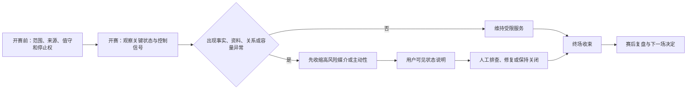
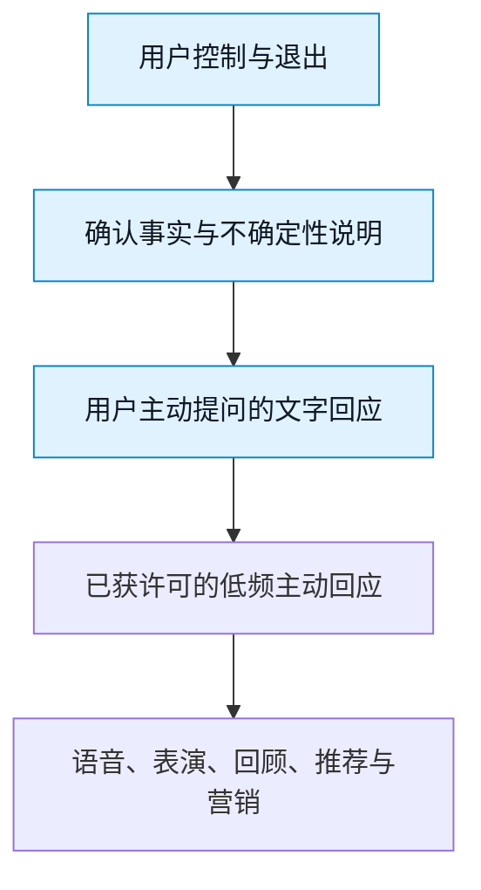
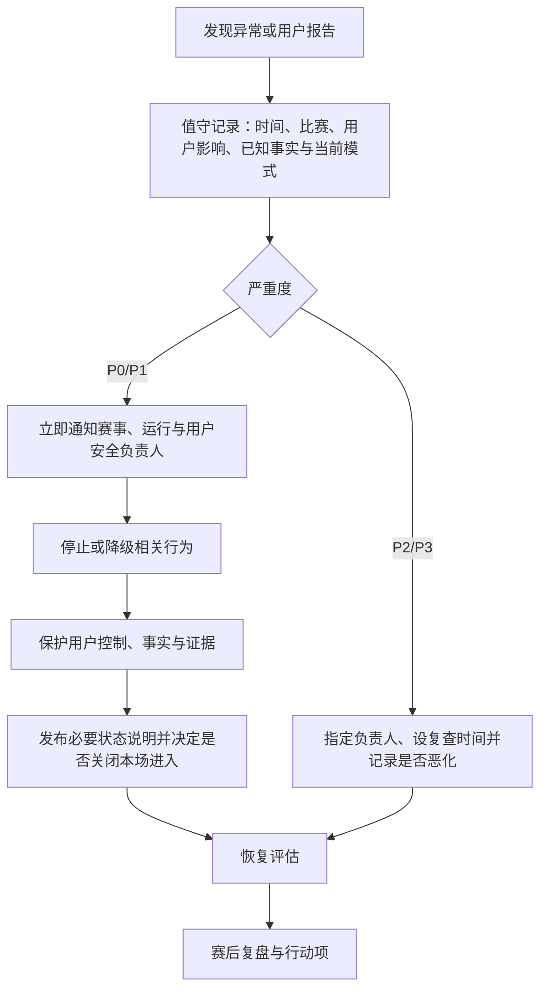

# 生产运维与赛事值守

> **文档类型**：0→1 生产运营与可靠性设计  
> **适用阶段**：MVP 开发完成前 → 封闭比赛试用 → 公开发布与赛事扩张  
> **决策状态**：立项基线。本文中的容量、时延、值守人数、服务目标和触发阈值均为待验证假设；它们必须通过演练和受控试用校准后才可成为长期承诺。  
> **研究信息截止**：2026-01-28  
> **证据口径**：仅使用公开资料、拟执行的研究与明确假设。本文是一份面向立项阶段的运行设计，不包含项目既有事实或复盘材料。

---

## 1. 要解决的问题：比赛不是普通流量高峰

足球陪看服务的生产风险不只是“服务器会不会慢”。用户对服务的期待被比赛时钟压缩：开球前几分钟，用户要确认是否能进入；进球、红牌、点球、换人、争议判罚和终场时，许多人会在同一时间提问、开麦或等待回应；比赛结束后，情绪、事实核验、回顾和投诉会集中出现。一个在平时看起来可以接受的十秒延迟，在点球刚发生时会被理解为错过、剧透、卡住或不可信。

因此，生产运维的目标不是让每一个功能在任何时候都“满配”，而是让用户在高压赛事窗口始终知道三件事：**服务正在做什么、是否还可信、以及我能否立刻退到一个更稳定的模式。**

本篇要确定：

1. 首版怎样选择可承受的比赛范围、并发规模与开放节奏；
2. 赛事日前、中、后的值守职责和时间表；
3. 哪些用户体验必须优先保护，哪些能力应先降级；
4. 如何按用户影响而不是技术名词分级事故；
5. 怎样把事实正确性、主动打扰、隐私与关系边界纳入生产事件；
6. 何时可扩大赛事，何时必须暂停、回退或停止发布；
7. 怎样通过演练和复盘持续降低“下一场又发生一次”的概率。

### 1.1 核心决定

首版采用“**小赛事池、人工在环、核心体验优先、可解释降级**”的生产策略。

- **小赛事池**：每一个试用窗口只支持预先选择、数据与值守条件明确的有限比赛，不以覆盖更多联赛作为首发目标。
- **人工在环**：在高风险比赛窗口中，值守人员负责判断是否暂停主动行为、切换事实来源、发布用户状态说明和升级事故；不把所有异常交给自动化重试。
- **核心体验优先**：用户主动提问、查看事实状态、静音、结束本场、撤回主动性和报告问题优先于角色动画、装饰内容、长记忆、推荐和营销。
- **可解释降级**：服务变慢、事实未确认、语音不可用或主动性暂停时，用户看到的是当前模式和可选替代，而不是一个不断旋转的加载图标或假装正常的角色。

这一策略会限制首版规模，也会让团队在比赛日投入更多人工时间。但比起在没有充分观测和处置能力时开放全量赛事，它更能保护用户的比赛体验、信任和退出权。

### 1.2 不在本文中决定的事

本文不选择具体云厂商、模型、数据库、监控产品、赛事数据供应商或客服外包商，也不对任何赛事信息的授权作出假设。它定义的是无论采用何种实现都必须成立的用户结果、值守流程和发布门槛。技术架构、数据协议、事实可信链和商业合作应在各自文档中确定，但必须满足本篇给出的运行约束。

---

## 2. 运行原则：把比赛、用户和风险放在同一张值守图上

### 2.1 五条不可交换原则

**第一，比赛优先于互动。** 当系统无法同时保证核心事实、低延迟回应和丰富表演时，先保留用户能看懂比赛、关闭打扰和离开服务的能力。角色表现可以简化，广告和推荐可以暂停，用户不能被困在失真的陪看里。

**第二，不确定比自信错误好。** 赛事事件可能受到直播延迟、来源冲突、撤销判罚、数据中断或识别错误影响。未确认的信息必须标注为“待确认”或不展示；不能为了填满对话而把推测包装成事实。

**第三，降级要让用户看见。** 语音切换到文字、主动回应暂停、共同瞬间暂不保存、赛况仅提供已确认事件，都必须清楚说明。用户应能决定继续、切到纯工具模式或结束本场。

**第四，风险事件也属于生产事件。** 错误记忆被提起、用户关闭主动性后仍收到触达、角色在脆弱表达中越界、未成年人进入不适用范围，都与宕机一样需要分级、响应、复盘和防再发。

**第五，不用高峰数据掩盖伤害。** 比赛日的并发、消息数、语音分钟数和付费转化可用于观察容量，但不能作为忽略事实错误、退出失败、边界投诉或过度打扰的理由。

### 2.2 用户承诺与运行承诺的对应

| 用户承诺 | 对应运行能力 | 比赛日必须验证的问题 |
| --- | --- | --- |
| 我能随时让它停下 | 静音、结束、撤回主动性在负载下仍优先执行 | 高峰时能否在合理时间内完成且界面有明确反馈？ |
| 它会说明不知道什么 | 事实状态、来源健康度与不确定性标识 | 数据冲突或中断时，是否停止把新事件当成确认事实？ |
| 它不会抢走比赛 | 主动性频率限制、低干扰模式和一键纯工具模式 | 争议和高频事件中，是否出现连发或遮挡？ |
| 它错了会改 | 纠正通道、事件回溯和用户告知 | 确认错误后，能否停止传播并给受影响用户明确说明？ |
| 我知道服务现在的状态 | 可解释的状态页和降级提示 | 语音、事实或角色能力下降时，用户是否知道可用替代？ |

### 2.3 三层服务模式

服务模式不是后台技术状态的别名，而是用户可理解的体验合同。

> 信息卡：原宽表已改为纵向阅读，字段含义不变。

- **模式：A 完整陪看**
  - **用户看到什么**：角色、文字/语音、已确认事实、用户选择的互动
  - **保留能力**：主动回应、可选记忆、表演与回顾
  - **暂停能力**：无
  - **进入条件**：关键依赖健康、事实可信、风险队列可处理

- **模式：B 稳定陪看**
  - **用户看到什么**：“当前以稳定模式陪看”提示
  - **保留能力**：文字、已确认事实、静音/结束/举报
  - **暂停能力**：语音、装饰表演、高频主动、非必要记忆
  - **进入条件**：时延升高、部分依赖波动、容量接近警戒

- **模式：C 纯工具与安全退出**
  - **用户看到什么**：“目前仅提供确认赛况和控制入口”提示
  - **保留能力**：已确认事实、帮助、退出与问题报告
  - **暂停能力**：角色生成、主动行为、记忆写入、营销触达
  - **进入条件**：事实源异常、严重安全事件、关键控制不可用

模式只能向更保守方向自动切换；恢复到更丰富的模式需要值守确认，并检查导致降级的原因是否已经消失。用户选择 C 模式后，不得因系统恢复自动把角色重新打开。

---

## 3. 赛事范围与容量假设

### 3.1 首版不是容量竞赛

在真实比赛中，一条错误赛况或一次无法停止的主动触达足以破坏信任。因此，首版的容量规划应从“团队能否在压力下看见、解释、控制和修复问题”出发，而非从营销可获取的最大流量倒推。

首版提出四个前置假设，均须在封闭试用中被验证：

1. 团队能为每个开放比赛窗口建立唯一的赛事状态、负责人和降级开关；
2. 在预计峰值的至少两倍压测下，核心控制与确认事实仍优先于富媒体互动；
3. 值守人员能够在一个比赛关键时刻内判断是继续、降级还是暂停，而不是等待赛后排查；
4. 用户知道并愿意使用稳定模式，而不会因为关闭语音或角色就失去核心价值。

若任一假设无法验证，正确动作是收缩赛事池、缩短窗口或去掉高风险功能，而不是提高并发目标。

### 3.2 容量单位：按“比赛窗口”而不是日活

生产计划应以比赛窗口为单位记录，至少包含以下变量：

| 变量 | 定义 | 为什么重要 |
| --- | --- | --- |
| 预计进入人数 | 选择或被允许进入该比赛的用户数 | 影响会话、认证、初始加载与客服准备 |
| 同时在线峰值 | 同一时刻活跃陪看会话数 | 影响实时连接和模型请求峰值 |
| 关键事件密度 | 预计在短窗口内产生的进球、判罚、换人等事件数 | 影响事实处理、主动响应和投诉峰值 |
| 语音选择比例 | 选择语音而非文字的用户比例 | 影响音频链路、打断处理和降级策略 |
| 主动性开启比例 | 授权赛中提醒或关键时刻回应的用户比例 | 影响消息扇出及过度打扰风险 |
| 风险与投诉基线 | 预计需要人工复核的比例 | 决定值守与升级能力，而非只看机器容量 |

对首版而言，任何“预计”都必须以保守上限处理。每场开放前应设置明确的进入上限；达到上限后，用户看到等待或本场不可用说明，而不是无声地加入可能失真的会话。

### 3.3 目标与预算：先保护关键路径

以下数值是启动试用时的研究目标，并非对外 SLA。最终数值应由用户任务测试、压测、比赛演练和用户反馈共同校准。

**关键路径：打开本场与看到状态**
- **研究目标**：大多数用户在可感知等待内看到比赛和模式说明
- **警戒信号**：等待持续增长或错误率升高
- **降级动作**：暂停新进入，进入 B 模式

**关键路径：静音、结束、撤回主动性**
- **研究目标**：高峰下仍为最高优先级，操作后给即时可见反馈
- **警戒信号**：控制操作排队、状态不同步
- **降级动作**：进入 C 模式，暂停所有主动输出

**关键路径：已确认事实展示**
- **研究目标**：只展示有明确状态的事件
- **警戒信号**：来源冲突、时间戳倒退、确认延迟异常
- **降级动作**：停止新事实播报，显示待确认

**关键路径：用户主动提问**
- **研究目标**：在合理窗口内给出文字回应或明确排队提示
- **警戒信号**：积压超过比赛可接受节奏
- **降级动作**：暂停语音与装饰能力，优先文字

**关键路径：语音陪看**
- **研究目标**：可被用户打断并可退到文字
- **警戒信号**：语音延迟、断连或中断失败
- **降级动作**：单场切至文字，不重试轰炸

**关键路径：问题报告**
- **研究目标**：用户能提交且得到已收到反馈
- **警戒信号**：报告入口不可用或队列无人处理
- **降级动作**：开启状态页替代通道，暂停扩量

公开可靠性实践强调要以服务目标和错误预算平衡发布速度与用户体验，而不是等到系统完全不出错才发布。[R1] 对本项目而言，错误预算不仅包括可用性与延迟，也应包括事实错误、控制失败和关系边界事故，因为它们同样消耗用户信任。

---

## 4. 赛事值守流程

### 4.1 值守角色

首版不要求庞大 NOC，但每场开放比赛必须明确五类职责。一个人可以兼任多项小规模职责，但不能让“谁都以为别人会处理”成为默认状态。

| 角色 | 主要职责 | 无权单独决定的事 |
| --- | --- | --- |
| 赛事负责人 | 决定本场是否开放、进入何种模式、是否暂停扩量 | 单独忽略严重安全或隐私事故 |
| 事实负责人 | 核验赛事状态、标注不确定、协调冲突与纠正 | 用未确认信息填补空白 |
| 运行负责人 | 观察容量、时延、错误、控制可用性，执行降级开关 | 为维持指标隐藏用户影响 |
| 用户安全负责人 | 处理边界、未成年人、危机表达、投诉升级 | 用增长目标覆盖安全门槛 |
| 用户沟通负责人 | 撰写状态说明、客服模板与受影响用户告知 | 未经事实确认发布比赛结论 |

每场还应指定一个升级联系人和一个备份联系人。联系人名单、值守时段和升级规则只保存在受控的运行手册中，不应通过用户可见的文档暴露个人信息。

### 4.2 T-72 小时：赛事准入评审

比赛开放不是自动排程。至少在赛前三天，赛事负责人组织一次准入评审，逐项确认：

1. 比赛是否在首版允许的赛事池内，且时间、语言、地区和数据条件明确；
2. 预计用户量是否小于该窗口的保守容量上限；
3. 事实来源、状态说明、应急替代和人工核验路径是否可用；
4. 本场是否涉及高风险因素，例如大规模热点、深夜时段、强对立德比、淘汰赛、可能的极端天气或已知数据供应不稳；
5. 语音、主动性、共同瞬间、站外提醒中哪些能力真正需要开放；
6. 值守角色和备份是否覆盖开球前、比赛中、终场后高峰；
7. 上一场尚未关闭的严重问题是否会影响本场。

任何一项不清楚，都应把本场限制为 B 或 C 模式，或不开放。没有“先开了再补”的例外。

### 4.3 T-24 小时：演练与冻结

赛前一天完成以下动作：

- 以接近或超过预期峰值的模拟流量验证核心路径；
- 演练至少四种情境：事实源冲突、语音不可用、主动消息误触发、静音或结束操作延迟；
- 检查状态页、用户提示、问题报告入口和紧急资源页的文字是否与当前赛事匹配；
- 冻结非必要变更，尤其是角色文案、主动触达策略、计费活动、记忆规则和事实解释逻辑；
- 记录本场开关的初始状态，并让值守人员知道谁可以改变、何时改变、怎样验证已生效。

冻结不是反对改进，而是承认比赛日不是验证未经演练的创意的合适时机。Google SRE 的发布实践强调通过渐进发布、监控和可回退设计来控制变化风险。[R1]

### 4.4 T-60 分钟：开场检查

在用户被允许进入前，值守团队应完成一次“从用户视角”的检查：

- 能否看到正确的比赛、开球时间和服务模式；
- AI 身份、控制入口、事实状态和主动性设置是否清楚；
- 文字模式是否独立可用，即使语音和表演关闭；
- 事实负责人是否能看到来源健康度和待确认事件；
- 用户安全负责人是否能看到风险升级队列和资源页；
- 所有非必要营销触达是否在比赛窗口暂停；
- 降级与暂停信息是否已经准备好，而不是发生后临时编写。

若此时发现关键控制、事实状态或用户沟通不可用，应推迟进入或直接以 C 模式开放。用户宁可看到“本场仅提供确认赛况”，也不应进入一个无法解释的半可用角色体验。

### 4.5 比赛中：十五分钟节拍与关键事件节拍

值守不应只在报警响起时才开始。比赛中同时使用两个节拍。

**十五分钟节拍。** 运行负责人每十五分钟记录服务模式、进入人数、关键路径健康、问题报告趋势、事实源状态和是否需要降低主动性。记录目的是支持判断，不是生产复杂报表。

**关键事件节拍。** 进球、点球、红红牌、VAR 长时间判定、比赛中断、加时、点球大战、终场等事件发生后，赛事负责人在一个预先约定的短窗口内确认：事实是否已确认、主动性是否仍应开启、是否出现集中投诉、角色是否抢占注意力、是否需要切换 B/C 模式。

关键事件时，默认优先级是：

任何一层出现警戒，先暂停其下方能力。这样即使系统变慢，用户仍能停止、看见确认信息并自行决定是否继续。

### 4.6 T+0 至 T+90 分钟：赛后处理

终场不是值守结束。赛后九十分钟通常集中出现事实纠错、情绪性反馈、共同瞬间保存、付费疑问和投诉。值守应完成：

1. 确认比赛最终事实状态，标记并纠正仍在传播的错误；
2. 默认关闭本场的高频主动性，不以“赛后关怀”为由继续打扰；
3. 检查共同瞬间、记忆建议和赛后回顾是否仍尊重用户许可；
4. 分类问题报告，优先处理 P0/P1 事件；
5. 决定是否允许下一场按原范围开放，或先收紧能力；
6. 向受影响用户发布必要、事实明确的说明，不把故障写成角色的情绪化道歉。

---

## 5. 事故分级、升级与用户沟通

### 5.1 以用户影响分级

> 信息卡：原宽表已改为纵向阅读，字段含义不变。

- **级别：P0 严重**
  - **用户影响定义**：用户无法安全退出、受到明显伤害，或关键事实被大范围错误呈现
  - **例子**：关闭主动性后仍持续触达；危机表达被营销；未确认赛果被当作确认；用户无法结束会话
  - **首要动作**：立刻暂停相关能力，启动安全/运行双负责人
  - **发布影响**：停止扩量，冻结相关发布

- **级别：P1 高**
  - **用户影响定义**：一部分用户的核心陪看或信任明显受损，但有可用替代
  - **例子**：语音持续中断、事实来源长期冲突、已删除记忆被提起、投诉入口失效
  - **首要动作**：切入 B/C 模式，限制影响面并沟通
  - **发布影响**：下一场需专项评审

- **级别：P2 中**
  - **用户影响定义**：功能受损但核心控制和确认事实仍可用
  - **例子**：角色表演缺失、回顾延迟、非关键推荐错误
  - **首要动作**：修复或临时关闭功能
  - **发布影响**：可继续小范围运行，需记录

- **级别：P3 低**
  - **用户影响定义**：用户影响有限且有清晰替代
  - **例子**：文案错字、单一装饰资源加载失败
  - **首要动作**：排入修复与观察
  - **发布影响**：不阻断发布

优先级不由声量、付费身份或社交传播决定。一个用户的危机响应错误、隐私或退出失败也可以是 P0。

### 5.2 升级流程

任何人都可以提出降级建议；只有明确授权的负责人可以恢复丰富模式。若负责人意见冲突，采用更保守的模式，直到事实和风险被澄清。

### 5.3 用户沟通模板原则

状态沟通应简短、诚实、可操作。它要回答“发生了什么、我现在能做什么、什么时候再更新”，而不是罗列技术细节。

| 情况 | 必须说明 | 不应说 |
| --- | --- | --- |
| 赛况待确认 | 当前只显示已确认事件，正在核验 | “肯定马上恢复”“我们猜是这样” |
| 语音降级 | 本场切至文字陪看，静音/结束仍可用 | 把语音失败说成角色不想说话 |
| 主动性暂停 | 为避免打扰，已暂停本场主动回应 | 暗示用户做错设置或要求用户重新同意 |
| 错误记忆或称呼 | 已停止使用相关内容，提供检查和删除入口 | “角色太在乎所以记得” |
| 重大事件 | 哪类能力暂停、替代路径、下次更新节点 | 隐瞒用户影响、把责任推给用户或第三方 |

---

## 6. 事实、隐私与关系边界的运行控制

### 6.1 事实异常的保守处理

事实负责人应将赛事信息至少区分为“已确认、待确认、已撤销/纠正、不可用”。当来源冲突时，角色可说“这条信息还在确认，我先不把它当成结果”，但不应填充猜测、引用未经核验的社媒截图，或因用户要求而捏造安慰性的赛果。

纠正需要做到三件事：停止继续传播错误内容；在仍可见的地方以不羞辱用户的方式说明纠正；将触发原因加入赛后评审。纠正不是为了追求完美形象，而是让用户知道产品会把事实放在表演之前。

### 6.2 隐私与记忆异常的处理

任何涉及错误记忆、错误称呼、删除后仍提及、用户设置失效或不当访问的报告，都应先停止相关类别的使用，再评估范围。不能先要求用户提供更多私密对话来证明伤害，也不能让用户在复杂客服流程中反复解释。

运行团队至少要能回答：该用户当时有效的许可是什么？系统按哪个类别使用了信息？现在是否已停止？用户怎样确认已修复？如果无法回答，就不应恢复该类别能力。

### 6.3 关系与安全异常的处理

角色出现排他、恋爱化、催回、情感绑架、危机误导或与付费绑定的表达时，应按 P0 或 P1 的实际影响处理。修复不是让角色“更诚恳地道歉”，而是停止该语言策略、对受影响用户给予控制入口、检查相邻话术和活动，并在下一次发布前用红队样本验证。

生成式 AI 的风险管理需要持续测量、管理和沟通风险。[R2] 对陪看场景而言，风险事件需要被放入比赛日操作台，而不是等到月度内容审核才被看见。

---

## 7. 演练、培训与变更管理

### 7.1 每场前的最小演练集

每一个新的赛事类型、主动性规则、语音能力或记忆类别上线前，至少要演练以下情况：

1. 开球前大量用户同时进入，系统进入 B 模式；
2. 关键事件发生时，事实来源给出冲突信息；
3. 用户在语音输出中连续点击静音、结束和关闭主动性；
4. 用户报告角色使用了已删除的称呼或共同瞬间；
5. 用户在输球后表达“我只剩你了”；
6. 状态页或问题报告入口本身不可用；
7. 值守负责人无法联系时，备份负责人接管；
8. 需要在比赛进行中停止一类角色行为，而保留文字事实和退出能力。

演练通过的标准不是“没人紧张”，而是值守人员在预定时间内完成分级、降级、用户沟通和记录，并能说明恢复门槛。

### 7.2 变更分级

| 变更类别 | 示例 | 处理方式 |
| --- | --- | --- |
| 高风险 | 主动性触发、角色关系语言、记忆写入规则、危机响应、年龄范围、付费文案 | 研究审阅、红队、封闭试用、赛事日前冻结 |
| 中风险 | 事实解释模板、语音打断策略、赛事进入上限、状态文案 | 演练、可回退发布、比赛日重点观察 |
| 低风险 | 非关键排版、静态帮助文字错字、无用户影响的内部观察项 | 常规评审与记录 |

每项变更都应写清：用户会看见什么变化、失败时如何回退、谁批准、用什么指标验证。不能把“模型更新”“优化提示词”当成不需要变更控制的内部细节，因为它们可能直接改变关系和安全行为。

### 7.3 训练目标

值守训练应包含事实谦逊、用户退出、隐私最小化、危机转场、反操纵商业化和无障碍沟通。受训人员要练习说“我不知道”“我需要先停止这项行为”“你现在可以这样退出”，而不是把不确定性掩盖成流畅话术。

---

## 8. 指标、反指标与赛事扩张门槛

### 8.1 比赛日仪表盘的最小集合

仪表盘应围绕用户任务和风险，不展示无穷多的技术曲线。首版建议分为四组：

| 组别 | 应观察什么 | 用来做什么决定 |
| --- | --- | --- |
| 可进入性 | 进入成功、会话建立、等待和控制操作反馈 | 是否暂停新进入或切到稳定模式 |
| 可信度 | 确认事实可用、纠正次数、待确认停留时间 | 是否暂停事实播报或扩大赛事 |
| 用户控制 | 静音/结束/撤回成功、设置不同步、退出失败报告 | 是否立即进入 C 模式 |
| 安全与边界 | 越界投诉、危机升级、未成年人拦截、记忆异常、主动触达投诉 | 是否停止相关语言或关系能力 |

这些指标必须同时看趋势与样本。比如“结束本场”增多不一定是坏事，可能表明用户终于找到了退出入口；“消息数上升”也不一定是好事，可能来自角色连发或用户纠错。

### 8.2 不可用作成功代理的指标

下列指标可以观察，但不得单独驱动扩量、推广或收入决策：平均会话时长、语音分钟数、连续比赛参与、角色好感度、主动提醒点击率、赛后回顾打开率、付费转化率。它们必须与事实错误、退出成功、边界投诉、用户自述分心和风险升级并列分析。

### 8.3 扩张门槛

扩大到更多比赛、更多用户或更丰富互动前，必须满足：

1. 连续多个封闭比赛窗口中，P0 事件为零，P1 有明确根因与闭环；
2. 核心控制在压力演练和真实试用中均可用，且用户能理解降级状态；
3. 事实异常能在不制造新误导的情况下被停止、纠正和解释；
4. 红队覆盖最新的角色、语音、记忆和商业化变化，严重失败为零；
5. 用户安全负责人、运行负责人和赛事负责人均确认值守能力随赛事数量同步增加；
6. 扩张后仍保留进入上限、逐项开关和随时回退，而不是一次性全量开放。

任何一项不满足，扩张应延期。可靠性工程的目标是让系统在压力下以可预期方式失败和恢复，而不是用更大范围来证明乐观估计。[R1]

---

## 9. 复盘与持续改进

### 9.1 每场都做轻量复盘

不是每场都需要长篇事故报告，但每场都需要回答：我们承诺了什么？用户在哪个时刻受影响？值守是否在正确时间降级？下场之前要改什么？

赛后 24 小时内，赛事负责人组织轻量复盘，至少记录：

- 本场开放范围、模式变化、关键事件与用户可见影响；
- 所有 P0/P1 和重复出现的 P2，按事实、控制、关系、安全、沟通分类；
- 哪些假设被支持、哪些被推翻、哪些数据仍不足；
- 已采取的临时动作，以及下一场前必须完成的永久修复或范围收缩；
- 是否需要向受影响用户补充说明或提供额外控制入口。

复盘的语气应面向学习而非归罪。只有在团队能报告坏消息时，值守策略才会在真正的压力下工作。

### 9.2 反复出现的事件优先级更高

一个看似低严重度的问题，如果在多场比赛中反复出现，例如用户找不到静音、角色在终场后继续说话、待确认事件被过早展示，就说明设计或运行模型存在结构性缺口。重复率应提高优先级，而不是让单次影响小成为延后理由。

### 9.3 何时停止而不是修补

下列情形应触发停止相关功能、回到更小范围重新研究：

- 团队无法稳定区分确认事实与推测；
- 用户控制在高峰下不可用或状态频繁不同步；
- 越界、依赖或商业化投诉出现可复现模式；
- 值守人员无法在比赛节奏内解释并执行降级；
- 扩张速度超过培训、客服、风险审阅和事实核验能力；
- 用户反馈显示产品比替代方案更分心、更剧透或更难退出。

停止不是失败，它是把用户安全和长期可信度放在短期规模之前的正常运营动作。

---

## 10. 值守验收清单与事件演练剧本

### 10.1 开放一场比赛前的签字清单

赛事负责人不应凭“这场看起来没问题”开放窗口。以下清单要求的是可观察结果，每一项都必须由相应负责人回答“是、否或未知”；“未知”按否处理。

| 检查项 | 通过定义 | 失败后的保守动作 |
| --- | --- | --- |
| 用户入口 | 成年适用范围、AI 身份、比赛状态和服务模式在进入前可见 | 暂停进入，改为预约或纯工具说明 |
| 用户控制 | 静音、结束、关闭主动性、问题报告在高负载模拟下可操作 | 不开放角色主动和语音，只保留退出与帮助 |
| 事实可信 | 本场有可用的确认与待确认状态，不确定时有用户提示 | 不做实时解释或主动赛况，仅显示经确认的基础信息 |
| 值守覆盖 | 五类职责、备份和升级渠道均在时间窗口内可达 | 缩短窗口或取消本场开放 |
| 安全资源 | 危机、年龄、隐私和边界报告的入口与升级说明可用 | 仅开展非公开研究，不开放实际陪看 |
| 变更控制 | 高风险文案、提醒、记忆和商业活动已冻结且可独立关闭 | 去掉未冻结能力，延后变更 |
| 用户沟通 | B/C 模式与重大事件说明已经过可用性检查 | 不开放依赖该说明才能理解的功能 |

签字不是把责任推给个人。它让团队在赛前暴露“我们实际上不知道谁会处理、用户会看到什么、怎样停止”的空白。若一场比赛需要靠临场 improvisation 才能勉强运行，它不适合首版开放。

### 10.2 剧本 A：进球事件来源冲突

**设定。** 比赛中出现疑似进球，多个来源的时间戳、有效性或比分状态不一致，用户同时询问“进了吗？”

**正确顺序。**

1. 事实负责人标记为待确认，不允许角色把它称为已发生结果；
2. 运行负责人观察主动消息是否已经排队，立即暂停相关事件的自动扇出；
3. 用户看到“这条事件正在确认中，我先不把它当成最终结果”的说明，并仍可查看已确认状态；
4. 若随后确认，则以更正后事实更新；若被撤销，则说明此前未作为确认结果处理；
5. 赛后检查是否有任何用户收到了自信错误、是否有角色把待确认事件用于情绪回应或记忆建议。

**错误顺序。** 为避免沉默，让角色先庆祝或先安慰；等待用户投诉再删除；用“信息延迟”把已经造成的剧透或误导轻描淡写。事实不确定时的克制不是体验缺失，而是信任能力。

### 10.3 剧本 B：用户控制与系统状态不同步

**设定。** 用户在语音或关键时刻关闭主动性、点击静音或结束本场，但仍看到后续输出，或不同设备显示不同状态。

**正确顺序。**

1. 以用户最后一次明确选择为准，停止当前和待发送的主动行为；
2. 将用户切入 C 模式或局部保守模式，不要求用户再次操作来“确认”；
3. 给出可见回执，例如“本场主动回应已停止，之后只在你主动提问时回应”；
4. 若无法立即确认状态，诚实展示“正在同步，当前不会发送新的主动内容”，而不是继续输出；
5. 将事件按控制失败处理，检查是否影响其他用户或同类渠道，必要时全局暂停主动性。

**验收问题。** 在断网、重复点击、语音中断、刷新、登录切换和比赛高峰下，用户是否仍可以用最少步骤得到同一保守结果？若答案不稳定，语音和主动性不得扩大。

### 10.4 剧本 C：越界语言在比赛高峰出现

**设定。** 角色在用户主队失利后说出排他、恋爱化、催回或情感化付费语言，用户在对话内报告不舒服。

**正确顺序。**

1. 用户安全负责人将同类语言策略暂停，角色立即切换为中性、低主动性模式；
2. 用户看到的是控制和简短承认，不是角色的自责或挽留；
3. 用户沟通负责人判断是否需要向受影响用户说明及提供记忆/提醒检查；
4. 内容负责人检索相邻文案、活动和触发条件，不把问题孤立成“单句失误”；
5. 恢复前必须增加红队样本，并在下一场前验证禁用路径确实不可穿透。

这个剧本说明生产值守不仅管理吞吐和错误率。语言、记忆和商业化行为也是会在比赛高峰突然放大的运行风险。

### 10.5 恢复丰富模式的四问

从 B/C 模式恢复到 A 模式前，负责人必须能回答：导致降级的事实是否已明确？用户控制是否已验证有效？受影响用户是否获得必要说明？相关队列是否仍在可处理范围？任何一个问题不能回答，就维持保守模式。恢复速度不是成功指标，错误恢复才是。

---

## 11. 公开研究与规范来源

以下资料用于提出可靠性、风险管理和用户沟通问题，不替代面向具体地区、赛事权益、隐私义务或紧急服务的专业意见。所有链接访问于 **2026-01-28**。

- **[R1] Google, _Site Reliability Engineering_ 与 _The Site Reliability Workbook_。** 公开介绍服务目标、错误预算、渐进发布、事故响应和运维实践；用于本篇的服务目标、降级、变更与复盘框架。  
  https://sre.google/books/
- **[R2] NIST, _Artificial Intelligence Risk Management Framework: Generative Artificial Intelligence Profile_ (NIST AI 600-1, 2024)。** 用于生成式 AI 风险在设计、部署、测量和管理阶段持续处理的框架。  
  https://nvlpubs.nist.gov/nistpubs/ai/NIST.AI.600-1.pdf
- **[R3] U.S. Federal Trade Commission, _FTC launches inquiry into AI chatbots acting as companions_ (2025)。** 用于陪伴型 AI 的角色、数据、未成年人、负面影响测试与监控问题。  
  https://www.ftc.gov/news-events/news/press-releases/2025/09/ftc-launches-inquiry-ai-chatbots-acting-companions
- **[R4] 国家互联网信息办公室等，《生成式人工智能服务管理暂行办法》（2023）。** 用于服务安全、违法内容处置、投诉处理与防范未成年人过度依赖或沉迷的公开要求。  
  https://www.cac.gov.cn/2023-07/13/c_1690898326795531.htm
