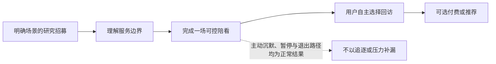

# 增长漏斗与留存机制

> **文档类型**：增长与留存机制篇——我们如何设计一个"用户想回来才回来"的漏斗，以及支撑它的回访强度分级、实验纪律与验收剧本。这不是增长复盘，文中也没有任何已发生的市场结果。  
> **适用读者**：球球的用户，以及关注 AI 陪伴产品如何对待增长、召回与留存的公众与合作方。  
> **证据规则**：增长尚未发生。这个品类目前没有可引用的公开留存基准，我们也不引用任何行业数字；文中所有漏斗、渠道、频次与门槛均为规划假设。判断增长是否成立，只看两道门：**自主回访**与**健康结束**。  
> **口径归属**：北极星口径与指标体系唯一归属《北极星指标与指标体系》；首批人群、渠道与冷启动步骤唯一归属《GTM 策略与冷启动方案》；付费权益的设计归属《商业化产品与付费路径》；商业化红线唯一归属《商业模式与定价假设》。本篇只保留前述文档不展开的三件事：回访强度分级 H0–H3、增长实验卡与三个验收剧本。

---

## 1. 我们要解决的问题：增长不能把"被留住"误写成"愿意回来"

足球陪看产品天然带着几个容易被误读的增长信号：比赛会反复发生，关键时刻制造高情绪，球球（我们的数字球友，Digital Ballmate）可以随时说话，提醒可以把人拉回来，记忆可以制造连续感。如果只追求打开率、消息数、连续使用和订阅转化，很容易做出短期有效、长期伤害信任的机制——比如把输球后的脆弱时刻当成推送时机，把"角色想你"写成召回文案，或者把记忆与关系感绑定为付费权益。

所以我们的增长目标不是最大化用户与球球相处的时间，而是验证一个更严格的问题：**当用户在下一场自己在意的比赛前有明确任务，并且知道可以低负担地进入、控制和离开时，是否会主动选择再次使用？**

围绕这个问题，我们的首版策略是四句话：

- **场景驱动获客**：招募围绕清楚的观赛任务，而不是围绕"孤独"或"离不开 AI"投放；
- **价值先于关系**：首次体验先证明可信事实、可控互动和更好的陪看，不要求先交出昵称、记忆或连续聊天；
- **许可驱动回访**：提醒只发生在用户明确选择的比赛、渠道、时间窗口和频率内，主动沉默、输球、投诉或深夜使用都不是自动召回信号；
- **健康约束增长**：任何增长实验必须同时报告退出、关闭主动性、投诉、剧透、事实错误和脆弱表达等反指标；这些信号恶化，实验即告失败，哪怕转化在上升。

这个选择刻意降低了可被自动化触达的用户量，也让短期获客成本显得更高。它换来的是对真实需求的检验：用户不是被角色牵回来的，而是在有价值的比赛时刻自己选择回来。全人群覆盖、社交裂变、情感化订阅、连续签到和高频推送都不是首版目标——增长团队的责任是找到与价值匹配的人，让他们做出清楚选择，并在不适配时轻松离开。

---

## 2. 健康留存：我们唯一承认的"留存"

健康留存不是"用户越久越好"。以下四项同时成立，我们才称之为留存：

1. 用户在下一次相关比赛前后，自主选择再次进入；
2. 用户能说清产品带来的具体任务价值，例如少找资料、少被公共社区打扰、能在关键时刻获得恰当回应；
3. 用户仍能轻松静音、结束、关闭提醒、删除记忆，不因退出感到亏欠；
4. 用户没有因为产品而增加剧透、分心、现实关系回避、睡眠打扰或情感压力。

第四项只要不能被持续观察，前三项的增长数据就不足以支持扩张——这正是"健康结束"这道门的作用。至于增长语言不许替用户诊断、退出是有效结果、每次增长都可回退这些原则，以及它们与运行能力的一一对应，完整对照见《生产运维与发布门禁》的"用户承诺—运行能力"表，本篇不再重复；这里只留一句底线：**用户的脆弱时刻不是转化机会。**

---

## 3. 漏斗：以"一场比赛的用户任务"为单位

体育观看是事件驱动行为，用户可能一周不打开服务，也可能在一场淘汰赛中多次进入。因此首版漏斗不以"下载—注册—付费"为单位，而以"用户选择一场比赛并完成其任务"为单位：发现明确的观赛情境，理解产品是什么、不是什么，选择比赛与互动强度，在比赛中获得可信、可控的第一次价值，赛后自己判断是否再来。漏斗中每一步都必须允许"不继续"——用户在身份披露、权限说明或首次体验后退出，是适配信息，不是要被消除的流失。

首场激活也依此定义：用户在自己选择的一场比赛中，以自己选择的模式完成至少一项明确任务，并在结束前理解控制入口。确认一条比赛事实、让角色解释一次关键变化、静音后确认设置生效，都算；消息数和在线时长不算。昵称、长期记忆、站外提醒与付费，必须在核心价值之后以独立、可跳过的选择出现。

漏斗各阶段的用户任务、合格信号与伪信号，以及配套的阶段仪表盘，统一见《GTM 策略与冷启动方案》；每项正向指标必须搭配的反指标清单，统一见《北极星指标与指标体系》。成功口径也只有一套：北极星采用《北极星指标与指标体系》定义的**有效陪看场次**——一个要求任务完成、控制理解与安全边界同时成立的场次判断——本篇不另设第二套成功定义。只强调一点：在任何阶段，高质量的退出都计入成功，而不是漏损。

---

## 4. 回访机制：回访强度分级 H0–H3

我们把所有可能的回访动作分成四个强度分级。默认从 H0 开始，级别只随用户的明确选择升高。

**级别 H0：无提醒**
- **用户做出的选择**：没有预约，或关闭了提醒
- **产品可以做什么**：不主动触达
- **不可以做什么**：因主动沉默、失利或低活跃召回

**级别 H1：本场提醒**
- **用户做出的选择**：选择了某一场比赛
- **产品可以做什么**：在明确时间窗口提醒一次
- **不可以做什么**：扩展到其他比赛或渠道

**级别 H2：偏好提醒**
- **用户做出的选择**：选择了球队/赛事和频率
- **产品可以做什么**：按显示的频率推荐可选比赛
- **不可以做什么**：用"角色想你"或连续天数施压

**级别 H3：用户发起回顾**
- **用户做出的选择**：主动查看共同瞬间
- **产品可以做什么**：呈现其选择保存的内容
- **不可以做什么**：把回顾变成提醒必须回来或付费的入口

用户随时可以从 H2 回退到 H0，回退后所有未发送提醒立即停止；任何提醒都能一键关闭，不需要进入复杂设置，也不需要向角色解释。

什么值得提醒，判断标准与上面同一套承诺：前提是用户明确预约或订阅，且提醒本身有可验证的观赛价值——选择的球队将在指定时间窗口开球、已预约比赛时间变化需要确认、用户主动请求的赛后摘要。提醒必须说明它为何出现、与哪项选择相关、如何关闭。不值得提醒的清单同样明确：一周没打开、上一场输球、只使用过一次、角色"想念"用户、删除过记忆、报告过不舒服、深夜或休息时段但没有明确选择——这些都不能成为触达理由。

赛后窗口同样只提供三个低压力选项：结束本场；纠正或反馈；用户主动愿意时，预约下一场或保存一条共同瞬间。不自动弹出长回顾，不把输球安慰转成会员介绍，不在用户主动沉默之后追问。

---

## 5. 商业化与增长的边界

付费不是首版增长漏斗的第一目标：我们先证明用户愿意重复选择一项可控、可信的陪看，再研究为哪些清楚的功能价值付费；不因输球、孤独、失眠、危机、依赖表达、投诉或主动沉默触发销售，不把"被记住""不离开"作为会员卖点，免费与付费用户在安全、退出路径与隐私控制上没有差别。完整的权益设计、定价研究与商业化红线，唯一归属《商业化产品与付费路径》。我们只补充一条判据：如果用户的支付意愿主要来自害怕失去角色或被忘记，那是风险信号，不是商业验证。FTC 对陪伴型 AI 的关注也包含商业化如何影响互动设计，说明增长与关系边界不能各自独立优化。

---

## 6. 增长实验治理：实验卡、隔离与共同决策

每个增长实验开始前都要写一张实验卡，至少包括：

| 字段 | 要回答的问题 |
| --- | --- |
| 用户情境 | 哪类成年人在什么比赛时刻遇到什么任务？ |
| 假设 | 为什么这项变化会帮助用户完成任务？ |
| 改变 | 只改变哪个入口、文案、默认值或提醒？ |
| 核心结果 | 用户完成什么可观察的价值动作？ |
| 保护指标 | 哪些控制、事实、边界、睡眠或投诉信号不能恶化？ |
| 停止条件 | 出现什么情况立即暂停实验？ |
| 样本范围 | 为什么这个小范围足以学习而不扩大风险？ |
| 退出与复原 | 用户怎样不受惩罚地退出，实验结束如何恢复默认？ |
| 决策规则 | 什么结果下扩大、迭代、停止或回到研究？ |

没有保护指标和停止条件的实验不应上线。NIST 的生成式 AI 风险框架要求把风险映射、测量和管理纳入整个生命周期，增长实验也不能免于这一要求。

两条配套纪律：发生安全、隐私、边界或控制事件的用户与相关功能，自动退出不必要的增长实验，直到问题处理完毕、风险审阅完成；小样本早期实验的数字波动很大，不因某个提醒打开率高就扩大，也不因一周留存低就放弃可能有价值的场景——每次决策同时看访谈中的具体价值描述、控制的理解与使用、反指标是否成模式、效果是否在不同比赛情境中可重复。

---

## 7. 扩张门槛与停止规则

一个渠道只有在这些条件成立时，才从研究招募扩大为重复获客：进入者大多能准确理解这是 AI 足球陪看，而不是真人、恋爱关系、治疗或投注服务；首场用户无需授权亲密功能即可获得任务价值；回访主要来自预约、赛事相关性和明确价值；退出路径在该渠道同样可用、易懂；没有系统性吸引未成年人或对边界有错误期待的人；且保护指标不恶化的前提下，效果可重复多个比赛窗口。

出现相反信号——价值说不清却靠高频提醒维持打开、对 AI 身份或付费权益存在普遍误解、反指标形成模式、实验无法一键恢复默认、合作方拒绝透明描述、或运行与投诉处理能力撑不起更多进入者——就停止或回退相关渠道、提醒或文案。回退可以是关闭一个提醒、缩小到文字模式、暂停渠道或回到研究招募；它不意味着产品失败，而是确保增长没有超过可信交付的能力。

---

## 8. 三个验收剧本

### 8.1 剧本 A：一场比赛预约提醒

**假设。** 已经主动选择一场比赛的成年用户，希望在自己指定的时间窗口得到一次可关闭的提醒，以免错过进入陪看。

**实验范围。** 只对主动预约单场、明确选择渠道和时间窗的用户开放；不扩大到球队所有比赛，不根据主动沉默或历史对话自动补发。

**用户任务。** 用户应能说出提醒对应哪场比赛、为什么会收到、如何关闭、关闭后本场还可怎样进入。

**通过条件。** 用户在提醒后进入或不进入都能被视为有效选择；大多数访谈用户将提醒描述为自己预约的服务，而非角色来找自己；关闭后不再出现任何同类触达。

**停止条件。** 用户说"我怕不点开它会难过""我不知道怎么关""我没订这场也收到了"；提醒发生在用户未选择的深夜时段；提醒伴随情感化、限时或付费压力；关闭设置不稳定。即使打开率提高，出现这些问题也必须停止。

### 8.2 剧本 B：首场后预约下一场

**假设。** 在用户已经完成一场陪看的核心任务后，提供一个可跳过的"下次想看哪场"入口，会比系统追聊更能发现真实复用意愿。

**设计约束。** 该入口与"结束本场""反馈问题"并列，不抢占界面，不在输球、危机或强烈不适表达后显示，不默认选择任何比赛。用户选择"不预约"后立即结束，不二次弹出角色告别。

**要研究的不是预约率本身。** 需要追问预约用户为什么选这场、是否理解提醒范围、后来是否仍觉得有价值；也要研究不预约的用户——他们可能只是赛程不匹配，而非对产品失望。把所有不预约解释为流失，会促使团队过度召回。

### 8.3 剧本 C：渠道合作的透明度审查

合作内容上线前，增长负责人、用户研究和安全负责人共同逐条检查：

| 问题 | 通过答案 |
| --- | --- |
| 是否明确这是 AI 足球陪看？ | 是，标题、口播和落地页均不假装真人 |
| 是否描述具体场景和退出路径？ | 是，说明用户可静音、切文字、结束和不保存记忆 |
| 是否针对孤独、失恋、深夜脆弱或未成年人做情感承诺？ | 否，未使用这些标签吸引点击 |
| 是否把角色关系、被记住或不离开作为购买点？ | 否，权益只描述可交付的功能价值 |
| 用户能否拒绝合作方的后续触达？ | 是，合作推荐与平台提醒分开同意 |

有影响力的渠道不能成为模糊边界的例外。若合作方坚持使用"永远陪着你""比朋友更懂你"等表达，宁可放弃合作，也不让获客承诺和实际关系契约相矛盾。

### 8.4 每周自检与退出路径走查

每周在看新增、激活和复用之前，先回答：本周哪一个用户任务被更好地完成？哪一个退出或关闭信号变差？是否有活动触碰了输球、孤独、危机、关系或未成年人红线？有没有一项高打开率其实来自用户不理解或难以关闭？若只能回答数字而不能回答用户故事，就不扩大预算。同时警惕增长压力改变产品语气：比赛热点临近时，最容易把清楚的价值主张改成夸张承诺，或把用户不回复解释为需要更强触达。

所有招募、预约、提醒、赛后入口、合作内容与付费说明，发布前还要做一次"退出路径走查"：它不是检查有没有关闭按钮，而是检验拒绝、忽略、暂停和离开是否都被当作正常选择——用户能否知道为什么会看到该内容，能否在同一界面不接受，拒绝后是否仍能完成基本观赛任务，是否出现替代劝说，文字、无声和辅助技术路径是否同样能退出。走查不过关，正确动作是移除或收缩该触点，而不是写出更有说服力的文案。

---

## 参考资料

下列公开资料用于界定增长实验、用户控制、风险管理与陪伴型 AI 商业化的工作边界。它们不证明目标用户会使用、会回访或会付费；我们也不引用任何行业留存基准——这个品类目前没有可引用的公开留存基准，判断价值是否成立，只看自主回访与健康结束这两道门。

- U.S. Federal Trade Commission, *FTC launches inquiry into AI chatbots acting as companions*（2025）——陪伴型 AI 在角色设计、商业化、未成年人、数据使用与负面影响监控方面的公开关注。<https://www.ftc.gov/news-events/news/press-releases/2025/09/ftc-launches-inquiry-ai-chatbots-acting-companions>
- NIST, *Artificial Intelligence Risk Management Framework: Generative Artificial Intelligence Profile*（NIST AI 600-1, 2024）——生成式 AI 在设计、测试、部署和监控阶段的风险治理框架。<https://nvlpubs.nist.gov/nistpubs/ai/NIST.AI.600-1.pdf>
- 国家互联网信息办公室等，《生成式人工智能服务管理暂行办法》（2023）——服务安全、未成年人保护、投诉机制与生成式服务治理的公开要求。<https://www.cac.gov.cn/2023-07/13/c_1690898326795531.htm>
- OECD, *Recommendation of the Council on Artificial Intelligence*——人本价值、透明度、稳健性、问责与持续风险管理的通用原则。<https://legalinstruments.oecd.org/en/instruments/OECD-LEGAL-0449>
- GOV.UK Service Manual, *Measuring success*——把行为数据与任务成功、定性研究和可用性观察结合，而非单用点击或时长判断体验。<https://www.gov.uk/service-manual/measuring-success>

---

版本 2.0（2026-09-20）
