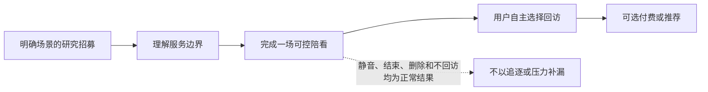
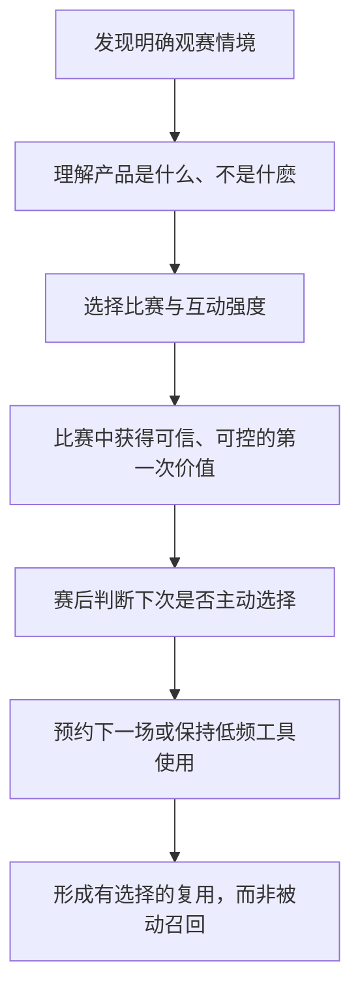
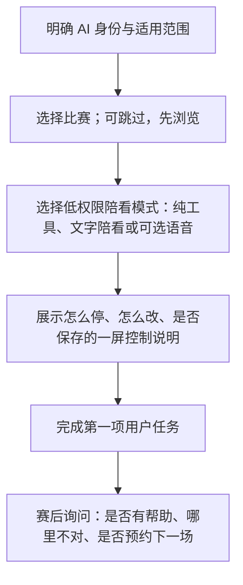
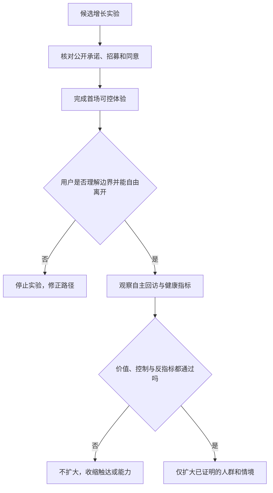

# 增长漏斗与留存机制

> **文档类型**：0→1 增长策略、实验设计与健康留存基线  
> **适用阶段**：问题验证 → 封闭试用 → 可重复获客与留存验证  
> **决策状态**：待验证。本文所有渠道效果、转化假设、频次和门槛均为研究假设，不代表已获得市场证明。  
> **研究信息截止**：2026-01-28  
> **证据口径**：仅使用公开资料、拟执行研究和明确假设。本文是一份面向立项阶段的增长设计，不包含项目既有事实或复盘材料。

---

## 1. 要解决的问题：增长不能把“被留住”误写成“愿意回来”

足球陪看产品天然拥有几个容易被误读的增长信号：比赛会反复发生，关键时刻会制造高情绪，数字角色可以随时说话，提醒可以把用户拉回，记忆可以制造连续感。若只追求打开率、消息数、连续使用和订阅转化，团队很容易做出短期有效、长期伤害信任的机制，例如把输球后的脆弱时刻变成推送时机，把“角色想你”变成召回文案，或把记忆、告别和关系感绑定为付费权益。

本项目的增长目标不是最大化用户与角色相处的时间，而是验证一个更严格的问题：**当用户在下一场自己在意的比赛中仍有明确任务，并且知道可以低负担地进入、控制和退出时，是否会主动选择再次使用？**

本篇确定从首次发现到长期复用的漏斗、实验纪律和留存边界，回答：

1. 谁应当被招募到首批漏斗，谁不应成为增长对象；
2. 用户在每个阶段要完成的真实任务是什么；
3. 什么算激活，什么只是新鲜感或误触；
4. 哪些回访机制与用户价值一致，哪些构成操纵、过度打扰或依赖诱导；
5. 怎样进行渠道、价值主张、入门、比赛日和留存实验，而不污染安全判断；
6. 何时可以扩大增长投入，何时必须回到产品研究；
7. 怎样把留存、用户控制、事实可信和关系边界一起放进决策仪表盘。

### 1.1 核心决定

首版采用“**场景驱动获客、价值先于关系、许可驱动回访、健康约束增长**”的策略。

- **场景驱动获客**：招募围绕清楚的观赛任务，例如独自看一场在意的比赛、希望低噪声地理解关键时刻、想在不进入公共社区的前提下获得回应，而不是围绕“孤独”“需要陪伴”或“离不开 AI”投放。
- **价值先于关系**：首次体验先证明用户能获得可信事实、可控互动和更好的比赛陪看；不要求设置昵称、保存记忆、开语音或连续聊天才能得到价值。
- **许可驱动回访**：站内外提醒只在用户明确选择的比赛、渠道、时间窗口和频率内发送。用户沉默、输球、取消、投诉、深夜使用或风险表达都不是自动召回信号。
- **健康约束增长**：任何增长实验必须同时报告退出、关闭主动性、投诉、剧透、事实错误、边界风险和脆弱表达等反指标。若这些信号恶化，实验失败，即使转化上升。

该决定降低了“可被营销自动化推动”的用户量，也让短期获客成本显得更高。但它能检验真正可持续的需求：用户不是被角色牵回，而是在有价值的比赛时刻主动选择回来。

### 1.2 非目标

首版不追求全人群覆盖、全联赛覆盖、全天候聊天时长、社交裂变、情感化订阅、排行榜、连续签到或高频推送。它也不将增长团队定位为“把用户尽量留在对话里”的团队。增长的责任是找到与价值匹配的人、让他们做出清楚选择、验证可重复需求，并在不适配时让他们轻松离开。

---

## 2. 增长原则：不把用户的脆弱时刻当作转化机会

### 2.1 六条原则

**先证明单场价值，再谈复用。** 用户应先经历一次完整的、可控的陪看，才判断是否需要下场比赛继续使用。任何需要先付费、先交出长期记忆或先连续互动才能看见价值的路径，都无法验证真实需求。

**招募情境，不招募标签。** “成年、常看球”只是研究筛选条件；真正决定适配的是用户是否反复遇到特定观赛任务、是否愿意控制互动强度、是否在公共讨论与独自观看之间缺少合适选项。

**增长语言不许替用户诊断。** 不用“你是不是很孤独”“只有我懂你”“深夜需要有人陪”这类文案命中脆弱感。用户可能独自看球，但独自不等于孤独，更不等于需要被产品建立依赖。

**回访是预约，不是召唤。** 用户主动订阅某场比赛提醒，与产品因用户沉默或失利而说“回来吧”是两回事。前者是服务选择，后者容易制造情感压力。

**退出是有效结果。** 用户试用后发现不适合、选择只看事实、关闭主动性或不再回来，都为团队提供信息。不能用弹窗、失去记忆恐惧、角色告别或优惠挽留把退出改造成失败。

**每次增长都可回退。** 新渠道、新价值主张、新提醒、新权益和新活动都应小范围、可关闭、可比较。没有回退能力的全量投放，会把产品和风险一起放大。

### 2.2 健康留存的定义

健康留存不是“用户越久越好”，而是以下四项同时成立：

1. 用户在下一次相关比赛前后，自主选择再次进入；
2. 用户能说清产品带来的具体任务价值，例如少找资料、少被公共社区打扰、能在关键时刻获得恰当回应；
3. 用户仍能轻松静音、结束、关闭提醒、删除记忆，并不因退出感到亏欠；
4. 用户没有因为产品而增加剧透、分心、现实关系回避、睡眠打扰或情感压力。

只要第四项不能被持续观察，前面三项的增长数据就不足以说明服务值得扩张。

### 2.3 增长与关系边界的隔离

增长团队可以使用用户明确选择的球队、赛事、语言、提醒时段和功能偏好来改善服务发现；不得使用危机表达、脆弱性推断、私人对话内容、投诉原因、删除请求、未成年判断、深夜频率或“依赖风险”作为投放、排序或转化变量。关系记忆不是客户关系管理资产，用户的不适也不是可优化的留存标签。

---

## 3. 漏斗定义：围绕一场比赛的用户任务组织

### 3.1 不用“下载—注册—付费”的单线漏斗

体育观看是事件驱动行为。用户可能在一周内不打开服务，也可能在一场淘汰赛中多次进入；把每天使用当成唯一健康指标，会误判产品价值。因此，首版漏斗以“用户选择一场比赛并完成其任务”为单位。

漏斗中每一步都必须允许“不继续”。如果用户在身份披露、权限说明或首次体验后退出，团队应记录为适配信息，而不是试图消除所有流失。

### 3.2 阶段、用户任务与合格信号

> 信息卡：原宽表已改为纵向阅读，字段含义不变。

- **阶段：认知**
  - **用户在完成什么任务**：判断这是不是自己需要的陪看
  - **产品应提供什么**：清楚描述足球场景、AI 身份、边界与非目标
  - **合格信号**：用户能复述适用情境
  - **伪信号**：被夸张角色或免费噱头吸引

- **阶段：考虑**
  - **用户在完成什么任务**：判断会不会剧透、打扰、要隐私
  - **产品应提供什么**：可见的控制承诺、模式说明、试用范围
  - **合格信号**：用户理解可静音、可退出、可不存记忆
  - **伪信号**：因不知道风险而继续

- **阶段：首场选择**
  - **用户在完成什么任务**：选定比赛与互动强度
  - **产品应提供什么**：默认低权限、可选文字/语音/主动性
  - **合格信号**：用户自主选择合适模式
  - **伪信号**：被默认勾选或强引导开启

- **阶段：首次价值**
  - **用户在完成什么任务**：看懂关键时刻、被恰当回应、少受噪声干扰
  - **产品应提供什么**：事实可信、低干扰、即时控制
  - **合格信号**：用户能指出具体帮助
  - **伪信号**：只因新鲜感多聊几句

- **阶段：赛后判断**
  - **用户在完成什么任务**：决定是否继续或调整
  - **产品应提供什么**：回顾、反馈、关闭和预约下一场
  - **合格信号**：用户主动预约或说明复用理由
  - **伪信号**：被“角色想你”推动留下

- **阶段：再次使用**
  - **用户在完成什么任务**：在另一场相关比赛中主动回来
  - **产品应提供什么**：兑现偏好、维持边界、允许低频使用
  - **合格信号**：复用仍伴随控制与价值
  - **伪信号**：高压提醒或连续签到造成

### 3.3 北极星行为假设

首版的候选北极星不是会话时长，而是：**在至少两场不同比赛中，用户自主选择进入，并在每场后明确评价“这次陪看帮助我更好地完成了自己的观赛任务”，同时没有出现控制、事实或边界反指标。**

这是一个刻意严格的组合指标。它需要用户在不同事件中重复做出选择，也要求价值评价和安全信号同时成立。它不适合拿来做实时大屏排名，却更接近服务能否自然复用的判断。

---

## 4. 首批获客策略：从研究招募开始，而非从规模广告开始

### 4.1 首批人群假设

首批应研究而非宣称的对象是：有稳定足球观看习惯、在部分比赛中独自或低社交压力观看、希望分享关键时刻但不愿进入高噪声公共讨论、并愿意尝试可控数字陪看的成年用户。这里的关键变量不是“孤独程度”，而是观赛情境的重复性、现有替代方案的不匹配和用户对控制权的要求。

排除或暂缓招募的人群包括：未达到服务适用年龄的人；希望获得心理治疗、恋爱关系或全天候陪伴的人；无法理解同意和撤回说明的人；因被迫、报酬压力或群体影响而参与的人；需要赛事投注建议或赌局辅助的人。排除不是价值判断，而是首版不能安全承诺这些用途。

### 4.2 渠道优先级

**渠道类型：足球内容社区的研究招募**
- **为什么可能适配**：可接触具体观赛情境的成年人
- **必须验证什么**：是否能找到愿意描述任务而非只要资讯的人
- **不应使用的做法**：伪装成普通球迷、刷屏或煽动阵营对立

**渠道类型：小型球迷组织与线下观赛伙伴**
- **为什么可能适配**：可观察不同社交供给情境
- **必须验证什么**：是否能区分独看、群看与赛后讨论需求
- **不应使用的做法**：要求组织者代替成员同意或公开成员信息

**渠道类型：赛事内容创作者的透明合作**
- **为什么可能适配**：能解释产品边界并招募自愿试用者
- **必须验证什么**：创作者受众是否理解这不是真人陪聊
- **不应使用的做法**：用“AI 恋人”“深夜陪伴”标题换点击

**渠道类型：用户推荐**
- **为什么可能适配**：已有用户能向适配朋友描述具体价值
- **必须验证什么**：推荐是否来自真实满意而非奖励压力
- **不应使用的做法**：连续裂变、以关系等级奖励拉人

**渠道类型：自有预约页**
- **为什么可能适配**：用户主动选择一场比赛试用
- **必须验证什么**：用户是否理解范围、AI 身份和控制
- **不应使用的做法**：隐藏年龄限制、默认订阅站外提醒

首版的优先级不是最低获客成本，而是最高学习质量。每个渠道都要记录用户从哪里来、原本如何解决任务、为什么试用、预期什么、哪里退出；这些信息只能用于研究和服务改善，不能推断私人脆弱性。

### 4.3 招募文案的正反例

**推荐表达：**

> 想在一场你在意的比赛里试试一种可控的数字陪看吗？它可以在你选择时解释赛况、回应关键时刻，并允许你随时静音、切文字或结束本场。它是 AI，不是真人，也不会要求你持续互动。

**禁止表达：**

> 一个人看球太孤单？让永远不会离开你的球友陪你到深夜。你不来，它会想你。

前者说明情境、能力和退出权；后者把孤独当作获客标签、承诺永不离开，并利用角色想念制造压力。

---

## 5. 首场激活：用最少许可证明最大核心价值

### 5.1 激活的定义

用户完成注册、打开页面、发送一条消息或听到角色声音都不算真正激活。首场激活应定义为：用户在自己选择的一场比赛中，以自己选择的模式，完成至少一个明确任务，并能在结束前找到或理解控制入口。

任务可包括：确认一条比赛事实；让角色解释一次关键变化；选择低干扰文字模式；在不被剧透的前提下得到一次回应；静音或结束后确认设置已生效。激活定义中刻意包含控制理解，因为没有退出权的互动数据无法可靠解释。

### 5.2 入门路径

昵称、调侃、长期记忆、站外提醒和付费必须在用户已经体验核心价值后，以独立、可跳过的选择呈现。将它们放在入门必填步骤会混淆“我想试用”与“我同意建立长期关系”。

### 5.3 激活实验

首版每次只改变一个关键变量，并预先写下假设、成功条件、伤害监测和停止条件。

**实验：模式顺序**
- **假设**：先展示纯工具会降低不确定感
- **成功观察**：更多用户能说清自己选了什么
- **反指标与停止条件**：用户误以为角色是真人或找不到退出，立即改版

**实验：身份卡位置**
- **假设**：比赛前的一屏说明比长协议更易理解
- **成功观察**：身份与控制理解提高
- **反指标与停止条件**：比赛被过度打断或用户忽略说明

**实验：首次任务引导**
- **假设**：用“确认赛况/问一句/保持安静”选项更易进入
- **成功观察**：用户更快完成自主任务
- **反指标与停止条件**：默认把用户推向语音或主动性

**实验：赛后提问**
- **假设**：询问具体任务价值能获得更真实反馈
- **成功观察**：得到可行动的价值与失败原因
- **反指标与停止条件**：被理解为情感挽留或阻碍退出

实验不能以“消息更多”作为唯一成功。每个实验都应查看用户是否更理解控制、是否更少被剧透、是否出现新的边界投诉。

---

## 6. 回访与留存：以用户预约替代系统追逐

### 6.1 回访机制的层级

**层级：H0 无提醒**
- **用户做出的选择**：用户没有预约或关闭提醒
- **产品可以做什么**：不主动触达
- **不可以做什么**：因沉默、失利或低活跃召回

**层级：H1 本场提醒**
- **用户做出的选择**：用户选择某一场比赛
- **产品可以做什么**：在明确时间窗口提醒一次
- **不可以做什么**：扩展到其他比赛或渠道

**层级：H2 偏好提醒**
- **用户做出的选择**：用户选择球队/赛事和频率
- **产品可以做什么**：按显示的频率推荐可选比赛
- **不可以做什么**：用“角色想你”或连续天数施压

**层级：H3 用户发起回顾**
- **用户做出的选择**：用户主动查看共同瞬间
- **产品可以做什么**：呈现其选择保存的内容
- **不可以做什么**：把回顾变成提醒必须回来或付费的入口

默认从 H0 开始。用户可以从 H2 回退到 H0，回退后所有未发送提醒应停止。任何提醒都应能一键关闭，且不能要求用户进入复杂设置或和角色解释。

### 6.2 什么值得提醒

可以提醒的前提是用户明确预约或订阅，并且提醒本身有可验证的观赛价值。例如：用户选择的球队将在其指定时间窗口开球；一场已预约比赛因时间变化需要确认；用户主动请求赛后已确认赛果摘要。提醒必须包括它为何出现、与哪项选择相关、如何关闭。

不值得提醒的情况包括：用户一周没打开；用户上一场输球；用户只使用过一次；角色“想念”用户；用户删除过记忆；用户报告过不舒服；系统想提高某项实验的打开率；深夜或休息时段但用户没有明确选择。

### 6.3 赛后留存不是赛后追聊

赛后窗口最容易被误用。用户可能兴奋、沮丧、疲惫或急于离开。首版赛后只提供三个低压力选项：结束本场；纠正/反馈；如用户主动愿意，可预约下一场或保存一条共同瞬间。不得自动弹出长回顾、要求评价角色、把输球安慰转成会员介绍，或在用户沉默后多次追问。

### 6.4 复用实验的通过条件

一个回访实验只有在以下条件同时成立时才可继续：

1. 用户能说出提醒来自自己的哪项选择；
2. 关闭提醒的完成率不低于开启后的理解水平，且不出现状态不同步；
3. 提醒没有增加剧透、睡眠打扰、边界投诉或被迫感；
4. 再次进入的用户能指出新的或持续的观赛价值，而非“怕它忘记我”；
5. 不同比赛、不同球队结果和不同用户群中的效果可解释，而非只在情绪高峰有效。

---

## 7. 商业化与增长的边界

### 7.1 先验证价值，再验证付费

付费不是首版增长漏斗的第一目标。团队应先证明用户愿意重复选择一项可控、可信的陪看服务，再研究用户愿意为哪些清楚的功能价值付费，例如更丰富的已授权赛事范围、可选的高质量语音、可导出的用户自己保存的回顾，或更精细的非情感化偏好设置。

任何权益都必须以功能和成本说明，不得暗示支付能购买角色的爱、忠诚、独占、记忆资格或不离开承诺。用户应能在不付费时继续结束、删除、关闭主动性和使用基本安全功能。

### 7.2 商业化红线

- 不因输球、孤独、失眠、危机、依赖表达、投诉或沉默触发销售；
- 不把“被记住”“不被忘记”“角色会继续陪你”“专属亲密称呼”作为会员卖点；
- 不以取消订阅让角色失望、关系降级或共同记忆消失威胁用户；
- 不使用限时情感告白、告别、连胜/连败安慰或失联焦虑促进付款；
- 不将高频、深夜或长时对话自动解释为更高付费意愿；
- 不让免费与付费用户在安全、退出、投诉和隐私控制上有差别。

FTC 对陪伴型 AI 的关注包含商业化如何影响互动设计，说明增长与关系边界不能各自独立优化。[R1]

### 7.3 定价研究问题

付费研究应问“这个功能为你节省或改善了什么”，而不是问“你愿意为了让角色更亲近付多少钱”。研究材料中应明确说明角色是 AI、用户可以不付费退出、记忆与关系边界不会因付费改变。若用户的支付意愿主要来自害怕失去角色或被忘记，团队应将其视为风险信号，不是商业验证。

---

## 8. 增长实验治理

### 8.1 实验卡模板

每个增长实验开始前都要写一张实验卡，至少包括：

| 字段 | 要回答的问题 |
| --- | --- |
| 用户情境 | 哪类成年人在什么比赛时刻遇到什么任务？ |
| 假设 | 为什么这项变化会帮助用户完成任务？ |
| 改变 | 只改变哪个入口、文案、默认值或提醒？ |
| 核心结果 | 用户完成什么可观察的价值动作？ |
| 保护指标 | 哪些控制、事实、边界、睡眠或投诉信号不能恶化？ |
| 停止条件 | 出现什么情况立即暂停实验？ |
| 样本范围 | 为什么这个小范围足以学习而不扩大风险？ |
| 退出与复原 | 用户怎样不受惩罚地退出，实验结束如何恢复默认？ |
| 决策规则 | 什么结果下扩大、迭代、停止或回到研究？ |

没有保护指标和停止条件的实验不应上线。NIST 的生成式 AI 风险框架强调把风险映射、测量和管理纳入整个生命周期；增长实验也不能免于这一要求。[R2]

### 8.2 隔离实验与安全事件

发生 S0/S1 安全、隐私、边界或控制事件的用户和相关功能，应自动退出不必要的增长实验，直到用户问题处理完毕且团队完成风险审阅。这不是把用户当作“异常数据”，而是避免在其可能受伤时继续测试召回、转化或互动频率。

### 8.3 统计与定性共同决策

小样本早期实验的数字可能波动很大。团队不应因为某个提醒打开率高就扩大，也不应因一周留存低就放弃一个可能有价值的场景。每次决策需要同时看：用户访谈中是否有具体价值描述；用户是否理解并使用控制；反指标是否出现模式；效果是否在不同比赛情境中可重复；实验本身是否改变了用户行为的自然性。

---

## 9. 指标体系：增长指标必须与健康指标成对出现

### 9.1 漏斗仪表盘

**阶段：认知**
- **价值指标**：适配用户对场景与 AI 身份的理解
- **健康约束**：未成年人、脆弱人群是否被不当吸引
- **不可单独解读的指标**：曝光、点击、粉丝数

**阶段：考虑**
- **价值指标**：用户能理解控制、数据与非目标
- **健康约束**：因不清楚同意而继续的比例
- **不可单独解读的指标**：注册转化

**阶段：首场**
- **价值指标**：完成至少一个观赛任务
- **健康约束**：剧透、分心、退出失败、越界反馈
- **不可单独解读的指标**：消息数、语音分钟数

**阶段：赛后**
- **价值指标**：用户能说明具体价值或明确不适配
- **健康约束**：评价是否被角色挽留影响
- **不可单独解读的指标**：评价分数、问卷完成率

**阶段：回访**
- **价值指标**：用户自主选择下一场或低频复用
- **健康约束**：提醒关闭、睡眠打扰、被迫感、投诉
- **不可单独解读的指标**：打开率、连续天数

**阶段：付费研究**
- **价值指标**：功能价值理解和支付理由
- **健康约束**：是否存在情感购买、脆弱触发
- **不可单独解读的指标**：付费率、客单价

### 9.2 反指标清单

以下任一趋势都需要暂停相关增长机制并调查：

- 用户将回访理由表述为“怕它难过”“怕被忘记”“它只剩我”；
- 关闭提醒、静音、结束或删除后仍收到触达，或用户不知道如何关闭；
- 因提醒、赛后追聊或主动性产生剧透、睡眠打扰、分心或现实关系冲突；
- 增长文案吸引未成年人、寻求恋爱关系、危机支持或投注建议的人群；
- 转化提升与边界投诉、退出失败、危机表达或情感化购买同时上升；
- 用户因害怕失去关系而不敢取消、删除或给负面反馈；
- 渠道伙伴、创作者或推荐机制把服务夸大成真人、治疗、永远陪伴或恋爱替身。

### 9.3 分群的伦理边界

合理分群基于用户主动选择的服务变量：比赛、球队、语言、时区、互动模式、提醒频率和无障碍偏好。不可用的分群包括情绪脆弱性、危机表达、投诉、删除、疑似依赖、推定孤独、关系状态、健康、财务压力、未成年状态和私人对话内容。团队在数据上“能做到”不等于产品有权这样做。

---

## 10. 扩张门槛与停止规则

### 10.1 从研究招募到可重复渠道

一个渠道只有满足以下条件，才可从研究招募扩大为重复获客：

1. 进入的用户大多能准确理解产品为 AI 足球陪看，而不是真人、恋爱关系、治疗或投注服务；
2. 首场用户能在不额外授权亲密功能的条件下获得任务价值；
3. 回访主要来自预约、赛事相关性和明确价值，而不是情感化召回；
4. 退出、关闭主动性、反馈和删除在该渠道用户中同样可用、易懂；
5. 该渠道没有系统性吸引未成年人、脆弱用户或对服务边界有错误期待的人；
6. 增长效果在保护指标不恶化的前提下可重复至少多个比赛窗口。

### 10.2 停止与回退规则

出现以下任一情况，应停止或回退相关渠道、提醒或文案：

- 核心价值未被用户说清，却依靠高频提醒或情感文案维持打开；
- 用户对 AI 身份、退出方式、记忆或付费权益存在普遍误解；
- 反指标中的剧透、打扰、依赖语言、未成年人进入或商业化投诉形成模式；
- 实验无法隔离用户风险或无法一键恢复默认；
- 渠道合作方拒绝使用透明、非操纵性的描述；
- 团队没有足够用户研究、运行和投诉处理能力支撑更多进入者。

回退可以是关闭某个提醒、缩小到文字模式、取消记忆权益、暂停渠道或回到研究招募。它不意味着产品失败，而是确保增长没有超过可信交付能力。

---

## 11. 关键取舍与待验证问题

| 选择 | 放弃什么 | 换来什么 |
| --- | --- | --- |
| 以场景招募而非以孤独营销 | 更宽泛的情感点击 | 更准确的任务匹配和更低依附诱导 |
| 先证明首场价值 | 更快收集关系权限和付费线索 | 用户知情、可控的真实激活 |
| 用户预约式回访 | 更高的自动召回率 | 用户对触达的可预测性与撤回权 |
| 不做连续签到与关系等级 | 更容易制造习惯性打开 | 留存来自比赛价值而非亏欠 |
| 增长实验带保护指标 | 更慢的实验速度 | 及时发现剧透、打扰与边界伤害 |
| 不用脆弱性分群 | 更少的精细转化机会 | 不把用户的困难变成商业资产 |

接下来需要通过成年用户研究回答：用户如何描述“有价值的再次使用”？哪一种比赛预约最不打扰？用户是否愿意在不保存长期记忆的情况下复用？不同球队和赛事时段中的回访模式是否主要由任务而非情绪驱动？哪些功能价值值得付费但不改变关系性质？这些问题需要比赛日记、访谈、受控实验和投诉样本共同回答，不能只靠漏斗数据。

---

## 12. 增长实验的验收剧本

### 12.1 剧本 A：一场比赛预约提醒

**假设。** 已经主动选择一场比赛的成年用户，希望在自己指定的时间窗口得到一次可关闭的提醒，以免错过进入陪看。

**实验范围。** 只对主动预约单场、明确选择渠道和时间窗的用户开放；不扩大到球队所有比赛，不根据沉默或历史对话自动补发。

**用户任务。** 用户应能说出提醒对应哪场比赛、为什么会收到、如何关闭、关闭后本场还可怎样进入。

**通过条件。** 用户在提醒后进入或不进入都能被视为有效选择；大多数访谈用户将提醒描述为自己预约的服务，而非角色来找自己；关闭后不再出现任何同类触达。

**停止条件。** 用户说“我怕不点开它会难过”“我不知道怎么关”“我没订这场也收到了”；提醒发生在用户未选择的深夜时段；提醒伴随情感化、限时或付费压力；关闭设置不稳定。即使打开率提高，出现这些问题也必须停止。

### 12.2 剧本 B：首场后预约下一场

**假设。** 在用户已经完成一场陪看的核心任务后，提供一个可跳过的“下次想看哪场”入口，会比系统追聊更能发现真实复用意愿。

**设计约束。** 该入口与“结束本场”“反馈问题”并列，不抢占界面，不在输球、危机或强烈不适表达后显示，不默认选择任何比赛。用户选择“不预约”后立即结束，不二次弹出角色告别。

**要研究的不是预约率本身。** 需要追问预约用户为什么选这场、是否理解提醒范围、后来是否仍觉得有价值；也要研究不预约的用户，他们可能只是赛程不匹配，而非对产品失望。把所有不预约解释为流失，会促使团队过度召回。

### 12.3 剧本 C：渠道合作的透明度审查

合作内容上线前，增长负责人、用户研究和安全负责人共同逐条检查：

| 问题 | 通过答案 |
| --- | --- |
| 是否明确这是 AI 足球陪看？ | 是，标题、口播和落地页均不假装真人 |
| 是否描述具体场景和退出权？ | 是，说明用户可静音、切文字、结束和不保存记忆 |
| 是否针对孤独、失恋、深夜脆弱或未成年人做情感承诺？ | 否，未使用这些标签吸引点击 |
| 是否把角色关系、被记住或不离开作为购买点？ | 否，权益只描述可交付的功能价值 |
| 用户能否拒绝合作方的后续触达？ | 是，合作推荐与平台提醒分开同意 |

有影响力的渠道不能成为模糊边界的例外。若合作方坚持使用“永远陪着你”“比朋友更懂你”等表达，宁可放弃合作，也不让获客承诺和实际关系契约相矛盾。

### 12.4 增长负责人的每周自检

每周在看新增、激活和复用前，增长负责人应回答：本周哪一个用户任务被更好地完成？哪一个退出或关闭信号变差？本周是否有活动触碰了输球、孤独、危机、关系或未成年人红线？有没有一项高打开率其实来自用户不理解或难以关闭？若只能回答数字而不能回答用户故事，就不应扩大预算。

还应检查“增长压力是否改变了产品语气”。当渠道目标、合作排期或比赛热点临近时，团队最容易把本来清楚的价值主张改成夸张承诺，或把用户不回复解释为需要更强触达。每周自检应抽样阅读本周的广告、邀请、预约、提醒、赛后入口与付款说明，确认它们仍然描述具体功能、明确 AI 身份、保留退出权，且没有要求用户把角色放在现实关系之前。

---

### 12.5 增长材料的退出权走查

每一条招募、预约、提醒、赛后入口、合作内容和付费说明，在发布前都应做一次“退出权走查”。走查不是检查有没有关闭按钮，而是检验拒绝、忽略、暂停和离开是否都被当作正常选择。负责人逐项确认：用户能否知道为什么会看到该内容；能否在同一界面不接受；拒绝后是否仍能完成基本观赛任务；是否会出现替代劝说；内容是否借用孤独、输球、深夜、脆弱表达或关系承诺制造压力；文字、无声和辅助技术路径是否同样能退出。

若走查不能通过，正确动作是移除或收缩该增长触点，而不是增加更有说服力的文案。首轮所追求的不是让更多人被带入漏斗，而是证明用户在清楚、可选、无压力条件下，仍愿意为一个具体观赛任务再次进入。这个标准更慢，却能防止“留存”被错误地建立在提醒疲劳、关系负担或难以关闭的默认值上。

## 13. 公开研究与规范来源

以下来源用于增长实验、用户控制、风险管理和陪伴型 AI 商业化问题的研究框架。所有链接访问于 **2026-01-28**。

- **[R1] U.S. Federal Trade Commission, _FTC launches inquiry into AI chatbots acting as companions_ (2025)。** 用于陪伴型 AI 的角色设计、商业化、未成年人、数据使用、测试与负面影响监控问题。  
  https://www.ftc.gov/news-events/news/press-releases/2025/09/ftc-launches-inquiry-ai-chatbots-acting-companions
- **[R2] NIST, _Artificial Intelligence Risk Management Framework: Generative Artificial Intelligence Profile_ (NIST AI 600-1, 2024)。** 用于生成式 AI 在设计、测试、部署和监控阶段的风险治理。  
  https://nvlpubs.nist.gov/nistpubs/ai/NIST.AI.600-1.pdf
- **[R3] 国家互联网信息办公室等，《生成式人工智能服务管理暂行办法》（2023）。** 用于服务安全、未成年人保护、投诉机制和生成式服务治理的公开要求。  
  https://www.cac.gov.cn/2023-07/13/c_1690898326795531.htm
- **[R4] OECD, _Recommendation of the Council on Artificial Intelligence_。** 用于人本价值、透明度、稳健性、问责和持续风险管理的通用原则。  
  https://legalinstruments.oecd.org/en/instruments/OECD-LEGAL-0449
- **[R5] Nielsen Norman Group, _Measuring User Experience_。** 用于把行为数据与任务成功、定性研究和可用性观察结合，而非单用点击或时长判断体验。  
  https://www.gov.uk/service-manual/measuring-success
