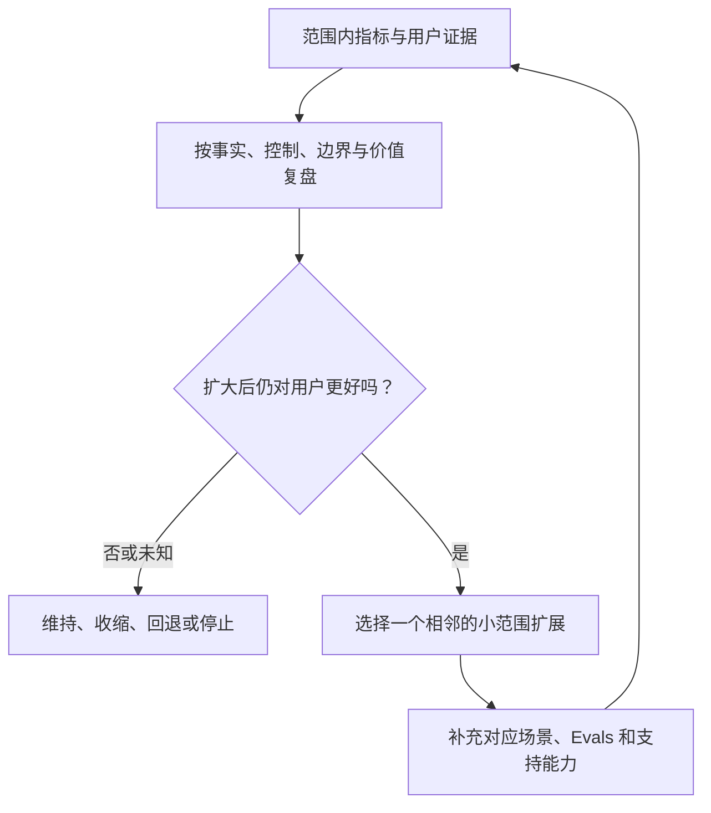
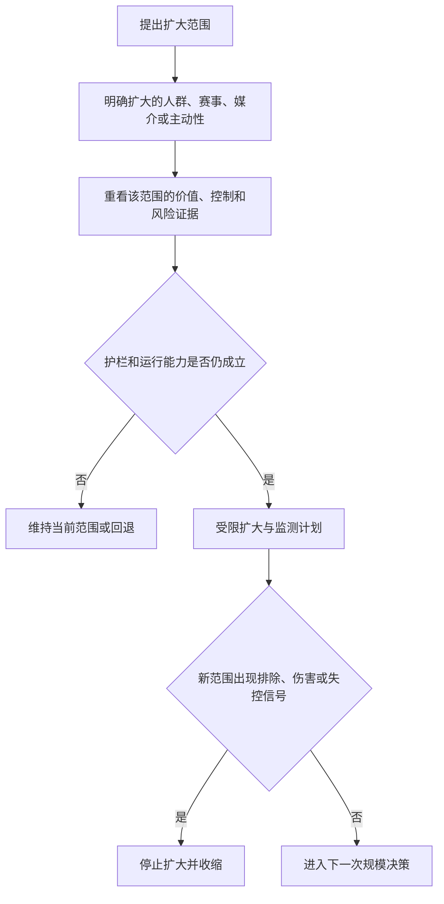
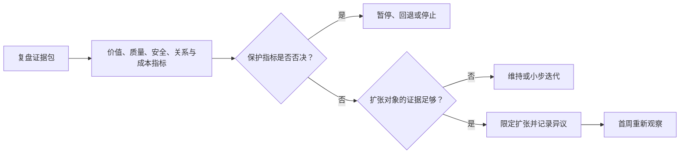

# 指标复盘与规模化决策

> **文档类型**：0→1 指标治理、学习复盘与规模化决策框架  
> **适用阶段**：封闭试用 → 公开发布评审 → 赛事、用户与功能规模化  
> **决策状态**：立项基线。本文给出决策口径、研究假设和门槛设计，不把任何预期数值或市场表现写成既成事实。  
> **研究信息截止**：2026-01-28  
> **证据口径**：仅使用公开资料、拟执行研究与明确假设。本文是一份面向立项阶段的决策设计，不包含项目既有事实或复盘材料。

---

## 1. 要解决的问题：规模化是一种需要被证明的能力

一款足球数字陪看产品最容易在“数据开始增长”时做出错误决定。更多比赛、更多用户、更多语音、更多主动提醒和更多记忆，都会让使用量看起来上升；但如果事实可信度下降、用户更难退出、投诉处理跟不上、角色边界开始松动，增长只是在更大范围复制问题。

因此，规模化不能定义为服务器能承受更多连接、市场能买到更多流量，或某周留存高于上一周。它应定义为：**团队能够在更大赛事和用户范围内，持续交付可控、可信、可修复的陪看价值，并在出现问题时及时收缩，而不是让用户为扩张试错买单。**

本篇建立从单场学习到扩大范围的决策系统，回答：

1. 哪些问题用实时指标回答，哪些必须等待赛后研究；
2. 如何把用户价值、事实可信、控制权、关系边界、运行可靠性和商业可行性放进同一决策框架；
3. 怎样定义指标，避免同一指标被不同团队各自解释；
4. 怎样开展赛后、周度、月度和阶段复盘；
5. 何时选择继续、迭代、暂停、回退、收缩或扩大；
6. 如何避免平均数、幸存者偏差、虚荣指标和激励错配带来错误扩张；
7. 规模化时哪些能力、责任和门禁必须同步增加。

### 1.1 核心决定

首版采用“**双轨指标、证据分级、阶段门禁、可逆扩张**”的决策模型。

- **双轨指标**：每个价值或增长指标必须配一组控制、信任或安全约束。例如，回访与提醒关闭率并看，语音使用与打断/静音成功并看，订阅意愿与情感化购买信号并看。
- **证据分级**：实时数据用于保护用户和运行决策；赛后定性样本用于理解原因；多个比赛窗口的重复结果才可支持策略扩张。单次高峰、单一渠道或单一赛事不能证明普遍需求。
- **阶段门禁**：从研究原型到封闭试用、从小赛事池到更多赛事、从文字到语音、从无记忆到可选记忆，每次扩大都要重新检查用户控制、事实、边界、值守和投诉闭环。
- **可逆扩张**：扩大必须以小步、可观察、可暂停的方式进行。每项扩张都准备回退路径、责任人和用户沟通；无法回退的扩张不应进入首版计划。

### 1.2 非目标

本文不预先设定融资目标、收入预测、最终价格、具体数据存储方案、商业智能工具或组织结构规模。它也不把任何指标当作自动决策器。数字显示“通过”不等于可以忽略用户故事、专家意见、法律义务或无法量化的严重伤害；数字显示“未通过”也不必然意味着产品无价值，可能说明研究设计、范围或价值主张需要重做。

---

## 2. 决策原则：先问“对谁更好”，再问“能否更大”

### 2.1 七条原则

**指标服务于决策，不服务于展示。** 每张仪表盘上的数字都要对应一个明确动作：继续、收缩、调查、修复、暂停或扩大。没有动作的数字可以不看。

**单次成功不等于可重复。** 一场大赛、一个热门球队、一个外部热点或一个创作者推荐都可能带来异常流量。扩张决策要求跨比赛、跨时段、跨用户任务的重复证据。

**平均值会掩盖退出失败。** 平均延迟、平均满意度或平均留存可能很好，但少数用户若在关键时刻被剧透、无法关闭、遭遇越界或得到错误危机回应，仍然构成不能忽视的失败。必须同时观察分布、尾部和个案。

**解释优先于归因幻觉。** 早期样本有限，不能把“用户回来了”直接归因为某条文案、某个角色特征或某项记忆。每次归因都应说明替代解释、数据限制和下一步验证。

**保护指标拥有否决权。** 一项实验或扩张即使带来更多使用、收入或传播，只要事实、控制、隐私、关系边界、未成年人或危机反指标恶化，就不能通过。

**不奖励不可持续的动作。** 团队目标不能只奖励新增、时长、连续天数或付费，否则成员会自然偏向更多提醒、更强角色黏性和更少退出。考核必须包含退出可用、投诉闭环、事实纠正和安全门禁。

**可撤销是规模化前提。** 用户权限可撤销、功能可开关、赛事可暂停、活动可下线、角色策略可回退，团队才有资格在不确定中逐步扩大。

### 2.2 决策证据的四层

**证据层：L1 运行信号**
- **适合回答的问题**：现在是否需要保护用户或降级
- **不能单独回答的问题**：为什么用户不满意、是否值得扩张
- **例子**：控制失败、事实冲突、投诉突增

**证据层：L2 行为与任务数据**
- **适合回答的问题**：用户是否完成某个可观察任务
- **不能单独回答的问题**：用户为何这样做、是否感到被迫
- **例子**：完成首场、预约下一场、关闭提醒

**证据层：L3 定性研究**
- **适合回答的问题**：用户如何理解价值、边界和不适
- **不能单独回答的问题**：市场规模、长期因果关系
- **例子**：访谈、比赛日记、可用性测试

**证据层：L4 重复验证**
- **适合回答的问题**：某项假设是否跨窗口稳定
- **不能单独回答的问题**：永久性或无限扩张保证
- **例子**：多场受控试用与独立样本复现

规模化至少需要 L2 到 L4 相互支持，且 L1 没有未解决的严重风险。只有 L2 的“使用量上涨”不足以进入下一阶段。

---

## 3. 指标字典：用同一语言讨论同一件事

### 3.1 指标定义的最低字段

每个指标在被用于会议、实验或奖金前，必须有一张字典卡：

| 字段 | 需要写清什么 |
| --- | --- |
| 名称 | 不用含糊缩写，能让跨职能成员理解 |
| 用户问题 | 这个指标对应用户的哪项任务、权利或风险？ |
| 公式与范围 | 分子、分母、时间窗口、赛事范围、排除规则 |
| 数据来源类别 | 运行事件、用户选择、问卷、研究、人工审阅等 |
| 更新频率 | 比赛中、赛后、周度还是阶段性 |
| 责任人 | 谁对定义、质量和解释负责 |
| 配对指标 | 它必须和哪些价值/保护指标一起看 |
| 已知偏差 | 哪些情况会误导解释，例如选择偏差、缺失反馈 |
| 决策用途 | 数值或趋势将触发什么动作 |
| 禁止用途 | 不得据此做哪些营销、画像或自动化决定 |

没有字典卡的数字只能作为探索线索，不能成为发布、扩张或商业决策依据。

### 3.2 六组核心指标

**组别：V 价值**
- **核心问题**：用户是否更好地完成观赛任务？
- **候选指标**：任务完成、自述具体价值、再次自主选择
- **必配约束**：分心、剧透、替代成本是否增加

**组别：T 可信**
- **核心问题**：用户是否能区分确认事实与不确定？
- **候选指标**：确认状态正确、纠正可见、事实理解
- **必配约束**：自信错误、来源冲突、错误传播范围

**组别：C 控制**
- **核心问题**：用户能否自主设置和退出？
- **候选指标**：静音/结束/撤回/删除成功与耗时
- **必配约束**：设置失效、状态不同步、退出担忧

**组别：B 边界**
- **核心问题**：角色是否保持非排他、非操纵关系？
- **候选指标**：边界理解、越界报告处理、语言评测
- **必配约束**：恋爱化、催回、情感销售、依赖表达

**组别：O 运行**
- **核心问题**：服务在比赛节奏中是否可用？
- **候选指标**：进入、核心路径、降级恢复、问题报告
- **必配约束**：尾部时延、关键功能不可用、值守过载

**组别：S 可持续**
- **核心问题**：团队是否能在不伤害用户的情况下承担范围？
- **候选指标**：复盘闭环、培训覆盖、活动审查、成本假设
- **必配约束**：未解决风险、人员瓶颈、增长超过处理能力

这些组别都不能被省略。例如，V 上升而 C 下降说明用户可能是在困难退出下被动停留；O 上升而 T 下降说明系统更快但更不可信；S 下降说明即使现有体验尚可，团队也没有能力安全扩大。

### 3.3 对“留存”的重新定义

留存指标应按比赛窗口而不是日常连续天数记录。建议区分：

- **自主复用**：用户在下一次相关比赛中主动进入，或按自己设置的预约进入；
- **低权限复用**：用户即使不使用语音、记忆或主动性，仍愿意为了核心任务回来；
- **健康复用**：自主复用同时满足控制、事实、边界和反指标要求；
- **被动回流**：用户由提醒、活动或外部刺激进入，但尚不能证明主动需求；
- **风险回流**：用户以害怕被忘记、角色难过、只有角色理解自己等理由回来，应被视为安全信号而不是留存成功。

“连续天数”可作为使用节奏观察，不得被设为增长或产品团队的主目标。足球赛程本身并不要求用户天天打开，强迫日常使用会偏离产品场景。

---

## 4. 复盘节奏：让不同时间尺度回答不同问题

### 4.1 比赛中：保护性决策

比赛中只回答“现在是否伤害用户或无法兑现承诺”。需要看的信号包括：核心控制是否可用、事实是否待确认、语音是否应降级、主动性是否出现连发、问题报告是否突增、危机和边界事件是否需要升级。比赛中不做渠道归因、长期价值判断或价格决策。

若出现 P0/P1 风险，正确动作是先暂停/降级，再在赛后研究；不能为了保留实验完整性继续暴露用户。NIST 的风险管理框架强调在整个 AI 生命周期中持续识别、测量和管理风险，而非将风险处理推迟到事后。[R1]

### 4.2 赛后 24 小时：事件与体验复盘

赛后复盘回答：本场用户是否得到可控、可信的陪看？哪些事件影响最大？哪些控制或说明没有工作？用户报告的模式是什么？

最小产出包括：

1. 事实、控制、边界、运行和商业活动的异常摘要；
2. 用户可见影响与已采取的临时动作；
3. 高严重度个案是否需要继续用户沟通或专业升级；
4. 下场比赛前必须关闭的风险与可暂缓的问题；
5. 一条或多条进入红队、设计或研究计划的新样本。

复盘不应用“没有大事故”替代用户体验评估。很多问题只会在用户赛后描述“我觉得被打扰”“我怕关掉它”“它说得太像真人”时显露。

### 4.3 周度：假设与实验复盘

周度会议回答：哪些用户情境、价值主张、入门路径、提醒方式或服务模式值得继续研究？会议应同时审阅 L2 行为数据、L3 定性研究和投诉/风险样本。

建议用“假设卡”记录：

| 项目 | 要回答的问题 |
| --- | --- |
| 假设 | 哪类用户在何种比赛情境下需要何种帮助？ |
| 证据 | 支持、反驳和缺失证据各是什么？ |
| 替代解释 | 是否可能由大赛、渠道、奖励、角色新鲜感或样本选择造成？ |
| 保护结果 | 控制、事实、边界、睡眠、投诉是否恶化？ |
| 决策 | 继续、修改、停止、收缩还是需要更多研究？ |
| 下次验证 | 最小范围、样本、指标、停止条件和责任人是什么？ |

会议不允许只展示“最好看的数字”。若有未解决 P0/P1 或明显反指标，先讨论如何保护用户和修复，不进入增长优化。

### 4.4 月度：能力与范围复盘

月度评审回答：团队是否拥有扩大范围的能力，而不仅是扩大意愿。至少检查：

- 值守、事实核验、投诉、安全和用户研究的人员能力是否覆盖计划中的赛事数量与时段；
- 角色、提醒、记忆、语音、付费和合作内容是否都有可回退开关和评测；
- 用户权限、删除、问题报告和状态沟通是否随规模仍可用；
- 是否出现“为了增长暂时放过”的重复问题；
- 费用、服务质量和人工处理量之间是否存在不可持续的张力；
- 下月是扩大一个变量、保持范围、还是先收缩修复。

### 4.5 阶段评审：是否跨越一道门

阶段评审不按日历自动发生，只有当证据包完整时才召开。它决定能否从原型进入封闭试用、从小赛事池进入更多赛事、从文字到语音、从无记忆到可选记忆、从研究招募到重复获客。每道门都要求业务、产品、运行、安全、工程和用户研究共同签字；任何一个职能明确提出未关闭的严重风险，都应进入更保守路径。

---

## 5. 规模化门禁：扩大什么，就重做什么证明

### 5.1 不是所有扩张都相同

| 扩张类型 | 新增的不确定性 | 必须重新验证的内容 |
| --- | --- | --- |
| 更多比赛 | 赛事密度、数据质量、时区、对立情绪 | 事实核验、值守覆盖、容量与状态沟通 |
| 更多用户 | 支持队列、并发、语言与使用差异 | 控制优先级、投诉处理、无障碍和公平性 |
| 更多地区/语言 | 法规、资源、文化、时区 | 年龄范围、危机资源、文案、调侃边界与隐私说明 |
| 语音能力 | 打断、延迟、误识别、私密性 | 静音、降级、转写风险、主动性与状态提示 |
| 长期记忆 | 隐私、误记、删除、关系连续性 | 逐项同意、最小化、查看/删除、红队与修复 |
| 主动提醒 | 打扰、剧透、睡眠、依赖诱导 | 用户预约、频率、关闭、反指标与商业隔离 |
| 付费能力 | 公平、压力、权益解释 | 情感销售红线、取消、免费安全功能与投诉审查 |

扩张不是把已有门禁“打钩一次后永久通过”。每增加一个变量，都可能改变用户的风险面和团队的运营负荷。

### 5.2 阶段门禁表

**阶段：G0 研究原型**
- **可做什么**：受控访谈、非连续单场原型
- **必须证明什么**：用户理解 AI 身份、边界和退出；核心任务值得研究
- **不通过时怎么办**：回到问题定义和交互设计

**阶段：G1 封闭单场试用**
- **可做什么**：小规模成年人、有限比赛、低权限文字陪看
- **必须证明什么**：控制、事实状态、反馈与安全升级可用
- **不通过时怎么办**：缩小功能或只保留纯工具模式

**阶段：G2 重复赛事试用**
- **可做什么**：同类赛事的多个窗口、可选低频互动
- **必须证明什么**：价值和反指标跨多场可解释；值守与复盘可重复
- **不通过时怎么办**：暂停扩量，修复重复缺口

**阶段：G3 有限公开**
- **可做什么**：明确适用范围内的成年人、可预约比赛
- **必须证明什么**：用户路径、投诉、商业化审查和回退能力稳定
- **不通过时怎么办**：关闭特定渠道/功能，保留安全入口

**阶段：G4 审慎规模化**
- **可做什么**：增加一个新变量，例如赛事或地区
- **必须证明什么**：针对该变量重新完成评测、运行与合规证明
- **不通过时怎么办**：回到上一个稳定阶段

### 5.3 最小扩张步长

每次扩张只改变一个主要变量。例如，要增加用户数时，不同时新增语音、站外提醒和新的付费文案；要开放新地区时，不同时改变角色语气和记忆策略。单变量步长并不意味着系统简单，而是让团队在出现问题时仍能知道什么改变了用户体验。

### 5.4 扩张前的证据包

申请进入下一阶段时，负责人应提交简短但完整的证据包：

- 扩张对象与不扩张对象；
- 用户价值假设及支持/反驳证据；
- 当前的事实、控制、边界、投诉、运行与商业化指标；
- 高严重度事件和重复事件的处理与回归结果；
- 用户研究中的反对意见和未解问题；
- 本次新增变量的红队、演练、隐私与地区适配结果；
- 可回退开关、用户沟通、值守责任和停止条件；
- 扩张后第一周的复盘节奏与资源承诺。

任何“数据很好，应该扩大”的口头结论都不能替代证据包。

---

## 6. 决策规则：继续、迭代、暂停、回退或停止

### 6.1 五种合法结果

每次复盘和实验都必须允许以下五种结果，而不是默认“上线更多”。

| 结果 | 何时选择 | 下一步 |
| --- | --- | --- |
| 继续验证 | 价值信号存在但证据不足或不稳定 | 保持小范围，补充定性研究与重复窗口 |
| 迭代 | 用户任务明确，但入口、语言、控制或运行出现可修复缺口 | 改一个变量，设定回归和停止条件 |
| 暂停 | 存在未解决的高风险、能力不足或数据冲突 | 停止相关功能/渠道，先保护用户与查明原因 |
| 回退 | 新变化比旧模式更差，且原因可定位 | 恢复上一个稳定范围，通知受影响用户 |
| 停止 | 核心问题不成立、风险无法在合理范围内控制，或商业假设依赖不健康机制 | 结束该方向，保留学习，不继续消耗用户信任 |

停止是科学决策的一部分。把每次研究都设计成“必须找到可增长答案”，会让团队用解释和指标挑选来掩盖不适配。

### 6.2 保护指标的否决规则

以下任一情况拥有否决权，即使价值、留存或收入上升：

1. 用户无法在合理步骤内静音、结束、撤回主动性、删除记忆或报告严重问题；
2. 角色可被稳定诱导为真人、伴侣、排他对象或情感销售者；
3. 事实源异常时系统继续自信播报，或纠正不能到达受影响用户；
4. 未成年人、危机或脆弱表达被不当纳入增长、付费或持续互动；
5. 投诉、隐私、记忆或关系边界问题被重复发生且团队无有效修复；
6. 扩张速度超过值守、事实核验、用户研究和投诉处理能力；
7. 用户研究显示服务让人更分心、更焦虑、更难退出或更回避现实支持。

否决不是“低优先级 bug”，也不能用平均数、补偿、优惠券或后续路线图抵消。

### 6.3 决策中的异议记录

任何参与评审者都应能记录异议：担心什么、基于哪些证据、需要什么条件才会改变判断。异议不是阻碍协作，而是避免团队在强势叙事下遗漏风险。若决定在存在异议时继续，决策记录必须说明为何仍可控、采取了哪些额外限制、何时复审。

---

## 7. 常见指标陷阱与防护

### 7.1 虚荣指标

下载、曝光、注册、总消息、总语音分钟数、角色好感度和社媒讨论可以显示注意力，却无法说明用户得到价值或产品可安全运行。它们只能作为背景信息，不得成为规模化门票。

### 7.2 幸存者偏差

只研究留下来的人，会错过那些在首次身份说明、权限设置、剧透、调侃、控制失败或赛后压力中离开的用户。每个阶段都需要主动研究退出者、只用纯工具模式者、关闭主动性者和提出投诉者，理解他们的选择是否是健康不适配还是产品障碍。

### 7.3 平均值掩盖尾部

“平均响应很快”不能覆盖关键时刻的长尾等待；“平均满意度高”不能覆盖少数严重边界伤害；“平均提醒关闭率低”不能覆盖某类用户根本找不到关闭入口。仪表盘应显示关键分位、异常时间段、功能模式和用户任务的差异，并保留个案复盘通道。

### 7.4 Goodhart 风险

当一项衡量指标变成目标，人们可能会优化数字而不优化价值。若团队被要求提高留存，可能增加提醒；若被要求提高消息数，角色可能更爱追问；若被要求提高付费，可能把记忆做成稀缺。防护方式是让每个目标配对用户控制、边界和投诉指标，并定期用定性研究检查用户是否感到被推动。

### 7.5 归因误判

一场强强对话、热门球队连胜、节假日或创作者内容都可能影响使用。早期团队应避免过早声称“是某项功能带来了留存”。用小范围对照、不同赛事复现、访谈追问和预先定义的假设，逐步减少不确定性；不能把相关性写成因果结论。

### 7.6 指标滥用与隐私

为研究和运行收集的数据应最小化。特别是危机、依赖、投诉、删除、私密对话和未成年风险数据，只用于安全、修复和必要的质量改进，不进入增长看板的用户级排序。指标系统本身不能成为超出用户期待的监控系统。

---

## 8. 组织与激励：让正确的决定更容易发生

### 8.1 共同所有，而非部门对立

规模化评审应至少有以下四类视角：

| 视角 | 主要问题 | 可以否决什么 |
| --- | --- | --- |
| 用户价值与研究 | 用户是否真的完成任务、理解边界？ | 没有需求证据或研究伦理不足的扩张 |
| 运行与工程 | 高峰下控制、事实和降级是否可用？ | 无法值守、回退或观测的扩张 |
| 安全、隐私与关系边界 | 是否出现依赖诱导、未成年人、危机、数据或商业化风险？ | 未关闭的严重伤害与权利风险 |
| 商业与增长 | 是否有可持续、透明、非操纵的市场路径？ | 价值主张不清、渠道误导或成本不可承担的扩张 |

任何一个视角缺席，都会让决策偏向局部最优。增长团队不能单独批准高风险提醒或情感化商业活动，工程团队也不能单独以“可用”替代用户价值判断。

### 8.2 目标与奖励设计

团队目标应同时包含：任务价值证据、控制可用、事实纠正、投诉闭环、红队通过、值守演练和可持续成本。禁止把个人奖金直接绑定于连续使用、总时长、自动提醒打开率或情感化会员转化。否则组织会自然把用户的注意力和脆弱性当成库存。

### 8.3 决策记录

每次阶段决定记录：决定是什么、范围是什么、依据是什么、反对意见是什么、风险如何控制、触发回退的条件、下次复审日期。记录的目的不是制造审批负担，而是在数周后能回答“我们为什么在当时扩大/暂停”，避免用事后结果重写当时的判断。

---

## 9. 研究计划：校准数字背后的用户体验

### 9.1 定性研究问题

在每次重大扩张前，至少应向成年用户研究以下问题：

1. 你为什么选择这场比赛进入，而不是使用原来的替代方式？
2. 哪一个具体时刻让你觉得产品有帮助，哪一个时刻让你想关掉？
3. 你能否解释角色是什么、不能做什么、怎样停止和删除？
4. 你是否感到被提醒、记忆或角色语言推动回到产品？若有，具体是什么？
5. 产品是否影响你看比赛、睡眠、和朋友互动或赛后情绪？
6. 若没有下一场想来，你认为是正常不需要、价值不足、边界不舒服还是功能不可用？
7. 如果付费，你认为买到的是什么功能价值？是否有任何“害怕失去角色”的成分？

研究主持人不应暗示正确答案，也不应把用户“我不需要它”解释成需要更强留存。负面或冷淡反馈同样能帮助团队收窄真实场景。

### 9.2 公平性与可访问性检查

规模化前需检查不同语言、方言、设备能力、网络条件、听觉/视觉需求、时区和观赛方式下，用户是否同样能理解 AI 身份、获得核心事实、关闭主动性、报告问题和获得安全资源。没有足够证据时，宁可限制适用范围，也不应默认所有用户会得到同等体验。

### 9.3 外部专家审阅

在引入未成年人、扩大危机相关处理、开放高频语音、长期记忆、跨地区服务或复杂商业化前，应邀请独立的儿童权益、心理健康、隐私、无障碍、消费者保护或 AI 安全专家审阅相应方案。专家审阅不能替代用户研究，但可以暴露团队内部难以看见的伤害路径。

---

## 10. 规模化路线图假设

路线图按“降低未知”排序，而不是按功能看起来多酷排序。

**顺序：1**
- **先验证什么**：用户是否需要可控的文字陪看
- **可开放的最小范围**：成年研究参与者、单场、无长期记忆
- **不应同时增加的东西**：语音、站外提醒、付费

**顺序：2**
- **先验证什么**：事实和退出能否在真实比赛节奏中成立
- **可开放的最小范围**：有限赛事池、封闭成人试用
- **不应同时增加的东西**：更多地区、恋爱化角色、复杂增长

**顺序：3**
- **先验证什么**：用户是否自主复用核心价值
- **可开放的最小范围**：多场同类赛事、用户预约
- **不应同时增加的东西**：连续签到、失联召回、记忆强绑定

**顺序：4**
- **先验证什么**：低风险互动能否增加价值而非分心
- **可开放的最小范围**：用户选择的轻度主动性或语音
- **不应同时增加的东西**：高频提醒、跨场自动记忆

**顺序：5**
- **先验证什么**：商业功能是否有非情感化价值
- **可开放的最小范围**：小范围付费研究
- **不应同时增加的东西**：用关系、危机或失利促销

**顺序：6**
- **先验证什么**：每次新增变量能否被安全承载
- **可开放的最小范围**：一项新赛事/地区/功能
- **不应同时增加的东西**：多变量全量扩张

路线图不是承诺一定走到第六步。某个步骤若长期无法同时满足价值与保护门槛，停止或保持较小范围是有效结果。

---

## 11. 关键取舍与待验证问题

| 选择 | 放弃什么 | 换来什么 |
| --- | --- | --- |
| 双轨指标 | 简单、单一的增长故事 | 价值与伤害被同时看见 |
| 阶段门禁 | 更快的全量上线 | 每次扩大都有明确证明与回退 |
| 比赛窗口留存 | 漂亮的日活/连续天数 | 与真实观赛节奏一致的复用判断 |
| 保护指标否决权 | 某些短期转化和使用量 | 不让风险被平均数或收入掩盖 |
| 异议记录 | 评审过程更复杂 | 团队能保留和检验不确定性 |
| 单变量扩张 | 更慢的功能推进 | 问题出现时能找到原因并安全回退 |

仍需通过研究验证的问题包括：怎样的“再次主动选择”最能代表真实价值？不同赛事的重要性是否会让留存比较失真？用户对低权限模式的复用是否与高权限模式同样有价值？哪些反指标最早预示依赖诱导或退出困难？当人工值守成本上升时，哪些能力必须先限制而不是自动化？这些问题需要跨比赛窗口的数据、用户日记、投诉样本、演练和专家审阅共同回答。

---

## 12. 决策会议模板与压力测试

### 12.1 阶段评审的固定议程

阶段会议的目标不是让所有人对增长叙事点头，而是明确“下一步扩大什么、为何现在扩大、出事时怎样收回”。建议固定为七步：

1. 回顾上一阶段的用户问题与原始假设，而不是从最新指标开始；
2. 展示价值证据与反驳证据，包含离开、关闭、投诉和低权限使用者；
3. 展示事实、控制、边界、运行和安全约束，明确任何未关闭的 P0/P1；
4. 由用户研究说明用户如何理解体验，特别是被提醒、被记住、被拒绝或选择退出时的感受；
5. 由运行和安全负责人说明新增变量会带来的值守、资源、地区和回退要求；
6. 比较继续验证、迭代、暂停、回退、停止和扩张六种选择，而不是只讨论“扩还是不扩”；
7. 记录决定、异议、限制、负责人、停止条件和下一次复审日期。

会议材料若只包括正向漏斗、增长曲线和收入预估，会议应退回补充证据。规模化评审需要展示问题，而不是只展示成果。

### 12.2 反向压力测试

在批准扩大前，评审者应刻意提出“如果这个好消息是错的，会因为什么？”至少检查：

| 看似正向的信号 | 可能的错误解释 | 需要补的证据 |
| --- | --- | --- |
| 回访升高 | 高频提醒、角色压力或大赛热度带回用户 | 用户访谈、提醒关闭、跨赛事重复 |
| 消息数升高 | 角色追问变多、用户在纠错或找退出 | 主动性日志、控制使用、对话样本审阅 |
| 付费意愿升高 | 害怕被忘记或失去关系，而非功能价值 | 付款理由访谈、文案红队、取消体验 |
| 投诉下降 | 入口难找、用户沉默离开或工单被压制 | 任务测试、退出研究、处理队列审计 |
| 时延变好 | 为提速牺牲事实确认或安全检查 | 事实错误、纠正、红队和用户理解 |
| 记忆使用升高 | 默认开启或用户误以为必须同意 | 许可理解、撤回成功、低权限复用 |

压力测试不是悲观主义。它让团队在仍有回退空间时主动寻找替代解释，减少把偶然、操纵或选择偏差误当作产品市场匹配。

### 12.3 规模化后的首周观察

任何获批扩张后的第一周，不应立即启动下一项扩张。负责人需每天查看新变量的核心任务、保护指标、用户反馈、值守负荷与地区/语言差异；在首个比赛窗口后完成一次小复盘；在多个窗口后才判断是否保持范围。若任一保护指标恶化，先回退新增变量，保留旧的稳定能力。用户不应因为团队急于把路线图赶完而承担连续实验。

### 12.4 决策记录的用户可读摘要

当扩张会改变用户能看见的能力，例如增加语音、记忆、提醒或新的地区支持时，团队应准备一份短摘要：增加了什么、用户需要重新选择什么、如何关闭、已知限制是什么、遇到问题去哪反馈。透明说明并不会降低合格用户的信任，反而能让不适配的用户在进入前做出选择。

---

### 12.5 扩张决定的反事实记录

每次决定扩大范围时，都应记录一个反事实问题：如果不扩大，用户会失去什么；如果扩大后出现保护指标恶化，最先撤回什么；哪些正向数字可能只是赛事热度、渠道选择或更强触达造成。把这些问题写在决策前，可以防止团队在数字变好后才补写理由。扩张记录至少应包含保守备选方案、明确不推论事项、停止条件和下次复审日期；没有这些字段的扩大提议应退回补充，而不是以机会窗口为由跳过门禁。

## 13. 公开研究与规范来源

以下来源用于指标治理、AI 风险管理、用户研究和陪伴型 AI 的规模化问题。所有链接访问于 **2026-01-28**。

- **[R1] NIST, _Artificial Intelligence Risk Management Framework: Generative Artificial Intelligence Profile_ (NIST AI 600-1, 2024)。** 用于 AI 风险的治理、映射、测量与管理，以及全生命周期监控思路。  
  https://nvlpubs.nist.gov/nistpubs/ai/NIST.AI.600-1.pdf
- **[R2] U.S. Federal Trade Commission, _FTC launches inquiry into AI chatbots acting as companions_ (2025)。** 用于陪伴型 AI 的角色、商业化、用户数据、未成年人、测试和负面影响监控问题。  
  https://www.ftc.gov/news-events/news/press-releases/2025/09/ftc-launches-inquiry-ai-chatbots-acting-companions
- **[R3] Google, _Site Reliability Engineering_。** 用于服务目标、错误预算、渐进发布、事件响应与复盘的公开方法参照。  
  https://sre.google/books/
- **[R4] OECD, _Recommendation of the Council on Artificial Intelligence_。** 用于人本价值、透明度、问责、稳健性和持续风险管理原则。  
  https://legalinstruments.oecd.org/en/instruments/OECD-LEGAL-0449
- **[R5] Nielsen Norman Group, _Measuring User Experience_。** 用于将任务成功、行为数据和定性研究结合，避免只用虚荣指标判断产品体验。  
  https://www.gov.uk/service-manual/measuring-success
- **[R6] 国家互联网信息办公室等，《生成式人工智能服务管理暂行办法》（2023）。** 用于服务安全、用户权益、投诉处理及防范未成年人过度依赖或沉迷的公开要求。  
  https://www.cac.gov.cn/2023-07/13/c_1690898326795531.htm
