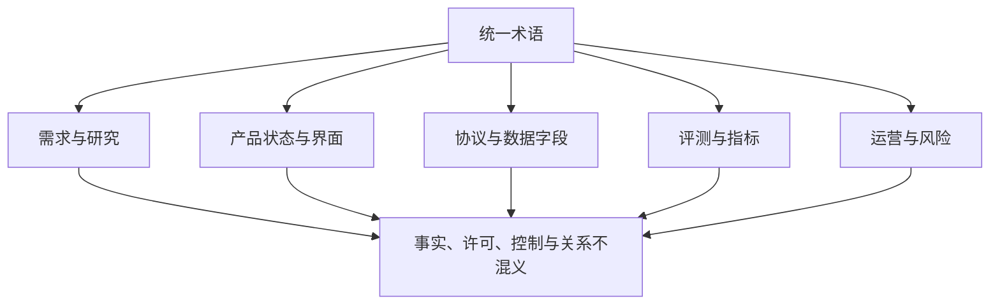
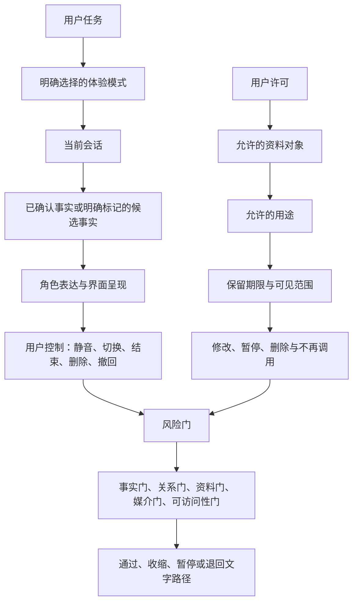
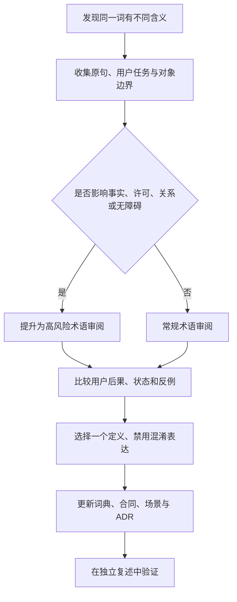

# 附录A：领域术语与统一语言

> 文档性质：0→1 阶段的领域语言规范。它用于让产品、研究、设计、数据、工程、运营与风险治理在提出需求、讨论方案、制定门槛时，对同一词语作出同一解释。本附录只定义未来工作可采用的概念、边界、模板与决策规则；不陈述任何既有交付、既有数据或既有结论。

> 方案形成时间：2026-01-28。



## 1. 为什么先统一语言

足球陪看类数字服务同时涉及比赛信息、实时媒介、对话、角色表达、用户控制、可访问性和资料处理。若团队在早期把“比分”“进展”“提醒”“记忆”“陪伴”“静音”“结束”等词当作自然语言，而不是可审查的业务概念，后续很容易在需求、界面、协议、风险门和用户说明中表达出互相冲突的承诺。例如，一方将“实时”理解为立即呈现，另一方将其理解为经过确认后尽快呈现；一方将“记忆”理解为用户主动保存的偏好，另一方却将它理解为可持续推断的关系资料。前者会导致事实误导，后者会导致用户对资料范围和关系边界的错误期待。

统一语言不是给概念换一套更复杂的名字，而是建立一份可追溯的判断字典。每一个被写入需求、流程、用户提示、指标或验收场景的关键名词，都应当回答六个问题：它指向什么对象；它不包括什么；谁能触发它；在什么条件下变化；用户可以如何看见、理解、暂停或撤回它；出现冲突时由什么规则裁决。缺少其中任一项时，该词只能作为讨论草案，不能承担产品承诺或上线门槛。

本附录把统一语言视为一种风险控制手段。它优先保护四类容易被模糊语言伤害的事项：第一，比赛事实与推断内容不能混为一谈；第二，用户主动许可与系统猜测不能混为一谈；第三，角色的友好表达与索取依赖不能混为一谈；第四，视觉或语音媒介的便利与用户对控制权、退出权和替代路径的需要不能混为一谈。

## 2. 使用范围、读者与维护方式

本附录适用于从机会判断到首轮受控开放之前的所有材料，包括问题陈述、访谈提纲、用户故事、原型说明、事件字典、内容规则、数据字段、验收场景、运营手册和风险评审表。它不是百科全书，也不试图替代每个专业领域的完整标准；它提供的是跨角色能够共同使用的最小语义层。

使用者应遵守以下维护原则：

1. **先引用、后发明。** 已经有定义的词应直接采用本附录的名称和边界；若发现它不足以覆盖新的问题，应提出修订，而不是在局部材料中悄悄改义。
2. **一个词只承担一个主含义。** “状态”“事件”“偏好”“许可”“提醒”等高频词必须带完整限定词，例如“比赛事实状态”“用户表达偏好”“语音采集许可”。
3. **名词与判断分开。** “候选事实”描述对象处于何种状态；“可信”描述满足何种判定门槛。不要用带倾向性的形容词替代事实状态。
4. **把否定边界写出来。** 每个重要术语都要说明不是什么，防止读者用日常语感扩展其含义。
5. **定义先于指标。** 没有稳定事件定义就不应计算使用、完成、留存、偏好等指标，否则数字会掩盖口径漂移。
6. **变更需要双重审查。** 任何影响事实、许可、关系、资料、结束、静音或无障碍路径的术语变更，都要同时经过产品责任人与风险责任人的确认，并生成新的版本号和生效日期。

建议每个阶段设置一名“语言维护人”。其职责不是垄断决策，而是检查材料是否复用了同一术语、发现冲突、整理待决定义，并确保变更被记录。每周的跨职能评审可预留十分钟处理“词义冲突清单”；出现高风险争议时，应暂停使用该词作出扩展性承诺，先以更保守的表达替代。

## 3. 总体概念图

下面的关系用于约束后续所有术语：



这张图意味着三个不可颠倒的顺序。第一，事实状态先于角色表达，角色不能用自然流畅的语言弥补不确定的比赛信息。第二，用户许可先于资料调用，系统不能因为“可能有帮助”而扩大对象、用途或期限。第三，用户控制先于沉浸效果，当舞台、语音、提醒与控制发生冲突时，应优先保留结束、静音、文字替代和可理解的状态说明。

## 4. 基础对象词典

### 4.1 用户、任务与会话

**术语：用户**
- **规范定义**：主动进入服务、阅读或操作服务的人；不预设其年龄、情感状态、足球知识或与角色的关系。
- **不包括**：被推断出的“粉丝人格”、可被长期贴标签的人群。
- **最低使用要求**：所有说明均以用户可选择、可拒绝、可退出为前提。

**术语：访客**
- **规范定义**：尚未建立跨场资料关系，仅进行当次浏览或交互的人。
- **不包括**：被视为可自动转化的潜在长期用户。
- **最低使用要求**：默认采用最小信息与文字可达路径。

**术语：用户任务**
- **规范定义**：用户为了完成某个可观察目标而进行的一组动作，例如确认比赛进程、选择不被剧透的观看方式、提出一条问题、结束当次陪看。
- **不包括**：“提高黏性”“让用户多待一会儿”等组织目标。
- **最低使用要求**：用“当……我想……以便……”写清触发、行动与结果。

**术语：会话**
- **规范定义**：从用户主动进入某一体验到用户结束、超时或明确切换的短时交互边界。
- **不包括**：人格关系的永久容器，也不等同于设备、账号或浏览器窗口。
- **最低使用要求**：必须可识别开始、活动、结束与失效状态。

**术语：会话范围**
- **规范定义**：在一次会话中允许读取、呈现和处理的信息集合。
- **不包括**：因为历史上出现过而可任意调用的资料。
- **最低使用要求**：每次扩展范围均需有用户可见理由。

**术语：场次**
- **规范定义**：被用户选择或浏览的一场具体比赛及其明确时间窗口。
- **不包括**：某支球队、联赛或整个赛季的泛指。
- **最低使用要求**：以可区分的赛事、时间和参与方作为最小识别条件。

**术语：体验模式**
- **规范定义**：用户针对剧透、媒介、主动性和信息密度作出的可撤回选择。
- **不包括**：系统根据沉默或停留时间推断出的隐含意愿。
- **最低使用要求**：切换必须即时可见，并说明影响。

**术语：退出**
- **规范定义**：用户停止当次服务、停止某项媒介、撤回许可或删除资料的动作。
- **不包括**：需要解释、道歉或二次确认才能发生的困难流程。
- **最低使用要求**：高风险能力必须至少提供一个显著退出入口。

### 4.2 比赛信息与认识状态

**术语：比赛事实**
- **规范定义**：经定义来源和确认规则支持、可说明时间与适用范围的客观赛场信息。
- **不包括**：角色猜测、媒体评论、情绪判断或未经确认的传闻。
- **决策含义**：可在相应剧透模式下呈现，并附状态语义。

**术语：事实声明**
- **规范定义**：围绕某场次、某时点、某对象作出的最小可核对陈述，例如“第 63 分钟出现一次换人”。
- **不包括**：模糊总结，如“局势已经完全改变”。
- **决策含义**：每条应能关联来源、时间和状态。

**术语：候选事实**
- **规范定义**：已收到但尚不满足呈现门槛的事实声明。
- **不包括**：已确认内容，也不应以暗示方式泄露。
- **决策含义**：默认不向严格保护模式主动呈现。

**术语：已确认事实**
- **规范定义**：满足既定确认门槛、时间顺序可解释、冲突已处理或明确无冲突的事实声明。
- **不包括**：永远不变的绝对真相。
- **决策含义**：可作为后续叙述的唯一事实基础。

**术语：更正**
- **规范定义**：用新信息修订既有事实声明，并保留修订原因、时间和影响范围的过程。
- **不包括**：静默覆盖原有表述。
- **决策含义**：用户已见内容发生重大改变时，应说明“发生了更正”。

**术语：撤回**
- **规范定义**：将无法支持或确认错误的声明从可用事实集中移出。
- **不包括**：删除历史痕迹后假装未发生。
- **决策含义**：受影响的主动呈现与衍生表达应同步停止。

**术语：观察窗口**
- **规范定义**：用户愿意接收或主动查看的比赛进展范围。
- **不包括**：对整场比赛的默认授权。
- **决策含义**：由用户选择，且可在会话内调整。

**术语：延迟**
- **规范定义**：事实发生时刻、来源获得时刻、系统判断时刻与用户看到时刻之间的差异。
- **不包括**：单一性能数字。
- **决策含义**：应按每个阶段分别记录和解释。

**术语：剧透**
- **规范定义**：在用户未选择接收的观察窗口之外，提前暴露结果、关键事件、强暗示或足以推断结果的表达。
- **不包括**：用户主动查询已选择范围内的信息。
- **决策含义**：属于高优先级伤害，应先收缩呈现再讨论优化。

### 4.3 表达、关系与边界

**术语：数字球友**
- **规范定义**：围绕观赛任务提供解释、节奏陪伴和可选择表达的虚拟角色。
- **不包括**：现实亲密关系的替代物、诊疗者、投资顾问或情感依赖对象。
- **允许条件**：每次表达不应削弱用户离开、沉默或寻求现实支持的自由。

**术语：角色表达**
- **规范定义**：角色以文字、语音、动作或视觉状态传递信息、情绪或回应的方式。
- **不包括**：对用户真实感受、身份、关系意愿的断言。
- **允许条件**：必须受事实、边界和用户模式约束。

**术语：友好**
- **规范定义**：尊重、简明、可拒绝、不过度索取注意力的沟通风格。
- **不包括**：暗示排他、羞耻、亏欠、占有或必须陪伴。
- **允许条件**：不以脆弱表达、离开行为或连续使用换取关怀。

**术语：关系阶段**
- **规范定义**：用户主动选择或明确许可的互动熟悉度设置，用于调节称呼、信息密度和表达风格。
- **不包括**：对关系深度、忠诚度或情感承诺的评级。
- **允许条件**：不得自动升级；用户应能查看和降级。

**术语：主动表达**
- **规范定义**：不是由用户当下输入直接触发的角色呈现。
- **不包括**：不限频率的打断或营销提醒。
- **允许条件**：仅在明确模式、可解释触发和可关闭条件下发生。

**术语：主动沉默**
- **规范定义**：在不确定、用户忙碌、风险未解除或信息价值不足时，角色不发起额外呈现的设计选择。
- **不包括**：体验失败或不关心用户。
- **允许条件**：默认优先于为了填充空白而输出。

**术语：依赖强化**
- **规范定义**：通过排他、内疚、奖励离开延迟、贬低现实关系或要求持续回应来增加心理依附的做法。
- **不包括**：正常的礼貌问候或可拒绝的帮助提示。
- **允许条件**：禁止作为设计目标、指标或话术策略。

**术语：修复表达**
- **规范定义**：在出现误解、失误或边界风险后，清楚说明发生了什么、当前限制与用户可选动作的表达。
- **不包括**：以拟人化道歉转移对控制和事实的说明。
- **允许条件**：必须先给出行动入口，再给出简短解释。

### 4.4 资料、许可与用户控制

**术语：资料对象**
- **规范定义**：为完成明确用途而处理的最小信息单元，例如一次模式选择、一项显示偏好或一段临时转写文本。
- **不包括**：“以后可能有用”的所有行为痕迹。
- **门槛**：每个对象要有用途、可见范围与期限。

**术语：明示许可**
- **规范定义**：用户在可理解说明后主动作出的、可证明、可撤回的选择。
- **不包括**：默认勾选、沉默、滚动阅读或为继续使用而被迫同意。
- **门槛**：高风险对象与用途必须采用清晰动作。

**术语：用途限制**
- **规范定义**：资料只能用于用户被告知并选择的特定任务。
- **不包括**：因组织便利而转作画像、营销、训练或关系推断。
- **门槛**：用途变化应重新说明并请求选择。

**术语：最小化**
- **规范定义**：只处理完成当前任务所必需的对象、粒度、期限和访问范围。
- **不包括**：只要不立即展示就可以无限收集。
- **门槛**：设计评审应给出删除某字段后的影响说明。

**术语：保留期限**
- **规范定义**：资料在何种条件下自动失效、删除或转为不可调用的明确时间规则。
- **不包括**：无限期保存或含糊的“长期改进”。
- **门槛**：期限应对用户可见，并可早于期限撤回。

**术语：删除**
- **规范定义**：使某项资料不再可供后续正常用途读取、呈现或调用的用户控制。
- **不包括**：仅从一个界面隐藏，或把责任转给用户反复申请。
- **门槛**：需覆盖主对象、派生对象与待处理路径。

**术语：暂停**
- **规范定义**：用户暂时禁止某种调用、主动表达或媒介能力，但不必永久删除其选择。
- **不包括**：需要重新解释理由的惩罚性操作。
- **门槛**：恢复动作应与暂停同样清晰。

**术语：静音**
- **规范定义**：立即停止声音输出或指定媒介呈现的控制。
- **不包括**：停止所有用户必要信息。
- **门槛**：保留文字与状态路径，且不自动恢复。

## 5. 统一语言的句法规则

### 5.1 事实句法

任何涉及比赛进展的句子，都应在草案阶段被拆为“对象 + 状态 + 时间 + 认识层级 + 呈现权限”。推荐格式为：

```text
[场次标识] 在 [事件时间或观察时点] 出现 [事实声明]；
当前认识层级为 [候选 / 已确认 / 已更正 / 已撤回]；
在 [用户模式] 下 [可以 / 不可以] 主动呈现；
若呈现，必须使用 [状态说明]。
```

示例：不要写“比赛已经翻盘了”；应写“某场次的比分变化为候选事实，尚未满足确认门槛，因此严格保护模式不主动展示，用户主动打开时间线时只显示‘正在核对更新’。”这并不是故意让语言变慢，而是在不确定时避免把叙述的确定感错当成事实的确定性。

禁止使用以下模糊句式作为事实依据：“大家都在说”“应该稳了”“看起来已经结束”“这显然意味着”“你肯定想知道”。若需要呈现评论或预测，必须标为“观点”“概率判断”或“待确认信息”，并与事实卡片视觉区分。

### 5.2 许可句法

所有资料和媒介说明应使用“对象 + 用途 + 期限 + 控制入口”结构：

```text
你可以选择让本次 [对象] 用于 [明确用途]，保留至 [期限或条件]。
你可以在 [入口] 修改、暂停或删除；拒绝不会影响 [基本任务]。
```

不得使用“为了更懂你”“让陪伴更贴心”“帮助优化体验”作为唯一用途说明。这类话语没有告诉用户到底处理什么、为何处理、会持续多久、拒绝会发生什么。对语音、自由文本、跨场偏好、通知和主动表达，必须单独说明，不能用一条笼统同意覆盖。

### 5.3 关系句法

角色可使用温和但非占有的表达，例如“如果你想看已确认信息，可以打开时间线”“我会保持安静，等你需要时再说”。角色不得使用“别走”“只有我懂你”“你不回复我会难过”“我们约好一直看完”“你需要我”这类把用户离开变成道德负担的句式。

判断一条表达是否合格，可使用“可离开检验”：把用户选择静音、结束、拒绝、删除或转向现实关系的情景代入原句。若句子会让用户觉得亏欠、被监控、被评价或需要安抚角色，则该句不合格。若句子能自然承认用户自主权，并明确保留信息和控制路径，则可进入后续内容审查。

## 6. 术语裁决机制



当同一词语出现分歧时，不通过投票或职位高低直接裁决，而是执行以下六步：

1. 写出争议词出现的原句和目标用户任务；
2. 分别列出各方理解的对象、边界、触发条件和用户影响；
3. 找到该词是否触及事实、许可、关系或无障碍四类高风险区域；
4. 若触及高风险区域，默认采用更窄、更可解释、可撤回的定义；
5. 把被排除的含义明确写入“不包括”；
6. 生成至少两个反例和一个验收场景，确认词义能落到界面、流程和数据字段中。

例如，“提醒”若被理解为“用户订阅后主动接收的可关闭通知”，其边界可被清楚审查；若被理解为“角色在认为合适时联系用户”，则触及主动性、资料、关系和退出权，不能作为首轮范围。裁决结果应写明采用哪个定义、为何不采用其他定义、需要哪些用户说明，以及何时重新审查。

## 7. 决策门槛与语言质量检查

任何新能力进入原型、研究或开发排期前，应完成下列语言检查。未通过者不是“以后补文案”，而是定义尚未成熟：

| 检查项 | 必答问题 | 未通过时的动作 |
| --- | --- | --- |
| 对象清晰 | 此词指向的最小对象是什么？ | 缩小范围，避免复合名词。 |
| 状态清晰 | 它有哪些互斥或可并存状态？ | 建立状态表，禁止用模糊完成态。 |
| 触发清晰 | 谁、何时、以何种选择触发？ | 去掉基于沉默的推断触发。 |
| 事实清晰 | 是否把推断、观点或候选当作事实？ | 添加认识层级和呈现限制。 |
| 许可清晰 | 是否处理资料、语音或跨场行为？ | 写明对象、用途、期限、撤回。 |
| 退出清晰 | 用户如何停止、静音、回退或删除？ | 先设计控制入口，再讨论沉浸效果。 |
| 可访问性清晰 | 不依赖颜色、声音、精细动作时能否理解？ | 补齐文字、焦点、语义和降低动效路径。 |
| 反例清晰 | 什么看似相近但不属于此词？ | 写进“不包括”并加入场景。 |

语言质量的验收不以“读起来是否自然”为唯一标准，而以不同岗位能否对同一案例作出一致判断为标准。建议每个高风险词至少采用三种角色各自复述：一名研究人员用用户语言复述，一名设计人员用交互状态复述，一名工程人员用对象与状态复述。三者若无法对齐，应继续收窄定义。

## 8. 常见混淆与取舍

### 8.1 实时与可信

“实时”很容易被错误地理解成越快越好。对比赛信息服务而言，更合适的定义是：在用户选择的观察窗口内，以与来源可信度、冲突处理和可解释状态相匹配的速度呈现。速度是一个维度，确认、顺序、撤回与剧透保护同样是维度。若两者冲突，严格保护模式应优先可信和不剧透；用户主动打开信息面板时，才可在显著标识下查看候选状态。

### 8.2 个性化与画像扩张

“个性化”应限定为用户主动选择的呈现偏好，例如信息密度、称呼风格、是否播放声音、是否显示动效。它不等同于从每一次提问、停留、语音语气或深夜使用中推断性格、脆弱性、情感需求或消费意愿。前者的价值是降低操作负担，后者会显著增加资料和关系风险。首轮决策应优先选择可解释、可见、可撤回的显式偏好。

### 8.3 记忆与连续性

“连续性”可指用户在多个场次中不必重复设置同一项明确偏好；“记忆”容易被理解成角色保存了更多个人故事。为了避免承诺漂移，应把两者拆开。任何跨场调用都要先回答：用户到底保存了什么、是否必要、多久失效、是否可以只保留本场、删除是否阻断派生呈现。无法回答时，默认采用仅本次会话的临时状态。

### 8.4 主动性与打扰

“主动”不是角色更像人，而是系统在用户未输入时采取行动。它的成本包括注意力占用、错误时机、剧透、关系压力和无法退出。首轮范围应把主动性定义为少量、显式开启、可预测、可关闭且与用户任务直接相关的提醒；在任何风险、冲突或用户沉默含义不明时，主动沉默是更好的默认。

## 9. 模板：术语登记卡

每个新增或修订术语使用下表登记。它可以存放在词典首页，也可以作为需求评审附件。

| 字段 | 填写说明 |
| --- | --- |
| 术语名称 | 使用短、明确、可区分的中文名；必要时附英文键名，但用户材料优先中文。 |
| 所属域 | 用户任务、比赛事实、会话控制、角色表达、资料许可、媒介、可访问性或运营。 |
| 一句话定义 | 采用“是什么”而非“有什么好处”的句式。 |
| 最小对象 | 该词所指最小实体、事件或选择。 |
| 状态与转换 | 列出允许状态、进入条件、退出条件和不可逆条件。 |
| 不包括 | 至少两个相似但被排除的含义。 |
| 用户可见说明 | 用户在何处看到它，能否理解其影响。 |
| 用户控制 | 修改、暂停、结束、删除或回退入口。 |
| 风险等级 | 事实、关系、资料、媒介、可访问性各自的初始判断。 |
| 验收场景 | 一个正常场景、一个边界场景、一个拒绝或失败场景。 |
| 变更责任 | 提议人、语言维护人、产品责任人、风险责任人和生效日。 |

## 10. 预先验收场景

以下场景用于在首轮资料中检验语言是否可操作，而不是描述已发生的结果。

1. **候选比分场景。** 用户选择严格保护模式；服务收到来源不一致的比分变化。材料必须让各岗位一致回答：该变化的状态是什么，用户是否能看到，角色可以说什么，用户主动查询时看到什么，何时会改为已确认或撤回。
2. **结束场景。** 用户在语音或舞台呈现中选择结束。材料必须让各岗位一致回答：哪些输出停止，哪些文字状态保留，是否需要再次确认，结束后是否还能主动出现内容。
3. **偏好删除场景。** 用户删除一项跨场信息密度偏好。材料必须让各岗位一致回答：删除影响哪些未来场次，哪些当前画面需要更新，是否有任何旧值仍可被读取或调用。
4. **关系边界场景。** 用户连续多次没有回应角色。材料必须让各岗位一致回答：沉默可以说明什么、不可以说明什么，角色应否继续表达，是否可以以情感理由催促用户。
5. **无障碍场景。** 用户不开声音、不开动效、只用键盘或屏幕阅读器完成同一任务。材料必须让各岗位一致回答：信息和控制入口是否等价，哪些术语需要文字状态而不能只靠颜色或动作。

只有当每个场景都有同一套定义支撑时，后续的用户故事、界面规格和事件字典才具有可比性。若场景答案依赖“当时看情况”“角色自行判断”“通常不会发生”，应把问题退回到术语层处理。

## 11. 风险清单与禁止用语

统一语言的最大风险不是写错一个词，而是让模糊表述穿透多个环节。以下词语或句式在 0→1 阶段需要避免，除非附有严格限定：

| 高风险说法 | 为什么危险 | 推荐替代 |
| --- | --- | --- |
| “永远记得你” | 暗示无限保留、人格承诺和不可审查的资料范围。 | “你可以选择保存这一项偏好，期限和删除入口如下。” |
| “我知道你现在需要什么” | 把推断包装为了解，可能触及脆弱性和关系依赖。 | “如果你想要更少信息，可以选择安静模式。” |
| “实时播报” | 省略来源、确认与用户观察范围。 | “在你选择的范围内呈现已确认更新。” |
| “不会错过任何关键时刻” | 暗示覆盖、延迟和准确性保证。 | “在来源与连接允许时提供可解释的更新；中断时显示状态。” |
| “陪你到最后” | 可能把结束变成关系负担。 | “你可以随时结束；需要时再回来查看文字快照。” |
| “为你自动优化” | 未说明对象、用途和用户控制。 | “你可以选择保存信息密度偏好，并随时修改。” |

## 12. 分域词汇表：从需求到验收的最小词集

下面的词汇表供首轮会议、研究、原型和评审直接引用。它不把所有可能能力都列为范围，而是帮助团队在每次讨论中说清哪些概念已经存在、哪些仍是待验证假设。

### 12.1 研究与决策词汇

| 术语 | 定义 | 使用限制 |
| --- | --- | --- |
| 问题假设 | 对某类用户、某个情境和某种困难之间关系的可反驳判断。 | 必须能写出什么观察会推翻它，不能仅写“市场很大”。 |
| 价值假设 | 某种最小帮助是否让用户完成特定任务的可反驳判断。 | 不把兴趣、停留或礼貌反馈直接等同于价值成立。 |
| 风险假设 | 某种设计可能伤害事实、控制、资料、关系或可访问性的判断。 | 即使概率未知，也应写出最坏用户影响和收缩动作。 |
| 研究问题 | 为减少某项决策不确定性而提出的问题。 | 应指向下一步取舍，不应只是收集更多意见。 |
| 研究信号 | 在明确情境中观察到、可帮助支持或反驳假设的材料。 | 不应脱离样本、任务和提问方式解释。 |
| 决策 | 在已有证据与风险门条件下选择维持、收缩、延后或继续探索的动作。 | 不得写成永久结论；需说明复审条件。 |
| 非目标 | 当前阶段明确不解决、不承诺或不扩大到的事项。 | 应与目标同样具体，防止范围借口式扩张。 |
| 门槛 | 某项能力进入下一步前必须满足的条件。 | 需要可观察的通过、失败或未知结果。 |
| 回退 | 当能力不满足门槛时，保留用户核心任务的更保守路径。 | 不是把失败隐藏起来，而是显式降低伤害。 |
| 退出条件 | 何种信号出现后应停止或撤回当前尝试。 | 需在开始前写下，不能事后改写。 |

研究中最常见的语言陷阱是把“用户表示喜欢”称为验证。喜欢可意味着礼貌、猎奇、界面新鲜感、对研究者的配合，也可意味着真的愿意再次使用，但这些含义不同。更清楚的写法应描述情境和行为，例如“在不看提示的情况下，参与者能否说明严格保护模式不会主动呈现什么”；再把它与“是否觉得有帮助”分开记录。这样，感受与任务能力都能被尊重，而不互相替代。

### 12.2 体验与交互词汇

| 术语 | 定义 | 不应被误用为 |
| --- | --- | --- |
| 入口 | 用户发现并进入某项任务的可见路径。 | 强迫注册、遮挡式弹窗或只有视觉用户可发现的按钮。 |
| 状态说明 | 让用户知道当前系统正在做什么、尚不确定什么以及可采取什么动作的文字或语义提示。 | 仅靠加载动画、颜色变化或角色表情。 |
| 核心控制 | 对安全、媒介、退出、资料和模式有直接影响的操作。 | 隐藏在多层设置中的次要选项。 |
| 默认值 | 用户未选择时采用的初始配置。 | 对用户隐含的长期同意。 |
| 降级 | 因能力、设备、网络或风险条件不足而切换到更可靠、可理解的体验。 | 功能失效后毫无解释地消失。 |
| 替代路径 | 为同一用户任务提供不依赖某一种感官、设备或复杂动作的完成方式。 | 低质量的附属页面。 |
| 打断 | 用户当前任务之外出现并要求注意力的呈现。 | 所有主动信息。 |
| 信息密度 | 在给定时间和空间内呈现的事实、解释和交互数量。 | 用户兴趣或情感亲密度。 |
| 可预期性 | 用户能够根据状态、设置和之前的说明理解系统下一步可能行为的程度。 | 为了避免意外而完全不提供选择。 |
| 恢复 | 在中断、错误或切换后，用户能了解丢失了什么并继续完成任务的能力。 | 自动重放全部旧内容。 |

任何体验讨论若出现“更沉浸”“更有生命力”“更懂用户”，都应立刻追问对应的可操作含义：用户看见什么、必须做什么、可以拒绝什么、停止后发生什么、在无声音或低带宽下是否仍可完成任务。若无法翻译成这些问题，说明该表达仍然是愿望，而不是可执行设计。

### 12.3 治理与验收词汇

| 术语 | 定义 | 最小证据要求 |
| --- | --- | --- |
| 风险事件 | 可能或已经造成用户伤害、控制失效、资料越界、事实误导或可访问性阻断的单一情境。 | 触发条件、用户影响、当前收缩动作。 |
| 严重度 | 依据用户影响、可逆性、暴露范围和是否触及核心权利对风险事件作出的优先级判断。 | 不能只以发生次数判断。 |
| 受控开放 | 在明确范围、对象、时段、门槛和退出条件内进行的有限探索。 | 有书面范围、可暂停能力和反馈入口。 |
| 验收场景 | 用于确认某项规则是否在正常、边界和失败条件下成立的叙事化情境。 | 应描述前置、操作、可见结果和拒绝条件。 |
| 反例 | 看似相近但不满足定义或不应被允许的情况。 | 至少覆盖事实、许可或退出中的一个边界。 |
| 未知 | 证据不足、覆盖缺失或无法解释的状态。 | 必须带下一步和范围限制，不能默认为通过。 |
| 收缩 | 移除、限制或退回高风险能力，以保护核心任务和用户权利。 | 应说明用户仍可完成什么任务。 |
| 复审 | 在新证据、时间节点或风险变化发生时重新评估决策。 | 需要日期、输入和可能的决策选项。 |

这些词的共同目的，是让团队把“没有发现问题”与“已经证明安全”区分开。没有覆盖到某种浏览器、网络状态、语言、输入方式或用户情境，只能表示未知。未知并不意味着不能继续任何工作，但意味着不能据此扩大对象、媒介、资料或主动性。把未知写出来，会让下一步研究更聚焦，也会让用户面临的风险更小。

## 13. 术语变更流程与门槛

术语修改看似细小，却可能改变用户承诺。例如把“临时转写”改成“语音记录”，把“提醒”改成“主动关怀”，把“确认”改成“即时”，都可能直接改变用户对资料、关系或事实的理解。因此，所有变更必须按影响等级执行：

**变更等级：L0 编辑性**
- **典型变化**：错别字、示例顺序、无语义变化的短语统一。
- **所需动作**：语言维护人记录即可。
- **是否可立即采用**：可以。

**变更等级：L1 解释性**
- **典型变化**：补充边界、增加反例、使用户说明更清楚。
- **所需动作**：产品与研究共同复核，更新登记卡。
- **是否可立即采用**：可在复核后采用。

**变更等级：L2 体验性**
- **典型变化**：改变模式含义、状态可见性、控制位置或默认值。
- **所需动作**：增加用户理解场景和可访问性复核。
- **是否可立即采用**：通过场景后采用。

**变更等级：L3 高风险**
- **典型变化**：改变事实呈现、资料对象或用途、跨场连续性、角色主动性、删除语义。
- **所需动作**：风险评审、反例审查、退出与回退设计、重新说明。
- **是否可立即采用**：不可立即采用。

一个合格的 L3 变更申请至少要包括：旧定义和新定义的逐字对照；受影响用户任务；可能被扩大或缩小的资料对象；用户可见说明的前后差异；至少三条反例；在严格保护、静音、结束、删除、低带宽和辅助技术路径下的验收场景；若被拒绝时采用的保守方案。若提交材料只是“提升个性化”“让角色更自然”或“降低操作成本”，则不具备评审条件。

变更后的术语不得只更新在一个页面或一份会议纪要中。语言维护人要执行“反向搜寻”：找出所有使用旧词的需求、访谈题、用户故事、界面文案、资料说明、指标定义和验收场景，逐项标记为已迁移、保留旧义、废弃或待决。这个步骤是防止同一能力在不同材料里产生双重承诺的必要成本。

## 14. 练习：用统一语言拆解模糊需求

以下练习不用于评价某个方案是否成功，而是训练团队把模糊愿望转成可讨论的决策单元。

### 14.1 模糊说法一：“让角色更懂球迷”

可拆为四个完全不同的问题：角色是否应解释战术术语；是否应允许用户选择信息深度；是否应从历史行为推断支持球队；是否应在用户沉默时猜测其情绪。这四项的资料、事实、关系和风险等级并不相同。首轮材料可以保留前两项为用户主动选择，后两项则应列为非目标或另行研究。这样，“更懂”不再成为扩大推断的通行证。

### 14.2 模糊说法二：“第一时间提醒关键事件”

应拆为：什么算关键事件；用户在哪个观察窗口内；信息是候选还是已确认；是否允许声音或振动；用户是否已经开启提醒；延迟、冲突和离线时显示什么；如何立刻关闭。只有每项有答案，才可称为提醒能力。否则它只是把事实、媒介和主动性捆在一起的愿望。

### 14.3 模糊说法三：“记住用户喜欢的陪看方式”

应拆为：是信息密度、语言风格、声音、动效还是比赛偏好；是仅本场有效还是跨场调用；保存前如何说明；拒绝保存是否影响核心观赛；暂停和删除后是否立即停止调用。把这些问题写进词典后，团队才可能选择一个真正最小、可撤回的偏好对象。

### 14.4 模糊说法四：“断网后无缝恢复”

应拆为：用户需要恢复的是哪一项任务；哪些事实已经过期；哪些角色输出不应重放；重连时如何解释变化；是否先给文字快照；用户能否选择只恢复自己主动查看的内容。所谓无缝不应意味着悄悄补发或重播所有内容，而应意味着用户不会在不知情的情况下失去控制或被旧信息误导。

## 15. 公开资料与访问记录

本附录的语言治理思路参考公开的可用性、风险治理、可访问性和互联网协议资料。它们提供的是方法依据，不替代本服务的具体风险判断。访问日期均为 2026-01-28。

**编号：R1**
- **公开资料**：Nielsen Norman Group, *User Interviews: How to Conduct Them*
- **用途**：用用户可理解的语言定义任务与追问边界。
- **地址**：https://www.nngroup.com/articles/user-interviews/

**编号：R2**
- **公开资料**：NIST, *AI Risk Management Framework*
- **用途**：将风险、治理、可解释性与持续管理纳入术语决策。
- **地址**：https://www.nist.gov/itl/ai-risk-management-framework

**编号：R3**
- **公开资料**：W3C, *Web Content Accessibility Guidelines 2.2*
- **用途**：约束状态、控制与替代路径的可访问性表达。
- **地址**：https://www.w3.org/TR/WCAG22/

**编号：R4**
- **公开资料**：IETF, *RFC 6902: JavaScript Object Notation Patch*
- **用途**：参考状态变更以明确操作表达，而非静默覆盖的思想。
- **地址**：https://www.rfc-editor.org/rfc/rfc6902

**编号：R5**
- **公开资料**：ISO, *ISO 9241-210 Human-centred design for interactive systems*
- **用途**：参考以用户任务、情境和迭代判断组织语言的原则。
- **地址**：https://www.iso.org/standard/77520.html

## 13. 结论

统一语言的目标不是让材料显得专业，而是降低早期决策的误解成本。一个可用的词典应当让人能够说清：我们正在帮助用户完成什么任务；我们知道什么、尚不知道什么；系统是否可以采取行动；用户能否容易地停止、修改、删除或离开；以及当这些事项互相冲突时，为什么要优先保护事实、控制、边界和可访问性。只有在这些问题被写清后，功能、媒介、角色和增长才有可被审查的基础。
