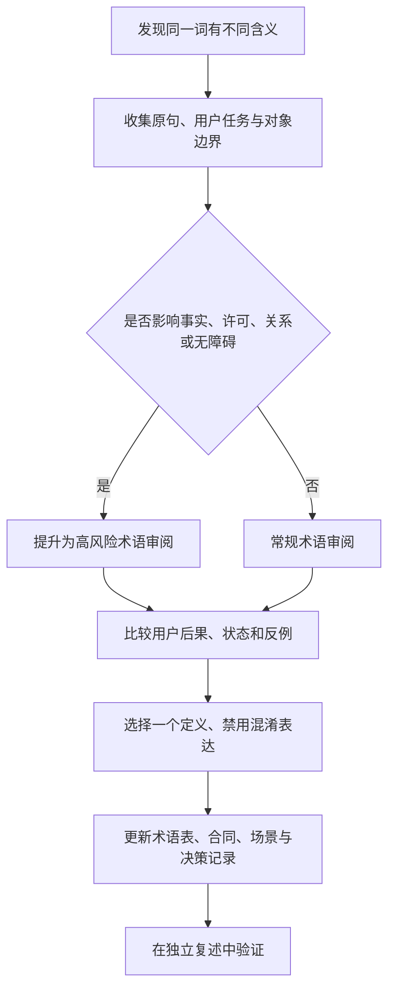

# 领域术语：指向统一语言与领域补充

> **文档类型**：术语索引与领域补充篇——我们说明球球（Digital Ballmate）统一语言的唯一权威出处，并补充一组统一语言之外、但讨论这款产品时绕不开的领域词。  
> **适用读者**：球球的用户，以及关注 AI 陪看产品的合作者与外部读者。  
> **阅读提示**：统一语言的唯一权威是《产品全貌》随附的核心术语表（仓库根目录 CONTEXT.md），本篇不重复它的任何定义，只做领域补充与使用方法说明。

---

## 1. 统一语言的唯一权威

球球的所有关键名词——数字球友、主动沉默、干预级别、比赛事实、陪看回合、表演相位、共同瞬间、用户画像等——只有一个定义出处：《产品全貌》随附的核心术语表（仓库根目录 CONTEXT.md）。术语表按身份、关系、运营、记忆、情绪与对话五个域收录了三十个核心术语，每个术语都给出规范定义与"避免误用"清单。

我们在使用语言时遵守两条原则：

- **先引用，后发明。** 已经有定义的词，直接采用术语表的名称与边界；发现它覆盖不了新问题时，提出修订，而不是在局部材料里悄悄改义。
- **一个词只承担一个主含义。** 高频词必须带完整限定词使用，例如"比赛事实的认识层级""关系的干预级别"，防止同一个词在不同场合被读出不同意思。

本产品的早期资料曾各自维护一套词典。那些词典与现行系统已有多处矛盾（例如旧词典写"关系阶段不得自动升级"，而现行系统中关系阶段会随共同观看的证据自然推进；旧词典把"修复"理解为一种表达，而现行定义是"没有行为改变的道歉不算修复"）。旧词典已整体废弃并按术语表改写；凡旧材料与本表冲突之处，一律以术语表为准。

## 2. 领域补充

以下是术语表之外、但讨论球球时需要的一小组领域词。它们按"先引用、后发明"维护：若日后某一条进入术语表，以术语表为准。

### 2.1 比赛事实的认识层级词族（现网已落地）

术语表给"比赛事实"下的定义里包含它的确定性与后续更正历史。这里补充这套确定性的具体词族——它对应现网事实账本中的五个状态：

- **候选（provisional）**：已从外部来源收到、尚未经运营确认的赛况陈述。候选事实不进入对外呈现，也不作为角色定论的依据。
- **已确认（confirmed）**：由运营确认、可以对外呈现的比赛事实，是角色叙述的唯一事实基础。
- **冲突（conflict）**：不同来源对同一赛况给出不一致陈述时的状态。冲突期间不产出确定结论，等待裁决。
- **已裁决（reconciled）**：冲突经裁决后落定的状态，落定结果以账本记录为准。
- **已撤回（revoked）**：被认定不能成立的陈述撤出可用事实集。受影响的表达同步停止，而不是静默抹掉痕迹。

**更正**不是独立状态，而是账本里的一次新修订：每一处更正都留有版本与缘由，历史可回溯、快照可重放。这族词的用途是让"我们知道什么、还不知道什么"在每一个界面、每一句话里都有同一个答案。

### 2.2 剧透保护（规划中）

**剧透**指在用户未选择接收的范围之外，提前暴露比赛结果、关键事件或足以推断结果的表达。**剧透保护**指围绕它的用户侧呈现能力：让用户选择自己的观察范围，并保证角色与界面不越过这个范围。

这项能力目前仍在**规划中**，现网尚未实现。在它落地之前，球球对赛况的呈现以事实账本的公开状态为准：只有已确认并公开的事实才会被谈论。

### 2.3 观察窗口（规划中）

**观察窗口**指用户愿意接收或主动查看的比赛进展范围，例如只看已确认的比分、不看关键事件细节。它是剧透保护的用户侧概念，与剧透保护同属**规划中**，不在现网承诺范围内。

## 3. 统一语言的句法规则

### 3.1 事实句法

任何涉及比赛进展的句子，在写作阶段都应拆成"对象 + 状态 + 时间 + 认识层级 + 呈现权限"：

```text
[场次标识] 在 [事件时间或观察时点] 出现 [一条比赛事实]；
当前认识层级为 [候选 / 已确认 / 冲突 / 已裁决 / 已撤回]；
该层级是否允许对外呈现；
若呈现，必须附带与层级相称的状态说明。
```

示例：不要写"比赛已经翻盘了"；应写"这场次的比分变化目前是候选事实，尚未经确认，因此不作定论；账本确认后如发生更正，会以新修订的方式说明"。这不是故意让语言变慢，而是在不确定时避免把叙述的确定感错当成事实的确定性。

禁止把以下模糊句式当作事实依据："大家都在说""应该稳了""看起来已经结束""这显然意味着"。若需要呈现评论或预测，必须明确标为"观点"或"概率判断"，并与事实内容在呈现上明确区分。

### 3.2 许可句法

所有涉及资料与媒介的说明，使用"对象 + 用途 + 期限 + 控制入口"结构：

```text
你的 [对象] 会用于 [明确用途]，保留至 [期限或条件]。
你可以在 [入口] 查看、修改、暂停或删除；拒绝不会影响 [基本任务]。
```

不得使用"为了更懂你""让陪伴更贴心""帮助优化体验"作为唯一的用途说明——这类话语没有告诉用户到底处理了什么、为何处理、会持续多久、在哪里可以撤回。对语音、自由文本、跨场偏好、通知和主动性，分别说明，不用一条笼统同意覆盖。

### 3.3 关系句法

角色可以使用温和但非占有的表达，例如"我会保持安静，等你需要时再说"。角色不得使用"别走""只有我懂你""你不回复我会难过""你需要我"这类把用户离开变成道德负担的句式。

判断一条表达是否合格，用"可离开检验"：把用户选择静音、结束、拒绝、删除或转向现实关系的情景代入原句。若句子会让用户觉得亏欠、被监控、被评价或需要安抚角色，该句不合格；若句子能自然承认用户自主权，并保留信息与控制路径，才进入后续内容审查。

## 4. 术语裁决机制



当同一词语出现分歧时，不通过投票或职位高低裁决，而是执行六步：

1. 写出争议词出现的原句和目标用户任务；
2. 分别列出各方理解的对象、边界、触发条件和用户影响；
3. 判断该词是否触及事实、许可、关系或无障碍四类高风险区域；
4. 若触及高风险区域，默认采用更窄、更可解释、可撤回的定义；
5. 把被排除的含义明确写进"避免误用"清单；
6. 生成至少两个反例和一个验收场景，确认词义能落到界面、流程和数据字段中。

例如"提醒"：若理解为"用户订阅后主动接收的可关闭通知"，边界可以被清楚审查；若理解为"角色在它认为合适时联系用户"，则触及主动性、资料、关系和退出权，不能进入范围。裁决结果应写明采用哪个定义、为何不采用其他定义、需要哪些用户说明，以及何时重新审查。

## 5. 术语登记卡

每个新增或修订的术语，先填一张登记卡再进入评审。它可以附在术语表页，也可以作为需求评审附件：

| 字段 | 填写说明 |
| --- | --- |
| 术语名称 | 短、明确、可区分的中文名；必要时附英文键名，用户材料优先中文。 |
| 所属域 | 术语表五域（身份、关系、运营、记忆、情绪与对话），或本篇的领域补充域（事实认识、剧透保护等）。 |
| 一句话定义 | 采用"是什么"而非"有什么好处"的句式。 |
| 最小对象 | 该词所指的最小实体、事件或选择。 |
| 状态与转换 | 列出允许状态、进入条件、退出条件和不可逆条件。 |
| 避免误用 | 至少两个相似但被排除的含义。 |
| 用户可见说明 | 用户在何处看到它，能否理解其影响。 |
| 用户控制 | 修改、暂停、结束、删除或回退入口。 |
| 风险等级 | 对事实、关系、资料、媒介、可访问性的初始判断。 |
| 验收场景 | 一个正常场景、一个边界场景、一个拒绝或失败场景。 |
| 变更责任 | 提议人、术语表维护人、生效日。 |

## 6. 结语

统一语言的目标不是让材料显得专业，而是降低误解成本。一份可用的术语表应当让人能说清：球球在帮用户完成什么任务；我们知道什么、还不知道什么；系统是否可以主动行动；用户能否容易地停止、修改、删除或离开；以及这些事项冲突时，为什么优先保护事实、控制、边界和可访问性。本篇把定义的权威交给术语表，自己只做领域补充——这样每个词在任何材料里都只有一个意思。

---

版本 2.0（2026-09-20）
