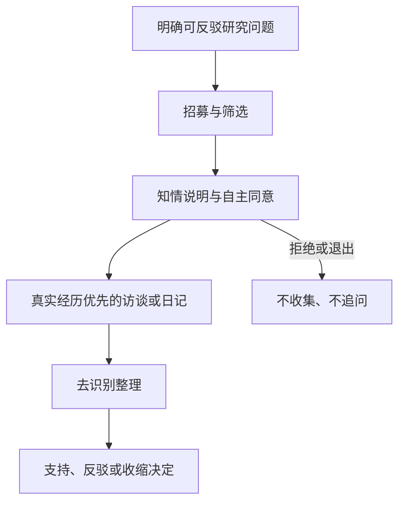
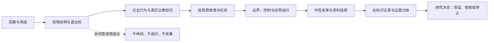
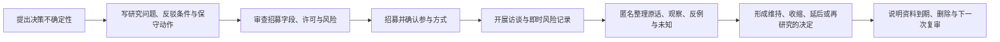

# 附录B：用户研究招募与访谈提纲

> 文档性质：0→1 阶段的研究施工模板。本附录用于招募、筛选、告知、访谈和整理关于足球观看、信息控制、数字角色和媒介偏好的研究材料。它只定义未来可执行的研究原则、问题、门槛与风险处理，不包含任何既有访谈、样本、结论、项目材料或事后评价。

> 方案形成时间：2026-01-28。



## 1. 研究目的：减少决策不确定性，而不是寻找赞同

早期用户研究的目的不是证明某个想法“很受欢迎”，也不是收集一批能为产品背书的话，而是降低几项高成本决策的不确定性：不同观看情境下，人们究竟在解决什么任务；他们如何处理剧透、延迟、信息过载和独自观看；他们是否愿意对数字角色使用什么媒介；哪些表达会让人觉得有帮助，哪些会越界、打扰或制造依赖压力；哪些控制、说明和替代路径是任务完成的前提。

研究必须服务于可行动的取舍。如果一项问题无论回答是什么都不会改变范围、优先级、语言、默认值或风险门槛，就不应占用受访者时间。反过来，凡是可能增加主动表达、跨场偏好、语音、通知、关系性叙事或资料处理的主张，都需要先被拆解为可反驳问题，再决定是否值得研究。

本附录采用“探索优先、保护优先、结论克制”的方法。探索优先，意味着先理解真实场景和已有替代方案，而不是一开始就展示概念并询问喜不喜欢；保护优先，意味着不把孤独、情绪脆弱、隐私顾虑或人际困境当作招募卖点或功能机会；结论克制，意味着访谈材料可以支持下一步研究或收缩范围，但不能单独证明市场规模、长期价值、关系需求或安全性。

## 2. 研究问题地图

每一轮研究前应从下表选择不超过四个主问题。问题太多会让访谈变成问卷式采样，失去对场景、动机和矛盾的理解。每个主问题均应关联一项可能决策和一项“不支持时的保守动作”。

**主问题：观看任务**
- **需要理解什么**：用户在赛前、赛中、赛后分别想确认、理解、记录或回避什么。
- **可能改变的决策**：首轮用户任务与信息架构。
- **不支持时的保守动作**：只保留被反复提及且可独立完成的任务。

**主问题：剧透与延迟**
- **需要理解什么**：用户如何定义“被剧透”，愿意为可信与速度做何种选择。
- **可能改变的决策**：观察模式、状态说明、默认保护。
- **不支持时的保守动作**：默认采用不主动扩展信息范围的文字快照。

**主问题：信息密度**
- **需要理解什么**：用户在紧张、忙碌、社交、通勤等情境下需要多少解释和打断。
- **可能改变的决策**：信息层级、表达频率、主动沉默。
- **不支持时的保守动作**：降低主动性，保留用户主动查询。

**主问题：数字角色边界**
- **需要理解什么**：什么形式的友好、幽默和陪伴被认为自然，什么被认为压力、占有或越界。
- **可能改变的决策**：角色语言、关系边界、禁止话术。
- **不支持时的保守动作**：采用工具型、可关闭、非关系化的表达。

**主问题：媒介偏好**
- **需要理解什么**：文字、声音、动画、视觉状态在不同设备和环境下的实际可用性。
- **可能改变的决策**：首轮媒介范围与降级路径。
- **不支持时的保守动作**：文字优先，媒介能力仅在用户主动开启时使用。

**主问题：许可与连续性**
- **需要理解什么**：用户愿意保存哪些明确偏好，如何理解期限、暂停和删除。
- **可能改变的决策**：偏好对象、许可流程、跨场范围。
- **不支持时的保守动作**：只保留当次会话临时选择。

**主问题：无障碍与可达性**
- **需要理解什么**：用户在不开声音、低网速、键盘、读屏或小屏情境下如何完成相同任务。
- **可能改变的决策**：控制入口、状态表达、替代路径。
- **不支持时的保守动作**：将任务退回到文字、语义和基础操作路径。

研究负责人应为每个主问题写一张问题卡：假设是什么；什么发现会支持、反驳或保持未知；需要哪些类型的参与者；哪些问题可能造成不适；研究结束后具体要做出哪几种决策。若无法写出反驳条件，则该问题仍是愿望，不适合作为访谈主线。

## 3. 招募原则与样本策略

### 3.1 招募不等于寻找“目标用户的代言人”

质性研究的样本不是统计总体的缩影，而是用差异化情境暴露假设边界的材料。首轮研究不需要声称代表所有足球观众，也不应只招募最热情、最熟悉技术或最愿意与角色互动的人。更有价值的做法是围绕观看情境、信息控制需求、媒介限制和关系敏感度做最大差异取样。

建议把样本划分为四个维度，而不是按“高价值用户”贴标签：

1. **观看节奏。** 关注直播、延迟观看、只看集锦、偶尔查看比分、跨时区观看等不同习惯；
2. **社交情境。** 独自观看、与家人朋友观看、在公共场所或工作间隙查看、边看边参与群聊等情境；
3. **信息与媒介偏好。** 喜欢深度战术、只要关键状态、希望安静、可使用声音、必须无声音、使用辅助技术或受网络限制；
4. **控制与边界偏好。** 对剧透敏感、需要减少打断、愿意显式设置、对跨场资料谨慎、希望每次从零开始等不同立场。

样本表不使用“孤独”“依赖”“脆弱”“可被转化”等带有判断或利用意味的标签。若研究确有必要理解情绪性观看体验，应把问题设计成用户可跳过、非诊断性的开放叙述，并避免将情绪困境与数字角色的商业机会直接关联。

### 3.2 建议配额：先覆盖冲突，再补充相似

首轮探索可从 12 至 18 名深度访谈参与者起步，根据信息饱和和决策复杂度调整。这里的数字不是通过门槛，也不表示足以得出普遍比例；它的作用是提醒团队不要只听到两三位熟悉用户的声音就扩大范围。建议配额如下：

| 维度 | 最低覆盖意图 | 招募提示 |
| --- | --- | --- |
| 直播与非直播 | 至少覆盖实时观看、延迟观看和赛后查看三类。 | 不把“实时”当成唯一正确习惯。 |
| 剧透敏感度 | 覆盖强保护、条件接受和不敏感三类立场。 | 询问实际回避行为，不以自我标签为准。 |
| 设备与环境 | 覆盖手机小屏、桌面、公共场所无声、网络不稳等。 | 不把高端设备体验当成默认。 |
| 足球知识 | 覆盖熟悉战术、普通关注者和偶尔看球者。 | 不把知识程度等同于使用价值。 |
| 交互偏好 | 覆盖主动查询、低打扰、愿意短语音、只愿文字等。 | 允许参与者明确表示“不需要角色”。 |
| 可访问性 | 至少纳入会使用键盘、屏幕阅读器、字幕或减少动效的人，或在研究中模拟这些限制。 | 不将无障碍需求视为后置补充。 |

不建议以注册、购买、长期使用、心理状态或高度私人资料作为筛选条件。研究的目标是理解任务和边界，而不是寻找更易被说服或更可能高频使用的人。任何为参与者提供的补偿都应对时间和付出公平，不与赞同观点、展示热情、同意录音或后续参与绑定。

## 4. 招募文案与筛选问卷模板

### 4.1 对外招募文案

以下文案可按渠道和语言调整，但不得夸大未来能力、暗示角色会提供情感治疗或要求参与者分享私人经历。

```text
我们正在研究人们观看足球比赛时如何获取信息、避免不想看到的内容、使用文字或声音，以及如何控制提示和界面。我们希望邀请不同观看习惯的人参加一次约 45 至 60 分钟的线上交流。

交流不需要你熟悉任何新产品，也不要求你分享敏感个人信息。你可以跳过任何问题、拒绝录音或在任何时候结束参与。我们会讨论你真实使用过的观看方式、信息来源和操作习惯，并可能展示若干低保真情境卡，请你指出哪里有帮助、哪里不清楚或让人不舒服。

如你愿意参与，请填写简短筛选问卷。筛选只用于覆盖不同观看情境，不影响你的观点是否被认真对待。
```

招募页应明确说明：研究目的；预计时长；形式；是否需要音视频；补偿方式；可跳过和退出权；资料的最小处理范围、用途和期限；联系渠道；未成年人或需要监护人参与时的额外流程。不要使用“寻找最懂足球的人”“寻找陪伴需求强的人”“帮助我们训练更懂你的角色”之类的说法。

### 4.2 筛选问卷

筛选问卷的核心原则是最少收集。只问覆盖样本所必需的信息，避免索取账号、通讯录、详细住址、病史、情感关系、收入或可识别的社交资料。推荐题目如下：

| 题目 | 选项或开放格式 | 用途与限制 |
| --- | --- | --- |
| 过去三个月，你以何种方式关注足球比赛？ | 直播、延迟观看、赛后集锦、比分或文字更新、很少关注、其他。 | 仅用于观看节奏分层，可多选。 |
| 你通常在什么环境查看比赛信息？ | 家中、通勤、工作/学习间隙、公共场所、与他人一起、其他。 | 不询问具体地点。 |
| 对不想提前知道的比赛信息，你的态度更接近哪一种？ | 强烈避免、视情况而定、通常不介意、不确定。 | 用于剧透差异，不作为价值判断。 |
| 你通常更愿意使用哪些形式？ | 文字、声音、视觉动画、通知、都可、都不希望。 | 多选并允许“不希望”。 |
| 在手机或网页服务中，你是否常用字幕、键盘操作、屏幕阅读器、减少动效或其他辅助设置？ | 自愿回答，可跳过。 | 用于确保可达性情境，不记录具体健康原因。 |
| 你愿意参加哪种形式？ | 仅文字、可语音、不愿录音、可屏幕共享、其他。 | 研究安排，不可强制变更。 |
| 可联系你的方式 | 邮箱或其他单一渠道。 | 仅用于排期；研究结束后按说明删除。 |

筛选问卷中不能把“愿意长期保存偏好”“愿意分享语音”“希望有陪伴”设为优先入选条件。若需要讨论这些能力，应在访谈中以假设情境征询边界，而不是在招募时筛掉不同意的人。

## 5. 知情说明、许可与研究资料边界

研究开始前，主持人应使用简单语言逐项说明，并询问参与者是否理解。知情说明不能埋在长文本中，更不能把继续通话当作同意。推荐说明结构如下：

1. **研究目的。** 了解人们的观看任务、信息控制和媒介偏好，不评估参与者足球知识或个人性格。
2. **研究内容。** 将讨论日常经历，可能查看低保真文字、流程或界面描述；参与者不必使用真实账号或提供真实私人资料。
3. **可选记录。** 分别询问是否可做文字笔记、是否可录音、是否可录屏。拒绝其中任一项不影响参与资格；若不录音，主持人采用最小笔记方式。
4. **可跳过与退出。** 参与者可以不回答任何问题、要求暂停、更换话题或结束，不需要说明原因。
5. **资料用途与期限。** 记录只用于本轮研究的整理与决策，不用于营销、身份画像或与其他来源拼接；说明何时删除可识别联系信息和原始记录。
6. **风险与支持。** 若讨论触及不适、剧透、隐私或情绪，主持人将停止追问，提供跳过或结束选项；研究不是治疗、咨询或危机支持服务。

主持人可使用如下口头确认：

```text
在开始前，我想确认几件事：这次交流是为了理解观看体验，不是在评估你；任何问题都可以跳过；你可以随时结束；我们只按你同意的方式做记录。你愿意继续吗？如果愿意，是否同意我做文字笔记？音频记录和屏幕记录分别由你单独选择。
```

对语音、屏幕共享、原始聊天记录、照片、外部群聊或第三方信息，默认不收集。参与者若主动展示，也应提醒其避免暴露他人信息。若不可避免地出现第三方资料，研究笔记只保留与研究问题必要的匿名摘要，不复制可识别内容。

## 6. 访谈流程总览



建议一次访谈为 45 至 60 分钟，采用“过去行为优先、概念刺激后置、边界问题收束”的顺序。以下时间分配可按参与者意愿缩短，不能为了完成脚本而延长。

**阶段：欢迎与许可**
- **时长参考**：5 分钟
- **目的**：说明研究、确认记录方式与退出权。
- **关键禁忌**：不用热情或补偿施压。

**阶段：真实经历回顾**
- **时长参考**：15 分钟
- **目的**：了解最近一次具体观看或查比分情境。
- **关键禁忌**：不先展示概念，不问“你会不会喜欢”。

**阶段：任务与替代方案**
- **时长参考**：10 分钟
- **目的**：识别当前流程、工具、摩擦和权衡。
- **关键禁忌**：不把现有习惯解释成缺乏需求。

**阶段：情境卡探索**
- **时长参考**：15 分钟
- **目的**：讨论剧透、状态、媒介、控制、角色边界。
- **关键禁忌**：不把角色拟人化压力当作测试。

**阶段：反例与优先级**
- **时长参考**：10 分钟
- **目的**：了解不能接受什么、愿意放弃什么。
- **关键禁忌**：不诱导参与者说“都想要”。

**阶段：收尾与复述**
- **时长参考**：5 分钟
- **目的**：让参与者校正理解，重申资料安排。
- **关键禁忌**：不承诺未来功能或上线时间。

主持人和记录员最好分工：主持人保持倾听和追问，记录员关注时间、事实、原话、非语言不适信号及待澄清点。若只有一人执行，应优先保障参与者舒适和知情，而不是追求完整笔记。研究结束后可立即补写情境和解释，但必须把“参与者原话”“研究者观察”“研究者推断”分栏，防止后续材料把推断伪装成原始证据。

## 7. 访谈提纲：真实经历优先

### 7.1 开场与暖场

1. 你最近一次关注足球比赛是在什么时间、什么地点、以什么方式？请从开始讲起。
2. 当时你最想知道或最想避免知道什么？为什么？
3. 你在过程中用了哪些工具、网站、群聊、电视或其他方式？它们分别解决了什么？
4. 有没有一个瞬间让你觉得信息太多、太少、太早、太慢或很难控制？发生了什么？

这些题目用于获得具体行为，而不是收集抽象偏好。若参与者回答“我一般都看直播”，应追问“上一次具体是什么比赛”“中间有没有离开”“回来后怎么知道发生了什么”“你如何决定是否看消息”。避免连续追问“为什么”，可交替使用“那之后呢”“你当时做了什么”“你能描述你看到的页面或听到的话吗”。

### 7.2 剧透、事实与延迟

1. 对你来说，什么算剧透？比分、进球提示、表情、评论、推送标题或朋友消息之间有区别吗？
2. 请回忆一次你不想提前知道但还是看到了信息的经历。它从哪里来？当时你有什么选择？
3. 如果一条比赛信息尚未确认，什么样的提示会让你觉得诚实而不打扰？什么样的提示仍然算泄露？
4. 你更愿意自己打开时间线查看，还是在某些条件下接收提示？那些条件必须是什么？
5. 当连接中断或你离开一段时间后，你希望恢复时先看到什么？哪些内容不应该自动补给你？

主持人需要注意，不要把“更快”设为唯一价值。可追问参与者如何处理冲突信息、延迟和不确定性，但不应假设他们会为速度牺牲控制。若参与者表达“我想知道一切”，仍要问“在什么场次、什么时间、什么媒介下”“是否有不想被声音打断或不想在公共场合暴露的信息”。

### 7.3 信息密度、角色和主动性

1. 看比赛或查信息时，你喜欢有人解释吗？你希望解释的是事实、规则、战术、情绪还是别的？
2. 你能回忆一个工具、评论员或朋友的表达让你觉得刚刚好吗？它具体做了或没有做什么？
3. 相反，什么表达会让你觉得烦、被打断、被看轻或像被催促？
4. 如果一个数字角色在你没有输入时出现，你认为哪些情形可以接受，哪些绝对不可以？
5. 当你不回应时，你希望系统如何理解你的沉默？你最不希望它做什么？
6. 你是否愿意自己选择称呼、信息密度、声音或动效？如果不愿意，拒绝后仍应保留什么体验？

这里的重点不是引导参与者爱上角色，而是识别边界。主持人避免问“你会把它当朋友吗”“你是否需要有人陪”，因为这些问题会制造社会期待并诱导关系性回答。更好的问法是“它的哪种行为会让你继续专注于自己的观看任务，哪种行为会让你想关掉它”。

### 7.4 资料、许可与跨场连续性

1. 你在不同比赛之间会重复设置哪些东西？哪些重复让你觉得麻烦，哪些你反而希望每次重新选择？
2. 如果服务想保存一项偏好，你希望它明确告诉你哪些内容？
3. 你希望如何查看、修改、暂停或删除这些选择？什么操作会让你觉得不放心？
4. 语音、文字、比赛偏好、通知时间等对象在你看来有什么不同？哪些绝不应被默认保存？
5. 如果你删除一项选择，你期望立刻发生什么？你如何确认它已经生效？

这些问题应避免把保存描述为必然便利。主持人要主动提供“不保存也可以”“只在本场有效”“以后再决定”等选项，观察参与者如何比较。研究的输出不是“用户愿意交出多少资料”，而是哪些显式、最小、可撤回设置确实减少负担且不损害核心任务。

### 7.5 可访问性与低条件体验

1. 有没有场景让你不能开声音、不能长时间看屏幕、不能使用精细点击或网络不稳定？你当时怎么办？
2. 如果只保留文字、键盘操作和清晰状态，你完成观看任务还缺什么？
3. 颜色、动画、声音或震动分别会不会造成遗漏、困扰或暴露？
4. 当服务出现“正在确认”“连接中断”“已静音”“已结束”等状态时，你希望如何被告知？

可访问性问题不应只问有无某种障碍，也不应要求参与者透露医疗信息。所有人都可能处于无声、低光、疲劳、临时受伤、网络不稳、公共场合或设备受限的情境。把这些情境当作普遍设计条件，往往能得到更普适的控制和说明需求。

## 8. 情境卡与低保真刺激材料

概念材料应在真实经历讨论之后呈现，且只展示足以引发取舍的最小信息。不要用精美视觉、拟人化声音或承诺性文案掩盖概念边界。每张卡应包含“用户处境、服务可能行为、用户控制、未解决问题”，并使用中性语言。

### 情境卡一：严格保护下的候选更新

```text
用户正在延迟观看一场比赛，已选择不提前获得关键结果。
服务收到一条尚待核对的比分变化。
服务可以：完全不提示；显示“有更新正在核对”；或播放一段暗示性的角色反应。
用户始终可以打开时间线主动查看已确认信息，或结束本次陪看。
请问：哪种行为最符合你的期待？哪些做法会让你觉得已经被剧透？你需要看到什么状态说明？
```

### 情境卡二：声音被拒绝时的任务回退

```text
用户在公共场所尝试用声音提问，但设备权限被拒绝或环境太吵。
服务可以：反复请求权限；直接结束；或立即提供文字输入并说明未开始收音。
用户可以随时取消、静音或继续使用文字。
请问：你希望发生什么？哪一句说明最清楚？什么行为会让你担心服务已经在收音？
```

### 情境卡三：保存一项信息密度偏好

```text
用户主动选择“本场只显示已确认的关键状态和简短解释”。
服务询问是否将这一选择用于以后比赛，并提供“仅本场”“保存三十天”“保存直到我删除”三个选项。
无论用户选择哪项，都能继续完成当场任务。
请问：你会如何理解这些选项？你还需要知道什么？删除后你期望看到什么？
```

### 情境卡四：沉默与角色主动表达

```text
用户在一段时间内没有操作，也没有开启主动提醒。
角色可以保持安静、显示无干扰状态，或发出“我在等你”的消息。
用户可以随时继续、静音或结束。
请问：哪种行为尊重你？哪些文字会让你觉得有压力、被监控或被要求回应？
```

每张卡之后可使用三类追问：第一，理解追问，“请用自己的话说说你认为服务会做什么”；第二，边界追问，“什么条件改变后你的答案会不同”；第三，反例追问，“有没有人或情境会觉得相反选择更好”。主持人不要把参与者的第一反应当作最终需求，应鼓励其比较损失和控制权。

## 9. 访谈风险、暂停与转介边界

研究可能触及剧透挫败、隐私担忧、独自观看、冲突社交关系或情绪体验。主持人不需要也不应扮演治疗者。其责任是识别不适、停止施压、保护退出权，并在必要时提供中性信息而非诊断或承诺。

| 信号 | 主持人动作 | 不应做的事 |
| --- | --- | --- |
| 参与者沉默、明显迟疑或说不想谈 | 说“这题可以跳过，我们可以换话题或结束”。 | 追问原因、暗示回答很重要。 |
| 参与者透露第三方私人信息 | 提醒无需提供姓名、账号或可识别细节，记录匿名摘要。 | 复制、截图或要求证明。 |
| 参与者把研究误解为支持服务 | 说明研究不提供咨询或紧急帮助，可暂停或结束。 | 承诺角色能替代现实支持。 |
| 参与者因展示内容被剧透或不舒服 | 立即停止该材料，记录为研究风险，确认是否继续。 | 以“只是示例”为由继续。 |
| 录音或屏幕共享引发顾虑 | 立即关闭相应记录方式，继续采用参与者接受的方式。 | 告知“不录就没法参加”。 |

对于未成年人、涉及敏感身份、跨境资料或强制性机构渠道，应在研究前另行确定适用的法律、监护、语言和资料保护要求。本模板不构成法律意见；当研究对象、地区或资料范围发生变化时，应优先采用更严格的知情、最小化和退出标准。

## 10. 记录、分析与决策映射

### 10.1 记录模板

每次访谈后使用以下结构整理，确保原话、观察和解释不混淆：

| 区块 | 记录内容 | 禁止写法 |
| --- | --- | --- |
| 情境 | 参与者描述的具体时间、地点、任务和限制。 | “典型用户总是这样”。 |
| 行为 | 参与者实际做了什么、使用了什么替代方式。 | 只记录主持人期待的动作。 |
| 原话 | 与研究问题相关的匿名原句或准确转述。 | 断章取义地证明已有观点。 |
| 理解 | 参与者能否复述状态、许可或控制含义。 | 把点头当作理解。 |
| 边界 | 明确拒绝、担忧、不能接受或要求替代的内容。 | 用“阻力”贬低拒绝。 |
| 研究者推断 | 需要进一步验证的解释，标明信心和反例。 | 伪装成参与者原话或事实。 |
| 决策影响 | 可能支持维持、收缩、延后或新增研究的问题。 | 直接写成上线结论。 |

### 10.2 从主题到决策

分析不应只统计出现次数。一个低频但高伤害的控制失效、剧透或资料边界问题，可能比大量“喜欢界面”的反馈更重要。建议用“主题 + 证据强度 + 用户影响 + 反例 + 决策”表格：

> 信息卡：原宽表已改为纵向阅读，字段含义不变。

- **主题：严格保护的状态理解**
  - **可观察材料**：参与者能复述“正在核对”并主动选择查看。
  - **相反材料或未知**：某些人将其视为故障。
  - **用户影响**：错误理解可能导致误操作或剧透。
  - **可选决策**：优化说明、小范围再研究、保持文字优先。

- **主题：主动表达接受度**
  - **可观察材料**：某些情境下接受可关闭的任务提醒。
  - **相反材料或未知**：沉默被解读为不想被打扰。
  - **用户影响**：打断可能制造压力。
  - **可选决策**：默认沉默，仅探索显式开启。

- **主题：跨场偏好**
  - **可观察材料**：愿意保存明确的信息密度选择。
  - **相反材料或未知**：不愿保存语音、自由文本或情绪线索。
  - **用户影响**：资料范围误解会损害信任。
  - **可选决策**：仅探索单一偏好及清晰删除。

主题不能直接变成功能清单。每一个主题都要回到原始问题：它是否改变用户任务定义、范围、默认值、风险门或下一轮研究？若不能，记录为背景洞察而不进入优先级。若主题涉及事实、关系、资料、媒介或无障碍，则必须同时写明拒绝条件和更保守路径。

## 11. 研究质量门与验收清单

在开始招募前、开始访谈前、形成研究摘要前分别执行以下检查：

### 11.1 招募前

1. 每个招募字段是否都能说明研究必要性？
2. 是否允许文字参与、拒绝录音和随时退出？
3. 是否覆盖至少一种强剧透保护、无声或低条件观看情境？
4. 文案是否避免情感依赖、治疗、永远陪伴或夸大承诺？
5. 补偿是否与观点、录音或后续参与脱钩？

### 11.2 访谈前

1. 研究问题是否可被反驳，并关联一个实际决策？
2. 是否先问过去行为，再展示刺激材料？
3. 每个概念材料是否包含控制入口与失败状态？
4. 是否给每个敏感话题准备跳过、暂停和结束用语？
5. 是否明确记录方式、资料用途和删除期限？

### 11.3 摘要前

1. 是否把参与者原话、研究者观察和推断分开？
2. 是否呈现反例、拒绝和未知，而非只呈现支持材料？
3. 是否避免把小样本意见写成市场比例或长期承诺？
4. 是否将高风险发现转为收缩、回退或下一步研究，而非功能扩张？
5. 参与者联系信息和原始记录是否按事前说明处理？

若任何一项未通过，应停止把研究材料用于范围扩大。研究质量的底线不是访谈数量，而是参与者是否能在知情、无压力和可退出条件下提供真实情境，以及团队是否诚实保留了不支持原有想法的材料。

## 12. 研究运营流程：从招募到决策的可重复路径

研究必须有节奏，才能避免“临时找几个人聊聊”变成没有边界的资料收集。以下流程适用于每一个明确研究问题，建议由研究责任人维护时间表和最小资料清单。



每个阶段都应留下最小而足够的记录。其目的不是增加行政负担，而是让后来参与决策的人知道：这项结论基于什么问题、听到了谁、遗漏了什么、为什么没有把某些想法带入下一步。

**阶段：立项**
- **必须产物**：研究问题卡、非目标、风险假设。
- **通过门槛**：每项问题都能指向一项可能决策。
- **常见失败**：把“了解用户”当作目的。

**阶段：招募**
- **必须产物**：招募文案、筛选表、样本覆盖表。
- **通过门槛**：字段最小化，允许拒绝记录。
- **常见失败**：为方便联系收集过多资料。

**阶段：排期**
- **必须产物**：参与者选择的媒介、时段、记录方式。
- **通过门槛**：不因拒绝摄像或音频而排除。
- **常见失败**：把研究便利置于用户舒适之前。

**阶段：访谈**
- **必须产物**：同意确认、结构化笔记、风险观察。
- **通过门槛**：真实经历先于概念材料。
- **常见失败**：逐条推销概念或诱导赞同。

**阶段：分析**
- **必须产物**：主题表、反例、未知、研究者推断。
- **通过门槛**：原始材料与解释可区分。
- **常见失败**：用高频词替代用户影响分析。

**阶段：决策**
- **必须产物**：决策备忘、收缩条件、下一步问题。
- **通过门槛**：写清不做什么以及何时复审。
- **常见失败**：把访谈摘要直接变成功能承诺。

**阶段：收尾**
- **必须产物**：联系信息与记录的期限处理表。
- **通过门槛**：能说明每类资料何时、为何保留或删除。
- **常见失败**：忘记临时表单、日历邀请或原始录音。

### 12.1 研究责任分工

小团队可以由同一个人承担多个职责，但职责本身不应消失。建议至少明确以下角色：研究负责人负责问题与方法；主持人负责参与者体验和非引导式追问；记录员负责区分原话与推断；资料责任人负责许可、访问和期限；决策责任人负责将发现转成范围、门槛或下一步，而不是只收藏汇报。若一人兼任多职，应在访谈结束后安排独立复核，尤其是涉及语音、关系、资料或可访问性风险的材料。

| 角色 | 应负责什么 | 不应负责什么 |
| --- | --- | --- |
| 研究负责人 | 研究问题、样本差异、刺激材料、分析边界。 | 预先决定结论或把研究当作证明。 |
| 主持人 | 知情确认、倾听、暂停、保护跳过权。 | 对参与者作出功能或服务承诺。 |
| 记录员 | 记录情境、原话、观察、问题和待核实项。 | 根据个人直觉替换参与者表达。 |
| 资料责任人 | 最小化收集、访问清单、期限与删除安排。 | 为未来不明确用途保留原始材料。 |
| 决策责任人 | 将发现映射到维持、收缩、延后或再研究。 | 无视反例和未知，只提取正面语句。 |

### 12.2 访谈后四十八小时整理法

记忆会很快被讨论、汇报和团队期待重塑。因此每次访谈结束后的四十八小时内，建议完成如下整理，而不是等全部访谈结束后再凭印象归纳：

1. 整理参与者实际场景：何时、何地、做什么、受什么限制；
2. 标出与研究问题直接相关的原话，并删除可识别细节；
3. 写下两至三条研究者观察，但必须标记为观察；
4. 写下至少一条可能推翻当前解释的替代说明；
5. 记录任何不适、跳题、误解或材料风险，并决定是否暂停后续使用该材料；
6. 更新“未知清单”，不把尚未覆盖的情境默认为不存在。

这一节奏尤其重要，因为高颗粒度研究不依赖最后做出一份看起来完整的报告，而依赖每一步是否保留了足够的反证。若某张情境卡持续造成剧透、误解或压力，应立即撤下或改写；不能因为已经排期了更多参与者就继续使用。

## 13. 追问技术与引导偏差防护

开放式访谈并不等于毫无结构。主持人需要帮助参与者回到具体经历、分辨事实和解释、表达拒绝和矛盾；同时必须避免把自己的语言带入答案。以下对照可作为培训清单：

| 容易引导的问法 | 风险 | 更合适的问法 |
| --- | --- | --- |
| “如果能实时告诉你进球，你一定会想要吧？” | 默认速度优于剧透和控制。 | “你上次想避免或想获取更新时，发生了什么？” |
| “你会喜欢一个懂你的角色吗？” | 把关系性价值预设为正面。 | “什么表达会让你觉得有帮助，什么会让你想关掉？” |
| “保存偏好能省事，你愿意吗？” | 把资料处理包装成便利。 | “哪些选择值得重复使用，哪些你希望每次重新决定？” |
| “我们这样设计是不是很清楚？” | 让参与者评价研究者而不是理解内容。 | “请用自己的话说说你认为这里会发生什么。” |
| “大家都说通知太多，你也是吗？” | 引入社会期待。 | “你最近收到的一次提示是怎样的？你当时怎么处理？” |
| “如果不使用语音会不会很可惜？” | 把拒绝描述为损失。 | “在不能或不想开声音时，你希望同一任务怎么完成？” |

除了措辞，顺序同样会制造偏差。应先问参与者自发讲出的替代方案，再展示服务可能路径；先问不愿意什么，再问愿意什么；先问理解，再问喜好；先问控制与失败，再问丰富体验。这样能减少“概念越精美，反馈越正面”的演示效应。

主持人也要允许沉默。参与者停顿、修改答案、提出相反意见并不意味着访谈失败。可以使用“我可以等一下”“这题也可以跳过”“你刚才提到两种不同情况，能不能分别说说”来给对方空间。不要用连续追问填满空白，更不要把“你确定吗”变成要求其为拒绝辩护。

## 14. 研究结论的证据等级与决策写法

为防止小样本访谈被夸大，应将研究材料按证据等级描述，而不是以“已验证”一词笼统概括：

**等级：E0 线索**
- **含义**：一位或少数参与者提出值得探索的现象。
- **可支持的决策**：新增研究问题、设计反例。
- **不可支持的结论**：市场需求、默认值或大范围投入。

**等级：E1 情境模式**
- **含义**：不同情境中反复出现相似任务或边界。
- **可支持的决策**：明确首轮任务、选择低风险原型。
- **不可支持的结论**：估计总体比例或长期留存。

**等级：E2 理解证据**
- **含义**：参与者能在无提示下复述状态、许可或控制含义。
- **可支持的决策**：调整说明、界面结构和验收场景。
- **不可支持的结论**：证明行为会在长期环境中保持。

**等级：E3 行为证据**
- **含义**：参与者在接近真实的受控任务中完成选择，并能解释取舍。
- **可支持的决策**：决定小范围继续、收缩或替代路径。
- **不可支持的结论**：证明广泛可复制、无风险或商业成立。

**等级：E4 多源一致**
- **含义**：研究、可访问性审查、风险演练和任务观察相互支持。
- **可支持的决策**：在严格门槛下讨论有限扩展。
- **不可支持的结论**：免除后续监测、复审和退出条件。

决策备忘建议采用以下句式：

```text
在 [明确情境] 中，我们观察到 [材料与等级]。
这支持 / 不支持 / 尚不能判断 [具体假设]。
因为 [用户影响与风险]，下一步选择 [维持 / 收缩 / 延后 / 再研究]。
本决定不推论 [明确不推论事项]。
只有在 [补充证据与门槛] 出现时，才重新审查。
```

例如，不应写“用户很喜欢角色陪伴，因此增加主动互动”；应写“在用户主动请求解释且可随时静音的文字情境中，部分参与者认为短解释有帮助，但对未请求的表达存在明显分歧，因此保持用户主动查询，暂不引入未开启的主动呈现；不推论用户希望更强关系化表达；待完成边界场景研究后再审查。”这种写法保留了价值线索，也避免把它变成越界授权。

## 15. 公开资料与访问记录

下列公开资料用于支持本附录的用户研究、知情、风险和可访问性原则。它们不是对具体研究结果的背书，访问日期均为 2026-01-28。

> 信息卡：原宽表已改为纵向阅读，字段含义不变。

- **编号：R1**
  - **公开资料**：Nielsen Norman Group, *User Interviews: How to Conduct Them*
  - **用途**：访谈准备、开放追问与降低引导性。
  - **地址**：https://www.nngroup.com/articles/user-interviews/

- **编号：R2**
  - **公开资料**：Nielsen Norman Group, *Why You Only Need to Test with 5 Users*
  - **用途**：理解小样本研究适用于发现问题而非推断总体比例的边界。
  - **地址**：https://www.nngroup.com/articles/why-you-only-need-to-test-with-5-users/

- **编号：R3**
  - **公开资料**：U.S. Department of Health and Human Services, *The Belmont Report*
  - **用途**：研究中的尊重、受益与公平原则。
  - **地址**：https://www.hhs.gov/ohrp/regulations-and-policy/belmont-report/read-the-belmont-report/index.html

- **编号：R4**
  - **公开资料**：NIST, *AI Risk Management Framework*
  - **用途**：将风险识别、治理和受影响者视角纳入研究决策。
  - **地址**：https://www.nist.gov/itl/ai-risk-management-framework

- **编号：R5**
  - **公开资料**：W3C, *Web Content Accessibility Guidelines 2.2*
  - **用途**：将多种输入、感知和状态理解要求纳入研究材料。
  - **地址**：https://www.w3.org/TR/WCAG22/

## 13. 结论

好的早期研究不是把参与者变成需求投票器，而是让团队看见：用户在真实观看情境中如何维护自己的注意力、信息边界、媒介选择和退出权。招募要覆盖差异而非寻找赞同；访谈要从过去行为开始而非推销未来概念；分析要保留反例、拒绝和未知；决策要优先收缩可能伤害用户的能力。做到这些，研究才会成为 0→1 决策的可靠输入，而不是为既定方向包装证据。
