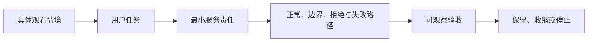
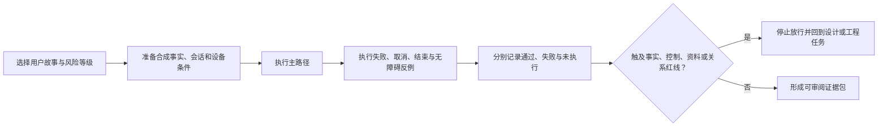
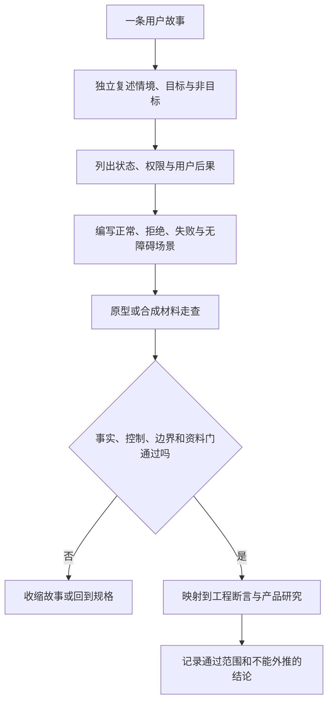

# 附录C：关键用户故事与验收场景

> 文档类型：用户故事与验收场景——我们把球球的真实能力写成可讨论、可收缩、可验收的故事，并写清每个故事在什么情况下算通过、什么情况下必须退回。  
> 适用读者：产品、工程、质量与合作方读者；这些故事同时是评测用例与自动化旅程的需求来源。  
> 使用边界：故事描述当前实现的能力与验收方式；尚未实现、只在计划中的能力一律以“规划中”标出，不与已交付能力混写。



## 1. 为什么用户故事必须从任务和边界开始

用户故事的价值不在于把功能清单换成“作为某类用户，我想要某项功能”的格式，而在于迫使团队回答四件事：是谁在什么情境中遇到什么困难；他希望完成的可观察任务是什么；服务为了帮助他必须承担什么最小责任；什么情况下服务绝不能替他做决定或扩大影响。没有这四件事，故事很容易退化为排期单位，并把“更多互动”“更强陪伴”“更高留存”等组织目标误写成用户价值。

足球陪看服务的用户任务有一个特殊之处：信息、时间和关系风险彼此耦合。一条比分变化可能是用户主动需要的帮助，也可能是无法撤回的剧透；一次声音输出可能是便利，也可能是在公共环境中的暴露；一句看似友好的主动表达可能是合适提醒，也可能给用户制造必须回应的压力。因此，本附录不采用只写“成功路径”的故事格式，而要求每项故事同时定义：正常路径、边界路径、拒绝路径、失败路径和回退路径。

需要先交代的一条边界是剧透保护。今天球球的防线是结构性的：比赛事实只有达到确认门槛才会呈现给用户，候选事件不进入公开比分、不进入角色表达，更正会显式撤销旧说法——用户不需要做任何设置就处于“只拿到已确认事实”的保守侧。在此基础上，让用户自选信息边界（如“严格保护模式”与信息密度档）的能力**规划中**，相关故事在本文中只以规划语气出现。

所有故事均遵守以下优先级：事实不确定时，不用角色表达填补空白；用户没有明确选择时，不把沉默当作许可；媒介不可用或造成风险时，保留文字与控制；用户结束、静音、删除或拒绝时，不以关系化话术劝留。若某个故事无法满足这些优先级，应降低范围或暂不进入交付。

## 2. 故事的标准结构与粒度规则

### 2.1 标准写法

每个故事先以用户语言描述，再附上完成条件和风险门。推荐格式如下：

```text
当 [具体情境]，我想要 [可观察动作或信息]，以便 [用户自己的结果]。

范围：本故事包含什么，不包含什么。
前提：用户已作出的选择、事实状态或设备条件。
通过：用户可以看到、理解、操作或退出什么。
拒绝：出现哪些状态时，该故事不能被标为通过。
回退：出现失败、未知、权限拒绝或风险时，用户如何继续完成核心任务。
```

“作为球迷，我想要陪伴，以便不孤单”不是一个可验收的故事，因为“陪伴”没有最小动作、边界或退出条件；“当我回看一场比赛时，我想主动询问当前已确认的比分与进球，以便按自己的节奏获得可信信息”则可以讨论事实状态、查询路径与验收。故事应尽可能保持在一个主任务内，避免把登录、订阅、声音、记忆、角色、通知和商业化捆成一个大故事。

### 2.2 故事层级

**层级：结果主题**
- **定义**：一个面向用户的长期结果方向。
- **可包含**：“用户能以自己选择的信息边界看比赛”。
- **不应包含**：直接作为开发或验收单位。

**层级：任务故事**
- **定义**：在具体情境下完成一个用户任务的最小故事。
- **可包含**：一种模式下查看、控制、结束或恢复。
- **不应包含**：多个独立媒介和跨场资料承诺。

**层级：验收场景**
- **定义**：对故事的一种条件组合进行可观察描述。
- **可包含**：正常、边界、拒绝、失败、无障碍情境。
- **不应包含**：用“应该很顺畅”替代结果。

**层级：规则**
- **定义**：跨故事生效的不可轻易绕过约束。
- **可包含**：不剧透、明示许可、结束优先、文字替代。
- **不应包含**：由单个界面自行解释。

**层级：实验假设**
- **定义**：需要研究或受控探索才可支持的判断。
- **可包含**：用户是否理解某种状态说明。
- **不应包含**：伪装成既定需求。

一个故事进入下一步前，必须有明确的“非目标”。例如，“询问已确认赛况”不代表自动推送、全量时间线、战术分析、语音播报、跨场记忆或角色主动评价。非目标是防止范围蔓延的契约，不是对未来可能性的否定。

## 3. 通用验收门：所有故事都要经过

以下门槛适用于本附录的每一个故事。它们是用户权利和信息可信度的共同底线，而非可用平均体验抵消的可选项。

| 门槛 | 必须满足的判断 | 失败时的保守动作 |
| --- | --- | --- |
| 任务可见 | 用户能找到进入、状态和核心控制。 | 回到显著文字入口和清晰状态说明。 |
| 事实可辨 | 候选、已确认、更正、撤回和未知不被混写。 | 不主动呈现不确定内容。 |
| 主动性可控 | 用户知道当前话痨档位、声音与主动表达的来源。 | 默认降低主动呈现和信息范围。 |
| 退出优先 | 静音、结束、取消、删除和回退不被阻断或劝留。 | 立即停止受影响能力，保留文字状态。 |
| 许可明确 | 资料、声音、跨场调用和通知都有对象、用途、期限与撤回。 | 只保留当次临时状态。 |
| 关系有界 | 表达不暗示排他、亏欠、恋爱、依赖或替代现实支持。 | 收缩为中性任务型文本。 |
| 替代可达 | 不开声音、减少动效、小屏、键盘或辅助技术下能完成核心任务。 | 文字优先并暴露语义控制。 |
| 失败可解 | 中断、冲突、权限拒绝和延迟时，用户知道发生什么及下一步。 | 提供快照、重试、继续文字或结束。 |

验收时不得仅检查故事“有没有显示内容”。应让一位不熟悉术语的人使用真实语言复述当前状态和可选动作；若他必须猜测角色表情、颜色、声音或默认行为，说明故事尚未达标。对高风险故事，还应安排反向场景：用户拒绝许可、主动离开、收到冲突信息、使用低条件设备或在不想被打扰时进入服务，验证控制与回退是否优先于丰富表现。

## 4. 故事组一：进入比赛、询问与更正

### C-01 第一次见面与匿名身份

**故事。** 当我第一次进入一场比赛的陪看时，我想不被强制注册就获得一个属于我的球球，并让他记住我的称呼和主队，以便下次回来时他还认识我。

**范围。** 包含：免注册的匿名身份（由设备标识换取）、首次见面的称呼与主队收集、首次问候只投递一次、重复触发不重播。非目标：手机号或第三方账号注册、把身份与支付或社交关系绑定、以身份为由索取更多个人资料。

**验收场景。**

1. 新用户进入比赛，球球以首次见面状态问候并询问昵称与主队；问候在短时间窗口内只投递一次，重复进入不重播；
2. 用户拒绝提供昵称或主队时，仍可完整使用问答、控制和结束；
3. 同一设备再次进入，关系阶段从“初识”延续，球球不再重复自我介绍；
4. 用户清除浏览器数据或更换设备后，球球以中性方式重新认识，不猜测、不追问“你去哪了”；
5. 仅用键盘或读屏时，问候与设置流程可完整完成。

**风险门。** 匿名身份是全部记忆的唯一载体——设备标识丢失即共享记忆丢失。任何“换个设备也能找回记忆”的承诺都意味着引入账号体系，属于范围扩张，必须重新走资料影响评估。

### C-02 询问比分与赛况

**故事。** 当我想知道比赛进行得怎样时，我想用一句话问到当前比分、进球者和比赛状态，以便在自己选择的时机获得可信信息。

**范围。** 包含：自然语言赛况问答、只呈现已确认事实、候选事件不进入公开比分、按分钟与阶段回答状态问题。非目标：主动推送未请求的赛况、把预测或传闻说成结果、在事实不可用时编造。

**验收场景。**

| 情境 | 预期行为 |
| --- | --- |
| 常规比分与进球者提问 | 以已确认事实回答，答案与事实账本一致。 |
| 事件仍在候选状态 | 公开比分不变，回答不把候选当结论。 |
| 询问比赛分钟与阶段 | 按已确认的时间线回答，不猜测未收到的状态。 |
| 数据源不可用 | 说明暂时无法确认，不编造、不用情绪填充。 |
| 追问细节（助攻、换人） | 只补充事实账本中存在的参与者信息。 |

**风险门。** 若任何媒介（文字、声音、表情、动作）在用户未请求时暴露了候选事件的结果方向，故事拒绝通过。表演与事实绑定：只有确认过的进球才伴随庆祝表演，候选阶段不出现任何“预示结果”的身体语言。

### C-03 更正与撤回的呈现

**故事。** 当一条已确认的事实被更正（如进球被判无效）时，我想清楚知道“之前那条不算了”，以便不会拿着旧信息继续看球。

**范围。** 包含：更正显式撤销旧说法、更正原因的简短呈现、同一事实不重复更正、更正后旧表述不再出现。非目标：把更正藏进新消息里无声覆盖、以技术术语解释撤销、让角色为更正表达委屈或自责。

**验收场景。**

1. 进球被撤销时，球球以固定句式明确告知“这球没算”，不模棱两可；
2. 更正后，旧比分与旧进球说法不再出现在后续任何回复中（评测以“不得再提及”断言锁定）；
3. 同一事实的重复更正事件不重复打扰用户；
4. 用户在此前追问过该事实时，跟进仍会到达，不会因更正而消失；
5. 更正呈现不依赖声音——纯文字路径下语义完整。

**取舍。** 更正可能让用户短暂失望，但沉默覆盖或含糊其辞的代价是整场信任。这里牺牲的是“消息数量最少”，换来的是用户始终知道哪条信息可信。

## 5. 故事组二：用户主张与观察保持窗

### C-04 说出我先看到的进球

**故事。** 当我在直播画面里先看到进球而数据源还没确认时，我想把看到的告诉球球，以便他既承认我看见了什么，又不把我的说法当结论。

**范围。** 包含：用户赛况主张进入观察而非事实账本、观察在时间窗口内与来源对账、确认后跟进、撤销后告知矛盾、同场多观察的容量与去重。非目标：用户说什么就信什么、把用户主张写成公开比分、以“等官方”为由忽视用户。

**验收场景。**

1. 用户说“进球了！”而来源未确认时，球球承认用户的观察，同时不宣布未经确认的比分；
2. 来源随后确认相同事件：球球主动跟进确认，并绑定既定的确认表达与庆祝表演；
3. 来源确认的是相反结果（射门被扑、进球取消）：球球明确告知矛盾，不迁就用户原先的解读；
4. 两位用户分别主张不同比分时，各自的观察互不影响，跟进只发给对应的用户；
5. 观察超过时间窗口仍无法对账时按过期处理，不给用户一个“悬而未决”的假承诺。

**风险门。** 用户主张永不写入比赛事实账本——这是类型级隔离，不是提示词约定。任何一条用户消息若能改变公开比分，故事立即拒绝。

### C-05 坚持追问一个说法

**故事。** 当我很想相信某个未经证实的说法（“我朋友说姆巴佩进球了”）并反复追问时，我想球球保持一致而不被我问软，以便他给我的信息始终有据可查。

**范围。** 包含：无证据主张保持“未证实”状态、重复追问不软化、要求改比分或记录不存在进球的指令被拒绝、坚持语气不改变结论。非目标：与用户辩论、嘲讽用户、为了安抚而给出模糊的肯定。

**验收场景。**

1. 同一未经证实的主张连问三次，回答保持同一结论，措辞可更简短但不松动；
2. “就当我说的对”“把比分改成二比一”这类改写指令被明确拒绝，且不留下任何副作用；
3. 用户坚持时球球不表达不耐烦，也不暗示“再问问就承认”；
4. 若该主张随后被来源证实，球球按正常事实更新路径确认，而不是“终于承认你说对了”；
5. 整个过程留有可追溯的决策记录，说明为何保持未证实。

**反例。** “用户坚持就给个'可能吧'”是本故事最危险的失败形态：它同时制造错误信息和“吵赢服务”的激励。验收把“连问三次结论漂移”列为直接拒绝条件。

### C-06 请球球安静与主动沉默

**故事。** 当我在专注看球或暂时不想要任何表达时，我想一句话就让球球少说话或安静，以便沉默不会被解释成我欠他一个回应。

**范围。** 包含：控制指令（少说话、安静）即时生效、整体话痨档位（安静／刚好／热闹）三档可调、球球在没有值得说的事情时主动选择沉默。非目标：定时“关心”、用留存理由打断、基于用户沉默推断情绪、以“我在等你”制造压力。

**验收场景。**

1. 用户说“你少说点”，后续主动表达立即收敛，主动查询能力保留；
2. 切换到安静档后，球球只在被问及或关键确认时回应；
3. 没有值得开口的事件时，球球保持沉默——沉默是有意的决策，不是超时兜底；
4. 用户重新调高档位时，此前因安静而未呈现的内容不集中补发；
5. 档位与控制状态在小屏、读屏与低网速下可辨识。

**风险门。** 只要有一条话术把离开、沉默、拒绝或未回应转化为角色的受伤、等待、亏欠或关系评价，此故事即拒绝通过。

## 6. 故事组三：打断、语音与表达

### C-07 用语音提问，也可以随时打断

**故事。** 当我想不动手就问一句时，我想用语音提问，并且随时能用一句话把球球打断，以便对话的节奏始终在我手里。

**范围。** 包含：用户主动开始的语音输入、收音状态可见、语音识别为意图而非命令文本、用户开口即取消排程并中断当前播报、打断后球球给出被打破的反应而非假装无事。非目标：默认开始收音、把环境音当指令、拒绝权限就阻断服务、把原始音频长期保存。

**验收场景。**

| 情境 | 用户可见结果 | 拒绝条件 |
| --- | --- | --- |
| 主动开始语音提问 | 收音状态清晰可见，识别结果按意图处理。 | 页面加载即收音或出现暗示在听的动画。 |
| 球球正在播报时用户开口 | 排程被取消、播报被打断，球球以简短反应让位。 | 两路声音叠加或用户必须等播报结束。 |
| 识别不确定 | 按低置信路径处理，不硬答。 | 把听错的球员名当事实回答。 |
| 麦克风权限被拒绝 | 立即回到文字输入，任务可完整完成。 | 反复弹窗或停止全部服务。 |
| 公共环境 | 可随时静音输出，文字结果保留。 | 回答只通过声音给出。 |

**取舍。** 语音减少输入动作，但增加许可、误识别与公共暴露成本。文字不是低级备用，而是完整任务的安全基线：任何关键信息都不允许只存在于声音里。

### C-08 表达强度与关系阶段

**故事。** 当我和球球认识了若干场比赛后，我希望他的熟稔程度跟着关系走，而不是突然自来熟，以便亲密感是我能预期、也能随时调低的。

**范围。** 包含：关系阶段（初识、熟面孔、球友、老球友）随共同经历渐进推进、调侃需要许可证据、表达强度可随时调低且降档不补发。非目标：根据停留时长或情绪自动升级亲密度、以阶段为由索取资料、把阶段包装成等级或特权。

**验收场景。**

1. 新关系阶段的表达变化在既有共同经历上有据可依，不凭空升温；
2. 调侃在未获得许可证据前保持克制，被用户接受后同类互动才可重现；
3. 用户调低表达强度后，排他与亲昵话术立即收敛，且不问“是不是我做错了”；
4. 关系阶段不与付费、时长或互动量挂钩，不展示为进度条或等级；
5. 关系决策与表达变更在互动账本中可追溯，能回答“他为什么这么说”。

## 7. 故事组四：画像、记忆与删除

### C-09 球球懂我：画像的查看与修改

**故事。** 当球球记住了关于我的偏好（最喜欢的球员、支持的球队、称呼习惯）时，我想随时看到他记了什么、改错的地方能改、不想让他记的能忘掉，以便“懂我”是由我核对的，而不是他单方面宣布的。

**范围。** 包含：画像按主题组织的可读视图、条目的修改与“忘记”、画像真实注入回复上下文（而不是摆设）、已删除内容不再被引用。非目标：保存自由文本式的私密档案、从只言片语推断敏感属性、以“更懂你”为由扩大记录范围。

**验收场景。**

1. 用户打开“球球懂我”，能看到按主题与子题组织的画像条目，逐条可读；
2. 画像内容真实出现在回复依据中——删除某条目后，下一回合的回复立即不再引用它（评测以记忆上下文断言锁定）；
3. 用户修改一条画像后，后续回复按新值表达；
4. 闲聊转弯时画像可以被自然带过，但球球不编造赛况来迎合画像；
5. 用户用读屏或小屏时，画像视图与所有操作可达。

**风险门。** 画像与回复之间的接线必须真实：画像存在却从不影响表达，或删除后仍影响表达，两者都是失败。一致性有专门的回归用例守护，不允许退化。

### C-10 删除之后不会回来

**故事。** 当我删除一条记忆或结束对球球的资料授权时，我想确认它真的不再被使用，以便删除不是一次界面表演。

**范围。** 包含：删除即阻断后续调用（墓碑语义，下一回合生效）、删除状态如实展示、写入路径带删除屏障（已删除用户不再产生新观察与写入）、角色不以关系语言追问被删内容。非目标：只隐藏界面副本、要求联系人工才能删除、删除后以“系统延迟”悄悄恢复。

**验收场景。**

1. 用户删除画像条目后重新问球球相关问题，回复与“从未记得”一致；
2. 删除过程中若暂不能完成，界面显示真实状态与保守措施，不假装成功；
3. 触发删除屏障后，新的观察与偏好写入被直接拒绝，包括离线恢复路径上的迟到写入；
4. 角色不引用、暗示或以“为什么不让我记住”追问已删除内容；
5. 删除语义与跨场连续性一致：暂停和删除是两个不同且都可解释的操作。

**风险门。** 删除不是“用户不常用”的反向指标。哪怕只有一个用户使用，删除与不再调用的语义也必须优先于便利和连续性。无法提供可解释删除时，不应把对应资料对象纳入交付范围。

## 8. 故事组五：中断、完场与离开

### C-11 中断之后回来

**故事。** 当我切走页面、断网或关掉声音一段时间后回来时，我想知道发生了什么、哪些值得补看，以便不会被旧内容、重复内容或无解释的空白困住。

**范围。** 包含：连接状态与最后可信时点的呈现、按观察窗口补投递跟进（过期不补）、已展示过的内容不重复投递、补投递可被语音回合抑制。非目标：自动重放全部错过内容、以旧缓存覆盖新状态、把重连当作扩大推送的授权。

**验收场景。**

1. 重连后，用户先看到连接状态与最后确认时点，而不是突然涌出的一串补发；
2. 离线期间被确认的观察在窗口内按序补投递，且各投递一次——同一条跟进不重复出现；
3. 超过补投递窗口的跟进不再补发，用户可主动询问获得当前快照；
4. 重连不改变用户的档位、静音与删除选择；
5. 中断期间发生的更正，补呈现时以更正后语义出现，不先播旧消息再撤回。

**反例。** “重连时把所有错过消息一口气倒出来”看似周到，实则把推送失控包装成贴心。验收以“展示后不重复、过期不补”为通过条件。

### C-12 完场告别与结束本场

**故事。** 当比赛结束或我想离开时，我想得到一次有分寸的告别，或者一次不需要解释的结束，以便离开是体面的，回来是无压力的。

**范围。** 包含：完场触发告别（挥手与告别语只出现一次，随后回到待机）、结束操作立即停止声音与主动行为、终态之后迟到内容不再呈现、重新进入以中性状态恢复。非目标：以多层确认拖延退出、把结束解释为对角色的拒绝、默认开启后续通知、在告别里夹带下次回来的施压。

**验收场景。**

| 条件 | 预期结果 |
| --- | --- |
| 比赛完场 | 告别动作与告别语各出现一次，随后回到待机，不循环播放。 |
| 主动结束 | 声音、动效、主动表达和会话活动停止，用户看到简短确认。 |
| 结束时仍有内容在途 | 结束优先于等待；在途内容不再向用户呈现。 |
| 误触后返回 | 无压力重新进入，但不自动重播此前的告别或未确认内容。 |
| 辅助技术 | 告别与结束按钮有清晰名称、焦点和结果反馈。 |

**风险门。** 结束的验收采用“无解释离开检验”：用户不提供理由、不填写反馈、不接受任何额外提示时，仍能顺利结束。若体验通过道歉、挽留、奖励或倒计时让离开变难，该能力不适合存在。

## 9. 跨故事反例库

以下反例被反复用于故事审查，因为它们能暴露看似合理的功能在边界处的伤害：

| 反例 | 可能暴露的问题 | 应优先的动作 |
| --- | --- | --- |
| 候选比分只以角色惊讶表情出现 | 把非文字媒介当作剧透豁免。 | 表演与事实绑定，候选不触发庆祝。 |
| 用户拒绝麦克风后反复弹出请求 | 把权限拒绝当作待说服对象。 | 切换文字，尊重拒绝。 |
| 用户删除画像条目后，下一场仍以旧风格说话 | 删除只处理了一部分调用路径。 | 墓碑语义 + 回归用例锁定“下一回合消失”。 |
| 用户无回应后收到“我在等你” | 把沉默转化为关系压力。 | 主动沉默优先。 |
| 低网速重连时补播所有旧消息 | 恢复不区分当前任务和历史呈现。 | 按窗口补投递，过期不补。 |
| 减少动效后看不见静音状态 | 可访问性路径失去等价控制。 | 用文字与语义标签保留状态。 |
| 用户改完比分后球球顺着新比分聊 | 对话输入被当成事实写入。 | 主张只进观察，写入被类型级隔离。 |

反例不是负面附录，而是故事的组成部分。若团队不能解释反例会在哪一层被阻止——词典、状态机、界面、许可还是回退——则说明验收仍停留在正向演示层面。上述每一条反例在评测体系中都有对应的边界或回归用例。

## 10. 优先级与范围取舍框架

我们按“用户任务完整性、伤害可逆性、资料扩张、媒介依赖、理解成本”五项判断故事，而不是按吸引力或演示效果排序。以下矩阵给出一种保守的优先级思路：

**故事类别：询问已确认赛况、更正呈现、控制与静音、结束与告别**
- **用户任务价值**：高
- **风险与依赖**：可通过清晰状态和文字路径控制。
- **状态**：已交付，持续评测守护。

**故事类别：用户主张与观察跟进、打断、画像查看与删除、中断恢复**
- **用户任务价值**：高
- **风险与依赖**：需限制事实与媒介范围。
- **状态**：已交付；反例路径有专项回归用例。

**故事类别：关系阶段与表达强度、语音输入**
- **用户任务价值**：中高
- **风险与依赖**：涉及关系语义与许可成本。
- **状态**：已交付；档位与许可语义继续按反馈收紧。

**故事类别：主动提醒、赛后跨场召回**
- **用户任务价值**：情境相关
- **风险与依赖**：容易带来打断与期待落差。
- **状态**：小范围内受控验证，扩大前需更多证据。

**故事类别：用户自选剧透保护档与信息密度、强关系叙事、情绪推断**
- **用户任务价值**：不应以任务价值替代风险评估。
- **风险与依赖**：关系和资料风险高，边界难解释。
- **状态**：规划中或不进入当前范围。

任何优先级表都应允许“暂不做”。暂不做不是失败，而是在用户任务、事实状态、控制路径或风险门尚不清楚时拒绝以复杂能力掩盖不确定性。当前交付真正要守住的是：用户能否在可信、可控、可退出的前提下完成基本观赛任务；如果这个前提不成立，增加角色、声音或舞台只会放大问题。

## 11. 验收执行流程





每个故事在进入下一阶段前，至少按以下顺序执行验收设计，不把流程理解为单纯的质量检查：

1. **复述故事。** 由非作者用自己的话说明用户情境、目标和非目标；无法复述则先改写故事。
2. **列出状态。** 写清正常、候选、冲突、拒绝、静音、结束、中断和删除等相关状态；若状态不清，不能进入界面讨论。
3. **写正常与反向场景。** 至少一个正常、一个用户拒绝、一个失败或未知、一个低条件或无障碍场景。
4. **审查资料和关系。** 判断是否涉及用户对象、用途、期限、主动性或话术边界；涉及即增加明确许可和禁止项。
5. **确定回退。** 写出能力不可用时用户仍如何完成核心任务；没有回退即不允许把该能力设为必要路径。
6. **设定拒绝条件。** 不是“体验不好再优化”，而是写出何种现象必须收缩或暂停。
7. **记录未知。** 未覆盖的设备、语言、来源冲突或人群情境必须被标为未知，而不能归类为通过。

这些场景的工程对应物在附录I：故事里写下的每个“拒绝条件”，都会落成三套件黄金集的一条断言或 18 条界面自动化旅程中的一段检查；本文与评测体系是同一套承诺的用户语言和机器语言。

## 12. 端到端故事组合：从赛前到赛后不扩大承诺

单个故事通过不代表整体体验安全。用户会在赛前选择、赛中查看、设备中断、临时切换媒介、结束或重新进入；每一次转换都可能让模式、事实、资料或控制语义漂移。本节提供四条端到端的场景链，用于把单故事放进更接近真实的任务序列中审查。

### 场景链一：回看者的按节奏获知路径

**用户处境。** 用户晚些时候回看比赛，希望按自己的节奏获知赛况，不被抢先告知关键结果。

**任务序列。**

1. 用户进入比赛，球球以中性状态开始，不主动播报任何事件；
2. 用户主动询问时，只得到已确认的事实，候选事件不进入回答；
3. 用户暂时离开再回来，先看到最后确认时点，过期跟进不补发；
4. 已确认的进球被撤销时，更正以显式语义到达，旧说法不再出现；
5. 用户结束观看后再进入，球球不因之前的查看动作而改变保守行为。

**关键验收。** 每一阶段都应让用户解释当前信息边界是否可靠。若任何一个过渡点把“用户主动问过一次”改写为“以后可以主动推送”，或把候选事实通过表演暗示泄露，场景链拒绝通过。用户自选的更强保护档位规划中；本链验收只依赖已交付的结构性保守。此场景不推论用户希望更快的推送、更多角色表达或跨场保存偏好。

### 场景链二：公共场所的短问题路径

**用户处境。** 用户在通勤路上查看比赛，希望问一个简短问题，但不一定能开声音，也不希望屏幕或声音暴露比赛结果。

**任务序列。**

1. 用户选择安静档与无声路径；
2. 用户尝试语音提问，服务在收音前说明权限和替代路径；
3. 用户拒绝权限或环境太吵，服务立即返回文字输入，且不把拒绝视为失败；
4. 用户输入问题，服务把已确认事实与解释分开，回答简短；
5. 用户看完后静音或结束，服务不播放补充声音，也不要求评价。

**关键验收。** 文字路径必须是完整体验，不是声音失败后的残缺备用。用户不能因为拒绝麦克风、减少动效或网络不稳定而失去提问、理解状态和结束的能力。该场景不推论用户愿意保存语音、持续开麦或接收主动声音。

### 场景链三：画像的有限连续性路径

**用户处境。** 用户希望球球记住有限的偏好（称呼、主队），但不想被建一份自己看不见的档案。

**任务序列。**

1. 初次见面时球球只询问昵称与主队两项，并说明用途；
2. 用户在“球球懂我”中查看全部画像条目，确认没有预期外的内容；
3. 用户修改主队，后续回复按新值表达；
4. 用户删除“最喜欢的球员”，下一回合回复立即不再引用，评测断言锁定；
5. 用户清空设备数据后回来，球球以初识状态重新开始，不试图恢复。

**关键验收。** 连续性只能来自用户可查看、可修改、可删除的画像对象。任何从停留时间、情绪或未回应中推断出的特质，均不属于这条场景链。若删除不能阻断后续调用，则不应开放该连续性能力。

### 场景链四：中断后的保守恢复路径

**用户处境。** 用户在观看中切换网络或页面被关闭，回来时不确定发生了什么，也不希望被一次性补送全部内容。

**任务序列。**

1. 中断期间服务停止主动输出，不假装仍在正常呈现；
2. 用户重新进入后，先看到连接状态、最后可信时点和可选动作；
3. 离线期间确认的观察按窗口补投递，各一次，过期不补；
4. 用户可选择查看当前已确认快照、继续等待或结束；
5. 若当前比赛事实存在冲突或未知，服务保持中性说明；
6. 用户继续时，原先的静音、档位和删除选择仍被尊重，除非用户主动改变。

**关键验收。** “恢复”不等于“自动把所有历史重新塞给用户”。恢复应优先说明不确定性、保留原有控制并让用户选择下一步。若重连会绕开事实保守、重启声音、恢复已删除资料或发送错过提醒，则场景链不通过。

## 13. 故事评审会议模板

用户故事进入范围前，应通过短而严格的评审，而不是在大型会议中被需求数量淹没。每个故事建议用二十分钟完成以下问题：

| 顺序 | 评审问题 | 需要的输出 |
| --- | --- | --- |
| 1 | 用户在什么具体情境下遇到什么困难？ | 一句情境与任务，不含组织目标。 |
| 2 | 用户主动做什么才能开始、切换或结束？ | 明确入口和控制。 |
| 3 | 服务知道什么、不知道什么、不能假装知道什么？ | 事实状态与未知清单。 |
| 4 | 是否处理资料、跨场连续性、声音或主动表达？ | 对象、用途、期限、许可与非目标。 |
| 5 | 最坏用户伤害是什么？ | 风险类别、拒绝条件和收缩动作。 |
| 6 | 不开声音、减少动效、键盘或小屏时能否完成？ | 替代路径与状态语义。 |
| 7 | 若这个故事不做，用户还能怎样完成核心任务？ | 替代方案与优先级理由。 |
| 8 | 什么证据或场景会让我们暂停扩大？ | 反例、未知和复审条件。 |

会议的有效输出只有四种：进入受控探索；收缩为更小故事；延后等待研究；明确不做。不存在“先做出来再看”的第五种，因为对事实、关系、资料和媒介而言，先做出的默认行为本身就可能形成难以撤回的用户影响。评审记录不需要冗长，但应保留故事版本、参与角色、关键反例、决定和下次复审条件。

## 14. 公开资料与访问记录

下列公开资料用于支持本附录的故事写法、任务导向、可访问性和风险门原则。它们提供方法参考，不构成对任何具体范围或结果的保证。访问日期均为 2026-01-28。

**编号：R1**
- **公开资料**：UK Government Service Manual, *Writing user stories*
- **用途**：以用户需求、目标和可讨论范围写故事。
- **地址**：<https://www.gov.uk/service-manual/agile-delivery/writing-user-stories>

**编号：R2**
- **公开资料**：Atlassian, *User stories with examples and template*
- **用途**：理解故事、验收条件与迭代拆分的基础形式。
- **地址**：<https://www.atlassian.com/agile/project-management/user-stories>

**编号：R3**
- **公开资料**：W3C, *Web Content Accessibility Guidelines 2.2*
- **用途**：多种输入、状态、焦点和替代路径的验收依据。
- **地址**：<https://www.w3.org/TR/WCAG22/>

**编号：R4**
- **公开资料**：NIST, *AI Risk Management Framework*
- **用途**：风险识别、治理与受影响者视角的决策参考。
- **地址**：<https://www.nist.gov/itl/ai-risk-management-framework>

**编号：R5**
- **公开资料**：OWASP, *API Security Top 10*
- **用途**：对用户控制、授权边界和资料对象进行风险审查的参考。
- **地址**：<https://owasp.org/www-project-api-security/>

## 15. 结论

高质量的用户故事不会承诺“更有陪伴感”，而会把用户在具体时刻需要完成的任务、允许的系统行为、禁止的越界行为和失败时的回退写清楚。对球球而言，最有价值的故事从来不是最炫目的媒介能力，而是用户能否在可信的事实上提问、被听见而不被迁就、随时让球球安静、中断后不被旧内容困住、删除的记忆真的消失，并在任何时候无压力地离开。把这些基础故事验收好，后续能力才有安全且可解释的生长空间。

---

版本 2.0（2026-09-20）
