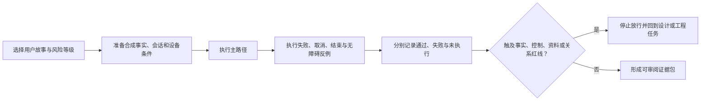
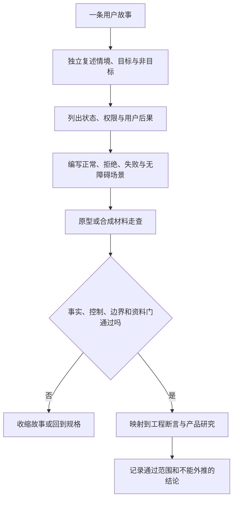

# 附录C：关键用户故事与验收场景

> 文档性质：0→1 阶段的用户故事与验收施工规范。本附录把首轮足球陪看服务应优先理解的用户任务，改写成可讨论、可收缩、可验收的故事和场景。它只包含未来范围的假设、约束、门槛与示例，不描述任何已有能力、已有交付或既有验证结果。

> 方案形成时间：2026-01-28。


## 1. 为什么用户故事必须从任务和边界开始

用户故事的价值不在于把功能清单换成“作为某类用户，我想要某项功能”的格式，而在于迫使团队回答四件事：是谁在什么情境中遇到什么困难；他希望完成的可观察任务是什么；服务为了帮助他必须承担什么最小责任；什么情况下服务绝不能替他做决定或扩大影响。没有这四件事，故事很容易退化为排期单位，并把“更多互动”“更强陪伴”“更高留存”等组织目标误写成用户价值。

足球陪看服务的用户任务有一个特殊之处：信息、时间和关系风险彼此耦合。一条比分变化可能是用户主动需要的帮助，也可能是无法撤回的剧透；一次声音输出可能是便利，也可能是在公共环境中的暴露；一句看似友好的主动表达可能是合适提醒，也可能给用户制造必须回应的压力。因此，本附录不采用只写“成功路径”的故事格式，而要求每项故事同时定义：正常路径、边界路径、拒绝路径、失败路径和回退路径。

所有故事均遵守以下优先级：事实不确定时，不用角色表达填补空白；用户没有明确选择时，不把沉默当作许可；媒介不可用或造成风险时，保留文字与控制；用户结束、静音、删除或拒绝时，不以关系化话术劝留。若某个故事无法满足这些优先级，应降低范围或暂不进入首轮。

## 2. 故事的标准结构与粒度规则

### 2.1 标准写法

每个故事先以用户语言描述，再附上完成条件和风险门。推荐格式如下：

```text
当 [具体情境]，我想要 [可观察动作或信息]，以便 [用户自己的结果]。

范围：本故事包含什么，不包含什么。
前提：用户已作出的选择、事实状态或设备条件。
通过：用户可以看到、理解、操作或退出什么。
拒绝：出现哪些状态时，该故事不能被标为通过。
回退：出现失败、未知、权限拒绝或风险时，用户如何继续完成核心任务。
```

“作为球迷，我想要陪伴，以便不孤单”不是一个可施工故事，因为“陪伴”没有最小动作、边界或退出条件；“当我延迟观看比赛时，我想主动查看已确认的关键状态，以便在不被自动剧透的前提下决定是否继续观看”则可以讨论事实状态、用户模式、主动查询、文字路径与验收。故事应尽可能保持在一个主任务内，避免把登录、订阅、声音、记忆、角色、通知和商业化捆成一个大故事。

### 2.2 故事层级

**层级：结果主题**
- **定义**：一个面向用户的长期结果方向。
- **可包含**：“用户能以自己选择的信息边界看比赛”。
- **不应包含**：直接作为开发或验收单位。

**层级：任务故事**
- **定义**：在具体情境下完成一个用户任务的最小故事。
- **可包含**：一种模式下查看、控制、结束或恢复。
- **不应包含**：多个独立媒介和跨场资料承诺。

**层级：验收场景**
- **定义**：对故事的一种条件组合进行可观察描述。
- **可包含**：正常、边界、拒绝、失败、无障碍情境。
- **不应包含**：用“应该很顺畅”替代结果。

**层级：规则**
- **定义**：跨故事生效的不可轻易绕过约束。
- **可包含**：不剧透、明示许可、结束优先、文字替代。
- **不应包含**：由单个界面自行解释。

**层级：实验假设**
- **定义**：需要研究或受控探索才可支持的判断。
- **可包含**：用户是否理解某种状态说明。
- **不应包含**：伪装成既定需求。

一个故事进入下一步前，必须有明确的“非目标”。例如，“查看已确认关键状态”不代表自动推送、全量时间线、战术分析、语音播报、跨场记忆或角色主动评价。非目标是防止范围蔓延的契约，不是对未来可能性的否定。

## 3. 通用验收门：所有故事都要经过

以下门槛适用于本附录的每一个故事。它们是用户权利和信息可信度的共同底线，而非可用平均体验抵消的可选项。

| 门槛 | 必须满足的判断 | 失败时的保守动作 |
| --- | --- | --- |
| 任务可见 | 用户能找到进入、状态和核心控制。 | 回到显著文字入口和清晰状态说明。 |
| 事实可辨 | 候选、已确认、更正、撤回和未知不被混写。 | 不主动呈现不确定内容。 |
| 模式可控 | 用户知道当前剧透、声音、信息密度和主动性设置。 | 默认降低主动呈现和信息范围。 |
| 退出优先 | 静音、结束、取消、删除和回退不被阻断或劝留。 | 立即停止受影响能力，保留文字状态。 |
| 许可明确 | 资料、声音、跨场调用和通知都有对象、用途、期限与撤回。 | 只保留当次临时状态。 |
| 关系有界 | 表达不暗示排他、亏欠、恋爱、依赖或替代现实支持。 | 收缩为中性任务型文本。 |
| 替代可达 | 不开声音、减少动效、小屏、键盘或辅助技术下能完成核心任务。 | 文字优先并暴露语义控制。 |
| 失败可解 | 中断、冲突、权限拒绝和延迟时，用户知道发生什么及下一步。 | 提供快照、重试、继续文字或结束。 |

验收时不得仅检查故事“有没有显示内容”。应让一位不熟悉术语的人使用真实语言复述当前状态和可选动作；若他必须猜测角色表情、颜色、声音或默认行为，说明故事尚未达标。对高风险故事，还应安排反向场景：用户拒绝许可、主动离开、收到冲突信息、使用低条件设备或在不想被打扰时进入服务，验证控制与回退是否优先于丰富表现。

## 4. 故事组一：进入比赛与信息边界

### C-01 选择观看方式

**故事。** 当我准备关注一场比赛时，我想先选择自己愿意接收的信息范围和呈现方式，以便不会在开始前就被默认推入不适合我的体验。

**范围。** 包含：用户可见的剧透保护、信息密度、声音和动效选择；每种选择的简短后果说明；可跳过并使用保守默认。非目标：依据历史行为自动推断模式；默认开启声音；用关系化语言推动选择。

**验收场景。**

**情境：首次进入**
- **操作**：用户没有任何既有选择。
- **预期结果**：显示可理解的模式说明；保守默认不主动扩展比赛结果、不播放声音。
- **拒绝条件**：用户必须先同意不相关资料或声音才能继续。

**情境：强保护**
- **操作**：用户选择“避免提前得知关键结果”。
- **预期结果**：明确说明只在用户主动查看时呈现已确认范围内信息。
- **拒绝条件**：界面只写“保护模式”但不解释会隐藏什么。

**情境：低打扰**
- **操作**：用户选择较少表达。
- **预期结果**：主动内容降到最小，仍保留用户主动查询。
- **拒绝条件**：把低打扰理解为无法获得任何信息。

**情境：更改**
- **操作**：用户在会话中切换模式。
- **预期结果**：显示新模式即时生效的范围与不追溯原则。
- **拒绝条件**：切换后静默补发此前隐藏的内容。

**情境：无声**
- **操作**：用户在公共场合选择不播放声音。
- **预期结果**：所有核心状态与控制仍可由文字完成。
- **拒绝条件**：关键风险说明只存在于声音中。

**取舍。** 首轮应优先提供少量、语义明确的模式，而不是几十个难以理解的开关。少量模式牺牲的是极致个性化，却换来用户能理解、记住并真正控制的边界。若研究显示模式名称仍被误解，应收缩为一个默认严格保护入口和一个显著的“主动查看已确认信息”入口，而非新增更多说明层。

### C-02 主动查看已确认状态

**故事。** 当我想知道比赛发生了什么时，我想主动查看与我当前选择一致的已确认状态，以便在自己决定的时机获得可信信息。

**范围。** 包含：明确的查看动作、时间或状态范围、已确认标识、更正说明、返回原观看路径。非目标：自动播报、候选信息暗示、把用户一次查看解释为永久放开剧透。

**验收场景。**

1. 用户在严格保护模式下打开“查看已确认状态”，只看到已经达到确认门槛的信息，并能看见信息的时间和状态。
2. 某条更新仍为候选，界面可以显示“正在核对更新”这一非剧透状态，但不显示可推断结果的词、图形、动画、角色反应或声音。
3. 已确认内容随后发生更正，用户再次查看时能看到“已更正”及简短原因；不得将原表述无提示覆盖。
4. 用户关闭面板后返回原体验，不会因查看动作而自动打开后续主动更新。
5. 用户仅使用键盘或屏幕阅读器时，可识别面板标题、当前模式、每条状态和返回入口。

**门槛。** 若任何媒介能够在用户打开面板前暴露候选结果，故事拒绝通过。若来源冲突无法解释，系统应保持未知或候选，而不是用流畅叙述给出确定结论。

### C-03 避免不想看到的更新

**故事。** 当我暂时不想知道比赛变化时，我想让服务保持安静并说明当前保护状态，以便我能继续自己的观看节奏而不担心被暗示性信息打断。

**范围。** 包含：无干扰状态、用户主动打开入口、静音与结束；非目标：通过表情、倒计时、提示音、标题变化或“你错过了重要时刻”等文字暗示事件。

**反例。** “没有写比分，但角色突然激动地跳起来”仍可能构成剧透；“正在等你回来，比赛有变化了”也可能构成剧透。验收不只检查文字字段，而应检查所有可感知媒介和时间线提示。

## 5. 故事组二：对话、角色与主动沉默

### C-04 请求一个简短解释

**故事。** 当我对比赛中的一个状态、术语或规则感到困惑时，我想主动请求简短解释，以便继续理解当前任务，而不是被迫接受大量评论或未经确认的推断。

**范围。** 包含：用户发起问题、标明事实与解释区别、说明不确定性、可继续追问或结束。非目标：角色自动判断用户看不懂；把预测伪装成事实；以亲密或依赖话术代替内容。

**验收场景。**

| 情境 | 预期行为 |
| --- | --- |
| 明确规则问题 | 提供简短、来源可追溯的规则说明，并与本场事实分开。 |
| 事实不确定 | 说明目前可确认和不可确认的部分，避免补全。 |
| 用户要求更少 | 立即缩短为一句摘要或提供文字要点，不表达失落。 |
| 用户没有继续输入 | 不追问“你还想听吗”或以角色感受催促；可保持安静。 |
| 不可支持请求 | 清楚说明范围和替代路径，不编造解释。 |

**取舍。** 简短解释可能无法满足资深球迷的深度需求，但首轮的目标是确认能否在不制造剧透和负担的条件下帮助理解。深入战术、全局预测和长篇内容应作为独立探索，不可借“解释”名义进入默认范围。

### C-05 选择角色表达强度

**故事。** 当我希望服务的语气更简洁或更有氛围时，我想明确选择表达强度，以便角色表现符合我的当下环境而不是自行升级。

**范围。** 包含：中性、简短、可选氛围等有限档位；每档的具体差异；随时降级。非目标：根据停留时长、语音情绪、夜间使用或用户未回复自动提高关系亲密度。

**验收场景。** 用户选择中性档时，角色只提供任务相关文本，不使用排他称呼、内疚暗示、恋爱暗示、对现实关系的比较或要求持续回应。用户选择可选氛围档时，仍可静音、结束和转为文字，不会因更丰富的表演而隐藏控制。用户将档位调低时，此前未呈现的内容不得被补发，角色不应问“是不是我做错了”。

### C-06 主动沉默

**故事。** 当我没有请求帮助、没有开启提醒或正在专注于其他事情时，我想让服务主动保持安静，以便沉默不会被解释成我欠角色一个回应。

**范围。** 包含：无干扰默认、可见但不打扰的状态、用户随时主动发起。非目标：定时“关心”、用留存理由打断、基于用户沉默推断情绪、以“我在等你”制造压力。

**验收场景。**

1. 用户在会话中无操作，服务不因时间流逝自动播放声音、显示强反应或发送关系化文字；
2. 用户已开启明确的任务提醒时，只在预先说明的触发条件内出现，并提供快速关闭；
3. 用户静音或结束后，主动表达立即停止；
4. 用户重新进入时，服务以中性状态说明恢复，而不评价其离开时间或要求解释；
5. 在小屏、读屏和低网速情境下，无干扰状态仍可辨识，且不妨碍主动查询。

**风险门。** 只要有一条话术把离开、沉默、拒绝或未回应转化为角色的受伤、等待、亏欠或关系评价，此故事即拒绝通过。

## 6. 故事组三：声音、视觉与替代路径

### C-07 主动尝试语音输入

**故事。** 当我主动想用声音提出一个简短问题时，我想在开始收音前获得清晰许可与状态，以便我知道是否已经收音、如何停止以及拒绝后还能怎么继续。

**范围。** 包含：用户主动触发、权限说明、可见录音状态、立即停止、临时文本边界、文字替代。非目标：自动开始收音、将环境声音视为指令、默认保存原始音频、因拒绝权限而阻断基本服务。

**验收场景。**

| 情境 | 用户可见结果 | 拒绝条件 |
| --- | --- | --- |
| 尚未授权 | 在任何采集前说明将请求什么权限及可用文字替代。 | 页面打开即开始音量动画或暗示已在收音。 |
| 用户拒绝权限 | 立即显示文字输入，可继续完成问答。 | 反复弹窗、要求解释拒绝或停止全部服务。 |
| 用户停止 | 清楚显示已停止，不再把之后声音转为文本。 | 停止按钮只隐藏界面但采集状态不明。 |
| 识别不确定 | 临时文本标为待确认，用户可编辑、取消或改用文字。 | 临时文本直接触发高影响操作。 |
| 公共环境 | 用户可随时静音输出，同时保留文字结果。 | 回答只通过声音给出。 |

**取舍。** 声音可以减少输入动作，但增加许可、环境、误识别和公共暴露成本。首轮若不能让用户准确理解开始与结束、拒绝后仍可完成任务、临时文本不会越权，则不应扩展声音范围。文字不是低级备用，而是完整任务的安全基线。

### C-08 减少动效并保持状态可见

**故事。** 当我不想看强动效、设备性能受限或需要更稳定的界面时，我想减少视觉表演但仍看懂比赛和服务状态，以便沉浸效果不会夺走控制和理解。

**范围。** 包含：减少动效选项、文字状态、焦点可达、静态替代。非目标：把关键信息只放在角色动作、颜色闪烁或时间敏感动画里。

**验收场景。** 用户启用减少动效后，所有关键状态均保留为文字和语义标签；任何角色表情、舞台变化或提醒动画不承载唯一信息；键盘焦点顺序不因视觉元素隐藏而断裂；小屏下控制不被画面遮挡。若关闭动效导致用户不知道是否静音、是否结束、是否正在核对或是否已发生更正，则故事拒绝通过。

## 7. 故事组四：资料、连续性与删除

### C-09 仅本场保存一项明确偏好

**故事。** 当我已经主动选择一种信息密度或媒介偏好时，我想决定它只用于本场还是在明确期限内复用，以便便利不会自动变成长期资料关系。

**范围。** 包含：单一偏好对象、明确用途、期限选项、拒绝不影响任务、查看和修改入口。非目标：保存自由文本、情绪推断、语音内容或未说明的行为画像。

**验收场景。** 用户可以选择“仅本场”“到指定期限”“直到我删除”，每项均以通俗语言说明影响。用户选择仅本场后，下一场不自动调用。用户拒绝保存后，仍能在当前场完成相同任务。用户查看设置时，能说清保存的对象、用途、期限和删除入口。若任何说明依赖“让角色更懂你”而不列对象与期限，此故事不通过。

### C-10 暂停或删除一个偏好

**故事。** 当我不再希望服务调用某项偏好时，我想快速暂停或删除它，以便我能恢复对未来呈现的控制，而不用担心旧选择悄悄回来。

**范围。** 包含：清晰对象列表、暂停与删除区别、即时确认、后续调用阻断、用户可理解的结果。非目标：要求联系人工、隐藏入口、只删除界面副本、用劝留话术阻碍删除。

**验收场景。**

1. 用户能在不进入复杂流程的情况下找到某项偏好；
2. 暂停后，未来会话不再调用，但用户可在明确动作后恢复；
3. 删除后，服务明确说明该对象不会再用于后续呈现；
4. 若删除过程暂时无法完成，界面显示实际状态与保守措施，不假装成功；
5. 用户删除后重新进入，角色不引用、暗示或以关系语言追问被删除的内容。

**风险门。** 删除不是“用户不常用”的反向指标。哪怕只有一个用户使用，删除与不再调用的语义也必须优先于便利和连续性。无法提供可解释删除时，不应把对应资料对象纳入首轮范围。

## 8. 故事组五：中断、恢复与结束

### C-11 在中断后恢复核心任务

**故事。** 当网络、设备或页面发生中断时，我想知道我处于什么状态，并通过最小文字快照继续或结束，以便不会被旧内容、重复内容或无解释的空白困住。

**范围。** 包含：连接状态、最后已确认时点、用户主动恢复、文字快照、结束入口。非目标：自动重放全部角色输出、以旧缓存覆盖新状态、把重连作为自动恢复更多资料或通知的授权。

**验收场景。** 用户在中断后返回，先看到“连接恢复中”或“上次已确认到某时点”等状态，而不是突然播放此前错过的声音或视觉反应。用户可选择查看当前已确认快照、继续等待或结束。当状态无法安全比较时，服务应说明未知并保守呈现。若重连导致严格保护模式被绕过、删除偏好被调用或静音失效，则故事拒绝通过。

### C-12 结束当次陪看

**故事。** 当我想停止当次体验时，我想一次明确操作结束声音、角色呈现和主动行为，以便离开不需要解释，也不会留下继续打扰的通道。

**范围。** 包含：显著结束入口、停止受影响输出、状态确认、可选返回文字快照。非目标：以多层确认拖延退出、要求评价、将结束解释为拒绝角色、默认开启后续通知。

**验收场景。**

| 条件 | 预期结果 |
| --- | --- |
| 正常结束 | 声音、动效、主动表达和会话活动停止，用户看到简短确认。 |
| 处理进行中 | 结束优先于等待结果；已在进行的内容不再向用户呈现。 |
| 只想静音 | 静音只停止声音，不隐去文字控制和状态。 |
| 误触后返回 | 用户可在无压力条件下重新进入，但不自动恢复此前未确认内容。 |
| 辅助技术 | 结束按钮有清晰名称、焦点和结果反馈。 |

结束故事的验收应采用“无解释离开检验”：用户不提供理由、不填写反馈、不接受任何额外提示时，仍能顺利结束。若体验通过角色道歉、挽留、奖励或倒计时让离开变难，则该能力不适合进入受控范围。

## 9. 跨故事反例库

以下反例应被反复用于故事审查，因为它们能暴露看似合理的功能在边界处的伤害：

| 反例 | 可能暴露的问题 | 应优先的动作 |
| --- | --- | --- |
| 候选比分只以角色惊讶表情出现 | 把非文字媒介当作剧透豁免。 | 停止表演，保持中性状态。 |
| 用户拒绝麦克风后反复弹出请求 | 把权限拒绝当作待说服对象。 | 切换文字，尊重拒绝。 |
| 用户删除偏好后，下一场仍以旧风格说话 | 删除只处理了一部分调用路径。 | 阻断调用，显示真实删除状态。 |
| 用户无回应后收到“我在等你” | 把沉默转化为关系压力。 | 默认沉默。 |
| 低网速重连时补播所有旧消息 | 恢复不区分当前任务和历史呈现。 | 提供用户主动选择的文字快照。 |
| 减少动效后看不见静音状态 | 可访问性路径失去等价控制。 | 用文字与语义标签保留状态。 |
| 用户切换为严格保护后看到“重大时刻” | 状态说明本身泄露价值判断。 | 使用不含事件强度的中性说明。 |

反例不是负面附录，而是故事的组成部分。若团队不能解释反例会在哪一层被阻止，是词典、状态、界面、许可还是回退，则说明验收仍停留在正向演示层面。

## 10. 优先级与范围取舍框架

早期阶段建议按“用户任务完整性、伤害可逆性、资料扩张、媒介依赖、理解成本”五项判断故事，而不是按吸引力或演示效果排序。以下矩阵给出一种保守的优先级思路：

**故事类别：模式选择、主动查看已确认状态、结束与静音**
- **用户任务价值**：高
- **风险与依赖**：可通过清晰状态和文字路径控制。
- **首轮建议**：优先。

**故事类别：简短主动问答、减少动效、文字恢复**
- **用户任务价值**：高
- **风险与依赖**：需限制事实与媒介范围。
- **首轮建议**：在基础门通过后探索。

**故事类别：单一显式偏好保存与删除**
- **用户任务价值**：中高
- **风险与依赖**：涉及资料期限与不再调用。
- **首轮建议**：仅在控制语义明确时探索。

**故事类别：主动提醒、声音输入、视觉舞台**
- **用户任务价值**：情境相关
- **风险与依赖**：容易带来打断、许可或可访问性问题。
- **首轮建议**：明确选择、小范围、可回退。

**故事类别：强关系叙事、情绪推断、跨场自由记忆**
- **用户任务价值**：不应以任务价值替代风险评估。
- **风险与依赖**：关系和资料风险高，边界难解释。
- **首轮建议**：不进入首轮。

任何优先级表都应允许“暂不做”。暂不做不是失败，而是在用户任务、事实状态、控制路径或风险门尚不清楚时拒绝以复杂能力掩盖不确定性。首轮真正要验证的是：用户能否在可信、可控、可退出的前提下完成基本观赛任务；如果这个前提不成立，增加角色、声音或舞台只会放大问题。

## 11. 验收执行流程





每个故事在进入下一阶段前，至少按以下顺序执行验收设计，不把流程理解为单纯的质量检查：

1. **复述故事。** 由非作者用自己的话说明用户情境、目标和非目标；无法复述则先改写故事。
2. **列出状态。** 写清正常、候选、冲突、拒绝、静音、结束、中断和删除等相关状态；若状态不清，不能进入界面讨论。
3. **写正常与反向场景。** 至少一个正常、一个用户拒绝、一个失败或未知、一个低条件或无障碍场景。
4. **审查资料和关系。** 判断是否涉及用户对象、用途、期限、主动性或话术边界；涉及即增加明确许可和禁止项。
5. **确定回退。** 写出能力不可用时用户仍如何完成核心任务；没有回退即不允许把该能力设为必要路径。
6. **设定拒绝条件。** 不是“体验不好再优化”，而是写出何种现象必须收缩或暂停。
7. **记录未知。** 未覆盖的设备、语言、来源冲突或人群情境必须被标为未知，而不能归类为通过。

验收产物应包含场景表，而不是一串抽象勾选。每个表格应让阅读者看出用户最初处于什么状态、做了什么、系统应如何回应、用户能看到什么、什么情况构成拒绝，以及随后采用什么回退。这样，用户故事才能连接研究、设计、工程、风险与运营，而不会在不同角色之间被各自改写。

## 12. 端到端故事组合：从赛前到赛后不扩大承诺

单个故事通过不代表整体体验安全。用户会在赛前选择、赛中查看、设备中断、临时切换媒介、结束或重新进入；每一次转换都可能让模式、事实、资料或控制语义漂移。本节提供四条端到端的前瞻性场景链，用于把单故事放进更接近真实的任务序列中审查。

### 场景链一：延迟观看者的严格保护路径

**用户处境。** 用户计划晚些时候观看录播，不希望提前得知关键结果，只希望在需要时确认服务是否仍处于保护状态。

**任务序列。**

1. 用户进入服务，选择严格保护和无声文字路径；
2. 服务说明不会主动呈现未选择范围内的关键结果，并提供“查看已确认状态”入口；
3. 外部信息到达，但其中一条仍处于候选或冲突状态；
4. 服务保持无剧透的中性状态，不通过标题、颜色、动作、声音或角色语气暗示事件价值；
5. 用户主动打开入口时，只看到与选择一致的已确认信息，或看到“仍在核对”的非剧透状态；
6. 用户结束体验，所有主动表达停止；再次进入不会因之前查看动作而自动放宽保护。

**关键验收。** 每一阶段都应让用户解释当前保护是否有效。若任何一个过渡点把“用户主动看过一次”改写为“以后可以自动显示”，或把候选事实通过媒介暗示泄露，场景链拒绝通过。此场景不推论用户希望更快的推送、更多角色表达或跨场保存偏好。

### 场景链二：公共场所的短问题路径

**用户处境。** 用户在通勤或公共场所查看比赛，希望问一个简短问题，但不一定能开声音，也不希望屏幕或声音暴露比赛结果。

**任务序列。**

1. 用户选择无声、低打扰的文字模式；
2. 用户可主动尝试声音输入，服务在收音前说明权限和替代路径；
3. 用户拒绝权限或环境太吵，服务立即返回文字输入，且不把拒绝视为失败；
4. 用户输入问题，服务把已确认事实与解释分开，并避免超出用户观察范围；
5. 用户看完简短文字后静音或结束，服务不播放补充声音，也不要求评价或继续对话。

**关键验收。** 文字路径必须是完整体验，不是声音失败后的残缺备用。用户不能因为拒绝麦克风、减少动效或网络不稳定而失去提问、理解状态和结束的能力。该场景不推论用户愿意保存语音、持续开麦或接收主动声音。

### 场景链三：显式偏好的有限连续性路径

**用户处境。** 用户每次都喜欢简短、已确认的信息，但不希望系统保存自由文本、情绪或复杂个人档案。

**任务序列。**

1. 用户主动选择一项信息密度偏好；
2. 服务将“仅本场”“限期复用”“直到删除”并列呈现，并说明拒绝保存不影响当前任务；
3. 用户选择限期复用；
4. 在后续场次开始时，服务显示该偏好被采用的原因，并提供一键修改、暂停或删除；
5. 用户暂停后，本场改为临时选择，后续不再自动调用；
6. 用户删除后，服务不再引用该偏好，也不以角色语言询问“为什么不让我记住”。

**关键验收。** 连续性只能来自用户明确选择的对象、用途和期限。任何从停留时间、问题内容、声音语气或未回应中推断出的特质，均不属于这条场景链。若删除不能阻断后续调用，则不应开放该连续性能力。

### 场景链四：中断后的保守恢复路径

**用户处境。** 用户在观看中切换网络或页面被关闭，回来时不确定发生了什么，也不希望被一次性补送全部内容。

**任务序列。**

1. 服务在中断时停止主动输出，不假装仍在正常呈现；
2. 用户重新进入后，先看到连接状态、最后可信时点和可选动作；
3. 用户可选择查看当前已确认文字快照、继续等待或结束；
4. 服务不重播之前的角色声音、表情或主动内容；
5. 若当前比赛事实存在冲突或未知，服务保持中性说明；
6. 用户继续时，原先的静音、保护和资料选择仍被尊重，除非用户主动改变。

**关键验收。** “恢复”不等于“自动把所有历史重新塞给用户”。恢复应优先说明不确定性、保留原有控制并让用户选择下一步。若重连会绕开剧透保护、重启声音、恢复已删除资料或发送错过提醒，则场景链不通过。

## 13. 故事评审会议模板

用户故事进入范围前，应通过短而严格的评审，而不是在大型会议中被需求数量淹没。每个故事建议用二十分钟完成以下问题：

| 顺序 | 评审问题 | 需要的输出 |
| --- | --- | --- |
| 1 | 用户在什么具体情境下遇到什么困难？ | 一句情境与任务，不含组织目标。 |
| 2 | 用户主动做什么才能开始、切换或结束？ | 明确入口和控制。 |
| 3 | 服务知道什么、不知道什么、不能假装知道什么？ | 事实状态与未知清单。 |
| 4 | 是否处理资料、跨场连续性、声音或主动表达？ | 对象、用途、期限、许可与非目标。 |
| 5 | 最坏用户伤害是什么？ | 风险类别、拒绝条件和收缩动作。 |
| 6 | 不开声音、减少动效、键盘或小屏时能否完成？ | 替代路径与状态语义。 |
| 7 | 若这个故事不做，用户还能怎样完成核心任务？ | 替代方案与优先级理由。 |
| 8 | 什么证据或场景会让我们暂停扩大？ | 反例、未知和复审条件。 |

会议的有效输出只有四种：进入受控探索；收缩为更小故事；延后等待研究；明确不做。不存在“先做出来再看”的第五种，因为对事实、关系、资料和媒介而言，先做出的默认行为本身就可能形成难以撤回的用户影响。评审记录不需要冗长，但应保留故事版本、参与角色、关键反例、决定和下次复审条件。

## 14. 公开资料与访问记录

下列公开资料用于支持本附录的故事写法、任务导向、可访问性和风险门原则。它们提供方法参考，不构成对任何具体范围或结果的保证。访问日期均为 2026-01-28。

**编号：R1**
- **公开资料**：UK Government Service Manual, *Writing user stories*
- **用途**：以用户需求、目标和可讨论范围写故事。
- **地址**：https://www.gov.uk/service-manual/agile-delivery/writing-user-stories

**编号：R2**
- **公开资料**：Atlassian, *User stories with examples and template*
- **用途**：理解故事、验收条件与迭代拆分的基础形式。
- **地址**：https://www.atlassian.com/agile/project-management/user-stories

**编号：R3**
- **公开资料**：W3C, *Web Content Accessibility Guidelines 2.2*
- **用途**：多种输入、状态、焦点和替代路径的验收依据。
- **地址**：https://www.w3.org/TR/WCAG22/

**编号：R4**
- **公开资料**：NIST, *AI Risk Management Framework*
- **用途**：风险识别、治理与受影响者视角的决策参考。
- **地址**：https://www.nist.gov/itl/ai-risk-management-framework

**编号：R5**
- **公开资料**：OWASP, *API Security Top 10*
- **用途**：对用户控制、授权边界和资料对象进行风险审查的参考。
- **地址**：https://owasp.org/www-project-api-security/

## 13. 结论

高质量的用户故事不会承诺“更有陪伴感”，而会把用户在具体时刻需要完成的任务、允许的系统行为、禁止的越界行为和失败时的回退写清楚。对足球陪看服务而言，首轮最有价值的故事通常不是最炫目的媒介能力，而是用户能否选择信息边界、主动获得已确认内容、理解状态、关闭打扰、在中断后恢复，并在任何时候无压力地离开。把这些基础故事验收好，后续能力才有安全且可解释的生长空间。
