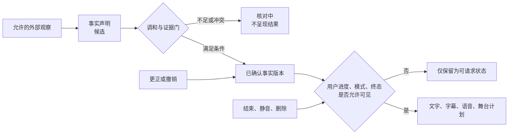
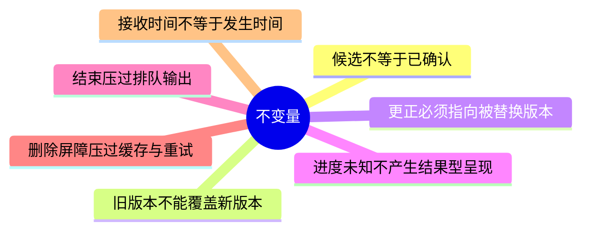
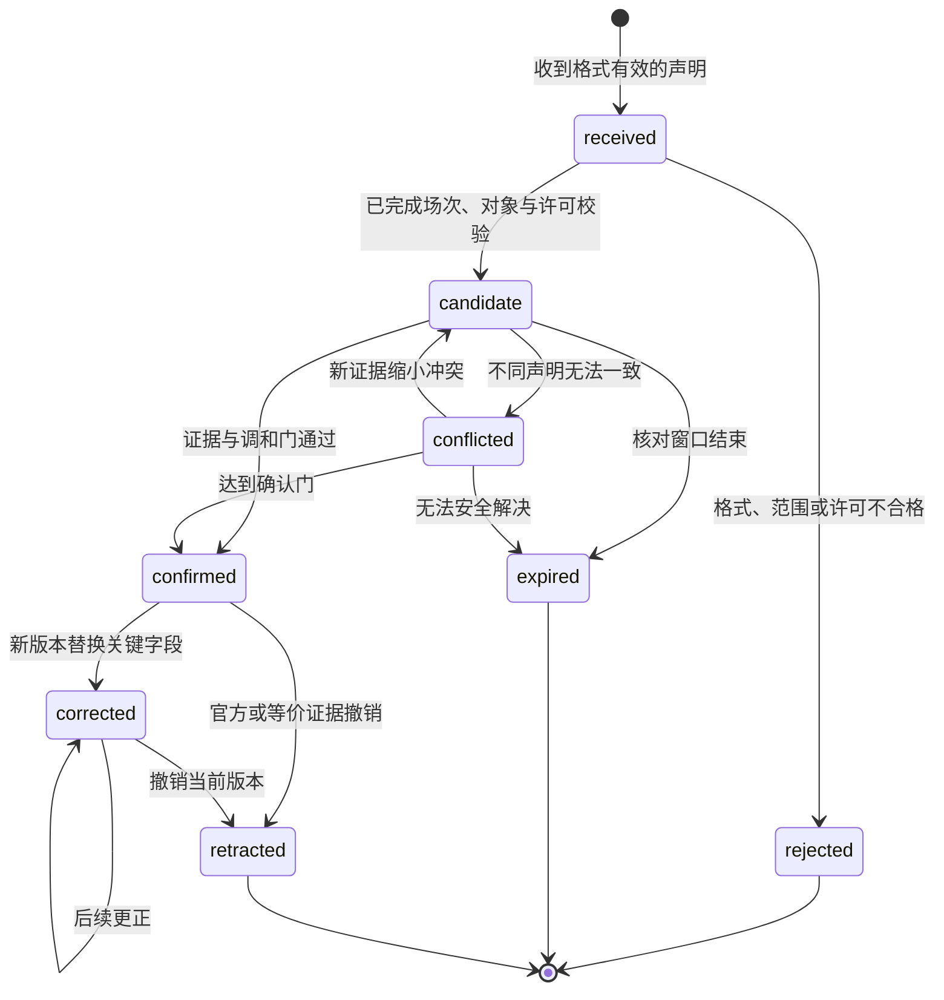
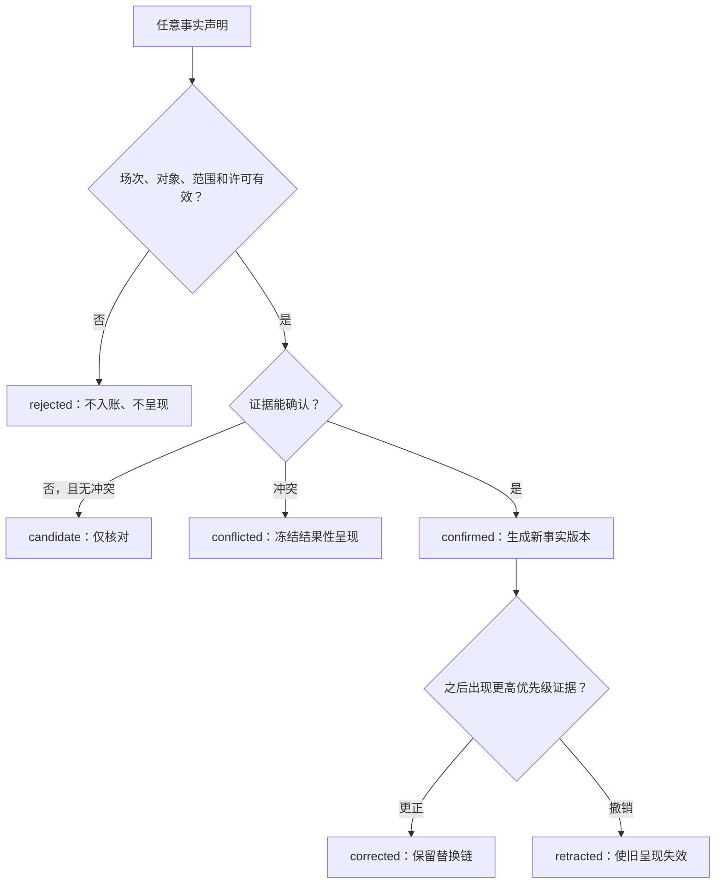
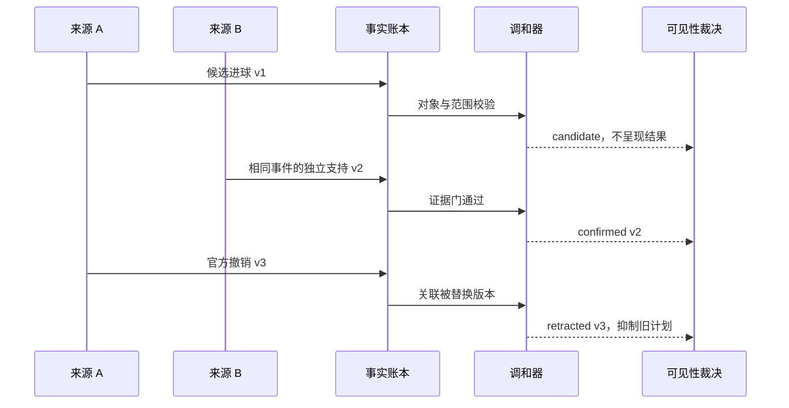
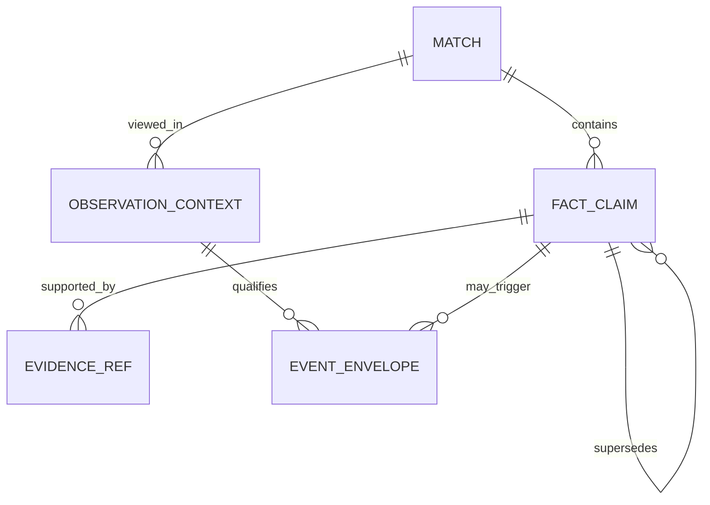
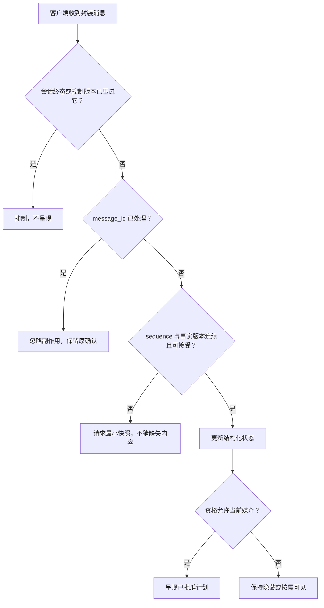
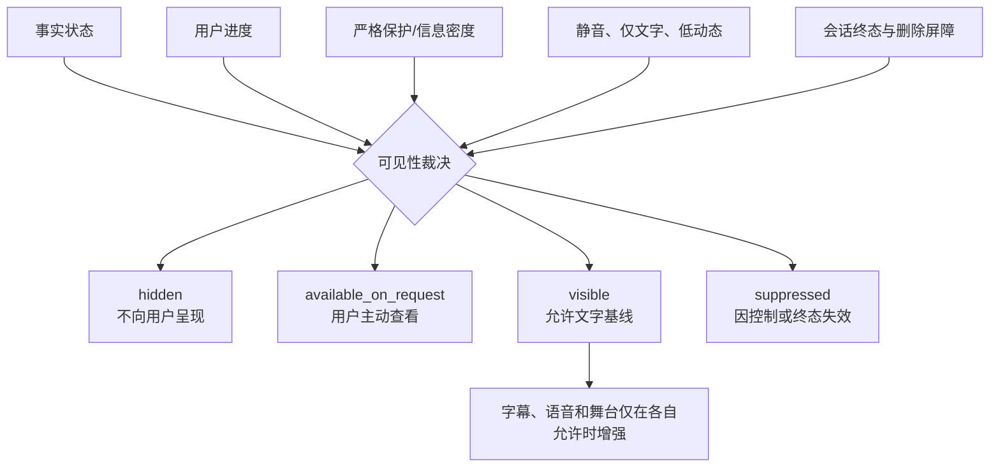
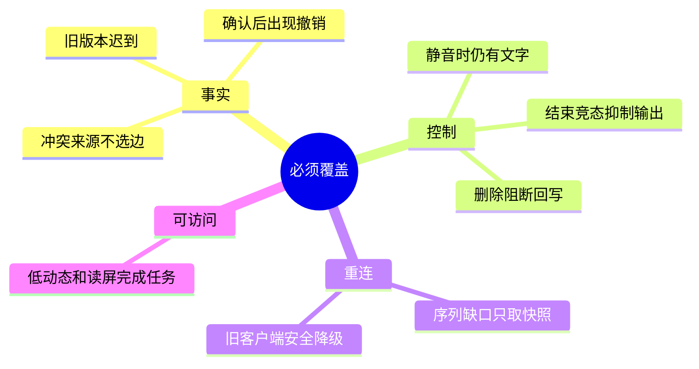
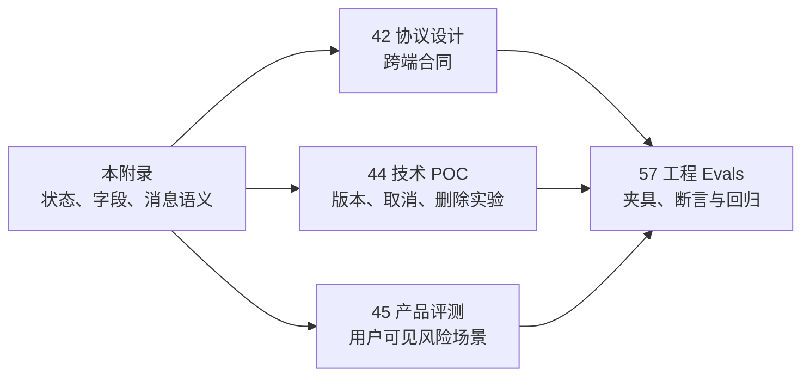

# 附录D：比赛事实状态机、数据字典与消息示例

> 文档类型：可复用领域参考  
> 适用阶段：产品、协议、POC 和工程 Evals 已经需要共享同一套事实、版本与可见性语言时  
> 决策状态：首轮字段与状态合同。字段用于表达已批准的边界，不允许用自由文本绕过事实确认、剧透保护或用户控制。  
> 公开资料访问日：2026-01-28。

## 1. 核心模型：信号不会自动变成用户事实



这套模型有四层对象：比赛本身、对比赛的事实声明、支持声明的证据引用、用户当场的观察与控制。角色表达和运营动作不属于事实层，不能直接写入或提升事实。

## 2. 不变量



- 每条 `fact_claim` 都属于一个场次、一个类型和一个版本；对象不清楚时保持候选或冲突。
- 接收时间、来源观察时间和比赛发生时间分别记录；不能用任一个冒充另一个。
- `candidate`、`conflicted`、`retracted` 不能驱动比分、结果性语气、兴奋动作或通知。
- 更正、撤回和会话结束必须使相关的旧呈现计划失效，而不是只改当前文本。
- 用户观察模式属于当前会话，不能因缓存、重连或角色记忆被悄悄放宽。
- 删除屏障建立后，旧队列、离线任务、缓存和恢复流程都不能重新写入或读取被覆盖的资料。

## 3. 事实状态机





## 4. 调和、版本与呈现



确认并不要求固定数量的来源，而要求该类型的确认规则、来源独立性、对象匹配和允许范围都被写清。冲突状态不选择“看起来更像真的”一方；它只说明当前不能把结果交给用户。

## 5. 数据字典



### 5.1 `match`：稳定的场次边界

- `match_id`：不透明稳定标识；不能由队名拼接，也不暴露外部账户。
- `competition_id`、`season_id`、`stage_id`：赛事、赛季和阶段范围；共同解释场次，不能只依赖自然年。
- `home_participant`、`away_participant`：规范化参与方对象；必须和允许来源的场次匹配。
- `scheduled_at`：计划开始时间，采用 RFC 3339；不是实际开球或当前进度。
- `status`、`status_version`：场次状态与单调版本；拒绝迟到的旧状态覆盖。
- `source_scope`：许可和可用来源范围；不能因后续方便扩大用途。

### 5.2 `fact_claim`：一条可追溯的事实声明

- `claim_id`：声明稳定标识；同一逻辑声明的新版本可关联但不能混写。
- `match_id`、`claim_type`、`subject`、`value`：所属场次、类型、对象和结构化值；自由文本不能替代这些字段。
- `occurred_at`、`received_at`、`source_observed_at`：发生、接收和来源观察时间；缺失就标未知。
- `knowledge_state`：`received`、`candidate`、`confirmed`、`conflicted`、`corrected`、`retracted`、`expired` 或 `rejected`。
- `version`、`supersedes`：单调版本与替换链；旧版本不得回写覆盖。
- `evidence_refs`、`confidence_note`：最小证据索引与可审计理由；不向普通用户泄露原始凭证。

### 5.3 `evidence_ref`：支持声明但不扩大资料范围

- `evidence_id`：单条证据标识；不等同于公开可浏览链接。
- `source_class`、`independence_group`：来源类别与独立性分组；多条同源转述不能伪装成独立支持。
- `source_received_at`、`integrity_status`：获取时刻与完整/缺字段/撤销等状态。
- `usage_scope`：该证据可支持什么类型的声明和什么用户范围；范围不自动外溢。

### 5.4 `observation_context`：用户当场可见性与控制

- `session_id`、`match_id`：当次交互与可选场次边界；不作为长期关系标识。
- `spoiler_mode`：严格保护、主动查看或允许更新等明确选择；必须用户可见、可改、可撤回。
- `information_density`、`audio_mode`、`motion_mode`：信息密度、声音和动态选项；静音和低动态不应让核心状态消失。
- `ended_at`、`control_version`：会话终态和控制版本；终态优先于任何迟到输出。
- `last_seen_fact_version`：用户确实看过的最后事实版本；仅用于解释更正，不是放宽剧透的授权。

### 5.5 `event_envelope`：跨通道投递封装

- `message_id`、`message_type`、`contract_version`：唯一性、消息族和合同版本。
- `occurred_at`、`published_at`、`sequence`：业务发生、允许分发和会话内顺序；三者分别表达不同语义。
- `causation_id`、`correlation_id`：上游原因与本次流程关联；不能放入私人原文或可识别资料。
- `payload`：与消息类型对应的经验证结构；禁止由客户端自由拼接。
- `visibility`：`hidden`、`available_on_request`、`visible` 或 `suppressed`；由事实、进度、模式和终态共同裁决。

## 6. 消息示例

### 6.1 候选事实：只进入核对

```json
{
  "message_id": "msg-1001",
  "message_type": "fact.candidate",
  "contract_version": "v1",
  "sequence": 18,
  "occurred_at": "2026-01-28T18:42:10Z",
  "published_at": "2026-01-28T18:42:14Z",
  "visibility": "hidden",
  "payload": {
    "claim_id": "claim-501",
    "match_id": "match-901",
    "knowledge_state": "candidate",
    "reason": "awaiting_reconciliation"
  }
}
```

### 6.2 已确认事实：仍要经过观察模式

```json
{
  "message_id": "msg-1002",
  "message_type": "fact.confirmed",
  "contract_version": "v1",
  "sequence": 19,
  "causation_id": "claim-501",
  "occurred_at": "2026-01-28T18:43:02Z",
  "published_at": "2026-01-28T18:43:05Z",
  "visibility": "available_on_request",
  "payload": {
    "claim_id": "claim-501-v2",
    "match_id": "match-901",
    "knowledge_state": "confirmed",
    "fact_version": 2
  }
}
```

### 6.3 更正或撤回：不能静默改写

```json
{
  "message_id": "msg-1003",
  "message_type": "fact.retracted",
  "contract_version": "v1",
  "sequence": 20,
  "occurred_at": "2026-01-28T18:46:40Z",
  "published_at": "2026-01-28T18:46:45Z",
  "visibility": "visible",
  "payload": {
    "claim_id": "claim-501-v3",
    "supersedes": "claim-501-v2",
    "knowledge_state": "retracted",
    "user_explanation": "此前状态已被撤回，当前不再作为比赛结果呈现。"
  }
}
```

### 6.4 会话结束：让迟到输出失效

```json
{
  "message_id": "msg-1004",
  "message_type": "session.ended",
  "contract_version": "v1",
  "sequence": 21,
  "occurred_at": "2026-01-28T18:47:00Z",
  "published_at": "2026-01-28T18:47:00Z",
  "visibility": "visible",
  "payload": {
    "session_id": "session-301",
    "control_version": 7,
    "suppress_after_sequence": 21,
    "user_explanation": "本场陪看已结束，不会再自动呈现内容。"
  }
}
```

### 6.5 问题说明：保留下一步，不泄露不该显示的内容

```json
{
  "message_id": "msg-1005",
  "message_type": "problem",
  "contract_version": "v1",
  "sequence": 22,
  "visibility": "visible",
  "payload": {
    "code": "FACTS_STILL_RECONCILING",
    "title": "比赛状态仍在核对中",
    "next_actions": ["查看已确认状态", "稍后主动刷新", "结束本场"],
    "spoiler_safe": true
  }
}
```

## 7. 顺序、去重与重连



幂等键用于用户动作：同一次结束、删除、保存选择或取消重复提交，必须返回同一已生效结果，而非制造多次声音、多个提醒或多个资料对象。

## 8. 可见性不是单独的“通知开关”



严格保护下，候选、冲突和任何可推断结果的信息都保持 `hidden`；用户主动查看也只能得到已经确认且在其明确范围内可见的内容。静音改变输出媒介，不改变事实状态；结束和删除改变后续可见性与读写许可。

## 9. 首轮验收场景



每个场景采用合成或获授权输入，记录触发序列、预期领域状态、禁止的用户可见结果和可重放步骤。事实、控制和资料权利属于硬门：一旦失败，不能用满意度、模型评分或平均延迟抵消。

## 10. 与产品、POC 和工程 Evals 的交接



附录只统一术语和可复用对象，不做用户价值、技术选型或发布决定。任何字段变更都必须同时审阅：它是否改变事实等级、可见性、用户控制、资料范围或 Evals 的可重放场景。

## 11. 公开资料

- [IETF, RFC 3339](https://www.rfc-editor.org/rfc/rfc3339)：时间戳表达与时区语义。
- [IETF, RFC 6455](https://www.rfc-editor.org/rfc/rfc6455)：实时消息通道与关闭语义。
- [IETF, RFC 9110](https://www.rfc-editor.org/rfc/rfc9110)：状态、条件与幂等概念。
- [IETF, RFC 7807](https://www.rfc-editor.org/rfc/rfc7807)：结构化问题说明。
- [OWASP, API Security Top 10](https://owasp.org/www-project-api-security/)：对象授权和资料暴露风险。
